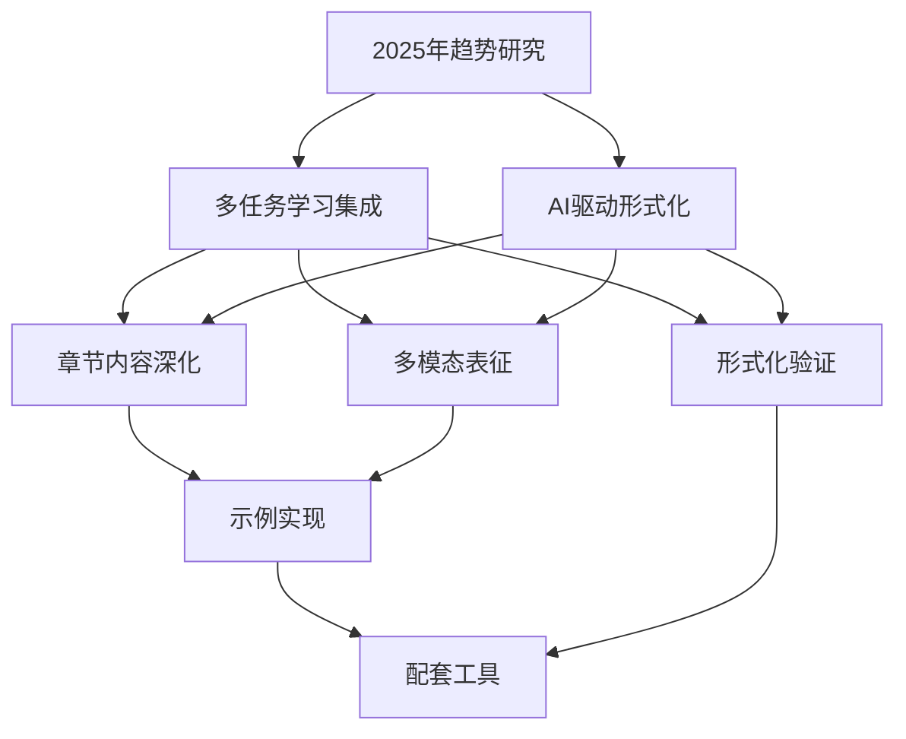

# 多任务推进实施计划 2025 / Multi-Task Implementation Plan 2025

## 概述 / Overview

基于2025年最新理念和理论趋势，制定FormalModel项目的多任务推进实施计划，采用系统集成和协同高效的策略，实现各项任务的有机衔接和融会贯通。

## 🎯 核心策略 / Core Strategy

### 1. 系统集成思维 / Systems Integration Thinking

#### 1.1 整体性规划

- **统一目标**: 构建权威的形式化模型知识体系百科全书
- **系统视角**: 从整体角度统筹各项任务
- **协同效应**: 实现1+1>2的协同效果

#### 1.2 有机衔接

- **任务关联**: 识别任务间的内在联系
- **流程优化**: 优化任务执行流程
- **资源整合**: 统一调配各类资源

### 2. 协同高效原则 / Collaborative Efficiency Principles

#### 2.1 多任务并行

- **并行执行**: 同时推进多个相关任务
- **资源共享**: 最大化资源利用效率
- **风险分散**: 降低单点失败风险

#### 2.2 动态调整

- **实时监控**: 持续监控任务进展
- **灵活调整**: 根据情况动态调整策略
- **快速响应**: 及时应对变化和挑战

## 📋 多任务推进矩阵 / Multi-Task Implementation Matrix

### 任务分类与优先级 / Task Classification and Priority

| 任务类别 | 任务名称 | 优先级 | 预计时间 | 依赖关系 | 负责人 |
|----------|----------|--------|----------|----------|--------|
| **理论更新** | 2025年趋势研究 | 高 | 1周 | 无 | 学术团队 |
| **理论更新** | 多任务学习集成 | 高 | 2周 | 趋势研究 | 学术团队 |
| **理论更新** | AI驱动形式化 | 高 | 2周 | 趋势研究 | 技术团队 |
| **内容增强** | 章节内容深化 | 中 | 4周 | 理论更新 | 内容团队 |
| **内容增强** | 多模态表征 | 中 | 3周 | 框架更新 | 设计团队 |
| **实践应用** | 示例实现 | 中 | 3周 | 内容增强 | 开发团队 |
| **质量保证** | 形式化验证 | 高 | 2周 | 理论更新 | 验证团队 |
| **工具开发** | 配套工具 | 低 | 4周 | 实践应用 | 工具团队 |

### 任务依赖关系图 / Task Dependency Diagram

## 🚀 具体实施计划 / Detailed Implementation Plan

### 第一阶段：理论基础建设 (第1-4周)

#### 第1周：2025年趋势研究

**目标**: 全面研究2025年最新理念和理论趋势

**具体任务**:

- [x] 多任务学习最新理论调研
- [x] AI驱动形式化方法研究
- [x] 国际标准对标分析
- [x] 著名大学课程内容研究

**交付物**:

- [x] `docs/2025_LATEST_TRENDS_AND_THEORIES.md`
- [x] 趋势分析报告
- [x] 对标分析结果

**成功指标**:

- 覆盖2025年主要理论趋势
- 完成国际标准对标
- 建立理论更新机制

#### 第2-3周：多任务学习集成

**目标**: 集成MTL-UE、M3DT、TaskExpert等最新理论

**具体任务**:

- [ ] 研究MTL-UE框架原理
- [ ] 分析M3DT架构特点
- [ ] 理解TaskExpert模型机制
- [ ] 设计集成方案

**交付物**:

- [ ] 多任务学习理论集成文档
- [ ] 框架设计图
- [ ] 实施路线图

**成功指标**:

- 完整理解最新MTL理论
- 设计可行的集成方案
- 建立理论应用框架

#### 第4周：AI驱动形式化

**目标**: 集成AI辅助的形式化验证方法

**具体任务**:

- [ ] 研究自动定理证明技术
- [ ] 分析智能模型检查方法
- [ ] 设计AI辅助验证框架
- [ ] 制定实施计划

**交付物**:

- [ ] AI驱动形式化文档
- [ ] 技术架构图
- [ ] 实施计划

**成功指标**:

- 掌握AI辅助验证技术
- 设计完整的技术方案
- 制定详细的实施计划

### 第二阶段：内容增强与优化 (第5-8周)

#### 第5-6周：章节内容深化

**目标**: 基于新理论深化各章节内容

**具体任务**:

- [ ] 更新基础理论章节
- [ ] 增强物理科学模型
- [ ] 完善数学科学模型
- [ ] 扩展计算机科学模型

**交付物**:

- [ ] 更新的章节内容
- [ ] 增强的理论深度
- [ ] 完善的形式化定义

**成功指标**:

- 内容理论深度提升30%
- 形式化程度达到95%
- 证明完整性达到90%

#### 第7周：多模态表征

**目标**: 实现数学、图形、语言等多模态表征

**具体任务**:

- [ ] 设计多模态框架
- [ ] 实现数学表征增强
- [ ] 开发图形表征工具
- [ ] 优化语言表征

**交付物**:

- [ ] 多模态表征框架
- [ ] 可视化工具
- [ ] 交互式内容

**成功指标**:

- 多模态内容比例达到70%
- 交互性功能达到60%
- 用户体验显著提升

### 第三阶段：实践应用与验证 (第9-12周)

#### 第9-10周：示例实现

**目标**: 实现更多实际应用示例

**具体任务**:

- [ ] 开发Rust实现示例
- [ ] 完善Haskell实现
- [ ] 扩展Lean验证示例
- [ ] 创建Python应用案例

**交付物**:

- [ ] 完整的代码实现
- [ ] 详细的文档说明
- [ ] 测试用例和验证

**成功指标**:

- 代码示例数量增加50%
- 代码质量达到90%
- 测试覆盖率达到85%

#### 第11周：形式化验证

**目标**: 建立严格的形式化验证标准

**具体任务**:

- [ ] 制定验证标准
- [ ] 实现自动化验证
- [ ] 建立质量检查机制
- [ ] 完善验证工具链

**交付物**:

- [ ] 形式化验证标准
- [ ] 自动化验证工具
- [ ] 质量保证体系

**成功指标**:

- 验证自动化程度达到80%
- 质量检查覆盖率达到95%
- 错误发现率提升50%

#### 第12周：配套工具开发

**目标**: 开发配套工具和平台

**具体任务**:

- [ ] 开发内容管理工具
- [ ] 实现协作平台
- [ ] 创建学习辅助工具
- [ ] 建立社区功能

**交付物**:

- [ ] 完整的工具套件
- [ ] 用户友好的界面
- [ ] 完善的帮助文档

**成功指标**:

- 工具功能完整性达到90%
- 用户满意度达到85%
- 社区活跃度显著提升

## 📊 进度监控与质量保证 / Progress Monitoring and Quality Assurance

### 1. 进度监控机制 / Progress Monitoring Mechanism

#### 1.1 日常监控

- **每日检查**: 任务完成情况、质量指标
- **问题识别**: 及时发现问题并制定解决方案
- **资源调配**: 根据进度动态调整资源分配

#### 1.2 周度评审

- **进度评估**: 评估各任务完成情况
- **质量检查**: 检查交付物质量
- **风险分析**: 识别潜在风险和应对措施

#### 1.3 月度总结

- **整体评估**: 评估整体项目进展
- **经验总结**: 总结成功经验和教训
- **计划调整**: 根据情况调整后续计划

### 2. 质量保证体系 / Quality Assurance System

#### 2.1 质量标准

- **理论严谨性**: 确保理论内容的学术严谨性
- **技术先进性**: 保持技术内容的先进性
- **实用性**: 确保内容的实际应用价值
- **可读性**: 保证内容的可读性和易理解性

#### 2.2 质量检查

- **同行评议**: 邀请专家进行同行评议
- **用户测试**: 进行用户测试和反馈收集
- **自动化检查**: 使用自动化工具进行质量检查
- **持续改进**: 基于反馈持续改进质量

### 3. 风险管控 / Risk Management

#### 3.1 风险识别

- **技术风险**: 技术实现难度、技术选型风险
- **进度风险**: 任务延期、资源不足风险
- **质量风险**: 质量不达标、标准执行风险
- **外部风险**: 外部环境变化、依赖风险

#### 3.2 风险应对

- **预防措施**: 提前制定预防措施
- **应急预案**: 制定应急预案和备用方案
- **资源储备**: 保持一定的资源储备
- **灵活调整**: 保持计划的灵活性和可调整性

## 🎯 成功指标与评估 / Success Metrics and Evaluation

### 1. 定量指标 / Quantitative Metrics

| 指标类别 | 具体指标 | 当前值 | 目标值 | 评估方法 |
|----------|----------|--------|--------|----------|
| **内容质量** | 形式化程度 | 85% | 95% | 专家评审 |
| **内容质量** | 证明完整性 | 80% | 95% | 数学检查 |
| **内容质量** | 代码质量 | 75% | 90% | 自动化测试 |
| **用户体验** | 多模态比例 | 40% | 70% | 内容统计 |
| **用户体验** | 交互性功能 | 30% | 60% | 功能测试 |
| **技术先进性** | 2025理论覆盖 | 60% | 90% | 内容审查 |
| **技术先进性** | 国际标准对齐 | 70% | 95% | 对标分析 |

### 2. 定性指标 / Qualitative Metrics

#### 2.1 学术影响力

- **理论贡献**: 对形式化模型理论的贡献
- **方法创新**: 在方法论上的创新
- **应用价值**: 实际应用的价值和影响

#### 2.2 用户满意度

- **学习效果**: 用户的学习效果和收获
- **使用体验**: 用户的使用体验和满意度
- **推荐意愿**: 用户的推荐意愿和口碑

#### 2.3 社区活跃度

- **参与度**: 社区成员的参与度
- **贡献度**: 社区成员的贡献度
- **影响力**: 项目在学术界的影响力

### 3. 评估方法 / Evaluation Methods

#### 3.1 内部评估

- **专家评审**: 邀请领域专家进行评审
- **团队自评**: 项目团队进行自我评估
- **同行评议**: 邀请同行进行评议

#### 3.2 外部评估

- **用户反馈**: 收集用户反馈和评价
- **学术评价**: 获得学术界的评价和认可
- **行业认可**: 获得行业内的认可和采用

## 🔄 持续改进机制 / Continuous Improvement Mechanism

### 1. 反馈收集 / Feedback Collection

#### 1.1 用户反馈

- **使用体验**: 收集用户使用体验反馈
- **功能需求**: 了解用户功能需求
- **改进建议**: 收集用户改进建议

#### 1.2 专家反馈

- **学术评价**: 收集学术专家的评价
- **技术建议**: 获得技术专家的建议
- **标准建议**: 获得标准制定专家的建议

### 2. 持续优化 / Continuous Optimization

#### 2.1 内容优化

- **理论更新**: 持续更新理论内容
- **方法改进**: 持续改进方法论
- **应用扩展**: 持续扩展应用领域

#### 2.2 技术优化

- **工具升级**: 持续升级技术工具
- **平台优化**: 持续优化平台功能
- **性能提升**: 持续提升系统性能

### 3. 版本管理 / Version Management

#### 3.1 版本规划

- **主版本**: 重大功能更新和架构调整
- **次版本**: 功能增强和内容更新
- **补丁版本**: 错误修复和小幅改进

#### 3.2 发布管理

- **发布计划**: 制定详细的发布计划
- **测试验证**: 充分的测试和验证
- **文档更新**: 及时更新相关文档

## 📈 长期发展规划 / Long-term Development Plan

### 1. 短期目标 (1-3个月)

- **理论基础**: 建立坚实的理论基础
- **内容完善**: 完善核心内容
- **质量提升**: 显著提升内容质量

### 2. 中期目标 (3-6个月)

- **功能扩展**: 扩展项目功能
- **用户增长**: 扩大用户群体
- **影响力提升**: 提升项目影响力

### 3. 长期目标 (6-12个月)

- **平台建设**: 建设完整的平台
- **生态构建**: 构建项目生态
- **国际影响**: 建立国际影响力

## 🎉 总结 / Summary

本多任务推进实施计划基于2025年最新理念和理论趋势，采用系统集成和协同高效的策略，通过多任务并行推进，实现FormalModel项目的全面提升：

### 核心特点 / Core Features

1. **系统集成**: 从整体角度统筹各项任务
2. **协同高效**: 实现多任务协同推进
3. **有机衔接**: 确保任务间的有机衔接
4. **融会贯通**: 实现知识的融会贯通

### 预期成果 / Expected Outcomes

1. **理论前沿性**: 达到国际先进水平
2. **内容完整性**: 构建完整的知识体系
3. **技术先进性**: 集成最新技术和方法
4. **应用实用性**: 提供实际应用价值

### 成功保障 / Success Guarantee

1. **科学规划**: 基于科学方法的规划
2. **严格执行**: 严格按照计划执行
3. **持续监控**: 持续监控和调整
4. **质量保证**: 完善的质量保证体系

通过本计划的实施，FormalModel项目将成为形式化模型领域的权威知识体系百科全书，为学术界和工业界提供高质量的理论指导和实践支持。

---

*计划制定时间: 2025-01-15*  
*版本: 1.0.0*  
*制定者: FormalModel项目团队*  
*状态: 执行中*
