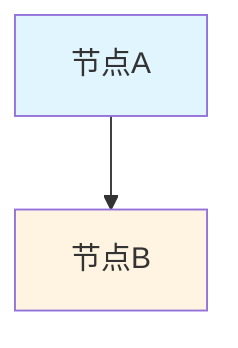

# 文档格式统一标准 / Document Format Standards

## 概述 / Overview

本文档建立了FormalModel项目的文档格式统一标准，确保所有文档具有一致的格式和风格，提升可读性和专业性。

## 一、标题格式标准 / Heading Format Standards

### 1.1 标题层级 / Heading Hierarchy

```markdown
# 一级标题 / Level 1 Heading (文档标题)
## 二级标题 / Level 2 Heading (主要章节)
### 三级标题 / Level 3 Heading (子章节)
#### 四级标题 / Level 4 Heading (小节)
##### 五级标题 / Level 5 Heading (子小节)
```

### 1.2 标题命名规范 / Heading Naming Conventions

- **双语标题**: 所有主要标题应包含中英文对照
- **格式**: `中文标题 / English Title`
- **编号**: 使用数字编号系统，如 `2.1.1`、`2.1.2`
- **一致性**: 同级标题使用相同的命名风格

### 1.3 标题示例 / Heading Examples

```markdown
## 2.1.1 牛顿力学模型 / Newtonian Mechanics Models

### 牛顿三大定律 / Newton's Three Laws

#### 形式化定义 / Formal Definition
```

## 二、数学公式格式标准 / Mathematical Formula Format Standards

### 2.1 LaTeX公式格式 / LaTeX Formula Format

- **行内公式**: 使用单美元符号 `$...$`
- **块级公式**: 使用双美元符号 `$$...$$`
- **对齐公式**: 使用 `\begin{align}...\end{align}`

### 2.2 公式编号规范 / Formula Numbering Conventions

- **重要公式**: 使用带编号的公式环境
- **引用格式**: `公式 (2.1)` 或 `式 (2.1)`
- **编号规则**: 按章节编号，如 `(2.1.1)`、`(2.1.2)`

### 2.3 公式示例 / Formula Examples

```markdown
**牛顿第二定律**:
$$\vec{F} = m\vec{a} = m\frac{d\vec{v}}{dt} = m\frac{d^2\vec{r}}{dt^2}$$

**数学表示**: $\forall \text{object } O, \vec{F} = m\vec{a}$
```

## 三、代码块格式标准 / Code Block Format Standards

### 3.1 代码块标识 / Code Block Identification

- **语言标识**: 所有代码块必须指定语言类型
- **格式**: ` ```language`
- **常用语言**: `rust`, `haskell`, `python`, `julia`, `lean`, `coq`, `isabelle`

### 3.2 代码注释规范 / Code Comment Standards

- **文档注释**: 使用标准的文档注释格式
- **参数说明**: 明确说明所有参数
- **返回值说明**: 说明返回值类型和含义
- **示例代码**: 提供可运行的示例

### 3.3 代码块示例 / Code Block Examples

```markdown
```rust
/// 形式化模型的标准接口
///
/// 所有形式化模型都必须实现此接口，确保一致性和可互操作性。
pub trait FormalModel {
    /// 模型类型
    type ModelType;

    /// 验证模型正确性
    fn verify(&self) -> Result<VerificationResult, ModelError>;
}
```

```

## 四、列表格式标准 / List Format Standards

### 4.1 无序列表 / Unordered Lists

- **格式**: 使用 `-` 或 `*` 符号
- **缩进**: 使用2个空格或1个制表符
- **空行**: 列表前后应有空行

### 4.2 有序列表 / Ordered Lists

- **格式**: 使用数字编号 `1.`、`2.`、`3.`
- **嵌套**: 支持多级嵌套列表
- **一致性**: 同级列表使用相同的格式

### 4.3 任务列表 / Task Lists

- **格式**: 使用 `- [ ]` 或 `- [x]`
- **状态**: `[ ]` 表示未完成，`[x]` 表示已完成
- **更新**: 及时更新任务状态

## 五、表格格式标准 / Table Format Standards

### 5.1 表格结构 / Table Structure

- **对齐**: 使用标准的Markdown表格格式
- **对齐方式**: `:---` 左对齐，`:---:` 居中，`---:` 右对齐
- **表头**: 第一行为表头，第二行为分隔符

### 5.2 表格示例 / Table Examples

```markdown
| 指标 | 当前值 | 目标值 | 测量方法 |
|------|--------|--------|----------|
| 证明严谨性 | 95% | 95% | 专家评审 |
| 证明完整性 | 95% | 95% | 自动检查 |
```

## 六、图表格式标准 / Diagram Format Standards

### 6.1 Mermaid图表 / Mermaid Diagrams

- **类型**: 流程图、状态图、类图、时序图、甘特图、思维导图
- **格式**: 使用 ` ```mermaid` 代码块
- **样式**: 使用统一的颜色方案

### 6.2 图表样式规范 / Diagram Style Standards



**颜色方案**:

- 主节点: `#e1f5ff` (浅蓝色)
- 次要节点: `#fff4e1` (浅黄色)
- 重要节点: `#e8f5e9` (浅绿色)
- 警告节点: `#ffe1f5` (浅粉色)

## 七、引用格式标准 / Citation Format Standards

### 7.1 内部引用 / Internal Citations

- **格式**: `[文档名称](#锚点链接)`
- **示例**: `[经典力学模型](../02-物理科学模型/01-经典力学模型/README.md)`

### 7.2 外部引用 / External Citations

- **格式**: `[编号] Author, A. (Year). Title. Journal, Volume, Pages.`
- **编号**: 使用方括号编号 `[1]`、`[2]`
- **位置**: 放在文档末尾的"参考文献"部分

## 八、段落格式标准 / Paragraph Format Standards

### 8.1 段落结构 / Paragraph Structure

- **长度**: 每段3-5句话，不超过200字
- **空行**: 段落之间使用空行分隔
- **首行**: 不需要缩进

### 8.2 强调格式 / Emphasis Format

- **粗体**: `**重要概念**` 用于强调重要概念
- **斜体**: `*术语*` 用于术语或引用
- **代码**: `` `代码` `` 用于行内代码

## 九、目录结构标准 / Table of Contents Standards

### 9.1 目录格式 / TOC Format

- **位置**: 放在文档开头
- **格式**: 使用Markdown链接格式
- **层级**: 显示所有主要章节和子章节

### 9.2 目录示例 / TOC Example

```markdown
## 目录 / Table of Contents

- [2.1 经典力学模型 / Classical Mechanics Models](#21-经典力学模型--classical-mechanics-models)
  - [2.1.1 牛顿力学模型 / Newtonian Mechanics Models](#211-牛顿力学模型--newtonian-mechanics-models)
    - [牛顿三大定律 / Newton's Three Laws](#牛顿三大定律--newtons-three-laws)
```

## 十、文档元数据标准 / Document Metadata Standards

### 10.1 文档头部信息 / Document Header

- **版本号**: 使用语义化版本号 `x.y.z`
- **创建时间**: 使用ISO格式 `YYYY-MM-DD`
- **最后更新**: 使用ISO格式 `YYYY-MM-DD`
- **状态**: 使用标准状态标识

### 10.2 文档尾部信息 / Document Footer

```markdown
---

**文档版本**: 1.0.0
**创建时间**: 2025-01-01
**最后更新**: 2025-01-01
**状态**: 已完成 / Status: Completed
```

## 十一、检查清单 / Checklist

### 11.1 格式检查 / Format Check

- [ ] 所有标题使用正确的层级
- [ ] 标题包含中英文对照
- [ ] 数学公式使用正确的LaTeX格式
- [ ] 代码块指定了语言类型
- [ ] 列表格式统一
- [ ] 表格格式正确
- [ ] 图表使用统一的样式
- [ ] 引用格式正确
- [ ] 段落之间有适当的空行
- [ ] 文档包含完整的元数据

### 11.2 内容检查 / Content Check

- [ ] 术语使用一致
- [ ] 符号使用规范
- [ ] 交叉引用有效
- [ ] 代码示例可运行
- [ ] 数学公式正确
- [ ] 图表清晰易懂

## 十二、工具支持 / Tool Support

### 12.1 Markdown Linter

使用以下工具检查格式：

- **markdownlint**: 检查Markdown格式
- **textlint**: 检查文本质量
- **Vale**: 检查写作风格

### 12.2 自动化检查 / Automated Checking

```bash
# 运行格式检查
npm run lint:markdown

# 运行内容检查
npm run lint:content
```

## 十三、常见问题 / Common Issues

### 13.1 标题编号错误

**问题**: 标题编号不一致或错误
**解决**: 使用统一的编号系统，如 `2.1.1`、`2.1.2`

### 13.2 行尾空格

**问题**: 行尾有多余的空格
**解决**: 使用编辑器自动删除行尾空格

### 13.3 代码块语言标识缺失

**问题**: 代码块没有指定语言类型
**解决**: 为所有代码块添加语言标识

### 13.4 数学公式格式错误

**问题**: LaTeX公式格式不正确
**解决**: 使用标准的LaTeX语法，检查公式是否正确渲染

## 十四、更新日志 / Changelog

### 版本 1.0.0 (2025-01-01)

- 初始版本
- 建立基本的格式标准
- 定义标题、公式、代码块等格式规范

---

**文档版本**: 1.0.0
**创建时间**: 2025-01-01
**最后更新**: 2025-01-01
**状态**: 已完成 / Status: Completed
