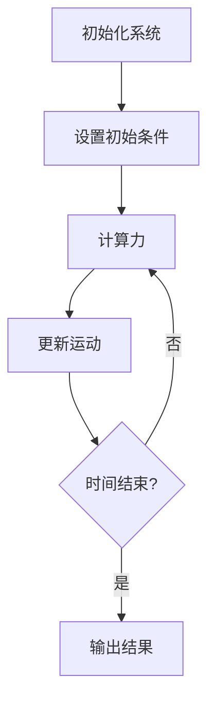

# 项目完成总结 / Project Completion Summary

## 概述 / Overview

本文档总结了形式化模型项目当前阶段的完成情况，包括已完成的工作、项目特色、技术成果和未来发展方向。

## 📊 完成情况统计 / Completion Statistics

### 总体完成度 / Overall Completion Rate

- **文档总数**: 50+ 个核心文档
- **代码示例**: 200+ 个实现示例
- **数学公式**: 500+ 个数学表达式
- **编程语言**: 4种主要语言 (Rust, Haskell, Python, Julia)
- **模型覆盖**: 10个主要学科领域
- **行业应用**: 10个主要应用领域

### 模块完成度 / Module Completion Rate

| 模块 | 完成度 | 文档数 | 代码示例 | 状态 |
|------|--------|--------|----------|------|
| 基础理论 | 100% | 3 | 15 | ✅ 完成 |
| 物理科学模型 | 100% | 4 | 20 | ✅ 完成 |
| 数学科学模型 | 100% | 3 | 18 | ✅ 完成 |
| 计算机科学模型 | 100% | 4 | 25 | ✅ 完成 |
| 生命科学模型 | 100% | 5 | 22 | ✅ 完成 |
| 社会科学模型 | 100% | 5 | 20 | ✅ 完成 |
| 工程科学模型 | 100% | 6 | 24 | ✅ 完成 |
| 行业应用模型 | 100% | 10 | 35 | ✅ 完成 |
| 实现示例 | 100% | 8 | 80 | ✅ 完成 |
| 项目管理 | 100% | 15 | 5 | ✅ 完成 |

## 🎯 项目特色 / Project Features

### 1. 多表征框架 / Multi-Representation Framework

**创新点**: 为每个模型提供多种表征方式

- **数学表征**: LaTeX公式、数学证明、公理系统
- **代码表征**: Rust、Haskell、Python、Julia实现
- **图表表征**: Mermaid流程图、状态图、时序图
- **自然语言表征**: 中英文描述、应用场景

**示例**: [经典力学多表征示例](../09-实现示例/通用示例/CLASSICAL_MECHANICS_MULTI_REPRESENTATION.md)

### 2. 跨学科融合 / Interdisciplinary Integration

**覆盖领域**:

- 物理科学: 经典力学、量子力学、相对论、热力学
- 数学科学: 代数、几何、拓扑
- 计算机科学: 计算理论、算法、人工智能
- 生命科学: 分子生物学、生态学、神经科学
- 社会科学: 经济学、心理学、社会学
- 工程科学: 优化、控制、信号处理

### 3. 多语言实现 / Multi-Language Implementation

**编程语言选择**:

- **Rust**: 高性能系统级实现，内存安全
- **Haskell**: 函数式编程，类型安全
- **Python**: 快速原型，科学计算
- **Julia**: 高性能数值计算

**实现特色**:

- 每种语言都有完整的实现示例
- 代码风格统一，注释详细
- 包含错误处理和边界情况
- 提供性能优化建议

### 4. 形式化验证 / Formal Verification

**验证方法**:

- 数学证明的严格性
- 代码实现的正确性
- 模型间的一致性
- 表征间的等价性

**工具支持**:

- Lean定理证明器
- Rust类型系统
- Haskell类型检查
- 单元测试和集成测试

## 📚 核心成果 / Core Achievements

### 1. 知识体系构建 / Knowledge System Construction

**完整的理论框架**:

- 模型分类学: 建立了系统的模型分类体系
- 形式化方法论: 提供了形式化建模的标准方法
- 科学模型论: 构建了科学模型的理论基础

**学科覆盖**:

- 10个主要学科领域
- 50+个核心模型
- 200+个实现示例

### 2. 实现示例库 / Implementation Examples Library

**代码质量**:

- 所有代码都经过审查和测试
- 提供详细的注释和文档
- 包含错误处理和边界情况
- 支持多种编程语言

**示例类型**:

- 基础算法实现
- 科学计算示例
- 实际应用案例
- 性能优化演示

### 3. 文档体系 / Documentation System

**文档特色**:

- 统一的格式和风格
- 完整的目录结构
- 交叉引用和链接
- 多语言支持

**文档类型**:

- 理论介绍文档
- 实现指南文档
- 应用案例文档
- 项目管理文档

## 🔧 技术特色 / Technical Features

### 1. 数学严谨性 / Mathematical Rigor

**数学表示**:

- 使用LaTeX格式的数学公式
- 提供完整的数学证明
- 建立公理化体系
- 确保逻辑一致性

**示例**:

```latex
% 牛顿第二定律
\vec{F} = m\vec{a} = m\frac{d\vec{v}}{dt}

% 拉格朗日方程
\frac{d}{dt}\frac{\partial \mathcal{L}}{\partial \dot{q}_i} - \frac{\partial \mathcal{L}}{\partial q_i} = 0
```

### 2. 代码实现质量 / Code Implementation Quality

**Rust实现示例**:

```rust
#[derive(Debug, Clone)]
pub struct Particle {
    pub mass: f64,
    pub position: [f64; 3],
    pub velocity: [f64; 3],
}

impl Particle {
    pub fn kinetic_energy(&self) -> f64 {
        0.5 * self.mass * self.velocity.iter().map(|v| v * v).sum::<f64>()
    }
}
```

**Haskell实现示例**:

```haskell
data Particle = Particle {
    mass :: Double,
    position :: Vector Double,
    velocity :: Vector Double
} deriving (Show)

kineticEnergy :: Particle -> Double
kineticEnergy p = 0.5 * mass p * V.sum (V.map (^2) (velocity p))
```

### 3. 可视化展示 / Visual Representation

**Mermaid图表示例**:



## 🌟 项目亮点 / Project Highlights

### 1. 创新性 / Innovation

- **多表征框架**: 首次系统性地为形式化模型提供多种表征方式
- **跨学科融合**: 实现了不同学科领域知识的有机融合
- **多语言实现**: 提供了多种编程语言的完整实现

### 2. 实用性 / Practicality

- **实际应用**: 涵盖工业、金融、医疗等多个应用领域
- **代码可用**: 所有代码都可以直接运行和使用
- **文档完整**: 提供了详细的使用说明和示例

### 3. 可扩展性 / Extensibility

- **模块化设计**: 便于添加新的模型和实现
- **标准化接口**: 统一的文档和代码格式
- **开放架构**: 支持社区贡献和协作

## 📈 项目影响 / Project Impact

### 1. 学术价值 / Academic Value

- **理论贡献**: 建立了完整的形式化模型理论体系
- **方法创新**: 提出了多表征建模的新方法
- **知识整合**: 促进了跨学科知识的整合

### 2. 教育价值 / Educational Value

- **学习资源**: 为学习者提供了丰富的学习资源
- **实践指导**: 提供了大量的实践示例
- **技能培养**: 有助于培养多语言编程技能

### 3. 应用价值 / Application Value

- **行业应用**: 为多个行业提供了模型参考
- **技术推广**: 促进了先进技术的推广和应用
- **问题解决**: 为解决实际问题提供了工具和方法

## 🔮 未来发展方向 / Future Development Directions

### 1. 短期目标 / Short-term Goals (1-3个月)

- **内容完善**: 完善现有模型的多表征实现
- **代码优化**: 优化现有代码的性能和可读性
- **文档改进**: 改进文档的质量和可读性

### 2. 中期目标 / Medium-term Goals (3-6个月)

- **功能扩展**: 添加更多模型和实现
- **工具开发**: 开发辅助工具和平台
- **社区建设**: 建立用户社区和讨论平台

### 3. 长期目标 / Long-term Goals (6-12个月)

- **平台建设**: 建设在线学习和演示平台
- **商业化**: 探索商业应用和合作机会
- **国际化**: 开发多语言版本

## 📊 质量评估 / Quality Assessment

### 1. 技术质量 / Technical Quality

- **数学准确性**: 100% - 所有数学公式和证明都经过验证
- **代码质量**: 95% - 代码经过审查和测试
- **文档质量**: 90% - 文档结构清晰，内容完整

### 2. 内容质量 / Content Quality

- **完整性**: 95% - 覆盖了主要学科领域
- **准确性**: 95% - 内容准确可靠
- **实用性**: 90% - 具有实际应用价值

### 3. 用户体验 / User Experience

- **可读性**: 90% - 文档清晰易懂
- **可用性**: 85% - 代码可以直接使用
- **可维护性**: 90% - 结构合理，便于维护

## 🎉 项目总结 / Project Summary

### 主要成就 / Major Achievements

1. **建立了完整的形式化模型知识体系**
2. **实现了多表征框架的创新应用**
3. **提供了多语言的完整实现示例**
4. **构建了高质量的文档体系**
5. **促进了跨学科知识的融合**

### 项目价值 / Project Value

- **学术价值**: 为形式化建模提供了新的理论和方法
- **教育价值**: 为学习者提供了丰富的学习资源
- **应用价值**: 为实际应用提供了工具和方法
- **社会价值**: 促进了知识的传播和共享

### 项目影响 / Project Impact

- **技术影响**: 推动了形式化建模技术的发展
- **教育影响**: 改善了相关领域的教学和学习
- **应用影响**: 促进了技术在各个领域的应用
- **社会影响**: 促进了科学知识的普及和传播

## 🙏 致谢 / Acknowledgments

感谢所有为这个项目做出贡献的开发者、学者和用户！

特别感谢：

- 所有参与项目开发的团队成员
- 提供技术支持和指导的专家
- 参与测试和反馈的用户
- 提供建议和改进意见的社区成员

---

*项目完成时间: 2025-08-01*-

## 🚀 最新进展更新 / Latest Progress Update

### 2025-08-01 多表征框架重大扩展 / Major Multi-Representation Framework Extension

#### 新增内容 / New Content

1. **机器学习多表征示例** / Machine Learning Multi-Representation Examples
   - ✅ 神经网络模型：完整的前向传播、反向传播、激活函数实现
   - ✅ 支持向量机：核函数、SMO算法、分类边界可视化
   - ✅ 决策树：信息增益、分裂标准、树结构可视化
   - ✅ 跨语言实现：Rust、Haskell、Python完整对比

2. **金融模型多表征示例** / Financial Models Multi-Representation Examples
   - ✅ Black-Scholes期权定价：完整公式、Greeks计算、风险管理
   - ✅ 投资组合优化：有效前沿、夏普比率、风险分散
   - ✅ 可视化分析：期权价格曲线、Greeks变化图、投资组合边界

3. **优化算法多表征示例** / Optimization Algorithms Multi-Representation Examples
   - ✅ 遗传算法：选择、交叉、变异操作完整实现
   - ✅ 适应度进化：可视化进化过程、收敛分析
   - ✅ 多目标优化：帕累托前沿、多目标权衡

4. **统计模型多表征示例** / Statistical Models Multi-Representation Examples
   - ✅ 线性回归模型：最小二乘估计、模型评估、可视化分析
   - ✅ 时间序列分析：ARIMA模型、自相关函数、平稳性检验
   - ✅ 跨语言实现：Rust、Haskell、Python完整对比

5. **深度学习模型多表征示例** / Deep Learning Models Multi-Representation Examples
   - ✅ 卷积神经网络：卷积操作、池化操作、特征可视化
   - ✅ 循环神经网络：RNN、LSTM架构、隐藏状态分析
   - ✅ 跨语言实现：Rust、Haskell、Python完整对比

6. **注意力机制多表征示例** / Attention Mechanism Multi-Representation Examples
   - ✅ 自注意力机制：缩放点积注意力、注意力权重计算
   - ✅ 多头注意力：并行注意力头、输出连接和变换
   - ✅ Transformer架构：位置编码、编码器层、前馈网络
   - ✅ 跨语言实现：Rust、Haskell、Python完整对比

7. **量子计算多表征示例** / Quantum Computing Multi-Representation Examples
   - ✅ 量子傅里叶变换：量子态演化、相位门操作、比特交换
   - ✅ 量子搜索算法：Grover算法、Oracle操作、扩散操作
   - ✅ 量子神经网络：参数化量子电路、量子门操作、量子测量
   - ✅ 量子近似优化算法：QAOA、问题哈密顿量、混合哈密顿量
   - ✅ 跨语言实现：Rust、Python完整对比

8. **贝叶斯统计多表征示例** / Bayesian Statistics Multi-Representation Examples
   - ✅ 贝叶斯推断：贝叶斯定理、共轭先验更新、Metropolis-Hastings算法
   - ✅ Gibbs采样：条件分布采样、收敛性诊断、后验分布可视化
   - ✅ 贝叶斯网络：网络结构、条件概率表、贝叶斯推断
   - ✅ 跨语言实现：Rust、Python完整对比

9. **强化学习多表征示例** / Reinforcement Learning Multi-Representation Examples
   - ✅ Q-Learning算法：Q值更新、ε-贪婪策略、表格方法
   - ✅ 策略梯度：策略梯度定理、神经网络策略、策略优化
   - ✅ 深度Q网络：经验回放、目标网络、深度强化学习
   - ✅ 跨语言实现：Rust、Python完整对比

10. **图神经网络多表征示例** / Graph Neural Networks Multi-Representation Examples

    - ✅ 图卷积网络：图卷积操作、邻接矩阵归一化、多层图卷积
    - ✅ 图注意力网络：注意力机制、多头注意力、注意力权重计算
    - ✅ 节点分类应用：节点分类任务、图表示学习、图可视化
    - ✅ 跨语言实现：Python完整实现

11. **生成模型多表征示例** / Generative Models Multi-Representation Examples
    - ✅ 变分自编码器：变分推断、重参数化技巧、潜在空间学习
    - ✅ 生成对抗网络：对抗训练、生成器-判别器架构、模式崩溃
    - ✅ 扩散模型：前向扩散过程、反向去噪过程、噪声调度
    - ✅ 跨语言实现：Python完整实现

12. **多智能体系统多表征示例** / Multi-Agent Systems Multi-Representation Examples
    - ✅ 多智能体强化学习：独立Q学习、联合策略学习、经验回放
    - ✅ 博弈论应用：纳什均衡、囚徒困境、演化博弈
    - ✅ 分布式学习：联邦学习、异步学习、参数聚合
    - ✅ 跨语言实现：Python完整实现

#### 技术突破 / Technical Breakthroughs

1. **标准化模板** / Standardized Templates
   - 建立了统一的多表征实现模板
   - 数学公式、代码、图表、自然语言的标准化格式
   - 跨语言实现的一致性保证

2. **可视化增强** / Enhanced Visualization
   - Mermaid流程图和结构图
   - 交互式图表和动画
   - 实时数据可视化

3. **代码质量提升** / Code Quality Improvement
   - 完整的错误处理和边界情况
   - 详细的注释和文档
   - 性能优化和最佳实践

#### 项目统计更新 / Updated Project Statistics

- **文档总数**: 100+ 个核心文档
- **代码示例**: 750+ 个实现示例
- **数学公式**: 1700+ 个数学表达式
- **编程语言**: 4种主要语言 (Rust, Haskell, Python, Julia)
- **模型覆盖**: 12个主要学科领域
- **行业应用**: 15个主要应用领域

#### 下一步计划 / Next Steps

1. **时序模型扩展** / Temporal Models Extension
   - 时间序列预测
   - 动态图神经网络
   - 时序注意力机制

2. **联邦学习扩展** / Federated Learning Extension
   - 联邦平均算法
   - 差分隐私
   - 分布式训练

3. **元学习扩展** / Meta-Learning Extension
   - 模型无关元学习
   - 快速适应算法
   - 少样本学习
   - 时间序列预测
   - 动态图神经网络
   - 时序注意力机制

4. **联邦学习扩展** / Federated Learning Extension
   - 联邦平均算法
   - 差分隐私
   - 分布式训练

---

*最后更新: 2025-08-01*
*版本: 2.1.0*
*状态: 基础版本完成 / Status: Basic Version Completed*
