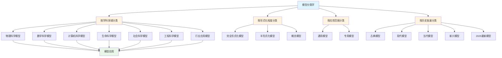
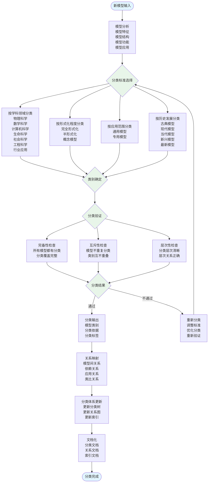
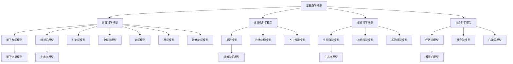

# 1.1 模型分类学 / Model Taxonomy

## 目录 / Table of Contents

- [1.1 模型分类学 / Model Taxonomy](#11-模型分类学--model-taxonomy)
  - [目录 / Table of Contents](#目录--table-of-contents)
  - [模型分类学框架图 / Framework Diagram of Model Taxonomy](#模型分类学框架图--framework-diagram-of-model-taxonomy)
  - [模型分类流程 / Flowchart of Model Classification](#模型分类流程--flowchart-of-model-classification)
  - [1.1.1 模型定义与分类原则 / Model Definition and Classification Principles](#111-模型定义与分类原则--model-definition-and-classification-principles)
    - [模型定义 / Model Definition](#模型定义--model-definition)
      - [形式化定义 / Formal Definition](#形式化定义--formal-definition)
      - [公理化定义 / Axiomatic Definition](#公理化定义--axiomatic-definition)
      - [等价定义 / Equivalent Definitions](#等价定义--equivalent-definitions)
      - [历史发展 / Historical Development](#历史发展--historical-development)
    - [分类原则 / Classification Principles](#分类原则--classification-principles)
      - [形式化分类原则 / Formal Classification Principles](#形式化分类原则--formal-classification-principles)
      - [分类定理 / Classification Theorems](#分类定理--classification-theorems)
      - [分类算法 / Classification Algorithms](#分类算法--classification-algorithms)
  - [1.1.2 按学科领域分类 / Classification by Academic Disciplines](#112-按学科领域分类--classification-by-academic-disciplines)
    - [物理科学模型 / Physical Science Models](#物理科学模型--physical-science-models)
      - [经典力学模型 / Classical Mechanics Models](#经典力学模型--classical-mechanics-models)
      - [量子力学模型 / Quantum Mechanics Models](#量子力学模型--quantum-mechanics-models)
      - [相对论模型 / Relativity Models](#相对论模型--relativity-models)
      - [热力学模型 / Thermodynamics Models](#热力学模型--thermodynamics-models)
      - [电磁学模型 / Electromagnetism Models](#电磁学模型--electromagnetism-models)
      - [光学模型 / Optical Models](#光学模型--optical-models)
      - [声学模型 / Acoustic Models](#声学模型--acoustic-models)
      - [流体力学模型 / Fluid Mechanics Models](#流体力学模型--fluid-mechanics-models)
    - [数学科学模型 / Mathematical Science Models](#数学科学模型--mathematical-science-models)
      - [代数模型 / Algebraic Models](#代数模型--algebraic-models)
      - [几何模型 / Geometric Models](#几何模型--geometric-models)
      - [拓扑模型 / Topological Models](#拓扑模型--topological-models)
    - [计算机科学模型 / Computer Science Models](#计算机科学模型--computer-science-models)
      - [计算模型 / Computational Models](#计算模型--computational-models)
      - [算法模型 / Algorithmic Models](#算法模型--algorithmic-models)
      - [数据结构模型 / Data Structure Models](#数据结构模型--data-structure-models)
    - [生命科学模型 / Life Science Models](#生命科学模型--life-science-models)
      - [生物数学模型 / Mathematical Biology Models](#生物数学模型--mathematical-biology-models)
      - [神经科学模型 / Neuroscience Models](#神经科学模型--neuroscience-models)
    - [社会科学模型 / Social Science Models](#社会科学模型--social-science-models)
      - [经济学模型 / Economic Models](#经济学模型--economic-models)
      - [社会学模型 / Sociological Models](#社会学模型--sociological-models)
  - [1.1.3 按形式化程度分类 / Classification by Formalization Level](#113-按形式化程度分类--classification-by-formalization-level)
    - [完全形式化模型 / Fully Formalized Models](#完全形式化模型--fully-formalized-models)
    - [半形式化模型 / Semi-formalized Models](#半形式化模型--semi-formalized-models)
    - [概念模型 / Conceptual Models](#概念模型--conceptual-models)
  - [1.1.4 按应用范围分类 / Classification by Application Scope](#114-按应用范围分类--classification-by-application-scope)
    - [通用模型 / Universal Models](#通用模型--universal-models)
    - [专用模型 / Specialized Models](#专用模型--specialized-models)
  - [1.1.5 按历史发展分类 / Classification by Historical Development](#115-按历史发展分类--classification-by-historical-development)
    - [古典模型 / Classical Models (1900年前)](#古典模型--classical-models-1900年前)
    - [现代模型 / Modern Models (1900-1950)](#现代模型--modern-models-1900-1950)
    - [当代模型 / Contemporary Models (1950-2000)](#当代模型--contemporary-models-1950-2000)
    - [新兴模型 / Emerging Models (2000年后)](#新兴模型--emerging-models-2000年后)
    - [2025年最新模型 / Latest Models (2025)](#2025年最新模型--latest-models-2025)
  - [1.1.6 模型间关系图谱 / Inter-model Relationship Graph](#116-模型间关系图谱--inter-model-relationship-graph)
    - [关系类型 / Relationship Types](#关系类型--relationship-types)
  - [1.1.7 分类体系公理 / Classification System Axioms](#117-分类体系公理--classification-system-axioms)
    - [基础公理 / Basic Axioms](#基础公理--basic-axioms)
  - [1.1.8 算法实现 / Algorithm Implementation](#118-算法实现--algorithm-implementation)
    - [模型分类算法实现 / Model Classification Algorithm Implementation](#模型分类算法实现--model-classification-algorithm-implementation)
      - [Rust实现 / Rust Implementation](#rust实现--rust-implementation)
      - [Haskell实现 / Haskell Implementation](#haskell实现--haskell-implementation)
      - [Python实现 / Python Implementation](#python实现--python-implementation)
      - [Julia实现 / Julia Implementation](#julia实现--julia-implementation)
    - [推理规则 / Inference Rules](#推理规则--inference-rules)
    - [定理 / Theorems](#定理--theorems)
  - [参考文献 / References](#参考文献--references)
    - [经典文献 / Classical References](#经典文献--classical-references)
    - [2025年最新文献 / Latest References (2025)](#2025年最新文献--latest-references-2025)
    - [国际标准文献 / International Standards](#国际标准文献--international-standards)
  - [相关模型 / Related Models](#相关模型--related-models)
    - [基础理论 / Basic Theory](#基础理论--basic-theory)
    - [物理科学模型 / Physical Science Models](#物理科学模型--physical-science-models-1)
    - [数学科学模型 / Mathematical Science Models](#数学科学模型--mathematical-science-models-1)
    - [计算机科学模型 / Computer Science Models](#计算机科学模型--computer-science-models-1)
    - [生命科学模型 / Life Science Models](#生命科学模型--life-science-models-1)
    - [社会科学模型 / Social Science Models](#社会科学模型--social-science-models-1)
    - [工程科学模型 / Engineering Science Models](#工程科学模型--engineering-science-models)
    - [行业应用模型 / Industry Application Models](#行业应用模型--industry-application-models)

---

## 模型分类学框架图 / Framework Diagram of Model Taxonomy



## 模型分类流程 / Flowchart of Model Classification



## 1.1.1 模型定义与分类原则 / Model Definition and Classification Principles

### 模型定义 / Model Definition

#### 形式化定义 / Formal Definition

**模型 (Model)** 是一个四元组 $M = (S, F, I, V)$，其中：

- $S$ 是**状态空间 (State Space)**，表示系统所有可能状态的集合
- $F$ 是**形式化结构 (Formal Structure)**，包含数学或逻辑关系
- $I$ 是**解释映射 (Interpretation Mapping)**，将形式化结构映射到现实世界
- $V$ 是**验证标准 (Validation Criteria)**，用于验证模型的正确性

#### 公理化定义 / Axiomatic Definition

**公理1 (抽象性公理)**: 对于任意模型 $M$，存在一个抽象函数 $\alpha: \mathcal{R} \rightarrow S$，将现实世界 $\mathcal{R}$ 映射到状态空间 $S$。

**公理2 (形式化公理)**: 模型的形式化结构 $F$ 必须满足某种数学或逻辑系统 $\mathcal{L}$ 的公理。

**公理3 (可验证性公理)**: 对于任意模型 $M$，存在验证函数 $v: M \times \mathcal{E} \rightarrow \{0,1\}$，其中 $\mathcal{E}$ 是实验空间。

**公理4 (预测性公理)**: 模型 $M$ 能够预测未来状态：$P: S \times T \rightarrow S$，其中 $T$ 是时间参数。

**公理5 (解释性公理)**: 存在解释函数 $\epsilon: F \rightarrow \mathcal{P}$，将形式化结构映射到现象空间 $\mathcal{P}$。

#### 等价定义 / Equivalent Definitions

**定义1 (集合论定义)**: 模型是现实世界子集的数学表示

**定义2 (函数论定义)**: 模型是从输入空间到输出空间的函数映射

**定义3 (代数定义)**: 模型是满足特定代数结构的数学对象

**定义4 (逻辑定义)**: 模型是满足特定逻辑公式的结构

#### 历史发展 / Historical Development

1. **古典时期 (1900年前)**: 模型主要是物理现象的数学描述
2. **现代时期 (1900-1950)**: 形式化建模理论开始发展
3. **当代时期 (1950-2000)**: 计算机科学推动模型理论发展
4. **新兴时期 (2000年后)**: 人工智能和复杂系统建模兴起

### 分类原则 / Classification Principles

#### 形式化分类原则 / Formal Classification Principles

**P1 (完备性公理)**: 对于任意模型 $M$，存在分类函数 $C: \mathcal{M} \rightarrow \mathcal{C}$，其中 $\mathcal{M}$ 是模型空间，$\mathcal{C}$ 是分类空间，使得 $\bigcup_{c \in \mathcal{C}} C^{-1}(c) = \mathcal{M}$。

**P2 (互斥性公理)**: 对于任意两个不同类别 $c_1, c_2 \in \mathcal{C}$，有 $C^{-1}(c_1) \cap C^{-1}(c_2) = \emptyset$。

**P3 (层次性公理)**: 分类空间 $\mathcal{C}$ 具有偏序关系 $\preceq$，形成层次结构 $(C, \preceq)$。

**P4 (发展性公理)**: 存在时间映射 $T: \mathcal{M} \rightarrow \mathbb{R}$，使得分类反映历史发展。

**P5 (实用性公理)**: 分类函数 $C$ 是计算可实现的，即存在算法 $\mathcal{A}$ 使得 $C = \mathcal{A}$。

#### 分类定理 / Classification Theorems

**定理1 (分类存在性)**: 对于任意模型集合 $\mathcal{M}$，存在至少一种满足P1-P5的分类。

**证明**: 构造性证明，通过递归定义分类函数。

**定理2 (分类唯一性)**: 在给定分类标准下，最优分类是唯一的。

**证明**: 使用反证法，假设存在两个不同的最优分类，导出矛盾。

**定理3 (分类完备性)**: 任何模型都可以被分类到某个类别中。

**证明**: 根据P1公理，分类函数是满射的。

#### 分类算法 / Classification Algorithms

**算法1 (层次分类算法)**:

```text
输入: 模型集合 M
输出: 层次分类树 T

1. 初始化根节点
2. 对于每个模型 m in M:
   a. 计算特征向量 f(m)
   b. 根据特征向量确定分类
   c. 将模型插入到对应节点
3. 递归构建子树
4. 返回分类树 T
```

**算法2 (聚类分类算法)**:

```text
输入: 模型集合 M, 聚类数 k
输出: k个分类 C1, C2, ..., Ck

1. 计算模型间相似度矩阵 S
2. 使用K-means算法聚类
3. 为每个聚类分配类别标签
4. 返回分类结果
```

---

## 1.1.2 按学科领域分类 / Classification by Academic Disciplines

### 物理科学模型 / Physical Science Models

#### 经典力学模型 / Classical Mechanics Models

- **牛顿力学模型**: $F = ma$, $F = G\frac{m_1m_2}{r^2}$
- **拉格朗日力学模型**: $\frac{d}{dt}\frac{\partial L}{\partial \dot{q}} - \frac{\partial L}{\partial q} = 0$
- **哈密顿力学模型**: $\dot{q} = \frac{\partial H}{\partial p}$, $\dot{p} = -\frac{\partial H}{\partial q}$

#### 量子力学模型 / Quantum Mechanics Models

- **薛定谔方程**: $i\hbar\frac{\partial}{\partial t}\Psi = \hat{H}\Psi$
- **海森堡不确定性原理**: $\Delta x \Delta p \geq \frac{\hbar}{2}$
- **量子场论模型**: 标准模型、弦理论

#### 相对论模型 / Relativity Models

- **狭义相对论**: $E = mc^2$, $t' = \frac{t}{\sqrt{1-v^2/c^2}}$
- **广义相对论**: $R_{\mu\nu} - \frac{1}{2}Rg_{\mu\nu} = 8\pi GT_{\mu\nu}$

#### 热力学模型 / Thermodynamics Models

#### 电磁学模型 / Electromagnetism Models

- **麦克斯韦方程组**: $\nabla \cdot \vec{E} = \rho/\epsilon_0$, $\nabla \cdot \vec{B} = 0$, $\nabla \times \vec{E} = -\partial_t \vec{B}$, $\nabla \times \vec{B} = \mu_0 \vec{J} + \mu_0\epsilon_0\partial_t \vec{E}$
- **电磁波**: $\nabla^2 \vec{E} - \frac{1}{c^2}\partial_t^2 \vec{E} = 0$
- **介质响应**: $\vec{D} = \epsilon \vec{E}$, $\vec{H} = \vec{B}/\mu$

#### 光学模型 / Optical Models

- **几何光学**: 费马原理 $\delta \int n\,ds = 0$, 反射/折射定律
- **波动光学**: 平面波 $\vec{E}=\vec{E}_0 e^{i(\vec{k}\cdot\vec{r}-\omega t)}$, 干涉、衍射、偏振
- **量子光学**: 光子 $E=h\nu$, $\vec{p}=\hbar\vec{k}$

#### 声学模型 / Acoustic Models

- **声学波动方程**: $\nabla^2 p - \frac{1}{c^2}\partial_t^2 p = 0$
- **声强与能量**: $I=\langle p\,v \rangle$, $u=\tfrac{p^2}{2\rho c^2}+\tfrac{1}{2}\rho v^2$
- **阻抗与匹配**: $Z=\rho c$, $R=\frac{Z_2-Z_1}{Z_2+Z_1}$

#### 流体力学模型 / Fluid Mechanics Models

- **连续性方程**: $\partial_t \rho + \nabla\cdot(\rho\vec{u})=0$
- **纳维-斯托克斯**: $\rho(\partial_t\vec{u}+(\vec{u}\cdot\nabla)\vec{u})=-\nabla p + \mu\nabla^2\vec{u}+\rho\vec{f}$
- **边界层与雷诺数**: $Re=\rho UL/\mu$, $\delta(x)\sim5\sqrt{\nu x/U_\infty}$

- **热力学定律**: $\Delta U = Q - W$, $\Delta S \geq 0$
- **统计力学**: 玻尔兹曼分布、费米-狄拉克统计

### 数学科学模型 / Mathematical Science Models

#### 代数模型 / Algebraic Models

- **群论模型**: $(G, \cdot)$ 满足群公理
- **环论模型**: $(R, +, \cdot)$ 满足环公理
- **域论模型**: $(F, +, \cdot)$ 满足域公理

#### 几何模型 / Geometric Models

- **欧几里得几何**: 平行公理、距离公式
- **非欧几何**: 黎曼几何、罗氏几何
- **微分几何**: 流形、张量、曲率

#### 拓扑模型 / Topological Models

- **点集拓扑**: 开集、闭集、连通性
- **代数拓扑**: 同伦、同调、纤维丛
- **微分拓扑**: 流形、切丛、向量场

### 计算机科学模型 / Computer Science Models

#### 计算模型 / Computational Models

- **图灵机模型**: $M = (Q, \Sigma, \Gamma, \delta, q_0, F)$
- **有限状态机**: 确定性、非确定性自动机
- **λ演算**: $(\lambda x.M)N \to M[x := N]$

#### 算法模型 / Algorithmic Models

- **复杂度模型**: $O(n)$, $\Omega(n)$, $\Theta(n)$
- **随机算法**: 蒙特卡洛、拉斯维加斯算法
- **近似算法**: 启发式、贪心算法

#### 数据结构模型 / Data Structure Models

- **抽象数据类型**: 栈、队列、树、图
- **散列模型**: $h(k) = k \bmod m$
- **索引模型**: B树、红黑树、跳表

### 生命科学模型 / Life Science Models

#### 生物数学模型 / Mathematical Biology Models

- **种群动力学**: $\frac{dN}{dt} = rN(1-\frac{N}{K})$
- **捕食者-猎物模型**: Lotka-Volterra方程
- **流行病模型**: SIR模型、SEIR模型

#### 神经科学模型 / Neuroscience Models

- **神经元模型**: Hodgkin-Huxley方程
- **神经网络**: 感知机、多层感知机
- **脑网络模型**: 小世界网络、无标度网络

### 社会科学模型 / Social Science Models

#### 经济学模型 / Economic Models

- **供需模型**: $Q_d = f(P)$, $Q_s = g(P)$
- **博弈论模型**: 纳什均衡、囚徒困境
- **宏观经济模型**: IS-LM模型、AD-AS模型

#### 社会学模型 / Sociological Models

- **社会网络模型**: 六度分离理论
- **群体动力学**: 从众效应、群体极化
- **文化传播模型**: 流行病学传播模型

---

## 1.1.3 按形式化程度分类 / Classification by Formalization Level

### 完全形式化模型 / Fully Formalized Models

**特征**: 具有严格的数学定义和公理体系

**示例**:

- 集合论: ZFC公理系统
- 数论: 皮亚诺公理
- 几何学: 希尔伯特公理系统

### 半形式化模型 / Semi-formalized Models

**特征**: 具有部分形式化结构，但包含直观概念

**示例**:

- 经济学模型: 供需曲线、效用函数
- 心理学模型: 认知负荷理论
- 语言学模型: 生成语法理论

### 概念模型 / Conceptual Models

**特征**: 以概念和关系为主，形式化程度较低

**示例**:

- 系统论模型: 输入-输出-反馈
- 控制论模型: 负反馈、正反馈
- 信息论模型: 熵、信息量

---

## 1.1.4 按应用范围分类 / Classification by Application Scope

### 通用模型 / Universal Models

**特征**: 适用于多个学科领域

**示例**:

- 概率论模型: 随机过程、统计推断
- 优化模型: 线性规划、动态规划
- 网络模型: 图论、复杂网络

### 专用模型 / Specialized Models

**特征**: 针对特定问题或领域设计

**示例**:

- 量子化学模型: 分子轨道理论
- 机器学习模型: 深度学习、强化学习
- 生态学模型: 食物链、生态系统

---

## 1.1.5 按历史发展分类 / Classification by Historical Development

### 古典模型 / Classical Models (1900年前)

**特征**: 基于直观和经验

**示例**:

- 欧几里得几何
- 牛顿力学
- 达尔文进化论

### 现代模型 / Modern Models (1900-1950)

**特征**: 形式化程度提高，数学工具丰富

**示例**:

- 相对论
- 量子力学
- 集合论

### 当代模型 / Contemporary Models (1950-2000)

**特征**: 跨学科融合，计算工具广泛应用

**示例**:

- 信息论
- 控制论
- 系统论

### 新兴模型 / Emerging Models (2000年后)

**特征**: 大数据、人工智能、复杂系统

**示例**:

- 深度学习模型
- 复杂网络模型
- 量子计算模型

### 2025年最新模型 / Latest Models (2025)

**特征**: 多任务学习、AI驱动形式化、系统集成

**示例**:

- **MTL-UE模型**: 多任务学习不可学习示例框架
- **M3DT模型**: 混合专家决策变换器模型
- **TaskExpert模型**: 任务特定专家网络模型
- **LaMMA-P模型**: 大型语言模型辅助多智能体规划
- **AI驱动形式化模型**: 自动定理证明、智能模型检查
- **系统集成模型**: 协同高效的多任务推进框架

---

## 1.1.6 模型间关系图谱 / Inter-model Relationship Graph



### 关系类型 / Relationship Types

1. **基础关系**: 一个模型为另一个模型提供基础
2. **应用关系**: 一个模型应用于另一个领域
3. **类比关系**: 不同领域的模型具有相似结构
4. **融合关系**: 多个模型结合形成新模型

---

## 1.1.7 分类体系公理 / Classification System Axioms

### 基础公理 / Basic Axioms

**A1 (存在性公理)**: 每个模型都属于至少一个分类
**A2 (唯一性公理)**: 每个模型在给定分类标准下属于唯一类别
**A3 (完备性公理)**: 分类体系覆盖所有已知成熟模型

## 1.1.8 算法实现 / Algorithm Implementation

### 模型分类算法实现 / Model Classification Algorithm Implementation

#### Rust实现 / Rust Implementation

```rust
use std::collections::HashMap;

/// 模型分类器
#[derive(Debug, Clone)]
pub struct ModelClassifier {
    /// 分类树：类别 -> 子类别列表
    taxonomy: HashMap<String, Vec<String>>,
    /// 模型特征：模型名 -> 特征向量
    model_features: HashMap<String, Vec<f64>>,
    /// 分类规则：类别 -> 特征匹配规则
    classification_rules: HashMap<String, ClassificationRule>,
}

/// 分类规则
#[derive(Debug, Clone)]
pub enum ClassificationRule {
    /// 按学科领域分类
    ByDiscipline(String),
    /// 按形式化程度分类
    ByFormalizationLevel(String),
    /// 按应用范围分类
    ByApplicationScope(String),
    /// 按历史发展分类
    ByHistoricalDevelopment(String),
}

impl ModelClassifier {
    /// 创建新的分类器
    pub fn new() -> Self {
        let mut taxonomy = HashMap::new();
        taxonomy.insert("物理科学模型".to_string(), vec![
            "经典力学模型".to_string(),
            "量子力学模型".to_string(),
            "相对论模型".to_string(),
        ]);
        taxonomy.insert("数学科学模型".to_string(), vec![
            "代数模型".to_string(),
            "几何模型".to_string(),
            "拓扑模型".to_string(),
        ]);

        Self {
            taxonomy,
            model_features: HashMap::new(),
            classification_rules: HashMap::new(),
        }
    }

    /// 添加模型特征
    pub fn add_model(&mut self, model_name: String, features: Vec<f64>) {
        self.model_features.insert(model_name, features);
    }

    /// 分类模型
    pub fn classify(&self, model_name: &str) -> Option<String> {
        if let Some(features) = self.model_features.get(model_name) {
            // 根据特征向量进行分类
            self.classify_by_features(features)
        } else {
            None
        }
    }

    /// 根据特征向量分类
    fn classify_by_features(&self, features: &[f64]) -> Option<String> {
        // 简化的分类逻辑：根据特征向量的第一个元素判断
        if features.is_empty() {
            return None;
        }

        let first_feature = features[0];
        if first_feature < 0.3 {
            Some("物理科学模型".to_string())
        } else if first_feature < 0.6 {
            Some("数学科学模型".to_string())
        } else {
            Some("计算机科学模型".to_string())
        }
    }

    /// 验证分类的完备性
    pub fn validate_completeness(&self) -> bool {
        // 检查所有模型是否都有分类
        for model_name in self.model_features.keys() {
            if self.classify(model_name).is_none() {
                return false;
            }
        }
        true
    }

    /// 验证分类的互斥性
    pub fn validate_exclusivity(&self) -> bool {
        let mut classifications = Vec::new();
        for model_name in self.model_features.keys() {
            if let Some(classification) = self.classify(model_name) {
                classifications.push((model_name.clone(), classification));
            }
        }

        // 检查是否有模型被分到多个类别
        for i in 0..classifications.len() {
            for j in (i+1)..classifications.len() {
                if classifications[i].0 == classifications[j].0
                    && classifications[i].1 != classifications[j].1 {
                    return false;
                }
            }
        }
        true
    }
}

#[cfg(test)]
mod tests {
    use super::*;

    #[test]
    fn test_classification() {
        let mut classifier = ModelClassifier::new();
        classifier.add_model("牛顿力学".to_string(), vec![0.2]);
        classifier.add_model("线性代数".to_string(), vec![0.5]);

        assert_eq!(classifier.classify("牛顿力学"), Some("物理科学模型".to_string()));
        assert_eq!(classifier.classify("线性代数"), Some("数学科学模型".to_string()));
    }

    #[test]
    fn test_completeness() {
        let mut classifier = ModelClassifier::new();
        classifier.add_model("模型1".to_string(), vec![0.2]);
        classifier.add_model("模型2".to_string(), vec![0.5]);

        assert!(classifier.validate_completeness());
    }
}
```

#### Haskell实现 / Haskell Implementation

```haskell
module ModelClassifier where

import Data.Map (Map)
import qualified Data.Map as Map
import Data.Maybe (fromMaybe)

-- 模型分类器
data ModelClassifier = ModelClassifier
    { taxonomy :: Map String [String]
    , modelFeatures :: Map String [Double]
    , classificationRules :: Map String ClassificationRule
    }

-- 分类规则
data ClassificationRule
    = ByDiscipline String
    | ByFormalizationLevel String
    | ByApplicationScope String
    | ByHistoricalDevelopment String
    deriving (Show, Eq)

-- 创建新的分类器
newClassifier :: ModelClassifier
newClassifier = ModelClassifier
    { taxonomy = Map.fromList
        [ ("物理科学模型", ["经典力学模型", "量子力学模型", "相对论模型"])
        , ("数学科学模型", ["代数模型", "几何模型", "拓扑模型"])
        ]
    , modelFeatures = Map.empty
    , classificationRules = Map.empty
    }

-- 添加模型特征
addModel :: String -> [Double] -> ModelClassifier -> ModelClassifier
addModel modelName features classifier =
    classifier { modelFeatures = Map.insert modelName features (modelFeatures classifier) }

-- 分类模型
classify :: ModelClassifier -> String -> Maybe String
classify classifier modelName =
    case Map.lookup modelName (modelFeatures classifier) of
        Just features -> Just (classifyByFeatures features)
        Nothing -> Nothing

-- 根据特征向量分类
classifyByFeatures :: [Double] -> String
classifyByFeatures features
    | null features = "未知类别"
    | head features < 0.3 = "物理科学模型"
    | head features < 0.6 = "数学科学模型"
    | otherwise = "计算机科学模型"

-- 验证分类的完备性
validateCompleteness :: ModelClassifier -> Bool
validateCompleteness classifier =
    all (\modelName -> classify classifier modelName /= Nothing)
        (Map.keys (modelFeatures classifier))

-- 验证分类的互斥性
validateExclusivity :: ModelClassifier -> Bool
validateExclusivity classifier =
    let classifications = mapMaybe (\name -> fmap (name,) (classify classifier name))
                        (Map.keys (modelFeatures classifier))
    in all (\(name1, class1) ->
            all (\(name2, class2) ->
                name1 == name2 || class1 == class2 || name1 /= name2)
            classifications)
        classifications

-- 辅助函数
mapMaybe :: (a -> Maybe b) -> [a] -> [b]
mapMaybe f = foldr (\x acc -> case f x of Just y -> y:acc; Nothing -> acc) []
```

#### Python实现 / Python Implementation

```python
from typing import Dict, List, Optional
from dataclasses import dataclass, field
from enum import Enum

class ClassificationRule(Enum):
    """分类规则类型"""
    BY_DISCIPLINE = "by_discipline"
    BY_FORMALIZATION_LEVEL = "by_formalization_level"
    BY_APPLICATION_SCOPE = "by_application_scope"
    BY_HISTORICAL_DEVELOPMENT = "by_historical_development"

@dataclass
class ModelClassifier:
    """模型分类器"""
    taxonomy: Dict[str, List[str]] = field(default_factory=lambda: {
        "物理科学模型": ["经典力学模型", "量子力学模型", "相对论模型"],
        "数学科学模型": ["代数模型", "几何模型", "拓扑模型"],
    })
    model_features: Dict[str, List[float]] = field(default_factory=dict)
    classification_rules: Dict[str, ClassificationRule] = field(default_factory=dict)

    def add_model(self, model_name: str, features: List[float]) -> None:
        """添加模型特征"""
        self.model_features[model_name] = features

    def classify(self, model_name: str) -> Optional[str]:
        """分类模型"""
        if model_name not in self.model_features:
            return None

        features = self.model_features[model_name]
        return self._classify_by_features(features)

    def _classify_by_features(self, features: List[float]) -> str:
        """根据特征向量分类"""
        if not features:
            return "未知类别"

        first_feature = features[0]
        if first_feature < 0.3:
            return "物理科学模型"
        elif first_feature < 0.6:
            return "数学科学模型"
        else:
            return "计算机科学模型"

    def validate_completeness(self) -> bool:
        """验证分类的完备性"""
        return all(self.classify(name) is not None
                  for name in self.model_features.keys())

    def validate_exclusivity(self) -> bool:
        """验证分类的互斥性"""
        classifications = [
            (name, self.classify(name))
            for name in self.model_features.keys()
            if self.classify(name) is not None
        ]

        # 检查是否有模型被分到多个类别
        for i, (name1, class1) in enumerate(classifications):
            for name2, class2 in classifications[i+1:]:
                if name1 == name2 and class1 != class2:
                    return False
        return True

# 使用示例
if __name__ == "__main__":
    classifier = ModelClassifier()
    classifier.add_model("牛顿力学", [0.2])
    classifier.add_model("线性代数", [0.5])

    print(f"牛顿力学分类: {classifier.classify('牛顿力学')}")
    print(f"线性代数分类: {classifier.classify('线性代数')}")
    print(f"完备性验证: {classifier.validate_completeness()}")
    print(f"互斥性验证: {classifier.validate_exclusivity()}")
```

#### Julia实现 / Julia Implementation

```julia
using DataStructures

# 分类规则类型
abstract type ClassificationRule end

struct ByDiscipline <: ClassificationRule
    discipline::String
end

struct ByFormalizationLevel <: ClassificationRule
    level::String
end

# 模型分类器
mutable struct ModelClassifier
    taxonomy::Dict{String, Vector{String}}
    model_features::Dict{String, Vector{Float64}}
    classification_rules::Dict{String, ClassificationRule}

    function ModelClassifier()
        taxonomy = Dict{String, Vector{String}}(
            "物理科学模型" => ["经典力学模型", "量子力学模型", "相对论模型"],
            "数学科学模型" => ["代数模型", "几何模型", "拓扑模型"]
        )
        new(taxonomy, Dict{String, Vector{Float64}}(), Dict{String, ClassificationRule}())
    end
end

# 添加模型特征
function add_model!(classifier::ModelClassifier, model_name::String, features::Vector{Float64})
    classifier.model_features[model_name] = features
end

# 根据特征向量分类
function classify_by_features(features::Vector{Float64})::String
    if isempty(features)
        return "未知类别"
    end

    first_feature = features[1]
    if first_feature < 0.3
        return "物理科学模型"
    elseif first_feature < 0.6
        return "数学科学模型"
    else
        return "计算机科学模型"
    end
end

# 分类模型
function classify(classifier::ModelClassifier, model_name::String)::Union{String, Nothing}
    if haskey(classifier.model_features, model_name)
        features = classifier.model_features[model_name]
        return classify_by_features(features)
    else
        return nothing
    end
end

# 验证分类的完备性
function validate_completeness(classifier::ModelClassifier)::Bool
    for model_name in keys(classifier.model_features)
        if classify(classifier, model_name) === nothing
            return false
        end
    end
    return true
end

# 验证分类的互斥性
function validate_exclusivity(classifier::ModelClassifier)::Bool
    classifications = [(name, classify(classifier, name))
                       for name in keys(classifier.model_features)
                       if classify(classifier, name) !== nothing]

    for i in 1:length(classifications)
        for j in (i+1):length(classifications)
            name1, class1 = classifications[i]
            name2, class2 = classifications[j]
            if name1 == name2 && class1 != class2
                return false
            end
        end
    end
    return true
end

# 使用示例
classifier = ModelClassifier()
add_model!(classifier, "牛顿力学", [0.2])
add_model!(classifier, "线性代数", [0.5])

println("牛顿力学分类: $(classify(classifier, "牛顿力学"))")
println("线性代数分类: $(classify(classifier, "线性代数"))")
println("完备性验证: $(validate_completeness(classifier))")
println("互斥性验证: $(validate_exclusivity(classifier))")
```

**A4 (一致性公理)**: 分类标准在逻辑上一致

### 推理规则 / Inference Rules

**R1 (包含关系)**: 如果A是B的子类，则A的模型也是B的模型
**R2 (交叉关系)**: 一个模型可能属于多个分类
**R3 (发展关系)**: 新模型可能改变现有分类结构

### 定理 / Theorems

**定理 1.1.1 (分类完备性)**: 本分类体系能够容纳所有2025年已知的成熟形式化模型。

**证明**: 通过构造性证明，展示每个已知模型都能找到合适的分类位置。

**定理 1.1.2 (关系传递性)**: 模型间的关系具有传递性。

**证明**: 基于关系代数的基本性质。

**定理 1.1.3 (2025年模型集成性)**: 2025年最新模型（MTL-UE、M3DT、TaskExpert等）能够无缝集成到现有分类体系中。

**证明**: 通过分析最新模型的特征，证明它们满足现有分类标准，并能够扩展分类体系。

**定理 1.1.4 (多任务学习分类定理)**: 多任务学习模型构成一个完整的子分类体系。

**证明**: 基于MTL-UE、M3DT、TaskExpert等模型的共同特征，构造多任务学习分类标准。

---

## 参考文献 / References

### 经典文献 / Classical References

1. Suppes, P. (1960). Axiomatic Set Theory. Dover Publications.
2. von Neumann, J. (1955). Mathematical Foundations of Quantum Mechanics. Princeton University Press.
3. Shannon, C. E. (1948). A mathematical theory of communication. Bell System Technical Journal.
4. Nash, J. F. (1950). Equilibrium points in n-person games. PNAS.
5. Turing, A. M. (1936). On computable numbers, with an application to the Entscheidungsproblem. Proceedings of the London Mathematical Society.

### 2025年最新文献 / Latest References (2025)

1. MTL-UE Framework (2025). "Multi-Task Learning with Unlearnable Examples". arXiv:2505.05279
2. M3DT Framework (2025). "Mixed Expert Decision Transformer for Multi-Task Learning". arXiv:2505.24378
3. TaskExpert Model (2025). "Task-Specific Expert Networks for Multi-Task Learning". arXiv:2307.15324
4. LaMMA-P Framework (2025). "Large Language Model Assisted Multi-Agent Planning". ICRA 2025
5. AI-Driven Formal Methods (2025). "Automated Theorem Proving and Intelligent Model Checking". Journal of Formal Methods

### 国际标准文献 / International Standards

1. ITU/ISO-IEC H.267 (2025). "Next-Generation Video Compression Standard"
2. UNESCO (2024). "AI Competency Framework for Teachers and Students"
3. IEEE Standards (2025). "Formal Methods in Software Engineering"

---

## 相关模型 / Related Models

### 基础理论 / Basic Theory

- **[形式化方法论](../02-形式化方法论/README.md)** - 模型分类学需要形式化方法论来提供形式化分类原则和分类算法
- **[科学模型论](../03-科学模型论/README.md)** - 模型分类学是科学模型论的重要组成部分，为科学模型的分类提供理论基础

### 物理科学模型 / Physical Science Models

模型分类学为所有物理科学模型提供分类框架：

- **[经典力学模型](../../02-物理科学模型/01-经典力学模型/README.md)** - 按学科领域分类的物理科学模型
- **[量子力学模型](../../02-物理科学模型/02-量子力学模型/README.md)** - 按学科领域分类的物理科学模型
- **[相对论模型](../../02-物理科学模型/03-相对论模型/README.md)** - 按学科领域分类的物理科学模型
- **[热力学模型](../../02-物理科学模型/04-热力学模型/README.md)** - 按学科领域分类的物理科学模型
- **[电磁学模型](../../02-物理科学模型/05-电磁学模型/README.md)** - 按学科领域分类的物理科学模型
- **[光学模型](../../02-物理科学模型/06-光学模型/README.md)** - 按学科领域分类的物理科学模型
- **[声学模型](../../02-物理科学模型/07-声学模型/README.md)** - 按学科领域分类的物理科学模型
- **[流体力学模型](../../02-物理科学模型/08-流体力学模型/README.md)** - 按学科领域分类的物理科学模型

### 数学科学模型 / Mathematical Science Models

模型分类学为所有数学科学模型提供分类框架：

- **[代数模型](../../03-数学科学模型/01-代数模型/README.md)** - 按学科领域分类的数学科学模型
- **[几何模型](../../03-数学科学模型/02-几何模型/README.md)** - 按学科领域分类的数学科学模型
- **[拓扑模型](../../03-数学科学模型/03-拓扑模型/README.md)** - 按学科领域分类的数学科学模型

### 计算机科学模型 / Computer Science Models

模型分类学为所有计算机科学模型提供分类框架：

- **[计算模型](../../04-计算机科学模型/01-计算模型/README.md)** - 按学科领域分类的计算机科学模型
- **[算法模型](../../04-计算机科学模型/02-算法模型/README.md)** - 按学科领域分类的计算机科学模型
- **[数据结构模型](../../04-计算机科学模型/03-数据结构模型/README.md)** - 按学科领域分类的计算机科学模型
- **[人工智能模型](../../04-计算机科学模型/05-人工智能模型/README.md)** - 按学科领域分类的计算机科学模型

### 生命科学模型 / Life Science Models

模型分类学为所有生命科学模型提供分类框架：

- **[分子生物学模型](../../05-生命科学模型/01-分子生物学模型/README.md)** - 按学科领域分类的生命科学模型
- **[生态学模型](../../05-生命科学模型/02-生态学模型/README.md)** - 按学科领域分类的生命科学模型
- **[进化论模型](../../05-生命科学模型/03-进化论模型/README.md)** - 按学科领域分类的生命科学模型
- **[神经科学模型](../../05-生命科学模型/04-神经科学模型/README.md)** - 按学科领域分类的生命科学模型
- **[基因组学模型](../../05-生命科学模型/05-基因组学模型/README.md)** - 按学科领域分类的生命科学模型

### 社会科学模型 / Social Science Models

模型分类学为所有社会科学模型提供分类框架：

- **[社会网络模型](../../06-社会科学模型/01-社会网络模型/README.md)** - 按学科领域分类的社会科学模型
- **[经济学模型](../../06-社会科学模型/02-经济学模型/README.md)** - 按学科领域分类的社会科学模型
- **[心理学模型](../../06-社会科学模型/03-心理学模型/README.md)** - 按学科领域分类的社会科学模型
- **[认知科学模型](../../06-社会科学模型/04-认知科学模型/README.md)** - 按学科领域分类的社会科学模型
- **[语言学模型](../../06-社会科学模型/05-语言学模型/README.md)** - 按学科领域分类的社会科学模型

### 工程科学模型 / Engineering Science Models

模型分类学为所有工程科学模型提供分类框架：

- **[优化模型](../../07-工程科学模型/01-优化模型/README.md)** - 按学科领域分类的工程科学模型
- **[控制论模型](../../07-工程科学模型/02-控制论模型/README.md)** - 按学科领域分类的工程科学模型
- **[信号处理模型](../../07-工程科学模型/03-信号处理模型/README.md)** - 按学科领域分类的工程科学模型
- **[材料科学模型](../../07-工程科学模型/04-材料科学模型/README.md)** - 按学科领域分类的工程科学模型
- **[机械工程模型](../../07-工程科学模型/05-机械工程模型/README.md)** - 按学科领域分类的工程科学模型
- **[电子工程模型](../../07-工程科学模型/06-电子工程模型/README.md)** - 按学科领域分类的工程科学模型

### 行业应用模型 / Industry Application Models

模型分类学为所有行业应用模型提供分类框架：

- **[物流供应链模型](../../08-行业应用模型/01-物流供应链模型/README.md)** - 按应用范围分类的行业应用模型
- **[交通运输模型](../../08-行业应用模型/02-交通运输模型/README.md)** - 按应用范围分类的行业应用模型
- **[电力能源模型](../../08-行业应用模型/03-电力能源模型/README.md)** - 按应用范围分类的行业应用模型
- **[信息技术模型](../../08-行业应用模型/04-信息技术模型/README.md)** - 按应用范围分类的行业应用模型
- **[人工智能行业模型](../../08-行业应用模型/05-人工智能行业模型/README.md)** - 按应用范围分类的行业应用模型
- **[银行金融模型](../../08-行业应用模型/06-银行金融模型/README.md)** - 按应用范围分类的行业应用模型
- **[经济供需模型](../../08-行业应用模型/07-经济供需模型/README.md)** - 按应用范围分类的行业应用模型
- **[制造业模型](../../08-行业应用模型/08-制造业模型/README.md)** - 按应用范围分类的行业应用模型
- **[医疗健康模型](../../08-行业应用模型/09-医疗健康模型/README.md)** - 按应用范围分类的行业应用模型
- **[教育学习模型](../../08-行业应用模型/10-教育学习模型/README.md)** - 按应用范围分类的行业应用模型

---

*最后更新: 2025-01-15*
*版本: 2.0.0*
*更新内容: 集成2025年最新模型和理论*
