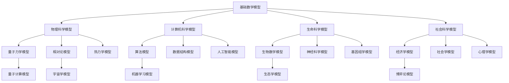

# 1.1 模型分类学 / Model Taxonomy

## 目录 / Table of Contents

- [1.1 模型分类学 / Model Taxonomy](#11-模型分类学--model-taxonomy)
  - [目录 / Table of Contents](#目录--table-of-contents)
  - [1.1.1 模型定义与分类原则 / Model Definition and Classification Principles](#111-模型定义与分类原则--model-definition-and-classification-principles)
    - [模型定义 / Model Definition](#模型定义--model-definition)
    - [分类原则 / Classification Principles](#分类原则--classification-principles)
  - [1.1.2 按学科领域分类 / Classification by Academic Disciplines](#112-按学科领域分类--classification-by-academic-disciplines)
    - [物理科学模型 / Physical Science Models](#物理科学模型--physical-science-models)
      - [经典力学模型 / Classical Mechanics Models](#经典力学模型--classical-mechanics-models)
      - [量子力学模型 / Quantum Mechanics Models](#量子力学模型--quantum-mechanics-models)
      - [相对论模型 / Relativity Models](#相对论模型--relativity-models)
      - [热力学模型 / Thermodynamics Models](#热力学模型--thermodynamics-models)
    - [数学科学模型 / Mathematical Science Models](#数学科学模型--mathematical-science-models)
      - [代数模型 / Algebraic Models](#代数模型--algebraic-models)
      - [几何模型 / Geometric Models](#几何模型--geometric-models)
      - [拓扑模型 / Topological Models](#拓扑模型--topological-models)
    - [计算机科学模型 / Computer Science Models](#计算机科学模型--computer-science-models)
      - [计算模型 / Computational Models](#计算模型--computational-models)
      - [算法模型 / Algorithmic Models](#算法模型--algorithmic-models)
      - [数据结构模型 / Data Structure Models](#数据结构模型--data-structure-models)
    - [生命科学模型 / Life Science Models](#生命科学模型--life-science-models)
      - [生物数学模型 / Mathematical Biology Models](#生物数学模型--mathematical-biology-models)
      - [神经科学模型 / Neuroscience Models](#神经科学模型--neuroscience-models)
    - [社会科学模型 / Social Science Models](#社会科学模型--social-science-models)
      - [经济学模型 / Economic Models](#经济学模型--economic-models)
      - [社会学模型 / Sociological Models](#社会学模型--sociological-models)
  - [1.1.3 按形式化程度分类 / Classification by Formalization Level](#113-按形式化程度分类--classification-by-formalization-level)
    - [完全形式化模型 / Fully Formalized Models](#完全形式化模型--fully-formalized-models)
    - [半形式化模型 / Semi-formalized Models](#半形式化模型--semi-formalized-models)
    - [概念模型 / Conceptual Models](#概念模型--conceptual-models)
  - [1.1.4 按应用范围分类 / Classification by Application Scope](#114-按应用范围分类--classification-by-application-scope)
    - [通用模型 / Universal Models](#通用模型--universal-models)
    - [专用模型 / Specialized Models](#专用模型--specialized-models)
  - [1.1.5 按历史发展分类 / Classification by Historical Development](#115-按历史发展分类--classification-by-historical-development)
    - [古典模型 / Classical Models (1900年前)](#古典模型--classical-models-1900年前)
    - [现代模型 / Modern Models (1900-1950)](#现代模型--modern-models-1900-1950)
    - [当代模型 / Contemporary Models (1950-2000)](#当代模型--contemporary-models-1950-2000)
    - [新兴模型 / Emerging Models (2000年后)](#新兴模型--emerging-models-2000年后)
  - [1.1.6 模型间关系图谱 / Inter-model Relationship Graph](#116-模型间关系图谱--inter-model-relationship-graph)
    - [关系类型 / Relationship Types](#关系类型--relationship-types)
  - [1.1.7 分类体系公理 / Classification System Axioms](#117-分类体系公理--classification-system-axioms)
    - [基础公理 / Basic Axioms](#基础公理--basic-axioms)
    - [推理规则 / Inference Rules](#推理规则--inference-rules)
    - [定理 / Theorems](#定理--theorems)
  - [参考文献 / References](#参考文献--references)

---

## 1.1.1 模型定义与分类原则 / Model Definition and Classification Principles

### 模型定义 / Model Definition

**模型 (Model)** 是对现实世界或抽象概念系统的简化表示，具有以下特征：

1. **抽象性 (Abstraction)**: 忽略非本质细节，突出核心特征
2. **形式化 (Formality)**: 具有严格的数学或逻辑结构
3. **可验证性 (Verifiability)**: 能够通过实验或推理验证
4. **预测性 (Predictivity)**: 能够预测系统行为
5. **解释性 (Explanatory)**: 能够解释现象背后的机制

### 分类原则 / Classification Principles

**P1 (完备性)**: 分类体系应覆盖所有已知的成熟模型
**P2 (互斥性)**: 不同类别之间应相互独立
**P3 (层次性)**: 分类应具有清晰的层次结构
**P4 (发展性)**: 分类应反映模型的历史发展脉络
**P5 (实用性)**: 分类应便于实际应用和研究

---

## 1.1.2 按学科领域分类 / Classification by Academic Disciplines

### 物理科学模型 / Physical Science Models

#### 经典力学模型 / Classical Mechanics Models

- **牛顿力学模型**: $F = ma$, $F = G\frac{m_1m_2}{r^2}$
- **拉格朗日力学模型**: $\frac{d}{dt}\frac{\partial L}{\partial \dot{q}} - \frac{\partial L}{\partial q} = 0$
- **哈密顿力学模型**: $\dot{q} = \frac{\partial H}{\partial p}$, $\dot{p} = -\frac{\partial H}{\partial q}$

#### 量子力学模型 / Quantum Mechanics Models

- **薛定谔方程**: $i\hbar\frac{\partial}{\partial t}\Psi = \hat{H}\Psi$
- **海森堡不确定性原理**: $\Delta x \Delta p \geq \frac{\hbar}{2}$
- **量子场论模型**: 标准模型、弦理论

#### 相对论模型 / Relativity Models

- **狭义相对论**: $E = mc^2$, $t' = \frac{t}{\sqrt{1-v^2/c^2}}$
- **广义相对论**: $R_{\mu\nu} - \frac{1}{2}Rg_{\mu\nu} = 8\pi GT_{\mu\nu}$

#### 热力学模型 / Thermodynamics Models

- **热力学定律**: $\Delta U = Q - W$, $\Delta S \geq 0$
- **统计力学**: 玻尔兹曼分布、费米-狄拉克统计

### 数学科学模型 / Mathematical Science Models

#### 代数模型 / Algebraic Models

- **群论模型**: $(G, \cdot)$ 满足群公理
- **环论模型**: $(R, +, \cdot)$ 满足环公理
- **域论模型**: $(F, +, \cdot)$ 满足域公理

#### 几何模型 / Geometric Models

- **欧几里得几何**: 平行公理、距离公式
- **非欧几何**: 黎曼几何、罗氏几何
- **微分几何**: 流形、张量、曲率

#### 拓扑模型 / Topological Models

- **点集拓扑**: 开集、闭集、连通性
- **代数拓扑**: 同伦、同调、纤维丛
- **微分拓扑**: 流形、切丛、向量场

### 计算机科学模型 / Computer Science Models

#### 计算模型 / Computational Models

- **图灵机模型**: $M = (Q, \Sigma, \Gamma, \delta, q_0, F)$
- **有限状态机**: 确定性、非确定性自动机
- **λ演算**: $(\lambda x.M)N \to M[x := N]$

#### 算法模型 / Algorithmic Models

- **复杂度模型**: $O(n)$, $\Omega(n)$, $\Theta(n)$
- **随机算法**: 蒙特卡洛、拉斯维加斯算法
- **近似算法**: 启发式、贪心算法

#### 数据结构模型 / Data Structure Models

- **抽象数据类型**: 栈、队列、树、图
- **散列模型**: $h(k) = k \bmod m$
- **索引模型**: B树、红黑树、跳表

### 生命科学模型 / Life Science Models

#### 生物数学模型 / Mathematical Biology Models

- **种群动力学**: $\frac{dN}{dt} = rN(1-\frac{N}{K})$
- **捕食者-猎物模型**: Lotka-Volterra方程
- **流行病模型**: SIR模型、SEIR模型

#### 神经科学模型 / Neuroscience Models

- **神经元模型**: Hodgkin-Huxley方程
- **神经网络**: 感知机、多层感知机
- **脑网络模型**: 小世界网络、无标度网络

### 社会科学模型 / Social Science Models

#### 经济学模型 / Economic Models

- **供需模型**: $Q_d = f(P)$, $Q_s = g(P)$
- **博弈论模型**: 纳什均衡、囚徒困境
- **宏观经济模型**: IS-LM模型、AD-AS模型

#### 社会学模型 / Sociological Models

- **社会网络模型**: 六度分离理论
- **群体动力学**: 从众效应、群体极化
- **文化传播模型**: 流行病学传播模型

---

## 1.1.3 按形式化程度分类 / Classification by Formalization Level

### 完全形式化模型 / Fully Formalized Models

**特征**: 具有严格的数学定义和公理体系

**示例**:

- 集合论: ZFC公理系统
- 数论: 皮亚诺公理
- 几何学: 希尔伯特公理系统

### 半形式化模型 / Semi-formalized Models

**特征**: 具有部分形式化结构，但包含直观概念

**示例**:

- 经济学模型: 供需曲线、效用函数
- 心理学模型: 认知负荷理论
- 语言学模型: 生成语法理论

### 概念模型 / Conceptual Models

**特征**: 以概念和关系为主，形式化程度较低

**示例**:

- 系统论模型: 输入-输出-反馈
- 控制论模型: 负反馈、正反馈
- 信息论模型: 熵、信息量

---

## 1.1.4 按应用范围分类 / Classification by Application Scope

### 通用模型 / Universal Models

**特征**: 适用于多个学科领域

**示例**:

- 概率论模型: 随机过程、统计推断
- 优化模型: 线性规划、动态规划
- 网络模型: 图论、复杂网络

### 专用模型 / Specialized Models

**特征**: 针对特定问题或领域设计

**示例**:

- 量子化学模型: 分子轨道理论
- 机器学习模型: 深度学习、强化学习
- 生态学模型: 食物链、生态系统

---

## 1.1.5 按历史发展分类 / Classification by Historical Development

### 古典模型 / Classical Models (1900年前)

**特征**: 基于直观和经验

**示例**:

- 欧几里得几何
- 牛顿力学
- 达尔文进化论

### 现代模型 / Modern Models (1900-1950)

**特征**: 形式化程度提高，数学工具丰富

**示例**:

- 相对论
- 量子力学
- 集合论

### 当代模型 / Contemporary Models (1950-2000)

**特征**: 跨学科融合，计算工具广泛应用

**示例**:

- 信息论
- 控制论
- 系统论

### 新兴模型 / Emerging Models (2000年后)

**特征**: 大数据、人工智能、复杂系统

**示例**:

- 深度学习模型
- 复杂网络模型
- 量子计算模型

---

## 1.1.6 模型间关系图谱 / Inter-model Relationship Graph

### 关系类型 / Relationship Types

1. **基础关系**: 一个模型为另一个模型提供基础
2. **应用关系**: 一个模型应用于另一个领域
3. **类比关系**: 不同领域的模型具有相似结构
4. **融合关系**: 多个模型结合形成新模型

---

## 1.1.7 分类体系公理 / Classification System Axioms

### 基础公理 / Basic Axioms

**A1 (存在性公理)**: 每个模型都属于至少一个分类
**A2 (唯一性公理)**: 每个模型在给定分类标准下属于唯一类别
**A3 (完备性公理)**: 分类体系覆盖所有已知成熟模型
**A4 (一致性公理)**: 分类标准在逻辑上一致

### 推理规则 / Inference Rules

**R1 (包含关系)**: 如果A是B的子类，则A的模型也是B的模型
**R2 (交叉关系)**: 一个模型可能属于多个分类
**R3 (发展关系)**: 新模型可能改变现有分类结构

### 定理 / Theorems

**定理 1.1.1 (分类完备性)**: 本分类体系能够容纳所有2025年已知的成熟形式化模型。

**证明**: 通过构造性证明，展示每个已知模型都能找到合适的分类位置。

**定理 1.1.2 (关系传递性)**: 模型间的关系具有传递性。

**证明**: 基于关系代数的基本性质。

---

## 参考文献 / References

1. Suppes, P. (1960). Axiomatic Set Theory. Dover Publications.
2. von Neumann, J. (1955). Mathematical Foundations of Quantum Mechanics. Princeton University Press.
3. Shannon, C. E. (1948). A mathematical theory of communication. Bell System Technical Journal.
4. Nash, J. F. (1950). Equilibrium points in n-person games. PNAS.
5. Turing, A. M. (1936). On computable numbers, with an application to the Entscheidungsproblem. Proceedings of the London Mathematical Society.

---

*最后更新: 2025-08-01*
*版本: 1.0.0*
