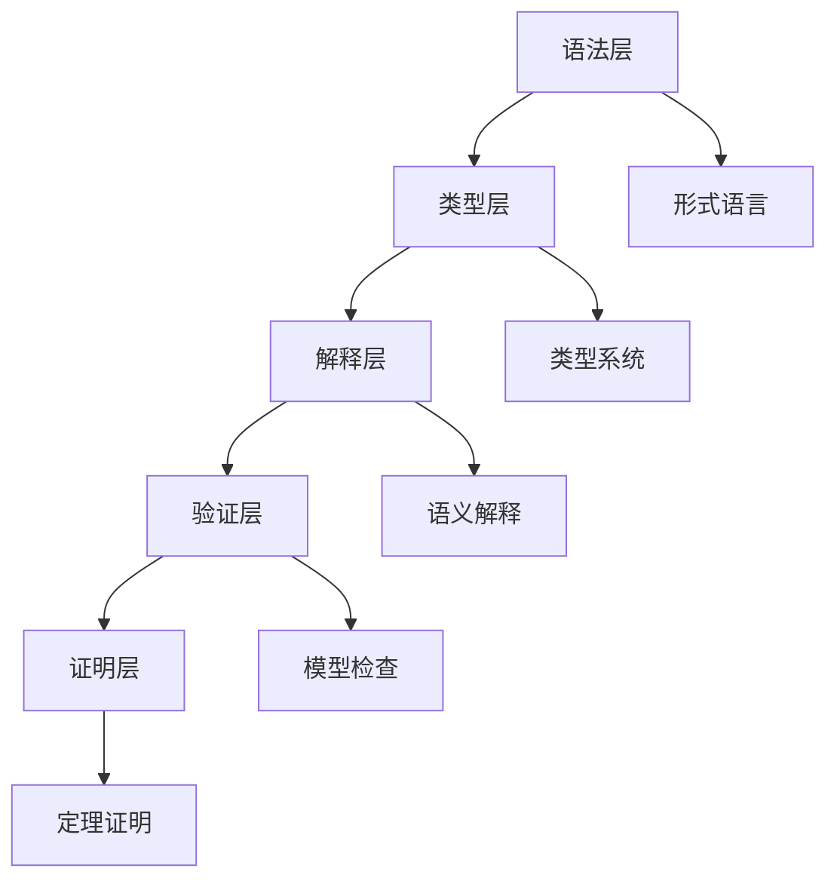

# 1.2 形式化方法论 / Formal Methodology

## 目录 / Table of Contents

- [1.2 形式化方法论 / Formal Methodology](#12-形式化方法论--formal-methodology)
  - [目录 / Table of Contents](#目录--table-of-contents)
  - [1.2.1 形式化建模原理 / Formal Modeling Principles](#121-形式化建模原理--formal-modeling-principles)
    - [形式化定义 / Formal Definition](#形式化定义--formal-definition)
    - [核心原则 / Core Principles](#核心原则--core-principles)
    - [形式化层次 / Formalization Levels](#形式化层次--formalization-levels)
  - [1.2.2 公理化方法 / Axiomatic Method](#122-公理化方法--axiomatic-method)
    - [公理系统定义 / Axiom System Definition](#公理系统定义--axiom-system-definition)
    - [公理类型 / Axiom Types](#公理类型--axiom-types)
      - [逻辑公理 / Logical Axioms](#逻辑公理--logical-axioms)
      - [数学公理 / Mathematical Axioms](#数学公理--mathematical-axioms)
      - [领域公理 / Domain Axioms](#领域公理--domain-axioms)
    - [公理系统性质 / Axiom System Properties](#公理系统性质--axiom-system-properties)
  - [1.2.3 语义学方法 / Semantic Method](#123-语义学方法--semantic-method)
    - [语义解释 / Semantic Interpretation](#语义解释--semantic-interpretation)
    - [真值语义 / Truth Semantics](#真值语义--truth-semantics)
    - [可能世界语义 / Possible Worlds Semantics](#可能世界语义--possible-worlds-semantics)
    - [代数语义 / Algebraic Semantics](#代数语义--algebraic-semantics)
  - [1.2.4 证明论方法 / Proof Theory Method](#124-证明论方法--proof-theory-method)
    - [证明系统 / Proof System](#证明系统--proof-system)
    - [证明结构 / Proof Structure](#证明结构--proof-structure)
    - [证明论性质 / Proof-theoretic Properties](#证明论性质--proof-theoretic-properties)
  - [1.2.5 模型论方法 / Model Theory Method](#125-模型论方法--model-theory-method)
    - [模型定义 / Model Definition](#模型定义--model-definition)
    - [模型构造 / Model Construction](#模型构造--model-construction)
    - [模型论性质 / Model-theoretic Properties](#模型论性质--model-theoretic-properties)
  - [1.2.6 范畴论方法 / Category Theory Method](#126-范畴论方法--category-theory-method)
    - [范畴定义 / Category Definition](#范畴定义--category-definition)
    - [函子 / Functors](#函子--functors)
    - [自然变换 / Natural Transformations](#自然变换--natural-transformations)
    - [极限和余极限 / Limits and Colimits](#极限和余极限--limits-and-colimits)
  - [1.2.7 统一形式化框架 / Unified Formal Framework](#127-统一形式化框架--unified-formal-framework)
    - [框架结构 / Framework Structure](#框架结构--framework-structure)
    - [层次关系 / Hierarchical Relations](#层次关系--hierarchical-relations)
    - [实现示例 / Implementation Examples](#实现示例--implementation-examples)
      - [Rust实现 / Rust Implementation](#rust实现--rust-implementation)
      - [Haskell实现 / Haskell Implementation](#haskell实现--haskell-implementation)
    - [方法论应用 / Methodological Applications](#方法论应用--methodological-applications)
      - [在物理模型中的应用 / Application in Physical Models](#在物理模型中的应用--application-in-physical-models)
      - [在计算机科学中的应用 / Application in Computer Science](#在计算机科学中的应用--application-in-computer-science)
      - [在经济学中的应用 / Application in Economics](#在经济学中的应用--application-in-economics)
  - [参考文献 / References](#参考文献--references)

---

## 1.2.1 形式化建模原理 / Formal Modeling Principles

### 形式化定义 / Formal Definition

**形式化方法论 (Formal Methodology)** 是建立严格数学表示和推理体系的方法，确保模型的一致性和可靠性。

### 核心原则 / Core Principles

**P1 (严格性)**: 所有概念都有精确的数学定义
**P2 (一致性)**: 公理系统内部无矛盾
**P3 (完备性)**: 能够表达目标领域的所有相关概念
**P4 (可验证性)**: 所有断言都可以通过形式化方法验证

### 形式化层次 / Formalization Levels

$$\mathcal{F} = \langle \mathcal{L}, \mathcal{A}, \mathcal{R}, \mathcal{S}, \mathcal{M} \rangle$$

其中：

- $\mathcal{L}$: 形式语言
- $\mathcal{A}$: 公理集合
- $\mathcal{R}$: 推理规则
- $\mathcal{S}$: 语义解释
- $\mathcal{M}$: 模型结构

---

## 1.2.2 公理化方法 / Axiomatic Method

### 公理系统定义 / Axiom System Definition

**公理系统** 是一个三元组 $\langle \mathcal{L}, \mathcal{A}, \mathcal{R} \rangle$，其中：

- $\mathcal{L}$: 形式语言
- $\mathcal{A}$: 公理集合
- $\mathcal{R}$: 推理规则

### 公理类型 / Axiom Types

#### 逻辑公理 / Logical Axioms

- **同一律**: $A \to A$
- **排中律**: $A \lor \neg A$
- **矛盾律**: $\neg(A \land \neg A)$

#### 数学公理 / Mathematical Axioms

- **集合论公理**: ZFC公理系统
- **数论公理**: 皮亚诺公理
- **几何公理**: 希尔伯特公理

#### 领域公理 / Domain Axioms

- **物理公理**: 守恒定律
- **经济公理**: 理性选择
- **生物公理**: 进化原理

### 公理系统性质 / Axiom System Properties

**一致性 (Consistency)**: $\not\vdash \bot$

**完备性 (Completeness)**: $\models A \Rightarrow \vdash A$

**独立性 (Independence)**: 每个公理都不能从其他公理推导

---

## 1.2.3 语义学方法 / Semantic Method

### 语义解释 / Semantic Interpretation

**语义学** 研究形式语言与外部世界的关系。

### 真值语义 / Truth Semantics

**真值函数**: $v: \mathcal{L} \to \{0,1\}$

**满足关系**: $\mathcal{M} \models \phi$

### 可能世界语义 / Possible Worlds Semantics

**克里普克模型**: $\langle W, R, V \rangle$

其中：

- $W$: 可能世界集合
- $R$: 可达关系
- $V$: 赋值函数

### 代数语义 / Algebraic Semantics

**布尔代数**: $\langle B, \land, \lor, \neg, 0, 1 \rangle$

**Heyting代数**: 直觉逻辑的代数语义

---

## 1.2.4 证明论方法 / Proof Theory Method

### 证明系统 / Proof System

**自然演绎**: 基于引入和消除规则的证明系统

**希尔伯特系统**: 基于公理和推理规则的证明系统

**序列演算**: 基于左右规则的证明系统

### 证明结构 / Proof Structure

**证明树**: 从公理到结论的推导树

**证明长度**: 推导步骤的数量

**证明复杂度**: 证明的算法复杂度

### 证明论性质 / Proof-theoretic Properties

**切消定理**: 如果 $\Gamma \vdash A$ 且 $\Delta, A \vdash B$，则 $\Gamma, \Delta \vdash B$

**正规化**: 每个证明都可以转换为正规形式

**子公式性质**: 正规证明中的每个公式都是某个子公式

---

## 1.2.5 模型论方法 / Model Theory Method

### 模型定义 / Model Definition

**模型** 是形式语言的一个解释，满足所有公理。

### 模型构造 / Model Construction

**项模型**: 从项构造的模型

**幂集模型**: 从幂集构造的模型

**超积模型**: 从超积构造的模型

### 模型论性质 / Model-theoretic Properties

**紧致性**: 如果每个有限子集都有模型，则整个集合有模型

**Löwenheim-Skolem定理**: 如果理论有无限模型，则对每个基数都有模型

**完全性**: 每个一致的理论都有模型

---

## 1.2.6 范畴论方法 / Category Theory Method

### 范畴定义 / Category Definition

**范畴** $\mathcal{C}$ 包含：

- 对象集合 $\text{Ob}(\mathcal{C})$
- 态射集合 $\text{Mor}(\mathcal{C})$
- 复合运算 $\circ$
- 单位态射 $\text{id}$

### 函子 / Functors

**协变函子**: $F: \mathcal{C} \to \mathcal{D}$

**反变函子**: $F: \mathcal{C}^{op} \to \mathcal{D}$

### 自然变换 / Natural Transformations

**自然变换**: $\alpha: F \Rightarrow G$

满足：$\alpha_Y \circ F(f) = G(f) \circ \alpha_X$

### 极限和余极限 / Limits and Colimits

**极限**: $\lim F$

**余极限**: $\text{colim} F$

---

## 1.2.7 统一形式化框架 / Unified Formal Framework

### 框架结构 / Framework Structure

$$\mathcal{UF} = \langle \mathcal{S}, \mathcal{T}, \mathcal{I}, \mathcal{V}, \mathcal{P} \rangle$$

其中：

- $\mathcal{S}$: 语法层
- $\mathcal{T}$: 类型层
- $\mathcal{I}$: 解释层
- $\mathcal{V}$: 验证层
- $\mathcal{P}$: 证明层

### 层次关系 / Hierarchical Relations



### 实现示例 / Implementation Examples

#### Rust实现 / Rust Implementation

```rust
use std::collections::HashMap;

#[derive(Debug, Clone)]
pub enum Term {
    Var(String),
    App(Box<Term>, Box<Term>),
    Abs(String, Box<Term>),
}

#[derive(Debug, Clone)]
pub enum Type {
    Base(String),
    Arrow(Box<Type>, Box<Type>),
}

#[derive(Debug)]
pub struct Context {
    pub types: HashMap<String, Type>,
}

impl Context {
    pub fn new() -> Self {
        Self {
            types: HashMap::new(),
        }
    }
    
    pub fn add_binding(&mut self, name: String, ty: Type) {
        self.types.insert(name, ty);
    }
    
    pub fn type_check(&self, term: &Term) -> Option<Type> {
        match term {
            Term::Var(name) => self.types.get(name).cloned(),
            Term::App(t1, t2) => {
                let ty1 = self.type_check(t1)?;
                let ty2 = self.type_check(t2)?;
                
                if let Type::Arrow(ty_arg, ty_ret) = ty1 {
                    if *ty_arg == ty2 {
                        Some(*ty_ret)
                    } else {
                        None
                    }
                } else {
                    None
                }
            }
            Term::Abs(name, body) => {
                // 简化实现，实际需要更复杂的类型推断
                Some(Type::Base("function".to_string()))
            }
        }
    }
}

// 使用示例
fn main() {
    let mut ctx = Context::new();
    ctx.add_binding("x".to_string(), Type::Base("int".to_string()));
    
    let term = Term::Var("x".to_string());
    let ty = ctx.type_check(&term);
    println!("Type: {:?}", ty);
}
```

#### Haskell实现 / Haskell Implementation

```haskell
module FormalFramework where

import Data.Map (Map)
import qualified Data.Map as Map

-- 项的定义
data Term = Var String
          | App Term Term
          | Abs String Term
          deriving (Show, Eq)

-- 类型的定义
data Type = Base String
          | Arrow Type Type
          deriving (Show, Eq)

-- 上下文
type Context = Map String Type

-- 类型检查
typeCheck :: Context -> Term -> Maybe Type
typeCheck ctx (Var name) = Map.lookup name ctx
typeCheck ctx (App t1 t2) = do
    ty1 <- typeCheck ctx t1
    ty2 <- typeCheck ctx t2
    case ty1 of
        Arrow tyArg tyRet -> if tyArg == ty2 then Just tyRet else Nothing
        _ -> Nothing
typeCheck ctx (Abs name body) = do
    -- 简化实现
    Just (Base "function")

-- 示例使用
example :: IO ()
example = do
    let ctx = Map.fromList [("x", Base "int")]
        term = Var "x"
        ty = typeCheck ctx term
    
    putStrLn $ "Type: " ++ show ty
```

### 方法论应用 / Methodological Applications

#### 在物理模型中的应用 / Application in Physical Models

**哈密顿形式化**:
$$\mathcal{H} = T + V$$
$$\frac{dq}{dt} = \frac{\partial H}{\partial p}$$
$$\frac{dp}{dt} = -\frac{\partial H}{\partial q}$$

#### 在计算机科学中的应用 / Application in Computer Science

**类型系统**:
$$\frac{\Gamma \vdash e_1 : \tau_1 \to \tau_2 \quad \Gamma \vdash e_2 : \tau_1}{\Gamma \vdash e_1 e_2 : \tau_2}$$

#### 在经济学中的应用 / Application in Economics

**效用最大化**:
$$\max U(x_1, x_2, \ldots, x_n)$$
$$s.t. \quad \sum_{i=1}^n p_i x_i \leq I$$

---

## 参考文献 / References

1. Enderton, H. B. (2001). A Mathematical Introduction to Logic. Academic Press.
2. Awodey, S. (2010). Category Theory. Oxford University Press.
3. Pierce, B. C. (2002). Types and Programming Languages. MIT Press.
4. Goldblatt, R. (2006). Topoi: The Categorial Analysis of Logic. Dover Publications.

---

*最后更新: 2025-08-01*
*版本: 1.0.0*
