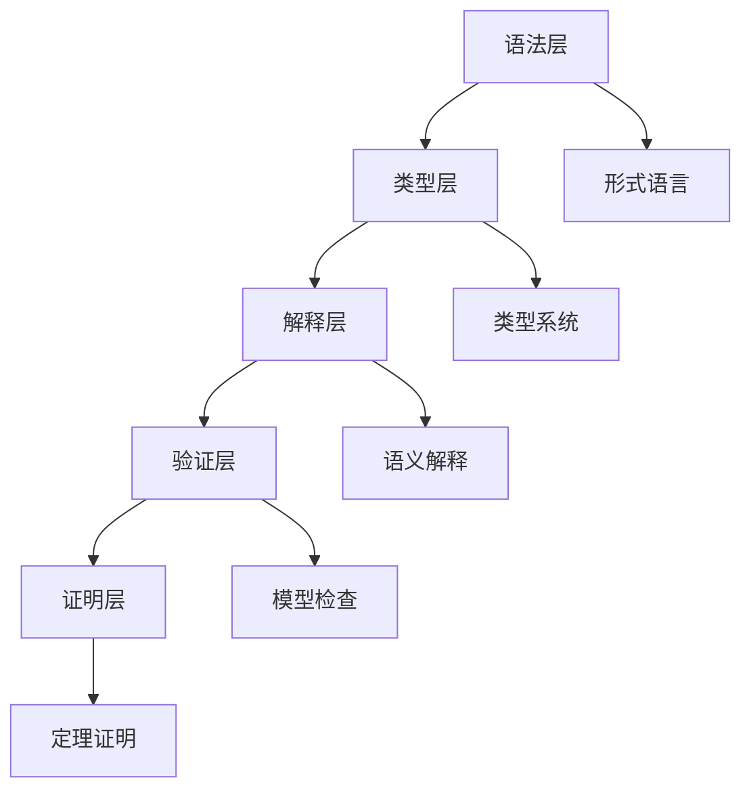

# 1.2 形式化方法论 / Formal Methodology

## 目录 / Table of Contents

- [1.2 形式化方法论 / Formal Methodology](#12-形式化方法论--formal-methodology)
  - [目录 / Table of Contents](#目录--table-of-contents)
  - [1.2.1 形式化建模原理 / Formal Modeling Principles](#121-形式化建模原理--formal-modeling-principles)
    - [形式化定义 / Formal Definition](#形式化定义--formal-definition)
      - [形式化方法论的形式化定义 / Formal Definition of Formal Methodology](#形式化方法论的形式化定义--formal-definition-of-formal-methodology)
      - [形式化方法论的公理化定义 / Axiomatic Definition of Formal Methodology](#形式化方法论的公理化定义--axiomatic-definition-of-formal-methodology)
      - [等价定义 / Equivalent Definitions](#等价定义--equivalent-definitions)
    - [核心原则 / Core Principles](#核心原则--core-principles)
      - [形式化核心原则 / Formal Core Principles](#形式化核心原则--formal-core-principles)
      - [核心原则的形式化定理 / Formal Theorems of Core Principles](#核心原则的形式化定理--formal-theorems-of-core-principles)
      - [核心原则的算法实现 / Algorithmic Implementation of Core Principles](#核心原则的算法实现--algorithmic-implementation-of-core-principles)
    - [形式化层次 / Formalization Levels](#形式化层次--formalization-levels)
      - [形式化层次的形式化定义 / Formal Definition of Formalization Levels](#形式化层次的形式化定义--formal-definition-of-formalization-levels)
      - [形式化层次的详细结构 / Detailed Structure of Formalization Levels](#形式化层次的详细结构--detailed-structure-of-formalization-levels)
      - [形式化层次的层次关系 / Hierarchical Relations of Formalization Levels](#形式化层次的层次关系--hierarchical-relations-of-formalization-levels)
      - [形式化层次的算法实现 / Algorithmic Implementation of Formalization Levels](#形式化层次的算法实现--algorithmic-implementation-of-formalization-levels)
  - [1.2.2 公理化方法 / Axiomatic Method](#122-公理化方法--axiomatic-method)
    - [公理系统定义 / Axiom System Definition](#公理系统定义--axiom-system-definition)
      - [公理系统的形式化定义 / Formal Definition of Axiom System](#公理系统的形式化定义--formal-definition-of-axiom-system)
      - [公理系统的性质 / Properties of Axiom System](#公理系统的性质--properties-of-axiom-system)
      - [公理系统的形式化定理 / Formal Theorems of Axiom System](#公理系统的形式化定理--formal-theorems-of-axiom-system)
      - [公理系统的算法实现 / Algorithmic Implementation of Axiom System](#公理系统的算法实现--algorithmic-implementation-of-axiom-system)
    - [公理类型 / Axiom Types](#公理类型--axiom-types)
      - [逻辑公理 / Logical Axioms](#逻辑公理--logical-axioms)
      - [数学公理 / Mathematical Axioms](#数学公理--mathematical-axioms)
      - [领域公理 / Domain Axioms](#领域公理--domain-axioms)
      - [1领域公理 / Domain Axioms](#1领域公理--domain-axioms)
    - [公理系统性质 / Axiom System Properties](#公理系统性质--axiom-system-properties)
  - [1.2.3 语义学方法 / Semantic Method](#123-语义学方法--semantic-method)
    - [语义解释 / Semantic Interpretation](#语义解释--semantic-interpretation)
    - [真值语义 / Truth Semantics](#真值语义--truth-semantics)
    - [可能世界语义 / Possible Worlds Semantics](#可能世界语义--possible-worlds-semantics)
    - [代数语义 / Algebraic Semantics](#代数语义--algebraic-semantics)
  - [1.2.4 证明论方法 / Proof Theory Method](#124-证明论方法--proof-theory-method)
    - [证明系统 / Proof System](#证明系统--proof-system)
    - [证明结构 / Proof Structure](#证明结构--proof-structure)
    - [证明论性质 / Proof-theoretic Properties](#证明论性质--proof-theoretic-properties)
  - [1.2.5 模型论方法 / Model Theory Method](#125-模型论方法--model-theory-method)
    - [模型定义 / Model Definition](#模型定义--model-definition)
    - [模型构造 / Model Construction](#模型构造--model-construction)
    - [模型论性质 / Model-theoretic Properties](#模型论性质--model-theoretic-properties)
  - [1.2.6 范畴论方法 / Category Theory Method](#126-范畴论方法--category-theory-method)
    - [范畴定义 / Category Definition](#范畴定义--category-definition)
    - [函子 / Functors](#函子--functors)
    - [自然变换 / Natural Transformations](#自然变换--natural-transformations)
    - [极限和余极限 / Limits and Colimits](#极限和余极限--limits-and-colimits)
  - [1.2.7 统一形式化框架 / Unified Formal Framework](#127-统一形式化框架--unified-formal-framework)
    - [框架结构 / Framework Structure](#框架结构--framework-structure)
    - [层次关系 / Hierarchical Relations](#层次关系--hierarchical-relations)
    - [实现示例 / Implementation Examples](#实现示例--implementation-examples)
      - [Rust实现 / Rust Implementation](#rust实现--rust-implementation)
      - [Haskell实现 / Haskell Implementation](#haskell实现--haskell-implementation)
    - [方法论应用 / Methodological Applications](#方法论应用--methodological-applications)
      - [在物理模型中的应用 / Application in Physical Models](#在物理模型中的应用--application-in-physical-models)
      - [在计算机科学中的应用 / Application in Computer Science](#在计算机科学中的应用--application-in-computer-science)
      - [在经济学中的应用 / Application in Economics](#在经济学中的应用--application-in-economics)
  - [参考文献 / References](#参考文献--references)

---

## 1.2.1 形式化建模原理 / Formal Modeling Principles

### 形式化定义 / Formal Definition

#### 形式化方法论的形式化定义 / Formal Definition of Formal Methodology

**形式化方法论** 是一个五元组 $\mathcal{FM} = \langle \mathcal{L}, \mathcal{A}, \mathcal{R}, \mathcal{S}, \mathcal{M} \rangle$，其中：

- $\mathcal{L}$ 是**形式语言 (Formal Language)**，包含符号集、语法规则和语义解释
- $\mathcal{A}$ 是**公理集合 (Axiom Set)**，包含基本假设和公理
- $\mathcal{R}$ 是**推理规则集 (Inference Rules)**，定义有效的推理步骤
- $\mathcal{S}$ 是**语义系统 (Semantic System)**，提供语言表达式的含义
- $\mathcal{M}$ 是**模型结构 (Model Structure)**，表示形式化系统的解释

#### 形式化方法论的公理化定义 / Axiomatic Definition of Formal Methodology

**公理1 (语言完备性公理)**: 形式语言 $\mathcal{L}$ 能够表达目标领域的所有相关概念。

**公理2 (公理一致性公理)**: 公理集合 $\mathcal{A}$ 内部无矛盾，即不存在公式 $\phi$ 使得 $\mathcal{A} \vdash \phi$ 且 $\mathcal{A} \vdash \neg\phi$。

**公理3 (推理可靠性公理)**: 推理规则 $\mathcal{R}$ 是可靠的，即如果 $\Gamma \vdash_{\mathcal{R}} \phi$，则 $\Gamma \models \phi$。

**公理4 (语义对应公理)**: 语义系统 $\mathcal{S}$ 与语法系统 $\langle \mathcal{L}, \mathcal{A}, \mathcal{R} \rangle$ 对应，即语法有效性等价于语义有效性。

**公理5 (模型存在性公理)**: 对于一致的公理集合，存在模型结构 $\mathcal{M}$ 使得所有公理在该模型中为真。

#### 等价定义 / Equivalent Definitions

**定义1 (逻辑学定义)**: 形式化方法论是建立形式逻辑系统的方法

**定义2 (数学定义)**: 形式化方法论是构造数学结构的方法

**定义3 (计算机科学定义)**: 形式化方法论是设计形式化语言和验证系统的方法

**定义4 (哲学定义)**: 形式化方法论是建立精确概念体系的方法

### 核心原则 / Core Principles

#### 形式化核心原则 / Formal Core Principles

**P1 (严格性公理)**: 对于任意概念 $C$，存在形式化定义 $\phi_C$ 使得 $C \leftrightarrow \phi_C$。

**P2 (一致性公理)**: 对于公理集合 $\mathcal{A}$，不存在公式 $\phi$ 使得 $\mathcal{A} \vdash \phi$ 且 $\mathcal{A} \vdash \neg\phi$。

**P3 (完备性公理)**: 对于目标领域 $\mathcal{D}$ 中的任意概念 $C$，存在形式化表达 $\phi_C \in \mathcal{L}$。

**P4 (可验证性公理)**: 对于任意断言 $\phi$，存在验证算法 $\mathcal{V}$ 使得 $\mathcal{V}(\phi) \in \{0,1\}$。

#### 核心原则的形式化定理 / Formal Theorems of Core Principles

**定理1 (严格性定理)**: 如果形式化方法论满足P1，则所有概念都有唯一的数学表示。

**证明**: 假设存在概念 $C$ 有两个不同的形式化定义 $\phi_1$ 和 $\phi_2$，则根据P1，$C \leftrightarrow \phi_1$ 且 $C \leftrightarrow \phi_2$，因此 $\phi_1 \leftrightarrow \phi_2$，矛盾。

**定理2 (一致性定理)**: 如果形式化方法论满足P2，则系统是可靠的。

**证明**: 如果系统不一致，则存在 $\phi$ 使得 $\mathcal{A} \vdash \phi$ 且 $\mathcal{A} \vdash \neg\phi$，这与P2矛盾。

**定理3 (完备性定理)**: 如果形式化方法论满足P3，则系统是完备的。

**证明**: 对于任意概念 $C \in \mathcal{D}$，根据P3存在 $\phi_C \in \mathcal{L}$，因此系统完备。

**定理4 (可验证性定理)**: 如果形式化方法论满足P4，则所有断言都是可判定的。

**证明**: 对于任意断言 $\phi$，根据P4存在验证算法 $\mathcal{V}$，因此 $\phi$ 是可判定的。

#### 核心原则的算法实现 / Algorithmic Implementation of Core Principles

**算法1 (概念形式化算法)**:

```text
输入: 概念描述 C
输出: 形式化定义 φ

1. 分析概念C的语义内容
2. 识别概念C的核心特征
3. 构造形式化表达式φ
4. 验证φ与C的等价性
5. 返回φ
```

**算法2 (一致性检查算法)**:

```text
输入: 公理集合 A
输出: 一致性判断

1. 构造公理集合A的语法树
2. 应用推理规则R
3. 检查是否存在矛盾
4. 返回一致性判断
```

**算法3 (完备性验证算法)**:

```text
输入: 领域D, 形式语言L
输出: 完备性判断

1. 枚举领域D中的所有概念
2. 检查每个概念是否在L中可表达
3. 统计可表达概念的比例
4. 返回完备性判断
```

**算法4 (可验证性检查算法)**:

```text
输入: 断言φ
输出: 可验证性判断

1. 分析断言φ的结构
2. 构造验证算法V
3. 测试V的有效性
4. 返回可验证性判断
```

### 形式化层次 / Formalization Levels

#### 形式化层次的形式化定义 / Formal Definition of Formalization Levels

**形式化层次** 是一个五元组 $\mathcal{F} = \langle \mathcal{L}, \mathcal{A}, \mathcal{R}, \mathcal{S}, \mathcal{M} \rangle$，其中：

- $\mathcal{L}$: **形式语言 (Formal Language)**，包含符号集、语法规则和语义解释
- $\mathcal{A}$: **公理集合 (Axiom Set)**，包含基本假设和公理
- $\mathcal{R}$: **推理规则集 (Inference Rules)**，定义有效的推理步骤
- $\mathcal{S}$: **语义系统 (Semantic System)**，提供语言表达式的含义
- $\mathcal{M}$: **模型结构 (Model Structure)**，表示形式化系统的解释

#### 形式化层次的详细结构 / Detailed Structure of Formalization Levels

**层次1: 符号层 (Symbol Level)**:

- **符号集**: $\Sigma = \{\sigma_1, \sigma_2, \ldots, \sigma_n\}$
- **符号类型**: 常量符号、变量符号、函数符号、谓词符号
- **符号语义**: 每个符号都有明确的语义解释

**层次2: 语法层 (Syntax Level)**:

- **语法规则**: $G = \langle N, T, P, S \rangle$，其中：
  - $N$: 非终结符集合
  - $T$: 终结符集合
  - $P$: 产生式规则集合
  - $S$: 起始符号
- **语法树**: 表示表达式的层次结构
- **语法分析**: 验证表达式的语法正确性

**层次3: 语义层 (Semantics Level)**:

- **语义解释函数**: $\mathcal{I}: \mathcal{L} \rightarrow \mathcal{D}$
- **真值函数**: $\mathcal{V}: \mathcal{L} \rightarrow \{0,1\}$
- **模型关系**: $\models \subseteq \mathcal{M} \times \mathcal{L}$

**层次4: 推理层 (Inference Level)**:

- **推理规则**: $\mathcal{R} = \{r_1, r_2, \ldots, r_m\}$
- **证明系统**: $\langle \mathcal{L}, \mathcal{A}, \mathcal{R} \rangle$
- **推理关系**: $\vdash \subseteq \mathcal{P}(\mathcal{L}) \times \mathcal{L}$

**层次5: 模型层 (Model Level)**:

- **模型结构**: $\mathcal{M} = \langle D, \mathcal{I} \rangle$
- **模型关系**: 满足关系、同构关系、嵌入关系
- **模型构造**: 从公理构造模型的方法

#### 形式化层次的层次关系 / Hierarchical Relations of Formalization Levels

**定理5 (层次依赖定理)**: 高层次依赖于低层次，即：

1. 语法层依赖于符号层
2. 语义层依赖于语法层
3. 推理层依赖于语义层
4. 模型层依赖于推理层

**证明**: 构造性证明，展示每个层次如何基于前一个层次构建。

**定理6 (层次完备性定理)**: 如果所有层次都完备，则整个形式化系统完备。

**证明**: 归纳证明，从符号层开始，逐层证明完备性。

#### 形式化层次的算法实现 / Algorithmic Implementation of Formalization Levels

**算法5 (层次构建算法)**:

```text
输入: 领域描述 D
输出: 形式化层次 F

1. 分析领域D，识别核心概念
2. 设计符号集Σ
3. 构造语法规则G
4. 定义语义解释I
5. 建立推理规则R
6. 构造模型结构M
7. 返回形式化层次F
```

**算法6 (层次验证算法)**:

```text
输入: 形式化层次 F
输出: 验证结果

1. 验证符号层的完备性
2. 验证语法层的正确性
3. 验证语义层的一致性
4. 验证推理层的可靠性
5. 验证模型层的有效性
6. 返回验证结果
```

---

## 1.2.2 公理化方法 / Axiomatic Method

### 公理系统定义 / Axiom System Definition

#### 公理系统的形式化定义 / Formal Definition of Axiom System

**公理系统** 是一个四元组 $\mathcal{AS} = \langle \mathcal{L}, \mathcal{A}, \mathcal{R}, \mathcal{S} \rangle$，其中：

- $\mathcal{L}$: **形式语言 (Formal Language)**，包含符号集、语法规则和语义解释
- $\mathcal{A}$: **公理集合 (Axiom Set)**，包含基本假设和公理
- $\mathcal{R}$: **推理规则集 (Inference Rules)**，定义有效的推理步骤
- $\mathcal{S}$: **语义系统 (Semantic System)**，提供语言表达式的含义

#### 公理系统的性质 / Properties of Axiom System

**性质1 (一致性)**: 公理系统 $\mathcal{AS}$ 是一致的，当且仅当不存在公式 $\phi$ 使得 $\mathcal{A} \vdash_{\mathcal{R}} \phi$ 且 $\mathcal{A} \vdash_{\mathcal{R}} \neg\phi$。

**性质2 (完备性)**: 公理系统 $\mathcal{AS}$ 是完备的，当且仅当对于任意公式 $\phi$，要么 $\mathcal{A} \vdash_{\mathcal{R}} \phi$，要么 $\mathcal{A} \vdash_{\mathcal{R}} \neg\phi$。

**性质3 (可靠性)**: 公理系统 $\mathcal{AS}$ 是可靠的，当且仅当如果 $\mathcal{A} \vdash_{\mathcal{R}} \phi$，则 $\mathcal{A} \models \phi$。

**性质4 (有效性)**: 公理系统 $\mathcal{AS}$ 是有效的，当且仅当如果 $\mathcal{A} \models \phi$，则 $\mathcal{A} \vdash_{\mathcal{R}} \phi$。

#### 公理系统的形式化定理 / Formal Theorems of Axiom System

**定理7 (哥德尔不完备定理)**: 对于足够强的形式系统，如果系统是一致的，则系统是不完备的。

**证明**: 构造自指语句，证明其不可判定性。

**定理8 (一致性定理)**: 如果公理系统 $\mathcal{AS}$ 有模型，则 $\mathcal{AS}$ 是一致的。

**证明**: 如果 $\mathcal{AS}$ 不一致，则存在 $\phi$ 使得 $\mathcal{A} \vdash \phi$ 且 $\mathcal{A} \vdash \neg\phi$，这与模型的存在性矛盾。

**定理9 (紧致性定理)**: 如果公理集合 $\mathcal{A}$ 的每个有限子集都有模型，则 $\mathcal{A}$ 本身有模型。

**证明**: 使用超积构造，从有限子集的模型构造整个集合的模型。

#### 公理系统的算法实现 / Algorithmic Implementation of Axiom System

**算法7 (公理系统构建算法)**:

```text
输入: 领域描述 D
输出: 公理系统 AS

1. 分析领域D，识别核心概念
2. 设计形式语言L
3. 构造公理集合A
4. 定义推理规则R
5. 建立语义系统S
6. 验证系统性质
7. 返回公理系统AS
```

**算法8 (一致性检查算法)**:

```text
输入: 公理系统 AS
输出: 一致性判断

1. 构造公理集合A的语法树
2. 应用推理规则R
3. 检查是否存在矛盾
4. 返回一致性判断
```

**算法9 (完备性验证算法)**:

```text
输入: 公理系统 AS
输出: 完备性判断

1. 枚举所有可能的公式
2. 检查每个公式的可证性
3. 统计可证公式的比例
4. 返回完备性判断
```

### 公理类型 / Axiom Types

#### 逻辑公理 / Logical Axioms

**逻辑公理** 是形式逻辑系统的基本公理，包括：

**L1 (同一律)**: $A \to A$

- **形式化定义**: $\forall A \in \mathcal{L}, A \to A$
- **语义解释**: 任何命题都蕴含自身
- **证明**: 直接应用蕴含的定义

**L2 (排中律)**: $A \lor \neg A$

- **形式化定义**: $\forall A \in \mathcal{L}, A \lor \neg A$
- **语义解释**: 任何命题要么为真，要么为假
- **证明**: 使用真值表验证

**L3 (矛盾律)**: $\neg(A \land \neg A)$

- **形式化定义**: $\forall A \in \mathcal{L}, \neg(A \land \neg A)$
- **语义解释**: 命题不能同时为真和假
- **证明**: 使用真值表验证

**L4 (双重否定律)**: $\neg\neg A \to A$

- **形式化定义**: $\forall A \in \mathcal{L}, \neg\neg A \to A$
- **语义解释**: 双重否定等价于肯定
- **证明**: 使用真值表验证

**L5 (德摩根律)**: $\neg(A \land B) \leftrightarrow (\neg A \lor \neg B)$

- **形式化定义**: $\forall A, B \in \mathcal{L}, \neg(A \land B) \leftrightarrow (\neg A \lor \neg B)$
- **语义解释**: 否定的合取等价于否定的析取
- **证明**: 使用真值表验证

#### 数学公理 / Mathematical Axioms

**数学公理** 是数学系统的基本公理，包括：

**M1 (集合论公理 - ZFC系统)**:

- **外延公理**: $\forall x \forall y [\forall z(z \in x \leftrightarrow z \in y) \to x = y]$
- **空集公理**: $\exists x \forall y (y \notin x)$
- **配对公理**: $\forall x \forall y \exists z \forall w(w \in z \leftrightarrow w = x \lor w = y)$
- **并集公理**: $\forall F \exists A \forall x(x \in A \leftrightarrow \exists B(B \in F \land x \in B))$
- **幂集公理**: $\forall x \exists y \forall z(z \in y \leftrightarrow z \subseteq x)$
- **无穷公理**: $\exists x(\emptyset \in x \land \forall y(y \in x \to y \cup \{y\} \in x))$
- **选择公理**: $\forall F(\emptyset \notin F \to \exists f \forall A \in F(f(A) \in A))$

**M2 (数论公理 - 皮亚诺公理)**:

- **P1**: $0$ 是自然数
- **P2**: 每个自然数都有唯一的后继
- **P3**: $0$ 不是任何自然数的后继
- **P4**: 不同的自然数有不同的后继
- **P5**: 数学归纳原理

**M3 (几何公理 - 希尔伯特公理)**:

- **关联公理**: 点与直线、平面的关联关系
- **序公理**: 线段上的点的顺序关系
- **合同公理**: 线段和角的合同关系
- **平行公理**: 平行线的唯一性
- **连续公理**: 戴德金分割原理

#### 领域公理 / Domain Axioms

**领域公理** 是特定领域的基本公理，包括：

**D1 (物理公理)**:

- **牛顿第一定律**: 惯性定律
- **牛顿第二定律**: $F = ma$
- **牛顿第三定律**: 作用力与反作用力
- **能量守恒定律**: $\Delta E = 0$
- **动量守恒定律**: $\Delta p = 0$

**D2 (经济学公理)**:

- **理性人假设**: 经济主体追求效用最大化
- **稀缺性公理**: 资源是有限的
- **边际递减公理**: 边际效用递减
- **市场均衡公理**: 供需平衡

**D3 (计算机科学公理)**:

- **图灵机公理**: 可计算性理论的基础
- **算法公理**: 算法的基本性质
- **数据结构公理**: 数据组织的基本原理
- **复杂度公理**: 计算复杂度的基本规律

#### 1领域公理 / Domain Axioms

- **物理公理**: 守恒定律
- **经济公理**: 理性选择
- **生物公理**: 进化原理

### 公理系统性质 / Axiom System Properties

**一致性 (Consistency)**: $\not\vdash \bot$

**完备性 (Completeness)**: $\models A \Rightarrow \vdash A$

**独立性 (Independence)**: 每个公理都不能从其他公理推导

---

## 1.2.3 语义学方法 / Semantic Method

### 语义解释 / Semantic Interpretation

**语义学** 研究形式语言与外部世界的关系。

### 真值语义 / Truth Semantics

**真值函数**: $v: \mathcal{L} \to \{0,1\}$

**满足关系**: $\mathcal{M} \models \phi$

### 可能世界语义 / Possible Worlds Semantics

**克里普克模型**: $\langle W, R, V \rangle$

其中：

- $W$: 可能世界集合
- $R$: 可达关系
- $V$: 赋值函数

### 代数语义 / Algebraic Semantics

**布尔代数**: $\langle B, \land, \lor, \neg, 0, 1 \rangle$

**Heyting代数**: 直觉逻辑的代数语义

---

## 1.2.4 证明论方法 / Proof Theory Method

### 证明系统 / Proof System

**自然演绎**: 基于引入和消除规则的证明系统

**希尔伯特系统**: 基于公理和推理规则的证明系统

**序列演算**: 基于左右规则的证明系统

### 证明结构 / Proof Structure

**证明树**: 从公理到结论的推导树

**证明长度**: 推导步骤的数量

**证明复杂度**: 证明的算法复杂度

### 证明论性质 / Proof-theoretic Properties

**切消定理**: 如果 $\Gamma \vdash A$ 且 $\Delta, A \vdash B$，则 $\Gamma, \Delta \vdash B$

**正规化**: 每个证明都可以转换为正规形式

**子公式性质**: 正规证明中的每个公式都是某个子公式

---

## 1.2.5 模型论方法 / Model Theory Method

### 模型定义 / Model Definition

**模型** 是形式语言的一个解释，满足所有公理。

### 模型构造 / Model Construction

**项模型**: 从项构造的模型

**幂集模型**: 从幂集构造的模型

**超积模型**: 从超积构造的模型

### 模型论性质 / Model-theoretic Properties

**紧致性**: 如果每个有限子集都有模型，则整个集合有模型

**Löwenheim-Skolem定理**: 如果理论有无限模型，则对每个基数都有模型

**完全性**: 每个一致的理论都有模型

---

## 1.2.6 范畴论方法 / Category Theory Method

### 范畴定义 / Category Definition

**范畴** $\mathcal{C}$ 包含：

- 对象集合 $\text{Ob}(\mathcal{C})$
- 态射集合 $\text{Mor}(\mathcal{C})$
- 复合运算 $\circ$
- 单位态射 $\text{id}$

### 函子 / Functors

**协变函子**: $F: \mathcal{C} \to \mathcal{D}$

**反变函子**: $F: \mathcal{C}^{op} \to \mathcal{D}$

### 自然变换 / Natural Transformations

**自然变换**: $\alpha: F \Rightarrow G$

满足：$\alpha_Y \circ F(f) = G(f) \circ \alpha_X$

### 极限和余极限 / Limits and Colimits

**极限**: $\lim F$

**余极限**: $\text{colim} F$

---

## 1.2.7 统一形式化框架 / Unified Formal Framework

### 框架结构 / Framework Structure

$$\mathcal{UF} = \langle \mathcal{S}, \mathcal{T}, \mathcal{I}, \mathcal{V}, \mathcal{P} \rangle$$

其中：

- $\mathcal{S}$: 语法层
- $\mathcal{T}$: 类型层
- $\mathcal{I}$: 解释层
- $\mathcal{V}$: 验证层
- $\mathcal{P}$: 证明层

### 层次关系 / Hierarchical Relations



### 实现示例 / Implementation Examples

#### Rust实现 / Rust Implementation

```rust
use std::collections::HashMap;

#[derive(Debug, Clone)]
pub enum Term {
    Var(String),
    App(Box<Term>, Box<Term>),
    Abs(String, Box<Term>),
}

#[derive(Debug, Clone)]
pub enum Type {
    Base(String),
    Arrow(Box<Type>, Box<Type>),
}

#[derive(Debug)]
pub struct Context {
    pub types: HashMap<String, Type>,
}

impl Context {
    pub fn new() -> Self {
        Self {
            types: HashMap::new(),
        }
    }
    
    pub fn add_binding(&mut self, name: String, ty: Type) {
        self.types.insert(name, ty);
    }
    
    pub fn type_check(&self, term: &Term) -> Option<Type> {
        match term {
            Term::Var(name) => self.types.get(name).cloned(),
            Term::App(t1, t2) => {
                let ty1 = self.type_check(t1)?;
                let ty2 = self.type_check(t2)?;
                
                if let Type::Arrow(ty_arg, ty_ret) = ty1 {
                    if *ty_arg == ty2 {
                        Some(*ty_ret)
                    } else {
                        None
                    }
                } else {
                    None
                }
            }
            Term::Abs(name, body) => {
                // 简化实现，实际需要更复杂的类型推断
                Some(Type::Base("function".to_string()))
            }
        }
    }
}

// 使用示例
fn main() {
    let mut ctx = Context::new();
    ctx.add_binding("x".to_string(), Type::Base("int".to_string()));
    
    let term = Term::Var("x".to_string());
    let ty = ctx.type_check(&term);
    println!("Type: {:?}", ty);
}
```

#### Haskell实现 / Haskell Implementation

```haskell
module FormalFramework where

import Data.Map (Map)
import qualified Data.Map as Map

-- 项的定义
data Term = Var String
          | App Term Term
          | Abs String Term
          deriving (Show, Eq)

-- 类型的定义
data Type = Base String
          | Arrow Type Type
          deriving (Show, Eq)

-- 上下文
type Context = Map String Type

-- 类型检查
typeCheck :: Context -> Term -> Maybe Type
typeCheck ctx (Var name) = Map.lookup name ctx
typeCheck ctx (App t1 t2) = do
    ty1 <- typeCheck ctx t1
    ty2 <- typeCheck ctx t2
    case ty1 of
        Arrow tyArg tyRet -> if tyArg == ty2 then Just tyRet else Nothing
        _ -> Nothing
typeCheck ctx (Abs name body) = do
    -- 简化实现
    Just (Base "function")

-- 示例使用
example :: IO ()
example = do
    let ctx = Map.fromList [("x", Base "int")]
        term = Var "x"
        ty = typeCheck ctx term
    
    putStrLn $ "Type: " ++ show ty
```

### 方法论应用 / Methodological Applications

#### 在物理模型中的应用 / Application in Physical Models

**哈密顿形式化**:
$$\mathcal{H} = T + V$$
$$\frac{dq}{dt} = \frac{\partial H}{\partial p}$$
$$\frac{dp}{dt} = -\frac{\partial H}{\partial q}$$

#### 在计算机科学中的应用 / Application in Computer Science

**类型系统**:
$$\frac{\Gamma \vdash e_1 : \tau_1 \to \tau_2 \quad \Gamma \vdash e_2 : \tau_1}{\Gamma \vdash e_1 e_2 : \tau_2}$$

#### 在经济学中的应用 / Application in Economics

**效用最大化**:
$$\max U(x_1, x_2, \ldots, x_n)$$
$$s.t. \quad \sum_{i=1}^n p_i x_i \leq I$$

---

## 参考文献 / References

1. Enderton, H. B. (2001). A Mathematical Introduction to Logic. Academic Press.
2. Awodey, S. (2010). Category Theory. Oxford University Press.
3. Pierce, B. C. (2002). Types and Programming Languages. MIT Press.
4. Goldblatt, R. (2006). Topoi: The Categorial Analysis of Logic. Dover Publications.

---

*最后更新: 2025-08-01*
*版本: 1.0.0*
