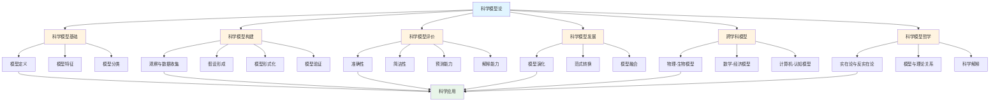
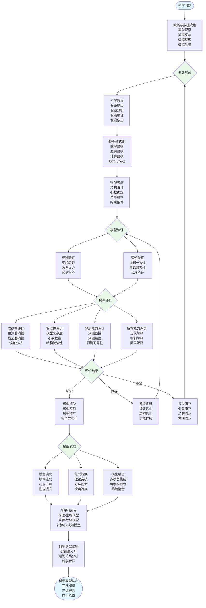

# 1.3 科学模型论 / Scientific Model Theory

## 目录 / Table of Contents

- [1.3 科学模型论 / Scientific Model Theory](#13-科学模型论--scientific-model-theory)
  - [目录 / Table of Contents](#目录--table-of-contents)
  - [科学模型论框架图 / Framework Diagram of Scientific Model Theory](#科学模型论框架图--framework-diagram-of-scientific-model-theory)
  - [科学模型构建与评价流程 / Flowchart of Scientific Model Construction and Evaluation](#科学模型构建与评价流程--flowchart-of-scientific-model-construction-and-evaluation)
  - [1.3.1 科学模型基础 / Scientific Model Fundamentals](#131-科学模型基础--scientific-model-fundamentals)
    - [科学模型定义 / Scientific Model Definition](#科学模型定义--scientific-model-definition)
      - [科学模型的形式化定义 / Formal Definition of Scientific Model](#科学模型的形式化定义--formal-definition-of-scientific-model)
      - [科学模型的公理化定义 / Axiomatic Definition of Scientific Model](#科学模型的公理化定义--axiomatic-definition-of-scientific-model)
      - [科学模型的等价定义 / Equivalent Definitions of Scientific Model](#科学模型的等价定义--equivalent-definitions-of-scientific-model)
      - [科学模型的历史发展 / Historical Development of Scientific Models](#科学模型的历史发展--historical-development-of-scientific-models)
    - [科学模型特征 / Scientific Model Characteristics](#科学模型特征--scientific-model-characteristics)
      - [科学模型的形式化特征 / Formal Characteristics of Scientific Models](#科学模型的形式化特征--formal-characteristics-of-scientific-models)
      - [科学模型的核心特征 / Core Characteristics of Scientific Models](#科学模型的核心特征--core-characteristics-of-scientific-models)
      - [科学模型的形式化定理 / Formal Theorems of Scientific Models](#科学模型的形式化定理--formal-theorems-of-scientific-models)
      - [科学模型特征的算法实现 / Algorithmic Implementation of Scientific Model Characteristics](#科学模型特征的算法实现--algorithmic-implementation-of-scientific-model-characteristics)
    - [科学模型分类 / Scientific Model Classification](#科学模型分类--scientific-model-classification)
      - [按学科分类 / Classification by Discipline](#按学科分类--classification-by-discipline)
      - [按抽象程度分类 / Classification by Abstraction Level](#按抽象程度分类--classification-by-abstraction-level)
  - [1.3.2 科学模型构建 / Scientific Model Construction](#132-科学模型构建--scientific-model-construction)
    - [观察与数据收集 / Observation and Data Collection](#观察与数据收集--observation-and-data-collection)
    - [假设形成 / Hypothesis Formation](#假设形成--hypothesis-formation)
    - [模型形式化 / Model Formalization](#模型形式化--model-formalization)
    - [模型验证 / Model Validation](#模型验证--model-validation)
  - [1.3.3 科学模型评价 / Scientific Model Evaluation](#133-科学模型评价--scientific-model-evaluation)
    - [准确性 / Accuracy](#准确性--accuracy)
    - [简洁性 / Simplicity](#简洁性--simplicity)
    - [预测能力 / Predictive Power](#预测能力--predictive-power)
    - [解释能力 / Explanatory Power](#解释能力--explanatory-power)
  - [1.3.4 科学模型发展 / Scientific Model Development](#134-科学模型发展--scientific-model-development)
    - [模型演化 / Model Evolution](#模型演化--model-evolution)
    - [范式转换 / Paradigm Shifts](#范式转换--paradigm-shifts)
    - [模型融合 / Model Integration](#模型融合--model-integration)
  - [1.3.5 跨学科模型 / Interdisciplinary Models](#135-跨学科模型--interdisciplinary-models)
    - [物理-生物模型 / Physics-Biology Models](#物理-生物模型--physics-biology-models)
    - [数学-经济模型 / Mathematics-Economics Models](#数学-经济模型--mathematics-economics-models)
    - [计算机-认知模型 / Computer-Cognitive Models](#计算机-认知模型--computer-cognitive-models)
  - [1.3.6 科学模型哲学 / Philosophy of Scientific Models](#136-科学模型哲学--philosophy-of-scientific-models)
    - [实在论与反实在论 / Realism vs Anti-realism](#实在论与反实在论--realism-vs-anti-realism)
    - [模型与理论关系 / Model-Theory Relationship](#模型与理论关系--model-theory-relationship)
    - [科学解释 / Scientific Explanation](#科学解释--scientific-explanation)
  - [参考文献 / References](#参考文献--references)
  - [相关模型 / Related Models](#相关模型--related-models)
    - [基础理论 / Basic Theory](#基础理论--basic-theory)
    - [物理科学模型 / Physical Science Models](#物理科学模型--physical-science-models)
    - [数学科学模型 / Mathematical Science Models](#数学科学模型--mathematical-science-models)
    - [计算机科学模型 / Computer Science Models](#计算机科学模型--computer-science-models)
    - [生命科学模型 / Life Science Models](#生命科学模型--life-science-models)
    - [社会科学模型 / Social Science Models](#社会科学模型--social-science-models)
    - [工程科学模型 / Engineering Science Models](#工程科学模型--engineering-science-models)
    - [行业应用模型 / Industry Application Models](#行业应用模型--industry-application-models)

---

## 科学模型论框架图 / Framework Diagram of Scientific Model Theory



## 科学模型构建与评价流程 / Flowchart of Scientific Model Construction and Evaluation



## 1.3.1 科学模型基础 / Scientific Model Fundamentals

### 科学模型定义 / Scientific Model Definition

#### 科学模型的形式化定义 / Formal Definition of Scientific Model

**科学模型** 是一个五元组 $\mathcal{SM} = \langle \mathcal{D}, \mathcal{R}, \mathcal{F}, \mathcal{V}, \mathcal{E} \rangle$，其中：

- $\mathcal{D}$: **数据域 (Data Domain)**，包含观察数据和实验数据
- $\mathcal{R}$: **关系集合 (Relation Set)**，描述现象间的关系
- $\mathcal{F}$: **函数集合 (Function Set)**，描述现象的数学关系
- $\mathcal{V}$: **验证标准 (Validation Criteria)**，用于验证模型的正确性
- $\mathcal{E}$: **解释系统 (Explanation System)**，提供现象的解释

#### 科学模型的公理化定义 / Axiomatic Definition of Scientific Model

**公理1 (经验基础公理)**: 对于任意科学模型 $\mathcal{SM}$，存在数据集合 $\mathcal{D}$ 使得 $\mathcal{SM}$ 基于 $\mathcal{D}$ 构建。

**公理2 (理论支撑公理)**: 科学模型 $\mathcal{SM}$ 建立在科学理论 $\mathcal{T}$ 基础上，即 $\mathcal{SM} \models \mathcal{T}$。

**公理3 (预测能力公理)**: 科学模型 $\mathcal{SM}$ 能够预测未知现象，即存在预测函数 $P: \mathcal{D} \rightarrow \mathcal{D}'$。

**公理4 (可验证性公理)**: 科学模型 $\mathcal{SM}$ 能够通过实验验证，即存在验证函数 $V: \mathcal{SM} \times \mathcal{E} \rightarrow \{0,1\}$。

**公理5 (可修正性公理)**: 科学模型 $\mathcal{SM}$ 能够根据新证据修正，即存在修正函数 $C: \mathcal{SM} \times \mathcal{D}' \rightarrow \mathcal{SM}'$。

#### 科学模型的等价定义 / Equivalent Definitions of Scientific Model

**定义1 (认识论定义)**: 科学模型是人类认识自然现象的工具

**定义2 (方法论定义)**: 科学模型是科学研究的方法和手段

**定义3 (本体论定义)**: 科学模型是现象本质的反映

**定义4 (工具论定义)**: 科学模型是科学实践的工具

#### 科学模型的历史发展 / Historical Development of Scientific Models

**古典时期 (1900年前)**:

- 亚里士多德的四因说
- 牛顿的力学模型
- 达尔文的进化论模型

**现代时期 (1900-1950)**:

- 爱因斯坦的相对论模型
- 玻尔的量子模型
- 维纳的控制论模型

**当代时期 (1950-2000)**:

- 香农的信息论模型
- 纳什的博弈论模型
- 图灵的计算模型

**新兴时期 (2000年后)**:

- 复杂系统模型
- 人工智能模型
- 大数据模型

### 科学模型特征 / Scientific Model Characteristics

#### 科学模型的形式化特征 / Formal Characteristics of Scientific Models

**形式化表示**:
$$\mathcal{SM} = \langle \mathcal{D}, \mathcal{R}, \mathcal{F}, \mathcal{V}, \mathcal{E} \rangle$$

其中：

- $\mathcal{D}$: **数据域 (Data Domain)**，包含观察数据和实验数据
- $\mathcal{R}$: **关系集合 (Relation Set)**，描述现象间的关系
- $\mathcal{F}$: **函数集合 (Function Set)**，描述现象的数学关系
- $\mathcal{V}$: **验证标准 (Validation Criteria)**，用于验证模型的正确性
- $\mathcal{E}$: **解释系统 (Explanation System)**，提供现象的解释

#### 科学模型的核心特征 / Core Characteristics of Scientific Models

**特征1 (经验性)**: 科学模型基于经验观察和实验数据

- **形式化定义**: $\forall \mathcal{SM}, \exists \mathcal{D} \text{ s.t. } \mathcal{SM} \text{ is based on } \mathcal{D}$
- **语义解释**: 模型必须建立在可观察的现象基础上
- **验证方法**: 通过实验数据验证模型的正确性

**特征2 (理论性)**: 科学模型建立在科学理论基础上

- **形式化定义**: $\forall \mathcal{SM}, \exists \mathcal{T} \text{ s.t. } \mathcal{SM} \models \mathcal{T}$
- **语义解释**: 模型必须符合科学理论的基本原理
- **验证方法**: 检查模型与理论的相容性

**特征3 (预测性)**: 科学模型能够预测未知现象

- **形式化定义**: $\exists P: \mathcal{D} \rightarrow \mathcal{D}' \text{ s.t. } P(\mathcal{SM}) = \mathcal{D}'$
- **语义解释**: 模型能够预测尚未观察到的现象
- **验证方法**: 通过预测结果与实际观察的对比验证

**特征4 (可验证性)**: 科学模型能够通过实验验证

- **形式化定义**: $\exists V: \mathcal{SM} \times \mathcal{E} \rightarrow \{0,1\} \text{ s.t. } V(\mathcal{SM}, e) \in \{0,1\}$
- **语义解释**: 模型的预测可以通过实验验证
- **验证方法**: 设计实验验证模型的预测

**特征5 (可修正性)**: 科学模型能够根据新证据修正

- **形式化定义**: $\exists C: \mathcal{SM} \times \mathcal{D}' \rightarrow \mathcal{SM}' \text{ s.t. } C(\mathcal{SM}, d') = \mathcal{SM}'$
- **语义解释**: 模型能够根据新的观察数据进行调整
- **验证方法**: 检查模型修正后的预测能力

#### 科学模型的形式化定理 / Formal Theorems of Scientific Models

**定理1 (经验性定理)**: 如果科学模型 $\mathcal{SM}$ 满足经验性特征，则 $\mathcal{SM}$ 是可验证的。

**证明**: 根据经验性定义，存在数据集合 $\mathcal{D}$，因此可以通过 $\mathcal{D}$ 验证模型。

**定理2 (理论性定理)**: 如果科学模型 $\mathcal{SM}$ 满足理论性特征，则 $\mathcal{SM}$ 是一致的。

**证明**: 根据理论性定义，$\mathcal{SM} \models \mathcal{T}$，因此 $\mathcal{SM}$ 与理论 $\mathcal{T}$ 一致。

**定理3 (预测性定理)**: 如果科学模型 $\mathcal{SM}$ 满足预测性特征，则 $\mathcal{SM}$ 是有用的。

**证明**: 根据预测性定义，存在预测函数 $P$，因此模型具有实用价值。

**定理4 (可验证性定理)**: 如果科学模型 $\mathcal{SM}$ 满足可验证性特征，则 $\mathcal{SM}$ 是科学的。

**证明**: 根据可验证性定义，存在验证函数 $V$，因此模型符合科学方法。

**定理5 (可修正性定理)**: 如果科学模型 $\mathcal{SM}$ 满足可修正性特征，则 $\mathcal{SM}$ 是进步的。

**证明**: 根据可修正性定义，存在修正函数 $C$，因此模型能够不断改进。

#### 科学模型特征的算法实现 / Algorithmic Implementation of Scientific Model Characteristics

**算法1 (经验性检查算法)**:

```text
输入: 科学模型 SM, 数据集合 D
输出: 经验性判断

1. 检查SM是否基于D构建
2. 验证D的可靠性和代表性
3. 评估SM与D的拟合程度
4. 返回经验性判断
```

**算法2 (理论性检查算法)**:

```text
输入: 科学模型 SM, 科学理论 T
输出: 理论性判断

1. 检查SM是否与T相容
2. 验证SM是否建立在T基础上
3. 评估SM与T的一致性
4. 返回理论性判断
```

**算法3 (预测性检查算法)**:

```text
输入: 科学模型 SM, 测试数据 D'
输出: 预测性判断

1. 使用SM预测D'的结果
2. 比较预测结果与实际结果
3. 计算预测准确率
4. 返回预测性判断
```

**算法4 (可验证性检查算法)**:

```text
输入: 科学模型 SM, 实验设计 E
输出: 可验证性判断

1. 设计验证实验E
2. 执行实验E
3. 比较实验结果与模型预测
4. 返回可验证性判断
```

**算法5 (可修正性检查算法)**:

```text
输入: 科学模型 SM, 新数据 D'
输出: 可修正性判断

1. 使用新数据D'修正SM
2. 检查修正后模型的性能
3. 评估修正的有效性
4. 返回可修正性判断
```

### 科学模型分类 / Scientific Model Classification

#### 按学科分类 / Classification by Discipline

1. **物理模型**: 描述物质世界的基本规律
2. **生物模型**: 描述生命现象和过程
3. **化学模型**: 描述分子和化学反应
4. **经济模型**: 描述经济行为和现象
5. **社会模型**: 描述社会结构和行为

#### 按抽象程度分类 / Classification by Abstraction Level

1. **具体模型**: 直接对应具体现象
2. **抽象模型**: 高度抽象的理论模型
3. **混合模型**: 结合具体和抽象特征

---

## 1.3.2 科学模型构建 / Scientific Model Construction

### 观察与数据收集 / Observation and Data Collection

**数据收集原则**:

- **客观性**: 避免主观偏见
- **系统性**: 系统收集相关数据
- **代表性**: 数据具有代表性
- **完整性**: 数据尽可能完整

**数据质量评估**:
$$\text{Quality}(D) = \alpha \cdot \text{Accuracy}(D) + \beta \cdot \text{Completeness}(D) + \gamma \cdot \text{Consistency}(D)$$

### 假设形成 / Hypothesis Formation

**假设形成过程**:

1. **问题识别**: 确定研究问题
2. **文献回顾**: 了解现有理论
3. **假设生成**: 提出可能的解释
4. **假设筛选**: 选择最合理的假设

**假设评价标准**:

- **可检验性**: 能够通过实验检验
- **简洁性**: 避免不必要的复杂性
- **一致性**: 与已知理论一致
- **预测性**: 能够预测新现象

### 模型形式化 / Model Formalization

**形式化步骤**:

1. **概念定义**: 明确定义所有概念
2. **关系建立**: 建立概念间关系
3. **数学表示**: 用数学符号表示
4. **公理化**: 建立公理体系

**形式化示例**:
$$\text{Population Growth}: \frac{dN}{dt} = rN(1-\frac{N}{K})$$

### 模型验证 / Model Validation

**验证方法**:

1. **内部验证**: 检查模型内部一致性
2. **外部验证**: 与实验数据比较
3. **预测验证**: 预测新现象并验证
4. **交叉验证**: 使用不同数据集验证

---

## 1.3.3 科学模型评价 / Scientific Model Evaluation

### 准确性 / Accuracy

**准确性定义**:
$$\text{Accuracy} = 1 - \frac{\sum_{i=1}^n |y_i - \hat{y}_i|}{\sum_{i=1}^n |y_i|}$$

其中：

- $y_i$: 实际值
- $\hat{y}_i$: 预测值
- $n$: 数据点数量

### 简洁性 / Simplicity

**奥卡姆剃刀原理**: 在同等解释力的条件下，选择最简单的模型。

**简洁性度量**:
$$\text{Simplicity} = \frac{1}{\text{Complexity}}$$

其中复杂度可以基于参数数量、模型结构等计算。

### 预测能力 / Predictive Power

**预测能力评估**:
$$\text{Predictive Power} = \frac{\text{Correct Predictions}}{\text{Total Predictions}}$$

### 解释能力 / Explanatory Power

**解释能力**: 模型能够解释已知现象的程度。

**解释力评估**:
$$\text{Explanatory Power} = \frac{\text{Explained Variance}}{\text{Total Variance}}$$

---

## 1.3.4 科学模型发展 / Scientific Model Development

### 模型演化 / Model Evolution

**演化阶段**:

1. **萌芽期**: 初步概念和假设
2. **发展期**: 模型不断完善
3. **成熟期**: 模型广泛应用
4. **衰退期**: 被新模型替代

**演化动力**:

- 新数据发现
- 理论发展
- 技术进步
- 社会需求

### 范式转换 / Paradigm Shifts

**库恩范式理论**:

1. **常规科学**: 在现有范式下工作
2. **反常现象**: 发现与范式不符的现象
3. **危机**: 范式面临挑战
4. **革命**: 新范式替代旧范式

**范式转换特征**:

- 不可通约性
- 整体性转换
- 革命性变化

### 模型融合 / Model Integration

**融合方式**:

1. **层次融合**: 不同层次的模型结合
2. **横向融合**: 同一层次的不同模型结合
3. **纵向融合**: 不同时间尺度的模型结合

**融合原则**:

- 保持一致性
- 避免冗余
- 增强解释力

---

## 1.3.5 跨学科模型 / Interdisciplinary Models

### 物理-生物模型 / Physics-Biology Models

**生物物理模型**:
$$\text{Neuron Model}: C\frac{dV}{dt} = I_{Na} + I_K + I_L + I_{ext}$$

**生态物理模型**:
$$
\text{Predator-Prey}: \begin{cases}
\frac{dx}{dt} = \alpha x - \beta xy \\
\frac{dy}{dt} = \delta xy - \gamma y
\end{cases}
$$

### 数学-经济模型 / Mathematics-Economics Models

**经济动力学模型**:
$$
\text{IS-LM Model}: \begin{cases}
Y = C(Y) + I(r) + G \\
M = L(Y, r)
\end{cases}
$$

**博弈论模型**:
$$\text{Nash Equilibrium}: u_i(s_i^*, s_{-i}^*) \geq u_i(s_i, s_{-i}^*)$$

### 计算机-认知模型 / Computer-Cognitive Models

**人工神经网络**:
$$y = f(\sum_{i=1}^n w_i x_i + b)$$

**认知架构模型**:
$$\text{ACT-R}: \text{Memory} + \text{Attention} + \text{Learning}$$

---

## 1.3.6 科学模型哲学 / Philosophy of Scientific Models

### 实在论与反实在论 / Realism vs Anti-realism

**科学实在论**:

- 科学理论描述真实世界
- 模型对应真实实体
- 科学进步是真理的积累

**反实在论**:

- 科学理论是工具
- 模型是预测工具
- 科学进步是工具效率的提高

### 模型与理论关系 / Model-Theory Relationship

**模型作为理论的中介**:
$$\text{Theory} \leftrightarrow \text{Model} \leftrightarrow \text{Data}$$

**模型层次结构**:

1. **现象模型**: 直接描述现象
2. **理论模型**: 基于理论构建
3. **元模型**: 描述模型本身

### 科学解释 / Scientific Explanation

**演绎-律则模型 (D-N Model)**:
$$\frac{L_1, L_2, \ldots, L_n}{C_1, C_2, \ldots, C_k} \therefore E$$

其中：

- $L_i$: 普遍定律
- $C_j$: 初始条件
- $E$: 待解释现象

**统计-归纳模型 (I-S Model)**:
$$\frac{P(E|C) = r}{C} \therefore E$$

其中 $r$ 是概率值。

---

## 参考文献 / References

1. Kuhn, T. S. (1962). The Structure of Scientific Revolutions. University of Chicago Press.
2. Hempel, C. G. (1965). Aspects of Scientific Explanation. Free Press.
3. Giere, R. N. (1988). Explaining Science: A Cognitive Approach. University of Chicago Press.
4. Cartwright, N. (1983). How the Laws of Physics Lie. Oxford University Press.
5. Morgan, M. S., & Morrison, M. (1999). Models as Mediators. Cambridge University Press.

---

## 相关模型 / Related Models

### 基础理论 / Basic Theory

- **[模型分类学](../01-模型分类学/README.md)** - 科学模型论需要模型分类学来提供模型的分类框架和分类原则
- **[形式化方法论](../02-形式化方法论/README.md)** - 科学模型论需要形式化方法论来提供模型构建、验证和评价的形式化工具

### 物理科学模型 / Physical Science Models

科学模型论为所有物理科学模型提供理论基础和评价标准：

- **[经典力学模型](../../02-物理科学模型/01-经典力学模型/README.md)** - 科学模型论为经典力学模型提供构建、验证和评价的理论基础
- **[量子力学模型](../../02-物理科学模型/02-量子力学模型/README.md)** - 科学模型论为量子力学模型提供模型解释和评价标准
- **[相对论模型](../../02-物理科学模型/03-相对论模型/README.md)** - 科学模型论为相对论模型提供模型构建和范式转换理论
- **[热力学模型](../../02-物理科学模型/04-热力学模型/README.md)** - 科学模型论为热力学模型提供模型评价和解释能力标准
- **[电磁学模型](../../02-物理科学模型/05-电磁学模型/README.md)** - 科学模型论为电磁学模型提供模型构建和验证理论
- **[光学模型](../../02-物理科学模型/06-光学模型/README.md)** - 科学模型论为光学模型提供模型评价标准
- **[声学模型](../../02-物理科学模型/07-声学模型/README.md)** - 科学模型论为声学模型提供模型构建理论
- **[流体力学模型](../../02-物理科学模型/08-流体力学模型/README.md)** - 科学模型论为流体力学模型提供模型评价和预测能力标准

### 数学科学模型 / Mathematical Science Models

科学模型论为所有数学科学模型提供理论基础：

- **[代数模型](../../03-数学科学模型/01-代数模型/README.md)** - 科学模型论为代数模型提供模型构建和简洁性评价标准
- **[几何模型](../../03-数学科学模型/02-几何模型/README.md)** - 科学模型论为几何模型提供模型解释能力和准确性评价
- **[拓扑模型](../../03-数学科学模型/03-拓扑模型/README.md)** - 科学模型论为拓扑模型提供模型构建和抽象程度评价

### 计算机科学模型 / Computer Science Models

科学模型论为所有计算机科学模型提供理论基础：

- **[计算模型](../../04-计算机科学模型/01-计算模型/README.md)** - 科学模型论为计算模型提供模型构建和预测能力评价
- **[算法模型](../../04-计算机科学模型/02-算法模型/README.md)** - 科学模型论为算法模型提供模型准确性和简洁性评价标准
- **[数据结构模型](../../04-计算机科学模型/03-数据结构模型/README.md)** - 科学模型论为数据结构模型提供模型构建和评价理论
- **[人工智能模型](../../04-计算机科学模型/05-人工智能模型/README.md)** - 科学模型论为AI模型提供模型解释能力和预测能力评价标准

### 生命科学模型 / Life Science Models

科学模型论为所有生命科学模型提供理论基础：

- **[分子生物学模型](../../05-生命科学模型/01-分子生物学模型/README.md)** - 科学模型论为分子生物学模型提供模型构建和解释能力评价
- **[生态学模型](../../05-生命科学模型/02-生态学模型/README.md)** - 科学模型论为生态学模型提供模型预测能力和准确性评价标准
- **[进化论模型](../../05-生命科学模型/03-进化论模型/README.md)** - 科学模型论为进化论模型提供模型演化和范式转换理论
- **[神经科学模型](../../05-生命科学模型/04-神经科学模型/README.md)** - 科学模型论为神经科学模型提供模型构建和解释能力评价
- **[基因组学模型](../../05-生命科学模型/05-基因组学模型/README.md)** - 科学模型论为基因组学模型提供模型预测能力和准确性评价标准

### 社会科学模型 / Social Science Models

科学模型论为所有社会科学模型提供理论基础：

- **[社会网络模型](../../06-社会科学模型/01-社会网络模型/README.md)** - 科学模型论为社会网络模型提供模型构建和解释能力评价
- **[经济学模型](../../06-社会科学模型/02-经济学模型/README.md)** - 科学模型论为经济学模型提供模型预测能力和准确性评价标准
- **[心理学模型](../../06-社会科学模型/03-心理学模型/README.md)** - 科学模型论为心理学模型提供模型构建和解释能力评价
- **[认知科学模型](../../06-社会科学模型/04-认知科学模型/README.md)** - 科学模型论为认知科学模型提供模型构建和解释能力评价标准
- **[语言学模型](../../06-社会科学模型/05-语言学模型/README.md)** - 科学模型论为语言学模型提供模型解释能力和准确性评价

### 工程科学模型 / Engineering Science Models

科学模型论为所有工程科学模型提供理论基础：

- **[优化模型](../../07-工程科学模型/01-优化模型/README.md)** - 科学模型论为优化模型提供模型准确性和预测能力评价标准
- **[控制论模型](../../07-工程科学模型/02-控制论模型/README.md)** - 科学模型论为控制论模型提供模型构建和预测能力评价
- **[信号处理模型](../../07-工程科学模型/03-信号处理模型/README.md)** - 科学模型论为信号处理模型提供模型准确性和简洁性评价标准
- **[材料科学模型](../../07-工程科学模型/04-材料科学模型/README.md)** - 科学模型论为材料科学模型提供模型预测能力和解释能力评价
- **[机械工程模型](../../07-工程科学模型/05-机械工程模型/README.md)** - 科学模型论为机械工程模型提供模型准确性和预测能力评价标准
- **[电子工程模型](../../07-工程科学模型/06-电子工程模型/README.md)** - 科学模型论为电子工程模型提供模型构建和准确性评价

### 行业应用模型 / Industry Application Models

科学模型论为所有行业应用模型提供理论基础：

- **[物流供应链模型](../../08-行业应用模型/01-物流供应链模型/README.md)** - 科学模型论为物流供应链模型提供模型构建和预测能力评价标准
- **[交通运输模型](../../08-行业应用模型/02-交通运输模型/README.md)** - 科学模型论为交通运输模型提供模型准确性和预测能力评价
- **[电力能源模型](../../08-行业应用模型/03-电力能源模型/README.md)** - 科学模型论为电力能源模型提供模型构建和准确性评价标准
- **[信息技术模型](../../08-行业应用模型/04-信息技术模型/README.md)** - 科学模型论为信息技术模型提供模型构建和评价理论
- **[人工智能行业模型](../../08-行业应用模型/05-人工智能行业模型/README.md)** - 科学模型论为AI行业模型提供模型解释能力和预测能力评价标准
- **[银行金融模型](../../08-行业应用模型/06-银行金融模型/README.md)** - 科学模型论为银行金融模型提供模型准确性和预测能力评价
- **[经济供需模型](../../08-行业应用模型/07-经济供需模型/README.md)** - 科学模型论为经济供需模型提供模型构建和解释能力评价标准
- **[制造业模型](../../08-行业应用模型/08-制造业模型/README.md)** - 科学模型论为制造业模型提供模型预测能力和准确性评价
- **[医疗健康模型](../../08-行业应用模型/09-医疗健康模型/README.md)** - 科学模型论为医疗健康模型提供模型构建和准确性评价标准
- **[教育学习模型](../../08-行业应用模型/10-教育学习模型/README.md)** - 科学模型论为教育学习模型提供模型构建和评价理论

---

*最后更新: 2025-08-01*
*版本: 1.0.0*
