# 2.1 经典力学模型 / Classical Mechanics Models

## 目录 / Table of Contents

- [2.1 经典力学模型 / Classical Mechanics Models](#21-经典力学模型--classical-mechanics-models)
  - [目录 / Table of Contents](#目录--table-of-contents)
  - [2.1.1 牛顿力学模型 / Newtonian Mechanics Models](#211-牛顿力学模型--newtonian-mechanics-models)
    - [牛顿三大定律 / Newton's Three Laws](#牛顿三大定律--newtons-three-laws)
      - [牛顿三大定律的关系图 / Relationship Diagram of Newton's Three Laws](#牛顿三大定律的关系图--relationship-diagram-of-newtons-three-laws)
      - [经典力学模型分类图 / Classification Diagram of Classical Mechanics Models](#经典力学模型分类图--classification-diagram-of-classical-mechanics-models)
      - [牛顿三大定律的形式化定义 / Formal Definition of Newton's Three Laws](#牛顿三大定律的形式化定义--formal-definition-of-newtons-three-laws)
      - [牛顿三大定律的公理化系统 / Axiomatic System of Newton's Three Laws](#牛顿三大定律的公理化系统--axiomatic-system-of-newtons-three-laws)
      - [牛顿三大定律的形式化定理 / Formal Theorems of Newton's Three Laws](#牛顿三大定律的形式化定理--formal-theorems-of-newtons-three-laws)
      - [经典力学系统状态转换图 / State Transition Diagram of Classical Mechanics System](#经典力学系统状态转换图--state-transition-diagram-of-classical-mechanics-system)
      - [牛顿第二定律求解算法流程图 / Flowchart of Newton's Second Law Solution Algorithm](#牛顿第二定律求解算法流程图--flowchart-of-newtons-second-law-solution-algorithm)
      - [牛顿三大定律的算法实现 / Algorithmic Implementation of Newton's Three Laws](#牛顿三大定律的算法实现--algorithmic-implementation-of-newtons-three-laws)
    - [万有引力定律 / Law of Universal Gravitation](#万有引力定律--law-of-universal-gravitation)
      - [万有引力定律关系图 / Relationship Diagram of Universal Gravitation Law](#万有引力定律关系图--relationship-diagram-of-universal-gravitation-law)
      - [开普勒定律关系图 / Relationship Diagram of Kepler's Laws](#开普勒定律关系图--relationship-diagram-of-keplers-laws)
      - [多体引力系统计算流程图 / Flowchart of N-Body Gravitational System Calculation](#多体引力系统计算流程图--flowchart-of-n-body-gravitational-system-calculation)
      - [万有引力定律的形式化定义 / Formal Definition of Universal Gravitation](#万有引力定律的形式化定义--formal-definition-of-universal-gravitation)
      - [万有引力定律的公理化定义 / Axiomatic Definition of Universal Gravitation](#万有引力定律的公理化定义--axiomatic-definition-of-universal-gravitation)
      - [万有引力定律的形式化定理 / Formal Theorems of Universal Gravitation](#万有引力定律的形式化定理--formal-theorems-of-universal-gravitation)
      - [万有引力定律的算法实现 / Algorithmic Implementation of Universal Gravitation](#万有引力定律的算法实现--algorithmic-implementation-of-universal-gravitation)
      - [万有引力定律的应用 / Applications of Universal Gravitation](#万有引力定律的应用--applications-of-universal-gravitation)
    - [动量与冲量 / Momentum and Impulse](#动量与冲量--momentum-and-impulse)
      - [动量与冲量的形式化定义 / Formal Definition of Momentum and Impulse](#动量与冲量的形式化定义--formal-definition-of-momentum-and-impulse)
      - [动量与冲量的公理化定义 / Axiomatic Definition of Momentum and Impulse](#动量与冲量的公理化定义--axiomatic-definition-of-momentum-and-impulse)
      - [动量与冲量的形式化定理 / Formal Theorems of Momentum and Impulse](#动量与冲量的形式化定理--formal-theorems-of-momentum-and-impulse)
      - [动量与冲量的算法实现 / Algorithmic Implementation of Momentum and Impulse](#动量与冲量的算法实现--algorithmic-implementation-of-momentum-and-impulse)
      - [动量与冲量的应用 / Applications of Momentum and Impulse](#动量与冲量的应用--applications-of-momentum-and-impulse)
  - [2.1.2 拉格朗日力学模型 / Lagrangian Mechanics Models](#212-拉格朗日力学模型--lagrangian-mechanics-models)
    - [拉格朗日力学框架图 / Framework Diagram of Lagrangian Mechanics](#拉格朗日力学框架图--framework-diagram-of-lagrangian-mechanics)
    - [拉格朗日方程求解流程图 / Flowchart of Lagrange's Equation Solution](#拉格朗日方程求解流程图--flowchart-of-lagranges-equation-solution)
    - [拉格朗日函数 / Lagrangian Function](#拉格朗日函数--lagrangian-function)
    - [拉格朗日方程 / Lagrange's Equations](#拉格朗日方程--lagranges-equations)
    - [约束系统 / Constrained Systems](#约束系统--constrained-systems)
    - [示例：单摆 / Example: Simple Pendulum](#示例单摆--example-simple-pendulum)
  - [2.1.3 哈密顿力学模型 / Hamiltonian Mechanics Models](#213-哈密顿力学模型--hamiltonian-mechanics-models)
    - [哈密顿力学框架图 / Framework Diagram of Hamiltonian Mechanics](#哈密顿力学框架图--framework-diagram-of-hamiltonian-mechanics)
    - [拉格朗日与哈密顿力学关系图 / Relationship Diagram between Lagrangian and Hamiltonian Mechanics](#拉格朗日与哈密顿力学关系图--relationship-diagram-between-lagrangian-and-hamiltonian-mechanics)
    - [哈密顿方程求解流程图 / Flowchart of Hamilton's Equations Solution](#哈密顿方程求解流程图--flowchart-of-hamiltons-equations-solution)
    - [哈密顿函数 / Hamiltonian Function](#哈密顿函数--hamiltonian-function)
    - [哈密顿方程 / Hamilton's Equations](#哈密顿方程--hamiltons-equations)
    - [泊松括号 / Poisson Brackets](#泊松括号--poisson-brackets)
    - [守恒量 / Conserved Quantities](#守恒量--conserved-quantities)
  - [2.1.4 分析力学模型 / Analytical Mechanics Models](#214-分析力学模型--analytical-mechanics-models)
    - [变分原理 / Variational Principle](#变分原理--variational-principle)
    - [正则变换 / Canonical Transformations](#正则变换--canonical-transformations)
    - [作用量-角度变量 / Action-Angle Variables](#作用量-角度变量--action-angle-variables)
  - [2.1.5 刚体力学模型 / Rigid Body Mechanics Models](#215-刚体力学模型--rigid-body-mechanics-models)
    - [转动惯量 / Moment of Inertia](#转动惯量--moment-of-inertia)
    - [欧拉方程 / Euler's Equations](#欧拉方程--eulers-equations)
    - [角动量 / Angular Momentum](#角动量--angular-momentum)
  - [2.1.6 流体力学模型 / Fluid Mechanics Models](#216-流体力学模型--fluid-mechanics-models)
    - [连续性方程 / Continuity Equation](#连续性方程--continuity-equation)
    - [纳维-斯托克斯方程 / Navier-Stokes Equations](#纳维-斯托克斯方程--navier-stokes-equations)
    - [伯努利方程 / Bernoulli's Equation](#伯努利方程--bernoullis-equation)
  - [2.1.7 振动与波动模型 / Vibration and Wave Models](#217-振动与波动模型--vibration-and-wave-models)
    - [简谐振动 / Simple Harmonic Motion](#简谐振动--simple-harmonic-motion)
    - [阻尼振动 / Damped Oscillation](#阻尼振动--damped-oscillation)
    - [波动方程 / Wave Equation](#波动方程--wave-equation)
  - [2.1.8 实现与应用 / Implementation and Applications](#218-实现与应用--implementation-and-applications)
    - [Rust实现示例 / Rust Implementation Example](#rust实现示例--rust-implementation-example)
    - [Haskell实现示例 / Haskell Implementation Example](#haskell实现示例--haskell-implementation-example)
    - [Python实现示例 / Python Implementation Example](#python实现示例--python-implementation-example)
    - [Julia实现示例 / Julia Implementation Example](#julia实现示例--julia-implementation-example)
    - [应用领域 / Application Domains](#应用领域--application-domains)
      - [工程应用 / Engineering Applications](#工程应用--engineering-applications)
      - [科学研究 / Scientific Research](#科学研究--scientific-research)
  - [相关模型 / Related Models](#相关模型--related-models)
    - [物理科学模型 / Physical Science Models](#物理科学模型--physical-science-models)
    - [基础理论 / Basic Theory](#基础理论--basic-theory)
  - [参考文献 / References](#参考文献--references)

---

## 2.1.1 牛顿力学模型 / Newtonian Mechanics Models

### 牛顿三大定律 / Newton's Three Laws

#### 牛顿三大定律的关系图 / Relationship Diagram of Newton's Three Laws

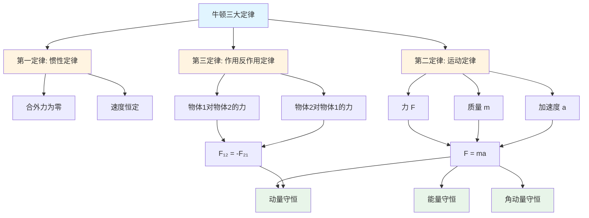

#### 经典力学模型分类图 / Classification Diagram of Classical Mechanics Models

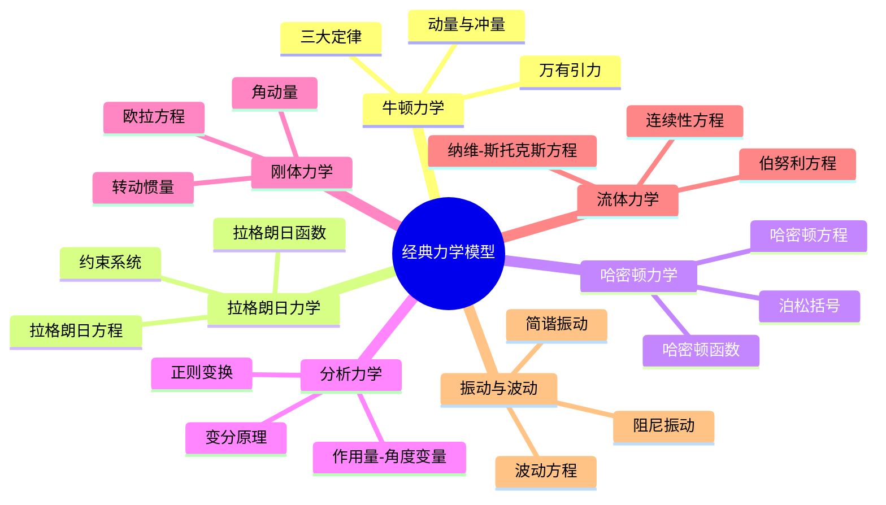

#### 牛顿三大定律的形式化定义 / Formal Definition of Newton's Three Laws

**第一定律 (惯性定律)**:
$$\vec{F} = 0 \Rightarrow \vec{v} = \text{constant}$$

**形式化公理**: 对于任意物体，如果合外力为零，则物体保持匀速直线运动或静止状态。

**数学表示**: $\forall \text{object } O, \sum \vec{F}_i = 0 \Rightarrow \frac{d\vec{v}}{dt} = 0$

**第二定律 (运动定律)**:
$$\vec{F} = m\vec{a} = m\frac{d\vec{v}}{dt} = m\frac{d^2\vec{r}}{dt^2}$$

**形式化公理**: 物体的加速度与作用力成正比，与质量成反比。

**数学表示**: $\forall \text{object } O, \vec{F} = m\vec{a} = m\frac{d\vec{v}}{dt} = m\frac{d^2\vec{r}}{dt^2}$

**第三定律 (作用反作用定律)**:
$$\vec{F}_{12} = -\vec{F}_{21}$$

**形式化公理**: 两个物体之间的相互作用力大小相等，方向相反。

**数学表示**: $\forall \text{objects } O_1, O_2, \vec{F}_{12} = -\vec{F}_{21}$

#### 牛顿三大定律的公理化系统 / Axiomatic System of Newton's Three Laws

**公理1 (惯性公理)**: 存在惯性参考系，在其中第一定律成立。

**公理2 (力公理)**: 力是矢量，满足矢量加法法则。

**公理3 (质量公理)**: 质量是标量，与参考系无关。

**公理4 (时间公理)**: 时间是绝对的，与参考系无关。

**公理5 (空间公理)**: 空间是欧几里得的，三维的。

#### 牛顿三大定律的形式化定理 / Formal Theorems of Newton's Three Laws

**定理1 (动量守恒定理)**: 在孤立系统中，总动量守恒。

**证明**: 根据第三定律，$\sum \vec{F}_{ij} = 0$，因此 $\frac{d}{dt}\sum m_i\vec{v}_i = 0$，即 $\sum m_i\vec{v}_i = \text{constant}$。

**定理2 (能量守恒定理)**: 在保守力场中，机械能守恒。

**证明**: 对于保守力，$\vec{F} = -\nabla V$，因此 $\frac{d}{dt}(T + V) = 0$，即 $T + V = \text{constant}$。

**定理3 (角动量守恒定理)**: 在中心力场中，角动量守恒。

**证明**: 对于中心力，$\vec{\tau} = \vec{r} \times \vec{F} = 0$，因此 $\frac{d\vec{L}}{dt} = 0$，即 $\vec{L} = \text{constant}$。

#### 经典力学系统状态转换图 / State Transition Diagram of Classical Mechanics System

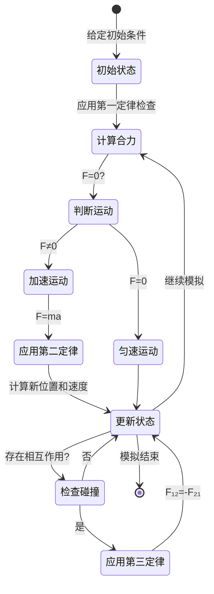

#### 牛顿第二定律求解算法流程图 / Flowchart of Newton's Second Law Solution Algorithm

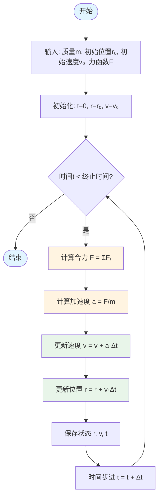

#### 牛顿三大定律的算法实现 / Algorithmic Implementation of Newton's Three Laws

**算法1 (牛顿第二定律求解算法)**:

```text
输入: 力函数 F(t), 初始条件 r₀, v₀, 时间步长 dt
输出: 位置函数 r(t), 速度函数 v(t)

1. 初始化: r = r₀, v = v₀, t = 0
2. 循环直到 t > t_max:
   a. 计算加速度: a = F(t) / m
   b. 更新速度: v = v + a * dt
   c. 更新位置: r = r + v * dt
   d. 更新时间: t = t + dt
3. 返回 r(t), v(t)
```

**算法2 (动量守恒检查算法)**:

```text
输入: 系统状态 {mᵢ, vᵢ}, 时间序列 t
输出: 动量守恒判断

1. 计算初始总动量: P₀ = Σ mᵢ vᵢ(0)
2. 对于每个时间点 t:
   a. 计算当前总动量: P(t) = Σ mᵢ vᵢ(t)
   b. 检查动量守恒: |P(t) - P₀| < ε
3. 返回动量守恒判断
```

**算法3 (能量守恒检查算法)**:

```text
输入: 系统状态 {mᵢ, rᵢ, vᵢ}, 势能函数 V(r)
输出: 能量守恒判断

1. 计算初始总能量: E₀ = Σ ½mᵢvᵢ²(0) + V(r(0))
2. 对于每个时间点 t:
   a. 计算当前总能量: E(t) = Σ ½mᵢvᵢ²(t) + V(r(t))
   b. 检查能量守恒: |E(t) - E₀| < ε
3. 返回能量守恒判断
```

### 万有引力定律 / Law of Universal Gravitation

#### 万有引力定律关系图 / Relationship Diagram of Universal Gravitation Law

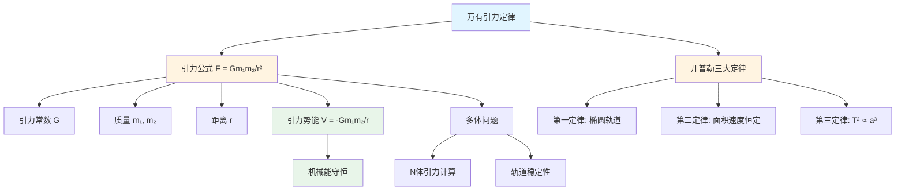

#### 开普勒定律关系图 / Relationship Diagram of Kepler's Laws

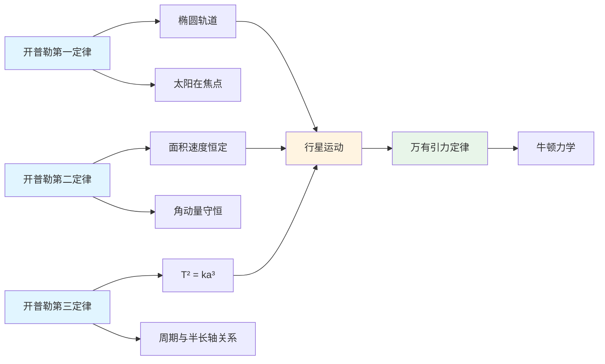

#### 多体引力系统计算流程图 / Flowchart of N-Body Gravitational System Calculation

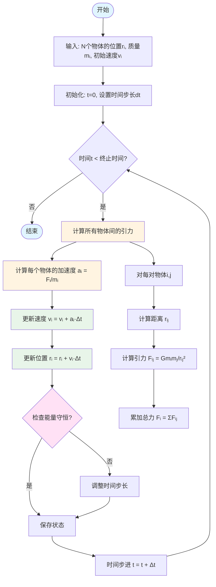

#### 万有引力定律的形式化定义 / Formal Definition of Universal Gravitation

**万有引力定律**:
$$\vec{F} = G\frac{m_1m_2}{r^2}\hat{r}$$

其中：

- $G = 6.674 \times 10^{-11} \text{ N⋅m}^2/\text{kg}^2$: 引力常数
- $m_1, m_2$: 两物体质量
- $r$: 两物体间距离
- $\hat{r}$: 单位向量

#### 万有引力定律的公理化定义 / Axiomatic Definition of Universal Gravitation

**公理1 (引力存在公理)**: 任意两个质点之间存在引力相互作用。

**公理2 (引力方向公理)**: 引力方向沿两质点的连线方向。

**公理3 (引力大小公理)**: 引力大小与两质点质量的乘积成正比，与距离的平方成反比。

**公理4 (引力常数公理)**: 引力常数 $G$ 是普适常数，与质点的性质无关。

**公理5 (引力叠加公理)**: 多个质点的引力满足矢量叠加原理。

#### 万有引力定律的形式化定理 / Formal Theorems of Universal Gravitation

**定理4 (引力势能定理)**: 引力势能为 $V(r) = -G\frac{m_1m_2}{r}$。

**证明**: 根据引力定义，$\vec{F} = -\nabla V$，因此 $V(r) = -\int \vec{F} \cdot d\vec{r} = -G\frac{m_1m_2}{r}$。

**定理5 (开普勒第一定律)**: 行星绕太阳的轨道是椭圆，太阳位于椭圆的一个焦点。

**证明**: 在中心力场中，角动量守恒，结合引力定律可导出椭圆轨道。

**定理6 (开普勒第二定律)**: 行星与太阳的连线在相等时间内扫过相等的面积。

**证明**: 角动量守恒 $\vec{L} = m\vec{r} \times \vec{v} = \text{constant}$，因此面积速度 $\frac{dA}{dt} = \frac{|\vec{L}|}{2m} = \text{constant}$。

**定理7 (开普勒第三定律)**: 行星轨道周期的平方与轨道半长轴的立方成正比。

**证明**: 结合引力定律和椭圆轨道性质，可得 $T^2 \propto a^3$。

#### 万有引力定律的算法实现 / Algorithmic Implementation of Universal Gravitation

**算法4 (引力计算算法)**:

```text
输入: 质点位置 r₁, r₂, 质量 m₁, m₂
输出: 引力 F

1. 计算相对位置: r = r₂ - r₁
2. 计算距离: |r| = √(r·r)
3. 计算单位向量: r̂ = r / |r|
4. 计算引力: F = G * m₁ * m₂ / |r|² * r̂
5. 返回 F
```

**算法5 (多体引力计算算法)**:

```text
输入: N个质点的位置 {rᵢ}, 质量 {mᵢ}
输出: 每个质点的总引力 {Fᵢ}

1. 对于每个质点 i:
   a. 初始化总引力: Fᵢ = 0
   b. 对于每个其他质点 j:
      - 计算引力: Fᵢⱼ = G * mᵢ * mⱼ / |rᵢⱼ|² * r̂ᵢⱼ
      - 累加到总引力: Fᵢ = Fᵢ + Fᵢⱼ
2. 返回 {Fᵢ}
```

**算法6 (轨道计算算法)**:

```text
输入: 初始位置 r₀, 初始速度 v₀, 中心质量 M, 时间步长 dt
输出: 轨道轨迹 {r(t)}

1. 初始化: r = r₀, v = v₀, t = 0
2. 循环直到 t > t_max:
   a. 计算引力: F = -G * M * m / |r|² * r̂
   b. 计算加速度: a = F / m
   c. 更新速度: v = v + a * dt
   d. 更新位置: r = r + v * dt
   e. 记录轨迹: r(t) = r
   f. 更新时间: t = t + dt
3. 返回 {r(t)}
```

#### 万有引力定律的应用 / Applications of Universal Gravitation

**应用1 (行星运动)**: 描述行星绕太阳的运动规律

**应用2 (卫星轨道)**: 计算人造卫星的轨道参数

**应用3 (潮汐现象)**: 解释地球上海洋潮汐的形成

**应用4 (宇宙学)**: 研究星系和宇宙的演化

**应用5 (重力测量)**: 地球重力场的测量和应用

### 动量与冲量 / Momentum and Impulse

#### 动量与冲量的形式化定义 / Formal Definition of Momentum and Impulse

**动量**: $\vec{p} = m\vec{v}$

**冲量**: $\vec{J} = \int \vec{F} dt = \Delta\vec{p}$

**动量守恒**: $\sum \vec{p}_i = \text{constant}$

#### 动量与冲量的公理化定义 / Axiomatic Definition of Momentum and Impulse

**公理1 (动量定义公理)**: 质点的动量等于质量与速度的乘积。

**公理2 (冲量定义公理)**: 冲量等于力对时间的积分。

**公理3 (动量守恒公理)**: 在孤立系统中，总动量守恒。

**公理4 (冲量-动量定理公理)**: 冲量等于动量的变化量。

**公理5 (动量叠加公理)**: 多个质点的总动量等于各质点动量的矢量和。

#### 动量与冲量的形式化定理 / Formal Theorems of Momentum and Impulse

**定理8 (冲量-动量定理)**: $\vec{J} = \Delta\vec{p} = \vec{p}_f - \vec{p}_i$。

**证明**: 根据牛顿第二定律，$\vec{F} = \frac{d\vec{p}}{dt}$，因此 $\vec{J} = \int \vec{F} dt = \int \frac{d\vec{p}}{dt} dt = \Delta\vec{p}$。

**定理9 (动量守恒定理)**: 在孤立系统中，$\frac{d}{dt}\sum \vec{p}_i = 0$。

**证明**: 根据牛顿第三定律，$\sum \vec{F}_{ij} = 0$，因此 $\frac{d}{dt}\sum m_i\vec{v}_i = \sum \vec{F}_i = 0$。

**定理10 (质心运动定理)**: 质心的运动只受外力影响，$\vec{F}_{\text{ext}} = M\vec{a}_{\text{cm}}$。

**证明**: 质心位置 $\vec{r}_{\text{cm}} = \frac{\sum m_i\vec{r}_i}{\sum m_i}$，因此 $\vec{F}_{\text{ext}} = \sum \vec{F}_i = \sum m_i\vec{a}_i = M\vec{a}_{\text{cm}}$。

**定理11 (相对动量定理)**: 相对动量 $\vec{p}_{\text{rel}} = \mu\vec{v}_{\text{rel}}$，其中 $\mu = \frac{m_1m_2}{m_1+m_2}$ 是约化质量。

**证明**: 相对速度 $\vec{v}_{\text{rel}} = \vec{v}_1 - \vec{v}_2$，相对动量 $\vec{p}_{\text{rel}} = m_1\vec{v}_1 - m_2\vec{v}_2 = \mu\vec{v}_{\text{rel}}$。

#### 动量与冲量的算法实现 / Algorithmic Implementation of Momentum and Impulse

**算法7 (动量计算算法)**:

```text
输入: 质量 m, 速度 v
输出: 动量 p

1. 计算动量: p = m * v
2. 返回 p
```

**算法8 (冲量计算算法)**:

```text
输入: 力函数 F(t), 时间区间 [t₁, t₂]
输出: 冲量 J

1. 初始化冲量: J = 0
2. 对于时间步长 dt:
   a. 计算力: F = F(t)
   b. 累加冲量: J = J + F * dt
3. 返回 J
```

**算法9 (动量守恒检查算法)**:

```text
输入: 系统状态 {mᵢ, vᵢ}, 时间序列 t
输出: 动量守恒判断

1. 计算初始总动量: P₀ = Σ mᵢ vᵢ(0)
2. 对于每个时间点 t:
   a. 计算当前总动量: P(t) = Σ mᵢ vᵢ(t)
   b. 检查动量守恒: |P(t) - P₀| < ε
3. 返回动量守恒判断
```

**算法10 (碰撞分析算法)**:

```text
输入: 碰撞前状态 {mᵢ, vᵢ}, 碰撞类型 (弹性/非弹性)
输出: 碰撞后状态 {vᵢ'}

1. 应用动量守恒: Σ mᵢ vᵢ = Σ mᵢ vᵢ'
2. 如果是弹性碰撞:
   a. 应用能量守恒: Σ ½mᵢ vᵢ² = Σ ½mᵢ vᵢ'²
3. 如果是非弹性碰撞:
   a. 应用恢复系数: e = |v₁' - v₂'| / |v₁ - v₂|
4. 求解方程组得到 {vᵢ'}
5. 返回 {vᵢ'}
```

#### 动量与冲量的应用 / Applications of Momentum and Impulse

**应用1 (碰撞分析)**: 分析物体碰撞前后的运动状态

**应用2 (火箭推进)**: 计算火箭的推进力和速度变化

**应用3 (粒子物理)**: 分析粒子碰撞和衰变过程

**应用4 (流体力学)**: 研究流体的动量传输

**应用5 (工程应用)**: 设计缓冲装置和安全系统

---

## 2.1.2 拉格朗日力学模型 / Lagrangian Mechanics Models

### 拉格朗日力学框架图 / Framework Diagram of Lagrangian Mechanics

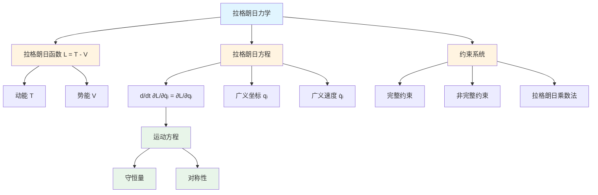

### 拉格朗日方程求解流程图 / Flowchart of Lagrange's Equation Solution

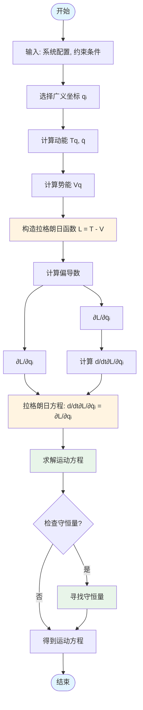

### 拉格朗日函数 / Lagrangian Function

$$\mathcal{L} = T - V$$

其中：

- $T$: 动能
- $V$: 势能

### 拉格朗日方程 / Lagrange's Equations

$$\frac{d}{dt}\frac{\partial \mathcal{L}}{\partial \dot{q}_i} - \frac{\partial \mathcal{L}}{\partial q_i} = 0$$

其中 $q_i$ 是广义坐标。

### 约束系统 / Constrained Systems

**完整约束**: $f(q_1, q_2, \ldots, q_n, t) = 0$

**非完整约束**: $f(q_1, q_2, \ldots, q_n, \dot{q}_1, \dot{q}_2, \ldots, \dot{q}_n, t) = 0$

### 示例：单摆 / Example: Simple Pendulum

**拉格朗日函数**:
$$\mathcal{L} = \frac{1}{2}ml^2\dot{\theta}^2 + mgl\cos\theta$$

**运动方程**:
$$\ddot{\theta} + \frac{g}{l}\sin\theta = 0$$

---

## 2.1.3 哈密顿力学模型 / Hamiltonian Mechanics Models

### 哈密顿力学框架图 / Framework Diagram of Hamiltonian Mechanics

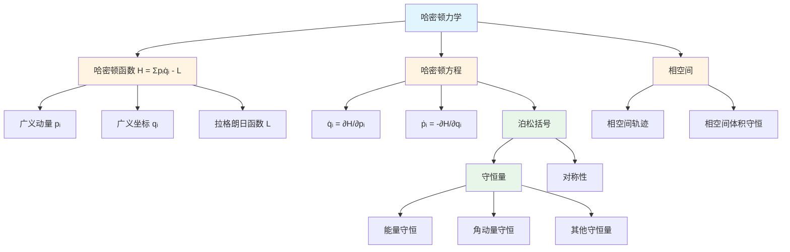

### 拉格朗日与哈密顿力学关系图 / Relationship Diagram between Lagrangian and Hamiltonian Mechanics

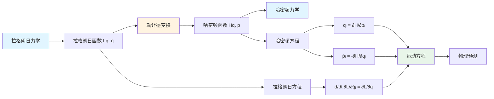

### 哈密顿方程求解流程图 / Flowchart of Hamilton's Equations Solution

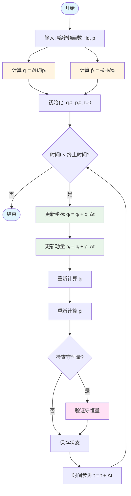

### 哈密顿函数 / Hamiltonian Function

$$\mathcal{H} = \sum_i p_i\dot{q}_i - \mathcal{L}$$

### 哈密顿方程 / Hamilton's Equations

$$\dot{q}_i = \frac{\partial \mathcal{H}}{\partial p_i}$$

$$\dot{p}_i = -\frac{\partial \mathcal{H}}{\partial q_i}$$

### 泊松括号 / Poisson Brackets

$$\{A, B\} = \sum_i \left(\frac{\partial A}{\partial q_i}\frac{\partial B}{\partial p_i} - \frac{\partial A}{\partial p_i}\frac{\partial B}{\partial q_i}\right)$$

### 守恒量 / Conserved Quantities

**能量守恒**: $\frac{d\mathcal{H}}{dt} = 0$

**角动量守恒**: $\vec{L} = \vec{r} \times \vec{p} = \text{constant}$

---

## 2.1.4 分析力学模型 / Analytical Mechanics Models

### 变分原理 / Variational Principle

**哈密顿原理**:
$$\delta \int_{t_1}^{t_2} \mathcal{L} dt = 0$$

### 正则变换 / Canonical Transformations

**生成函数**: $F(q, Q, t)$

**变换关系**:
$$p_i = \frac{\partial F}{\partial q_i}$$
$$P_i = -\frac{\partial F}{\partial Q_i}$$

### 作用量-角度变量 / Action-Angle Variables

**作用量**: $J_i = \oint p_i dq_i$

**角度变量**: $\theta_i = \frac{\partial W}{\partial J_i}$

---

## 2.1.5 刚体力学模型 / Rigid Body Mechanics Models

### 转动惯量 / Moment of Inertia

**张量形式**:
$$I_{ij} = \int \rho(\vec{r})(r^2\delta_{ij} - r_ir_j) dV$$

**主轴形式**:
$$I = \begin{pmatrix} I_1 & 0 & 0 \\ 0 & I_2 & 0 \\ 0 & 0 & I_3 \end{pmatrix}$$

### 欧拉方程 / Euler's Equations

$$I_1\dot{\omega}_1 = (I_2 - I_3)\omega_2\omega_3 + \tau_1$$
$$I_2\dot{\omega}_2 = (I_3 - I_1)\omega_3\omega_1 + \tau_2$$
$$I_3\dot{\omega}_3 = (I_1 - I_2)\omega_1\omega_2 + \tau_3$$

### 角动量 / Angular Momentum

$$\vec{L} = I\vec{\omega}$$

---

## 2.1.6 流体力学模型 / Fluid Mechanics Models

### 连续性方程 / Continuity Equation

$$\frac{\partial \rho}{\partial t} + \nabla \cdot (\rho\vec{v}) = 0$$

### 纳维-斯托克斯方程 / Navier-Stokes Equations

$$\rho\left(\frac{\partial \vec{v}}{\partial t} + (\vec{v} \cdot \nabla)\vec{v}\right) = -\nabla p + \mu\nabla^2\vec{v} + \vec{f}$$

### 伯努利方程 / Bernoulli's Equation

$$\frac{1}{2}\rho v^2 + \rho gh + p = \text{constant}$$

---

## 2.1.7 振动与波动模型 / Vibration and Wave Models

### 简谐振动 / Simple Harmonic Motion

$$\ddot{x} + \omega^2 x = 0$$

**解**: $x(t) = A\cos(\omega t + \phi)$

### 阻尼振动 / Damped Oscillation

$$\ddot{x} + 2\gamma\dot{x} + \omega_0^2 x = 0$$

**解**: $x(t) = Ae^{-\gamma t}\cos(\omega t + \phi)$

### 波动方程 / Wave Equation

$$\frac{\partial^2 u}{\partial t^2} = c^2\nabla^2 u$$

**解**: $u(x,t) = f(x - ct) + g(x + ct)$

---

## 2.1.8 实现与应用 / Implementation and Applications

### Rust实现示例 / Rust Implementation Example

```rust
use std::f64::consts::PI;

#[derive(Debug, Clone)]
pub struct Particle {
    pub mass: f64,
    pub position: [f64; 3],
    pub velocity: [f64; 3],
    pub force: [f64; 3],
}

impl Particle {
    pub fn new(mass: f64, position: [f64; 3]) -> Self {
        Self {
            mass,
            position,
            velocity: [0.0; 3],
            force: [0.0; 3],
        }
    }

    pub fn update_position(&mut self, dt: f64) {
        for i in 0..3 {
            self.position[i] += self.velocity[i] * dt;
        }
    }

    pub fn update_velocity(&mut self, dt: f64) {
        for i in 0..3 {
            self.velocity[i] += self.force[i] / self.mass * dt;
        }
    }

    pub fn calculate_kinetic_energy(&self) -> f64 {
        0.5 * self.mass * self.velocity.iter().map(|v| v * v).sum::<f64>()
    }
}

#[derive(Debug)]
pub struct SimplePendulum {
    pub length: f64,
    pub mass: f64,
    pub gravity: f64,
    pub theta: f64,
    pub omega: f64,
}

impl SimplePendulum {
    pub fn new(length: f64, mass: f64, initial_angle: f64) -> Self {
        Self {
            length,
            mass,
            gravity: 9.81,
            theta: initial_angle,
            omega: 0.0,
        }
    }

    pub fn step(&mut self, dt: f64) {
        // 拉格朗日方程: d²θ/dt² + (g/l)sin(θ) = 0
        let acceleration = -(self.gravity / self.length) * self.theta.sin();

        self.omega += acceleration * dt;
        self.theta += self.omega * dt;
    }

    pub fn get_position(&self) -> [f64; 2] {
        [
            self.length * self.theta.sin(),
            -self.length * self.theta.cos(),
        ]
    }

    pub fn get_energy(&self) -> f64 {
        let kinetic = 0.5 * self.mass * self.length * self.length * self.omega * self.omega;
        let potential = self.mass * self.gravity * self.length * (1.0 - self.theta.cos());
        kinetic + potential
    }
}

// 使用示例
fn main() {
    let mut pendulum = SimplePendulum::new(1.0, 1.0, PI / 4.0);

    println!("Initial energy: {}", pendulum.get_energy());

    for i in 0..100 {
        pendulum.step(0.01);
        let pos = pendulum.get_position();
        println!("Step {}: θ={:.3}, x={:.3}, y={:.3}",
                i, pendulum.theta, pos[0], pos[1]);
    }

    println!("Final energy: {}", pendulum.get_energy());
}
```

### Haskell实现示例 / Haskell Implementation Example

```haskell
module ClassicalMechanics where

import Data.Vector (Vector)
import qualified Data.Vector as V

-- 粒子数据类型
data Particle = Particle {
    mass :: Double,
    position :: Vector Double,
    velocity :: Vector Double,
    force :: Vector Double
} deriving (Show)

-- 创建粒子
newParticle :: Double -> Vector Double -> Particle
newParticle m pos = Particle m pos (V.replicate 3 0.0) (V.replicate 3 0.0)

-- 更新位置
updatePosition :: Double -> Particle -> Particle
updatePosition dt p = p { position = V.zipWith (+) (position p)
                                       (V.map (* dt) (velocity p)) }

-- 更新速度
updateVelocity :: Double -> Particle -> Particle
updateVelocity dt p = p { velocity = V.zipWith (+) (velocity p)
                                       (V.map (* (dt / mass p)) (force p)) }

-- 计算动能
kineticEnergy :: Particle -> Double
kineticEnergy p = 0.5 * mass p * V.sum (V.map (^2) (velocity p))

-- 单摆数据类型
data SimplePendulum = SimplePendulum {
    length :: Double,
    mass :: Double,
    gravity :: Double,
    theta :: Double,
    omega :: Double
} deriving (Show)

-- 创建单摆
newPendulum :: Double -> Double -> Double -> SimplePendulum
newPendulum l m angle = SimplePendulum l m 9.81 angle 0.0

-- 单摆演化
stepPendulum :: Double -> SimplePendulum -> SimplePendulum
stepPendulum dt p = p {
    omega = omega p + acceleration * dt,
    theta = theta p + omega p * dt
}
  where
    acceleration = -(gravity p / length p) * sin (theta p)

-- 获取位置
getPosition :: SimplePendulum -> (Double, Double)
getPosition p = (x, y)
  where
    x = length p * sin (theta p)
    y = -length p * cos (theta p)

-- 计算能量
getEnergy :: SimplePendulum -> Double
getEnergy p = kinetic + potential
  where
    kinetic = 0.5 * mass p * length p * length p * omega p * omega p
    potential = mass p * gravity p * length p * (1.0 - cos (theta p))

-- 示例使用
example :: IO ()
example = do
    let pendulum = newPendulum 1.0 1.0 (pi / 4.0)
        steps = take 100 $ iterate (stepPendulum 0.01) pendulum

    putStrLn $ "Initial energy: " ++ show (getEnergy pendulum)

    mapM_ (\(i, p) -> do
        let (x, y) = getPosition p
        putStrLn $ "Step " ++ show i ++ ": θ=" ++ show (theta p) ++
                  ", x=" ++ show x ++ ", y=" ++ show y)
        (zip [0..] steps)

    putStrLn $ "Final energy: " ++ show (getEnergy (last steps))
```

### Python实现示例 / Python Implementation Example

```python
import numpy as np
from dataclasses import dataclass
from typing import Tuple

@dataclass
class Particle:
    """粒子"""
    mass: float
    position: np.ndarray  # [x, y, z]
    velocity: np.ndarray  # [vx, vy, vz]

    def __post_init__(self):
        """初始化"""
        if self.position.shape != (3,):
            raise ValueError("Position must be a 3D vector")
        if self.velocity.shape != (3,):
            raise ValueError("Velocity must be a 3D vector")

class NewtonianMechanics:
    """牛顿力学系统"""

    @staticmethod
    def calculate_force(mass: float, acceleration: np.ndarray) -> np.ndarray:
        """计算力：F = ma"""
        return mass * acceleration

    @staticmethod
    def calculate_acceleration(force: np.ndarray, mass: float) -> np.ndarray:
        """计算加速度：a = F/m"""
        return force / mass

    @staticmethod
    def update_position(particle: Particle, dt: float) -> Particle:
        """更新位置：r = r0 + v*dt"""
        new_position = particle.position + particle.velocity * dt
        return Particle(particle.mass, new_position, particle.velocity)

    @staticmethod
    def update_velocity(particle: Particle, acceleration: np.ndarray, dt: float) -> Particle:
        """更新速度：v = v0 + a*dt"""
        new_velocity = particle.velocity + acceleration * dt
        return Particle(particle.mass, particle.position, new_velocity)

    @staticmethod
    def calculate_momentum(particle: Particle) -> np.ndarray:
        """计算动量：p = mv"""
        return particle.mass * particle.velocity

    @staticmethod
    def calculate_kinetic_energy(particle: Particle) -> float:
        """计算动能：E_k = (1/2)mv²"""
        v_squared = np.dot(particle.velocity, particle.velocity)
        return 0.5 * particle.mass * v_squared

@dataclass
class SimplePendulum:
    """单摆"""
    length: float
    mass: float
    theta: float  # 角度（弧度）
    omega: float  # 角速度
    gravity: float = 9.81

    def step(self, dt: float) -> 'SimplePendulum':
        """更新单摆状态"""
        # 计算角加速度：α = -(g/L)sin(θ)
        alpha = -(self.gravity / self.length) * np.sin(self.theta)

        # 更新角速度：ω = ω0 + α*dt
        new_omega = self.omega + alpha * dt

        # 更新角度：θ = θ0 + ω*dt
        new_theta = self.theta + new_omega * dt

        return SimplePendulum(self.length, self.mass, new_theta, new_omega, self.gravity)

    def get_position(self) -> Tuple[float, float]:
        """获取位置坐标"""
        x = self.length * np.sin(self.theta)
        y = -self.length * np.cos(self.theta)
        return (x, y)

    def get_energy(self) -> float:
        """计算总能量"""
        # 动能：E_k = (1/2)mL²ω²
        kinetic = 0.5 * self.mass * self.length**2 * self.omega**2

        # 势能：E_p = mgL(1 - cos(θ))
        potential = self.mass * self.gravity * self.length * (1.0 - np.cos(self.theta))

        return kinetic + potential

# 使用示例
if __name__ == "__main__":
    # 牛顿力学示例
    particle = Particle(
        mass=1.0,
        position=np.array([0.0, 0.0, 0.0]),
        velocity=np.array([1.0, 0.0, 0.0])
    )

    force = np.array([0.0, 0.0, -9.81])  # 重力
    acceleration = NewtonianMechanics.calculate_acceleration(force, particle.mass)

    print(f"Initial position: {particle.position}")
    print(f"Initial velocity: {particle.velocity}")
    print(f"Acceleration: {acceleration}")

    # 更新状态
    dt = 0.01
    particle = NewtonianMechanics.update_velocity(particle, acceleration, dt)
    particle = NewtonianMechanics.update_position(particle, dt)

    print(f"After {dt}s:")
    print(f"Position: {particle.position}")
    print(f"Velocity: {particle.velocity}")
    print(f"Momentum: {NewtonianMechanics.calculate_momentum(particle)}")
    print(f"Kinetic energy: {NewtonianMechanics.calculate_kinetic_energy(particle)}")

    # 单摆示例
    pendulum = SimplePendulum(length=1.0, mass=1.0, theta=np.pi/4, omega=0.0)
    print(f"\nInitial pendulum energy: {pendulum.get_energy()}")

    # 模拟100步
    steps = [pendulum]
    for i in range(100):
        steps.append(steps[-1].step(0.01))

    print(f"Final pendulum energy: {steps[-1].get_energy()}")
    x, y = steps[-1].get_position()
    print(f"Final position: ({x:.4f}, {y:.4f})")
```

### Julia实现示例 / Julia Implementation Example

```julia
using LinearAlgebra

# 粒子结构
struct Particle
    mass::Float64
    position::Vector{Float64}  # [x, y, z]
    velocity::Vector{Float64}  # [vx, vy, vz]

    function Particle(mass::Float64, position::Vector{Float64}, velocity::Vector{Float64})
        if length(position) != 3 || length(velocity) != 3
            error("Position and velocity must be 3D vectors")
        end
        new(mass, position, velocity)
    end
end

# 牛顿力学系统
module NewtonianMechanics
    export calculate_force, calculate_acceleration, update_position,
           update_velocity, calculate_momentum, calculate_kinetic_energy

    """计算力：F = ma"""
    function calculate_force(mass::Float64, acceleration::Vector{Float64})::Vector{Float64}
        return mass * acceleration
    end

    """计算加速度：a = F/m"""
    function calculate_acceleration(force::Vector{Float64}, mass::Float64)::Vector{Float64}
        return force / mass
    end

    """更新位置：r = r0 + v*dt"""
    function update_position(particle::Particle, dt::Float64)::Particle
        new_position = particle.position + particle.velocity * dt
        return Particle(particle.mass, new_position, particle.velocity)
    end

    """更新速度：v = v0 + a*dt"""
    function update_velocity(particle::Particle, acceleration::Vector{Float64}, dt::Float64)::Particle
        new_velocity = particle.velocity + acceleration * dt
        return Particle(particle.mass, particle.position, new_velocity)
    end

    """计算动量：p = mv"""
    function calculate_momentum(particle::Particle)::Vector{Float64}
        return particle.mass * particle.velocity
    end

    """计算动能：E_k = (1/2)mv²"""
    function calculate_kinetic_energy(particle::Particle)::Float64
        v_squared = dot(particle.velocity, particle.velocity)
        return 0.5 * particle.mass * v_squared
    end
end

# 单摆结构
mutable struct SimplePendulum
    length::Float64
    mass::Float64
    theta::Float64  # 角度（弧度）
    omega::Float64  # 角速度
    gravity::Float64

    function SimplePendulum(length::Float64, mass::Float64, theta::Float64, omega::Float64, gravity::Float64=9.81)
        new(length, mass, theta, omega, gravity)
    end
end

# 更新单摆状态
function step!(pendulum::SimplePendulum, dt::Float64)
    # 计算角加速度：α = -(g/L)sin(θ)
    alpha = -(pendulum.gravity / pendulum.length) * sin(pendulum.theta)

    # 更新角速度：ω = ω0 + α*dt
    pendulum.omega += alpha * dt

    # 更新角度：θ = θ0 + ω*dt
    pendulum.theta += pendulum.omega * dt
end

# 获取位置坐标
function get_position(pendulum::SimplePendulum)::Tuple{Float64, Float64}
    x = pendulum.length * sin(pendulum.theta)
    y = -pendulum.length * cos(pendulum.theta)
    return (x, y)
end

# 计算总能量
function get_energy(pendulum::SimplePendulum)::Float64
    # 动能：E_k = (1/2)mL²ω²
    kinetic = 0.5 * pendulum.mass * pendulum.length^2 * pendulum.omega^2

    # 势能：E_p = mgL(1 - cos(θ))
    potential = pendulum.mass * pendulum.gravity * pendulum.length * (1.0 - cos(pendulum.theta))

    return kinetic + potential
end

# 使用示例
using .NewtonianMechanics

# 牛顿力学示例
particle = Particle(1.0, [0.0, 0.0, 0.0], [1.0, 0.0, 0.0])
force = [0.0, 0.0, -9.81]  # 重力
acceleration = calculate_acceleration(force, particle.mass)

println("Initial position: ", particle.position)
println("Initial velocity: ", particle.velocity)
println("Acceleration: ", acceleration)

# 更新状态
dt = 0.01
particle = update_velocity(particle, acceleration, dt)
particle = update_position(particle, dt)

println("\nAfter $dt s:")
println("Position: ", particle.position)
println("Velocity: ", particle.velocity)
println("Momentum: ", calculate_momentum(particle))
println("Kinetic energy: ", calculate_kinetic_energy(particle))

# 单摆示例
pendulum = SimplePendulum(1.0, 1.0, π/4, 0.0)
println("\nInitial pendulum energy: ", get_energy(pendulum))

# 模拟100步
for i in 1:100
    step!(pendulum, 0.01)
end

println("Final pendulum energy: ", get_energy(pendulum))
x, y = get_position(pendulum)
println("Final position: ($(round(x, digits=4)), $(round(y, digits=4)))")
```

### 应用领域 / Application Domains

#### 工程应用 / Engineering Applications

- **机械设计**: 齿轮传动、连杆机构
- **航空航天**: 轨道计算、姿态控制
- **土木工程**: 结构动力学、地震响应

#### 科学研究 / Scientific Research

- **天体力学**: 行星轨道、卫星运动
- **分子动力学**: 原子运动、化学反应
- **生物力学**: 人体运动、肌肉力学

---

## 相关模型 / Related Models

### 物理科学模型 / Physical Science Models

- [量子力学模型](../02-量子力学模型/README.md) - 经典力学的量子化推广，对应原理
- [相对论模型](../03-相对论模型/README.md) - 经典力学在高速情况下的相对论修正
- [热力学模型](../04-热力学模型/README.md) - 统计力学与经典力学的联系
- [电磁学模型](../05-电磁学模型/README.md) - 经典电磁场中的力学问题
- [光学模型](../06-光学模型/README.md) - 几何光学与经典力学的类比
- [声学模型](../07-声学模型/README.md) - 波动方程与经典力学的联系
- [流体力学模型](../08-流体力学模型/README.md) - 连续介质中的力学问题

### 基础理论 / Basic Theory

- [模型分类学](../../01-基础理论/01-模型分类学/README.md) - 经典力学模型的分类
- [形式化方法论](../../01-基础理论/02-形式化方法论/README.md) - 经典力学的形式化方法
- [科学模型论](../../01-基础理论/03-科学模型论/README.md) - 经典力学作为科学模型的理论基础

## 参考文献 / References

1. Goldstein, H., Poole, C., & Safko, J. (2002). Classical Mechanics. Addison-Wesley.
2. Landau, L. D., & Lifshitz, E. M. (1976). Mechanics. Pergamon Press.
3. Arnold, V. I. (1989). Mathematical Methods of Classical Mechanics. Springer.
4. Marion, J. B., & Thornton, S. T. (1995). Classical Dynamics of Particles and Systems. Harcourt Brace.

---

*最后更新: 2025-08-01*
*版本: 1.0.0*
