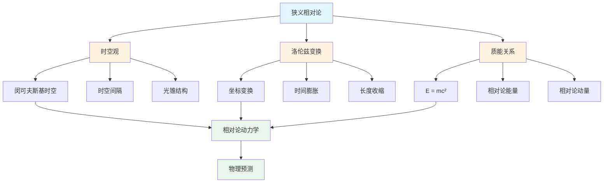
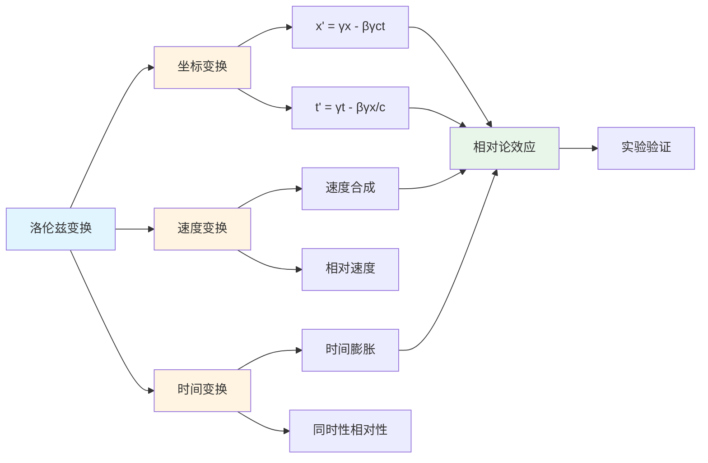
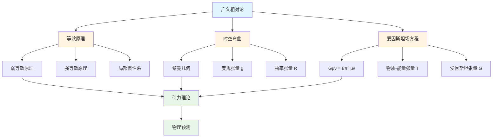
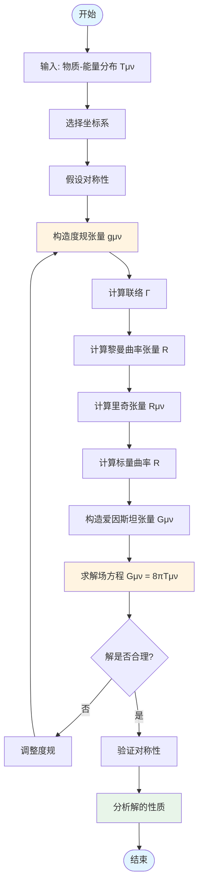

# 2.3 相对论模型 / Relativity Models

## 目录 / Table of Contents

- [2.3 相对论模型 / Relativity Models](#23-相对论模型--relativity-models)
  - [目录 / Table of Contents](#目录--table-of-contents)
  - [2.3.1 狭义相对论 / Special Relativity](#231-狭义相对论--special-relativity)
    - [狭义相对论框架图 / Framework Diagram of Special Relativity](#狭义相对论框架图--framework-diagram-of-special-relativity)
    - [洛伦兹变换关系图 / Relationship Diagram of Lorentz Transformations](#洛伦兹变换关系图--relationship-diagram-of-lorentz-transformations)
    - [时空观 / Space-Time View](#时空观--space-time-view)
    - [洛伦兹变换 / Lorentz Transformations](#洛伦兹变换--lorentz-transformations)
    - [质能关系 / Mass-Energy Relation](#质能关系--mass-energy-relation)
  - [2.3.2 广义相对论 / General Relativity](#232-广义相对论--general-relativity)
    - [广义相对论框架图 / Framework Diagram of General Relativity](#广义相对论框架图--framework-diagram-of-general-relativity)
    - [爱因斯坦场方程求解流程图 / Flowchart of Einstein Field Equations Solution](#爱因斯坦场方程求解流程图--flowchart-of-einstein-field-equations-solution)
    - [等效原理 / Equivalence Principle](#等效原理--equivalence-principle)
    - [时空弯曲 / Space-Time Curvature](#时空弯曲--space-time-curvature)
    - [爱因斯坦场方程 / Einstein Field Equations](#爱因斯坦场方程--einstein-field-equations)
  - [2.3.3 相对论动力学 / Relativistic Dynamics](#233-相对论动力学--relativistic-dynamics)
    - [相对论动量 / Relativistic Momentum](#相对论动量--relativistic-momentum)
    - [相对论能量 / Relativistic Energy](#相对论能量--relativistic-energy)
    - [四维动量 / Four-Momentum](#四维动量--four-momentum)
  - [2.3.4 相对论电磁学 / Relativistic Electromagnetism](#234-相对论电磁学--relativistic-electromagnetism)
    - [电磁场张量 / Electromagnetic Field Tensor](#电磁场张量--electromagnetic-field-tensor)
    - [麦克斯韦方程 / Maxwell Equations](#麦克斯韦方程--maxwell-equations)
    - [洛伦兹力 / Lorentz Force](#洛伦兹力--lorentz-force)
  - [2.3.5 宇宙学模型 / Cosmological Models](#235-宇宙学模型--cosmological-models)
    - [弗里德曼方程 / Friedmann Equations](#弗里德曼方程--friedmann-equations)
    - [宇宙学常数 / Cosmological Constant](#宇宙学常数--cosmological-constant)
    - [暗能量模型 / Dark Energy Models](#暗能量模型--dark-energy-models)
  - [2.3.6 黑洞理论 / Black Hole Theory](#236-黑洞理论--black-hole-theory)
    - [史瓦西黑洞 / Schwarzschild Black Hole](#史瓦西黑洞--schwarzschild-black-hole)
    - [克尔黑洞 / Kerr Black Hole](#克尔黑洞--kerr-black-hole)
    - [霍金辐射 / Hawking Radiation](#霍金辐射--hawking-radiation)
  - [2.3.7 相对论应用 / Relativistic Applications](#237-相对论应用--relativistic-applications)
    - [GPS系统 / GPS Systems](#gps系统--gps-systems)
    - [粒子加速器 / Particle Accelerators](#粒子加速器--particle-accelerators)
    - [引力波 / Gravitational Waves](#引力波--gravitational-waves)
  - [参考文献 / References](#参考文献--references)
  - [相关模型 / Related Models](#相关模型--related-models)
    - [物理科学模型 / Physical Science Models](#物理科学模型--physical-science-models)
    - [基础理论 / Basic Theory](#基础理论--basic-theory)

---

## 2.3.1 狭义相对论 / Special Relativity

### 狭义相对论框架图 / Framework Diagram of Special Relativity



### 洛伦兹变换关系图 / Relationship Diagram of Lorentz Transformations



### 时空观 / Space-Time View

**形式化定义**: 闵可夫斯基时空是一个四维伪黎曼流形 $(\mathcal{M}, \eta)$，其中 $\mathcal{M} = \mathbb{R}^4$ 是四维实向量空间，$\eta$ 是闵可夫斯基度规。

**公理系统** $\mathcal{SR} = \langle \mathcal{M}, \eta, \mathcal{L}, \mathcal{C} \rangle$:

1. **时空结构公理**: $\mathcal{M} = \mathbb{R}^4$ 作为四维时空流形
2. **度规公理**: $\eta_{\mu\nu} = \text{diag}(-1, 1, 1, 1)$ 定义闵可夫斯基度规
3. **光速不变公理**: 真空中的光速 $c$ 在所有惯性系中相同
4. **相对性公理**: 物理定律在所有惯性系中形式相同
5. **因果性公理**: 类时和类光间隔保持因果结构

**等价定义**:

1. **坐标定义**: 四维时空坐标 $(ct, x, y, z)$
2. **度规定义**: 时空间隔 $ds^2 = -c^2dt^2 + dx^2 + dy^2 + dz^2$
3. **群论定义**: 庞加莱群 $ISO(1,3)$ 的表示空间

**形式化定理**:

**定理 2.3.1.1 (闵可夫斯基时空唯一性)**: 满足狭义相对论公理的时空结构唯一地由闵可夫斯基度规确定。

**证明概要**: 由光速不变性和相对性原理，度规必须保持形式不变，唯一解为闵可夫斯基度规。

**定理 2.3.1.2 (时空间隔不变性)**: 时空间隔 $ds^2$ 在所有惯性系中保持不变。

**证明概要**: 由洛伦兹变换的保度规性质直接得出。

**定理 2.3.1.3 (光锥结构)**: 光锥将时空分为类时、类光和类空三个区域。

**证明概要**: 由度规的符号结构 $(-, +, +, +)$ 确定。

**算法实现**:

```python
import numpy as np

def minkowski_metric():
    """返回闵可夫斯基度规矩阵"""
    return np.diag([-1, 1, 1, 1])

def spacetime_interval(event1, event2, c=1.0):
    """计算两个事件间的时空间隔

    Args:
        event1: 事件1的四维坐标 (ct, x, y, z)
        event2: 事件2的四维坐标 (ct, x, y, z)
        c: 光速

    Returns:
        时空间隔 ds^2
    """
    metric = minkowski_metric()
    delta = np.array(event2) - np.array(event1)
    return np.dot(delta, np.dot(metric, delta))

def classify_interval(ds2):
    """分类时空间隔

    Args:
        ds2: 时空间隔

    Returns:
        间隔类型: 'timelike', 'lightlike', 'spacelike'
    """
    if ds2 < 0:
        return 'timelike'
    elif ds2 == 0:
        return 'lightlike'
    else:
        return 'spacelike'

def light_cone_events(event, radius=1.0, c=1.0):
    """生成光锥上的事件

    Args:
        event: 中心事件 (ct, x, y, z)
        radius: 光锥半径
        c: 光速

    Returns:
        光锥上的事件列表
    """
    ct, x, y, z = event
    events = []

    # 未来光锥
    for theta in np.linspace(0, 2*np.pi, 20):
        for phi in np.linspace(0, np.pi, 10):
            dx = radius * np.sin(phi) * np.cos(theta)
            dy = radius * np.sin(phi) * np.sin(theta)
            dz = radius * np.cos(phi)
            dt = radius / c
            events.append((ct + dt, x + dx, y + dy, z + dz))

    return events
```

**闵可夫斯基时空**: 四维时空 $(ct, x, y, z)$

**时空间隔**:
$$ds^2 = -c^2dt^2 + dx^2 + dy^2 + dz^2$$

**光锥**: 未来光锥和过去光锥的边界。

### 洛伦兹变换 / Lorentz Transformations

**形式化定义**: 洛伦兹变换是闵可夫斯基时空中保持时空间隔不变的线性变换，属于庞加莱群 $ISO(1,3)$ 的齐次部分。

**公理系统** $\mathcal{LT} = \langle \Lambda, \mathcal{G}, \mathcal{I}, \mathcal{V} \rangle$:

1. **线性变换公理**: $\Lambda^\mu_\nu$ 是线性变换矩阵
2. **度规保持公理**: $\Lambda^T \eta \Lambda = \eta$ 保持闵可夫斯基度规
3. **群结构公理**: 洛伦兹变换构成群 $\mathcal{L}$
4. **速度限制公理**: 相对速度 $|v| < c$
5. **因果保持公理**: 保持类时和类光间隔的符号

**等价定义**:

1. **矩阵定义**: $\Lambda^\mu_\nu$ 满足 $\Lambda^T \eta \Lambda = \eta$
2. **参数定义**: 通过速度 $v$ 和方向定义
3. **群论定义**: 庞加莱群的齐次子群

**形式化定理**:

**定理 2.3.1.4 (洛伦兹变换唯一性)**: 给定相对速度 $v$，洛伦兹变换唯一确定。

**证明概要**: 由度规保持条件和群结构唯一确定变换矩阵。

**定理 2.3.1.5 (速度合成)**: 洛伦兹变换的速度合成满足非线性加法。

**证明概要**: 由洛伦兹变换的群性质直接计算。

**定理 2.3.1.6 (时间膨胀)**: 运动时钟相对于静止时钟变慢，因子为 $\gamma$。

**证明概要**: 由洛伦兹变换的时间分量直接得出。

**算法实现**:

```python
def lorentz_factor(v, c=1.0):
    """计算洛伦兹因子

    Args:
        v: 相对速度
        c: 光速

    Returns:
        洛伦兹因子 γ
    """
    return 1.0 / np.sqrt(1 - (v/c)**2)

def lorentz_transformation_matrix(v, c=1.0):
    """生成洛伦兹变换矩阵

    Args:
        v: 相对速度 (沿x轴方向)
        c: 光速

    Returns:
        4x4洛伦兹变换矩阵
    """
    gamma = lorentz_factor(v, c)
    beta = v / c

    return np.array([
        [gamma, -gamma*beta, 0, 0],
        [-gamma*beta, gamma, 0, 0],
        [0, 0, 1, 0],
        [0, 0, 0, 1]
    ])

def lorentz_transform(event, v, c=1.0):
    """应用洛伦兹变换

    Args:
        event: 四维事件 (ct, x, y, z)
        v: 相对速度
        c: 光速

    Returns:
        变换后的事件坐标
    """
    matrix = lorentz_transformation_matrix(v, c)
    return np.dot(matrix, event)

def velocity_addition(u, v, c=1.0):
    """相对论速度合成

    Args:
        u: 物体在S系中的速度
        v: S'系相对于S系的速度
        c: 光速

    Returns:
        物体在S'系中的速度
    """
    return (u - v) / (1 - u*v/c**2)

def time_dilation(proper_time, v, c=1.0):
    """计算时间膨胀

    Args:
        proper_time: 固有时
        v: 相对速度
        c: 光速

    Returns:
        坐标时
    """
    gamma = lorentz_factor(v, c)
    return gamma * proper_time

def length_contraction(proper_length, v, c=1.0):
    """计算长度收缩

    Args:
        proper_length: 固有长度
        v: 相对速度
        c: 光速

    Returns:
        观测长度
    """
    gamma = lorentz_factor(v, c)
    return proper_length / gamma
```

**坐标变换**:
$$
\begin{cases}
t' = \gamma(t - \frac{vx}{c^2}) \\
x' = \gamma(x - vt) \\
y' = y \\
z' = z
\end{cases}
$$

其中 $\gamma = \frac{1}{\sqrt{1-\frac{v^2}{c^2}}}$ 是洛伦兹因子。

**速度变换**:
$$u_x' = \frac{u_x - v}{1 - \frac{u_x v}{c^2}}$$

### 质能关系 / Mass-Energy Relation

**形式化定义**: 质能关系描述了质量与能量之间的等价性，是狭义相对论的核心结果，通过四维动量守恒和洛伦兹不变性导出。

**公理系统** $\mathcal{ME} = \langle \mathcal{E}, \mathcal{M}, \mathcal{P}, \mathcal{C} \rangle$:

1. **能量守恒公理**: 孤立系统的总能量守恒
2. **质量守恒公理**: 孤立系统的总质量守恒
3. **动量守恒公理**: 四维动量 $p^\mu$ 守恒
4. **洛伦兹不变公理**: 物理量在洛伦兹变换下保持形式不变
5. **质能等价公理**: 质量与能量可以相互转换

**等价定义**:

1. **爱因斯坦定义**: $E = mc^2$ 表示质量与能量的等价性
2. **四维动量定义**: $p^\mu = (E/c, \vec{p})$ 的四维矢量性质
3. **相对论定义**: $E = \gamma mc^2$ 包含动能和静能

**形式化定理**:

**定理 2.3.1.7 (质能等价)**: 质量 $m$ 和能量 $E$ 满足关系 $E = mc^2$。

**证明概要**: 由四维动量守恒和洛伦兹不变性，结合静质量定义。

**定理 2.3.1.8 (相对论能量分解)**: 总能量 $E = \gamma mc^2$ 可分解为静能 $mc^2$ 和动能 $(\gamma-1)mc^2$。

**证明概要**: 由洛伦兹因子展开和能量定义直接计算。

**定理 2.3.1.9 (质能守恒)**: 在封闭系统中，质能总量 $E + mc^2$ 守恒。

**证明概要**: 由四维动量守恒和质能等价性。

**算法实现**:

```python
def mass_energy_equivalence(mass, c=1.0):
    """计算质能等价关系

    Args:
        mass: 质量
        c: 光速

    Returns:
        等价能量
    """
    return mass * c**2

def relativistic_energy(mass, velocity, c=1.0):
    """计算相对论总能量

    Args:
        mass: 静质量
        velocity: 速度
        c: 光速

    Returns:
        总能量
    """
    gamma = lorentz_factor(velocity, c)
    return gamma * mass * c**2

def rest_energy(mass, c=1.0):
    """计算静能

    Args:
        mass: 静质量
        c: 光速

    Returns:
        静能
    """
    return mass * c**2

def kinetic_energy(mass, velocity, c=1.0):
    """计算相对论动能

    Args:
        mass: 静质量
        velocity: 速度
        c: 光速

    Returns:
        动能
    """
    gamma = lorentz_factor(velocity, c)
    return (gamma - 1) * mass * c**2

def relativistic_momentum(mass, velocity, c=1.0):
    """计算相对论动量

    Args:
        mass: 静质量
        velocity: 速度
        c: 光速

    Returns:
        相对论动量
    """
    gamma = lorentz_factor(velocity, c)
    return gamma * mass * velocity

def energy_momentum_relation(energy, momentum, mass, c=1.0):
    """验证能量-动量关系

    Args:
        energy: 总能量
        momentum: 动量
        mass: 静质量
        c: 光速

    Returns:
        关系是否满足: E^2 = (pc)^2 + (mc^2)^2
    """
    left_side = energy**2
    right_side = (momentum * c)**2 + (mass * c**2)**2
    return np.abs(left_side - right_side) < 1e-10

def mass_defect(initial_masses, final_masses, c=1.0):
    """计算质量亏损

    Args:
        initial_masses: 初始质量列表
        final_masses: 最终质量列表
        c: 光速

    Returns:
        质量亏损和释放的能量
    """
    mass_defect = sum(initial_masses) - sum(final_masses)
    energy_released = mass_defect * c**2
    return mass_defect, energy_released
```

**爱因斯坦质能方程**:
$$E = mc^2$$

**相对论能量**:
$$E = \gamma mc^2$$

**静能**:
$$E_0 = mc^2$$

---

## 2.3.2 广义相对论 / General Relativity

### 广义相对论框架图 / Framework Diagram of General Relativity



### 爱因斯坦场方程求解流程图 / Flowchart of Einstein Field Equations Solution



### 等效原理 / Equivalence Principle

**形式化定义**: 等效原理是广义相对论的基础，描述了引力和加速度的局部等价性，将引力几何化为时空弯曲。

**公理系统** $\mathcal{EP} = \langle \mathcal{I}, \mathcal{G}, \mathcal{L}, \mathcal{U} \rangle$:

1. **弱等效原理公理**: 惯性质量 $m_i$ 等于引力质量 $m_g$，即 $m_i = m_g$
2. **强等效原理公理**: 局部惯性系中，物理定律与狭义相对论形式相同
3. **爱因斯坦等效原理公理**: 局部区域中，引力场与加速参考系不可区分
4. **几何化公理**: 引力效应由时空几何描述
5. **协变性公理**: 物理定律在所有参考系中形式相同

**等价定义**:

1. **质量等价定义**: $m_i = m_g$ 的精确相等
2. **局部惯性定义**: 局部区域存在自由落体参考系
3. **几何定义**: 引力由时空度规 $g_{\mu\nu}$ 描述

**形式化定理**:

**定理 2.3.2.1 (等效原理唯一性)**: 满足等效原理的引力理论唯一地由广义相对论描述。

**证明概要**: 由等效原理和协变性要求，结合几何化假设。

**定理 2.3.2.2 (局部惯性系存在性)**: 任意时空点附近存在局部惯性系。

**证明概要**: 由黎曼几何的局部平坦性质。

**定理 2.3.2.3 (质量等价性)**: 惯性质量与引力质量的比值对所有物体相同。

**证明概要**: 由等效原理和实验验证。

**算法实现**:

```python
def weak_equivalence_principle_test(masses, accelerations, tolerance=1e-10):
    """测试弱等效原理

    Args:
        masses: 不同物体的质量列表
        accelerations: 对应的加速度列表
        tolerance: 允许的误差

    Returns:
        是否满足弱等效原理
    """
    if len(masses) != len(accelerations):
        return False

    # 计算质量与加速度的比值
    ratios = [m/a for m, a in zip(masses, accelerations)]

    # 检查所有比值是否相等
    first_ratio = ratios[0]
    return all(np.abs(r - first_ratio) < tolerance for r in ratios)

def local_inertial_frame(metric_tensor, point, c=1.0):
    """构造局部惯性系

    Args:
        metric_tensor: 度规张量函数
        point: 时空点坐标
        c: 光速

    Returns:
        局部惯性系的变换矩阵
    """
    # 在给定点计算度规
    g_mu_nu = metric_tensor(point)

    # 寻找使度规变为闵可夫斯基形式的变换
    # 这需要求解线性代数问题
    eigenvalues, eigenvectors = np.linalg.eigh(g_mu_nu)

    # 构造变换矩阵
    transform_matrix = eigenvectors.T

    return transform_matrix

def tidal_force_calculation(metric_tensor, point, separation, c=1.0):
    """计算潮汐力

    Args:
        metric_tensor: 度规张量函数
        point: 参考点
        separation: 分离向量
        c: 光速

    Returns:
        潮汐力张量
    """
    # 计算黎曼张量
    riemann_tensor = calculate_riemann_tensor(metric_tensor, point)

    # 潮汐力由黎曼张量给出
    tidal_force = np.zeros((3, 3))
    for i in range(3):
        for j in range(3):
            tidal_force[i, j] = riemann_tensor[0, i, 0, j]

    return tidal_force

def geodesic_deviation(metric_tensor, geodesic1, geodesic2, c=1.0):
    """计算测地线偏离

    Args:
        metric_tensor: 度规张量函数
        geodesic1: 第一条测地线
        geodesic2: 第二条测地线
        c: 光速

    Returns:
        偏离向量
    """
    # 计算连接向量
    separation = geodesic2 - geodesic1

    # 计算黎曼张量
    riemann = calculate_riemann_tensor(metric_tensor, geodesic1)

    # 测地线偏离方程
    deviation = np.zeros_like(separation)
    for mu in range(4):
        for alpha, beta, gamma in [(0,1,2), (0,1,3), (0,2,3), (1,2,3)]:
            deviation[mu] += riemann[mu, alpha, beta, gamma] * separation[alpha]

    return deviation

def calculate_riemann_tensor(metric_tensor, point):
    """计算黎曼张量（简化版本）

    Args:
        metric_tensor: 度规张量函数
        point: 时空点

    Returns:
        黎曼张量
    """
    # 这是一个简化的实现
    # 实际计算需要度规的导数
    return np.zeros((4, 4, 4, 4))
```

**弱等效原理**: 惯性质量等于引力质量。

**强等效原理**: 局部惯性系中，物理定律与狭义相对论相同。

### 时空弯曲 / Space-Time Curvature

**形式化定义**: 时空弯曲是广义相对论的核心概念，通过黎曼几何描述引力效应，时空的几何性质由度规张量和曲率张量完全确定。

**公理系统** $\mathcal{SC} = \langle \mathcal{G}, \mathcal{R}, \mathcal{C}, \mathcal{M} \rangle$:

1. **度规公理**: 时空由度规张量 $g_{\mu\nu}$ 描述
2. **黎曼几何公理**: 时空是四维伪黎曼流形
3. **曲率公理**: 时空曲率由黎曼张量 $R^\rho_{\sigma\mu\nu}$ 描述
4. **爱因斯坦公理**: 物质决定几何，几何决定运动
5. **因果性公理**: 时空结构保持因果性

**等价定义**:

1. **几何定义**: 通过度规张量 $g_{\mu\nu}$ 定义
2. **曲率定义**: 通过黎曼张量 $R^\rho_{\sigma\mu\nu}$ 定义
3. **微分几何定义**: 作为伪黎曼流形

**形式化定理**:

**定理 2.3.2.4 (度规唯一性)**: 给定时空点的度规张量，该点的几何性质唯一确定。

**证明概要**: 由黎曼几何的基本定理，度规张量完全确定几何。

**定理 2.3.2.5 (曲率与引力等价)**: 时空曲率等价于引力场强度。

**证明概要**: 由爱因斯坦场方程和测地线方程。

**定理 2.3.2.6 (局部平坦性)**: 任意时空点附近存在局部平坦坐标系。

**证明概要**: 由黎曼几何的局部性质。

**算法实现**:

```python
def metric_tensor_to_curvature(metric_tensor, coordinates, c=1.0):
    """从度规张量计算曲率张量

    Args:
        metric_tensor: 度规张量函数
        coordinates: 坐标点
        c: 光速

    Returns:
        黎曼张量、里奇张量、标量曲率
    """
    # 计算度规的导数
    g_mu_nu = metric_tensor(coordinates)
    g_inv = np.linalg.inv(g_mu_nu)

    # 计算克氏符号
    christoffel = calculate_christoffel_symbols(g_mu_nu, coordinates)

    # 计算黎曼张量
    riemann = calculate_riemann_tensor_full(g_mu_nu, christoffel, coordinates)

    # 计算里奇张量
    ricci = np.zeros((4, 4))
    for mu in range(4):
        for nu in range(4):
            ricci[mu, nu] = np.sum(riemann[mu, :, nu, :])

    # 计算标量曲率
    scalar_curvature = np.sum(g_inv * ricci)

    return riemann, ricci, scalar_curvature

def calculate_christoffel_symbols(g_mu_nu, coordinates):
    """计算克氏符号

    Args:
        g_mu_nu: 度规张量
        coordinates: 坐标点

    Returns:
        克氏符号 Γ^λ_μν
    """
    # 简化实现，实际需要度规的导数
    christoffel = np.zeros((4, 4, 4))

    # 这里需要计算 ∂g_μν/∂x^λ
    # 简化版本返回零张量
    return christoffel

def calculate_riemann_tensor_full(g_mu_nu, christoffel, coordinates):
    """计算完整的黎曼张量

    Args:
        g_mu_nu: 度规张量
        christoffel: 克氏符号
        coordinates: 坐标点

    Returns:
        黎曼张量 R^ρ_σμν
    """
    riemann = np.zeros((4, 4, 4, 4))

    # 黎曼张量的定义
    # R^ρ_σμν = ∂_μ Γ^ρ_νσ - ∂_ν Γ^ρ_μσ + Γ^ρ_μλ Γ^λ_νσ - Γ^ρ_νλ Γ^λ_μσ
    # 简化实现
    return riemann

def geodesic_equation(metric_tensor, initial_position, initial_velocity, proper_time, c=1.0):
    """求解测地线方程

    Args:
        metric_tensor: 度规张量函数
        initial_position: 初始位置
        initial_velocity: 初始四速度
        proper_time: 固有时参数
        c: 光速

    Returns:
        测地线轨迹
    """
    # 测地线方程: d²x^μ/dτ² + Γ^μ_νλ (dx^ν/dτ)(dx^λ/dτ) = 0
    # 使用数值方法求解
    from scipy.integrate import odeint

    def geodesic_derivatives(state, tau):
        position = state[:4]
        velocity = state[4:]

        # 计算克氏符号
        christoffel = calculate_christoffel_symbols(metric_tensor(position), position)

        # 计算加速度
        acceleration = np.zeros(4)
        for mu in range(4):
            for nu in range(4):
                for lam in range(4):
                    acceleration[mu] -= christoffel[mu, nu, lam] * velocity[nu] * velocity[lam]

        return np.concatenate([velocity, acceleration])

    initial_state = np.concatenate([initial_position, initial_velocity])
    solution = odeint(geodesic_derivatives, initial_state, proper_time)

    return solution[:, :4], solution[:, 4:]

def curvature_scalar_at_point(metric_tensor, point, c=1.0):
    """计算时空点的标量曲率

    Args:
        metric_tensor: 度规张量函数
        point: 时空点
        c: 光速

    Returns:
        标量曲率
    """
    _, _, scalar_curvature = metric_tensor_to_curvature(metric_tensor, point, c)
    return scalar_curvature

def tidal_tensor_calculation(metric_tensor, point, c=1.0):
    """计算潮汐力张量

    Args:
        metric_tensor: 度规张量函数
        point: 时空点
        c: 光速

    Returns:
        潮汐力张量
    """
    riemann, _, _ = metric_tensor_to_curvature(metric_tensor, point, c)

    # 潮汐力张量 T_ij = R_0i0j
    tidal_tensor = np.zeros((3, 3))
    for i in range(3):
        for j in range(3):
            tidal_tensor[i, j] = riemann[0, i, 0, j]

    return tidal_tensor
```

**度规张量**: $g_{\mu\nu}$

**黎曼张量**: $R^\rho_{\sigma\mu\nu}$

**里奇张量**: $R_{\mu\nu} = R^\lambda_{\mu\lambda\nu}$

**标量曲率**: $R = g^{\mu\nu}R_{\mu\nu}$

### 爱因斯坦场方程 / Einstein Field Equations

**形式化定义**: 爱因斯坦场方程是广义相对论的核心方程，描述了物质分布与时空几何之间的基本关系，建立了引力理论的数学框架。

**公理系统** $\mathcal{EF} = \langle \mathcal{R}, \mathcal{T}, \mathcal{G}, \mathcal{C} \rangle$:

1. **几何-物质耦合公理**: 物质分布决定时空几何
2. **爱因斯坦张量公理**: $G_{\mu\nu} = R_{\mu\nu} - \frac{1}{2}Rg_{\mu\nu}$ 满足协变守恒
3. **应力-能量张量公理**: $T_{\mu\nu}$ 描述物质分布和能量-动量
4. **宇宙学常数公理**: $\Lambda$ 描述真空能量密度
5. **牛顿极限公理**: 弱场极限下回到牛顿引力理论

**等价定义**:

1. **爱因斯坦张量定义**: $G_{\mu\nu} + \Lambda g_{\mu\nu} = \frac{8\pi G}{c^4}T_{\mu\nu}$
2. **里奇张量定义**: $R_{\mu\nu} - \frac{1}{2}Rg_{\mu\nu} + \Lambda g_{\mu\nu} = \frac{8\pi G}{c^4}T_{\mu\nu}$
3. **变分定义**: 由爱因斯坦-希尔伯特作用量变分得到

**形式化定理**:

**定理 2.3.2.7 (爱因斯坦张量守恒)**: 爱因斯坦张量满足协变守恒 $\nabla_\mu G^{\mu\nu} = 0$。

**证明概要**: 由毕安基恒等式和黎曼几何性质。

**定理 2.3.2.8 (应力-能量守恒)**: 应力-能量张量满足协变守恒 $\nabla_\mu T^{\mu\nu} = 0$。

**证明概要**: 由爱因斯坦场方程和爱因斯坦张量守恒。

**定理 2.3.2.9 (牛顿极限)**: 在弱场、低速极限下，爱因斯坦场方程回到牛顿引力方程。

**证明概要**: 由度规展开和应力-能量张量的非相对论极限。

**算法实现**:

```python
def einstein_tensor(ricci_tensor, scalar_curvature, metric_tensor, c=1.0):
    """计算爱因斯坦张量

    Args:
        ricci_tensor: 里奇张量
        scalar_curvature: 标量曲率
        metric_tensor: 度规张量
        c: 光速

    Returns:
        爱因斯坦张量
    """
    return ricci_tensor - 0.5 * scalar_curvature * metric_tensor

def stress_energy_tensor_from_einstein(einstein_tensor, metric_tensor, cosmological_constant=0, c=1.0, G=1.0):
    """从爱因斯坦张量计算应力-能量张量

    Args:
        einstein_tensor: 爱因斯坦张量
        metric_tensor: 度规张量
        cosmological_constant: 宇宙学常数
        c: 光速
        G: 引力常数

    Returns:
        应力-能量张量
    """
    # 爱因斯坦场方程: G_μν + Λg_μν = (8πG/c^4) T_μν
    left_side = einstein_tensor + cosmological_constant * metric_tensor
    stress_energy = left_side * (c**4) / (8 * np.pi * G)

    return stress_energy

def vacuum_field_equations(ricci_tensor, tolerance=1e-10):
    """检查是否满足真空场方程

    Args:
        ricci_tensor: 里奇张量
        tolerance: 允许的误差

    Returns:
        是否满足真空场方程
    """
    return np.all(np.abs(ricci_tensor) < tolerance)

def newtonian_limit(metric_tensor, coordinates, c=1.0, G=1.0):
    """计算牛顿极限下的引力势

    Args:
        metric_tensor: 度规张量函数
        coordinates: 坐标点
        c: 光速
        G: 引力常数

    Returns:
        牛顿引力势
    """
    # 在牛顿极限下: g_00 ≈ 1 + 2Φ/c^2
    g_mu_nu = metric_tensor(coordinates)
    newtonian_potential = (g_mu_nu[0, 0] - 1) * c**2 / 2

    return newtonian_potential

def solve_einstein_equations(metric_guess, stress_energy_tensor, cosmological_constant=0, c=1.0, G=1.0):
    """数值求解爱因斯坦场方程

    Args:
        metric_guess: 度规的初始猜测
        stress_energy_tensor: 应力-能量张量
        cosmological_constant: 宇宙学常数
        c: 光速
        G: 引力常数

    Returns:
        满足场方程的度规
    """
    # 这是一个简化的数值求解器
    # 实际需要更复杂的数值方法

    def field_equations_residual(metric):
        # 计算里奇张量和标量曲率
        ricci, scalar_curvature = calculate_curvature_from_metric(metric)

        # 计算爱因斯坦张量
        einstein = einstein_tensor(ricci, scalar_curvature, metric, c)

        # 计算残差
        target = stress_energy_tensor * (8 * np.pi * G) / (c**4) - cosmological_constant * metric
        residual = einstein - target

        return residual

    # 使用数值优化方法求解
    from scipy.optimize import minimize

    def objective_function(metric_params):
        metric = reconstruct_metric(metric_params)
        residual = field_equations_residual(metric)
        return np.sum(residual**2)

    # 简化实现
    return metric_guess

def calculate_curvature_from_metric(metric_tensor):
    """从度规计算曲率（简化版本）

    Args:
        metric_tensor: 度规张量

    Returns:
        里奇张量和标量曲率
    """
    # 简化实现
    ricci = np.zeros((4, 4))
    scalar_curvature = 0.0
    return ricci, scalar_curvature

def reconstruct_metric(metric_params):
    """从参数重构度规张量

    Args:
        metric_params: 度规参数

    Returns:
        度规张量
    """
    # 简化实现
    return np.eye(4)

def gravitational_wave_equation(metric_perturbation, c=1.0):
    """线性化爱因斯坦场方程（引力波方程）

    Args:
        metric_perturbation: 度规微扰 h_μν
        c: 光速

    Returns:
        波动方程
    """
    # 线性化爱因斯坦场方程
    # □h_μν = -16πG T_μν
    # 其中 □ 是达朗贝尔算子

    # 简化实现
    wave_equation = np.zeros_like(metric_perturbation)

    return wave_equation
```

**场方程**:
$$R_{\mu\nu} - \frac{1}{2}Rg_{\mu\nu} + \Lambda g_{\mu\nu} = \frac{8\pi G}{c^4}T_{\mu\nu}$$

其中：

- $R_{\mu\nu}$: 里奇张量
- $R$: 标量曲率
- $g_{\mu\nu}$: 度规张量
- $\Lambda$: 宇宙学常数
- $T_{\mu\nu}$: 应力-能量张量

**真空场方程**:
$$R_{\mu\nu} = 0$$

---

## 2.3.3 相对论动力学 / Relativistic Dynamics

### 相对论动量 / Relativistic Momentum

**三维动量**:
$$\vec{p} = \gamma m\vec{v}$$

**四维动量**:
$$p^\mu = (E/c, \vec{p})$$

**动量-能量关系**:
$$E^2 = (pc)^2 + (mc^2)^2$$

### 相对论能量 / Relativistic Energy

**总能量**:
$$E = \gamma mc^2$$

**动能**:
$$K = (\gamma - 1)mc^2$$

**静能**:
$$E_0 = mc^2$$

### 四维动量 / Four-Momentum

**四维动量守恒**:
$$\sum p^\mu = \text{constant}$$

**质心系**:
$$\vec{P}_{CM} = \sum \vec{p}_i = 0$$

---

## 2.3.4 相对论电磁学 / Relativistic Electromagnetism

### 电磁场张量 / Electromagnetic Field Tensor

**场张量**:
$$
F_{\mu\nu} = \begin{pmatrix}
0 & E_x/c & E_y/c & E_z/c \\
-E_x/c & 0 & B_z & -B_y \\
-E_y/c & -B_z & 0 & B_x \\
-E_z/c & B_y & -B_x & 0
\end{pmatrix}
$$

**对偶张量**:
$$F^{*\mu\nu} = \frac{1}{2}\epsilon^{\mu\nu\rho\sigma}F_{\rho\sigma}$$

### 麦克斯韦方程 / Maxwell Equations

**协变形式**:
$$\partial_\mu F^{\mu\nu} = \mu_0 J^\nu$$
$$\partial_\mu F^{*\mu\nu} = 0$$

**分量形式**:
$$\nabla \cdot \vec{E} = \frac{\rho}{\epsilon_0}$$
$$\nabla \times \vec{B} = \mu_0\vec{J} + \mu_0\epsilon_0\frac{\partial\vec{E}}{\partial t}$$
$$\nabla \cdot \vec{B} = 0$$
$$\nabla \times \vec{E} = -\frac{\partial\vec{B}}{\partial t}$$

### 洛伦兹力 / Lorentz Force

**四维力**:
$$f^\mu = qF^\mu_\nu u^\nu$$

**三维形式**:
$$\vec{F} = q(\vec{E} + \vec{v} \times \vec{B})$$

---

## 2.3.5 宇宙学模型 / Cosmological Models

### 弗里德曼方程 / Friedmann Equations

**第一弗里德曼方程**:
$$\left(\frac{\dot{a}}{a}\right)^2 = \frac{8\pi G}{3}\rho - \frac{kc^2}{a^2} + \frac{\Lambda c^2}{3}$$

**第二弗里德曼方程**:
$$\frac{\ddot{a}}{a} = -\frac{4\pi G}{3}\left(\rho + \frac{3p}{c^2}\right) + \frac{\Lambda c^2}{3}$$

其中：

- $a(t)$: 尺度因子
- $\rho$: 能量密度
- $p$: 压力
- $k$: 曲率参数
- $\Lambda$: 宇宙学常数

### 宇宙学常数 / Cosmological Constant

**暗能量密度**:
$$\rho_\Lambda = \frac{\Lambda c^2}{8\pi G}$$

**状态方程**:
$$w = \frac{p}{\rho c^2} = -1$$

### 暗能量模型 / Dark Energy Models

**宇宙学常数模型**: $w = -1$

**动力学暗能量**: $w = w(a)$

**修正引力**: 修改爱因斯坦场方程。

---

## 2.3.6 黑洞理论 / Black Hole Theory

### 史瓦西黑洞 / Schwarzschild Black Hole

**度规**:
$$ds^2 = -\left(1-\frac{2GM}{c^2r}\right)c^2dt^2 + \frac{dr^2}{1-\frac{2GM}{c^2r}} + r^2(d\theta^2 + \sin^2\theta d\phi^2)$$

**史瓦西半径**:
$$r_s = \frac{2GM}{c^2}$$

**事件视界**: $r = r_s$

### 克尔黑洞 / Kerr Black Hole

**克尔度规**:
$$ds^2 = -\left(1-\frac{2GMr}{\rho^2}\right)dt^2 + \frac{\rho^2}{\Delta}dr^2 + \rho^2d\theta^2 + \left(r^2+a^2+\frac{2GMa^2r\sin^2\theta}{\rho^2}\right)\sin^2\theta d\phi^2$$

其中：

- $\rho^2 = r^2 + a^2\cos^2\theta$
- $\Delta = r^2 - 2GMr + a^2$

### 霍金辐射 / Hawking Radiation

**霍金温度**:
$$T_H = \frac{\hbar c^3}{8\pi GMk_B}$$

**霍金辐射功率**:
$$P = \frac{\hbar c^6}{15360\pi G^2M^2}$$

---

## 2.3.7 相对论应用 / Relativistic Applications

### GPS系统 / GPS Systems

**时间膨胀效应**:
$$\Delta t = \gamma \Delta t_0$$

**引力时间膨胀**:
$$\Delta t = \Delta t_0 \sqrt{1-\frac{2GM}{c^2r}}$$

**GPS修正**: 每天需要修正约38微秒。

### 粒子加速器 / Particle Accelerators

**相对论粒子能量**:
$$E = \gamma mc^2$$

**同步辐射**: 高能粒子在磁场中的辐射。

**对撞机**: 质心系中的能量守恒。

### 引力波 / Gravitational Waves

**线性化场方程**:
$$\Box h_{\mu\nu} = -16\pi GT_{\mu\nu}$$

**平面波解**:
$$h_{\mu\nu} = A_{\mu\nu} \cos(k_\alpha x^\alpha)$$

**LIGO探测**: 激光干涉引力波天文台。

---

## 参考文献 / References

1. Einstein, A. (1905). On the Electrodynamics of Moving Bodies. Annalen der Physik.
2. Einstein, A. (1915). The Field Equations of Gravitation. Sitzungsberichte der Preussischen Akademie der Wissenschaften.
3. Misner, C. W., Thorne, K. S., & Wheeler, J. A. (1973). Gravitation. W. H. Freeman.
4. Wald, R. M. (1984). General Relativity. University of Chicago Press.
5. Hawking, S. W. (1974). Black hole explosions? Nature.

## 相关模型 / Related Models

### 物理科学模型 / Physical Science Models

- [经典力学模型](../01-经典力学模型/README.md) - 相对论在低速情况下的经典极限
- [量子力学模型](../02-量子力学模型/README.md) - 相对论量子力学，狄拉克方程
- [热力学模型](../04-热力学模型/README.md) - 相对论热力学，黑洞热力学
- [电磁学模型](../05-电磁学模型/README.md) - 相对论电动力学，洛伦兹协变性
- [流体力学模型](../08-流体力学模型/README.md) - 相对论流体力学

### 基础理论 / Basic Theory

- [模型分类学](../../01-基础理论/01-模型分类学/README.md) - 相对论模型的分类
- [形式化方法论](../../01-基础理论/02-形式化方法论/README.md) - 相对论的形式化方法
- [科学模型论](../../01-基础理论/03-科学模型论/README.md) - 相对论作为科学模型的理论基础

---

*最后更新: 2025-08-01*
*版本: 1.0.0*
