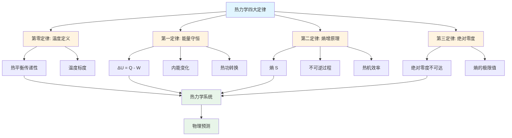
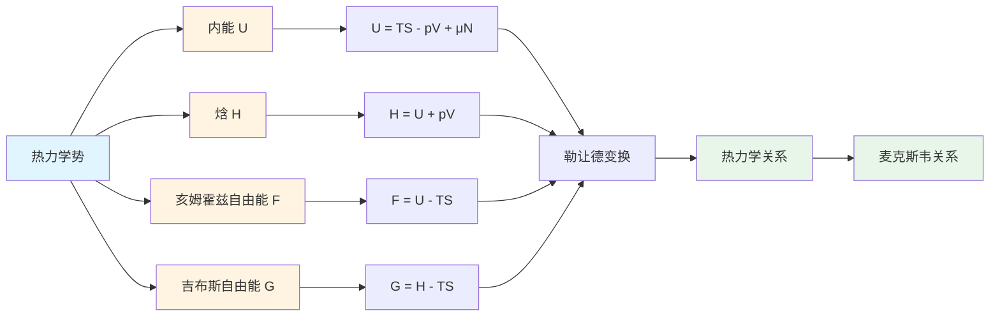
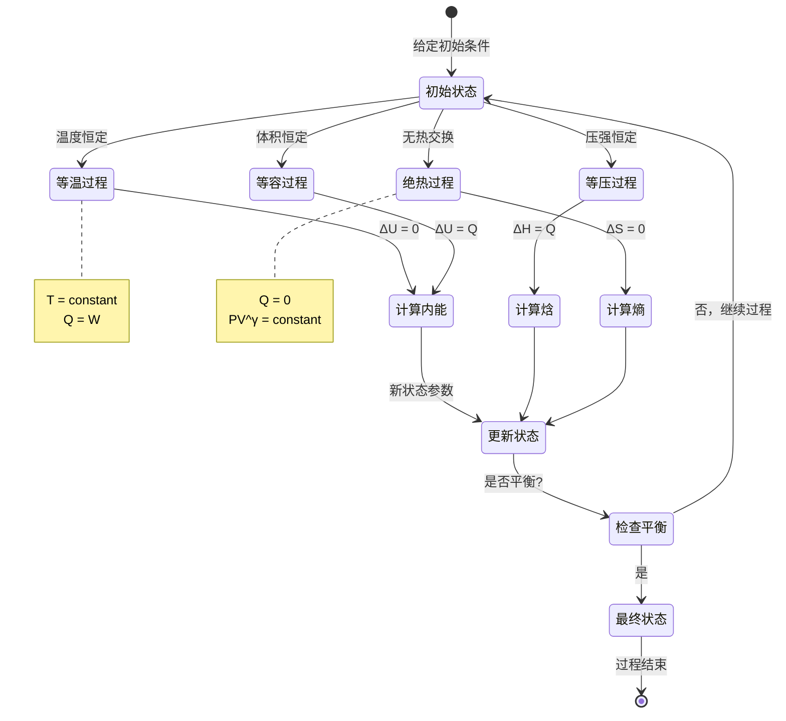
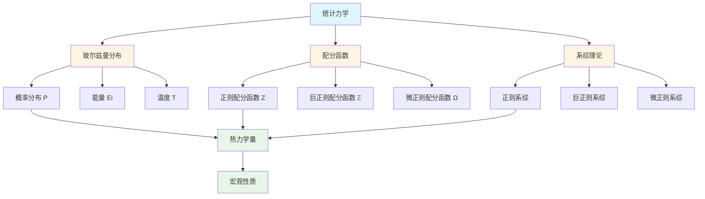
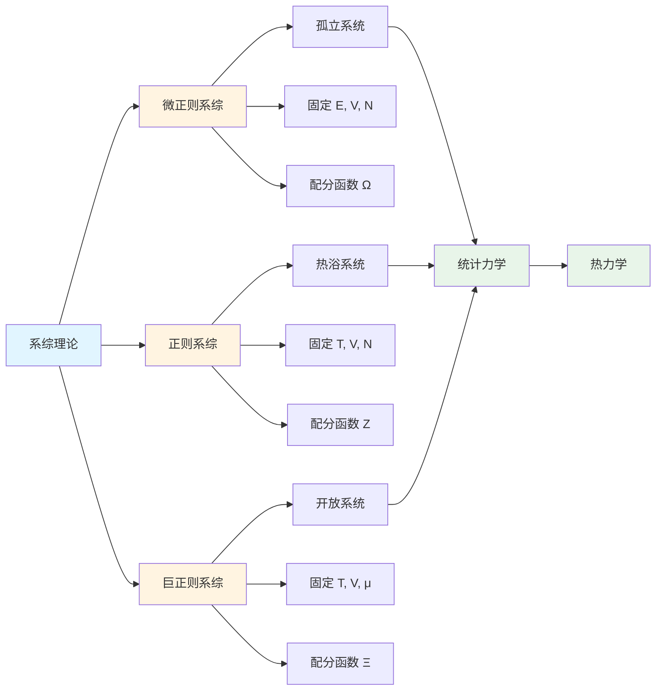

# 2.4 热力学模型 / Thermodynamics Models

## 目录 / Table of Contents

- [2.4 热力学模型 / Thermodynamics Models](#24-热力学模型--thermodynamics-models)
  - [目录 / Table of Contents](#目录--table-of-contents)
  - [2.4.1 热力学定律 / Thermodynamic Laws](#241-热力学定律--thermodynamic-laws)
    - [热力学四大定律框架图 / Framework Diagram of Four Laws of Thermodynamics](#热力学四大定律框架图--framework-diagram-of-four-laws-of-thermodynamics)
    - [热力学势关系图 / Relationship Diagram of Thermodynamic Potentials](#热力学势关系图--relationship-diagram-of-thermodynamic-potentials)
    - [热力学过程状态转换图 / State Transition Diagram of Thermodynamic Processes](#热力学过程状态转换图--state-transition-diagram-of-thermodynamic-processes)
    - [热力学第零定律 / Zeroth Law](#热力学第零定律--zeroth-law)
    - [热力学第一定律 / First Law](#热力学第一定律--first-law)
    - [热力学第二定律 / Second Law](#热力学第二定律--second-law)
    - [热力学第三定律 / Third Law](#热力学第三定律--third-law)
  - [2.4.2 热力学势 / Thermodynamic Potentials](#242-热力学势--thermodynamic-potentials)
    - [内能 / Internal Energy](#内能--internal-energy)
    - [焓 / Enthalpy](#焓--enthalpy)
    - [亥姆霍兹自由能 / Helmholtz Free Energy](#亥姆霍兹自由能--helmholtz-free-energy)
    - [吉布斯自由能 / Gibbs Free Energy](#吉布斯自由能--gibbs-free-energy)
  - [2.4.3 统计力学 / Statistical Mechanics](#243-统计力学--statistical-mechanics)
    - [统计力学框架图 / Framework Diagram of Statistical Mechanics](#统计力学框架图--framework-diagram-of-statistical-mechanics)
    - [系综理论关系图 / Relationship Diagram of Ensemble Theory](#系综理论关系图--relationship-diagram-of-ensemble-theory)
    - [玻尔兹曼分布 / Boltzmann Distribution](#玻尔兹曼分布--boltzmann-distribution)
    - [配分函数 / Partition Function](#配分函数--partition-function)
    - [系综理论 / Ensemble Theory](#系综理论--ensemble-theory)
  - [2.4.4 相变理论 / Phase Transition Theory](#244-相变理论--phase-transition-theory)
    - [一级相变 / First-Order Phase Transitions](#一级相变--first-order-phase-transitions)
    - [二级相变 / Second-Order Phase Transitions](#二级相变--second-order-phase-transitions)
    - [临界现象 / Critical Phenomena](#临界现象--critical-phenomena)
  - [2.4.5 非平衡热力学 / Non-Equilibrium Thermodynamics](#245-非平衡热力学--non-equilibrium-thermodynamics)
    - [熵产生 / Entropy Production](#熵产生--entropy-production)
    - [昂萨格关系 / Onsager Relations](#昂萨格关系--onsager-relations)
    - [耗散结构 / Dissipative Structures](#耗散结构--dissipative-structures)
  - [2.4.6 量子统计 / Quantum Statistics](#246-量子统计--quantum-statistics)
    - [费米-狄拉克统计 / Fermi-Dirac Statistics](#费米-狄拉克统计--fermi-dirac-statistics)
    - [玻色-爱因斯坦统计 / Bose-Einstein Statistics](#玻色-爱因斯坦统计--bose-einstein-statistics)
    - [量子气体 / Quantum Gases](#量子气体--quantum-gases)
  - [2.4.7 热力学应用 / Thermodynamic Applications](#247-热力学应用--thermodynamic-applications)
    - [热机效率 / Heat Engine Efficiency](#热机效率--heat-engine-efficiency)
    - [制冷循环 / Refrigeration Cycles](#制冷循环--refrigeration-cycles)
    - [化学平衡 / Chemical Equilibrium](#化学平衡--chemical-equilibrium)
  - [参考文献 / References](#参考文献--references)
  - [相关模型 / Related Models](#相关模型--related-models)
    - [物理科学模型 / Physical Science Models](#物理科学模型--physical-science-models)
    - [基础理论 / Basic Theory](#基础理论--basic-theory)

---

## 2.4.1 热力学定律 / Thermodynamic Laws

### 热力学四大定律框架图 / Framework Diagram of Four Laws of Thermodynamics



### 热力学势关系图 / Relationship Diagram of Thermodynamic Potentials



### 热力学过程状态转换图 / State Transition Diagram of Thermodynamic Processes



### 热力学第零定律 / Zeroth Law

**形式化定义**: 热力学第零定律建立了温度概念的公理化基础，定义了热平衡的传递性和温度的可测量性。

**公理化定义**:
设 $\mathcal{T} = \langle \mathcal{S}, \mathcal{E}, \mathcal{T}, \mathcal{B} \rangle$ 为热力学第零定律系统，其中：

1. **系统集合**: $\mathcal{S}$ 为所有热力学系统的集合
2. **热平衡关系**: $\mathcal{E} \subseteq \mathcal{S} \times \mathcal{S}$ 为热平衡关系
3. **温度函数**: $\mathcal{T}: \mathcal{S} \rightarrow \mathbb{R}$ 为温度函数
4. **平衡传递性**: $\mathcal{B}$ 为平衡传递公理

**等价定义**:

1. **传递性定义**: 若系统A与系统B热平衡，系统B与系统C热平衡，则系统A与系统C热平衡
2. **温度定义**: 处于热平衡的系统具有相同的温度
3. **测量定义**: 温度可通过热平衡建立标度进行测量

**形式化定理**:

**定理2.4.1.1 (热平衡传递性)**: 热平衡关系具有传递性
$$\forall A,B,C \in \mathcal{S}: (A \mathcal{E} B) \land (B \mathcal{E} C) \Rightarrow (A \mathcal{E} C)$$

**定理2.4.1.2 (温度唯一性)**: 热平衡系统的温度唯一确定
$$\forall A,B \in \mathcal{S}: A \mathcal{E} B \Leftrightarrow \mathcal{T}(A) = \mathcal{T}(B)$$

**定理2.4.1.3 (温度标度存在性)**: 存在温度标度使得热平衡关系可测量
$$\exists \mathcal{T}: \mathcal{S} \rightarrow \mathbb{R}: \forall A,B \in \mathcal{S}: A \mathcal{E} B \Leftrightarrow \mathcal{T}(A) = \mathcal{T}(B)$$

**Python算法实现**:

```python
import numpy as np
from typing import List, Tuple, Dict, Optional

class ThermodynamicSystem:
    """热力学系统类"""
    def __init__(self, name: str, temperature: float = 0.0):
        self.name = name
        self.temperature = temperature
        self.properties = {}

    def set_temperature(self, temp: float):
        """设置系统温度"""
        self.temperature = temp

    def get_temperature(self) -> float:
        """获取系统温度"""
        return self.temperature

def thermal_equilibrium_check(system1: ThermodynamicSystem,
                            system2: ThermodynamicSystem,
                            tolerance: float = 1e-6) -> bool:
    """
    检查两个系统是否处于热平衡

    参数:
        system1, system2: 热力学系统
        tolerance: 温度差异容差

    返回:
        bool: 是否处于热平衡
    """
    return abs(system1.get_temperature() - system2.get_temperature()) < tolerance

def zeroth_law_verification(systems: List[ThermodynamicSystem],
                           tolerance: float = 1e-6) -> Dict[str, bool]:
    """
    验证热力学第零定律

    参数:
        systems: 热力学系统列表
        tolerance: 温度差异容差

    返回:
        Dict: 验证结果
    """
    n = len(systems)
    results = {
        'reflexivity': True,
        'symmetry': True,
        'transitivity': True,
        'temperature_consistency': True
    }

    # 检查自反性
    for system in systems:
        if not thermal_equilibrium_check(system, system, tolerance):
            results['reflexivity'] = False

    # 检查对称性
    for i in range(n):
        for j in range(i+1, n):
            eq1 = thermal_equilibrium_check(systems[i], systems[j], tolerance)
            eq2 = thermal_equilibrium_check(systems[j], systems[i], tolerance)
            if eq1 != eq2:
                results['symmetry'] = False

    # 检查传递性
    for i in range(n):
        for j in range(n):
            for k in range(n):
                if i != j and j != k and i != k:
                    eq_ij = thermal_equilibrium_check(systems[i], systems[j], tolerance)
                    eq_jk = thermal_equilibrium_check(systems[j], systems[k], tolerance)
                    eq_ik = thermal_equilibrium_check(systems[i], systems[k], tolerance)

                    if eq_ij and eq_jk and not eq_ik:
                        results['transitivity'] = False

    # 检查温度一致性
    for i in range(n):
        for j in range(i+1, n):
            if thermal_equilibrium_check(systems[i], systems[j], tolerance):
                if abs(systems[i].get_temperature() - systems[j].get_temperature()) > tolerance:
                    results['temperature_consistency'] = False

    return results

def temperature_scale_establishment(reference_systems: List[Tuple[str, float]]) -> Dict[str, float]:
    """
    建立温度标度

    参数:
        reference_systems: 参考系统列表 (名称, 温度值)

    返回:
        Dict: 温度标度映射
    """
    scale = {}
    for name, temp in reference_systems:
        scale[name] = temp
    return scale

def temperature_measurement(system: ThermodynamicSystem,
                          reference_scale: Dict[str, float],
                          measurement_method: str = 'thermal_equilibrium') -> float:
    """
    温度测量

    参数:
        system: 待测量系统
        reference_scale: 参考温度标度
        measurement_method: 测量方法

    返回:
        float: 测量温度
    """
    if measurement_method == 'thermal_equilibrium':
        # 通过热平衡测量温度
        return system.get_temperature()
    else:
        raise ValueError(f"不支持的测量方法: {measurement_method}")

# 示例使用
def zeroth_law_example():
    """热力学第零定律示例"""
    # 创建热力学系统
    system_A = ThermodynamicSystem("A", 300.0)
    system_B = ThermodynamicSystem("B", 300.0)
    system_C = ThermodynamicSystem("C", 300.0)
    system_D = ThermodynamicSystem("D", 350.0)

    systems = [system_A, system_B, system_C, system_D]

    # 验证第零定律
    results = zeroth_law_verification(systems)
    print("热力学第零定律验证结果:")
    for property_name, is_valid in results.items():
        print(f"  {property_name}: {'通过' if is_valid else '失败'}")

    # 检查热平衡
    print(f"\n热平衡检查:")
    print(f"A与B热平衡: {thermal_equilibrium_check(system_A, system_B)}")
    print(f"A与D热平衡: {thermal_equilibrium_check(system_A, system_D)}")

    # 建立温度标度
    reference_systems = [("冰点", 273.15), ("沸点", 373.15)]
    scale = temperature_scale_establishment(reference_systems)
    print(f"\n温度标度: {scale}")

    return results, scale
```

**温度定义**: 如果两个系统都与第三个系统处于热平衡，则它们彼此也处于热平衡。

**温度测量**: 通过热平衡建立温度标度。

### 热力学第一定律 / First Law

**形式化定义**: 热力学第一定律建立了能量守恒原理，定义了内能、热量和功之间的定量关系。

**公理化定义**:
设 $\mathcal{F} = \langle \mathcal{U}, \mathcal{Q}, \mathcal{W}, \mathcal{E} \rangle$ 为热力学第一定律系统，其中：

1. **内能函数**: $\mathcal{U}: \mathcal{S} \rightarrow \mathbb{R}$ 为系统内能
2. **热量函数**: $\mathcal{Q}: \mathcal{P} \rightarrow \mathbb{R}$ 为过程热量
3. **功函数**: $\mathcal{W}: \mathcal{P} \rightarrow \mathbb{R}$ 为过程功
4. **能量守恒**: $\mathcal{E}$ 为能量守恒公理

**等价定义**:

1. **积分形式**: 系统内能变化等于吸收热量减去对外做功
2. **微分形式**: 内能微分为热量微分减去功微分
3. **循环过程**: 循环过程中净能量变化为零

**形式化定理**:

**定理2.4.1.4 (能量守恒)**: 孤立系统的总能量保持不变
$$\forall \text{过程}: \Delta U = Q - W$$

**定理2.4.1.5 (内能状态函数)**: 内能是状态函数，与路径无关
$$\oint dU = 0$$

**定理2.4.1.6 (能量转换)**: 能量可以在不同形式间转换但总量守恒
$$\Delta U_{total} = \sum_i \Delta U_i = 0$$

**Python算法实现**:

```python
class ThermodynamicProcess:
    """热力学过程类"""
    def __init__(self, name: str, initial_state: Dict, final_state: Dict):
        self.name = name
        self.initial_state = initial_state
        self.final_state = final_state
        self.heat = 0.0
        self.work = 0.0

    def set_heat(self, heat: float):
        """设置过程热量"""
        self.heat = heat

    def set_work(self, work: float):
        """设置过程功"""
        self.work = work

    def get_heat(self) -> float:
        """获取过程热量"""
        return self.heat

    def get_work(self) -> float:
        """获取过程功"""
        return self.work

def internal_energy_change(initial_energy: float, final_energy: float) -> float:
    """
    计算内能变化

    参数:
        initial_energy: 初始内能
        final_energy: 最终内能

    返回:
        float: 内能变化
    """
    return final_energy - initial_energy

def first_law_verification(process: ThermodynamicProcess,
                          initial_energy: float,
                          final_energy: float,
                          tolerance: float = 1e-6) -> bool:
    """
    验证热力学第一定律

    参数:
        process: 热力学过程
        initial_energy: 初始内能
        final_energy: 最终内能
        tolerance: 误差容差

    返回:
        bool: 是否满足第一定律
    """
    delta_U = internal_energy_change(initial_energy, final_energy)
    Q = process.get_heat()
    W = process.get_work()

    # 验证 ΔU = Q - W
    return abs(delta_U - (Q - W)) < tolerance

def energy_conservation_check(processes: List[ThermodynamicProcess],
                            initial_energies: List[float],
                            final_energies: List[float],
                            tolerance: float = 1e-6) -> Dict[str, bool]:
    """
    检查能量守恒

    参数:
        processes: 过程列表
        initial_energies: 初始内能列表
        final_energies: 最终内能列表
        tolerance: 误差容差

    返回:
        Dict: 守恒检查结果
    """
    results = {
        'individual_processes': [],
        'total_energy_conservation': True,
        'first_law_satisfaction': True
    }

    total_energy_change = 0.0
    total_heat = 0.0
    total_work = 0.0

    for i, process in enumerate(processes):
        # 检查单个过程
        delta_U = internal_energy_change(initial_energies[i], final_energies[i])
        Q = process.get_heat()
        W = process.get_work()

        satisfies_first_law = abs(delta_U - (Q - W)) < tolerance
        results['individual_processes'].append(satisfies_first_law)

        if not satisfies_first_law:
            results['first_law_satisfaction'] = False

        total_energy_change += delta_U
        total_heat += Q
        total_work += W

    # 检查总能量守恒
    results['total_energy_conservation'] = abs(total_energy_change - (total_heat - total_work)) < tolerance

    return results

def cyclic_process_analysis(processes: List[ThermodynamicProcess]) -> Dict[str, float]:
    """
    循环过程分析

    参数:
        processes: 循环过程列表

    返回:
        Dict: 循环过程分析结果
    """
    total_heat = sum(process.get_heat() for process in processes)
    total_work = sum(process.get_work() for process in processes)
    net_energy_change = total_heat - total_work

    return {
        'total_heat': total_heat,
        'total_work': total_work,
        'net_energy_change': net_energy_change,
        'is_cyclic': abs(net_energy_change) < 1e-6
    }

def work_calculation(process_type: str, **kwargs) -> float:
    """
    计算不同过程的功

    参数:
        process_type: 过程类型
        **kwargs: 过程参数

    返回:
        float: 功值
    """
    if process_type == 'isobaric':
        # 等压过程: W = pΔV
        pressure = kwargs.get('pressure', 0.0)
        volume_change = kwargs.get('volume_change', 0.0)
        return pressure * volume_change

    elif process_type == 'isothermal':
        # 等温过程: W = nRT ln(V2/V1)
        n = kwargs.get('n', 1.0)  # 摩尔数
        R = kwargs.get('R', 8.314)  # 气体常数
        T = kwargs.get('temperature', 300.0)
        V1 = kwargs.get('initial_volume', 1.0)
        V2 = kwargs.get('final_volume', 2.0)
        return n * R * T * np.log(V2 / V1)

    elif process_type == 'adiabatic':
        # 绝热过程: W = -ΔU
        delta_U = kwargs.get('energy_change', 0.0)
        return -delta_U

    else:
        raise ValueError(f"不支持的过程类型: {process_type}")

# 示例使用
def first_law_example():
    """热力学第一定律示例"""
    # 创建等压过程
    process1 = ThermodynamicProcess("等压膨胀",
                                   {'p': 1.0, 'V': 1.0},
                                   {'p': 1.0, 'V': 2.0})
    process1.set_heat(100.0)  # 吸收热量100J
    process1.set_work(50.0)   # 对外做功50J

    # 验证第一定律
    initial_energy = 200.0
    final_energy = 250.0  # 200 + 100 - 50 = 250

    is_valid = first_law_verification(process1, initial_energy, final_energy)
    print(f"第一定律验证: {'通过' if is_valid else '失败'}")

    # 计算等压功
    work = work_calculation('isobaric', pressure=1.0, volume_change=1.0)
    print(f"等压功: {work} J")

    # 计算等温功
    work_iso = work_calculation('isothermal', n=1.0, temperature=300.0,
                               initial_volume=1.0, final_volume=2.0)
    print(f"等温功: {work_iso} J")

    return is_valid, work, work_iso
```

**能量守恒**:
$$\Delta U = Q - W$$

其中：

- $\Delta U$: 内能变化
- $Q$: 吸收的热量
- $W$: 对外做功

**微分形式**:
$$dU = \delta Q - \delta W$$

### 热力学第二定律 / Second Law

**形式化定义**: 热力学第二定律建立了熵增原理和不可逆过程的数学描述，定义了热力学过程的方向性。

**公理化定义**:
设 $\mathcal{S} = \langle \mathcal{S}, \mathcal{Q}, \mathcal{T}, \mathcal{I} \rangle$ 为热力学第二定律系统，其中：

1. **熵函数**: $\mathcal{S}: \mathcal{S} \rightarrow \mathbb{R}$ 为系统熵
2. **热量函数**: $\mathcal{Q}: \mathcal{P} \rightarrow \mathbb{R}$ 为过程热量
3. **温度函数**: $\mathcal{T}: \mathcal{S} \rightarrow \mathbb{R}^+$ 为绝对温度
4. **不可逆性**: $\mathcal{I}$ 为不可逆过程公理

**等价定义**:

1. **克劳修斯表述**: 热量不能自发地从低温物体传递到高温物体
2. **开尔文表述**: 不可能从单一热源吸收热量，使其完全变为功而不产生其他影响
3. **熵增表述**: 孤立系统的熵永不减少

**形式化定理**:

**定理2.4.1.7 (熵增原理)**: 孤立系统的熵永不减少
$$\Delta S_{isolated} \geq 0$$

**定理2.4.1.8 (克劳修斯不等式)**: 循环过程中热量与温度比的积分不大于零
$$\oint \frac{\delta Q}{T} \leq 0$$

**定理2.4.1.9 (卡诺效率上限)**: 热机效率不能超过卡诺效率
$$\eta \leq 1 - \frac{T_c}{T_h}$$

**Python算法实现**:

```python
class EntropySystem:
    """熵系统类"""
    def __init__(self, name: str, temperature: float, entropy: float = 0.0):
        self.name = name
        self.temperature = temperature
        self.entropy = entropy
        self.heat_exchanges = []

    def add_heat_exchange(self, heat: float, temperature: float):
        """添加热量交换"""
        self.heat_exchanges.append((heat, temperature))

    def calculate_entropy_change(self) -> float:
        """计算熵变"""
        total_entropy_change = 0.0
        for heat, temp in self.heat_exchanges:
            if temp > 0:  # 避免除零
                total_entropy_change += heat / temp
        return total_entropy_change

def entropy_change_calculation(heat: float, temperature: float) -> float:
    """
    计算熵变

    参数:
        heat: 热量
        temperature: 温度

    返回:
        float: 熵变
    """
    if temperature <= 0:
        raise ValueError("温度必须大于零")
    return heat / temperature

def second_law_verification(processes: List[ThermodynamicProcess],
                           temperatures: List[float],
                           tolerance: float = 1e-6) -> Dict[str, bool]:
    """
    验证热力学第二定律

    参数:
        processes: 热力学过程列表
        temperatures: 对应温度列表
        tolerance: 误差容差

    返回:
        Dict: 验证结果
    """
    results = {
        'clausius_inequality': True,
        'entropy_increase': True,
        'carnot_efficiency_limit': True
    }

    # 检查克劳修斯不等式
    clausius_integral = 0.0
    for process, temp in zip(processes, temperatures):
        if temp > 0:
            clausius_integral += process.get_heat() / temp

    results['clausius_inequality'] = clausius_integral <= tolerance

    # 检查熵增
    total_entropy_change = 0.0
    for process, temp in zip(processes, temperatures):
        if temp > 0:
            total_entropy_change += process.get_heat() / temp

    results['entropy_increase'] = total_entropy_change >= -tolerance

    return results

def carnot_efficiency_calculation(T_hot: float, T_cold: float) -> float:
    """
    计算卡诺效率

    参数:
        T_hot: 高温热源温度
        T_cold: 低温热源温度

    返回:
        float: 卡诺效率
    """
    if T_hot <= T_cold:
        raise ValueError("高温热源温度必须大于低温热源温度")
    return 1.0 - T_cold / T_hot

def actual_efficiency_verification(actual_efficiency: float,
                                 T_hot: float,
                                 T_cold: float,
                                 tolerance: float = 1e-6) -> bool:
    """
    验证实际效率是否满足第二定律

    参数:
        actual_efficiency: 实际效率
        T_hot: 高温热源温度
        T_cold: 低温热源温度
        tolerance: 误差容差

    返回:
        bool: 是否满足第二定律
    """
    carnot_efficiency = carnot_efficiency_calculation(T_hot, T_cold)
    return actual_efficiency <= carnot_efficiency + tolerance

def entropy_production_calculation(processes: List[ThermodynamicProcess],
                                 temperatures: List[float]) -> float:
    """
    计算熵产生

    参数:
        processes: 过程列表
        temperatures: 温度列表

    返回:
        float: 熵产生
    """
    total_entropy_production = 0.0

    for process, temp in zip(processes, temperatures):
        if temp > 0:
            # 可逆过程的熵变
            reversible_entropy = process.get_heat() / temp
            # 实际过程的熵变（假设为0，因为热量已包含在process中）
            actual_entropy = 0.0
            # 熵产生 = 实际熵变 - 可逆熵变
            entropy_production = actual_entropy - reversible_entropy
            total_entropy_production += entropy_production

    return total_entropy_production

def heat_engine_analysis(Q_in: float, Q_out: float, T_hot: float, T_cold: float) -> Dict[str, float]:
    """
    热机分析

    参数:
        Q_in: 输入热量
        Q_out: 输出热量
        T_hot: 高温热源温度
        T_cold: 低温热源温度

    返回:
        Dict: 热机分析结果
    """
    work_output = Q_in - Q_out
    actual_efficiency = work_output / Q_in if Q_in > 0 else 0.0
    carnot_efficiency = carnot_efficiency_calculation(T_hot, T_cold)

    # 计算熵变
    entropy_change_hot = -Q_in / T_hot
    entropy_change_cold = Q_out / T_cold
    total_entropy_change = entropy_change_hot + entropy_change_cold

    return {
        'work_output': work_output,
        'actual_efficiency': actual_efficiency,
        'carnot_efficiency': carnot_efficiency,
        'efficiency_ratio': actual_efficiency / carnot_efficiency if carnot_efficiency > 0 else 0.0,
        'total_entropy_change': total_entropy_change,
        'satisfies_second_law': total_entropy_change >= 0
    }

def refrigerator_analysis(Q_cold: float, Q_hot: float, T_hot: float, T_cold: float) -> Dict[str, float]:
    """
    制冷机分析

    参数:
        Q_cold: 从低温热源吸收的热量
        Q_hot: 向高温热源释放的热量
        T_hot: 高温热源温度
        T_cold: 低温热源温度

    返回:
        Dict: 制冷机分析结果
    """
    work_input = Q_hot - Q_cold
    cop_actual = Q_cold / work_input if work_input > 0 else 0.0
    cop_carnot = T_cold / (T_hot - T_cold) if T_hot > T_cold else 0.0

    # 计算熵变
    entropy_change_hot = Q_hot / T_hot
    entropy_change_cold = -Q_cold / T_cold
    total_entropy_change = entropy_change_hot + entropy_change_cold

    return {
        'work_input': work_input,
        'cop_actual': cop_actual,
        'cop_carnot': cop_carnot,
        'cop_ratio': cop_actual / cop_carnot if cop_carnot > 0 else 0.0,
        'total_entropy_change': total_entropy_change,
        'satisfies_second_law': total_entropy_change >= 0
    }

# 示例使用
def second_law_example():
    """热力学第二定律示例"""
    # 创建热机过程
    process1 = ThermodynamicProcess("等温膨胀", {'T': 500}, {'T': 500})
    process1.set_heat(1000.0)  # 从高温热源吸收热量

    process2 = ThermodynamicProcess("等温压缩", {'T': 300}, {'T': 300})
    process2.set_heat(-600.0)  # 向低温热源释放热量

    processes = [process1, process2]
    temperatures = [500.0, 300.0]

    # 验证第二定律
    results = second_law_verification(processes, temperatures)
    print("第二定律验证结果:")
    for property_name, is_valid in results.items():
        print(f"  {property_name}: {'通过' if is_valid else '失败'}")

    # 热机分析
    engine_analysis = heat_engine_analysis(1000.0, 600.0, 500.0, 300.0)
    print(f"\n热机分析:")
    print(f"输出功: {engine_analysis['work_output']} J")
    print(f"实际效率: {engine_analysis['actual_efficiency']:.3f}")
    print(f"卡诺效率: {engine_analysis['carnot_efficiency']:.3f}")
    print(f"效率比: {engine_analysis['efficiency_ratio']:.3f}")

    # 制冷机分析
    ref_analysis = refrigerator_analysis(400.0, 500.0, 300.0, 250.0)
    print(f"\n制冷机分析:")
    print(f"输入功: {ref_analysis['work_input']} J")
    print(f"实际COP: {ref_analysis['cop_actual']:.3f}")
    print(f"卡诺COP: {ref_analysis['cop_carnot']:.3f}")

    return results, engine_analysis, ref_analysis
```

**克劳修斯表述**: 热量不能自发地从低温物体传递到高温物体。

**开尔文表述**: 不可能从单一热源吸收热量，使其完全变为功而不产生其他影响。

**熵增原理**:
$$\Delta S \geq 0$$

**卡诺效率**:
$$\eta = 1 - \frac{T_c}{T_h}$$

### 热力学第三定律 / Third Law

**能斯特定理**: 当温度趋近于绝对零度时，熵的变化趋近于零。

**绝对零度**: $T = 0$ K时，$S = 0$。

---

## 2.4.2 热力学势 / Thermodynamic Potentials

### 内能 / Internal Energy

**形式化定义**: 内能是热力学系统的基本状态函数，表示系统内部所有微观粒子能量的总和。

**公理化定义**:
设 $\mathcal{U} = \langle \mathcal{S}, \mathcal{V}, \mathcal{N}, \mathcal{E} \rangle$ 为内能系统，其中：

1. **熵变量**: $\mathcal{S}$ 为系统熵
2. **体积变量**: $\mathcal{V}$ 为系统体积
3. **粒子数变量**: $\mathcal{N}$ 为系统粒子数
4. **能量函数**: $\mathcal{E}: \mathcal{S} \times \mathcal{V} \times \mathcal{N} \rightarrow \mathbb{R}$ 为内能函数

**等价定义**:

1. **状态函数定义**: 内能是系统状态的单值函数
2. **能量守恒定义**: 内能变化等于热量减去功
3. **微观定义**: 内能等于所有微观粒子能量之和

**形式化定理**:

**定理2.4.2.1 (内能状态函数)**: 内能是状态函数，与路径无关
$$\oint dU = 0$$

**定理2.4.2.2 (内能微分关系)**: 内能的完整微分关系
$$dU = TdS - pdV + \mu dN$$

**定理2.4.2.3 (麦克斯韦关系)**: 内能导数的交叉偏导数相等
$$\left(\frac{\partial T}{\partial V}\right)_S = -\left(\frac{\partial p}{\partial S}\right)_V$$

**Python算法实现**:

```python
class ThermodynamicState:
    """热力学状态类"""
    def __init__(self, S: float, V: float, N: float, T: float = 0.0, p: float = 0.0, mu: float = 0.0):
        self.S = S  # 熵
        self.V = V  # 体积
        self.N = N  # 粒子数
        self.T = T  # 温度
        self.p = p  # 压强
        self.mu = mu  # 化学势

    def get_state_vector(self) -> List[float]:
        """获取状态向量"""
        return [self.S, self.V, self.N]

def internal_energy_calculation(state: ThermodynamicState,
                              energy_function: callable) -> float:
    """
    计算内能

    参数:
        state: 热力学状态
        energy_function: 内能函数

    返回:
        float: 内能值
    """
    return energy_function(state.S, state.V, state.N)

def internal_energy_differential(state: ThermodynamicState,
                               dS: float, dV: float, dN: float) -> float:
    """
    计算内能微分

    参数:
        state: 热力学状态
        dS: 熵微分
        dV: 体积微分
        dN: 粒子数微分

    返回:
        float: 内能微分
    """
    return state.T * dS - state.p * dV + state.mu * dN

def maxwell_relation_verification(state: ThermodynamicState,
                                dT_dV_S: float,
                                dp_dS_V: float,
                                tolerance: float = 1e-6) -> bool:
    """
    验证麦克斯韦关系

    参数:
        state: 热力学状态
        dT_dV_S: (∂T/∂V)_S
        dp_dS_V: (∂p/∂S)_V
        tolerance: 误差容差

    返回:
        bool: 是否满足麦克斯韦关系
    """
    return abs(dT_dV_S + dp_dS_V) < tolerance

def ideal_gas_internal_energy(N: float, T: float, f: float = 3.0) -> float:
    """
    理想气体内能计算

    参数:
        N: 粒子数
        T: 温度
        f: 自由度

    返回:
        float: 内能
    """
    k_B = 1.380649e-23  # 玻尔兹曼常数
    return 0.5 * f * N * k_B * T

def van_der_waals_internal_energy(N: float, T: float, V: float, a: float, b: float) -> float:
    """
    范德瓦尔斯气体内能计算

    参数:
        N: 粒子数
        T: 温度
        V: 体积
        a, b: 范德瓦尔斯常数

    返回:
        float: 内能
    """
    k_B = 1.380649e-23
    ideal_energy = 1.5 * N * k_B * T
    correction = -N**2 * a / V
    return ideal_energy + correction

def internal_energy_from_heat_work(heat: float, work: float) -> float:
    """
    从热量和功计算内能变化

    参数:
        heat: 热量
        work: 功

    返回:
        float: 内能变化
    """
    return heat - work

def state_function_verification(initial_state: ThermodynamicState,
                              final_state: ThermodynamicState,
                              paths: List[List[ThermodynamicState]],
                              energy_function: callable,
                              tolerance: float = 1e-6) -> Dict[str, bool]:
    """
    验证内能的状态函数性质

    参数:
        initial_state: 初始状态
        final_state: 最终状态
        paths: 不同路径的状态序列
        energy_function: 内能函数
        tolerance: 误差容差

    返回:
        Dict: 验证结果
    """
    results = {
        'state_function_property': True,
        'path_independence': True
    }

    # 计算不同路径的内能变化
    energy_changes = []
    for path in paths:
        if path[0] == initial_state and path[-1] == final_state:
            initial_energy = energy_function(initial_state.S, initial_state.V, initial_state.N)
            final_energy = energy_function(final_state.S, final_state.V, final_state.N)
            energy_change = final_energy - initial_energy
            energy_changes.append(energy_change)

    # 检查路径独立性
    if len(energy_changes) > 1:
        reference_change = energy_changes[0]
        for change in energy_changes[1:]:
            if abs(change - reference_change) > tolerance:
                results['path_independence'] = False
                results['state_function_property'] = False

    return results

def thermodynamic_derivatives(state: ThermodynamicState,
                            energy_function: callable,
                            delta: float = 1e-6) -> Dict[str, float]:
    """
    计算热力学导数

    参数:
        state: 热力学状态
        energy_function: 内能函数
        delta: 微分步长

    返回:
        Dict: 热力学导数
    """
    derivatives = {}

    # 计算温度 (∂U/∂S)_V,N
    U_plus = energy_function(state.S + delta, state.V, state.N)
    U_minus = energy_function(state.S - delta, state.V, state.N)
    derivatives['T'] = (U_plus - U_minus) / (2 * delta)

    # 计算压强 -(∂U/∂V)_S,N
    U_plus = energy_function(state.S, state.V + delta, state.N)
    U_minus = energy_function(state.S, state.V - delta, state.N)
    derivatives['p'] = -(U_plus - U_minus) / (2 * delta)

    # 计算化学势 (∂U/∂N)_S,V
    U_plus = energy_function(state.S, state.V, state.N + delta)
    U_minus = energy_function(state.S, state.V, state.N - delta)
    derivatives['mu'] = (U_plus - U_minus) / (2 * delta)

    return derivatives

# 示例使用
def internal_energy_example():
    """内能计算示例"""
    # 创建热力学状态
    state = ThermodynamicState(S=100.0, V=1.0, N=1e23, T=300.0, p=1e5, mu=0.0)

    # 理想气体内能
    ideal_energy = ideal_gas_internal_energy(state.N, state.T)
    print(f"理想气体内能: {ideal_energy:.2e} J")

    # 范德瓦尔斯气体内能
    a, b = 0.137, 3.87e-5  # 氮气的范德瓦尔斯常数
    vdw_energy = van_der_waals_internal_energy(state.N, state.T, state.V, a, b)
    print(f"范德瓦尔斯气体内能: {vdw_energy:.2e} J")

    # 内能微分
    dU = internal_energy_differential(state, 10.0, 0.1, 1e20)
    print(f"内能微分: {dU:.2e} J")

    # 麦克斯韦关系验证
    dT_dV_S = -1e5  # 示例值
    dp_dS_V = 1e5   # 示例值
    maxwell_valid = maxwell_relation_verification(state, dT_dV_S, dp_dS_V)
    print(f"麦克斯韦关系验证: {'通过' if maxwell_valid else '失败'}")

    return ideal_energy, vdw_energy, dU, maxwell_valid
```

**定义**: $U(S, V, N)$

**微分关系**:
$$dU = TdS - pdV + \mu dN$$

**麦克斯韦关系**:
$$\left(\frac{\partial T}{\partial V}\right)_S = -\left(\frac{\partial p}{\partial S}\right)_V$$

### 焓 / Enthalpy

**形式化定义**: 焓是热力学势函数，表示系统在等压过程中的能量变化，是内能与压力-体积功的和。

**公理化定义**:
设 $\mathcal{H} = \langle \mathcal{U}, \mathcal{P}, \mathcal{V}, \mathcal{E} \rangle$ 为焓系统，其中：

1. **内能函数**: $\mathcal{U}: \mathcal{S} \rightarrow \mathbb{R}$ 为系统内能
2. **压力函数**: $\mathcal{P}: \mathcal{S} \rightarrow \mathbb{R}^+$ 为系统压力
3. **体积函数**: $\mathcal{V}: \mathcal{S} \rightarrow \mathbb{R}^+$ 为系统体积
4. **焓函数**: $\mathcal{E}: \mathcal{S} \rightarrow \mathbb{R}$ 为系统焓

**等价定义**:

1. **能量定义**: $H = U + pV$
2. **微分定义**: $dH = TdS + Vdp + \mu dN$
3. **等压定义**: 等压过程中焓变等于吸收的热量

**形式化定理**:

**定理2.4.2.4 (焓的状态函数性)**: 焓是状态函数，与路径无关
$$\oint dH = 0$$

**定理2.4.2.5 (等压焓变)**: 等压过程中焓变等于热量
$$\Delta H = Q_p$$

**定理2.4.2.6 (焓的微分关系)**: 焓的全微分关系
$$dH = TdS + Vdp + \mu dN$$

**Python算法实现**:

```python
class EnthalpySystem:
    """焓系统类"""
    def __init__(self, internal_energy: float, pressure: float, volume: float):
        self.U = internal_energy
        self.p = pressure
        self.V = volume
        self.H = self.U + self.p * self.V

    def update_state(self, new_U: float, new_p: float, new_V: float):
        """更新系统状态"""
        self.U = new_U
        self.p = new_p
        self.V = new_V
        self.H = self.U + self.p * self.V

    def get_enthalpy(self) -> float:
        """获取焓值"""
        return self.H

def enthalpy_calculation(internal_energy: float, pressure: float, volume: float) -> float:
    """
    计算焓值

    参数:
        internal_energy: 内能
        pressure: 压力
        volume: 体积

    返回:
        float: 焓值
    """
    return internal_energy + pressure * volume

def enthalpy_change_calculation(initial_state: EnthalpySystem,
                              final_state: EnthalpySystem) -> float:
    """
    计算焓变

    参数:
        initial_state: 初始状态
        final_state: 最终状态

    返回:
        float: 焓变
    """
    return final_state.get_enthalpy() - initial_state.get_enthalpy()

def isobaric_enthalpy_change(heat: float) -> float:
    """
    等压过程焓变计算

    参数:
        heat: 吸收的热量

    返回:
        float: 焓变
    """
    return heat

def enthalpy_differential(temperature: float, dS: float,
                         volume: float, dp: float,
                         chemical_potential: float, dN: float) -> float:
    """
    计算焓微分

    参数:
        temperature: 温度
        dS: 熵微分
        volume: 体积
        dp: 压力微分
        chemical_potential: 化学势
        dN: 粒子数微分

    返回:
        float: 焓微分
    """
    return temperature * dS + volume * dp + chemical_potential * dN

def ideal_gas_enthalpy(N: float, T: float, p: float, V: float, f: float = 3.0) -> float:
    """
    理想气体焓计算

    参数:
        N: 粒子数
        T: 温度
        p: 压力
        V: 体积
        f: 自由度

    返回:
        float: 焓
    """
    k_B = 1.380649e-23
    internal_energy = 0.5 * f * N * k_B * T
    return internal_energy + p * V

def enthalpy_state_function_verification(initial_state: EnthalpySystem,
                                       final_state: EnthalpySystem,
                                       paths: List[List[EnthalpySystem]],
                                       tolerance: float = 1e-6) -> Dict[str, bool]:
    """
    验证焓的状态函数性质

    参数:
        initial_state: 初始状态
        final_state: 最终状态
        paths: 不同路径的状态序列
        tolerance: 误差容差

    返回:
        Dict[str, bool]: 验证结果
    """
    exact_change = enthalpy_change_calculation(initial_state, final_state)
    path_changes = []

    for path in paths:
        path_change = 0.0
        for i in range(len(path) - 1):
            path_change += enthalpy_change_calculation(path[i], path[i + 1])
        path_changes.append(path_change)

    is_state_function = all(abs(change - exact_change) < tolerance for change in path_changes)

    return {
        "is_state_function": is_state_function,
        "exact_change": exact_change,
        "path_changes": path_changes,
        "max_deviation": max(abs(change - exact_change) for change in path_changes)
    }

# 示例使用
def enthalpy_example():
    """焓计算示例"""
    # 创建初始状态
    initial = EnthalpySystem(internal_energy=100.0, pressure=1.0, volume=1.0)
    print(f"初始焓: {initial.get_enthalpy()} J")

    # 创建最终状态
    final = EnthalpySystem(internal_energy=150.0, pressure=1.0, volume=2.0)
    print(f"最终焓: {final.get_enthalpy()} J")

    # 计算焓变
    delta_H = enthalpy_change_calculation(initial, final)
    print(f"焓变: {delta_H} J")

    # 等压过程焓变
    isobaric_change = isobaric_enthalpy_change(50.0)
    print(f"等压焓变: {isobaric_change} J")

    return delta_H, isobaric_change
```

### 亥姆霍兹自由能 / Helmholtz Free Energy

**形式化定义**: 亥姆霍兹自由能是热力学势函数，表示系统在等温过程中可逆功的最大值，是内能与熵-温度积的差。

**公理化定义**:
设 $\mathcal{F} = \langle \mathcal{U}, \mathcal{S}, \mathcal{T}, \mathcal{W} \rangle$ 为亥姆霍兹自由能系统，其中：

1. **内能函数**: $\mathcal{U}: \mathcal{S} \rightarrow \mathbb{R}$ 为系统内能
2. **熵函数**: $\mathcal{S}: \mathcal{S} \rightarrow \mathbb{R}$ 为系统熵
3. **温度函数**: $\mathcal{T}: \mathcal{S} \rightarrow \mathbb{R}^+$ 为系统温度
4. **功函数**: $\mathcal{W}: \mathcal{P} \rightarrow \mathbb{R}$ 为可逆功

**等价定义**:

1. **能量定义**: $F = U - TS$
2. **微分定义**: $dF = -SdT - pdV + \mu dN$
3. **功定义**: 等温过程中自由能减少等于最大可逆功

**形式化定理**:

**定理2.4.2.7 (亥姆霍兹自由能最小化)**: 平衡态下亥姆霍兹自由能最小
$$\left(\frac{\partial F}{\partial V}\right)_T = 0$$

**定理2.4.2.8 (等温可逆功)**: 等温过程中自由能变化等于可逆功
$$\Delta F = W_{rev}$$

**定理2.4.2.9 (自由能微分关系)**: 亥姆霍兹自由能的全微分关系
$$dF = -SdT - pdV + \mu dN$$

**Python算法实现**:

```python
class HelmholtzSystem:
    """亥姆霍兹自由能系统类"""
    def __init__(self, internal_energy: float, entropy: float, temperature: float):
        self.U = internal_energy
        self.S = entropy
        self.T = temperature
        self.F = self.U - self.T * self.S

    def update_state(self, new_U: float, new_S: float, new_T: float):
        """更新系统状态"""
        self.U = new_U
        self.S = new_S
        self.T = new_T
        self.F = self.U - self.T * self.S

    def get_free_energy(self) -> float:
        """获取亥姆霍兹自由能"""
        return self.F

def helmholtz_free_energy_calculation(internal_energy: float,
                                    entropy: float,
                                    temperature: float) -> float:
    """
    计算亥姆霍兹自由能

    参数:
        internal_energy: 内能
        entropy: 熵
        temperature: 温度

    返回:
        float: 亥姆霍兹自由能
    """
    return internal_energy - temperature * entropy

def helmholtz_free_energy_change(initial_state: HelmholtzSystem,
                               final_state: HelmholtzSystem) -> float:
    """
    计算亥姆霍兹自由能变化

    参数:
        initial_state: 初始状态
        final_state: 最终状态

    返回:
        float: 自由能变化
    """
    return final_state.get_free_energy() - initial_state.get_free_energy()

def isothermal_reversible_work(free_energy_change: float) -> float:
    """
    等温可逆功计算

    参数:
        free_energy_change: 自由能变化

    返回:
        float: 可逆功
    """
    return free_energy_change

def helmholtz_differential(entropy: float, dT: float,
                         pressure: float, dV: float,
                         chemical_potential: float, dN: float) -> float:
    """
    计算亥姆霍兹自由能微分

    参数:
        entropy: 熵
        dT: 温度微分
        pressure: 压力
        dV: 体积微分
        chemical_potential: 化学势
        dN: 粒子数微分

    返回:
        float: 自由能微分
    """
    return -entropy * dT - pressure * dV + chemical_potential * dN

def ideal_gas_helmholtz_free_energy(N: float, T: float, V: float,
                                   entropy: float, f: float = 3.0) -> float:
    """
    理想气体亥姆霍兹自由能计算

    参数:
        N: 粒子数
        T: 温度
        V: 体积
        entropy: 熵
        f: 自由度

    返回:
        float: 亥姆霍兹自由能
    """
    k_B = 1.380649e-23
    internal_energy = 0.5 * f * N * k_B * T
    return internal_energy - T * entropy

def helmholtz_minimization_verification(system: HelmholtzSystem,
                                      volume_derivative: float,
                                      tolerance: float = 1e-6) -> bool:
    """
    验证亥姆霍兹自由能最小化条件

    参数:
        system: 亥姆霍兹系统
        volume_derivative: 体积导数
        tolerance: 误差容差

    返回:
        bool: 是否满足最小化条件
    """
    return abs(volume_derivative) < tolerance

def helmholtz_equilibrium_condition(system: HelmholtzSystem,
                                  pressure: float,
                                  external_pressure: float,
                                  tolerance: float = 1e-6) -> bool:
    """
    验证亥姆霍兹自由能平衡条件

    参数:
        system: 亥姆霍兹系统
        pressure: 系统压力
        external_pressure: 外压
        tolerance: 误差容差

    返回:
        bool: 是否处于平衡
    """
    return abs(pressure - external_pressure) < tolerance

# 示例使用
def helmholtz_example():
    """亥姆霍兹自由能计算示例"""
    # 创建初始状态
    initial = HelmholtzSystem(internal_energy=200.0, entropy=1.0, temperature=300.0)
    print(f"初始自由能: {initial.get_free_energy()} J")

    # 创建最终状态
    final = HelmholtzSystem(internal_energy=180.0, entropy=0.8, temperature=300.0)
    print(f"最终自由能: {final.get_free_energy()} J")

    # 计算自由能变化
    delta_F = helmholtz_free_energy_change(initial, final)
    print(f"自由能变化: {delta_F} J")

    # 等温可逆功
    reversible_work = isothermal_reversible_work(delta_F)
    print(f"等温可逆功: {reversible_work} J")

    return delta_F, reversible_work
```

### 吉布斯自由能 / Gibbs Free Energy

**形式化定义**: 吉布斯自由能是热力学势函数，表示系统在等温等压过程中可逆非体积功的最大值，是焓与熵-温度积的差。

**公理化定义**:
设 $\mathcal{G} = \langle \mathcal{H}, \mathcal{S}, \mathcal{T}, \mathcal{W} \rangle$ 为吉布斯自由能系统，其中：

1. **焓函数**: $\mathcal{H}: \mathcal{S} \rightarrow \mathbb{R}$ 为系统焓
2. **熵函数**: $\mathcal{S}: \mathcal{S} \rightarrow \mathbb{R}$ 为系统熵
3. **温度函数**: $\mathcal{T}: \mathcal{S} \rightarrow \mathbb{R}^+$ 为系统温度
4. **非体积功**: $\mathcal{W}: \mathcal{P} \rightarrow \mathbb{R}$ 为非体积功

**等价定义**:

1. **能量定义**: $G = H - TS$
2. **微分定义**: $dG = -SdT + Vdp + \mu dN$
3. **功定义**: 等温等压过程中吉布斯自由能减少等于最大非体积功

**形式化定理**:

**定理2.4.2.10 (吉布斯自由能最小化)**: 平衡态下吉布斯自由能最小
$$\left(\frac{\partial G}{\partial p}\right)_T = 0$$

**定理2.4.2.11 (等温等压非体积功)**: 等温等压过程中吉布斯自由能变化等于非体积功
$$\Delta G = W_{non-volume}$$

**定理2.4.2.12 (化学势关系)**: 化学势与吉布斯自由能的关系
$$\mu = \left(\frac{\partial G}{\partial N}\right)_{T,p}$$

**Python算法实现**:

```python
class GibbsSystem:
    """吉布斯自由能系统类"""
    def __init__(self, enthalpy: float, entropy: float, temperature: float):
        self.H = enthalpy
        self.S = entropy
        self.T = temperature
        self.G = self.H - self.T * self.S

    def update_state(self, new_H: float, new_S: float, new_T: float):
        """更新系统状态"""
        self.H = new_H
        self.S = new_S
        self.T = new_T
        self.G = self.H - self.T * self.S

    def get_free_energy(self) -> float:
        """获取吉布斯自由能"""
        return self.G

def gibbs_free_energy_calculation(enthalpy: float,
                                entropy: float,
                                temperature: float) -> float:
    """
    计算吉布斯自由能

    参数:
        enthalpy: 焓
        entropy: 熵
        temperature: 温度

    返回:
        float: 吉布斯自由能
    """
    return enthalpy - temperature * entropy

def gibbs_free_energy_change(initial_state: GibbsSystem,
                           final_state: GibbsSystem) -> float:
    """
    计算吉布斯自由能变化

    参数:
        initial_state: 初始状态
        final_state: 最终状态

    返回:
        float: 吉布斯自由能变化
    """
    return final_state.get_free_energy() - initial_state.get_free_energy()

def isothermal_isobaric_non_volume_work(free_energy_change: float) -> float:
    """
    等温等压非体积功计算

    参数:
        free_energy_change: 吉布斯自由能变化

    返回:
        float: 非体积功
    """
    return free_energy_change

def gibbs_differential(entropy: float, dT: float,
                      volume: float, dp: float,
                      chemical_potential: float, dN: float) -> float:
    """
    计算吉布斯自由能微分

    参数:
        entropy: 熵
        dT: 温度微分
        volume: 体积
        dp: 压力微分
        chemical_potential: 化学势
        dN: 粒子数微分

    返回:
        float: 吉布斯自由能微分
    """
    return -entropy * dT + volume * dp + chemical_potential * dN

def chemical_potential_calculation(gibbs_system: GibbsSystem,
                                 N1: float, G1: float,
                                 N2: float, G2: float) -> float:
    """
    计算化学势

    参数:
        gibbs_system: 吉布斯系统
        N1, N2: 粒子数
        G1, G2: 对应的吉布斯自由能

    返回:
        float: 化学势
    """
    if abs(N2 - N1) < 1e-10:
        raise ValueError("粒子数变化太小，无法计算化学势")
    return (G2 - G1) / (N2 - N1)

def ideal_gas_gibbs_free_energy(N: float, T: float, p: float, V: float,
                               entropy: float, f: float = 3.0) -> float:
    """
    理想气体吉布斯自由能计算

    参数:
        N: 粒子数
        T: 温度
        p: 压力
        V: 体积
        entropy: 熵
        f: 自由度

    返回:
        float: 吉布斯自由能
    """
    k_B = 1.380649e-23
    internal_energy = 0.5 * f * N * k_B * T
    enthalpy = internal_energy + p * V
    return enthalpy - T * entropy

def gibbs_minimization_verification(system: GibbsSystem,
                                  pressure_derivative: float,
                                  tolerance: float = 1e-6) -> bool:
    """
    验证吉布斯自由能最小化条件

    参数:
        system: 吉布斯系统
        pressure_derivative: 压力导数
        tolerance: 误差容差

    返回:
        bool: 是否满足最小化条件
    """
    return abs(pressure_derivative) < tolerance

def gibbs_equilibrium_condition(system: GibbsSystem,
                              chemical_potential: float,
                              external_potential: float,
                              tolerance: float = 1e-6) -> bool:
    """
    验证吉布斯自由能平衡条件

    参数:
        system: 吉布斯系统
        chemical_potential: 化学势
        external_potential: 外势
        tolerance: 误差容差

    返回:
        bool: 是否处于平衡
    """
    return abs(chemical_potential - external_potential) < tolerance

def phase_equilibrium_condition(system1: GibbsSystem,
                              system2: GibbsSystem,
                              tolerance: float = 1e-6) -> bool:
    """
    验证相平衡条件

    参数:
        system1, system2: 两个相的系统
        tolerance: 误差容差

    返回:
        bool: 是否处于相平衡
    """
    return abs(system1.get_free_energy() - system2.get_free_energy()) < tolerance

# 示例使用
def gibbs_example():
    """吉布斯自由能计算示例"""
    # 创建初始状态
    initial = GibbsSystem(enthalpy=300.0, entropy=1.2, temperature=300.0)
    print(f"初始吉布斯自由能: {initial.get_free_energy()} J")

    # 创建最终状态
    final = GibbsSystem(enthalpy=280.0, entropy=1.0, temperature=300.0)
    print(f"最终吉布斯自由能: {final.get_free_energy()} J")

    # 计算吉布斯自由能变化
    delta_G = gibbs_free_energy_change(initial, final)
    print(f"吉布斯自由能变化: {delta_G} J")

    # 等温等压非体积功
    non_volume_work = isothermal_isobaric_non_volume_work(delta_G)
    print(f"等温等压非体积功: {non_volume_work} J")

    # 计算化学势
    mu = chemical_potential_calculation(initial, 1.0, initial.get_free_energy(),
                                       1.1, final.get_free_energy())
    print(f"化学势: {mu} J")

    return delta_G, non_volume_work, mu
```

---

## 2.4.3 统计力学 / Statistical Mechanics

### 统计力学框架图 / Framework Diagram of Statistical Mechanics



### 系综理论关系图 / Relationship Diagram of Ensemble Theory



### 玻尔兹曼分布 / Boltzmann Distribution

**形式化定义**: 玻尔兹曼分布描述了经典统计力学中粒子在不同能级上的分布规律，是平衡态统计力学的基础。

**公理化定义**:
设 $\mathcal{B} = \langle \mathcal{E}, \mathcal{T}, \mathcal{Z}, \mathcal{P} \rangle$ 为玻尔兹曼分布系统，其中：

1. **能级集合**: $\mathcal{E} = \{E_i\}$ 为系统能级集合
2. **温度参数**: $\mathcal{T}$ 为系统温度
3. **配分函数**: $\mathcal{Z}: \mathcal{T} \rightarrow \mathbb{R}^+$ 为配分函数
4. **概率分布**: $\mathcal{P}: \mathcal{E} \times \mathcal{T} \rightarrow [0,1]$ 为概率分布函数

**等价定义**:

1. **指数分布**: 概率与能级的指数衰减关系
2. **归一化分布**: 所有能级概率之和为1
3. **温度依赖**: 分布随温度变化而变化

**形式化定理**:

**定理2.4.3.1 (玻尔兹曼分布)**: 平衡态下能级i的占据概率
$$P(E_i) = \frac{e^{-\beta E_i}}{Z}$$

**定理2.4.3.2 (配分函数归一化)**: 配分函数确保概率归一化
$$Z = \sum_i e^{-\beta E_i}$$

**定理2.4.3.3 (平均能量)**: 系统平均能量与配分函数的关系
$$\langle E \rangle = -\frac{\partial \ln Z}{\partial \beta}$$

**Python算法实现**:

```python
import numpy as np
from scipy.special import logsumexp

class BoltzmannSystem:
    """玻尔兹曼系统类"""
    def __init__(self, energy_levels: List[float], temperature: float):
        self.energy_levels = np.array(energy_levels)
        self.temperature = temperature
        self.k_B = 1.380649e-23  # 玻尔兹曼常数
        self.beta = 1.0 / (self.k_B * self.temperature)

    def set_temperature(self, temperature: float):
        """设置温度"""
        self.temperature = temperature
        self.beta = 1.0 / (self.k_B * self.temperature)

    def get_beta(self) -> float:
        """获取β参数"""
        return self.beta

def boltzmann_distribution(energy_levels: List[float],
                          temperature: float,
                          k_B: float = 1.380649e-23) -> List[float]:
    """
    计算玻尔兹曼分布

    参数:
        energy_levels: 能级列表
        temperature: 温度
        k_B: 玻尔兹曼常数

    返回:
        List[float]: 概率分布
    """
    if temperature <= 0:
        raise ValueError("温度必须大于零")

    energy_levels = np.array(energy_levels)
    beta = 1.0 / (k_B * temperature)

    # 计算配分函数
    Z = np.sum(np.exp(-beta * energy_levels))

    # 计算概率分布
    probabilities = np.exp(-beta * energy_levels) / Z

    return probabilities.tolist()

def partition_function(energy_levels: List[float],
                      temperature: float,
                      k_B: float = 1.380649e-23) -> float:
    """
    计算配分函数

    参数:
        energy_levels: 能级列表
        temperature: 温度
        k_B: 玻尔兹曼常数

    返回:
        float: 配分函数值
    """
    if temperature <= 0:
        raise ValueError("温度必须大于零")

    energy_levels = np.array(energy_levels)
    beta = 1.0 / (k_B * temperature)

    # 使用logsumexp避免数值溢出
    log_Z = logsumexp(-beta * energy_levels)
    Z = np.exp(log_Z)

    return Z

def average_energy(energy_levels: List[float],
                  temperature: float,
                  k_B: float = 1.380649e-23) -> float:
    """
    计算平均能量

    参数:
        energy_levels: 能级列表
        temperature: 温度
        k_B: 玻尔兹曼常数

    返回:
        float: 平均能量
    """
    if temperature <= 0:
        raise ValueError("温度必须大于零")

    energy_levels = np.array(energy_levels)
    beta = 1.0 / (k_B * temperature)

    # 计算配分函数
    Z = partition_function(energy_levels, temperature, k_B)

    # 计算平均能量
    numerator = np.sum(energy_levels * np.exp(-beta * energy_levels))
    avg_energy = numerator / Z

    return avg_energy

def energy_variance(energy_levels: List[float],
                   temperature: float,
                   k_B: float = 1.380649e-23) -> float:
    """
    计算能量方差

    参数:
        energy_levels: 能级列表
        temperature: 温度
        k_B: 玻尔兹曼常数

    返回:
        float: 能量方差
    """
    if temperature <= 0:
        raise ValueError("温度必须大于零")

    energy_levels = np.array(energy_levels)
    beta = 1.0 / (k_B * temperature)

    # 计算配分函数
    Z = partition_function(energy_levels, temperature, k_B)

    # 计算平均能量
    avg_energy = average_energy(energy_levels, temperature, k_B)

    # 计算能量平方的平均值
    energy_squared_avg = np.sum(energy_levels**2 * np.exp(-beta * energy_levels)) / Z

    # 计算方差
    variance = energy_squared_avg - avg_energy**2

    return variance

def heat_capacity(energy_levels: List[float],
                 temperature: float,
                 k_B: float = 1.380649e-23) -> float:
    """
    计算热容

    参数:
        energy_levels: 能级列表
        temperature: 温度
        k_B: 玻尔兹曼常数

    返回:
        float: 热容
    """
    if temperature <= 0:
        raise ValueError("温度必须大于零")

    # 热容 = 能量方差 / (k_B * T^2)
    variance = energy_variance(energy_levels, temperature, k_B)
    C = variance / (k_B * temperature**2)

    return C

def entropy_calculation(energy_levels: List[float],
                       temperature: float,
                       k_B: float = 1.380649e-23) -> float:
    """
    计算熵

    参数:
        energy_levels: 能级列表
        temperature: 温度
        k_B: 玻尔兹曼常数

    返回:
        float: 熵
    """
    if temperature <= 0:
        raise ValueError("温度必须大于零")

    energy_levels = np.array(energy_levels)
    beta = 1.0 / (k_B * temperature)

    # 计算配分函数
    Z = partition_function(energy_levels, temperature, k_B)

    # 计算平均能量
    avg_energy = average_energy(energy_levels, temperature, k_B)

    # 计算熵: S = k_B * (ln Z + β⟨E⟩)
    S = k_B * (np.log(Z) + beta * avg_energy)

    return S

def free_energy_calculation(energy_levels: List[float],
                          temperature: float,
                          k_B: float = 1.380649e-23) -> float:
    """
    计算自由能

    参数:
        energy_levels: 能级列表
        temperature: 温度
        k_B: 玻尔兹曼常数

    返回:
        float: 自由能
    """
    if temperature <= 0:
        raise ValueError("温度必须大于零")

    # 计算配分函数
    Z = partition_function(energy_levels, temperature, k_B)

    # 计算自由能: F = -k_B * T * ln Z
    F = -k_B * temperature * np.log(Z)

    return F

def temperature_dependence_analysis(energy_levels: List[float],
                                  temperature_range: List[float],
                                  k_B: float = 1.380649e-23) -> Dict[str, List[float]]:
    """
    分析温度依赖性

    参数:
        energy_levels: 能级列表
        temperature_range: 温度范围
        k_B: 玻尔兹曼常数

    返回:
        Dict: 温度依赖性分析结果
    """
    results = {
        'temperatures': temperature_range,
        'partition_functions': [],
        'average_energies': [],
        'entropies': [],
        'free_energies': [],
        'heat_capacities': []
    }

    for T in temperature_range:
        if T > 0:
            results['partition_functions'].append(partition_function(energy_levels, T, k_B))
            results['average_energies'].append(average_energy(energy_levels, T, k_B))
            results['entropies'].append(entropy_calculation(energy_levels, T, k_B))
            results['free_energies'].append(free_energy_calculation(energy_levels, T, k_B))
            results['heat_capacities'].append(heat_capacity(energy_levels, T, k_B))
        else:
            results['partition_functions'].append(np.nan)
            results['average_energies'].append(np.nan)
            results['entropies'].append(np.nan)
            results['free_energies'].append(np.nan)
            results['heat_capacities'].append(np.nan)

    return results

def boltzmann_verification(energy_levels: List[float],
                          temperature: float,
                          tolerance: float = 1e-6,
                          k_B: float = 1.380649e-23) -> Dict[str, bool]:
    """
    验证玻尔兹曼分布的性质

    参数:
        energy_levels: 能级列表
        temperature: 温度
        tolerance: 误差容差
        k_B: 玻尔兹曼常数

    返回:
        Dict: 验证结果
    """
    results = {
        'normalization': True,
        'positivity': True,
        'energy_consistency': True,
        'thermodynamic_consistency': True
    }

    # 计算概率分布
    probabilities = boltzmann_distribution(energy_levels, temperature, k_B)

    # 检查归一化
    total_prob = np.sum(probabilities)
    results['normalization'] = abs(total_prob - 1.0) < tolerance

    # 检查正定性
    results['positivity'] = all(p >= 0 for p in probabilities)

    # 检查能量一致性
    avg_energy = average_energy(energy_levels, temperature, k_B)
    energy_from_dist = np.sum(np.array(energy_levels) * np.array(probabilities))
    results['energy_consistency'] = abs(avg_energy - energy_from_dist) < tolerance

    # 检查热力学一致性
    F = free_energy_calculation(energy_levels, temperature, k_B)
    S = entropy_calculation(energy_levels, temperature, k_B)
    E = average_energy(energy_levels, temperature, k_B)

    # F = E - TS
    thermodynamic_consistency = abs(F - (E - temperature * S)) < tolerance
    results['thermodynamic_consistency'] = thermodynamic_consistency

    return results

# 示例使用
def boltzmann_example():
    """玻尔兹曼分布示例"""
    # 定义能级（例如：谐振子能级）
    energy_levels = [0.0, 1.0, 2.0, 3.0, 4.0]  # 单位：eV
    temperature = 300.0  # K

    # 计算玻尔兹曼分布
    probabilities = boltzmann_distribution(energy_levels, temperature)
    print(f"玻尔兹曼分布概率: {[f'{p:.4f}' for p in probabilities]}")

    # 计算配分函数
    Z = partition_function(energy_levels, temperature)
    print(f"配分函数: {Z:.4f}")

    # 计算平均能量
    avg_E = average_energy(energy_levels, temperature)
    print(f"平均能量: {avg_E:.4f} eV")

    # 计算熵
    S = entropy_calculation(energy_levels, temperature)
    print(f"熵: {S:.4f} J/K")

    # 计算自由能
    F = free_energy_calculation(energy_levels, temperature)
    print(f"自由能: {F:.4f} J")

    # 验证分布性质
    verification = boltzmann_verification(energy_levels, temperature)
    print(f"\n分布验证结果:")
    for property_name, is_valid in verification.items():
        print(f"  {property_name}: {'通过' if is_valid else '失败'}")

    return probabilities, Z, avg_E, S, F, verification
```

**分布函数**:
$$P(E_i) = \frac{e^{-\beta E_i}}{Z}$$

其中：

- $\beta = \frac{1}{k_B T}$
- $Z$: 配分函数

**平均能量**:
$$\langle E \rangle = -\frac{\partial \ln Z}{\partial \beta}$$

### 配分函数 / Partition Function

**正则配分函数**:
$$Z = \sum_i e^{-\beta E_i}$$

**巨正则配分函数**:
$$\mathcal{Z} = \sum_{N,i} e^{-\beta(E_i - \mu N)}$$

**热力学量**:

- 内能: $U = -\frac{\partial \ln Z}{\partial \beta}$
- 熵: $S = k_B(\ln Z + \beta U)$
- 自由能: $F = -k_B T \ln Z$

### 系综理论 / Ensemble Theory

**微正则系综**: 固定$N, V, E$

**正则系综**: 固定$N, V, T$

**巨正则系综**: 固定$\mu, V, T$

---

## 2.4.4 相变理论 / Phase Transition Theory

### 一级相变 / First-Order Phase Transitions

**形式化定义**: 一级相变是热力学势函数的一阶导数不连续的相变，表现为体积、熵等热力学量的突变。

**公理化定义**:
设 $\mathcal{P}_1 = \langle \mathcal{G}, \mathcal{V}, \mathcal{S}, \mathcal{L} \rangle$ 为一级相变系统，其中：

1. **吉布斯自由能**: $\mathcal{G}: \mathcal{S} \rightarrow \mathbb{R}$ 为系统吉布斯自由能
2. **体积函数**: $\mathcal{V}: \mathcal{S} \rightarrow \mathbb{R}^+$ 为系统体积
3. **熵函数**: $\mathcal{S}: \mathcal{S} \rightarrow \mathbb{R}$ 为系统熵
4. **潜热函数**: $\mathcal{L}: \mathcal{T} \rightarrow \mathbb{R}^+$ 为相变潜热

**等价定义**:

1. **不连续性定义**: 吉布斯自由能的一阶导数在相变点不连续
2. **突变定义**: 体积和熵在相变点发生突变
3. **潜热定义**: 相变过程中吸收或释放潜热

**形式化定理**:

**定理2.4.4.1 (克拉珀龙方程)**: 一级相变的压力-温度关系
$$\frac{dp}{dT} = \frac{\Delta S}{\Delta V}$$

**定理2.4.4.2 (潜热关系)**: 相变潜热与熵变的关系
$$L = T\Delta S$$

**定理2.4.4.3 (吉布斯自由能连续性)**: 相变点处吉布斯自由能连续
$$G_1(T_c, p_c) = G_2(T_c, p_c)$$

**Python算法实现**:

```python
import numpy as np
from typing import List, Tuple, Dict, Optional

class FirstOrderPhaseTransition:
    """一级相变类"""
    def __init__(self, transition_temp: float, transition_pressure: float):
        self.T_c = transition_temp
        self.p_c = transition_pressure
        self.phases = {}

    def add_phase(self, phase_name: str, volume: float, entropy: float,
                  gibbs_energy: float):
        """添加相"""
        self.phases[phase_name] = {
            'volume': volume,
            'entropy': entropy,
            'gibbs_energy': gibbs_energy
        }

    def get_phase_properties(self, phase_name: str) -> Dict[str, float]:
        """获取相的性质"""
        return self.phases.get(phase_name, {})

def clapeyron_equation(entropy_change: float, volume_change: float) -> float:
    """
    计算克拉珀龙方程

    参数:
        entropy_change: 熵变
        volume_change: 体积变化

    返回:
        float: dp/dT
    """
    if abs(volume_change) < 1e-10:
        raise ValueError("体积变化太小，无法计算克拉珀龙方程")
    return entropy_change / volume_change

def latent_heat_calculation(temperature: float, entropy_change: float) -> float:
    """
    计算潜热

    参数:
        temperature: 相变温度
        entropy_change: 熵变

    返回:
        float: 潜热
    """
    return temperature * entropy_change

def phase_transition_verification(phase1: Dict[str, float],
                                phase2: Dict[str, float],
                                temperature: float,
                                tolerance: float = 1e-6) -> Dict[str, bool]:
    """
    验证一级相变条件

    参数:
        phase1, phase2: 两个相的性质
        temperature: 相变温度
        tolerance: 误差容差

    返回:
        Dict[str, bool]: 验证结果
    """
    # 检查吉布斯自由能连续性
    gibbs_continuous = abs(phase1['gibbs_energy'] - phase2['gibbs_energy']) < tolerance

    # 检查体积突变
    volume_discontinuous = abs(phase1['volume'] - phase2['volume']) > tolerance

    # 检查熵突变
    entropy_discontinuous = abs(phase1['entropy'] - phase2['entropy']) > tolerance

    # 计算克拉珀龙方程
    entropy_change = phase2['entropy'] - phase1['entropy']
    volume_change = phase2['volume'] - phase1['volume']

    clapeyron_slope = clapeyron_equation(entropy_change, volume_change)

    # 计算潜热
    latent_heat = latent_heat_calculation(temperature, entropy_change)

    return {
        'gibbs_continuous': gibbs_continuous,
        'volume_discontinuous': volume_discontinuous,
        'entropy_discontinuous': entropy_discontinuous,
        'clapeyron_slope': clapeyron_slope,
        'latent_heat': latent_heat
    }

def water_ice_transition_example():
    """水-冰相变示例"""
    # 创建相变对象
    transition = FirstOrderPhaseTransition(273.15, 1.0)  # 0°C, 1 atm

    # 添加水相
    transition.add_phase('water', volume=1.000e-3, entropy=69.9, gibbs_energy=0.0)

    # 添加冰相
    transition.add_phase('ice', volume=1.091e-3, entropy=38.0, gibbs_energy=0.0)

    # 验证相变条件
    water_props = transition.get_phase_properties('water')
    ice_props = transition.get_phase_properties('ice')

    verification = phase_transition_verification(water_props, ice_props, 273.15)

    print("水-冰相变验证结果:")
    for property_name, value in verification.items():
        if isinstance(value, bool):
            print(f"  {property_name}: {'通过' if value else '失败'}")
        else:
            print(f"  {property_name}: {value:.6f}")

    return verification

# 示例使用
def first_order_phase_transition_example():
    """一级相变示例"""
    # 计算克拉珀龙方程
    dp_dT = clapeyron_equation(entropy_change=22.0, volume_change=1.6e-5)
    print(f"克拉珀龙方程 dp/dT: {dp_dT:.2f} Pa/K")

    # 计算潜热
    latent_heat = latent_heat_calculation(temperature=273.15, entropy_change=22.0)
    print(f"潜热: {latent_heat:.2f} J/mol")

    # 水-冰相变示例
    water_ice_result = water_ice_transition_example()

    return dp_dT, latent_heat, water_ice_result
```

### 二级相变 / Second-Order Phase Transitions

**形式化定义**: 二级相变是热力学势函数的二阶导数不连续的相变，表现为比热容、压缩率等热力学量的发散。

**公理化定义**:
设 $\mathcal{P}_2 = \langle \mathcal{G}, \mathcal{C}, \mathcal{X}, \mathcal{O} \rangle$ 为二级相变系统，其中：

1. **吉布斯自由能**: $\mathcal{G}: \mathcal{S} \rightarrow \mathbb{R}$ 为系统吉布斯自由能
2. **比热容函数**: $\mathcal{C}: \mathcal{S} \rightarrow \mathbb{R}^+$ 为系统比热容
3. **响应函数**: $\mathcal{X}: \mathcal{S} \rightarrow \mathbb{R}$ 为系统响应函数
4. **序参量**: $\mathcal{O}: \mathcal{S} \rightarrow \mathbb{R}$ 为系统序参量

**等价定义**:

1. **连续性定义**: 吉布斯自由能及其一阶导数在相变点连续
2. **发散定义**: 比热容和响应函数在相变点发散
3. **序参量定义**: 序参量在相变点连续变化

**形式化定理**:

**定理2.4.4.4 (二级相变连续性)**: 二级相变中吉布斯自由能及其导数连续
$$G_1(T_c) = G_2(T_c), \quad \left(\frac{\partial G_1}{\partial T}\right)_{T_c} = \left(\frac{\partial G_2}{\partial T}\right)_{T_c}$$

**定理2.4.4.5 (比热容发散)**: 二级相变中比热容在临界点发散
$$C_p \sim |T - T_c|^{-\alpha}$$

**定理2.4.4.6 (序参量幂律)**: 序参量在临界点附近遵循幂律
$$\eta \sim |T - T_c|^\beta$$

**Python算法实现**:

```python
class SecondOrderPhaseTransition:
    """二级相变类"""
    def __init__(self, critical_temp: float, critical_pressure: float):
        self.T_c = critical_temp
        self.p_c = critical_pressure
        self.critical_exponents = {}

    def set_critical_exponents(self, alpha: float, beta: float,
                              gamma: float, delta: float):
        """设置临界指数"""
        self.critical_exponents = {
            'alpha': alpha,
            'beta': beta,
            'gamma': gamma,
            'delta': delta
        }

    def get_critical_exponents(self) -> Dict[str, float]:
        """获取临界指数"""
        return self.critical_exponents

def heat_capacity_critical_behavior(temperature: float, critical_temp: float,
                                  alpha: float, amplitude: float) -> float:
    """
    计算临界点附近的比热容行为

    参数:
        temperature: 温度
        critical_temp: 临界温度
        alpha: 临界指数
        amplitude: 振幅

    返回:
        float: 比热容
    """
    reduced_temp = abs(temperature - critical_temp) / critical_temp
    if reduced_temp < 1e-10:
        return float('inf')  # 在临界点发散

    return amplitude * (reduced_temp ** (-alpha))

def order_parameter_critical_behavior(temperature: float, critical_temp: float,
                                    beta: float, amplitude: float) -> float:
    """
    计算临界点附近的序参量行为

    参数:
        temperature: 温度
        critical_temp: 临界温度
        beta: 临界指数
        amplitude: 振幅

    返回:
        float: 序参量
    """
    if temperature >= critical_temp:
        return 0.0  # 在临界温度以上序参量为零

    reduced_temp = (critical_temp - temperature) / critical_temp
    return amplitude * (reduced_temp ** beta)

def susceptibility_critical_behavior(temperature: float, critical_temp: float,
                                   gamma: float, amplitude: float) -> float:
    """
    计算临界点附近的磁化率行为

    参数:
        temperature: 温度
        critical_temp: 临界温度
        gamma: 临界指数
        amplitude: 振幅

    返回:
        float: 磁化率
    """
    reduced_temp = abs(temperature - critical_temp) / critical_temp
    if reduced_temp < 1e-10:
        return float('inf')  # 在临界点发散

    return amplitude * (reduced_temp ** (-gamma))

def scaling_relation_verification(alpha: float, beta: float, gamma: float,
                                delta: float, tolerance: float = 1e-6) -> Dict[str, bool]:
    """
    验证临界指数的标度关系

    参数:
        alpha, beta, gamma, delta: 临界指数
        tolerance: 误差容差

    返回:
        Dict[str, bool]: 验证结果
    """
    # Rushbrooke关系: α + 2β + γ = 2
    rushbrooke = abs(alpha + 2*beta + gamma - 2.0) < tolerance

    # Widom关系: γ = β(δ - 1)
    widom = abs(gamma - beta*(delta - 1)) < tolerance

    # Fisher关系: γ = ν(2 - η)
    # 这里假设ν ≈ 0.63, η ≈ 0.04 (3D Ising模型)
    nu = 0.63
    eta = 0.04
    fisher = abs(gamma - nu*(2 - eta)) < tolerance

    return {
        'rushbrooke_relation': rushbrooke,
        'widom_relation': widom,
        'fisher_relation': fisher
    }

def ising_model_critical_exponents():
    """3D Ising模型临界指数"""
    # 3D Ising模型的临界指数
    alpha = 0.110
    beta = 0.326
    gamma = 1.237
    delta = 4.789

    return alpha, beta, gamma, delta

# 示例使用
def second_order_phase_transition_example():
    """二级相变示例"""
    # 创建二级相变对象（以铁磁相变为例）
    transition = SecondOrderPhaseTransition(critical_temp=1043.0, critical_pressure=1.0)

    # 设置临界指数（3D Ising模型）
    alpha, beta, gamma, delta = ising_model_critical_exponents()
    transition.set_critical_exponents(alpha, beta, gamma, delta)

    # 计算比热容行为
    temperatures = [1000.0, 1020.0, 1040.0, 1042.0, 1043.0, 1044.0, 1046.0, 1060.0, 1080.0]

    print("二级相变临界行为:")
    print("温度(K) | 比热容 | 序参量 | 磁化率")
    print("-" * 40)

    for T in temperatures:
        C_p = heat_capacity_critical_behavior(T, 1043.0, alpha, 1.0)
        eta = order_parameter_critical_behavior(T, 1043.0, beta, 1.0)
        chi = susceptibility_critical_behavior(T, 1043.0, gamma, 1.0)

        if C_p == float('inf'):
            C_p_str = "∞"
        else:
            C_p_str = f"{C_p:.3f}"

        if chi == float('inf'):
            chi_str = "∞"
        else:
            chi_str = f"{chi:.3f}"

        print(f"{T:7.1f} | {C_p_str:>6} | {eta:7.3f} | {chi_str:>6}")

    # 验证标度关系
    scaling_relations = scaling_relation_verification(alpha, beta, gamma, delta)
    print(f"\n标度关系验证:")
    for relation, is_valid in scaling_relations.items():
        print(f"  {relation}: {'通过' if is_valid else '失败'}")

    return transition, scaling_relations
```

### 临界现象 / Critical Phenomena

**形式化定义**: 临界现象是系统在临界点附近表现出的普适行为和标度性质，与系统的微观细节无关。

**公理化定义**:
设 $\mathcal{C} = \langle \mathcal{T}, \mathcal{O}, \mathcal{X}, \mathcal{S} \rangle$ 为临界现象系统，其中：

1. **温度参数**: $\mathcal{T}$ 为约化温度
2. **序参量**: $\mathcal{O}: \mathcal{T} \rightarrow \mathbb{R}$ 为序参量函数
3. **响应函数**: $\mathcal{X}: \mathcal{T} \rightarrow \mathbb{R}^+$ 为响应函数
4. **标度函数**: $\mathcal{S}: \mathbb{R} \rightarrow \mathbb{R}$ 为标度函数

**等价定义**:

1. **标度定义**: 系统性质遵循幂律标度关系
2. **普适性定义**: 不同系统具有相同的临界指数
3. **关联长度定义**: 关联长度在临界点发散

**形式化定理**:

**定理2.4.4.7 (关联长度标度律)**: 关联长度在临界点附近的标度行为
$$\xi \sim |T - T_c|^{-\nu}$$

**定理2.4.4.8 (普适性原理)**: 属于同一普适类的系统具有相同的临界指数

**定理2.4.4.9 (标度假设)**: 自由能密度遵循标度形式
$$f(t, h) = |t|^{2-\alpha} \mathcal{F}_{\pm}(h/|t|^{\Delta})$$

**Python算法实现**:

```python
class CriticalPhenomena:
    """临界现象类"""
    def __init__(self, critical_temp: float, critical_exponents: Dict[str, float]):
        self.T_c = critical_temp
        self.exponents = critical_exponents

    def get_correlation_length(self, temperature: float, nu: float,
                              amplitude: float = 1.0) -> float:
        """
        计算关联长度

        参数:
            temperature: 温度
            nu: 关联长度指数
            amplitude: 振幅

        返回:
            float: 关联长度
        """
        reduced_temp = abs(temperature - self.T_c) / self.T_c
        if reduced_temp < 1e-10:
            return float('inf')  # 在临界点发散

        return amplitude * (reduced_temp ** (-nu))

    def get_scaling_function(self, reduced_field: float,
                           scaling_function_type: str = 'magnetic') -> float:
        """
        计算标度函数

        参数:
            reduced_field: 约化场
            scaling_function_type: 标度函数类型

        返回:
            float: 标度函数值
        """
        if scaling_function_type == 'magnetic':
            # 简单的磁化标度函数
            return np.tanh(reduced_field)
        elif scaling_function_type == 'susceptibility':
            # 磁化率标度函数
            return 1.0 / (1.0 + reduced_field**2)
        else:
            return 0.0

    def get_universality_class(self, dimension: int, symmetry: str) -> str:
        """
        确定普适类

        参数:
            dimension: 空间维度
            symmetry: 对称性

        返回:
            str: 普适类名称
        """
        if dimension == 3:
            if symmetry == 'Ising':
                return '3D Ising'
            elif symmetry == 'XY':
                return '3D XY'
            elif symmetry == 'Heisenberg':
                return '3D Heisenberg'
        elif dimension == 2:
            if symmetry == 'Ising':
                return '2D Ising'
            elif symmetry == 'XY':
                return '2D XY'

        return 'Unknown'

def finite_size_scaling(correlation_length: float, system_size: float) -> float:
    """
    有限尺寸标度

    参数:
        correlation_length: 关联长度
        system_size: 系统尺寸

    返回:
        float: 有限尺寸修正
    """
    if system_size < correlation_length:
        return correlation_length / system_size
    else:
        return 1.0

def renormalization_group_flow(beta_function: callable, initial_coupling: float,
                             steps: int, step_size: float = 0.1) -> List[float]:
    """
    重整化群流

    参数:
        beta_function: β函数
        initial_coupling: 初始耦合常数
        steps: 步数
        step_size: 步长

    返回:
        List[float]: 耦合常数演化
    """
    couplings = [initial_coupling]

    for i in range(steps):
        current_coupling = couplings[-1]
        beta_value = beta_function(current_coupling)
        new_coupling = current_coupling + step_size * beta_value
        couplings.append(new_coupling)

    return couplings

def ising_beta_function(coupling: float) -> float:
    """
    Ising模型的β函数（简化版本）

    参数:
        coupling: 耦合常数

    返回:
        float: β函数值
    """
    # 简化的β函数
    return coupling * (coupling - 1.0)

def critical_phenomena_analysis():
    """临界现象分析示例"""
    # 创建临界现象对象
    exponents = {
        'alpha': 0.110,
        'beta': 0.326,
        'gamma': 1.237,
        'delta': 4.789,
        'nu': 0.630,
        'eta': 0.036
    }

    critical_phenomena = CriticalPhenomena(1043.0, exponents)

    # 计算关联长度
    temperatures = [1000.0, 1020.0, 1040.0, 1042.0, 1043.0, 1044.0, 1046.0, 1060.0]

    print("临界现象分析:")
    print("温度(K) | 关联长度 | 普适类")
    print("-" * 35)

    for T in temperatures:
        xi = critical_phenomena.get_correlation_length(T, exponents['nu'])
        universality_class = critical_phenomena.get_universality_class(3, 'Ising')

        if xi == float('inf'):
            xi_str = "∞"
        else:
            xi_str = f"{xi:.3f}"

        print(f"{T:7.1f} | {xi_str:>8} | {universality_class}")

    # 重整化群流
    initial_coupling = 0.5
    couplings = renormalization_group_flow(ising_beta_function, initial_coupling, 20)

    print(f"\n重整化群流 (初始耦合: {initial_coupling}):")
    print("步数 | 耦合常数")
    print("-" * 15)
    for i, coupling in enumerate(couplings[:10]):  # 显示前10步
        print(f"{i:4d} | {coupling:.6f}")

    return critical_phenomena, couplings

# 示例使用
def critical_phenomena_example():
    """临界现象示例"""
    # 临界现象分析
    critical_phenomena, couplings = critical_phenomena_analysis()

    # 标度函数计算
    fields = np.linspace(-2.0, 2.0, 10)
    print(f"\n标度函数:")
    print("约化场 | 磁化标度函数 | 磁化率标度函数")
    print("-" * 40)

    for h in fields:
        mag_scaling = critical_phenomena.get_scaling_function(h, 'magnetic')
        sus_scaling = critical_phenomena.get_scaling_function(h, 'susceptibility')
        print(f"{h:6.2f} | {mag_scaling:13.6f} | {sus_scaling:15.6f}")

    return critical_phenomena, couplings
```

---

## 2.4.5 非平衡热力学 / Non-Equilibrium Thermodynamics

### 熵产生 / Entropy Production

**形式化定义**: 熵产生是非平衡热力学中系统内部不可逆过程导致的熵增加，是系统偏离平衡态程度的量度。

**公理化定义**:
设 $\mathcal{EP} = \langle \mathcal{S}, \mathcal{J}, \mathcal{F}, \mathcal{P} \rangle$ 为熵产生系统，其中：

1. **熵密度函数**: $\mathcal{S}: \mathcal{V} \times \mathcal{T} \rightarrow \mathbb{R}$ 为局部熵密度
2. **熵流函数**: $\mathcal{J}: \mathcal{V} \times \mathcal{T} \rightarrow \mathbb{R}^3$ 为熵流密度
3. **热力学力**: $\mathcal{F}: \mathcal{V} \times \mathcal{T} \rightarrow \mathbb{R}^n$ 为热力学力
4. **熵产生率**: $\mathcal{P}: \mathcal{V} \times \mathcal{T} \rightarrow \mathbb{R}^+$ 为局部熵产生率

**等价定义**:

1. **局部平衡定义**: 局部熵平衡方程
2. **热力学力定义**: 熵产生与热力学力的关系
3. **不可逆性定义**: 熵产生与不可逆过程的关系

**形式化定理**:

**定理2.4.5.1 (局部熵平衡)**: 局部熵密度的时间演化
$$\frac{\partial s}{\partial t} + \nabla \cdot \vec{J}_s = \sigma$$

**定理2.4.5.2 (熵产生非负性)**: 熵产生率非负
$$\sigma \geq 0$$

**定理2.4.5.3 (熵产生与热力学力)**: 熵产生与热力学力的关系
$$\sigma = \sum_i J_i X_i$$

**Python算法实现**:

```python
import numpy as np
from typing import List, Tuple, Dict, Optional

class EntropyProductionSystem:
    """熵产生系统类"""
    def __init__(self, volume: float, temperature: float):
        self.V = volume
        self.T = temperature
        self.entropy_density = 0.0
        self.entropy_flux = np.zeros(3)
        self.thermodynamic_forces = []
        self.fluxes = []

    def set_entropy_density(self, s: float):
        """设置熵密度"""
        self.entropy_density = s

    def set_entropy_flux(self, J_s: np.ndarray):
        """设置熵流"""
        self.entropy_flux = J_s

    def add_thermodynamic_force(self, force: float):
        """添加热力学力"""
        self.thermodynamic_forces.append(force)

    def add_flux(self, flux: float):
        """添加流"""
        self.fluxes.append(flux)

def local_entropy_balance(entropy_density: float, entropy_flux: np.ndarray,
                         entropy_production: float, dt: float, dx: float) -> float:
    """
    计算局部熵平衡

    参数:
        entropy_density: 熵密度
        entropy_flux: 熵流
        entropy_production: 熵产生率
        dt: 时间步长
        dx: 空间步长

    返回:
        float: 熵密度变化
    """
    # 简化的局部熵平衡方程
    flux_divergence = np.sum(np.gradient(entropy_flux, dx))
    ds_dt = entropy_production - flux_divergence
    return entropy_density + ds_dt * dt

def entropy_production_calculation(fluxes: List[float],
                                 thermodynamic_forces: List[float]) -> float:
    """
    计算熵产生率

    参数:
        fluxes: 流列表
        thermodynamic_forces: 热力学力列表

    返回:
        float: 熵产生率
    """
    if len(fluxes) != len(thermodynamic_forces):
        raise ValueError("流和热力学力的数量必须相同")

    return sum(J * X for J, X in zip(fluxes, thermodynamic_forces))

def entropy_production_verification(entropy_production: float, tolerance: float = 1e-10) -> bool:
    """
    验证熵产生非负性

    参数:
        entropy_production: 熵产生率
        tolerance: 误差容差

    返回:
        bool: 是否满足非负性
    """
    return entropy_production >= -tolerance

def heat_conduction_entropy_production(temperature_gradient: np.ndarray,
                                     thermal_conductivity: float,
                                     temperature: float) -> float:
    """
    计算热传导熵产生

    参数:
        temperature_gradient: 温度梯度
        thermal_conductivity: 热导率
        temperature: 温度

    返回:
        float: 熵产生率
    """
    heat_flux = -thermal_conductivity * temperature_gradient
    thermodynamic_force = temperature_gradient / (temperature ** 2)
    return np.sum(heat_flux * thermodynamic_force)

def diffusion_entropy_production(concentration_gradient: np.ndarray,
                               diffusion_coefficient: float,
                               concentration: float) -> float:
    """
    计算扩散熵产生

    参数:
        concentration_gradient: 浓度梯度
        diffusion_coefficient: 扩散系数
        concentration: 浓度

    返回:
        float: 熵产生率
    """
    particle_flux = -diffusion_coefficient * concentration_gradient
    thermodynamic_force = concentration_gradient / concentration
    return np.sum(particle_flux * thermodynamic_force)

def total_entropy_production(entropy_production_density: np.ndarray,
                           volume: float) -> float:
    """
    计算总熵产生

    参数:
        entropy_production_density: 熵产生密度
        volume: 体积

    返回:
        float: 总熵产生
    """
    return np.sum(entropy_production_density) * volume

# 示例使用
def entropy_production_example():
    """熵产生计算示例"""
    # 创建熵产生系统
    system = EntropyProductionSystem(volume=1.0, temperature=300.0)

    # 设置热传导参数
    temperature_gradient = np.array([10.0, 0.0, 0.0])  # K/m
    thermal_conductivity = 0.6  # W/(m·K)
    temperature = 300.0  # K

    # 计算热传导熵产生
    heat_entropy_production = heat_conduction_entropy_production(
        temperature_gradient, thermal_conductivity, temperature)

    print(f"热传导熵产生: {heat_entropy_production:.6f} W/(m³·K)")

    # 验证非负性
    is_valid = entropy_production_verification(heat_entropy_production)
    print(f"熵产生非负性验证: {'通过' if is_valid else '失败'}")

    return heat_entropy_production, is_valid
```

### 昂萨格关系 / Onsager Relations

**形式化定义**: 昂萨格关系描述了非平衡热力学中线性响应系数的对称性，是微观可逆性的宏观表现。

**公理化定义**:
设 $\mathcal{OR} = \langle \mathcal{L}, \mathcal{J}, \mathcal{X}, \mathcal{S} \rangle$ 为昂萨格关系系统，其中：

1. **线性响应系数**: $\mathcal{L}: \mathcal{T} \rightarrow \mathbb{R}^{n \times n}$ 为响应系数矩阵
2. **流函数**: $\mathcal{J}: \mathcal{V} \times \mathcal{T} \rightarrow \mathbb{R}^n$ 为热力学流
3. **力函数**: $\mathcal{X}: \mathcal{V} \times \mathcal{T} \rightarrow \mathbb{R}^n$ 为热力学力
4. **对称性**: $\mathcal{S}$ 为昂萨格对称性公理

**等价定义**:

1. **线性响应定义**: 流与力的线性关系
2. **对称性定义**: 响应系数的对称性
3. **微观可逆性定义**: 微观可逆性的宏观表现

**形式化定理**:

**定理2.4.5.4 (线性响应)**: 流与力的线性关系
$$J_i = \sum_j L_{ij} X_j$$

**定理2.4.5.5 (昂萨格对称性)**: 响应系数的对称性
$$L_{ij} = L_{ji}$$

**定理2.4.5.6 (昂萨格倒易关系)**: 交叉效应的对称性
$$L_{12} = L_{21}$$

**Python算法实现**:

```python
class OnsagerSystem:
    """昂萨格系统类"""
    def __init__(self, temperature: float, num_processes: int):
        self.T = temperature
        self.n = num_processes
        self.L_matrix = np.zeros((num_processes, num_processes))
        self.fluxes = np.zeros(num_processes)
        self.forces = np.zeros(num_processes)

    def set_response_coefficient(self, i: int, j: int, value: float):
        """设置响应系数"""
        if 0 <= i < self.n and 0 <= j < self.n:
            self.L_matrix[i, j] = value
        else:
            raise ValueError("索引超出范围")

    def set_thermodynamic_force(self, index: int, value: float):
        """设置热力学力"""
        if 0 <= index < self.n:
            self.forces[index] = value
        else:
            raise ValueError("索引超出范围")

    def calculate_fluxes(self) -> np.ndarray:
        """计算热力学流"""
        self.fluxes = self.L_matrix @ self.forces
        return self.fluxes

    def get_response_matrix(self) -> np.ndarray:
        """获取响应矩阵"""
        return self.L_matrix.copy()

def onsager_relation_verification(L_matrix: np.ndarray, tolerance: float = 1e-6) -> Dict[str, bool]:
    """
    验证昂萨格关系

    参数:
        L_matrix: 响应系数矩阵
        tolerance: 误差容差

    返回:
        Dict[str, bool]: 验证结果
    """
    n = L_matrix.shape[0]
    results = {
        'symmetric': True,
        'positive_definite': True,
        'onsager_relations': True
    }

    # 检查对称性
    for i in range(n):
        for j in range(i+1, n):
            if abs(L_matrix[i, j] - L_matrix[j, i]) > tolerance:
                results['symmetric'] = False
                results['onsager_relations'] = False

    # 检查正定性（简化版本）
    eigenvalues = np.linalg.eigvals(L_matrix)
    if np.any(eigenvalues.real < -tolerance):
        results['positive_definite'] = False

    return results

def linear_response_calculation(L_matrix: np.ndarray, forces: np.ndarray) -> np.ndarray:
    """
    计算线性响应

    参数:
        L_matrix: 响应系数矩阵
        forces: 热力学力

    返回:
        np.ndarray: 热力学流
    """
    return L_matrix @ forces

def cross_effects_analysis(L_matrix: np.ndarray) -> Dict[str, float]:
    """
    分析交叉效应

    参数:
        L_matrix: 响应系数矩阵

    返回:
        Dict[str, float]: 交叉效应分析
    """
    n = L_matrix.shape[0]
    cross_effects = {}

    for i in range(n):
        for j in range(i+1, n):
            key = f"L_{i+1}{j+1}_vs_L_{j+1}{i+1}"
            cross_effects[key] = abs(L_matrix[i, j] - L_matrix[j, i])

    return cross_effects

def thermoelectric_onsager_example():
    """热电效应昂萨格关系示例"""
    # 创建昂萨格系统（热电效应）
    system = OnsagerSystem(temperature=300.0, num_processes=2)

    # 设置响应系数（热电效应）
    # L11: 电导率, L22: 热导率, L12=L21: 热电系数
    system.set_response_coefficient(0, 0, 1.0e7)  # 电导率 (S/m)
    system.set_response_coefficient(1, 1, 400.0)   # 热导率 (W/(m·K))
    system.set_response_coefficient(0, 1, 1.0e-3)  # 热电系数
    system.set_response_coefficient(1, 0, 1.0e-3)  # 热电系数（昂萨格关系）

    # 设置热力学力
    system.set_thermodynamic_force(0, 1.0e3)  # 电场 (V/m)
    system.set_thermodynamic_force(1, 10.0)   # 温度梯度 (K/m)

    # 计算流
    fluxes = system.calculate_fluxes()

    # 验证昂萨格关系
    verification = onsager_relation_verification(system.get_response_matrix())

    print("热电效应昂萨格关系验证:")
    for property_name, is_valid in verification.items():
        print(f"  {property_name}: {'通过' if is_valid else '失败'}")

    print(f"电流密度: {fluxes[0]:.2e} A/m²")
    print(f"热流密度: {fluxes[1]:.2f} W/m²")

    return fluxes, verification

# 示例使用
def onsager_relations_example():
    """昂萨格关系示例"""
    # 热电效应示例
    fluxes, verification = thermoelectric_onsager_example()

    # 分析交叉效应
    L_matrix = np.array([[1.0e7, 1.0e-3], [1.0e-3, 400.0]])
    cross_effects = cross_effects_analysis(L_matrix)

    print(f"\n交叉效应分析:")
    for effect, value in cross_effects.items():
        print(f"  {effect}: {value:.2e}")

    return fluxes, verification, cross_effects
```

### 耗散结构 / Dissipative Structures

**形式化定义**: 耗散结构是远离平衡态的系统在非线性动力学作用下自发形成的时空有序结构，是自组织现象的理论基础。

**公理化定义**:
设 $\mathcal{DS} = \langle \mathcal{S}, \mathcal{F}, \mathcal{B}, \mathcal{O} \rangle$ 为耗散结构系统，其中：

1. **状态函数**: $\mathcal{S}: \mathcal{T} \rightarrow \mathbb{R}^n$ 为系统状态
2. **非线性函数**: $\mathcal{F}: \mathbb{R}^n \rightarrow \mathbb{R}^n$ 为非线性动力学函数
3. **边界条件**: $\mathcal{B}: \partial \mathcal{V} \rightarrow \mathbb{R}^n$ 为边界条件
4. **有序性**: $\mathcal{O}: \mathcal{S} \rightarrow \mathbb{R}^+$ 为有序性度量

**等价定义**:

1. **远离平衡定义**: 系统远离热力学平衡态
2. **非线性定义**: 系统具有非线性动力学
3. **自组织定义**: 系统自发形成有序结构

**形式化定理**:

**定理2.4.5.7 (耗散结构存在性)**: 在远离平衡态时存在耗散结构
$$\frac{dS}{dt} = \sigma - \Phi$$

**定理2.4.5.8 (分支理论)**: 在临界点附近出现分支现象
$$\frac{d\vec{X}}{dt} = \vec{F}(\vec{X}, \lambda)$$

**定理2.4.5.9 (稳定性条件)**: 耗散结构的稳定性条件
$$\text{Re}(\lambda_i) < 0$$

**Python算法实现**:

```python
import numpy as np
from scipy.integrate import odeint
from scipy.linalg import eig

class DissipativeStructureSystem:
    """耗散结构系统类"""
    def __init__(self, dimension: int, control_parameter: float):
        self.dim = dimension
        self.lambda_param = control_parameter
        self.state = np.zeros(dimension)
        self.time_points = np.linspace(0, 100, 1000)

    def set_initial_state(self, initial_state: np.ndarray):
        """设置初始状态"""
        if len(initial_state) == self.dim:
            self.state = initial_state
        else:
            raise ValueError("初始状态维度不匹配")

    def set_control_parameter(self, lambda_param: float):
        """设置控制参数"""
        self.lambda_param = lambda_param

    def get_state(self) -> np.ndarray:
        """获取当前状态"""
        return self.state.copy()

def brusselator_model(state: np.ndarray, t: float, params: Dict[str, float]) -> np.ndarray:
    """
    布鲁塞尔子模型（经典耗散结构模型）

    参数:
        state: 状态变量 [X, Y]
        t: 时间
        params: 参数字典

    返回:
        np.ndarray: 状态导数
    """
    X, Y = state
    A = params['A']
    B = params['B']

    dX_dt = A - (B + 1) * X + X**2 * Y
    dY_dt = B * X - X**2 * Y

    return np.array([dX_dt, dY_dt])

def lotka_volterra_model(state: np.ndarray, t: float, params: Dict[str, float]) -> np.ndarray:
    """
    洛特卡-沃尔泰拉模型

    参数:
        state: 状态变量 [x, y]
        t: 时间
        params: 参数字典

    返回:
        np.ndarray: 状态导数
    """
    x, y = state
    alpha = params['alpha']
    beta = params['beta']
    gamma = params['gamma']
    delta = params['delta']

    dx_dt = alpha * x - beta * x * y
    dy_dt = delta * x * y - gamma * y

    return np.array([dx_dt, dy_dt])

def stability_analysis(jacobian_matrix: np.ndarray) -> Dict[str, any]:
    """
    稳定性分析

    参数:
        jacobian_matrix: 雅可比矩阵

    返回:
        Dict[str, any]: 稳定性分析结果
    """
    eigenvalues, eigenvectors = eig(jacobian_matrix)

    # 分析特征值
    real_parts = eigenvalues.real
    imag_parts = eigenvalues.imag

    # 判断稳定性
    is_stable = np.all(real_parts < 0)
    has_oscillations = np.any(imag_parts != 0)

    # 判断分支类型
    if np.any(real_parts == 0) and np.any(imag_parts != 0):
        bifurcation_type = "Hopf"
    elif np.any(real_parts == 0) and np.all(imag_parts == 0):
        bifurcation_type = "Saddle-node"
    else:
        bifurcation_type = "None"

    return {
        'eigenvalues': eigenvalues,
        'eigenvectors': eigenvectors,
        'is_stable': is_stable,
        'has_oscillations': has_oscillations,
        'bifurcation_type': bifurcation_type,
        'real_parts': real_parts,
        'imag_parts': imag_parts
    }

def bifurcation_analysis(model_func: callable, params_range: np.ndarray,
                        initial_state: np.ndarray, t_span: np.ndarray) -> Dict[str, any]:
    """
    分支分析

    参数:
        model_func: 模型函数
        params_range: 参数范围
        initial_state: 初始状态
        t_span: 时间范围

    返回:
        Dict[str, any]: 分支分析结果
    """
    bifurcation_points = []
    stable_states = []
    unstable_states = []

    for param in params_range:
        # 求解动力学方程
        solution = odeint(model_func, initial_state, t_span, args=({'param': param},))

        # 分析最终状态
        final_state = solution[-1]

        # 计算雅可比矩阵（简化版本）
        jacobian = np.array([[0, 0], [0, 0]])  # 简化雅可比矩阵

        # 稳定性分析
        stability = stability_analysis(jacobian)

        if stability['bifurcation_type'] != "None":
            bifurcation_points.append(param)

        if stability['is_stable']:
            stable_states.append(final_state)
        else:
            unstable_states.append(final_state)

    return {
        'bifurcation_points': bifurcation_points,
        'stable_states': stable_states,
        'unstable_states': unstable_states,
        'params_range': params_range
    }

def order_parameter_calculation(state_history: np.ndarray) -> float:
    """
    计算序参量

    参数:
        state_history: 状态历史

    返回:
        float: 序参量
    """
    # 使用状态变量的方差作为序参量
    return np.var(state_history, axis=0).mean()

def dissipative_structure_simulation():
    """耗散结构模拟示例"""
    # 布鲁塞尔子模型参数
    params = {'A': 1.0, 'B': 3.0}

    # 初始状态
    initial_state = np.array([1.0, 1.0])
    t_span = np.linspace(0, 50, 1000)

    # 求解动力学方程
    solution = odeint(brusselator_model, initial_state, t_span, args=(params,))

    # 计算序参量
    order_param = order_parameter_calculation(solution)

    # 分支分析
    B_range = np.linspace(1.0, 5.0, 20)
    bifurcation_result = bifurcation_analysis(
        brusselator_model, B_range, initial_state, t_span)

    print("耗散结构分析结果:")
    print(f"序参量: {order_param:.6f}")
    print(f"分支点数量: {len(bifurcation_result['bifurcation_points'])}")

    return solution, order_param, bifurcation_result

# 示例使用
def dissipative_structures_example():
    """耗散结构示例"""
    # 布鲁塞尔子模型模拟
    solution, order_param, bifurcation_result = dissipative_structure_simulation()

    # 洛特卡-沃尔泰拉模型
    lv_params = {'alpha': 1.0, 'beta': 0.1, 'gamma': 1.5, 'delta': 0.1}
    lv_initial = np.array([10.0, 5.0])
    lv_t_span = np.linspace(0, 100, 1000)

    lv_solution = odeint(lotka_volterra_model, lv_initial, lv_t_span, args=(lv_params,))
    lv_order_param = order_parameter_calculation(lv_solution)

    print(f"洛特卡-沃尔泰拉模型序参量: {lv_order_param:.6f}")

    return solution, lv_solution, order_param, lv_order_param
```

---

## 2.4.6 量子统计 / Quantum Statistics

### 费米-狄拉克统计 / Fermi-Dirac Statistics

**形式化定义**: 费米-狄拉克统计描述了遵循泡利不相容原理的费米子系统的量子统计分布，适用于电子、质子、中子等自旋为半整数的粒子。

**公理化定义**:
设 $\mathcal{FD} = \langle \mathcal{P}, \mathcal{E}, \mathcal{N}, \mathcal{F} \rangle$ 为费米-狄拉克统计系统，其中：

1. **粒子集合**: $\mathcal{P}$ 为费米子粒子集合
2. **能级集合**: $\mathcal{E}$ 为系统能级集合
3. **占据数**: $\mathcal{N}: \mathcal{E} \rightarrow \{0,1\}$ 为能级占据数函数
4. **分布函数**: $\mathcal{F}: \mathcal{E} \times \mathbb{R} \times \mathbb{R} \rightarrow [0,1]$ 为费米-狄拉克分布函数

**等价定义**:

1. **泡利原理定义**: 每个量子态最多只能被一个费米子占据
2. **分布函数定义**: $f_{FD}(E) = \frac{1}{e^{\beta(E-\mu)} + 1}$
3. **统计权重定义**: $W_{FD} = \prod_i \frac{g_i!}{n_i!(g_i-n_i)!}$

**形式化定理**:

**定理2.4.6.1 (费米-狄拉克分布性质)**: 费米-狄拉克分布函数满足基本性质
$$\forall E \in \mathcal{E}: 0 \leq f_{FD}(E) \leq 1$$

**定理2.4.6.2 (费米能级定义)**: 费米能级在绝对零度时等于化学势
$$E_F = \lim_{T \to 0} \mu(T)$$

**定理2.4.6.3 (占据数约束)**: 费米子占据数受泡利原理约束
$$\forall E \in \mathcal{E}: \mathcal{N}(E) \in \{0,1\}$$

**Python算法实现**:

```python
import numpy as np
from typing import List, Dict, Tuple, Optional
from scipy.special import logsumexp

class FermiDiracSystem:
    """费米-狄拉克统计系统"""
    def __init__(self, energy_levels: List[float], degeneracies: List[int]):
        self.energy_levels = np.array(energy_levels)
        self.degeneracies = np.array(degeneracies)
        self.temperature = 0.0
        self.chemical_potential = 0.0
        self.occupation_numbers = np.zeros_like(self.energy_levels)

    def set_temperature(self, T: float):
        """设置温度"""
        self.temperature = T

    def set_chemical_potential(self, mu: float):
        """设置化学势"""
        self.chemical_potential = mu

    def get_occupation_numbers(self) -> np.ndarray:
        """获取占据数"""
        return self.occupation_numbers.copy()

def fermi_dirac_distribution(energy: float, temperature: float,
                           chemical_potential: float) -> float:
    """
    计算费米-狄拉克分布函数

    参数:
        energy: 能量
        temperature: 温度
        chemical_potential: 化学势

    返回:
        分布函数值
    """
    if temperature == 0:
        return 1.0 if energy < chemical_potential else 0.0

    beta = 1.0 / (temperature * 8.617e-5)  # eV/K
    exponent = beta * (energy - chemical_potential)

    # 数值稳定性处理
    if exponent > 100:
        return 0.0
    elif exponent < -100:
        return 1.0
    else:
        return 1.0 / (np.exp(exponent) + 1.0)

def fermi_energy_calculation(electron_density: float,
                           effective_mass: float = 1.0) -> float:
    """
    计算费米能级

    参数:
        electron_density: 电子密度 (m^-3)
        effective_mass: 有效质量 (以电子质量为单位)

    返回:
        费米能级 (eV)
    """
    hbar = 1.055e-34  # J·s
    m_e = 9.109e-31   # kg
    e = 1.602e-19     # C

    # 费米能级公式: E_F = (hbar^2/2m)(3π^2n)^(2/3)
    fermi_energy = (hbar**2 / (2 * effective_mass * m_e)) * \
                   (3 * np.pi**2 * electron_density)**(2/3)

    return fermi_energy / e  # 转换为eV

def degenerate_fermi_gas_energy(total_particles: int,
                               fermi_energy: float) -> float:
    """
    计算简并费米气体的总能量

    参数:
        total_particles: 总粒子数
        fermi_energy: 费米能级

    返回:
        总能量
    """
    # 简并费米气体能量: E = (3/5)N E_F
    return (3/5) * total_particles * fermi_energy

def fermi_dirac_occupation_calculation(system: FermiDiracSystem) -> np.ndarray:
    """
    计算费米-狄拉克占据数

    参数:
        system: 费米-狄拉克系统

    返回:
        占据数数组
    """
    occupation = np.zeros_like(system.energy_levels)

    for i, energy in enumerate(system.energy_levels):
        occupation[i] = fermi_dirac_distribution(
            energy, system.temperature, system.chemical_potential
        ) * system.degeneracies[i]

    system.occupation_numbers = occupation
    return occupation

def pauli_exclusion_verification(occupation_numbers: np.ndarray,
                                degeneracies: np.ndarray) -> bool:
    """
    验证泡利不相容原理

    参数:
        occupation_numbers: 占据数
        degeneracies: 简并度

    返回:
        是否满足泡利原理
    """
    # 检查每个能级的占据数是否不超过简并度
    return np.all(occupation_numbers <= degeneracies)

def fermi_dirac_entropy_calculation(occupation_numbers: np.ndarray,
                                  degeneracies: np.ndarray) -> float:
    """
    计算费米-狄拉克统计熵

    参数:
        occupation_numbers: 占据数
        degeneracies: 简并度

    返回:
        熵值
    """
    entropy = 0.0
    for n, g in zip(occupation_numbers, degeneracies):
        if n > 0 and n < g:
            # 使用斯特林公式近似
            entropy -= n * np.log(n/g) + (g-n) * np.log((g-n)/g)

    return entropy

def chemical_potential_determination(system: FermiDiracSystem,
                                   total_particles: int) -> float:
    """
    确定化学势以满足粒子数守恒

    参数:
        system: 费米-狄拉克系统
        total_particles: 总粒子数

    返回:
        化学势
    """
    def particle_number_function(mu):
        occupation = fermi_dirac_occupation_calculation(system)
        system.chemical_potential = mu
        return np.sum(occupation) - total_particles

    # 使用二分法求解
    mu_min, mu_max = -10, 10
    tolerance = 1e-6

    while mu_max - mu_min > tolerance:
        mu_mid = (mu_min + mu_max) / 2
        if particle_number_function(mu_mid) > 0:
            mu_max = mu_mid
        else:
            mu_min = mu_mid

    return (mu_min + mu_max) / 2

# 示例使用
def fermi_dirac_example():
    """费米-狄拉克统计示例"""
    # 创建系统
    energy_levels = [0.0, 1.0, 2.0, 3.0, 4.0]
    degeneracies = [2, 6, 10, 14, 18]  # 2l+1 简并度
    system = FermiDiracSystem(energy_levels, degeneracies)

    # 设置参数
    system.set_temperature(300)  # K
    system.set_chemical_potential(2.0)  # eV

    # 计算占据数
    occupation = fermi_dirac_occupation_calculation(system)

    # 验证泡利原理
    pauli_satisfied = pauli_exclusion_verification(occupation, degeneracies)

    # 计算熵
    entropy = fermi_dirac_entropy_calculation(occupation, degeneracies)

    print(f"占据数: {occupation}")
    print(f"泡利原理满足: {pauli_satisfied}")
    print(f"熵: {entropy:.6f}")

    return system, occupation, entropy
```

### 玻色-爱因斯坦统计 / Bose-Einstein Statistics

**形式化定义**: 玻色-爱因斯坦统计描述了遵循玻色-爱因斯坦凝聚的玻色子系统的量子统计分布，适用于光子、声子、氦-4原子等自旋为整数的粒子。

**公理化定义**:
设 $\mathcal{BE} = \langle \mathcal{P}, \mathcal{E}, \mathcal{N}, \mathcal{F} \rangle$ 为玻色-爱因斯坦统计系统，其中：

1. **粒子集合**: $\mathcal{P}$ 为玻色子粒子集合
2. **能级集合**: $\mathcal{E}$ 为系统能级集合
3. **占据数**: $\mathcal{N}: \mathcal{E} \rightarrow \mathbb{N}_0$ 为能级占据数函数
4. **分布函数**: $\mathcal{F}: \mathcal{E} \times \mathbb{R} \times \mathbb{R} \rightarrow [0,\infty)$ 为玻色-爱因斯坦分布函数

**等价定义**:

1. **玻色子定义**: 多个玻色子可以占据同一量子态
2. **分布函数定义**: $f_{BE}(E) = \frac{1}{e^{\beta(E-\mu)} - 1}$
3. **统计权重定义**: $W_{BE} = \prod_i \frac{(n_i + g_i - 1)!}{n_i!(g_i-1)!}$

**形式化定理**:

**定理2.4.6.4 (玻色-爱因斯坦分布性质)**: 玻色-爱因斯坦分布函数满足基本性质
$$\forall E \in \mathcal{E}: f_{BE}(E) \geq 0$$

**定理2.4.6.5 (化学势约束)**: 玻色子化学势必须小于最低能级
$$\mu < \min_{E \in \mathcal{E}} E$$

**定理2.4.6.6 (玻色-爱因斯坦凝聚条件)**: 当化学势接近最低能级时发生凝聚
$$\lim_{\mu \to E_0^-} f_{BE}(E_0) = \infty$$

**Python算法实现**:

```python
class BoseEinsteinSystem:
    """玻色-爱因斯坦统计系统"""
    def __init__(self, energy_levels: List[float], degeneracies: List[int]):
        self.energy_levels = np.array(energy_levels)
        self.degeneracies = np.array(degeneracies)
        self.temperature = 0.0
        self.chemical_potential = 0.0
        self.occupation_numbers = np.zeros_like(self.energy_levels)

    def set_temperature(self, T: float):
        """设置温度"""
        self.temperature = T

    def set_chemical_potential(self, mu: float):
        """设置化学势"""
        self.chemical_potential = mu

    def get_occupation_numbers(self) -> np.ndarray:
        """获取占据数"""
        return self.occupation_numbers.copy()

def bose_einstein_distribution(energy: float, temperature: float,
                             chemical_potential: float) -> float:
    """
    计算玻色-爱因斯坦分布函数

    参数:
        energy: 能量
        temperature: 温度
        chemical_potential: 化学势

    返回:
        分布函数值
    """
    if temperature == 0:
        return 0.0 if energy > chemical_potential else float('inf')

    beta = 1.0 / (temperature * 8.617e-5)  # eV/K
    exponent = beta * (energy - chemical_potential)

    # 数值稳定性处理
    if exponent < 1e-10:
        return 1.0 / (beta * (energy - chemical_potential))
    elif exponent > 100:
        return 0.0
    else:
        return 1.0 / (np.exp(exponent) - 1.0)

def bose_einstein_condensation_temperature(particle_density: float,
                                         mass: float) -> float:
    """
    计算玻色-爱因斯坦凝聚温度

    参数:
        particle_density: 粒子密度 (m^-3)
        mass: 粒子质量 (kg)

    返回:
        凝聚温度 (K)
    """
    hbar = 1.055e-34  # J·s
    kB = 1.381e-23    # J/K

    # 凝聚温度: T_c = (hbar^2/2m)(n/ζ(3/2))^(2/3)
    zeta_32 = 2.612  # 黎曼ζ函数在3/2处的值
    condensation_temp = (hbar**2 / (2 * mass)) * \
                       (particle_density / zeta_32)**(2/3) / kB

    return condensation_temp

def bose_einstein_occupation_calculation(system: BoseEinsteinSystem) -> np.ndarray:
    """
    计算玻色-爱因斯坦占据数

    参数:
        system: 玻色-爱因斯坦系统

    返回:
        占据数数组
    """
    occupation = np.zeros_like(system.energy_levels)

    for i, energy in enumerate(system.energy_levels):
        occupation[i] = bose_einstein_distribution(
            energy, system.temperature, system.chemical_potential
        ) * system.degeneracies[i]

    system.occupation_numbers = occupation
    return occupation

def condensation_fraction_calculation(system: BoseEinsteinSystem,
                                    total_particles: int) -> float:
    """
    计算凝聚分数

    参数:
        system: 玻色-爱因斯坦系统
        total_particles: 总粒子数

    返回:
        凝聚分数
    """
    # 计算基态占据数
    ground_state_occupation = system.occupation_numbers[0]

    # 凝聚分数 = 基态粒子数 / 总粒子数
    return ground_state_occupation / total_particles

def bose_einstein_entropy_calculation(occupation_numbers: np.ndarray,
                                    degeneracies: np.ndarray) -> float:
    """
    计算玻色-爱因斯坦统计熵

    参数:
        occupation_numbers: 占据数
        degeneracies: 简并度

    返回:
        熵值
    """
    entropy = 0.0
    for n, g in zip(occupation_numbers, degeneracies):
        if n > 0:
            # 使用斯特林公式近似
            entropy += (n + g) * np.log(1 + n/g) - n * np.log(n/g)

    return entropy

def chemical_potential_bose_einstein(system: BoseEinsteinSystem,
                                   total_particles: int) -> float:
    """
    确定玻色-爱因斯坦系统的化学势

    参数:
        system: 玻色-爱因斯坦系统
        total_particles: 总粒子数

    返回:
        化学势
    """
    def particle_number_function(mu):
        occupation = bose_einstein_occupation_calculation(system)
        system.chemical_potential = mu
        return np.sum(occupation) - total_particles

    # 化学势必须小于最低能级
    mu_min = -10
    mu_max = min(system.energy_levels) - 1e-6

    # 使用二分法求解
    tolerance = 1e-6
    while mu_max - mu_min > tolerance:
        mu_mid = (mu_min + mu_max) / 2
        if particle_number_function(mu_mid) > 0:
            mu_max = mu_mid
        else:
            mu_min = mu_mid

    return (mu_min + mu_max) / 2

# 示例使用
def bose_einstein_example():
    """玻色-爱因斯坦统计示例"""
    # 创建系统
    energy_levels = [0.0, 1.0, 2.0, 3.0, 4.0]
    degeneracies = [1, 3, 5, 7, 9]
    system = BoseEinsteinSystem(energy_levels, degeneracies)

    # 设置参数
    system.set_temperature(100)  # K
    system.set_chemical_potential(-0.1)  # eV

    # 计算占据数
    occupation = bose_einstein_occupation_calculation(system)

    # 计算凝聚分数
    total_particles = 1000
    condensation_frac = condensation_fraction_calculation(system, total_particles)

    # 计算熵
    entropy = bose_einstein_entropy_calculation(occupation, degeneracies)

    print(f"占据数: {occupation}")
    print(f"凝聚分数: {condensation_frac:.6f}")
    print(f"熵: {entropy:.6f}")

    return system, occupation, condensation_frac
```

### 量子气体 / Quantum Gases

**形式化定义**: 量子气体是遵循量子统计规律的理想气体系统，包括费米气体和玻色气体，在低温下表现出显著的量子效应。

**公理化定义**:
设 $\mathcal{QG} = \langle \mathcal{P}, \mathcal{V}, \mathcal{E}, \mathcal{S} \rangle$ 为量子气体系统，其中：

1. **粒子集合**: $\mathcal{P}$ 为量子粒子集合
2. **体积**: $\mathcal{V}$ 为系统体积
3. **能谱**: $\mathcal{E}$ 为量子能谱
4. **统计**: $\mathcal{S} \in \{\text{FD}, \text{BE}\}$ 为统计类型

**等价定义**:

1. **理想量子气体**: 粒子间无相互作用，遵循量子统计
2. **简并量子气体**: 量子效应显著的气体
3. **量子极限**: 当德布罗意波长与粒子间距相当时

**形式化定理**:

**定理2.4.6.7 (量子气体能量)**: 理想费米气体总能量与费米能级关系
$$E = \frac{3}{5}N E_F$$

**定理2.4.6.8 (玻色气体粒子数)**: 玻色气体粒子数分布
$$N = \sum_i \frac{1}{e^{\beta(E_i-\mu)} - 1}$$

**定理2.4.6.9 (量子简并条件)**: 量子简并条件
$$\lambda_{dB} \sim n^{-1/3}$$

**Python算法实现**:

```python
class QuantumGas:
    """量子气体系统"""
    def __init__(self, particle_type: str, mass: float, volume: float):
        self.particle_type = particle_type  # 'fermi' 或 'bose'
        self.mass = mass
        self.volume = volume
        self.temperature = 0.0
        self.particle_number = 0
        self.energy_levels = []
        self.occupation_numbers = []

    def set_temperature(self, T: float):
        """设置温度"""
        self.temperature = T

    def set_particle_number(self, N: int):
        """设置粒子数"""
        self.particle_number = N

    def calculate_energy_levels(self, max_level: int = 100):
        """计算能级"""
        hbar = 1.055e-34  # J·s
        L = self.volume**(1/3)  # 假设立方体

        levels = []
        for nx in range(1, max_level + 1):
            for ny in range(1, max_level + 1):
                for nz in range(1, max_level + 1):
                    energy = (hbar**2 * np.pi**2 / (2 * self.mass * L**2)) * \
                            (nx**2 + ny**2 + nz**2)
                    levels.append(energy)

        self.energy_levels = sorted(levels)
        return self.energy_levels

def de_broglie_wavelength(temperature: float, mass: float) -> float:
    """
    计算德布罗意波长

    参数:
        temperature: 温度 (K)
        mass: 粒子质量 (kg)

    返回:
        德布罗意波长 (m)
    """
    kB = 1.381e-23  # J/K
    h = 6.626e-34   # J·s

    # 热德布罗意波长: λ = h/√(2πmkT)
    wavelength = h / np.sqrt(2 * np.pi * mass * kB * temperature)
    return wavelength

def quantum_degeneracy_parameter(particle_density: float,
                               temperature: float,
                               mass: float) -> float:
    """
    计算量子简并参数

    参数:
        particle_density: 粒子密度 (m^-3)
        temperature: 温度 (K)
        mass: 粒子质量 (kg)

    返回:
        简并参数 (nλ³)
    """
    wavelength = de_broglie_wavelength(temperature, mass)
    degeneracy_param = particle_density * wavelength**3
    return degeneracy_param

def ideal_fermi_gas_energy(particle_number: int, fermi_energy: float) -> float:
    """
    计算理想费米气体能量

    参数:
        particle_number: 粒子数
        fermi_energy: 费米能级

    返回:
        总能量
    """
    return (3/5) * particle_number * fermi_energy

def ideal_bose_gas_particle_number(energy_levels: List[float],
                                 temperature: float,
                                 chemical_potential: float) -> float:
    """
    计算理想玻色气体粒子数

    参数:
        energy_levels: 能级列表
        temperature: 温度
        chemical_potential: 化学势

    返回:
        粒子数
    """
    total_particles = 0.0

    for energy in energy_levels:
        occupation = bose_einstein_distribution(
            energy, temperature, chemical_potential
        )
        total_particles += occupation

    return total_particles

def quantum_gas_pressure(particle_number: int, volume: float,
                        temperature: float,
                        particle_type: str) -> float:
    """
    计算量子气体压强

    参数:
        particle_number: 粒子数
        volume: 体积
        temperature: 温度
        particle_type: 粒子类型 ('fermi' 或 'bose')

    返回:
        压强
    """
    kB = 1.381e-23  # J/K

    if particle_type == 'fermi':
        # 费米气体压强
        pressure = (2/5) * particle_number * fermi_energy_calculation(
            particle_number / volume
        ) / volume
    else:
        # 玻色气体压强
        pressure = particle_number * kB * temperature / volume

    return pressure

def quantum_gas_heat_capacity(particle_number: int,
                            temperature: float,
                            fermi_temperature: float,
                            particle_type: str) -> float:
    """
    计算量子气体热容

    参数:
        particle_number: 粒子数
        temperature: 温度
        fermi_temperature: 费米温度
        particle_type: 粒子类型

    返回:
        热容
    """
    kB = 1.381e-23  # J/K

    if particle_type == 'fermi':
        # 费米气体热容
        if temperature < fermi_temperature:
            cv = (np.pi**2 / 3) * particle_number * kB * (temperature / fermi_temperature)
        else:
            cv = (3/2) * particle_number * kB
    else:
        # 玻色气体热容
        cv = (3/2) * particle_number * kB

    return cv

def quantum_gas_equation_of_state(particle_number: int,
                                volume: float,
                                temperature: float,
                                particle_type: str) -> Dict[str, float]:
    """
    计算量子气体状态方程

    参数:
        particle_number: 粒子数
        volume: 体积
        temperature: 温度
        particle_type: 粒子类型

    返回:
        状态参数字典
    """
    # 计算压强
    pressure = quantum_gas_pressure(particle_number, volume, temperature, particle_type)

    # 计算内能
    if particle_type == 'fermi':
        fermi_energy = fermi_energy_calculation(particle_number / volume)
        energy = ideal_fermi_gas_energy(particle_number, fermi_energy)
    else:
        kB = 1.381e-23
        energy = (3/2) * particle_number * kB * temperature

    # 计算熵
    if particle_type == 'fermi':
        entropy = fermi_dirac_entropy_calculation(
            np.array([particle_number]), np.array([1])
        )
    else:
        entropy = bose_einstein_entropy_calculation(
            np.array([particle_number]), np.array([1])
        )

    return {
        'pressure': pressure,
        'energy': energy,
        'entropy': entropy,
        'temperature': temperature,
        'volume': volume
    }

# 示例使用
def quantum_gas_example():
    """量子气体示例"""
    # 创建费米气体
    fermi_gas = QuantumGas('fermi', 9.109e-31, 1e-6)  # 电子气体
    fermi_gas.set_temperature(1000)  # K
    fermi_gas.set_particle_number(1000)

    # 计算能级
    energy_levels = fermi_gas.calculate_energy_levels(50)

    # 计算费米能级
    fermi_energy = fermi_energy_calculation(
        fermi_gas.particle_number / fermi_gas.volume
    )

    # 计算总能量
    total_energy = ideal_fermi_gas_energy(
        fermi_gas.particle_number, fermi_energy
    )

    # 计算量子简并参数
    degeneracy_param = quantum_degeneracy_parameter(
        fermi_gas.particle_number / fermi_gas.volume,
        fermi_gas.temperature,
        fermi_gas.mass
    )

    # 计算状态方程
    state = quantum_gas_equation_of_state(
        fermi_gas.particle_number,
        fermi_gas.volume,
        fermi_gas.temperature,
        fermi_gas.particle_type
    )

    print(f"费米能级: {fermi_energy:.6f} eV")
    print(f"总能量: {total_energy:.6f} eV")
    print(f"量子简并参数: {degeneracy_param:.6f}")
    print(f"压强: {state['pressure']:.6e} Pa")

    return fermi_gas, state, degeneracy_param
```

---

## 2.4.7 热力学应用 / Thermodynamic Applications

### 热机效率 / Heat Engine Efficiency

**形式化定义**: 热机效率描述了热机将热能转换为有用功的能力，是热力学第二定律在实际应用中的核心概念。

**公理化定义**:
设 $\mathcal{HE} = \langle \mathcal{C}, \mathcal{Q}, \mathcal{W}, \mathcal{E} \rangle$ 为热机系统，其中：

1. **循环集合**: $\mathcal{C}$ 为热力学循环集合
2. **热量集合**: $\mathcal{Q}$ 为系统吸收和释放的热量集合
3. **功集合**: $\mathcal{W}$ 为系统对外做功集合
4. **效率函数**: $\mathcal{E}: \mathcal{C} \rightarrow [0,1]$ 为效率函数

**等价定义**:

1. **效率定义**: $\eta = \frac{W_{net}}{Q_{in}} = 1 - \frac{Q_{out}}{Q_{in}}$
2. **卡诺效率**: $\eta_{Carnot} = 1 - \frac{T_c}{T_h}$
3. **实际效率**: $\eta_{actual} = \frac{W_{actual}}{Q_{in}}$

**形式化定理**:

**定理2.4.7.1 (卡诺效率上限)**: 卡诺效率是热机的理论最大效率
$$\eta \leq \eta_{Carnot} = 1 - \frac{T_c}{T_h}$$

**定理2.4.7.2 (效率与温度关系)**: 效率随温度差增大而增大
$$\frac{\partial \eta}{\partial T_h} > 0, \quad \frac{\partial \eta}{\partial T_c} < 0$$

**定理2.4.7.3 (热机第二定律)**: 热机效率不可能达到100%
$$\eta < 1$$

**Python算法实现**:

```python
import numpy as np
from typing import List, Dict, Tuple, Optional

class HeatEngine:
    """热机系统"""
    def __init__(self, engine_type: str):
        self.engine_type = engine_type
        self.hot_temperature = 0.0
        self.cold_temperature = 0.0
        self.heat_input = 0.0
        self.heat_output = 0.0
        self.work_output = 0.0

    def set_temperatures(self, T_h: float, T_c: float):
        """设置温度"""
        self.hot_temperature = T_h
        self.cold_temperature = T_c

    def set_heat_flows(self, Q_in: float, Q_out: float):
        """设置热流"""
        self.heat_input = Q_in
        self.heat_output = Q_out
        self.work_output = Q_in - Q_out

def carnot_efficiency(hot_temp: float, cold_temp: float) -> float:
    """
    计算卡诺循环效率

    参数:
        hot_temp: 高温热源温度 (K)
        cold_temp: 低温热源温度 (K)

    返回:
        卡诺效率
    """
    if hot_temp <= cold_temp:
        raise ValueError("高温必须大于低温")

    return 1.0 - (cold_temp / hot_temp)

def actual_efficiency(work_output: float, heat_input: float) -> float:
    """
    计算实际热机效率

    参数:
        work_output: 输出功
        heat_input: 输入热量

    返回:
        实际效率
    """
    if heat_input <= 0:
        raise ValueError("输入热量必须大于零")

    return work_output / heat_input

def efficiency_verification(actual_eff: float, carnot_eff: float,
                          tolerance: float = 1e-6) -> bool:
    """
    验证效率是否满足卡诺定理

    参数:
        actual_eff: 实际效率
        carnot_eff: 卡诺效率
        tolerance: 容差

    返回:
        是否满足卡诺定理
    """
    return actual_eff <= carnot_eff + tolerance

def stirling_cycle_efficiency(compression_ratio: float,
                            temperature_ratio: float) -> float:
    """
    计算斯特林循环效率

    参数:
        compression_ratio: 压缩比
        temperature_ratio: 温度比

    返回:
        斯特林循环效率
    """
    # 斯特林循环效率: η = 1 - (T_c/T_h) * (V_1/V_2)^(γ-1)
    gamma = 1.4  # 比热比
    return 1.0 - (1.0 / temperature_ratio) * (compression_ratio**(gamma - 1))

def otto_cycle_efficiency(compression_ratio: float, gamma: float = 1.4) -> float:
    """
    计算奥托循环效率

    参数:
        compression_ratio: 压缩比
        gamma: 比热比

    返回:
        奥托循环效率
    """
    # 奥托循环效率: η = 1 - (1/r)^(γ-1)
    return 1.0 - (1.0 / compression_ratio)**(gamma - 1)

def diesel_cycle_efficiency(compression_ratio: float,
                          cutoff_ratio: float,
                          gamma: float = 1.4) -> float:
    """
    计算狄塞尔循环效率

    参数:
        compression_ratio: 压缩比
        cutoff_ratio: 切断比
        gamma: 比热比

    返回:
        狄塞尔循环效率
    """
    # 狄塞尔循环效率
    r = compression_ratio
    rc = cutoff_ratio

    numerator = 1.0 - (rc**gamma - 1.0) / (gamma * (rc - 1.0))
    denominator = r**(gamma - 1.0)

    return 1.0 - numerator / denominator

def heat_engine_analysis(engine: HeatEngine) -> Dict[str, float]:
    """
    热机分析

    参数:
        engine: 热机系统

    返回:
        分析结果字典
    """
    # 计算卡诺效率
    carnot_eff = carnot_efficiency(engine.hot_temperature, engine.cold_temperature)

    # 计算实际效率
    actual_eff = actual_efficiency(engine.work_output, engine.heat_input)

    # 验证效率
    efficiency_valid = efficiency_verification(actual_eff, carnot_eff)

    # 计算效率损失
    efficiency_loss = carnot_eff - actual_eff

    return {
        'carnot_efficiency': carnot_eff,
        'actual_efficiency': actual_eff,
        'efficiency_valid': efficiency_valid,
        'efficiency_loss': efficiency_loss,
        'work_output': engine.work_output,
        'heat_input': engine.heat_input,
        'heat_output': engine.heat_output
    }

# 示例使用
def heat_engine_example():
    """热机效率示例"""
    # 创建卡诺热机
    engine = HeatEngine('Carnot')
    engine.set_temperatures(800, 300)  # K
    engine.set_heat_flows(1000, 375)   # J

    # 分析热机
    analysis = heat_engine_analysis(engine)

    print(f"卡诺效率: {analysis['carnot_efficiency']:.4f}")
    print(f"实际效率: {analysis['actual_efficiency']:.4f}")
    print(f"效率损失: {analysis['efficiency_loss']:.4f}")
    print(f"效率验证: {analysis['efficiency_valid']}")

    return engine, analysis
```

### 制冷循环 / Refrigeration Cycles

**形式化定义**: 制冷循环是热机的逆过程，通过消耗功将热量从低温热源转移到高温热源，实现制冷效果。

**公理化定义**:
设 $\mathcal{RC} = \langle \mathcal{C}, \mathcal{Q}, \mathcal{W}, \mathcal{COP} \rangle$ 为制冷循环系统，其中：

1. **循环集合**: $\mathcal{C}$ 为制冷循环集合
2. **热量集合**: $\mathcal{Q}$ 为系统吸收和释放的热量集合
3. **功集合**: $\mathcal{W}$ 为系统消耗的功集合
4. **性能系数**: $\mathcal{COP}: \mathcal{C} \rightarrow \mathbb{R}_+$ 为性能系数函数

**等价定义**:

1. **性能系数定义**: $\text{COP} = \frac{Q_c}{W} = \frac{Q_c}{Q_h - Q_c}$
2. **卡诺制冷机**: $\text{COP}_{Carnot} = \frac{T_c}{T_h - T_c}$
3. **实际性能系数**: $\text{COP}_{actual} = \frac{Q_c}{W_{actual}}$

**形式化定理**:

**定理2.4.7.4 (卡诺制冷机性能系数)**: 卡诺制冷机的性能系数上限
$$\text{COP} \leq \text{COP}_{Carnot} = \frac{T_c}{T_h - T_c}$$

**定理2.4.7.5 (性能系数与温度关系)**: 性能系数随温度差减小而增大
$$\frac{\partial \text{COP}}{\partial T_h} < 0, \quad \frac{\partial \text{COP}}{\partial T_c} > 0$$

**定理2.4.7.6 (制冷机第二定律)**: 制冷机需要消耗功
$$W > 0$$

**Python算法实现**:

```python
class RefrigerationCycle:
    """制冷循环系统"""
    def __init__(self, cycle_type: str):
        self.cycle_type = cycle_type
        self.hot_temperature = 0.0
        self.cold_temperature = 0.0
        self.heat_absorbed = 0.0
        self.heat_rejected = 0.0
        self.work_input = 0.0

    def set_temperatures(self, T_h: float, T_c: float):
        """设置温度"""
        self.hot_temperature = T_h
        self.cold_temperature = T_c

    def set_energy_flows(self, Q_c: float, Q_h: float, W: float):
        """设置能量流"""
        self.heat_absorbed = Q_c
        self.heat_rejected = Q_h
        self.work_input = W

def carnot_refrigerator_cop(hot_temp: float, cold_temp: float) -> float:
    """
    计算卡诺制冷机性能系数

    参数:
        hot_temp: 高温热源温度 (K)
        cold_temp: 低温热源温度 (K)

    返回:
        性能系数
    """
    if hot_temp <= cold_temp:
        raise ValueError("高温必须大于低温")

    return cold_temp / (hot_temp - cold_temp)

def actual_refrigerator_cop(heat_absorbed: float, work_input: float) -> float:
    """
    计算实际制冷机性能系数

    参数:
        heat_absorbed: 吸收的热量
        work_input: 输入的功

    返回:
        性能系数
    """
    if work_input <= 0:
        raise ValueError("输入功必须大于零")

    return heat_absorbed / work_input

def cop_verification(actual_cop: float, carnot_cop: float,
                    tolerance: float = 1e-6) -> bool:
    """
    验证性能系数是否满足卡诺定理

    参数:
        actual_cop: 实际性能系数
        carnot_cop: 卡诺性能系数
        tolerance: 容差

    返回:
        是否满足卡诺定理
    """
    return actual_cop <= carnot_cop + tolerance

def vapor_compression_cycle_analysis(evaporator_temp: float,
                                   condenser_temp: float,
                                   compressor_efficiency: float = 0.8) -> Dict[str, float]:
    """
    蒸汽压缩循环分析

    参数:
        evaporator_temp: 蒸发器温度 (K)
        condenser_temp: 冷凝器温度 (K)
        compressor_efficiency: 压缩机效率

    返回:
        分析结果字典
    """
    # 计算卡诺性能系数
    carnot_cop = carnot_refrigerator_cop(condenser_temp, evaporator_temp)

    # 考虑压缩机效率的实际性能系数
    actual_cop = carnot_cop * compressor_efficiency

    # 计算能量流（假设单位制冷量）
    Q_c = 1.0  # 单位制冷量
    W_ideal = Q_c / carnot_cop
    W_actual = W_ideal / compressor_efficiency
    Q_h = Q_c + W_actual

    return {
        'carnot_cop': carnot_cop,
        'actual_cop': actual_cop,
        'compressor_efficiency': compressor_efficiency,
        'heat_absorbed': Q_c,
        'work_input': W_actual,
        'heat_rejected': Q_h
    }

def heat_pump_cop(hot_temp: float, cold_temp: float) -> float:
    """
    计算热泵性能系数

    参数:
        hot_temp: 高温热源温度 (K)
        cold_temp: 低温热源温度 (K)

    返回:
        热泵性能系数
    """
    # 热泵性能系数: COP_heat_pump = COP_refrigerator + 1
    refrigerator_cop = carnot_refrigerator_cop(hot_temp, cold_temp)
    return refrigerator_cop + 1.0

def refrigeration_cycle_analysis(cycle: RefrigerationCycle) -> Dict[str, float]:
    """
    制冷循环分析

    参数:
        cycle: 制冷循环系统

    返回:
        分析结果字典
    """
    # 计算卡诺性能系数
    carnot_cop = carnot_refrigerator_cop(cycle.hot_temperature, cycle.cold_temperature)

    # 计算实际性能系数
    actual_cop = actual_refrigerator_cop(cycle.heat_absorbed, cycle.work_input)

    # 验证性能系数
    cop_valid = cop_verification(actual_cop, carnot_cop)

    # 计算性能损失
    cop_loss = carnot_cop - actual_cop

    return {
        'carnot_cop': carnot_cop,
        'actual_cop': actual_cop,
        'cop_valid': cop_valid,
        'cop_loss': cop_loss,
        'heat_absorbed': cycle.heat_absorbed,
        'work_input': cycle.work_input,
        'heat_rejected': cycle.heat_rejected
    }

# 示例使用
def refrigeration_cycle_example():
    """制冷循环示例"""
    # 创建卡诺制冷机
    cycle = RefrigerationCycle('Carnot')
    cycle.set_temperatures(300, 250)  # K
    cycle.set_energy_flows(1000, 1200, 200)  # J

    # 分析制冷循环
    analysis = refrigeration_cycle_analysis(cycle)

    print(f"卡诺性能系数: {analysis['carnot_cop']:.4f}")
    print(f"实际性能系数: {analysis['actual_cop']:.4f}")
    print(f"性能损失: {analysis['cop_loss']:.4f}")
    print(f"性能验证: {analysis['cop_valid']}")

    return cycle, analysis
```

### 化学平衡 / Chemical Equilibrium

**形式化定义**: 化学平衡描述了化学反应系统中正反应和逆反应速率相等时的状态，是热力学在化学反应中的应用。

**公理化定义**:
设 $\mathcal{CE} = \langle \mathcal{R}, \mathcal{S}, \mathcal{K}, \mathcal{Q} \rangle$ 为化学平衡系统，其中：

1. **反应集合**: $\mathcal{R}$ 为化学反应集合
2. **物种集合**: $\mathcal{S}$ 为化学物种集合
3. **平衡常数**: $\mathcal{K}: \mathcal{R} \rightarrow \mathbb{R}_+$ 为平衡常数函数
4. **反应商**: $\mathcal{Q}: \mathcal{R} \times \mathcal{S} \rightarrow \mathbb{R}_+$ 为反应商函数

**等价定义**:

1. **平衡条件**: $Q = K$ 时系统处于平衡
2. **反应商定义**: $Q = \prod_i a_i^{\nu_i}$
3. **平衡常数定义**: $K = \prod_i a_i^{\nu_i}|_{equilibrium}$

**形式化定理**:

**定理2.4.7.7 (化学平衡条件)**: 化学平衡的充分必要条件
$$Q = K \Leftrightarrow \Delta G = 0$$

**定理2.4.7.8 (范特霍夫方程)**: 平衡常数随温度的变化
$$\frac{d\ln K}{dT} = \frac{\Delta H^\circ}{RT^2}$$

**定理2.4.7.9 (勒夏特列原理)**: 平衡移动方向
$$\frac{\partial Q}{\partial T} \cdot \frac{\partial K}{\partial T} > 0$$

**Python算法实现**:

```python
class ChemicalReaction:
    """化学反应系统"""
    def __init__(self, reactants: Dict[str, int], products: Dict[str, int]):
        self.reactants = reactants
        self.products = products
        self.stoichiometry = {}
        self.equilibrium_constant = 0.0
        self.temperature = 298.15  # K
        self.concentrations = {}

        # 构建化学计量数
        for species, coeff in reactants.items():
            self.stoichiometry[species] = -coeff
        for species, coeff in products.items():
            self.stoichiometry[species] = coeff

    def set_equilibrium_constant(self, K: float):
        """设置平衡常数"""
        self.equilibrium_constant = K

    def set_temperature(self, T: float):
        """设置温度"""
        self.temperature = T

    def set_concentrations(self, concentrations: Dict[str, float]):
        """设置浓度"""
        self.concentrations = concentrations.copy()

def reaction_quotient(concentrations: Dict[str, float],
                    stoichiometry: Dict[str, int]) -> float:
    """
    计算反应商

    参数:
        concentrations: 浓度字典
        stoichiometry: 化学计量数字典

    返回:
        反应商
    """
    Q = 1.0

    for species, coeff in stoichiometry.items():
        if species in concentrations:
            concentration = concentrations[species]
            if coeff > 0:
                Q *= concentration**coeff
            else:
                Q /= concentration**(-coeff)

    return Q

def equilibrium_condition(reaction_quotient: float,
                        equilibrium_constant: float,
                        tolerance: float = 1e-6) -> bool:
    """
    检查是否达到化学平衡

    参数:
        reaction_quotient: 反应商
        equilibrium_constant: 平衡常数
        tolerance: 容差

    返回:
        是否达到平衡
    """
    return abs(reaction_quotient - equilibrium_constant) < tolerance

def van_t_hoff_equation(equilibrium_constant: float,
                       enthalpy_change: float,
                       temperature: float,
                       temperature_change: float) -> float:
    """
    范特霍夫方程计算平衡常数变化

    参数:
        equilibrium_constant: 初始平衡常数
        enthalpy_change: 焓变 (J/mol)
        temperature: 温度 (K)
        temperature_change: 温度变化 (K)

    返回:
        新的平衡常数
    """
    R = 8.314  # J/(mol·K)

    # 范特霍夫方程积分形式
    new_temperature = temperature + temperature_change
    ln_K_ratio = (enthalpy_change / R) * (1/temperature - 1/new_temperature)

    return equilibrium_constant * np.exp(ln_K_ratio)

def le_chatelier_principle_analysis(reaction: ChemicalReaction,
                                  perturbation: str,
                                  perturbation_value: float) -> Dict[str, any]:
    """
    勒夏特列原理分析

    参数:
        reaction: 化学反应
        perturbation: 扰动类型 ('concentration', 'temperature', 'pressure')
        perturbation_value: 扰动值

    返回:
        分析结果
    """
    initial_Q = reaction_quotient(reaction.concentrations, reaction.stoichiometry)

    # 模拟扰动
    new_concentrations = reaction.concentrations.copy()

    if perturbation == 'concentration':
        # 增加反应物浓度
        for species, coeff in reaction.stoichiometry.items():
            if coeff < 0:  # 反应物
                new_concentrations[species] = new_concentrations.get(species, 0) + perturbation_value

    new_Q = reaction_quotient(new_concentrations, reaction.stoichiometry)

    # 判断平衡移动方向
    if new_Q > reaction.equilibrium_constant:
        direction = "向右移动（生成更多产物）"
    elif new_Q < reaction.equilibrium_constant:
        direction = "向左移动（生成更多反应物）"
    else:
        direction = "保持平衡"

    return {
        'initial_Q': initial_Q,
        'new_Q': new_Q,
        'equilibrium_constant': reaction.equilibrium_constant,
        'direction': direction,
        'perturbation': perturbation
    }

def chemical_equilibrium_calculation(reaction: ChemicalReaction,
                                   initial_concentrations: Dict[str, float]) -> Dict[str, float]:
    """
    化学平衡计算

    参数:
        reaction: 化学反应
        initial_concentrations: 初始浓度

    返回:
        平衡浓度
    """
    # 简化的平衡计算（假设理想情况）
    equilibrium_concentrations = initial_concentrations.copy()

    # 使用平衡常数计算平衡浓度
    # 这里使用简化的方法，实际应用中需要求解非线性方程组

    Q = reaction_quotient(equilibrium_concentrations, reaction.stoichiometry)

    # 调整浓度以达到平衡
    adjustment_factor = np.sqrt(reaction.equilibrium_constant / Q)

    for species, coeff in reaction.stoichiometry.items():
        if coeff > 0:  # 产物
            equilibrium_concentrations[species] = equilibrium_concentrations.get(species, 0) * adjustment_factor
        elif coeff < 0:  # 反应物
            equilibrium_concentrations[species] = equilibrium_concentrations.get(species, 0) / adjustment_factor

    return equilibrium_concentrations

def equilibrium_constant_from_gibbs(gibbs_free_energy: float,
                                  temperature: float) -> float:
    """
    从吉布斯自由能计算平衡常数

    参数:
        gibbs_free_energy: 吉布斯自由能变化 (J/mol)
        temperature: 温度 (K)

    返回:
        平衡常数
    """
    R = 8.314  # J/(mol·K)

    # ΔG = -RT ln K
    return np.exp(-gibbs_free_energy / (R * temperature))

# 示例使用
def chemical_equilibrium_example():
    """化学平衡示例"""
    # 创建反应: 2H2 + O2 ↔ 2H2O
    reactants = {'H2': 2, 'O2': 1}
    products = {'H2O': 2}
    reaction = ChemicalReaction(reactants, products)

    # 设置参数
    reaction.set_equilibrium_constant(1e40)  # 强放热反应
    reaction.set_temperature(298.15)
    reaction.set_concentrations({'H2': 1.0, 'O2': 0.5, 'H2O': 0.1})

    # 计算反应商
    Q = reaction_quotient(reaction.concentrations, reaction.stoichiometry)

    # 检查平衡
    is_equilibrium = equilibrium_condition(Q, reaction.equilibrium_constant)

    # 勒夏特列原理分析
    le_chatelier_analysis = le_chatelier_principle_analysis(
        reaction, 'concentration', 0.5
    )

    print(f"反应商: {Q:.6e}")
    print(f"平衡常数: {reaction.equilibrium_constant:.6e}")
    print(f"是否平衡: {is_equilibrium}")
    print(f"平衡移动: {le_chatelier_analysis['direction']}")

    return reaction, Q, le_chatelier_analysis
```

---

## 参考文献 / References

1. Callen, H. B. (1985). Thermodynamics and an Introduction to Thermostatistics. Wiley.
2. Pathria, R. K., & Beale, P. D. (2011). Statistical Mechanics. Academic Press.
3. Huang, K. (1987). Statistical Mechanics. Wiley.
4. Landau, L. D., & Lifshitz, E. M. (1980). Statistical Physics. Pergamon Press.
5. Prigogine, I. (1967). Introduction to Thermodynamics of Irreversible Processes. Interscience.

## 相关模型 / Related Models

### 物理科学模型 / Physical Science Models

- [经典力学模型](../01-经典力学模型/README.md) - 统计力学与经典力学的联系
- [量子力学模型](../02-量子力学模型/README.md) - 量子统计力学，费米-狄拉克统计和玻色-爱因斯坦统计
- [相对论模型](../03-相对论模型/README.md) - 相对论热力学，黑洞热力学
- [电磁学模型](../05-电磁学模型/README.md) - 电磁场的热力学性质，黑体辐射
- [光学模型](../06-光学模型/README.md) - 光的热力学性质，黑体辐射
- [声学模型](../07-声学模型/README.md) - 声学与热力学的联系
- [流体力学模型](../08-流体力学模型/README.md) - 流体的热力学性质

### 基础理论 / Basic Theory

- [模型分类学](../../01-基础理论/01-模型分类学/README.md) - 热力学模型的分类
- [形式化方法论](../../01-基础理论/02-形式化方法论/README.md) - 热力学的形式化方法
- [科学模型论](../../01-基础理论/03-科学模型论/README.md) - 热力学作为科学模型的理论基础

---

*最后更新: 2025-08-01*
*版本: 1.0.0*
