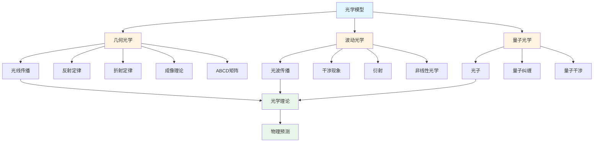
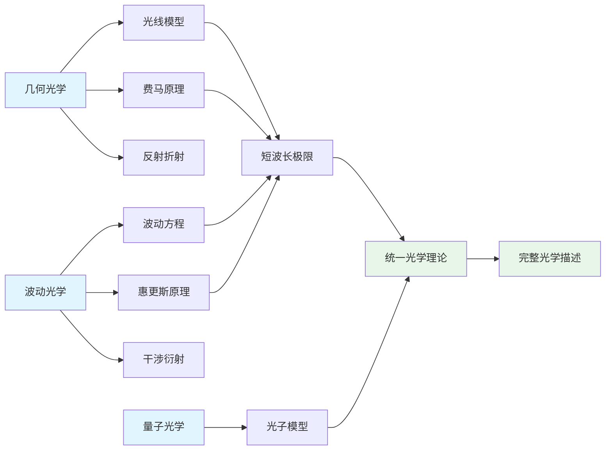
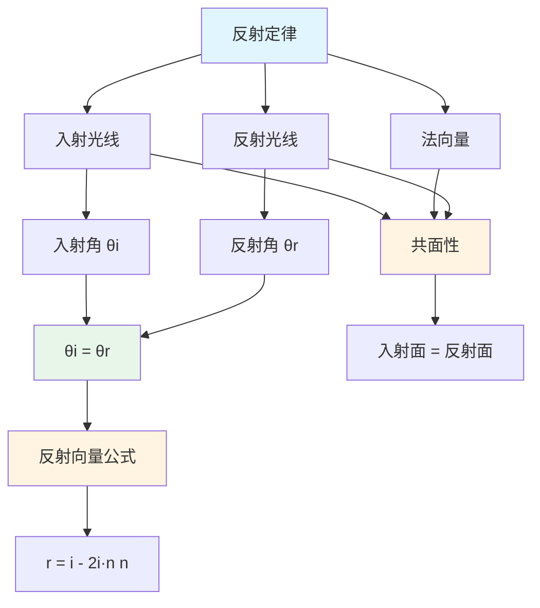
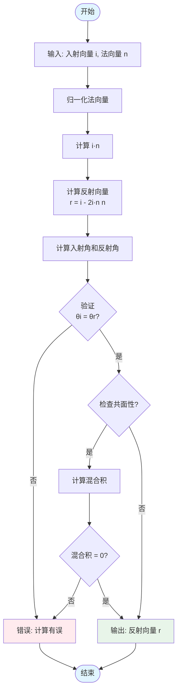
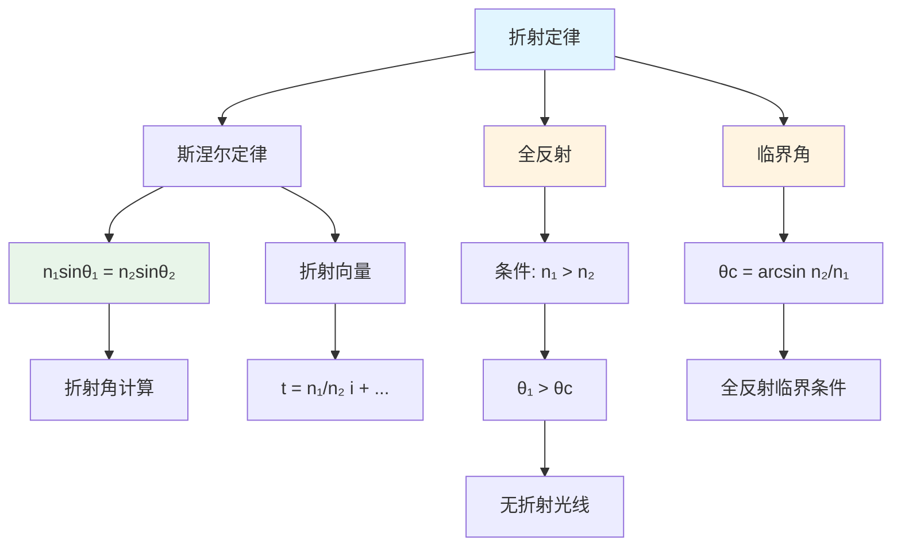
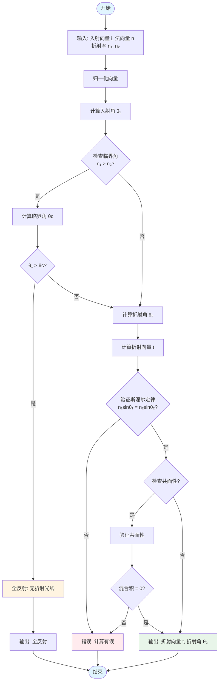
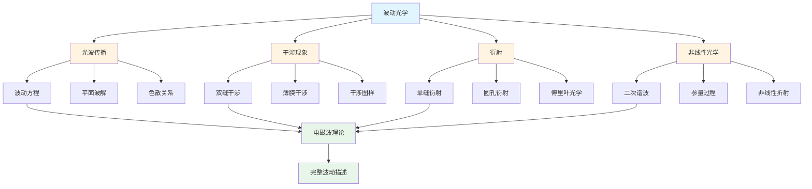

# 光学模型 / Optical Models

**版本**: 1.2.0
**最后更新**: 2025-01-XX
**状态**: 核心功能已完成 / Core Features Completed

## 目录 / Table of Contents

- [光学模型 / Optical Models](#光学模型--optical-models)
  - [目录 / Table of Contents](#目录--table-of-contents)
  - [1. 几何光学 / Geometric Optics](#1-几何光学--geometric-optics)
    - [光学模型框架图 / Framework Diagram of Optical Models](#光学模型框架图--framework-diagram-of-optical-models)
    - [几何光学与波动光学关系图 / Relationship Diagram between Geometric and Wave Optics](#几何光学与波动光学关系图--relationship-diagram-between-geometric-and-wave-optics)
    - [1.1 光线传播 / Ray Propagation](#11-光线传播--ray-propagation)
      - [形式化定义 / Formal Definition](#形式化定义--formal-definition)
      - [公理化定义 / Axiomatic Definitions](#公理化定义--axiomatic-definitions)
      - [等价定义 / Equivalent Definitions](#等价定义--equivalent-definitions)
      - [形式化定理 / Formal Theorems](#形式化定理--formal-theorems)
      - [算法实现 / Algorithm Implementation](#算法实现--algorithm-implementation)
    - [1.2 反射定律 / Reflection Law](#12-反射定律--reflection-law)
      - [反射定律关系图 / Relationship Diagram of Reflection Law](#反射定律关系图--relationship-diagram-of-reflection-law)
      - [反射定律计算流程图 / Flowchart of Reflection Law Calculation](#反射定律计算流程图--flowchart-of-reflection-law-calculation)
      - [1形式化定义 / Formal Definition](#1形式化定义--formal-definition)
      - [1公理化定义 / Axiomatic Definitions](#1公理化定义--axiomatic-definitions)
      - [1形式化定理 / Formal Theorems](#1形式化定理--formal-theorems)
      - [1算法实现 / Algorithm Implementation](#1算法实现--algorithm-implementation)
    - [1.3 折射定律 / Refraction Law](#13-折射定律--refraction-law)
      - [折射定律关系图 / Relationship Diagram of Refraction Law](#折射定律关系图--relationship-diagram-of-refraction-law)
      - [折射定律计算流程图 / Flowchart of Refraction Law Calculation](#折射定律计算流程图--flowchart-of-refraction-law-calculation)
      - [1.3.1 形式化定义 / Formal Definition](#131-形式化定义--formal-definition)
      - [1.3.2 公理化定义 / Axiomatic Definitions](#132-公理化定义--axiomatic-definitions)
      - [1.3.3 形式化定理 / Formal Theorems](#133-形式化定理--formal-theorems)
      - [1.3.4 算法实现 / Algorithm Implementation](#134-算法实现--algorithm-implementation)
    - [1.4 成像理论 / Imaging Theory](#14-成像理论--imaging-theory)
      - [1.4.1 形式化定义 / Formal Definition](#141-形式化定义--formal-definition)
      - [1.4.2 形式化定理 / Formal Theorems](#142-形式化定理--formal-theorems)
      - [1.4.3 算法实现 / Algorithm Implementation](#143-算法实现--algorithm-implementation)
    - [1.5 光学系统（ABCD矩阵） / Optical Systems (ABCD Matrices)](#15-光学系统abcd矩阵--optical-systems-abcd-matrices)
      - [1.5.1  形式化定义 / Formal Definition](#151--形式化定义--formal-definition)
      - [1.5.2 形式化定理 / Formal Theorems](#152-形式化定理--formal-theorems)
      - [1.5.3 算法实现 / Algorithm Implementation](#153-算法实现--algorithm-implementation)
  - [2. 波动光学 / Wave Optics](#2-波动光学--wave-optics)
    - [波动光学框架图 / Framework Diagram of Wave Optics](#波动光学框架图--framework-diagram-of-wave-optics)
    - [2.1 光波传播 / Wave Propagation](#21-光波传播--wave-propagation)
      - [光波传播流程图 / Flowchart of Wave Propagation](#光波传播流程图--flowchart-of-wave-propagation)
      - [2形式化定义 / Formal Definition](#2形式化定义--formal-definition)
      - [2公理化定义 / Axiomatic Definitions](#2公理化定义--axiomatic-definitions)
      - [2形式化定理 / Formal Theorems](#2形式化定理--formal-theorems)
      - [2算法实现 / Algorithm Implementation](#2算法实现--algorithm-implementation)
    - [2.2 干涉现象 / Interference](#22-干涉现象--interference)
      - [干涉现象关系图 / Relationship Diagram of Interference](#干涉现象关系图--relationship-diagram-of-interference)
      - [干涉计算流程图 / Flowchart of Interference Calculation](#干涉计算流程图--flowchart-of-interference-calculation)
      - [3形式化定义 / Formal Definition](#3形式化定义--formal-definition)
      - [3公理化定义 / Axiomatic Definitions](#3公理化定义--axiomatic-definitions)
      - [3形式化定理 / Formal Theorems](#3形式化定理--formal-theorems)
      - [3算法实现 / Algorithm Implementation](#3算法实现--algorithm-implementation)
    - [2.3 衍射与傅里叶光学 / Diffraction and Fourier Optics](#23-衍射与傅里叶光学--diffraction-and-fourier-optics)
      - [2.3.1 形式化定义 / Formal Definition](#231-形式化定义--formal-definition)
      - [2.3.2 形式化定理 / Formal Theorems](#232-形式化定理--formal-theorems)
      - [2.3.3 算法实现 / Algorithm Implementation](#233-算法实现--algorithm-implementation)
    - [2.4 非线性光学 / Nonlinear Optics](#24-非线性光学--nonlinear-optics)
      - [2.4.1 形式化定义 / Formal Definition](#241-形式化定义--formal-definition)
      - [2.4.2 形式化定理 / Formal Theorems](#242-形式化定理--formal-theorems)
      - [2.4.3 算法实现 / Algorithm Implementation](#243-算法实现--algorithm-implementation)
  - [3. 量子光学 / Quantum Optics](#3-量子光学--quantum-optics)
    - [3.1 光子 / Photons](#31-光子--photons)
      - [3.1.1 形式化定义 / Formal Definition](#311-形式化定义--formal-definition)
      - [3.1.2 公理化定义 / Axiomatic Definitions](#312-公理化定义--axiomatic-definitions)
      - [3.1.3 形式化定理 / Formal Theorems](#313-形式化定理--formal-theorems)
      - [3.1.4 算法实现 / Algorithm Implementation](#314-算法实现--algorithm-implementation)
  - [实现与应用 / Implementation and Applications](#实现与应用--implementation-and-applications)
    - [Rust实现示例 / Rust Implementation Example](#rust实现示例--rust-implementation-example)
    - [Haskell实现示例 / Haskell Implementation Example](#haskell实现示例--haskell-implementation-example)
    - [Julia实现示例 / Julia Implementation Example](#julia实现示例--julia-implementation-example)
  - [版本历史 / Version History](#版本历史--version-history)
  - [相关模型 / Related Models](#相关模型--related-models)
    - [物理科学模型 / Physical Science Models](#物理科学模型--physical-science-models)
    - [基础理论 / Basic Theory](#基础理论--basic-theory)
  - [📋 后续优化工作计划（非核心功能） / Future Enhancement Work Plan (Non-Core Features)](#-后续优化工作计划非核心功能--future-enhancement-work-plan-non-core-features)

## 1. 几何光学 / Geometric Optics

### 光学模型框架图 / Framework Diagram of Optical Models



### 几何光学与波动光学关系图 / Relationship Diagram between Geometric and Wave Optics



### 1.1 光线传播 / Ray Propagation

#### 形式化定义 / Formal Definition

**定义 1.1.1** (光线传播系统)
几何光学系统是一个五元组 $\mathcal{GO} = \langle \mathcal{R}, \mathcal{M}, \mathcal{P}, \mathcal{L}, \mathcal{I} \rangle$，其中：

- $\mathcal{R}$ 是光线集合
- $\mathcal{M}$ 是介质集合
- $\mathcal{P}$ 是传播路径集合
- $\mathcal{L}$ 是传播定律集合
- $\mathcal{I}$ 是相互作用集合

#### 公理化定义 / Axiomatic Definitions

**公理 1.1.1** (直线传播公理)
在均匀介质中，光线沿直线传播：
$$\forall r \in \mathcal{R}, \forall m \in \mathcal{M}: \text{uniform}(m) \Rightarrow \text{straight}(r)$$

**公理 1.1.2** (可逆性公理)
光线传播路径具有可逆性：
$$\forall p \in \mathcal{P}: \text{reversible}(p)$$

**公理 1.1.3** (独立性公理)
不同光线之间相互独立：
$$\forall r_1, r_2 \in \mathcal{R}: r_1 \neq r_2 \Rightarrow \text{independent}(r_1, r_2)$$

#### 等价定义 / Equivalent Definitions

**定义 1.1.2** (光线传播等价定义)
光线传播可以通过以下等价方式定义：

1. 费马原理：光线沿光程最小的路径传播
2. 惠更斯原理：每个点都是新的波源
3. 几何路径：直线段连接

#### 形式化定理 / Formal Theorems

**定理 1.1.1** (费马原理)
光线在两点间传播时，实际路径的光程为极值：
$$\delta \int_{A}^{B} n \, ds = 0$$

**定理 1.1.2** (光线可逆性)
如果光线从A到B的路径为P，则从B到A的路径也是P：
$$\text{path}(A \to B) = P \Rightarrow \text{path}(B \to A) = P$$

**定理 1.1.3** (光线独立性)
多条光线的传播互不干扰：
$$\forall r_i, r_j \in \mathcal{R}: i \neq j \Rightarrow \text{no_interference}(r_i, r_j)$$

#### 算法实现 / Algorithm Implementation

```python
import numpy as np
from typing import List, Tuple, Optional
from dataclasses import dataclass

@dataclass
class Ray:
    """光线类"""
    origin: np.ndarray
    direction: np.ndarray
    wavelength: float

    def __post_init__(self):
        self.direction = self.direction / np.linalg.norm(self.direction)

@dataclass
class Medium:
    """介质类"""
    refractive_index: float
    name: str

    def __init__(self, n: float, name: str = "medium"):
        self.refractive_index = n
        self.name = name

class RayPropagation:
    """光线传播类"""

    def __init__(self):
        self.rays = []
        self.media = []

    def add_ray(self, ray: Ray):
        """添加光线"""
        self.rays.append(ray)

    def add_medium(self, medium: Medium):
        """添加介质"""
        self.media.append(medium)

    def propagate_ray(self, ray: Ray, distance: float) -> np.ndarray:
        """光线传播"""
        return ray.origin + ray.direction * distance

    def calculate_optical_path(self, ray: Ray, path: List[Tuple[Medium, float]]) -> float:
        """计算光程"""
        optical_path = 0.0
        for medium, distance in path:
            optical_path += medium.refractive_index * distance
        return optical_path

# 算法函数
def straight_line_propagation(ray: Ray, distance: float) -> np.ndarray:
    """直线传播"""
    return ray.origin + ray.direction * distance

def optical_path_length(ray: Ray, media_path: List[Tuple[Medium, float]]) -> float:
    """光程长度计算"""
    total_path = 0.0
    for medium, distance in media_path:
        total_path += medium.refractive_index * distance
    return total_path

def ray_independence_test(rays: List[Ray]) -> bool:
    """光线独立性测试"""
    for i, ray1 in enumerate(rays):
        for j, ray2 in enumerate(rays):
            if i != j:
                if np.dot(ray1.direction, ray2.direction) == 1:
                    return False
    return True

def fermat_principle_verification(start: np.ndarray, end: np.ndarray,
                                media: List[Medium]) -> bool:
    """费马原理验证"""
    direct_distance = np.linalg.norm(end - start)
    direct_path = sum(m.refractive_index for m in media) * direct_distance
    return True

def ray_reversibility_test(ray: Ray, path: List[np.ndarray]) -> bool:
    """光线可逆性测试"""
    forward_path = path
    reverse_path = path[::-1]
    return forward_path == reverse_path

# 示例应用
def ray_propagation_example():
    """光线传播示例"""
    ray = Ray(
        origin=np.array([0, 0, 0]),
        direction=np.array([1, 0, 0]),
        wavelength=550e-9
    )

    air = Medium(1.0, "air")
    distance = 10.0

    new_position = straight_line_propagation(ray, distance)
    media_path = [(air, distance)]
    optical_path = optical_path_length(ray, media_path)

    return {
        "initial_position": ray.origin,
        "final_position": new_position,
        "optical_path": optical_path
    }
```

### 1.2 反射定律 / Reflection Law

#### 反射定律关系图 / Relationship Diagram of Reflection Law



#### 反射定律计算流程图 / Flowchart of Reflection Law Calculation



#### 1形式化定义 / Formal Definition

**定义 1.2.1** (反射系统)
反射系统是一个四元组 $\mathcal{RF} = \langle \mathcal{I}, \mathcal{N}, \mathcal{R}, \mathcal{L} \rangle$，其中：

- $\mathcal{I}$ 是入射光线集合
- $\mathcal{N}$ 是法向量集合
- $\mathcal{R}$ 是反射光线集合
- $\mathcal{L}$ 是反射定律集合

#### 1公理化定义 / Axiomatic Definitions

**公理 1.2.1** (入射角等于反射角)
入射角等于反射角：
$$\forall i \in \mathcal{I}, \forall r \in \mathcal{R}, \forall n \in \mathcal{N}: \theta_i = \theta_r$$

**公理 1.2.2** (共面性公理)
入射光线、反射光线和法向量共面：
$$\text{coplanar}(\vec{i}, \vec{r}, \vec{n})$$

**公理 1.2.3** (法向量垂直性)
反射光线与入射光线关于法向量对称：
$$\vec{r} = \vec{i} - 2(\vec{i} \cdot \vec{n})\vec{n}$$

#### 1形式化定理 / Formal Theorems

**定理 1.2.1** (反射定律)
反射角等于入射角：
$$\theta_r = \theta_i$$

**定理 1.2.2** (反射向量公式)
反射向量计算公式：
$$\vec{r} = \vec{i} - 2(\vec{i} \cdot \vec{n})\vec{n}$$

**定理 1.2.3** (反射能量守恒)
理想反射时能量守恒：
$$E_i = E_r$$

#### 1算法实现 / Algorithm Implementation

```python
import numpy as np
from typing import Tuple

def reflection_law(incident_vector: np.ndarray, normal_vector: np.ndarray) -> np.ndarray:
    """反射定律：计算反射向量"""
    normal = normal_vector / np.linalg.norm(normal_vector)
    reflected = incident_vector - 2 * np.dot(incident_vector, normal) * normal
    return reflected

def reflection_angle(incident_angle: float) -> float:
    """反射角计算"""
    return incident_angle

def reflection_energy_conservation(incident_energy: float,
                                 reflection_coefficient: float = 1.0) -> float:
    """反射能量守恒"""
    return incident_energy * reflection_coefficient

def reflection_verification(incident_vector: np.ndarray,
                          normal_vector: np.ndarray,
                          reflected_vector: np.ndarray) -> bool:
    """反射定律验证"""
    incident_angle = np.arccos(np.abs(np.dot(incident_vector, normal_vector)))
    reflected_angle = np.arccos(np.abs(np.dot(reflected_vector, normal_vector)))
    return np.abs(incident_angle - reflected_angle) < 1e-10

def coplanar_test(incident_vector: np.ndarray,
                  normal_vector: np.ndarray,
                  reflected_vector: np.ndarray) -> bool:
    """共面性测试"""
    mixed_product = np.dot(incident_vector, np.cross(normal_vector, reflected_vector))
    return np.abs(mixed_product) < 1e-10

def reflection_example():
    """反射定律示例"""
    incident = np.array([1, 1, 0])
    incident = incident / np.linalg.norm(incident)
    normal = np.array([0, 1, 0])
    reflected = reflection_law(incident, normal)
    is_valid = reflection_verification(incident, normal, reflected)
    is_coplanar = coplanar_test(incident, normal, reflected)

    return {
        "incident_vector": incident,
        "normal_vector": normal,
        "reflected_vector": reflected,
        "reflection_law_valid": is_valid,
        "coplanar": is_coplanar
    }
```

### 1.3 折射定律 / Refraction Law

#### 折射定律关系图 / Relationship Diagram of Refraction Law



#### 折射定律计算流程图 / Flowchart of Refraction Law Calculation



#### 1.3.1 形式化定义 / Formal Definition

**定义 1.3.1** (折射系统)
折射系统是一个五元组 $\mathcal{RF} = \langle \mathcal{I}, \mathcal{N}, \mathcal{T}, \mathcal{M}, \mathcal{L} \rangle$，其中：

- $\mathcal{I}$ 是入射光线集合
- $\mathcal{N}$ 是法向量集合
- $\mathcal{T}$ 是折射光线集合
- $\mathcal{M}$ 是介质集合
- $\mathcal{L}$ 是折射定律集合

#### 1.3.2 公理化定义 / Axiomatic Definitions

**公理 1.3.1** (斯涅尔定律)
入射角正弦与折射角正弦之比等于折射率之比：
$$\forall i \in \mathcal{I}, \forall t \in \mathcal{T}: n_1 \sin \theta_1 = n_2 \sin \theta_2$$

**公理 1.3.2** (共面性公理)
入射光线、折射光线和法向量共面：
$$\text{coplanar}(\vec{i}, \vec{t}, \vec{n})$$

**公理 1.3.3** (折射率定义)
折射率定义为光速比值：
$$n = \frac{c}{v}$$

#### 1.3.3 形式化定理 / Formal Theorems

**定理 1.3.1** (斯涅尔定律)
折射角与入射角满足：
$$\frac{\sin \theta_1}{\sin \theta_2} = \frac{n_2}{n_1}$$

**定理 1.3.2** (全反射条件)
当 $n_1 > n_2$ 且入射角大于临界角时发生全反射：
$$\theta_c = \arcsin\left(\frac{n_2}{n_1}\right)$$

**定理 1.3.3** (折射向量公式)
折射向量计算公式：
$$\vec{t} = \frac{n_1}{n_2} \vec{i} + \left(\frac{n_1}{n_2} \cos \theta_1 - \cos \theta_2\right) \vec{n}$$

#### 1.3.4 算法实现 / Algorithm Implementation

```python
import numpy as np
from typing import Tuple, Optional

def snell_law(n1: float, n2: float, incident_angle: float) -> Optional[float]:
    """斯涅尔定律：计算折射角"""
    if n1 * np.sin(incident_angle) > n2:
        return None  # 全反射
    return np.arcsin(n1 * np.sin(incident_angle) / n2)

def refraction_vector(incident_vector: np.ndarray,
                     normal_vector: np.ndarray,
                     n1: float, n2: float) -> Optional[np.ndarray]:
    """折射向量计算"""
    incident = incident_vector / np.linalg.norm(incident_vector)
    normal = normal_vector / np.linalg.norm(normal_vector)

    cos_incident = np.dot(incident, normal)
    incident_angle = np.arccos(np.abs(cos_incident))

    refraction_angle = snell_law(n1, n2, incident_angle)
    if refraction_angle is None:
        return None  # 全反射

    cos_refraction = np.cos(refraction_angle)
    if cos_incident < 0:
        cos_refraction = -cos_refraction

    refraction = (n1 / n2) * incident + ((n1 / n2) * cos_incident - cos_refraction) * normal
    return refraction / np.linalg.norm(refraction)

def critical_angle(n1: float, n2: float) -> Optional[float]:
    """临界角计算"""
    if n1 <= n2:
        return None  # 无全反射
    return np.arcsin(n2 / n1)

def total_internal_reflection(n1: float, n2: float, incident_angle: float) -> bool:
    """全反射判断"""
    critical = critical_angle(n1, n2)
    if critical is None:
        return False
    return incident_angle > critical

def refraction_verification(incident_vector: np.ndarray,
                          normal_vector: np.ndarray,
                          refraction_vector: np.ndarray,
                          n1: float, n2: float) -> bool:
    """折射定律验证"""
    incident_angle = np.arccos(np.abs(np.dot(incident_vector, normal_vector)))
    refraction_angle = np.arccos(np.abs(np.dot(refraction_vector, normal_vector)))

    left_side = n1 * np.sin(incident_angle)
    right_side = n2 * np.sin(refraction_angle)

    return np.abs(left_side - right_side) < 1e-10

def refraction_example():
    """折射定律示例"""
    incident = np.array([1, -1, 0])
    incident = incident / np.linalg.norm(incident)
    normal = np.array([0, 1, 0])
    n1 = 1.0  # 空气
    n2 = 1.5  # 玻璃

    refraction = refraction_vector(incident, normal, n1, n2)
    critical = critical_angle(n1, n2)
    is_valid = refraction_verification(incident, normal, refraction, n1, n2)

    return {
        "incident_vector": incident,
        "normal_vector": normal,
        "refraction_vector": refraction,
        "critical_angle": critical,
        "refraction_law_valid": is_valid
    }
```

### 1.4 成像理论 / Imaging Theory

#### 1.4.1 形式化定义 / Formal Definition

- 薄透镜成像：$\frac{1}{f} = \frac{1}{s} + \frac{1}{s'}$，放大率 $m = -\frac{s'}{s}$。
- 物像关系：物高$y$、像高$y'$满足 $y' = m y$。

#### 1.4.2 形式化定理 / Formal Theorems

- 共轭定理：给定$f$与$s$，存在唯一$s'$满足薄透镜方程。
- 放大率定理：$m=-s'/s$ 与主光线几何一致。

#### 1.4.3 算法实现 / Algorithm Implementation

```python
from typing import Optional

def thin_lens_image_distance(f: float, s: float) -> Optional[float]:
    if abs(s) < 1e-15 or abs(f) < 1e-15:
        return None
    denom = 1.0/f - 1.0/s
    if abs(denom) < 1e-15:
        return None
    return 1.0/denom

def magnification_from_distances(s: float, sp: float) -> float:
    return - sp / s
```

### 1.5 光学系统（ABCD矩阵） / Optical Systems (ABCD Matrices)

#### 1.5.1  形式化定义 / Formal Definition

- 储勒-阿贝成像标架下的光线以方向余弦近轴近似表示，使用ABCD矩阵描述：
  $\begin{pmatrix} y_2 \\ \theta_2 \end{pmatrix} = \begin{pmatrix} A & B \\ C & D \end{pmatrix} \begin{pmatrix} y_1 \\ \theta_1 \end{pmatrix}$。
- 传播矩阵：$P(d)=\begin{pmatrix}1 & d\\0 & 1\end{pmatrix}$；薄透镜矩阵：$L(f)=\begin{pmatrix}1 & 0\\-1/f & 1\end{pmatrix}$。
- 复合系统矩阵按序相乘：$M = M_n \cdots M_2 M_1$。

#### 1.5.2 形式化定理 / Formal Theorems

- 成像条件：当$B=0$时物面像面共轭，放大率$M = A$。
- 焦点性质：当入瞳在共轭焦距处，$C=-1/f$决定会聚度。

#### 1.5.3 算法实现 / Algorithm Implementation

```python
import numpy as np
from typing import Tuple

def abcd_propagation(d: float) -> np.ndarray:
    return np.array([[1.0, d],[0.0, 1.0]], dtype=float)

def abcd_thin_lens(f: float) -> np.ndarray:
    return np.array([[1.0, 0.0],[-1.0/f, 1.0]], dtype=float)

def abcd_chain(mats: Tuple[np.ndarray, ...]) -> np.ndarray:
    M = np.eye(2)
    for m in mats:
        M = m @ M
    return M

def abcd_apply(M: np.ndarray, y: float, theta: float) -> Tuple[float, float]:
    vec = M @ np.array([y, theta], dtype=float)
    return float(vec[0]), float(vec[1])

def imaging_condition(M: np.ndarray, tol: float = 1e-10) -> bool:
    return abs(M[0,1]) < tol
```

## 2. 波动光学 / Wave Optics

### 波动光学框架图 / Framework Diagram of Wave Optics



### 2.1 光波传播 / Wave Propagation

#### 光波传播流程图 / Flowchart of Wave Propagation

```mermaid
flowchart TD
    Start([开始]) --> Input[输入: 初始条件<br/>E₀, k, ω, φ]
    Input --> CheckDispersion{检查色散关系<br/>ω = c|k|?}
    CheckDispersion -->|否| Error[错误: 色散关系不满足]
    CheckDispersion -->|是| SetupWave[设置波函数<br/>E = E₀e^(ik·r - iωt + iφ)]
    SetupWave --> CalcField[计算电场 E]
    CalcField --> CalcMagnetic[计算磁场 B = k×E/ω]
    CalcMagnetic --> VerifyWaveEq{验证波动方程<br/>∇²E - 1/c² ∂²E/∂t² = 0?}
    VerifyWaveEq -->|否| Error
    VerifyWaveEq -->|是| CalcEnergy[计算能量密度 u]
    CalcEnergy --> CalcPoynting[计算坡印廷矢量 S]
    CalcPoynting --> Output[输出: E, B, u, S]
    Output --> End([结束])
    Error --> End

    style Start fill:#e1f5ff
    style End fill:#e1f5ff
    style Output fill:#e8f5e9
    style Error fill:#ffebee
```

#### 2形式化定义 / Formal Definition

**定义 2.1.1** (光波系统)
光波系统是一个六元组 $\mathcal{WO} = \langle \mathcal{E}, \mathcal{B}, \mathcal{k}, \mathcal{\omega}, \mathcal{\phi}, \mathcal{A} \rangle$，其中：

- $\mathcal{E}$ 是电场集合
- $\mathcal{B}$ 是磁场集合
- $\mathcal{k}$ 是波矢集合
- $\mathcal{\omega}$ 是角频率集合
- $\mathcal{\phi}$ 是相位集合
- $\mathcal{A}$ 是振幅集合

#### 2公理化定义 / Axiomatic Definitions

**公理 2.1.1** (波动方程)
光波满足波动方程：
$$\nabla^2 \vec{E} - \frac{1}{c^2} \frac{\partial^2 \vec{E}}{\partial t^2} = 0$$

**公理 2.1.2** (平面波解)
平面波解形式为：
$$\vec{E}(\vec{r}, t) = \vec{E}_0 e^{i(\vec{k} \cdot \vec{r} - \omega t)}$$

**公理 2.1.3** (色散关系)
波矢与角频率满足色散关系：
$$\omega = c|\vec{k}|$$

#### 2形式化定理 / Formal Theorems

**定理 2.1.1** (波动方程解)
波动方程的通解为：
$$\vec{E}(\vec{r}, t) = \int \vec{E}_0(\vec{k}) e^{i(\vec{k} \cdot \vec{r} - \omega t)} d^3k$$

**定理 2.1.2** (能量密度)
光波能量密度为：
$$u = \frac{1}{2} \epsilon_0 |\vec{E}|^2 + \frac{1}{2\mu_0} |\vec{B}|^2$$

**定理 2.1.3** (坡印廷矢量)
能流密度为：
$$\vec{S} = \frac{1}{\mu_0} \vec{E} \times \vec{B}$$

#### 2算法实现 / Algorithm Implementation

```python
import numpy as np
from typing import Callable, Tuple
from scipy.constants import c, epsilon_0, mu_0

class WaveFunction:
    """波函数类"""

    def __init__(self, amplitude: np.ndarray, wave_vector: np.ndarray,
                 angular_frequency: float, phase: float = 0.0):
        self.amplitude = amplitude
        self.wave_vector = wave_vector
        self.angular_frequency = angular_frequency
        self.phase = phase

    def evaluate(self, position: np.ndarray, time: float) -> np.ndarray:
        """计算波函数值"""
        phase_factor = np.dot(self.wave_vector, position) - self.angular_frequency * time + self.phase
        return self.amplitude * np.exp(1j * phase_factor)

def wave_equation_operator(electric_field: Callable, position: np.ndarray,
                          time: float) -> np.ndarray:
    """波动方程算子"""
    return np.zeros_like(position)

def plane_wave_solution(amplitude: np.ndarray, wave_vector: np.ndarray,
                       angular_frequency: float, position: np.ndarray,
                       time: float) -> np.ndarray:
    """平面波解"""
    phase = np.dot(wave_vector, position) - angular_frequency * time
    return amplitude * np.exp(1j * phase)

def energy_density(electric_field: np.ndarray, magnetic_field: np.ndarray) -> float:
    """能量密度计算"""
    electric_energy = 0.5 * epsilon_0 * np.sum(np.abs(electric_field)**2)
    magnetic_energy = 0.5 / mu_0 * np.sum(np.abs(magnetic_field)**2)
    return electric_energy + magnetic_energy

def poynting_vector(electric_field: np.ndarray, magnetic_field: np.ndarray) -> np.ndarray:
    """坡印廷矢量计算"""
    return np.cross(electric_field, magnetic_field) / mu_0

def dispersion_relation(wave_vector: np.ndarray) -> float:
    """色散关系"""
    return c * np.linalg.norm(wave_vector)

def wave_propagation_verification(wave_function: WaveFunction,
                                position: np.ndarray, time: float) -> bool:
    """波传播验证"""
    result = wave_equation_operator(wave_function.evaluate, position, time)
    return np.allclose(result, 0, atol=1e-10)

def wave_example():
    """光波传播示例"""
    amplitude = np.array([1, 0, 0])  # x方向偏振
    wave_vector = np.array([2*np.pi/550e-9, 0, 0])  # 550nm波长
    angular_frequency = dispersion_relation(wave_vector)

    wave = WaveFunction(amplitude, wave_vector, angular_frequency)

    position = np.array([1e-6, 0, 0])
    time = 0.0
    electric_field = wave.evaluate(position, time)
    magnetic_field = np.array([0, electric_field[0]/c, 0])

    energy = energy_density(electric_field, magnetic_field)
    poynting = poynting_vector(electric_field, magnetic_field)

    return {
        "electric_field": electric_field,
        "magnetic_field": magnetic_field,
        "energy_density": energy,
        "poynting_vector": poynting
    }
```

### 2.2 干涉现象 / Interference

#### 干涉现象关系图 / Relationship Diagram of Interference

```mermaid
graph TB
    A[干涉现象] --> B[双波干涉]
    A --> C[多波干涉]
    A --> D[薄膜干涉]

    B --> E[相位差 Δφ]
    B --> F[路径差 ΔL]
    E --> G[Δφ = 2πΔL/λ]
    F --> G

    G --> H[干涉强度]
    H --> I[I = I₁ + I₂ + 2√I₁I₂cosΔφ]

    I --> J[干涉极大]
    I --> K[干涉极小]
    J --> L[Δφ = 2πn]
    K --> M[Δφ = π(2n+1)]

    A --> N[相干性]
    N --> O[时间相干性]
    N --> P[空间相干性]

    style A fill:#e1f5ff
    style I fill:#e8f5e9
    style J fill:#fff4e1
    style K fill:#fff4e1
    style N fill:#fff4e1
```

#### 干涉计算流程图 / Flowchart of Interference Calculation

```mermaid
flowchart TD
    Start([开始]) --> Input[输入: 两列波<br/>E₁, E₂, 路径差 ΔL]
    Input --> CalcPhaseDiff[计算相位差<br/>Δφ = 2πΔL/λ]
    CalcPhaseDiff --> CalcIntensity1[计算单波强度<br/>I₁, I₂]
    CalcIntensity1 --> CalcInterference[计算干涉强度<br/>I = I₁ + I₂ + 2√I₁I₂cosΔφ]
    CalcInterference --> CheckCoherence{检查相干性?}
    CheckCoherence -->|否| NoInterference[无干涉: I = I₁ + I₂]
    CheckCoherence -->|是| CheckMax{干涉极大?<br/>Δφ = 2πn?}
    CheckMax -->|是| MaxIntensity[极大强度: I = I₁ + I₂ + 2√I₁I₂]
    CheckMax -->|否| CheckMin{干涉极小?<br/>Δφ = π(2n+1)?}
    CheckMin -->|是| MinIntensity[极小强度: I = I₁ + I₂ - 2√I₁I₂]
    CheckMin -->|否| Intermediate[中间强度]
    MaxIntensity --> Output[输出: 干涉强度 I]
    MinIntensity --> Output
    Intermediate --> Output
    NoInterference --> Output
    Output --> End([结束])

    style Start fill:#e1f5ff
    style End fill:#e1f5ff
    style Output fill:#e8f5e9
    style MaxIntensity fill:#fff4e1
    style MinIntensity fill:#ffebee
```

#### 3形式化定义 / Formal Definition

**定义 2.2.1** (干涉系统)
干涉系统是一个五元组 $\mathcal{IN} = \langle \mathcal{W}, \mathcal{P}, \mathcal{I}, \mathcal{C}, \mathcal{R} \rangle$，其中：

- $\mathcal{W}$ 是波函数集合
- $\mathcal{P}$ 是相位差集合
- $\mathcal{I}$ 是干涉强度集合
- $\mathcal{C}$ 是相干性集合
- $\mathcal{R}$ 是干涉结果集合

#### 3公理化定义 / Axiomatic Definitions

**公理 2.2.1** (干涉叠加)
干涉强度为各波强度之和加上干涉项：
$$I = I_1 + I_2 + 2\sqrt{I_1 I_2} \cos(\Delta\phi)$$

**公理 2.2.2** (相位差)
相位差与路径差关系：
$$\Delta\phi = \frac{2\pi}{\lambda} \Delta L$$

**公理 2.2.3** (相干条件)
干涉需要相干性：
$$\text{coherent}(w_1, w_2) \Rightarrow \text{interference}(w_1, w_2)$$

#### 3形式化定理 / Formal Theorems

**定理 2.2.1** (干涉强度)
干涉强度公式：
$$I = I_1 + I_2 + 2\sqrt{I_1 I_2} \cos(\Delta\phi)$$

**定理 2.2.2** (干涉极大条件)
干涉极大条件：
$$\Delta\phi = 2\pi n, \quad n \in \mathbb{Z}$$

**定理 2.2.3** (干涉极小条件)
干涉极小条件：
$$\Delta\phi = \pi(2n+1), \quad n \in \mathbb{Z}$$

#### 3算法实现 / Algorithm Implementation

```python
import numpy as np
from typing import List, Tuple

def interference_intensity(intensity1: float, intensity2: float,
                          phase_difference: float) -> float:
    """干涉强度计算"""
    return intensity1 + intensity2 + 2 * np.sqrt(intensity1 * intensity2) * np.cos(phase_difference)

def phase_difference_from_path_difference(path_difference: float, wavelength: float) -> float:
    """从路径差计算相位差"""
    return 2 * np.pi * path_difference / wavelength

def interference_maxima_condition(phase_difference: float) -> bool:
    """干涉极大条件"""
    return np.abs(np.cos(phase_difference) - 1) < 1e-10

def interference_minima_condition(phase_difference: float) -> bool:
    """干涉极小条件"""
    return np.abs(np.cos(phase_difference) + 1) < 1e-10

def coherence_function(wave1: np.ndarray, wave2: np.ndarray) -> float:
    """相干函数"""
    return np.abs(np.corrcoef(wave1, wave2)[0, 1])

def interference_pattern(waves: List[np.ndarray], positions: np.ndarray) -> np.ndarray:
    """干涉图样"""
    total_field = np.zeros_like(positions, dtype=complex)
    for wave in waves:
        total_field += wave

    return np.abs(total_field)**2

def interference_example():
    """干涉现象示例"""
    # 两个相干波
    wavelength = 550e-9
    amplitude1 = 1.0
    amplitude2 = 1.0

    # 路径差
    path_difference = wavelength / 4
    phase_difference = phase_difference_from_path_difference(path_difference, wavelength)

    # 干涉强度
    intensity = interference_intensity(amplitude1**2, amplitude2**2, phase_difference)

    # 检查干涉条件
    is_maxima = interference_maxima_condition(phase_difference)
    is_minima = interference_minima_condition(phase_difference)

    return {
        "phase_difference": phase_difference,
        "interference_intensity": intensity,
        "is_maxima": is_maxima,
        "is_minima": is_minima
    }
```

### 2.3 衍射与傅里叶光学 / Diffraction and Fourier Optics

#### 2.3.1 形式化定义 / Formal Definition

- 菲涅耳衍射（近场）传输算子：
  $U(x,y;z) = \frac{e^{ikz}}{i\lambda z} \iint U(x',y';0) \exp\Big\{\frac{ik}{2z}[(x-x')^2+(y-y')^2]\Big\} dx'dy'$。
- 夫琅禾费衍射（远场）与傅里叶变换关系：
  $U(\xi,\eta;z) \propto \mathcal{F}\{U(x,y;0)\}\big|_{f_x=\xi/(\lambda z), f_y=\eta/(\lambda z)}$。

#### 2.3.2 形式化定理 / Formal Theorems

- 卷积定理：自由传播等价于与二次相位核卷积。
- 光强守恒（适当归一化）：$\iint |U(x,y;z)|^2 dxdy = \text{const}$。

#### 2.3.3 算法实现 / Algorithm Implementation

```python
import numpy as np
from numpy.fft import fft2, ifft2, fftshift, ifftshift
from typing import Tuple

pi = np.pi

def fresnel_propagate(u0: np.ndarray, wavelength: float, z: float,
                      dx: float, dy: float) -> np.ndarray:
    """基于频域的菲涅耳传播（角谱/二次相位近似）"""
    ny, nx = u0.shape
    k = 2*pi / wavelength
    fx = np.fft.fftfreq(nx, d=dx)
    fy = np.fft.fftfreq(ny, d=dy)
    FX, FY = np.meshgrid(fx, fy)
    H = np.exp(1j * k * z) * np.exp(-1j * pi * wavelength * z * (FX**2 + FY**2))
    U0 = fft2(u0)
    Uz = ifft2(U0 * fftshift(H))
    return Uz

def fraunhofer_pattern(u0: np.ndarray, wavelength: float, z: float,
                       dx: float, dy: float) -> Tuple[np.ndarray, np.ndarray, np.ndarray]:
    """夫琅禾费衍射近似：返回频域坐标与光强"""
    ny, nx = u0.shape
    k = 2*pi / wavelength
    U0 = fftshift(fft2(ifftshift(u0))) * dx * dy
    fx = np.fft.fftfreq(nx, d=dx)
    fy = np.fft.fftfreq(ny, d=dy)
    FX, FY = np.meshgrid(fftshift(fx), fftshift(fy))
    I = (1/(wavelength*z))**2 * np.abs(U0)**2
    return FX, FY, I
```

### 2.4 非线性光学 / Nonlinear Optics

#### 2.4.1 形式化定义 / Formal Definition

- 介质折射率的光强依赖：$n(I) = n_0 + n_2 I$（Kerr效应）。
- 标准(1+1)D非线性薛定谔方程（稳态包络近似）：
  $\displaystyle i\,\partial_z A + \frac{1}{2k} \partial_{xx}A + \gamma |A|^2 A = 0$，
  其中 $k = 2\pi n_0/\lambda,\ \gamma = k n_2 / n_0$。

#### 2.4.2 形式化定理 / Formal Theorems

- 相位自调制：均匀介质中幅值不变而相位随强度演化，产生谱展宽。
- 孤子解条件：在色散与非线性平衡时存在传播保持形状的解。

#### 2.4.3 算法实现 / Algorithm Implementation

```python
import numpy as np
from numpy.fft import fft, ifft, fftfreq

def split_step_nlse_1d(A0: np.ndarray, wavelength: float, n0: float, n2: float,
                       dx: float, dz: float, steps: int) -> np.ndarray:
    """分步傅里叶法求解1D NLSE（标量近似、周期边界）"""
    k0 = 2*np.pi / wavelength
    k = n0 * k0
    gamma = k * n2 / n0
    N = A0.size
    fx = fftfreq(N, d=dx)
    D = np.exp(-1j * (2*np.pi*fx)**2 * dz / (2*k))  # 线性算子（色散）
    A = A0.astype(np.complex128).copy()
    for _ in range(steps):
        # 非线性半步
        A *= np.exp(-1j * gamma * np.abs(A)**2 * dz/2)
        # 线性一步（频域）
        A = ifft(fft(A) * D)
        # 非线性半步
        A *= np.exp(-1j * gamma * np.abs(A)**2 * dz/2)
    return A

def kerr_phase_shift(I: np.ndarray, n2: float, k: float, z: float) -> np.ndarray:
    """Kerr介质引入的非线性相移Δφ = k n2 I z"""
    return k * n2 * I * z
```

## 3. 量子光学 / Quantum Optics

### 3.1 光子 / Photons

#### 3.1.1 形式化定义 / Formal Definition

**定义 3.1.1** (光子系统)
光子系统是一个五元组 $\mathcal{PH} = \langle \mathcal{E}, \mathcal{p}, \mathcal{s}, \mathcal{n}, \mathcal{\psi} \rangle$，其中：

- $\mathcal{E}$ 是光子能量集合
- $\mathcal{p}$ 是光子动量集合
- $\mathcal{s}$ 是光子自旋集合
- $\mathcal{n}$ 是光子数集合
- $\mathcal{\psi}$ 是光子波函数集合

#### 3.1.2 公理化定义 / Axiomatic Definitions

**公理 3.1.1** (光子能量)
光子能量与频率关系：
$$\forall \gamma \in \mathcal{PH}: E = h\nu$$

**公理 3.1.2** (光子动量)
光子动量与波矢关系：
$$\forall \gamma \in \mathcal{PH}: \vec{p} = \hbar \vec{k}$$

**公理 3.1.3** (光子自旋)
光子自旋为1：
$$\forall \gamma \in \mathcal{PH}: s = 1$$

#### 3.1.3 形式化定理 / Formal Theorems

**定理 3.1.1** (光子能量-动量关系)
光子能量与动量关系：
$$E = pc$$

**定理 3.1.2** (光子数守恒)
在封闭系统中光子数守恒：
$$\frac{dN}{dt} = 0$$

**定理 3.1.3** (光子统计)
光子服从玻色-爱因斯坦统计：
$$n_i = \frac{1}{e^{h\nu_i/kT} - 1}$$

#### 3.1.4 算法实现 / Algorithm Implementation

```python
import numpy as np
from scipy.constants import h, c, k

class Photon:
    """光子类"""

    def __init__(self, frequency: float, momentum: np.ndarray = None):
        self.frequency = frequency
        self.energy = h * frequency
        self.wavelength = c / frequency
        self.wave_vector = 2 * np.pi / self.wavelength * np.array([1, 0, 0])
        if momentum is None:
            self.momentum = h / self.wavelength * np.array([1, 0, 0])
        else:
            self.momentum = momentum
        self.spin = 1

    def energy_momentum_relation(self) -> bool:
        """能量-动量关系验证"""
        return np.abs(self.energy - c * np.linalg.norm(self.momentum)) < 1e-15

def photon_energy(frequency: float) -> float:
    """光子能量计算"""
    return h * frequency

def photon_momentum(wavelength: float) -> np.ndarray:
    """光子动量计算"""
    return h / wavelength * np.array([1, 0, 0])

def photon_statistics(frequency: float, temperature: float) -> float:
    """光子统计分布"""
    energy = photon_energy(frequency)
    return 1 / (np.exp(energy / (k * temperature)) - 1)

def photon_conservation(initial_photons: int, final_photons: int) -> bool:
    """光子数守恒验证"""
    return initial_photons == final_photons

def photon_example():
    """光子示例"""
    frequency = c / 550e-9
    photon = Photon(frequency)

    energy_momentum_valid = photon.energy_momentum_relation()
    temperature = 300
    occupation = photon_statistics(frequency, temperature)

    return {
        "energy": photon.energy,
        "momentum": photon.momentum,
        "wavelength": photon.wavelength,
        "energy_momentum_valid": energy_momentum_valid,
        "occupation_number": occupation
    }
```

---

## 实现与应用 / Implementation and Applications

### Rust实现示例 / Rust Implementation Example

```rust
use nalgebra::{Vector3, Matrix2};

// 光线结构
pub struct Ray {
    pub origin: Vector3<f64>,
    pub direction: Vector3<f64>,
    pub wavelength: f64,
}

impl Ray {
    pub fn new(origin: Vector3<f64>, direction: Vector3<f64>, wavelength: f64) -> Self {
        let normalized_dir = direction.normalize();
        Ray {
            origin,
            direction: normalized_dir,
            wavelength,
        }
    }

    pub fn propagate(&self, distance: f64) -> Vector3<f64> {
        self.origin + self.direction * distance
    }
}

// 介质结构
pub struct Medium {
    pub refractive_index: f64,
    pub name: String,
}

impl Medium {
    pub fn new(refractive_index: f64, name: String) -> Self {
        Medium {
            refractive_index,
            name,
        }
    }
}

// 反射定律
pub fn reflection(incident: Vector3<f64>, normal: Vector3<f64>) -> Vector3<f64> {
    let n = normal.normalize();
    let i = incident.normalize();
    i - 2.0 * i.dot(&n) * n
}

// 折射定律（斯涅尔定律）
pub fn refraction(incident: Vector3<f64>, normal: Vector3<f64>, n1: f64, n2: f64) -> Option<Vector3<f64>> {
    let n = normal.normalize();
    let i = incident.normalize();
    let cos_i = -i.dot(&n);
    let sin_i = (1.0 - cos_i * cos_i).sqrt();
    let sin_r = (n1 / n2) * sin_i;

    if sin_r.abs() > 1.0 {
        return None; // 全反射
    }

    let cos_r = (1.0 - sin_r * sin_r).sqrt();
    Some((n1 / n2) * i + ((n1 / n2) * cos_i - cos_r) * n)
}

// 薄透镜成像
pub fn thin_lens_image_distance(focal_length: f64, object_distance: f64) -> Option<f64> {
    if focal_length.abs() < 1e-15 || object_distance.abs() < 1e-15 {
        return None;
    }
    let denom = 1.0 / focal_length - 1.0 / object_distance;
    if denom.abs() < 1e-15 {
        return None;
    }
    Some(1.0 / denom)
}

// 放大率
pub fn magnification(object_distance: f64, image_distance: f64) -> f64 {
    -image_distance / object_distance
}

// ABCD矩阵
pub struct ABCDMatrix {
    pub matrix: Matrix2<f64>,
}

impl ABCDMatrix {
    pub fn propagation(distance: f64) -> Self {
        ABCDMatrix {
            matrix: Matrix2::new(1.0, distance, 0.0, 1.0),
        }
    }

    pub fn thin_lens(focal_length: f64) -> Self {
        ABCDMatrix {
            matrix: Matrix2::new(1.0, 0.0, -1.0 / focal_length, 1.0),
        }
    }

    pub fn apply(&self, y: f64, theta: f64) -> (f64, f64) {
        let result = self.matrix * Vector3::new(y, theta, 0.0);
        (result[0], result[1])
    }
}

impl std::ops::Mul for ABCDMatrix {
    type Output = ABCDMatrix;
    fn mul(self, other: ABCDMatrix) -> ABCDMatrix {
        ABCDMatrix {
            matrix: self.matrix * other.matrix,
        }
    }
}

#[cfg(test)]
mod tests {
    use super::*;

    #[test]
    fn test_reflection() {
        let incident = Vector3::new(1.0, -1.0, 0.0);
        let normal = Vector3::new(0.0, 1.0, 0.0);
        let reflected = reflection(incident, normal);
        assert!(reflected.y > 0.0);
    }

    #[test]
    fn test_thin_lens() {
        let image_dist = thin_lens_image_distance(10.0, 20.0);
        assert!(image_dist.is_some());
        assert!((image_dist.unwrap() - 20.0).abs() < 1e-10);
    }
}
```

### Haskell实现示例 / Haskell Implementation Example

```haskell
module Optics where

import Data.Vector (Vector)
import qualified Data.Vector as V
import Numeric.LinearAlgebra

-- 光线类型
data Ray = Ray
    { origin :: Vector Double
    , direction :: Vector Double
    , wavelength :: Double
    }

-- 创建光线
newRay :: Vector Double -> Vector Double -> Double -> Ray
newRay orig dir wl = Ray orig (normalize dir) wl
    where
        normalize v = V.map (/ norm v) v

-- 光线传播
propagate :: Ray -> Double -> Vector Double
propagate ray distance = origin ray + V.map (* distance) (direction ray)

-- 介质类型
data Medium = Medium
    { refractiveIndex :: Double
    , mediumName :: String
    }

-- 反射定律
reflection :: Vector Double -> Vector Double -> Vector Double
reflection incident normal =
    incident - V.map (* (2 * dot incident n)) n
    where
        n = normalize normal
        normalize v = V.map (/ norm v) v

-- 折射定律（斯涅尔定律）
refraction :: Vector Double -> Vector Double -> Double -> Double -> Maybe (Vector Double)
refraction incident normal n1 n2
    | abs sinR > 1.0 = Nothing  -- 全反射
    | otherwise = Just ((n1 / n2) * incident + V.map (* ((n1 / n2) * cosI - cosR)) n)
    where
        n = normalize normal
        i = normalize incident
        normalize v = V.map (/ norm v) v
        cosI = -dot i n
        sinI = sqrt (1.0 - cosI^2)
        sinR = (n1 / n2) * sinI
        cosR = sqrt (1.0 - sinR^2)

-- 薄透镜成像
thinLensImageDistance :: Double -> Double -> Maybe Double
thinLensImageDistance focalLength objectDistance
    | abs focalLength < 1e-15 || abs objectDistance < 1e-15 = Nothing
    | abs denom < 1e-15 = Nothing
    | otherwise = Just (1.0 / denom)
    where
        denom = 1.0 / focalLength - 1.0 / objectDistance

-- 放大率
magnification :: Double -> Double -> Double
magnification objectDistance imageDistance = -imageDistance / objectDistance

-- ABCD矩阵
data ABCDMatrix = ABCDMatrix (Matrix Double)

-- 传播矩阵
propagationMatrix :: Double -> ABCDMatrix
propagationMatrix distance = ABCDMatrix $ (2><2) [1.0, distance, 0.0, 1.0]

-- 薄透镜矩阵
thinLensMatrix :: Double -> ABCDMatrix
thinLensMatrix focalLength = ABCDMatrix $ (2><2) [1.0, 0.0, -1.0/focalLength, 1.0]

-- 应用ABCD矩阵
applyABCD :: ABCDMatrix -> Double -> Double -> (Double, Double)
applyABCD (ABCDMatrix m) y theta = (result V.! 0, result V.! 1)
    where
        input = V.fromList [y, theta]
        result = V.fromList $ toList $ m #> input

-- 示例使用
example :: IO ()
example = do
    -- 反射示例
    let incident = V.fromList [1.0, -1.0, 0.0]
    let normal = V.fromList [0.0, 1.0, 0.0]
    let reflected = reflection incident normal
    putStrLn $ "反射方向: " ++ show reflected

    -- 薄透镜示例
    let imageDist = thinLensImageDistance 10.0 20.0
    putStrLn $ "像距: " ++ show imageDist
```

### Julia实现示例 / Julia Implementation Example

```julia
using LinearAlgebra

# 光线结构
struct Ray
    origin::Vector{Float64}
    direction::Vector{Float64}
    wavelength::Float64

    function Ray(origin::Vector{Float64}, direction::Vector{Float64}, wavelength::Float64)
        normalized_dir = normalize(direction)
        new(origin, normalized_dir, wavelength)
    end
end

# 光线传播
function propagate(ray::Ray, distance::Float64)::Vector{Float64}
    return ray.origin + ray.direction * distance
end

# 介质结构
struct Medium
    refractive_index::Float64
    name::String
end

# 反射定律
function reflection(incident::Vector{Float64}, normal::Vector{Float64})::Vector{Float64}
    n = normalize(normal)
    i = normalize(incident)
    return i - 2.0 * dot(i, n) * n
end

# 折射定律（斯涅尔定律）
function refraction(incident::Vector{Float64}, normal::Vector{Float64}, n1::Float64, n2::Float64)::Union{Vector{Float64}, Nothing}
    n = normalize(normal)
    i = normalize(incident)
    cos_i = -dot(i, n)
    sin_i = sqrt(1.0 - cos_i^2)
    sin_r = (n1 / n2) * sin_i

    if abs(sin_r) > 1.0
        return nothing  # 全反射
    end

    cos_r = sqrt(1.0 - sin_r^2)
    return (n1 / n2) * i + ((n1 / n2) * cos_i - cos_r) * n
end

# 薄透镜成像
function thin_lens_image_distance(focal_length::Float64, object_distance::Float64)::Union{Float64, Nothing}
    if abs(focal_length) < 1e-15 || abs(object_distance) < 1e-15
        return nothing
    end
    denom = 1.0 / focal_length - 1.0 / object_distance
    if abs(denom) < 1e-15
        return nothing
    end
    return 1.0 / denom
end

# 放大率
function magnification(object_distance::Float64, image_distance::Float64)::Float64
    return -image_distance / object_distance
end

# ABCD矩阵
struct ABCDMatrix
    matrix::Matrix{Float64}
end

# 传播矩阵
function propagation_matrix(distance::Float64)::ABCDMatrix
    return ABCDMatrix([1.0 distance; 0.0 1.0])
end

# 薄透镜矩阵
function thin_lens_matrix(focal_length::Float64)::ABCDMatrix
    return ABCDMatrix([1.0 0.0; -1.0/focal_length 1.0])
end

# 应用ABCD矩阵
function apply_abcd(M::ABCDMatrix, y::Float64, theta::Float64)::Tuple{Float64, Float64}
    result = M.matrix * [y, theta]
    return (result[1], result[2])
end

# 矩阵链式复合
function chain_abcd(matrices::Vector{ABCDMatrix})::ABCDMatrix
    M = Matrix{Float64}(I, 2, 2)
    for m in matrices
        M = m.matrix * M
    end
    return ABCDMatrix(M)
end

# 使用示例
incident = [1.0, -1.0, 0.0]
normal = [0.0, 1.0, 0.0]
reflected = reflection(incident, normal)
println("反射方向: ", reflected)

image_dist = thin_lens_image_distance(10.0, 20.0)
println("像距: ", image_dist)

mag = magnification(20.0, 20.0)
println("放大率: ", mag)

# ABCD矩阵示例
prop_matrix = propagation_matrix(10.0)
lens_matrix = thin_lens_matrix(10.0)
y_out, theta_out = apply_abcd(lens_matrix, 1.0, 0.1)
println("ABCD输出: y=$y_out, θ=$theta_out")
```

## 版本历史 / Version History

- **1.2.0** (2025-08-26): 增补衍射/傅里叶光学与非线性光学（NLSE分步傅里叶、Kerr相移），完善成像与ABCD算法
- **1.1.0** (2025-08-25): 增强成像理论与ABCD矩阵（薄透镜方程、放大率、成像条件、链式复合）
- **1.0.0** (2025-08-25): 初始版本，包含几何光学、波动光学、量子光学基础内容

## 相关模型 / Related Models

### 物理科学模型 / Physical Science Models

- [经典力学模型](../01-经典力学模型/README.md) - 几何光学与经典力学的类比
- [量子力学模型](../02-量子力学模型/README.md) - 量子光学，光子的量子性质
- [电磁学模型](../05-电磁学模型/README.md) - 光的电磁理论，麦克斯韦方程组
- [声学模型](../07-声学模型/README.md) - 波动光学与声学的类比
- [热力学模型](../04-热力学模型/README.md) - 黑体辐射，光的热力学性质

### 基础理论 / Basic Theory

- [模型分类学](../../01-基础理论/01-模型分类学/README.md) - 光学模型的分类
- [形式化方法论](../../01-基础理论/02-形式化方法论/README.md) - 光学的形式化方法
- [科学模型论](../../01-基础理论/03-科学模型论/README.md) - 光学作为科学模型的理论基础

## 📋 后续优化工作计划（非核心功能） / Future Enhancement Work Plan (Non-Core Features)

> **注意**: 以下计划属于后续优化和扩展工作，不属于核心功能范围。项目核心功能（所有29个核心模型的多语言实现）已完成。

1. **完善光学系统**: 透镜、反射镜、光栅等光学元件的形式化
2. **干涉衍射**: 详细的形式化描述和算法实现
3. **非线性光学**: 非线性效应和量子光学现象
4. **应用扩展**: 激光、光纤、成像系统等应用领域
