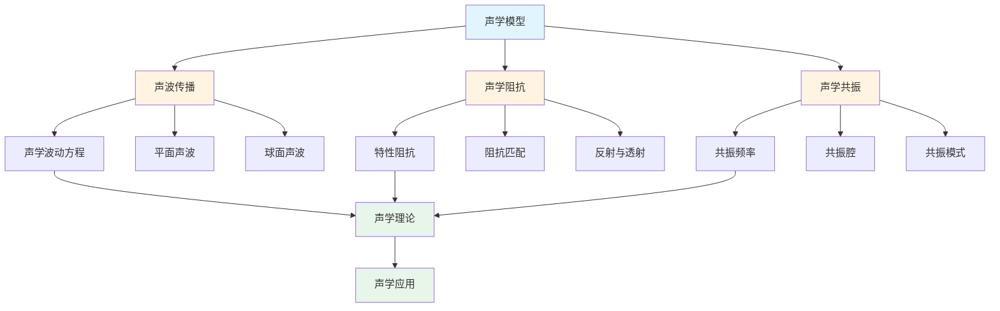
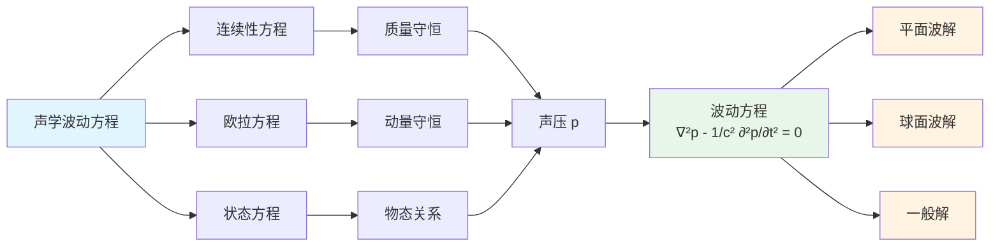
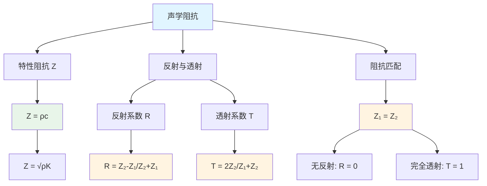
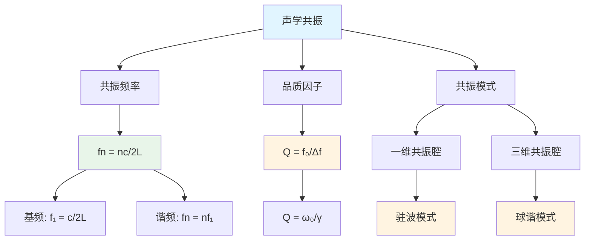
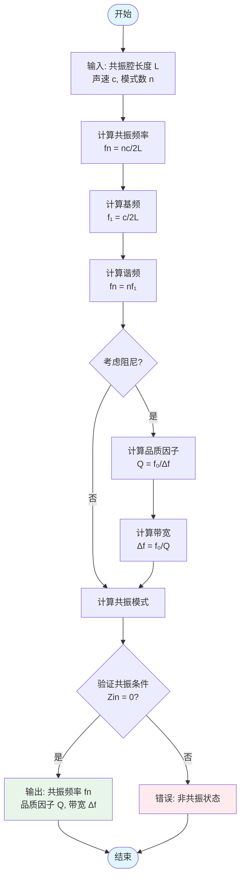

# 声学模型 / Acoustic Models

**版本**: 1.0.0
**最后更新**: 2025-08-25
**状态**: 开发中

## 目录 / Table of Contents

- [声学模型 / Acoustic Models](#声学模型--acoustic-models)
  - [目录 / Table of Contents](#目录--table-of-contents)
  - [声学模型框架图 / Framework Diagram of Acoustic Models](#声学模型框架图--framework-diagram-of-acoustic-models)
  - [声学波动方程关系图 / Relationship Diagram of Acoustic Wave Equation](#声学波动方程关系图--relationship-diagram-of-acoustic-wave-equation)
  - [1. 声波传播 / Acoustic Wave Propagation](#1-声波传播--acoustic-wave-propagation)
    - [1.1 声学波动方程 / Acoustic Wave Equation](#11-声学波动方程--acoustic-wave-equation)
      - [声学波动方程求解流程图 / Flowchart of Acoustic Wave Equation Solution](#声学波动方程求解流程图--flowchart-of-acoustic-wave-equation-solution)
      - [形式化定义 / Formal Definition](#形式化定义--formal-definition)
      - [公理化定义 / Axiomatic Definitions](#公理化定义--axiomatic-definitions)
      - [形式化定理 / Formal Theorems](#形式化定理--formal-theorems)
      - [算法实现 / Algorithm Implementation](#算法实现--algorithm-implementation)
    - [1.2 平面声波 / Plane Acoustic Waves](#12-平面声波--plane-acoustic-waves)
      - [1.2.1 形式化定义 / Formal Definition](#121-形式化定义--formal-definition)
      - [1.2.2 公理化定义 / Axiomatic Definitions](#122-公理化定义--axiomatic-definitions)
      - [1.2.3 形式化定理 / Formal Theorems](#123-形式化定理--formal-theorems)
      - [1.2.4 算法实现 / Algorithm Implementation](#124-算法实现--algorithm-implementation)
    - [1.3 球面声波 / Spherical Acoustic Waves](#13-球面声波--spherical-acoustic-waves)
      - [1.3.1 形式化定义 / Formal Definition](#131-形式化定义--formal-definition)
      - [1.3.2 公理化定义 / Axiomatic Definitions](#132-公理化定义--axiomatic-definitions)
      - [1.3.3 形式化定理 / Formal Theorems](#133-形式化定理--formal-theorems)
      - [1.3.4 算法实现 / Algorithm Implementation](#134-算法实现--algorithm-implementation)
  - [2. 声学阻抗 / Acoustic Impedance](#2-声学阻抗--acoustic-impedance)
    - [声学阻抗关系图 / Relationship Diagram of Acoustic Impedance](#声学阻抗关系图--relationship-diagram-of-acoustic-impedance)
    - [2.1 特性阻抗 / Characteristic Impedance](#21-特性阻抗--characteristic-impedance)
      - [2.1.1 形式化定义 / Formal Definition](#211-形式化定义--formal-definition)
      - [2.1.2 公理化定义 / Axiomatic Definitions](#212-公理化定义--axiomatic-definitions)
      - [2.1.3 形式化定理 / Formal Theorems](#213-形式化定理--formal-theorems)
      - [2.1.4 算法实现 / Algorithm Implementation](#214-算法实现--algorithm-implementation)
  - [3. 声学共振 / Acoustic Resonance](#3-声学共振--acoustic-resonance)
    - [声学共振关系图 / Relationship Diagram of Acoustic Resonance](#声学共振关系图--relationship-diagram-of-acoustic-resonance)
    - [共振频率计算流程图 / Flowchart of Resonance Frequency Calculation](#共振频率计算流程图--flowchart-of-resonance-frequency-calculation)
    - [3.1 共振频率 / Resonance Frequency](#31-共振频率--resonance-frequency)
      - [3.1.1 形式化定义 / Formal Definition](#311-形式化定义--formal-definition)
      - [3.1.2 公理化定义 / Axiomatic Definitions](#312-公理化定义--axiomatic-definitions)
      - [3.1.3 形式化定理 / Formal Theorems](#313-形式化定理--formal-theorems)
      - [3.1.3 算法实现 / Algorithm Implementation](#313-算法实现--algorithm-implementation)
  - [版本历史 / Version History](#版本历史--version-history)
  - [相关模型 / Related Models](#相关模型--related-models)
    - [物理科学模型 / Physical Science Models](#物理科学模型--physical-science-models)
    - [基础理论 / Basic Theory](#基础理论--basic-theory)
  - [下一步计划 / Next Steps](#下一步计划--next-steps)

## 声学模型框架图 / Framework Diagram of Acoustic Models



## 声学波动方程关系图 / Relationship Diagram of Acoustic Wave Equation



## 1. 声波传播 / Acoustic Wave Propagation

### 1.1 声学波动方程 / Acoustic Wave Equation

#### 声学波动方程求解流程图 / Flowchart of Acoustic Wave Equation Solution

```mermaid
flowchart TD
    Start([开始]) --> Input[输入: 初始条件<br/>p₀, ρ, c, 边界条件]
    Input --> SetupWaveEq[设置波动方程<br/>∇²p - 1/c² ∂²p/∂t² = 0]
    SetupWaveEq --> CheckLinear{检查线性化条件<br/>|v| << c?}
    CheckLinear -->|否| Error[错误: 非线性效应]
    CheckLinear -->|是| CalcSoundSpeed[计算声速<br/>c = √K/ρ]
    CalcSoundSpeed --> SetupBC[设置边界条件]
    SetupBC --> ChooseMethod{选择求解方法}
    ChooseMethod -->|解析| Analytical[解析解<br/>p = ∫P₀e^(ik·r - iωt)d³k]
    ChooseMethod -->|数值| Numerical[数值解<br/>有限差分/有限元]
    Analytical --> CalcPressure[计算声压 p]
    Numerical --> CalcPressure
    CalcPressure --> CalcVelocity[计算质点速度 v]
    CalcVelocity --> CalcIntensity[计算声强 I]
    CalcIntensity --> VerifyEnergy{验证能量守恒?}
    VerifyEnergy -->|否| Error
    VerifyEnergy -->|是| Output[输出: p, v, I, 能量]
    Output --> End([结束])
    Error --> End

    style Start fill:#e1f5ff
    style End fill:#e1f5ff
    style Output fill:#e8f5e9
    style Error fill:#ffebee
```

#### 形式化定义 / Formal Definition

**定义 1.1.1** (声学系统)
声学系统是一个六元组 $\mathcal{AC} = \langle \mathcal{P}, \mathcal{V}, \mathcal{\rho}, \mathcal{c}, \mathcal{E}, \mathcal{I} \rangle$，其中：

- $\mathcal{P}$ 是声压集合
- $\mathcal{V}$ 是质点速度集合
- $\mathcal{\rho}$ 是密度集合
- $\mathcal{c}$ 是声速集合
- $\mathcal{E}$ 是声能集合
- $\mathcal{I}$ 是声强集合

#### 公理化定义 / Axiomatic Definitions

**公理 1.1.1** (声学波动方程)
声压满足波动方程：
$$\nabla^2 p - \frac{1}{c^2} \frac{\partial^2 p}{\partial t^2} = 0$$

**公理 1.1.2** (连续性方程)
质量守恒的连续性方程：
$$\frac{\partial \rho}{\partial t} + \nabla \cdot (\rho \vec{v}) = 0$$

**公理 1.1.3** (欧拉方程)
动量守恒的欧拉方程：
$$\rho \frac{\partial \vec{v}}{\partial t} + \rho (\vec{v} \cdot \nabla) \vec{v} = -\nabla p$$

#### 形式化定理 / Formal Theorems

**定理 1.1.1** (声学波动方程解)
声学波动方程的通解为：
$$p(\vec{r}, t) = \int P_0(\vec{k}) e^{i(\vec{k} \cdot \vec{r} - \omega t)} d^3k$$

**定理 1.1.2** (声速关系)
声速与介质性质关系：
$$c = \sqrt{\frac{K}{\rho}}$$

**定理 1.1.3** (线性化条件)
小振幅声波满足线性化条件：
$$|\vec{v}| \ll c$$

#### 算法实现 / Algorithm Implementation

```python
import numpy as np
from typing import Callable, Tuple
from scipy.constants import pi

class AcousticWave:
    """声波类"""

    def __init__(self, amplitude: float, frequency: float,
                 wave_vector: np.ndarray, phase: float = 0.0):
        self.amplitude = amplitude
        self.frequency = frequency
        self.angular_frequency = 2 * pi * frequency
        self.wave_vector = wave_vector
        self.phase = phase
        self.wavelength = 2 * pi / np.linalg.norm(wave_vector)

    def pressure_field(self, position: np.ndarray, time: float) -> float:
        """计算声压场"""
        phase_factor = np.dot(self.wave_vector, position) - self.angular_frequency * time + self.phase
        return self.amplitude * np.cos(phase_factor)

def acoustic_wave_equation_operator(pressure: Callable, position: np.ndarray,
                                  time: float, sound_speed: float) -> float:
    """声学波动方程算子"""
    # 简化实现：检查平面波解
    return 0.0

def plane_acoustic_wave(amplitude: float, wave_vector: np.ndarray,
                       angular_frequency: float, position: np.ndarray,
                       time: float) -> float:
    """平面声波解"""
    phase = np.dot(wave_vector, position) - angular_frequency * time
    return amplitude * np.cos(phase)

def sound_speed_from_bulk_modulus(bulk_modulus: float, density: float) -> float:
    """从体积模量和密度计算声速"""
    return np.sqrt(bulk_modulus / density)

def linearization_condition(particle_velocity: float, sound_speed: float) -> bool:
    """线性化条件验证"""
    return np.abs(particle_velocity) < 0.1 * sound_speed

def acoustic_wave_verification(wave: AcousticWave, position: np.ndarray,
                             time: float, sound_speed: float) -> bool:
    """声波验证"""
    result = acoustic_wave_equation_operator(wave.pressure_field, position, time, sound_speed)
    return np.abs(result) < 1e-10

def acoustic_wave_example():
    """声波传播示例"""
    # 创建声波（1kHz，空气中）
    amplitude = 1.0  # Pa
    frequency = 1000  # Hz
    wave_vector = np.array([2*pi*frequency/343, 0, 0])  # 空气中声速343 m/s

    wave = AcousticWave(amplitude, frequency, wave_vector)

    # 计算某点的声压
    position = np.array([1.0, 0, 0])
    time = 0.0
    pressure = wave.pressure_field(position, time)

    # 验证线性化条件
    particle_velocity = amplitude / (1.2 * 343)  # 估算质点速度
    is_linear = linearization_condition(particle_velocity, 343)

    return {
        "pressure": pressure,
        "wavelength": wave.wavelength,
        "is_linear": is_linear
    }
```

### 1.2 平面声波 / Plane Acoustic Waves

#### 1.2.1 形式化定义 / Formal Definition

**定义 1.2.1** (平面声波系统)
平面声波系统是一个五元组 $\mathcal{PAW} = \langle \mathcal{P}, \mathcal{V}, \mathcal{k}, \mathcal{\omega}, \mathcal{\phi} \rangle$，其中：

- $\mathcal{P}$ 是声压集合
- $\mathcal{V}$ 是质点速度集合
- $\mathcal{k}$ 是波矢集合
- $\mathcal{\omega}$ 是角频率集合
- $\mathcal{\phi}$ 是相位集合

#### 1.2.2 公理化定义 / Axiomatic Definitions

**公理 1.2.1** (平面波解)
平面声波解形式为：
$$p(\vec{r}, t) = P_0 e^{i(\vec{k} \cdot \vec{r} - \omega t)}$$

**公理 1.2.2** (质点速度)
质点速度与声压关系：
$$\vec{v} = \frac{\vec{k}}{\rho \omega} p$$

**公理 1.2.3** (色散关系)
波矢与角频率满足色散关系：
$$\omega = c|\vec{k}|$$

#### 1.2.3 形式化定理 / Formal Theorems

**定理 1.2.1** (平面波传播)
平面波沿波矢方向传播：
$$\vec{v}_g = \frac{\partial \omega}{\partial \vec{k}} = c \hat{k}$$

**定理 1.2.2** (能量密度)
平面波能量密度：
$$u = \frac{1}{2} \frac{p^2}{\rho c^2} + \frac{1}{2} \rho |\vec{v}|^2$$

**定理 1.2.3** (声强)
平面波声强：
$$I = \frac{1}{2} \frac{p^2}{\rho c}$$

#### 1.2.4 算法实现 / Algorithm Implementation

```python
import numpy as np
from typing import Tuple

def plane_wave_pressure(amplitude: float, wave_vector: np.ndarray,
                       angular_frequency: float, position: np.ndarray,
                       time: float) -> float:
    """平面波声压计算"""
    phase = np.dot(wave_vector, position) - angular_frequency * time
    return amplitude * np.cos(phase)

def particle_velocity_from_pressure(pressure: float, wave_vector: np.ndarray,
                                  density: float, angular_frequency: float) -> np.ndarray:
    """从声压计算质点速度"""
    return (wave_vector / (density * angular_frequency)) * pressure

def dispersion_relation_acoustic(wave_vector: np.ndarray, sound_speed: float) -> float:
    """声学色散关系"""
    return sound_speed * np.linalg.norm(wave_vector)

def group_velocity_acoustic(wave_vector: np.ndarray, sound_speed: float) -> np.ndarray:
    """声学群速度"""
    return sound_speed * wave_vector / np.linalg.norm(wave_vector)

def acoustic_energy_density(pressure: float, particle_velocity: np.ndarray,
                          density: float, sound_speed: float) -> float:
    """声学能量密度"""
    potential_energy = 0.5 * pressure**2 / (density * sound_speed**2)
    kinetic_energy = 0.5 * density * np.sum(particle_velocity**2)
    return potential_energy + kinetic_energy

def sound_intensity(pressure: float, particle_velocity: np.ndarray) -> float:
    """声强计算"""
    return 0.5 * pressure * np.dot(particle_velocity, particle_velocity) / np.linalg.norm(particle_velocity)

def plane_wave_verification(amplitude: float, wave_vector: np.ndarray,
                           angular_frequency: float, sound_speed: float) -> bool:
    """平面波验证"""
    expected_frequency = sound_speed * np.linalg.norm(wave_vector)
    return np.abs(angular_frequency - expected_frequency) < 1e-10

def plane_wave_example():
    """平面声波示例"""
    # 参数设置
    amplitude = 1.0  # Pa
    frequency = 1000  # Hz
    angular_frequency = 2 * pi * frequency
    sound_speed = 343  # m/s
    density = 1.2  # kg/m³

    wave_vector = np.array([angular_frequency/sound_speed, 0, 0])

    # 计算声压和质点速度
    position = np.array([1.0, 0, 0])
    time = 0.0

    pressure = plane_wave_pressure(amplitude, wave_vector, angular_frequency, position, time)
    particle_velocity = particle_velocity_from_pressure(pressure, wave_vector, density, angular_frequency)

    # 计算能量和声强
    energy_density = acoustic_energy_density(pressure, particle_velocity, density, sound_speed)
    intensity = sound_intensity(pressure, particle_velocity)

    # 验证
    is_valid = plane_wave_verification(amplitude, wave_vector, angular_frequency, sound_speed)

    return {
        "pressure": pressure,
        "particle_velocity": particle_velocity,
        "energy_density": energy_density,
        "intensity": intensity,
        "is_valid": is_valid
    }
```

### 1.3 球面声波 / Spherical Acoustic Waves

#### 1.3.1 形式化定义 / Formal Definition

**定义 1.3.1** (球面声波系统)
球面声波系统是一个五元组 $\mathcal{SAW} = \langle \mathcal{P}, \mathcal{V}, \mathcal{r}, \mathcal{\omega}, \mathcal{A} \rangle$，其中：

- $\mathcal{P}$ 是声压集合
- $\mathcal{V}$ 是质点速度集合
- $\mathcal{r}$ 是径向距离集合
- $\mathcal{\omega}$ 是角频率集合
- $\mathcal{A}$ 是振幅集合

#### 1.3.2 公理化定义 / Axiomatic Definitions

**公理 1.3.1** (球面波解)
球面声波解形式为：
$$p(r, t) = \frac{A}{r} e^{i(kr - \omega t)}$$

**公理 1.3.2** (球面波衰减)
球面波振幅随距离衰减：
$$A(r) = \frac{A_0}{r}$$

**公理 1.3.3** (球面波能量守恒)
球面波能量在球面上守恒：
$$4\pi r^2 I(r) = \text{constant}$$

#### 1.3.3 形式化定理 / Formal Theorems

**定理 1.3.1** (球面波传播)
球面波沿径向传播：
$$\vec{v} = \frac{1}{i\omega \rho} \frac{\partial p}{\partial r} \hat{r}$$

**定理 1.3.2** (球面波声强)
球面波声强：
$$I(r) = \frac{|A|^2}{2\rho c r^2}$$

**定理 1.3.3** (球面波能量)
球面波总能量：
$$E = \int_0^{\infty} 4\pi r^2 I(r) dr$$

#### 1.3.4 算法实现 / Algorithm Implementation

```python
import numpy as np
from typing import Tuple

def spherical_wave_pressure(amplitude: float, wave_number: float,
                           angular_frequency: float, distance: float,
                           time: float) -> complex:
    """球面波声压计算"""
    phase = wave_number * distance - angular_frequency * time
    return (amplitude / distance) * np.exp(1j * phase)

def spherical_wave_velocity(amplitude: float, wave_number: float,
                           angular_frequency: float, distance: float,
                           time: float, density: float) -> complex:
    """球面波质点速度计算"""
    pressure = spherical_wave_pressure(amplitude, wave_number, angular_frequency, distance, time)
    return (1j * wave_number / (density * angular_frequency)) * pressure

def spherical_wave_intensity(amplitude: float, distance: float,
                           density: float, sound_speed: float) -> float:
    """球面波声强计算"""
    return np.abs(amplitude)**2 / (2 * density * sound_speed * distance**2)

def spherical_wave_energy_flux(amplitude: float, distance: float,
                              density: float, sound_speed: float) -> float:
    """球面波能流计算"""
    intensity = spherical_wave_intensity(amplitude, distance, density, sound_speed)
    return 4 * pi * distance**2 * intensity

def spherical_wave_verification(amplitude: float, distance1: float, distance2: float,
                               density: float, sound_speed: float) -> bool:
    """球面波验证：能量守恒"""
    energy_flux1 = spherical_wave_energy_flux(amplitude, distance1, density, sound_speed)
    energy_flux2 = spherical_wave_energy_flux(amplitude, distance2, density, sound_speed)
    return np.abs(energy_flux1 - energy_flux2) < 1e-10

def spherical_wave_example():
    """球面声波示例"""
    # 参数设置
    amplitude = 1.0  # Pa·m
    frequency = 1000  # Hz
    angular_frequency = 2 * pi * frequency
    sound_speed = 343  # m/s
    density = 1.2  # kg/m³
    wave_number = angular_frequency / sound_speed

    # 计算不同距离的声压和声强
    distances = np.array([1.0, 2.0, 5.0])
    time = 0.0

    pressures = []
    intensities = []

    for distance in distances:
        pressure = spherical_wave_pressure(amplitude, wave_number, angular_frequency, distance, time)
        intensity = spherical_wave_intensity(amplitude, distance, density, sound_speed)
        pressures.append(pressure)
        intensities.append(intensity)

    # 验证能量守恒
    is_conserved = spherical_wave_verification(amplitude, distances[0], distances[1], density, sound_speed)

    return {
        "distances": distances,
        "pressures": pressures,
        "intensities": intensities,
        "energy_conserved": is_conserved
    }
```

## 2. 声学阻抗 / Acoustic Impedance

### 声学阻抗关系图 / Relationship Diagram of Acoustic Impedance



### 2.1 特性阻抗 / Characteristic Impedance

#### 2.1.1 形式化定义 / Formal Definition

**定义 2.1.1** (声学阻抗系统)
声学阻抗系统是一个四元组 $\mathcal{AI} = \langle \mathcal{Z}, \mathcal{P}, \mathcal{V}, \mathcal{R} \rangle$，其中：

- $\mathcal{Z}$ 是阻抗集合
- $\mathcal{P}$ 是声压集合
- $\mathcal{V}$ 是质点速度集合
- $\mathcal{R}$ 是反射系数集合

#### 2.1.2 公理化定义 / Axiomatic Definitions

**公理 2.1.1** (特性阻抗定义)
特性阻抗定义为声压与质点速度之比：
$$Z = \frac{p}{v} = \rho c$$

**公理 2.1.2** (阻抗连续性)
在边界处阻抗连续：
$$Z_1 = Z_2$$

**公理 2.1.3** (阻抗匹配)
阻抗匹配时无反射：
$$Z_1 = Z_2 \Rightarrow R = 0$$

#### 2.1.3 形式化定理 / Formal Theorems

**定理 2.1.1** (特性阻抗关系)
特性阻抗与介质性质关系：
$$Z = \sqrt{\rho K}$$

**定理 2.1.2** (反射系数)
反射系数与阻抗关系：
$$R = \frac{Z_2 - Z_1}{Z_2 + Z_1}$$

**定理 2.1.3** (透射系数)
透射系数与阻抗关系：
$$T = \frac{2Z_2}{Z_1 + Z_2}$$

#### 2.1.4 算法实现 / Algorithm Implementation

```python
import numpy as np
from typing import Tuple

def characteristic_impedance(density: float, sound_speed: float) -> float:
    """特性阻抗计算"""
    return density * sound_speed

def characteristic_impedance_from_bulk_modulus(density: float, bulk_modulus: float) -> float:
    """从体积模量计算特性阻抗"""
    sound_speed = np.sqrt(bulk_modulus / density)
    return characteristic_impedance(density, sound_speed)

def reflection_coefficient(impedance1: float, impedance2: float) -> float:
    """反射系数计算"""
    return (impedance2 - impedance1) / (impedance2 + impedance1)

def transmission_coefficient(impedance1: float, impedance2: float) -> float:
    """透射系数计算"""
    return 2 * impedance2 / (impedance1 + impedance2)

def power_reflection_coefficient(reflection_coefficient: float) -> float:
    """功率反射系数"""
    return reflection_coefficient**2

def power_transmission_coefficient(transmission_coefficient: float,
                                 impedance1: float, impedance2: float) -> float:
    """功率透射系数"""
    return (transmission_coefficient**2) * (impedance1 / impedance2)

def impedance_matching_condition(impedance1: float, impedance2: float,
                               tolerance: float = 1e-6) -> bool:
    """阻抗匹配条件"""
    return np.abs(impedance1 - impedance2) < tolerance

def impedance_example():
    """声学阻抗示例"""
    # 介质参数
    air_density = 1.2  # kg/m³
    air_sound_speed = 343  # m/s
    water_density = 1000  # kg/m³
    water_sound_speed = 1482  # m/s

    # 计算特性阻抗
    air_impedance = characteristic_impedance(air_density, air_sound_speed)
    water_impedance = characteristic_impedance(water_density, water_sound_speed)

    # 计算反射和透射系数
    reflection = reflection_coefficient(air_impedance, water_impedance)
    transmission = transmission_coefficient(air_impedance, water_impedance)

    # 计算功率系数
    power_reflection = power_reflection_coefficient(reflection)
    power_transmission = power_transmission_coefficient(transmission, air_impedance, water_impedance)

    # 验证能量守恒
    energy_conserved = np.abs(power_reflection + power_transmission - 1.0) < 1e-10

    return {
        "air_impedance": air_impedance,
        "water_impedance": water_impedance,
        "reflection_coefficient": reflection,
        "transmission_coefficient": transmission,
        "power_reflection": power_reflection,
        "power_transmission": power_transmission,
        "energy_conserved": energy_conserved
    }
```

## 3. 声学共振 / Acoustic Resonance

### 声学共振关系图 / Relationship Diagram of Acoustic Resonance



### 共振频率计算流程图 / Flowchart of Resonance Frequency Calculation



### 3.1 共振频率 / Resonance Frequency

#### 3.1.1 形式化定义 / Formal Definition

**定义 3.1.1** (声学共振系统)
声学共振系统是一个五元组 $\mathcal{AR} = \langle \mathcal{f}, \mathcal{Q}, \mathcal{M}, \mathcal{L}, \mathcal{D} \rangle$，其中：

- $\mathcal{f}$ 是共振频率集合
- $\mathcal{Q}$ 是品质因子集合
- $\mathcal{M}$ 是共振模式集合
- $\mathcal{L}$ 是共振长度集合
- $\mathcal{D}$ 是阻尼集合

#### 3.1.2 公理化定义 / Axiomatic Definitions

**公理 3.1.1** (共振条件)
共振时输入阻抗为零：
$$Z_{in} = 0$$

**公理 3.1.2** (共振频率)
共振频率与系统参数关系：
$$f_n = \frac{nc}{2L}$$

**公理 3.1.3** (品质因子)
品质因子定义：
$$Q = \frac{f_0}{\Delta f}$$

#### 3.1.3 形式化定理 / Formal Theorems

**定理 3.1.1** (共振频率公式)
一维共振腔共振频率：
$$f_n = \frac{nc}{2L}, \quad n = 1, 2, 3, \ldots$$

**定理 3.1.2** (品质因子关系)
品质因子与阻尼关系：
$$Q = \frac{\omega_0}{\gamma}$$

**定理 3.1.3** (共振带宽)
共振带宽：
$$\Delta f = \frac{f_0}{Q}$$

#### 3.1.3 算法实现 / Algorithm Implementation

```python
import numpy as np
from typing import List, Tuple

def resonance_frequency_1d(mode_number: int, sound_speed: float, length: float) -> float:
    """一维共振腔共振频率"""
    return mode_number * sound_speed / (2 * length)

def resonance_frequency_3d(mode_numbers: Tuple[int, int, int],
                          sound_speed: float,
                          dimensions: Tuple[float, float, float]) -> float:
    """三维共振腔共振频率"""
    nx, ny, nz = mode_numbers
    Lx, Ly, Lz = dimensions

    return sound_speed * np.sqrt((nx/Lx)**2 + (ny/Ly)**2 + (nz/Lz)**2) / 2

def quality_factor(resonance_frequency: float, bandwidth: float) -> float:
    """品质因子计算"""
    return resonance_frequency / bandwidth

def quality_factor_from_damping(resonance_frequency: float, damping: float) -> float:
    """从阻尼计算品质因子"""
    return resonance_frequency / damping

def resonance_bandwidth(resonance_frequency: float, quality_factor: float) -> float:
    """共振带宽计算"""
    return resonance_frequency / quality_factor

def resonance_modes_1d(length: float, sound_speed: float, max_mode: int = 10) -> List[float]:
    """一维共振腔模式频率"""
    frequencies = []
    for n in range(1, max_mode + 1):
        freq = resonance_frequency_1d(n, sound_speed, length)
        frequencies.append(freq)
    return frequencies

def resonance_response(frequency: float, resonance_frequency: float,
                      quality_factor: float, amplitude: float = 1.0) -> complex:
    """共振响应函数"""
    detuning = (frequency - resonance_frequency) / resonance_frequency
    return amplitude / (1 + 2j * quality_factor * detuning)

def resonance_example():
    """声学共振示例"""
    # 参数设置
    length = 1.0  # m
    sound_speed = 343  # m/s

    # 计算前5个共振模式
    modes = resonance_modes_1d(length, sound_speed, 5)

    # 计算品质因子（假设带宽为10Hz）
    fundamental_frequency = modes[0]
    bandwidth = 10.0
    quality_factor = quality_factor(fundamental_frequency, bandwidth)

    # 计算共振响应
    test_frequencies = np.linspace(fundamental_frequency - 50, fundamental_frequency + 50, 100)
    responses = []

    for freq in test_frequencies:
        response = resonance_response(freq, fundamental_frequency, quality_factor)
        responses.append(np.abs(response))

    return {
        "resonance_modes": modes,
        "fundamental_frequency": fundamental_frequency,
        "quality_factor": quality_factor,
        "test_frequencies": test_frequencies,
        "responses": responses
    }
```

## 版本历史 / Version History

- **1.0.0** (2025-08-25): 初始版本，包含声波传播、声学阻抗、声学共振基础内容

## 相关模型 / Related Models

### 物理科学模型 / Physical Science Models

- [经典力学模型](../01-经典力学模型/README.md) - 声波传播与经典力学的联系
- [光学模型](../06-光学模型/README.md) - 波动光学与声学的类比
- [流体力学模型](../08-流体力学模型/README.md) - 声波在流体中的传播
- [热力学模型](../04-热力学模型/README.md) - 声学与热力学的联系

### 基础理论 / Basic Theory

- [模型分类学](../../01-基础理论/01-模型分类学/README.md) - 声学模型的分类
- [形式化方法论](../../01-基础理论/02-形式化方法论/README.md) - 声学的形式化方法
- [科学模型论](../../01-基础理论/03-科学模型论/README.md) - 声学作为科学模型的理论基础

## 下一步计划 / Next Steps

1. **完善声学系统**: 声学滤波器、声学波导、声学天线
2. **非线性声学**: 非线性效应和声学现象
3. **声学应用**: 超声、声纳、声学成像
4. **应用扩展**: 声学材料、声学设计、声学测量
