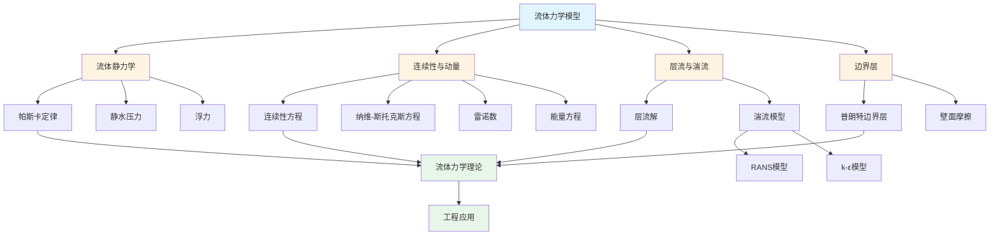

# 流体力学模型 / Fluid Mechanics Models

**版本**: 1.0.0
**最后更新**: 2025-08-25
**状态**: 开发中

## 目录 / Table of Contents

- [流体力学模型 / Fluid Mechanics Models](#流体力学模型--fluid-mechanics-models)
  - [目录 / Table of Contents](#目录--table-of-contents)
  - [流体力学模型框架图 / Framework Diagram of Fluid Mechanics Models](#流体力学模型框架图--framework-diagram-of-fluid-mechanics-models)
  - [纳维-斯托克斯方程关系图 / Relationship Diagram of Navier-Stokes Equations](#纳维-斯托克斯方程关系图--relationship-diagram-of-navier-stokes-equations)
  - [1. 流体静力学 / Hydrostatics](#1-流体静力学--hydrostatics)
    - [1.1 帕斯卡定律 / Pascal's Law](#11-帕斯卡定律--pascals-law)
      - [形式化定义](#形式化定义)
      - [形式化定理](#形式化定理)
      - [Python算法](#python算法)
    - [1.2 静水压力 / Hydrostatic Pressure](#12-静水压力--hydrostatic-pressure)
    - [1.3 浮力 / Buoyancy](#13-浮力--buoyancy)
      - [定理（阿基米德原理）](#定理阿基米德原理)
  - [2. 连续性与动量 / Continuity and Momentum](#2-连续性与动量--continuity-and-momentum)
    - [2.1 连续性方程 / Continuity Equation](#21-连续性方程--continuity-equation)
    - [2.2 纳维-斯托克斯 / Navier–Stokes](#22-纳维-斯托克斯--navierstokes)
      - [纳维-斯托克斯方程求解流程图 / Flowchart of Navier-Stokes Equation Solution](#纳维-斯托克斯方程求解流程图--flowchart-of-navier-stokes-equation-solution)
    - [2.3 雷诺数 / Reynolds Number](#23-雷诺数--reynolds-number)
    - [2.4 能量方程 / Energy Equation](#24-能量方程--energy-equation)
    - [2.5 可压缩流 / Compressible Flow](#25-可压缩流--compressible-flow)
  - [3. 层流与湍流 / Laminar and Turbulence](#3-层流与湍流--laminar-and-turbulence)
    - [3.1 层流解（哈根–泊肃叶）](#31-层流解哈根泊肃叶)
    - [3.2 湍流模型占位](#32-湍流模型占位)
      - [RANS与k-ε模型（概要）](#rans与k-ε模型概要)
      - [k-ω模型（概要）](#k-ω模型概要)
      - [壁面处理与y+评估（概要）](#壁面处理与y评估概要)
      - [简单验证占位](#简单验证占位)
  - [4. 边界层 / Boundary Layer](#4-边界层--boundary-layer)
    - [4.1 普朗特边界层](#41-普朗特边界层)
    - [4.2 壁面摩擦](#42-壁面摩擦)
      - [Blasius相似解与阻力](#blasius相似解与阻力)
      - [边界层验证示例](#边界层验证示例)
  - [相关模型 / Related Models](#相关模型--related-models)
    - [物理科学模型 / Physical Science Models](#物理科学模型--physical-science-models)
    - [基础理论 / Basic Theory](#基础理论--basic-theory)
  - [版本历史 / Version History](#版本历史--version-history)

## 流体力学模型框架图 / Framework Diagram of Fluid Mechanics Models



## 纳维-斯托克斯方程关系图 / Relationship Diagram of Navier-Stokes Equations

```mermaid
graph LR
    A[纳维-斯托克斯方程] --> B[连续性方程]
    A --> C[动量方程]
    A --> D[能量方程]

    B --> E[质量守恒<br/>∂ρ/∂t + ∇·ρu = 0]

    C --> F[惯性项]
    C --> G[压力项]
    C --> H[粘性项]
    C --> I[体积力项]

    F --> J[ρ(∂u/∂t + u·∇u)]
    G --> K[-∇p]
    H --> L[μ∇²u]
    I --> M[ρf]

    J --> N[NS方程<br/>ρ(∂u/∂t + u·∇u) = -∇p + μ∇²u + ρf]
    K --> N
    L --> N
    M --> N

    D --> O[能量守恒]

    N --> P[不可压缩流]
    N --> Q[可压缩流]

    style A fill:#e1f5ff
    style N fill:#e8f5e9
    style P fill:#fff4e1
    style Q fill:#fff4e1
```

## 1. 流体静力学 / Hydrostatics

### 1.1 帕斯卡定律 / Pascal's Law

#### 形式化定义

- 定义: 各向同性静止流体内任意方向压力相等。
- 公理: $\nabla p = \rho \vec{g}$（静止流体中）

#### 形式化定理

- 静压分布: $p(z) = p_0 + \rho g (h - z)$

#### Python算法

```python
import numpy as np

def hydrostatic_pressure(p0: float, density: float, g: float, depth: float) -> float:
    return p0 + density * g * depth
```

### 1.2 静水压力 / Hydrostatic Pressure

```python
def pressure_at_depth(p_at_surface: float, fluid_density: float, gravity: float, depth: float) -> float:
    return hydrostatic_pressure(p_at_surface, fluid_density, gravity, depth)
```

### 1.3 浮力 / Buoyancy

#### 定理（阿基米德原理）

- 浮力: $F_b = \rho_{fluid} g V_{disp}$

```python
def buoyant_force(fluid_density: float, gravity: float, displaced_volume: float) -> float:
    return fluid_density * gravity * displaced_volume
```

## 2. 连续性与动量 / Continuity and Momentum

### 2.1 连续性方程 / Continuity Equation

- 守恒形式: $\partial_t \rho + \nabla\cdot(\rho \vec{u}) = 0$

```python
import numpy as np

def continuity_residual(rho: np.ndarray, u: np.ndarray, dx: float, dt: float) -> float:
    # 一维保守格式残差（示意）
    flux = rho * u
    div_flux = (flux[1:] - flux[:-1]) / dx
    drho_dt = (rho[1:-1] - rho[1:-1]) / dt
    return float(np.linalg.norm(drho_dt + div_flux))
```

### 2.2 纳维-斯托克斯 / Navier–Stokes

#### 纳维-斯托克斯方程求解流程图 / Flowchart of Navier-Stokes Equation Solution

```mermaid
flowchart TD
    Start([开始]) --> Input[输入: 初始条件<br/>u, p, ρ, μ, 边界条件]
    Input --> CheckCompressible{可压缩流?}
    CheckCompressible -->|是| CompressibleNS[可压缩NS方程<br/>+ 状态方程]
    CheckCompressible -->|否| IncompressibleNS[不可压缩NS方程<br/>∇·u = 0]

    CompressibleNS --> CalcRe[计算雷诺数<br/>Re = ρuL/μ]
    IncompressibleNS --> CalcRe

    CalcRe --> CheckFlow{Re < 2300?}
    CheckFlow -->|是| Laminar[层流: 解析解/数值解]
    CheckFlow -->|否| Turbulent[湍流: 湍流模型]

    Laminar --> SetupNS[设置NS方程<br/>ρ(∂u/∂t + u·∇u) = -∇p + μ∇²u + ρf]
    Turbulent --> SetupRANS[设置RANS方程<br/>+ 湍流模型]

    SetupNS --> ChooseMethod{选择数值方法}
    SetupRANS --> ChooseMethod

    ChooseMethod -->|显式| Explicit[显式时间推进]
    ChooseMethod -->|隐式| Implicit[隐式时间推进]
    ChooseMethod -->|半隐式| SemiImplicit[半隐式方法]

    Explicit --> SolveMomentum[求解动量方程]
    Implicit --> SolveMomentum
    SemiImplicit --> SolveMomentum

    SolveMomentum --> SolvePressure[求解压力泊松方程]
    SolvePressure --> CorrectVelocity[速度修正<br/>满足连续性]
    CorrectVelocity --> CheckConvergence{收敛?}
    CheckConvergence -->|否| SolveMomentum
    CheckConvergence -->|是| Output[输出: u, p, 流场]
    Output --> End([结束])

    style Start fill:#e1f5ff
    style End fill:#e1f5ff
    style Output fill:#e8f5e9
    style Laminar fill:#fff4e1
    style Turbulent fill:#ffebee
```

- 不可压形式: $\rho(\partial_t \vec{u} + (\vec{u}\cdot\nabla)\vec{u}) = -\nabla p + \mu \nabla^2 \vec{u} + \rho \vec{f}$

```python
from typing import Tuple

def reynolds_number(rho: float, u_char: float, L: float, mu: float) -> float:
    return rho * u_char * L / mu
```

```python
# 不可压NS时间步推进（2D教学占位）
import numpy as np
from typing import Tuple

def incompressible_ns_step(u: np.ndarray, v: np.ndarray, p: np.ndarray,
                           rho: float, mu: float, dx: float, dy: float, dt: float,
                           fx: float = 0.0, fy: float = 0.0) -> Tuple[np.ndarray, np.ndarray, np.ndarray]:
    """不可压NS显式占位步：返回更新后的(u,v,p)（未含压力泊松求解）"""
    un, vn, pn = u.copy(), v.copy(), p.copy()
    uxx = (un[2:,1:-1] - 2*un[1:-1,1:-1] + un[:-2,1:-1]) / dx**2
    uyy = (un[1:-1,2:] - 2*un[1:-1,1:-1] + un[1:-1,:-2]) / dy**2
    vxx = (vn[2:,1:-1] - 2*vn[1:-1,1:-1] + vn[:-2,1:-1]) / dx**2
    vyy = (vn[1:-1,2:] - 2*vn[1:-1,1:-1] + vn[1:-1,:-2]) / dy**2
    u_new = un[1:-1,1:-1] + dt*( - un[1:-1,1:-1]*(un[2:,1:-1]-un[:-2,1:-1])/(2*dx)
                                 - vn[1:-1,1:-1]*(un[1:-1,2:]-un[1:-1,:-2])/(2*dy)
                                 - (pn[2:,1:-1]-pn[:-2,1:-1])/(2*rho*dx)
                                 + mu*(uxx+uyy)/rho + fx/rho )
    v_new = vn[1:-1,1:-1] + dt*( - un[1:-1,1:-1]*(vn[2:,1:-1]-vn[:-2,1:-1])/(2*dx)
                                 - vn[1:-1,1:-1]*(vn[1:-1,2:]-vn[1:-1,:-2])/(2*dy)
                                 - (pn[1:-1,2:]-pn[1:-1,:-2])/(2*rho*dy)
                                 + mu*(vxx+vyy)/rho + fy/rho )
    u[1:-1,1:-1], v[1:-1,1:-1] = u_new, v_new
    return u, v, p

def dynamic_pressure(rho: float, u: float) -> float:
    return 0.5 * rho * u*u
```

### 2.3 雷诺数 / Reynolds Number

- 定义：$Re = \dfrac{\rho U L}{\mu}$。

```python
def critical_reynolds_pipe() -> float:
    return 2300.0
```

### 2.4 能量方程 / Energy Equation

- 不可压能量方程：$\rho c_p(\partial_t T + \vec{u}\cdot\nabla T) = k\nabla^2 T + \Phi + q$。

```python
def advect_diffuse_temperature(T: np.ndarray, u: np.ndarray, v: np.ndarray,
                               rho: float, cp: float, k: float,
                               dx: float, dy: float, dt: float,
                               q: float = 0.0) -> np.ndarray:
    Tn = T.copy()
    Txx = (Tn[2:,1:-1]-2*Tn[1:-1,1:-1]+Tn[:-2,1:-1]) / dx**2
    Tyy = (Tn[1:-1,2:]-2*Tn[1:-1,1:-1]+Tn[1:-1,:-2]) / dy**2
    adv = - u[1:-1,1:-1]*(Tn[2:,1:-1]-Tn[:-2,1:-1])/(2*dx) \
          - v[1:-1,1:-1]*(Tn[1:-1,2:]-Tn[1:-1,:-2])/(2*dy)
    diff = (k/(rho*cp))*(Txx+Tyy)
    T_new = Tn[1:-1,1:-1] + dt*(adv + diff + q/(rho*cp))
    T[1:-1,1:-1] = T_new
    return T
```

### 2.5 可压缩流 / Compressible Flow

- 状态方程：$p = (\gamma-1)\rho e$；声速 $a=\sqrt{\gamma R T}$；马赫数 $Ma = |\vec{u}|/a$。

```python
def ideal_gas_pressure(rho: float, e: float, gamma: float) -> float:
    return (gamma-1.0) * rho * e

def speed_of_sound(gamma: float, R: float, T: float) -> float:
    return np.sqrt(gamma * R * T)

def mach_number(u: float, a: float) -> float:
    return u / a
```

## 3. 层流与湍流 / Laminar and Turbulence

### 3.1 层流解（哈根–泊肃叶）

- 管流体速分布: $u(r) = \frac{\Delta p}{4 \mu L}(R^2 - r^2)$

```python
def hagen_poiseuille_velocity(delta_p: float, mu: float, L: float, R: float, r: np.ndarray) -> np.ndarray:
    return (delta_p / (4 * mu * L)) * (R**2 - r**2)
```

### 3.2 湍流模型占位

```python
def k_epsilon_placeholders(k: float, epsilon: float) -> Tuple[float, float]:
    return k, epsilon
```

#### RANS与k-ε模型（概要）

- RANS分解：$\vec{u}=\overline{\vec{u}}+\vec{u}'$，湍粘性假设 $\nu_t = C_\mu k^2/\epsilon$。
- 常数：$C_\mu=0.09,\ C_{\epsilon1}=1.44,\ C_{\epsilon2}=1.92,\ \sigma_k=1.0,\ \sigma_{\epsilon}=1.3$。

```python
def eddy_viscosity_k_epsilon(k: float, eps: float, C_mu: float = 0.09) -> float:
    if eps <= 0.0:
        return 0.0
    return C_mu * (k*k) / eps

def k_epsilon_source_terms(k: float, eps: float, Pk: float,
                           C_eps1: float = 1.44, C_eps2: float = 1.92) -> Tuple[float, float]:
    """返回k方程与ε方程源项S_k, S_eps（简化）"""
    kk = max(k, 1e-12)
    S_k = Pk - eps
    S_eps = C_eps1 * (Pk * eps / kk) - C_eps2 * (eps*eps / kk)
    return S_k, S_eps
```

#### k-ω模型（概要）

- 湍粘性：$\nu_t = k/\omega$。
- 常数（SST前的基础形式取值示例）：$\beta^* = 0.09,\ \alpha=5/9,\ \beta=3/40,\ \sigma_k=2.0,\ \sigma_\omega=2.0$。

```python
def eddy_viscosity_k_omega(k: float, omega: float) -> float:
    if omega <= 0.0:
        return 0.0
    return k / omega

def k_omega_source_terms(k: float, omega: float, Pk: float,
                         alpha: float = 5.0/9.0, beta: float = 3.0/40.0,
                         beta_star: float = 0.09) -> Tuple[float, float]:
    """返回k-ω源项S_k, S_ω（简化）"""
    S_k = Pk - beta_star * k * omega
    S_omega = alpha * (omega / max(k,1e-12)) * Pk - beta * omega * omega
    return S_k, S_omega
```

#### 壁面处理与y+评估（概要）

- 壁面无量纲距离：$y^+ = u_\tau y/\nu$，其中摩擦速度 $u_\tau = \sqrt{\tau_w/\rho}$。
- 经验壁面函数（对数律区）：$U^+ = \frac{1}{\kappa}\ln y^+ + B$，$\kappa\approx0.41, B\approx5.2$。

```python
def y_plus(tau_w: float, rho: float, y: float, nu: float) -> float:
    if nu <= 0.0:
        return 0.0
    u_tau = (tau_w / rho) ** 0.5
    return u_tau * y / nu

def u_plus_from_y_plus(y_plus_val: float, kappa: float = 0.41, B: float = 5.2) -> float:
    if y_plus_val <= 0.0:
        return 0.0
    return (1.0 / kappa) * np.log(y_plus_val) + B
```

#### 简单验证占位

- 一致性检查：当$k\to0$或耗散增大时，$\nu_t\to0$；$y^+$、$U^+$单调合理。

```python
def turbulence_sanity_checks() -> bool:
    ok = True
    ok &= eddy_viscosity_k_epsilon(1e-6, 1.0) < 1e-4
    ok &= eddy_viscosity_k_omega(1e-6, 1.0) < 1e-4
    ok &= y_plus(tau_w=1.0, rho=1.2, y=1e-3, nu=1.5e-5) > 0.0
    ok &= u_plus_from_y_plus(30.0) > u_plus_from_y_plus(10.0)
    return ok
```

## 4. 边界层 / Boundary Layer

### 4.1 普朗特边界层

- 边界层厚度近似: $\delta(x) \approx 5 \sqrt{\frac{\nu x}{U_\infty}}$

```python
def bl_thickness_prandtl(nu: float, x: float, U: float) -> float:
    return 5.0 * np.sqrt(nu * x / U)
```

### 4.2 壁面摩擦

- 平板层流摩擦系数: $C_f = 1.328 / \sqrt{Re_x}$

```python
def skin_friction_coefficient(Re_x: float) -> float:
    return 1.328 / np.sqrt(Re_x)
```

#### Blasius相似解与阻力

- Blasius方程：$f''' + \tfrac{1}{2} f f'' = 0$；$C_f = 0.664/\sqrt{Re_x}$。

```python
def blasius_cf(Re_x: float) -> float:
    return 0.664 / np.sqrt(Re_x)

def flat_plate_drag_coefficient(Re_L: float) -> float:
    return 1.328 / np.sqrt(Re_L)
```

#### 边界层验证示例

```python
def boundary_layer_sanity_checks(nu: float = 1.5e-5, U: float = 1.0,
                                 x1: float = 0.5, x2: float = 1.0) -> bool:
    """检查δ(x)与C_f的基本趋势是否合理"""
    import numpy as np
    d1 = bl_thickness_prandtl(nu, x1, U)
    d2 = bl_thickness_prandtl(nu, x2, U)
    Re_x1 = U * x1 / nu
    Re_x2 = U * x2 / nu
    cf1 = blasius_cf(Re_x1)
    cf2 = blasius_cf(Re_x2)
    # 趋势：厚度随x增大；C_f随Re_x增大而减小
    return (d2 > d1) and (cf2 < cf1)
```

## 相关模型 / Related Models

### 物理科学模型 / Physical Science Models

- [经典力学模型](../01-经典力学模型/README.md) - 连续介质中的力学问题
- [声学模型](../07-声学模型/README.md) - 声波在流体中的传播
- [热力学模型](../04-热力学模型/README.md) - 流体的热力学性质
- [相对论模型](../03-相对论模型/README.md) - 相对论流体力学

### 基础理论 / Basic Theory

- [模型分类学](../../01-基础理论/01-模型分类学/README.md) - 流体力学模型的分类
- [形式化方法论](../../01-基础理论/02-形式化方法论/README.md) - 流体力学的形式化方法
- [科学模型论](../../01-基础理论/03-科学模型论/README.md) - 流体力学作为科学模型的理论基础

## 版本历史 / Version History

- 1.0.0 (2025-08-25): 初始版本骨架（静力学、连续性/动量、层流/湍流、边界层）
