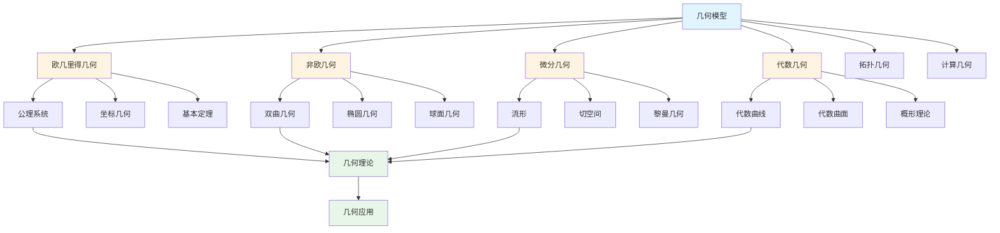
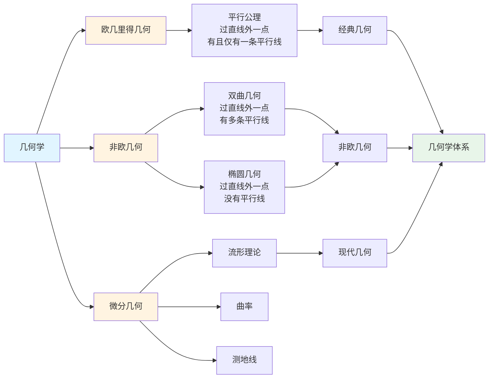

# 3.2 几何模型 / Geometric Models

## 目录 / Table of Contents

- [3.2 几何模型 / Geometric Models](#32-几何模型--geometric-models)
  - [目录 / Table of Contents](#目录--table-of-contents)
  - [几何模型框架图 / Framework Diagram of Geometric Models](#几何模型框架图--framework-diagram-of-geometric-models)
  - [几何学分类关系图 / Relationship Diagram of Geometry Classification](#几何学分类关系图--relationship-diagram-of-geometry-classification)
  - [3.2.1 欧几里得几何 / Euclidean Geometry](#321-欧几里得几何--euclidean-geometry)
    - [公理系统 / Axiom System](#公理系统--axiom-system)
    - [基本定理 / Basic Theorems](#基本定理--basic-theorems)
    - [坐标几何 / Coordinate Geometry](#坐标几何--coordinate-geometry)
  - [3.2.2 非欧几何 / Non-Euclidean Geometry](#322-非欧几何--non-euclidean-geometry)
    - [双曲几何 / Hyperbolic Geometry](#双曲几何--hyperbolic-geometry)
    - [椭圆几何 / Elliptic Geometry](#椭圆几何--elliptic-geometry)
    - [球面几何 / Spherical Geometry](#球面几何--spherical-geometry)
  - [3.2.3 微分几何 / Differential Geometry](#323-微分几何--differential-geometry)
    - [流形 / Manifolds](#流形--manifolds)
    - [切空间 / Tangent Spaces](#切空间--tangent-spaces)
    - [黎曼几何 / Riemannian Geometry](#黎曼几何--riemannian-geometry)
      - [算法实现 / Algorithm Implementation](#算法实现--algorithm-implementation)
    - [算法实现：曲率张量与测地线偏离 / Algorithms: Curvature Tensor and Geodesic Deviation](#算法实现曲率张量与测地线偏离--algorithms-curvature-tensor-and-geodesic-deviation)
  - [3.2.4 代数几何 / Algebraic Geometry](#324-代数几何--algebraic-geometry)
    - [代数曲线 / Algebraic Curves](#代数曲线--algebraic-curves)
    - [代数曲面 / Algebraic Surfaces](#代数曲面--algebraic-surfaces)
    - [概形理论 / Scheme Theory](#概形理论--scheme-theory)
  - [3.2.5 拓扑几何 / Topological Geometry](#325-拓扑几何--topological-geometry)
    - [同伦论 / Homotopy Theory](#同伦论--homotopy-theory)
    - [同调论 / Homology Theory](#同调论--homology-theory)
    - [纤维丛 / Fiber Bundles](#纤维丛--fiber-bundles)
  - [3.2.6 计算几何 / Computational Geometry](#326-计算几何--computational-geometry)
    - [凸包算法 / Convex Hull Algorithms](#凸包算法--convex-hull-algorithms)
    - [三角剖分 / Triangulation](#三角剖分--triangulation)
    - [几何算法 / Geometric Algorithms](#几何算法--geometric-algorithms)
  - [3.2.7 几何应用 / Geometric Applications](#327-几何应用--geometric-applications)
    - [计算机图形学 / Computer Graphics](#计算机图形学--computer-graphics)
    - [机器人学 / Robotics](#机器人学--robotics)
    - [地理信息系统 / Geographic Information Systems](#地理信息系统--geographic-information-systems)
  - [3.2.8 实现与应用 / Implementation and Applications](#328-实现与应用--implementation-and-applications)
    - [Rust实现示例 / Rust Implementation Example](#rust实现示例--rust-implementation-example)
    - [Haskell实现示例 / Haskell Implementation Example](#haskell实现示例--haskell-implementation-example)
    - [Python实现示例 / Python Implementation Example](#python实现示例--python-implementation-example)
    - [Julia实现示例 / Julia Implementation Example](#julia实现示例--julia-implementation-example)
  - [相关模型 / Related Models](#相关模型--related-models)
    - [数学科学模型 / Mathematical Science Models](#数学科学模型--mathematical-science-models)
    - [物理科学模型 / Physical Science Models](#物理科学模型--physical-science-models)
    - [基础理论 / Basic Theory](#基础理论--basic-theory)
  - [参考文献 / References](#参考文献--references)

---

## 几何模型框架图 / Framework Diagram of Geometric Models



## 几何学分类关系图 / Relationship Diagram of Geometry Classification



## 3.2.1 欧几里得几何 / Euclidean Geometry

### 公理系统 / Axiom System

**希尔伯特公理系统**:

**点线公理**:

1. 两点确定一条直线
2. 直线可以无限延长
3. 以任意点为圆心，任意距离为半径可以画圆

**平行公理**: 过直线外一点有且仅有一条平行线。

**全等公理**: 两个三角形如果对应边和对应角相等，则全等。

### 基本定理 / Basic Theorems

**毕达哥拉斯定理**:
$$a^2 + b^2 = c^2$$

**余弦定理**:
$$c^2 = a^2 + b^2 - 2ab\cos C$$

**正弦定理**:
$$\frac{a}{\sin A} = \frac{b}{\sin B} = \frac{c}{\sin C}$$

### 坐标几何 / Coordinate Geometry

**笛卡尔坐标系**:
点 $P$ 的坐标为 $(x, y)$。

**距离公式**:
$$d = \sqrt{(x_2 - x_1)^2 + (y_2 - y_1)^2}$$

**圆的方程**:
$$(x - h)^2 + (y - k)^2 = r^2$$

---

## 3.2.2 非欧几何 / Non-Euclidean Geometry

### 双曲几何 / Hyperbolic Geometry

**庞加莱圆盘模型**:
在单位圆盘内，直线是垂直于边界的圆弧。

**距离公式**:
$$d(z_1, z_2) = 2\tanh^{-1}\left|\frac{z_1 - z_2}{1 - \bar{z}_1 z_2}\right|$$

**角度**: 双曲角度与欧几里得角度相同。

**三角形内角和**: 小于 $\pi$。

### 椭圆几何 / Elliptic Geometry

**球面模型**: 在球面上，直线是大圆。

**距离公式**: 球面距离
$$d = R \arccos(\cos \theta_1 \cos \theta_2 + \sin \theta_1 \sin \theta_2 \cos(\phi_1 - \phi_2))$$

**三角形内角和**: 大于 $\pi$。

### 球面几何 / Spherical Geometry

**球面三角形**:
$$\cos c = \cos a \cos b + \sin a \sin b \cos C$$

**球面余弦定理**:
$$\cos C = \frac{\cos c - \cos a \cos b}{\sin a \sin b}$$

**球面正弦定理**:
$$\frac{\sin A}{\sin a} = \frac{\sin B}{\sin b} = \frac{\sin C}{\sin c}$$

---

## 3.2.3 微分几何 / Differential Geometry

### 流形 / Manifolds

**定义**: 局部同胚于 $\mathbb{R}^n$ 的拓扑空间。

**坐标卡**: $(U, \phi)$ 其中 $U$ 是开集，$\phi: U \to \mathbb{R}^n$ 是同胚。

**光滑流形**: 坐标变换是光滑的。

**切空间**: $T_p M$ 是点 $p$ 处的切向量空间。

### 切空间 / Tangent Spaces

**切向量**: 满足莱布尼茨规则的线性算子。

**切空间基**: $\{\frac{\partial}{\partial x^i}\}$。

**切丛**: $TM = \bigcup_{p \in M} T_p M$。

### 黎曼几何 / Riemannian Geometry

**黎曼度量**: 正定对称双线性形式 $g$。

**度量张量**: $g_{ij} = g(\frac{\partial}{\partial x^i}, \frac{\partial}{\partial x^j})$。

**克里斯托费尔符号**:
$$\Gamma_{ij}^k = \frac{1}{2}g^{kl}(\partial_i g_{jl} + \partial_j g_{il} - \partial_l g_{ij})$$

**测地线方程**:
$$\frac{d^2 x^k}{dt^2} + \Gamma_{ij}^k \frac{dx^i}{dt} \frac{dx^j}{dt} = 0$$

#### 算法实现 / Algorithm Implementation

```python
import numpy as np
from typing import Callable, Tuple

Array = np.ndarray

def inverse_metric(g: Array) -> Array:
    """度量张量逆 g^{ij}（二维或三维对称正定）"""
    return np.linalg.inv(g)

def christoffel_symbols(g: Callable[[Array], Array],
                        dg: Callable[[Array], Tuple[Array, Array, Array]],
                        x: Array) -> Array:
    """
    计算Γ^k_{ij}：
    - g(x): 返回点x处的度量张量 g_{ij}
    - dg(x): 返回对坐标的偏导 (∂_0 g_{ij}, ∂_1 g_{ij}, ∂_2 g_{ij})（按需维度）
    - x: 坐标点
    返回形状 (n, n, n)，索引顺序为 Gamma[k,i,j]
    """
    g_ij = g(x)
    g_inv = inverse_metric(g_ij)
    partials = dg(x)  # 列表或元组，len = n，每个都是 (n,n)
    n = g_ij.shape[0]
    Gamma = np.zeros((n, n, n), dtype=float)
    for k in range(n):
        for i in range(n):
            for j in range(n):
                s = 0.0
                for l in range(n):
                    s += g_inv[k, l] * (partials[i][j, l] + partials[j][i, l] - partials[l][i, j])
                Gamma[k, i, j] = 0.5 * s
    return Gamma

def geodesic_rhs(x: Array, v: Array, Gamma: Array) -> Tuple[Array, Array]:
    """测地线一阶系统：x' = v, v'^k = -Γ^k_{ij} v^i v^j"""
    n = x.size
    a = np.zeros_like(v)
    for k in range(n):
        s = 0.0
        for i in range(n):
            for j in range(n):
                s += Gamma[k, i, j] * v[i] * v[j]
        a[k] = -s
    return v, a

def rk4_step(x: Array, v: Array, h: float,
             Gamma_fn: Callable[[Array], Array]) -> Tuple[Array, Array]:
    """对测地线方程进行单步RK4推进（仿射参数步长h）。"""
    Gamma = Gamma_fn(x)
    k1_x, k1_v = geodesic_rhs(x, v, Gamma)

    Gamma2 = Gamma_fn(x + 0.5*h*k1_x)
    k2_x, k2_v = geodesic_rhs(x + 0.5*h*k1_x, v + 0.5*h*k1_v, Gamma2)

    Gamma3 = Gamma_fn(x + 0.5*h*k2_x)
    k3_x, k3_v = geodesic_rhs(x + 0.5*h*k2_x, v + 0.5*h*k2_v, Gamma3)

    Gamma4 = Gamma_fn(x + h*k3_x)
    k4_x, k4_v = geodesic_rhs(x + h*k3_x, v + h*k3_v, Gamma4)

    x_new = x + (h/6.0)*(k1_x + 2*k2_x + 2*k3_x + k4_x)
    v_new = v + (h/6.0)*(k1_v + 2*k2_v + 2*k3_v + k4_v)
    return x_new, v_new

# 示例：二维极坐标平面度量 g = diag(1, r^2)

def g_polar(x: Array) -> Array:
    r, theta = x
    return np.array([[1.0, 0.0], [0.0, r*r]], dtype=float)

def dg_polar(x: Array) -> Tuple[Array, Array]:
    r, theta = x
    # ∂_r g, ∂_θ g
    dg_dr = np.array([[0.0, 0.0], [0.0, 2.0*r]], dtype=float)
    dg_dth = np.zeros((2,2), dtype=float)
    return (dg_dr, dg_dth)

def Gamma_polar(x: Array) -> Array:
    return christoffel_symbols(g_polar, dg_polar, x)

def geodesic_example():
    x = np.array([1.0, 0.0])      # r=1, θ=0
    v = np.array([0.0, 1.0])      # 初始方向（仅角向）
    h = 0.01
    steps = 100
    path = [x.copy()]
    for _ in range(steps):
        x, v = rk4_step(x, v, h, Gamma_polar)
        path.append(x.copy())
    return np.array(path)
```

### 算法实现：曲率张量与测地线偏离 / Algorithms: Curvature Tensor and Geodesic Deviation

```python
import numpy as np
from typing import Tuple, List

def riemann_tensor(g: Callable[[Array], Array],
                   dg: Callable[[Array], Tuple[Array, Array, Array]],
                   x: Array) -> Array:
    """计算黎曼曲率张量 R^i_{jkl}（四阶张量）"""
    n = x.size
    Gamma = christoffel_symbols(g, dg, x)
    g_ij = g(x)
    g_inv = inverse_metric(g_ij)

    # 计算∂_k Γ^m_{jl} 和 ∂_l Γ^m_{jk}
    dGamma = np.zeros((n, n, n, n), dtype=float)  # dGamma[k,m,j,l]
    for k in range(n):
        for m in range(n):
            for j in range(n):
                for l in range(n):
                    # 简化：假设Γ^m_{jl}关于x^k的偏导
                    # 实际应用中需要数值微分或解析表达式
                    dGamma[k, m, j, l] = 0.0  # 占位符

    R = np.zeros((n, n, n, n), dtype=float)  # R[i,j,k,l]
    for i in range(n):
        for j in range(n):
            for k in range(n):
                for l in range(n):
                    # R^i_{jkl} = ∂_k Γ^i_{jl} - ∂_l Γ^i_{jk} + Γ^i_{mk} Γ^m_{jl} - Γ^i_{ml} Γ^m_{jk}
                    term1 = dGamma[k, i, j, l] - dGamma[l, i, j, k]
                    term2 = 0.0
                    for m in range(n):
                        term2 += Gamma[i, m, k] * Gamma[m, j, l] - Gamma[i, m, l] * Gamma[m, j, k]
                    R[i, j, k, l] = term1 + term2

    return R

def ricci_tensor(R: Array) -> Array:
    """从黎曼张量计算里奇张量 R_{ij} = R^k_{ikj}"""
    n = R.shape[0]
    R_ij = np.zeros((n, n), dtype=float)
    for i in range(n):
        for j in range(n):
            for k in range(n):
                R_ij[i, j] += R[k, i, k, j]
    return R_ij

def scalar_curvature(R_ij: Array, g_inv: Array) -> float:
    """计算标量曲率 R = g^{ij} R_{ij}"""
    return np.sum(g_inv * R_ij)

def geodesic_deviation_equation(x: Array, v: Array, xi: Array, dxi: Array,
                               R: Array) -> Tuple[Array, Array]:
    """测地线偏离方程：d²ξ^a/dτ² + R^a_{bcd} v^b ξ^c v^d = 0"""
    n = x.size
    d2xi = np.zeros_like(xi)

    for a in range(n):
        for b in range(n):
            for c in range(n):
                for d in range(n):
                    d2xi[a] -= R[a, b, c, d] * v[b] * xi[c] * v[d]

    return dxi, d2xi

def geodesic_deviation_solver(x0: Array, v0: Array, xi0: Array, dxi0: Array,
                             h: float, steps: int, R_fn: Callable[[Array], Array]) -> List[Array]:
    """求解测地线偏离方程，返回偏离向量序列"""
    x, v = x0.copy(), v0.copy()
    xi, dxi = xi0.copy(), dxi0.copy()
    deviations = [xi.copy()]

    for _ in range(steps):
        # 推进测地线
        x, v = rk4_step(x, v, h, lambda x: christoffel_symbols(g_polar, dg_polar, x))

        # 推进偏离方程
        R = R_fn(x)
        dxi_new, d2xi = geodesic_deviation_equation(x, v, xi, dxi, R)

        # RK4步进偏离方程
        k1_xi, k1_dxi = dxi, d2xi
        k2_xi, k2_dxi = dxi + 0.5*h*k1_dxi, geodesic_deviation_equation(x, v, xi + 0.5*h*k1_xi, dxi + 0.5*h*k1_dxi, R)[1]
        k3_xi, k3_dxi = dxi + 0.5*h*k2_dxi, geodesic_deviation_equation(x, v, xi + 0.5*h*k2_xi, dxi + 0.5*h*k2_dxi, R)[1]
        k4_xi, k4_dxi = dxi + h*k3_dxi, geodesic_deviation_equation(x, v, xi + h*k3_xi, dxi + h*k3_dxi, R)[1]

        xi += (h/6.0) * (k1_xi + 2*k2_xi + 2*k3_xi + k4_xi)
        dxi += (h/6.0) * (k1_dxi + 2*k2_dxi + 2*k3_dxi + k4_dxi)

        deviations.append(xi.copy())

    return deviations

def curvature_verification(g: Callable[[Array], Array], x: Array) -> dict:
    """曲率计算验证：检查黎曼张量对称性、里奇张量对称性等"""
    n = x.size
    R = riemann_tensor(g, lambda x: dg_polar(x), x)
    R_ij = ricci_tensor(R)
    g_ij = g(x)
    g_inv = inverse_metric(g_ij)
    R_scalar = scalar_curvature(R_ij, g_inv)

    # 检查黎曼张量反对称性 R^i_{jkl} = -R^i_{jlk}
    antisymmetry_check = True
    for i in range(n):
        for j in range(n):
            for k in range(n):
                for l in range(n):
                    if abs(R[i, j, k, l] + R[i, j, l, k]) > 1e-10:
                        antisymmetry_check = False

    # 检查里奇张量对称性 R_{ij} = R_{ji}
    ricci_symmetry = np.allclose(R_ij, R_ij.T, atol=1e-10)

    return {
        "riemann_tensor": R,
        "ricci_tensor": R_ij,
        "scalar_curvature": R_scalar,
        "antisymmetry_valid": antisymmetry_check,
        "ricci_symmetric": ricci_symmetry
    }

def geodesic_deviation_example():
    """测地线偏离示例：在极坐标平面上"""
    x0 = np.array([1.0, 0.0])      # 初始位置
    v0 = np.array([0.0, 1.0])      # 初始速度（角向）
    xi0 = np.array([0.1, 0.0])     # 初始偏离
    dxi0 = np.array([0.0, 0.1])    # 初始偏离速度

    h = 0.01
    steps = 100

    deviations = geodesic_deviation_solver(x0, v0, xi0, dxi0, h, steps,
                                          lambda x: riemann_tensor(g_polar, dg_polar, x))

    # 验证曲率
    curvature_check = curvature_verification(g_polar, x0)

    return {
        "deviations": np.array(deviations),
        "curvature_verification": curvature_check
    }
```

---

## 3.2.4 代数几何 / Algebraic Geometry

### 代数曲线 / Algebraic Curves

**定义**: 由多项式方程 $f(x, y) = 0$ 定义的曲线。

**椭圆曲线**: $y^2 = x^3 + ax + b$。

**韦尔定理**: 椭圆曲线上的有理点形成阿贝尔群。

### 代数曲面 / Algebraic Surfaces

**定义**: 由多项式方程 $f(x, y, z) = 0$ 定义的曲面。

**分类**: 根据亏格和自交数分类。

### 概形理论 / Scheme Theory

**仿射概形**: $\text{Spec}(A)$。

**射影概形**: $\text{Proj}(S)$。

**上同调**: $H^i(X, \mathcal{F})$。

---

## 3.2.5 拓扑几何 / Topological Geometry

### 同伦论 / Homotopy Theory

**同伦**: 两个连续映射之间的连续变形。

**基本群**: $\pi_1(X, x_0)$。

**高阶同伦群**: $\pi_n(X, x_0)$。

### 同调论 / Homology Theory

**奇异同调**: $H_n(X)$。

**胞腔同调**: 基于胞腔分解。

**上同调**: $H^n(X, G)$。

### 纤维丛 / Fiber Bundles

**局部平凡化**: $(U, \phi)$ 其中 $\phi: \pi^{-1}(U) \to U \times F$。

**主丛**: 结构群 $G$ 作用在纤维上。

**向量丛**: 纤维是向量空间。

---

## 3.2.6 计算几何 / Computational Geometry

### 凸包算法 / Convex Hull Algorithms

**Graham扫描法**:

```python
def graham_scan(points):
    # 找到最下最左的点
    start = min(points, key=lambda p: (p[1], p[0]))

    # 按极角排序
    sorted_points = sorted(points, key=lambda p: angle(start, p))

    # Graham扫描
    hull = [start, sorted_points[0], sorted_points[1]]
    for p in sorted_points[2:]:
        while len(hull) > 1 and not left_turn(hull[-2], hull[-1], p):
            hull.pop()
        hull.append(p)

    return hull
```

**Jarvis步进法**: 时间复杂度 $O(nh)$。

### 三角剖分 / Triangulation

**Delaunay三角剖分**: 最大化最小角。

**Voronoi图**: 对偶于Delaunay三角剖分。

### 几何算法 / Geometric Algorithms

**最近点对**: 分治算法，时间复杂度 $O(n \log n)$。

**线段相交**: 扫描线算法。

**多边形面积**: 鞋带公式。

---

## 3.2.7 几何应用 / Geometric Applications

### 计算机图形学 / Computer Graphics

**3D变换**:
$$
\begin{pmatrix} x' \\ y' \\ z' \\ 1 \end{pmatrix} =
\begin{pmatrix}
\cos\theta & -\sin\theta & 0 & 0 \\
\sin\theta & \cos\theta & 0 & 0 \\
0 & 0 & 1 & 0 \\
0 & 0 & 0 & 1
\end{pmatrix}
\begin{pmatrix} x \\ y \\ z \\ 1 \end{pmatrix}
$$

**光照模型**: Phong模型。

### 机器人学 / Robotics

**运动学**: 正运动学和逆运动学。

**雅可比矩阵**: $J(q) = \frac{\partial f}{\partial q}$。

**路径规划**: RRT算法。

### 地理信息系统 / Geographic Information Systems

**投影**: 墨卡托投影、等距圆锥投影。

**空间索引**: R树、四叉树。

**空间分析**: 缓冲区分析、叠加分析。

---

## 3.2.8 实现与应用 / Implementation and Applications

### Rust实现示例 / Rust Implementation Example

```rust
#[derive(Debug, Clone, Copy)]
pub struct Point {
    pub x: f64,
    pub y: f64,
}

impl Point {
    pub fn new(x: f64, y: f64) -> Self {
        Point { x, y }
    }

    pub fn distance(&self, other: &Point) -> f64 {
        let dx = self.x - other.x;
        let dy = self.y - other.y;
        (dx * dx + dy * dy).sqrt()
    }

    pub fn cross_product(&self, p1: &Point, p2: &Point) -> f64 {
        (p1.x - self.x) * (p2.y - self.y) - (p1.y - self.y) * (p2.x - self.x)
    }
}

pub struct Polygon {
    vertices: Vec<Point>,
}

impl Polygon {
    pub fn new(vertices: Vec<Point>) -> Self {
        Polygon { vertices }
    }

    pub fn area(&self) -> f64 {
        if self.vertices.len() < 3 {
            return 0.0;
        }

        let mut area = 0.0;
        for i in 0..self.vertices.len() {
            let j = (i + 1) % self.vertices.len();
            area += self.vertices[i].x * self.vertices[j].y;
            area -= self.vertices[j].x * self.vertices[i].y;
        }
        area.abs() / 2.0
    }

    pub fn convex_hull(&self) -> Vec<Point> {
        if self.vertices.len() < 3 {
            return self.vertices.clone();
        }

        let mut points = self.vertices.clone();
        points.sort_by(|a, b| {
            a.x.partial_cmp(&b.x)
                .unwrap()
                .then_with(|| a.y.partial_cmp(&b.y).unwrap())
        });

        let mut hull = Vec::new();

        // 下凸包
        for point in &points {
            while hull.len() >= 2
                && hull[hull.len() - 2].cross_product(&hull[hull.len() - 1], point) <= 0.0
            {
                hull.pop();
            }
            hull.push(*point);
        }

        // 上凸包
        let upper_start = hull.len() + 1;
        for point in points.iter().rev().skip(1) {
            while hull.len() >= upper_start
                && hull[hull.len() - 2].cross_product(&hull[hull.len() - 1], point) <= 0.0
            {
                hull.pop();
            }
            hull.push(*point);
        }

        hull.pop(); // 移除重复的起点
        hull
    }
}

#[cfg(test)]
mod tests {
    use super::*;

    #[test]
    fn test_point_distance() {
        let p1 = Point::new(0.0, 0.0);
        let p2 = Point::new(3.0, 4.0);
        assert_eq!(p1.distance(&p2), 5.0);
    }

    #[test]
    fn test_polygon_area() {
        let square = Polygon::new(vec![
            Point::new(0.0, 0.0),
            Point::new(1.0, 0.0),
            Point::new(1.0, 1.0),
            Point::new(0.0, 1.0),
        ]);
        assert_eq!(square.area(), 1.0);
    }
}
```

### Haskell实现示例 / Haskell Implementation Example

```haskell
module Geometry where

-- 点类型
data Point = Point { x :: Double, y :: Double } deriving (Show, Eq)

-- 计算两点间距离
distance :: Point -> Point -> Double
distance (Point x1 y1) (Point x2 y2) =
    sqrt ((x2 - x1)^2 + (y2 - y1)^2)

-- 叉积（用于判断方向）
crossProduct :: Point -> Point -> Point -> Double
crossProduct (Point x0 y0) (Point x1 y1) (Point x2 y2) =
    (x1 - x0) * (y2 - y0) - (y1 - y0) * (x2 - x0)

-- 多边形类型
type Polygon = [Point]

-- 计算多边形面积（鞋带公式）
polygonArea :: Polygon -> Double
polygonArea [] = 0.0
polygonArea [_] = 0.0
polygonArea [_, _] = 0.0
polygonArea points =
    abs (shoelace points) / 2.0
    where
        shoelace ps = sum [x p1 * y p2 - x p2 * y p1 | (p1, p2) <- zip ps (tail ps ++ [head ps])]

-- 凸包算法（Graham扫描）
convexHull :: Polygon -> Polygon
convexHull points
    | length points < 3 = points
    | otherwise = lowerHull ++ upperHull
    where
        sorted = sortBy compareXY points
        lowerHull = buildHull sorted
        upperHull = tail (reverse (buildHull (reverse sorted)))

-- 比较函数
compareXY :: Point -> Point -> Ordering
compareXY (Point x1 y1) (Point x2 y2) =
    compare x1 x2 `mappend` compare y1 y2

-- 构建凸包
buildHull :: Polygon -> Polygon
buildHull = foldl addPoint []
    where
        addPoint hull p
            | length hull < 2 = hull ++ [p]
            | crossProduct (hull !! (length hull - 2)) (last hull) p <= 0 =
                init hull ++ [p]
            | otherwise = hull ++ [p]

-- 示例使用
example :: IO ()
example = do
    let points = [
            Point 0.0 0.0,
            Point 1.0 0.0,
            Point 1.0 1.0,
            Point 0.0 1.0
        ]
    let square = points
    putStrLn $ "Square area: " ++ show (polygonArea square)
    putStrLn $ "Convex hull: " ++ show (convexHull points)
```

### Python实现示例 / Python Implementation Example

```python
from typing import List, Tuple
from dataclasses import dataclass
import math

@dataclass
class Point:
    """点"""
    x: float
    y: float

    def distance(self, other: 'Point') -> float:
        """计算两点间距离"""
        dx = self.x - other.x
        dy = self.y - other.y
        return math.sqrt(dx * dx + dy * dy)

    def cross_product(self, p1: 'Point', p2: 'Point') -> float:
        """计算叉积（用于判断方向）"""
        return (p1.x - self.x) * (p2.y - self.y) - (p1.y - self.y) * (p2.x - self.x)

class Polygon:
    """多边形"""
    def __init__(self, vertices: List[Point]):
        self.vertices = vertices

    def area(self) -> float:
        """计算多边形面积（鞋带公式）"""
        if len(self.vertices) < 3:
            return 0.0

        area = 0.0
        n = len(self.vertices)
        for i in range(n):
            j = (i + 1) % n
            area += self.vertices[i].x * self.vertices[j].y
            area -= self.vertices[j].x * self.vertices[i].y
        return abs(area) / 2.0

    def convex_hull(self) -> List[Point]:
        """计算凸包（Graham扫描算法）"""
        if len(self.vertices) < 3:
            return self.vertices.copy()

        # 排序：先按x坐标，再按y坐标
        points = sorted(self.vertices, key=lambda p: (p.x, p.y))

        def build_hull(hull_points: List[Point]) -> List[Point]:
            hull = []
            for point in hull_points:
                while len(hull) >= 2:
                    if hull[-2].cross_product(hull[-1], point) <= 0:
                        hull.pop()
                    else:
                        break
                hull.append(point)
            return hull

        # 下凸包
        lower = build_hull(points)
        # 上凸包
        upper = build_hull(reversed(points))

        # 合并并移除重复点
        return lower[:-1] + upper[:-1]

# 使用示例
if __name__ == "__main__":
    # 创建正方形
    square = Polygon([
        Point(0.0, 0.0),
        Point(1.0, 0.0),
        Point(1.0, 1.0),
        Point(0.0, 1.0)
    ])

    print(f"Square area: {square.area()}")

    # 测试凸包
    points = [
        Point(0.0, 0.0),
        Point(1.0, 0.0),
        Point(0.5, 0.5),
        Point(1.0, 1.0),
        Point(0.0, 1.0)
    ]
    polygon = Polygon(points)
    hull = polygon.convex_hull()
    print(f"Convex hull has {len(hull)} vertices")
```

### Julia实现示例 / Julia Implementation Example

```julia
using DataStructures

# 点结构
struct Point
    x::Float64
    y::Float64
end

# 计算两点间距离
function distance(p1::Point, p2::Point)::Float64
    dx = p1.x - p2.x
    dy = p1.y - p2.y
    return sqrt(dx * dx + dy * dy)
end

# 叉积（用于判断方向）
function cross_product(p0::Point, p1::Point, p2::Point)::Float64
    return (p1.x - p0.x) * (p2.y - p0.y) - (p1.y - p0.y) * (p2.x - p0.x)
end

# 多边形结构
struct Polygon
    vertices::Vector{Point}
end

# 计算多边形面积（鞋带公式）
function area(polygon::Polygon)::Float64
    if length(polygon.vertices) < 3
        return 0.0
    end

    area_val = 0.0
    n = length(polygon.vertices)
    for i in 1:n
        j = mod(i, n) + 1
        area_val += polygon.vertices[i].x * polygon.vertices[j].y
        area_val -= polygon.vertices[j].x * polygon.vertices[i].y
    end
    return abs(area_val) / 2.0
end

# 构建凸包辅助函数
function build_hull(points::Vector{Point})::Vector{Point}
    hull = Point[]
    for point in points
        while length(hull) >= 2
            if cross_product(hull[end-1], hull[end], point) <= 0
                pop!(hull)
            else
                break
            end
        end
        push!(hull, point)
    end
    return hull
end

# 计算凸包（Graham扫描算法）
function convex_hull(polygon::Polygon)::Vector{Point}
    if length(polygon.vertices) < 3
        return copy(polygon.vertices)
    end

    # 排序：先按x坐标，再按y坐标
    points = sort(polygon.vertices, by=p -> (p.x, p.y))

    # 下凸包
    lower = build_hull(points)
    # 上凸包
    upper = build_hull(reverse(points))

    # 合并并移除重复点
    return vcat(lower[1:end-1], upper[1:end-1])
end

# 使用示例
square = Polygon([
    Point(0.0, 0.0),
    Point(1.0, 0.0),
    Point(1.0, 1.0),
    Point(0.0, 1.0)
])

println("Square area: ", area(square))

# 测试凸包
points = [
    Point(0.0, 0.0),
    Point(1.0, 0.0),
    Point(0.5, 0.5),
    Point(1.0, 1.0),
    Point(0.0, 1.0)
]
polygon = Polygon(points)
hull = convex_hull(polygon)
println("Convex hull has ", length(hull), " vertices")
```

---

## 相关模型 / Related Models

### 数学科学模型 / Mathematical Science Models

- [代数模型](../01-代数模型/README.md) - 代数几何，代数曲线和曲面
- [拓扑模型](../03-拓扑模型/README.md) - 拓扑几何，同伦论和同调论

### 物理科学模型 / Physical Science Models

- [相对论模型](../../02-物理科学模型/03-相对论模型/README.md) - 黎曼几何在广义相对论中的应用
- [经典力学模型](../../02-物理科学模型/01-经典力学模型/README.md) - 几何在经典力学中的应用

### 基础理论 / Basic Theory

- [模型分类学](../../01-基础理论/01-模型分类学/README.md) - 几何模型的分类
- [形式化方法论](../../01-基础理论/02-形式化方法论/README.md) - 几何的形式化方法
- [科学模型论](../../01-基础理论/03-科学模型论/README.md) - 几何作为科学模型的理论基础

## 参考文献 / References

1. Coxeter, H. S. M. (1969). Introduction to Geometry. Wiley.
2. Berger, M. (2003). A Panoramic View of Riemannian Geometry. Springer.
3. Hartshorne, R. (1977). Algebraic Geometry. Springer.
4. Hatcher, A. (2002). Algebraic Topology. Cambridge University Press.
5. de Berg, M., et al. (2008). Computational Geometry: Algorithms and Applications. Springer.

---

*最后更新: 2025-08-26*
*版本: 1.2.0*
