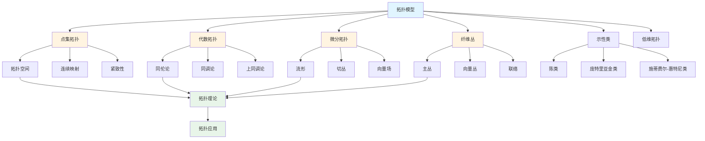
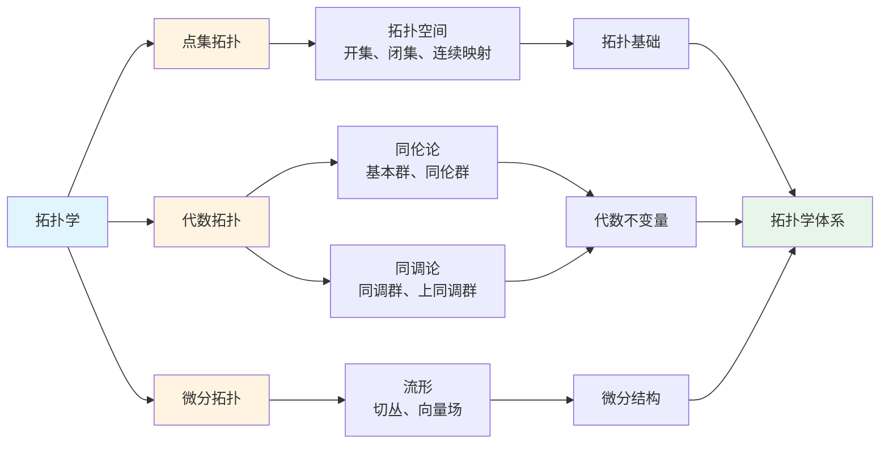

# 3.3 拓扑模型 / Topological Models

## 目录 / Table of Contents

- [3.3 拓扑模型 / Topological Models](#33-拓扑模型--topological-models)
  - [目录 / Table of Contents](#目录--table-of-contents)
  - [拓扑模型框架图 / Framework Diagram of Topological Models](#拓扑模型框架图--framework-diagram-of-topological-models)
  - [拓扑学分支关系图 / Relationship Diagram of Topology Branches](#拓扑学分支关系图--relationship-diagram-of-topology-branches)
  - [3.3.1 点集拓扑 / Point-Set Topology](#331-点集拓扑--point-set-topology)
    - [拓扑空间 / Topological Spaces](#拓扑空间--topological-spaces)
    - [连续映射 / Continuous Maps](#连续映射--continuous-maps)
    - [紧致性 / Compactness](#紧致性--compactness)
  - [3.3.2 代数拓扑 / Algebraic Topology](#332-代数拓扑--algebraic-topology)
    - [同伦论 / Homotopy Theory](#同伦论--homotopy-theory)
    - [同调论 / Homology Theory](#同调论--homology-theory)
    - [上同调论 / Cohomology Theory](#上同调论--cohomology-theory)
  - [3.3.3 微分拓扑 / Differential Topology](#333-微分拓扑--differential-topology)
    - [流形 / Manifolds](#流形--manifolds)
    - [切丛 / Tangent Bundles](#切丛--tangent-bundles)
    - [向量场 / Vector Fields](#向量场--vector-fields)
  - [3.3.4 纤维丛 / Fiber Bundles](#334-纤维丛--fiber-bundles)
    - [主丛 / Principal Bundles](#主丛--principal-bundles)
    - [向量丛 / Vector Bundles](#向量丛--vector-bundles)
    - [联络 / Connections](#联络--connections)
  - [3.3.5 示性类 / Characteristic Classes](#335-示性类--characteristic-classes)
    - [陈类 / Chern Classes](#陈类--chern-classes)
    - [庞特里亚金类 / Pontryagin Classes](#庞特里亚金类--pontryagin-classes)
    - [施蒂费尔-惠特尼类 / Stiefel-Whitney Classes](#施蒂费尔-惠特尼类--stiefel-whitney-classes)
  - [3.3.6 低维拓扑 / Low-Dimensional Topology](#336-低维拓扑--low-dimensional-topology)
    - [曲面 / Surfaces](#曲面--surfaces)
    - [三维流形 / 3-Manifolds](#三维流形--3-manifolds)
    - [纽结理论 / Knot Theory](#纽结理论--knot-theory)
  - [3.3.7 拓扑应用 / Topological Applications](#337-拓扑应用--topological-applications)
    - [拓扑数据分析 / Topological Data Analysis](#拓扑数据分析--topological-data-analysis)
    - [拓扑量子场论 / Topological Quantum Field Theory](#拓扑量子场论--topological-quantum-field-theory)
    - [拓扑绝缘体 / Topological Insulators](#拓扑绝缘体--topological-insulators)
  - [3.3.8 实现与应用 / Implementation and Applications](#338-实现与应用--implementation-and-applications)
    - [Rust实现示例 / Rust Implementation Example](#rust实现示例--rust-implementation-example)
    - [Haskell实现示例 / Haskell Implementation Example](#haskell实现示例--haskell-implementation-example)
    - [Python实现示例 / Python Implementation Example](#python实现示例--python-implementation-example)
    - [Julia实现示例 / Julia Implementation Example](#julia实现示例--julia-implementation-example)
  - [相关模型 / Related Models](#相关模型--related-models)
    - [数学科学模型 / Mathematical Science Models](#数学科学模型--mathematical-science-models)
    - [物理科学模型 / Physical Science Models](#物理科学模型--physical-science-models)
    - [基础理论 / Basic Theory](#基础理论--basic-theory)
  - [参考文献 / References](#参考文献--references)

---

## 拓扑模型框架图 / Framework Diagram of Topological Models



## 拓扑学分支关系图 / Relationship Diagram of Topology Branches



## 3.3.1 点集拓扑 / Point-Set Topology

### 拓扑空间 / Topological Spaces

**定义**: 拓扑空间 $(X, \tau)$ 包含：

- 集合 $X$
- 拓扑 $\tau$ (开集族)

**开集公理**:

1. $\emptyset, X \in \tau$
2. 有限交: $U_1, U_2 \in \tau \Rightarrow U_1 \cap U_2 \in \tau$
3. 任意并: $\{U_i\} \subset \tau \Rightarrow \bigcup U_i \in \tau$

**闭集**: $A$ 是闭集当且仅当 $X \setminus A$ 是开集。

### 连续映射 / Continuous Maps

**定义**: $f: X \to Y$ 连续当且仅当对任意开集 $V \subset Y$，$f^{-1}(V)$ 是开集。

**同胚**: 双射连续映射，其逆也连续。

**拓扑不变量**: 在同胚下保持的性质。

### 紧致性 / Compactness

**定义**: 空间 $X$ 紧致当且仅当每个开覆盖都有有限子覆盖。

**海涅-博雷尔定理**: $\mathbb{R}^n$ 的子集紧致当且仅当它是有界闭集。

**紧致性性质**:

- 紧致空间的连续像是紧致的
- 紧致空间在豪斯多夫空间中的像是闭的

---

## 3.3.2 代数拓扑 / Algebraic Topology

### 同伦论 / Homotopy Theory

**同伦**: 两个连续映射 $f, g: X \to Y$ 之间的连续变形。

**同伦等价**: 存在映射 $f: X \to Y$ 和 $g: Y \to X$ 使得 $f \circ g \simeq \text{id}_Y$，$g \circ f \simeq \text{id}_X$。

**基本群**: $\pi_1(X, x_0)$ 是点 $x_0$ 处的环路同伦类群。

**高阶同伦群**: $\pi_n(X, x_0)$ 是 $n$ 维球面到 $X$ 的映射同伦类群。

### 同调论 / Homology Theory

**奇异同调**: $H_n(X)$ 是 $n$ 维同调群。

**胞腔同调**: 基于胞腔分解的同调理论。

**同调序列**: 长正合序列
$$\cdots \to H_n(A) \to H_n(X) \to H_n(X,A) \to H_{n-1}(A) \to \cdots$$

### 上同调论 / Cohomology Theory

**奇异上同调**: $H^n(X; G)$ 是系数在 $G$ 中的上同调群。

**上同调环**: $H^*(X)$ 具有环结构。

**上同调运算**: 斯廷罗德运算等。

---

## 3.3.3 微分拓扑 / Differential Topology

### 流形 / Manifolds

**定义**: $n$ 维流形是局部同胚于 $\mathbb{R}^n$ 的豪斯多夫空间。

**坐标卡**: $(U, \phi)$ 其中 $U$ 是开集，$\phi: U \to \mathbb{R}^n$ 是同胚。

**光滑流形**: 坐标变换是光滑的。

**切空间**: $T_p M$ 是点 $p$ 处的切向量空间。

### 切丛 / Tangent Bundles

**切丛**: $TM = \bigcup_{p \in M} T_p M$

**切向量**: 满足莱布尼茨规则的线性算子。

**切空间基**: $\{\frac{\partial}{\partial x^i}\}$

**余切丛**: $T^*M$ 是切丛的对偶。

### 向量场 / Vector Fields

**定义**: 向量场是切丛的截面。

**李括号**: $[X, Y] = XY - YX$

**积分曲线**: 向量场的积分曲线满足 $\frac{dx}{dt} = X(x)$。

---

## 3.3.4 纤维丛 / Fiber Bundles

### 主丛 / Principal Bundles

**定义**: 主 $G$-丛 $(P, M, \pi, G)$ 包含：

- 全空间 $P$
- 底空间 $M$
- 投影 $\pi: P \to M$
- 结构群 $G$

**局部平凡化**: $(U, \phi)$ 其中 $\phi: \pi^{-1}(U) \to U \times G$。

**主丛上的联络**: 水平分布。

### 向量丛 / Vector Bundles

**定义**: 向量丛是纤维为向量空间的纤维丛。

**截面**: 向量丛的截面是底空间到全空间的映射。

**协变导数**: 向量丛上的联络。

### 联络 / Connections

**仿射联络**: 切丛上的联络。

**曲率**: $R(X, Y)Z = \nabla_X \nabla_Y Z - \nabla_Y \nabla_X Z - \nabla_{[X,Y]} Z$

**挠率**: $T(X, Y) = \nabla_X Y - \nabla_Y X - [X, Y]$

---

## 3.3.5 示性类 / Characteristic Classes

### 陈类 / Chern Classes

**陈类**: 复向量丛的示性类。

**陈-韦尔理论**: 陈类是曲率形式的闭形式的上同调类。

**陈数**: 陈类的积分。

### 庞特里亚金类 / Pontryagin Classes

**庞特里亚金类**: 实向量丛的示性类。

**庞特里亚金数**: 庞特里亚金类的积分。

### 施蒂费尔-惠特尼类 / Stiefel-Whitney Classes

**施蒂费尔-惠特尼类**: 实向量丛的 $\mathbb{Z}_2$ 示性类。

**施蒂费尔-惠特尼数**: 施蒂费尔-惠特尼类的积分。

---

## 3.3.6 低维拓扑 / Low-Dimensional Topology

### 曲面 / Surfaces

**分类定理**: 紧致连通曲面同胚于：

- 球面 $S^2$
- 环面 $T^2$
- 连通和 $\#_g T^2$

**亏格**: 曲面的"洞"的数量。

**欧拉示性数**: $\chi = 2 - 2g$。

### 三维流形 / 3-Manifolds

**素分解**: 每个三维流形可以分解为素流形的连通和。

**几何化猜想**: 每个三维流形都有几何结构。

**瑟斯顿几何**: 八种三维几何。

### 纽结理论 / Knot Theory

**纽结**: $S^1$ 到 $S^3$ 的嵌入。

**纽结不变量**: 琼斯多项式、亚历山大多项式等。

**纽结群**: 纽结的补集的基本群。

---

## 3.3.7 拓扑应用 / Topological Applications

### 拓扑数据分析 / Topological Data Analysis

**持续同调**: 研究数据集的拓扑特征。

**Morse理论**: 研究流形的拓扑与临界点。

**离散Morse理论**: 应用于组合对象。

### 拓扑量子场论 / Topological Quantum Field Theory

**Chern-Simons理论**: 三维拓扑量子场论。

**Donaldson理论**: 四维流形的拓扑不变量。

**Seiberg-Witten理论**: 四维流形的规范理论。

### 拓扑绝缘体 / Topological Insulators

**拓扑绝缘体**: 具有非平凡拓扑序的材料。

**量子霍尔效应**: 二维拓扑绝缘体。

**拓扑不变量**: 陈数、$Z_2$ 不变量等。

---

## 3.3.8 实现与应用 / Implementation and Applications

### Rust实现示例 / Rust Implementation Example

```rust
use std::collections::{HashSet, HashMap};

// 拓扑空间
pub struct TopologicalSpace {
    points: HashSet<i32>,
    open_sets: Vec<HashSet<i32>>,
}

impl TopologicalSpace {
    pub fn new(points: HashSet<i32>, open_sets: Vec<HashSet<i32>>) -> Self {
        TopologicalSpace { points, open_sets }
    }

    pub fn is_open(&self, set: &HashSet<i32>) -> bool {
        self.open_sets.contains(set)
    }

    pub fn is_closed(&self, set: &HashSet<i32>) -> bool {
        let complement: HashSet<i32> = self.points.difference(set).cloned().collect();
        self.is_open(&complement)
    }

    pub fn closure(&self, set: &HashSet<i32>) -> HashSet<i32> {
        // 简化实现：返回包含set的最小闭集
        let mut closure = set.clone();
        for open_set in &self.open_sets {
            if open_set.is_subset(&closure) {
                closure.extend(open_set);
            }
        }
        closure
    }

    pub fn interior(&self, set: &HashSet<i32>) -> HashSet<i32> {
        // 简化实现：返回set中包含的最大开集
        let mut interior = HashSet::new();
        for open_set in &self.open_sets {
            if open_set.is_subset(set) {
                interior.extend(open_set);
            }
        }
        interior
    }
}

// 单纯复形（用于同调计算）
pub struct SimplicialComplex {
    simplices: Vec<Vec<i32>>,
}

impl SimplicialComplex {
    pub fn new(simplices: Vec<Vec<i32>>) -> Self {
        SimplicialComplex { simplices }
    }

    pub fn euler_characteristic(&self) -> i32 {
        let mut chi = 0;
        for dim in 0..=self.max_dimension() {
            let count = self.count_simplices(dim);
            chi += if dim % 2 == 0 { count } else { -count };
        }
        chi
    }

    fn max_dimension(&self) -> usize {
        self.simplices.iter().map(|s| s.len()).max().unwrap_or(0) - 1
    }

    fn count_simplices(&self, dimension: usize) -> i32 {
        self.simplices
            .iter()
            .filter(|s| s.len() == dimension + 1)
            .count() as i32
    }
}

// 连续映射
pub struct ContinuousMap {
    domain: HashSet<i32>,
    codomain: HashSet<i32>,
    mapping: HashMap<i32, i32>,
}

impl ContinuousMap {
    pub fn new(domain: HashSet<i32>, codomain: HashSet<i32>, mapping: HashMap<i32, i32>) -> Self {
        ContinuousMap {
            domain,
            codomain,
            mapping,
        }
    }

    pub fn is_continuous(&self, space: &TopologicalSpace) -> bool {
        // 简化实现：检查开集的原像是开集
        for open_set in &space.open_sets {
            let preimage: HashSet<i32> = self.mapping
                .iter()
                .filter(|(_, &v)| open_set.contains(&v))
                .map(|(&k, _)| k)
                .collect();
            if !preimage.is_empty() && !space.is_open(&preimage) {
                return false;
            }
        }
        true
    }
}

#[cfg(test)]
mod tests {
    use super::*;

    #[test]
    fn test_topological_space() {
        let points: HashSet<i32> = [1, 2, 3].iter().cloned().collect();
        let open_sets = vec![
            HashSet::new(),
            points.clone(),
            [1].iter().cloned().collect(),
        ];
        let space = TopologicalSpace::new(points, open_sets);

        let set: HashSet<i32> = [1].iter().cloned().collect();
        assert!(space.is_open(&set));
    }

    #[test]
    fn test_simplicial_complex() {
        let simplices = vec![
            vec![0], vec![1], vec![2],  // 0-单形
            vec![0, 1], vec![1, 2], vec![0, 2],  // 1-单形
            vec![0, 1, 2],  // 2-单形
        ];
        let complex = SimplicialComplex::new(simplices);
        assert_eq!(complex.euler_characteristic(), 1); // 3 - 3 + 1 = 1
    }
}
```

### Haskell实现示例 / Haskell Implementation Example

```haskell
module Topology where

import Data.Set (Set)
import qualified Data.Set as Set
import Data.Map (Map)
import qualified Data.Map as Map

-- 拓扑空间
data TopologicalSpace = TopologicalSpace
    { points :: Set Int
    , openSets :: [Set Int]
    }

-- 检查是否为开集
isOpen :: TopologicalSpace -> Set Int -> Bool
isOpen space set = set `elem` openSets space

-- 检查是否为闭集
isClosed :: TopologicalSpace -> Set Int -> Bool
isClosed space set = isOpen space (Set.difference (points space) set)

-- 闭包
closure :: TopologicalSpace -> Set Int -> Set Int
closure space set = Set.unions [s | s <- openSets space, Set.isSubsetOf s set]

-- 内部
interior :: TopologicalSpace -> Set Int -> Set Int
interior space set = Set.unions [s | s <- openSets space, Set.isSubsetOf s set]

-- 单纯复形
data SimplicialComplex = SimplicialComplex
    { simplices :: [[Int]]
    }

-- 欧拉示性数
eulerCharacteristic :: SimplicialComplex -> Int
eulerCharacteristic complex = sum [(-1)^dim * countSimplices complex dim
                                  | dim <- [0..maxDimension complex]]

maxDimension :: SimplicialComplex -> Int
maxDimension complex = maximum (0 : map (subtract 1 . length) (simplices complex))

countSimplices :: SimplicialComplex -> Int -> Int
countSimplices complex dim = length [s | s <- simplices complex, length s == dim + 1]

-- 连续映射
data ContinuousMap = ContinuousMap
    { domain :: Set Int
    , codomain :: Set Int
    , mapping :: Map Int Int
    }

-- 检查连续性（简化实现）
isContinuous :: ContinuousMap -> TopologicalSpace -> Bool
isContinuous map space = all (isOpen space) preimages
    where
        preimages = [Set.fromList [k | (k, v) <- Map.toList (mapping map), v `Set.member` openSet]
                    | openSet <- openSets space]

-- 示例使用
example :: IO ()
example = do
    let points = Set.fromList [1, 2, 3]
    let openSets = [Set.empty, points, Set.singleton 1]
    let space = TopologicalSpace points openSets

    let set = Set.singleton 1
    print $ isOpen space set

    let simplices = [[0], [1], [2], [0, 1], [1, 2], [0, 2], [0, 1, 2]]
    let complex = SimplicialComplex simplices
    print $ eulerCharacteristic complex
```

### Python实现示例 / Python Implementation Example

```python
from typing import Set, List, Dict
from dataclasses import dataclass

@dataclass
class TopologicalSpace:
    """拓扑空间"""
    points: Set[int]
    open_sets: List[Set[int]]

    def is_open(self, set_: Set[int]) -> bool:
        """检查是否为开集"""
        return set_ in self.open_sets

    def is_closed(self, set_: Set[int]) -> bool:
        """检查是否为闭集"""
        complement = self.points - set_
        return self.is_open(complement)

    def closure(self, set_: Set[int]) -> Set[int]:
        """计算闭包"""
        closure_set = set(set_)
        for open_set in self.open_sets:
            if open_set.issubset(closure_set):
                closure_set.update(open_set)
        return closure_set

    def interior(self, set_: Set[int]) -> Set[int]:
        """计算内部"""
        interior_set = set()
        for open_set in self.open_sets:
            if open_set.issubset(set_):
                interior_set.update(open_set)
        return interior_set

@dataclass
class SimplicialComplex:
    """单纯复形"""
    simplices: List[List[int]]

    def euler_characteristic(self) -> int:
        """计算欧拉示性数"""
        chi = 0
        for dim in range(self.max_dimension() + 1):
            count = self.count_simplices(dim)
            chi += count if dim % 2 == 0 else -count
        return chi

    def max_dimension(self) -> int:
        """最大维数"""
        return max((len(s) - 1 for s in self.simplices), default=0)

    def count_simplices(self, dimension: int) -> int:
        """计算指定维数的单形数量"""
        return sum(1 for s in self.simplices if len(s) == dimension + 1)

@dataclass
class ContinuousMap:
    """连续映射"""
    domain: Set[int]
    codomain: Set[int]
    mapping: Dict[int, int]

    def is_continuous(self, space: TopologicalSpace) -> bool:
        """检查是否为连续映射"""
        for open_set in space.open_sets:
            preimage = {k for k, v in self.mapping.items() if v in open_set}
            if preimage and not space.is_open(preimage):
                return False
        return True

# 使用示例
if __name__ == "__main__":
    # 拓扑空间示例
    points = {1, 2, 3}
    open_sets = [set(), points, {1}]
    space = TopologicalSpace(points, open_sets)

    print(f"Is {{1}} open? {space.is_open({1})}")
    print(f"Is {{2, 3}} closed? {space.is_closed({2, 3})}")

    # 单纯复形示例
    simplices = [
        [0], [1], [2],  # 0-单形
        [0, 1], [1, 2], [0, 2],  # 1-单形
        [0, 1, 2],  # 2-单形
    ]
    complex = SimplicialComplex(simplices)
    print(f"Euler characteristic: {complex.euler_characteristic()}")
```

### Julia实现示例 / Julia Implementation Example

```julia
using DataStructures

# 拓扑空间结构
struct TopologicalSpace
    points::Set{Int}
    open_sets::Vector{Set{Int}}
end

# 检查是否为开集
function is_open(space::TopologicalSpace, set::Set{Int})::Bool
    return set in space.open_sets
end

# 检查是否为闭集
function is_closed(space::TopologicalSpace, set::Set{Int})::Bool
    complement = setdiff(space.points, set)
    return is_open(space, complement)
end

# 计算闭包
function closure(space::TopologicalSpace, set::Set{Int})::Set{Int}
    closure_set = copy(set)
    for open_set in space.open_sets
        if issubset(open_set, closure_set)
            union!(closure_set, open_set)
        end
    end
    return closure_set
end

# 计算内部
function interior(space::TopologicalSpace, set::Set{Int})::Set{Int}
    interior_set = Set{Int}()
    for open_set in space.open_sets
        if issubset(open_set, set)
            union!(interior_set, open_set)
        end
    end
    return interior_set
end

# 单纯复形结构
struct SimplicialComplex
    simplices::Vector{Vector{Int}}
end

# 计算欧拉示性数
function euler_characteristic(complex::SimplicialComplex)::Int
    chi = 0
    for dim in 0:max_dimension(complex)
        count = count_simplices(complex, dim)
        chi += dim % 2 == 0 ? count : -count
    end
    return chi
end

# 最大维数
function max_dimension(complex::SimplicialComplex)::Int
    return isempty(complex.simplices) ? 0 : maximum(length(s) - 1 for s in complex.simplices)
end

# 计算指定维数的单形数量
function count_simplices(complex::SimplicialComplex, dimension::Int)::Int
    return count(s -> length(s) == dimension + 1, complex.simplices)
end

# 连续映射结构
struct ContinuousMap
    domain::Set{Int}
    codomain::Set{Int}
    mapping::Dict{Int, Int}
end

# 检查连续性
function is_continuous(map::ContinuousMap, space::TopologicalSpace)::Bool
    for open_set in space.open_sets
        preimage = Set{Int}([k for (k, v) in map.mapping if v in open_set])
        if !isempty(preimage) && !is_open(space, preimage)
            return false
        end
    end
    return true
end

# 使用示例
points = Set([1, 2, 3])
open_sets = [Set{Int}(), points, Set([1])]
space = TopologicalSpace(points, open_sets)

println("Is {1} open? ", is_open(space, Set([1])))
println("Is {2, 3} closed? ", is_closed(space, Set([2, 3])))

simplices = [
    [0], [1], [2],  # 0-单形
    [0, 1], [1, 2], [0, 2],  # 1-单形
    [0, 1, 2],  # 2-单形
]
complex = SimplicialComplex(simplices)
println("Euler characteristic: ", euler_characteristic(complex))
```

---

## 相关模型 / Related Models

### 数学科学模型 / Mathematical Science Models

- [代数模型](../01-代数模型/README.md) - 同调代数，代数拓扑
- [几何模型](../02-几何模型/README.md) - 拓扑几何，同伦论和同调论

### 物理科学模型 / Physical Science Models

- [量子力学模型](../../02-物理科学模型/02-量子力学模型/README.md) - 拓扑量子场论，拓扑绝缘体
- [相对论模型](../../02-物理科学模型/03-相对论模型/README.md) - 流形在广义相对论中的应用
- [经典力学模型](../../02-物理科学模型/01-经典力学模型/README.md) - 相空间拓扑，辛几何

### 基础理论 / Basic Theory

- [模型分类学](../../01-基础理论/01-模型分类学/README.md) - 拓扑模型的分类
- [形式化方法论](../../01-基础理论/02-形式化方法论/README.md) - 拓扑的形式化方法
- [科学模型论](../../01-基础理论/03-科学模型论/README.md) - 拓扑作为科学模型的理论基础

## 参考文献 / References

1. Munkres, J. R. (2000). Topology. Prentice Hall.
2. Hatcher, A. (2002). Algebraic Topology. Cambridge University Press.
3. Milnor, J. W., & Stasheff, J. D. (1974). Characteristic Classes. Princeton University Press.
4. Guillemin, V., & Pollack, A. (2010). Differential Topology. AMS Chelsea Publishing.
5. Adams, J. F. (1974). Stable Homotopy and Generalised Homology. University of Chicago Press.

---

*最后更新: 2025-08-01*
*版本: 1.0.0*
