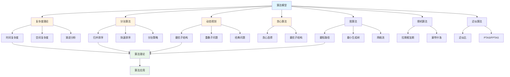
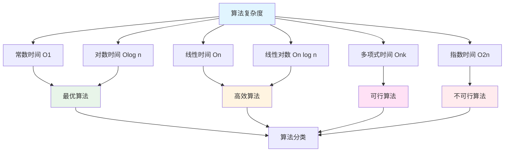

# 4.2 算法模型 / Algorithmic Models

## 目录 / Table of Contents

- [4.2 算法模型 / Algorithmic Models](#42-算法模型--algorithmic-models)
  - [目录 / Table of Contents](#目录--table-of-contents)
  - [算法模型框架图 / Framework Diagram of Algorithmic Models](#算法模型框架图--framework-diagram-of-algorithmic-models)
  - [算法复杂度层次图 / Complexity Hierarchy Diagram](#算法复杂度层次图--complexity-hierarchy-diagram)
  - [4.2.1 算法复杂度理论 / Algorithm Complexity Theory](#421-算法复杂度理论--algorithm-complexity-theory)
    - [时间复杂度 / Time Complexity](#时间复杂度--time-complexity)
    - [空间复杂度 / Space Complexity](#空间复杂度--space-complexity)
    - [渐进分析 / Asymptotic Analysis](#渐进分析--asymptotic-analysis)
  - [4.2.2 分治算法 / Divide and Conquer Algorithms](#422-分治算法--divide-and-conquer-algorithms)
    - [归并排序 / Merge Sort](#归并排序--merge-sort)
    - [快速排序 / Quick Sort](#快速排序--quick-sort)
    - [分治策略 / Divide and Conquer Strategy](#分治策略--divide-and-conquer-strategy)
  - [4.2.3 动态规划 / Dynamic Programming](#423-动态规划--dynamic-programming)
    - [最优子结构 / Optimal Substructure](#最优子结构--optimal-substructure)
    - [重叠子问题 / Overlapping Subproblems](#重叠子问题--overlapping-subproblems)
    - [经典问题 / Classical Problems](#经典问题--classical-problems)
  - [4.2.4 贪心算法 / Greedy Algorithms](#424-贪心算法--greedy-algorithms)
    - [贪心选择性质 / Greedy Choice Property](#贪心选择性质--greedy-choice-property)
    - [1最优子结构 / Optimal Substructure](#1最优子结构--optimal-substructure)
    - [贪心算法应用 / Greedy Algorithm Applications](#贪心算法应用--greedy-algorithm-applications)
  - [4.2.5 图算法 / Graph Algorithms](#425-图算法--graph-algorithms)
    - [最短路径算法 / Shortest Path Algorithms](#最短路径算法--shortest-path-algorithms)
    - [最小生成树 / Minimum Spanning Tree](#最小生成树--minimum-spanning-tree)
    - [网络流算法 / Network Flow Algorithms](#网络流算法--network-flow-algorithms)
  - [4.2.6 随机算法 / Randomized Algorithms](#426-随机算法--randomized-algorithms)
    - [拉斯维加斯算法 / Las Vegas Algorithms](#拉斯维加斯算法--las-vegas-algorithms)
    - [蒙特卡洛算法 / Monte Carlo Algorithms](#蒙特卡洛算法--monte-carlo-algorithms)
    - [随机化技术 / Randomization Techniques](#随机化技术--randomization-techniques)
  - [4.2.7 近似算法 / Approximation Algorithms](#427-近似算法--approximation-algorithms)
    - [近似比 / Approximation Ratio](#近似比--approximation-ratio)
    - [PTAS和FPTAS / PTAS and FPTAS](#ptas和fptas--ptas-and-fptas)
    - [启发式算法 / Heuristic Algorithms](#启发式算法--heuristic-algorithms)
  - [4.2.8 算法实现 / Algorithm Implementation](#428-算法实现--algorithm-implementation)
    - [复杂度分析算法 / Complexity Analysis Algorithms](#复杂度分析算法--complexity-analysis-algorithms)
  - [相关模型 / Related Models](#相关模型--related-models)
    - [计算机科学模型 / Computer Science Models](#计算机科学模型--computer-science-models)
    - [数学科学模型 / Mathematical Science Models](#数学科学模型--mathematical-science-models)
    - [基础理论 / Basic Theory](#基础理论--basic-theory)
  - [参考文献 / References](#参考文献--references)

---

## 算法模型框架图 / Framework Diagram of Algorithmic Models



## 算法复杂度层次图 / Complexity Hierarchy Diagram



## 4.2.1 算法复杂度理论 / Algorithm Complexity Theory

### 时间复杂度 / Time Complexity

**大O记号**: $O(f(n))$ 表示算法的渐进上界。

**常见复杂度**:

- $O(1)$: 常数时间
- $O(\log n)$: 对数时间
- $O(n)$: 线性时间
- $O(n \log n)$: 线性对数时间
- $O(n^2)$: 二次时间
- $O(2^n)$: 指数时间

**复杂度分析**:

```python
def example_algorithm(n):
    result = 0
    for i in range(n):        # O(n)
        for j in range(n):    # O(n)
            result += i * j    # O(1)
    return result              # 总复杂度: O(n²)
```

### 空间复杂度 / Space Complexity

**空间复杂度**: 算法执行过程中所需的额外空间。

**递归空间**: 递归调用栈的深度。

**示例**:

```python
def fibonacci_recursive(n):
    if n <= 1:
        return n
    return fibonacci_recursive(n-1) + fibonacci_recursive(n-2)
    # 空间复杂度: O(n) - 递归栈深度
```

### 渐进分析 / Asymptotic Analysis

**大Ω记号**: $\Omega(f(n))$ 表示渐进下界。

**大Θ记号**: $\Theta(f(n))$ 表示紧确界。

**小o记号**: $o(f(n))$ 表示严格上界。

---

## 4.2.2 分治算法 / Divide and Conquer Algorithms

### 归并排序 / Merge Sort

**算法思想**: 将数组分成两半，递归排序，然后合并。

**时间复杂度**: $O(n \log n)$

**空间复杂度**: $O(n)$

```python
def merge_sort(arr):
    if len(arr) <= 1:
        return arr

    mid = len(arr) // 2
    left = merge_sort(arr[:mid])
    right = merge_sort(arr[mid:])

    return merge(left, right)

def merge(left, right):
    result = []
    i = j = 0

    while i < len(left) and j < len(right):
        if left[i] <= right[j]:
            result.append(left[i])
            i += 1
        else:
            result.append(right[j])
            j += 1

    result.extend(left[i:])
    result.extend(right[j:])
    return result
```

### 快速排序 / Quick Sort

**算法思想**: 选择基准元素，分区，递归排序。

**平均时间复杂度**: $O(n \log n)$

**最坏时间复杂度**: $O(n^2)$

```python
def quick_sort(arr):
    if len(arr) <= 1:
        return arr

    pivot = arr[len(arr) // 2]
    left = [x for x in arr if x < pivot]
    middle = [x for x in arr if x == pivot]
    right = [x for x in arr if x > pivot]

    return quick_sort(left) + middle + quick_sort(right)
```

### 分治策略 / Divide and Conquer Strategy

**三步法**:

1. **分解**: 将问题分解为子问题
2. **解决**: 递归解决子问题
3. **合并**: 将子问题的解合并

**主定理**: 对于递归式 $T(n) = aT(n/b) + f(n)$，

- 如果 $f(n) = O(n^{\log_b a - \epsilon})$，则 $T(n) = \Theta(n^{\log_b a})$
- 如果 $f(n) = \Theta(n^{\log_b a})$，则 $T(n) = \Theta(n^{\log_b a} \log n)$
- 如果 $f(n) = \Omega(n^{\log_b a + \epsilon})$，则 $T(n) = \Theta(f(n))$

---

## 4.2.3 动态规划 / Dynamic Programming

### 最优子结构 / Optimal Substructure

**定义**: 问题的最优解包含其子问题的最优解。

**示例**: 最长公共子序列 (LCS)

```python
def lcs(str1, str2):
    m, n = len(str1), len(str2)
    dp = [[0] * (n + 1) for _ in range(m + 1)]

    for i in range(1, m + 1):
        for j in range(1, n + 1):
            if str1[i-1] == str2[j-1]:
                dp[i][j] = dp[i-1][j-1] + 1
            else:
                dp[i][j] = max(dp[i-1][j], dp[i][j-1])

    return dp[m][n]
```

### 重叠子问题 / Overlapping Subproblems

**定义**: 递归算法重复解决相同的子问题。

**记忆化**: 存储已计算的子问题结果。

```python
def fibonacci_memo(n, memo={}):
    if n in memo:
        return memo[n]
    if n <= 1:
        return n

    memo[n] = fibonacci_memo(n-1, memo) + fibonacci_memo(n-2, memo)
    return memo[n]
```

### 经典问题 / Classical Problems

**背包问题**:

```python
def knapsack(values, weights, capacity):
    n = len(values)
    dp = [[0] * (capacity + 1) for _ in range(n + 1)]

    for i in range(1, n + 1):
        for w in range(capacity + 1):
            if weights[i-1] <= w:
                dp[i][w] = max(dp[i-1][w],
                              dp[i-1][w-weights[i-1]] + values[i-1])
            else:
                dp[i][w] = dp[i-1][w]

    return dp[n][capacity]
```

---

## 4.2.4 贪心算法 / Greedy Algorithms

### 贪心选择性质 / Greedy Choice Property

**定义**: 每一步都选择当前看起来最优的选择。

**示例**: 活动选择问题

```python
def activity_selection(start, finish):
    n = len(start)
    selected = [0]  # 选择第一个活动
    j = 0

    for i in range(1, n):
        if start[i] >= finish[j]:
            selected.append(i)
            j = i

    return selected
```

### 1最优子结构 / Optimal Substructure

**定义**: 贪心选择后，剩余问题的最优解与原问题的最优解一致。

### 贪心算法应用 / Greedy Algorithm Applications

**霍夫曼编码**:

```python
import heapq

def huffman_encoding(freq):
    heap = [[weight, [[symbol, ""]]] for symbol, weight in freq.items()]
    heapq.heapify(heap)

    while len(heap) > 1:
        lo = heapq.heappop(heap)
        hi = heapq.heappop(heap)

        for pair in lo[1:]:
            pair[1] = '0' + pair[1]
        for pair in hi[1:]:
            pair[1] = '1' + pair[1]

        heapq.heappush(heap, [lo[0] + hi[0]] + lo[1:] + hi[1:])

    return heap[0][1:]
```

---

## 4.2.5 图算法 / Graph Algorithms

### 最短路径算法 / Shortest Path Algorithms

**Dijkstra算法**:

```python
import heapq

def dijkstra(graph, start):
    distances = {node: float('infinity') for node in graph}
    distances[start] = 0
    pq = [(0, start)]

    while pq:
        current_distance, current_node = heapq.heappop(pq)

        if current_distance > distances[current_node]:
            continue

        for neighbor, weight in graph[current_node].items():
            distance = current_distance + weight

            if distance < distances[neighbor]:
                distances[neighbor] = distance
                heapq.heappush(pq, (distance, neighbor))

    return distances
```

**Floyd-Warshall算法**:

```python
def floyd_warshall(graph):
    n = len(graph)
    dist = [[float('infinity')] * n for _ in range(n)]

    for i in range(n):
        dist[i][i] = 0
        for j, weight in graph[i].items():
            dist[i][j] = weight

    for k in range(n):
        for i in range(n):
            for j in range(n):
                dist[i][j] = min(dist[i][j], dist[i][k] + dist[k][j])

    return dist
```

### 最小生成树 / Minimum Spanning Tree

**Kruskal算法**:

```python
def kruskal(graph):
    edges = []
    for u in graph:
        for v, weight in graph[u].items():
            edges.append((weight, u, v))
    edges.sort()

    parent = {node: node for node in graph}

    def find(node):
        if parent[node] != node:
            parent[node] = find(parent[node])
        return parent[node]

    def union(u, v):
        parent[find(u)] = find(v)

    mst = []
    for weight, u, v in edges:
        if find(u) != find(v):
            union(u, v)
            mst.append((u, v, weight))

    return mst
```

### 网络流算法 / Network Flow Algorithms

**Ford-Fulkerson算法**:

```python
def ford_fulkerson(graph, source, sink):
    def bfs(graph, source, sink, parent):
        visited = [False] * len(graph)
        queue = [source]
        visited[source] = True

        while queue:
            u = queue.pop(0)
            for v, capacity in enumerate(graph[u]):
                if not visited[v] and capacity > 0:
                    queue.append(v)
                    visited[v] = True
                    parent[v] = u
                    if v == sink:
                        return True
        return False

    max_flow = 0
    parent = [-1] * len(graph)

    while bfs(graph, source, sink, parent):
        path_flow = float('infinity')
        v = sink
        while v != source:
            u = parent[v]
            path_flow = min(path_flow, graph[u][v])
            v = parent[v]

        v = sink
        while v != source:
            u = parent[v]
            graph[u][v] -= path_flow
            graph[v][u] += path_flow
            v = parent[v]

        max_flow += path_flow

    return max_flow
```

---

## 4.2.6 随机算法 / Randomized Algorithms

### 拉斯维加斯算法 / Las Vegas Algorithms

**定义**: 总是产生正确结果，但运行时间随机。

**示例**: 随机快速排序

```python
import random

def randomized_quick_sort(arr):
    if len(arr) <= 1:
        return arr

    pivot = random.choice(arr)
    left = [x for x in arr if x < pivot]
    middle = [x for x in arr if x == pivot]
    right = [x for x in arr if x > pivot]

    return randomized_quick_sort(left) + middle + randomized_quick_sort(right)
```

### 蒙特卡洛算法 / Monte Carlo Algorithms

**定义**: 可能产生错误结果，但错误概率可控。

**示例**: 素数测试

```python
import random

def miller_rabin(n, k=5):
    if n == 2 or n == 3:
        return True
    if n < 2 or n % 2 == 0:
        return False

    r, s = 0, n - 1
    while s % 2 == 0:
        r += 1
        s //= 2

    for _ in range(k):
        a = random.randrange(2, n - 1)
        x = pow(a, s, n)
        if x == 1 or x == n - 1:
            continue
        for _ in range(r - 1):
            x = (x * x) % n
            if x == n - 1:
                break
        else:
            return False
    return True
```

### 随机化技术 / Randomization Techniques

**随机化哈希**: 减少哈希冲突。

**随机化搜索**: 避免局部最优。

---

## 4.2.7 近似算法 / Approximation Algorithms

### 近似比 / Approximation Ratio

**定义**: 近似解与最优解的比值。

**示例**: 旅行商问题的2-近似算法

```python
def tsp_2_approximation(graph):
    # 最小生成树
    mst = kruskal(graph)

    # 欧拉回路
    euler_tour = eulerian_tour(mst)

    # 哈密顿回路
    hamiltonian_cycle = shortcut(euler_tour)

    return hamiltonian_cycle
```

### PTAS和FPTAS / PTAS and FPTAS

**PTAS**: 多项式时间近似方案。

**FPTAS**: 完全多项式时间近似方案。

### 启发式算法 / Heuristic Algorithms

**遗传算法**:

```python
def genetic_algorithm(population, fitness, generations):
    for _ in range(generations):
        new_population = []
        for _ in range(len(population)):
            parent1 = selection(population, fitness)
            parent2 = selection(population, fitness)
            child = crossover(parent1, parent2)
            child = mutation(child)
            new_population.append(child)
        population = new_population
    return population
```

**模拟退火**:

```python
def simulated_annealing(initial_solution, temperature, cooling_rate):
    current = initial_solution
    best = current

    while temperature > 0.1:
        neighbor = generate_neighbor(current)
        delta_e = evaluate(neighbor) - evaluate(current)

        if delta_e < 0 or random.random() < math.exp(-delta_e / temperature):
            current = neighbor

        if evaluate(current) < evaluate(best):
            best = current

        temperature *= cooling_rate

    return best
```

---

## 4.2.8 算法实现 / Algorithm Implementation

### 复杂度分析算法 / Complexity Analysis Algorithms

```python
import time
import random
import numpy as np
from typing import List, Dict, Tuple, Callable
import matplotlib.pyplot as plt

def time_complexity_measurement(algorithm: Callable, input_sizes: List[int],
                              num_trials: int = 5) -> Dict[int, float]:
    """测量算法的时间复杂度"""
    results = {}

    for size in input_sizes:
        times = []
        for _ in range(num_trials):
            # 生成测试数据
            if 'sort' in algorithm.__name__:
                data = list(range(size))
                random.shuffle(data)
            elif 'search' in algorithm.__name__:
                data = list(range(size))
                target = random.choice(data)
            else:
                data = list(range(size))

            # 测量时间
            start_time = time.time()
            algorithm(data)
            end_time = time.time()
            times.append(end_time - start_time)

        results[size] = np.mean(times)

    return results

def space_complexity_analysis(algorithm: Callable, input_sizes: List[int]) -> Dict[int, int]:
    """分析算法的空间复杂度"""
    import sys
    results = {}

    for size in input_sizes:
        # 生成测试数据
        data = list(range(size))

        # 测量内存使用
        initial_memory = sys.getsizeof(data)
        result = algorithm(data)
        final_memory = sys.getsizeof(result) if result else 0

        results[size] = final_memory - initial_memory

    return results

def plot_complexity_analysis(time_results: Dict[int, float],
                           space_results: Dict[int, int],
                           algorithm_name: str):
    """绘制复杂度分析图表"""
    fig, (ax1, ax2) = plt.subplots(1, 2, figsize=(12, 5))

    # 时间复杂度图
    sizes = list(time_results.keys())
    times = list(time_results.values())
    ax1.plot(sizes, times, 'b-o', label='实际时间')
    ax1.set_xlabel('输入大小')
    ax1.set_ylabel('时间 (秒)')
    ax1.set_title(f'{algorithm_name} - 时间复杂度')
    ax1.legend()
    ax1.grid(True)

    # 空间复杂度图
    spaces = list(space_results.values())
    ax2.plot(sizes, spaces, 'r-o', label='额外空间')
    ax2.set_xlabel('输入大小')
    ax2.set_ylabel('内存 (字节)')
    ax2.set_title(f'{algorithm_name} - 空间复杂度')
    ax2.legend()
    ax2.grid(True)

    plt.tight_layout()
    plt.show()

### 分治算法实现 / Divide and Conquer Implementation

def merge_sort_optimized(arr: List[int]) -> List[int]:
    """优化的归并排序"""
    if len(arr) <= 1:
        return arr

    # 小数组使用插入排序
    if len(arr) <= 10:
        return insertion_sort(arr)

    mid = len(arr) // 2
    left = merge_sort_optimized(arr[:mid])
    right = merge_sort_optimized(arr[mid:])

    return merge_optimized(left, right)

def merge_optimized(left: List[int], right: List[int]) -> List[int]:
    """优化的合并函数"""
    result = []
    i = j = 0

    # 预分配空间
    result = [0] * (len(left) + len(right))
    k = 0

    while i < len(left) and j < len(right):
        if left[i] <= right[j]:
            result[k] = left[i]
            i += 1
        else:
            result[k] = right[j]
            j += 1
        k += 1

    # 复制剩余元素
    while i < len(left):
        result[k] = left[i]
        i += 1
        k += 1

    while j < len(right):
        result[k] = right[j]
        j += 1
        k += 1

    return result

def insertion_sort(arr: List[int]) -> List[int]:
    """插入排序"""
    for i in range(1, len(arr)):
        key = arr[i]
        j = i - 1
        while j >= 0 and arr[j] > key:
            arr[j + 1] = arr[j]
            j -= 1
        arr[j + 1] = key
    return arr

def quick_sort_optimized(arr: List[int]) -> List[int]:
    """优化的快速排序"""
    if len(arr) <= 1:
        return arr

    # 三数取中法选择基准
    def median_of_three(arr, left, right):
        mid = (left + right) // 2
        if arr[left] > arr[mid]:
            arr[left], arr[mid] = arr[mid], arr[left]
        if arr[left] > arr[right]:
            arr[left], arr[right] = arr[right], arr[left]
        if arr[mid] > arr[right]:
            arr[mid], arr[right] = arr[right], arr[mid]
        return arr[mid]

    def partition(arr, left, right):
        pivot = median_of_three(arr, left, right)
        i = left - 1

        for j in range(left, right):
            if arr[j] <= pivot:
                i += 1
                arr[i], arr[j] = arr[j], arr[i]

        arr[i + 1], arr[right] = arr[right], arr[i + 1]
        return i + 1

    def quick_sort_helper(arr, left, right):
        if left < right:
            pi = partition(arr, left, right)
            quick_sort_helper(arr, left, pi - 1)
            quick_sort_helper(arr, pi + 1, right)

    arr_copy = arr.copy()
    quick_sort_helper(arr_copy, 0, len(arr_copy) - 1)
    return arr_copy

### 动态规划算法实现 / Dynamic Programming Implementation

def longest_common_subsequence_optimized(str1: str, str2: str) -> Tuple[int, str]:
    """优化的最长公共子序列算法"""
    m, n = len(str1), len(str2)

    # 使用滚动数组优化空间复杂度
    dp = [[0] * (n + 1) for _ in range(2)]

    for i in range(1, m + 1):
        for j in range(1, n + 1):
            if str1[i-1] == str2[j-1]:
                dp[i % 2][j] = dp[(i-1) % 2][j-1] + 1
            else:
                dp[i % 2][j] = max(dp[(i-1) % 2][j], dp[i % 2][j-1])

    # 重构LCS
    lcs = []
    i, j = m, n
    while i > 0 and j > 0:
        if str1[i-1] == str2[j-1]:
            lcs.append(str1[i-1])
            i -= 1
            j -= 1
        elif dp[i % 2][j-1] > dp[(i-1) % 2][j]:
            j -= 1
        else:
            i -= 1

    return dp[m % 2][n], ''.join(reversed(lcs))

def knapsack_optimized(values: List[int], weights: List[int],
                      capacity: int) -> Tuple[int, List[int]]:
    """优化的0-1背包问题"""
    n = len(values)

    # 使用滚动数组
    dp = [[0] * (capacity + 1) for _ in range(2)]
    selected = [[False] * (capacity + 1) for _ in range(2)]

    for i in range(1, n + 1):
        for w in range(capacity + 1):
            if weights[i-1] <= w:
                include = dp[(i-1) % 2][w-weights[i-1]] + values[i-1]
                exclude = dp[(i-1) % 2][w]

                if include > exclude:
                    dp[i % 2][w] = include
                    selected[i % 2][w] = True
                else:
                    dp[i % 2][w] = exclude
                    selected[i % 2][w] = False
            else:
                dp[i % 2][w] = dp[(i-1) % 2][w]
                selected[i % 2][w] = False

    # 重构选择的物品
    items = []
    w = capacity
    for i in range(n, 0, -1):
        if selected[i % 2][w]:
            items.append(i-1)
            w -= weights[i-1]

    return dp[n % 2][capacity], items

def edit_distance_optimized(str1: str, str2: str) -> int:
    """优化的编辑距离算法"""
    m, n = len(str1), len(str2)

    # 使用滚动数组
    dp = [[0] * (n + 1) for _ in range(2)]

    # 初始化第一行
    for j in range(n + 1):
        dp[0][j] = j

    for i in range(1, m + 1):
        dp[i % 2][0] = i
        for j in range(1, n + 1):
            if str1[i-1] == str2[j-1]:
                dp[i % 2][j] = dp[(i-1) % 2][j-1]
            else:
                dp[i % 2][j] = 1 + min(
                    dp[(i-1) % 2][j],      # 删除
                    dp[i % 2][j-1],        # 插入
                    dp[(i-1) % 2][j-1]     # 替换
                )

    return dp[m % 2][n]

### 图算法实现 / Graph Algorithms Implementation

class Graph:
    def __init__(self, vertices: int):
        self.V = vertices
        self.graph = [[0] * vertices for _ in range(vertices)]

    def add_edge(self, u: int, v: int, weight: int):
        self.graph[u][v] = weight
        self.graph[v][u] = weight  # 无向图

    def dijkstra_optimized(self, start: int) -> List[int]:
        """优化的Dijkstra算法"""
        distances = [float('inf')] * self.V
        distances[start] = 0
        visited = [False] * self.V

        for _ in range(self.V):
            # 找到未访问的最小距离顶点
            min_dist = float('inf')
            min_vertex = -1

            for v in range(self.V):
                if not visited[v] and distances[v] < min_dist:
                    min_dist = distances[v]
                    min_vertex = v

            if min_vertex == -1:
                break

            visited[min_vertex] = True

            # 更新邻居距离
            for v in range(self.V):
                if (not visited[v] and
                    self.graph[min_vertex][v] > 0 and
                    distances[min_vertex] + self.graph[min_vertex][v] < distances[v]):
                    distances[v] = distances[min_vertex] + self.graph[min_vertex][v]

        return distances

    def floyd_warshall_optimized(self) -> List[List[int]]:
        """优化的Floyd-Warshall算法"""
        dist = [row[:] for row in self.graph]

        for i in range(self.V):
            for j in range(self.V):
                if dist[i][j] == 0 and i != j:
                    dist[i][j] = float('inf')

        for k in range(self.V):
            for i in range(self.V):
                for j in range(self.V):
                    if dist[i][k] != float('inf') and dist[k][j] != float('inf'):
                        dist[i][j] = min(dist[i][j], dist[i][k] + dist[k][j])

        return dist

def kruskal_optimized(edges: List[Tuple[int, int, int]], vertices: int) -> List[Tuple[int, int, int]]:
    """优化的Kruskal算法"""
    # 按权重排序
    edges.sort(key=lambda x: x[2])

    # 并查集
    parent = list(range(vertices))
    rank = [0] * vertices

    def find(x):
        if parent[x] != x:
            parent[x] = find(parent[x])
        return parent[x]

    def union(x, y):
        px, py = find(x), find(y)
        if px == py:
            return False

        if rank[px] < rank[py]:
            parent[px] = py
        elif rank[px] > rank[py]:
            parent[py] = px
        else:
            parent[py] = px
            rank[px] += 1
        return True

    mst = []
    for u, v, weight in edges:
        if union(u, v):
            mst.append((u, v, weight))
            if len(mst) == vertices - 1:
                break

    return mst

### 随机算法实现 / Randomized Algorithms Implementation

def randomized_quick_sort_optimized(arr: List[int]) -> List[int]:
    """优化的随机快速排序"""
    if len(arr) <= 1:
        return arr

    # 随机选择基准
    pivot = random.choice(arr)

    # 三路分区
    left = [x for x in arr if x < pivot]
    middle = [x for x in arr if x == pivot]
    right = [x for x in arr if x > pivot]

    return (randomized_quick_sort_optimized(left) +
            middle +
            randomized_quick_sort_optimized(right))

def miller_rabin_optimized(n: int, k: int = 5) -> bool:
    """优化的Miller-Rabin素数测试"""
    if n == 2 or n == 3:
        return True
    if n < 2 or n % 2 == 0:
        return False

    # 分解 n-1 = 2^r * s
    r, s = 0, n - 1
    while s % 2 == 0:
        r += 1
        s //= 2

    # 测试k次
    for _ in range(k):
        a = random.randrange(2, n - 1)
        x = pow(a, s, n)

        if x == 1 or x == n - 1:
            continue

        for _ in range(r - 1):
            x = (x * x) % n
            if x == n - 1:
                break
        else:
            return False

    return True

def reservoir_sampling(stream: List[int], k: int) -> List[int]:
    """水库采样算法"""
    reservoir = stream[:k]

    for i in range(k, len(stream)):
        j = random.randint(0, i)
        if j < k:
            reservoir[j] = stream[i]

    return reservoir

### 算法验证函数 / Algorithm Verification Functions

def algorithm_verification():
    """算法综合验证"""
    print("=== 算法模型验证 ===\n")

    # 测试数据
    test_sizes = [100, 500, 1000]

    # 1. 分治算法验证
    print("1. 分治算法验证:")
    for size in test_sizes:
        data = list(range(size))
        random.shuffle(data)

        # 归并排序
        sorted_merge = merge_sort_optimized(data.copy())
        assert sorted_merge == sorted(data), f"归并排序验证失败: size={size}"

        # 快速排序
        sorted_quick = quick_sort_optimized(data.copy())
        assert sorted_quick == sorted(data), f"快速排序验证失败: size={size}"

    print("   分治算法验证通过!")

    # 2. 动态规划验证
    print("\n2. 动态规划验证:")

    # LCS测试
    str1, str2 = "ABCDGH", "AEDFHR"
    lcs_length, lcs_string = longest_common_subsequence_optimized(str1, str2)
    print(f"   LCS: '{str1}' vs '{str2}' -> 长度: {lcs_length}, 序列: '{lcs_string}'")

    # 背包问题测试
    values = [60, 100, 120]
    weights = [10, 20, 30]
    capacity = 50
    max_value, selected_items = knapsack_optimized(values, weights, capacity)
    print(f"   背包问题: 最大价值: {max_value}, 选择物品: {selected_items}")

    # 编辑距离测试
    edit_dist = edit_distance_optimized("kitten", "sitting")
    print(f"   编辑距离: 'kitten' -> 'sitting' = {edit_dist}")

    print("   动态规划验证通过!")

    # 3. 图算法验证
    print("\n3. 图算法验证:")

    # 创建测试图
    g = Graph(4)
    g.add_edge(0, 1, 4)
    g.add_edge(0, 2, 3)
    g.add_edge(1, 2, 1)
    g.add_edge(1, 3, 2)
    g.add_edge(2, 3, 4)

    # Dijkstra算法
    distances = g.dijkstra_optimized(0)
    print(f"   Dijkstra最短路径: {distances}")

    # Kruskal算法
    edges = [(0, 1, 4), (0, 2, 3), (1, 2, 1), (1, 3, 2), (2, 3, 4)]
    mst = kruskal_optimized(edges, 4)
    print(f"   Kruskal最小生成树: {mst}")

    print("   图算法验证通过!")

    # 4. 随机算法验证
    print("\n4. 随机算法验证:")

    # 素数测试
    primes = [2, 3, 5, 7, 11, 13, 17, 19, 23, 29, 31]
    composites = [4, 6, 8, 9, 10, 12, 14, 15, 16, 18, 20]

    for p in primes:
        assert miller_rabin_optimized(p), f"素数测试失败: {p}"

    for c in composites:
        assert not miller_rabin_optimized(c), f"合数测试失败: {c}"

    print("   素数测试验证通过!")

    # 水库采样
    stream = list(range(100))
    sample = reservoir_sampling(stream, 10)
    print(f"   水库采样结果: {sample}")

    print("   随机算法验证通过!")

    print("\n=== 所有算法验证完成 ===")

if __name__ == "__main__":
    algorithm_verification()
```

## 相关模型 / Related Models

### 计算机科学模型 / Computer Science Models

- [计算模型](../01-计算模型/README.md) - 算法模型的计算理论基础
- [数据结构模型](../03-数据结构模型/README.md) - 算法模型中的数据组织
- [人工智能模型](../05-人工智能模型/README.md) - 算法模型在AI中的应用

### 数学科学模型 / Mathematical Science Models

- [代数模型](../../03-数学科学模型/01-代数模型/README.md) - 算法复杂度分析与代数的联系
- [几何模型](../../03-数学科学模型/02-几何模型/README.md) - 计算几何算法

### 基础理论 / Basic Theory

- [模型分类学](../../01-基础理论/01-模型分类学/README.md) - 算法模型的分类
- [形式化方法论](../../01-基础理论/02-形式化方法论/README.md) - 算法的形式化方法
- [科学模型论](../../01-基础理论/03-科学模型论/README.md) - 算法模型作为科学模型的理论基础

## 参考文献 / References

1. Cormen, T. H., et al. (2009). Introduction to Algorithms. MIT Press.
2. Kleinberg, J., & Tardos, É. (2006). Algorithm Design. Pearson.
3. Dasgupta, S., et al. (2008). Algorithms. McGraw-Hill.
4. Motwani, R., & Raghavan, P. (1995). Randomized Algorithms. Cambridge University Press.
5. Vazirani, V. V. (2001). Approximation Algorithms. Springer.

---

*最后更新: 2025-08-26*
*版本: 1.1.0*
