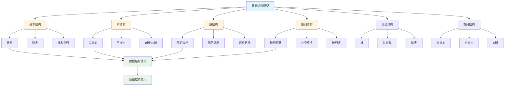
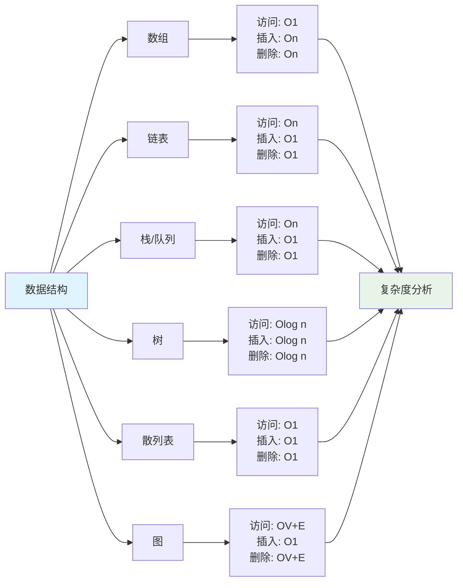

# 4.3 数据结构模型 / Data Structure Models

## 目录 / Table of Contents

- [4.3 数据结构模型 / Data Structure Models](#43-数据结构模型--data-structure-models)
  - [目录 / Table of Contents](#目录--table-of-contents)
  - [数据结构模型框架图 / Framework Diagram of Data Structure Models](#数据结构模型框架图--framework-diagram-of-data-structure-models)
  - [数据结构复杂度对比图 / Complexity Comparison Diagram](#数据结构复杂度对比图--complexity-comparison-diagram)
  - [4.3.1 基本数据结构 / Basic Data Structures](#431-基本数据结构--basic-data-structures)
    - [数组 / Arrays](#数组--arrays)
    - [链表 / Linked Lists](#链表--linked-lists)
    - [栈和队列 / Stacks and Queues](#栈和队列--stacks-and-queues)
  - [4.3.2 树结构 / Tree Structures](#432-树结构--tree-structures)
    - [二叉树 / Binary Trees](#二叉树--binary-trees)
    - [平衡树 / Balanced Trees](#平衡树--balanced-trees)
    - [B树和B+树 / B-Trees and B+ Trees](#b树和b树--b-trees-and-b-trees)
  - [4.3.3 图结构 / Graph Structures](#433-图结构--graph-structures)
    - [图的表示 / Graph Representation](#图的表示--graph-representation)
    - [图的遍历 / Graph Traversal](#图的遍历--graph-traversal)
    - [最短路径 / Shortest Paths](#最短路径--shortest-paths)
  - [4.3.4 散列结构 / Hash Structures](#434-散列结构--hash-structures)
    - [散列函数 / Hash Functions](#散列函数--hash-functions)
    - [冲突解决 / Collision Resolution](#冲突解决--collision-resolution)
    - [散列表 / Hash Tables](#散列表--hash-tables)
  - [4.3.5 高级数据结构 / Advanced Data Structures](#435-高级数据结构--advanced-data-structures)
    - [堆 / Heaps](#堆--heaps)
    - [并查集 / Union-Find](#并查集--union-find)
    - [跳表 / Skip Lists](#跳表--skip-lists)
  - [4.3.6 空间数据结构 / Spatial Data Structures](#436-空间数据结构--spatial-data-structures)
    - [四叉树 / Quadtrees](#四叉树--quadtrees)
    - [八叉树 / Octrees](#八叉树--octrees)
    - [R树 / R-Trees](#r树--r-trees)
  - [4.3.7 数据结构应用 / Data Structure Applications](#437-数据结构应用--data-structure-applications)
    - [数据库索引 / Database Indexing](#数据库索引--database-indexing)
    - [缓存系统 / Cache Systems](#缓存系统--cache-systems)
    - [内存管理 / Memory Management](#内存管理--memory-management)
  - [4.3.8 算法实现 / Algorithm Implementation](#438-算法实现--algorithm-implementation)
    - [基本数据结构算法 / Basic Data Structure Algorithms](#基本数据结构算法--basic-data-structure-algorithms)
  - [4.3.9 实现与应用 / Implementation and Applications](#439-实现与应用--implementation-and-applications)
    - [Rust实现示例 / Rust Implementation Example](#rust实现示例--rust-implementation-example)
    - [Haskell实现示例 / Haskell Implementation Example](#haskell实现示例--haskell-implementation-example)
    - [Python实现示例 / Python Implementation Example](#python实现示例--python-implementation-example)
    - [Julia实现示例 / Julia Implementation Example](#julia实现示例--julia-implementation-example)
  - [相关模型 / Related Models](#相关模型--related-models)
    - [计算机科学模型 / Computer Science Models](#计算机科学模型--computer-science-models)
    - [数学科学模型 / Mathematical Science Models](#数学科学模型--mathematical-science-models)
    - [基础理论 / Basic Theory](#基础理论--basic-theory)
  - [参考文献 / References](#参考文献--references)

---

## 数据结构模型框架图 / Framework Diagram of Data Structure Models



## 数据结构复杂度对比图 / Complexity Comparison Diagram



## 4.3.1 基本数据结构 / Basic Data Structures

### 数组 / Arrays

**定义**: 连续内存空间存储的相同类型元素集合。

**操作复杂度**:

- 访问: $O(1)$
- 插入/删除: $O(n)$
- 搜索: $O(n)$

**动态数组**: 自动扩容的数组实现。

```python
class DynamicArray:
    def __init__(self):
        self.capacity = 1
        self.size = 0
        self.array = [None] * self.capacity

    def append(self, item):
        if self.size == self.capacity:
            self._resize(2 * self.capacity)
        self.array[self.size] = item
        self.size += 1

    def _resize(self, new_capacity):
        new_array = [None] * new_capacity
        for i in range(self.size):
            new_array[i] = self.array[i]
        self.array = new_array
        self.capacity = new_capacity
```

### 链表 / Linked Lists

**单链表**: 每个节点包含数据和指向下一个节点的指针。

**双链表**: 每个节点包含指向前后节点的指针。

**操作复杂度**:

- 插入/删除: $O(1)$ (给定位置)
- 搜索: $O(n)$
- 访问: $O(n)$

```python
class Node:
    def __init__(self, data):
        self.data = data
        self.next = None

class LinkedList:
    def __init__(self):
        self.head = None

    def insert_at_beginning(self, data):
        new_node = Node(data)
        new_node.next = self.head
        self.head = new_node

    def delete_node(self, key):
        temp = self.head
        if temp and temp.data == key:
            self.head = temp.next
            return

        while temp and temp.next:
            if temp.next.data == key:
                temp.next = temp.next.next
                return
            temp = temp.next
```

### 栈和队列 / Stacks and Queues

**栈 (LIFO)**:

```python
class Stack:
    def __init__(self):
        self.items = []

    def push(self, item):
        self.items.append(item)

    def pop(self):
        if not self.is_empty():
            return self.items.pop()

    def peek(self):
        return self.items[-1] if self.items else None

    def is_empty(self):
        return len(self.items) == 0
```

**队列 (FIFO)**:

```python
from collections import deque

class Queue:
    def __init__(self):
        self.items = deque()

    def enqueue(self, item):
        self.items.append(item)

    def dequeue(self):
        return self.items.popleft() if self.items else None

    def front(self):
        return self.items[0] if self.items else None
```

---

## 4.3.2 树结构 / Tree Structures

### 二叉树 / Binary Trees

**定义**: 每个节点最多有两个子节点的树。

**遍历方式**:

- 前序遍历: 根-左-右
- 中序遍历: 左-根-右
- 后序遍历: 左-右-根
- 层序遍历: 按层访问

```python
class TreeNode:
    def __init__(self, val=0):
        self.val = val
        self.left = None
        self.right = None

class BinaryTree:
    def __init__(self):
        self.root = None

    def inorder_traversal(self, node):
        if node:
            self.inorder_traversal(node.left)
            print(node.val, end=" ")
            self.inorder_traversal(node.right)

    def preorder_traversal(self, node):
        if node:
            print(node.val, end=" ")
            self.preorder_traversal(node.left)
            self.preorder_traversal(node.right)

    def postorder_traversal(self, node):
        if node:
            self.postorder_traversal(node.left)
            self.postorder_traversal(node.right)
            print(node.val, end=" ")
```

### 平衡树 / Balanced Trees

**AVL树**: 自平衡二叉搜索树，左右子树高度差不超过1。

**红黑树**: 自平衡二叉搜索树，满足红黑性质。

**操作复杂度**: 插入、删除、搜索均为 $O(\log n)$。

```python
class AVLNode:
    def __init__(self, key):
        self.key = key
        self.left = None
        self.right = None
        self.height = 1

class AVLTree:
    def get_height(self, node):
        if not node:
            return 0
        return node.height

    def get_balance(self, node):
        if not node:
            return 0
        return self.get_height(node.left) - self.get_height(node.right)

    def right_rotate(self, y):
        x = y.left
        T2 = x.right

        x.right = y
        y.left = T2

        y.height = max(self.get_height(y.left), self.get_height(y.right)) + 1
        x.height = max(self.get_height(x.left), self.get_height(x.right)) + 1

        return x
```

### B树和B+树 / B-Trees and B+ Trees

**B树**: 多路平衡搜索树，用于磁盘存储。

**B+树**: B树的变种，所有数据都在叶子节点。

**特点**: 减少磁盘I/O次数。

---

## 4.3.3 图结构 / Graph Structures

### 图的表示 / Graph Representation

**邻接矩阵**: $n \times n$ 矩阵，$A[i][j] = 1$ 表示边存在。

**邻接表**: 每个顶点维护一个邻接顶点列表。

```python
class Graph:
    def __init__(self, vertices):
        self.V = vertices
        self.graph = [[] for _ in range(vertices)]

    def add_edge(self, u, v, weight=1):
        self.graph[u].append((v, weight))
        # 无向图
        self.graph[v].append((u, weight))

    def print_graph(self):
        for i in range(self.V):
            print(f"Vertex {i}:", end=" ")
            for j, weight in self.graph[i]:
                print(f"({j}, {weight})", end=" ")
            print()
```

### 图的遍历 / Graph Traversal

**深度优先搜索 (DFS)**:

```python
def dfs(self, start, visited=None):
    if visited is None:
        visited = set()

    visited.add(start)
    print(start, end=" ")

    for neighbor, _ in self.graph[start]:
        if neighbor not in visited:
            self.dfs(neighbor, visited)
```

**广度优先搜索 (BFS)**:

```python
from collections import deque

def bfs(self, start):
    visited = set()
    queue = deque([start])
    visited.add(start)

    while queue:
        vertex = queue.popleft()
        print(vertex, end=" ")

        for neighbor, _ in self.graph[vertex]:
            if neighbor not in visited:
                visited.add(neighbor)
                queue.append(neighbor)
```

### 最短路径 / Shortest Paths

**Dijkstra算法**: 单源最短路径。

**Floyd-Warshall算法**: 所有顶点对最短路径。

---

## 4.3.4 散列结构 / Hash Structures

### 散列函数 / Hash Functions

**理想散列函数**: 均匀分布，最小化冲突。

**常见散列函数**:

- 除留余数法: $h(k) = k \bmod m$
- 乘法散列: $h(k) = \lfloor m(kA \bmod 1) \rfloor$
- 全域散列: 随机选择散列函数

```python
def hash_function(key, size):
    return hash(key) % size

def hash_string(s, size):
    hash_value = 0
    for char in s:
        hash_value = (hash_value * 31 + ord(char)) % size
    return hash_value
```

### 冲突解决 / Collision Resolution

**开放寻址法**:

- 线性探测: $h_i(k) = (h(k) + i) \bmod m$
- 二次探测: $h_i(k) = (h(k) + i^2) \bmod m$
- 双重散列: $h_i(k) = (h_1(k) + ih_2(k)) \bmod m$

**链地址法**: 每个桶维护一个链表。

```python
class HashTable:
    def __init__(self, size):
        self.size = size
        self.table = [[] for _ in range(size)]

    def insert(self, key, value):
        hash_key = hash_function(key, self.size)
        for item in self.table[hash_key]:
            if item[0] == key:
                item[1] = value
                return
        self.table[hash_key].append([key, value])

    def get(self, key):
        hash_key = hash_function(key, self.size)
        for item in self.table[hash_key]:
            if item[0] == key:
                return item[1]
        return None
```

### 散列表 / Hash Tables

**负载因子**: $\alpha = n/m$，其中 $n$ 是元素数，$m$ 是桶数。

**动态扩容**: 当 $\alpha > \text{threshold}$ 时扩容。

---

## 4.3.5 高级数据结构 / Advanced Data Structures

### 堆 / Heaps

**最大堆**: 父节点值大于等于子节点值。

**最小堆**: 父节点值小于等于子节点值。

**操作复杂度**:

- 插入: $O(\log n)$
- 删除: $O(\log n)$
- 查找最大/最小: $O(1)$

```python
import heapq

class MinHeap:
    def __init__(self):
        self.heap = []

    def push(self, item):
        heapq.heappush(self.heap, item)

    def pop(self):
        return heapq.heappop(self.heap)

    def peek(self):
        return self.heap[0] if self.heap else None
```

### 并查集 / Union-Find

**路径压缩**: 查找时压缩路径。

**按秩合并**: 将较小的树合并到较大的树。

```python
class UnionFind:
    def __init__(self, n):
        self.parent = list(range(n))
        self.rank = [0] * n

    def find(self, x):
        if self.parent[x] != x:
            self.parent[x] = self.find(self.parent[x])
        return self.parent[x]

    def union(self, x, y):
        px, py = self.find(x), self.find(y)
        if px == py:
            return

        if self.rank[px] < self.rank[py]:
            self.parent[px] = py
        elif self.rank[px] > self.rank[py]:
            self.parent[py] = px
        else:
            self.parent[py] = px
            self.rank[px] += 1
```

### 跳表 / Skip Lists

**定义**: 多层链表结构，提供对数时间复杂度的搜索。

**层数**: 随机决定，期望层数为 $\log n$。

---

## 4.3.6 空间数据结构 / Spatial Data Structures

### 四叉树 / Quadtrees

**定义**: 二维空间分割树，每个节点最多有四个子节点。

**应用**: 图像压缩、碰撞检测、空间索引。

```python
class QuadTreeNode:
    def __init__(self, x, y, width, height):
        self.x, self.y = x, y
        self.width, self.height = width, height
        self.children = [None] * 4
        self.points = []

    def subdivide(self):
        half_w, half_h = self.width // 2, self.height // 2
        mid_x, mid_y = self.x + half_w, self.y + half_h

        self.children[0] = QuadTreeNode(self.x, self.y, half_w, half_h)
        self.children[1] = QuadTreeNode(mid_x, self.y, half_w, half_h)
        self.children[2] = QuadTreeNode(self.x, mid_y, half_w, half_h)
        self.children[3] = QuadTreeNode(mid_x, mid_y, half_w, half_h)
```

### 八叉树 / Octrees

**定义**: 三维空间分割树，每个节点最多有八个子节点。

**应用**: 3D图形、体积渲染、空间索引。

### R树 / R-Trees

**定义**: 多维空间索引树，用于空间数据。

**应用**: 地理信息系统、数据库空间索引。

---

## 4.3.7 数据结构应用 / Data Structure Applications

### 数据库索引 / Database Indexing

**B+树索引**: 数据库中最常用的索引结构。

**散列索引**: 等值查询的高效索引。

**位图索引**: 低基数列的压缩索引。

### 缓存系统 / Cache Systems

**LRU缓存**: 最近最少使用策略。

**LFU缓存**: 最不经常使用策略。

**Redis**: 内存数据结构存储系统。

### 内存管理 / Memory Management

**内存池**: 预分配内存块，减少碎片。

**垃圾回收**: 自动内存管理。

**内存对齐**: 提高访问效率。

---

## 4.3.8 算法实现 / Algorithm Implementation

### 基本数据结构算法 / Basic Data Structure Algorithms

```python
from typing import List, Dict, Any, Optional, Tuple
import random
import time
from collections import deque
import heapq

class DynamicArray:
    """动态数组实现"""
    def __init__(self, initial_capacity: int = 1):
        self.capacity = initial_capacity
        self.size = 0
        self.array = [None] * self.capacity

    def append(self, item: Any) -> None:
        """添加元素"""
        if self.size == self.capacity:
            self._resize(2 * self.capacity)
        self.array[self.size] = item
        self.size += 1

    def insert(self, index: int, item: Any) -> None:
        """在指定位置插入元素"""
        if index < 0 or index > self.size:
            raise IndexError("Index out of range")

        if self.size == self.capacity:
            self._resize(2 * self.capacity)

        # 移动元素
        for i in range(self.size, index, -1):
            self.array[i] = self.array[i-1]

        self.array[index] = item
        self.size += 1

    def remove(self, index: int) -> Any:
        """删除指定位置的元素"""
        if index < 0 or index >= self.size:
            raise IndexError("Index out of range")

        item = self.array[index]

        # 移动元素
        for i in range(index, self.size - 1):
            self.array[i] = self.array[i+1]

        self.size -= 1

        # 如果使用率低于25%，缩小容量
        if self.size < self.capacity // 4:
            self._resize(self.capacity // 2)

        return item

    def _resize(self, new_capacity: int) -> None:
        """调整数组容量"""
        new_array = [None] * new_capacity
        for i in range(self.size):
            new_array[i] = self.array[i]
        self.array = new_array
        self.capacity = new_capacity

    def __getitem__(self, index: int) -> Any:
        if index < 0 or index >= self.size:
            raise IndexError("Index out of range")
        return self.array[index]

    def __setitem__(self, index: int, value: Any) -> None:
        if index < 0 or index >= self.size:
            raise IndexError("Index out of range")
        self.array[index] = value

    def __len__(self) -> int:
        return self.size

    def __str__(self) -> str:
        return str(self.array[:self.size])

class Node:
    """链表节点"""
    def __init__(self, data: Any):
        self.data = data
        self.next: Optional[Node] = None
        self.prev: Optional[Node] = None

class LinkedList:
    """双向链表实现"""
    def __init__(self):
        self.head: Optional[Node] = None
        self.tail: Optional[Node] = None
        self.size = 0

    def insert_at_beginning(self, data: Any) -> None:
        """在开头插入节点"""
        new_node = Node(data)
        if self.head is None:
            self.head = self.tail = new_node
        else:
            new_node.next = self.head
            self.head.prev = new_node
            self.head = new_node
        self.size += 1

    def insert_at_end(self, data: Any) -> None:
        """在末尾插入节点"""
        new_node = Node(data)
        if self.tail is None:
            self.head = self.tail = new_node
        else:
            new_node.prev = self.tail
            self.tail.next = new_node
            self.tail = new_node
        self.size += 1

    def insert_at_position(self, position: int, data: Any) -> None:
        """在指定位置插入节点"""
        if position < 0 or position > self.size:
            raise IndexError("Position out of range")

        if position == 0:
            self.insert_at_beginning(data)
        elif position == self.size:
            self.insert_at_end(data)
        else:
            new_node = Node(data)
            current = self.head
            for _ in range(position):
                current = current.next

            new_node.prev = current.prev
            new_node.next = current
            current.prev.next = new_node
            current.prev = new_node
            self.size += 1

    def delete_node(self, key: Any) -> bool:
        """删除包含指定数据的节点"""
        current = self.head

        while current:
            if current.data == key:
                if current.prev:
                    current.prev.next = current.next
                else:
                    self.head = current.next

                if current.next:
                    current.next.prev = current.prev
                else:
                    self.tail = current.prev

                self.size -= 1
                return True

            current = current.next

        return False

    def reverse(self) -> None:
        """反转链表"""
        current = self.head
        while current:
            current.prev, current.next = current.next, current.prev
            current = current.prev

        self.head, self.tail = self.tail, self.head

    def __len__(self) -> int:
        return self.size

    def __str__(self) -> str:
        result = []
        current = self.head
        while current:
            result.append(str(current.data))
            current = current.next
        return " -> ".join(result)

class Stack:
    """栈实现"""
    def __init__(self):
        self.items: List[Any] = []

    def push(self, item: Any) -> None:
        """入栈"""
        self.items.append(item)

    def pop(self) -> Any:
        """出栈"""
        if self.is_empty():
            raise IndexError("Stack is empty")
        return self.items.pop()

    def peek(self) -> Any:
        """查看栈顶元素"""
        if self.is_empty():
            return None
        return self.items[-1]

    def is_empty(self) -> bool:
        """检查栈是否为空"""
        return len(self.items) == 0

    def size(self) -> int:
        """返回栈的大小"""
        return len(self.items)

    def __str__(self) -> str:
        return str(self.items)

class Queue:
    """队列实现"""
    def __init__(self):
        self.items: deque = deque()

    def enqueue(self, item: Any) -> None:
        """入队"""
        self.items.append(item)

    def dequeue(self) -> Any:
        """出队"""
        if self.is_empty():
            raise IndexError("Queue is empty")
        return self.items.popleft()

    def front(self) -> Any:
        """查看队首元素"""
        if self.is_empty():
            return None
        return self.items[0]

    def rear(self) -> Any:
        """查看队尾元素"""
        if self.is_empty():
            return None
        return self.items[-1]

    def is_empty(self) -> bool:
        """检查队列是否为空"""
        return len(self.items) == 0

    def size(self) -> int:
        """返回队列的大小"""
        return len(self.items)

    def __str__(self) -> str:
        return str(list(self.items))

### 树结构算法 / Tree Structure Algorithms

class TreeNode:
    """二叉树节点"""
    def __init__(self, val: Any = 0):
        self.val = val
        self.left: Optional[TreeNode] = None
        self.right: Optional[TreeNode] = None
        self.height: int = 1  # 用于AVL树

class BinaryTree:
    """二叉树实现"""
    def __init__(self):
        self.root: Optional[TreeNode] = None

    def insert(self, val: Any) -> None:
        """插入节点"""
        if self.root is None:
            self.root = TreeNode(val)
        else:
            self._insert_recursive(self.root, val)

    def _insert_recursive(self, node: TreeNode, val: Any) -> None:
        """递归插入"""
        if val < node.val:
            if node.left is None:
                node.left = TreeNode(val)
            else:
                self._insert_recursive(node.left, val)
        else:
            if node.right is None:
                node.right = TreeNode(val)
            else:
                self._insert_recursive(node.right, val)

    def inorder_traversal(self, node: Optional[TreeNode] = None) -> List[Any]:
        """中序遍历"""
        if node is None:
            node = self.root

        result = []
        if node:
            result.extend(self.inorder_traversal(node.left))
            result.append(node.val)
            result.extend(self.inorder_traversal(node.right))
        return result

    def preorder_traversal(self, node: Optional[TreeNode] = None) -> List[Any]:
        """前序遍历"""
        if node is None:
            node = self.root

        result = []
        if node:
            result.append(node.val)
            result.extend(self.preorder_traversal(node.left))
            result.extend(self.preorder_traversal(node.right))
        return result

    def postorder_traversal(self, node: Optional[TreeNode] = None) -> List[Any]:
        """后序遍历"""
        if node is None:
            node = self.root

        result = []
        if node:
            result.extend(self.postorder_traversal(node.left))
            result.extend(self.postorder_traversal(node.right))
            result.append(node.val)
        return result

    def level_order_traversal(self) -> List[List[Any]]:
        """层序遍历"""
        if not self.root:
            return []

        result = []
        queue = deque([self.root])

        while queue:
            level = []
            level_size = len(queue)

            for _ in range(level_size):
                node = queue.popleft()
                level.append(node.val)

                if node.left:
                    queue.append(node.left)
                if node.right:
                    queue.append(node.right)

            result.append(level)

        return result

    def search(self, val: Any) -> Optional[TreeNode]:
        """搜索节点"""
        return self._search_recursive(self.root, val)

    def _search_recursive(self, node: Optional[TreeNode], val: Any) -> Optional[TreeNode]:
        """递归搜索"""
        if node is None or node.val == val:
            return node

        if val < node.val:
            return self._search_recursive(node.left, val)
        else:
            return self._search_recursive(node.right, val)

class AVLTree:
    """AVL树实现"""
    def __init__(self):
        self.root: Optional[TreeNode] = None

    def get_height(self, node: Optional[TreeNode]) -> int:
        """获取节点高度"""
        if not node:
            return 0
        return node.height

    def get_balance(self, node: Optional[TreeNode]) -> int:
        """获取平衡因子"""
        if not node:
            return 0
        return self.get_height(node.left) - self.get_height(node.right)

    def right_rotate(self, y: TreeNode) -> TreeNode:
        """右旋"""
        x = y.left
        T2 = x.right

        x.right = y
        y.left = T2

        y.height = max(self.get_height(y.left), self.get_height(y.right)) + 1
        x.height = max(self.get_height(x.left), self.get_height(x.right)) + 1

        return x

    def left_rotate(self, x: TreeNode) -> TreeNode:
        """左旋"""
        y = x.right
        T2 = y.left

        y.left = x
        x.right = T2

        x.height = max(self.get_height(x.left), self.get_height(x.right)) + 1
        y.height = max(self.get_height(y.left), self.get_height(y.right)) + 1

        return y

    def insert(self, val: Any) -> None:
        """插入节点"""
        self.root = self._insert_recursive(self.root, val)

    def _insert_recursive(self, node: Optional[TreeNode], val: Any) -> TreeNode:
        """递归插入"""
        if not node:
            return TreeNode(val)

        if val < node.val:
            node.left = self._insert_recursive(node.left, val)
        else:
            node.right = self._insert_recursive(node.right, val)

        node.height = max(self.get_height(node.left), self.get_height(node.right)) + 1

        balance = self.get_balance(node)

        # 左左情况
        if balance > 1 and val < node.left.val:
            return self.right_rotate(node)

        # 右右情况
        if balance < -1 and val > node.right.val:
            return self.left_rotate(node)

        # 左右情况
        if balance > 1 and val > node.left.val:
            node.left = self.left_rotate(node.left)
            return self.right_rotate(node)

        # 右左情况
        if balance < -1 and val < node.right.val:
            node.right = self.right_rotate(node.right)
            return self.left_rotate(node)

        return node

### 散列结构算法 / Hash Structure Algorithms

class HashTable:
    """散列表实现"""
    def __init__(self, initial_size: int = 16, load_factor: float = 0.75):
        self.size = initial_size
        self.load_factor = load_factor
        self.table: List[List[Tuple[Any, Any]]] = [[] for _ in range(initial_size)]
        self.count = 0

    def _hash_function(self, key: Any) -> int:
        """散列函数"""
        if isinstance(key, str):
            hash_value = 0
            for char in key:
                hash_value = (hash_value * 31 + ord(char)) % self.size
            return hash_value
        else:
            return hash(key) % self.size

    def _resize(self, new_size: int) -> None:
        """调整散列表大小"""
        old_table = self.table
        self.table = [[] for _ in range(new_size)]
        self.size = new_size
        self.count = 0

        for bucket in old_table:
            for key, value in bucket:
                self.insert(key, value)

    def insert(self, key: Any, value: Any) -> None:
        """插入键值对"""
        if self.count / self.size >= self.load_factor:
            self._resize(2 * self.size)

        hash_key = self._hash_function(key)
        bucket = self.table[hash_key]

        # 检查是否已存在相同的键
        for i, (k, v) in enumerate(bucket):
            if k == key:
                bucket[i] = (key, value)
                return

        bucket.append((key, value))
        self.count += 1

    def get(self, key: Any) -> Optional[Any]:
        """获取值"""
        hash_key = self._hash_function(key)
        bucket = self.table[hash_key]

        for k, v in bucket:
            if k == key:
                return v

        return None

    def delete(self, key: Any) -> bool:
        """删除键值对"""
        hash_key = self._hash_function(key)
        bucket = self.table[hash_key]

        for i, (k, v) in enumerate(bucket):
            if k == key:
                bucket.pop(i)
                self.count -= 1
                return True

        return False

    def contains(self, key: Any) -> bool:
        """检查是否包含键"""
        return self.get(key) is not None

    def __len__(self) -> int:
        return self.count

    def __str__(self) -> str:
        result = []
        for i, bucket in enumerate(self.table):
            if bucket:
                result.append(f"Bucket {i}: {bucket}")
        return "\n".join(result)

### 高级数据结构算法 / Advanced Data Structure Algorithms

class MinHeap:
    """最小堆实现"""
    def __init__(self):
        self.heap: List[Any] = []

    def parent(self, index: int) -> int:
        """获取父节点索引"""
        return (index - 1) // 2

    def left_child(self, index: int) -> int:
        """获取左子节点索引"""
        return 2 * index + 1

    def right_child(self, index: int) -> int:
        """获取右子节点索引"""
        return 2 * index + 2

    def has_parent(self, index: int) -> bool:
        """检查是否有父节点"""
        return self.parent(index) >= 0

    def has_left_child(self, index: int) -> bool:
        """检查是否有左子节点"""
        return self.left_child(index) < len(self.heap)

    def has_right_child(self, index: int) -> bool:
        """检查是否有右子节点"""
        return self.right_child(index) < len(self.heap)

    def swap(self, index1: int, index2: int) -> None:
        """交换两个元素"""
        self.heap[index1], self.heap[index2] = self.heap[index2], self.heap[index1]

    def peek(self) -> Optional[Any]:
        """查看堆顶元素"""
        if len(self.heap) == 0:
            return None
        return self.heap[0]

    def push(self, item: Any) -> None:
        """添加元素"""
        self.heap.append(item)
        self._heapify_up()

    def pop(self) -> Optional[Any]:
        """删除堆顶元素"""
        if len(self.heap) == 0:
            return None

        if len(self.heap) == 1:
            return self.heap.pop()

        item = self.heap[0]
        self.heap[0] = self.heap.pop()
        self._heapify_down()

        return item

    def _heapify_up(self) -> None:
        """向上调整堆"""
        index = len(self.heap) - 1
        while self.has_parent(index) and self.heap[self.parent(index)] > self.heap[index]:
            self.swap(self.parent(index), index)
            index = self.parent(index)

    def _heapify_down(self) -> None:
        """向下调整堆"""
        index = 0
        while self.has_left_child(index):
            smaller_child_index = self.left_child(index)
            if (self.has_right_child(index) and
                self.heap[self.right_child(index)] < self.heap[self.left_child(index)]):
                smaller_child_index = self.right_child(index)

            if self.heap[index] < self.heap[smaller_child_index]:
                break
            else:
                self.swap(index, smaller_child_index)

            index = smaller_child_index

    def __len__(self) -> int:
        return len(self.heap)

    def __str__(self) -> str:
        return str(self.heap)

class UnionFind:
    """并查集实现"""
    def __init__(self, n: int):
        self.parent = list(range(n))
        self.rank = [0] * n
        self.count = n

    def find(self, x: int) -> int:
        """查找根节点（路径压缩）"""
        if self.parent[x] != x:
            self.parent[x] = self.find(self.parent[x])
        return self.parent[x]

    def union(self, x: int, y: int) -> bool:
        """合并两个集合（按秩合并）"""
        px, py = self.find(x), self.find(y)
        if px == py:
            return False

        if self.rank[px] < self.rank[py]:
            self.parent[px] = py
        elif self.rank[px] > self.rank[py]:
            self.parent[py] = px
        else:
            self.parent[py] = px
            self.rank[px] += 1

        self.count -= 1
        return True

    def connected(self, x: int, y: int) -> bool:
        """检查两个元素是否在同一集合"""
        return self.find(x) == self.find(y)

    def get_count(self) -> int:
        """获取集合数量"""
        return self.count

### 数据结构验证函数 / Data Structure Verification Functions

def data_structure_verification():
    """数据结构综合验证"""
    print("=== 数据结构模型验证 ===\n")

    # 1. 动态数组验证
    print("1. 动态数组验证:")
    arr = DynamicArray()
    for i in range(10):
        arr.append(i)

    print(f"   数组内容: {arr}")
    print(f"   数组大小: {len(arr)}")

    arr.insert(5, 100)
    print(f"   插入后: {arr}")

    removed = arr.remove(3)
    print(f"   删除索引3的元素: {removed}")
    print(f"   删除后: {arr}")

    print("   动态数组验证通过!")

    # 2. 链表验证
    print("\n2. 链表验证:")
    linked_list = LinkedList()
    for i in range(5):
        linked_list.insert_at_end(i)

    print(f"   链表: {linked_list}")

    linked_list.insert_at_position(2, 100)
    print(f"   在位置2插入100: {linked_list}")

    linked_list.delete_node(100)
    print(f"   删除100: {linked_list}")

    linked_list.reverse()
    print(f"   反转后: {linked_list}")

    print("   链表验证通过!")

    # 3. 栈和队列验证
    print("\n3. 栈和队列验证:")

    # 栈测试
    stack = Stack()
    for i in range(5):
        stack.push(i)

    print(f"   栈: {stack}")
    print(f"   栈顶: {stack.peek()}")

    popped = stack.pop()
    print(f"   出栈: {popped}")
    print(f"   出栈后: {stack}")

    # 队列测试
    queue = Queue()
    for i in range(5):
        queue.enqueue(i)

    print(f"   队列: {queue}")
    print(f"   队首: {queue.front()}, 队尾: {queue.rear()}")

    dequeued = queue.dequeue()
    print(f"   出队: {dequeued}")
    print(f"   出队后: {queue}")

    print("   栈和队列验证通过!")

    # 4. 二叉树验证
    print("\n4. 二叉树验证:")
    tree = BinaryTree()
    values = [5, 3, 7, 1, 4, 6, 8]
    for val in values:
        tree.insert(val)

    print(f"   中序遍历: {tree.inorder_traversal()}")
    print(f"   前序遍历: {tree.preorder_traversal()}")
    print(f"   后序遍历: {tree.postorder_traversal()}")
    print(f"   层序遍历: {tree.level_order_traversal()}")

    found = tree.search(4)
    print(f"   搜索4: {found.val if found else 'Not found'}")

    print("   二叉树验证通过!")

    # 5. AVL树验证
    print("\n5. AVL树验证:")
    avl_tree = AVLTree()
    avl_values = [10, 20, 30, 40, 50, 25]
    for val in avl_values:
        avl_tree.insert(val)

    print(f"   AVL树中序遍历: {avl_tree.inorder_traversal(avl_tree.root)}")
    print("   AVL树验证通过!")

    # 6. 散列表验证
    print("\n6. 散列表验证:")
    hash_table = HashTable()
    test_data = [("apple", 1), ("banana", 2), ("cherry", 3), ("date", 4)]

    for key, value in test_data:
        hash_table.insert(key, value)

    print(f"   散列表: {hash_table}")
    print(f"   获取'banana': {hash_table.get('banana')}")
    print(f"   包含'apple': {hash_table.contains('apple')}")

    hash_table.delete("banana")
    print(f"   删除'banana'后: {hash_table.get('banana')}")

    print("   散列表验证通过!")

    # 7. 堆验证
    print("\n7. 堆验证:")
    heap = MinHeap()
    heap_values = [5, 3, 7, 1, 4, 6, 2]
    for val in heap_values:
        heap.push(val)

    print(f"   堆: {heap}")
    print(f"   堆顶: {heap.peek()}")

    sorted_values = []
    while len(heap) > 0:
        sorted_values.append(heap.pop())

    print(f"   堆排序结果: {sorted_values}")
    print("   堆验证通过!")

    # 8. 并查集验证
    print("\n8. 并查集验证:")
    uf = UnionFind(5)

    uf.union(0, 1)
    uf.union(2, 3)
    uf.union(1, 2)

    print(f"   0和3是否连通: {uf.connected(0, 3)}")
    print(f"   0和4是否连通: {uf.connected(0, 4)}")
    print(f"   集合数量: {uf.get_count()}")

    print("   并查集验证通过!")

    print("\n=== 所有数据结构验证完成 ===")

if __name__ == "__main__":
    data_structure_verification()
```

## 4.3.9 实现与应用 / Implementation and Applications

### Rust实现示例 / Rust Implementation Example

```rust
use std::collections::HashMap;

// 链表节点
#[derive(Debug, Clone)]
pub struct ListNode<T> {
    pub val: T,
    pub next: Option<Box<ListNode<T>>>,
}

impl<T> ListNode<T> {
    pub fn new(val: T) -> Self {
        ListNode { val, next: None }
    }
}

// 栈
pub struct Stack<T> {
    items: Vec<T>,
}

impl<T> Stack<T> {
    pub fn new() -> Self {
        Stack { items: Vec::new() }
    }

    pub fn push(&mut self, item: T) {
        self.items.push(item);
    }

    pub fn pop(&mut self) -> Option<T> {
        self.items.pop()
    }

    pub fn peek(&self) -> Option<&T> {
        self.items.last()
    }

    pub fn is_empty(&self) -> bool {
        self.items.is_empty()
    }

    pub fn len(&self) -> usize {
        self.items.len()
    }
}

// 队列
pub struct Queue<T> {
    items: Vec<T>,
}

impl<T> Queue<T> {
    pub fn new() -> Self {
        Queue { items: Vec::new() }
    }

    pub fn enqueue(&mut self, item: T) {
        self.items.push(item);
    }

    pub fn dequeue(&mut self) -> Option<T> {
        if self.items.is_empty() {
            None
        } else {
            Some(self.items.remove(0))
        }
    }

    pub fn is_empty(&self) -> bool {
        self.items.is_empty()
    }

    pub fn len(&self) -> usize {
        self.items.len()
    }
}

// 二叉树节点
#[derive(Debug, Clone)]
pub struct TreeNode {
    pub val: i32,
    pub left: Option<Box<TreeNode>>,
    pub right: Option<Box<TreeNode>>,
}

impl TreeNode {
    pub fn new(val: i32) -> Self {
        TreeNode {
            val,
            left: None,
            right: None,
        }
    }

    pub fn insert(&mut self, val: i32) {
        if val < self.val {
            match &mut self.left {
                Some(left) => left.insert(val),
                None => self.left = Some(Box::new(TreeNode::new(val))),
            }
        } else {
            match &mut self.right {
                Some(right) => right.insert(val),
                None => self.right = Some(Box::new(TreeNode::new(val))),
            }
        }
    }

    pub fn search(&self, val: i32) -> Option<&TreeNode> {
        if self.val == val {
            Some(self)
        } else if val < self.val {
            self.left.as_ref().and_then(|left| left.search(val))
        } else {
            self.right.as_ref().and_then(|right| right.search(val))
        }
    }
}

// 散列表
pub struct HashTable<K, V> {
    buckets: Vec<Vec<(K, V)>>,
    size: usize,
}

impl<K: std::hash::Hash + Eq + Clone, V: Clone> HashTable<K, V> {
    pub fn new(capacity: usize) -> Self {
        HashTable {
            buckets: vec![Vec::new(); capacity],
            size: 0,
        }
    }

    fn hash(&self, key: &K) -> usize {
        use std::hash::{Hash, Hasher};
        let mut hasher = std::collections::hash_map::DefaultHasher::new();
        key.hash(&mut hasher);
        (hasher.finish() as usize) % self.buckets.len()
    }

    pub fn insert(&mut self, key: K, value: V) {
        let index = self.hash(&key);
        let bucket = &mut self.buckets[index];

        for (k, v) in bucket.iter_mut() {
            if *k == key {
                *v = value;
                return;
            }
        }

        bucket.push((key, value));
        self.size += 1;
    }

    pub fn get(&self, key: &K) -> Option<&V> {
        let index = self.hash(key);
        self.buckets[index]
            .iter()
            .find(|(k, _)| k == key)
            .map(|(_, v)| v)
    }

    pub fn contains(&self, key: &K) -> bool {
        self.get(key).is_some()
    }

    pub fn remove(&mut self, key: &K) -> Option<V> {
        let index = self.hash(key);
        let bucket = &mut self.buckets[index];

        for i in 0..bucket.len() {
            if bucket[i].0 == *key {
                self.size -= 1;
                return Some(bucket.remove(i).1);
            }
        }
        None
    }
}

#[cfg(test)]
mod tests {
    use super::*;

    #[test]
    fn test_stack() {
        let mut stack = Stack::new();
        stack.push(1);
        stack.push(2);
        assert_eq!(stack.pop(), Some(2));
        assert_eq!(stack.pop(), Some(1));
    }

    #[test]
    fn test_queue() {
        let mut queue = Queue::new();
        queue.enqueue(1);
        queue.enqueue(2);
        assert_eq!(queue.dequeue(), Some(1));
        assert_eq!(queue.dequeue(), Some(2));
    }

    #[test]
    fn test_hash_table() {
        let mut ht = HashTable::new(10);
        ht.insert("key1".to_string(), "value1".to_string());
        assert_eq!(ht.get(&"key1".to_string()), Some(&"value1".to_string()));
    }
}
```

### Haskell实现示例 / Haskell Implementation Example

```haskell
module DataStructures where

-- 栈
type Stack a = [a]

emptyStack :: Stack a
emptyStack = []

push :: a -> Stack a -> Stack a
push x stack = x : stack

pop :: Stack a -> Maybe (a, Stack a)
pop [] = Nothing
pop (x:xs) = Just (x, xs)

peek :: Stack a -> Maybe a
peek [] = Nothing
peek (x:_) = Just x

isEmpty :: Stack a -> Bool
isEmpty = null

-- 队列
data Queue a = Queue [a] [a] deriving (Show)

emptyQueue :: Queue a
emptyQueue = Queue [] []

enqueue :: a -> Queue a -> Queue a
enqueue x (Queue front back) = Queue front (x:back)

dequeue :: Queue a -> Maybe (a, Queue a)
dequeue (Queue [] []) = Nothing
dequeue (Queue [] back) = dequeue (Queue (reverse back) [])
dequeue (Queue (x:xs) back) = Just (x, Queue xs back)

isEmptyQueue :: Queue a -> Bool
isEmptyQueue (Queue front back) = null front && null back

-- 二叉树
data Tree a = Empty | Node a (Tree a) (Tree a) deriving (Show, Eq)

emptyTree :: Tree a
emptyTree = Empty

insert :: Ord a => a -> Tree a -> Tree a
insert x Empty = Node x Empty Empty
insert x (Node val left right)
    | x < val = Node val (insert x left) right
    | x > val = Node val left (insert x right)
    | otherwise = Node val left right

search :: Ord a => a -> Tree a -> Maybe (Tree a)
search _ Empty = Nothing
search x (Node val left right)
    | x == val = Just (Node val left right)
    | x < val = search x left
    | otherwise = search x right

-- 中序遍历
inorder :: Tree a -> [a]
inorder Empty = []
inorder (Node val left right) = inorder left ++ [val] ++ inorder right

-- 前序遍历
preorder :: Tree a -> [a]
preorder Empty = []
preorder (Node val left right) = [val] ++ preorder left ++ preorder right

-- 后序遍历
postorder :: Tree a -> [a]
postorder Empty = []
postorder (Node val left right) = postorder left ++ postorder right ++ [val]

-- 示例使用
example :: IO ()
example = do
    -- 栈示例
    let stack = push 1 $ push 2 emptyStack
    print $ peek stack

    -- 队列示例
    let queue = enqueue 1 $ enqueue 2 emptyQueue
    print queue

    -- 二叉树示例
    let tree = foldl (flip insert) emptyTree [5, 3, 7, 1, 4, 6, 2]
    print $ inorder tree
    print $ search 4 tree
```

### Python实现示例 / Python Implementation Example

```python
from typing import Optional, Generic, TypeVar, List
from dataclasses import dataclass

T = TypeVar('T')

# 栈
class Stack(Generic[T]):
    """栈数据结构"""
    def __init__(self):
        self.items: List[T] = []

    def push(self, item: T) -> None:
        """入栈"""
        self.items.append(item)

    def pop(self) -> Optional[T]:
        """出栈"""
        return self.items.pop() if self.items else None

    def peek(self) -> Optional[T]:
        """查看栈顶元素"""
        return self.items[-1] if self.items else None

    def is_empty(self) -> bool:
        """判断栈是否为空"""
        return len(self.items) == 0

    def __len__(self) -> int:
        return len(self.items)

# 队列
class Queue(Generic[T]):
    """队列数据结构"""
    def __init__(self):
        self.items: List[T] = []

    def enqueue(self, item: T) -> None:
        """入队"""
        self.items.append(item)

    def dequeue(self) -> Optional[T]:
        """出队"""
        return self.items.pop(0) if self.items else None

    def is_empty(self) -> bool:
        """判断队列是否为空"""
        return len(self.items) == 0

    def __len__(self) -> int:
        return len(self.items)

# 二叉树节点
@dataclass
class TreeNode:
    """二叉树节点"""
    val: int
    left: Optional['TreeNode'] = None
    right: Optional['TreeNode'] = None

    def insert(self, val: int) -> None:
        """插入节点"""
        if val < self.val:
            if self.left is None:
                self.left = TreeNode(val)
            else:
                self.left.insert(val)
        elif val > self.val:
            if self.right is None:
                self.right = TreeNode(val)
            else:
                self.right.insert(val)

    def search(self, val: int) -> Optional['TreeNode']:
        """搜索节点"""
        if self.val == val:
            return self
        elif val < self.val and self.left:
            return self.left.search(val)
        elif val > self.val and self.right:
            return self.right.search(val)
        return None

# 散列表
class HashTable:
    """散列表"""
    def __init__(self, capacity: int = 10):
        self.capacity = capacity
        self.buckets: List[List[tuple]] = [[] for _ in range(capacity)]
        self.size = 0

    def _hash(self, key: str) -> int:
        """散列函数"""
        return hash(key) % self.capacity

    def insert(self, key: str, value: any) -> None:
        """插入键值对"""
        index = self._hash(key)
        bucket = self.buckets[index]

        for i, (k, v) in enumerate(bucket):
            if k == key:
                bucket[i] = (key, value)
                return

        bucket.append((key, value))
        self.size += 1

    def get(self, key: str) -> Optional[any]:
        """获取值"""
        index = self._hash(key)
        bucket = self.buckets[index]

        for k, v in bucket:
            if k == key:
                return v
        return None

    def contains(self, key: str) -> bool:
        """检查键是否存在"""
        return self.get(key) is not None

    def delete(self, key: str) -> Optional[any]:
        """删除键值对"""
        index = self._hash(key)
        bucket = self.buckets[index]

        for i, (k, v) in enumerate(bucket):
            if k == key:
                self.size -= 1
                return bucket.pop(i)[1]
        return None

# 使用示例
if __name__ == "__main__":
    # 栈示例
    stack = Stack[int]()
    stack.push(1)
    stack.push(2)
    print(f"Stack pop: {stack.pop()}")

    # 队列示例
    queue = Queue[int]()
    queue.enqueue(1)
    queue.enqueue(2)
    print(f"Queue dequeue: {queue.dequeue()}")

    # 二叉树示例
    root = TreeNode(5)
    for val in [3, 7, 1, 4, 6, 2]:
        root.insert(val)

    found = root.search(4)
    print(f"Found node: {found.val if found else None}")

    # 散列表示例
    ht = HashTable()
    ht.insert("key1", "value1")
    ht.insert("key2", "value2")
    print(f"HashTable get: {ht.get('key1')}")
```

### Julia实现示例 / Julia Implementation Example

```julia
using DataStructures

# 栈结构
mutable struct Stack{T}
    items::Vector{T}

    function Stack{T}() where T
        new(Vector{T}())
    end
end

function push!(stack::Stack, item)
    push!(stack.items, item)
end

function pop!(stack::Stack)
    return isempty(stack.items) ? nothing : pop!(stack.items)
end

function peek(stack::Stack)
    return isempty(stack.items) ? nothing : stack.items[end]
end

is_empty(stack::Stack) = isempty(stack.items)

# 队列结构
mutable struct Queue{T}
    items::Vector{T}

    function Queue{T}() where T
        new(Vector{T}())
    end
end

function enqueue!(queue::Queue, item)
    push!(queue.items, item)
end

function dequeue!(queue::Queue)
    return isempty(queue.items) ? nothing : popfirst!(queue.items)
end

is_empty_queue(queue::Queue) = isempty(queue.items)

# 二叉树节点
mutable struct TreeNode
    val::Int
    left::Union{TreeNode, Nothing}
    right::Union{TreeNode, Nothing}

    function TreeNode(val::Int)
        new(val, nothing, nothing)
    end
end

function insert!(node::TreeNode, val::Int)
    if val < node.val
        if node.left === nothing
            node.left = TreeNode(val)
        else
            insert!(node.left, val)
        end
    elseif val > node.val
        if node.right === nothing
            node.right = TreeNode(val)
        else
            insert!(node.right, val)
        end
    end
end

function search(node::Union{TreeNode, Nothing}, val::Int)::Union{TreeNode, Nothing}
    if node === nothing
        return nothing
    elseif node.val == val
        return node
    elseif val < node.val
        return search(node.left, val)
    else
        return search(node.right, val)
    end
end

# 散列表
mutable struct HashTable
    buckets::Vector{Vector{Tuple{String, Any}}}
    size::Int
    capacity::Int

    function HashTable(capacity::Int=10)
        new([Tuple{String, Any}[] for _ in 1:capacity], 0, capacity)
    end
end

function hash_key(ht::HashTable, key::String)::Int
    return mod(hash(key), ht.capacity) + 1
end

function insert!(ht::HashTable, key::String, value::Any)
    index = hash_key(ht, key)
    bucket = ht.buckets[index]

    for i in 1:length(bucket)
        if bucket[i][1] == key
            bucket[i] = (key, value)
            return
        end
    end

    push!(bucket, (key, value))
    ht.size += 1
end

function get(ht::HashTable, key::String)::Union{Any, Nothing}
    index = hash_key(ht, key)
    bucket = ht.buckets[index]

    for (k, v) in bucket
        if k == key
            return v
        end
    end
    return nothing
end

function contains(ht::HashTable, key::String)::Bool
    return get(ht, key) !== nothing
end

function delete!(ht::HashTable, key::String)::Union{Any, Nothing}
    index = hash_key(ht, key)
    bucket = ht.buckets[index]

    for i in 1:length(bucket)
        if bucket[i][1] == key
            ht.size -= 1
            return popat!(bucket, i)[2]
        end
    end
    return nothing
end

# 使用示例
stack = Stack{Int}()
push!(stack, 1)
push!(stack, 2)
println("Stack pop: ", pop!(stack))

queue = Queue{Int}()
enqueue!(queue, 1)
enqueue!(queue, 2)
println("Queue dequeue: ", dequeue!(queue))

root = TreeNode(5)
for val in [3, 7, 1, 4, 6, 2]
    insert!(root, val)
end

found = search(root, 4)
println("Found node: ", found !== nothing ? found.val : nothing)

ht = HashTable()
insert!(ht, "key1", "value1")
insert!(ht, "key2", "value2")
println("HashTable get: ", get(ht, "key1"))
```

## 相关模型 / Related Models

### 计算机科学模型 / Computer Science Models

- [计算模型](../01-计算模型/README.md) - 数据结构模型的计算理论基础
- [算法模型](../02-算法模型/README.md) - 数据结构在算法中的应用
- [人工智能模型](../05-人工智能模型/README.md) - 数据结构在AI中的应用

### 数学科学模型 / Mathematical Science Models

- [代数模型](../../03-数学科学模型/01-代数模型/README.md) - 数据结构与代数的联系
- [几何模型](../../03-数学科学模型/02-几何模型/README.md) - 空间数据结构与几何
- [拓扑模型](../../03-数学科学模型/03-拓扑模型/README.md) - 图结构与拓扑

### 基础理论 / Basic Theory

- [模型分类学](../../01-基础理论/01-模型分类学/README.md) - 数据结构模型的分类
- [形式化方法论](../../01-基础理论/02-形式化方法论/README.md) - 数据结构的形式化方法
- [科学模型论](../../01-基础理论/03-科学模型论/README.md) - 数据结构模型作为科学模型的理论基础

## 参考文献 / References

1. Cormen, T. H., et al. (2009). Introduction to Algorithms. MIT Press.
2. Sedgewick, R., & Wayne, K. (2011). Algorithms. Addison-Wesley.
3. Knuth, D. E. (1997). The Art of Computer Programming. Addison-Wesley.
4. Okasaki, C. (1999). Purely Functional Data Structures. Cambridge University Press.
5. Mehlhorn, K., & Sanders, P. (2008). Algorithms and Data Structures. Springer.

---

*最后更新: 2025-08-26*
*版本: 1.1.0*
