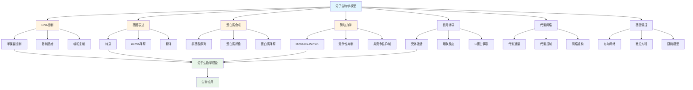
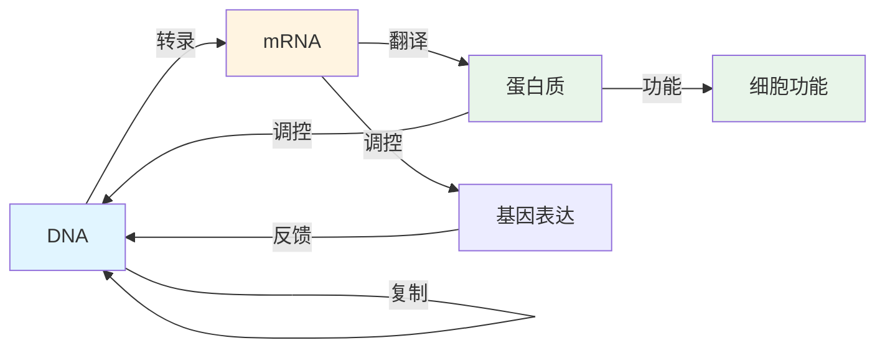

# 5.1 分子生物学模型 / Molecular Biology Models

## 目录 / Table of Contents

- [5.1 分子生物学模型 / Molecular Biology Models](#51-分子生物学模型--molecular-biology-models)
  - [目录 / Table of Contents](#目录--table-of-contents)
  - [分子生物学模型框架图 / Framework Diagram of Molecular Biology Models](#分子生物学模型框架图--framework-diagram-of-molecular-biology-models)
  - [中心法则流程图 / Flowchart of Central Dogma](#中心法则流程图--flowchart-of-central-dogma)
  - [5.1.1 DNA复制模型 / DNA Replication Models](#511-dna复制模型--dna-replication-models)
    - [半保留复制 / Semiconservative Replication](#半保留复制--semiconservative-replication)
    - [复制起始模型 / Replication Initiation Model](#复制起始模型--replication-initiation-model)
    - [端粒复制模型 / Telomere Replication Model](#端粒复制模型--telomere-replication-model)
  - [5.1.2 基因表达模型 / Gene Expression Models](#512-基因表达模型--gene-expression-models)
    - [转录模型 / Transcription Model](#转录模型--transcription-model)
    - [mRNA降解模型 / mRNA Degradation Model](#mrna降解模型--mrna-degradation-model)
    - [翻译模型 / Translation Model](#翻译模型--translation-model)
  - [5.1.3 蛋白质合成模型 / Protein Synthesis Models](#513-蛋白质合成模型--protein-synthesis-models)
    - [氨基酸序列模型 / Amino Acid Sequence Model](#氨基酸序列模型--amino-acid-sequence-model)
    - [蛋白质折叠模型 / Protein Folding Model](#蛋白质折叠模型--protein-folding-model)
    - [蛋白质降解模型 / Protein Degradation Model](#蛋白质降解模型--protein-degradation-model)
  - [5.1.4 酶动力学模型 / Enzyme Kinetics Models](#514-酶动力学模型--enzyme-kinetics-models)
    - [Michaelis-Menten模型 / Michaelis-Menten Model](#michaelis-menten模型--michaelis-menten-model)
    - [竞争性抑制 / Competitive Inhibition](#竞争性抑制--competitive-inhibition)
    - [非竞争性抑制 / Non-competitive Inhibition](#非竞争性抑制--non-competitive-inhibition)
  - [5.1.5 信号转导模型 / Signal Transduction Models](#515-信号转导模型--signal-transduction-models)
    - [受体激活模型 / Receptor Activation Model](#受体激活模型--receptor-activation-model)
    - [级联反应模型 / Cascade Reaction Model](#级联反应模型--cascade-reaction-model)
    - [G蛋白偶联受体模型 / G Protein-Coupled Receptor Model](#g蛋白偶联受体模型--g-protein-coupled-receptor-model)
  - [5.1.6 代谢网络模型 / Metabolic Network Models](#516-代谢网络模型--metabolic-network-models)
    - [代谢通量分析 / Metabolic Flux Analysis](#代谢通量分析--metabolic-flux-analysis)
    - [代谢控制分析 / Metabolic Control Analysis](#代谢控制分析--metabolic-control-analysis)
    - [代谢网络重构 / Metabolic Network Reconstruction](#代谢网络重构--metabolic-network-reconstruction)
  - [5.1.7 基因调控网络模型 / Gene Regulatory Network Models](#517-基因调控网络模型--gene-regulatory-network-models)
    - [布尔网络模型 / Boolean Network Model](#布尔网络模型--boolean-network-model)
    - [微分方程模型 / Differential Equation Model](#微分方程模型--differential-equation-model)
    - [随机模型 / Stochastic Model](#随机模型--stochastic-model)
  - [5.1.8 实现与应用 / Implementation and Applications](#518-实现与应用--implementation-and-applications)
    - [Rust实现示例 / Rust Implementation Example](#rust实现示例--rust-implementation-example)
    - [Haskell实现示例 / Haskell Implementation Example](#haskell实现示例--haskell-implementation-example)
    - [应用领域 / Application Domains](#应用领域--application-domains)
      - [基础研究 / Basic Research](#基础研究--basic-research)
      - [生物技术 / Biotechnology](#生物技术--biotechnology)
      - [医学应用 / Medical Applications](#医学应用--medical-applications)
  - [5.1.9 算法实现 / Algorithm Implementation](#519-算法实现--algorithm-implementation)
    - [基因表达与Hill调控 / Gene Expression with Hill Regulation](#基因表达与hill调控--gene-expression-with-hill-regulation)
  - [相关模型 / Related Models](#相关模型--related-models)
    - [生命科学模型 / Life Science Models](#生命科学模型--life-science-models)
    - [数学科学模型 / Mathematical Science Models](#数学科学模型--mathematical-science-models)
    - [物理科学模型 / Physical Science Models](#物理科学模型--physical-science-models)
    - [计算机科学模型 / Computer Science Models](#计算机科学模型--computer-science-models)
    - [基础理论 / Basic Theory](#基础理论--basic-theory)
  - [参考文献 / References](#参考文献--references)

---

## 分子生物学模型框架图 / Framework Diagram of Molecular Biology Models



## 中心法则流程图 / Flowchart of Central Dogma



## 5.1.1 DNA复制模型 / DNA Replication Models

### 半保留复制 / Semiconservative Replication

**复制叉模型**: $DNA_{parent} \rightarrow DNA_{daughter1} + DNA_{daughter2}$

**复制速度**: $v = \frac{dL}{dt} = k_{polymerase} \cdot [dNTP] \cdot [primer]$

**错误率**: $P(error) = \frac{1}{10^6} \cdot \frac{1}{proofreading}$

### 复制起始模型 / Replication Initiation Model

**起始概率**: $P(initiation) = \frac{[ORC] \cdot [ATP]}{K_d + [ATP]}$

**复制许可**: $P(licensing) = \frac{[MCM] \cdot [ORC]}{K_m + [MCM]}$

**复制时间**: $T_{replication} = \frac{L_{genome}}{v_{fork}} \cdot N_{forks}$

### 端粒复制模型 / Telomere Replication Model

**端粒长度**: $L_{telomere}(t) = L_0 - \alpha \cdot t$

**端粒酶活性**: $v_{telomerase} = k_{telomerase} \cdot [telomerase] \cdot [telomere]$

**Hayflick极限**: $N_{divisions} = \frac{L_0}{\alpha}$

---

## 5.1.2 基因表达模型 / Gene Expression Models

### 转录模型 / Transcription Model

**转录速率**: $v_{transcription} = k_{RNAP} \cdot [RNAP] \cdot [promoter] \cdot f(regulators)$

**启动子强度**: $P_{promoter} = \frac{[RNAP] \cdot K_{binding}}{1 + [RNAP] \cdot K_{binding}}$

**转录因子调控**: $f(regulators) = \prod_{i=1}^n \frac{[TF_i]}{K_i + [TF_i]}$

### mRNA降解模型 / mRNA Degradation Model

**降解速率**: $\frac{d[mRNA]}{dt} = -k_{degradation} \cdot [mRNA]$

**半衰期**: $t_{1/2} = \frac{\ln(2)}{k_{degradation}}$

**稳态浓度**: $[mRNA]_{steady} = \frac{v_{transcription}}{k_{degradation}}$

### 翻译模型 / Translation Model

**翻译速率**: $v_{translation} = k_{ribosome} \cdot [ribosome] \cdot [mRNA] \cdot [tRNA]$

**密码子使用**: $P(codon_i) = \frac{[tRNA_i]}{\sum_{j=1}^{64} [tRNA_j]}$

**蛋白质合成**: $\frac{d[protein]}{dt} = v_{translation} - k_{proteolysis} \cdot [protein]$

---

## 5.1.3 蛋白质合成模型 / Protein Synthesis Models

### 氨基酸序列模型 / Amino Acid Sequence Model

**序列概率**: $P(sequence) = \prod_{i=1}^n P(aa_i|aa_{i-1})$

**密码子表**: $aa = f(codon_1, codon_2, codon_3)$

**突变模型**: $P(mutation) = \mu \cdot L_{sequence}$

### 蛋白质折叠模型 / Protein Folding Model

**自由能**: $\Delta G = \Delta H - T \Delta S$

**折叠速率**: $k_{folding} = k_0 \cdot e^{-\frac{\Delta G^\ddagger}{RT}}$

**稳定性**: $\Delta G_{unfolding} = -RT \ln(K_{eq})$

### 蛋白质降解模型 / Protein Degradation Model

**降解速率**: $\frac{d[P]}{dt} = -k_{degradation} \cdot [P]$

**半衰期**: $t_{1/2} = \frac{\ln(2)}{k_{degradation}}$

**蛋白酶体**: $v_{proteasome} = k_{proteasome} \cdot [proteasome] \cdot [ubiquitinated]$

---

## 5.1.4 酶动力学模型 / Enzyme Kinetics Models

### Michaelis-Menten模型 / Michaelis-Menten Model

**反应速率**: $v = \frac{V_{max} \cdot [S]}{K_M + [S]}$

**米氏常数**: $K_M = \frac{k_{-1} + k_2}{k_1}$

**最大速率**: $V_{max} = k_2 \cdot [E_0]$

### 竞争性抑制 / Competitive Inhibition

**抑制速率**: $v = \frac{V_{max} \cdot [S]}{K_M(1 + \frac{[I]}{K_i}) + [S]}$

**抑制常数**: $K_i = \frac{[E][I]}{[EI]}$

### 非竞争性抑制 / Non-competitive Inhibition

**抑制速率**: $v = \frac{V_{max} \cdot [S]}{(K_M + [S])(1 + \frac{[I]}{K_i})}$

**混合抑制**: $v = \frac{V_{max} \cdot [S]}{K_M(1 + \frac{[I]}{K_i}) + [S](1 + \frac{[I]}{K_i'})}$

---

## 5.1.5 信号转导模型 / Signal Transduction Models

### 受体激活模型 / Receptor Activation Model

**配体结合**: $[R] + [L] \rightleftharpoons [RL]$

**结合常数**: $K_d = \frac{[R][L]}{[RL]}$

**受体激活**: $[RL] \rightarrow [R^*]$

### 级联反应模型 / Cascade Reaction Model

**磷酸化级联**: $A \xrightarrow{k_1} A^* \xrightarrow{k_2} B \xrightarrow{k_3} B^*$

**信号放大**: $amplification = \prod_{i=1}^n \frac{k_i}{k_{-i}}$

**响应时间**: $\tau = \sum_{i=1}^n \frac{1}{k_i}$

### G蛋白偶联受体模型 / G Protein-Coupled Receptor Model

**G蛋白循环**: $[G_\alpha] \xrightarrow{[R^*]} [G_\alpha^*] \xrightarrow{GTPase} [G_\alpha]$

**腺苷酸环化酶**: $[AC] \xrightarrow{[G_\alpha^*]} [AC^*]$

**cAMP产生**: $\frac{d[cAMP]}{dt} = k_{AC} \cdot [AC^*] - k_{PDE} \cdot [cAMP]$

---

## 5.1.6 代谢网络模型 / Metabolic Network Models

### 代谢通量分析 / Metabolic Flux Analysis

**稳态约束**: $\frac{d[S_i]}{dt} = \sum_{j=1}^n S_{ij} \cdot v_j = 0$

**通量平衡**: $S \cdot v = 0$

**目标函数**: $\max Z = \sum_{i=1}^n c_i v_i$

### 代谢控制分析 / Metabolic Control Analysis

**通量控制系数**: $C_i^J = \frac{\partial J}{\partial v_i} \cdot \frac{v_i}{J}$

**浓度控制系数**: $C_i^S = \frac{\partial S}{\partial v_i} \cdot \frac{v_i}{S}$

**弹性系数**: $\varepsilon_i^S = \frac{\partial v_i}{\partial S} \cdot \frac{S}{v_i}$

### 代谢网络重构 / Metabolic Network Reconstruction

**基因-蛋白质-反应**: $G \rightarrow P \rightarrow R$

**反应约束**: $v_{min} \leq v \leq v_{max}$

**生长约束**: $\mu = \sum_{i=1}^n \alpha_i v_i$

---

## 5.1.7 基因调控网络模型 / Gene Regulatory Network Models

### 布尔网络模型 / Boolean Network Model

**状态更新**: $x_i(t+1) = f_i(x_1(t), x_2(t), \ldots, x_n(t))$

**吸引子**: $A = \{x | x(t+1) = x(t)\}$

**网络稳定性**: $S = \frac{1}{2^n} \sum_{i=1}^{2^n} H(x_i, x_{i+1})$

### 微分方程模型 / Differential Equation Model

**基因表达**: $\frac{dx_i}{dt} = \frac{\beta_i}{1 + \sum_{j=1}^n K_{ij} x_j} - \gamma_i x_i$

**Hill函数**: $f(x) = \frac{x^n}{K^n + x^n}$

**协同效应**: $f(x_1, x_2) = \frac{x_1^{n_1} x_2^{n_2}}{K_1^{n_1} K_2^{n_2} + x_1^{n_1} x_2^{n_2}}$

### 随机模型 / Stochastic Model

**主方程**: $\frac{dP(x,t)}{dt} = \sum_{x'} [W(x|x')P(x',t) - W(x'|x)P(x,t)]$

**Langevin方程**: $\frac{dx}{dt} = f(x) + \sqrt{2D} \eta(t)$

**Fokker-Planck方程**: $\frac{\partial P}{\partial t} = -\frac{\partial}{\partial x}[f(x)P] + D\frac{\partial^2 P}{\partial x^2}$

---

## 5.1.8 实现与应用 / Implementation and Applications

### Rust实现示例 / Rust Implementation Example

```rust
use std::collections::HashMap;

#[derive(Debug, Clone)]
pub struct DNA {
    pub sequence: String,
    pub length: usize,
}

impl DNA {
    pub fn new(sequence: String) -> Self {
        let length = sequence.len();
        Self { sequence, length }
    }

    pub fn replicate(&self, error_rate: f64) -> (DNA, DNA) {
        let mut daughter1 = String::new();
        let mut daughter2 = String::new();

        for base in self.sequence.chars() {
            let complementary = match base {
                'A' => 'T',
                'T' => 'A',
                'C' => 'G',
                'G' => 'C',
                _ => base,
            };

            // 模拟复制错误
            let error = rand::random::<f64>();
            if error < error_rate {
                let mutations = ['A', 'T', 'C', 'G'];
                let random_base = mutations[rand::random::<usize>() % 4];
                daughter1.push(random_base);
                daughter2.push(complementary);
            } else {
                daughter1.push(base);
                daughter2.push(complementary);
            }
        }

        (DNA::new(daughter1), DNA::new(daughter2))
    }

    pub fn calculate_gc_content(&self) -> f64 {
        let gc_count = self.sequence.chars()
            .filter(|&c| c == 'G' || c == 'C')
            .count();
        gc_count as f64 / self.length as f64
    }
}

#[derive(Debug)]
pub struct GeneExpression {
    pub transcription_rate: f64,
    pub degradation_rate: f64,
    pub translation_rate: f64,
    pub proteolysis_rate: f64,
}

impl GeneExpression {
    pub fn new() -> Self {
        Self {
            transcription_rate: 0.1,
            degradation_rate: 0.05,
            translation_rate: 0.02,
            proteolysis_rate: 0.01,
        }
    }

    pub fn simulate_expression(&self, time_points: &Vec<f64>) -> (Vec<f64>, Vec<f64>) {
        let mut mrna_concentrations = Vec::new();
        let mut protein_concentrations = Vec::new();

        let mut mrna = 0.0;
        let mut protein = 0.0;

        for &t in time_points {
            // mRNA动力学
            let dmrna_dt = self.transcription_rate - self.degradation_rate * mrna;
            mrna += dmrna_dt * 0.1; // 时间步长

            // 蛋白质动力学
            let dprotein_dt = self.translation_rate * mrna - self.proteolysis_rate * protein;
            protein += dprotein_dt * 0.1;

            mrna_concentrations.push(mrna);
            protein_concentrations.push(protein);
        }

        (mrna_concentrations, protein_concentrations)
    }
}

#[derive(Debug)]
pub struct EnzymeKinetics {
    pub vmax: f64,
    pub km: f64,
    pub enzyme_concentration: f64,
}

impl EnzymeKinetics {
    pub fn new(vmax: f64, km: f64, enzyme_concentration: f64) -> Self {
        Self {
            vmax,
            km,
            enzyme_concentration,
        }
    }

    pub fn michaelis_menten(&self, substrate_concentration: f64) -> f64 {
        self.vmax * substrate_concentration / (self.km + substrate_concentration)
    }

    pub fn competitive_inhibition(&self, substrate: f64, inhibitor: f64, ki: f64) -> f64 {
        let km_apparent = self.km * (1.0 + inhibitor / ki);
        self.vmax * substrate / (km_apparent + substrate)
    }

    pub fn non_competitive_inhibition(&self, substrate: f64, inhibitor: f64, ki: f64) -> f64 {
        let vmax_apparent = self.vmax / (1.0 + inhibitor / ki);
        vmax_apparent * substrate / (self.km + substrate)
    }
}

#[derive(Debug)]
pub struct MetabolicNetwork {
    pub reactions: Vec<Reaction>,
    pub metabolites: Vec<String>,
    pub stoichiometry: Vec<Vec<i32>>,
}

#[derive(Debug, Clone)]
pub struct Reaction {
    pub id: String,
    pub reactants: Vec<String>,
    pub products: Vec<String>,
    pub reversible: bool,
    pub bounds: (f64, f64),
}

impl MetabolicNetwork {
    pub fn new() -> Self {
        Self {
            reactions: Vec::new(),
            metabolites: Vec::new(),
            stoichiometry: Vec::new(),
        }
    }

    pub fn add_reaction(&mut self, reaction: Reaction) {
        self.reactions.push(reaction);
    }

    pub fn flux_balance_analysis(&self) -> Vec<f64> {
        // 简化的通量平衡分析
        let n_reactions = self.reactions.len();
        let mut fluxes = vec![1.0; n_reactions];

        // 迭代求解稳态约束
        for _ in 0..100 {
            for i in 0..n_reactions {
                let mut net_flux = 0.0;
                for j in 0..n_reactions {
                    if i != j {
                        net_flux += self.stoichiometry[i][j] * fluxes[j];
                    }
                }
                fluxes[i] = (-net_flux / self.stoichiometry[i][i]).max(0.0);
            }
        }

        fluxes
    }

    pub fn calculate_growth_rate(&self, fluxes: &Vec<f64>) -> f64 {
        // 简化的生长率计算
        fluxes.iter().sum()
    }
}

#[derive(Debug)]
pub struct GeneRegulatoryNetwork {
    pub genes: Vec<String>,
    pub interactions: HashMap<(String, String), f64>,
    pub expression_levels: HashMap<String, f64>,
}

impl GeneRegulatoryNetwork {
    pub fn new() -> Self {
        Self {
            genes: Vec::new(),
            interactions: HashMap::new(),
            expression_levels: HashMap::new(),
        }
    }

    pub fn add_gene(&mut self, gene: String) {
        self.genes.push(gene.clone());
        self.expression_levels.insert(gene, 0.5);
    }

    pub fn add_interaction(&mut self, regulator: String, target: String, strength: f64) {
        self.interactions.insert((regulator, target), strength);
    }

    pub fn update_expression(&mut self, time_steps: usize) -> Vec<HashMap<String, f64>> {
        let mut history = Vec::new();

        for _ in 0..time_steps {
            let mut new_levels = self.expression_levels.clone();

            for gene in &self.genes {
                let mut regulation = 0.0;

                for (regulator, target) in self.interactions.keys() {
                    if target == gene {
                        if let Some(&strength) = self.interactions.get(&(regulator.clone(), target.clone())) {
                            if let Some(&level) = self.expression_levels.get(regulator) {
                                regulation += strength * level;
                            }
                        }
                    }
                }

                let current_level = self.expression_levels.get(gene).unwrap_or(&0.5);
                let new_level = (current_level + 0.1 * regulation).max(0.0).min(1.0);
                new_levels.insert(gene.clone(), new_level);
            }

            self.expression_levels = new_levels.clone();
            history.push(new_levels);
        }

        history
    }
}

// 使用示例
fn main() {
    // DNA复制模型
    let dna = DNA::new("ATCGATCGATCG".to_string());
    let (daughter1, daughter2) = dna.replicate(0.001);

    println!("Original DNA: {}", dna.sequence);
    println!("Daughter 1: {}", daughter1.sequence);
    println!("Daughter 2: {}", daughter2.sequence);
    println!("GC content: {:.3}", dna.calculate_gc_content());

    // 基因表达模型
    let expression = GeneExpression::new();
    let time_points: Vec<f64> = (0..100).map(|x| x as f64 * 0.1).collect();
    let (mrna_levels, protein_levels) = expression.simulate_expression(&time_points);

    println!("Final mRNA level: {:.3}", mrna_levels.last().unwrap());
    println!("Final protein level: {:.3}", protein_levels.last().unwrap());

    // 酶动力学模型
    let enzyme = EnzymeKinetics::new(10.0, 1.0, 1.0);
    let substrate_concentration = 5.0;
    let reaction_rate = enzyme.michaelis_menten(substrate_concentration);

    println!("Reaction rate: {:.3}", reaction_rate);

    // 基因调控网络
    let mut network = GeneRegulatoryNetwork::new();
    network.add_gene("A".to_string());
    network.add_gene("B".to_string());
    network.add_gene("C".to_string());

    network.add_interaction("A".to_string(), "B".to_string(), 0.5);
    network.add_interaction("B".to_string(), "C".to_string(), -0.3);
    network.add_interaction("C".to_string(), "A".to_string(), 0.2);

    let history = network.update_expression(50);
    println!("Final expression levels: {:?}", history.last().unwrap());
}
```

### Haskell实现示例 / Haskell Implementation Example

```haskell
module MolecularBiologyModels where

import Data.Map (Map)
import qualified Data.Map as Map
import Data.List (sum, length)

-- DNA数据类型
data DNA = DNA {
    sequence :: String,
    length :: Int
} deriving Show

newDNA :: String -> DNA
newDNA seq = DNA seq (length seq)

replicateDNA :: DNA -> Double -> (DNA, DNA)
replicateDNA dna errorRate = (DNA daughter1 (length daughter1), DNA daughter2 (length daughter2))
  where
    daughter1 = map replicateBase (sequence dna)
    daughter2 = map complementaryBase daughter1

    replicateBase base
        | random < errorRate = randomMutation base
        | otherwise = base
      where
        random = 0.001 -- 简化的随机数
        randomMutation 'A' = 'C'
        randomMutation 'T' = 'G'
        randomMutation 'C' = 'A'
        randomMutation 'G' = 'T'
        randomMutation x = x

    complementaryBase 'A' = 'T'
    complementaryBase 'T' = 'A'
    complementaryBase 'C' = 'G'
    complementaryBase 'G' = 'C'
    complementaryBase x = x

calculateGCContent :: DNA -> Double
calculateGCContent dna = fromIntegral gcCount / fromIntegral (length dna)
  where
    gcCount = length (filter (\c -> c == 'G' || c == 'C') (sequence dna))

-- 基因表达模型
data GeneExpression = GeneExpression {
    transcriptionRate :: Double,
    degradationRate :: Double,
    translationRate :: Double,
    proteolysisRate :: Double
} deriving Show

newGeneExpression :: GeneExpression
newGeneExpression = GeneExpression 0.1 0.05 0.02 0.01

simulateExpression :: GeneExpression -> [Double] -> ([Double], [Double])
simulateExpression model timePoints = go timePoints 0.0 0.0
  where
    go [] _ _ = ([], [])
    go (t:ts) mrna protein = (mrna:mrnaLevels, protein:proteinLevels)
      where
        dmrna = transcriptionRate model - degradationRate model * mrna
        dprotein = translationRate model * mrna - proteolysisRate model * protein
        dt = 0.1
        newMrna = mrna + dmrna * dt
        newProtein = protein + dprotein * dt
        (mrnaLevels, proteinLevels) = go ts newMrna newProtein

-- 酶动力学模型
data EnzymeKinetics = EnzymeKinetics {
    vmax :: Double,
    km :: Double,
    enzymeConcentration :: Double
} deriving Show

newEnzymeKinetics :: Double -> Double -> Double -> EnzymeKinetics
newEnzymeKinetics v k ec = EnzymeKinetics v k ec

michaelisMenten :: EnzymeKinetics -> Double -> Double
michaelisMenten enzyme substrate = vmax enzyme * substrate / (km enzyme + substrate)

competitiveInhibition :: EnzymeKinetics -> Double -> Double -> Double -> Double
competitiveInhibition enzyme substrate inhibitor ki =
    vmax enzyme * substrate / (kmApparent + substrate)
  where
    kmApparent = km enzyme * (1.0 + inhibitor / ki)

nonCompetitiveInhibition :: EnzymeKinetics -> Double -> Double -> Double -> Double
nonCompetitiveInhibition enzyme substrate inhibitor ki =
    vmaxApparent * substrate / (km enzyme + substrate)
  where
    vmaxApparent = vmax enzyme / (1.0 + inhibitor / ki)

-- 代谢网络
data MetabolicNetwork = MetabolicNetwork {
    reactions :: [Reaction],
    metabolites :: [String],
    stoichiometry :: [[Int]]
} deriving Show

data Reaction = Reaction {
    reactionId :: String,
    reactants :: [String],
    products :: [String],
    reversible :: Bool,
    bounds :: (Double, Double)
} deriving Show

newMetabolicNetwork :: MetabolicNetwork
newMetabolicNetwork = MetabolicNetwork [] [] []

addReaction :: Reaction -> MetabolicNetwork -> MetabolicNetwork
addReaction reaction network = network { reactions = reaction : reactions network }

fluxBalanceAnalysis :: MetabolicNetwork -> [Double]
fluxBalanceAnalysis network = go 100 (replicate nReactions 1.0)
  where
    nReactions = length (reactions network)

    go 0 fluxes = fluxes
    go iterations fluxes = go (iterations - 1) newFluxes
      where
        newFluxes = map updateFlux [0..nReactions-1]
        updateFlux i = max 0.0 (calculateNetFlux i fluxes)
        calculateNetFlux i fluxes =
            sum [fromIntegral (stoichiometry network !! i !! j) * fluxes !! j | j <- [0..nReactions-1], j /= i]

-- 基因调控网络
data GeneRegulatoryNetwork = GeneRegulatoryNetwork {
    genes :: [String],
    interactions :: Map (String, String) Double,
    expressionLevels :: Map String Double
} deriving Show

newGeneRegulatoryNetwork :: GeneRegulatoryNetwork
newGeneRegulatoryNetwork = GeneRegulatoryNetwork [] Map.empty Map.empty

addGene :: String -> GeneRegulatoryNetwork -> GeneRegulatoryNetwork
addGene gene network = network {
    genes = gene : genes network,
    expressionLevels = Map.insert gene 0.5 (expressionLevels network)
}

addInteraction :: String -> String -> Double -> GeneRegulatoryNetwork -> GeneRegulatoryNetwork
addInteraction regulator target strength network = network {
    interactions = Map.insert (regulator, target) strength (interactions network)
}

updateExpression :: GeneRegulatoryNetwork -> Int -> [Map String Double]
updateExpression network timeSteps = go timeSteps (expressionLevels network)
  where
    go 0 levels = []
    go steps levels = levels : go (steps - 1) newLevels
      where
        newLevels = Map.fromList [(gene, updateGeneLevel gene levels) | gene <- genes network]
        updateGeneLevel gene levels =
            let currentLevel = Map.findWithDefault 0.5 gene levels
                regulation = sum [strength * Map.findWithDefault 0.5 regulator levels
                                | ((regulator, target), strength) <- Map.toList (interactions network), target == gene]
                newLevel = max 0.0 (min 1.0 (currentLevel + 0.1 * regulation))
            in newLevel

-- 示例使用
example :: IO ()
example = do
    -- DNA复制模型
    let dna = newDNA "ATCGATCGATCG"
        (daughter1, daughter2) = replicateDNA dna 0.001

    putStrLn $ "Original DNA: " ++ sequence dna
    putStrLn $ "Daughter 1: " ++ sequence daughter1
    putStrLn $ "Daughter 2: " ++ sequence daughter2
    putStrLn $ "GC content: " ++ show (calculateGCContent dna)

    -- 基因表达模型
    let expression = newGeneExpression
        timePoints = [0.0, 0.1..10.0]
        (mrnaLevels, proteinLevels) = simulateExpression expression timePoints

    putStrLn $ "Final mRNA level: " ++ show (last mrnaLevels)
    putStrLn $ "Final protein level: " ++ show (last proteinLevels)

    -- 酶动力学模型
    let enzyme = newEnzymeKinetics 10.0 1.0 1.0
        reactionRate = michaelisMenten enzyme 5.0

    putStrLn $ "Reaction rate: " ++ show reactionRate

    -- 基因调控网络
    let network = addInteraction "A" "B" 0.5 $
                  addInteraction "B" "C" (-0.3) $
                  addInteraction "C" "A" 0.2 $
                  addGene "C" $
                  addGene "B" $
                  addGene "A" newGeneRegulatoryNetwork

        history = updateExpression network 50

    putStrLn $ "Final expression levels: " ++ show (last history)
```

### 应用领域 / Application Domains

#### 基础研究 / Basic Research

- **基因组学**: DNA序列分析、基因功能预测
- **蛋白质组学**: 蛋白质结构、功能预测
- **代谢组学**: 代谢通路分析、代谢工程

#### 生物技术 / Biotechnology

- **基因工程**: 基因编辑、转基因技术
- **蛋白质工程**: 酶改造、药物设计
- **代谢工程**: 菌株改造、产物优化

#### 医学应用 / Medical Applications

- **药物开发**: 靶点识别、药物筛选
- **疾病机制**: 分子病理学、治疗靶点
- **个性化医疗**: 基因检测、精准治疗

---

## 5.1.9 算法实现 / Algorithm Implementation

### 基因表达与Hill调控 / Gene Expression with Hill Regulation

```python
import numpy as np
from typing import Tuple, Callable, List

def hill_activation(x: float, K: float, n: int) -> float:
    """Hill激活函数 f(x) = x^n / (K^n + x^n)"""
    xn = max(x, 0.0) ** n
    Kn = K ** n
    return xn / (Kn + xn + 1e-15)

def hill_repression(x: float, K: float, n: int) -> float:
    """Hill抑制函数 f(x) = K^n / (K^n + x^n)"""
    xn = max(x, 0.0) ** n
    Kn = K ** n
    return Kn / (Kn + xn + 1e-15)

def gene_expression_ode(m: float, p: float, params: dict) -> Tuple[float, float]:
    """一基因表达ODE: dm/dt = α·reg - δ_m m, dp/dt = β m - δ_p p"""
    alpha = params['alpha']
    beta = params['beta']
    delta_m = params['delta_m']
    delta_p = params['delta_p']
    regulator = params['reg'](p) if callable(params['reg']) else 1.0
    dm = alpha * regulator - delta_m * m
    dp = beta * m - delta_p * p
    return dm, dp

def rk4_step(state: Tuple[float, float], h: float, deriv: Callable, params: dict) -> Tuple[float, float]:
    m, p = state
    k1m, k1p = deriv(m, p, params)
    k2m, k2p = deriv(m + 0.5*h*k1m, p + 0.5*h*k1p, params)
    k3m, k3p = deriv(m + 0.5*h*k2m, p + 0.5*h*k2p, params)
    k4m, k4p = deriv(m + h*k3m, p + h*k3p, params)
    m_new = m + h*(k1m + 2*k2m + 2*k3m + k4m)/6.0
    p_new = p + h*(k1p + 2*k2p + 2*k3p + k4p)/6.0
    return m_new, p_new

def simulate_gene_switch(T: float = 200.0, dt: float = 0.1) -> Tuple[np.ndarray, np.ndarray, np.ndarray]:
    """自激/自抑基因开关：通过Hill调控得到双稳态或单稳态"""
    time = np.arange(0.0, T+dt, dt)
    m, p = 0.1, 0.1
    traj_m, traj_p = [], []
    # 选择自激活开关：reg(p) = Hill_activation(p)
    params = {
        'alpha': 2.0, 'beta': 5.0, 'delta_m': 0.5, 'delta_p': 0.2,
        'reg': lambda x: hill_activation(x, K=1.0, n=3)
    }
    for _ in time:
        m, p = rk4_step((m, p), dt, gene_expression_ode, params)
        traj_m.append(m)
        traj_p.append(p)
    return time, np.array(traj_m), np.array(traj_p)

def repressilator(T: float = 300.0, dt: float = 0.05) -> Tuple[np.ndarray, np.ndarray]:
    """三基因抑制振荡器（Elowitz & Leibler Repressilator）简化ODE"""
    time = np.arange(0.0, T+dt, dt)
    m = np.array([0.1, 0.1, 0.1], dtype=float)
    p = np.array([0.1, 0.1, 0.1], dtype=float)
    traj = []
    alpha_m = 1.0; alpha_p = 5.0; delta_m = 0.5; delta_p = 0.2; K = 1.0; n = 2

    def deriv(mv, pv):
        dm = np.zeros(3); dp = np.zeros(3)
        # 抑制环: 0<-2, 1<-0, 2<-1
        regs = [hill_repression(pv[2], K, n), hill_repression(pv[0], K, n), hill_repression(pv[1], K, n)]
        for i in range(3):
            dm[i] = alpha_m*regs[i] - delta_m*mv[i]
            dp[i] = alpha_p*mv[i] - delta_p*pv[i]
        return dm, dp

    for _ in time:
        dm1, dp1 = deriv(m, p)
        dm2, dp2 = deriv(m + 0.5*dt*dm1, p + 0.5*dt*dp1)
        dm3, dp3 = deriv(m + 0.5*dt*dm2, p + 0.5*dt*dp2)
        dm4, dp4 = deriv(m + dt*dm3, p + dt*dp3)
        m = m + dt*(dm1 + 2*dm2 + 2*dm3 + dm4)/6.0
        p = p + dt*(dp1 + 2*dp2 + 2*dp3 + dp4)/6.0
        traj.append(p.copy())
    return time, np.array(traj)

def molecular_biology_verification():
    """分子生物学模型综合验证"""
    # 基因开关
    t, m, p = simulate_gene_switch(T=120.0, dt=0.1)
    assert np.isfinite(p).all() and p.max() > 0.2
    # 抑制振荡器
    t2, P = repressilator(T=150.0, dt=0.05)
    assert np.isfinite(P).all() and (P.ptp(axis=0) > 0.05).all()
    print("Gene switch and repressilator simulations succeeded.")

if __name__ == "__main__":
    molecular_biology_verification()
```

## 相关模型 / Related Models

### 生命科学模型 / Life Science Models

- [生态学模型](../02-生态学模型/README.md) - 分子生物学在生态系统中的应用
- [进化论模型](../03-进化论模型/README.md) - 分子进化和基因变异
- [神经科学模型](../04-神经科学模型/README.md) - 神经分子的信号转导
- [基因组学模型](../05-基因组学模型/README.md) - 基因组分析和基因表达

### 数学科学模型 / Mathematical Science Models

- [代数模型](../../03-数学科学模型/01-代数模型/README.md) - 基因调控网络的代数结构
- [几何模型](../../03-数学科学模型/02-几何模型/README.md) - 蛋白质结构的几何分析

### 物理科学模型 / Physical Science Models

- [热力学模型](../../02-物理科学模型/04-热力学模型/README.md) - 生物热力学和能量代谢
- [量子力学模型](../../02-物理科学模型/02-量子力学模型/README.md) - 量子生物学和分子轨道

### 计算机科学模型 / Computer Science Models

- [算法模型](../../04-计算机科学模型/02-算法模型/README.md) - 生物信息学算法
- [人工智能模型](../../04-计算机科学模型/05-人工智能模型/README.md) - 机器学习在生物学中的应用

### 基础理论 / Basic Theory

- [模型分类学](../../01-基础理论/01-模型分类学/README.md) - 分子生物学模型的分类
- [形式化方法论](../../01-基础理论/02-形式化方法论/README.md) - 分子生物学模型的形式化方法
- [科学模型论](../../01-基础理论/03-科学模型论/README.md) - 分子生物学模型作为科学模型的理论基础

## 参考文献 / References

1. Alberts, B., et al. (2014). Molecular Biology of the Cell. Garland Science.
2. Lodish, H., et al. (2016). Molecular Cell Biology. W.H. Freeman.
3. Voet, D., & Voet, J. G. (2011). Biochemistry. Wiley.
4. Klipp, E., et al. (2016). Systems Biology. Wiley.

---

*最后更新: 2025-08-26*
*版本: 1.1.0*
