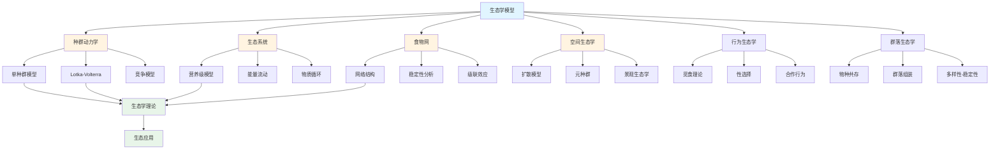
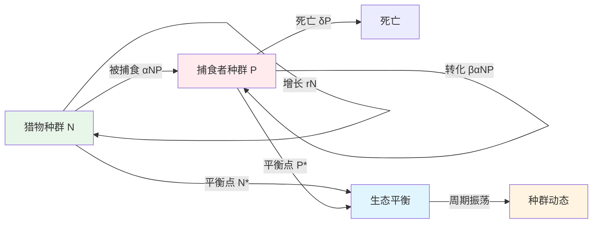

# 5.2 生态学模型 / Ecology Models

## 目录 / Table of Contents

- [5.2 生态学模型 / Ecology Models](#52-生态学模型--ecology-models)
  - [目录 / Table of Contents](#目录--table-of-contents)
  - [生态学模型框架图 / Framework Diagram of Ecology Models](#生态学模型框架图--framework-diagram-of-ecology-models)
  - [Lotka-Volterra捕食者-猎物关系图 / Relationship Diagram of Lotka-Volterra Predator-Prey](#lotka-volterra捕食者-猎物关系图--relationship-diagram-of-lotka-volterra-predator-prey)
  - [5.2.1 种群动力学模型 / Population Dynamics Models](#521-种群动力学模型--population-dynamics-models)
    - [单种群模型 / Single Population Model](#单种群模型--single-population-model)
    - [Lotka-Volterra模型 / Lotka-Volterra Model](#lotka-volterra模型--lotka-volterra-model)
    - [竞争模型 / Competition Model](#竞争模型--competition-model)
  - [5.2.2 生态系统模型 / Ecosystem Models](#522-生态系统模型--ecosystem-models)
    - [营养级模型 / Trophic Level Model](#营养级模型--trophic-level-model)
    - [能量流动模型 / Energy Flow Model](#能量流动模型--energy-flow-model)
    - [物质循环模型 / Material Cycle Model](#物质循环模型--material-cycle-model)
  - [5.2.3 食物网模型 / Food Web Models](#523-食物网模型--food-web-models)
    - [网络结构 / Network Structure](#网络结构--network-structure)
    - [稳定性分析 / Stability Analysis](#稳定性分析--stability-analysis)
    - [级联效应 / Cascade Effects](#级联效应--cascade-effects)
  - [5.2.4 空间生态学模型 / Spatial Ecology Models](#524-空间生态学模型--spatial-ecology-models)
    - [扩散模型 / Diffusion Model](#扩散模型--diffusion-model)
    - [元种群模型 / Metapopulation Model](#元种群模型--metapopulation-model)
    - [景观生态学 / Landscape Ecology](#景观生态学--landscape-ecology)
  - [5.2.5 行为生态学模型 / Behavioral Ecology Models](#525-行为生态学模型--behavioral-ecology-models)
    - [觅食理论 / Foraging Theory](#觅食理论--foraging-theory)
    - [性选择模型 / Sexual Selection Model](#性选择模型--sexual-selection-model)
    - [合作行为模型 / Cooperative Behavior Model](#合作行为模型--cooperative-behavior-model)
  - [5.2.6 群落生态学模型 / Community Ecology Models](#526-群落生态学模型--community-ecology-models)
    - [物种共存 / Species Coexistence](#物种共存--species-coexistence)
    - [群落组装 / Community Assembly](#群落组装--community-assembly)
    - [多样性-稳定性关系 / Diversity-Stability Relationship](#多样性-稳定性关系--diversity-stability-relationship)
  - [5.2.7 实现与应用 / Implementation and Applications](#527-实现与应用--implementation-and-applications)
    - [Rust实现示例 / Rust Implementation Example](#rust实现示例--rust-implementation-example)
    - [Haskell实现示例 / Haskell Implementation Example](#haskell实现示例--haskell-implementation-example)
    - [Julia实现示例 / Julia Implementation Example](#julia实现示例--julia-implementation-example)
    - [应用领域 / Application Domains](#应用领域--application-domains)
      - [保护生物学 / Conservation Biology](#保护生物学--conservation-biology)
      - [农业生态学 / Agricultural Ecology](#农业生态学--agricultural-ecology)
      - [环境管理 / Environmental Management](#环境管理--environmental-management)
  - [5.2.8 算法实现 / Algorithm Implementation](#528-算法实现--algorithm-implementation)
  - [相关模型 / Related Models](#相关模型--related-models)
    - [生命科学模型 / Life Science Models](#生命科学模型--life-science-models)
    - [数学科学模型 / Mathematical Science Models](#数学科学模型--mathematical-science-models)
    - [物理科学模型 / Physical Science Models](#物理科学模型--physical-science-models)
    - [计算机科学模型 / Computer Science Models](#计算机科学模型--computer-science-models)
    - [基础理论 / Basic Theory](#基础理论--basic-theory)
  - [参考文献 / References](#参考文献--references)

---

## 生态学模型框架图 / Framework Diagram of Ecology Models



## Lotka-Volterra捕食者-猎物关系图 / Relationship Diagram of Lotka-Volterra Predator-Prey



## 5.2.1 种群动力学模型 / Population Dynamics Models

### 单种群模型 / Single Population Model

**指数增长**: $\frac{dN}{dt} = rN$

**解**: $N(t) = N_0 e^{rt}$

**逻辑斯蒂增长**: $\frac{dN}{dt} = rN(1 - \frac{N}{K})$

**解**: $N(t) = \frac{K}{1 + (\frac{K}{N_0} - 1)e^{-rt}}$

**时滞模型**: $\frac{dN}{dt} = rN[t](1 - \frac{N(t-\tau)}{K})$

### Lotka-Volterra模型 / Lotka-Volterra Model

**捕食者-猎物系统**:
$$\frac{dN}{dt} = rN - \alpha NP$$
$$\frac{dP}{dt} = \beta\alpha NP - \delta P$$

其中：

- $N$: 猎物数量
- $P$: 捕食者数量
- $r$: 猎物增长率
- $\alpha$: 捕食效率
- $\beta$: 转化效率
- $\delta$: 捕食者死亡率

**平衡点**: $(N^*, P^*) = (\frac{\delta}{\beta\alpha}, \frac{r}{\alpha})$

### 竞争模型 / Competition Model

**竞争排斥原理**:
$$\frac{dN_1}{dt} = r_1N_1(1 - \frac{N_1 + \alpha_{12}N_2}{K_1})$$
$$\frac{dN_2}{dt} = r_2N_2(1 - \frac{N_2 + \alpha_{21}N_1}{K_2})$$

**竞争系数**: $\alpha_{ij}$ 表示物种 $j$ 对物种 $i$ 的竞争影响

**共存条件**: $\alpha_{12}\alpha_{21} < 1$

---

## 5.2.2 生态系统模型 / Ecosystem Models

### 营养级模型 / Trophic Level Model

**能量金字塔**: $E_i = E_{i-1} \cdot \eta_i$

**生态效率**: $\eta_i = \frac{E_i}{E_{i-1}}$

**Lindeman效率**: 约10%的能量传递效率

**营养级数**: $T = \sum_{i=1}^n i \cdot \frac{E_i}{\sum E_i}$

### 能量流动模型 / Energy Flow Model

**能量平衡**: $\frac{dE}{dt} = I - R - P - D$

其中：

- $I$: 输入能量
- $R$: 呼吸损失
- $P$: 生产量
- $D$: 死亡损失

**净初级生产力**: $NPP = GPP - R_{autotrophic}$

**净生态系统生产力**: $NEP = NPP - R_{heterotrophic}$

### 物质循环模型 / Material Cycle Model

**碳循环**: $\frac{dC}{dt} = P - R - D$

**氮循环**: $\frac{dN}{dt} = N_f + N_d - N_l - N_d$

**磷循环**: $\frac{dP}{dt} = P_w - P_s - P_l$

**质量守恒**: $\sum_{i=1}^n \frac{dM_i}{dt} = 0$

---

## 5.2.3 食物网模型 / Food Web Models

### 网络结构 / Network Structure

**连接度**: $C = \frac{L}{S(S-1)}$

**平均路径长度**: $L = \frac{1}{S(S-1)} \sum_{i \neq j} d_{ij}$

**聚类系数**: $C_i = \frac{2E_i}{k_i(k_i-1)}$

**模块度**: $Q = \frac{1}{2m} \sum_{ij} [A_{ij} - \frac{k_i k_j}{2m}] \delta(c_i, c_j)$

### 稳定性分析 / Stability Analysis

**局部稳定性**: 雅可比矩阵特征值实部为负

**全局稳定性**: Lyapunov函数存在

**结构稳定性**: 参数扰动下平衡点保持

**弹性**: $R = \frac{1}{\lambda_{max}}$

### 级联效应 / Cascade Effects

**营养级联**: 顶级捕食者影响影响整个食物网

**间接效应**: $I_{ij} = \sum_k \frac{A_{ik} A_{kj}}{k_k}$

**级联强度**: $CS = \frac{\sum_{i,j} I_{ij}}{S^2}$

---

## 5.2.4 空间生态学模型 / Spatial Ecology Models

### 扩散模型 / Diffusion Model

**反应-扩散方程**: $\frac{\partial N}{\partial t} = D\nabla^2 N + f(N)$

**Fisher-KPP方程**: $\frac{\partial N}{\partial t} = D\frac{\partial^2 N}{\partial x^2} + rN(1-\frac{N}{K})$

**传播速度**: $c = 2\sqrt{Dr}$

**斑块模型**: $\frac{dN_i}{dt} = f(N_i) + D\sum_{j \in \mathcal{N}_i} (N_j - N_i)$

### 元种群模型 / Metapopulation Model

**Levins模型**: $\frac{dp}{dt} = cp(1-p) - ep$

**平衡斑块占有率**: $p^* = 1 - \frac{e}{c}$

**灭绝阈值**: $c > e$

**空间显式模型**: $\frac{dp_i}{dt} = c_i(1-p_i) - e_i p_i + \sum_{j \neq i} m_{ij} p_j$

### 景观生态学 / Landscape Ecology

**景观指数**:

- 斑块密度: $PD = \frac{n}{A}$
- 边缘密度: $ED = \frac{E}{A}$
- 分形维数: $FD = \frac{2\ln P}{\ln A}$

**连通性**: $C = \frac{\sum_{i,j} d_{ij}}{n(n-1)}$

**破碎化指数**: $FI = 1 - \frac{A_{max}}{A_{total}}$

---

## 5.2.5 行为生态学模型 / Behavioral Ecology Models

### 觅食理论 / Foraging Theory

**最优觅食理论**: $\max \frac{E}{T}$

**边际值定理**: $\frac{dE}{dT} = \frac{E}{T}$

**猎物选择**: $p_i = \frac{1}{1 + \sum_{j \neq i} \frac{\lambda_j E_j}{\lambda_i E_i}}$

**斑块使用**: $T^* = \frac{E}{h} + \tau$

### 性选择模型 / Sexual Selection Model

**Fisher过程**: $\frac{dq}{dt} = \frac{1}{2}q(1-q)(\alpha - \beta)$

**良好基因模型**: $W_f = \alpha + \beta T$

**性冲突**: $\frac{dp_m}{dt} = p_m(1-p_m)(W_m - W_f)$

**交配系统**: $M = \frac{V_m}{V_f}$

### 合作行为模型 / Cooperative Behavior Model

**囚徒困境**: $R > T > P > S$

**互惠合作**: $w > \frac{c}{b}$

**亲缘选择**: $rb > c$

**群体选择**: $\frac{dp}{dt} = p(1-p)(W_c - W_d)$

---

## 5.2.6 群落生态学模型 / Community Ecology Models

### 物种共存 / Species Coexistence

**生态位理论**: $N_i^* = K_i(1 - \sum_{j \neq i} \alpha_{ij} \frac{N_j}{K_j})$

**存储效应**: $\text{Var}(\lambda_i) > \text{Cov}(\lambda_i, \lambda_j)$

**频率依赖**: $\frac{dp_i}{dt} = p_i(f_i - \bar{f})$

**中性理论**: $P(n) = \frac{\theta^n}{n}$

### 群落组装 / Community Assembly

**确定性组装**: $S = f(environment, history)$

**随机组装**: $S \sim \text{Poisson}(\lambda)$

**嵌套性**: $NODF = \frac{\sum_{i<j} N_{ij}}{n(n-1)/2}$

**功能多样性**: $FD = \sum_{i=1}^S \sum_{j=1}^S d_{ij} p_i p_j$

### 多样性-稳定性关系 / Diversity-Stability Relationship

**May悖论**: $\text{Var}(N) \propto \frac{1}{S}$

**保险假说**: $\text{Var}(N_{total}) < \sum \text{Var}(N_i)$

**冗余假说**: $R = S - \text{effective species}$

**功能冗余**: $FR = \frac{\sum_{i=1}^S f_i - f_{total}}{f_{total}}$

---

## 5.2.7 实现与应用 / Implementation and Applications

### Rust实现示例 / Rust Implementation Example

```rust
use std::collections::HashMap;

#[derive(Debug, Clone)]
pub struct Population {
    pub size: f64,
    pub growth_rate: f64,
    pub carrying_capacity: f64,
}

impl Population {
    pub fn new(size: f64, growth_rate: f64, carrying_capacity: f64) -> Self {
        Self {
            size,
            growth_rate,
            carrying_capacity,
        }
    }

    pub fn logistic_growth(&mut self, dt: f64) {
        let growth = self.growth_rate * self.size * (1.0 - self.size / self.carrying_capacity);
        self.size += growth * dt;
    }

    pub fn exponential_growth(&mut self, dt: f64) {
        let growth = self.growth_rate * self.size;
        self.size += growth * dt;
    }
}

#[derive(Debug)]
pub struct LotkaVolterra {
    pub prey: Population,
    pub predator: Population,
    pub predation_rate: f64,
    pub conversion_efficiency: f64,
    pub predator_death_rate: f64,
}

impl LotkaVolterra {
    pub fn new(prey_size: f64, predator_size: f64) -> Self {
        Self {
            prey: Population::new(prey_size, 0.5, 1000.0),
            predator: Population::new(predator_size, 0.0, 100.0),
            predation_rate: 0.01,
            conversion_efficiency: 0.1,
            predator_death_rate: 0.1,
        }
    }

    pub fn simulate_step(&mut self, dt: f64) {
        let prey_growth = self.prey.growth_rate * self.prey.size;
        let predation = self.predation_rate * self.prey.size * self.predator.size;
        let predator_growth = self.conversion_efficiency * predation;
        let predator_death = self.predator_death_rate * self.predator.size;

        self.prey.size += (prey_growth - predation) * dt;
        self.predator.size += (predator_growth - predator_death) * dt;

        // 确保种群数量非负
        self.prey.size = self.prey.size.max(0.0);
        self.predator.size = self.predator.size.max(0.0);
    }

    pub fn simulate(&mut self, time_steps: usize, dt: f64) -> Vec<(f64, f64)> {
        let mut history = Vec::new();

        for _ in 0..time_steps {
            self.simulate_step(dt);
            history.push((self.prey.size, self.predator.size));
        }

        history
    }
}

#[derive(Debug)]
pub struct Ecosystem {
    pub species: HashMap<String, Population>,
    pub interactions: HashMap<(String, String), f64>,
    pub energy_flow: HashMap<String, f64>,
}

impl Ecosystem {
    pub fn new() -> Self {
        Self {
            species: HashMap::new(),
            interactions: HashMap::new(),
            energy_flow: HashMap::new(),
        }
    }

    pub fn add_species(&mut self, name: String, population: Population) {
        self.species.insert(name.clone(), population);
        self.energy_flow.insert(name, 1000.0); // 初始能量
    }

    pub fn add_interaction(&mut self, species1: String, species2: String, strength: f64) {
        self.interactions.insert((species1, species2), strength);
    }

    pub fn simulate_ecosystem(&mut self, time_steps: usize) -> Vec<HashMap<String, f64>> {
        let mut history = Vec::new();

        for _ in 0..time_steps {
            let mut new_populations = self.species.clone();

            // 更新每个物种的种群数量
            for (name, population) in &mut new_populations {
                let mut total_effect = 0.0;

                // 计算与其他物种的相互作用
                for ((sp1, sp2), strength) in &self.interactions {
                    if sp1 == name {
                        if let Some(other_pop) = self.species.get(sp2) {
                            total_effect += strength * other_pop.size;
                        }
                    } else if sp2 == name {
                        if let Some(other_pop) = self.species.get(sp1) {
                            total_effect -= strength * other_pop.size;
                        }
                    }
                }

                // 更新种群数量
                let growth = population.growth_rate * population.size * (1.0 + total_effect);
                population.size += growth * 0.1; // 时间步长
                population.size = population.size.max(0.0);
            }

            self.species = new_populations;

            // 记录历史
            let current_state: HashMap<String, f64> = self.species.iter()
                .map(|(name, pop)| (name.clone(), pop.size))
                .collect();
            history.push(current_state);
        }

        history
    }

    pub fn calculate_diversity(&self) -> f64 {
        let total = self.species.values().map(|p| p.size).sum::<f64>();
        if total == 0.0 { return 0.0; }

        let proportions: Vec<f64> = self.species.values()
            .map(|p| p.size / total)
            .filter(|&p| p > 0.0)
            .collect();

        -proportions.iter().map(|p| p * p.ln()).sum::<f64>()
    }

    pub fn calculate_stability(&self) -> f64 {
        // 简化的稳定性计算：基于种群数量的方差
        let populations: Vec<f64> = self.species.values().map(|p| p.size).collect();
        let mean = populations.iter().sum::<f64>() / populations.len() as f64;
        let variance = populations.iter()
            .map(|&x| (x - mean).powi(2))
            .sum::<f64>() / populations.len() as f64;

        1.0 / (1.0 + variance) // 稳定性与方差成反比
    }
}

#[derive(Debug)]
pub struct FoodWeb {
    pub species: Vec<String>,
    pub adjacency_matrix: Vec<Vec<f64>>,
    pub population_sizes: Vec<f64>,
}

impl FoodWeb {
    pub fn new(species: Vec<String>) -> Self {
        let n = species.len();
        Self {
            species,
            adjacency_matrix: vec![vec![0.0; n]; n],
            population_sizes: vec![100.0; n],
        }
    }

    pub fn add_interaction(&mut self, predator: usize, prey: usize, strength: f64) {
        self.adjacency_matrix[predator][prey] = strength;
    }

    pub fn calculate_connectance(&self) -> f64 {
        let n = self.species.len();
        let total_possible = n * (n - 1);
        let actual_connections = self.adjacency_matrix.iter()
            .flatten()
            .filter(|&&x| x > 0.0)
            .count();

        actual_connections as f64 / total_possible as f64
    }

    pub fn calculate_trophic_levels(&self) -> Vec<f64> {
        let n = self.species.len();
        let mut trophic_levels = vec![1.0; n];
        let mut changed = true;

        while changed {
            changed = false;
            for i in 0..n {
                let mut new_level = 1.0;
                let mut total_strength = 0.0;

                for j in 0..n {
                    if self.adjacency_matrix[i][j] > 0.0 {
                        new_level += trophic_levels[j] * self.adjacency_matrix[i][j];
                        total_strength += self.adjacency_matrix[i][j];
                    }
                }

                if total_strength > 0.0 {
                    new_level /= total_strength;
                }

                if (new_level - trophic_levels[i]).abs() > 0.01 {
                    trophic_levels[i] = new_level;
                    changed = true;
                }
            }
        }

        trophic_levels
    }

    pub fn simulate_web(&mut self, time_steps: usize) -> Vec<Vec<f64>> {
        let mut history = Vec::new();

        for _ in 0..time_steps {
            let mut new_populations = self.population_sizes.clone();

            for i in 0..self.species.len() {
                let mut growth = 0.1; // 基础增长率

                // 捕食效应
                for j in 0..self.species.len() {
                    if self.adjacency_matrix[i][j] > 0.0 {
                        growth += 0.1 * self.adjacency_matrix[i][j] * self.population_sizes[j];
                    }
                }

                // 被捕食效应
                for j in 0..self.species.len() {
                    if self.adjacency_matrix[j][i] > 0.0 {
                        growth -= 0.05 * self.adjacency_matrix[j][i] * self.population_sizes[j];
                    }
                }

                new_populations[i] += growth * self.population_sizes[i];
                new_populations[i] = new_populations[i].max(0.0);
            }

            self.population_sizes = new_populations;
            history.push(self.population_sizes.clone());
        }

        history
    }
}

// 使用示例
fn main() {
    // 单种群模型
    let mut population = Population::new(100.0, 0.1, 1000.0);
    for _ in 0..100 {
        population.logistic_growth(0.1);
    }
    println!("Final population size: {:.2}", population.size);

    // Lotka-Volterra模型
    let mut lv = LotkaVolterra::new(100.0, 10.0);
    let history = lv.simulate(1000, 0.01);
    println!("Final prey: {:.2}, predator: {:.2}",
             lv.prey.size, lv.predator.size);

    // 生态系统模型
    let mut ecosystem = Ecosystem::new();
    ecosystem.add_species("Plants".to_string(), Population::new(100.0, 0.2, 500.0));
    ecosystem.add_species("Herbivores".to_string(), Population::new(50.0, 0.1, 200.0));
    ecosystem.add_species("Carnivores".to_string(), Population::new(10.0, 0.05, 50.0));

    ecosystem.add_interaction("Herbivores".to_string(), "Plants".to_string(), -0.01);
    ecosystem.add_interaction("Carnivores".to_string(), "Herbivores".to_string(), -0.02);

    let ecosystem_history = ecosystem.simulate_ecosystem(100);
    println!("Final diversity: {:.2}", ecosystem.calculate_diversity());
    println!("Final stability: {:.2}", ecosystem.calculate_stability());

    // 食物网模型
    let species = vec!["Algae".to_string(), "Zooplankton".to_string(), "Fish".to_string()];
    let mut food_web = FoodWeb::new(species);
    food_web.add_interaction(1, 0, 0.1); // Zooplankton eats Algae
    food_web.add_interaction(2, 1, 0.1); // Fish eats Zooplankton

    let trophic_levels = food_web.calculate_trophic_levels();
    println!("Trophic levels: {:?}", trophic_levels);
    println!("Connectance: {:.3}", food_web.calculate_connectance());

    let web_history = food_web.simulate_web(100);
    println!("Final populations: {:?}", web_history.last().unwrap());
}
```

### Haskell实现示例 / Haskell Implementation Example

```haskell
module EcologyModels where

import Data.Map (Map)
import qualified Data.Map as Map
import Data.List (sum, length, filter)
import System.Random (randomRs, newStdGen)

-- 种群模型
data Population = Population {
    size :: Double,
    growthRate :: Double,
    carryingCapacity :: Double
} deriving Show

newPopulation :: Double -> Double -> Double -> Population
newPopulation s gr cc = Population s gr cc

logisticGrowth :: Population -> Double -> Population
logisticGrowth pop dt = pop {
    size = newSize
}
  where
    growth = growthRate pop * size pop * (1.0 - size pop / carryingCapacity pop)
    newSize = max 0.0 (size pop + growth * dt)

exponentialGrowth :: Population -> Double -> Population
exponentialGrowth pop dt = pop {
    size = newSize
}
  where
    growth = growthRate pop * size pop
    newSize = max 0.0 (size pop + growth * dt)

-- Lotka-Volterra模型
data LotkaVolterra = LotkaVolterra {
    prey :: Population,
    predator :: Population,
    predationRate :: Double,
    conversionEfficiency :: Double,
    predatorDeathRate :: Double
} deriving Show

newLotkaVolterra :: Double -> Double -> LotkaVolterra
newLotkaVolterra preySize predatorSize = LotkaVolterra {
    prey = newPopulation preySize 0.5 1000.0,
    predator = newPopulation predatorSize 0.0 100.0,
    predationRate = 0.01,
    conversionEfficiency = 0.1,
    predatorDeathRate = 0.1
}

simulateStep :: LotkaVolterra -> Double -> LotkaVolterra
simulateStep lv dt = lv {
    prey = newPrey,
    predator = newPredator
}
  where
    preyGrowth = growthRate (prey lv) * size (prey lv)
    predation = predationRate lv * size (prey lv) * size (predator lv)
    predatorGrowth = conversionEfficiency lv * predation
    predatorDeath = predatorDeathRate lv * size (predator lv)

    newPrey = (prey lv) { size = max 0.0 (size (prey lv) + (preyGrowth - predation) * dt) }
    newPredator = (predator lv) { size = max 0.0 (size (predator lv) + (predatorGrowth - predatorDeath) * dt) }

simulate :: LotkaVolterra -> Int -> Double -> [(Double, Double)]
simulate lv timeSteps dt = go lv timeSteps []
  where
    go _ 0 history = reverse history
    go current steps history =
        let newLv = simulateStep current dt
            state = (size (prey newLv), size (predator newLv))
        in go newLv (steps - 1) (state : history)

-- 生态系统模型
data Ecosystem = Ecosystem {
    species :: Map String Population,
    interactions :: Map (String, String) Double,
    energyFlow :: Map String Double
} deriving Show

newEcosystem :: Ecosystem
newEcosystem = Ecosystem Map.empty Map.empty Map.empty

addSpecies :: String -> Population -> Ecosystem -> Ecosystem
addSpecies name pop eco = eco {
    species = Map.insert name pop (species eco),
    energyFlow = Map.insert name 1000.0 (energyFlow eco)
}

addInteraction :: String -> String -> Double -> Ecosystem -> Ecosystem
addInteraction sp1 sp2 strength eco = eco {
    interactions = Map.insert (sp1, sp2) strength (interactions eco)
}

simulateEcosystem :: Ecosystem -> Int -> [Map String Double]
simulateEcosystem eco timeSteps = go eco timeSteps []
  where
    go _ 0 history = reverse history
    go current steps history =
        let newEco = updateEcosystem current
            state = Map.map size (species newEco)
        in go newEco (steps - 1) (state : history)

updateEcosystem :: Ecosystem -> Ecosystem
updateEcosystem eco = eco {
    species = Map.mapWithKey (updateSpecies eco) (species eco)
}

updateSpecies :: Ecosystem -> String -> Population -> Population
updateSpecies eco name pop = pop {
    size = newSize
}
  where
    totalEffect = sum [strength * size (species eco Map.! sp2)
                      | ((sp1, sp2), strength) <- Map.toList (interactions eco), sp1 == name]
                - sum [strength * size (species eco Map.! sp1)
                      | ((sp1, sp2), strength) <- Map.toList (interactions eco), sp2 == name]

    growth = growthRate pop * size pop * (1.0 + totalEffect)
    newSize = max 0.0 (size pop + growth * 0.1)

calculateDiversity :: Ecosystem -> Double
calculateDiversity eco =
    let populations = Map.elems $ Map.map size (species eco)
        total = sum populations
    in if total == 0.0
       then 0.0
       else let proportions = [p / total | p <- populations, p > 0.0]
            in -sum [p * log p | p <- proportions]

calculateStability :: Ecosystem -> Double
calculateStability eco =
    let populations = Map.elems $ Map.map size (species eco)
        mean = sum populations / fromIntegral (length populations)
        variance = sum [(p - mean) ^ 2 | p <- populations] / fromIntegral (length populations)
    in 1.0 / (1.0 + variance)

-- 食物网模型
data FoodWeb = FoodWeb {
    webSpecies :: [String],
    adjacencyMatrix :: [[Double]],
    populationSizes :: [Double]
} deriving Show

newFoodWeb :: [String] -> FoodWeb
newFoodWeb species = FoodWeb {
    webSpecies = species,
    adjacencyMatrix = replicate (length species) (replicate (length species) 0.0),
    populationSizes = replicate (length species) 100.0
}

addInteraction :: Int -> Int -> Double -> FoodWeb -> FoodWeb
addInteraction predator prey strength web = web {
    adjacencyMatrix = updateMatrix (adjacencyMatrix web) predator prey strength
}
  where
    updateMatrix matrix i j value =
        take i matrix ++
        [updateRow (matrix !! i) j value] ++
        drop (i + 1) matrix

    updateRow row j value =
        take j row ++ [value] ++ drop (j + 1) row

calculateConnectance :: FoodWeb -> Double
calculateConnectance web =
    let n = length (webSpecies web)
        totalPossible = n * (n - 1)
        actualConnections = length [1 | row <- adjacencyMatrix web,
                                     value <- row, value > 0.0]
    in fromIntegral actualConnections / fromIntegral totalPossible

calculateTrophicLevels :: FoodWeb -> [Double]
calculateTrophicLevels web =
    let n = length (webSpecies web)
        initial = replicate n 1.0
    in iterateTrophicLevels web initial
  where
    iterateTrophicLevels web levels =
        let newLevels = map (\i -> calculateTrophicLevel web levels i) [0..length (webSpecies web) - 1]
        in if all (\i -> abs (newLevels !! i - levels !! i) < 0.01) [0..length levels - 1]
           then newLevels
           else iterateTrophicLevels web newLevels

    calculateTrophicLevel web levels i =
        let row = adjacencyMatrix web !! i
            totalStrength = sum [row !! j | j <- [0..length row - 1], row !! j > 0.0]
        in if totalStrength > 0.0
           then 1.0 + sum [levels !! j * (row !! j) / totalStrength | j <- [0..length row - 1], row !! j > 0.0]
           else 1.0

simulateWeb :: FoodWeb -> Int -> [[Double]]
simulateWeb web timeSteps = go web timeSteps []
  where
    go _ 0 history = reverse history
    go current steps history =
        let newWeb = updateWeb current
        in go newWeb (steps - 1) (populationSizes newWeb : history)

updateWeb :: FoodWeb -> FoodWeb
updateWeb web = web {
    populationSizes = map (\i -> updatePopulation web i) [0..length (webSpecies web) - 1]
}
  where
    updatePopulation web i =
        let currentSize = populationSizes web !! i
            growth = 0.1 + sum [0.1 * (adjacencyMatrix web !! i !! j) * (populationSizes web !! j) | j <- [0..length (webSpecies web) - 1], adjacencyMatrix web !! i !! j > 0.0]
                     - sum [0.05 * (adjacencyMatrix web !! j !! i) * (populationSizes web !! j) | j <- [0..length (webSpecies web) - 1], adjacencyMatrix web !! j !! i > 0.0]
        in max 0.0 (currentSize + growth * currentSize)

-- 示例使用
example :: IO ()
example = do
    -- 单种群模型
    let pop = newPopulation 100.0 0.1 1000.0
        finalPop = foldl (\p _ -> logisticGrowth p 0.1) pop [1..100]
    putStrLn $ "Final population size: " ++ show (size finalPop)

    -- Lotka-Volterra模型
    let lv = newLotkaVolterra 100.0 10.0
        history = simulate lv 1000 0.01
        finalState = last history
    putStrLn $ "Final prey: " ++ show (fst finalState) ++ ", predator: " ++ show (snd finalState)

    -- 生态系统模型
    let eco = addInteraction "Carnivores" "Herbivores" (-0.02) $
              addInteraction "Herbivores" "Plants" (-0.01) $
              addSpecies "Carnivores" (newPopulation 10.0 0.05 50.0) $
              addSpecies "Herbivores" (newPopulation 50.0 0.1 200.0) $
              addSpecies "Plants" (newPopulation 100.0 0.2 500.0) $
              newEcosystem

        ecoHistory = simulateEcosystem eco 100
        finalEco = last ecoHistory

    putStrLn $ "Final ecosystem state: " ++ show finalEco

    -- 食物网模型
    let species = ["Algae", "Zooplankton", "Fish"]
        foodWeb = addInteraction 2 1 0.1 $  -- Fish eats Zooplankton
                  addInteraction 1 0 0.1 $  -- Zooplankton eats Algae
                  newFoodWeb species

        trophicLevels = calculateTrophicLevels foodWeb
        connectance = calculateConnectance foodWeb

    putStrLn $ "Trophic levels: " ++ show trophicLevels
    putStrLn $ "Connectance: " ++ show connectance

    let webHistory = simulateWeb foodWeb 100
        finalPopulations = head webHistory

    putStrLn $ "Final populations: " ++ show finalPopulations
```

### Julia实现示例 / Julia Implementation Example

```julia
using LinearAlgebra

"""
种群结构体
"""
mutable struct Population
    size::Float64
    growth_rate::Float64
    carrying_capacity::Float64

    function Population(size::Float64, growth_rate::Float64, carrying_capacity::Float64)
        new(size, growth_rate, carrying_capacity)
    end
end

"""
逻辑斯蒂增长
"""
function logistic_growth(pop::Population, dt::Float64)
    growth = pop.growth_rate * pop.size * (1.0 - pop.size / pop.carrying_capacity)
    pop.size = max(0.0, pop.size + growth * dt)
end

"""
指数增长
"""
function exponential_growth(pop::Population, dt::Float64)
    growth = pop.growth_rate * pop.size
    pop.size = max(0.0, pop.size + growth * dt)
end

"""
Lotka-Volterra捕食者-猎物模型
"""
mutable struct LotkaVolterra
    prey::Population
    predator::Population
    predation_rate::Float64
    conversion_efficiency::Float64
    predator_death_rate::Float64

    function LotkaVolterra(prey_size::Float64, predator_size::Float64)
        prey = Population(prey_size, 0.5, 1000.0)
        predator = Population(predator_size, 0.0, 100.0)
        new(prey, predator, 0.01, 0.1, 0.1)
    end
end

"""
Lotka-Volterra模拟步进
"""
function simulate_step(lv::LotkaVolterra, dt::Float64)
    prey_growth = lv.prey.growth_rate * lv.prey.size
    predation = lv.predation_rate * lv.prey.size * lv.predator.size
    predator_growth = lv.conversion_efficiency * predation
    predator_death = lv.predator_death_rate * lv.predator.size

    lv.prey.size = max(0.0, lv.prey.size + (prey_growth - predation) * dt)
    lv.predator.size = max(0.0, lv.predator.size + (predator_growth - predator_death) * dt)
end

"""
Lotka-Volterra模拟
"""
function simulate(lv::LotkaVolterra, steps::Int, dt::Float64)
    history = Vector{Tuple{Float64, Float64}}()
    for _ in 1:steps
        simulate_step(lv, dt)
        push!(history, (lv.prey.size, lv.predator.size))
    end
    return history
end

"""
竞争模型
"""
function competition_step(N1::Float64, N2::Float64, r1::Float64, r2::Float64,
                         K1::Float64, K2::Float64, a12::Float64, a21::Float64,
                         dt::Float64)::Tuple{Float64, Float64}
    dN1 = r1 * N1 * (1.0 - (N1 + a12 * N2) / max(K1, 1e-12))
    dN2 = r2 * N2 * (1.0 - (N2 + a21 * N1) / max(K2, 1e-12))
    return max(0.0, N1 + dt * dN1), max(0.0, N2 + dt * dN2)
end

"""
竞争模型模拟
"""
function simulate_competition(N10::Float64, N20::Float64, r1::Float64, r2::Float64,
                              K1::Float64, K2::Float64, a12::Float64, a21::Float64,
                              T::Float64, dt::Float64)
    time = 0.0:dt:T
    N1 = zeros(length(time))
    N2 = zeros(length(time))
    N1[1] = max(0.0, N10)
    N2[1] = max(0.0, N20)

    for i in 2:length(time)
        N1[i], N2[i] = competition_step(N1[i-1], N2[i-1], r1, r2, K1, K2, a12, a21, dt)
    end

    return collect(time), N1, N2
end

"""
生态系统模型
"""
mutable struct Ecosystem
    species::Dict{String, Population}
    interactions::Dict{Tuple{String, String}, Float64}

    function Ecosystem()
        new(Dict{String, Population}(), Dict{Tuple{String, String}, Float64}())
    end
end

"""
添加物种
"""
function add_species(eco::Ecosystem, name::String, pop::Population)
    eco.species[name] = pop
end

"""
添加相互作用
"""
function add_interaction(eco::Ecosystem, species1::String, species2::String, strength::Float64)
    eco.interactions[(species1, species2)] = strength
end

"""
计算多样性（Shannon指数）
"""
function calculate_diversity(eco::Ecosystem)::Float64
    total = sum(p.size for p in values(eco.species))
    if total == 0.0
        return 0.0
    end
    -sum((p.size / total) * log(p.size / total + 1e-15)
         for p in values(eco.species) if p.size > 0.0)
end

"""
计算稳定性（种群变化率的标准差）
"""
function calculate_stability(eco::Ecosystem, history::Vector{Dict{String, Float64}})::Float64
    if length(history) < 2
        return 0.0
    end
    changes = Float64[]
    for i in 2:length(history)
        for (name, pop) in eco.species
            if haskey(history[i-1], name) && haskey(history[i], name)
                change = abs(history[i][name] - history[i-1][name])
                push!(changes, change)
            end
        end
    end
    return length(changes) > 0 ? std(changes) : 0.0
end

"""
生态系统模拟
"""
function simulate_ecosystem(eco::Ecosystem, steps::Int, dt::Float64 = 0.1)
    history = Vector{Dict{String, Float64}}()
    for _ in 1:steps
        state = Dict{String, Float64}()
        for (name, pop) in eco.species
            # 基础增长
            logistic_growth(pop, dt)
            # 相互作用
            for ((s1, s2), strength) in eco.interactions
                if s1 == name && haskey(eco.species, s2)
                    pop.size = max(0.0, pop.size + strength * eco.species[s2].size * dt)
                end
            end
            state[name] = pop.size
        end
        push!(history, state)
    end
    return history
end

"""
食物网模型
"""
mutable struct FoodWeb
    species::Vector{String}
    interactions::Matrix{Float64}  # interactions[i,j] = 物种i对物种j的影响

    function FoodWeb(species::Vector{String})
        n = length(species)
        new(species, zeros(n, n))
    end
end

"""
添加相互作用
"""
function add_interaction(web::FoodWeb, predator_idx::Int, prey_idx::Int, strength::Float64)
    web.interactions[predator_idx, prey_idx] = strength
end

"""
计算营养级
"""
function calculate_trophic_levels(web::FoodWeb)::Vector{Float64}
    n = length(web.species)
    levels = ones(n)
    # 迭代计算营养级
    for _ in 1:10  # 迭代次数
        for i in 1:n
            incoming = sum(web.interactions[j, i] * levels[j] for j in 1:n if web.interactions[j, i] > 0)
            if incoming > 0
                levels[i] = 1.0 + incoming / sum(web.interactions[j, i] for j in 1:n if web.interactions[j, i] > 0)
            end
        end
    end
    return levels
end

"""
计算连接度
"""
function calculate_connectance(web::FoodWeb)::Float64
    n = length(web.species)
    total_possible = n * (n - 1)
    actual_links = count(x -> x != 0, web.interactions)
    return total_possible > 0 ? actual_links / total_possible : 0.0
end

"""
食物网模拟
"""
function simulate_web(web::FoodWeb, steps::Int, dt::Float64 = 0.1)
    n = length(web.species)
    populations = ones(n) * 100.0  # 初始种群大小
    history = Vector{Vector{Float64}}()

    for _ in 1:steps
        new_populations = copy(populations)
        for i in 1:n
            # 基础增长
            growth = 0.1 * populations[i] * (1.0 - populations[i] / 1000.0)
            # 捕食/被捕食相互作用
            for j in 1:n
                if web.interactions[i, j] != 0
                    growth += web.interactions[i, j] * populations[i] * populations[j]
                end
            end
            new_populations[i] = max(0.0, populations[i] + growth * dt)
        end
        populations = new_populations
        push!(history, copy(populations))
    end

    return history
end

# 示例：生态学模型使用
function ecology_example()
    # 单种群模型
    pop = Population(100.0, 0.1, 1000.0)
    for _ in 1:100
        logistic_growth(pop, 0.1)
    end
    println("Final population size: $(pop.size)")

    # Lotka-Volterra模型
    lv = LotkaVolterra(100.0, 10.0)
    history = simulate(lv, 1000, 0.01)
    println("Final prey: $(lv.prey.size), predator: $(lv.predator.size)")

    # 竞争模型
    t, N1, N2 = simulate_competition(100.0, 80.0, 0.1, 0.08, 500.0, 400.0, 0.5, 0.6, 100.0, 0.1)
    println("Competition simulation completed")

    # 生态系统模型
    eco = Ecosystem()
    add_species(eco, "Plants", Population(100.0, 0.2, 500.0))
    add_species(eco, "Herbivores", Population(50.0, 0.1, 200.0))
    add_species(eco, "Carnivores", Population(10.0, 0.05, 50.0))
    add_interaction(eco, "Herbivores", "Plants", -0.01)
    add_interaction(eco, "Carnivores", "Herbivores", -0.02)

    eco_history = simulate_ecosystem(eco, 100)
    diversity = calculate_diversity(eco)
    stability = calculate_stability(eco, eco_history)
    println("Diversity: $diversity, Stability: $stability")

    # 食物网模型
    species = ["Algae", "Zooplankton", "Fish"]
    food_web = FoodWeb(species)
    add_interaction(food_web, 2, 1, 0.1)  # Zooplankton eats Algae
    add_interaction(food_web, 3, 2, 0.1)  # Fish eats Zooplankton

    trophic_levels = calculate_trophic_levels(food_web)
    connectance = calculate_connectance(food_web)
    println("Trophic levels: $trophic_levels")
    println("Connectance: $connectance")

    web_history = simulate_web(food_web, 100)
    println("Food web simulation completed")

    return Dict(
        "population_size" => pop.size,
        "prey_size" => lv.prey.size,
        "predator_size" => lv.predator.size,
        "diversity" => diversity,
        "stability" => stability,
        "connectance" => connectance
    )
end
```

### 应用领域 / Application Domains

#### 保护生物学 / Conservation Biology

- **种群恢复**: 濒危物种保护策略
- **栖息地管理**: 保护区设计和管理
- **入侵物种**: 生物入侵风险评估

#### 农业生态学 / Agricultural Ecology

- **害虫管理**: 综合害虫管理策略
- **作物轮作**: 可持续农业系统设计
- **生物防治**: 天敌引入和利用

#### 环境管理 / Environmental Management

- **污染控制**: 生态系统对污染的响应
- **气候变化**: 生态系统对气候变化的适应
- **资源管理**: 可持续资源利用策略

---

## 5.2.8 算法实现 / Algorithm Implementation

```python
import numpy as np
from typing import Tuple, Callable

def logistic_step(N: float, r: float, K: float, dt: float) -> float:
    """逻辑斯蒂增长离散步进 (Euler)"""
    dN = r * N * (1.0 - N / max(K, 1e-12))
    return max(0.0, N + dt * dN)

def simulate_logistic(N0: float, r: float, K: float, T: float, dt: float) -> np.ndarray:
    t = np.arange(0.0, T + dt, dt)
    N = np.zeros_like(t)
    N[0] = max(0.0, N0)
    for i in range(1, len(t)):
        N[i] = logistic_step(N[i-1], r, K, dt)
    return t, N

def lotka_volterra_step(N: float, P: float, params: dict, dt: float) -> Tuple[float, float]:
    r = params['r']; alpha = params['alpha']; beta = params['beta']; delta = params['delta']
    dN = r * N - alpha * N * P
    dP = beta * alpha * N * P - delta * P
    return max(0.0, N + dt * dN), max(0.0, P + dt * dP)

def simulate_lv(N0: float, P0: float, params: dict, T: float, dt: float):
    t = np.arange(0.0, T + dt, dt)
    N = np.zeros_like(t); P = np.zeros_like(t)
    N[0], P[0] = max(0.0, N0), max(0.0, P0)
    for i in range(1, len(t)):
        N[i], P[i] = lotka_volterra_step(N[i-1], P[i-1], params, dt)
    return t, N, P

def competition_step(N1: float, N2: float, params: dict, dt: float) -> Tuple[float, float]:
    r1 = params['r1']; r2 = params['r2']; K1 = params['K1']; K2 = params['K2']
    a12 = params['a12']; a21 = params['a21']
    dN1 = r1 * N1 * (1.0 - (N1 + a12 * N2) / max(K1, 1e-12))
    dN2 = r2 * N2 * (1.0 - (N2 + a21 * N1) / max(K2, 1e-12))
    return max(0.0, N1 + dt * dN1), max(0.0, N2 + dt * dN2)

def simulate_competition(N10: float, N20: float, params: dict, T: float, dt: float):
    t = np.arange(0.0, T + dt, dt)
    N1 = np.zeros_like(t); N2 = np.zeros_like(t)
    N1[0], N2[0] = max(0.0, N10), max(0.0, N20)
    for i in range(1, len(t)):
        N1[i], N2[i] = competition_step(N1[i-1], N2[i-1], params, dt)
    return t, N1, N2

def jacobian_lv(N: float, P: float, params: dict):
    r = params['r']; alpha = params['alpha']; beta = params['beta']; delta = params['delta']
    # J = [[∂f/∂N, ∂f/∂P], [∂g/∂N, ∂g/∂P]]
    return np.array([[r - alpha * P, -alpha * N],
                     [beta * alpha * P, beta * alpha * N - delta]], dtype=float)

def local_stability_eigs(J: np.ndarray) -> np.ndarray:
    return np.linalg.eigvals(J)

def ecology_verification():
    # 逻辑斯蒂增长收敛至K
    t, N = simulate_logistic(N0=10.0, r=0.5, K=100.0, T=50.0, dt=0.1)
    assert np.isfinite(N).all() and abs(N[-1] - 100.0) < 5.0

    # Lotka-Volterra 正常振荡、雅可比特征值可计算
    params_lv = {'r': 1.0, 'alpha': 0.02, 'beta': 0.1, 'delta': 0.4}
    t2, Nv, Pv = simulate_lv(40.0, 9.0, params_lv, T=60.0, dt=0.05)
    assert np.isfinite(Nv).all() and np.isfinite(Pv).all()
    N_star = params_lv['delta'] / (params_lv['beta'] * params_lv['alpha'])
    P_star = params_lv['r'] / params_lv['alpha']
    eigs = local_stability_eigs(jacobian_lv(N_star, P_star, params_lv))
    assert np.isfinite(eigs).all()

    # 竞争模型：弱竞争下共存
    params_comp = {'r1': 0.8, 'r2': 0.7, 'K1': 100.0, 'K2': 80.0, 'a12': 0.3, 'a21': 0.4}
    t3, N1, N2 = simulate_competition(10.0, 10.0, params_comp, T=80.0, dt=0.1)
    assert N1[-1] > 1.0 and N2[-1] > 1.0
    print("Ecology model algorithms verified.")

if __name__ == "__main__":
    ecology_verification()
```

## 相关模型 / Related Models

### 生命科学模型 / Life Science Models

- [分子生物学模型](../01-分子生物学模型/README.md) - 分子生态学和进化生态学
- [进化论模型](../03-进化论模型/README.md) - 生态进化动力学
- [神经科学模型](../04-神经科学模型/README.md) - 行为生态学和神经生态学
- [基因组学模型](../05-基因组学模型/README.md) - 生态基因组学

### 数学科学模型 / Mathematical Science Models

- [代数模型](../../03-数学科学模型/01-代数模型/README.md) - 生态网络代数结构
- [几何模型](../../03-数学科学模型/02-几何模型/README.md) - 空间生态学几何分析
- [拓扑模型](../../03-数学科学模型/03-拓扑模型/README.md) - 生态网络拓扑结构

### 物理科学模型 / Physical Science Models

- [经典力学模型](../../02-物理科学模型/01-经典力学模型/README.md) - 种群动力学和扩散
- [热力学模型](../../02-物理科学模型/04-热力学模型/README.md) - 生态系统能量流动
- [流体力学模型](../../02-物理科学模型/08-流体力学模型/README.md) - 种群扩散和迁移

### 计算机科学模型 / Computer Science Models

- [算法模型](../../04-计算机科学模型/02-算法模型/README.md) - 生态模拟算法
- [数据结构模型](../../04-计算机科学模型/03-数据结构模型/README.md) - 生态网络数据结构
- [人工智能模型](../../04-计算机科学模型/05-人工智能模型/README.md) - 生态数据分析和预测

### 基础理论 / Basic Theory

- [模型分类学](../../01-基础理论/01-模型分类学/README.md) - 生态学模型的分类
- [形式化方法论](../../01-基础理论/02-形式化方法论/README.md) - 生态学模型的形式化方法
- [科学模型论](../../01-基础理论/03-科学模型论/README.md) - 生态学模型作为科学模型的理论基础

## 参考文献 / References

1. May, R. M. (1973). Stability and Complexity in Model Ecosystems. Princeton University Press.
2. Tilman, D. (1982). Resource Competition and Community Structure. Princeton University Press.
3. Krebs, C. J. (2009). Ecology: The Experimental Analysis of Distribution and Abundance. Benjamin Cummings.
4. Begon, M., et al. (2006). Ecology: From Individuals to Ecosystems. Blackwell Publishing.

---

*最后更新: 2025-01-XX*
*版本: 1.2.0*
*状态: 核心功能已完成 / Status: Core Features Completed*
