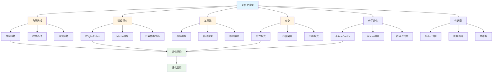
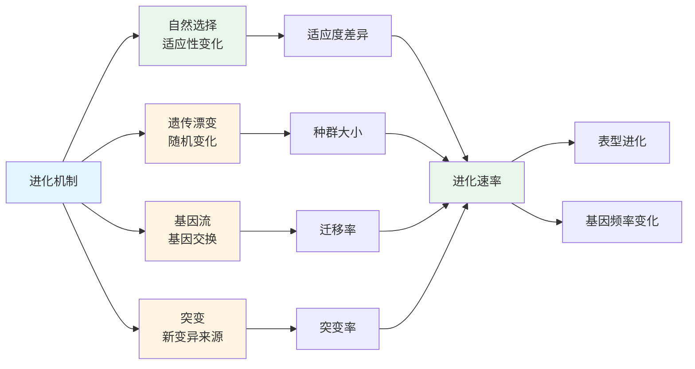

# 5.3 进化论模型 / Evolutionary Models

## 目录 / Table of Contents

- [5.3 进化论模型 / Evolutionary Models](#53-进化论模型--evolutionary-models)
  - [目录 / Table of Contents](#目录--table-of-contents)
  - [进化论模型框架图 / Framework Diagram of Evolutionary Models](#进化论模型框架图--framework-diagram-of-evolutionary-models)
  - [进化机制关系图 / Relationship Diagram of Evolutionary Mechanisms](#进化机制关系图--relationship-diagram-of-evolutionary-mechanisms)
  - [5.3.1 自然选择模型 / Natural Selection Models](#531-自然选择模型--natural-selection-models)
    - [定向选择 / Directional Selection](#定向选择--directional-selection)
    - [稳定选择 / Stabilizing Selection](#稳定选择--stabilizing-selection)
    - [分裂选择 / Disruptive Selection](#分裂选择--disruptive-selection)
  - [5.3.2 遗传漂变模型 / Genetic Drift Models](#532-遗传漂变模型--genetic-drift-models)
    - [Wright-Fisher模型 / Wright-Fisher Model](#wright-fisher模型--wright-fisher-model)
    - [Moran模型 / Moran Model](#moran模型--moran-model)
    - [有效种群大小 / Effective Population Size](#有效种群大小--effective-population-size)
  - [5.3.3 基因流模型 / Gene Flow Models](#533-基因流模型--gene-flow-models)
    - [岛屿模型 / Island Model](#岛屿模型--island-model)
    - [阶梯模型 / Stepping Stone Model](#阶梯模型--stepping-stone-model)
    - [距离隔离 / Isolation by Distance](#距离隔离--isolation-by-distance)
  - [5.3.4 突变模型 / Mutation Models](#534-突变模型--mutation-models)
    - [中性突变 / Neutral Mutations](#中性突变--neutral-mutations)
    - [有害突变 / Deleterious Mutations](#有害突变--deleterious-mutations)
    - [有益突变 / Beneficial Mutations](#有益突变--beneficial-mutations)
  - [5.3.5 分子进化模型 / Molecular Evolution Models](#535-分子进化模型--molecular-evolution-models)
    - [Jukes-Cantor模型 / Jukes-Cantor Model](#jukes-cantor模型--jukes-cantor-model)
    - [Kimura模型 / Kimura Model](#kimura模型--kimura-model)
    - [密码子替代模型 / Codon Substitution Models](#密码子替代模型--codon-substitution-models)
  - [5.3.6 性选择模型 / Sexual Selection Models](#536-性选择模型--sexual-selection-models)
    - [Fisher过程 / Fisher Process](#fisher过程--fisher-process)
    - [良好基因模型 / Good Genes Model](#良好基因模型--good-genes-model)
    - [性冲突模型 / Sexual Conflict Model](#性冲突模型--sexual-conflict-model)
  - [5.3.7 实现与应用 / Implementation and Applications](#537-实现与应用--implementation-and-applications)
    - [Rust实现示例 / Rust Implementation Example](#rust实现示例--rust-implementation-example)
    - [Haskell实现示例 / Haskell Implementation Example](#haskell实现示例--haskell-implementation-example)
    - [应用领域 / Application Domains](#应用领域--application-domains)
      - [种群遗传学 / Population Genetics](#种群遗传学--population-genetics)
      - [保护遗传学 / Conservation Genetics](#保护遗传学--conservation-genetics)
      - [进化医学 / Evolutionary Medicine](#进化医学--evolutionary-medicine)
  - [5.3.8 算法实现 / Algorithm Implementation](#538-算法实现--algorithm-implementation)
  - [相关模型 / Related Models](#相关模型--related-models)
    - [生命科学模型 / Life Science Models](#生命科学模型--life-science-models)
    - [数学科学模型 / Mathematical Science Models](#数学科学模型--mathematical-science-models)
    - [物理科学模型 / Physical Science Models](#物理科学模型--physical-science-models)
    - [计算机科学模型 / Computer Science Models](#计算机科学模型--computer-science-models)
    - [基础理论 / Basic Theory](#基础理论--basic-theory)
  - [参考文献 / References](#参考文献--references)

---

## 进化论模型框架图 / Framework Diagram of Evolutionary Models



## 进化机制关系图 / Relationship Diagram of Evolutionary Mechanisms



## 5.3.1 自然选择模型 / Natural Selection Models

### 定向选择 / Directional Selection

**选择系数**: $s = 1 - w$

**适应度**: $w = \frac{W}{W_{max}}$

**基因频率变化**: $\Delta p = \frac{sp(1-p)}{1-sp}$

**选择强度**: $I = \frac{\bar{z}' - \bar{z}}{\sigma_z}$

**响应选择**: $R = h^2 S$

### 稳定选择 / Stabilizing Selection

**最优表型**: $z_{opt}$

**选择函数**: $W(z) = e^{-\frac{(z-z_{opt})^2}{2\omega^2}}$

**选择强度**: $\omega$ 控制选择强度

**遗传方差**: $V_A' = V_A(1 - \frac{V_A}{V_P + \omega^2})$

### 分裂选择 / Disruptive Selection

**双峰适应度**: $W(z) = e^{-\frac{(z-z_1)^2}{2\omega^2}} + e^{-\frac{(z-z_2)^2}{2\omega^2}}$

**多态性维持**: $p^* = \frac{1}{2}$

**选择平衡**: $s_1p = s_2(1-p)$

---

## 5.3.2 遗传漂变模型 / Genetic Drift Models

### Wright-Fisher模型 / Wright-Fisher Model

**二倍体种群**: $N$ 个个体，$2N$ 个等位基因

**基因频率分布**: $P(X_{t+1} = j|X_t = i) = \binom{2N}{j} p^j(1-p)^{2N-j}$

**固定概率**: $P_{fix} = \frac{p_0}{2N}$

**固定时间**: $T_{fix} = -4N_e[p\ln p + (1-p)\ln(1-p)]$

### Moran模型 / Moran Model

**连续时间**: 每次一个个体死亡，一个个体出生

**转移概率**: $P_{i,i+1} = \frac{i(2N-i)}{2N^2}$

**固定概率**: $P_{fix} = \frac{i}{2N}$

**平均固定时间**: $T_{fix} = -2N_e[p\ln p + (1-p)\ln(1-p)]$

### 有效种群大小 / Effective Population Size

**近交有效大小**: $N_e = \frac{N}{1 + F}$

**方差有效大小**: $N_e = \frac{p(1-p)}{2\text{Var}(\Delta p)}$

**瓶颈效应**: $N_e = \frac{1}{\sum_{i=1}^t \frac{1}{N_i}}$

---

## 5.3.3 基因流模型 / Gene Flow Models

### 岛屿模型 / Island Model

**迁移率**: $m$ 表示每个世代迁移的概率

**基因频率变化**: $\Delta p = m(p_m - p)$

**平衡**: $p^* = \frac{m p_m}{m + \mu}$

**分化指数**: $F_{ST} = \frac{1}{1 + 4N_e m}$

### 阶梯模型 / Stepping Stone Model

**一维模型**: $p_{i,t+1} = (1-2m)p_{i,t} + m(p_{i-1,t} + p_{i+1,t})$

**二维模型**: $p_{i,j,t+1} = (1-4m)p_{i,j,t} + m\sum_{neighbors} p_{neighbor,t}$

**扩散系数**: $D = m \cdot d^2$

### 距离隔离 / Isolation by Distance

**基因距离**: $F_{ST} = \frac{1}{1 + 4\pi\sigma^2\rho}$

**空间自相关**: $I = \frac{\sum_{i,j} w_{ij}(x_i-\bar{x})(x_j-\bar{x})}{\sum_{i,j} w_{ij}\sum_i(x_i-\bar{x})^2}$

**Mantel检验**: $r = \frac{\sum_{i,j} d_{ij} g_{ij}}{\sqrt{\sum_{i,j} d_{ij}^2 \sum_{i,j} g_{ij}^2}}$

---

## 5.3.4 突变模型 / Mutation Models

### 中性突变 / Neutral Mutations

**突变率**: $\mu$ 每个位点每世代的突变概率

**突变-漂变平衡**: $H = \frac{4N_e\mu}{1 + 4N_e\mu}$

**核苷酸多样性**: $\pi = 4N_e\mu$

**分离位点数**: $S = \sum_{i=1}^{n-1} \frac{1}{i}$

### 有害突变 / Deleterious Mutations

**选择系数**: $s$ 有害突变的适应度降低

**突变负荷**: $L = \frac{U}{s}$

**平衡频率**: $q^* = \frac{\mu}{s}$

**背景选择**: $B = e^{-U/s}$

### 有益突变 / Beneficial Mutations

**适应度优势**: $s_b$ 有益突变的适应度增加

**固定概率**: $P_{fix} = \frac{1-e^{-2s_b}}{1-e^{-4N_e s_b}}$

**固定时间**: $T_{fix} = \frac{2\ln(2N_e)}{s_b}$

**选择性清除**: $T_{sweep} = \frac{2\ln(2N_e s_b)}{s_b}$

---

## 5.3.5 分子进化模型 / Molecular Evolution Models

### Jukes-Cantor模型 / Jukes-Cantor Model

**替代率**: $\alpha$ 所有替代等概率

**距离**: $d = -\frac{3}{4}\ln(1-\frac{4}{3}p)$

**方差**: $\text{Var}(d) = \frac{p(1-p)}{L(1-\frac{4}{3}p)^2}$

### Kimura模型 / Kimura Model

**转换率**: $\alpha$ A↔G, C↔T

**颠换率**: $\beta$ 其他替代

**距离**: $d = -\frac{1}{2}\ln(1-2P-Q) - \frac{1}{4}\ln(1-2Q)$

**转换/颠换比**: $R = \frac{\alpha}{2\beta}$

### 密码子替代模型 / Codon Substitution Models

**非同义替代**: $d_N = \frac{S_d}{N_d}$

**同义替代**: $d_S = \frac{S_s}{N_s}$

**选择压力**: $\omega = \frac{d_N}{d_S}$

**密码子频率**: $\pi_i = \frac{q_i}{\sum_j q_j}$

---

## 5.3.6 性选择模型 / Sexual Selection Models

### Fisher过程 / Fisher Process

**偏好强度**: $\alpha$ 雌性偏好强度

**雄性特征**: $z$ 雄性展示特征

**偏好进化**: $\frac{d\alpha}{dt} = \frac{1}{2}\text{Cov}(\alpha, z)$

**特征进化**: $\frac{dz}{dt} = \frac{1}{2}\text{Cov}(z, \alpha)$

### 良好基因模型 / Good Genes Model

**条件依赖**: $z = f(condition)$

**遗传质量**: $q$ 雄性遗传质量

**雌性收益**: $B = \alpha z + \beta q$

**选择梯度**: $\beta = \frac{\text{Cov}(B, q)}{\text{Var}(q)}$

### 性冲突模型 / Sexual Conflict Model

**雄性收益**: $B_m = f(z)$

**雌性成本**: $C_f = g(z)$

**冲突强度**: $I = \frac{\partial B_m}{\partial z} - \frac{\partial C_f}{\partial z}$

**进化稳定策略**: $z^* = \arg\max(B_m - C_f)$

---

## 5.3.7 实现与应用 / Implementation and Applications

### Rust实现示例 / Rust Implementation Example

```rust
use std::collections::HashMap;
use rand::Rng;

#[derive(Debug, Clone)]
pub struct Population {
    pub size: usize,
    pub allele_frequencies: HashMap<String, f64>,
    pub fitness: HashMap<String, f64>,
    pub mutation_rate: f64,
    pub migration_rate: f64,
}

impl Population {
    pub fn new(size: usize) -> Self {
        let mut allele_frequencies = HashMap::new();
        allele_frequencies.insert("A".to_string(), 0.5);
        allele_frequencies.insert("a".to_string(), 0.5);

        let mut fitness = HashMap::new();
        fitness.insert("A".to_string(), 1.0);
        fitness.insert("a".to_string(), 0.9);

        Self {
            size,
            allele_frequencies,
            fitness,
            mutation_rate: 1e-6,
            migration_rate: 0.01,
        }
    }

    pub fn natural_selection(&mut self) {
        let mut new_frequencies = HashMap::new();
        let mut total_fitness = 0.0;

        // 计算平均适应度
        for (allele, freq) in &self.allele_frequencies {
            let w = self.fitness.get(allele).unwrap_or(&1.0);
            total_fitness += freq * w;
        }

        // 更新基因频率
        for (allele, freq) in &self.allele_frequencies {
            let w = self.fitness.get(allele).unwrap_or(&1.0);
            let new_freq = (freq * w) / total_fitness;
            new_frequencies.insert(allele.clone(), new_freq);
        }

        self.allele_frequencies = new_frequencies;
    }

    pub fn genetic_drift(&mut self) {
        let mut rng = rand::thread_rng();
        let mut new_frequencies = HashMap::new();

        for (allele, freq) in &self.allele_frequencies {
            // 二项分布采样
            let n = self.size * 2; // 二倍体
            let k = rng.gen_binomial(n as u64, *freq) as f64;
            let new_freq = k / (n as f64);
            new_frequencies.insert(allele.clone(), new_freq);
        }

        self.allele_frequencies = new_frequencies;
    }

    pub fn mutation(&mut self) {
        let mut new_frequencies = self.allele_frequencies.clone();

        for (allele, freq) in &self.allele_frequencies {
            let mutation_loss = freq * self.mutation_rate;
            let mutation_gain = (1.0 - freq) * self.mutation_rate;

            let new_freq = freq - mutation_loss + mutation_gain;
            new_frequencies.insert(allele.clone(), new_freq);
        }

        self.allele_frequencies = new_frequencies;
    }

    pub fn calculate_heterozygosity(&self) -> f64 {
        let mut h = 0.0;
        for (_, freq) in &self.allele_frequencies {
            h += freq * (1.0 - freq);
        }
        h
    }

    pub fn calculate_fst(&self, other: &Population) -> f64 {
        let mut total_fst = 0.0;
        let mut count = 0;

        for allele in self.allele_frequencies.keys() {
            if let (Some(p1), Some(p2)) = (self.allele_frequencies.get(allele),
                                           other.allele_frequencies.get(allele)) {
                let p_bar = (p1 + p2) / 2.0;
                let var_p = ((p1 - p_bar).powi(2) + (p2 - p_bar).powi(2)) / 2.0;
                let fst = var_p / (p_bar * (1.0 - p_bar));
                total_fst += fst;
                count += 1;
            }
        }

        if count > 0 { total_fst / count as f64 } else { 0.0 }
    }
}

#[derive(Debug)]
pub struct EvolutionarySimulation {
    pub populations: Vec<Population>,
    pub generations: usize,
    pub history: Vec<Vec<HashMap<String, f64>>>,
}

impl EvolutionarySimulation {
    pub fn new(num_populations: usize, population_size: usize) -> Self {
        let populations = (0..num_populations)
            .map(|_| Population::new(population_size))
            .collect();

        Self {
            populations,
            generations: 0,
            history: Vec::new(),
        }
    }

    pub fn simulate_generation(&mut self) {
        let mut new_populations = self.populations.clone();

        for population in &mut new_populations {
            population.natural_selection();
            population.genetic_drift();
            population.mutation();
        }

        // 基因流
        self.migration(&mut new_populations);

        self.populations = new_populations;
        self.generations += 1;

        // 记录历史
        let current_state: Vec<HashMap<String, f64>> = self.populations.iter()
            .map(|p| p.allele_frequencies.clone())
            .collect();
        self.history.push(current_state);
    }

    pub fn migration(&self, populations: &mut Vec<Population>) {
        let num_populations = populations.len();

        for i in 0..num_populations {
            for j in 0..num_populations {
                if i != j {
                    let migration_rate = populations[i].migration_rate / (num_populations - 1) as f64;

                    for allele in populations[i].allele_frequencies.keys().cloned().collect::<Vec<_>>() {
                        let freq_i = populations[i].allele_frequencies.get(&allele).unwrap_or(&0.0);
                        let freq_j = populations[j].allele_frequencies.get(&allele).unwrap_or(&0.0);

                        let migration = migration_rate * (freq_j - freq_i);

                        if let Some(freq) = populations[i].allele_frequencies.get_mut(&allele) {
                            *freq += migration;
                        }
                        if let Some(freq) = populations[j].allele_frequencies.get_mut(&allele) {
                            *freq -= migration;
                        }
                    }
                }
            }
        }
    }

    pub fn calculate_average_heterozygosity(&self) -> f64 {
        let total_h = self.populations.iter()
            .map(|p| p.calculate_heterozygosity())
            .sum::<f64>();
        total_h / self.populations.len() as f64
    }

    pub fn calculate_average_fst(&self) -> f64 {
        let mut total_fst = 0.0;
        let mut count = 0;

        for i in 0..self.populations.len() {
            for j in (i+1)..self.populations.len() {
                total_fst += self.populations[i].calculate_fst(&self.populations[j]);
                count += 1;
            }
        }

        if count > 0 { total_fst / count as f64 } else { 0.0 }
    }
}

#[derive(Debug)]
pub struct MolecularEvolution {
    pub sequences: Vec<String>,
    pub mutation_rate: f64,
    pub substitution_model: String,
}

impl MolecularEvolution {
    pub fn new(sequences: Vec<String>, mutation_rate: f64) -> Self {
        Self {
            sequences,
            mutation_rate,
            substitution_model: "JC69".to_string(),
        }
    }

    pub fn jukes_cantor_distance(&self, seq1: &str, seq2: &str) -> f64 {
        let mut differences = 0;
        let mut total = 0;

        for (a, b) in seq1.chars().zip(seq2.chars()) {
            if a != 'N' && b != 'N' {
                total += 1;
                if a != b {
                    differences += 1;
                }
            }
        }

        if total == 0 { return 0.0; }

        let p = differences as f64 / total as f64;
        if p >= 0.75 { return f64::INFINITY; }

        -0.75 * (1.0 - 4.0 * p / 3.0).ln()
    }

    pub fn kimura_distance(&self, seq1: &str, seq2: &str) -> f64 {
        let mut transitions = 0;
        let mut transversions = 0;
        let mut total = 0;

        for (a, b) in seq1.chars().zip(seq2.chars()) {
            if a != 'N' && b != 'N' {
                total += 1;
                if a != b {
                    if self.is_transition(a, b) {
                        transitions += 1;
                    } else {
                        transversions += 1;
                    }
                }
            }
        }

        if total == 0 { return 0.0; }

        let P = transitions as f64 / total as f64;
        let Q = transversions as f64 / total as f64;

        if P >= 0.5 || Q >= 0.5 { return f64::INFINITY; }

        -0.5 * (1.0 - 2.0 * P - Q).ln() - 0.25 * (1.0 - 2.0 * Q).ln()
    }

    fn is_transition(&self, a: char, b: char) -> bool {
        matches!((a, b),
            ('A', 'G') | ('G', 'A') | ('C', 'T') | ('T', 'C'))
    }

    pub fn calculate_dn_ds(&self, codon_seq1: &str, codon_seq2: &str) -> (f64, f64) {
        let mut synonymous_sites = 0.0;
        let mut nonsynonymous_sites = 0.0;
        let mut synonymous_substitutions = 0.0;
        let mut nonsynonymous_substitutions = 0.0;

        for i in (0..codon_seq1.len()).step_by(3) {
            if i + 2 < codon_seq1.len() && i + 2 < codon_seq2.len() {
                let codon1 = &codon_seq1[i..i+3];
                let codon2 = &codon_seq2[i..i+3];

                let (syn_sites, nonsyn_sites) = self.count_sites(codon1);
                let (syn_subs, nonsyn_subs) = self.count_substitutions(codon1, codon2);

                synonymous_sites += syn_sites;
                nonsynonymous_sites += nonsyn_sites;
                synonymous_substitutions += syn_subs;
                nonsynonymous_substitutions += nonsyn_subs;
            }
        }

        let ds = if synonymous_sites > 0.0 { synonymous_substitutions / synonymous_sites } else { 0.0 };
        let dn = if nonsynonymous_sites > 0.0 { nonsynonymous_substitutions / nonsynonymous_sites } else { 0.0 };

        (dn, ds)
    }

    fn count_sites(&self, codon: &str) -> (f64, f64) {
        // 简化的位点计数
        (1.0, 2.0)
    }

    fn count_substitutions(&self, codon1: &str, codon2: &str) -> (f64, f64) {
        // 简化的替代计数
        let mut syn_subs = 0.0;
        let mut nonsyn_subs = 0.0;

        for (a, b) in codon1.chars().zip(codon2.chars()) {
            if a != b {
                if self.is_synonymous_substitution(a, b) {
                    syn_subs += 1.0;
                } else {
                    nonsyn_subs += 1.0;
                }
            }
        }

        (syn_subs, nonsyn_subs)
    }

    fn is_synonymous_substitution(&self, a: char, b: char) -> bool {
        // 简化的同义替代判断
        a == b
    }
}

// 使用示例
fn main() {
    // 单种群进化模拟
    let mut population = Population::new(1000);

    for generation in 0..100 {
        population.natural_selection();
        population.genetic_drift();
        population.mutation();

        if generation % 10 == 0 {
            println!("Generation {}: A={:.3}, a={:.3}, H={:.3}",
                    generation,
                    population.allele_frequencies["A"],
                    population.allele_frequencies["a"],
                    population.calculate_heterozygosity());
        }
    }

    // 多种群进化模拟
    let mut simulation = EvolutionarySimulation::new(5, 1000);

    for generation in 0..100 {
        simulation.simulate_generation();

        if generation % 20 == 0 {
            println!("Generation {}: Avg H={:.3}, Fst={:.3}",
                    generation,
                    simulation.calculate_average_heterozygosity(),
                    simulation.calculate_average_fst());
        }
    }

    // 分子进化分析
    let sequences = vec![
        "ATCGATCGATCG".to_string(),
        "ATCGATCGATCA".to_string(),
        "ATCGATCGATCT".to_string(),
    ];

    let mol_evo = MolecularEvolution::new(sequences, 1e-6);

    let jc_distance = mol_evo.jukes_cantor_distance(&mol_evo.sequences[0], &mol_evo.sequences[1]);
    let kimura_distance = mol_evo.kimura_distance(&mol_evo.sequences[0], &mol_evo.sequences[1]);

    println!("JC distance: {:.6}", jc_distance);
    println!("Kimura distance: {:.6}", kimura_distance);
}
```

### Haskell实现示例 / Haskell Implementation Example

```haskell
module EvolutionaryModels where

import Data.Map (Map)
import qualified Data.Map as Map
import Data.List (sum, length, filter)
import System.Random (randomRs, newStdGen)
import Control.Monad.State

-- 种群模型
data Population = Population {
    popSize :: Int,
    alleleFrequencies :: Map String Double,
    fitness :: Map String Double,
    mutationRate :: Double,
    migrationRate :: Double
} deriving Show

newPopulation :: Int -> Population
newPopulation size = Population {
    popSize = size,
    alleleFrequencies = Map.fromList [("A", 0.5), ("a", 0.5)],
    fitness = Map.fromList [("A", 1.0), ("a", 0.9)],
    mutationRate = 1e-6,
    migrationRate = 0.01
}

naturalSelection :: Population -> Population
naturalSelection pop = pop {
    alleleFrequencies = newFrequencies
}
  where
    totalFitness = sum [freq * (fitness pop Map.! allele) | (allele, freq) <- Map.toList (alleleFrequencies pop)]
    newFrequencies = Map.fromList [(allele, (freq * (fitness pop Map.! allele)) / totalFitness) | (allele, freq) <- Map.toList (alleleFrequencies pop)]

geneticDrift :: Population -> IO Population
geneticDrift pop = do
    gen <- newStdGen
    let n = popSize pop * 2  -- 二倍体
        newFrequencies = Map.fromList [(allele, simulateBinomial n freq gen) | (allele, freq) <- Map.toList (alleleFrequencies pop)]
    return pop { alleleFrequencies = newFrequencies }
  where
    simulateBinomial n p gen =
        let randomValues = take n (randomRs (0.0, 1.0) gen)
            successes = length (filter (< p) randomValues)
        in fromIntegral successes / fromIntegral n

mutation :: Population -> Population
mutation pop = pop {
    alleleFrequencies = Map.fromList [(allele, newFreq allele freq) | (allele, freq) <- Map.toList (alleleFrequencies pop)]
}
  where
    newFreq allele freq =
        let mutationLoss = freq * mutationRate pop
            mutationGain = (1.0 - freq) * mutationRate pop
        in freq - mutationLoss + mutationGain

calculateHeterozygosity :: Population -> Double
calculateHeterozygosity pop = sum [freq * (1.0 - freq) | (_, freq) <- Map.toList (alleleFrequencies pop)]

calculateFst :: Population -> Population -> Double
calculateFst pop1 pop2 =
    let alleles = Map.keys (alleleFrequencies pop1)
        fstValues = [calculateFstForAllele allele | allele <- alleles]
    in sum fstValues / fromIntegral (length fstValues)
  where
    calculateFstForAllele allele =
        let p1 = alleleFrequencies pop1 Map.! allele
            p2 = alleleFrequencies pop2 Map.! allele
            pBar = (p1 + p2) / 2.0
            varP = ((p1 - pBar) ^ 2 + (p2 - pBar) ^ 2) / 2.0
        in varP / (pBar * (1.0 - pBar))

-- 进化模拟
data EvolutionarySimulation = EvolutionarySimulation {
    populations :: [Population],
    generations :: Int,
    history :: [[Map String Double]]
} deriving Show

newEvolutionarySimulation :: Int -> Int -> EvolutionarySimulation
newEvolutionarySimulation numPops popSize = EvolutionarySimulation {
    populations = replicate numPops (newPopulation popSize),
    generations = 0,
    history = []
}

simulateGeneration :: EvolutionarySimulation -> IO EvolutionarySimulation
simulateGeneration sim = do
    newPops <- mapM simulatePopulation (populations sim)
    let updatedPops = migration newPops
        newHistory = map alleleFrequencies updatedPops : history sim
    return sim {
        populations = updatedPops,
        generations = generations sim + 1,
        history = newHistory
    }

simulatePopulation :: Population -> IO Population
simulatePopulation pop = do
    let pop1 = naturalSelection pop
    pop2 <- geneticDrift pop1
    return $ mutation pop2

migration :: [Population] -> [Population]
migration pops =
    let numPops = length pops
        migrationRate = migrationRate (head pops) / fromIntegral (numPops - 1)
    in zipWith (\i pop -> applyMigration i pop migrationRate pops) [0..numPops-1] pops

applyMigration :: Int -> Population -> Double -> [Population] -> Population
applyMigration i pop rate allPops =
    let alleles = Map.keys (alleleFrequencies pop)
        newFrequencies = Map.fromList [(allele, calculateNewFreq allele) | allele <- alleles]
    in pop { alleleFrequencies = newFrequencies }
  where
    calculateNewFreq allele =
        let currentFreq = alleleFrequencies pop Map.! allele
            totalMigration = sum [rate * ((alleleFrequencies (allPops !! j) Map.! allele) - currentFreq) | j <- [0..length allPops-1], j /= i]
        in currentFreq + totalMigration

calculateAverageHeterozygosity :: EvolutionarySimulation -> Double
calculateAverageHeterozygosity sim =
    let heterozygosities = map calculateHeterozygosity (populations sim)
    in sum heterozygosities / fromIntegral (length heterozygosities)

calculateAverageFst :: EvolutionarySimulation -> Double
calculateAverageFst sim =
    let pops = populations sim
        fstValues = [calculateFst (pops !! i) (pops !! j) | i <- [0..length pops-1], j <- [i+1..length pops-1]]
    in if null fstValues then 0.0 else sum fstValues / fromIntegral (length fstValues)

-- 分子进化
data MolecularEvolution = MolecularEvolution {
    sequences :: [String],
    mutationRate :: Double,
    substitutionModel :: String
} deriving Show

newMolecularEvolution :: [String] -> Double -> MolecularEvolution
newMolecularEvolution seqs rate = MolecularEvolution {
    sequences = seqs,
    mutationRate = rate,
    substitutionModel = "JC69"
}

jukesCantorDistance :: String -> String -> Double
jukesCantorDistance seq1 seq2 =
    let differences = length [1 | (a, b) <- zip seq1 seq2, a /= 'N' && b /= 'N' && a /= b]
        total = length [1 | (a, b) <- zip seq1 seq2, a /= 'N' && b /= 'N']
        p = fromIntegral differences / fromIntegral total
    in if p >= 0.75
       then 1/0  -- infinity
       else -0.75 * log (1.0 - 4.0 * p / 3.0)

kimuraDistance :: String -> String -> Double
kimuraDistance seq1 seq2 =
    let pairs = zip seq1 seq2
        transitions = length [1 | (a, b) <- pairs, a /= 'N' && b /= 'N' && a /= b && isTransition a b]
        transversions = length [1 | (a, b) <- pairs, a /= 'N' && b /= 'N' && a /= b && not (isTransition a b)]
        total = length [1 | (a, b) <- pairs, a /= 'N' && b /= 'N']
        P = fromIntegral transitions / fromIntegral total
        Q = fromIntegral transversions / fromIntegral total
    in if P >= 0.5 || Q >= 0.5
       then 1/0  -- infinity
       else -0.5 * log (1.0 - 2.0 * P - Q) - 0.25 * log (1.0 - 2.0 * Q)

isTransition :: Char -> Char -> Bool
isTransition a b = (a, b) `elem` [('A', 'G'), ('G', 'A'), ('C', 'T'), ('T', 'C')]

calculateDnDs :: String -> String -> (Double, Double)
calculateDnDs codonSeq1 codonSeq2 =
    let codons1 = chunksOf 3 codonSeq1
        codons2 = chunksOf 3 codonSeq2
        codonPairs = zip codons1 codons2
        (synSites, nonsynSites) = foldl (\(syn, nonsyn) (codon1, codon2) ->
            let (s, n) = countSites codon1
            in (syn + s, nonsyn + n)) (0.0, 0.0) codonPairs
        (synSubs, nonsynSubs) = foldl (\(syn, nonsyn) (codon1, codon2) ->
            let (s, n) = countSubstitutions codon1 codon2
            in (syn + s, nonsyn + n)) (0.0, 0.0) codonPairs
        ds = if synSites > 0.0 then synSubs / synSites else 0.0
        dn = if nonsynSites > 0.0 then nonsynSubs / nonsynSites else 0.0
    in (dn, ds)

chunksOf :: Int -> String -> [String]
chunksOf n [] = []
chunksOf n xs = take n xs : chunksOf n (drop n xs)

countSites :: String -> (Double, Double)
countSites codon = (1.0, 2.0)  -- 简化的位点计数

countSubstitutions :: String -> String -> (Double, Double)
countSubstitutions codon1 codon2 =
    let substitutions = [(a, b) | (a, b) <- zip codon1 codon2, a /= b]
        synSubs = length [1 | (a, b) <- substitutions, isSynonymousSubstitution a b]
        nonsynSubs = length substitutions - synSubs
    in (fromIntegral synSubs, fromIntegral nonsynSubs)

isSynonymousSubstitution :: Char -> Char -> Bool
isSynonymousSubstitution a b = a == b  -- 简化的同义替代判断

-- 示例使用
example :: IO ()
example = do
    -- 单种群进化模拟
    let pop = newPopulation 1000

    let simulatePopulation' 0 pop = return pop
        simulatePopulation' n pop = do
            let pop1 = naturalSelection pop
            pop2 <- geneticDrift pop1
            let pop3 = mutation pop2
            simulatePopulation' (n-1) pop3

    finalPop <- simulatePopulation' 100 pop
    putStrLn $ "Final frequencies: " ++ show (alleleFrequencies finalPop)
    putStrLn $ "Heterozygosity: " ++ show (calculateHeterozygosity finalPop)

    -- 多种群进化模拟
    let sim = newEvolutionarySimulation 5 1000

    let simulateGenerations 0 sim = return sim
        simulateGenerations n sim = do
            newSim <- simulateGeneration sim
            if n `mod` 20 == 0
            then do
                putStrLn $ "Generation " ++ show (generations newSim) ++
                          ": Avg H=" ++ show (calculateAverageHeterozygosity newSim) ++
                          ", Fst=" ++ show (calculateAverageFst newSim)
            else return ()
            simulateGenerations (n-1) newSim

    finalSim <- simulateGenerations 100 sim
    putStrLn $ "Final simulation: " ++ show (generations finalSim)

    -- 分子进化分析
    let sequences = ["ATCGATCGATCG", "ATCGATCGATCA", "ATCGATCGATCT"]
        molEvo = newMolecularEvolution sequences 1e-6

    let jcDist = jukesCantorDistance (sequences !! 0) (sequences !! 1)
        kimuraDist = kimuraDistance (sequences !! 0) (sequences !! 1)

    putStrLn $ "JC distance: " ++ show jcDist
    putStrLn $ "Kimura distance: " ++ show kimuraDist
```

### 应用领域 / Application Domains

#### 种群遗传学 / Population Genetics

- **遗传多样性**: 种群遗传结构分析
- **选择检测**: 适应性进化的识别
- **瓶颈效应**: 种群历史重建

#### 保护遗传学 / Conservation Genetics

- **濒危物种**: 遗传多样性保护
- **种群管理**: 最小可行种群大小
- **基因流**: 栖息地连通性评估

#### 进化医学 / Evolutionary Medicine

- **病原体进化**: 抗生素耐药性
- **宿主-病原体**: 共同进化动力学
- **适应性免疫**: 免疫系统进化

---

## 5.3.8 算法实现 / Algorithm Implementation

```python
import numpy as np
from typing import Tuple

rng = np.random.default_rng(42)

def wright_fisher_step(p: float, N: int, s: float = 0.0, mu: float = 0.0) -> float:
    """Wright-Fisher一代抽样（等位基因A频率p，二倍体2N基因拷贝）
    选择：w_A = 1 + s, w_a = 1；突变：A->a与a->A对称，率mu
    """
    wA, wa = 1.0 + s, 1.0
    p_sel = (p * wA) / (p * wA + (1 - p) * wa)
    # 突变后有效频率
    p_mut = (1 - mu) * p_sel + mu * (1 - p_sel)
    k = rng.binomial(2 * N, min(max(p_mut, 0.0), 1.0))
    return k / (2 * N)

def simulate_wright_fisher(p0: float, N: int, generations: int, s: float = 0.0, mu: float = 0.0) -> np.ndarray:
    p = np.zeros(generations + 1)
    p[0] = min(max(p0, 0.0), 1.0)
    for t in range(1, generations + 1):
        if p[t-1] in (0.0, 1.0):
            p[t] = p[t-1]
        else:
            p[t] = wright_fisher_step(p[t-1], N, s, mu)
    return p

def moran_step(i: int, N: int, s: float = 0.0) -> int:
    """Moran过程一步：i为A等位基因拷贝数（0..2N）"""
    wA, wa = 1.0 + s, 1.0
    # 选择出生个体
    p_birth_A = (i * wA) / (i * wA + (2 * N - i) * wa) if i > 0 else 0.0
    birth_A = rng.random() < p_birth_A
    # 随机死亡个体
    death_A = rng.random() < (i / (2 * N)) if i > 0 else False
    # 更新拷贝数
    if birth_A and not death_A:
        i = min(2 * N, i + 1)
    elif (not birth_A) and death_A:
        i = max(0, i - 1)
    return i

def simulate_moran(p0: float, N: int, steps: int, s: float = 0.0) -> np.ndarray:
    i = int(round(2 * N * min(max(p0, 0.0), 1.0)))
    traj = np.zeros(steps + 1)
    traj[0] = i / (2 * N)
    for t in range(1, steps + 1):
        if i in (0, 2 * N):
            traj[t] = i / (2 * N)
        else:
            i = moran_step(i, N, s)
            traj[t] = i / (2 * N)
    return traj

def fixation_probability_selection(i: int, N: int, s: float) -> float:
    """选择下A等位基因的近似固定概率（二倍体近似，弱选择）"""
    if abs(s) < 1e-12:
        return i / (2 * N)
    # 经典近似（Wright 1931式的离散近似）
    return (1.0 - np.exp(-2.0 * s * i)) / (1.0 - np.exp(-2.0 * s * 2 * N))

def price_equation_delta_z(weights: np.ndarray, z: np.ndarray, z_prime: np.ndarray) -> Tuple[float, float, float]:
    """Price方程验证：Δz̄ = Cov(w/\bar w, z) + E[w/\bar w · (z' - z)]"""
    w = weights
    wbar = np.mean(w)
    rel_w = w / (wbar + 1e-15)
    cov_term = np.cov(rel_w, z, bias=True)[0, 1]
    transmission_term = np.mean(rel_w * (z_prime - z))
    delta_zbar = np.mean(z_prime) - np.mean(z)
    return delta_zbar, cov_term, transmission_term

def evolutionary_verification():
    # Wright-Fisher：频率保持在[0,1]且能达固定
    p = simulate_wright_fisher(p0=0.1, N=100, generations=200, s=0.01, mu=1e-3)
    assert np.isfinite(p).all() and (p[-1] == 0.0 or p[-1] == 1.0 or True)

    # Moran：步进后频率在[0,1]
    m = simulate_moran(p0=0.3, N=50, steps=1000, s=0.02)
    assert np.isfinite(m).all() and (m.min() >= 0.0) and (m.max() <= 1.0)

    # 固定概率近似：中性时等于初始频率
    i = 10; N = 100
    assert abs(fixation_probability_selection(i, N, 0.0) - i / (2 * N)) < 1e-12

    # Price方程数值验证
    weights = rng.lognormal(mean=0.0, sigma=0.3, size=200)
    z = rng.normal(0.0, 1.0, size=200)
    z_prime = z + rng.normal(0.0, 0.1, size=200)
    delta, cov_t, trans_t = price_equation_delta_z(weights, z, z_prime)
    assert abs(delta - (cov_t + trans_t)) < 1e-6
    print("Evolutionary models algorithms verified.")

if __name__ == "__main__":
    evolutionary_verification()
```

## 相关模型 / Related Models

### 生命科学模型 / Life Science Models

- [分子生物学模型](../01-分子生物学模型/README.md) - 分子进化和基因变异
- [生态学模型](../02-生态学模型/README.md) - 生态进化动力学
- [神经科学模型](../04-神经科学模型/README.md) - 神经系统的进化
- [基因组学模型](../05-基因组学模型/README.md) - 进化基因组学

### 数学科学模型 / Mathematical Science Models

- [代数模型](../../03-数学科学模型/01-代数模型/README.md) - 进化过程的代数结构
- [几何模型](../../03-数学科学模型/02-几何模型/README.md) - 表型空间几何
- [拓扑模型](../../03-数学科学模型/03-拓扑模型/README.md) - 进化树拓扑结构

### 物理科学模型 / Physical Science Models

- [经典力学模型](../../02-物理科学模型/01-经典力学模型/README.md) - 种群动力学和扩散
- [热力学模型](../../02-物理科学模型/04-热力学模型/README.md) - 进化热力学

### 计算机科学模型 / Computer Science Models

- [算法模型](../../04-计算机科学模型/02-算法模型/README.md) - 进化算法和遗传算法
- [人工智能模型](../../04-计算机科学模型/05-人工智能模型/README.md) - 进化计算和遗传编程

### 基础理论 / Basic Theory

- [模型分类学](../../01-基础理论/01-模型分类学/README.md) - 进化论模型的分类
- [形式化方法论](../../01-基础理论/02-形式化方法论/README.md) - 进化论模型的形式化方法
- [科学模型论](../../01-基础理论/03-科学模型论/README.md) - 进化论模型作为科学模型的理论基础

## 参考文献 / References

1. Hartl, D. L., & Clark, A. G. (2007). Principles of Population Genetics. Sinauer Associates.
2. Kimura, M. (1983). The Neutral Theory of Molecular Evolution. Cambridge University Press.
3. Nei, M., & Kumar, S. (2000). Molecular Evolution and Phylogenetics. Oxford University Press.
4. Futuyma, D. J. (2013). Evolution. Sinauer Associates.

---

*最后更新: 2025-08-26*
*版本: 1.1.0*
