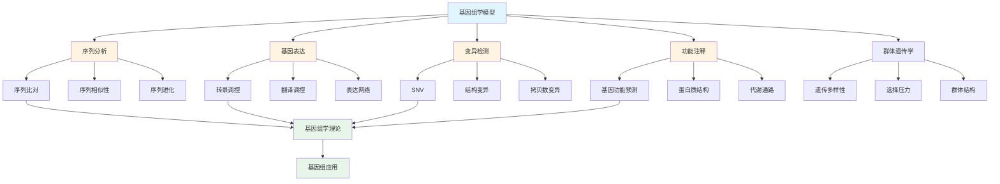
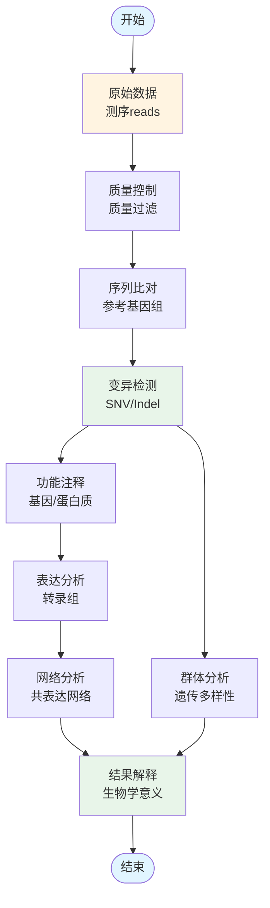

# 5.5 基因组学模型 / Genomics Models

## 目录 / Table of Contents

- [5.5 基因组学模型 / Genomics Models](#55-基因组学模型--genomics-models)
  - [目录 / Table of Contents](#目录--table-of-contents)
  - [基因组学模型框架图 / Framework Diagram of Genomics Models](#基因组学模型框架图--framework-diagram-of-genomics-models)
  - [基因组数据分析流程图 / Flowchart of Genomic Data Analysis](#基因组数据分析流程图--flowchart-of-genomic-data-analysis)
  - [5.5.1 序列分析模型 / Sequence Analysis Models](#551-序列分析模型--sequence-analysis-models)
    - [序列比对 / Sequence Alignment](#序列比对--sequence-alignment)
    - [序列相似性 / Sequence Similarity](#序列相似性--sequence-similarity)
    - [序列进化 / Sequence Evolution](#序列进化--sequence-evolution)
  - [5.5.2 基因表达模型 / Gene Expression Models](#552-基因表达模型--gene-expression-models)
    - [转录调控 / Transcriptional Regulation](#转录调控--transcriptional-regulation)
    - [翻译调控 / Translational Regulation](#翻译调控--translational-regulation)
    - [表达网络 / Expression Networks](#表达网络--expression-networks)
  - [5.5.3 变异检测模型 / Variant Detection Models](#553-变异检测模型--variant-detection-models)
    - [单核苷酸变异 / Single Nucleotide Variants](#单核苷酸变异--single-nucleotide-variants)
    - [结构变异 / Structural Variants](#结构变异--structural-variants)
    - [拷贝数变异 / Copy Number Variants](#拷贝数变异--copy-number-variants)
  - [5.5.4 功能注释模型 / Functional Annotation Models](#554-功能注释模型--functional-annotation-models)
    - [基因功能预测 / Gene Function Prediction](#基因功能预测--gene-function-prediction)
    - [蛋白质结构预测 / Protein Structure Prediction](#蛋白质结构预测--protein-structure-prediction)
    - [代谢通路分析 / Metabolic Pathway Analysis](#代谢通路分析--metabolic-pathway-analysis)
  - [5.5.5 群体遗传学模型 / Population Genetics Models](#555-群体遗传学模型--population-genetics-models)
    - [遗传多样性 / Genetic Diversity](#遗传多样性--genetic-diversity)
    - [选择压力 / Selection Pressure](#选择压力--selection-pressure)
    - [群体结构 / Population Structure](#群体结构--population-structure)
  - [5.5.6 实现与应用 / Implementation and Applications](#556-实现与应用--implementation-and-applications)
    - [Rust实现示例 / Rust Implementation Example](#rust实现示例--rust-implementation-example)
    - [Haskell实现示例 / Haskell Implementation Example](#haskell实现示例--haskell-implementation-example)
    - [Julia实现示例 / Julia Implementation Example](#julia实现示例--julia-implementation-example)
    - [应用领域 / Application Domains](#应用领域--application-domains)
      - [医学基因组学 / Medical Genomics](#医学基因组学--medical-genomics)
      - [农业基因组学 / Agricultural Genomics](#农业基因组学--agricultural-genomics)
      - [进化基因组学 / Evolutionary Genomics](#进化基因组学--evolutionary-genomics)
  - [5.5.7 算法实现 / Algorithm Implementation](#557-算法实现--algorithm-implementation)
  - [相关模型 / Related Models](#相关模型--related-models)
    - [生命科学模型 / Life Science Models](#生命科学模型--life-science-models)
    - [数学科学模型 / Mathematical Science Models](#数学科学模型--mathematical-science-models)
    - [物理科学模型 / Physical Science Models](#物理科学模型--physical-science-models)
    - [计算机科学模型 / Computer Science Models](#计算机科学模型--computer-science-models)
    - [基础理论 / Basic Theory](#基础理论--basic-theory)
  - [参考文献 / References](#参考文献--references)

---

## 基因组学模型框架图 / Framework Diagram of Genomics Models



## 基因组数据分析流程图 / Flowchart of Genomic Data Analysis



## 5.5.1 序列分析模型 / Sequence Analysis Models

### 序列比对 / Sequence Alignment

**全局比对**: $\max \sum_{i=1}^n s(x_i, y_i) - \sum_{k=1}^m g_k$

**局部比对**: $\max \sum_{i=1}^n s(x_i, y_i) - \sum_{k=1}^m g_k$

**动态规划**: $S(i,j) = \max \begin{cases} S(i-1,j-1) + s(x_i, y_j) \\ S(i-1,j) - g \\ S(i,j-1) - g \end{cases}$

### 序列相似性 / Sequence Similarity

**编辑距离**: $d(x,y) = \min \{ \text{操作次数} \}$

**汉明距离**: $d_H(x,y) = \sum_{i=1}^n [x_i \neq y_i]$

**相似性得分**: $S = \frac{\text{匹配数}}{\text{总长度}}$

### 序列进化 / Sequence Evolution

**Jukes-Cantor模型**: $d = -\frac{3}{4} \ln(1 - \frac{4}{3}p)$

**Kimura模型**: $d = -\frac{1}{2} \ln(1 - 2P - Q) - \frac{1}{4} \ln(1 - 2Q)$

**进化速率**: $r = \frac{d}{t}$

---

## 5.5.2 基因表达模型 / Gene Expression Models

### 转录调控 / Transcriptional Regulation

**转录因子结合**: $P(binding) = \frac{e^{-\beta E}}{1 + e^{-\beta E}}$

**启动子强度**: $S = \sum_{i=1}^n w_i \cdot f_i$

**表达水平**: $E = \frac{\alpha \cdot TF}{K + TF}$

### 翻译调控 / Translational Regulation

**翻译效率**: $\eta = \frac{\text{蛋白质}}{\text{mRNA}}$

**核糖体密度**: $\rho = \frac{\text{核糖体数}}{\text{转录本长度}}$

**翻译速率**: $k_{trans} = \frac{\rho \cdot v}{L}$

### 表达网络 / Expression Networks

**相关性矩阵**: $R_{ij} = \frac{\text{Cov}(X_i, X_j)}{\sigma_i \sigma_j}$

**互信息**: $I(X;Y) = \sum_{x,y} p(x,y) \log \frac{p(x,y)}{p(x)p(y)}$

**网络拓扑**: $C = \frac{2E}{V(V-1)}$

---

## 5.5.3 变异检测模型 / Variant Detection Models

### 单核苷酸变异 / Single Nucleotide Variants

**变异频率**: $f = \frac{\text{变异等位基因数}}{\text{总等位基因数}}$

**质量得分**: $Q = -10 \log_{10} P(error)$

**似然比**: $LR = \frac{P(data|variant)}{P(data|reference)}$

### 结构变异 / Structural Variants

**插入缺失**: $SV = \begin{cases} \text{插入} & \text{if } len > 0 \\ \text{缺失} & \text{if } len < 0 \end{cases}$

**倒位**: $inversion = (start, end, orientation)$

**易位**: $translocation = (chr1, pos1, chr2, pos2)$

### 拷贝数变异 / Copy Number Variants

**拷贝数**: $CN = \frac{\text{样本深度}}{\text{对照深度}}$

**对数比值**: $LR = \log_2 \frac{\text{样本}}{\text{对照}}$

**分段**: $segments = \{(start_i, end_i, CN_i)\}$

---

## 5.5.4 功能注释模型 / Functional Annotation Models

### 基因功能预测 / Gene Function Prediction

**同源性得分**: $S = \frac{\text{同源基因数}}{\text{总基因数}}$

**功能相似性**: $sim(f_1, f_2) = \frac{|f_1 \cap f_2|}{|f_1 \cup f_2|}$

**GO富集**: $P = \binom{N}{k} \binom{M-N}{n-k} / \binom{M}{n}$

### 蛋白质结构预测 / Protein Structure Prediction

**序列相似性**: $identity = \frac{\text{相同氨基酸数}}{\text{总长度}}$

**结构相似性**: $RMSD = \sqrt{\frac{1}{n} \sum_{i=1}^n d_i^2}$

**预测准确率**: $accuracy = \frac{\text{正确预测}}{\text{总预测}}$

### 代谢通路分析 / Metabolic Pathway Analysis

**通路富集**: $P = \sum_{i=k}^n \binom{n}{i} p^i (1-p)^{n-i}$

**代谢流量**: $v = \frac{d[S]}{dt} = k \cdot [E] \cdot [S]$

**网络分析**: $betweenness = \sum_{s \neq t} \frac{\sigma_{st}(v)}{\sigma_{st}}$

---

## 5.5.5 群体遗传学模型 / Population Genetics Models

### 遗传多样性 / Genetic Diversity

**杂合度**: $H = 1 - \sum_{i=1}^n p_i^2$

**核苷酸多样性**: $\pi = \frac{2 \sum_{i<j} d_{ij}}{n(n-1)}$

**单倍型多样性**: $H_d = \frac{n}{n-1} (1 - \sum_{i=1}^k p_i^2)$

### 选择压力 / Selection Pressure

**选择系数**: $s = \frac{w_{ref} - w_{mut}}{w_{ref}}$

**中性检验**: $Tajima's D = \frac{\hat{\theta}_\pi - \hat{\theta}_S}{\sqrt{\text{Var}(\hat{\theta}_\pi - \hat{\theta}_S)}}$

**连锁不平衡**: $D = P_{AB} - P_A P_B$

### 群体结构 / Population Structure

**F统计量**: $F_{ST} = \frac{H_T - H_S}{H_T}$

**主成分分析**: $PC_i = \sum_{j=1}^p w_{ij} X_j$

**贝叶斯聚类**: $P(Z_i = k) = \frac{\pi_k f_k(x_i)}{\sum_{l=1}^K \pi_l f_l(x_i)}$

---

## 5.5.6 实现与应用 / Implementation and Applications

### Rust实现示例 / Rust Implementation Example

```rust
use std::collections::HashMap;

#[derive(Debug, Clone)]
pub struct Sequence {
    pub id: String,
    pub sequence: String,
    pub description: String,
}

#[derive(Debug)]
pub struct Alignment {
    pub seq1: String,
    pub seq2: String,
    pub score: f64,
    pub matrix: Vec<Vec<f64>>,
}

impl Alignment {
    pub fn new(seq1: &str, seq2: &str) -> Self {
        let len1 = seq1.len();
        let len2 = seq2.len();
        let mut matrix = vec![vec![0.0; len2 + 1]; len1 + 1];

        // 初始化第一行和第一列
        for i in 0..=len1 {
            matrix[i][0] = -(i as f64) * 2.0;
        }
        for j in 0..=len2 {
            matrix[0][j] = -(j as f64) * 2.0;
        }

        Self {
            seq1: seq1.to_string(),
            seq2: seq2.to_string(),
            score: 0.0,
            matrix,
        }
    }

    pub fn global_alignment(&mut self, match_score: f64, mismatch_score: f64, gap_score: f64) -> f64 {
        let seq1_chars: Vec<char> = self.seq1.chars().collect();
        let seq2_chars: Vec<char> = self.seq2.chars().collect();

        for i in 1..=seq1_chars.len() {
            for j in 1..=seq2_chars.len() {
                let match_score_current = if seq1_chars[i-1] == seq2_chars[j-1] {
                    match_score
                } else {
                    mismatch_score
                };

                self.matrix[i][j] = (self.matrix[i-1][j-1] + match_score_current)
                    .max(self.matrix[i-1][j] + gap_score)
                    .max(self.matrix[i][j-1] + gap_score);
            }
        }

        self.score = self.matrix[seq1_chars.len()][seq2_chars.len()];
        self.score
    }

    pub fn traceback(&self) -> (String, String) {
        let mut aligned_seq1 = String::new();
        let mut aligned_seq2 = String::new();
        let seq1_chars: Vec<char> = self.seq1.chars().collect();
        let seq2_chars: Vec<char> = self.seq2.chars().collect();

        let mut i = seq1_chars.len();
        let mut j = seq2_chars.len();

        while i > 0 || j > 0 {
            if i > 0 && j > 0 && self.matrix[i][j] == self.matrix[i-1][j-1] +
                if seq1_chars[i-1] == seq2_chars[j-1] { 1.0 } else { -1.0 } {
                aligned_seq1.insert(0, seq1_chars[i-1]);
                aligned_seq2.insert(0, seq2_chars[j-1]);
                i -= 1;
                j -= 1;
            } else if i > 0 && self.matrix[i][j] == self.matrix[i-1][j] - 2.0 {
                aligned_seq1.insert(0, seq1_chars[i-1]);
                aligned_seq2.insert(0, '-');
                i -= 1;
            } else {
                aligned_seq1.insert(0, '-');
                aligned_seq2.insert(0, seq2_chars[j-1]);
                j -= 1;
            }
        }

        (aligned_seq1, aligned_seq2)
    }
}

#[derive(Debug)]
pub struct GeneExpression {
    pub gene_id: String,
    pub expression_levels: Vec<f64>,
    pub conditions: Vec<String>,
}

impl GeneExpression {
    pub fn new(gene_id: String) -> Self {
        Self {
            gene_id,
            expression_levels: Vec::new(),
            conditions: Vec::new(),
        }
    }

    pub fn add_expression(&mut self, level: f64, condition: String) {
        self.expression_levels.push(level);
        self.conditions.push(condition);
    }

    pub fn calculate_fold_change(&self, control_condition: &str, treatment_condition: &str) -> Option<f64> {
        let control_idx = self.conditions.iter().position(|c| c == control_condition)?;
        let treatment_idx = self.conditions.iter().position(|c| c == treatment_condition)?;

        let control_level = self.expression_levels[control_idx];
        let treatment_level = self.expression_levels[treatment_idx];

        if control_level > 0.0 {
            Some(treatment_level / control_level)
        } else {
            None
        }
    }

    pub fn calculate_correlation(&self, other: &GeneExpression) -> Option<f64> {
        if self.expression_levels.len() != other.expression_levels.len() {
            return None;
        }

        let n = self.expression_levels.len() as f64;
        let sum_x: f64 = self.expression_levels.iter().sum();
        let sum_y: f64 = other.expression_levels.iter().sum();
        let sum_xy: f64 = self.expression_levels.iter()
            .zip(other.expression_levels.iter())
            .map(|(x, y)| x * y)
            .sum();
        let sum_x2: f64 = self.expression_levels.iter().map(|x| x * x).sum();
        let sum_y2: f64 = other.expression_levels.iter().map(|y| y * y).sum();

        let numerator = n * sum_xy - sum_x * sum_y;
        let denominator = ((n * sum_x2 - sum_x * sum_x) * (n * sum_y2 - sum_y * sum_y)).sqrt();

        if denominator > 0.0 {
            Some(numerator / denominator)
        } else {
            None
        }
    }
}

#[derive(Debug)]
pub struct Variant {
    pub chromosome: String,
    pub position: u64,
    pub reference: String,
    pub alternate: String,
    pub quality: f64,
    pub frequency: f64,
}

impl Variant {
    pub fn new(chromosome: String, position: u64, reference: String, alternate: String) -> Self {
        Self {
            chromosome,
            position,
            reference,
            alternate,
            quality: 0.0,
            frequency: 0.0,
        }
    }

    pub fn is_snv(&self) -> bool {
        self.reference.len() == 1 && self.alternate.len() == 1
    }

    pub fn is_indel(&self) -> bool {
        self.reference.len() != self.alternate.len()
    }

    pub fn calculate_quality_score(&mut self, depth: u32, alt_count: u32) {
        if depth > 0 {
            self.frequency = alt_count as f64 / depth as f64;
            // 简化的质量得分计算
            self.quality = -10.0 * (1.0 - self.frequency).log10();
        }
    }
}

#[derive(Debug)]
pub struct PopulationGenetics {
    pub allele_frequencies: HashMap<String, f64>,
    pub genotypes: Vec<String>,
}

impl PopulationGenetics {
    pub fn new() -> Self {
        Self {
            allele_frequencies: HashMap::new(),
            genotypes: Vec::new(),
        }
    }

    pub fn add_genotype(&mut self, genotype: String) {
        self.genotypes.push(genotype);
    }

    pub fn calculate_allele_frequencies(&mut self) {
        let mut allele_counts: HashMap<String, u32> = HashMap::new();
        let mut total_alleles = 0;

        for genotype in &self.genotypes {
            for allele in genotype.chars() {
                *allele_counts.entry(allele.to_string()).or_insert(0) += 1;
                total_alleles += 1;
            }
        }

        for (allele, count) in allele_counts {
            self.allele_frequencies.insert(allele, count as f64 / total_alleles as f64);
        }
    }

    pub fn calculate_heterozygosity(&self) -> f64 {
        let mut heterozygosity = 0.0;
        for frequency in self.allele_frequencies.values() {
            heterozygosity += frequency * frequency;
        }
        1.0 - heterozygosity
    }

    pub fn calculate_fst(&self, other: &PopulationGenetics) -> f64 {
        let h_s = (self.calculate_heterozygosity() + other.calculate_heterozygosity()) / 2.0;

        // 计算总体杂合度
        let mut combined_frequencies: HashMap<String, f64> = HashMap::new();
        for (allele, freq) in &self.allele_frequencies {
            *combined_frequencies.entry(allele.clone()).or_insert(0.0) += freq / 2.0;
        }
        for (allele, freq) in &other.allele_frequencies {
            *combined_frequencies.entry(allele.clone()).or_insert(0.0) += freq / 2.0;
        }

        let mut h_t = 0.0;
        for frequency in combined_frequencies.values() {
            h_t += frequency * frequency;
        }
        h_t = 1.0 - h_t;

        if h_t > 0.0 {
            (h_t - h_s) / h_t
        } else {
            0.0
        }
    }
}

// 使用示例
fn main() {
    // 序列比对示例
    let mut alignment = Alignment::new("ATCG", "ATCC");
    let score = alignment.global_alignment(1.0, -1.0, -2.0);
    let (aligned1, aligned2) = alignment.traceback();

    println!("Alignment score: {}", score);
    println!("Aligned sequences:");
    println!("{}", aligned1);
    println!("{}", aligned2);

    // 基因表达示例
    let mut gene1 = GeneExpression::new("GENE001".to_string());
    gene1.add_expression(10.5, "control".to_string());
    gene1.add_expression(25.3, "treatment".to_string());

    let mut gene2 = GeneExpression::new("GENE002".to_string());
    gene2.add_expression(8.2, "control".to_string());
    gene2.add_expression(18.7, "treatment".to_string());

    if let Some(fold_change) = gene1.calculate_fold_change("control", "treatment") {
        println!("Fold change for GENE001: {:.2}", fold_change);
    }

    if let Some(correlation) = gene1.calculate_correlation(&gene2) {
        println!("Correlation between GENE001 and GENE002: {:.3}", correlation);
    }

    // 变异检测示例
    let mut variant = Variant::new(
        "chr1".to_string(),
        1000,
        "A".to_string(),
        "T".to_string(),
    );
    variant.calculate_quality_score(100, 30);

    println!("Variant: {:?}", variant);
    println!("Is SNV: {}", variant.is_snv());
    println!("Quality score: {:.2}", variant.quality);

    // 群体遗传学示例
    let mut pop1 = PopulationGenetics::new();
    pop1.add_genotype("AA".to_string());
    pop1.add_genotype("AB".to_string());
    pop1.add_genotype("BB".to_string());
    pop1.calculate_allele_frequencies();

    let mut pop2 = PopulationGenetics::new();
    pop2.add_genotype("AA".to_string());
    pop2.add_genotype("AA".to_string());
    pop2.add_genotype("AB".to_string());
    pop2.calculate_allele_frequencies();

    println!("Population 1 heterozygosity: {:.3}", pop1.calculate_heterozygosity());
    println!("Population 2 heterozygosity: {:.3}", pop2.calculate_heterozygosity());
    println!("Fst between populations: {:.3}", pop1.calculate_fst(&pop2));
}
```

### Haskell实现示例 / Haskell Implementation Example

```haskell
module GenomicsModels where

import Data.Map (Map)
import qualified Data.Map as Map
import Data.List (sum, length, filter, maximum)
import Data.Maybe (fromMaybe)

-- 序列比对
data Alignment = Alignment {
    seq1 :: String,
    seq2 :: String,
    score :: Double,
    matrix :: [[Double]]
} deriving Show

newAlignment :: String -> String -> Alignment
newAlignment s1 s2 = Alignment {
    seq1 = s1,
    seq2 = s2,
    score = 0.0,
    matrix = []
}

globalAlignment :: String -> String -> Double -> Double -> Double -> Double
globalAlignment s1 s2 matchScore mismatchScore gapScore =
    let len1 = length s1
        len2 = length s2
        -- 初始化矩阵
        initMatrix = [[if i == 0 || j == 0
                      then -fromIntegral (i + j) * gapScore
                      else 0.0 | j <- [0..len2]] | i <- [0..len1]]

        -- 填充矩阵
        fillMatrix i j matrix
            | i == 0 || j == 0 = matrix
            | otherwise =
                let matchScoreCurrent = if s1 !! (i-1) == s2 !! (j-1)
                                       then matchScore
                                       else mismatchScore
                    diag = matrix !! (i-1) !! (j-1) + matchScoreCurrent
                    up = matrix !! (i-1) !! j + gapScore
                    left = matrix !! i !! (j-1) + gapScore
                    newValue = maximum [diag, up, left]
                    newRow = take j (matrix !! i) ++ [newValue] ++ drop (j+1) (matrix !! i)
                in take i matrix ++ [newRow] ++ drop (i+1) matrix

        finalMatrix = foldr (\i acc -> foldr (\j acc2 -> fillMatrix i j acc2) acc [1..len2]) initMatrix [1..len1]
    in finalMatrix !! len1 !! len2

-- 基因表达
data GeneExpression = GeneExpression {
    geneId :: String,
    expressionLevels :: [Double],
    conditions :: [String]
} deriving Show

newGeneExpression :: String -> GeneExpression
newGeneExpression id = GeneExpression {
    geneId = id,
    expressionLevels = [],
    conditions = []
}

addExpression :: GeneExpression -> Double -> String -> GeneExpression
addExpression gene level condition = gene {
    expressionLevels = expressionLevels gene ++ [level],
    conditions = conditions gene ++ [condition]
}

calculateFoldChange :: GeneExpression -> String -> String -> Maybe Double
calculateFoldChange gene control treatment =
    let controlIdx = findIndex (== control) (conditions gene)
        treatmentIdx = findIndex (== treatment) (conditions gene)
    in case (controlIdx, treatmentIdx) of
        (Just cIdx, Just tIdx) ->
            let controlLevel = expressionLevels gene !! cIdx
                treatmentLevel = expressionLevels gene !! tIdx
            in if controlLevel > 0.0
               then Just (treatmentLevel / controlLevel)
               else Nothing
        _ -> Nothing

calculateCorrelation :: GeneExpression -> GeneExpression -> Maybe Double
calculateCorrelation gene1 gene2 =
    if length (expressionLevels gene1) /= length (expressionLevels gene2)
    then Nothing
    else let n = fromIntegral (length (expressionLevels gene1))
             sumX = sum (expressionLevels gene1)
             sumY = sum (expressionLevels gene2)
             sumXY = sum (zipWith (*) (expressionLevels gene1) (expressionLevels gene2))
             sumX2 = sum (map (^2) (expressionLevels gene1))
             sumY2 = sum (map (^2) (expressionLevels gene2))
             numerator = n * sumXY - sumX * sumY
             denominator = sqrt ((n * sumX2 - sumX * sumX) * (n * sumY2 - sumY * sumY))
         in if denominator > 0.0
            then Just (numerator / denominator)
            else Nothing

-- 变异检测
data Variant = Variant {
    chromosome :: String,
    position :: Integer,
    reference :: String,
    alternate :: String,
    quality :: Double,
    frequency :: Double
} deriving Show

newVariant :: String -> Integer -> String -> String -> Variant
newVariant chr pos ref alt = Variant {
    chromosome = chr,
    position = pos,
    reference = ref,
    alternate = alt,
    quality = 0.0,
    frequency = 0.0
}

isSNV :: Variant -> Bool
isSNV variant = length (reference variant) == 1 && length (alternate variant) == 1

isIndel :: Variant -> Bool
isIndel variant = length (reference variant) /= length (alternate variant)

calculateQualityScore :: Variant -> Integer -> Integer -> Variant
calculateQualityScore variant depth altCount =
    let freq = fromIntegral altCount / fromIntegral depth
        quality = -10.0 * logBase 10 (1.0 - freq)
    in variant {
        frequency = freq,
        quality = quality
    }

-- 群体遗传学
data PopulationGenetics = PopulationGenetics {
    alleleFrequencies :: Map String Double,
    genotypes :: [String]
} deriving Show

newPopulationGenetics :: PopulationGenetics
newPopulationGenetics = PopulationGenetics {
    alleleFrequencies = Map.empty,
    genotypes = []
}

addGenotype :: PopulationGenetics -> String -> PopulationGenetics
addGenotype pop genotype = pop {
    genotypes = genotypes pop ++ [genotype]
}

calculateAlleleFrequencies :: PopulationGenetics -> PopulationGenetics
calculateAlleleFrequencies pop =
    let alleleCounts = foldr (\genotype acc ->
        foldr (\allele acc2 ->
            Map.insertWith (+) [allele] 1 acc2) acc genotype) Map.empty (genotypes pop)
        totalAlleles = sum (Map.elems alleleCounts)
        frequencies = Map.map (\count -> fromIntegral count / fromIntegral totalAlleles) alleleCounts
    in pop { alleleFrequencies = frequencies }

calculateHeterozygosity :: PopulationGenetics -> Double
calculateHeterozygosity pop =
    let freqSum = sum (map (^2) (Map.elems (alleleFrequencies pop)))
    in 1.0 - freqSum

calculateFst :: PopulationGenetics -> PopulationGenetics -> Double
calculateFst pop1 pop2 =
    let h1 = calculateHeterozygosity pop1
        h2 = calculateHeterozygosity pop2
        hS = (h1 + h2) / 2.0

        -- 合并等位基因频率
        combinedFreqs = Map.unionWith (\f1 f2 -> (f1 + f2) / 2.0)
                        (alleleFrequencies pop1) (alleleFrequencies pop2)
        hT = 1.0 - sum (map (^2) (Map.elems combinedFreqs))
    in if hT > 0.0 then (hT - hS) / hT else 0.0

-- 辅助函数
findIndex :: Eq a => a -> [a] -> Maybe Int
findIndex x xs = lookup x (zip xs [0..])

-- 示例使用
example :: IO ()
example = do
    -- 序列比对示例
    let score = globalAlignment "ATCG" "ATCC" 1.0 (-1.0) (-2.0)
    putStrLn $ "Alignment score: " ++ show score

    -- 基因表达示例
    let gene1 = addExpression (addExpression (newGeneExpression "GENE001") 10.5 "control") 25.3 "treatment"
        gene2 = addExpression (addExpression (newGeneExpression "GENE002") 8.2 "control") 18.7 "treatment"

    case calculateFoldChange gene1 "control" "treatment" of
        Just fc -> putStrLn $ "Fold change: " ++ show fc
        Nothing -> putStrLn "Could not calculate fold change"

    case calculateCorrelation gene1 gene2 of
        Just corr -> putStrLn $ "Correlation: " ++ show corr
        Nothing -> putStrLn "Could not calculate correlation"

    -- 变异检测示例
    let variant = calculateQualityScore (newVariant "chr1" 1000 "A" "T") 100 30
    putStrLn $ "Variant: " ++ show variant
    putStrLn $ "Is SNV: " ++ show (isSNV variant)

    -- 群体遗传学示例
    let pop1 = calculateAlleleFrequencies $
               addGenotype (addGenotype (addGenotype newPopulationGenetics "AA") "AB") "BB"
        pop2 = calculateAlleleFrequencies $
               addGenotype (addGenotype (addGenotype newPopulationGenetics "AA") "AA") "AB"

    putStrLn $ "Population 1 heterozygosity: " ++ show (calculateHeterozygosity pop1)
    putStrLn $ "Population 2 heterozygosity: " ++ show (calculateHeterozygosity pop2)
    putStrLn $ "Fst: " ++ show (calculateFst pop1 pop2)
```

### Julia实现示例 / Julia Implementation Example

```julia
using LinearAlgebra
using Statistics

"""
序列结构体
"""
struct Sequence
    id::String
    sequence::String
    description::String
end

"""
全局序列比对（Needleman-Wunsch算法）
"""
function global_alignment(seq1::String, seq2::String, match_score::Float64 = 1.0,
                        mismatch_score::Float64 = -1.0, gap_score::Float64 = -2.0)::Float64
    len1 = length(seq1)
    len2 = length(seq2)

    # 初始化矩阵
    matrix = zeros(Float64, len1 + 1, len2 + 1)
    for i in 1:len1+1
        matrix[i, 1] = -(i - 1) * gap_score
    end
    for j in 1:len2+1
        matrix[1, j] = -(j - 1) * gap_score
    end

    # 填充矩阵
    for i in 2:len1+1
        for j in 2:len2+1
            match = matrix[i-1, j-1] + (seq1[i-1] == seq2[j-1] ? match_score : mismatch_score)
            delete = matrix[i-1, j] + gap_score
            insert = matrix[i, j-1] + gap_score
            matrix[i, j] = max(match, delete, insert)
        end
    end

    return matrix[len1+1, len2+1]
end

"""
局部序列比对（Smith-Waterman算法）
"""
function local_alignment(seq1::String, seq2::String, match_score::Float64 = 1.0,
                        mismatch_score::Float64 = -1.0, gap_score::Float64 = -2.0)::Float64
    len1 = length(seq1)
    len2 = length(seq2)

    # 初始化矩阵
    matrix = zeros(Float64, len1 + 1, len2 + 1)

    # 填充矩阵
    max_score = 0.0
    for i in 2:len1+1
        for j in 2:len2+1
            match = matrix[i-1, j-1] + (seq1[i-1] == seq2[j-1] ? match_score : mismatch_score)
            delete = matrix[i-1, j] + gap_score
            insert = matrix[i, j-1] + gap_score
            matrix[i, j] = max(0.0, match, delete, insert)
            max_score = max(max_score, matrix[i, j])
        end
    end

    return max_score
end

"""
计算序列相似性
"""
function sequence_similarity(seq1::String, seq2::String)::Float64
    matches = sum(seq1[i] == seq2[i] for i in 1:min(length(seq1), length(seq2)))
    total = max(length(seq1), length(seq2))
    return matches / total
end

"""
计算GC含量
"""
function gc_content(sequence::String)::Float64
    gc_count = count(c -> c == 'G' || c == 'C', uppercase(sequence))
    return gc_count / max(length(sequence), 1)
end

"""
k-mer频谱
"""
function kmer_spectrum(sequence::String, k::Int = 3)::Dict{String, Int}
    spectrum = Dict{String, Int}()
    for i in 1:length(sequence) - k + 1
        kmer = sequence[i:i+k-1]
        spectrum[kmer] = get(spectrum, kmer, 0) + 1
    end
    return spectrum
end

"""
基因表达结构体
"""
mutable struct GeneExpression
    gene_id::String
    expressions::Dict{String, Float64}

    function GeneExpression(gene_id::String)
        new(gene_id, Dict{String, Float64}())
    end
end

"""
添加表达值
"""
function add_expression(gene::GeneExpression, value::Float64, condition::String)
    gene.expressions[condition] = value
    return gene
end

"""
计算倍数变化
"""
function calculate_fold_change(gene::GeneExpression, condition1::String,
                              condition2::String)::Union{Float64, Nothing}
    if haskey(gene.expressions, condition1) && haskey(gene.expressions, condition2)
        val1 = gene.expressions[condition1]
        val2 = gene.expressions[condition2]
        if val1 > 0
            return val2 / val1
        end
    end
    return nothing
end

"""
计算基因表达相关性
"""
function calculate_correlation(gene1::GeneExpression, gene2::GeneExpression)::Union{Float64, Nothing}
    common_conditions = intersect(keys(gene1.expressions), keys(gene2.expressions))
    if length(common_conditions) < 2
        return nothing
    end

    values1 = [gene1.expressions[c] for c in common_conditions]
    values2 = [gene2.expressions[c] for c in common_conditions]

    return cor(values1, values2)
end

"""
变异结构体
"""
struct Variant
    chromosome::String
    position::Int
    reference::String
    alternate::String
    quality_score::Float64
    depth::Int
    allele_frequency::Float64
end

"""
创建变异
"""
function create_variant(chromosome::String, position::Int, reference::String,
                       alternate::String)::Variant
    Variant(chromosome, position, reference, alternate, 0.0, 0, 0.0)
end

"""
计算质量分数
"""
function calculate_quality_score(variant::Variant, depth::Int, alt_count::Int)::Variant
    quality = -10 * log10(max(0.001, 1.0 - alt_count / max(depth, 1)))
    af = depth > 0 ? alt_count / depth : 0.0
    Variant(variant.chromosome, variant.position, variant.reference,
            variant.alternate, quality, depth, af)
end

"""
判断是否为SNV
"""
function is_snv(variant::Variant)::Bool
    return length(variant.reference) == 1 && length(variant.alternate) == 1
end

"""
群体遗传学结构体
"""
mutable struct PopulationGenetics
    genotypes::Vector{String}
    allele_frequencies::Dict{String, Float64}

    function PopulationGenetics()
        new(String[], Dict{String, Float64}())
    end
end

"""
添加基因型
"""
function add_genotype(pop::PopulationGenetics, genotype::String)
    push!(pop.genotypes, genotype)
    return pop
end

"""
计算等位基因频率
"""
function calculate_allele_frequencies(pop::PopulationGenetics)
    allele_counts = Dict{Char, Int}()
    total_alleles = 0

    for genotype in pop.genotypes
        for allele in genotype
            allele_counts[allele] = get(allele_counts, allele, 0) + 1
            total_alleles += 1
        end
    end

    pop.allele_frequencies = Dict(
        string(allele) => count / total_alleles
        for (allele, count) in allele_counts
    )

    return pop
end

"""
计算杂合度
"""
function calculate_heterozygosity(pop::PopulationGenetics)::Float64
    h = 0.0
    for (_, freq) in pop.allele_frequencies
        h += freq * (1 - freq)
    end
    return h
end

"""
计算核苷酸多样性
"""
function calculate_nucleotide_diversity(sequences::Vector{String})::Float64
    n = length(sequences)
    if n < 2
        return 0.0
    end

    total_diff = 0.0
    comparisons = 0

    for i in 1:n-1
        for j in i+1:n
            seq1 = sequences[i]
            seq2 = sequences[j]
            diff = sum(seq1[k] != seq2[k] for k in 1:min(length(seq1), length(seq2)))
            total_diff += diff
            comparisons += 1
        end
    end

    return comparisons > 0 ? 2 * total_diff / (comparisons * max(length(sequences[1]), 1)) : 0.0
end

"""
计算Fst（种群分化系数）
"""
function calculate_fst(pop1::PopulationGenetics, pop2::PopulationGenetics)::Float64
    # 计算每个种群的杂合度
    h1 = calculate_heterozygosity(pop1)
    h2 = calculate_heterozygosity(pop2)
    h_s = (h1 + h2) / 2

    # 计算合并种群的等位基因频率
    combined_freqs = Dict{String, Float64}()
    all_alleles = union(keys(pop1.allele_frequencies), keys(pop2.allele_frequencies))

    for allele in all_alleles
        freq1 = get(pop1.allele_frequencies, allele, 0.0)
        freq2 = get(pop2.allele_frequencies, allele, 0.0)
        combined_freqs[allele] = (freq1 + freq2) / 2
    end

    # 计算总杂合度
    h_t = 1.0 - sum(freq^2 for freq in values(combined_freqs))

    return h_t > 0 ? (h_t - h_s) / h_t : 0.0
end

"""
覆盖度模型（泊松分布）
"""
function coverage_model_poisson(reads::Int, genome_len::Int, read_len::Int)::Float64
    coverage = (reads * read_len) / genome_len
    return coverage
end

"""
位点频谱（Site Frequency Spectrum）
"""
function site_frequency_spectrum(genotypes::Vector{String})::Dict{Int, Int}
    sfs = Dict{Int, Int}()

    for genotype in genotypes
        # 简化的等位基因计数
        alt_count = count(c -> c == 'B', genotype)
        sfs[alt_count] = get(sfs, alt_count, 0) + 1
    end

    return sfs
end

"""
简单变异检测
"""
function simple_variant_call(alt_count::Int, ref_count::Int, min_depth::Int = 20,
                            min_af::Float64 = 0.2)::Tuple{Bool, Float64}
    depth = alt_count + ref_count
    if depth < min_depth
        return false, 0.0
    end

    af = alt_count / depth
    is_variant = af >= min_af

    return is_variant, af
end

"""
计算Tajima's D（简化版）
"""
function tajimas_d(sequences::Vector{String})::Float64
    n = length(sequences)
    if n < 2
        return 0.0
    end

    # 计算核苷酸多样性（π）
    pi = calculate_nucleotide_diversity(sequences)

    # 计算分离位点数（S）
    seg_sites = 0
    if length(sequences) > 0
        seq_len = length(sequences[1])
        for pos in 1:seq_len
            alleles = Set([seq[pos] for seq in sequences])
            if length(alleles) > 1
                seg_sites += 1
            end
        end
    end

    # 简化的Tajima's D计算
    theta_s = seg_sites > 0 ? seg_sites / sum(1.0/i for i in 1:n-1) : 0.0
    d = pi - theta_s

    return d
end

# 示例：基因组学模型使用
function genomics_example()
    # 序列比对
    seq1 = "ATCGATCG"
    seq2 = "ATCCATCG"
    global_score = global_alignment(seq1, seq2, 1.0, -1.0, -2.0)
    local_score = local_alignment(seq1, seq2, 1.0, -1.0, -2.0)
    similarity = sequence_similarity(seq1, seq2)
    gc = gc_content(seq1)
    println("Global alignment score: $global_score")
    println("Local alignment score: $local_score")
    println("Sequence similarity: $similarity")
    println("GC content: $gc")

    # k-mer频谱
    kmer_spec = kmer_spectrum("ATGCGC", 3)
    println("k-mer spectrum: $kmer_spec")

    # 基因表达
    gene1 = GeneExpression("GENE001")
    add_expression(gene1, 10.5, "control")
    add_expression(gene1, 25.3, "treatment")

    gene2 = GeneExpression("GENE002")
    add_expression(gene2, 8.2, "control")
    add_expression(gene2, 18.7, "treatment")

    fc = calculate_fold_change(gene1, "control", "treatment")
    corr = calculate_correlation(gene1, gene2)
    println("Fold change: $fc")
    println("Correlation: $corr")

    # 变异检测
    variant = create_variant("chr1", 1000, "A", "T")
    variant = calculate_quality_score(variant, 100, 30)
    println("Variant quality: $(variant.quality_score)")
    println("Is SNV: $(is_snv(variant))")

    # 群体遗传学
    pop1 = PopulationGenetics()
    add_genotype(pop1, "AA")
    add_genotype(pop1, "AB")
    add_genotype(pop1, "BB")
    calculate_allele_frequencies(pop1)

    pop2 = PopulationGenetics()
    add_genotype(pop2, "AA")
    add_genotype(pop2, "AA")
    add_genotype(pop2, "AB")
    calculate_allele_frequencies(pop2)

    h1 = calculate_heterozygosity(pop1)
    h2 = calculate_heterozygosity(pop2)
    fst = calculate_fst(pop1, pop2)
    println("Population 1 heterozygosity: $h1")
    println("Population 2 heterozygosity: $h2")
    println("Fst: $fst")

    # 核苷酸多样性
    sequences = ["ATCG", "ATCC", "ATCG", "ATCT"]
    pi = calculate_nucleotide_diversity(sequences)
    println("Nucleotide diversity: $pi")

    # 覆盖度模型
    coverage = coverage_model_poisson(1_000_000, 3_000_000, 150)
    println("Coverage: $coverage")

    return Dict(
        "alignment_score" => global_score,
        "fold_change" => fc,
        "heterozygosity" => h1,
        "fst" => fst,
        "coverage" => coverage
    )
end
```

### 应用领域 / Application Domains

#### 医学基因组学 / Medical Genomics

- **疾病基因发现**: 全基因组关联研究(GWAS)
- **药物基因组学**: 个体化药物治疗
- **癌症基因组学**: 肿瘤突变分析

#### 农业基因组学 / Agricultural Genomics

- **作物改良**: 分子标记辅助选择
- **抗性育种**: 抗病抗虫基因鉴定
- **品质改良**: 产量和品质相关基因

#### 进化基因组学 / Evolutionary Genomics

- **物种进化**: 比较基因组学分析
- **适应性进化**: 自然选择检测
- **群体历史**: 群体遗传学推断

---

## 5.5.7 算法实现 / Algorithm Implementation

```python
import numpy as np
from collections import Counter
from typing import Dict, Tuple, List

def gc_content(seq: str) -> float:
    if not seq:
        return 0.0
    gc = sum(1 for c in seq.upper() if c in ('G','C'))
    atgc = sum(1 for c in seq.upper() if c in ('A','T','G','C'))
    return gc / atgc if atgc else 0.0

def kmer_spectrum(seq: str, k: int) -> Dict[str, int]:
    counts = Counter()
    seq = seq.upper()
    for i in range(0, max(0, len(seq) - k + 1)):
        kmer = seq[i:i+k]
        if set(kmer) <= set('ATGC') and len(kmer) == k:
            counts[kmer] += 1
    return dict(counts)

def coverage_model_poisson(reads: int, genome_len: int, read_len: int) -> float:
    """平均覆盖度C = (reads * read_len) / genome_len"""
    return (reads * read_len) / max(1, genome_len)

def sfs_from_genotypes(genotypes: List[str]) -> Dict[int, int]:
    """简化SFS：按衍生等位基因计数（以第一等位基因为祖先）"""
    if not genotypes:
        return {}
    # 假设二等位基因，如A/B，以第一字符为祖先
    anc = genotypes[0][0]
    counts = Counter()
    for g in genotypes:
        derived = sum(1 for a in g if a != anc)
        counts[derived] += 1
    return dict(counts)

def simple_variant_call(depth_ref: int, depth_alt: int, min_depth: int = 10, min_af: float = 0.2) -> Tuple[bool, float]:
    depth = depth_ref + depth_alt
    if depth < min_depth:
        return False, 0.0
    af = depth_alt / depth
    is_variant = af >= min_af
    return is_variant, af

def genomics_verification():
    seq = "ATGCGCGATATNNNCG"
    gc = gc_content(seq)
    assert 0.0 <= gc <= 1.0
    spec = kmer_spectrum("ATGCGC", k=3)
    assert sum(spec.values()) == 4
    cov = coverage_model_poisson(reads=1_000_000, genome_len=3_000_000, read_len=150)
    assert cov > 0
    sfs = sfs_from_genotypes(["AA","AB","BB","AA","AB"])
    assert sum(sfs.values()) == 5
    is_var, af = simple_variant_call(18, 7, min_depth=20, min_af=0.2)
    assert is_var and 0.2 <= af <= 1.0
    print("Genomics algorithms verified.")

if __name__ == "__main__":
    genomics_verification()
```

## 相关模型 / Related Models

### 生命科学模型 / Life Science Models

- [分子生物学模型](../01-分子生物学模型/README.md) - 基因组分析和基因表达
- [生态学模型](../02-生态学模型/README.md) - 生态基因组学
- [进化论模型](../03-进化论模型/README.md) - 进化基因组学
- [神经科学模型](../04-神经科学模型/README.md) - 神经基因组学

### 数学科学模型 / Mathematical Science Models

- [代数模型](../../03-数学科学模型/01-代数模型/README.md) - 序列代数和基因网络代数结构
- [几何模型](../../03-数学科学模型/02-几何模型/README.md) - 蛋白质结构几何分析
- [拓扑模型](../../03-数学科学模型/03-拓扑模型/README.md) - 基因网络拓扑结构

### 物理科学模型 / Physical Science Models

- [热力学模型](../../02-物理科学模型/04-热力学模型/README.md) - 生物信息热力学
- [量子力学模型](../../02-物理科学模型/02-量子力学模型/README.md) - 量子生物学和分子轨道

### 计算机科学模型 / Computer Science Models

- [算法模型](../../04-计算机科学模型/02-算法模型/README.md) - 生物信息学算法（序列比对、动态规划）
- [数据结构模型](../../04-计算机科学模型/03-数据结构模型/README.md) - 基因组数据结构
- [人工智能模型](../../04-计算机科学模型/05-人工智能模型/README.md) - 机器学习在基因组学中的应用

### 基础理论 / Basic Theory

- [模型分类学](../../01-基础理论/01-模型分类学/README.md) - 基因组学模型的分类
- [形式化方法论](../../01-基础理论/02-形式化方法论/README.md) - 基因组学模型的形式化方法
- [科学模型论](../../01-基础理论/03-科学模型论/README.md) - 基因组学模型作为科学模型的理论基础

## 参考文献 / References

1. Altschul, S. F., et al. (1990). Basic local alignment search tool. Journal of Molecular Biology, 215(3), 403-410.
2. Li, H., & Durbin, R. (2009). Fast and accurate short read alignment with Burrows-Wheeler transform. Bioinformatics, 25(14), 1754-1760.
3. McKenna, A., et al. (2010). The Genome Analysis Toolkit: a MapReduce framework for analyzing next-generation DNA sequencing data. Genome Research, 20(9), 1297-1303.
4. Nielsen, R., et al. (2011). Genotype and SNP calling from next-generation sequencing data. Nature Reviews Genetics, 12(6), 443-451.

---

*最后更新: 2025-01-XX*
*版本: 1.2.0*
*状态: 核心功能已完成 / Status: Core Features Completed*
