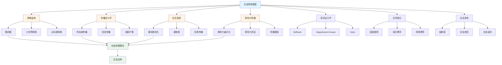
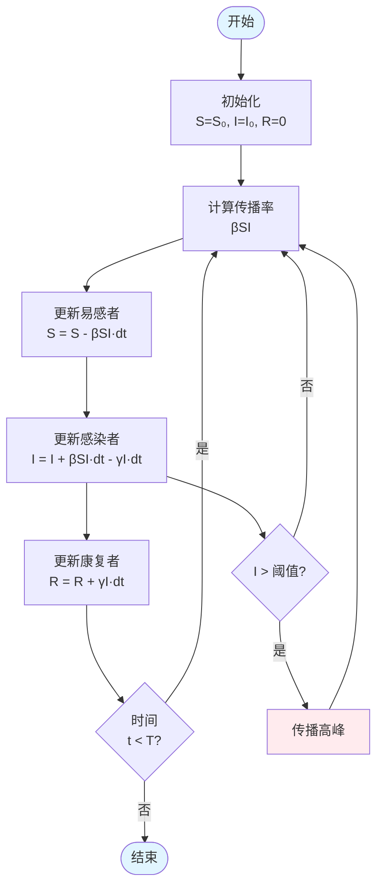

# 6.1 社会网络模型 / Social Network Models

## 目录 / Table of Contents

- [6.1 社会网络模型 / Social Network Models](#61-社会网络模型--social-network-models)
  - [目录 / Table of Contents](#目录--table-of-contents)
  - [社会网络模型框架图 / Framework Diagram of Social Network Models](#社会网络模型框架图--framework-diagram-of-social-network-models)
  - [SIR传染病传播流程图 / Flowchart of SIR Epidemic Spreading](#sir传染病传播流程图--flowchart-of-sir-epidemic-spreading)
  - [6.1.1 网络结构模型 / Network Structure Models](#611-网络结构模型--network-structure-models)
    - [随机图模型 / Random Graph Models](#随机图模型--random-graph-models)
    - [小世界网络 / Small-World Network](#小世界网络--small-world-network)
    - [无标度网络 / Scale-Free Network](#无标度网络--scale-free-network)
  - [6.1.2 传播动力学模型 / Diffusion Dynamics Models](#612-传播动力学模型--diffusion-dynamics-models)
    - [传染病传播模型 / Epidemic Spreading Models](#传染病传播模型--epidemic-spreading-models)
    - [信息传播模型 / Information Diffusion Models](#信息传播模型--information-diffusion-models)
    - [创新扩散模型 / Innovation Diffusion Model](#创新扩散模型--innovation-diffusion-model)
  - [6.1.3 社区发现模型 / Community Detection Models](#613-社区发现模型--community-detection-models)
    - [模块度优化 / Modularity Optimization](#模块度优化--modularity-optimization)
    - [谱聚类 / Spectral Clustering](#谱聚类--spectral-clustering)
    - [标签传播 / Label Propagation](#标签传播--label-propagation)
  - [6.1.4 影响力传播模型 / Influence Propagation Models](#614-影响力传播模型--influence-propagation-models)
    - [影响力最大化 / Influence Maximization](#影响力最大化--influence-maximization)
    - [影响力评估 / Influence Evaluation](#影响力评估--influence-evaluation)
    - [影响力传播路径 / Influence Propagation Path](#影响力传播路径--influence-propagation-path)
  - [6.1.5 意见动力学模型 / Opinion Dynamics Models](#615-意见动力学模型--opinion-dynamics-models)
    - [Deffuant模型 / Deffuant Model](#deffuant模型--deffuant-model)
    - [Hegselmann-Krause模型 / Hegselmann-Krause Model](#hegselmann-krause模型--hegselmann-krause-model)
    - [Voter模型 / Voter Model](#voter模型--voter-model)
  - [6.1.6 合作演化模型 / Cooperation Evolution Models](#616-合作演化模型--cooperation-evolution-models)
    - [囚徒困境 / Prisoner's Dilemma](#囚徒困境--prisoners-dilemma)
    - [演化博弈 / Evolutionary Game Theory](#演化博弈--evolutionary-game-theory)
    - [网络博弈 / Network Games](#网络博弈--network-games)
  - [6.1.7 社会资本模型 / Social Capital Models](#617-社会资本模型--social-capital-models)
    - [结构洞理论 / Structural Hole Theory](#结构洞理论--structural-hole-theory)
    - [社会信任模型 / Social Trust Model](#社会信任模型--social-trust-model)
    - [社会支持模型 / Social Support Model](#社会支持模型--social-support-model)
  - [6.1.8 实现与应用 / Implementation and Applications](#618-实现与应用--implementation-and-applications)
    - [Rust实现示例 / Rust Implementation Example](#rust实现示例--rust-implementation-example)
    - [Haskell实现示例 / Haskell Implementation Example](#haskell实现示例--haskell-implementation-example)
    - [应用领域 / Application Domains](#应用领域--application-domains)
      - [社交网络分析 / Social Network Analysis](#社交网络分析--social-network-analysis)
      - [公共卫生 / Public Health](#公共卫生--public-health)
      - [政治科学 / Political Science](#政治科学--political-science)
  - [6.1.9 算法实现 / Algorithm Implementation](#619-算法实现--algorithm-implementation)
  - [相关模型 / Related Models](#相关模型--related-models)
    - [社会科学模型 / Social Science Models](#社会科学模型--social-science-models)
    - [数学科学模型 / Mathematical Science Models](#数学科学模型--mathematical-science-models)
    - [计算机科学模型 / Computer Science Models](#计算机科学模型--computer-science-models)
    - [生命科学模型 / Life Science Models](#生命科学模型--life-science-models)
    - [基础理论 / Basic Theory](#基础理论--basic-theory)
  - [参考文献 / References](#参考文献--references)

---

## 社会网络模型框架图 / Framework Diagram of Social Network Models



## SIR传染病传播流程图 / Flowchart of SIR Epidemic Spreading



## 6.1.1 网络结构模型 / Network Structure Models

### 随机图模型 / Random Graph Models

**Erdős-Rényi模型**: $G(n,p)$

**边概率**: $P(e_{ij} = 1) = p$

**平均度**: $\langle k \rangle = p(n-1)$

**度分布**: $P(k) = \binom{n-1}{k} p^k (1-p)^{n-1-k}$

### 小世界网络 / Small-World Network

**Watts-Strogatz模型**:

1. 从规则环开始
2. 以概率 $p$ 重连边
3. 保持平均度不变

**聚类系数**: $C = \frac{3 \times \text{三角形数}}{\text{连通三元组数}}$

**平均路径长度**: $L = \frac{1}{n(n-1)} \sum_{i \neq j} d_{ij}$

### 无标度网络 / Scale-Free Network

**Barabási-Albert模型**:

1. 增长: 每次添加一个新节点
2. 优先连接: $P(k_i) = \frac{k_i}{\sum_j k_j}$

**度分布**: $P(k) \sim k^{-\gamma}$

**幂律指数**: $\gamma = 3$

---

## 6.1.2 传播动力学模型 / Diffusion Dynamics Models

### 传染病传播模型 / Epidemic Spreading Models

**SIR模型**:
$$\frac{dS}{dt} = -\beta SI$$
$$\frac{dI}{dt} = \beta SI - \gamma I$$
$$\frac{dR}{dt} = \gamma I$$

**传播阈值**: $\lambda_c = \frac{\langle k \rangle}{\langle k^2 \rangle}$

**最终感染规模**: $R_\infty = 1 - e^{-\lambda R_\infty}$

### 信息传播模型 / Information Diffusion Models

**独立级联模型**: $P_{ij} = 1 - \prod_{k \in N_i} (1 - p_{ki})$

**线性阈值模型**: $f_i = \sum_{j \in N_i} w_{ji} x_j$

**激活条件**: $x_i(t+1) = \begin{cases} 1 & \text{if } f_i \geq \theta_i \\ 0 & \text{otherwise} \end{cases}$

### 创新扩散模型 / Innovation Diffusion Model

**Bass模型**: $\frac{dN(t)}{dt} = p[M-N(t)] + q\frac{N(t)}{M}[M-N(t)]$

**累积采用**: $N(t) = M \frac{1-e^{-(p+q)t}}{1+\frac{q}{p}e^{-(p+q)t}}$

**采用率**: $n(t) = \frac{dN(t)}{dt} = M \frac{(p+q)^2}{p} \frac{e^{-(p+q)t}}{(1+\frac{q}{p}e^{-(p+q)t})^2}$

---

## 6.1.3 社区发现模型 / Community Detection Models

### 模块度优化 / Modularity Optimization

**模块度**: $Q = \frac{1}{2m} \sum_{ij} [A_{ij} - \frac{k_i k_j}{2m}] \delta(c_i, c_j)$

**Louvain算法**:

1. 初始化每个节点为独立社区
2. 迭代优化模块度增益
3. 合并社区

**模块度增益**: $\Delta Q = \frac{1}{2m} [k_{i,in} - \frac{k_i \sum_{tot}}{2m}]$

### 谱聚类 / Spectral Clustering

**拉普拉斯矩阵**: $L = D - A$

**归一化拉普拉斯**: $L_{norm} = D^{-1/2} L D^{-1/2}$

**特征向量**: $L_{norm} v = \lambda v$

**聚类**: 使用前 $k$ 个特征向量进行K-means

### 标签传播 / Label Propagation

**标签更新**: $c_i(t+1) = \arg\max_c \sum_{j \in N_i} \delta(c_j(t), c)$

**收敛条件**: $\sum_i |c_i(t+1) - c_i(t)| = 0$

---

## 6.1.4 影响力传播模型 / Influence Propagation Models

### 影响力最大化 / Influence Maximization

**目标函数**: $\max \sigma(S)$ s.t. $|S| \leq k$

**边际增益**: $\Delta \sigma(S, v) = \sigma(S \cup \{v\}) - \sigma(S)$

**贪心算法**:

```python
S = {}
for i in range(k):
    v = argmax_v Δσ(S, v)
    S = S ∪ {v}
```

### 影响力评估 / Influence Evaluation

**蒙特卡洛模拟**: $\sigma(S) = \frac{1}{R} \sum_{r=1}^R |I_r(S)|$

**影响范围**: $I(S) = \{v | v \text{ 被 } S \text{ 激活}\}$

**激活概率**: $P(v \text{ 激活}) = f(\sum_{u \in N_v} w_{uv} x_u)$

### 影响力传播路径 / Influence Propagation Path

**最短路径**: $d_{ij} = \min_{path} \sum_{e \in path} w_e$

**影响力路径**: $P_{ij} = \prod_{e \in path} p_e$

**影响力衰减**: $I_{ij} = I_0 \cdot e^{-\alpha d_{ij}}$

---

## 6.1.5 意见动力学模型 / Opinion Dynamics Models

### Deffuant模型 / Deffuant Model

**意见更新**:
$$x_i(t+1) = x_i(t) + \mu [x_j(t) - x_i(t)]$$
$$x_j(t+1) = x_j(t) + \mu [x_i(t) - x_j(t)]$$

**交互条件**: $|x_i(t) - x_j(t)| < \epsilon$

**收敛条件**: $\sum_i |x_i(t+1) - x_i(t)| < \delta$

### Hegselmann-Krause模型 / Hegselmann-Krause Model

**意见更新**: $x_i(t+1) = \frac{1}{|N_i(t)|} \sum_{j \in N_i(t)} x_j(t)$

**邻居集合**: $N_i(t) = \{j | |x_i(t) - x_j(t)| \leq \epsilon\}$

**意见极化**: 多个意见集群形成

### Voter模型 / Voter Model

**意见采纳**: $P(x_i(t+1) = x_j(t)) = \frac{1}{k_i}$

**共识时间**: $T_{consensus} \sim n^2$

**存活概率**: $P_i = \frac{k_i}{2m}$

---

## 6.1.6 合作演化模型 / Cooperation Evolution Models

### 囚徒困境 / Prisoner's Dilemma

**收益矩阵**:
$$\begin{pmatrix} R & S \\ T & P \end{pmatrix}$$

**条件**: $T > R > P > S$

**合作率**: $f_C = \frac{\sum_{i \in C} \pi_i}{\sum_i \pi_i}$

### 演化博弈 / Evolutionary Game Theory

**复制动力学**: $\dot{x}_i = x_i [\pi_i - \bar{\pi}]$

**平均收益**: $\bar{\pi} = \sum_i x_i \pi_i$

**演化稳定策略**: $ESS = \{x^* | \pi(x^*, x^*) > \pi(x, x^*)\}$

### 网络博弈 / Network Games

**策略更新**: $P(s_i'|s_i) = \frac{1}{1 + e^{-\beta(\pi_i' - \pi_i)}}$

**局部收益**: $\pi_i = \sum_{j \in N_i} \pi_{ij}$

**合作条件**: $\frac{b}{c} > \langle k \rangle$

---

## 6.1.7 社会资本模型 / Social Capital Models

### 结构洞理论 / Structural Hole Theory

**结构洞**: $SH_i = 1 - \sum_{j \in N_i} p_{ij}^2$

**约束**: $C_{ij} = p_{ij} + \sum_q p_{iq} p_{qj}$

**经纪人收益**: $B_i = \sum_{j,k} (1 - \delta_{jk}) p_{ij} p_{ik}$

### 社会信任模型 / Social Trust Model

**信任传播**: $T_{ij} = \max_{path} \prod_{e \in path} T_e$

**信任衰减**: $T_{ij} = T_0 \cdot e^{-\alpha d_{ij}}$

**信任聚合**: $T_{ij} = \frac{1}{|paths|} \sum_{path} \prod_{e \in path} T_e$

### 社会支持模型 / Social Support Model

**支持网络**: $S_i = \sum_{j \in N_i} w_{ij} \cdot support_{ij}$

**支持类型**: $support_{ij} = \{emotional, instrumental, informational\}$

**支持强度**: $w_{ij} = f(relationship, frequency, duration)$

---

## 6.1.8 实现与应用 / Implementation and Applications

### Rust实现示例 / Rust Implementation Example

```rust
use std::collections::{HashMap, HashSet};
use rand::Rng;

#[derive(Debug, Clone)]
pub struct SocialNetwork {
    pub nodes: Vec<String>,
    pub edges: HashMap<(String, String), f64>,
    pub node_attributes: HashMap<String, HashMap<String, f64>>,
}

impl SocialNetwork {
    pub fn new() -> Self {
        Self {
            nodes: Vec::new(),
            edges: HashMap::new(),
            node_attributes: HashMap::new(),
        }
    }

    pub fn add_node(&mut self, node: String) {
        if !self.nodes.contains(&node) {
            self.nodes.push(node.clone());
            self.node_attributes.insert(node, HashMap::new());
        }
    }

    pub fn add_edge(&mut self, from: String, to: String, weight: f64) {
        self.edges.insert((from, to), weight);
    }

    pub fn get_neighbors(&self, node: &str) -> Vec<String> {
        self.edges.iter()
            .filter(|((from, _), _)| from == node)
            .map(|((_, to), _)| to.clone())
            .collect()
    }

    pub fn calculate_degree_centrality(&self, node: &str) -> f64 {
        let degree = self.get_neighbors(node).len();
        degree as f64 / (self.nodes.len() - 1) as f64
    }

    pub fn calculate_betweenness_centrality(&self, node: &str) -> f64 {
        let mut total = 0.0;
        let mut count = 0;

        for i in 0..self.nodes.len() {
            for j in (i+1)..self.nodes.len() {
                let source = &self.nodes[i];
                let target = &self.nodes[j];

                if let Some(paths) = self.find_shortest_paths(source, target) {
                    let shortest_paths = paths.len();
                    let paths_through_node = paths.iter()
                        .filter(|path| path.contains(&node.to_string()))
                        .count();

                    if shortest_paths > 0 {
                        total += paths_through_node as f64 / shortest_paths as f64;
                    }
                    count += 1;
                }
            }
        }

        if count > 0 { total / count as f64 } else { 0.0 }
    }

    fn find_shortest_paths(&self, source: &str, target: &str) -> Option<Vec<Vec<String>>> {
        // 简化的最短路径查找
        let mut paths = Vec::new();
        let mut visited = HashSet::new();
        self.dfs_paths(source, target, &mut Vec::new(), &mut visited, &mut paths);

        if paths.is_empty() {
            None
        } else {
            let min_length = paths.iter().map(|p| p.len()).min().unwrap();
            Some(paths.into_iter().filter(|p| p.len() == min_length).collect())
        }
    }

    fn dfs_paths(&self, current: &str, target: &str, path: &mut Vec<String>,
                  visited: &mut HashSet<String>, paths: &mut Vec<Vec<String>>) {
        path.push(current.to_string());
        visited.insert(current.to_string());

        if current == target {
            paths.push(path.clone());
        } else {
            for neighbor in self.get_neighbors(current) {
                if !visited.contains(&neighbor) {
                    self.dfs_paths(&neighbor, target, path, visited, paths);
                }
            }
        }

        path.pop();
        visited.remove(current);
    }
}

#[derive(Debug)]
pub struct EpidemicModel {
    pub network: SocialNetwork,
    pub infection_rate: f64,
    pub recovery_rate: f64,
    pub states: HashMap<String, String>, // S, I, R
}

impl EpidemicModel {
    pub fn new(network: SocialNetwork, infection_rate: f64, recovery_rate: f64) -> Self {
        let mut states = HashMap::new();
        for node in &network.nodes {
            states.insert(node.clone(), "S".to_string());
        }

        Self {
            network,
            infection_rate,
            recovery_rate,
            states,
        }
    }

    pub fn infect_random_nodes(&mut self, num_infected: usize) {
        let mut rng = rand::thread_rng();
        let infected_nodes: Vec<String> = self.network.nodes.iter()
            .choose_multiple(&mut rng, num_infected)
            .cloned()
            .collect();

        for node in infected_nodes {
            self.states.insert(node, "I".to_string());
        }
    }

    pub fn simulate_step(&mut self) -> (usize, usize, usize) {
        let mut new_states = self.states.clone();

        for node in &self.network.nodes {
            match self.states.get(node).unwrap().as_str() {
                "S" => {
                    let infected_neighbors = self.network.get_neighbors(node)
                        .iter()
                        .filter(|&n| self.states.get(n).unwrap() == "I")
                        .count();

                    let infection_prob = 1.0 - (1.0 - self.infection_rate).powi(infected_neighbors as i32);
                    if rand::random::<f64>() < infection_prob {
                        new_states.insert(node.clone(), "I".to_string());
                    }
                }
                "I" => {
                    if rand::random::<f64>() < self.recovery_rate {
                        new_states.insert(node.clone(), "R".to_string());
                    }
                }
                _ => {}
            }
        }

        self.states = new_states;

        let s_count = self.states.values().filter(|&v| v == "S").count();
        let i_count = self.states.values().filter(|&v| v == "I").count();
        let r_count = self.states.values().filter(|&v| v == "R").count();

        (s_count, i_count, r_count)
    }
}

#[derive(Debug)]
pub struct OpinionDynamics {
    pub network: SocialNetwork,
    pub opinions: HashMap<String, f64>,
    pub confidence_threshold: f64,
}

impl OpinionDynamics {
    pub fn new(network: SocialNetwork, confidence_threshold: f64) -> Self {
        let mut opinions = HashMap::new();
        for node in &network.nodes {
            opinions.insert(node.clone(), rand::random::<f64>());
        }

        Self {
            network,
            opinions,
            confidence_threshold,
        }
    }

    pub fn update_opinions(&mut self) -> f64 {
        let mut total_change = 0.0;
        let mut new_opinions = self.opinions.clone();

        for node in &self.network.nodes {
            let neighbors = self.network.get_neighbors(node);
            let mut valid_neighbors = Vec::new();

            for neighbor in &neighbors {
                let opinion_diff = (self.opinions.get(node).unwrap() -
                                  self.opinions.get(neighbor).unwrap()).abs();
                if opinion_diff < self.confidence_threshold {
                    valid_neighbors.push(neighbor.clone());
                }
            }

            if !valid_neighbors.is_empty() {
                let avg_opinion = valid_neighbors.iter()
                    .map(|n| self.opinions.get(n).unwrap())
                    .sum::<f64>() / valid_neighbors.len() as f64;

                let current_opinion = self.opinions.get(node).unwrap();
                let new_opinion = current_opinion + 0.1 * (avg_opinion - current_opinion);
                new_opinions.insert(node.clone(), new_opinion);

                total_change += (new_opinion - current_opinion).abs();
            }
        }

        self.opinions = new_opinions;
        total_change
    }

    pub fn get_opinion_clusters(&self) -> Vec<Vec<String>> {
        let mut clusters = Vec::new();
        let mut visited = HashSet::new();

        for node in &self.network.nodes {
            if !visited.contains(node) {
                let mut cluster = Vec::new();
                self.dfs_cluster(node, &mut visited, &mut cluster);
                clusters.push(cluster);
            }
        }

        clusters
    }

    fn dfs_cluster(&self, node: &str, visited: &mut HashSet<String>, cluster: &mut Vec<String>) {
        visited.insert(node.to_string());
        cluster.push(node.to_string());

        for neighbor in self.network.get_neighbors(node) {
            if !visited.contains(&neighbor) {
                let opinion_diff = (self.opinions.get(node).unwrap() -
                                  self.opinions.get(&neighbor).unwrap()).abs();
                if opinion_diff < self.confidence_threshold {
                    self.dfs_cluster(&neighbor, visited, cluster);
                }
            }
        }
    }
}

#[derive(Debug)]
pub struct CommunityDetection {
    pub network: SocialNetwork,
}

impl CommunityDetection {
    pub fn new(network: SocialNetwork) -> Self {
        Self { network }
    }

    pub fn louvain_algorithm(&self) -> HashMap<String, usize> {
        let mut communities: HashMap<String, usize> = HashMap::new();
        let mut next_community_id = 0;

        // 初始化：每个节点一个社区
        for node in &self.network.nodes {
            communities.insert(node.clone(), next_community_id);
            next_community_id += 1;
        }

        let mut improved = true;
        while improved {
            improved = false;

            for node in &self.network.nodes {
                let current_community = communities.get(node).unwrap();
                let mut best_community = *current_community;
                let mut best_gain = 0.0;

                // 尝试移动到邻居的社区
                for neighbor in self.network.get_neighbors(node) {
                    let neighbor_community = communities.get(&neighbor).unwrap();
                    let gain = self.calculate_modularity_gain(node, neighbor_community, &communities);

                    if gain > best_gain {
                        best_gain = gain;
                        best_community = *neighbor_community;
                    }
                }

                if best_community != *current_community {
                    communities.insert(node.clone(), best_community);
                    improved = true;
                }
            }
        }

        communities
    }

    fn calculate_modularity_gain(&self, node: &str, community: &usize,
                                communities: &HashMap<String, usize>) -> f64 {
        // 简化的模块度增益计算
        let k_i = self.network.get_neighbors(node).len() as f64;
        let k_i_in = self.network.get_neighbors(node)
            .iter()
            .filter(|&n| communities.get(n).unwrap() == community)
            .count() as f64;

        let m = self.network.edges.len() as f64;
        let sum_tot = self.network.nodes.iter()
            .filter(|&n| communities.get(n).unwrap() == community)
            .map(|n| self.network.get_neighbors(n).len() as f64)
            .sum::<f64>();

        (k_i_in - k_i * sum_tot / (2.0 * m)) / (2.0 * m)
    }
}

// 使用示例
fn main() {
    // 创建社会网络
    let mut network = SocialNetwork::new();
    network.add_node("A".to_string());
    network.add_node("B".to_string());
    network.add_node("C".to_string());
    network.add_node("D".to_string());

    network.add_edge("A".to_string(), "B".to_string(), 1.0);
    network.add_edge("B".to_string(), "C".to_string(), 1.0);
    network.add_edge("C".to_string(), "D".to_string(), 1.0);
    network.add_edge("A".to_string(), "C".to_string(), 0.5);

    // 计算中心性
    let degree_centrality = network.calculate_degree_centrality("A");
    let betweenness_centrality = network.calculate_betweenness_centrality("A");

    println!("Degree centrality of A: {:.3}", degree_centrality);
    println!("Betweenness centrality of A: {:.3}", betweenness_centrality);

    // 流行病传播模拟
    let mut epidemic = EpidemicModel::new(network.clone(), 0.3, 0.1);
    epidemic.infect_random_nodes(1);

    for step in 0..10 {
        let (s, i, r) = epidemic.simulate_step();
        println!("Step {}: S={}, I={}, R={}", step, s, i, r);
    }

    // 意见动力学模拟
    let mut opinion = OpinionDynamics::new(network.clone(), 0.3);

    for step in 0..50 {
        let change = opinion.update_opinions();
        if change < 0.001 {
            println!("Opinions converged at step {}", step);
            break;
        }
    }

    let clusters = opinion.get_opinion_clusters();
    println!("Opinion clusters: {:?}", clusters);

    // 社区发现
    let community_detection = CommunityDetection::new(network);
    let communities = community_detection.louvain_algorithm();
    println!("Communities: {:?}", communities);
}
```

### Haskell实现示例 / Haskell Implementation Example

```haskell
module SocialNetworkModels where

import Data.Map (Map)
import qualified Data.Map as Map
import Data.List (sum, length, filter)
import System.Random (randomRs, newStdGen)

-- 社会网络数据类型
data SocialNetwork = SocialNetwork {
    nodes :: [String],
    edges :: Map (String, String) Double,
    nodeAttributes :: Map String (Map String Double)
} deriving Show

newSocialNetwork :: SocialNetwork
newSocialNetwork = SocialNetwork [] Map.empty Map.empty

addNode :: String -> SocialNetwork -> SocialNetwork
addNode node network = network {
    nodes = node : nodes network,
    nodeAttributes = Map.insert node Map.empty (nodeAttributes network)
}

addEdge :: String -> String -> Double -> SocialNetwork -> SocialNetwork
addEdge from to weight network = network {
    edges = Map.insert (from, to) weight (edges network)
}

getNeighbors :: SocialNetwork -> String -> [String]
getNeighbors network node =
    [to | ((from, to), _) <- Map.toList (edges network), from == node]

calculateDegreeCentrality :: SocialNetwork -> String -> Double
calculateDegreeCentrality network node =
    fromIntegral (length (getNeighbors network node)) / fromIntegral (length (nodes network) - 1)

-- 流行病模型
data EpidemicModel = EpidemicModel {
    epidemicNetwork :: SocialNetwork,
    infectionRate :: Double,
    recoveryRate :: Double,
    states :: Map String String  -- S, I, R
} deriving Show

newEpidemicModel :: SocialNetwork -> Double -> Double -> EpidemicModel
newEpidemicModel network infection recovery = EpidemicModel {
    epidemicNetwork = network,
    infectionRate = infection,
    recoveryRate = recovery,
    states = Map.fromList [(node, "S") | node <- nodes network]
}

infectRandomNodes :: Int -> EpidemicModel -> IO EpidemicModel
infectRandomNodes numInfected model = do
    gen <- newStdGen
    let infectedNodes = take numInfected (randomRs (0, length (nodes (epidemicNetwork model)) - 1) gen)
    let nodeNames = nodes (epidemicNetwork model)
    let infectedNodeNames = map (nodeNames !!) infectedNodes

    let newStates = foldl (\acc node -> Map.insert node "I" acc) (states model) infectedNodeNames

    return model { states = newStates }

simulateStep :: EpidemicModel -> IO (EpidemicModel, (Int, Int, Int))
simulateStep model = do
    gen <- newStdGen
    let newStates = updateStates model gen
    let (s, i, r) = countStates newStates

    return (model { states = newStates }, (s, i, r))
  where
    updateStates model gen = foldl (\acc node -> updateNodeState node acc gen) (states model) (nodes (epidemicNetwork model))

    updateNodeState node states gen = case Map.lookup node states of
        Just "S" ->
            let infectedNeighbors = length (filter (\n -> Map.lookup n states == Just "I") (getNeighbors (epidemicNetwork model) node))
                infectionProb = 1.0 - (1.0 - infectionRate model) ^ infectedNeighbors
                (random, newGen) = random gen
            in if random < infectionProb then Map.insert node "I" states else states
        Just "I" ->
            let (random, _) = random gen
            in if random < recoveryRate model then Map.insert node "R" states else states
        _ -> states

    countStates states = (s, i, r)
      where
        s = length (filter (== "S") (Map.elems states))
        i = length (filter (== "I") (Map.elems states))
        r = length (filter (== "R") (Map.elems states))

-- 意见动力学
data OpinionDynamics = OpinionDynamics {
    opinionNetwork :: SocialNetwork,
    opinions :: Map String Double,
    confidenceThreshold :: Double
} deriving Show

newOpinionDynamics :: SocialNetwork -> Double -> IO OpinionDynamics
newOpinionDynamics network threshold = do
    gen <- newStdGen
    let opinions = Map.fromList [(node, random) | (node, random) <- zip (nodes network) (randomRs (0.0, 1.0) gen)]

    return OpinionDynamics {
        opinionNetwork = network,
        opinions = opinions,
        confidenceThreshold = threshold
    }

updateOpinions :: OpinionDynamics -> IO (OpinionDynamics, Double)
updateOpinions model = do
    let newOpinions = Map.mapWithKey (updateNodeOpinion model) (opinions model)
    let totalChange = sum [abs (newOpinions Map.! node - opinions model Map.! node) | node <- nodes (opinionNetwork model)]

    return (model { opinions = newOpinions }, totalChange)
  where
    updateNodeOpinion model node currentOpinion =
        let neighbors = getNeighbors (opinionNetwork model) node
            validNeighbors = filter (\n -> abs (currentOpinion - (opinions model Map.! n)) < confidenceThreshold model) neighbors
        in if null validNeighbors
           then currentOpinion
           else let avgOpinion = sum [opinions model Map.! n | n <- validNeighbors] / fromIntegral (length validNeighbors)
                in currentOpinion + 0.1 * (avgOpinion - currentOpinion)

getOpinionClusters :: OpinionDynamics -> [[String]]
getOpinionClusters model = go (nodes (opinionNetwork model)) []
  where
    go [] clusters = clusters
    go (node:rest) clusters =
        let cluster = findCluster node
            newClusters = cluster : clusters
            remaining = filter (\n -> not (n `elem` cluster)) rest
        in go remaining newClusters

    findCluster node = node : concat [findCluster neighbor | neighbor <- getNeighbors (opinionNetwork model) node,
                                                           abs (opinions model Map.! node - opinions model Map.! neighbor) < confidenceThreshold model,
                                                           neighbor /= node]

-- 社区发现
data CommunityDetection = CommunityDetection {
    detectionNetwork :: SocialNetwork
} deriving Show

newCommunityDetection :: SocialNetwork -> CommunityDetection
newCommunityDetection network = CommunityDetection network

louvainAlgorithm :: CommunityDetection -> Map String Int
louvainAlgorithm detection =
    let initialCommunities = Map.fromList [(node, i) | (node, i) <- zip (nodes (detectionNetwork detection)) [0..]]
    in optimizeCommunities initialCommunities
  where
    optimizeCommunities communities =
        let newCommunities = optimizeStep communities
        in if newCommunities == communities
           then communities
           else optimizeCommunities newCommunities

    optimizeStep communities =
        foldl (\acc node ->
            let bestCommunity = findBestCommunity node communities
            in Map.insert node bestCommunity acc) communities (nodes (detectionNetwork detection))

    findBestCommunity node communities =
        let neighbors = getNeighbors (detectionNetwork detection) node
            neighborCommunities = [communities Map.! n | n <- neighbors]
            gains = map (\c -> calculateModularityGain node c communities) neighborCommunities
            (bestGain, bestCommunity) = maximum (zip gains neighborCommunities)
        in if bestGain > 0 then bestCommunity else communities Map.! node

    calculateModularityGain node community communities =
        let k_i = fromIntegral (length (getNeighbors (detectionNetwork detection) node))
            k_i_in = fromIntegral (length (filter (\n -> communities Map.! n == community) (getNeighbors (detectionNetwork detection) node)))
            m = fromIntegral (length (Map.keys (edges (detectionNetwork detection))))
            sum_tot = fromIntegral (length (filter (\n -> communities Map.! n == community) (nodes (detectionNetwork detection))))
        in (k_i_in - k_i * sum_tot / (2.0 * m)) / (2.0 * m)

-- 示例使用
example :: IO ()
example = do
    -- 创建社会网络
    let network = addEdge "A" "C" 0.5 $
                  addEdge "C" "D" 1.0 $
                  addEdge "B" "C" 1.0 $
                  addEdge "A" "B" 1.0 $
                  addNode "D" $
                  addNode "C" $
                  addNode "B" $
                  addNode "A" newSocialNetwork

    -- 计算中心性
    let degreeCentrality = calculateDegreeCentrality network "A"
    putStrLn $ "Degree centrality of A: " ++ show degreeCentrality

    -- 流行病传播模拟
    epidemic <- newEpidemicModel network 0.3 0.1
    infectedEpidemic <- infectRandomNodes 1 epidemic

    let simulateEpidemic 0 model = return ()
        simulateEpidemic steps model = do
            (newModel, (s, i, r)) <- simulateStep model
            putStrLn $ "Step " ++ show (11 - steps) ++ ": S=" ++ show s ++ ", I=" ++ show i ++ ", R=" ++ show r
            simulateEpidemic (steps - 1) newModel

    simulateEpidemic 10 infectedEpidemic

    -- 意见动力学模拟
    opinion <- newOpinionDynamics network 0.3

    let simulateOpinions 0 model = return model
        simulateOpinions steps model = do
            (newModel, change) <- updateOpinions model
            if change < 0.001
            then do
                putStrLn $ "Opinions converged at step " ++ show (51 - steps)
                return newModel
            else simulateOpinions (steps - 1) newModel

    finalOpinion <- simulateOpinions 50 opinion
    let clusters = getOpinionClusters finalOpinion
    putStrLn $ "Opinion clusters: " ++ show clusters

    -- 社区发现
    let communityDetection = newCommunityDetection network
        communities = louvainAlgorithm communityDetection
    putStrLn $ "Communities: " ++ show communities
```

### 应用领域 / Application Domains

#### 社交网络分析 / Social Network Analysis

- **网络结构**: 中心性分析、社区发现
- **传播动力学**: 信息传播、影响力分析
- **用户行为**: 行为预测、推荐系统

#### 公共卫生 / Public Health

- **疾病传播**: 流行病建模、防控策略
- **健康行为**: 健康信息传播、干预效果
- **社会支持**: 心理健康、社会资本

#### 政治科学 / Political Science

- **意见形成**: 政治态度、舆论演化
- **选举分析**: 投票行为、政治传播
- **政策影响**: 政策传播、社会影响

---

## 6.1.9 算法实现 / Algorithm Implementation

```python
import numpy as np
from collections import deque, defaultdict
from typing import Dict, List, Tuple, Set

def degree_centrality(adj: Dict[int, List[int]]) -> Dict[int, float]:
    n = len(adj)
    return {u: len(adj[u]) / max(1, n - 1) for u in adj}

def bfs_shortest_paths(adj: Dict[int, List[int]], s: int) -> Tuple[Dict[int, int], Dict[int, List[int]]]:
    dist = {u: -1 for u in adj}
    paths = {u: [] for u in adj}
    dist[s] = 0
    paths[s] = [[s]]
    q = deque([s])
    while q:
        u = q.popleft()
        for v in adj[u]:
            if dist[v] == -1:
                dist[v] = dist[u] + 1
                paths[v] = [p + [v] for p in paths[u]]
                q.append(v)
            elif dist[v] == dist[u] + 1:
                paths[v].extend(p + [v] for p in paths[u])
    return dist, paths

def betweenness_centrality(adj: Dict[int, List[int]]) -> Dict[int, float]:
    bc = {u: 0.0 for u in adj}
    nodes = list(adj.keys())
    for s in nodes:
        dist, paths = bfs_shortest_paths(adj, s)
        for t in nodes:
            if t != s and paths[t]:
                all_paths = paths[t]
                denom = len(all_paths)
                for p in all_paths:
                    for v in p[1:-1]:
                        bc[v] += 1.0 / denom
    # 归一化（无向图近似）
    n = len(nodes)
    norm = (n - 1) * (n - 2)
    if norm > 0:
        for v in bc:
            bc[v] /= norm
    return bc

def label_propagation(adj: Dict[int, List[int]], max_iter: int = 100) -> Dict[int, int]:
    labels = {u: u for u in adj}
    nodes = list(adj.keys())
    for _ in range(max_iter):
        changed = 0
        np.random.shuffle(nodes)
        for u in nodes:
            if not adj[u]:
                continue
            counts = defaultdict(int)
            for v in adj[u]:
                counts[labels[v]] += 1
            best_label = max(counts.items(), key=lambda x: (x[1], x[0]))[0]
            if labels[u] != best_label:
                labels[u] = best_label
                changed += 1
        if changed == 0:
            break
    return labels

def independent_cascade(adj: Dict[int, List[int]], seeds: Set[int], p: float = 0.1, R: int = 100) -> float:
    n = len(adj)
    total = 0
    for _ in range(R):
        active = set(seeds)
        frontier = set(seeds)
        while frontier:
            new_frontier = set()
            for u in frontier:
                for v in adj[u]:
                    if v not in active and np.random.rand() < p:
                        active.add(v)
                        new_frontier.add(v)
            frontier = new_frontier
        total += len(active)
    return total / R

def deffuant_update(opinions: np.ndarray, edges: List[Tuple[int, int]], mu: float = 0.5, eps: float = 0.3, steps: int = 10000) -> np.ndarray:
    n = len(opinions)
    for _ in range(steps):
        i, j = edges[np.random.randint(len(edges))]
        if abs(opinions[i] - opinions[j]) < eps:
            xi, xj = opinions[i], opinions[j]
            opinions[i] = xi + mu * (xj - xi)
            opinions[j] = xj + mu * (xi - xj)
    return opinions

def social_network_verification():
    # 构造小图
    adj = {0: [1,2], 1: [0,2], 2: [0,1,3], 3: [2]}
    deg = degree_centrality(adj)
    bc = betweenness_centrality(adj)
    assert 0 <= deg[0] <= 1 and 0 <= bc[2] <= 1

    # 标签传播聚类
    labels = label_propagation(adj)
    assert set(labels.keys()) == set(adj.keys())

    # 独立级联影响力估计
    spread = independent_cascade(adj, seeds={0}, p=0.5, R=50)
    assert spread >= 1

    # Deffuant意见演化
    opinions = np.random.rand(10)
    edges = [(i, (i+1)%10) for i in range(10)]
    opinions_final = deffuant_update(opinions.copy(), edges, mu=0.3, eps=0.4, steps=2000)
    assert np.all(np.isfinite(opinions_final))
    print("Social network algorithms verified.")

if __name__ == "__main__":
    social_network_verification()
```

## 相关模型 / Related Models

### 社会科学模型 / Social Science Models

- [经济学模型](../02-经济学模型/README.md) - 网络经济学和社会经济网络
- [心理学模型](../03-心理学模型/README.md) - 社会心理学和网络心理学
- [认知科学模型](../04-认知科学模型/README.md) - 认知网络和社会认知
- [语言学模型](../05-语言学模型/README.md) - 语言网络和语义网络

### 数学科学模型 / Mathematical Science Models

- [代数模型](../../03-数学科学模型/01-代数模型/README.md) - 网络代数和图论代数结构
- [几何模型](../../03-数学科学模型/02-几何模型/README.md) - 网络几何和空间网络
- [拓扑模型](../../03-数学科学模型/03-拓扑模型/README.md) - 网络拓扑结构

### 计算机科学模型 / Computer Science Models

- [算法模型](../../04-计算机科学模型/02-算法模型/README.md) - 图算法和网络算法
- [数据结构模型](../../04-计算机科学模型/03-数据结构模型/README.md) - 图数据结构和网络数据结构
- [人工智能模型](../../04-计算机科学模型/05-人工智能模型/README.md) - 图神经网络和网络机器学习

### 生命科学模型 / Life Science Models

- [生态学模型](../../05-生命科学模型/02-生态学模型/README.md) - 生态网络和食物网
- [神经科学模型](../../05-生命科学模型/04-神经科学模型/README.md) - 神经网络和脑网络

### 基础理论 / Basic Theory

- [模型分类学](../../01-基础理论/01-模型分类学/README.md) - 社会网络模型的分类
- [形式化方法论](../../01-基础理论/02-形式化方法论/README.md) - 社会网络模型的形式化方法
- [科学模型论](../../01-基础理论/03-科学模型论/README.md) - 社会网络模型作为科学模型的理论基础

## 参考文献 / References

1. Newman, M. E. J. (2010). Networks: An Introduction. Oxford University Press.
2. Easley, D., & Kleinberg, J. (2010). Networks, Crowds, and Markets. Cambridge University Press.
3. Jackson, M. O. (2008). Social and Economic Networks. Princeton University Press.
4. Watts, D. J. (2003). Six Degrees: The Science of a Connected Age. W.W. Norton.

---

*最后更新: 2025-08-26*
*版本: 1.1.0*
