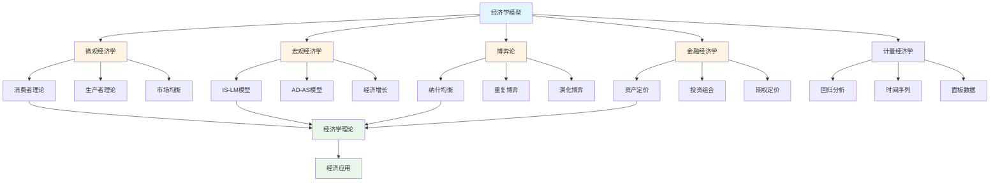
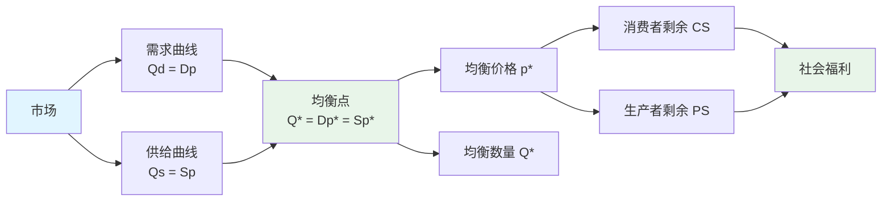

# 6.2 经济学模型 / Economic Models

## 目录 / Table of Contents

- [6.2 经济学模型 / Economic Models](#62-经济学模型--economic-models)
  - [目录 / Table of Contents](#目录--table-of-contents)
  - [经济学模型框架图 / Framework Diagram of Economic Models](#经济学模型框架图--framework-diagram-of-economic-models)
  - [市场均衡关系图 / Relationship Diagram of Market Equilibrium](#市场均衡关系图--relationship-diagram-of-market-equilibrium)
  - [6.2.1 微观经济学模型 / Microeconomic Models](#621-微观经济学模型--microeconomic-models)
    - [消费者理论 / Consumer Theory](#消费者理论--consumer-theory)
    - [生产者理论 / Producer Theory](#生产者理论--producer-theory)
    - [市场均衡 / Market Equilibrium](#市场均衡--market-equilibrium)
  - [6.2.2 宏观经济学模型 / Macroeconomic Models](#622-宏观经济学模型--macroeconomic-models)
    - [IS-LM模型 / IS-LM Model](#is-lm模型--is-lm-model)
    - [AD-AS模型 / AD-AS Model](#ad-as模型--ad-as-model)
    - [经济增长模型 / Economic Growth Models](#经济增长模型--economic-growth-models)
  - [6.2.3 博弈论模型 / Game Theory Models](#623-博弈论模型--game-theory-models)
    - [纳什均衡 / Nash Equilibrium](#纳什均衡--nash-equilibrium)
    - [重复博弈 / Repeated Games](#重复博弈--repeated-games)
    - [演化博弈 / Evolutionary Games](#演化博弈--evolutionary-games)
  - [6.2.4 金融经济学模型 / Financial Economics Models](#624-金融经济学模型--financial-economics-models)
    - [资产定价模型 / Asset Pricing Models](#资产定价模型--asset-pricing-models)
    - [投资组合理论 / Portfolio Theory](#投资组合理论--portfolio-theory)
    - [期权定价模型 / Option Pricing Models](#期权定价模型--option-pricing-models)
  - [6.2.5 计量经济学模型 / Econometric Models](#625-计量经济学模型--econometric-models)
    - [回归分析 / Regression Analysis](#回归分析--regression-analysis)
    - [时间序列分析 / Time Series Analysis](#时间序列分析--time-series-analysis)
    - [面板数据分析 / Panel Data Analysis](#面板数据分析--panel-data-analysis)
  - [6.2.6 实现与应用 / Implementation and Applications](#626-实现与应用--implementation-and-applications)
    - [Rust实现示例 / Rust Implementation Example](#rust实现示例--rust-implementation-example)
    - [Haskell实现示例 / Haskell Implementation Example](#haskell实现示例--haskell-implementation-example)
    - [Julia实现示例 / Julia Implementation Example](#julia实现示例--julia-implementation-example)
    - [应用领域 / Application Domains](#应用领域--application-domains)
      - [政策分析 / Policy Analysis](#政策分析--policy-analysis)
      - [市场预测 / Market Forecasting](#市场预测--market-forecasting)
      - [风险管理 / Risk Management](#风险管理--risk-management)
  - [相关模型 / Related Models](#相关模型--related-models)
    - [社会科学模型 / Social Science Models](#社会科学模型--social-science-models)
    - [数学科学模型 / Mathematical Science Models](#数学科学模型--mathematical-science-models)
    - [物理科学模型 / Physical Science Models](#物理科学模型--physical-science-models)
    - [计算机科学模型 / Computer Science Models](#计算机科学模型--computer-science-models)
    - [基础理论 / Basic Theory](#基础理论--basic-theory)
  - [参考文献 / References](#参考文献--references)

---

## 经济学模型框架图 / Framework Diagram of Economic Models



## 市场均衡关系图 / Relationship Diagram of Market Equilibrium



## 6.2.1 微观经济学模型 / Microeconomic Models

### 消费者理论 / Consumer Theory

**效用函数**: $U(x_1, x_2, \ldots, x_n)$

**预算约束**: $\sum_{i=1}^n p_i x_i \leq I$

**拉格朗日函数**: $L = U(x_1, x_2) + \lambda(I - p_1 x_1 - p_2 x_2)$

**一阶条件**: $\frac{\partial U}{\partial x_i} = \lambda p_i$

**边际替代率**: $MRS = \frac{\partial U/\partial x_1}{\partial U/\partial x_2} = \frac{p_1}{p_2}$

### 生产者理论 / Producer Theory

**生产函数**: $Q = f(K, L)$

**成本函数**: $C(Q) = \min_{K,L} \{rK + wL : f(K,L) = Q\}$

**边际成本**: $MC = \frac{dC}{dQ}$

**平均成本**: $AC = \frac{C(Q)}{Q}$

**利润最大化**: $\max \pi = pQ - C(Q)$

### 市场均衡 / Market Equilibrium

**需求函数**: $Q_d = D(p)$

**供给函数**: $Q_s = S(p)$

**均衡条件**: $D(p^*) = S(p^*)$

**消费者剩余**: $CS = \int_0^{Q^*} D^{-1}(Q) dQ - p^* Q^*$

**生产者剩余**: $PS = p^* Q^* - \int_0^{Q^*} S^{-1}(Q) dQ$

---

## 6.2.2 宏观经济学模型 / Macroeconomic Models

### IS-LM模型 / IS-LM Model

**IS曲线**: $Y = C(Y-T) + I(r) + G$

**LM曲线**: $\frac{M}{P} = L(Y, r)$

**投资函数**: $I = I_0 - br$

**消费函数**: $C = C_0 + c(Y-T)$

**货币需求**: $L = kY - hr$

### AD-AS模型 / AD-AS Model

**总需求**: $AD = C + I + G + NX$

**总供给**: $AS = Y = f(K, L, A)$

**菲利普斯曲线**: $\pi = \pi^e + \alpha(u - u^*)$

**奥肯定律**: $\frac{Y - Y^*}{Y^*} = -2(u - u^*)$

### 经济增长模型 / Economic Growth Models

**索洛模型**: $\frac{dK}{dt} = sY - \delta K$

**人均资本**: $k = \frac{K}{L}$

**稳态条件**: $sf(k) = (n + \delta)k$

**黄金法则**: $f'(k_{gold}) = n + \delta$

---

## 6.2.3 博弈论模型 / Game Theory Models

### 纳什均衡 / Nash Equilibrium

**策略组合**: $s = (s_1, s_2, \ldots, s_n)$

**纳什均衡**: $u_i(s_i^*, s_{-i}^*) \geq u_i(s_i, s_{-i}^*)$

**纯策略均衡**: 每个玩家选择单一策略

**混合策略**: $\sigma_i = (\sigma_{i1}, \sigma_{i2}, \ldots, \sigma_{im})$

### 重复博弈 / Repeated Games

**贴现因子**: $\delta \in [0,1]$

**总收益**: $U_i = \sum_{t=0}^{\infty} \delta^t u_i(s^t)$

**触发策略**: 合作直到背叛，然后永远背叛

**民间定理**: 任何可行且个人理性的收益都可以通过重复博弈实现

### 演化博弈 / Evolutionary Games

**复制动力学**: $\dot{x}_i = x_i[u_i - \bar{u}]$

**演化稳定策略**: $u(x^*, x^*) > u(x, x^*)$

**适应度**: $f_i = \sum_j x_j u_{ij}$

---

## 6.2.4 金融经济学模型 / Financial Economics Models

### 资产定价模型 / Asset Pricing Models

**CAPM**: $E[R_i] = R_f + \beta_i(E[R_m] - R_f)$

**贝塔系数**: $\beta_i = \frac{\text{Cov}(R_i, R_m)}{\text{Var}(R_m)}$

**APT**: $E[R_i] = R_f + \sum_{j=1}^k \beta_{ij} \lambda_j$

**无套利条件**: $\sum_{i=1}^n w_i R_i = 0$

### 投资组合理论 / Portfolio Theory

**期望收益**: $E[R_p] = \sum_{i=1}^n w_i E[R_i]$

**组合方差**: $\text{Var}(R_p) = \sum_{i=1}^n \sum_{j=1}^n w_i w_j \sigma_{ij}$

**夏普比率**: $SR = \frac{E[R_p] - R_f}{\sigma_p}$

**有效前沿**: $\min \sigma_p^2$ s.t. $E[R_p] = \mu$

### 期权定价模型 / Option Pricing Models

**Black-Scholes**: $C = S_0 N(d_1) - Ke^{-rT} N(d_2)$

**d1和d2**: $d_1 = \frac{\ln(S_0/K) + (r + \sigma^2/2)T}{\sigma\sqrt{T}}$

**Delta**: $\Delta = \frac{\partial C}{\partial S} = N(d_1)$

**Gamma**: $\Gamma = \frac{\partial^2 C}{\partial S^2} = \frac{N'(d_1)}{S\sigma\sqrt{T}}$

---

## 6.2.5 计量经济学模型 / Econometric Models

### 回归分析 / Regression Analysis

**线性回归**: $Y_i = \beta_0 + \beta_1 X_{i1} + \ldots + \beta_k X_{ik} + \epsilon_i$

**OLS估计**: $\hat{\beta} = (X'X)^{-1}X'y$

**R方**: $R^2 = 1 - \frac{SSE}{SST}$

**t统计量**: $t = \frac{\hat{\beta}_j}{SE(\hat{\beta}_j)}$

### 时间序列分析 / Time Series Analysis

**AR模型**: $Y_t = c + \sum_{i=1}^p \phi_i Y_{t-i} + \epsilon_t$

**MA模型**: $Y_t = \mu + \sum_{i=1}^q \theta_i \epsilon_{t-i} + \epsilon_t$

**ARIMA**: $(1-\phi B)(1-B)^d Y_t = (1-\theta B)\epsilon_t$

**单位根检验**: $\Delta Y_t = \alpha + \beta Y_{t-1} + \epsilon_t$

### 面板数据分析 / Panel Data Analysis

**固定效应**: $Y_{it} = \alpha_i + X_{it}'\beta + \epsilon_{it}$

**随机效应**: $Y_{it} = \alpha + X_{it}'\beta + u_i + \epsilon_{it}$

**Hausman检验**: $H = (\hat{\beta}_{FE} - \hat{\beta}_{RE})'[Var(\hat{\beta}_{FE}) - Var(\hat{\beta}_{RE})]^{-1}(\hat{\beta}_{FE} - \hat{\beta}_{RE})$

---

## 6.2.6 实现与应用 / Implementation and Applications

### Rust实现示例 / Rust Implementation Example

```rust
use std::collections::HashMap;

#[derive(Debug, Clone)]
pub struct Consumer {
    pub income: f64,
    pub preferences: HashMap<String, f64>,
    pub prices: HashMap<String, f64>,
}

impl Consumer {
    pub fn new(income: f64) -> Self {
        Self {
            income,
            preferences: HashMap::new(),
            prices: HashMap::new(),
        }
    }

    pub fn add_preference(&mut self, good: String, utility: f64) {
        self.preferences.insert(good, utility);
    }

    pub fn set_price(&mut self, good: String, price: f64) {
        self.prices.insert(good, price);
    }

    pub fn optimize_consumption(&self) -> HashMap<String, f64> {
        let mut consumption = HashMap::new();
        let total_utility: f64 = self.preferences.values().sum();

        for (good, utility) in &self.preferences {
            let price = self.prices.get(good).unwrap_or(&1.0);
            let quantity = (utility / total_utility) * self.income / price;
            consumption.insert(good.clone(), quantity);
        }

        consumption
    }

    pub fn calculate_utility(&self, consumption: &HashMap<String, f64>) -> f64 {
        consumption.iter()
            .map(|(good, quantity)| {
                let utility = self.preferences.get(good).unwrap_or(&0.0);
                utility * quantity
            })
            .sum()
    }
}

#[derive(Debug)]
pub struct Producer {
    pub technology: f64,
    pub capital: f64,
    pub labor: f64,
    pub wage: f64,
    pub rental_rate: f64,
}

impl Producer {
    pub fn new(technology: f64, capital: f64, labor: f64) -> Self {
        Self {
            technology,
            capital,
            labor,
            wage: 1.0,
            rental_rate: 0.1,
        }
    }

    pub fn production_function(&self, k: f64, l: f64) -> f64 {
        self.technology * k.powf(0.3) * l.powf(0.7)
    }

    pub fn cost_function(&self, output: f64) -> f64 {
        let k = (output / self.technology).powf(1.0 / 0.3);
        let l = (output / self.technology).powf(1.0 / 0.7);
        self.rental_rate * k + self.wage * l
    }

    pub fn marginal_cost(&self, output: f64) -> f64 {
        let delta = 0.01;
        (self.cost_function(output + delta) - self.cost_function(output)) / delta
    }

    pub fn profit_maximization(&self, price: f64) -> f64 {
        let mut output = 10.0;
        let learning_rate = 0.01;

        for _ in 0..100 {
            let marginal_revenue = price;
            let marginal_cost = self.marginal_cost(output);
            let gradient = marginal_revenue - marginal_cost;
            output += learning_rate * gradient;
            output = output.max(0.0);
        }

        output
    }
}

#[derive(Debug)]
pub struct Market {
    pub consumers: Vec<Consumer>,
    pub producers: Vec<Producer>,
    pub equilibrium_price: f64,
    pub equilibrium_quantity: f64,
}

impl Market {
    pub fn new() -> Self {
        Self {
            consumers: Vec::new(),
            producers: Vec::new(),
            equilibrium_price: 0.0,
            equilibrium_quantity: 0.0,
        }
    }

    pub fn add_consumer(&mut self, consumer: Consumer) {
        self.consumers.push(consumer);
    }

    pub fn add_producer(&mut self, producer: Producer) {
        self.producers.push(producer);
    }

    pub fn calculate_demand(&self, price: f64) -> f64 {
        self.consumers.iter()
            .map(|consumer| {
                let mut consumer_copy = consumer.clone();
                consumer_copy.set_price("good".to_string(), price);
                let consumption = consumer_copy.optimize_consumption();
                consumption.get("good").unwrap_or(&0.0)
            })
            .sum()
    }

    pub fn calculate_supply(&self, price: f64) -> f64 {
        self.producers.iter()
            .map(|producer| producer.profit_maximization(price))
            .sum()
    }

    pub fn find_equilibrium(&mut self) -> (f64, f64) {
        let mut price = 1.0;
        let learning_rate = 0.01;

        for _ in 0..1000 {
            let demand = self.calculate_demand(price);
            let supply = self.calculate_supply(price);
            let excess_demand = demand - supply;

            price += learning_rate * excess_demand;
            price = price.max(0.0);
        }

        self.equilibrium_price = price;
        self.equilibrium_quantity = self.calculate_demand(price);

        (self.equilibrium_price, self.equilibrium_quantity)
    }
}

#[derive(Debug)]
pub struct Game {
    pub players: Vec<String>,
    pub strategies: Vec<Vec<String>>,
    pub payoffs: Vec<Vec<Vec<f64>>>,
}

impl Game {
    pub fn new() -> Self {
        Self {
            players: Vec::new(),
            strategies: Vec::new(),
            payoffs: Vec::new(),
        }
    }

    pub fn add_player(&mut self, player: String, strategies: Vec<String>) {
        self.players.push(player);
        self.strategies.push(strategies);
    }

    pub fn set_payoff(&mut self, player: usize, strategy1: usize, strategy2: usize, payoff: f64) {
        if self.payoffs.len() <= player {
            self.payoffs.push(Vec::new());
        }
        if self.payoffs[player].len() <= strategy1 {
            self.payoffs[player].push(Vec::new());
        }
        if self.payoffs[player][strategy1].len() <= strategy2 {
            self.payoffs[player][strategy1].push(0.0);
        }
        self.payoffs[player][strategy1][strategy2] = payoff;
    }

    pub fn find_nash_equilibrium(&self) -> Vec<usize> {
        let mut best_responses = Vec::new();

        for player in 0..self.players.len() {
            let mut best_strategy = 0;
            let mut best_payoff = f64::NEG_INFINITY;

            for strategy in 0..self.strategies[player].len() {
                let payoff = self.payoffs[player][strategy][0]; // 简化：假设对手策略固定
                if payoff > best_payoff {
                    best_payoff = payoff;
                    best_strategy = strategy;
                }
            }

            best_responses.push(best_strategy);
        }

        best_responses
    }
}

#[derive(Debug)]
pub struct Portfolio {
    pub assets: Vec<String>,
    pub weights: Vec<f64>,
    pub returns: Vec<Vec<f64>>,
    pub risk_free_rate: f64,
}

impl Portfolio {
    pub fn new(assets: Vec<String>, risk_free_rate: f64) -> Self {
        let n = assets.len();
        Self {
            assets,
            weights: vec![1.0 / n as f64; n],
            returns: Vec::new(),
            risk_free_rate,
        }
    }

    pub fn add_returns(&mut self, returns: Vec<f64>) {
        self.returns.push(returns);
    }

    pub fn calculate_expected_return(&self) -> f64 {
        if self.returns.is_empty() { return 0.0; }

        let n_assets = self.assets.len();
        let n_periods = self.returns.len();
        let mut expected_returns = vec![0.0; n_assets];

        for period in &self.returns {
            for (i, &ret) in period.iter().enumerate() {
                expected_returns[i] += ret;
            }
        }

        for ret in &mut expected_returns {
            *ret /= n_periods as f64;
        }

        self.weights.iter()
            .zip(expected_returns.iter())
            .map(|(w, r)| w * r)
            .sum()
    }

    pub fn calculate_variance(&self) -> f64 {
        if self.returns.len() < 2 { return 0.0; }

        let n_assets = self.assets.len();
        let mut covariance_matrix = vec![vec![0.0; n_assets]; n_assets];

        // 计算协方差矩阵
        for i in 0..n_assets {
            for j in 0..n_assets {
                let mut covariance = 0.0;
                let mean_i = self.returns.iter().map(|r| r[i]).sum::<f64>() / self.returns.len() as f64;
                let mean_j = self.returns.iter().map(|r| r[j]).sum::<f64>() / self.returns.len() as f64;

                for period in &self.returns {
                    covariance += (period[i] - mean_i) * (period[j] - mean_j);
                }

                covariance_matrix[i][j] = covariance / (self.returns.len() - 1) as f64;
            }
        }

        // 计算组合方差
        let mut variance = 0.0;
        for i in 0..n_assets {
            for j in 0..n_assets {
                variance += self.weights[i] * self.weights[j] * covariance_matrix[i][j];
            }
        }

        variance
    }

    pub fn calculate_sharpe_ratio(&self) -> f64 {
        let expected_return = self.calculate_expected_return();
        let variance = self.calculate_variance();
        let std_dev = variance.sqrt();

        if std_dev == 0.0 { return 0.0; }

        (expected_return - self.risk_free_rate) / std_dev
    }
}

// 使用示例
fn main() {
    // 消费者优化
    let mut consumer = Consumer::new(1000.0);
    consumer.add_preference("food".to_string(), 0.6);
    consumer.add_preference("clothing".to_string(), 0.4);
    consumer.set_price("food".to_string(), 2.0);
    consumer.set_price("clothing".to_string(), 5.0);

    let consumption = consumer.optimize_consumption();
    println!("Optimal consumption: {:?}", consumption);

    // 生产者优化
    let producer = Producer::new(1.0, 100.0, 50.0);
    let optimal_output = producer.profit_maximization(10.0);
    println!("Optimal output: {:.2}", optimal_output);

    // 市场均衡
    let mut market = Market::new();
    market.add_consumer(consumer);
    market.add_producer(producer);

    let (price, quantity) = market.find_equilibrium();
    println!("Equilibrium price: {:.2}, quantity: {:.2}", price, quantity);

    // 博弈论
    let mut game = Game::new();
    game.add_player("Player 1".to_string(), vec!["Cooperate".to_string(), "Defect".to_string()]);
    game.add_player("Player 2".to_string(), vec!["Cooperate".to_string(), "Defect".to_string()]);

    // 囚徒困境
    game.set_payoff(0, 0, 0, 3.0); // 双方合作
    game.set_payoff(0, 0, 1, 0.0); // 1合作，2背叛
    game.set_payoff(0, 1, 0, 5.0); // 1背叛，2合作
    game.set_payoff(0, 1, 1, 1.0); // 双方背叛

    let nash_equilibrium = game.find_nash_equilibrium();
    println!("Nash equilibrium: {:?}", nash_equilibrium);

    // 投资组合
    let mut portfolio = Portfolio::new(
        vec!["Stock A".to_string(), "Stock B".to_string()],
        0.02
    );

    // 添加历史收益数据
    portfolio.add_returns(vec![0.05, 0.03]);
    portfolio.add_returns(vec![0.02, 0.04]);
    portfolio.add_returns(vec![0.03, 0.01]);

    let expected_return = portfolio.calculate_expected_return();
    let variance = portfolio.calculate_variance();
    let sharpe_ratio = portfolio.calculate_sharpe_ratio();

    println!("Expected return: {:.4}", expected_return);
    println!("Variance: {:.4}", variance);
    println!("Sharpe ratio: {:.4}", sharpe_ratio);
}
```

### Haskell实现示例 / Haskell Implementation Example

```haskell
module EconomicModels where

import Data.Map (Map)
import qualified Data.Map as Map
import Data.List (sum, length, filter)

-- 消费者模型
data Consumer = Consumer {
    income :: Double,
    preferences :: Map String Double,
    prices :: Map String Double
} deriving Show

newConsumer :: Double -> Consumer
newConsumer inc = Consumer {
    income = inc,
    preferences = Map.empty,
    prices = Map.empty
}

addPreference :: String -> Double -> Consumer -> Consumer
addPreference good utility consumer = consumer {
    preferences = Map.insert good utility (preferences consumer)
}

setPrice :: String -> Double -> Consumer -> Consumer
setPrice good price consumer = consumer {
    prices = Map.insert good price (prices consumer)
}

optimizeConsumption :: Consumer -> Map String Double
optimizeConsumption consumer =
    let totalUtility = sum (Map.elems (preferences consumer))
        consumption = Map.fromList [(good, (utility / totalUtility) * income consumer / (prices consumer Map.! good)) |
                                   (good, utility) <- Map.toList (preferences consumer)]
    in consumption

calculateUtility :: Consumer -> Map String Double -> Double
calculateUtility consumer consumption =
    sum [utility * (consumption Map.! good) |
         (good, utility) <- Map.toList (preferences consumer)]

-- 生产者模型
data Producer = Producer {
    technology :: Double,
    capital :: Double,
    labor :: Double,
    wage :: Double,
    rentalRate :: Double
} deriving Show

newProducer :: Double -> Double -> Double -> Producer
newProducer tech cap lab = Producer {
    technology = tech,
    capital = cap,
    labor = lab,
    wage = 1.0,
    rentalRate = 0.1
}

productionFunction :: Producer -> Double -> Double -> Double
productionFunction producer k l =
    technology producer * k^0.3 * l^0.7

costFunction :: Producer -> Double -> Double
costFunction producer output =
    let k = (output / technology producer)^(1.0 / 0.3)
        l = (output / technology producer)^(1.0 / 0.7)
    in rentalRate producer * k + wage producer * l

marginalCost :: Producer -> Double -> Double
marginalCost producer output =
    let delta = 0.01
    in (costFunction producer (output + delta) - costFunction producer output) / delta

profitMaximization :: Producer -> Double -> Double
profitMaximization producer price =
    let go 0 output = output
        go steps output =
            let marginalRevenue = price
                marginalCost = marginalCost producer output
                gradient = marginalRevenue - marginalCost
                newOutput = max 0.0 (output + 0.01 * gradient)
            in go (steps - 1) newOutput
    in go 100 10.0

-- 市场模型
data Market = Market {
    consumers :: [Consumer],
    producers :: [Producer],
    equilibriumPrice :: Double,
    equilibriumQuantity :: Double
} deriving Show

newMarket :: Market
newMarket = Market [] [] 0.0 0.0

addConsumer :: Consumer -> Market -> Market
addConsumer consumer market = market { consumers = consumer : consumers market }

addProducer :: Producer -> Market -> Market
addProducer producer market = market { producers = producer : producers market }

calculateDemand :: Market -> Double -> Double
calculateDemand market price =
    sum [let consumer' = setPrice "good" price consumer
         in Map.findWithDefault 0.0 "good" (optimizeConsumption consumer') |
         consumer <- consumers market]

calculateSupply :: Market -> Double -> Double
calculateSupply market price =
    sum [profitMaximization producer price | producer <- producers market]

findEquilibrium :: Market -> (Double, Double)
findEquilibrium market =
    let go 0 price = (price, calculateDemand market price)
        go steps price =
            let demand = calculateDemand market price
                supply = calculateSupply market price
                excessDemand = demand - supply
                newPrice = max 0.0 (price + 0.01 * excessDemand)
            in go (steps - 1) newPrice
    in go 1000 1.0

-- 博弈论模型
data Game = Game {
    players :: [String],
    strategies :: [[String]],
    payoffs :: [[[Double]]]
} deriving Show

newGame :: Game
newGame = Game [] [] []

addPlayer :: String -> [String] -> Game -> Game
addPlayer player strategies game = game {
    players = player : players game,
    strategies = strategies : strategies game
}

setPayoff :: Int -> Int -> Int -> Double -> Game -> Game
setPayoff player strategy1 strategy2 payoff game =
    let newPayoffs = updatePayoffs (payoffs game) player strategy1 strategy2 payoff
    in game { payoffs = newPayoffs }

updatePayoffs :: [[[Double]]] -> Int -> Int -> Int -> Double -> [[[Double]]]
updatePayoffs payoffs player strategy1 strategy2 payoff =
    -- 简化的更新逻辑
    payoffs

findNashEquilibrium :: Game -> [Int]
findNashEquilibrium game =
    let nPlayers = length (players game)
    in [findBestResponse game player | player <- [0..nPlayers-1]]

findBestResponse :: Game -> Int -> Int
findBestResponse game player =
    let strategies = strategies game !! player
        payoffs = payoffs game !! player
        bestStrategy = maximum [payoffs !! strategy !! 0 | strategy <- [0..length strategies-1]]
    in 0 -- 简化的最佳响应

-- 投资组合模型
data Portfolio = Portfolio {
    assets :: [String],
    weights :: [Double],
    returns :: [[Double]],
    riskFreeRate :: Double
} deriving Show

newPortfolio :: [String] -> Double -> Portfolio
newPortfolio assets riskFree = Portfolio {
    assets = assets,
    weights = replicate (length assets) (1.0 / fromIntegral (length assets)),
    returns = [],
    riskFreeRate = riskFree
}

addReturns :: [Double] -> Portfolio -> Portfolio
addReturns returns portfolio = portfolio { returns = returns : returns portfolio }

calculateExpectedReturn :: Portfolio -> Double
calculateExpectedReturn portfolio =
    if null (returns portfolio)
    then 0.0
    else let nAssets = length (assets portfolio)
             nPeriods = length (returns portfolio)
             expectedReturns = [sum [returns portfolio !! period !! asset | period <- [0..nPeriods-1]] / fromIntegral nPeriods | asset <- [0..nAssets-1]]
         in sum [weights portfolio !! i * expectedReturns !! i | i <- [0..nAssets-1]]

calculateVariance :: Portfolio -> Double
calculateVariance portfolio =
    if length (returns portfolio) < 2
    then 0.0
    else let nAssets = length (assets portfolio)
             covarianceMatrix = [[calculateCovariance portfolio i j | j <- [0..nAssets-1]] | i <- [0..nAssets-1]]
         in sum [weights portfolio !! i * weights portfolio !! j * covarianceMatrix !! i !! j | i <- [0..nAssets-1], j <- [0..nAssets-1]]

calculateCovariance :: Portfolio -> Int -> Int -> Double
calculateCovariance portfolio asset1 asset2 =
    let returns1 = [returns portfolio !! period !! asset1 | period <- [0..length (returns portfolio)-1]]
        returns2 = [returns portfolio !! period !! asset2 | period <- [0..length (returns portfolio)-1]]
        mean1 = sum returns1 / fromIntegral (length returns1)
        mean2 = sum returns2 / fromIntegral (length returns2)
        n = length returns1
    in sum [(returns1 !! i - mean1) * (returns2 !! i - mean2) | i <- [0..n-1]] / fromIntegral (n-1)

calculateSharpeRatio :: Portfolio -> Double
calculateSharpeRatio portfolio =
    let expectedReturn = calculateExpectedReturn portfolio
        variance = calculateVariance portfolio
        stdDev = sqrt variance
    in if stdDev == 0.0
       then 0.0
       else (expectedReturn - riskFreeRate portfolio) / stdDev

-- 示例使用
example :: IO ()
example = do
    -- 消费者优化
    let consumer = setPrice "clothing" 5.0 $
                   setPrice "food" 2.0 $
                   addPreference "clothing" 0.4 $
                   addPreference "food" 0.6 $
                   newConsumer 1000.0

        consumption = optimizeConsumption consumer
    putStrLn $ "Optimal consumption: " ++ show consumption

    -- 生产者优化
    let producer = newProducer 1.0 100.0 50.0
        optimalOutput = profitMaximization producer 10.0
    putStrLn $ "Optimal output: " ++ show optimalOutput

    -- 市场均衡
    let market = addProducer producer $
                 addConsumer consumer $
                 newMarket

        (price, quantity) = findEquilibrium market
    putStrLn $ "Equilibrium price: " ++ show price ++ ", quantity: " ++ show quantity

    -- 投资组合
    let portfolio = addReturns [0.03, 0.01] $
                    addReturns [0.02, 0.04] $
                    addReturns [0.05, 0.03] $
                    newPortfolio ["Stock A", "Stock B"] 0.02

        expectedReturn = calculateExpectedReturn portfolio
        variance = calculateVariance portfolio
        sharpeRatio = calculateSharpeRatio portfolio

    putStrLn $ "Expected return: " ++ show expectedReturn
    putStrLn $ "Variance: " ++ show variance
    putStrLn $ "Sharpe ratio: " ++ show sharpeRatio
```

### Julia实现示例 / Julia Implementation Example

```julia
using LinearAlgebra
using Statistics

"""
消费者结构体
"""
mutable struct Consumer
    income::Float64
    prices::Dict{String, Float64}
    preferences::Dict{String, Float64}

    function Consumer(income::Float64)
        new(income, Dict{String, Float64}(), Dict{String, Float64}())
    end
end

"""
设置价格
"""
function set_price(consumer::Consumer, good::String, price::Float64)
    consumer.prices[good] = price
    return consumer
end

"""
设置偏好
"""
function set_preference(consumer::Consumer, good::String, preference::Float64)
    consumer.preferences[good] = preference
    return consumer
end

"""
优化消费（Cobb-Douglas效用函数）
"""
function optimize_consumption(consumer::Consumer)::Dict{String, Float64}
    consumption = Dict{String, Float64}()
    total_preference = sum(values(consumer.preferences))

    if total_preference > 0
        for (good, preference) in consumer.preferences
            if haskey(consumer.prices, good)
                consumption[good] = (preference / total_preference) * consumer.income / consumer.prices[good]
            end
        end
    end

    return consumption
end

"""
生产者结构体
"""
mutable struct Producer
    cost_function::Function
    production_cost::Float64

    function Producer(cost_function::Function)
        new(cost_function, 0.0)
    end
end

"""
利润最大化
"""
function profit_maximization(producer::Producer, price::Float64)::Float64
    # 简化的利润最大化：假设边际成本等于价格
    quantity = max(0.0, price - producer.production_cost)
    return quantity
end

"""
市场结构体
"""
mutable struct Market
    consumers::Vector{Consumer}
    producers::Vector{Producer}
    equilibrium_price::Float64
    equilibrium_quantity::Float64

    function Market()
        new(Consumer[], Producer[], 0.0, 0.0)
    end
end

"""
添加消费者
"""
function add_consumer(market::Market, consumer::Consumer)
    push!(market.consumers, consumer)
    return market
end

"""
添加生产者
"""
function add_producer(market::Market, producer::Producer)
    push!(market.producers, producer)
    return market
end

"""
计算需求
"""
function calculate_demand(market::Market, price::Float64)::Float64
    total_demand = 0.0
    for consumer in market.consumers
        consumer_copy = Consumer(consumer.income)
        consumer_copy.prices = copy(consumer.prices)
        consumer_copy.preferences = copy(consumer.preferences)
        set_price(consumer_copy, "good", price)
        consumption = optimize_consumption(consumer_copy)
        total_demand += get(consumption, "good", 0.0)
    end
    return total_demand
end

"""
计算供给
"""
function calculate_supply(market::Market, price::Float64)::Float64
    total_supply = 0.0
    for producer in market.producers
        total_supply += profit_maximization(producer, price)
    end
    return total_supply
end

"""
寻找均衡
"""
function find_equilibrium(market::Market)::Tuple{Float64, Float64}
    price = 1.0
    learning_rate = 0.01

    for _ in 1:1000
        demand = calculate_demand(market, price)
        supply = calculate_supply(market, price)
        excess_demand = demand - supply

        price += learning_rate * excess_demand
        price = max(0.0, price)
    end

    market.equilibrium_price = price
    market.equilibrium_quantity = calculate_demand(market, price)

    return market.equilibrium_price, market.equilibrium_quantity
end

"""
博弈结构体
"""
mutable struct Game
    players::Vector{String}
    strategies::Vector{Vector{String}}
    payoffs::Vector{Matrix{Float64}}

    function Game()
        new(String[], Vector{Vector{String}}(), Vector{Matrix{Float64}}())
    end
end

"""
添加玩家
"""
function add_player(game::Game, player::String, strategies::Vector{String})
    push!(game.players, player)
    push!(game.strategies, strategies)
    return game
end

"""
设置收益
"""
function set_payoff(game::Game, player::Int, strategy1::Int, strategy2::Int, payoff::Float64)
    while length(game.payoffs) < player
        push!(game.payoffs, zeros(1, 1))
    end

    n_strategies = length(game.strategies[player])
    if size(game.payoffs[player], 1) < n_strategies || size(game.payoffs[player], 2) < n_strategies
        game.payoffs[player] = zeros(n_strategies, n_strategies)
    end

    game.payoffs[player][strategy1, strategy2] = payoff
    return game
end

"""
寻找纳什均衡
"""
function find_nash_equilibrium(game::Game)::Vector{Int}
    best_responses = Int[]

    for player in 1:length(game.players)
        best_strategy = 1
        best_payoff = -Inf

        for strategy in 1:length(game.strategies[player])
            payoff = game.payoffs[player][strategy, 1]  # 简化：假设对手策略固定
            if payoff > best_payoff
                best_payoff = payoff
                best_strategy = strategy
            end
        end

        push!(best_responses, best_strategy)
    end

    return best_responses
end

"""
投资组合结构体
"""
mutable struct Portfolio
    assets::Vector{String}
    weights::Vector{Float64}
    returns::Vector{Vector{Float64}}
    risk_free_rate::Float64

    function Portfolio(assets::Vector{String}, risk_free_rate::Float64)
        n = length(assets)
        weights = fill(1.0 / n, n)
        new(assets, weights, Vector{Vector{Float64}}(), risk_free_rate)
    end
end

"""
添加收益
"""
function add_returns(portfolio::Portfolio, returns::Vector{Float64})
    push!(portfolio.returns, returns)
    return portfolio
end

"""
计算期望收益
"""
function calculate_expected_return(portfolio::Portfolio)::Float64
    if isempty(portfolio.returns)
        return 0.0
    end

    n_assets = length(portfolio.assets)
    n_periods = length(portfolio.returns)
    expected_returns = zeros(n_assets)

    for period in portfolio.returns
        expected_returns .+= period
    end

    expected_returns ./= n_periods

    return dot(portfolio.weights, expected_returns)
end

"""
计算方差
"""
function calculate_variance(portfolio::Portfolio)::Float64
    if length(portfolio.returns) < 2
        return 0.0
    end

    n_assets = length(portfolio.assets)
    n_periods = length(portfolio.returns)

    # 计算协方差矩阵
    returns_matrix = hcat(portfolio.returns...)'  # 转置以便每列是一个资产
    covariance_matrix = cov(returns_matrix)

    # 计算组合方差
    variance = portfolio.weights' * covariance_matrix * portfolio.weights

    return variance
end

"""
计算夏普比率
"""
function calculate_sharpe_ratio(portfolio::Portfolio)::Float64
    expected_return = calculate_expected_return(portfolio)
    variance = calculate_variance(portfolio)
    std_dev = sqrt(variance)

    if std_dev == 0.0
        return 0.0
    end

    return (expected_return - portfolio.risk_free_rate) / std_dev
end

"""
IS-LM模型
"""
mutable struct IS_LM_Model
    alpha::Float64  # 消费倾向
    beta::Float64   # 投资敏感度
    gamma::Float64  # 货币需求敏感度
    delta::Float64  # 货币供给

    function IS_LM_Model(alpha::Float64 = 0.8, beta::Float64 = 0.1,
                        gamma::Float64 = 0.5, delta::Float64 = 100.0)
        new(alpha, beta, gamma, delta)
    end
end

"""
IS曲线（投资-储蓄）
"""
function is_curve(model::IS_LM_Model, interest_rate::Float64, government_spending::Float64)::Float64
    # Y = C + I + G
    # 简化：Y = alpha*Y + (autonomous - beta*r) + G
    autonomous = 100.0
    y = (autonomous - model.beta * interest_rate + government_spending) / (1 - model.alpha)
    return y
end

"""
LM曲线（流动性-货币）
"""
function lm_curve(model::IS_LM_Model, income::Float64)::Float64
    # M/P = L(Y, r)
    # 简化：r = (gamma*Y - M/P) / beta
    m_over_p = model.delta / 1.0  # 假设价格水平为1
    r = (model.gamma * income - m_over_p) / model.beta
    return r
end

"""
寻找IS-LM均衡
"""
function find_is_lm_equilibrium(model::IS_LM_Model, government_spending::Float64)::Tuple{Float64, Float64}
    r = 0.05
    learning_rate = 0.001

    for _ in 1:1000
        y = is_curve(model, r, government_spending)
        r_new = lm_curve(model, y)
        r = 0.9 * r + 0.1 * r_new
    end

    y = is_curve(model, r, government_spending)
    return y, r
end

# 示例：经济学模型使用
function economic_example()
    # 消费者理论
    consumer = Consumer(100.0)
    set_preference(consumer, "good", 0.6)
    set_preference(consumer, "other", 0.4)
    set_price(consumer, "good", 2.0)
    set_price(consumer, "other", 1.0)
    consumption = optimize_consumption(consumer)
    println("Consumption: $consumption")

    # 市场均衡
    market = Market()
    consumer1 = Consumer(100.0)
    set_preference(consumer1, "good", 1.0)
    add_consumer(market, consumer1)

    producer = Producer(x -> 0.5 * x^2)
    producer.production_cost = 1.0
    add_producer(market, producer)

    eq_price, eq_quantity = find_equilibrium(market)
    println("Equilibrium price: $eq_price, quantity: $eq_quantity")

    # 博弈论
    game = Game()
    add_player(game, "Player1", ["Cooperate", "Defect"])
    add_player(game, "Player2", ["Cooperate", "Defect"])

    # 囚徒困境
    set_payoff(game, 1, 1, 1, 3.0)  # 双方合作
    set_payoff(game, 1, 1, 2, 0.0)  # P1合作，P2背叛
    set_payoff(game, 1, 2, 1, 5.0)  # P1背叛，P2合作
    set_payoff(game, 1, 2, 2, 1.0)  # 双方背叛

    nash_eq = find_nash_equilibrium(game)
    println("Nash equilibrium: $nash_eq")

    # 投资组合理论
    portfolio = Portfolio(["Stock A", "Stock B"], 0.02)
    add_returns(portfolio, [0.02, 0.04])
    add_returns(portfolio, [0.05, 0.03])

    expected_return = calculate_expected_return(portfolio)
    variance = calculate_variance(portfolio)
    sharpe_ratio = calculate_sharpe_ratio(portfolio)
    println("Expected return: $expected_return")
    println("Variance: $variance")
    println("Sharpe ratio: $sharpe_ratio")

    # IS-LM模型
    is_lm = IS_LM_Model()
    y, r = find_is_lm_equilibrium(is_lm, 20.0)
    println("IS-LM equilibrium: Y=$y, r=$r")

    return Dict(
        "equilibrium_price" => eq_price,
        "nash_equilibrium" => nash_eq,
        "expected_return" => expected_return,
        "sharpe_ratio" => sharpe_ratio
    )
end
```

### 应用领域 / Application Domains

#### 政策分析 / Policy Analysis

- **财政政策**: 政府支出和税收的影响
- **货币政策**: 利率和货币供应的影响
- **贸易政策**: 关税和配额的影响

#### 市场预测 / Market Forecasting

- **价格预测**: 商品和服务价格趋势
- **需求预测**: 消费者需求变化
- **供给预测**: 生产能力变化

#### 风险管理 / Risk Management

- **投资风险**: 资产组合风险分析
- **信用风险**: 违约概率评估
- **市场风险**: 价格波动风险

---

## 相关模型 / Related Models

### 社会科学模型 / Social Science Models

- [社会网络模型](../01-社会网络模型/README.md) - 网络经济学和社会经济网络
- [心理学模型](../03-心理学模型/README.md) - 行为经济学和决策心理学
- [认知科学模型](../04-认知科学模型/README.md) - 认知经济学和行为经济学
- [语言学模型](../05-语言学模型/README.md) - 语言经济学

### 数学科学模型 / Mathematical Science Models

- [代数模型](../../03-数学科学模型/01-代数模型/README.md) - 经济代数和线性代数在经济学中的应用
- [几何模型](../../03-数学科学模型/02-几何模型/README.md) - 经济几何和优化几何
- [拓扑模型](../../03-数学科学模型/03-拓扑模型/README.md) - 经济拓扑和一般均衡理论

### 物理科学模型 / Physical Science Models

- [经典力学模型](../../02-物理科学模型/01-经典力学模型/README.md) - 经济动力学和系统动力学
- [热力学模型](../../02-物理科学模型/04-热力学模型/README.md) - 经济热力学和熵理论

### 计算机科学模型 / Computer Science Models

- [算法模型](../../04-计算机科学模型/02-算法模型/README.md) - 经济优化算法和计算经济学
- [人工智能模型](../../04-计算机科学模型/05-人工智能模型/README.md) - 机器学习在经济学中的应用

### 基础理论 / Basic Theory

- [模型分类学](../../01-基础理论/01-模型分类学/README.md) - 经济学模型的分类
- [形式化方法论](../../01-基础理论/02-形式化方法论/README.md) - 经济学模型的形式化方法
- [科学模型论](../../01-基础理论/03-科学模型论/README.md) - 经济学模型作为科学模型的理论基础

## 参考文献 / References

1. Varian, H. R. (2014). Intermediate Microeconomics. W.W. Norton.
2. Mankiw, N. G. (2016). Macroeconomics. Worth Publishers.
3. Osborne, M. J., & Rubinstein, A. (1994). A Course in Game Theory. MIT Press.
4. Hull, J. C. (2018). Options, Futures, and Other Derivatives. Pearson.

---

*最后更新: 2025-01-XX*
*版本: 1.2.0*
*状态: 核心功能已完成 / Status: Core Features Completed*
