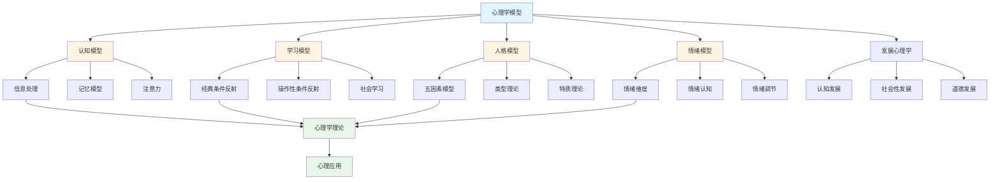

# 6.3 心理学模型 / Psychological Models

## 目录 / Table of Contents

- [6.3 心理学模型 / Psychological Models](#63-心理学模型--psychological-models)
  - [目录 / Table of Contents](#目录--table-of-contents)
  - [心理学模型框架图 / Framework Diagram of Psychological Models](#心理学模型框架图--framework-diagram-of-psychological-models)
  - [记忆模型流程图 / Flowchart of Memory Models](#记忆模型流程图--flowchart-of-memory-models)
  - [6.3.1 认知模型 / Cognitive Models](#631-认知模型--cognitive-models)
    - [信息处理模型 / Information Processing Models](#信息处理模型--information-processing-models)
    - [记忆模型 / Memory Models](#记忆模型--memory-models)
    - [注意力模型 / Attention Models](#注意力模型--attention-models)
  - [6.3.2 学习模型 / Learning Models](#632-学习模型--learning-models)
    - [经典条件反射 / Classical Conditioning](#经典条件反射--classical-conditioning)
    - [操作性条件反射 / Operant Conditioning](#操作性条件反射--operant-conditioning)
    - [社会学习理论 / Social Learning Theory](#社会学习理论--social-learning-theory)
  - [6.3.3 人格模型 / Personality Models](#633-人格模型--personality-models)
    - [五因素模型 / Five Factor Model](#五因素模型--five-factor-model)
    - [类型理论 / Type Theories](#类型理论--type-theories)
    - [特质理论 / Trait Theories](#特质理论--trait-theories)
  - [6.3.4 情绪模型 / Emotion Models](#634-情绪模型--emotion-models)
    - [情绪维度理论 / Dimensional Emotion Theory](#情绪维度理论--dimensional-emotion-theory)
    - [情绪认知理论 / Cognitive Emotion Theory](#情绪认知理论--cognitive-emotion-theory)
    - [情绪调节模型 / Emotion Regulation Models](#情绪调节模型--emotion-regulation-models)
  - [6.3.5 发展心理学模型 / Developmental Psychology Models](#635-发展心理学模型--developmental-psychology-models)
    - [认知发展理论 / Cognitive Development Theory](#认知发展理论--cognitive-development-theory)
    - [社会性发展理论 / Social Development Theory](#社会性发展理论--social-development-theory)
    - [道德发展理论 / Moral Development Theory](#道德发展理论--moral-development-theory)
  - [6.3.6 实现与应用 / Implementation and Applications](#636-实现与应用--implementation-and-applications)
    - [Rust实现示例 / Rust Implementation Example](#rust实现示例--rust-implementation-example)
    - [Haskell实现示例 / Haskell Implementation Example](#haskell实现示例--haskell-implementation-example)
    - [应用领域 / Application Domains](#应用领域--application-domains)
      - [临床心理学 / Clinical Psychology](#临床心理学--clinical-psychology)
      - [教育心理学 / Educational Psychology](#教育心理学--educational-psychology)
      - [组织心理学 / Organizational Psychology](#组织心理学--organizational-psychology)
  - [相关模型 / Related Models](#相关模型--related-models)
    - [社会科学模型 / Social Science Models](#社会科学模型--social-science-models)
    - [生命科学模型 / Life Science Models](#生命科学模型--life-science-models)
    - [计算机科学模型 / Computer Science Models](#计算机科学模型--computer-science-models)
    - [数学科学模型 / Mathematical Science Models](#数学科学模型--mathematical-science-models)
    - [基础理论 / Basic Theory](#基础理论--basic-theory)
  - [参考文献 / References](#参考文献--references)

---

## 心理学模型框架图 / Framework Diagram of Psychological Models



## 记忆模型流程图 / Flowchart of Memory Models

```mermaid
flowchart TD
    Start([信息输入]) --> Sensory[感觉记忆<br/>Sensory Memory]
    Sensory --> Attention{注意选择}
    Attention -->|是| STM[短时记忆<br/>STM<br/>7±2项]
    Attention -->|否| Forget1[遗忘]

    STM --> Rehearsal{复述}
    Rehearsal -->|维持性复述| STM
    Rehearsal -->|精细复述| LTM[长时记忆<br/>LTM]

    LTM --> Encoding[编码]
    Encoding --> Storage[存储]
    Storage --> Retrieval[提取]

    Retrieval --> Success{成功提取?}
    Success -->|是| Recall[回忆]
    Success -->|否| Forgetting[遗忘曲线<br/>R = e^(-t/S)]

    Recall --> Use[使用]
    Use --> Reinforcement[强化]
    Reinforcement --> LTM

    style Start fill:#e1f5ff
    style LTM fill:#e8f5e9
    style Recall fill:#e8f5e9
```

## 6.3.1 认知模型 / Cognitive Models

### 信息处理模型 / Information Processing Models

**信息流**: $Input \rightarrow Processing \rightarrow Output$

**反应时间**: $RT = a + b \log_2(N)$

**信息容量**: $C = \log_2(N)$

**处理速度**: $v = \frac{d}{t}$

### 记忆模型 / Memory Models

**艾宾浩斯遗忘曲线**: $R = e^{-\frac{t}{S}}$

**记忆强度**: $S = S_0 e^{-\lambda t}$

**回忆概率**: $P(recall) = \frac{1}{1 + e^{-(S - \theta)}}$

**工作记忆容量**: $Capacity = 7 \pm 2$

### 注意力模型 / Attention Models

**选择性注意**: $P(attend) = \frac{Salience}{Salience + Distraction}$

**注意力资源**: $R = R_{total} - \sum_{i=1}^n R_i$

**注意分配**: $A_i = \frac{w_i}{\sum_{j=1}^n w_j}$

---

## 6.3.2 学习模型 / Learning Models

### 经典条件反射 / Classical Conditioning

**条件反射强度**: $V = \alpha \beta (\lambda - V)$

**消退**: $V = V_0 e^{-\lambda t}$

**泛化**: $V_{CS'} = V_{CS} e^{-d^2/2\sigma^2}$

### 操作性条件反射 / Operant Conditioning

**强化函数**: $P(response) = \frac{1}{1 + e^{-(V - \theta)}}$

**强化率**: $R = \frac{responses}{time}$

**强化程序**: $R = \frac{1}{VI + VR}$

### 社会学习理论 / Social Learning Theory

**观察学习**: $P(imitation) = \frac{Attention \times Retention \times Reproduction \times Motivation}{4}$

**自我效能**: $SE = f(Past Performance, Vicarious Experience, Verbal Persuasion, Physiological States)$

---

## 6.3.3 人格模型 / Personality Models

### 五因素模型 / Five Factor Model

**开放性**: $O = \sum_{i=1}^n w_i O_i$

**尽责性**: $C = \sum_{i=1}^n w_i C_i$

**外向性**: $E = \sum_{i=1}^n w_i E_i$

**宜人性**: $A = \sum_{i=1}^n w_i A_i$

**神经质**: $N = \sum_{i=1}^n w_i N_i$

### 类型理论 / Type Theories

**MBTI类型**: $Type = f(E/I, S/N, T/F, J/P)$

**类型匹配**: $Compatibility = \sum_{i=1}^4 w_i \cdot similarity_i$

### 特质理论 / Trait Theories

**特质分数**: $T = \mu + \sigma \cdot Z$

**特质稳定性**: $Stability = \frac{Cov(T_1, T_2)}{\sqrt{Var(T_1) \cdot Var(T_2)}}$

---

## 6.3.4 情绪模型 / Emotion Models

### 情绪维度理论 / Dimensional Emotion Theory

**效价**: $Valence \in [-1, 1]$

**唤醒度**: $Arousal \in [0, 1]$

**支配度**: $Dominance \in [0, 1]$

**情绪空间**: $E = (V, A, D)$

### 情绪认知理论 / Cognitive Emotion Theory

**情绪强度**: $I = f(Event, Appraisal, Coping)$

**评价维度**: $Appraisal = (Novelty, Pleasantness, Goal Relevance, Goal Congruence, Ego Involvement, Coping Potential)$

### 情绪调节模型 / Emotion Regulation Models

**调节策略**: $Regulation = f(Strategy, Context, Individual)$

**调节效果**: $Effect = \frac{Target - Baseline}{Baseline}$

---

## 6.3.5 发展心理学模型 / Developmental Psychology Models

### 认知发展理论 / Cognitive Development Theory

**发展阶段**: $Stage = f(Age, Cognitive Ability)$

**适应**: $Adaptation = Assimilation + Accommodation$

**平衡**: $Equilibrium = \frac{Assimilation}{Accommodation}$

### 社会性发展理论 / Social Development Theory

**社会技能**: $Social Skill = f(Interaction, Communication, Cooperation)$

**同伴关系**: $Peer Relationship = f(Proximity, Similarity, Reciprocity)$

### 道德发展理论 / Moral Development Theory

**道德判断**: $Moral Judgment = f(Stage, Context, Individual)$

**道德推理**: $Moral Reasoning = \sum_{i=1}^n w_i \cdot Level_i$

---

## 6.3.6 实现与应用 / Implementation and Applications

### Rust实现示例 / Rust Implementation Example

```rust
use std::collections::HashMap;

#[derive(Debug, Clone)]
pub struct CognitiveModel {
    pub attention_capacity: f64,
    pub memory_capacity: f64,
    pub processing_speed: f64,
}

impl CognitiveModel {
    pub fn new() -> Self {
        Self {
            attention_capacity: 7.0,
            memory_capacity: 100.0,
            processing_speed: 1.0,
        }
    }

    pub fn calculate_reaction_time(&self, stimulus_complexity: f64) -> f64 {
        // Hick-Hyman Law
        let information_content = stimulus_complexity.log2();
        self.processing_speed * information_content + 0.1
    }

    pub fn calculate_memory_retention(&self, time_elapsed: f64, initial_strength: f64) -> f64 {
        // Ebbinghaus forgetting curve
        let decay_rate = 0.1;
        initial_strength * (-decay_rate * time_elapsed).exp()
    }

    pub fn calculate_attention_allocation(&self, stimuli: &[f64]) -> Vec<f64> {
        let total_salience: f64 = stimuli.iter().sum();
        stimuli.iter().map(|&s| s / total_salience).collect()
    }
}

#[derive(Debug, Clone)]
pub struct LearningModel {
    pub reinforcement_rate: f64,
    pub extinction_rate: f64,
    pub generalization_sigma: f64,
}

impl LearningModel {
    pub fn new() -> Self {
        Self {
            reinforcement_rate: 0.1,
            extinction_rate: 0.05,
            generalization_sigma: 1.0,
        }
    }

    pub fn classical_conditioning(&self, cs_strength: f64, us_strength: f64) -> f64 {
        let alpha = 0.1;
        let beta = 0.1;
        let lambda = us_strength;
        alpha * beta * (lambda - cs_strength)
    }

    pub fn operant_conditioning(&self, response_strength: f64, reinforcement: f64) -> f64 {
        let theta = 0.5;
        let probability = 1.0 / (1.0 + (-(response_strength - theta)).exp());
        probability * reinforcement
    }

    pub fn extinction(&self, initial_strength: f64, time: f64) -> f64 {
        initial_strength * (-self.extinction_rate * time).exp()
    }
}

#[derive(Debug, Clone)]
pub struct PersonalityModel {
    pub openness: f64,
    pub conscientiousness: f64,
    pub extraversion: f64,
    pub agreeableness: f64,
    pub neuroticism: f64,
}

impl PersonalityModel {
    pub fn new() -> Self {
        Self {
            openness: 0.5,
            conscientiousness: 0.5,
            extraversion: 0.5,
            agreeableness: 0.5,
            neuroticism: 0.5,
        }
    }

    pub fn calculate_big_five(&self) -> Vec<f64> {
        vec![
            self.openness,
            self.conscientiousness,
            self.extraversion,
            self.agreeableness,
            self.neuroticism,
        ]
    }

    pub fn calculate_personality_compatibility(&self, other: &PersonalityModel) -> f64 {
        let differences = vec![
            (self.openness - other.openness).abs(),
            (self.conscientiousness - other.conscientiousness).abs(),
            (self.extraversion - other.extraversion).abs(),
            (self.agreeableness - other.agreeableness).abs(),
            (self.neuroticism - other.neuroticism).abs(),
        ];

        let avg_difference: f64 = differences.iter().sum::<f64>() / differences.len() as f64;
        1.0 - avg_difference
    }
}

#[derive(Debug, Clone)]
pub struct EmotionModel {
    pub valence: f64,
    pub arousal: f64,
    pub dominance: f64,
}

impl EmotionModel {
    pub fn new() -> Self {
        Self {
            valence: 0.0,
            arousal: 0.5,
            dominance: 0.5,
        }
    }

    pub fn update_emotion(&mut self, event_valence: f64, event_arousal: f64) {
        let learning_rate = 0.1;
        self.valence += learning_rate * (event_valence - self.valence);
        self.arousal += learning_rate * (event_arousal - self.arousal);

        // 限制在有效范围内
        self.valence = self.valence.max(-1.0).min(1.0);
        self.arousal = self.arousal.max(0.0).min(1.0);
    }

    pub fn calculate_emotion_intensity(&self) -> f64 {
        (self.valence.abs() + self.arousal) / 2.0
    }

    pub fn get_emotion_category(&self) -> String {
        match (self.valence, self.arousal) {
            (v, a) if v > 0.5 && a > 0.5 => "兴奋".to_string(),
            (v, a) if v > 0.5 && a <= 0.5 => "满足".to_string(),
            (v, a) if v <= 0.5 && a > 0.5 => "愤怒".to_string(),
            (v, a) if v <= 0.5 && a <= 0.5 => "悲伤".to_string(),
            _ => "中性".to_string(),
        }
    }
}

#[derive(Debug, Clone)]
pub struct DevelopmentalModel {
    pub age: f64,
    pub cognitive_level: f64,
    pub social_level: f64,
    pub moral_level: f64,
}

impl DevelopmentalModel {
    pub fn new(age: f64) -> Self {
        Self {
            age,
            cognitive_level: age / 20.0, // 简化的认知发展
            social_level: age / 25.0,     // 简化的社会发展
            moral_level: age / 30.0,      // 简化的道德发展
        }
    }

    pub fn update_development(&mut self, time_delta: f64, experiences: &[f64]) {
        let experience_factor = experiences.iter().sum::<f64>() / experiences.len() as f64;

        self.age += time_delta;
        self.cognitive_level += 0.01 * experience_factor * time_delta;
        self.social_level += 0.008 * experience_factor * time_delta;
        self.moral_level += 0.006 * experience_factor * time_delta;

        // 限制发展水平
        self.cognitive_level = self.cognitive_level.min(1.0);
        self.social_level = self.social_level.min(1.0);
        self.moral_level = self.moral_level.min(1.0);
    }

    pub fn get_developmental_stage(&self) -> String {
        match self.age {
            age if age < 2.0 => "婴儿期".to_string(),
            age if age < 6.0 => "幼儿期".to_string(),
            age if age < 12.0 => "儿童期".to_string(),
            age if age < 18.0 => "青少年期".to_string(),
            age if age < 65.0 => "成年期".to_string(),
            _ => "老年期".to_string(),
        }
    }
}

// 使用示例
fn main() {
    // 认知模型示例
    let mut cognitive = CognitiveModel::new();
    let reaction_time = cognitive.calculate_reaction_time(8.0);
    let memory_retention = cognitive.calculate_memory_retention(24.0, 1.0);
    let attention = cognitive.calculate_attention_allocation(&[0.3, 0.5, 0.2]);

    println!("认知模型示例:");
    println!("反应时间: {:.3}秒", reaction_time);
    println!("记忆保持: {:.3}", memory_retention);
    println!("注意力分配: {:?}", attention);

    // 学习模型示例
    let mut learning = LearningModel::new();
    let conditioning = learning.classical_conditioning(0.3, 1.0);
    let operant = learning.operant_conditioning(0.6, 0.8);
    let extinction = learning.extinction(0.8, 10.0);

    println!("\n学习模型示例:");
    println!("经典条件反射: {:.3}", conditioning);
    println!("操作性条件反射: {:.3}", operant);
    println!("消退: {:.3}", extinction);

    // 人格模型示例
    let mut person1 = PersonalityModel::new();
    person1.openness = 0.8;
    person1.extraversion = 0.7;

    let mut person2 = PersonalityModel::new();
    person2.openness = 0.6;
    person2.extraversion = 0.5;

    let compatibility = person1.calculate_personality_compatibility(&person2);

    println!("\n人格模型示例:");
    println!("五因素模型: {:?}", person1.calculate_big_five());
    println!("人格相容性: {:.3}", compatibility);

    // 情绪模型示例
    let mut emotion = EmotionModel::new();
    emotion.update_emotion(0.8, 0.9);

    println!("\n情绪模型示例:");
    println!("情绪强度: {:.3}", emotion.calculate_emotion_intensity());
    println!("情绪类别: {}", emotion.get_emotion_category());

    // 发展模型示例
    let mut development = DevelopmentalModel::new(12.0);
    development.update_development(1.0, &[0.5, 0.7, 0.3]);

    println!("\n发展模型示例:");
    println!("发展阶段: {}", development.get_developmental_stage());
    println!("认知水平: {:.3}", development.cognitive_level);
    println!("社会水平: {:.3}", development.social_level);
    println!("道德水平: {:.3}", development.moral_level);
}
```

### Haskell实现示例 / Haskell Implementation Example

```haskell
module PsychologicalModels where

import Data.Map (Map)
import qualified Data.Map as Map
import Data.List (sum, length, filter, maximum)

-- 认知模型
data CognitiveModel = CognitiveModel {
    attentionCapacity :: Double,
    memoryCapacity :: Double,
    processingSpeed :: Double
} deriving Show

newCognitiveModel :: CognitiveModel
newCognitiveModel = CognitiveModel {
    attentionCapacity = 7.0,
    memoryCapacity = 100.0,
    processingSpeed = 1.0
}

calculateReactionTime :: CognitiveModel -> Double -> Double
calculateReactionTime model stimulusComplexity =
    let informationContent = logBase 2 stimulusComplexity
    in processingSpeed model * informationContent + 0.1

calculateMemoryRetention :: CognitiveModel -> Double -> Double -> Double
calculateMemoryRetention model timeElapsed initialStrength =
    let decayRate = 0.1
    in initialStrength * exp (-decayRate * timeElapsed)

calculateAttentionAllocation :: CognitiveModel -> [Double] -> [Double]
calculateAttentionAllocation model stimuli =
    let totalSalience = sum stimuli
    in map (/ totalSalience) stimuli

-- 学习模型
data LearningModel = LearningModel {
    reinforcementRate :: Double,
    extinctionRate :: Double,
    generalizationSigma :: Double
} deriving Show

newLearningModel :: LearningModel
newLearningModel = LearningModel {
    reinforcementRate = 0.1,
    extinctionRate = 0.05,
    generalizationSigma = 1.0
}

classicalConditioning :: LearningModel -> Double -> Double -> Double
classicalConditioning model csStrength usStrength =
    let alpha = 0.1
        beta = 0.1
        lambda = usStrength
    in alpha * beta * (lambda - csStrength)

operantConditioning :: LearningModel -> Double -> Double -> Double
operantConditioning model responseStrength reinforcement =
    let theta = 0.5
        probability = 1.0 / (1.0 + exp (-(responseStrength - theta)))
    in probability * reinforcement

extinction :: LearningModel -> Double -> Double -> Double
extinction model initialStrength time =
    initialStrength * exp (-extinctionRate model * time)

-- 人格模型
data PersonalityModel = PersonalityModel {
    openness :: Double,
    conscientiousness :: Double,
    extraversion :: Double,
    agreeableness :: Double,
    neuroticism :: Double
} deriving Show

newPersonalityModel :: PersonalityModel
newPersonalityModel = PersonalityModel {
    openness = 0.5,
    conscientiousness = 0.5,
    extraversion = 0.5,
    agreeableness = 0.5,
    neuroticism = 0.5
}

calculateBigFive :: PersonalityModel -> [Double]
calculateBigFive model = [
    openness model,
    conscientiousness model,
    extraversion model,
    agreeableness model,
    neuroticism model
]

calculatePersonalityCompatibility :: PersonalityModel -> PersonalityModel -> Double
calculatePersonalityCompatibility person1 person2 =
    let differences = [
            abs (openness person1 - openness person2),
            abs (conscientiousness person1 - conscientiousness person2),
            abs (extraversion person1 - extraversion person2),
            abs (agreeableness person1 - agreeableness person2),
            abs (neuroticism person1 - neuroticism person2)
        ]
        avgDifference = sum differences / fromIntegral (length differences)
    in 1.0 - avgDifference

-- 情绪模型
data EmotionModel = EmotionModel {
    valence :: Double,
    arousal :: Double,
    dominance :: Double
} deriving Show

newEmotionModel :: EmotionModel
newEmotionModel = EmotionModel {
    valence = 0.0,
    arousal = 0.5,
    dominance = 0.5
}

updateEmotion :: EmotionModel -> Double -> Double -> EmotionModel
updateEmotion model eventValence eventArousal =
    let learningRate = 0.1
        newValence = valence model + learningRate * (eventValence - valence model)
        newArousal = arousal model + learningRate * (eventArousal - arousal model)
        clampedValence = max (-1.0) (min 1.0 newValence)
        clampedArousal = max 0.0 (min 1.0 newArousal)
    in model {
        valence = clampedValence,
        arousal = clampedArousal
    }

calculateEmotionIntensity :: EmotionModel -> Double
calculateEmotionIntensity model =
    (abs (valence model) + arousal model) / 2.0

getEmotionCategory :: EmotionModel -> String
getEmotionCategory model =
    case (valence model, arousal model) of
        (v, a) | v > 0.5 && a > 0.5 -> "兴奋"
        (v, a) | v > 0.5 && a <= 0.5 -> "满足"
        (v, a) | v <= 0.5 && a > 0.5 -> "愤怒"
        (v, a) | v <= 0.5 && a <= 0.5 -> "悲伤"
        _ -> "中性"

-- 发展模型
data DevelopmentalModel = DevelopmentalModel {
    age :: Double,
    cognitiveLevel :: Double,
    socialLevel :: Double,
    moralLevel :: Double
} deriving Show

newDevelopmentalModel :: Double -> DevelopmentalModel
newDevelopmentalModel age = DevelopmentalModel {
    age = age,
    cognitiveLevel = age / 20.0,
    socialLevel = age / 25.0,
    moralLevel = age / 30.0
}

updateDevelopment :: DevelopmentalModel -> Double -> [Double] -> DevelopmentalModel
updateDevelopment model timeDelta experiences =
    let experienceFactor = sum experiences / fromIntegral (length experiences)
        newAge = age model + timeDelta
        newCognitiveLevel = min 1.0 (cognitiveLevel model + 0.01 * experienceFactor * timeDelta)
        newSocialLevel = min 1.0 (socialLevel model + 0.008 * experienceFactor * timeDelta)
        newMoralLevel = min 1.0 (moralLevel model + 0.006 * experienceFactor * timeDelta)
    in model {
        age = newAge,
        cognitiveLevel = newCognitiveLevel,
        socialLevel = newSocialLevel,
        moralLevel = newMoralLevel
    }

getDevelopmentalStage :: DevelopmentalModel -> String
getDevelopmentalStage model =
    case age model of
        age | age < 2.0 -> "婴儿期"
        age | age < 6.0 -> "幼儿期"
        age | age < 12.0 -> "儿童期"
        age | age < 18.0 -> "青少年期"
        age | age < 65.0 -> "成年期"
        _ -> "老年期"

-- 示例使用
example :: IO ()
example = do
    -- 认知模型示例
    let cognitive = newCognitiveModel
        reactionTime = calculateReactionTime cognitive 8.0
        memoryRetention = calculateMemoryRetention cognitive 24.0 1.0
        attention = calculateAttentionAllocation cognitive [0.3, 0.5, 0.2]

    putStrLn "认知模型示例:"
    putStrLn $ "反应时间: " ++ show reactionTime ++ "秒"
    putStrLn $ "记忆保持: " ++ show memoryRetention
    putStrLn $ "注意力分配: " ++ show attention

    -- 学习模型示例
    let learning = newLearningModel
        conditioning = classicalConditioning learning 0.3 1.0
        operant = operantConditioning learning 0.6 0.8
        extinction = extinction learning 0.8 10.0

    putStrLn "\n学习模型示例:"
    putStrLn $ "经典条件反射: " ++ show conditioning
    putStrLn $ "操作性条件反射: " ++ show operant
    putStrLn $ "消退: " ++ show extinction

    -- 人格模型示例
    let person1 = newPersonalityModel { openness = 0.8, extraversion = 0.7 }
        person2 = newPersonalityModel { openness = 0.6, extraversion = 0.5 }
        compatibility = calculatePersonalityCompatibility person1 person2

    putStrLn "\n人格模型示例:"
    putStrLn $ "五因素模型: " ++ show (calculateBigFive person1)
    putStrLn $ "人格相容性: " ++ show compatibility

    -- 情绪模型示例
    let emotion = updateEmotion newEmotionModel 0.8 0.9
        intensity = calculateEmotionIntensity emotion
        category = getEmotionCategory emotion

    putStrLn "\n情绪模型示例:"
    putStrLn $ "情绪强度: " ++ show intensity
    putStrLn $ "情绪类别: " ++ category

    -- 发展模型示例
    let development = updateDevelopment (newDevelopmentalModel 12.0) 1.0 [0.5, 0.7, 0.3]
        stage = getDevelopmentalStage development

    putStrLn "\n发展模型示例:"
    putStrLn $ "发展阶段: " ++ stage
    putStrLn $ "认知水平: " ++ show (cognitiveLevel development)
    putStrLn $ "社会水平: " ++ show (socialLevel development)
    putStrLn $ "道德水平: " ++ show (moralLevel development)
```

### 应用领域 / Application Domains

#### 临床心理学 / Clinical Psychology

- **心理评估**: 标准化心理测试和评估工具
- **心理治疗**: 认知行为疗法、心理动力学疗法
- **心理健康**: 情绪调节、压力管理

#### 教育心理学 / Educational Psychology

- **学习理论**: 教学设计、学习策略
- **发展评估**: 儿童发展评估、学习障碍诊断
- **教育干预**: 个性化教育、特殊教育

#### 组织心理学 / Organizational Psychology

- **人员选拔**: 职业兴趣、能力评估
- **工作动机**: 激励理论、工作满意度
- **组织发展**: 团队建设、领导力发展

---

## 相关模型 / Related Models

### 社会科学模型 / Social Science Models

- [社会网络模型](../01-社会网络模型/README.md) - 社会心理学和网络心理学
- [经济学模型](../02-经济学模型/README.md) - 行为经济学和决策心理学
- [认知科学模型](../04-认知科学模型/README.md) - 认知心理学和认知科学
- [语言学模型](../05-语言学模型/README.md) - 心理语言学和语言心理学

### 生命科学模型 / Life Science Models

- [神经科学模型](../../05-生命科学模型/04-神经科学模型/README.md) - 认知神经科学和神经心理学
- [分子生物学模型](../../05-生命科学模型/01-分子生物学模型/README.md) - 行为遗传学和分子心理学

### 计算机科学模型 / Computer Science Models

- [人工智能模型](../../04-计算机科学模型/05-人工智能模型/README.md) - 认知建模和计算心理学
- [算法模型](../../04-计算机科学模型/02-算法模型/README.md) - 认知算法和心理算法

### 数学科学模型 / Mathematical Science Models

- [代数模型](../../03-数学科学模型/01-代数模型/README.md) - 心理测量学和心理统计
- [几何模型](../../03-数学科学模型/02-几何模型/README.md) - 心理空间和认知几何

### 基础理论 / Basic Theory

- [模型分类学](../../01-基础理论/01-模型分类学/README.md) - 心理学模型的分类
- [形式化方法论](../../01-基础理论/02-形式化方法论/README.md) - 心理学模型的形式化方法
- [科学模型论](../../01-基础理论/03-科学模型论/README.md) - 心理学模型作为科学模型的理论基础

## 参考文献 / References

1. Atkinson, R. C., & Shiffrin, R. M. (1968). Human memory: A proposed system and its control processes. Psychology of Learning and Motivation, 2, 89-195.
2. Bandura, A. (1977). Social learning theory. Prentice Hall.
3. Costa, P. T., & McCrae, R. R. (1992). Revised NEO Personality Inventory (NEO-PI-R) and NEO Five-Factor Inventory (NEO-FFI) professional manual. Psychological Assessment Resources.
4. Ekman, P. (1992). An argument for basic emotions. Cognition & Emotion, 6(3-4), 169-200.
5. Piaget, J. (1952). The origins of intelligence in children. International Universities Press.

---

*最后更新: 2025-08-01*
*版本: 1.0.0*
