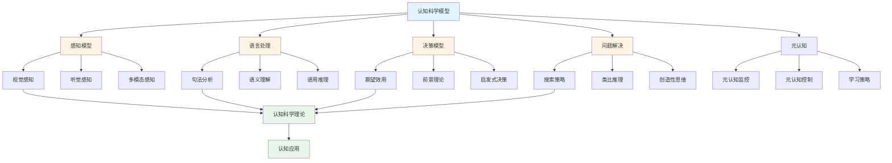
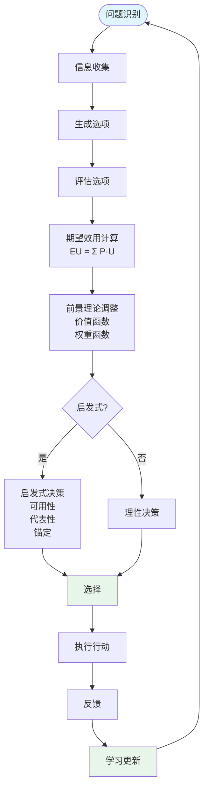

# 6.4 认知科学模型 / Cognitive Science Models

## 目录 / Table of Contents

- [6.4 认知科学模型 / Cognitive Science Models](#64-认知科学模型--cognitive-science-models)
  - [目录 / Table of Contents](#目录--table-of-contents)
  - [认知科学模型框架图 / Framework Diagram of Cognitive Science Models](#认知科学模型框架图--framework-diagram-of-cognitive-science-models)
  - [决策模型流程图 / Flowchart of Decision Models](#决策模型流程图--flowchart-of-decision-models)
  - [6.4.1 感知模型 / Perception Models](#641-感知模型--perception-models)
    - [视觉感知 / Visual Perception](#视觉感知--visual-perception)
    - [听觉感知 / Auditory Perception](#听觉感知--auditory-perception)
    - [多模态感知 / Multimodal Perception](#多模态感知--multimodal-perception)
  - [6.4.2 语言处理模型 / Language Processing Models](#642-语言处理模型--language-processing-models)
    - [句法分析 / Syntactic Parsing](#句法分析--syntactic-parsing)
    - [语义理解 / Semantic Understanding](#语义理解--semantic-understanding)
    - [语用推理 / Pragmatic Inference](#语用推理--pragmatic-inference)
  - [6.4.3 决策模型 / Decision Models](#643-决策模型--decision-models)
    - [期望效用理论 / Expected Utility Theory](#期望效用理论--expected-utility-theory)
    - [前景理论 / Prospect Theory](#前景理论--prospect-theory)
    - [启发式决策 / Heuristic Decision Making](#启发式决策--heuristic-decision-making)
  - [6.4.4 问题解决模型 / Problem Solving Models](#644-问题解决模型--problem-solving-models)
    - [搜索策略 / Search Strategies](#搜索策略--search-strategies)
    - [类比推理 / Analogical Reasoning](#类比推理--analogical-reasoning)
    - [创造性思维 / Creative Thinking](#创造性思维--creative-thinking)
  - [6.4.5 元认知模型 / Metacognitive Models](#645-元认知模型--metacognitive-models)
    - [元认知监控 / Metacognitive Monitoring](#元认知监控--metacognitive-monitoring)
    - [元认知控制 / Metacognitive Control](#元认知控制--metacognitive-control)
    - [学习策略 / Learning Strategies](#学习策略--learning-strategies)
  - [6.4.6 实现与应用 / Implementation and Applications](#646-实现与应用--implementation-and-applications)
    - [Rust实现示例 / Rust Implementation Example](#rust实现示例--rust-implementation-example)
    - [Haskell实现示例 / Haskell Implementation Example](#haskell实现示例--haskell-implementation-example)
    - [应用领域 / Application Domains](#应用领域--application-domains)
      - [人工智能 / Artificial Intelligence](#人工智能--artificial-intelligence)
      - [人机交互 / Human-Computer Interaction](#人机交互--human-computer-interaction)
      - [认知增强 / Cognitive Enhancement](#认知增强--cognitive-enhancement)
  - [参考文献 / References](#参考文献--references)
  - [相关模型 / Related Models](#相关模型--related-models)
    - [社会科学模型 / Social Science Models](#社会科学模型--social-science-models)
    - [生命科学模型 / Life Science Models](#生命科学模型--life-science-models)
    - [计算机科学模型 / Computer Science Models](#计算机科学模型--computer-science-models)
    - [数学科学模型 / Mathematical Science Models](#数学科学模型--mathematical-science-models)
    - [基础理论 / Basic Theory](#基础理论--basic-theory)

---

## 认知科学模型框架图 / Framework Diagram of Cognitive Science Models



## 决策模型流程图 / Flowchart of Decision Models



## 6.4.1 感知模型 / Perception Models

### 视觉感知 / Visual Perception

**对比度敏感度**: $CS = \frac{\Delta L}{L}$

**空间频率响应**: $H(f) = e^{-\frac{f^2}{2\sigma^2}}$

**颜色感知**: $C = \int S(\lambda) \cdot R(\lambda) d\lambda$

**深度感知**: $d = \frac{f \cdot B}{D}$

### 听觉感知 / Auditory Perception

**频率响应**: $H(f) = \frac{1}{1 + j\frac{f}{f_c}}$

**响度感知**: $L = 20 \log_{10} \frac{P}{P_0}$

**音高感知**: $f_{pitch} = f_0 \cdot 2^{n/12}$

**掩蔽效应**: $M(f) = \sum_{i=1}^n M_i(f)$

### 多模态感知 / Multimodal Perception

**感知融合**: $P_{fused} = \frac{\sum_{i=1}^n w_i P_i}{\sum_{i=1}^n w_i}$

**跨模态匹配**: $S = \frac{\sum_{i=1}^n s_i}{\sqrt{\sum_{i=1}^n s_i^2}}$

**感知一致性**: $C = \frac{\text{一致感知}}{\text{总感知}}$

---

## 6.4.2 语言处理模型 / Language Processing Models

### 句法分析 / Syntactic Parsing

**概率上下文无关文法**: $P(T) = \prod_{i=1}^n P(r_i)$

**CKY算法**: $P[i,j,k] = \max_{i \leq m < j} P[i,m,k_1] \cdot P[m+1,j,k_2] \cdot P(k \rightarrow k_1 k_2)$

**依存句法**: $D = \{(w_i, w_j, r) | w_i \text{ depends on } w_j \text{ with relation } r\}$

### 语义理解 / Semantic Understanding

**词向量**: $\mathbf{v}_w = \frac{\sum_{c \in C(w)} \mathbf{v}_c}{|C(w)|}$

**语义相似度**: $sim(w_1, w_2) = \frac{\mathbf{v}_{w_1} \cdot \mathbf{v}_{w_2}}{|\mathbf{v}_{w_1}| \cdot |\mathbf{v}_{w_2}|}$

**语义组合**: $\mathbf{v}_{phrase} = f(\mathbf{v}_{w_1}, \mathbf{v}_{w_2}, \ldots, \mathbf{v}_{w_n})$

### 语用推理 / Pragmatic Inference

**Grice准则**: $Q = \{Quantity, Quality, Relation, Manner\}$

**会话含义**: $I = \{i | P(i|u) > P(i|\neg u)\}$

**指代消解**: $P(ref) = \frac{P(ref|context) \cdot P(context)}{P(context)}$

---

## 6.4.3 决策模型 / Decision Models

### 期望效用理论 / Expected Utility Theory

**期望效用**: $EU(A) = \sum_{i=1}^n p_i \cdot u(x_i)$

**风险态度**: $u(x) = \begin{cases} x^\alpha & \text{if } \alpha > 1 \text{ (risk-seeking)} \\ x & \text{if } \alpha = 1 \text{ (risk-neutral)} \\ x^\alpha & \text{if } \alpha < 1 \text{ (risk-averse)} \end{cases}$

**决策规则**: $A^* = \arg\max_A EU(A)$

### 前景理论 / Prospect Theory

**价值函数**: $v(x) = \begin{cases} x^\alpha & \text{if } x \geq 0 \\ -\lambda(-x)^\beta & \text{if } x < 0 \end{cases}$

**权重函数**: $\pi(p) = \frac{p^\gamma}{(p^\gamma + (1-p)^\gamma)^{1/\gamma}}$

**前景价值**: $V = \sum_{i=1}^n \pi(p_i) \cdot v(x_i)$

### 启发式决策 / Heuristic Decision Making

**可用性启发式**: $P(A) \propto \text{ease of recall}$

**代表性启发式**: $P(A|B) \propto \text{similarity}(A, B)$

**锚定效应**: $estimate = anchor \pm adjustment$

---

## 6.4.4 问题解决模型 / Problem Solving Models

### 搜索策略 / Search Strategies

**广度优先搜索**: $f(n) = g(n)$

**深度优先搜索**: $f(n) = -d(n)$

**A*算法**: $f(n) = g(n) + h(n)$

**启发式函数**: $h(n) \leq h^*(n)$

### 类比推理 / Analogical Reasoning

**结构映射**: $S = \{(a_1, a_2) | a_1 \in A, a_2 \in B, \text{similar}(a_1, a_2)\}$

**类比强度**: $strength = \frac{|S|}{|A| \cdot |B|}$

**类比推理**: $conclusion = f(source, target, mapping)$

### 创造性思维 / Creative Thinking

**发散思维**: $fluency = \frac{\text{ideas generated}}{\text{time}}$

**灵活性**: $flexibility = \frac{\text{idea categories}}{\text{total ideas}}$

**原创性**: $originality = \frac{\text{unique ideas}}{\text{total ideas}}$

---

## 6.4.5 元认知模型 / Metacognitive Models

### 元认知监控 / Metacognitive Monitoring

**判断学习**: $JOL = f(difficulty, familiarity, processing_fluency)$

**信心判断**: $confidence = f(performance, experience, feedback)$

**元认知准确性**: $accuracy = \frac{\text{correct judgments}}{\text{total judgments}}$

### 元认知控制 / Metacognitive Control

**学习时间分配**: $time_i = f(importance_i, difficulty_i, deadline)$

**策略选择**: $strategy = \arg\max_s E[performance|s]$

**努力调节**: $effort = f(difficulty, motivation, resources)$

### 学习策略 / Learning Strategies

**复述策略**: $rehearsal = \sum_{i=1}^n repetition_i$

**精细加工**: $elaboration = \sum_{i=1}^n connection_i$

**组织策略**: $organization = \frac{\text{organized items}}{\text{total items}}$

---

## 6.4.6 实现与应用 / Implementation and Applications

### Rust实现示例 / Rust Implementation Example

```rust
use std::collections::HashMap;

#[derive(Debug, Clone)]
pub struct PerceptionModel {
    pub visual_threshold: f64,
    pub auditory_threshold: f64,
    pub multimodal_weights: Vec<f64>,
}

impl PerceptionModel {
    pub fn new() -> Self {
        Self {
            visual_threshold: 0.1,
            auditory_threshold: 0.05,
            multimodal_weights: vec![0.6, 0.4], // 视觉权重0.6，听觉权重0.4
        }
    }

    pub fn visual_perception(&self, stimulus_intensity: f64, spatial_frequency: f64) -> f64 {
        let contrast_sensitivity = stimulus_intensity / self.visual_threshold;
        let frequency_response = (-spatial_frequency * spatial_frequency / 2.0).exp();
        contrast_sensitivity * frequency_response
    }

    pub fn auditory_perception(&self, sound_pressure: f64, frequency: f64) -> f64 {
        let loudness = 20.0 * (sound_pressure / 0.00002).log10();
        let frequency_response = 1.0 / (1.0 + frequency / 1000.0);
        loudness * frequency_response
    }

    pub fn multimodal_fusion(&self, visual_input: f64, auditory_input: f64) -> f64 {
        let weighted_sum = self.multimodal_weights[0] * visual_input +
                          self.multimodal_weights[1] * auditory_input;
        let total_weight: f64 = self.multimodal_weights.iter().sum();
        weighted_sum / total_weight
    }
}

#[derive(Debug, Clone)]
pub struct LanguageModel {
    pub vocabulary: HashMap<String, Vec<f64>>,
    pub grammar_rules: Vec<(String, Vec<String>)>,
}

impl LanguageModel {
    pub fn new() -> Self {
        let mut vocab = HashMap::new();
        vocab.insert("cat".to_string(), vec![0.1, 0.8, 0.2]);
        vocab.insert("dog".to_string(), vec![0.2, 0.7, 0.3]);
        vocab.insert("run".to_string(), vec![0.8, 0.1, 0.9]);

        let grammar = vec![
            ("S".to_string(), vec!["NP".to_string(), "VP".to_string()]),
            ("NP".to_string(), vec!["Det".to_string(), "N".to_string()]),
            ("VP".to_string(), vec!["V".to_string(), "NP".to_string()]),
        ];

        Self {
            vocabulary: vocab,
            grammar_rules: grammar,
        }
    }

    pub fn semantic_similarity(&self, word1: &str, word2: &str) -> f64 {
        if let (Some(vec1), Some(vec2)) = (self.vocabulary.get(word1), self.vocabulary.get(word2)) {
            let dot_product: f64 = vec1.iter().zip(vec2.iter()).map(|(a, b)| a * b).sum();
            let norm1: f64 = vec1.iter().map(|x| x * x).sum::<f64>().sqrt();
            let norm2: f64 = vec2.iter().map(|x| x * x).sum::<f64>().sqrt();

            if norm1 > 0.0 && norm2 > 0.0 {
                dot_product / (norm1 * norm2)
            } else {
                0.0
            }
        } else {
            0.0
        }
    }

    pub fn parse_sentence(&self, words: &[String]) -> f64 {
        // 简化的句法分析评分
        let mut score = 1.0;
        for i in 0..words.len() - 1 {
            let similarity = self.semantic_similarity(&words[i], &words[i + 1]);
            score *= (0.5 + 0.5 * similarity);
        }
        score
    }
}

#[derive(Debug, Clone)]
pub struct DecisionModel {
    pub risk_aversion: f64,
    pub loss_aversion: f64,
    pub reference_point: f64,
}

impl DecisionModel {
    pub fn new() -> Self {
        Self {
            risk_aversion: 0.8,
            loss_aversion: 2.25,
            reference_point: 0.0,
        }
    }

    pub fn expected_utility(&self, outcomes: &[f64], probabilities: &[f64]) -> f64 {
        outcomes.iter().zip(probabilities.iter())
            .map(|(outcome, prob)| prob * self.value_function(*outcome))
            .sum()
    }

    pub fn value_function(&self, x: f64) -> f64 {
        let relative_x = x - self.reference_point;
        if relative_x >= 0.0 {
            relative_x.powf(self.risk_aversion)
        } else {
            -self.loss_aversion * (-relative_x).powf(self.risk_aversion)
        }
    }

    pub fn prospect_theory_value(&self, outcomes: &[f64], probabilities: &[f64]) -> f64 {
        let mut value = 0.0;
        for (outcome, prob) in outcomes.iter().zip(probabilities.iter()) {
            let weighted_prob = self.weight_function(*prob);
            value += weighted_prob * self.value_function(*outcome);
        }
        value
    }

    fn weight_function(&self, p: f64) -> f64 {
        let gamma = 0.65;
        p.powf(gamma) / (p.powf(gamma) + (1.0 - p).powf(gamma)).powf(1.0 / gamma)
    }
}

#[derive(Debug, Clone)]
pub struct ProblemSolvingModel {
    pub search_depth: usize,
    pub heuristic_function: fn(&str, &str) -> f64,
}

impl ProblemSolvingModel {
    pub fn new() -> Self {
        Self {
            search_depth: 5,
            heuristic_function: |current, goal| {
                // 简化的启发式函数：计算字符串差异
                let mut diff = 0;
                let max_len = current.len().max(goal.len());
                for i in 0..max_len {
                    let c1 = current.chars().nth(i);
                    let c2 = goal.chars().nth(i);
                    if c1 != c2 {
                        diff += 1;
                    }
                }
                diff as f64
            },
        }
    }

    pub fn a_star_search(&self, start: &str, goal: &str, successors: &dyn Fn(&str) -> Vec<String>) -> Option<Vec<String>> {
        let mut open_set = vec![start.to_string()];
        let mut came_from = HashMap::new();
        let mut g_score = HashMap::new();
        let mut f_score = HashMap::new();

        g_score.insert(start.to_string(), 0.0);
        f_score.insert(start.to_string(), (self.heuristic_function)(start, goal));

        while !open_set.is_empty() {
            // 找到f_score最小的节点
            let current = open_set.iter()
                .min_by(|a, b| f_score.get(*a).unwrap_or(&f64::INFINITY)
                    .partial_cmp(f_score.get(*b).unwrap_or(&f64::INFINITY)).unwrap())
                .unwrap()
                .clone();

            if current == goal {
                return Some(self.reconstruct_path(&came_from, &current));
            }

            open_set.retain(|x| x != &current);

            for neighbor in successors(&current) {
                let tentative_g_score = g_score.get(&current).unwrap_or(&f64::INFINITY) + 1.0;

                if tentative_g_score < *g_score.get(&neighbor).unwrap_or(&f64::INFINITY) {
                    came_from.insert(neighbor.clone(), current.clone());
                    g_score.insert(neighbor.clone(), tentative_g_score);
                    f_score.insert(neighbor.clone(), tentative_g_score + (self.heuristic_function)(&neighbor, goal));

                    if !open_set.contains(&neighbor) {
                        open_set.push(neighbor);
                    }
                }
            }
        }

        None
    }

    fn reconstruct_path(&self, came_from: &HashMap<String, String>, current: &str) -> Vec<String> {
        let mut path = vec![current.to_string()];
        let mut current = current;

        while let Some(previous) = came_from.get(current) {
            path.push(previous.clone());
            current = previous;
        }

        path.reverse();
        path
    }
}

#[derive(Debug, Clone)]
pub struct MetacognitiveModel {
    pub confidence_threshold: f64,
    pub learning_rate: f64,
    pub strategy_preferences: HashMap<String, f64>,
}

impl MetacognitiveModel {
    pub fn new() -> Self {
        let mut strategies = HashMap::new();
        strategies.insert("rehearsal".to_string(), 0.3);
        strategies.insert("elaboration".to_string(), 0.5);
        strategies.insert("organization".to_string(), 0.2);

        Self {
            confidence_threshold: 0.7,
            learning_rate: 0.1,
            strategy_preferences: strategies,
        }
    }

    pub fn judge_learning(&self, difficulty: f64, familiarity: f64, processing_fluency: f64) -> f64 {
        // 判断学习效果
        let base_judgment = (1.0 - difficulty) * familiarity * processing_fluency;
        base_judgment.min(1.0).max(0.0)
    }

    pub fn select_strategy(&self, task_difficulty: f64, time_available: f64) -> String {
        let mut best_strategy = "rehearsal".to_string();
        let mut best_score = 0.0;

        for (strategy, preference) in &self.strategy_preferences {
            let score = preference * (1.0 - task_difficulty) * time_available;
            if score > best_score {
                best_score = score;
                best_strategy = strategy.clone();
            }
        }

        best_strategy
    }

    pub fn adjust_effort(&self, difficulty: f64, motivation: f64, available_resources: f64) -> f64 {
        let base_effort = difficulty * motivation;
        let adjusted_effort = base_effort * available_resources;
        adjusted_effort.min(1.0).max(0.0)
    }
}

// 使用示例
fn main() {
    // 感知模型示例
    let perception = PerceptionModel::new();
    let visual_response = perception.visual_perception(0.5, 2.0);
    let auditory_response = perception.auditory_perception(0.001, 1000.0);
    let multimodal_response = perception.multimodal_fusion(visual_response, auditory_response);

    println!("感知模型示例:");
    println!("视觉响应: {:.3}", visual_response);
    println!("听觉响应: {:.3}", auditory_response);
    println!("多模态融合: {:.3}", multimodal_response);

    // 语言模型示例
    let language = LanguageModel::new();
    let similarity = language.semantic_similarity("cat", "dog");
    let sentence_score = language.parse_sentence(&["the".to_string(), "cat".to_string(), "runs".to_string()]);

    println!("\n语言模型示例:");
    println!("语义相似度: {:.3}", similarity);
    println!("句法分析得分: {:.3}", sentence_score);

    // 决策模型示例
    let decision = DecisionModel::new();
    let outcomes = vec![100.0, -50.0, 0.0];
    let probabilities = vec![0.3, 0.2, 0.5];
    let eu = decision.expected_utility(&outcomes, &probabilities);
    let pt = decision.prospect_theory_value(&outcomes, &probabilities);

    println!("\n决策模型示例:");
    println!("期望效用: {:.3}", eu);
    println!("前景理论价值: {:.3}", pt);

    // 问题解决模型示例
    let problem_solving = ProblemSolvingModel::new();
    let successors = |state: &str| -> Vec<String> {
        match state {
            "start" => vec!["step1".to_string(), "step2".to_string()],
            "step1" => vec!["goal".to_string()],
            "step2" => vec!["goal".to_string()],
            _ => vec![],
        }
    };

    if let Some(path) = problem_solving.a_star_search("start", "goal", &successors) {
        println!("\n问题解决模型示例:");
        println!("搜索路径: {:?}", path);
    }

    // 元认知模型示例
    let metacognitive = MetacognitiveModel::new();
    let learning_judgment = metacognitive.judge_learning(0.3, 0.8, 0.9);
    let selected_strategy = metacognitive.select_strategy(0.5, 1.0);
    let effort_level = metacognitive.adjust_effort(0.6, 0.8, 0.9);

    println!("\n元认知模型示例:");
    println!("学习判断: {:.3}", learning_judgment);
    println!("选择策略: {}", selected_strategy);
    println!("努力水平: {:.3}", effort_level);
}
```

### Haskell实现示例 / Haskell Implementation Example

```haskell
module CognitiveScienceModels where

import Data.Map (Map)
import qualified Data.Map as Map
import Data.List (sum, length, filter, minimumBy)
import Data.Ord (comparing)

-- 感知模型
data PerceptionModel = PerceptionModel {
    visualThreshold :: Double,
    auditoryThreshold :: Double,
    multimodalWeights :: [Double]
} deriving Show

newPerceptionModel :: PerceptionModel
newPerceptionModel = PerceptionModel {
    visualThreshold = 0.1,
    auditoryThreshold = 0.05,
    multimodalWeights = [0.6, 0.4]
}

visualPerception :: PerceptionModel -> Double -> Double -> Double
visualPerception model stimulusIntensity spatialFrequency =
    let contrastSensitivity = stimulusIntensity / visualThreshold model
        frequencyResponse = exp (-spatialFrequency * spatialFrequency / 2.0)
    in contrastSensitivity * frequencyResponse

auditoryPerception :: PerceptionModel -> Double -> Double -> Double
auditoryPerception model soundPressure frequency =
    let loudness = 20.0 * logBase 10 (soundPressure / 0.00002)
        frequencyResponse = 1.0 / (1.0 + frequency / 1000.0)
    in loudness * frequencyResponse

multimodalFusion :: PerceptionModel -> Double -> Double -> Double
multimodalFusion model visualInput auditoryInput =
    let weightedSum = (multimodalWeights model !! 0) * visualInput +
                     (multimodalWeights model !! 1) * auditoryInput
        totalWeight = sum (multimodalWeights model)
    in weightedSum / totalWeight

-- 语言模型
data LanguageModel = LanguageModel {
    vocabulary :: Map String [Double],
    grammarRules :: [(String, [String])]
} deriving Show

newLanguageModel :: LanguageModel
newLanguageModel =
    let vocab = Map.fromList [
            ("cat", [0.1, 0.8, 0.2]),
            ("dog", [0.2, 0.7, 0.3]),
            ("run", [0.8, 0.1, 0.9])
        ]
        grammar = [
            ("S", ["NP", "VP"]),
            ("NP", ["Det", "N"]),
            ("VP", ["V", "NP"])
        ]
    in LanguageModel vocab grammar

semanticSimilarity :: LanguageModel -> String -> String -> Double
semanticSimilarity model word1 word2 =
    case (Map.lookup word1 (vocabulary model), Map.lookup word2 (vocabulary model)) of
        (Just vec1, Just vec2) ->
            let dotProduct = sum (zipWith (*) vec1 vec2)
                norm1 = sqrt (sum (map (^2) vec1))
                norm2 = sqrt (sum (map (^2) vec2))
            in if norm1 > 0.0 && norm2 > 0.0
               then dotProduct / (norm1 * norm2)
               else 0.0
        _ -> 0.0

parseSentence :: LanguageModel -> [String] -> Double
parseSentence model words =
    let similarities = zipWith (\w1 w2 -> semanticSimilarity model w1 w2)
                              words (tail words)
        score = product (map (\s -> 0.5 + 0.5 * s) similarities)
    in score

-- 决策模型
data DecisionModel = DecisionModel {
    riskAversion :: Double,
    lossAversion :: Double,
    referencePoint :: Double
} deriving Show

newDecisionModel :: DecisionModel
newDecisionModel = DecisionModel {
    riskAversion = 0.8,
    lossAversion = 2.25,
    referencePoint = 0.0
}

valueFunction :: DecisionModel -> Double -> Double
valueFunction model x =
    let relativeX = x - referencePoint model
    in if relativeX >= 0.0
       then relativeX ** riskAversion model
       else -lossAversion model * (-relativeX) ** riskAversion model

expectedUtility :: DecisionModel -> [Double] -> [Double] -> Double
expectedUtility model outcomes probabilities =
    sum (zipWith (\outcome prob -> prob * valueFunction model outcome)
                 outcomes probabilities)

weightFunction :: DecisionModel -> Double -> Double
weightFunction model p =
    let gamma = 0.65
    in (p ** gamma) / ((p ** gamma + (1.0 - p) ** gamma) ** (1.0 / gamma))

prospectTheoryValue :: DecisionModel -> [Double] -> [Double] -> Double
prospectTheoryValue model outcomes probabilities =
    sum (zipWith (\outcome prob -> weightFunction model prob * valueFunction model outcome)
                 outcomes probabilities)

-- 问题解决模型
data ProblemSolvingModel = ProblemSolvingModel {
    searchDepth :: Int,
    heuristicFunction :: String -> String -> Double
} deriving Show

newProblemSolvingModel :: ProblemSolvingModel
newProblemSolvingModel = ProblemSolvingModel {
    searchDepth = 5,
    heuristicFunction = \current goal ->
        let maxLen = max (length current) (length goal)
            diff = sum [1 | i <- [0..maxLen-1],
                        let c1 = if i < length current then Just (current !! i) else Nothing
                            c2 = if i < length goal then Just (goal !! i) else Nothing
                        in c1 /= c2]
        in fromIntegral diff
}

aStarSearch :: ProblemSolvingModel -> String -> String -> (String -> [String]) -> Maybe [String]
aStarSearch model start goal successors =
    let openSet = [start]
        gScore = Map.singleton start 0.0
        fScore = Map.singleton start (heuristicFunction model start goal)
    in aStarHelper model goal successors openSet Map.empty gScore fScore

aStarHelper :: ProblemSolvingModel -> String -> (String -> [String]) -> [String] ->
              Map String String -> Map String Double -> Map String Double -> Maybe [String]
aStarHelper model goal successors openSet cameFrom gScore fScore
    | null openSet = Nothing
    | current == goal = Just (reconstructPath cameFrom current)
    | otherwise =
        let newOpenSet = filter (/= current) openSet
            neighbors = successors current
            (newCameFrom, newGScore, newFScore) =
                foldl updateScores (cameFrom, gScore, fScore) neighbors
            finalOpenSet = newOpenSet ++ filter (`notElem` newOpenSet) neighbors
        in aStarHelper model goal successors finalOpenSet newCameFrom newGScore newFScore
    where
        current = minimumBy (comparing (\s -> Map.findWithDefault (1/0) s fScore)) openSet

        updateScores (cf, gs, fs) neighbor =
            let tentativeGScore = Map.findWithDefault (1/0) current gs + 1.0
            in if tentativeGScore < Map.findWithDefault (1/0) neighbor gs
               then (Map.insert neighbor current cf,
                     Map.insert neighbor tentativeGScore gs,
                     Map.insert neighbor (tentativeGScore + heuristicFunction model neighbor goal) fs)
               else (cf, gs, fs)

reconstructPath :: Map String String -> String -> [String]
reconstructPath cameFrom current =
    let path = current : takeWhile (/= current) (iterate (\s -> Map.findWithDefault s s cameFrom) current)
    in reverse path

-- 元认知模型
data MetacognitiveModel = MetacognitiveModel {
    confidenceThreshold :: Double,
    learningRate :: Double,
    strategyPreferences :: Map String Double
} deriving Show

newMetacognitiveModel :: MetacognitiveModel
newMetacognitiveModel =
    let strategies = Map.fromList [
            ("rehearsal", 0.3),
            ("elaboration", 0.5),
            ("organization", 0.2)
        ]
    in MetacognitiveModel {
        confidenceThreshold = 0.7,
        learningRate = 0.1,
        strategyPreferences = strategies
    }

judgeLearning :: MetacognitiveModel -> Double -> Double -> Double -> Double
judgeLearning model difficulty familiarity processingFluency =
    let baseJudgment = (1.0 - difficulty) * familiarity * processingFluency
    in max 0.0 (min 1.0 baseJudgment)

selectStrategy :: MetacognitiveModel -> Double -> Double -> String
selectStrategy model taskDifficulty timeAvailable =
    let strategies = Map.toList (strategyPreferences model)
        scores = map (\(strategy, preference) ->
            (strategy, preference * (1.0 - taskDifficulty) * timeAvailable)) strategies
        bestStrategy = maximumBy (comparing snd) scores
    in fst bestStrategy

adjustEffort :: MetacognitiveModel -> Double -> Double -> Double -> Double
adjustEffort model difficulty motivation availableResources =
    let baseEffort = difficulty * motivation
        adjustedEffort = baseEffort * availableResources
    in max 0.0 (min 1.0 adjustedEffort)

-- 示例使用
example :: IO ()
example = do
    -- 感知模型示例
    let perception = newPerceptionModel
        visualResponse = visualPerception perception 0.5 2.0
        auditoryResponse = auditoryPerception perception 0.001 1000.0
        multimodalResponse = multimodalFusion perception visualResponse auditoryResponse

    putStrLn "感知模型示例:"
    putStrLn $ "视觉响应: " ++ show visualResponse
    putStrLn $ "听觉响应: " ++ show auditoryResponse
    putStrLn $ "多模态融合: " ++ show multimodalResponse

    -- 语言模型示例
    let language = newLanguageModel
        similarity = semanticSimilarity language "cat" "dog"
        sentenceScore = parseSentence language ["the", "cat", "runs"]

    putStrLn "\n语言模型示例:"
    putStrLn $ "语义相似度: " ++ show similarity
    putStrLn $ "句法分析得分: " ++ show sentenceScore

    -- 决策模型示例
    let decision = newDecisionModel
        outcomes = [100.0, -50.0, 0.0]
        probabilities = [0.3, 0.2, 0.5]
        eu = expectedUtility decision outcomes probabilities
        pt = prospectTheoryValue decision outcomes probabilities

    putStrLn "\n决策模型示例:"
    putStrLn $ "期望效用: " ++ show eu
    putStrLn $ "前景理论价值: " ++ show pt

    -- 问题解决模型示例
    let problemSolving = newProblemSolvingModel
        successors = \state -> case state of
            "start" -> ["step1", "step2"]
            "step1" -> ["goal"]
            "step2" -> ["goal"]
            _ -> []

    case aStarSearch problemSolving "start" "goal" successors of
        Just path -> putStrLn $ "\n问题解决模型示例:\n搜索路径: " ++ show path
        Nothing -> putStrLn "\n问题解决模型示例:\n未找到路径"

    -- 元认知模型示例
    let metacognitive = newMetacognitiveModel
        learningJudgment = judgeLearning metacognitive 0.3 0.8 0.9
        selectedStrategy = selectStrategy metacognitive 0.5 1.0
        effortLevel = adjustEffort metacognitive 0.6 0.8 0.9

    putStrLn "\n元认知模型示例:"
    putStrLn $ "学习判断: " ++ show learningJudgment
    putStrLn $ "选择策略: " ++ selectedStrategy
    putStrLn $ "努力水平: " ++ show effortLevel
```

### 应用领域 / Application Domains

#### 人工智能 / Artificial Intelligence

- **自然语言处理**: 语言理解、机器翻译、对话系统
- **计算机视觉**: 图像识别、目标检测、场景理解
- **认知架构**: 智能体设计、知识表示、推理系统

#### 人机交互 / Human-Computer Interaction

- **界面设计**: 用户体验、可用性评估、交互设计
- **认知负荷**: 信息呈现、任务复杂度、学习曲线
- **适应性系统**: 个性化界面、智能辅助、自适应交互

#### 认知增强 / Cognitive Enhancement

- **学习技术**: 智能辅导、个性化学习、认知训练
- **决策支持**: 决策辅助、风险评估、策略推荐
- **认知康复**: 认知训练、记忆增强、注意力改善

---

## 相关模型 / Related Models

### 社会科学模型 / Social Science Models

- [社会网络模型](../01-社会网络模型/README.md) - 认知网络和社会认知
- [经济学模型](../02-经济学模型/README.md) - 认知经济学和行为经济学
- [心理学模型](../03-心理学模型/README.md) - 认知心理学和认知科学
- [语言学模型](../05-语言学模型/README.md) - 认知语言学和语言认知

### 生命科学模型 / Life Science Models

- [神经科学模型](../../05-生命科学模型/04-神经科学模型/README.md) - 认知神经科学和计算神经科学
- [分子生物学模型](../../05-生命科学模型/01-分子生物学模型/README.md) - 认知分子生物学

### 计算机科学模型 / Computer Science Models

- [人工智能模型](../../04-计算机科学模型/05-人工智能模型/README.md) - 认知架构和认知AI
- [算法模型](../../04-计算机科学模型/02-算法模型/README.md) - 认知算法和认知计算
- [数据结构模型](../../04-计算机科学模型/03-数据结构模型/README.md) - 认知数据结构

### 数学科学模型 / Mathematical Science Models

- [代数模型](../../03-数学科学模型/01-代数模型/README.md) - 认知代数和认知表示
- [几何模型](../../03-数学科学模型/02-几何模型/README.md) - 认知几何和认知空间
- [拓扑模型](../../03-数学科学模型/03-拓扑模型/README.md) - 认知拓扑

### 基础理论 / Basic Theory

- [模型分类学](../../01-基础理论/01-模型分类学/README.md) - 认知科学模型的分类
- [形式化方法论](../../01-基础理论/02-形式化方法论/README.md) - 认知科学模型的形式化方法
- [科学模型论](../../01-基础理论/03-科学模型论/README.md) - 认知科学模型作为科学模型的理论基础

## 参考文献 / References

1. Marr, D. (1982). Vision: A computational investigation into the human representation and processing of visual information. W.H. Freeman.
2. Kahneman, D., & Tversky, A. (1979). Prospect theory: An analysis of decision under risk. Econometrica, 47(2), 263-291.
3. Newell, A., & Simon, H. A. (1972). Human problem solving. Prentice-Hall.
4. Flavell, J. H. (1979). Metacognition and cognitive monitoring: A new area of cognitive-developmental inquiry. American Psychologist, 34(10), 906-911.
5. Chomsky, N. (1957). Syntactic structures. Mouton.

---

*最后更新: 2025-08-01*
*版本: 1.0.0*
