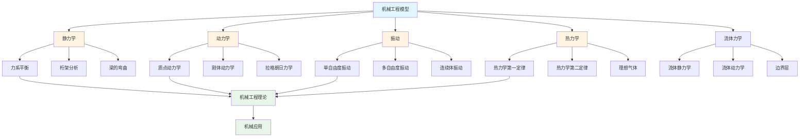

# 7.5 机械工程模型 / Mechanical Engineering Models

## 目录 / Table of Contents

- [7.5 机械工程模型 / Mechanical Engineering Models](#75-机械工程模型--mechanical-engineering-models)
  - [目录 / Table of Contents](#目录--table-of-contents)
  - [机械工程模型框架图 / Framework Diagram of Mechanical Engineering Models](#机械工程模型框架图--framework-diagram-of-mechanical-engineering-models)
  - [振动系统分析流程图 / Flowchart of Vibration System Analysis](#振动系统分析流程图--flowchart-of-vibration-system-analysis)
  - [7.5.1 静力学模型 / Statics Models](#751-静力学模型--statics-models)
    - [力系平衡 / Force System Equilibrium](#力系平衡--force-system-equilibrium)
    - [桁架分析 / Truss Analysis](#桁架分析--truss-analysis)
    - [梁的弯曲 / Beam Bending](#梁的弯曲--beam-bending)
  - [7.5.2 动力学模型 / Dynamics Models](#752-动力学模型--dynamics-models)
    - [质点动力学 / Particle Dynamics](#质点动力学--particle-dynamics)
    - [刚体动力学 / Rigid Body Dynamics](#刚体动力学--rigid-body-dynamics)
    - [拉格朗日力学 / Lagrangian Mechanics](#拉格朗日力学--lagrangian-mechanics)
  - [7.5.3 振动模型 / Vibration Models](#753-振动模型--vibration-models)
    - [单自由度振动 / Single Degree of Freedom Vibration](#单自由度振动--single-degree-of-freedom-vibration)
    - [多自由度振动 / Multi-Degree of Freedom Vibration](#多自由度振动--multi-degree-of-freedom-vibration)
    - [连续体振动 / Continuous System Vibration](#连续体振动--continuous-system-vibration)
  - [7.5.4 热力学模型 / Thermodynamics Models](#754-热力学模型--thermodynamics-models)
    - [热力学第一定律 / First Law of Thermodynamics](#热力学第一定律--first-law-of-thermodynamics)
    - [热力学第二定律 / Second Law of Thermodynamics](#热力学第二定律--second-law-of-thermodynamics)
    - [理想气体 / Ideal Gas](#理想气体--ideal-gas)
  - [7.5.5 流体力学模型 / Fluid Mechanics Models](#755-流体力学模型--fluid-mechanics-models)
    - [流体静力学 / Fluid Statics](#流体静力学--fluid-statics)
    - [流体动力学 / Fluid Dynamics](#流体动力学--fluid-dynamics)
    - [边界层理论 / Boundary Layer Theory](#边界层理论--boundary-layer-theory)
  - [7.5.6 实现与应用 / Implementation and Applications](#756-实现与应用--implementation-and-applications)
    - [Rust实现示例 / Rust Implementation Example](#rust实现示例--rust-implementation-example)
    - [Haskell实现示例 / Haskell Implementation Example](#haskell实现示例--haskell-implementation-example)
    - [应用领域 / Application Domains](#应用领域--application-domains)
      - [结构设计 / Structural Design](#结构设计--structural-design)
      - [动力学分析 / Dynamics Analysis](#动力学分析--dynamics-analysis)
      - [热力学应用 / Thermodynamics Applications](#热力学应用--thermodynamics-applications)
  - [相关模型 / Related Models](#相关模型--related-models)
    - [工程科学模型 / Engineering Science Models](#工程科学模型--engineering-science-models)
    - [物理科学模型 / Physical Science Models](#物理科学模型--physical-science-models)
    - [数学科学模型 / Mathematical Science Models](#数学科学模型--mathematical-science-models)
    - [基础理论 / Basic Theory](#基础理论--basic-theory)
  - [参考文献 / References](#参考文献--references)

---

## 机械工程模型框架图 / Framework Diagram of Mechanical Engineering Models



## 振动系统分析流程图 / Flowchart of Vibration System Analysis

```mermaid
flowchart TD
    Start([系统输入]) --> Model[建立模型<br/>质量m<br/>刚度k<br/>阻尼c]
    Model --> Type{振动类型}

    Type -->|自由振动| Free[自由振动<br/>ẍ + ωn²x = 0<br/>ωn = √(k/m)]
    Type -->|受迫振动| Forced[受迫振动<br/>ẍ + 2ζωnẋ + ωn²x = F/m]
    Type -->|自激振动| Self[自激振动<br/>非线性系统]

    Free --> Natural[固有频率<br/>ωn]
    Forced --> Response[响应分析<br/>幅频特性<br/>相频特性]
    Self --> Limit[极限环<br/>稳定性分析]

    Natural --> Damping{阻尼类型}
    Response --> Damping

    Damping -->|无阻尼| Undamped[无阻尼<br/>ζ = 0]
    Damping -->|欠阻尼| Under[欠阻尼<br/>0 < ζ < 1]
    Damping -->|临界阻尼| Critical[临界阻尼<br/>ζ = 1]
    Damping -->|过阻尼| Over[过阻尼<br/>ζ > 1]

    Undamped --> Solution[解析解<br/>x(t) = A·cos(ωnt + φ)]
    Under --> Solution
    Critical --> Solution
    Over --> Solution

    Solution --> Analysis[系统分析<br/>稳定性<br/>响应特性]
    Limit --> Analysis

    Analysis --> Design[系统设计<br/>参数优化<br/>减振设计]

    Design --> End([设计完成])

    style Start fill:#e1f5ff
    style End fill:#e1f5ff
    style Analysis fill:#e8f5e9
```

## 7.5.1 静力学模型 / Statics Models

### 力系平衡 / Force System Equilibrium

**合力**: $\mathbf{R} = \sum_{i=1}^n \mathbf{F}_i$

**力矩**: $\mathbf{M} = \sum_{i=1}^n \mathbf{r}_i \times \mathbf{F}_i$

**平衡条件**: $\mathbf{R} = 0$, $\mathbf{M} = 0$

### 桁架分析 / Truss Analysis

**节点法**: $\sum F_x = 0$, $\sum F_y = 0$

**截面法**: $\sum M = 0$

**零力杆**: 两杆共线且无外力

### 梁的弯曲 / Beam Bending

**弯矩**: $M(x) = \int_0^x V(\xi) d\xi$

**剪力**: $V(x) = \frac{dM}{dx}$

**挠度**: $EI\frac{d^4y}{dx^4} = q(x)$

---

## 7.5.2 动力学模型 / Dynamics Models

### 质点动力学 / Particle Dynamics

**牛顿第二定律**: $\mathbf{F} = m\mathbf{a}$

**动量**: $\mathbf{p} = m\mathbf{v}$

**冲量**: $\mathbf{I} = \int \mathbf{F} dt = \Delta\mathbf{p}$

### 刚体动力学 / Rigid Body Dynamics

**转动惯量**: $I = \int r^2 dm$

**角动量**: $\mathbf{L} = I\boldsymbol{\omega}$

**转动方程**: $\mathbf{M} = I\boldsymbol{\alpha}$

### 拉格朗日力学 / Lagrangian Mechanics

**拉格朗日函数**: $L = T - V$

**拉格朗日方程**: $\frac{d}{dt}\left(\frac{\partial L}{\partial \dot{q}_i}\right) - \frac{\partial L}{\partial q_i} = 0$

**广义力**: $Q_i = \sum_j F_j \frac{\partial r_j}{\partial q_i}$

---

## 7.5.3 振动模型 / Vibration Models

### 单自由度振动 / Single Degree of Freedom Vibration

**自由振动**: $\ddot{x} + \omega_n^2 x = 0$

**阻尼振动**: $\ddot{x} + 2\zeta\omega_n\dot{x} + \omega_n^2 x = 0$

**强迫振动**: $\ddot{x} + 2\zeta\omega_n\dot{x} + \omega_n^2 x = \frac{F_0}{m}\cos(\omega t)$

### 多自由度振动 / Multi-Degree of Freedom Vibration

**运动方程**: $[M]\{\ddot{x}\} + [C]\{\dot{x}\} + [K]\{x\} = \{F\}$

**特征值问题**: $([K] - \omega^2[M])\{\phi\} = \{0\}$

**模态分析**: $\{x\} = [\Phi]\{q\}$

### 连续体振动 / Continuous System Vibration

**波动方程**: $\frac{\partial^2 u}{\partial t^2} = c^2\frac{\partial^2 u}{\partial x^2}$

**边界条件**: $u(0,t) = 0$, $u(L,t) = 0$

**固有频率**: $\omega_n = \frac{n\pi c}{L}$

---

## 7.5.4 热力学模型 / Thermodynamics Models

### 热力学第一定律 / First Law of Thermodynamics

**内能变化**: $\Delta U = Q - W$

**焓**: $H = U + PV$

**比热容**: $c_p = \left(\frac{\partial h}{\partial T}\right)_p$

### 热力学第二定律 / Second Law of Thermodynamics

**熵**: $dS = \frac{\delta Q}{T}$

**卡诺效率**: $\eta = 1 - \frac{T_c}{T_h}$

**可用功**: $W_{max} = (T_h - T_c)\Delta S$

### 理想气体 / Ideal Gas

**状态方程**: $PV = nRT$

**绝热过程**: $PV^\gamma = \text{constant}$

**等温过程**: $PV = \text{constant}$

---

## 7.5.5 流体力学模型 / Fluid Mechanics Models

### 流体静力学 / Fluid Statics

**压力**: $P = \rho gh$

**浮力**: $F_b = \rho_f V g$

**表面张力**: $F = \gamma L$

### 流体动力学 / Fluid Dynamics

**连续性方程**: $\frac{\partial \rho}{\partial t} + \nabla \cdot (\rho\mathbf{v}) = 0$

**伯努利方程**: $P + \frac{1}{2}\rho v^2 + \rho gh = \text{constant}$

**雷诺数**: $Re = \frac{\rho vD}{\mu}$

### 边界层理论 / Boundary Layer Theory

**边界层厚度**: $\delta = 5.0\sqrt{\frac{\nu x}{U}}$

**摩擦系数**: $C_f = \frac{0.664}{\sqrt{Re_x}}$

**阻力系数**: $C_D = \frac{D}{\frac{1}{2}\rho U^2A}$

---

## 7.5.6 实现与应用 / Implementation and Applications

### Rust实现示例 / Rust Implementation Example

```rust
use std::f64::consts::PI;

#[derive(Debug, Clone)]
pub struct Vector3D {
    pub x: f64,
    pub y: f64,
    pub z: f64,
}

impl Vector3D {
    pub fn new(x: f64, y: f64, z: f64) -> Self {
        Self { x, y, z }
    }

    pub fn magnitude(&self) -> f64 {
        (self.x * self.x + self.y * self.y + self.z * self.z).sqrt()
    }

    pub fn dot(&self, other: &Vector3D) -> f64 {
        self.x * other.x + self.y * other.y + self.z * other.z
    }

    pub fn cross(&self, other: &Vector3D) -> Vector3D {
        Vector3D {
            x: self.y * other.z - self.z * other.y,
            y: self.z * other.x - self.x * other.z,
            z: self.x * other.y - self.y * other.x,
        }
    }
}

#[derive(Debug)]
pub struct Force {
    pub vector: Vector3D,
    pub point: Vector3D,
}

impl Force {
    pub fn new(vector: Vector3D, point: Vector3D) -> Self {
        Self { vector, point }
    }

    pub fn moment(&self, about: &Vector3D) -> Vector3D {
        let r = Vector3D {
            x: self.point.x - about.x,
            y: self.point.y - about.y,
            z: self.point.z - about.z,
        };
        r.cross(&self.vector)
    }
}

#[derive(Debug)]
pub struct StaticsSystem {
    pub forces: Vec<Force>,
}

impl StaticsSystem {
    pub fn new() -> Self {
        Self { forces: Vec::new() }
    }

    pub fn add_force(&mut self, force: Force) {
        self.forces.push(force);
    }

    pub fn resultant_force(&self) -> Vector3D {
        let mut result = Vector3D::new(0.0, 0.0, 0.0);
        for force in &self.forces {
            result.x += force.vector.x;
            result.y += force.vector.y;
            result.z += force.vector.z;
        }
        result
    }

    pub fn resultant_moment(&self, about: &Vector3D) -> Vector3D {
        let mut result = Vector3D::new(0.0, 0.0, 0.0);
        for force in &self.forces {
            let moment = force.moment(about);
            result.x += moment.x;
            result.y += moment.y;
            result.z += moment.z;
        }
        result
    }

    pub fn is_equilibrium(&self, about: &Vector3D) -> bool {
        let r_force = self.resultant_force();
        let r_moment = self.resultant_moment(about);

        r_force.magnitude() < 1e-6 && r_moment.magnitude() < 1e-6
    }
}

#[derive(Debug)]
pub struct VibrationSystem {
    pub mass: f64,
    pub stiffness: f64,
    pub damping: f64,
    pub natural_frequency: f64,
    pub damping_ratio: f64,
}

impl VibrationSystem {
    pub fn new(mass: f64, stiffness: f64, damping: f64) -> Self {
        let natural_frequency = (stiffness / mass).sqrt();
        let damping_ratio = damping / (2.0 * (mass * stiffness).sqrt());

        Self {
            mass,
            stiffness,
            damping,
            natural_frequency,
            damping_ratio,
        }
    }

    pub fn free_vibration(&self, initial_displacement: f64, initial_velocity: f64, time: f64) -> f64 {
        if self.damping_ratio < 1.0 {
            // 欠阻尼
            let damped_frequency = self.natural_frequency * (1.0 - self.damping_ratio.powi(2)).sqrt();
            let amplitude = (initial_displacement.powi(2) +
                           ((initial_velocity + self.damping_ratio * self.natural_frequency * initial_displacement) / damped_frequency).powi(2)).sqrt();
            let phase = (damped_frequency * initial_displacement /
                        (initial_velocity + self.damping_ratio * self.natural_frequency * initial_displacement)).atan();

            amplitude * (-self.damping_ratio * self.natural_frequency * time).exp() *
            (damped_frequency * time + phase).cos()
        } else {
            // 临界阻尼或过阻尼
            let c1 = initial_displacement;
            let c2 = initial_velocity + self.damping_ratio * self.natural_frequency * initial_displacement;

            if self.damping_ratio == 1.0 {
                // 临界阻尼
                (c1 + c2 * time) * (-self.natural_frequency * time).exp()
            } else {
                // 过阻尼
                let omega_d = self.natural_frequency * (self.damping_ratio.powi(2) - 1.0).sqrt();
                let lambda1 = -self.damping_ratio * self.natural_frequency + omega_d;
                let lambda2 = -self.damping_ratio * self.natural_frequency - omega_d;

                let a = (c2 - lambda2 * c1) / (lambda1 - lambda2);
                let b = c1 - a;

                a * (lambda1 * time).exp() + b * (lambda2 * time).exp()
            }
        }
    }

    pub fn forced_vibration(&self, force_amplitude: f64, force_frequency: f64, time: f64) -> f64 {
        let frequency_ratio = force_frequency / self.natural_frequency;
        let magnification_factor = 1.0 / ((1.0 - frequency_ratio.powi(2)).powi(2) +
                                         (2.0 * self.damping_ratio * frequency_ratio).powi(2)).sqrt();

        let phase_angle = (2.0 * self.damping_ratio * frequency_ratio /
                          (1.0 - frequency_ratio.powi(2))).atan();

        let steady_state_amplitude = force_amplitude / self.stiffness * magnification_factor;

        steady_state_amplitude * (force_frequency * time - phase_angle).cos()
    }
}

#[derive(Debug)]
pub struct ThermodynamicsSystem {
    pub temperature: f64,
    pub pressure: f64,
    pub volume: f64,
    pub mass: f64,
    pub specific_heat: f64,
}

impl ThermodynamicsSystem {
    pub fn new(temperature: f64, pressure: f64, volume: f64, mass: f64, specific_heat: f64) -> Self {
        Self {
            temperature,
            pressure,
            volume,
            mass,
            specific_heat,
        }
    }

    pub fn ideal_gas_law(&self, moles: f64) -> f64 {
        let r = 8.314; // J/mol/K
        self.pressure * self.volume - moles * r * self.temperature
    }

    pub fn adiabatic_process(&self, gamma: f64, new_volume: f64) -> (f64, f64) {
        let new_pressure = self.pressure * (self.volume / new_volume).powf(gamma);
        let new_temperature = self.temperature * (self.volume / new_volume).powf(gamma - 1.0);
        (new_pressure, new_temperature)
    }

    pub fn isothermal_work(&self, initial_volume: f64, final_volume: f64) -> f64 {
        let r = 8.314; // J/mol/K
        let moles = self.pressure * self.volume / (r * self.temperature);
        moles * r * self.temperature * (final_volume / initial_volume).ln()
    }

    pub fn carnot_efficiency(&self, cold_temperature: f64) -> f64 {
        1.0 - cold_temperature / self.temperature
    }
}

#[derive(Debug)]
pub struct FluidSystem {
    pub density: f64,
    pub viscosity: f64,
    pub velocity: Vector3D,
    pub pressure: f64,
}

impl FluidSystem {
    pub fn new(density: f64, viscosity: f64, velocity: Vector3D, pressure: f64) -> Self {
        Self {
            density,
            viscosity,
            velocity,
            pressure,
        }
    }

    pub fn hydrostatic_pressure(&self, depth: f64) -> f64 {
        let g = 9.81; // m/s²
        self.pressure + self.density * g * depth
    }

    pub fn bernoulli_equation(&self, height: f64, velocity_magnitude: f64) -> f64 {
        let g = 9.81; // m/s²
        self.pressure + 0.5 * self.density * velocity_magnitude.powi(2) + self.density * g * height
    }

    pub fn reynolds_number(&self, characteristic_length: f64) -> f64 {
        self.density * self.velocity.magnitude() * characteristic_length / self.viscosity
    }

    pub fn boundary_layer_thickness(&self, distance: f64, free_stream_velocity: f64) -> f64 {
        let kinematic_viscosity = self.viscosity / self.density;
        5.0 * (kinematic_viscosity * distance / free_stream_velocity).sqrt()
    }
}

#[derive(Debug)]
pub struct Beam {
    pub length: f64,
    pub youngs_modulus: f64,
    pub moment_of_inertia: f64,
    pub distributed_load: f64,
}

impl Beam {
    pub fn new(length: f64, youngs_modulus: f64, moment_of_inertia: f64, distributed_load: f64) -> Self {
        Self {
            length,
            youngs_modulus,
            moment_of_inertia,
            distributed_load,
        }
    }

    pub fn max_deflection_simply_supported(&self) -> f64 {
        // 简支梁最大挠度
        5.0 * self.distributed_load * self.length.powi(4) /
        (384.0 * self.youngs_modulus * self.moment_of_inertia)
    }

    pub fn max_moment_simply_supported(&self) -> f64 {
        // 简支梁最大弯矩
        self.distributed_load * self.length.powi(2) / 8.0
    }

    pub fn cantilever_deflection(&self, point_load: f64, load_position: f64) -> f64 {
        // 悬臂梁挠度
        point_load * load_position.powi(2) * (3.0 * self.length - load_position) /
        (6.0 * self.youngs_modulus * self.moment_of_inertia)
    }

    pub fn natural_frequency(&self, mass_per_unit_length: f64) -> f64 {
        // 梁的固有频率
        let pi = PI;
        (pi.powi(2) / (2.0 * self.length.powi(2))) *
        (self.youngs_modulus * self.moment_of_inertia / mass_per_unit_length).sqrt()
    }
}

// 使用示例
fn main() {
    // 静力学示例
    let mut statics_system = StaticsSystem::new();

    let force1 = Force::new(
        Vector3D::new(10.0, 0.0, 0.0),
        Vector3D::new(0.0, 0.0, 0.0)
    );
    let force2 = Force::new(
        Vector3D::new(-10.0, 0.0, 0.0),
        Vector3D::new(1.0, 0.0, 0.0)
    );

    statics_system.add_force(force1);
    statics_system.add_force(force2);

    let about_point = Vector3D::new(0.0, 0.0, 0.0);
    let is_equilibrium = statics_system.is_equilibrium(&about_point);
    println!("System in equilibrium: {}", is_equilibrium);

    // 振动系统示例
    let vibration = VibrationSystem::new(1.0, 100.0, 2.0);
    let displacement = vibration.free_vibration(1.0, 0.0, 0.1);
    let forced_response = vibration.forced_vibration(10.0, 5.0, 0.1);

    println!("Free vibration displacement: {:.3}", displacement);
    println!("Forced vibration response: {:.3}", forced_response);
    println!("Natural frequency: {:.3} rad/s", vibration.natural_frequency);
    println!("Damping ratio: {:.3}", vibration.damping_ratio);

    // 热力学系统示例
    let thermo = ThermodynamicsSystem::new(300.0, 101325.0, 0.001, 1.0, 1000.0);
    let gas_law_error = thermo.ideal_gas_law(0.04);
    let (new_pressure, new_temp) = thermo.adiabatic_process(1.4, 0.002);
    let work = thermo.isothermal_work(0.001, 0.002);
    let efficiency = thermo.carnot_efficiency(273.0);

    println!("Ideal gas law error: {:.3}", gas_law_error);
    println!("Adiabatic process - New pressure: {:.1} Pa, New temperature: {:.1} K", new_pressure, new_temp);
    println!("Isothermal work: {:.3} J", work);
    println!("Carnot efficiency: {:.3}", efficiency);

    // 流体系统示例
    let fluid = FluidSystem::new(
        1000.0, // kg/m³
        0.001,  // Pa·s
        Vector3D::new(1.0, 0.0, 0.0),
        101325.0 // Pa
    );

    let hydrostatic_p = fluid.hydrostatic_pressure(10.0);
    let bernoulli = fluid.bernoulli_equation(5.0, 2.0);
    let reynolds = fluid.reynolds_number(0.01);
    let boundary_thickness = fluid.boundary_layer_thickness(1.0, 5.0);

    println!("Hydrostatic pressure: {:.1} Pa", hydrostatic_p);
    println!("Bernoulli equation result: {:.1} Pa", bernoulli);
    println!("Reynolds number: {:.0}", reynolds);
    println!("Boundary layer thickness: {:.3} m", boundary_thickness);

    // 梁分析示例
    let beam = Beam::new(5.0, 200e9, 1e-6, 1000.0);
    let max_deflection = beam.max_deflection_simply_supported();
    let max_moment = beam.max_moment_simply_supported();
    let cantilever_deflection = beam.cantilever_deflection(1000.0, 2.0);
    let natural_freq = beam.natural_frequency(10.0);

    println!("Max deflection: {:.6} m", max_deflection);
    println!("Max moment: {:.1} N·m", max_moment);
    println!("Cantilever deflection: {:.6} m", cantilever_deflection);
    println!("Natural frequency: {:.1} Hz", natural_freq);
}
```

### Haskell实现示例 / Haskell Implementation Example

```haskell
module MechanicalEngineeringModels where

import Data.List (sum, length)

-- 三维向量
data Vector3D = Vector3D {
    x :: Double,
    y :: Double,
    z :: Double
} deriving Show

newVector3D :: Double -> Double -> Double -> Vector3D
newVector3D x_val y_val z_val = Vector3D x_val y_val z_val

magnitude :: Vector3D -> Double
magnitude v = sqrt (x v^2 + y v^2 + z v^2)

dotProduct :: Vector3D -> Vector3D -> Double
dotProduct v1 v2 = x v1 * x v2 + y v1 * y v2 + z v1 * z v2

crossProduct :: Vector3D -> Vector3D -> Vector3D
crossProduct v1 v2 = Vector3D {
    x = y v1 * z v2 - z v1 * y v2,
    y = z v1 * x v2 - x v1 * z v2,
    z = x v1 * y v2 - y v1 * x v2
}

-- 力
data Force = Force {
    forceVector :: Vector3D,
    forcePoint :: Vector3D
} deriving Show

newForce :: Vector3D -> Vector3D -> Force
newForce vector point = Force vector point

moment :: Force -> Vector3D -> Vector3D
moment force about =
    let r = Vector3D {
            x = x (forcePoint force) - x about,
            y = y (forcePoint force) - y about,
            z = z (forcePoint force) - z about
        }
    in crossProduct r (forceVector force)

-- 静力学系统
data StaticsSystem = StaticsSystem {
    forces :: [Force]
} deriving Show

newStaticsSystem :: StaticsSystem
newStaticsSystem = StaticsSystem []

addForce :: Force -> StaticsSystem -> StaticsSystem
addForce force system = system { forces = force : forces system }

resultantForce :: StaticsSystem -> Vector3D
resultantForce system =
    let force_vectors = map forceVector (forces system)
        sum_x = sum (map x force_vectors)
        sum_y = sum (map y force_vectors)
        sum_z = sum (map z force_vectors)
    in Vector3D sum_x sum_y sum_z

resultantMoment :: StaticsSystem -> Vector3D -> Vector3D
resultantMoment system about =
    let moments = map (\f -> moment f about) (forces system)
        sum_x = sum (map x moments)
        sum_y = sum (map y moments)
        sum_z = sum (map z moments)
    in Vector3D sum_x sum_y sum_z

isEquilibrium :: StaticsSystem -> Vector3D -> Bool
isEquilibrium system about =
    let r_force = resultantForce system
        r_moment = resultantMoment system about
    in magnitude r_force < 1e-6 && magnitude r_moment < 1e-6

-- 振动系统
data VibrationSystem = VibrationSystem {
    mass :: Double,
    stiffness :: Double,
    damping :: Double,
    naturalFrequency :: Double,
    dampingRatio :: Double
} deriving Show

newVibrationSystem :: Double -> Double -> Double -> VibrationSystem
newVibrationSystem m k c = VibrationSystem {
    mass = m,
    stiffness = k,
    damping = c,
    naturalFrequency = sqrt (k / m),
    dampingRatio = c / (2.0 * sqrt (m * k))
}

freeVibration :: VibrationSystem -> Double -> Double -> Double -> Double
freeVibration system x0 v0 t =
    let zeta = dampingRatio system
        omega_n = naturalFrequency system
    in if zeta < 1.0
       then let omega_d = omega_n * sqrt (1.0 - zeta^2)
                amplitude = sqrt (x0^2 + ((v0 + zeta * omega_n * x0) / omega_d)^2)
                phase = atan (omega_d * x0 / (v0 + zeta * omega_n * x0))
            in amplitude * exp (-zeta * omega_n * t) * cos (omega_d * t + phase)
       else let c1 = x0
                c2 = v0 + zeta * omega_n * x0
            in if zeta == 1.0
               then (c1 + c2 * t) * exp (-omega_n * t)
               else let omega_d = omega_n * sqrt (zeta^2 - 1.0)
                        lambda1 = -zeta * omega_n + omega_d
                        lambda2 = -zeta * omega_n - omega_d
                        a = (c2 - lambda2 * c1) / (lambda1 - lambda2)
                        b = c1 - a
                    in a * exp (lambda1 * t) + b * exp (lambda2 * t)

forcedVibration :: VibrationSystem -> Double -> Double -> Double -> Double
forcedVibration system f0 omega_f t =
    let omega_n = naturalFrequency system
        zeta = dampingRatio system
        r = omega_f / omega_n
        magnification_factor = 1.0 / sqrt ((1.0 - r^2)^2 + (2.0 * zeta * r)^2)
        phase_angle = atan (2.0 * zeta * r / (1.0 - r^2))
        steady_state_amplitude = f0 / stiffness system * magnification_factor
    in steady_state_amplitude * cos (omega_f * t - phase_angle)

-- 热力学系统
data ThermodynamicsSystem = ThermodynamicsSystem {
    temperature :: Double,
    pressure :: Double,
    volume :: Double,
    mass :: Double,
    specificHeat :: Double
} deriving Show

newThermodynamicsSystem :: Double -> Double -> Double -> Double -> Double -> ThermodynamicsSystem
newThermodynamicsSystem temp press vol m c = ThermodynamicsSystem {
    temperature = temp,
    pressure = press,
    volume = vol,
    mass = m,
    specificHeat = c
}

idealGasLaw :: ThermodynamicsSystem -> Double -> Double
idealGasLaw system moles =
    let r = 8.314 -- J/mol/K
    in pressure system * volume system - moles * r * temperature system

adiabaticProcess :: ThermodynamicsSystem -> Double -> Double -> (Double, Double)
adiabaticProcess system gamma new_volume =
    let new_pressure = pressure system * (volume system / new_volume)^gamma
        new_temperature = temperature system * (volume system / new_volume)^(gamma - 1.0)
    in (new_pressure, new_temperature)

isothermalWork :: ThermodynamicsSystem -> Double -> Double -> Double
isothermalWork system v1 v2 =
    let r = 8.314 -- J/mol/K
        moles = pressure system * volume system / (r * temperature system)
    in moles * r * temperature system * log (v2 / v1)

carnotEfficiency :: ThermodynamicsSystem -> Double -> Double
carnotEfficiency system cold_temp = 1.0 - cold_temp / temperature system

-- 流体系统
data FluidSystem = FluidSystem {
    density :: Double,
    viscosity :: Double,
    velocity :: Vector3D,
    fluidPressure :: Double
} deriving Show

newFluidSystem :: Double -> Double -> Vector3D -> Double -> FluidSystem
newFluidSystem rho mu vel p = FluidSystem {
    density = rho,
    viscosity = mu,
    velocity = vel,
    fluidPressure = p
}

hydrostaticPressure :: FluidSystem -> Double -> Double
hydrostaticPressure fluid depth =
    let g = 9.81 -- m/s²
    in fluidPressure fluid + density fluid * g * depth

bernoulliEquation :: FluidSystem -> Double -> Double -> Double
bernoulliEquation fluid height vel_mag =
    let g = 9.81 -- m/s²
    in fluidPressure fluid + 0.5 * density fluid * vel_mag^2 + density fluid * g * height

reynoldsNumber :: FluidSystem -> Double -> Double
reynoldsNumber fluid char_length =
    density fluid * magnitude (velocity fluid) * char_length / viscosity fluid

boundaryLayerThickness :: FluidSystem -> Double -> Double -> Double
boundaryLayerThickness fluid distance u_inf =
    let nu = viscosity fluid / density fluid
    in 5.0 * sqrt (nu * distance / u_inf)

-- 梁分析
data Beam = Beam {
    beamLength :: Double,
    youngsModulus :: Double,
    momentOfInertia :: Double,
    distributedLoad :: Double
} deriving Show

newBeam :: Double -> Double -> Double -> Double -> Beam
newBeam l e i q = Beam {
    beamLength = l,
    youngsModulus = e,
    momentOfInertia = i,
    distributedLoad = q
}

maxDeflectionSimplySupported :: Beam -> Double
maxDeflectionSimplySupported beam =
    5.0 * distributedLoad beam * beamLength beam^4 /
    (384.0 * youngsModulus beam * momentOfInertia beam)

maxMomentSimplySupported :: Beam -> Double
maxMomentSimplySupported beam =
    distributedLoad beam * beamLength beam^2 / 8.0

cantileverDeflection :: Beam -> Double -> Double -> Double
cantileverDeflection beam p_load load_pos =
    p_load * load_pos^2 * (3.0 * beamLength beam - load_pos) /
    (6.0 * youngsModulus beam * momentOfInertia beam)

naturalFrequency :: Beam -> Double -> Double
naturalFrequency beam mass_per_length =
    let pi = 3.14159265359
    in (pi^2 / (2.0 * beamLength beam^2)) *
       sqrt (youngsModulus beam * momentOfInertia beam / mass_per_length)

-- 示例使用
example :: IO ()
example = do
    -- 静力学示例
    let force1 = newForce (newVector3D 10.0 0.0 0.0) (newVector3D 0.0 0.0 0.0)
        force2 = newForce (newVector3D (-10.0) 0.0 0.0) (newVector3D 1.0 0.0 0.0)
        system = addForce force2 $ addForce force1 newStaticsSystem
        about_point = newVector3D 0.0 0.0 0.0
        equilibrium = isEquilibrium system about_point

    putStrLn $ "System in equilibrium: " ++ show equilibrium

    -- 振动系统示例
    let vibration = newVibrationSystem 1.0 100.0 2.0
        displacement = freeVibration vibration 1.0 0.0 0.1
        forced_response = forcedVibration vibration 10.0 5.0 0.1

    putStrLn $ "Free vibration displacement: " ++ show displacement
    putStrLn $ "Forced vibration response: " ++ show forced_response
    putStrLn $ "Natural frequency: " ++ show (naturalFrequency vibration) ++ " rad/s"
    putStrLn $ "Damping ratio: " ++ show (dampingRatio vibration)

    -- 热力学系统示例
    let thermo = newThermodynamicsSystem 300.0 101325.0 0.001 1.0 1000.0
        gas_law_error = idealGasLaw thermo 0.04
        (new_pressure, new_temp) = adiabaticProcess thermo 1.4 0.002
        work = isothermalWork thermo 0.001 0.002
        efficiency = carnotEfficiency thermo 273.0

    putStrLn $ "Ideal gas law error: " ++ show gas_law_error
    putStrLn $ "Adiabatic process - New pressure: " ++ show new_pressure ++ " Pa, New temperature: " ++ show new_temp ++ " K"
    putStrLn $ "Isothermal work: " ++ show work ++ " J"
    putStrLn $ "Carnot efficiency: " ++ show efficiency

    -- 流体系统示例
    let fluid = newFluidSystem 1000.0 0.001 (newVector3D 1.0 0.0 0.0) 101325.0
        hydrostatic_p = hydrostaticPressure fluid 10.0
        bernoulli = bernoulliEquation fluid 5.0 2.0
        reynolds = reynoldsNumber fluid 0.01
        boundary_thickness = boundaryLayerThickness fluid 1.0 5.0

    putStrLn $ "Hydrostatic pressure: " ++ show hydrostatic_p ++ " Pa"
    putStrLn $ "Bernoulli equation result: " ++ show bernoulli ++ " Pa"
    putStrLn $ "Reynolds number: " ++ show reynolds
    putStrLn $ "Boundary layer thickness: " ++ show boundary_thickness ++ " m"

    -- 梁分析示例
    let beam = newBeam 5.0 200e9 1e-6 1000.0
        max_deflection = maxDeflectionSimplySupported beam
        max_moment = maxMomentSimplySupported beam
        cantilever_deflection = cantileverDeflection beam 1000.0 2.0
        natural_freq = naturalFrequency beam 10.0

    putStrLn $ "Max deflection: " ++ show max_deflection ++ " m"
    putStrLn $ "Max moment: " ++ show max_moment ++ " N·m"
    putStrLn $ "Cantilever deflection: " ++ show cantilever_deflection ++ " m"
    putStrLn $ "Natural frequency: " ++ show natural_freq ++ " Hz"
```

### 应用领域 / Application Domains

#### 结构设计 / Structural Design

- **建筑结构**: 梁、柱、框架分析
- **机械零件**: 轴、齿轮、轴承设计
- **航空航天**: 机身、机翼、发动机结构

#### 动力学分析 / Dynamics Analysis

- **机械振动**: 减振、隔振设计
- **转子动力学**: 临界转速、不平衡响应
- **多体动力学**: 机器人、车辆动力学

#### 热力学应用 / Thermodynamics Applications

- **热机设计**: 发动机、涡轮机
- **换热器**: 传热、传质分析
- **制冷系统**: 压缩机、冷凝器设计

---

## 相关模型 / Related Models

### 工程科学模型 / Engineering Science Models

- [优化模型](../01-优化模型/README.md) - 结构优化和机械优化
- [控制论模型](../02-控制论模型/README.md) - 机械控制和机器人控制
- [信号处理模型](../03-信号处理模型/README.md) - 机械信号处理和振动分析
- [材料科学模型](../04-材料科学模型/README.md) - 材料力学和结构材料
- [电子工程模型](../06-电子工程模型/README.md) - 机电一体化和电子机械

### 物理科学模型 / Physical Science Models

- [经典力学模型](../../02-物理科学模型/01-经典力学模型/README.md) - 机械力学和工程力学
- [热力学模型](../../02-物理科学模型/04-热力学模型/README.md) - 工程热力学和热机
- [流体力学模型](../../02-物理科学模型/08-流体力学模型/README.md) - 工程流体力学和流体机械

### 数学科学模型 / Mathematical Science Models

- [代数模型](../../03-数学科学模型/01-代数模型/README.md) - 线性代数和矩阵理论在机械工程中的应用
- [几何模型](../../03-数学科学模型/02-几何模型/README.md) - 机械几何和机构几何
- [拓扑模型](../../03-数学科学模型/03-拓扑模型/README.md) - 机构拓扑

### 基础理论 / Basic Theory

- [模型分类学](../../01-基础理论/01-模型分类学/README.md) - 机械工程模型的分类
- [形式化方法论](../../01-基础理论/02-形式化方法论/README.md) - 机械工程模型的形式化方法
- [科学模型论](../../01-基础理论/03-科学模型论/README.md) - 机械工程模型作为科学模型的理论基础

## 参考文献 / References

1. Hibbeler, R. C. (2016). Engineering Mechanics: Statics & Dynamics. Pearson.
2. Rao, S. S. (2017). Mechanical Vibrations. Pearson.
3. Moran, M. J., et al. (2018). Fundamentals of Engineering Thermodynamics. Wiley.
4. White, F. M. (2016). Fluid Mechanics. McGraw-Hill.

---

*最后更新: 2025-08-01*
*版本: 1.0.0*
