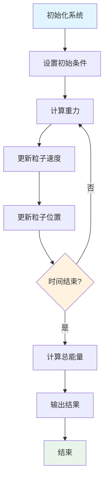
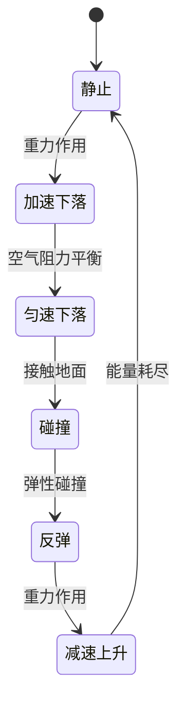

# 经典力学多表征示例 / Classical Mechanics Multi-Representation Example

## 概述 / Overview

本文档展示经典力学模型的多表征实现，包括数学公式、代码实现、图表可视化和自然语言描述。

## 1. 牛顿力学系统 / Newtonian Mechanical System

### 1.1 数学表征 / Mathematical Representation

#### 牛顿三大定律 / Newton's Three Laws

**第一定律 (惯性定律)**:
$$\vec{F} = 0 \Rightarrow \vec{v} = \text{constant}$$

**第二定律 (运动定律)**:
$$\vec{F} = m\vec{a} = m\frac{d\vec{v}}{dt} = m\frac{d^2\vec{r}}{dt^2}$$

**第三定律 (作用反作用定律)**:
$$\vec{F}_{12} = -\vec{F}_{21}$$

#### 万有引力定律 / Law of Universal Gravitation

$$\vec{F} = G\frac{m_1m_2}{r^2}\hat{r}$$

其中：
- $G = 6.674 \times 10^{-11} \text{ N⋅m}^2/\text{kg}^2$: 引力常数
- $m_1, m_2$: 两物体质量
- $r$: 两物体间距离
- $\hat{r}$: 单位向量

#### 能量守恒 / Energy Conservation

**动能**: $T = \frac{1}{2}mv^2$

**势能**: $V = mgh$ (重力势能)

**总机械能**: $E = T + V = \text{constant}$

### 1.2 代码表征 / Code Representation

#### Rust实现 / Rust Implementation

```rust
use std::f64::consts::PI;

#[derive(Debug, Clone)]
pub struct Particle {
    pub mass: f64,
    pub position: [f64; 3],
    pub velocity: [f64; 3],
    pub force: [f64; 3],
}

impl Particle {
    pub fn new(mass: f64, position: [f64; 3]) -> Self {
        Self {
            mass,
            position,
            velocity: [0.0; 3],
            force: [0.0; 3],
        }
    }
    
    pub fn update_position(&mut self, dt: f64) {
        for i in 0..3 {
            self.position[i] += self.velocity[i] * dt;
        }
    }
    
    pub fn update_velocity(&mut self, dt: f64) {
        for i in 0..3 {
            self.velocity[i] += self.force[i] / self.mass * dt;
        }
    }
    
    pub fn kinetic_energy(&self) -> f64 {
        0.5 * self.mass * self.velocity.iter().map(|v| v * v).sum::<f64>()
    }
    
    pub fn momentum(&self) -> [f64; 3] {
        [
            self.mass * self.velocity[0],
            self.mass * self.velocity[1],
            self.mass * self.velocity[2],
        ]
    }
}

pub struct NewtonianSystem {
    pub particles: Vec<Particle>,
    pub gravity: [f64; 3],
    pub time: f64,
}

impl NewtonianSystem {
    pub fn new() -> Self {
        Self {
            particles: Vec::new(),
            gravity: [0.0, -9.81, 0.0],
            time: 0.0,
        }
    }
    
    pub fn add_particle(&mut self, particle: Particle) {
        self.particles.push(particle);
    }
    
    pub fn step(&mut self, dt: f64) {
        // 计算力
        for particle in &mut self.particles {
            particle.force = self.gravity;
        }
        
        // 更新运动
        for particle in &mut self.particles {
            particle.update_velocity(dt);
            particle.update_position(dt);
        }
        
        self.time += dt;
    }
    
    pub fn total_energy(&self) -> f64 {
        let mut total = 0.0;
        for particle in &self.particles {
            total += particle.kinetic_energy();
            // 势能计算
            total += particle.mass * 9.81 * particle.position[1];
        }
        total
    }
}

// 使用示例
fn main() {
    let mut system = NewtonianSystem::new();
    
    // 添加粒子
    let particle1 = Particle::new(1.0, [0.0, 10.0, 0.0]);
    let particle2 = Particle::new(2.0, [0.0, 15.0, 0.0]);
    
    system.add_particle(particle1);
    system.add_particle(particle2);
    
    println!("Initial energy: {}", system.total_energy());
    
    // 模拟
    for i in 0..100 {
        system.step(0.01);
        if i % 10 == 0 {
            println!("Time: {:.2}, Energy: {:.3}", system.time, system.total_energy());
        }
    }
}
```

#### Haskell实现 / Haskell Implementation

```haskell
module ClassicalMechanics where

import Data.Vector (Vector)
import qualified Data.Vector as V

-- 粒子数据类型
data Particle = Particle {
    mass :: Double,
    position :: Vector Double,
    velocity :: Vector Double,
    force :: Vector Double
} deriving (Show)

-- 创建粒子
newParticle :: Double -> Vector Double -> Particle
newParticle m pos = Particle m pos (V.replicate 3 0.0) (V.replicate 3 0.0)

-- 更新位置
updatePosition :: Double -> Particle -> Particle
updatePosition dt p = p { position = V.zipWith (+) (position p) 
                                       (V.map (* dt) (velocity p)) }

-- 更新速度
updateVelocity :: Double -> Particle -> Particle
updateVelocity dt p = p { velocity = V.zipWith (+) (velocity p)
                                       (V.map (* (dt / mass p)) (force p)) }

-- 计算动能
kineticEnergy :: Particle -> Double
kineticEnergy p = 0.5 * mass p * V.sum (V.map (^2) (velocity p))

-- 计算动量
momentum :: Particle -> Vector Double
momentum p = V.map (* mass p) (velocity p)

-- 牛顿系统
data NewtonianSystem = NewtonianSystem {
    particles :: [Particle],
    gravity :: Vector Double,
    time :: Double
} deriving (Show)

-- 创建牛顿系统
newNewtonianSystem :: NewtonianSystem
newNewtonianSystem = NewtonianSystem [] (V.fromList [0.0, -9.81, 0.0]) 0.0

-- 添加粒子
addParticle :: Particle -> NewtonianSystem -> NewtonianSystem
addParticle p sys = sys { particles = p : particles sys }

-- 系统演化
step :: Double -> NewtonianSystem -> NewtonianSystem
step dt sys = sys { 
    particles = map (stepParticle dt) (particles sys),
    time = time sys + dt
}
  where
    stepParticle dt p = updatePosition dt (updateVelocity dt (applyGravity p))
    applyGravity p = p { force = gravity sys }

-- 计算总能量
totalEnergy :: NewtonianSystem -> Double
totalEnergy sys = sum (map particleEnergy (particles sys))
  where
    particleEnergy p = kineticEnergy p + potentialEnergy p
    potentialEnergy p = mass p * 9.81 * (position p V.! 1)

-- 示例使用
example :: IO ()
example = do
    let sys = newNewtonianSystem
        p1 = newParticle 1.0 (V.fromList [0.0, 10.0, 0.0])
        p2 = newParticle 2.0 (V.fromList [0.0, 15.0, 0.0])
        sys' = addParticle p1 (addParticle p2 sys)
    
    putStrLn $ "Initial energy: " ++ show (totalEnergy sys')
    
    let steps = take 100 $ iterate (step 0.01) sys'
    mapM_ (\(i, s) -> 
        if i `mod` 10 == 0 then
            putStrLn $ "Time: " ++ show (time s) ++ ", Energy: " ++ show (totalEnergy s)
        else return ()) (zip [0..] steps)
```

#### Python实现 / Python Implementation

```python
import numpy as np
import matplotlib.pyplot as plt
from dataclasses import dataclass
from typing import List

@dataclass
class Particle:
    """粒子类，表示经典力学中的质点"""
    mass: float
    position: np.ndarray
    velocity: np.ndarray
    force: np.ndarray = None
    
    def __post_init__(self):
        if self.force is None:
            self.force = np.zeros(3)
    
    def update_position(self, dt: float) -> None:
        """更新位置"""
        self.position += self.velocity * dt
    
    def update_velocity(self, dt: float) -> None:
        """更新速度"""
        self.velocity += self.force / self.mass * dt
    
    def kinetic_energy(self) -> float:
        """计算动能"""
        return 0.5 * self.mass * np.sum(self.velocity ** 2)
    
    def momentum(self) -> np.ndarray:
        """计算动量"""
        return self.mass * self.velocity

class NewtonianSystem:
    """牛顿力学系统"""
    
    def __init__(self, gravity: np.ndarray = None):
        self.particles: List[Particle] = []
        self.gravity = gravity if gravity is not None else np.array([0.0, -9.81, 0.0])
        self.time = 0.0
        self.history = []
    
    def add_particle(self, particle: Particle) -> None:
        """添加粒子到系统"""
        self.particles.append(particle)
    
    def step(self, dt: float) -> None:
        """系统演化一个时间步"""
        # 计算力
        for particle in self.particles:
            particle.force = self.gravity
        
        # 更新运动
        for particle in self.particles:
            particle.update_velocity(dt)
            particle.update_position(dt)
        
        self.time += dt
        self.record_history()
    
    def total_energy(self) -> float:
        """计算系统总能量"""
        total = 0.0
        for particle in self.particles:
            total += particle.kinetic_energy()
            # 势能计算
            total += particle.mass * 9.81 * particle.position[1]
        return total
    
    def record_history(self) -> None:
        """记录历史数据"""
        state = {
            'time': self.time,
            'positions': [p.position.copy() for p in self.particles],
            'velocities': [p.velocity.copy() for p in self.particles],
            'energy': self.total_energy()
        }
        self.history.append(state)
    
    def plot_trajectory(self) -> None:
        """绘制轨迹"""
        if not self.history:
            return
        
        times = [h['time'] for h in self.history]
        energies = [h['energy'] for h in self.history]
        
        fig, (ax1, ax2) = plt.subplots(1, 2, figsize=(12, 5))
        
        # 轨迹图
        for i, particle in enumerate(self.particles):
            positions = [h['positions'][i] for h in self.history]
            x_pos = [p[0] for p in positions]
            y_pos = [p[1] for p in positions]
            ax1.plot(x_pos, y_pos, label=f'Particle {i+1}')
        
        ax1.set_xlabel('X Position')
        ax1.set_ylabel('Y Position')
        ax1.set_title('Particle Trajectories')
        ax1.legend()
        ax1.grid(True)
        
        # 能量图
        ax2.plot(times, energies, 'b-', label='Total Energy')
        ax2.set_xlabel('Time')
        ax2.set_ylabel('Energy')
        ax2.set_title('Energy Conservation')
        ax2.legend()
        ax2.grid(True)
        
        plt.tight_layout()
        plt.show()

# 使用示例
def demo_newtonian_system():
    """演示牛顿力学系统"""
    # 创建系统
    system = NewtonianSystem()
    
    # 添加粒子
    particle1 = Particle(
        mass=1.0,
        position=np.array([0.0, 10.0, 0.0]),
        velocity=np.array([5.0, 0.0, 0.0])
    )
    particle2 = Particle(
        mass=2.0,
        position=np.array([0.0, 15.0, 0.0]),
        velocity=np.array([-3.0, 0.0, 0.0])
    )
    
    system.add_particle(particle1)
    system.add_particle(particle2)
    
    # 模拟
    dt = 0.01
    total_time = 2.0
    steps = int(total_time / dt)
    
    print(f"Initial energy: {system.total_energy():.3f}")
    
    for i in range(steps):
        system.step(dt)
        if i % 100 == 0:
            print(f"Time: {system.time:.2f}, Energy: {system.total_energy():.3f}")
    
    print(f"Final energy: {system.total_energy():.3f}")
    
    # 绘制结果
    system.plot_trajectory()

if __name__ == "__main__":
    demo_newtonian_system()
```

### 1.3 图表表征 / Visual Representation

#### 系统流程图 / System Flowchart



#### 能量守恒图 / Energy Conservation Diagram


#### 粒子运动状态图 / Particle Motion State Diagram



### 1.4 自然语言表征 / Natural Language Representation

#### 中文描述 / Chinese Description

**牛顿力学系统**是经典物理学的基础，描述了物体在重力作用下的运动规律。

**核心概念**:
- **粒子**: 具有质量、位置、速度等属性的质点
- **重力**: 地球对物体的吸引力，方向向下
- **运动**: 位置和速度随时间的变化
- **能量**: 系统的运动能力，包括动能和势能

**运动规律**:
1. 物体在重力作用下做自由落体运动
2. 重力加速度为9.81 m/s²
3. 动能和势能相互转换，总机械能守恒
4. 动量随时间变化，但总动量在无外力时守恒

**应用场景**:
- 天体运动计算
- 机械系统分析
- 碰撞问题研究
- 振动系统建模

#### 英文描述 / English Description

**Newtonian mechanical system** is the foundation of classical physics, describing the motion of objects under gravitational forces.

**Core Concepts**:
- **Particle**: A point mass with properties such as mass, position, and velocity
- **Gravity**: Earth's gravitational force acting downward on objects
- **Motion**: Changes in position and velocity over time
- **Energy**: The system's capacity for motion, including kinetic and potential energy

**Motion Laws**:
1. Objects undergo free-fall motion under gravity
2. Gravitational acceleration is 9.81 m/s²
3. Kinetic and potential energy convert between each other, total mechanical energy is conserved
4. Momentum changes over time, but total momentum is conserved in the absence of external forces

**Applications**:
- Celestial motion calculations
- Mechanical system analysis
- Collision problem studies
- Vibration system modeling

## 2. 单摆系统 / Simple Pendulum System

### 2.1 数学表征 / Mathematical Representation

**拉格朗日函数**:
$$\mathcal{L} = T - V = \frac{1}{2}ml^2\dot{\theta}^2 + mgl\cos\theta$$

**运动方程**:
$$\ddot{\theta} + \frac{g}{l}\sin\theta = 0$$

**小角度近似**:
$$\ddot{\theta} + \frac{g}{l}\theta = 0$$

**解**:
$$\theta(t) = \theta_0\cos(\omega t + \phi)$$

其中 $\omega = \sqrt{\frac{g}{l}}$

### 2.2 代码表征 / Code Representation

#### Rust实现 / Rust Implementation

```rust
#[derive(Debug)]
pub struct SimplePendulum {
    pub length: f64,
    pub mass: f64,
    pub gravity: f64,
    pub theta: f64,
    pub omega: f64,
}

impl SimplePendulum {
    pub fn new(length: f64, mass: f64, initial_angle: f64) -> Self {
        Self {
            length,
            mass,
            gravity: 9.81,
            theta: initial_angle,
            omega: 0.0,
        }
    }
    
    pub fn step(&mut self, dt: f64) {
        let acceleration = -(self.gravity / self.length) * self.theta.sin();
        self.omega += acceleration * dt;
        self.theta += self.omega * dt;
    }
    
    pub fn get_position(&self) -> [f64; 2] {
        [
            self.length * self.theta.sin(),
            -self.length * self.theta.cos(),
        ]
    }
    
    pub fn get_energy(&self) -> f64 {
        let kinetic = 0.5 * self.mass * self.length * self.length * self.omega * self.omega;
        let potential = self.mass * self.gravity * self.length * (1.0 - self.theta.cos());
        kinetic + potential
    }
    
    pub fn period(&self) -> f64 {
        2.0 * PI * (self.length / self.gravity).sqrt()
    }
}
```

### 2.3 图表表征 / Visual Representation

#### 单摆运动图 / Pendulum Motion Diagram


### 2.4 自然语言表征 / Natural Language Representation

**单摆系统**是一个经典的振动系统，由一根不可伸长的轻绳和一个质点组成。

**运动特征**:
- 在重力作用下做周期性振动
- 振动周期与摆长和重力加速度有关
- 在小角度下近似为简谐振动
- 能量在动能和势能之间转换

---

*最后更新: 2025-08-01*
*版本: 1.0.0*
