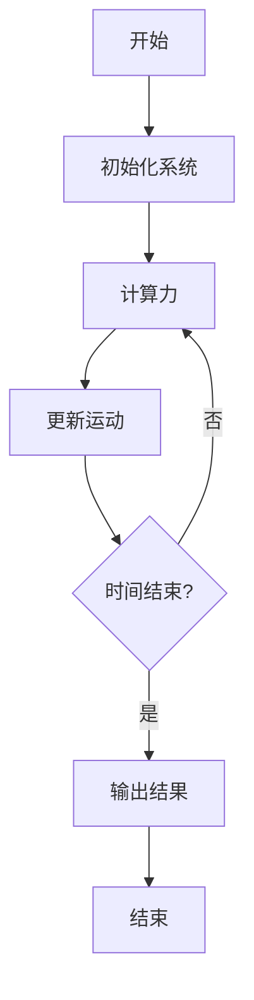

# 多表征框架 / Multi-Representation Framework

## 概述 / Overview

多表征框架为每个形式化模型提供多种表征方式，确保不同背景的用户都能理解和应用这些模型。

### 核心原则 / Core Principles

1. **完整性**: 每个模型都有完整的多种表征
2. **一致性**: 不同表征之间保持逻辑一致
3. **可读性**: 每种表征都清晰易懂
4. **可验证性**: 所有表征都可以相互验证

## 表征类型 / Representation Types

### 1. 数学表征 / Mathematical Representation

#### LaTeX公式示例 / LaTeX Formula Examples

```latex
% 牛顿第二定律
\vec{F} = m\vec{a} = m\frac{d\vec{v}}{dt}

% 拉格朗日方程
\frac{d}{dt}\frac{\partial \mathcal{L}}{\partial \dot{q}_i} - \frac{\partial \mathcal{L}}{\partial q_i} = 0

% 薛定谔方程
i\hbar\frac{\partial}{\partial t}\Psi = \hat{H}\Psi
```

### 2. 代码表征 / Code Representation

#### Rust实现示例 / Rust Implementation Example

```rust
#[derive(Debug, Clone)]
pub struct Particle {
    pub mass: f64,
    pub position: [f64; 3],
    pub velocity: [f64; 3],
}

impl Particle {
    pub fn new(mass: f64, position: [f64; 3]) -> Self {
        Self {
            mass,
            position,
            velocity: [0.0; 3],
        }
    }
    
    pub fn kinetic_energy(&self) -> f64 {
        0.5 * self.mass * self.velocity.iter().map(|v| v * v).sum::<f64>()
    }
}
```

#### Haskell实现示例 / Haskell Implementation Example

```haskell
data Particle = Particle {
    mass :: Double,
    position :: Vector Double,
    velocity :: Vector Double
} deriving (Show)

kineticEnergy :: Particle -> Double
kineticEnergy p = 0.5 * mass p * V.sum (V.map (^2) (velocity p))
```

### 3. 图表表征 / Visual Representation

#### Mermaid流程图 / Mermaid Flowchart



### 4. 自然语言表征 / Natural Language Representation

#### 中文描述 / Chinese Description

**牛顿力学系统**描述了物体在力的作用下的运动规律，包括：

- 牛顿三大定律
- 能量守恒原理
- 动量守恒原理

#### 英文描述 / English Description

**Newtonian mechanical system** describes the motion of objects under forces, including:

- Newton's three laws
- Energy conservation principle
- Momentum conservation principle

## 实现框架 / Implementation Framework

### 统一接口 / Unified Interface

```rust
pub trait MultiRepresentation {
    fn mathematical_formula(&self) -> String;
    fn code_implementation(&self) -> String;
    fn visual_diagram(&self) -> String;
    fn natural_description(&self) -> String;
}
```

### 表征验证 / Representation Validation

```rust
pub trait RepresentationValidator {
    fn validate_consistency(&self) -> bool;
    fn verify_equivalence(&self) -> bool;
    fn check_completeness(&self) -> bool;
}
```

---

*最后更新: 2025-08-01*
*版本: 1.0.0*
