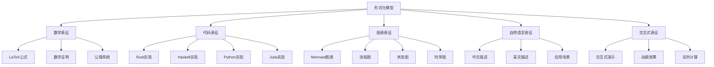
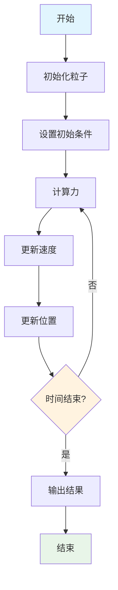
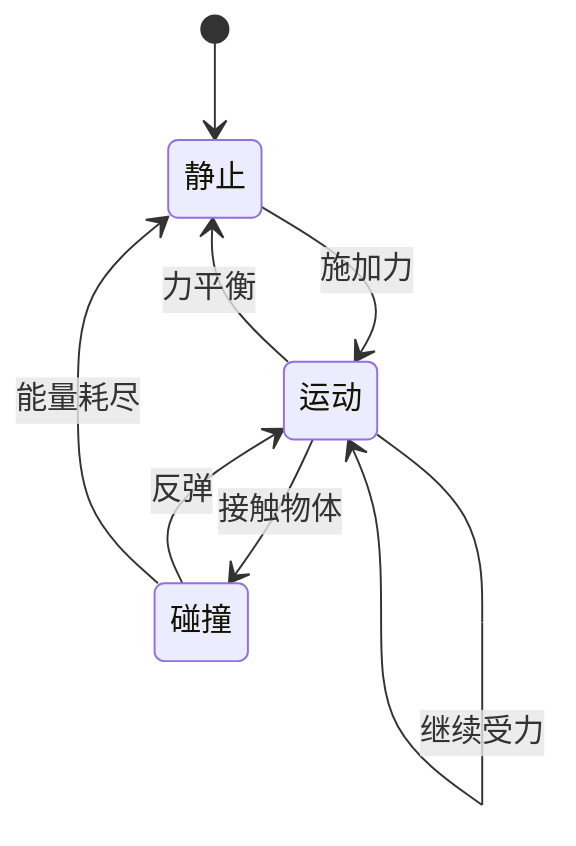
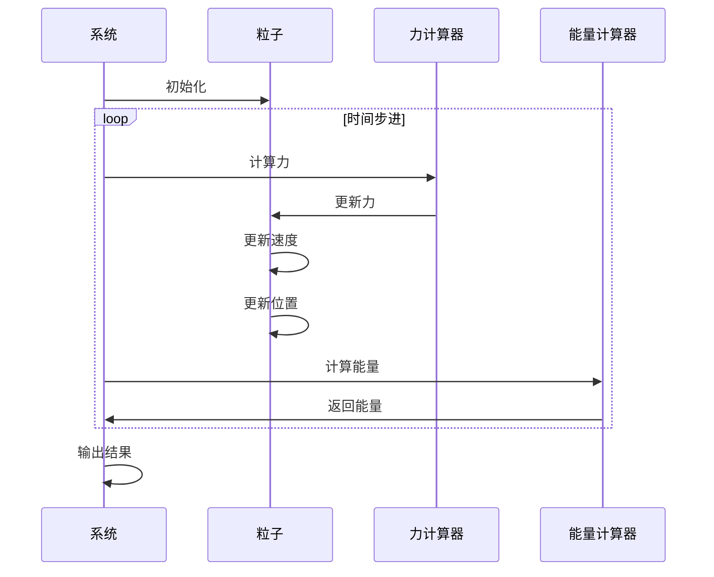

# 多表征框架实现 / Multi-Representation Framework Implementation

## 目录 / Table of Contents

- [多表征框架实现 / Multi-Representation Framework Implementation](#多表征框架实现--multi-representation-framework-implementation)
  - [目录 / Table of Contents](#目录--table-of-contents)
  - [概述 / Overview](#概述--overview)
    - [核心原则 / Core Principles](#核心原则--core-principles)
  - [框架架构 / Framework Architecture](#框架架构--framework-architecture)
    - [整体结构 / Overall Structure](#整体结构--overall-structure)
    - [表征层次 / Representation Layers](#表征层次--representation-layers)
  - [表征类型 / Representation Types](#表征类型--representation-types)
    - [1. 数学表征 / Mathematical Representation](#1-数学表征--mathematical-representation)
      - [LaTeX公式 / LaTeX Formulas](#latex公式--latex-formulas)
      - [数学证明 / Mathematical Proofs](#数学证明--mathematical-proofs)
    - [2. 代码表征 / Code Representation](#2-代码表征--code-representation)
      - [Rust实现 / Rust Implementation](#rust实现--rust-implementation)
      - [Haskell实现 / Haskell Implementation](#haskell实现--haskell-implementation)
      - [Python实现 / Python Implementation](#python实现--python-implementation)
    - [3. 图表表征 / Visual Representation](#3-图表表征--visual-representation)
      - [Mermaid流程图 / Mermaid Flowcharts](#mermaid流程图--mermaid-flowcharts)
      - [状态图 / State Diagrams](#状态图--state-diagrams)
      - [时序图 / Sequence Diagrams](#时序图--sequence-diagrams)
    - [4. 自然语言表征 / Natural Language Representation](#4-自然语言表征--natural-language-representation)
      - [中文描述 / Chinese Description](#中文描述--chinese-description)
      - [英文描述 / English Description](#英文描述--english-description)
    - [5. 交互式表征 / Interactive Representation](#5-交互式表征--interactive-representation)
      - [HTML/JavaScript交互演示 / HTML/JavaScript Interactive Demo](#htmljavascript交互演示--htmljavascript-interactive-demo)
  - [实现示例 / Implementation Examples](#实现示例--implementation-examples)
    - [示例1：单摆系统 / Example 1: Simple Pendulum System](#示例1单摆系统--example-1-simple-pendulum-system)
      - [数学表征 / Mathematical Representation](#数学表征--mathematical-representation)
      - [代码表征 / Code Representation](#代码表征--code-representation)
      - [可视化表征 / Visual Representation](#可视化表征--visual-representation)
    - [示例2：弹簧-质量系统 / Example 2: Spring-Mass System](#示例2弹簧-质量系统--example-2-spring-mass-system)
      - [1数学表征 / Mathematical Representation](#1数学表征--mathematical-representation)
      - [1代码表征 / Code Representation](#1代码表征--code-representation)
  - [工具集成 / Tool Integration](#工具集成--tool-integration)
    - [1. 数学公式渲染 / Mathematical Formula Rendering](#1-数学公式渲染--mathematical-formula-rendering)
    - [2. 代码高亮 / Code Highlighting](#2-代码高亮--code-highlighting)
    - [3. 图表渲染 / Chart Rendering](#3-图表渲染--chart-rendering)
  - [最佳实践 / Best Practices](#最佳实践--best-practices)
    - [1. 表征一致性 / Representation Consistency](#1-表征一致性--representation-consistency)
    - [2. 可读性优化 / Readability Optimization](#2-可读性优化--readability-optimization)
    - [3. 可维护性 / Maintainability](#3-可维护性--maintainability)
    - [4. 可扩展性 / Extensibility](#4-可扩展性--extensibility)
  - [参考文献 / References](#参考文献--references)

---

## 概述 / Overview

多表征框架为每个形式化模型提供多种表征方式，包括数学公式、代码实现、图表可视化、自然语言描述等，确保不同背景的用户都能理解和应用这些模型。

### 核心原则 / Core Principles

1. **完整性**: 每个模型都有完整的多种表征
2. **一致性**: 不同表征之间保持逻辑一致
3. **可读性**: 每种表征都清晰易懂
4. **可验证性**: 所有表征都可以相互验证

---

## 框架架构 / Framework Architecture

### 整体结构 / Overall Structure



### 表征层次 / Representation Layers

$$\mathcal{R} = \langle \mathcal{M}, \mathcal{L}, \mathcal{C}, \mathcal{V}, \mathcal{I} \rangle$$

其中：

- $\mathcal{M}$: 数学表征层
- $\mathcal{L}$: 语言表征层  
- $\mathcal{C}$: 代码表征层
- $\mathcal{V}$: 可视化表征层
- $\mathcal{I}$: 交互表征层

---

## 表征类型 / Representation Types

### 1. 数学表征 / Mathematical Representation

#### LaTeX公式 / LaTeX Formulas

```latex
% 牛顿第二定律
\vec{F} = m\vec{a} = m\frac{d\vec{v}}{dt} = m\frac{d^2\vec{r}}{dt^2}

% 拉格朗日方程
\frac{d}{dt}\frac{\partial \mathcal{L}}{\partial \dot{q}_i} - \frac{\partial \mathcal{L}}{\partial q_i} = 0

% 薛定谔方程
i\hbar\frac{\partial}{\partial t}\Psi = \hat{H}\Psi
```

#### 数学证明 / Mathematical Proofs

```latex
% 定理证明示例
\begin{theorem}[能量守恒]
在保守力场中，系统的总机械能守恒。
\end{theorem}

\begin{proof}
设 $T$ 为动能，$V$ 为势能，则总机械能 $E = T + V$。
对于保守力场，$\vec{F} = -\nabla V$。
根据牛顿第二定律：
\begin{align}
m\frac{d\vec{v}}{dt} &= -\nabla V \\
\frac{d}{dt}(\frac{1}{2}mv^2) &= -\frac{dV}{dt} \\
\frac{dE}{dt} &= 0
\end{align}
因此 $E$ 为常数，机械能守恒。
\end{proof}
```

### 2. 代码表征 / Code Representation

#### Rust实现 / Rust Implementation

```rust
use std::f64::consts::PI;

#[derive(Debug, Clone)]
pub struct Particle {
    pub mass: f64,
    pub position: [f64; 3],
    pub velocity: [f64; 3],
    pub force: [f64; 3],
}

impl Particle {
    pub fn new(mass: f64, position: [f64; 3]) -> Self {
        Self {
            mass,
            position,
            velocity: [0.0; 3],
            force: [0.0; 3],
        }
    }
    
    pub fn update_position(&mut self, dt: f64) {
        for i in 0..3 {
            self.position[i] += self.velocity[i] * dt;
        }
    }
    
    pub fn update_velocity(&mut self, dt: f64) {
        for i in 0..3 {
            self.velocity[i] += self.force[i] / self.mass * dt;
        }
    }
    
    pub fn kinetic_energy(&self) -> f64 {
        0.5 * self.mass * self.velocity.iter().map(|v| v * v).sum::<f64>()
    }
    
    pub fn momentum(&self) -> [f64; 3] {
        [
            self.mass * self.velocity[0],
            self.mass * self.velocity[1],
            self.mass * self.velocity[2],
        ]
    }
}

// 牛顿第二定律实现
pub struct NewtonianSystem {
    pub particles: Vec<Particle>,
    pub gravity: [f64; 3],
}

impl NewtonianSystem {
    pub fn new() -> Self {
        Self {
            particles: Vec::new(),
            gravity: [0.0, -9.81, 0.0], // 地球重力
        }
    }
    
    pub fn add_particle(&mut self, particle: Particle) {
        self.particles.push(particle);
    }
    
    pub fn step(&mut self, dt: f64) {
        // 计算力
        for particle in &mut self.particles {
            particle.force = self.gravity;
        }
        
        // 更新运动
        for particle in &mut self.particles {
            particle.update_velocity(dt);
            particle.update_position(dt);
        }
    }
    
    pub fn total_energy(&self) -> f64 {
        let mut total = 0.0;
        for particle in &self.particles {
            total += particle.kinetic_energy();
            // 势能计算（简化）
            total += particle.mass * 9.81 * particle.position[1];
        }
        total
    }
}
```

#### Haskell实现 / Haskell Implementation

```haskell
module ClassicalMechanics where

import Data.Vector (Vector)
import qualified Data.Vector as V

-- 粒子数据类型
data Particle = Particle {
    mass :: Double,
    position :: Vector Double,
    velocity :: Vector Double,
    force :: Vector Double
} deriving (Show)

-- 创建粒子
newParticle :: Double -> Vector Double -> Particle
newParticle m pos = Particle m pos (V.replicate 3 0.0) (V.replicate 3 0.0)

-- 更新位置
updatePosition :: Double -> Particle -> Particle
updatePosition dt p = p { position = V.zipWith (+) (position p) 
                                       (V.map (* dt) (velocity p)) }

-- 更新速度
updateVelocity :: Double -> Particle -> Particle
updateVelocity dt p = p { velocity = V.zipWith (+) (velocity p)
                                       (V.map (* (dt / mass p)) (force p)) }

-- 计算动能
kineticEnergy :: Particle -> Double
kineticEnergy p = 0.5 * mass p * V.sum (V.map (^2) (velocity p))

-- 计算动量
momentum :: Particle -> Vector Double
momentum p = V.map (* mass p) (velocity p)

-- 牛顿系统
data NewtonianSystem = NewtonianSystem {
    particles :: [Particle],
    gravity :: Vector Double
} deriving (Show)

-- 创建牛顿系统
newNewtonianSystem :: NewtonianSystem
newNewtonianSystem = NewtonianSystem [] (V.fromList [0.0, -9.81, 0.0])

-- 添加粒子
addParticle :: Particle -> NewtonianSystem -> NewtonianSystem
addParticle p sys = sys { particles = p : particles sys }

-- 系统演化
step :: Double -> NewtonianSystem -> NewtonianSystem
step dt sys = sys { particles = map (stepParticle dt) (particles sys) }
  where
    stepParticle dt p = updatePosition dt (updateVelocity dt (applyGravity p))
    applyGravity p = p { force = gravity sys }

-- 计算总能量
totalEnergy :: NewtonianSystem -> Double
totalEnergy sys = sum (map particleEnergy (particles sys))
  where
    particleEnergy p = kineticEnergy p + potentialEnergy p
    potentialEnergy p = mass p * 9.81 * (position p V.! 1)
```

#### Python实现 / Python Implementation

```python
import numpy as np
import matplotlib.pyplot as plt
from typing import List, Tuple
from dataclasses import dataclass

@dataclass
class Particle:
    """粒子类，表示经典力学中的质点"""
    mass: float
    position: np.ndarray
    velocity: np.ndarray
    force: np.ndarray = None
    
    def __post_init__(self):
        if self.force is None:
            self.force = np.zeros(3)
    
    def update_position(self, dt: float) -> None:
        """更新位置"""
        self.position += self.velocity * dt
    
    def update_velocity(self, dt: float) -> None:
        """更新速度"""
        self.velocity += self.force / self.mass * dt
    
    def kinetic_energy(self) -> float:
        """计算动能"""
        return 0.5 * self.mass * np.sum(self.velocity ** 2)
    
    def momentum(self) -> np.ndarray:
        """计算动量"""
        return self.mass * self.velocity

class NewtonianSystem:
    """牛顿力学系统"""
    
    def __init__(self, gravity: np.ndarray = None):
        self.particles: List[Particle] = []
        self.gravity = gravity if gravity is not None else np.array([0.0, -9.81, 0.0])
        self.time = 0.0
        self.history = []
    
    def add_particle(self, particle: Particle) -> None:
        """添加粒子到系统"""
        self.particles.append(particle)
    
    def step(self, dt: float) -> None:
        """系统演化一个时间步"""
        # 计算力
        for particle in self.particles:
            particle.force = self.gravity
        
        # 更新运动
        for particle in self.particles:
            particle.update_velocity(dt)
            particle.update_position(dt)
        
        self.time += dt
        self.record_history()
    
    def total_energy(self) -> float:
        """计算系统总能量"""
        total = 0.0
        for particle in self.particles:
            total += particle.kinetic_energy()
            # 势能（简化计算）
            total += particle.mass * 9.81 * particle.position[1]
        return total
    
    def record_history(self) -> None:
        """记录历史数据"""
        state = {
            'time': self.time,
            'positions': [p.position.copy() for p in self.particles],
            'velocities': [p.velocity.copy() for p in self.particles],
            'energy': self.total_energy()
        }
        self.history.append(state)
    
    def plot_trajectory(self) -> None:
        """绘制轨迹"""
        if not self.history:
            return
        
        times = [h['time'] for h in self.history]
        energies = [h['energy'] for h in self.history]
        
        fig, (ax1, ax2) = plt.subplots(1, 2, figsize=(12, 5))
        
        # 轨迹图
        for i, particle in enumerate(self.particles):
            positions = [h['positions'][i] for h in self.history]
            x_pos = [p[0] for p in positions]
            y_pos = [p[1] for p in positions]
            ax1.plot(x_pos, y_pos, label=f'Particle {i+1}')
        
        ax1.set_xlabel('X Position')
        ax1.set_ylabel('Y Position')
        ax1.set_title('Particle Trajectories')
        ax1.legend()
        ax1.grid(True)
        
        # 能量图
        ax2.plot(times, energies, 'b-', label='Total Energy')
        ax2.set_xlabel('Time')
        ax2.set_ylabel('Energy')
        ax2.set_title('Energy Conservation')
        ax2.legend()
        ax2.grid(True)
        
        plt.tight_layout()
        plt.show()

# 使用示例
def demo_newtonian_system():
    """演示牛顿力学系统"""
    # 创建系统
    system = NewtonianSystem()
    
    # 添加粒子
    particle1 = Particle(
        mass=1.0,
        position=np.array([0.0, 10.0, 0.0]),
        velocity=np.array([5.0, 0.0, 0.0])
    )
    particle2 = Particle(
        mass=2.0,
        position=np.array([0.0, 15.0, 0.0]),
        velocity=np.array([-3.0, 0.0, 0.0])
    )
    
    system.add_particle(particle1)
    system.add_particle(particle2)
    
    # 模拟
    dt = 0.01
    total_time = 2.0
    steps = int(total_time / dt)
    
    print(f"Initial energy: {system.total_energy():.3f}")
    
    for i in range(steps):
        system.step(dt)
        if i % 100 == 0:
            print(f"Time: {system.time:.2f}, Energy: {system.total_energy():.3f}")
    
    print(f"Final energy: {system.total_energy():.3f}")
    
    # 绘制结果
    system.plot_trajectory()

if __name__ == "__main__":
    demo_newtonian_system()
```

### 3. 图表表征 / Visual Representation

#### Mermaid流程图 / Mermaid Flowcharts



#### 状态图 / State Diagrams



#### 时序图 / Sequence Diagrams



### 4. 自然语言表征 / Natural Language Representation

#### 中文描述 / Chinese Description

**牛顿力学系统**:

牛顿力学系统是经典物理学的基础，描述了物体在力的作用下的运动规律。系统包含以下核心概念：

1. **粒子**: 具有质量、位置、速度等属性的质点
2. **力**: 改变物体运动状态的原因
3. **运动**: 位置随时间的变化
4. **能量**: 系统的运动能力

**核心定律**:

- 牛顿第一定律：惯性定律
- 牛顿第二定律：力与加速度的关系
- 牛顿第三定律：作用力与反作用力

**应用场景**:

- 天体运动计算
- 机械系统分析
- 碰撞问题研究
- 振动系统建模

#### 英文描述 / English Description

**Newtonian Mechanical System**:

The Newtonian mechanical system is the foundation of classical physics, describing the motion of objects under the influence of forces. The system encompasses the following core concepts:

1. **Particle**: A point mass with properties such as mass, position, and velocity
2. **Force**: The cause of changes in an object's motion
3. **Motion**: The change of position over time
4. **Energy**: The system's capacity for motion

**Core Laws**:

- Newton's First Law: Law of Inertia
- Newton's Second Law: Relationship between force and acceleration
- Newton's Third Law: Action and reaction forces

**Applications**:

- Celestial motion calculations
- Mechanical system analysis
- Collision problem studies
- Vibration system modeling

### 5. 交互式表征 / Interactive Representation

#### HTML/JavaScript交互演示 / HTML/JavaScript Interactive Demo

```html
<!DOCTYPE html>
<html lang="zh-CN">
<head>
    <meta charset="UTF-8">
    <meta name="viewport" content="width=device-width, initial-scale=1.0">
    <title>牛顿力学系统交互演示</title>
    <style>
        body {
            font-family: Arial, sans-serif;
            margin: 20px;
            background-color: #f5f5f5;
        }
        .container {
            max-width: 1200px;
            margin: 0 auto;
            background: white;
            padding: 20px;
            border-radius: 10px;
            box-shadow: 0 2px 10px rgba(0,0,0,0.1);
        }
        .controls {
            margin-bottom: 20px;
            padding: 15px;
            background: #f8f9fa;
            border-radius: 5px;
        }
        .control-group {
            margin: 10px 0;
        }
        label {
            display: inline-block;
            width: 120px;
            font-weight: bold;
        }
        input, button {
            padding: 5px 10px;
            margin: 5px;
            border: 1px solid #ddd;
            border-radius: 3px;
        }
        button {
            background: #007bff;
            color: white;
            cursor: pointer;
        }
        button:hover {
            background: #0056b3;
        }
        canvas {
            border: 1px solid #ddd;
            background: #f8f9fa;
        }
        .info {
            margin-top: 20px;
            padding: 15px;
            background: #e7f3ff;
            border-radius: 5px;
        }
    </style>
</head>
<body>
    <div class="container">
        <h1>牛顿力学系统交互演示</h1>
        
        <div class="controls">
            <div class="control-group">
                <label>粒子质量:</label>
                <input type="number" id="mass" value="1.0" step="0.1" min="0.1">
                <label>初始高度:</label>
                <input type="number" id="height" value="100" step="10" min="10">
                <label>初始速度:</label>
                <input type="number" id="velocity" value="0" step="5">
            </div>
            <div class="control-group">
                <button onclick="startSimulation()">开始模拟</button>
                <button onclick="stopSimulation()">停止模拟</button>
                <button onclick="resetSimulation()">重置</button>
            </div>
        </div>
        
        <canvas id="canvas" width="800" height="400"></canvas>
        
        <div class="info">
            <h3>系统信息</h3>
            <p>时间: <span id="time">0.00</span> 秒</p>
            <p>位置: <span id="position">(0, 100)</span></p>
            <p>速度: <span id="speed">0.00</span> m/s</p>
            <p>动能: <span id="kinetic">0.00</span> J</p>
            <p>势能: <span id="potential">0.00</span> J</p>
            <p>总能量: <span id="total">0.00</span> J</p>
        </div>
    </div>

    <script>
        class Particle {
            constructor(mass, x, y, vx, vy) {
                this.mass = mass;
                this.x = x;
                this.y = y;
                this.vx = vx;
                this.vy = vy;
                this.gravity = 9.81;
            }
            
            update(dt) {
                // 更新速度
                this.vy += this.gravity * dt;
                
                // 更新位置
                this.x += this.vx * dt;
                this.y += this.vy * dt;
                
                // 地面碰撞检测
                if (this.y > 350) {
                    this.y = 350;
                    this.vy = -this.vy * 0.8; // 能量损失
                }
            }
            
            getKineticEnergy() {
                return 0.5 * this.mass * (this.vx * this.vx + this.vy * this.vy);
            }
            
            getPotentialEnergy() {
                return this.mass * this.gravity * (400 - this.y);
            }
            
            getTotalEnergy() {
                return this.getKineticEnergy() + this.getPotentialEnergy();
            }
        }
        
        let particle;
        let animationId;
        let time = 0;
        let isRunning = false;
        const canvas = document.getElementById('canvas');
        const ctx = canvas.getContext('2d');
        
        function startSimulation() {
            if (isRunning) return;
            
            const mass = parseFloat(document.getElementById('mass').value);
            const height = parseFloat(document.getElementById('height').value);
            const velocity = parseFloat(document.getElementById('velocity').value);
            
            particle = new Particle(mass, 50, 400 - height, velocity, 0);
            time = 0;
            isRunning = true;
            
            function animate() {
                if (!isRunning) return;
                
                particle.update(0.016); // 60 FPS
                time += 0.016;
                
                draw();
                updateInfo();
                
                animationId = requestAnimationFrame(animate);
            }
            
            animate();
        }
        
        function stopSimulation() {
            isRunning = false;
            if (animationId) {
                cancelAnimationFrame(animationId);
            }
        }
        
        function resetSimulation() {
            stopSimulation();
            time = 0;
            draw();
            updateInfo();
        }
        
        function draw() {
            // 清空画布
            ctx.clearRect(0, 0, canvas.width, canvas.height);
            
            // 绘制地面
            ctx.fillStyle = '#8B4513';
            ctx.fillRect(0, 350, canvas.width, 50);
            
            // 绘制粒子
            if (particle) {
                ctx.fillStyle = '#FF6B6B';
                ctx.beginPath();
                ctx.arc(particle.x, particle.y, 10, 0, 2 * Math.PI);
                ctx.fill();
                
                // 绘制轨迹
                ctx.strokeStyle = '#FFB6C1';
                ctx.lineWidth = 2;
                ctx.beginPath();
                ctx.moveTo(50, 400 - parseFloat(document.getElementById('height').value));
                
                // 简化的轨迹绘制
                for (let t = 0; t <= time; t += 0.1) {
                    const x = 50 + parseFloat(document.getElementById('velocity').value) * t;
                    const y = 400 - parseFloat(document.getElementById('height').value) + 0.5 * 9.81 * t * t;
                    if (y <= 350) {
                        ctx.lineTo(x, y);
                    }
                }
                ctx.stroke();
            }
            
            // 绘制坐标轴
            ctx.strokeStyle = '#333';
            ctx.lineWidth = 1;
            ctx.beginPath();
            ctx.moveTo(0, 350);
            ctx.lineTo(canvas.width, 350);
            ctx.stroke();
        }
        
        function updateInfo() {
            if (particle) {
                document.getElementById('time').textContent = time.toFixed(2);
                document.getElementById('position').textContent = 
                    `(${particle.x.toFixed(1)}, ${particle.y.toFixed(1)})`;
                document.getElementById('speed').textContent = 
                    Math.sqrt(particle.vx * particle.vx + particle.vy * particle.vy).toFixed(2);
                document.getElementById('kinetic').textContent = 
                    particle.getKineticEnergy().toFixed(2);
                document.getElementById('potential').textContent = 
                    particle.getPotentialEnergy().toFixed(2);
                document.getElementById('total').textContent = 
                    particle.getTotalEnergy().toFixed(2);
            }
        }
        
        // 初始化
        draw();
        updateInfo();
    </script>
</body>
</html>
```

---

## 实现示例 / Implementation Examples

### 示例1：单摆系统 / Example 1: Simple Pendulum System

#### 数学表征 / Mathematical Representation

**拉格朗日函数**:
$$\mathcal{L} = T - V = \frac{1}{2}ml^2\dot{\theta}^2 + mgl\cos\theta$$

**运动方程**:
$$\ddot{\theta} + \frac{g}{l}\sin\theta = 0$$

**能量守恒**:
$$E = \frac{1}{2}ml^2\dot{\theta}^2 + mgl(1-\cos\theta) = \text{constant}$$

#### 代码表征 / Code Representation

```rust
#[derive(Debug)]
pub struct SimplePendulum {
    pub length: f64,
    pub mass: f64,
    pub gravity: f64,
    pub theta: f64,
    pub omega: f64,
}

impl SimplePendulum {
    pub fn new(length: f64, mass: f64, initial_angle: f64) -> Self {
        Self {
            length,
            mass,
            gravity: 9.81,
            theta: initial_angle,
            omega: 0.0,
        }
    }
    
    pub fn step(&mut self, dt: f64) {
        let acceleration = -(self.gravity / self.length) * self.theta.sin();
        self.omega += acceleration * dt;
        self.theta += self.omega * dt;
    }
    
    pub fn get_position(&self) -> [f64; 2] {
        [
            self.length * self.theta.sin(),
            -self.length * self.theta.cos(),
        ]
    }
    
    pub fn get_energy(&self) -> f64 {
        let kinetic = 0.5 * self.mass * self.length * self.length * self.omega * self.omega;
        let potential = self.mass * self.gravity * self.length * (1.0 - self.theta.cos());
        kinetic + potential
    }
}
```

#### 可视化表征 / Visual Representation


### 示例2：弹簧-质量系统 / Example 2: Spring-Mass System

#### 1数学表征 / Mathematical Representation

**胡克定律**:
$$F = -kx$$

**运动方程**:
$$m\ddot{x} + kx = 0$$

**解**:
$$x(t) = A\cos(\omega t + \phi)$$

其中 $\omega = \sqrt{\frac{k}{m}}$

#### 1代码表征 / Code Representation

```haskell
data SpringMass = SpringMass {
    mass :: Double,
    springConstant :: Double,
    position :: Double,
    velocity :: Double
} deriving (Show)

newSpringMass :: Double -> Double -> Double -> SpringMass
newSpringMass m k x0 = SpringMass m k x0 0.0

step :: Double -> SpringMass -> SpringMass
step dt sm = sm {
    velocity = velocity sm + acceleration * dt,
    position = position sm + velocity sm * dt
}
  where
    acceleration = -(springConstant sm / mass sm) * position sm

getEnergy :: SpringMass -> Double
getEnergy sm = kinetic + potential
  where
    kinetic = 0.5 * mass sm * velocity sm * velocity sm
    potential = 0.5 * springConstant sm * position sm * position sm
```

---

## 工具集成 / Tool Integration

### 1. 数学公式渲染 / Mathematical Formula Rendering

```html
<!-- MathJax配置 -->
<script>
MathJax = {
  tex: {
    inlineMath: [['$', '$'], ['\\(', '\\)']],
    displayMath: [['$$', '$$'], ['\\[', '\\]']]
  },
  svg: {
    fontCache: 'global'
  }
};
</script>
<script src="https://polyfill.io/v3/polyfill.min.js?features=es6"></script>
<script id="MathJax-script" async src="https://cdn.jsdelivr.net/npm/mathjax@3/es5/tex-mml-chtml.js"></script>
```

### 2. 代码高亮 / Code Highlighting

```html
<!-- Prism.js配置 -->
<link href="https://cdnjs.cloudflare.com/ajax/libs/prism/1.24.1/themes/prism.min.css" rel="stylesheet" />
<script src="https://cdnjs.cloudflare.com/ajax/libs/prism/1.24.1/components/prism-core.min.js"></script>
<script src="https://cdnjs.cloudflare.com/ajax/libs/prism/1.24.1/plugins/autoloader/prism-autoloader.min.js"></script>
```

### 3. 图表渲染 / Chart Rendering

```html
<!-- Mermaid.js配置 -->
<script src="https://cdn.jsdelivr.net/npm/mermaid/dist/mermaid.min.js"></script>
<script>
mermaid.initialize({ startOnLoad: true });
</script>
```

---

## 最佳实践 / Best Practices

### 1. 表征一致性 / Representation Consistency

- 确保所有表征使用相同的符号和术语
- 验证不同表征之间的逻辑一致性
- 定期检查表征的准确性

### 2. 可读性优化 / Readability Optimization

- 使用清晰的命名约定
- 添加详细的注释和说明
- 提供渐进式的复杂度层次

### 3. 可维护性 / Maintainability

- 模块化设计，便于更新
- 版本控制，跟踪变更
- 自动化测试，确保质量

### 4. 可扩展性 / Extensibility

- 支持新表征类型的添加
- 灵活的配置系统
- 插件化架构

---

## 参考文献 / References

1. Goldstein, H., Poole, C., & Safko, J. (2002). Classical Mechanics. Addison-Wesley.
2. Landau, L. D., & Lifshitz, E. M. (1976). Mechanics. Pergamon Press.
3. Klabnik, S., & Nichols, C. (2019). The Rust Programming Language. No Starch Press.
4. Bird, R. (1998). Introduction to Functional Programming using Haskell. Prentice Hall.
5. VanderPlas, J. (2016). Python Data Science Handbook. O'Reilly Media.

---

*最后更新: 2025-08-01*
*版本: 1.0.0*
