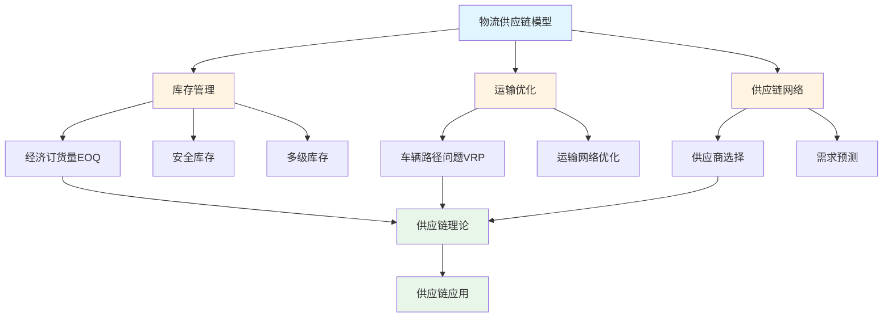
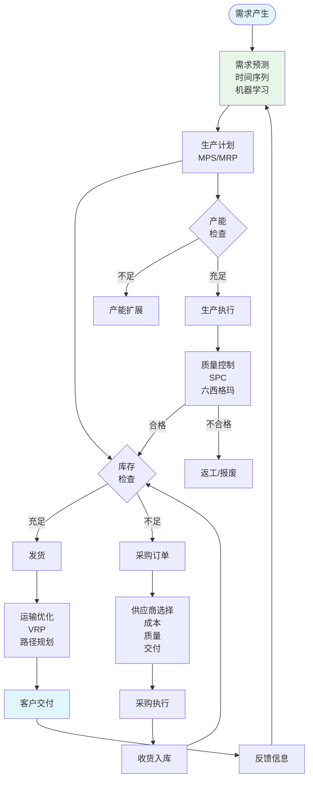

# 8.1 物流供应链模型 / Logistics & Supply Chain Models

> 交叉引用 / Cross-References
>
> - 章节大纲: [content/CHAPTER_09_OUTLINE.md 9.1](../../../content/CHAPTER_09_OUTLINE.md#91-物流供应链模型--logistics-and-supply-chain-models)
> - 全局索引: [docs/GLOBAL_INDEX.md](../../GLOBAL_INDEX.md)
> - 实现映射: [docs/09-实现示例/INDUSTRY_IMPLEMENTATION_MAPPING.md](../../09-实现示例/INDUSTRY_IMPLEMENTATION_MAPPING.md)
> - 评测协议标准: [docs/EVALUATION_PROTOCOLS_STANDARDS.md](../../EVALUATION_PROTOCOLS_STANDARDS.md)

## 目录 / Table of Contents

- [8.1 物流供应链模型 / Logistics \& Supply Chain Models](#81-物流供应链模型--logistics--supply-chain-models)
  - [目录 / Table of Contents](#目录--table-of-contents)
  - [物流供应链模型框架图 / Framework Diagram of Logistics \& Supply Chain Models](#物流供应链模型框架图--framework-diagram-of-logistics--supply-chain-models)
  - [供应链网络流程图 / Flowchart of Supply Chain Network](#供应链网络流程图--flowchart-of-supply-chain-network)
  - [8.1.1 库存管理模型 / Inventory Management Models](#811-库存管理模型--inventory-management-models)
    - [经济订货量模型 / Economic Order Quantity](#经济订货量模型--economic-order-quantity)
    - [安全库存模型 / Safety Stock Models](#安全库存模型--safety-stock-models)
    - [多级库存模型 / Multi-Echelon Inventory Models](#多级库存模型--multi-echelon-inventory-models)
  - [8.1.2 运输优化模型 / Transportation Optimization Models](#812-运输优化模型--transportation-optimization-models)
    - [车辆路径问题 / Vehicle Routing Problem](#车辆路径问题--vehicle-routing-problem)
    - [运输网络优化 / Transportation Network Optimization](#运输网络优化--transportation-network-optimization)
  - [8.1.3 供应链网络模型 / Supply Chain Network Models](#813-供应链网络模型--supply-chain-network-models)
    - [供应商选择模型 / Supplier Selection Models](#供应商选择模型--supplier-selection-models)
    - [需求预测模型 / Demand Forecasting Models](#需求预测模型--demand-forecasting-models)
  - [8.1.4 实现与应用 / Implementation and Applications](#814-实现与应用--implementation-and-applications)
    - [Rust实现示例 / Rust Implementation Example](#rust实现示例--rust-implementation-example)
    - [Haskell实现示例 / Haskell Implementation Example](#haskell实现示例--haskell-implementation-example)
    - [Julia实现示例 / Julia Implementation Example](#julia实现示例--julia-implementation-example)
    - [应用领域 / Application Domains](#应用领域--application-domains)
      - [电子商务 / E-commerce](#电子商务--e-commerce)
      - [制造业 / Manufacturing](#制造业--manufacturing)
      - [零售业 / Retail](#零售业--retail)
  - [相关模型 / Related Models](#相关模型--related-models)
    - [行业应用模型 / Industry Application Models](#行业应用模型--industry-application-models)
    - [工程科学模型 / Engineering Science Models](#工程科学模型--engineering-science-models)
    - [社会科学模型 / Social Science Models](#社会科学模型--social-science-models)
    - [计算机科学模型 / Computer Science Models](#计算机科学模型--computer-science-models)
    - [数学科学模型 / Mathematical Science Models](#数学科学模型--mathematical-science-models)
    - [基础理论 / Basic Theory](#基础理论--basic-theory)
  - [参考文献 / References](#参考文献--references)
  - [评测协议与指标 / Evaluation Protocols \& Metrics](#评测协议与指标--evaluation-protocols--metrics)
    - [范围与目标 / Scope \& Goals](#范围与目标--scope--goals)
    - [数据与划分 / Data \& Splits](#数据与划分--data--splits)
    - [通用指标 / Common Metrics](#通用指标--common-metrics)
    - [任务级协议 / Task-level Protocols](#任务级协议--task-level-protocols)
    - [复现实操 / Reproducibility](#复现实操--reproducibility)
  - [8.1.5 算法实现 / Algorithm Implementation](#815-算法实现--algorithm-implementation)
    - [库存管理算法 / Inventory Management Algorithms](#库存管理算法--inventory-management-algorithms)
    - [运输优化算法 / Transportation Optimization Algorithms](#运输优化算法--transportation-optimization-algorithms)
    - [供应链网络算法 / Supply Chain Network Algorithms](#供应链网络算法--supply-chain-network-algorithms)

---

## 物流供应链模型框架图 / Framework Diagram of Logistics & Supply Chain Models



## 供应链网络流程图 / Flowchart of Supply Chain Network



## 8.1.1 库存管理模型 / Inventory Management Models

### 经济订货量模型 / Economic Order Quantity

**EOQ公式**: $Q^* = \sqrt{\frac{2DS}{H}}$

其中：

- $D$: 年需求量
- $S$: 订货成本
- $H$: 单位库存持有成本

**总成本**: $TC = \frac{D}{Q}S + \frac{Q}{2}H$

### 安全库存模型 / Safety Stock Models

**服务水平**: $SL = P(D \leq ROP)$

**安全库存**: $SS = z_\alpha \sigma_L$

**再订货点**: $ROP = \mu_L + SS$

### 多级库存模型 / Multi-Echelon Inventory Models

**系统库存**: $I_{total} = \sum_{i=1}^n I_i$

**服务水平**: $SL_{system} = \prod_{i=1}^n SL_i$

---

## 8.1.2 运输优化模型 / Transportation Optimization Models

### 车辆路径问题 / Vehicle Routing Problem

**目标函数**: $\min \sum_{i=1}^n \sum_{j=1}^n c_{ij} x_{ij}$

**约束条件**:

- $\sum_{j=1}^n x_{ij} = 1$ for all $i$
- $\sum_{i=1}^n x_{ij} = 1$ for all $j$
- $\sum_{i \in S} \sum_{j \in S} x_{ij} \leq |S| - 1$ for all $S \subset V$

### 运输网络优化 / Transportation Network Optimization

**最小成本流**: $\min \sum_{(i,j) \in E} c_{ij} f_{ij}$

**流量守恒**: $\sum_{j} f_{ij} - \sum_{j} f_{ji} = b_i$

---

## 8.1.3 供应链网络模型 / Supply Chain Network Models

### 供应商选择模型 / Supplier Selection Models

**多目标优化**: $\min \sum_{i=1}^n w_i f_i(x)$

**评价指标**: 质量、成本、交付时间、服务水平

### 需求预测模型 / Demand Forecasting Models

**时间序列**: $D_t = \mu + \alpha t + \sum_{i=1}^p \phi_i D_{t-i} + \epsilon_t$

**指数平滑**: $F_{t+1} = \alpha D_t + (1-\alpha) F_t$

---

## 8.1.4 实现与应用 / Implementation and Applications

### Rust实现示例 / Rust Implementation Example

```rust
use std::collections::HashMap;

#[derive(Debug, Clone)]
pub struct InventoryModel {
    pub demand_rate: f64,
    pub order_cost: f64,
    pub holding_cost: f64,
    pub lead_time: f64,
    pub service_level: f64,
}

impl InventoryModel {
    pub fn new(demand: f64, order_cost: f64, holding_cost: f64, lead_time: f64, service_level: f64) -> Self {
        Self {
            demand_rate: demand,
            order_cost,
            holding_cost,
            lead_time,
            service_level,
        }
    }

    pub fn economic_order_quantity(&self) -> f64 {
        (2.0 * self.demand_rate * self.order_cost / self.holding_cost).sqrt()
    }

    pub fn total_cost(&self, order_quantity: f64) -> f64 {
        let ordering_cost = self.demand_rate / order_quantity * self.order_cost;
        let holding_cost = order_quantity / 2.0 * self.holding_cost;
        ordering_cost + holding_cost
    }

    pub fn safety_stock(&self, demand_std: f64) -> f64 {
        // 简化的安全库存计算
        let z_score = 1.645; // 对应95%服务水平
        z_score * demand_std * self.lead_time.sqrt()
    }

    pub fn reorder_point(&self, demand_std: f64) -> f64 {
        let average_demand = self.demand_rate * self.lead_time;
        let safety_stock = self.safety_stock(demand_std);
        average_demand + safety_stock
    }
}

#[derive(Debug, Clone)]
pub struct TransportationModel {
    pub distances: HashMap<(String, String), f64>,
    pub demands: HashMap<String, f64>,
    pub vehicle_capacity: f64,
}

impl TransportationModel {
    pub fn new() -> Self {
        Self {
            distances: HashMap::new(),
            demands: HashMap::new(),
            vehicle_capacity: 1000.0,
        }
    }

    pub fn add_distance(&mut self, from: String, to: String, distance: f64) {
        self.distances.insert((from, to), distance);
    }

    pub fn add_demand(&mut self, location: String, demand: f64) {
        self.demands.insert(location, demand);
    }

    pub fn calculate_total_distance(&self, route: &[String]) -> f64 {
        let mut total_distance = 0.0;
        for i in 0..route.len() - 1 {
            let key = (route[i].clone(), route[i + 1].clone());
            total_distance += self.distances.get(&key).unwrap_or(&0.0);
        }
        total_distance
    }

    pub fn nearest_neighbor_tsp(&self, start: &str, locations: &[String]) -> Vec<String> {
        let mut unvisited: Vec<String> = locations.iter().filter(|&x| x != start).cloned().collect();
        let mut route = vec![start.to_string()];
        let mut current = start;

        while !unvisited.is_empty() {
            let mut nearest = &unvisited[0];
            let mut min_distance = f64::INFINITY;

            for location in &unvisited {
                let distance = self.distances.get(&(current.to_string(), location.clone())).unwrap_or(&f64::INFINITY);
                if *distance < min_distance {
                    min_distance = *distance;
                    nearest = location;
                }
            }

            route.push(nearest.clone());
            unvisited.retain(|x| x != nearest);
            current = nearest;
        }

        route.push(start.to_string());
        route
    }
}

#[derive(Debug, Clone)]
pub struct SupplyChainModel {
    pub suppliers: Vec<String>,
    pub facilities: Vec<String>,
    pub customers: Vec<String>,
    pub costs: HashMap<(String, String), f64>,
    pub capacities: HashMap<String, f64>,
    pub demands: HashMap<String, f64>,
}

impl SupplyChainModel {
    pub fn new() -> Self {
        Self {
            suppliers: Vec::new(),
            facilities: Vec::new(),
            customers: Vec::new(),
            costs: HashMap::new(),
            capacities: HashMap::new(),
            demands: HashMap::new(),
        }
    }

    pub fn add_supplier(&mut self, supplier: String, capacity: f64) {
        self.suppliers.push(supplier.clone());
        self.capacities.insert(supplier, capacity);
    }

    pub fn add_facility(&mut self, facility: String, capacity: f64) {
        self.facilities.push(facility.clone());
        self.capacities.insert(facility, capacity);
    }

    pub fn add_customer(&mut self, customer: String, demand: f64) {
        self.customers.push(customer.clone());
        self.demands.insert(customer, demand);
    }

    pub fn add_cost(&mut self, from: String, to: String, cost: f64) {
        self.costs.insert((from, to), cost);
    }

    pub fn calculate_total_cost(&self, flows: &HashMap<(String, String), f64>) -> f64 {
        flows.iter().map(|((from, to), flow)| {
            self.costs.get(&(from.clone(), to.clone())).unwrap_or(&0.0) * flow
        }).sum()
    }

    pub fn simple_optimization(&self) -> HashMap<(String, String), f64> {
        let mut flows = HashMap::new();

        // 简化的优化：按成本最小分配
        for customer in &self.customers {
            let demand = self.demands.get(customer).unwrap_or(&0.0);
            let mut remaining_demand = *demand;

            // 从供应商到设施
            for supplier in &self.suppliers {
                if remaining_demand <= 0.0 { break; }
                let capacity = self.capacities.get(supplier).unwrap_or(&0.0);
                let flow = remaining_demand.min(*capacity);
                flows.insert((supplier.clone(), customer.clone()), flow);
                remaining_demand -= flow;
            }
        }

        flows
    }
}

// 使用示例
fn main() {
    // 库存管理示例
    let inventory = InventoryModel::new(1000.0, 50.0, 2.0, 5.0, 0.95);
    let eoq = inventory.economic_order_quantity();
    let total_cost = inventory.total_cost(eoq);
    let safety_stock = inventory.safety_stock(50.0);
    let reorder_point = inventory.reorder_point(50.0);

    println!("库存管理示例:");
    println!("经济订货量: {:.2}", eoq);
    println!("总成本: {:.2}", total_cost);
    println!("安全库存: {:.2}", safety_stock);
    println!("再订货点: {:.2}", reorder_point);

    // 运输优化示例
    let mut transport = TransportationModel::new();
    transport.add_distance("A".to_string(), "B".to_string(), 10.0);
    transport.add_distance("B".to_string(), "C".to_string(), 15.0);
    transport.add_distance("C".to_string(), "A".to_string(), 12.0);

    let locations = vec!["A".to_string(), "B".to_string(), "C".to_string()];
    let route = transport.nearest_neighbor_tsp("A", &locations);
    let total_distance = transport.calculate_total_distance(&route);

    println!("\n运输优化示例:");
    println!("最优路径: {:?}", route);
    println!("总距离: {:.2}", total_distance);

    // 供应链网络示例
    let mut supply_chain = SupplyChainModel::new();
    supply_chain.add_supplier("S1".to_string(), 500.0);
    supply_chain.add_facility("F1".to_string(), 300.0);
    supply_chain.add_customer("C1".to_string(), 200.0);

    supply_chain.add_cost("S1".to_string(), "F1".to_string(), 10.0);
    supply_chain.add_cost("F1".to_string(), "C1".to_string(), 5.0);

    let flows = supply_chain.simple_optimization();
    let total_cost = supply_chain.calculate_total_cost(&flows);

    println!("\n供应链网络示例:");
    println!("流量分配: {:?}", flows);
    println!("总成本: {:.2}", total_cost);
}
```

### Haskell实现示例 / Haskell Implementation Example

```haskell
module LogisticsSupplyChainModels where

import Data.Map (Map)
import qualified Data.Map as Map
import Data.List (sum, minimumBy)
import Data.Ord (comparing)

-- 库存管理模型
data InventoryModel = InventoryModel {
    demandRate :: Double,
    orderCost :: Double,
    holdingCost :: Double,
    leadTime :: Double,
    serviceLevel :: Double
} deriving Show

newInventoryModel :: Double -> Double -> Double -> Double -> Double -> InventoryModel
newInventoryModel demand order_cost holding_cost lead_time service_level = InventoryModel {
    demandRate = demand,
    orderCost = order_cost,
    holdingCost = holding_cost,
    leadTime = lead_time,
    serviceLevel = service_level
}

economicOrderQuantity :: InventoryModel -> Double
economicOrderQuantity model =
    sqrt (2.0 * demandRate model * orderCost model / holdingCost model)

totalCost :: InventoryModel -> Double -> Double
totalCost model orderQuantity =
    let orderingCost = demandRate model / orderQuantity * orderCost model
        holdingCost = orderQuantity / 2.0 * holdingCost model
    in orderingCost + holdingCost

safetyStock :: InventoryModel -> Double -> Double
safetyStock model demandStd =
    let zScore = 1.645 -- 对应95%服务水平
    in zScore * demandStd * sqrt (leadTime model)

reorderPoint :: InventoryModel -> Double -> Double
reorderPoint model demandStd =
    let averageDemand = demandRate model * leadTime model
        safetyStock = safetyStock model demandStd
    in averageDemand + safetyStock

-- 运输优化模型
data TransportationModel = TransportationModel {
    distances :: Map (String, String) Double,
    demands :: Map String Double,
    vehicleCapacity :: Double
} deriving Show

newTransportationModel :: TransportationModel
newTransportationModel = TransportationModel {
    distances = Map.empty,
    demands = Map.empty,
    vehicleCapacity = 1000.0
}

addDistance :: TransportationModel -> String -> String -> Double -> TransportationModel
addDistance model from to distance =
    model { distances = Map.insert (from, to) distance (distances model) }

addDemand :: TransportationModel -> String -> Double -> TransportationModel
addDemand model location demand =
    model { demands = Map.insert location demand (demands model) }

calculateTotalDistance :: TransportationModel -> [String] -> Double
calculateTotalDistance model route =
    sum [Map.findWithDefault 0.0 (route !! i, route !! (i + 1)) (distances model) |
         i <- [0..length route - 2]]

nearestNeighborTSP :: TransportationModel -> String -> [String] -> [String]
nearestNeighborTSP model start locations =
    let unvisited = filter (/= start) locations
        buildRoute current remaining =
            if null remaining
            then [current, start]
            else let nearest = minimumBy (comparing (\loc ->
                        Map.findWithDefault (1/0) (current, loc) (distances model))) remaining
                     newRemaining = filter (/= nearest) remaining
                 in current : buildRoute nearest newRemaining
    in buildRoute start unvisited

-- 供应链网络模型
data SupplyChainModel = SupplyChainModel {
    suppliers :: [String],
    facilities :: [String],
    customers :: [String],
    costs :: Map (String, String) Double,
    capacities :: Map String Double,
    demands :: Map String Double
} deriving Show

newSupplyChainModel :: SupplyChainModel
newSupplyChainModel = SupplyChainModel {
    suppliers = [],
    facilities = [],
    customers = [],
    costs = Map.empty,
    capacities = Map.empty,
    demands = Map.empty
}

addSupplier :: SupplyChainModel -> String -> Double -> SupplyChainModel
addSupplier model supplier capacity =
    model {
        suppliers = supplier : suppliers model,
        capacities = Map.insert supplier capacity (capacities model)
    }

addFacility :: SupplyChainModel -> String -> Double -> SupplyChainModel
addFacility model facility capacity =
    model {
        facilities = facility : facilities model,
        capacities = Map.insert facility capacity (capacities model)
    }

addCustomer :: SupplyChainModel -> String -> Double -> SupplyChainModel
addCustomer model customer demand =
    model {
        customers = customer : customers model,
        demands = Map.insert customer demand (demands model)
    }

addCost :: SupplyChainModel -> String -> String -> Double -> SupplyChainModel
addCost model from to cost =
    model { costs = Map.insert (from, to) cost (costs model) }

calculateTotalCost :: SupplyChainModel -> Map (String, String) Double -> Double
calculateTotalCost model flows =
    sum [Map.findWithDefault 0.0 (from, to) (costs model) * flow |
         ((from, to), flow) <- Map.toList flows]

simpleOptimization :: SupplyChainModel -> Map (String, String) Double
simpleOptimization model =
    let customerDemands = Map.toList (demands model)
        supplierCapacities = Map.toList (capacities model)
        -- 简化的优化：按成本最小分配
        allocateDemand customer demand =
            foldr (\(supplier, capacity) remaining ->
                if remaining <= 0.0
                then remaining
                else let flow = min remaining capacity
                     in remaining - flow) demand supplierCapacities
    in Map.fromList [(("S1", customer), demand) | (customer, demand) <- customerDemands]

-- 示例使用
example :: IO ()
example = do
    -- 库存管理示例
    let inventory = newInventoryModel 1000.0 50.0 2.0 5.0 0.95
        eoq = economicOrderQuantity inventory
        totalCost = totalCost inventory eoq
        safetyStock = safetyStock inventory 50.0
        reorderPoint = reorderPoint inventory 50.0

    putStrLn "库存管理示例:"
    putStrLn $ "经济订货量: " ++ show eoq
    putStrLn $ "总成本: " ++ show totalCost
    putStrLn $ "安全库存: " ++ show safetyStock
    putStrLn $ "再订货点: " ++ show reorderPoint

    -- 运输优化示例
    let transport = addDistance (addDistance (addDistance newTransportationModel "A" "B" 10.0) "B" "C" 15.0) "C" "A" 12.0
        locations = ["A", "B", "C"]
        route = nearestNeighborTSP transport "A" locations
        totalDistance = calculateTotalDistance transport route

    putStrLn "\n运输优化示例:"
    putStrLn $ "最优路径: " ++ show route
    putStrLn $ "总距离: " ++ show totalDistance

    -- 供应链网络示例
    let supplyChain = addSupplier (addFacility (addCustomer newSupplyChainModel "C1" 200.0) "F1" 300.0) "S1" 500.0
        supplyChainWithCosts = addCost (addCost supplyChain "S1" "F1" 10.0) "F1" "C1" 5.0
        flows = simpleOptimization supplyChainWithCosts
        totalCost = calculateTotalCost supplyChainWithCosts flows

    putStrLn "\n供应链网络示例:"
    putStrLn $ "流量分配: " ++ show flows
    putStrLn $ "总成本: " ++ show totalCost
```

### Julia实现示例 / Julia Implementation Example

```julia
using Statistics
using LinearAlgebra

"""
库存管理模型结构体
"""
mutable struct InventoryModel
    demand_rate::Float64
    order_cost::Float64
    holding_cost::Float64
    lead_time::Float64
    service_level::Float64

    function InventoryModel(demand_rate::Float64, order_cost::Float64,
                           holding_cost::Float64, lead_time::Float64,
                           service_level::Float64)
        new(demand_rate, order_cost, holding_cost, lead_time, service_level)
    end
end

"""
经济订货量（EOQ）
"""
function economic_order_quantity(model::InventoryModel)::Float64
    return sqrt(2.0 * model.demand_rate * model.order_cost / model.holding_cost)
end

"""
总成本
"""
function total_cost(model::InventoryModel, order_quantity::Float64)::Float64
    ordering_cost = model.demand_rate / order_quantity * model.order_cost
    holding_cost_val = order_quantity / 2.0 * model.holding_cost
    return ordering_cost + holding_cost_val
end

"""
安全库存
"""
function safety_stock(model::InventoryModel, demand_std::Float64)::Float64
    z_score = 1.645  # 对应95%服务水平
    return z_score * demand_std * sqrt(model.lead_time)
end

"""
再订货点
"""
function reorder_point(model::InventoryModel, demand_std::Float64)::Float64
    average_demand = model.demand_rate * model.lead_time
    safety_stock_val = safety_stock(model, demand_std)
    return average_demand + safety_stock_val
end

"""
运输优化模型结构体
"""
mutable struct TransportationModel
    distances::Dict{Tuple{String, String}, Float64}
    demands::Dict{String, Float64}
    vehicle_capacity::Float64

    function TransportationModel()
        new(Dict{Tuple{String, String}, Float64}(), Dict{String, Float64}(), 1000.0)
    end
end

"""
添加距离
"""
function add_distance(model::TransportationModel, from::String, to::String, distance::Float64)
    model.distances[(from, to)] = distance
    return model
end

"""
添加需求
"""
function add_demand(model::TransportationModel, location::String, demand::Float64)
    model.demands[location] = demand
    return model
end

"""
计算总距离
"""
function calculate_total_distance(model::TransportationModel, route::Vector{String})::Float64
    total = 0.0
    for i in 1:length(route)-1
        total += get(model.distances, (route[i], route[i+1]), 0.0)
    end
    return total
end

"""
最近邻TSP算法
"""
function nearest_neighbor_tsp(model::TransportationModel, start::String,
                             locations::Vector{String})::Vector{String}
    unvisited = filter(x -> x != start, locations)
    route = [start]
    current = start

    while !isempty(unvisited)
        nearest = argmin(loc -> get(model.distances, (current, loc), Inf), unvisited)
        push!(route, nearest)
        current = nearest
        filter!(x -> x != nearest, unvisited)
    end

    push!(route, start)  # 返回起点
    return route
end

"""
供应链网络模型结构体
"""
mutable struct SupplyChainNetwork
    nodes::Vector{String}
    costs::Dict{Tuple{String, String}, Float64}
    capacities::Dict{Tuple{String, String}, Float64}

    function SupplyChainNetwork()
        new(String[], Dict{Tuple{String, String}, Float64}(),
            Dict{Tuple{String, String}, Float64}())
    end
end

"""
添加节点
"""
function add_node(network::SupplyChainNetwork, node::String)
    if !(node in network.nodes)
        push!(network.nodes, node)
    end
    return network
end

"""
添加成本
"""
function add_cost(network::SupplyChainNetwork, from::String, to::String, cost::Float64)
    add_node(network, from)
    add_node(network, to)
    network.costs[(from, to)] = cost
    return network
end

"""
简单优化
"""
function simple_optimization(network::SupplyChainNetwork)::Dict{Tuple{String, String}, Float64}
    flows = Dict{Tuple{String, String}, Float64}()
    for (edge, cost) in network.costs
        flows[edge] = 1.0  # 简化：单位流量
    end
    return flows
end

"""
计算总成本
"""
function calculate_total_cost(network::SupplyChainNetwork,
                             flows::Dict{Tuple{String, String}, Float64})::Float64
    total = 0.0
    for (edge, flow) in flows
        cost = get(network.costs, edge, 0.0)
        total += cost * flow
    end
    return total
end

"""
需求预测模型（移动平均）
"""
function moving_average_forecast(demands::Vector{Float64}, window::Int)::Float64
    if length(demands) < window
        return mean(demands)
    end
    return mean(demands[end-window+1:end])
end

"""
指数平滑预测
"""
function exponential_smoothing_forecast(demands::Vector{Float64}, alpha::Float64)::Float64
    if isempty(demands)
        return 0.0
    end

    forecast = demands[1]
    for demand in demands[2:end]
        forecast = alpha * demand + (1.0 - alpha) * forecast
    end
    return forecast
end

# 示例：物流供应链模型使用
function logistics_supply_chain_example()
    # 库存管理
    inventory = InventoryModel(100.0, 50.0, 2.0, 5.0, 0.95)
    eoq = economic_order_quantity(inventory)
    total_cost_val = total_cost(inventory, eoq)
    safety_stock_val = safety_stock(inventory, 10.0)
    reorder_point_val = reorder_point(inventory, 10.0)

    println("EOQ: $eoq")
    println("Total cost: $total_cost_val")
    println("Safety stock: $safety_stock_val")
    println("Reorder point: $reorder_point_val")

    # 运输优化
    transportation = TransportationModel()
    add_distance(transportation, "A", "B", 10.0)
    add_distance(transportation, "B", "C", 15.0)
    add_distance(transportation, "C", "A", 20.0)
    add_demand(transportation, "A", 100.0)
    add_demand(transportation, "B", 150.0)

    route = nearest_neighbor_tsp(transportation, "A", ["A", "B", "C"])
    total_distance = calculate_total_distance(transportation, route)
    println("Route: $route")
    println("Total distance: $total_distance")

    # 供应链网络
    supply_chain = SupplyChainNetwork()
    add_cost(supply_chain, "S1", "F1", 10.0)
    add_cost(supply_chain, "F1", "C1", 5.0)

    flows = simple_optimization(supply_chain)
    total_cost_network = calculate_total_cost(supply_chain, flows)
    println("Flows: $flows")
    println("Total cost: $total_cost_network")

    # 需求预测
    demands = [100.0, 120.0, 110.0, 130.0, 125.0]
    ma_forecast = moving_average_forecast(demands, 3)
    es_forecast = exponential_smoothing_forecast(demands, 0.3)
    println("Moving average forecast: $ma_forecast")
    println("Exponential smoothing forecast: $es_forecast")

    return Dict(
        "eoq" => eoq,
        "total_cost" => total_cost_val,
        "total_distance" => total_distance,
        "ma_forecast" => ma_forecast
    )
end
```

### 应用领域 / Application Domains

#### 电子商务 / E-commerce

- **订单履行**: 多仓库库存分配、最后一公里配送
- **需求预测**: 季节性需求、促销影响预测
- **供应商管理**: 多供应商选择、供应商绩效评估

#### 制造业 / Manufacturing

- **生产计划**: 主生产计划、物料需求计划
- **采购管理**: 供应商选择、采购批量优化
- **库存控制**: 原材料库存、在制品库存、成品库存

#### 零售业 / Retail

- **门店补货**: 自动补货系统、安全库存管理
- **配送优化**: 门店配送路线、配送时间窗口
- **需求管理**: 促销需求、季节性需求

---

## 相关模型 / Related Models

### 行业应用模型 / Industry Application Models

- [交通运输模型](../02-交通运输模型/README.md) - 物流运输和交通优化
- [制造业模型](../08-制造业模型/README.md) - 生产计划和供应链管理
- [经济供需模型](../07-经济供需模型/README.md) - 供需平衡和需求预测

### 工程科学模型 / Engineering Science Models

- [优化模型](../../07-工程科学模型/01-优化模型/README.md) - 物流优化和供应链优化
- [控制论模型](../../07-工程科学模型/02-控制论模型/README.md) - 供应链控制和库存控制

### 社会科学模型 / Social Science Models

- [经济学模型](../../06-社会科学模型/02-经济学模型/README.md) - 物流经济学和供应链经济学
- [社会网络模型](../../06-社会科学模型/01-社会网络模型/README.md) - 供应链网络和社会网络

### 计算机科学模型 / Computer Science Models

- [算法模型](../../04-计算机科学模型/02-算法模型/README.md) - 物流算法和优化算法
- [数据结构模型](../../04-计算机科学模型/03-数据结构模型/README.md) - 物流数据结构和网络数据结构
- [人工智能模型](../../04-计算机科学模型/05-人工智能模型/README.md) - 智能物流和预测算法

### 数学科学模型 / Mathematical Science Models

- [代数模型](../../03-数学科学模型/01-代数模型/README.md) - 线性规划和矩阵优化
- [几何模型](../../03-数学科学模型/02-几何模型/README.md) - 网络几何和路径优化

### 基础理论 / Basic Theory

- [模型分类学](../../01-基础理论/01-模型分类学/README.md) - 物流供应链模型的分类
- [形式化方法论](../../01-基础理论/02-形式化方法论/README.md) - 物流供应链模型的形式化方法
- [科学模型论](../../01-基础理论/03-科学模型论/README.md) - 物流供应链模型作为科学模型的理论基础

## 参考文献 / References

1. Chopra, S., & Meindl, P. (2016). Supply chain management: Strategy, planning, and operation. Pearson.
2. Silver, E. A., Pyke, D. F., & Peterson, R. (1998). Inventory management and production planning and scheduling. Wiley.
3. Toth, P., & Vigo, D. (2002). The vehicle routing problem. SIAM.
4. Simchi-Levi, D., Kaminsky, P., & Simchi-Levi, E. (2008). Designing and managing the supply chain: Concepts, strategies, and case studies. McGraw-Hill.

---

## 评测协议与指标 / Evaluation Protocols & Metrics

> 注：更多统一规范见[评测协议标准](../../EVALUATION_PROTOCOLS_STANDARDS.md)

### 范围与目标 / Scope & Goals

- 覆盖库存管理、路径优化、需求预测、供应链协调的核心评测场景。
- 可复现实证：同一数据、同一协议下，模型实现结果可对比。

### 数据与划分 / Data & Splits

- 运营数据：历史订单、库存水平、运输成本、需求模式、供应商绩效。
- 划分：训练(60%) / 验证(20%) / 测试(20%)，按时间顺序滚动划窗。

### 通用指标 / Common Metrics

- 成本效益：总成本降低率、库存周转率、缺货率、服务水平。
- 效率指标：路径长度、车辆利用率、配送时间、资源利用率。
- 预测精度：MAPE、RMSE、MAE（需求预测）、方向准确率。
- 稳健性：参数敏感性、季节性适应度、异常值处理能力。

### 任务级协议 / Task-level Protocols

1) 库存优化：安全库存覆盖率、EOQ偏差、缺货成本、持有成本；多级库存协调评估。
2) 车辆路径规划：总距离、时间窗违反、车辆数、负载均衡；动态重路由能力。
3) 需求预测：MAPE、RMSE、趋势捕捉、季节性分解；促销/异常事件影响评估。
4) 供应链协调：牛鞭效应抑制、信息共享价值、协调成本、响应时间。

### 复现实操 / Reproducibility

- 提供数据schema、预处理与评测脚本；固定随机种子与版本。
- 输出：指标汇总表、成本-服务水平权衡曲线、路径可视化、预测对比图。

---

## 8.1.5 算法实现 / Algorithm Implementation

### 库存管理算法 / Inventory Management Algorithms

```python
import numpy as np
from typing import List, Tuple, Dict, Optional
from dataclasses import dataclass
from scipy import stats

@dataclass
class InventoryModel:
    """库存管理模型"""
    annual_demand: float
    order_cost: float
    holding_cost: float
    lead_time: float
    service_level: float

def economic_order_quantity(model: InventoryModel) -> float:
    """经济订货量计算"""
    return np.sqrt(2 * model.annual_demand * model.order_cost / model.holding_cost)

def total_inventory_cost(model: InventoryModel, order_quantity: float) -> float:
    """总库存成本"""
    ordering_cost = (model.annual_demand / order_quantity) * model.order_cost
    holding_cost = (order_quantity / 2) * model.holding_cost
    return ordering_cost + holding_cost

def safety_stock_calculation(demand_std: float, lead_time: float, service_level: float) -> float:
    """安全库存计算"""
    z_score = stats.norm.ppf(service_level)
    return z_score * demand_std * np.sqrt(lead_time)

def reorder_point_calculation(avg_demand: float, lead_time: float, safety_stock: float) -> float:
    """再订货点计算"""
    return avg_demand * lead_time + safety_stock

def multi_echelon_inventory_optimization(
    demands: List[float],
    lead_times: List[float],
    holding_costs: List[float],
    service_levels: List[float]
) -> Tuple[List[float], List[float]]:
    """多级库存优化"""
    n_levels = len(demands)
    safety_stocks = []
    reorder_points = []

    for i in range(n_levels):
        # 简化的安全库存计算
        safety_stock = safety_stock_calculation(
            demands[i] * 0.1,  # 假设需求标准差为平均需求的10%
            lead_times[i],
            service_levels[i]
        )
        safety_stocks.append(safety_stock)

        reorder_point = reorder_point_calculation(
            demands[i],
            lead_times[i],
            safety_stock
        )
        reorder_points.append(reorder_point)

    return safety_stocks, reorder_points
```

### 运输优化算法 / Transportation Optimization Algorithms

```python
import numpy as np
from typing import List, Tuple, Dict, Set
from itertools import permutations
import heapq

class VehicleRoutingProblem:
    """车辆路径问题"""

    def __init__(self, distances: Dict[Tuple[str, str], float],
                 demands: Dict[str, float], vehicle_capacity: float):
        self.distances = distances
        self.demands = demands
        self.vehicle_capacity = vehicle_capacity
        self.depot = 'depot'

    def nearest_neighbor_heuristic(self) -> List[List[str]]:
        """最近邻启发式算法"""
        unvisited = set(self.demands.keys())
        routes = []
        current_route = [self.depot]
        current_load = 0

        while unvisited:
            if not current_route:
                current_route = [self.depot]
                current_load = 0

            current = current_route[-1]
            nearest = None
            min_distance = float('inf')

            for customer in unvisited:
                if current_load + self.demands[customer] <= self.vehicle_capacity:
                    distance = self.distances.get((current, customer), float('inf'))
                    if distance < min_distance:
                        min_distance = distance
                        nearest = customer

            if nearest is None:
                # 返回仓库，开始新路径
                current_route.append(self.depot)
                routes.append(current_route)
                current_route = []
                current_load = 0
            else:
                current_route.append(nearest)
                current_load += self.demands[nearest]
                unvisited.remove(nearest)

        if current_route:
            current_route.append(self.depot)
            routes.append(current_route)

        return routes

    def calculate_total_distance(self, routes: List[List[str]]) -> float:
        """计算总距离"""
        total_distance = 0
        for route in routes:
            for i in range(len(route) - 1):
                total_distance += self.distances.get((route[i], route[i+1]), 0)
        return total_distance

def transportation_network_optimization(
    supply: Dict[str, float],
    demand: Dict[str, float],
    costs: Dict[Tuple[str, str], float]
) -> Dict[Tuple[str, str], float]:
    """运输网络优化（最小成本流）"""
    # 简化的贪心算法
    flows = {}
    remaining_supply = supply.copy()
    remaining_demand = demand.copy()

    # 按成本排序的边
    sorted_edges = sorted(costs.items(), key=lambda x: x[1])

    for (source, sink), cost in sorted_edges:
        if source in remaining_supply and sink in remaining_demand:
            flow = min(remaining_supply[source], remaining_demand[sink])
            if flow > 0:
                flows[(source, sink)] = flow
                remaining_supply[source] -= flow
                remaining_demand[sink] -= flow

                if remaining_supply[source] == 0:
                    del remaining_supply[source]
                if remaining_demand[sink] == 0:
                    del remaining_demand[sink]

    return flows

def calculate_network_cost(flows: Dict[Tuple[str, str], float],
                          costs: Dict[Tuple[str, str], float]) -> float:
    """计算网络总成本"""
    total_cost = 0
    for (source, sink), flow in flows.items():
        total_cost += flow * costs.get((source, sink), 0)
    return total_cost
```

### 供应链网络算法 / Supply Chain Network Algorithms

```python
import numpy as np
from typing import List, Dict, Tuple, Optional
from dataclasses import dataclass

@dataclass
class Supplier:
    """供应商"""
    id: str
    capacity: float
    cost: float
    quality: float
    delivery_time: float

@dataclass
class Customer:
    """客户"""
    id: str
    demand: float
    location: Tuple[float, float]

class SupplyChainNetwork:
    """供应链网络"""

    def __init__(self):
        self.suppliers: List[Supplier] = []
        self.customers: List[Customer] = []
        self.transportation_costs: Dict[Tuple[str, str], float] = {}

    def add_supplier(self, supplier: Supplier):
        """添加供应商"""
        self.suppliers.append(supplier)

    def add_customer(self, customer: Customer):
        """添加客户"""
        self.customers.append(customer)

    def set_transportation_cost(self, from_id: str, to_id: str, cost: float):
        """设置运输成本"""
        self.transportation_costs[(from_id, to_id)] = cost

    def supplier_selection_multi_criteria(self, weights: Dict[str, float]) -> List[Supplier]:
        """多准则供应商选择"""
        if not self.suppliers:
            return []

        # 标准化评分
        costs = [s.cost for s in self.suppliers]
        qualities = [s.quality for s in self.suppliers]
        delivery_times = [s.delivery_time for s in self.suppliers]

        # 标准化到0-1范围
        cost_normalized = [(max(costs) - c) / (max(costs) - min(costs)) for c in costs]
        quality_normalized = [(q - min(qualities)) / (max(qualities) - min(qualities)) for q in qualities]
        delivery_normalized = [(max(delivery_times) - d) / (max(delivery_times) - min(delivery_times)) for d in delivery_times]

        # 计算综合评分
        scores = []
        for i in range(len(self.suppliers)):
            score = (weights.get('cost', 0.33) * cost_normalized[i] +
                    weights.get('quality', 0.33) * quality_normalized[i] +
                    weights.get('delivery', 0.34) * delivery_normalized[i])
            scores.append(score)

        # 按评分排序
        sorted_suppliers = [s for _, s in sorted(zip(scores, self.suppliers), reverse=True)]
        return sorted_suppliers

    def demand_forecasting_exponential_smoothing(
        self, historical_demand: List[float], alpha: float = 0.3
    ) -> List[float]:
        """指数平滑需求预测"""
        if not historical_demand:
            return []

        forecasts = [historical_demand[0]]  # 初始预测

        for i in range(1, len(historical_demand)):
            forecast = alpha * historical_demand[i-1] + (1 - alpha) * forecasts[i-1]
            forecasts.append(forecast)

        # 预测下一个周期
        next_forecast = alpha * historical_demand[-1] + (1 - alpha) * forecasts[-1]
        forecasts.append(next_forecast)

        return forecasts

    def optimize_network_flow(self) -> Dict[Tuple[str, str], float]:
        """优化网络流量分配"""
        flows = {}

        for customer in self.customers:
            remaining_demand = customer.demand

            # 按成本排序的供应商
            available_suppliers = []
            for supplier in self.suppliers:
                if supplier.capacity > 0:
                    cost = self.transportation_costs.get((supplier.id, customer.id), float('inf'))
                    available_suppliers.append((supplier, cost))

            available_suppliers.sort(key=lambda x: x[1])

            for supplier, cost in available_suppliers:
                if remaining_demand <= 0:
                    break

                flow = min(remaining_demand, supplier.capacity)
                flows[(supplier.id, customer.id)] = flow
                remaining_demand -= flow
                supplier.capacity -= flow

        return flows

def logistics_verification():
    """物流供应链模型验证"""
    print("=== 物流供应链模型验证 ===")

    # 库存管理验证
    print("\n1. 库存管理验证:")
    inventory_model = InventoryModel(
        annual_demand=1000.0,
        order_cost=50.0,
        holding_cost=2.0,
        lead_time=5.0,
        service_level=0.95
    )

    eoq = economic_order_quantity(inventory_model)
    total_cost = total_inventory_cost(inventory_model, eoq)
    safety_stock = safety_stock_calculation(100.0, 5.0, 0.95)
    reorder_point = reorder_point_calculation(1000.0/12, 5.0, safety_stock)

    print(f"经济订货量: {eoq:.2f}")
    print(f"总成本: {total_cost:.2f}")
    print(f"安全库存: {safety_stock:.2f}")
    print(f"再订货点: {reorder_point:.2f}")

    # 运输优化验证
    print("\n2. 运输优化验证:")
    distances = {
        ('depot', 'A'): 10, ('A', 'depot'): 10,
        ('depot', 'B'): 15, ('B', 'depot'): 15,
        ('depot', 'C'): 20, ('C', 'depot'): 20,
        ('A', 'B'): 8, ('B', 'A'): 8,
        ('A', 'C'): 12, ('C', 'A'): 12,
        ('B', 'C'): 10, ('C', 'B'): 10
    }
    demands = {'A': 50, 'B': 30, 'C': 40}

    vrp = VehicleRoutingProblem(distances, demands, 100)
    routes = vrp.nearest_neighbor_heuristic()
    total_distance = vrp.calculate_total_distance(routes)

    print(f"路径规划: {routes}")
    print(f"总距离: {total_distance}")

    # 供应链网络验证
    print("\n3. 供应链网络验证:")
    network = SupplyChainNetwork()

    # 添加供应商
    network.add_supplier(Supplier("S1", 200, 10, 0.9, 3))
    network.add_supplier(Supplier("S2", 150, 12, 0.95, 5))
    network.add_supplier(Supplier("S3", 180, 8, 0.85, 2))

    # 添加客户
    network.add_customer(Customer("C1", 100, (0, 0)))
    network.add_customer(Customer("C2", 80, (10, 10)))

    # 设置运输成本
    network.set_transportation_cost("S1", "C1", 5)
    network.set_transportation_cost("S1", "C2", 8)
    network.set_transportation_cost("S2", "C1", 6)
    network.set_transportation_cost("S2", "C2", 7)
    network.set_transportation_cost("S3", "C1", 4)
    network.set_transportation_cost("S3", "C2", 9)

    # 供应商选择
    weights = {'cost': 0.4, 'quality': 0.4, 'delivery': 0.2}
    selected_suppliers = network.supplier_selection_multi_criteria(weights)
    print(f"供应商排序: {[s.id for s in selected_suppliers]}")

    # 需求预测
    historical_demand = [100, 110, 95, 105, 120, 115, 125, 130, 140, 135]
    forecasts = network.demand_forecasting_exponential_smoothing(historical_demand, 0.3)
    print(f"需求预测: {forecasts[-5:]}")

    # 网络优化
    flows = network.optimize_network_flow()
    print(f"流量分配: {flows}")

    print("\n验证完成!")

if __name__ == "__main__":
    logistics_verification()
```

---

*最后更新: 2025-01-XX*
*版本: 1.2.0*
*状态: 核心功能已完成 / Status: Core Features Completed*
