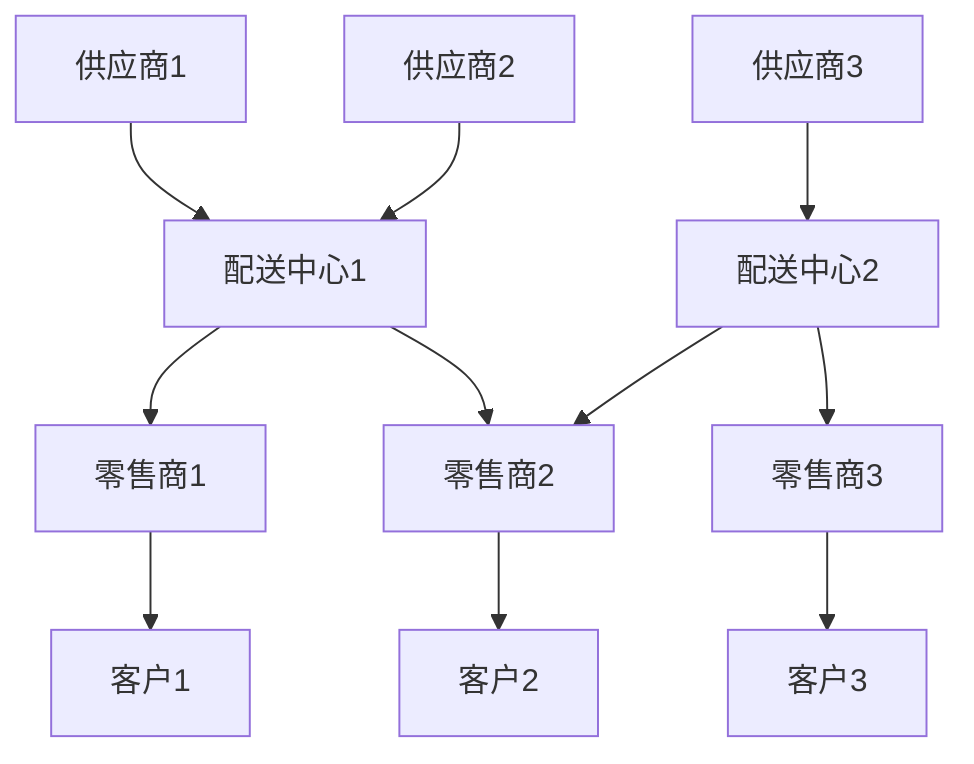

# 8.1 物流供应链模型 / Logistics & Supply Chain Models

## 目录 / Table of Contents

- [8.1 物流供应链模型 / Logistics \& Supply Chain Models](#81-物流供应链模型--logistics--supply-chain-models)
  - [目录 / Table of Contents](#目录--table-of-contents)
  - [8.1.1 模型概述与自洽性 / Model Overview and Self-consistency](#811-模型概述与自洽性--model-overview-and-self-consistency)
    - [物流供应链定义 / Logistics \& Supply Chain Definition](#物流供应链定义--logistics--supply-chain-definition)
    - [自洽性公理体系 / Self-consistency Axiom System](#自洽性公理体系--self-consistency-axiom-system)
    - [核心组件 / Core Components](#核心组件--core-components)
  - [8.1.2 库存管理模型 / Inventory Management Models](#812-库存管理模型--inventory-management-models)
    - [经济订货量模型 (EOQ) / Economic Order Quantity Model](#经济订货量模型-eoq--economic-order-quantity-model)
    - [随机库存模型 / Stochastic Inventory Models](#随机库存模型--stochastic-inventory-models)
    - [多级库存模型 / Multi-echelon Inventory Models](#多级库存模型--multi-echelon-inventory-models)
  - [8.1.3 运输优化模型 / Transportation Optimization Models](#813-运输优化模型--transportation-optimization-models)
    - [车辆路径问题 (VRP) / Vehicle Routing Problem](#车辆路径问题-vrp--vehicle-routing-problem)
    - [网络流模型 / Network Flow Models](#网络流模型--network-flow-models)
  - [8.1.4 需求预测模型 / Demand Forecasting Models](#814-需求预测模型--demand-forecasting-models)
    - [时间序列模型 / Time Series Models](#时间序列模型--time-series-models)
    - [机器学习预测模型 / Machine Learning Forecasting Models](#机器学习预测模型--machine-learning-forecasting-models)
  - [8.1.5 供应链网络模型 / Supply Chain Network Models](#815-供应链网络模型--supply-chain-network-models)
    - [网络结构 / Network Structure](#网络结构--network-structure)
    - [网络优化模型 / Network Optimization Model](#网络优化模型--network-optimization-model)
  - [8.1.6 续洽性：与相关模型的关系 / Continuity: Relationships with Related Models](#816-续洽性与相关模型的关系--continuity-relationships-with-related-models)
    - [与经济学模型的关系 / Relationship with Economic Models](#与经济学模型的关系--relationship-with-economic-models)
    - [与优化模型的关系 / Relationship with Optimization Models](#与优化模型的关系--relationship-with-optimization-models)
    - [与概率统计模型的关系 / Relationship with Probability Models](#与概率统计模型的关系--relationship-with-probability-models)
  - [8.1.7 它洽性：跨行业应用 / External Consistency: Cross-industry Applications](#817-它洽性跨行业应用--external-consistency-cross-industry-applications)
    - [在制造业中的应用 / Application in Manufacturing](#在制造业中的应用--application-in-manufacturing)
    - [在零售业中的应用 / Application in Retail](#在零售业中的应用--application-in-retail)
    - [在电子商务中的应用 / Application in E-commerce](#在电子商务中的应用--application-in-e-commerce)
  - [8.1.8 统一框架与实现 / Unified Framework and Implementation](#818-统一框架与实现--unified-framework-and-implementation)
    - [Rust实现示例 / Rust Implementation Example](#rust实现示例--rust-implementation-example)
    - [Haskell实现示例 / Haskell Implementation Example](#haskell实现示例--haskell-implementation-example)
  - [参考文献 / References](#参考文献--references)

---

## 8.1.1 模型概述与自洽性 / Model Overview and Self-consistency

### 物流供应链定义 / Logistics & Supply Chain Definition

**物流供应链 (Logistics & Supply Chain)** 是一个复杂的网络系统，包含从原材料采购到最终产品交付的完整流程。

### 自洽性公理体系 / Self-consistency Axiom System

**A1 (流量守恒)**: $\sum_{i} I_i = \sum_{j} O_j$ (输入等于输出)

**A2 (时间一致性)**: $T_{total} = \sum_{k} T_k$ (总时间等于各环节时间之和)

**A3 (成本可加性)**: $C_{total} = \sum_{l} C_l$ (总成本等于各环节成本之和)

**A4 (容量约束)**: $\forall i, Q_i \leq Q_{max,i}$ (各环节容量不超过最大值)

### 核心组件 / Core Components

$$\mathcal{SC} = \langle \mathcal{S}, \mathcal{T}, \mathcal{I}, \mathcal{O}, \mathcal{C}, \mathcal{R} \rangle$$

其中：

- $\mathcal{S}$: 供应商集合
- $\mathcal{T}$: 运输商集合
- $\mathcal{I}$: 库存节点集合
- $\mathcal{O}$: 订单集合
- $\mathcal{C}$: 成本函数集合
- $\mathcal{R}$: 关系集合

---

## 8.1.2 库存管理模型 / Inventory Management Models

### 经济订货量模型 (EOQ) / Economic Order Quantity Model

**目标函数**: 最小化总成本

$$\min TC = \frac{D}{Q} \cdot S + \frac{Q}{2} \cdot H$$

**最优订货量**:

$$Q^* = \sqrt{\frac{2DS}{H}}$$

其中：

- $D$: 年需求量
- $S$: 订货成本
- $H$: 单位库存持有成本
- $Q$: 订货量

### 随机库存模型 / Stochastic Inventory Models

**安全库存计算**:

$$SS = z \cdot \sigma_L \cdot \sqrt{L}$$

其中：

- $z$: 服务水平对应的标准正态分位数
- $\sigma_L$: 提前期需求标准差
- $L$: 提前期

### 多级库存模型 / Multi-echelon Inventory Models

**级联效应**:

$$\sigma_i^2 = \sigma_{i-1}^2 + \sigma_i^2$$

其中 $\sigma_i$ 是第 $i$ 级的需求标准差。

---

## 8.1.3 运输优化模型 / Transportation Optimization Models

### 车辆路径问题 (VRP) / Vehicle Routing Problem

**目标函数**:

$$\min \sum_{i,j,k} c_{ij} x_{ijk}$$

**约束条件**:

$$\sum_{j} x_{ijk} = 1, \quad \forall k$$

$$\sum_{i} d_i y_{ik} \leq Q_k, \quad \forall k$$

其中：

- $c_{ij}$: 从节点 $i$ 到节点 $j$ 的成本
- $x_{ijk}$: 车辆 $k$ 是否从 $i$ 到 $j$
- $d_i$: 节点 $i$ 的需求量
- $Q_k$: 车辆 $k$ 的容量

### 网络流模型 / Network Flow Models

**最大流最小割定理**:

$$\max f = \min \sum_{(i,j) \in C} c_{ij}$$

其中 $C$ 是网络的最小割集。

---

## 8.1.4 需求预测模型 / Demand Forecasting Models

### 时间序列模型 / Time Series Models

**ARIMA模型**:

$$\phi(B)(1-B)^d y_t = \theta(B)\epsilon_t$$

其中：

- $\phi(B)$: 自回归多项式
- $\theta(B)$: 移动平均多项式
- $d$: 差分次数

### 机器学习预测模型 / Machine Learning Forecasting Models

**LSTM网络**:

$$f_t = \sigma(W_f \cdot [h_{t-1}, x_t] + b_f)$$

$$i_t = \sigma(W_i \cdot [h_{t-1}, x_t] + b_i)$$

$$C_t = f_t \odot C_{t-1} + i_t \odot \tanh(W_C \cdot [h_{t-1}, x_t] + b_C)$$

---

## 8.1.5 供应链网络模型 / Supply Chain Network Models

### 网络结构 / Network Structure



### 网络优化模型 / Network Optimization Model

**目标函数**:

$$\min \sum_{i,j} c_{ij} x_{ij} + \sum_{k} f_k y_k$$

**约束条件**:

$$\sum_{j} x_{ij} \leq s_i, \quad \forall i$$

$$\sum_{i} x_{ij} = d_j, \quad \forall j$$

其中：

- $c_{ij}$: 运输成本
- $f_k$: 固定设施成本
- $s_i$: 供应能力
- $d_j$: 需求量

---

## 8.1.6 续洽性：与相关模型的关系 / Continuity: Relationships with Related Models

### 与经济学模型的关系 / Relationship with Economic Models

**供需平衡**:

$$Q_s = f(P, C_s)$$

$$Q_d = g(P, I)$$

$$Q_s = Q_d$$

其中：

- $Q_s$: 供应量
- $Q_d$: 需求量
- $P$: 价格
- $C_s$: 供应成本
- $I$: 收入

### 与优化模型的关系 / Relationship with Optimization Models

**线性规划模型**:

$$\min c^T x$$

$$s.t. \quad Ax \leq b$$

$$x \geq 0$$

### 与概率统计模型的关系 / Relationship with Probability Models

**风险度量**:

$$VaR_\alpha = \inf\{l \in \mathbb{R}: P(L > l) \leq 1-\alpha\}$$

其中 $L$ 是损失随机变量。

---

## 8.1.7 它洽性：跨行业应用 / External Consistency: Cross-industry Applications

### 在制造业中的应用 / Application in Manufacturing

**JIT生产模型**:

$$T_{cycle} = \sum_{i} T_i$$

$$Q_{kanban} = \frac{D \cdot L}{N}$$

其中：

- $T_{cycle}$: 生产周期时间
- $Q_{kanban}$: 看板数量
- $D$: 日需求量
- $L$: 提前期
- $N$: 容器数量

### 在零售业中的应用 / Application in Retail

**库存周转率**:

$$ITR = \frac{COGS}{Average\ Inventory}$$

**服务水平**:

$$SL = \frac{Demand\ Filled}{Total\ Demand}$$

### 在电子商务中的应用 / Application in E-commerce

**订单履行时间**:

$$T_{fulfillment} = T_{processing} + T_{picking} + T_{packing} + T_{shipping}$$

---

## 8.1.8 统一框架与实现 / Unified Framework and Implementation

### Rust实现示例 / Rust Implementation Example

```rust
use std::collections::HashMap;

#[derive(Debug, Clone)]
pub struct SupplyChainNode {
    pub id: String,
    pub capacity: f64,
    pub cost: f64,
    pub inventory: f64,
}

#[derive(Debug)]
pub struct SupplyChainNetwork {
    pub nodes: HashMap<String, SupplyChainNode>,
    pub connections: Vec<(String, String, f64)>, // (from, to, cost)
}

impl SupplyChainNetwork {
    pub fn new() -> Self {
        Self {
            nodes: HashMap::new(),
            connections: Vec::new(),
        }
    }
    
    pub fn add_node(&mut self, node: SupplyChainNode) {
        self.nodes.insert(node.id.clone(), node);
    }
    
    pub fn add_connection(&mut self, from: String, to: String, cost: f64) {
        self.connections.push((from, to, cost));
    }
    
    pub fn optimize_inventory(&self) -> HashMap<String, f64> {
        // EOQ优化算法实现
        let mut optimal_quantities = HashMap::new();
        
        for (id, node) in &self.nodes {
            let demand = 1000.0; // 假设年需求量
            let setup_cost = node.cost;
            let holding_cost = node.cost * 0.2; // 假设持有成本率20%
            
            let eoq = (2.0 * demand * setup_cost / holding_cost).sqrt();
            optimal_quantities.insert(id.clone(), eoq);
        }
        
        optimal_quantities
    }
    
    pub fn calculate_total_cost(&self) -> f64 {
        let mut total_cost = 0.0;
        
        for node in self.nodes.values() {
            total_cost += node.inventory * node.cost * 0.2; // 库存持有成本
        }
        
        for (_, _, cost) in &self.connections {
            total_cost += cost; // 运输成本
        }
        
        total_cost
    }
}

// 使用示例
fn main() {
    let mut network = SupplyChainNetwork::new();
    
    // 添加供应商
    network.add_node(SupplyChainNode {
        id: "supplier1".to_string(),
        capacity: 1000.0,
        cost: 10.0,
        inventory: 500.0,
    });
    
    // 添加配送中心
    network.add_node(SupplyChainNode {
        id: "dc1".to_string(),
        capacity: 800.0,
        cost: 15.0,
        inventory: 300.0,
    });
    
    // 添加连接
    network.add_connection("supplier1".to_string(), "dc1".to_string(), 5.0);
    
    // 优化库存
    let optimal_quantities = network.optimize_inventory();
    println!("Optimal quantities: {:?}", optimal_quantities);
    
    // 计算总成本
    let total_cost = network.calculate_total_cost();
    println!("Total cost: {}", total_cost);
}
```

### Haskell实现示例 / Haskell Implementation Example

```haskell
module SupplyChain where

import Data.Map (Map)
import qualified Data.Map as Map
import Data.List (minimumBy)
import Data.Ord (comparing)

-- 数据类型定义
data Node = Node {
    nodeId :: String,
    capacity :: Double,
    cost :: Double,
    inventory :: Double
} deriving (Show, Eq)

data Connection = Connection {
    from :: String,
    to :: String,
    cost :: Double
} deriving (Show, Eq)

data SupplyChainNetwork = SupplyChainNetwork {
    nodes :: Map String Node,
    connections :: [Connection]
} deriving (Show)

-- 创建空网络
emptyNetwork :: SupplyChainNetwork
emptyNetwork = SupplyChainNetwork Map.empty []

-- 添加节点
addNode :: Node -> SupplyChainNetwork -> SupplyChainNetwork
addNode node network = network { nodes = Map.insert (nodeId node) node (nodes network) }

-- 添加连接
addConnection :: Connection -> SupplyChainNetwork -> SupplyChainNetwork
addConnection conn network = network { connections = conn : connections network }

-- EOQ计算
calculateEOQ :: Double -> Double -> Double -> Double
calculateEOQ demand setupCost holdingCost = sqrt (2 * demand * setupCost / holdingCost)

-- 优化库存
optimizeInventory :: SupplyChainNetwork -> Map String Double
optimizeInventory network = Map.mapWithKey optimizeNode (nodes network)
  where
    optimizeNode id node = calculateEOQ demand setupCost holdingCost
      where
        demand = 1000.0  -- 假设年需求量
        setupCost = cost node
        holdingCost = cost node * 0.2  -- 假设持有成本率20%

-- 计算总成本
calculateTotalCost :: SupplyChainNetwork -> Double
calculateTotalCost network = inventoryCost + transportationCost
  where
    inventoryCost = sum [inventory node * cost node * 0.2 | node <- Map.elems (nodes network)]
    transportationCost = sum [cost conn | conn <- connections network]

-- 示例使用
example :: IO ()
example = do
    let supplier1 = Node "supplier1" 1000.0 10.0 500.0
        dc1 = Node "dc1" 800.0 15.0 300.0
        conn1 = Connection "supplier1" "dc1" 5.0
        
        network = addConnection conn1 
                $ addNode dc1 
                $ addNode supplier1 emptyNetwork
        
        optimalQuantities = optimizeInventory network
        totalCost = calculateTotalCost network
    
    putStrLn $ "Optimal quantities: " ++ show optimalQuantities
    putStrLn $ "Total cost: " ++ show totalCost
```

---

## 参考文献 / References

1. Chopra, S., & Meindl, P. (2016). Supply Chain Management: Strategy, Planning, and Operation. Pearson.
2. Harris, F. W. (1913). How many parts to make at once. Factory, The Magazine of Management.
3. Tersine, R. J. (1994). Principles of Inventory and Materials Management. Prentice Hall.
4. Ballou, R. H. (2004). Business Logistics/Supply Chain Management. Pearson.

---

*最后更新: 2025-08-01*
*版本: 1.0.0*
