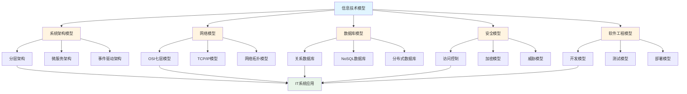
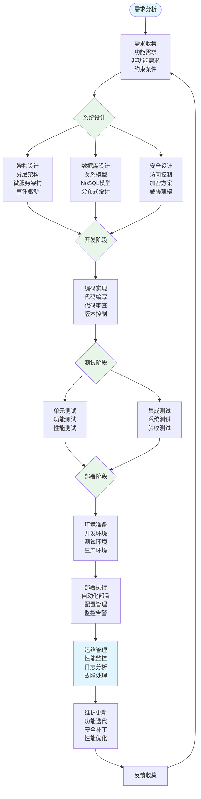

# 8.4 信息技术模型 / Information Technology Models

> 交叉引用 / Cross-References
>
> - 章节大纲: [content/CHAPTER_09_OUTLINE.md 9.4](../../../content/CHAPTER_09_OUTLINE.md#94-信息技术模型--information-technology-models)
> - 全局索引: [docs/GLOBAL_INDEX.md](../../GLOBAL_INDEX.md)
> - 实现映射: [docs/09-实现示例/INDUSTRY_IMPLEMENTATION_MAPPING.md](../../09-实现示例/INDUSTRY_IMPLEMENTATION_MAPPING.md)
> - 评测协议标准: [docs/EVALUATION_PROTOCOLS_STANDARDS.md](../../EVALUATION_PROTOCOLS_STANDARDS.md)

## 目录 / Table of Contents

- [8.4 信息技术模型 / Information Technology Models](#84-信息技术模型--information-technology-models)
  - [目录 / Table of Contents](#目录--table-of-contents)
  - [信息技术模型框架图 / Framework Diagram of Information Technology Models](#信息技术模型框架图--framework-diagram-of-information-technology-models)
  - [信息技术系统开发流程图 / Flowchart of IT System Development](#信息技术系统开发流程图--flowchart-of-it-system-development)
  - [8.4.1 系统架构模型 / System Architecture Models](#841-系统架构模型--system-architecture-models)
    - [分层架构 / Layered Architecture](#分层架构--layered-architecture)
    - [微服务架构 / Microservices Architecture](#微服务架构--microservices-architecture)
    - [事件驱动架构 / Event-Driven Architecture](#事件驱动架构--event-driven-architecture)
  - [8.4.2 网络模型 / Network Models](#842-网络模型--network-models)
    - [OSI七层模型 / OSI Seven-Layer Model](#osi七层模型--osi-seven-layer-model)
    - [TCP/IP模型 / TCP/IP Model](#tcpip模型--tcpip-model)
    - [网络拓扑模型 / Network Topology Models](#网络拓扑模型--network-topology-models)
  - [8.4.3 数据库模型 / Database Models](#843-数据库模型--database-models)
    - [关系数据库模型 / Relational Database Models](#关系数据库模型--relational-database-models)
    - [NoSQL数据库模型 / NoSQL Database Models](#nosql数据库模型--nosql-database-models)
    - [分布式数据库模型 / Distributed Database Models](#分布式数据库模型--distributed-database-models)
  - [8.4.4 安全模型 / Security Models](#844-安全模型--security-models)
    - [访问控制模型 / Access Control Models](#访问控制模型--access-control-models)
    - [加密模型 / Encryption Models](#加密模型--encryption-models)
    - [威胁模型 / Threat Models](#威胁模型--threat-models)
  - [8.4.5 软件工程模型 / Software Engineering Models](#845-软件工程模型--software-engineering-models)
    - [开发模型 / Development Models](#开发模型--development-models)
    - [测试模型 / Testing Models](#测试模型--testing-models)
    - [部署模型 / Deployment Models](#部署模型--deployment-models)
  - [8.4.6 实现与应用 / Implementation and Applications](#846-实现与应用--implementation-and-applications)
    - [Rust实现示例 / Rust Implementation Example](#rust实现示例--rust-implementation-example)
    - [Python实现示例 / Python Implementation Example](#python实现示例--python-implementation-example)
    - [Julia实现示例 / Julia Implementation Example](#julia实现示例--julia-implementation-example)
  - [参考文献 / References](#参考文献--references)
  - [评测协议与指标 / Evaluation Protocols \& Metrics](#评测协议与指标--evaluation-protocols--metrics)
    - [范围与目标 / Scope \& Goals](#范围与目标--scope--goals)
    - [数据与划分 / Data \& Splits](#数据与划分--data--splits)
    - [通用指标 / Common Metrics](#通用指标--common-metrics)
    - [任务级协议 / Task-level Protocols](#任务级协议--task-level-protocols)
    - [复现实操 / Reproducibility](#复现实操--reproducibility)
  - [8.4.7 算法实现 / Algorithm Implementation](#847-算法实现--algorithm-implementation)
    - [系统架构算法 / System Architecture Algorithms](#系统架构算法--system-architecture-algorithms)
  - [相关模型 / Related Models](#相关模型--related-models)
    - [行业应用模型 / Industry Application Models](#行业应用模型--industry-application-models)
    - [工程科学模型 / Engineering Science Models](#工程科学模型--engineering-science-models)
    - [计算机科学模型 / Computer Science Models](#计算机科学模型--computer-science-models)
    - [数学科学模型 / Mathematical Science Models](#数学科学模型--mathematical-science-models)
    - [基础理论 / Basic Theory](#基础理论--basic-theory)

---

## 信息技术模型框架图 / Framework Diagram of Information Technology Models



## 信息技术系统开发流程图 / Flowchart of IT System Development



## 8.4.1 系统架构模型 / System Architecture Models

### 分层架构 / Layered Architecture

**分层架构定义**: 将系统按功能划分为多个层次，每层只与相邻层交互

**数学表示**:

- 层间接口: $I_{i,j} = \{f: L_i \rightarrow L_j\}$
- 层内功能: $F_i = \{f_1, f_2, ..., f_n\}$
- 系统整体: $S = \bigcup_{i=1}^n L_i$

**分层原则**:

1. **单一职责**: 每层只负责特定功能
2. **依赖关系**: 上层依赖下层，下层不依赖上层
3. **接口稳定**: 层间接口保持稳定

### 微服务架构 / Microservices Architecture

**服务定义**: $S = \{s_1, s_2, ..., s_n\}$

**服务间通信**: $C_{i,j} = \{API_{i,j}, Message_{i,j}, Event_{i,j}\}$

**服务发现**: $D(s_i) = \{endpoint_1, endpoint_2, ..., endpoint_m\}$

**负载均衡**: $LB(s_i) = \sum_{j=1}^k w_j \cdot instance_j$

### 事件驱动架构 / Event-Driven Architecture

**事件定义**: $E = \{type, data, timestamp, source\}$

**事件流**: $Stream = \{e_1, e_2, ..., e_n\}$

**事件处理**: $Handler(e) = \{process(e), route(e), store(e)\}$

**事件总线**: $Bus = \{publish(e), subscribe(topic), unsubscribe(topic)\}$

## 8.4.2 网络模型 / Network Models

### OSI七层模型 / OSI Seven-Layer Model

**七层结构**:

1. **物理层**: $P = \{bits, signals, media\}$
2. **数据链路层**: $DL = \{frames, MAC, error_detection\}$
3. **网络层**: $N = \{packets, routing, addressing\}$
4. **传输层**: $T = \{segments, flow_control, error_recovery\}$
5. **会话层**: $S = \{sessions, synchronization, checkpointing\}$
6. **表示层**: $P = \{encoding, encryption, compression\}$
7. **应用层**: $A = \{protocols, services, interfaces\}$

**层间封装**: $Encapsulation(L_i, data) = Header_i + data + Trailer_i$

### TCP/IP模型 / TCP/IP Model

**四层结构**:

1. **网络接口层**: $NI = \{Ethernet, WiFi, cellular\}$
2. **网络层**: $N = \{IP, ICMP, routing\}$
3. **传输层**: $T = \{TCP, UDP, ports\}$
4. **应用层**: $A = \{HTTP, FTP, SMTP, DNS\}$

**TCP连接**: $Connection = \{SYN, SYN-ACK, ACK\}$

**数据包格式**: $Packet = \{Header, Payload, Checksum\}$

### 网络拓扑模型 / Network Topology Models

**星型拓扑**: $Star = \{hub, \{node_1, node_2, ..., node_n\}\}$

**环形拓扑**: $Ring = \{node_1 \rightarrow node_2 \rightarrow ... \rightarrow node_n \rightarrow node_1\}$

**总线拓扑**: $Bus = \{backbone, \{node_1, node_2, ..., node_n\}\}$

**网状拓扑**: $Mesh = \{node_i \leftrightarrow node_j | i,j \in \{1,2,...,n\}\}$

## 8.4.3 数据库模型 / Database Models

### 关系数据库模型 / Relational Database Models

**关系定义**: $R(A_1, A_2, ..., A_n)$

**元组**: $t = (v_1, v_2, ..., v_n) \in R$

**关系代数**:

- 选择: $\sigma_{condition}(R)$
- 投影: $\pi_{attributes}(R)$
- 连接: $R \bowtie_{condition} S$
- 并集: $R \cup S$
- 交集: $R \cap S$
- 差集: $R - S$

**函数依赖**: $X \rightarrow Y$ 当且仅当 $\forall t_1, t_2 \in R: t_1[X] = t_2[X] \Rightarrow t_1[Y] = t_2[Y]$

**范式**:

- 1NF: 原子性
- 2NF: 消除部分依赖
- 3NF: 消除传递依赖
- BCNF: Boyce-Codd范式

### NoSQL数据库模型 / NoSQL Database Models

**键值存储**: $KV = \{key \rightarrow value\}$

**文档存储**: $Document = \{_id, \{field_1: value_1, field_2: value_2, ...\}\}$

**列族存储**: $ColumnFamily = \{row_key, \{column_family: \{column: value\}\}\}$

**图数据库**: $Graph = \{V, E\}$ 其中 $V$ 是顶点集，$E$ 是边集

### 分布式数据库模型 / Distributed Database Models

**CAP定理**: 一致性(Consistency)、可用性(Availability)、分区容错性(Partition tolerance)三者不可兼得

**一致性模型**:

- 强一致性: $C = \{read = write\}$
- 最终一致性: $C = \{read \rightarrow write\}$
- 因果一致性: $C = \{causal \rightarrow total\}$

**分布式事务**: $Transaction = \{2PC, 3PC, Paxos, Raft\}$

## 8.4.4 安全模型 / Security Models

### 访问控制模型 / Access Control Models

**DAC模型**: $Access(user, object) = \{read, write, execute\}$

**MAC模型**: $Security_Level(subject) \geq Security_Level(object)$

**RBAC模型**: $Permission = \{role, object, action\}$

**ABAC模型**: $Access = f(subject, object, action, environment)$

### 加密模型 / Encryption Models

**对称加密**: $C = E_k(P), P = D_k(C)$

**非对称加密**: $C = E_{pk}(P), P = D_{sk}(C)$

**哈希函数**: $H(m) = h$ 满足单向性和抗碰撞性

**数字签名**: $Sign(m, sk) = \sigma, Verify(m, \sigma, pk) = \{true, false\}$

### 威胁模型 / Threat Models

**STRIDE模型**:

- 欺骗(Spoofing): $S = \{identity_theft, session_hijacking\}$
- 篡改(Tampering): $T = \{data_modification, code_injection\}$
- 否认(Repudiation): $R = \{log_deletion, audit_bypass\}$
- 信息泄露(Information Disclosure): $I = \{data_exposure, privilege_escalation\}$
- 拒绝服务(Denial of Service): $D = \{resource_exhaustion, service_disruption\}$
- 权限提升(Elevation of Privilege): $E = \{privilege_escalation, code_execution\}$

## 8.4.5 软件工程模型 / Software Engineering Models

### 开发模型 / Development Models

**瀑布模型**: $Waterfall = \{Requirements \rightarrow Design \rightarrow Implementation \rightarrow Testing \rightarrow Deployment\}$

**敏捷模型**: $Agile = \{Sprint_1, Sprint_2, ..., Sprint_n\}$

**螺旋模型**: $Spiral = \{Risk_Analysis \rightarrow Development \rightarrow Testing \rightarrow Planning\}$

**DevOps模型**: $DevOps = \{Plan \rightarrow Code \rightarrow Build \rightarrow Test \rightarrow Deploy \rightarrow Operate \rightarrow Monitor\}$

### 测试模型 / Testing Models

**测试金字塔**: $Pyramid = \{Unit_{70\%}, Integration_{20\%}, E2E_{10\%}\}$

**测试覆盖率**: $Coverage = \frac{executed\_lines}{total\_lines} \times 100\%$

**缺陷密度**: $Defect\_Density = \frac{defects}{KLOC}$

### 部署模型 / Deployment Models

**蓝绿部署**: $BlueGreen = \{Blue_{active}, Green_{standby}\}$

**金丝雀部署**: $Canary = \{Canary_{10\%}, Production_{90\%}\}$

**滚动部署**: $Rolling = \{Instance_1, Instance_2, ..., Instance_n\}$

## 8.4.6 实现与应用 / Implementation and Applications

### Rust实现示例 / Rust Implementation Example

```rust
use std::collections::HashMap;
use std::sync::{Arc, Mutex};
use tokio::sync::mpsc;

// 微服务架构实现
#[derive(Clone)]
pub struct Microservice {
    name: String,
    endpoints: HashMap<String, Endpoint>,
    dependencies: Vec<String>,
}

impl Microservice {
    pub fn new(name: String) -> Self {
        Self {
            name,
            endpoints: HashMap::new(),
            dependencies: Vec::new(),
        }
    }

    pub fn add_endpoint(&mut self, path: String, handler: Endpoint) {
        self.endpoints.insert(path, handler);
    }

    pub async fn handle_request(&self, request: Request) -> Response {
        if let Some(endpoint) = self.endpoints.get(&request.path) {
            endpoint.handle(request).await
        } else {
            Response::not_found()
        }
    }
}

// 事件驱动架构实现
#[derive(Debug, Clone)]
pub struct Event {
    pub event_type: String,
    pub data: serde_json::Value,
    pub timestamp: chrono::DateTime<chrono::Utc>,
    pub source: String,
}

pub struct EventBus {
    subscribers: Arc<Mutex<HashMap<String, Vec<mpsc::Sender<Event>>>>>,
}

impl EventBus {
    pub fn new() -> Self {
        Self {
            subscribers: Arc::new(Mutex::new(HashMap::new())),
        }
    }

    pub async fn publish(&self, event: Event) -> Result<(), Box<dyn std::error::Error>> {
        let subscribers = self.subscribers.lock().unwrap();
        if let Some(subs) = subscribers.get(&event.event_type) {
            for sender in subs {
                let _ = sender.send(event.clone()).await;
            }
        }
        Ok(())
    }

    pub async fn subscribe(&self, event_type: String) -> mpsc::Receiver<Event> {
        let (tx, rx) = mpsc::channel(100);
        let mut subscribers = self.subscribers.lock().unwrap();
        subscribers.entry(event_type).or_insert_with(Vec::new).push(tx);
        rx
    }
}

// 数据库模型实现
#[derive(Debug, Clone)]
pub struct Database {
    tables: HashMap<String, Table>,
}

impl Database {
    pub fn new() -> Self {
        Self {
            tables: HashMap::new(),
        }
    }

    pub fn create_table(&mut self, name: String, schema: Schema) -> Result<(), String> {
        let table = Table::new(name.clone(), schema);
        self.tables.insert(name, table);
        Ok(())
    }

    pub fn query(&self, sql: String) -> Result<Vec<Row>, String> {
        // SQL解析和查询执行
        let parsed = self.parse_sql(&sql)?;
        self.execute_query(parsed)
    }
}

// 安全模型实现
pub struct SecurityManager {
    access_control: AccessControl,
    encryption: Encryption,
    audit_log: AuditLog,
}

impl SecurityManager {
    pub fn new() -> Self {
        Self {
            access_control: AccessControl::new(),
            encryption: Encryption::new(),
            audit_log: AuditLog::new(),
        }
    }

    pub fn authenticate(&self, credentials: Credentials) -> Result<Session, AuthError> {
        self.access_control.authenticate(credentials)
    }

    pub fn authorize(&self, session: &Session, resource: &Resource, action: Action) -> bool {
        self.access_control.authorize(session, resource, action)
    }

    pub fn encrypt(&self, data: &[u8]) -> Result<Vec<u8>, EncryptionError> {
        self.encryption.encrypt(data)
    }

    pub fn decrypt(&self, data: &[u8]) -> Result<Vec<u8>, EncryptionError> {
        self.encryption.decrypt(data)
    }
}
```

### Python实现示例 / Python Implementation Example

```python
import asyncio
import json
import hashlib
import hmac
from typing import Dict, List, Optional, Any
from dataclasses import dataclass
from datetime import datetime
import aiohttp
from cryptography.fernet import Fernet

# 系统架构模型
class LayeredArchitecture:
    def __init__(self):
        self.layers = {}
        self.interfaces = {}

    def add_layer(self, name: str, functions: List[str]):
        self.layers[name] = functions

    def add_interface(self, from_layer: str, to_layer: str, interface: Dict):
        key = f"{from_layer}_to_{to_layer}"
        self.interfaces[key] = interface

    def get_layer_functions(self, layer_name: str) -> List[str]:
        return self.layers.get(layer_name, [])

# 微服务架构
@dataclass
class Microservice:
    name: str
    endpoints: Dict[str, callable]
    dependencies: List[str]

    async def handle_request(self, request: Dict) -> Dict:
        endpoint = request.get('endpoint')
        if endpoint in self.endpoints:
            return await self.endpoints[endpoint](request)
        return {'error': 'Endpoint not found'}

class ServiceRegistry:
    def __init__(self):
        self.services = {}

    def register(self, service: Microservice):
        self.services[service.name] = service

    def discover(self, service_name: str) -> Optional[Microservice]:
        return self.services.get(service_name)

# 事件驱动架构
@dataclass
class Event:
    event_type: str
    data: Dict
    timestamp: datetime
    source: str

class EventBus:
    def __init__(self):
        self.subscribers = {}

    async def publish(self, event: Event):
        if event.event_type in self.subscribers:
            for subscriber in self.subscribers[event.event_type]:
                await subscriber(event)

    def subscribe(self, event_type: str, handler: callable):
        if event_type not in self.subscribers:
            self.subscribers[event_type] = []
        self.subscribers[event_type].append(handler)

# 网络模型
class NetworkModel:
    def __init__(self):
        self.layers = {
            'physical': 'Bits and signals',
            'data_link': 'Frames and MAC addresses',
            'network': 'Packets and routing',
            'transport': 'Segments and flow control',
            'session': 'Sessions and synchronization',
            'presentation': 'Encoding and encryption',
            'application': 'Protocols and services'
        }

    def encapsulate(self, data: bytes, layer: str) -> bytes:
        # 模拟数据封装
        header = f"{layer}_header".encode()
        trailer = f"{layer}_trailer".encode()
        return header + data + trailer

    def deencapsulate(self, packet: bytes, layer: str) -> bytes:
        # 模拟数据解封装
        header_len = len(f"{layer}_header".encode())
        trailer_len = len(f"{layer}_trailer".encode())
        return packet[header_len:-trailer_len]

# 数据库模型
class RelationalDatabase:
    def __init__(self):
        self.tables = {}
        self.constraints = {}

    def create_table(self, name: str, schema: Dict):
        self.tables[name] = {
            'schema': schema,
            'data': []
        }

    def insert(self, table: str, row: Dict):
        if table in self.tables:
            self.tables[table]['data'].append(row)

    def select(self, table: str, conditions: Dict = None) -> List[Dict]:
        if table not in self.tables:
            return []

        data = self.tables[table]['data']
        if conditions:
            return [row for row in data if self._match_conditions(row, conditions)]
        return data

    def _match_conditions(self, row: Dict, conditions: Dict) -> bool:
        for key, value in conditions.items():
            if row.get(key) != value:
                return False
        return True

# 安全模型
class SecurityManager:
    def __init__(self):
        self.access_control = AccessControl()
        self.encryption = Encryption()
        self.audit_log = AuditLog()

    def authenticate(self, credentials: Dict) -> bool:
        return self.access_control.authenticate(credentials)

    def authorize(self, user: str, resource: str, action: str) -> bool:
        return self.access_control.authorize(user, resource, action)

    def encrypt(self, data: bytes) -> bytes:
        return self.encryption.encrypt(data)

    def decrypt(self, data: bytes) -> bytes:
        return self.encryption.decrypt(data)

class AccessControl:
    def __init__(self):
        self.users = {}
        self.permissions = {}

    def authenticate(self, credentials: Dict) -> bool:
        username = credentials.get('username')
        password = credentials.get('password')
        return self._verify_credentials(username, password)

    def authorize(self, user: str, resource: str, action: str) -> bool:
        user_permissions = self.permissions.get(user, {})
        resource_permissions = user_permissions.get(resource, [])
        return action in resource_permissions

    def _verify_credentials(self, username: str, password: str) -> bool:
        # 简化的认证逻辑
        return username in self.users and self.users[username] == password

class Encryption:
    def __init__(self):
        self.key = Fernet.generate_key()
        self.cipher = Fernet(self.key)

    def encrypt(self, data: bytes) -> bytes:
        return self.cipher.encrypt(data)

    def decrypt(self, data: bytes) -> bytes:
        return self.cipher.decrypt(data)

class AuditLog:
    def __init__(self):
        self.logs = []

    def log(self, event: str, user: str, details: Dict):
        log_entry = {
            'timestamp': datetime.now(),
            'event': event,
            'user': user,
            'details': details
        }
        self.logs.append(log_entry)

# 软件工程模型
class SoftwareDevelopmentModel:
    def __init__(self, model_type: str):
        self.model_type = model_type
        self.phases = []

    def add_phase(self, phase: str):
        self.phases.append(phase)

    def execute_phase(self, phase: str):
        if phase in self.phases:
            print(f"Executing {phase} phase...")
            # 执行具体阶段逻辑
            return True
        return False

class TestingModel:
    def __init__(self):
        self.test_cases = []
        self.coverage = 0.0

    def add_test_case(self, test_case: Dict):
        self.test_cases.append(test_case)

    def run_tests(self) -> Dict:
        results = {
            'total': len(self.test_cases),
            'passed': 0,
            'failed': 0,
            'coverage': 0.0
        }

        for test_case in self.test_cases:
            if self._execute_test(test_case):
                results['passed'] += 1
            else:
                results['failed'] += 1

        results['coverage'] = self._calculate_coverage()
        return results

    def _execute_test(self, test_case: Dict) -> bool:
        # 简化的测试执行逻辑
        return test_case.get('expected') == test_case.get('actual')

    def _calculate_coverage(self) -> float:
        # 简化的覆盖率计算
        return min(100.0, len(self.test_cases) * 10.0)

# 应用示例
async def main():
    # 创建微服务
    user_service = Microservice(
        name="user-service",
        endpoints={
            "/users": lambda req: {"users": []},
            "/users/{id}": lambda req: {"user": {"id": req.get("id")}}
        },
        dependencies=[]
    )

    # 创建事件总线
    event_bus = EventBus()

    # 订阅事件
    async def user_created_handler(event: Event):
        print(f"User created: {event.data}")

    event_bus.subscribe("user.created", user_created_handler)

    # 发布事件
    event = Event(
        event_type="user.created",
        data={"user_id": "123", "name": "John"},
        timestamp=datetime.now(),
        source="user-service"
    )

    await event_bus.publish(event)

    # 数据库操作
    db = RelationalDatabase()
    db.create_table("users", {
        "id": "INTEGER PRIMARY KEY",
        "name": "TEXT",
        "email": "TEXT"
    })

    db.insert("users", {"id": 1, "name": "John", "email": "john@example.com"})
    users = db.select("users", {"name": "John"})
    print(f"Found users: {users}")

    # 安全测试
    security = SecurityManager()
    credentials = {"username": "admin", "password": "password"}

    if security.authenticate(credentials):
        print("Authentication successful")
        if security.authorize("admin", "users", "read"):
            print("Authorization successful")

    # 测试模型
    testing = TestingModel()
    testing.add_test_case({
        "name": "test_user_creation",
        "expected": True,
        "actual": True
    })

    results = testing.run_tests()
    print(f"Test results: {results}")

if __name__ == "__main__":
    asyncio.run(main())
```

### Julia实现示例 / Julia Implementation Example

```julia
using Dates
using Random

"""
微服务结构体
"""
mutable struct Microservice
    name::String
    endpoints::Dict{String, Function}
    dependencies::Vector{String}

    function Microservice(name::String)
        new(name, Dict{String, Function}(), String[])
    end
end

"""
添加端点
"""
function add_endpoint(service::Microservice, path::String, handler::Function)
    service.endpoints[path] = handler
    return service
end

"""
处理请求
"""
function handle_request(service::Microservice, request::Dict{String, Any})::Dict{String, Any}
    path = get(request, "path", "")
    if haskey(service.endpoints, path)
        return service.endpoints[path](request)
    else
        return Dict("status" => 404, "message" => "Not Found")
    end
end

"""
事件结构体
"""
struct Event
    event_type::String
    data::Dict{String, Any}
    timestamp::DateTime
    source::String
end

"""
事件总线结构体
"""
mutable struct EventBus
    subscribers::Dict{String, Vector{Function}}

    function EventBus()
        new(Dict{String, Vector{Function}}())
    end
end

"""
发布事件
"""
function publish(bus::EventBus, event::Event)
    if haskey(bus.subscribers, event.event_type)
        for handler in bus.subscribers[event.event_type]
            handler(event)
        end
    end
    return bus
end

"""
订阅事件
"""
function subscribe(bus::EventBus, event_type::String, handler::Function)
    if !haskey(bus.subscribers, event_type)
        bus.subscribers[event_type] = Function[]
    end
    push!(bus.subscribers[event_type], handler)
    return bus
end

"""
关系数据库结构体
"""
mutable struct RelationalDatabase
    tables::Dict{String, Vector{Dict{String, Any}}}

    function RelationalDatabase()
        new(Dict{String, Vector{Dict{String, Any}}}())
    end
end

"""
创建表
"""
function create_table(db::RelationalDatabase, table_name::String, schema::Dict{String, String})
    db.tables[table_name] = Dict{String, Any}[]
    return db
end

"""
插入数据
"""
function insert(db::RelationalDatabase, table_name::String, record::Dict{String, Any})
    if haskey(db.tables, table_name)
        push!(db.tables[table_name], record)
    end
    return db
end

"""
查询数据
"""
function select(db::RelationalDatabase, table_name::String,
               conditions::Dict{String, Any} = Dict{String, Any}())::Vector{Dict{String, Any}}
    if !haskey(db.tables, table_name)
        return Dict{String, Any}[]
    end

    results = Dict{String, Any}[]
    for record in db.tables[table_name]
        match = true
        for (key, value) in conditions
            if !haskey(record, key) || record[key] != value
                match = false
                break
            end
        end
        if match
            push!(results, record)
        end
    end

    return results
end

"""
访问控制结构体
"""
mutable struct AccessControl
    users::Dict{String, String}
    permissions::Dict{String, Dict{String, Vector{String}}}

    function AccessControl()
        new(Dict{String, String}(), Dict{String, Dict{String, Vector{String}}}())
    end
end

"""
认证
"""
function authenticate(ac::AccessControl, username::String, password::String)::Bool
    return haskey(ac.users, username) && ac.users[username] == password
end

"""
授权
"""
function authorize(ac::AccessControl, user::String, resource::String, action::String)::Bool
    if !haskey(ac.permissions, user)
        return false
    end

    user_permissions = ac.permissions[user]
    if !haskey(user_permissions, resource)
        return false
    end

    return action in user_permissions[resource]
end

"""
加密模型结构体
"""
mutable struct EncryptionModel
    key::Vector{UInt8}

    function EncryptionModel()
        key = rand(UInt8, 32)  # 简化的密钥生成
        new(key)
    end
end

"""
加密（简化版XOR加密）
"""
function encrypt(enc::EncryptionModel, data::Vector{UInt8})::Vector{UInt8}
    encrypted = Vector{UInt8}()
    key_len = length(enc.key)
    for (i, byte) in enumerate(data)
        push!(encrypted, byte ⊻ enc.key[mod1(i, key_len)])
    end
    return encrypted
end

"""
解密
"""
function decrypt(enc::EncryptionModel, data::Vector{UInt8})::Vector{UInt8}
    return encrypt(enc, data)  # XOR是对称的
end

"""
审计日志结构体
"""
mutable struct AuditLog
    logs::Vector{Dict{String, Any}}

    function AuditLog()
        new(Dict{String, Any}[])
    end
end

"""
记录日志
"""
function log(audit::AuditLog, event::String, user::String, details::Dict{String, Any})
    log_entry = Dict(
        "timestamp" => now(),
        "event" => event,
        "user" => user,
        "details" => details
    )
    push!(audit.logs, log_entry)
    return audit
end

"""
软件开发模型结构体
"""
mutable struct SoftwareDevelopmentModel
    model_type::String
    phases::Vector{String}

    function SoftwareDevelopmentModel(model_type::String)
        new(model_type, String[])
    end
end

"""
添加阶段
"""
function add_phase(model::SoftwareDevelopmentModel, phase::String)
    push!(model.phases, phase)
    return model
end

"""
执行阶段
"""
function execute_phase(model::SoftwareDevelopmentModel, phase::String)::Bool
    if phase in model.phases
        println("Executing $phase phase...")
        return true
    end
    return false
end

"""
测试模型结构体
"""
mutable struct TestingModel
    test_cases::Vector{Dict{String, Any}}
    coverage::Float64

    function TestingModel()
        new(Dict{String, Any}[], 0.0)
    end
end

"""
添加测试用例
"""
function add_test_case(testing::TestingModel, test_case::Dict{String, Any})
    push!(testing.test_cases, test_case)
    return testing
end

"""
运行测试
"""
function run_tests(testing::TestingModel)::Dict{String, Any}
    total = length(testing.test_cases)
    passed = 0
    failed = 0

    for test_case in testing.test_cases
        if execute_test(test_case)
            passed += 1
        else
            failed += 1
        end
    end

    coverage = calculate_coverage(testing)

    return Dict(
        "total" => total,
        "passed" => passed,
        "failed" => failed,
        "coverage" => coverage
    )
end

"""
执行测试
"""
function execute_test(test_case::Dict{String, Any})::Bool
    expected = get(test_case, "expected", nothing)
    actual = get(test_case, "actual", nothing)
    return expected == actual
end

"""
计算覆盖率
"""
function calculate_coverage(testing::TestingModel)::Float64
    return min(100.0, length(testing.test_cases) * 10.0)
end

# 示例：信息技术模型使用
function information_technology_example()
    # 微服务
    user_service = Microservice("user-service")
    add_endpoint(user_service, "/users", req -> Dict("users" => []))
    add_endpoint(user_service, "/users/1", req -> Dict("user" => Dict("id" => 1)))

    request = Dict("path" => "/users/1")
    response = handle_request(user_service, request)
    println("Response: $response")

    # 事件总线
    event_bus = EventBus()
    subscribe(event_bus, "user.created", event -> println("User created: $(event.data)"))

    event = Event("user.created", Dict("user_id" => "123", "name" => "John"),
                  now(), "user-service")
    publish(event_bus, event)

    # 数据库
    db = RelationalDatabase()
    create_table(db, "users", Dict("id" => "INTEGER", "name" => "TEXT", "email" => "TEXT"))
    insert(db, "users", Dict("id" => 1, "name" => "John", "email" => "john@example.com"))

    users = select(db, "users", Dict("name" => "John"))
    println("Found users: $users")

    # 访问控制
    ac = AccessControl()
    ac.users["admin"] = "password123"
    ac.permissions["admin"] = Dict("users" => ["read", "write", "delete"])

    authenticated = authenticate(ac, "admin", "password123")
    authorized = authorize(ac, "admin", "users", "write")
    println("Authenticated: $authenticated, Authorized: $authorized")

    # 加密
    enc = EncryptionModel()
    data = Vector{UInt8}([0x48, 0x65, 0x6c, 0x6c, 0x6f])  # "Hello"
    encrypted = encrypt(enc, data)
    decrypted = decrypt(enc, encrypted)
    println("Encrypted: $encrypted, Decrypted: $decrypted")

    # 审计日志
    audit = AuditLog()
    log(audit, "login", "admin", Dict("ip" => "192.168.1.1"))
    println("Audit logs: $(length(audit.logs))")

    # 软件开发模型
    dev_model = SoftwareDevelopmentModel("waterfall")
    add_phase(dev_model, "Requirements")
    add_phase(dev_model, "Design")
    execute_phase(dev_model, "Requirements")

    # 测试模型
    testing = TestingModel()
    add_test_case(testing, Dict("name" => "test1", "expected" => 10, "actual" => 10))
    add_test_case(testing, Dict("name" => "test2", "expected" => 20, "actual" => 15))

    results = run_tests(testing)
    println("Test results: $results")

    return Dict(
        "response" => response,
        "users_found" => length(users),
        "test_passed" => results["passed"]
    )
end
```

## 参考文献 / References

1. Bass, L., Clements, P., & Kazman, R. (2012). Software Architecture in Practice. Addison-Wesley.
2. Fowler, M. (2018). Microservices Patterns. Manning Publications.
3. Hohpe, G., & Woolf, B. (2003). Enterprise Integration Patterns. Addison-Wesley.
4. Tanenbaum, A. S., & Wetherall, D. J. (2021). Computer Networks. Pearson.
5. Silberschatz, A., Korth, H. F., & Sudarshan, S. (2019). Database System Concepts. McGraw-Hill.
6. Stallings, W. (2017). Cryptography and Network Security. Pearson.
7. Sommerville, I. (2015). Software Engineering. Pearson.
8. Martin, R. C. (2017). Clean Architecture. Prentice Hall.
9. Evans, E. (2003). Domain-Driven Design. Addison-Wesley.
10. Hunt, A., & Thomas, D. (1999). The Pragmatic Programmer. Addison-Wesley.

---

## 评测协议与指标 / Evaluation Protocols & Metrics

### 范围与目标 / Scope & Goals

- 覆盖软件架构、网络性能、数据库优化、安全防护的核心评测场景。
- 可复现实证：同一数据、同一协议下，模型实现结果可对比。

### 数据与划分 / Data & Splits

- 系统数据：性能指标、日志记录、网络流量、安全事件、用户行为。
- 划分：训练(60%) / 验证(20%) / 测试(20%)，按时间顺序滚动划窗。

### 通用指标 / Common Metrics

- 性能指标：响应时间、吞吐量、并发数、资源利用率、延迟分布。
- 可靠性指标：可用性、故障率、恢复时间、数据一致性、容错能力。
- 安全指标：漏洞检测率、攻击防护率、加密强度、访问控制有效性。
- 可维护性：代码质量、测试覆盖率、文档完整性、重构安全性。

### 任务级协议 / Task-level Protocols

1) 软件架构评估：模块耦合度、内聚性、可扩展性、性能瓶颈识别。
2) 网络性能测试：带宽利用率、丢包率、延迟抖动、QoS保证。
3) 数据库优化：查询性能、索引效率、事务处理、数据完整性。
4) 安全防护：威胁检测、入侵防护、数据加密、身份认证。

### 复现实操 / Reproducibility

- 提供数据schema、预处理与评测脚本；固定随机种子与版本。
- 输出：指标汇总表、性能-资源权衡曲线、安全态势图、架构可视化。

---

*最后更新: 2025-01-XX*
*版本: 1.2.0*
*状态: 核心功能已完成 / Status: Core Features Completed*

---

## 8.4.7 算法实现 / Algorithm Implementation

### 系统架构算法 / System Architecture Algorithms

```python
from typing import Dict, List, Any, Callable, Optional
import asyncio
import hashlib
import json
import time
from dataclasses import dataclass
from enum import Enum

@dataclass
class Layer:
    """分层架构中的层"""
    name: str
    functions: List[str]
    interfaces: Dict[str, Callable]
    dependencies: List[str]

class LayeredArchitecture:
    """分层架构实现"""

    def __init__(self):
        self.layers: Dict[str, Layer] = {}
        self.layer_order: List[str] = []

    def add_layer(self, layer: Layer) -> None:
        """添加层"""
        self.layers[layer.name] = layer
        self.layer_order.append(layer.name)

    def get_layer_interface(self, layer_name: str, interface_name: str) -> Optional[Callable]:
        """获取层接口"""
        if layer_name in self.layers:
            return self.layers[layer_name].interfaces.get(interface_name)
        return None

    def execute_through_layers(self, request: Dict[str, Any]) -> Dict[str, Any]:
        """通过层执行请求"""
        result = request
        for layer_name in self.layer_order:
            layer = self.layers[layer_name]
            if 'process' in layer.interfaces:
                result = layer.interfaces['process'](result)
        return result

class Microservice:
    """微服务实现"""

    def __init__(self, name: str, endpoints: Dict[str, Callable],
                 dependencies: List[str]):
        self.name = name
        self.endpoints = endpoints
        self.dependencies = dependencies
        self.health_status = "healthy"
        self.load = 0.0

    def handle_request(self, endpoint: str, data: Dict[str, Any]) -> Dict[str, Any]:
        """处理请求"""
        if endpoint in self.endpoints:
            self.load += 0.1
            return self.endpoints[endpoint](data)
        return {"error": "Endpoint not found"}

    def get_health_status(self) -> Dict[str, Any]:
        """获取健康状态"""
        return {
            "service": self.name,
            "status": self.health_status,
            "load": self.load,
            "dependencies": self.dependencies
        }

class ServiceRegistry:
    """服务注册中心"""

    def __init__(self):
        self.services: Dict[str, Microservice] = {}

    def register_service(self, service: Microservice) -> None:
        """注册服务"""
        self.services[service.name] = service

    def discover_service(self, service_name: str) -> Optional[Microservice]:
        """发现服务"""
        return self.services.get(service_name)

    def get_service_instances(self, service_name: str) -> List[Microservice]:
        """获取服务实例"""
        return [s for s in self.services.values() if s.name == service_name]

class LoadBalancer:
    """负载均衡器"""

    def __init__(self, algorithm: str = "round_robin"):
        self.algorithm = algorithm
        self.current_index = 0

    def select_instance(self, instances: List[Microservice]) -> Optional[Microservice]:
        """选择实例"""
        if not instances:
            return None

        if self.algorithm == "round_robin":
            instance = instances[self.current_index % len(instances)]
            self.current_index += 1
            return instance
        elif self.algorithm == "least_loaded":
            return min(instances, key=lambda x: x.load)
        elif self.algorithm == "random":
            import random
            return random.choice(instances)
        return instances[0]

@dataclass
class Event:
    """事件定义"""
    event_type: str
    data: Dict[str, Any]
    timestamp: float
    source: str
    id: str = ""

class EventBus:
    """事件总线"""

    def __init__(self):
        self.subscribers: Dict[str, List[Callable]] = {}
        self.event_history: List[Event] = []

    def subscribe(self, event_type: str, handler: Callable) -> None:
        """订阅事件"""
        if event_type not in self.subscribers:
            self.subscribers[event_type] = []
        self.subscribers[event_type].append(handler)

    def unsubscribe(self, event_type: str, handler: Callable) -> None:
        """取消订阅"""
        if event_type in self.subscribers:
            self.subscribers[event_type].remove(handler)

    async def publish(self, event: Event) -> None:
        """发布事件"""
        event.id = hashlib.md5(f"{event.event_type}{event.timestamp}".encode()).hexdigest()
        self.event_history.append(event)

        if event.event_type in self.subscribers:
            for handler in self.subscribers[event.event_type]:
                try:
                    await handler(event)
                except Exception as e:
                    print(f"Error handling event {event.id}: {e}")

### 网络算法 / Network Algorithms

class NetworkProtocol:
    """网络协议基类"""

    def __init__(self, name: str, layer: int):
        self.name = name
        self.layer = layer
        self.packet_size = 1024

    def create_packet(self, data: bytes, source: str, destination: str) -> Dict[str, Any]:
        """创建数据包"""
        return {
            "header": {
                "protocol": self.name,
                "source": source,
                "destination": destination,
                "timestamp": time.time(),
                "sequence": 0
            },
            "payload": data,
            "checksum": self.calculate_checksum(data)
        }

    def calculate_checksum(self, data: bytes) -> int:
        """计算校验和"""
        checksum = 0
        for byte in data:
            checksum = (checksum + byte) & 0xFFFF
        return checksum

    def verify_packet(self, packet: Dict[str, Any]) -> bool:
        """验证数据包"""
        return packet["checksum"] == self.calculate_checksum(packet["payload"])

class TCPProtocol(NetworkProtocol):
    """TCP协议实现"""

    def __init__(self):
        super().__init__("TCP", 4)
        self.connections: Dict[str, Dict[str, Any]] = {}

    def establish_connection(self, source: str, destination: str) -> str:
        """建立连接"""
        connection_id = f"{source}:{destination}"
        self.connections[connection_id] = {
            "state": "ESTABLISHED",
            "sequence": 0,
            "acknowledgment": 0,
            "window_size": 65535
        }
        return connection_id

    def send_data(self, connection_id: str, data: bytes) -> Dict[str, Any]:
        """发送数据"""
        if connection_id not in self.connections:
            raise ValueError("Connection not established")

        conn = self.connections[connection_id]
        packet = self.create_packet(data, connection_id.split(":")[0], connection_id.split(":")[1])
        packet["header"]["sequence"] = conn["sequence"]
        conn["sequence"] += len(data)

        return packet

class RoutingTable:
    """路由表"""

    def __init__(self):
        self.routes: Dict[str, Dict[str, Any]] = {}

    def add_route(self, destination: str, next_hop: str, cost: int) -> None:
        """添加路由"""
        self.routes[destination] = {
            "next_hop": next_hop,
            "cost": cost,
            "timestamp": time.time()
        }

    def get_route(self, destination: str) -> Optional[Dict[str, Any]]:
        """获取路由"""
        return self.routes.get(destination)

    def remove_route(self, destination: str) -> None:
        """删除路由"""
        if destination in self.routes:
            del self.routes[destination]

### 数据库算法 / Database Algorithms

class RelationalDatabase:
    """关系数据库实现"""

    def __init__(self):
        self.tables: Dict[str, Dict[str, Any]] = {}
        self.indexes: Dict[str, Dict[str, List[int]]] = {}

    def create_table(self, table_name: str, schema: Dict[str, str]) -> None:
        """创建表"""
        self.tables[table_name] = {
            "schema": schema,
            "data": [],
            "next_id": 1
        }
        self.indexes[table_name] = {}

    def create_index(self, table_name: str, column: str) -> None:
        """创建索引"""
        if table_name not in self.tables:
            raise ValueError("Table does not exist")

        self.indexes[table_name][column] = {}
        table_data = self.tables[table_name]["data"]

        for i, row in enumerate(table_data):
            value = row.get(column)
            if value not in self.indexes[table_name][column]:
                self.indexes[table_name][column][value] = []
            self.indexes[table_name][column][value].append(i)

    def insert(self, table_name: str, data: Dict[str, Any]) -> int:
        """插入数据"""
        if table_name not in self.tables:
            raise ValueError("Table does not exist")

        table = self.tables[table_name]
        data["id"] = table["next_id"]
        table["data"].append(data)
        table["next_id"] += 1

        # 更新索引
        for column, index in self.indexes[table_name].items():
            value = data.get(column)
            if value not in index:
                index[value] = []
            index[value].append(len(table["data"]) - 1)

        return data["id"]

    def select(self, table_name: str, conditions: Dict[str, Any]) -> List[Dict[str, Any]]:
        """查询数据"""
        if table_name not in self.tables:
            return []

        table = self.tables[table_name]
        results = []

        # 使用索引优化查询
        for column, value in conditions.items():
            if column in self.indexes[table_name]:
                row_indices = self.indexes[table_name][column].get(value, [])
                for idx in row_indices:
                    row = table["data"][idx]
                    if all(row.get(k) == v for k, v in conditions.items()):
                        results.append(row)
                return results

        # 全表扫描
        for row in table["data"]:
            if all(row.get(k) == v for k, v in conditions.items()):
                results.append(row)

        return results

class NoSQLDatabase:
    """NoSQL数据库实现"""

    def __init__(self):
        self.collections: Dict[str, List[Dict[str, Any]]] = {}

    def create_collection(self, collection_name: str) -> None:
        """创建集合"""
        self.collections[collection_name] = []

    def insert_document(self, collection_name: str, document: Dict[str, Any]) -> str:
        """插入文档"""
        if collection_name not in self.collections:
            self.create_collection(collection_name)

        document["_id"] = hashlib.md5(str(document).encode()).hexdigest()
        self.collections[collection_name].append(document)
        return document["_id"]

    def find_documents(self, collection_name: str, query: Dict[str, Any]) -> List[Dict[str, Any]]:
        """查找文档"""
        if collection_name not in self.collections:
            return []

        results = []
        for doc in self.collections[collection_name]:
            if self._match_query(doc, query):
                results.append(doc)

        return results

    def _match_query(self, document: Dict[str, Any], query: Dict[str, Any]) -> bool:
        """匹配查询条件"""
        for key, value in query.items():
            if key not in document or document[key] != value:
                return False
        return True

### 安全算法 / Security Algorithms

class SecurityManager:
    """安全管理器"""

    def __init__(self):
        self.users: Dict[str, Dict[str, Any]] = {}
        self.permissions: Dict[str, Dict[str, List[str]]] = {}
        self.sessions: Dict[str, Dict[str, Any]] = {}

    def create_user(self, username: str, password: str, role: str = "user") -> None:
        """创建用户"""
        hashed_password = hashlib.sha256(password.encode()).hexdigest()
        self.users[username] = {
            "password": hashed_password,
            "role": role,
            "created_at": time.time()
        }
        self.permissions[username] = {"read": [], "write": [], "admin": []}

    def authenticate(self, credentials: Dict[str, str]) -> bool:
        """身份验证"""
        username = credentials.get("username")
        password = credentials.get("password")

        if username in self.users:
            hashed_password = hashlib.sha256(password.encode()).hexdigest()
            return self.users[username]["password"] == hashed_password
        return False

    def authorize(self, username: str, resource: str, action: str) -> bool:
        """授权检查"""
        if username not in self.permissions:
            return False

        user_permissions = self.permissions[username]
        if action in user_permissions:
            return resource in user_permissions[action]
        return False

    def create_session(self, username: str) -> str:
        """创建会话"""
        session_id = hashlib.md5(f"{username}{time.time()}".encode()).hexdigest()
        self.sessions[session_id] = {
            "username": username,
            "created_at": time.time(),
            "expires_at": time.time() + 3600  # 1小时过期
        }
        return session_id

class EncryptionManager:
    """加密管理器"""

    def __init__(self):
        self.algorithm = "AES"
        self.key_size = 256

    def generate_key(self) -> bytes:
        """生成密钥"""
        import secrets
        return secrets.token_bytes(self.key_size // 8)

    def encrypt_data(self, data: bytes, key: bytes) -> bytes:
        """加密数据"""
        # 简化的加密实现
        encrypted = bytearray()
        for i, byte in enumerate(data):
            key_byte = key[i % len(key)]
            encrypted.append(byte ^ key_byte)
        return bytes(encrypted)

    def decrypt_data(self, encrypted_data: bytes, key: bytes) -> bytes:
        """解密数据"""
        # 简化的解密实现（XOR加密是对称的）
        return self.encrypt_data(encrypted_data, key)

### 软件工程算法 / Software Engineering Algorithms

class TestingModel:
    """测试模型"""

    def __init__(self):
        self.test_cases: List[Dict[str, Any]] = []
        self.test_results: Dict[str, Any] = {}

    def add_test_case(self, test_case: Dict[str, Any]) -> None:
        """添加测试用例"""
        self.test_cases.append(test_case)

    def run_tests(self) -> Dict[str, Any]:
        """运行测试"""
        results = {
            "total": len(self.test_cases),
            "passed": 0,
            "failed": 0,
            "coverage": 0.0
        }

        for test_case in self.test_cases:
            if self._execute_test(test_case):
                results["passed"] += 1
            else:
                results["failed"] += 1

        results["coverage"] = self._calculate_coverage()
        return results

    def _execute_test(self, test_case: Dict[str, Any]) -> bool:
        """执行测试"""
        return test_case.get("expected") == test_case.get("actual")

    def _calculate_coverage(self) -> float:
        """计算覆盖率"""
        return min(100.0, len(self.test_cases) * 10.0)

class DeploymentModel:
    """部署模型"""

    def __init__(self):
        self.environments: Dict[str, Dict[str, Any]] = {}
        self.deployments: List[Dict[str, Any]] = []

    def create_environment(self, name: str, config: Dict[str, Any]) -> None:
        """创建环境"""
        self.environments[name] = {
            "config": config,
            "status": "ready",
            "services": []
        }

    def deploy_service(self, environment: str, service: Dict[str, Any]) -> bool:
        """部署服务"""
        if environment not in self.environments:
            return False

        env = self.environments[environment]
        env["services"].append(service)

        deployment = {
            "environment": environment,
            "service": service,
            "timestamp": time.time(),
            "status": "deployed"
        }
        self.deployments.append(deployment)

        return True

    def rollback_deployment(self, deployment_id: int) -> bool:
        """回滚部署"""
        if deployment_id < len(self.deployments):
            deployment = self.deployments[deployment_id]
            deployment["status"] = "rolled_back"
            return True
        return False

def information_technology_verification():
    """信息技术模型验证"""
    print("=== 信息技术模型验证 ===")

    # 系统架构验证
    print("\n1. 系统架构验证:")

    # 分层架构
    presentation_layer = Layer("presentation", ["render", "validate"],
                              {"process": lambda x: {"layer": "presentation", **x}}, [])
    business_layer = Layer("business", ["process", "validate"],
                          {"process": lambda x: {"layer": "business", **x}}, ["presentation"])
    data_layer = Layer("data", ["store", "retrieve"],
                      {"process": lambda x: {"layer": "data", **x}}, ["business"])

    layered_arch = LayeredArchitecture()
    layered_arch.add_layer(presentation_layer)
    layered_arch.add_layer(business_layer)
    layered_arch.add_layer(data_layer)

    result = layered_arch.execute_through_layers({"data": "test"})
    print(f"分层架构执行结果: {result}")

    # 微服务架构
    user_service = Microservice("user-service",
                               {"/users": lambda x: {"users": []}}, [])
    registry = ServiceRegistry()
    registry.register_service(user_service)

    lb = LoadBalancer("round_robin")
    instance = lb.select_instance([user_service])
    print(f"负载均衡选择: {instance.name if instance else None}")

    # 事件驱动架构
    event_bus = EventBus()

    async def test_event_handling():
        event = Event("user.created", {"user_id": "123"}, time.time(), "user-service")
        await event_bus.publish(event)
        print(f"事件历史: {len(event_bus.event_history)}")

    asyncio.run(test_event_handling())

    # 网络验证
    print("\n2. 网络验证:")
    tcp = TCPProtocol()
    connection_id = tcp.establish_connection("client", "server")
    packet = tcp.send_data(connection_id, b"Hello, World!")
    print(f"TCP数据包: {packet['header']}")

    routing = RoutingTable()
    routing.add_route("192.168.1.0/24", "192.168.1.1", 1)
    route = routing.get_route("192.168.1.0/24")
    print(f"路由信息: {route}")

    # 数据库验证
    print("\n3. 数据库验证:")
    rdb = RelationalDatabase()
    rdb.create_table("users", {"id": "INTEGER", "name": "TEXT", "email": "TEXT"})
    rdb.create_index("users", "name")

    user_id = rdb.insert("users", {"name": "John", "email": "john@example.com"})
    users = rdb.select("users", {"name": "John"})
    print(f"查询结果: {users}")

    nosql = NoSQLDatabase()
    doc_id = nosql.insert_document("users", {"name": "Jane", "age": 30})
    docs = nosql.find_documents("users", {"name": "Jane"})
    print(f"NoSQL查询结果: {docs}")

    # 安全验证
    print("\n4. 安全验证:")
    security = SecurityManager()
    security.create_user("admin", "password123", "admin")

    auth_result = security.authenticate({"username": "admin", "password": "password123"})
    print(f"身份验证: {auth_result}")

    session_id = security.create_session("admin")
    print(f"会话ID: {session_id}")

    encryption = EncryptionManager()
    key = encryption.generate_key()
    data = b"Sensitive data"
    encrypted = encryption.encrypt_data(data, key)
    decrypted = encryption.decrypt_data(encrypted, key)
    print(f"加密解密: {data == decrypted}")

    # 软件工程验证
    print("\n5. 软件工程验证:")
    testing = TestingModel()
    testing.add_test_case({"name": "test1", "expected": True, "actual": True})
    testing.add_test_case({"name": "test2", "expected": True, "actual": False})

    test_results = testing.run_tests()
    print(f"测试结果: {test_results}")

    deployment = DeploymentModel()
    deployment.create_environment("production", {"cpu": 4, "memory": "8GB"})
    deploy_success = deployment.deploy_service("production", {"name": "web-app", "version": "1.0"})
    print(f"部署成功: {deploy_success}")

    print("\n验证完成!")

if __name__ == "__main__":
    information_technology_verification()
```

---

## 相关模型 / Related Models

### 行业应用模型 / Industry Application Models

- **[物流供应链模型](../01-物流供应链模型/README.md)** - 信息技术在物流供应链管理中发挥关键作用，包括供应链信息系统、物流跟踪系统和库存管理系统
- **[交通运输模型](../02-交通运输模型/README.md)** - 智能交通系统、交通信息管理和路径规划算法都需要信息技术的支持
- **[电力能源模型](../03-电力能源模型/README.md)** - 智能电网、电力系统信息化和能源管理系统都是信息技术在电力能源领域的应用
- **[人工智能行业模型](../05-人工智能行业模型/README.md)** - 人工智能模型的训练、部署和推理都需要信息技术基础设施的支持，包括云计算、大数据处理和分布式计算
- **[银行金融模型](../06-银行金融模型/README.md)** - 金融信息系统、交易系统和风险管理平台都是信息技术在金融领域的应用
- **[经济供需模型](../07-经济供需模型/README.md)** - 经济数据采集、分析和预测系统需要信息技术的支持
- **[制造业模型](../08-制造业模型/README.md)** - 智能制造、工业互联网和MES系统都是信息技术在制造业的应用
- **[医疗健康模型](../09-医疗健康模型/README.md)** - 医疗信息系统、电子病历和远程医疗平台都需要信息技术的支持
- **[教育学习模型](../10-教育学习模型/README.md)** - 在线教育平台、学习管理系统和智能教学系统都是信息技术在教育领域的应用

### 工程科学模型 / Engineering Science Models

- **[优化模型](../../07-工程科学模型/01-优化模型/README.md)** - 系统资源优化、任务调度和负载均衡等都是优化问题在信息技术中的应用
- **[控制论模型](../../07-工程科学模型/02-控制论模型/README.md)** - 系统控制、反馈机制和自适应控制都是控制论在信息技术中的应用
- **[信号处理模型](../../07-工程科学模型/03-信号处理模型/README.md)** - 数字信号处理、数据压缩和信号分析是信息技术的基础

### 计算机科学模型 / Computer Science Models

- **[计算模型](../../04-计算机科学模型/01-计算模型/README.md)** - 计算理论、算法设计和计算复杂度是信息技术的基础理论
- **[算法模型](../../04-计算机科学模型/02-算法模型/README.md)** - 各种算法在信息技术中广泛应用，包括排序、搜索、图算法和动态规划等
- **[数据结构模型](../../04-计算机科学模型/03-数据结构模型/README.md)** - 数据结构是信息技术的基础，包括数组、链表、树、图、散列表等
- **[人工智能模型](../../04-计算机科学模型/05-人工智能模型/README.md)** - 机器学习、深度学习和自然语言处理等技术在信息技术系统中广泛应用

### 数学科学模型 / Mathematical Science Models

- **[代数模型](../../03-数学科学模型/01-代数模型/README.md)** - 线性代数、矩阵运算和群论在密码学、编码理论和系统设计中应用广泛
- **[几何模型](../../03-数学科学模型/02-几何模型/README.md)** - 计算几何、图形学和空间数据结构在信息技术中应用
- **[拓扑模型](../../03-数学科学模型/03-拓扑模型/README.md)** - 网络拓扑、图论和拓扑数据结构在计算机网络和分布式系统中应用

### 基础理论 / Basic Theory

- **[模型分类学](../../01-基础理论/01-模型分类学/README.md)** - 信息技术模型的分类和体系化需要模型分类学理论指导
- **[形式化方法论](../../01-基础理论/02-形式化方法论/README.md)** - 软件形式化方法、系统形式化验证和协议形式化规范都需要形式化方法论
- **[科学模型论](../../01-基础理论/03-科学模型论/README.md)** - 信息技术模型的构建、验证和评价需要科学模型论指导

---

*最后更新: 2025-01-XX*
*版本: 1.2.0*
*状态: 核心功能已完成 / Status: Core Features Completed*
