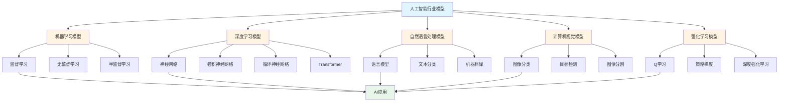
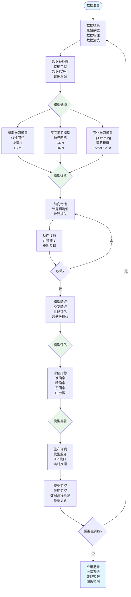

# 8.5 人工智能行业模型 / AI Industry Models

> 交叉引用 / Cross-References
>
> - 章节大纲: [content/CHAPTER_09_OUTLINE.md 9.5](../../../content/CHAPTER_09_OUTLINE.md#95-人工智能行业模型--artificial-intelligence-industry-models)
> - 全局索引: [docs/GLOBAL_INDEX.md](../../GLOBAL_INDEX.md)
> - 实现映射: [docs/09-实现示例/INDUSTRY_IMPLEMENTATION_MAPPING.md](../../09-实现示例/INDUSTRY_IMPLEMENTATION_MAPPING.md)
> - 评测协议标准: [docs/EVALUATION_PROTOCOLS_STANDARDS.md](../../EVALUATION_PROTOCOLS_STANDARDS.md)
> 注：更多统一规范见[评测协议标准](../../EVALUATION_PROTOCOLS_STANDARDS.md)

## 目录 / Table of Contents

- [8.5 人工智能行业模型 / AI Industry Models](#85-人工智能行业模型--ai-industry-models)
  - [目录 / Table of Contents](#目录--table-of-contents)
  - [人工智能行业模型框架图 / Framework Diagram of AI Industry Models](#人工智能行业模型框架图--framework-diagram-of-ai-industry-models)
  - [人工智能模型训练与应用流程图 / Flowchart of AI Model Training and Application](#人工智能模型训练与应用流程图--flowchart-of-ai-model-training-and-application)
  - [8.5.1 机器学习模型 / Machine Learning Models](#851-机器学习模型--machine-learning-models)
    - [监督学习 / Supervised Learning](#监督学习--supervised-learning)
    - [无监督学习 / Unsupervised Learning](#无监督学习--unsupervised-learning)
  - [8.5.2 深度学习模型 / Deep Learning Models](#852-深度学习模型--deep-learning-models)
    - [神经网络 / Neural Networks](#神经网络--neural-networks)
    - [卷积神经网络 / Convolutional Neural Networks](#卷积神经网络--convolutional-neural-networks)
    - [循环神经网络 / Recurrent Neural Networks](#循环神经网络--recurrent-neural-networks)
  - [8.5.3 自然语言处理模型 / NLP Models](#853-自然语言处理模型--nlp-models)
    - [语言模型 / Language Models](#语言模型--language-models)
    - [文本分类 / Text Classification](#文本分类--text-classification)
  - [8.5.4 计算机视觉模型 / Computer Vision Models](#854-计算机视觉模型--computer-vision-models)
    - [图像分类 / Image Classification](#图像分类--image-classification)
    - [目标检测 / Object Detection](#目标检测--object-detection)
  - [8.5.5 强化学习模型 / Reinforcement Learning Models](#855-强化学习模型--reinforcement-learning-models)
    - [Q学习 / Q-Learning](#q学习--q-learning)
    - [深度强化学习 / Deep Reinforcement Learning](#深度强化学习--deep-reinforcement-learning)
  - [8.5.6 实现与应用 / Implementation and Applications](#856-实现与应用--implementation-and-applications)
    - [Python实现示例 / Python Implementation Example](#python实现示例--python-implementation-example)
    - [Rust实现示例 / Rust Implementation Example](#rust实现示例--rust-implementation-example)
    - [Julia实现示例 / Julia Implementation Example](#julia实现示例--julia-implementation-example)
    - [应用领域 / Application Domains](#应用领域--application-domains)
      - [智能推荐系统 / Intelligent Recommendation Systems](#智能推荐系统--intelligent-recommendation-systems)
      - [智能客服 / Intelligent Customer Service](#智能客服--intelligent-customer-service)
      - [智能金融 / Intelligent Finance](#智能金融--intelligent-finance)
      - [智能制造 / Intelligent Manufacturing](#智能制造--intelligent-manufacturing)
  - [参考文献 / References](#参考文献--references)
  - [评测协议与指标 / Evaluation Protocols \& Metrics](#评测协议与指标--evaluation-protocols--metrics)
    - [范围与目标 / Scope \& Goals](#范围与目标--scope--goals)
    - [数据与划分 / Data \& Splits](#数据与划分--data--splits)
    - [通用指标 / Common Metrics](#通用指标--common-metrics)
    - [任务级协议 / Task-level Protocols](#任务级协议--task-level-protocols)
    - [复现实操 / Reproducibility](#复现实操--reproducibility)
  - [8.5.7 算法实现 / Algorithm Implementation](#857-算法实现--algorithm-implementation)
    - [机器学习算法 / Machine Learning Algorithms](#机器学习算法--machine-learning-algorithms)
  - [相关模型 / Related Models](#相关模型--related-models)
    - [行业应用模型 / Industry Application Models](#行业应用模型--industry-application-models)
    - [工程科学模型 / Engineering Science Models](#工程科学模型--engineering-science-models)
    - [计算机科学模型 / Computer Science Models](#计算机科学模型--computer-science-models)
    - [数学科学模型 / Mathematical Science Models](#数学科学模型--mathematical-science-models)
    - [物理科学模型 / Physical Science Models](#物理科学模型--physical-science-models)
    - [社会科学模型 / Social Science Models](#社会科学模型--social-science-models)
    - [基础理论 / Basic Theory](#基础理论--basic-theory)

---

## 人工智能行业模型框架图 / Framework Diagram of AI Industry Models



## 人工智能模型训练与应用流程图 / Flowchart of AI Model Training and Application



## 8.5.1 机器学习模型 / Machine Learning Models

### 监督学习 / Supervised Learning

**线性回归**: $y = \beta_0 + \beta_1 x_1 + \cdots + \beta_n x_n$

**逻辑回归**: $P(y=1|x) = \frac{1}{1 + e^{-(\beta_0 + \beta_1 x_1 + \cdots + \beta_n x_n)}}$

**支持向量机**: $\min \frac{1}{2}||w||^2 + C \sum_{i=1}^n \xi_i$

### 无监督学习 / Unsupervised Learning

**K-means聚类**: $\min \sum_{i=1}^k \sum_{x \in C_i} ||x - \mu_i||^2$

**主成分分析**: $\max w^T \Sigma w$ subject to $||w|| = 1$

**自编码器**: $\min ||x - f(g(x))||^2$

---

## 8.5.2 深度学习模型 / Deep Learning Models

### 神经网络 / Neural Networks

**前向传播**: $a^{(l+1)} = \sigma(W^{(l)} a^{(l)} + b^{(l)})$

**反向传播**: $\delta^{(l)} = (W^{(l+1)})^T \delta^{(l+1)} \odot \sigma'(z^{(l)})$

**损失函数**: $L = \frac{1}{m} \sum_{i=1}^m (y_i - \hat{y}_i)^2$

### 卷积神经网络 / Convolutional Neural Networks

**卷积操作**: $(f * g)(t) = \int_{-\infty}^{\infty} f(\tau) g(t-\tau) d\tau$

**池化操作**: $y_{i,j} = \max_{(p,q) \in R_{i,j}} x_{p,q}$

**激活函数**: $ReLU(x) = \max(0, x)$

### 循环神经网络 / Recurrent Neural Networks

**LSTM单元**: $f_t = \sigma(W_f \cdot [h_{t-1}, x_t] + b_f)$

**GRU单元**: $z_t = \sigma(W_z \cdot [h_{t-1}, x_t] + b_z)$

**注意力机制**: $Attention(Q,K,V) = softmax(\frac{QK^T}{\sqrt{d_k}})V$

---

## 8.5.3 自然语言处理模型 / NLP Models

### 语言模型 / Language Models

**N-gram模型**: $P(w_n|w_1^{n-1}) = \frac{C(w_1^n)}{C(w_1^{n-1})}$

**Transformer**: $MultiHead(Q,K,V) = Concat(head_1,\ldots,head_h)W^O$

**BERT**: $BERT(x) = Transformer(Embedding(x) + PositionalEncoding(x))$

### 文本分类 / Text Classification

**TF-IDF**: $tfidf(t,d) = tf(t,d) \times idf(t)$

**Word2Vec**: $P(w_o|w_i) = \frac{\exp(v_{w_o}^T v_{w_i})}{\sum_{w \in V} \exp(v_w^T v_{w_i})}$

**Doc2Vec**: $P(w_t|d) = \frac{\exp(v_{w_t}^T d)}{\sum_{w \in V} \exp(v_w^T d)}$

---

## 8.5.4 计算机视觉模型 / Computer Vision Models

### 图像分类 / Image Classification

**ResNet残差连接**: $F(x) = H(x) - x$

**DenseNet密集连接**: $x_l = H_l([x_0, x_1, \ldots, x_{l-1}])$

**EfficientNet**: $N(d,w,r) = \alpha \cdot \beta^\phi \cdot \gamma^\phi$

### 目标检测 / Object Detection

**YOLO**: $P_r(Class_i|Object) \times P_r(Object) \times IOU_{pred}^{truth}$

**R-CNN**: $R = RegionProposal(I)$

**SSD**: $L = \frac{1}{N}(L_{conf} + \alpha L_{loc})$

---

## 8.5.5 强化学习模型 / Reinforcement Learning Models

### Q学习 / Q-Learning

**Q值更新**: $Q(s,a) \leftarrow Q(s,a) + \alpha[r + \gamma \max_{a'} Q(s',a') - Q(s,a)]$

**策略梯度**: $\nabla_\theta J(\theta) = \mathbb{E}_{\pi_\theta}[\nabla_\theta \log \pi_\theta(a|s) Q^\pi(s,a)]$

**Actor-Critic**: $A(s,a) = Q(s,a) - V(s)$

### 深度强化学习 / Deep Reinforcement Learning

**DQN**: $L(\theta) = \mathbb{E}[(r + \gamma \max_{a'} Q(s',a';\theta^-) - Q(s,a;\theta))^2]$

**DDPG**: $\nabla_\theta J(\theta) = \mathbb{E}[\nabla_a Q(s,a|\theta^Q)|_{a=\mu(s)} \nabla_\theta \mu(s|\theta^\mu)]$

**PPO**: $L^{CLIP}(\theta) = \mathbb{E}[\min(r_t(\theta)A_t, clip(r_t(\theta), 1-\epsilon, 1+\epsilon)A_t)]$

---

## 8.5.6 实现与应用 / Implementation and Applications

### Python实现示例 / Python Implementation Example

```python
import numpy as np
import torch
import torch.nn as nn
import torch.optim as optim

# 简单的神经网络模型
class SimpleNeuralNetwork(nn.Module):
    def __init__(self, input_size, hidden_size, output_size):
        super(SimpleNeuralNetwork, self).__init__()
        self.fc1 = nn.Linear(input_size, hidden_size)
        self.relu = nn.ReLU()
        self.fc2 = nn.Linear(hidden_size, output_size)

    def forward(self, x):
        x = self.fc1(x)
        x = self.relu(x)
        x = self.fc2(x)
        return x

# 卷积神经网络模型
class CNN(nn.Module):
    def __init__(self, num_classes):
        super(CNN, self).__init__()
        self.conv1 = nn.Conv2d(3, 32, 3, padding=1)
        self.conv2 = nn.Conv2d(32, 64, 3, padding=1)
        self.pool = nn.MaxPool2d(2, 2)
        self.fc1 = nn.Linear(64 * 8 * 8, 128)
        self.fc2 = nn.Linear(128, num_classes)
        self.relu = nn.ReLU()

    def forward(self, x):
        x = self.pool(self.relu(self.conv1(x)))
        x = self.pool(self.relu(self.conv2(x)))
        x = x.view(-1, 64 * 8 * 8)
        x = self.relu(self.fc1(x))
        x = self.fc2(x)
        return x

# 循环神经网络模型
class RNN(nn.Module):
    def __init__(self, input_size, hidden_size, output_size):
        super(RNN, self).__init__()
        self.hidden_size = hidden_size
        self.rnn = nn.RNN(input_size, hidden_size, batch_first=True)
        self.fc = nn.Linear(hidden_size, output_size)

    def forward(self, x):
        h0 = torch.zeros(1, x.size(0), self.hidden_size)
        out, _ = self.rnn(x, h0)
        out = self.fc(out[:, -1, :])
        return out

# 强化学习Q学习实现
class QLearningAgent:
    def __init__(self, state_size, action_size, learning_rate=0.1, discount_factor=0.9, epsilon=0.1):
        self.state_size = state_size
        self.action_size = action_size
        self.learning_rate = learning_rate
        self.discount_factor = discount_factor
        self.epsilon = epsilon
        self.q_table = np.zeros((state_size, action_size))

    def choose_action(self, state):
        if np.random.random() < self.epsilon:
            return np.random.randint(self.action_size)
        return np.argmax(self.q_table[state])

    def learn(self, state, action, reward, next_state):
        old_value = self.q_table[state, action]
        next_max = np.max(self.q_table[next_state])
        new_value = (1 - self.learning_rate) * old_value + self.learning_rate * (reward + self.discount_factor * next_max)
        self.q_table[state, action] = new_value

# 自然语言处理模型
class SimpleNLPModel:
    def __init__(self, vocab_size, embedding_dim, hidden_dim):
        self.embedding = nn.Embedding(vocab_size, embedding_dim)
        self.lstm = nn.LSTM(embedding_dim, hidden_dim, batch_first=True)
        self.fc = nn.Linear(hidden_dim, vocab_size)

    def forward(self, x):
        embedded = self.embedding(x)
        lstm_out, _ = self.lstm(embedded)
        output = self.fc(lstm_out)
        return output

# 使用示例
def main():
    # 神经网络示例
    model = SimpleNeuralNetwork(10, 20, 1)
    criterion = nn.MSELoss()
    optimizer = optim.Adam(model.parameters())

    # 生成示例数据
    X = torch.randn(100, 10)
    y = torch.randn(100, 1)

    # 训练
    for epoch in range(100):
        optimizer.zero_grad()
        outputs = model(X)
        loss = criterion(outputs, y)
        loss.backward()
        optimizer.step()

        if epoch % 20 == 0:
            print(f'Epoch {epoch}, Loss: {loss.item():.4f}')

    # Q学习示例
    agent = QLearningAgent(10, 4)

    # 模拟环境
    for episode in range(1000):
        state = np.random.randint(0, 10)
        for step in range(100):
            action = agent.choose_action(state)
            next_state = np.random.randint(0, 10)
            reward = np.random.normal(0, 1)
            agent.learn(state, action, reward, next_state)
            state = next_state

    print("AI模型训练完成")

if __name__ == "__main__":
    main()
```

### Rust实现示例 / Rust Implementation Example

```rust
use std::collections::HashMap;

// 简单的神经网络结构
#[derive(Debug, Clone)]
pub struct NeuralNetwork {
    pub layers: Vec<Layer>,
    pub learning_rate: f64,
}

#[derive(Debug, Clone)]
pub struct Layer {
    pub weights: Vec<Vec<f64>>,
    pub biases: Vec<f64>,
    pub activation: ActivationFunction,
}

#[derive(Debug, Clone)]
pub enum ActivationFunction {
    ReLU,
    Sigmoid,
    Tanh,
}

impl NeuralNetwork {
    pub fn new(layer_sizes: Vec<usize>) -> Self {
        let mut layers = Vec::new();

        for i in 0..layer_sizes.len() - 1 {
            let input_size = layer_sizes[i];
            let output_size = layer_sizes[i + 1];

            let weights = (0..output_size)
                .map(|_| (0..input_size).map(|_| rand::random::<f64>() * 2.0 - 1.0).collect())
                .collect();

            let biases = (0..output_size).map(|_| rand::random::<f64>() * 2.0 - 1.0).collect();

            let activation = if i == layer_sizes.len() - 2 {
                ActivationFunction::Sigmoid
            } else {
                ActivationFunction::ReLU
            };

            layers.push(Layer {
                weights,
                biases,
                activation,
            });
        }

        Self {
            layers,
            learning_rate: 0.01,
        }
    }

    pub fn forward(&self, input: &[f64]) -> Vec<f64> {
        let mut current = input.to_vec();

        for layer in &self.layers {
            current = self.forward_layer(&current, layer);
        }

        current
    }

    fn forward_layer(&self, input: &[f64], layer: &Layer) -> Vec<f64> {
        let mut output = Vec::new();

        for (weights, bias) in layer.weights.iter().zip(&layer.biases) {
            let sum: f64 = weights.iter().zip(input).map(|(w, x)| w * x).sum();
            let activated = self.activate(sum + bias, &layer.activation);
            output.push(activated);
        }

        output
    }

    fn activate(&self, x: f64, activation: &ActivationFunction) -> f64 {
        match activation {
            ActivationFunction::ReLU => x.max(0.0),
            ActivationFunction::Sigmoid => 1.0 / (1.0 + (-x).exp()),
            ActivationFunction::Tanh => x.tanh(),
        }
    }

    pub fn train(&mut self, inputs: &[Vec<f64>], targets: &[Vec<f64>], epochs: usize) {
        for epoch in 0..epochs {
            let mut total_loss = 0.0;

            for (input, target) in inputs.iter().zip(targets.iter()) {
                let output = self.forward(input);
                let loss = self.calculate_loss(&output, target);
                total_loss += loss;

                // 简化的反向传播（实际实现需要更复杂的梯度计算）
                self.backward(input, target);
            }

            if epoch % 100 == 0 {
                println!("Epoch {}, Average Loss: {}", epoch, total_loss / inputs.len() as f64);
            }
        }
    }

    fn calculate_loss(&self, output: &[f64], target: &[f64]) -> f64 {
        output.iter().zip(target.iter())
            .map(|(o, t)| (o - t).powi(2))
            .sum::<f64>() / output.len() as f64
    }

    fn backward(&mut self, _input: &[f64], _target: &[f64]) {
        // 简化的反向传播实现
        // 实际实现需要计算梯度并更新权重
    }
}

// Q学习智能体
#[derive(Debug, Clone)]
pub struct QLearningAgent {
    pub q_table: HashMap<(usize, usize), f64>,
    pub learning_rate: f64,
    pub discount_factor: f64,
    pub epsilon: f64,
}

impl QLearningAgent {
    pub fn new(learning_rate: f64, discount_factor: f64, epsilon: f64) -> Self {
        Self {
            q_table: HashMap::new(),
            learning_rate,
            discount_factor,
            epsilon,
        }
    }

    pub fn choose_action(&self, state: usize, action_space: usize) -> usize {
        if rand::random::<f64>() < self.epsilon {
            rand::random::<usize>() % action_space
        } else {
            let mut best_action = 0;
            let mut best_value = f64::NEG_INFINITY;

            for action in 0..action_space {
                let value = self.q_table.get(&(state, action)).unwrap_or(&0.0);
                if *value > best_value {
                    best_value = *value;
                    best_action = action;
                }
            }

            best_action
        }
    }

    pub fn learn(&mut self, state: usize, action: usize, reward: f64, next_state: usize, action_space: usize) {
        let current_q = self.q_table.get(&(state, action)).unwrap_or(&0.0);

        let mut max_next_q = 0.0;
        for next_action in 0..action_space {
            let next_q = self.q_table.get(&(next_state, next_action)).unwrap_or(&0.0);
            max_next_q = max_next_q.max(*next_q);
        }

        let new_q = current_q + self.learning_rate * (reward + self.discount_factor * max_next_q - current_q);
        self.q_table.insert((state, action), new_q);
    }
}

// 使用示例
fn main() {
    // 神经网络示例
    let mut nn = NeuralNetwork::new(vec![2, 3, 1]);

    let inputs = vec![
        vec![0.0, 0.0],
        vec![0.0, 1.0],
        vec![1.0, 0.0],
        vec![1.0, 1.0],
    ];

    let targets = vec![
        vec![0.0],
        vec![1.0],
        vec![1.0],
        vec![0.0],
    ];

    nn.train(&inputs, &targets, 1000);

    // 测试
    for input in &inputs {
        let output = nn.forward(input);
        println!("Input: {:?}, Output: {:?}", input, output);
    }

    // Q学习示例
    let mut agent = QLearningAgent::new(0.1, 0.9, 0.1);

    // 模拟环境
    for episode in 0..1000 {
        let mut state = 0;
        let mut total_reward = 0.0;

        for step in 0..100 {
            let action = agent.choose_action(state, 4);
            let next_state = (state + action) % 10;
            let reward = if next_state == 9 { 1.0 } else { -0.1 };

            agent.learn(state, action, reward, next_state, 4);
            state = next_state;
            total_reward += reward;

            if next_state == 9 {
                break;
            }
        }

        if episode % 100 == 0 {
            println!("Episode {}, Total Reward: {}", episode, total_reward);
        }
    }

    println!("AI模型训练完成");
}
```

### Julia实现示例 / Julia Implementation Example

```julia
using LinearAlgebra
using Statistics
using Random

"""
简单神经网络结构体
"""
mutable struct SimpleNeuralNetwork
    weights1::Matrix{Float64}
    weights2::Matrix{Float64}
    bias1::Vector{Float64}
    bias2::Float64
    learning_rate::Float64

    function SimpleNeuralNetwork(input_size::Int, hidden_size::Int, output_size::Int,
                                learning_rate::Float64 = 0.01)
        weights1 = randn(hidden_size, input_size) * 0.1
        weights2 = randn(output_size, hidden_size) * 0.1
        bias1 = zeros(hidden_size)
        bias2 = 0.0
        new(weights1, weights2, bias1, bias2, learning_rate)
    end
end

"""
Sigmoid激活函数
"""
function sigmoid(x::Float64)::Float64
    return 1.0 / (1.0 + exp(-x))
end

"""
Sigmoid导数
"""
function sigmoid_derivative(x::Float64)::Float64
    s = sigmoid(x)
    return s * (1.0 - s)
end

"""
前向传播
"""
function forward(network::SimpleNeuralNetwork, input::Vector{Float64})::Vector{Float64}
    hidden = sigmoid.(network.weights1 * input .+ network.bias1)
    output = sigmoid.(network.weights2 * hidden .+ network.bias2)
    return output
end

"""
反向传播
"""
function backward(network::SimpleNeuralNetwork, input::Vector{Float64},
                 target::Vector{Float64}, output::Vector{Float64})
    # 计算输出层误差
    output_error = target .- output
    output_delta = output_error .* sigmoid_derivative.(output)

    # 计算隐藏层误差
    hidden_error = network.weights2' * output_delta
    hidden_delta = hidden_error .* sigmoid_derivative.(network.weights1 * input .+ network.bias1)

    # 更新权重
    hidden = sigmoid.(network.weights1 * input .+ network.bias1)
    network.weights2 += network.learning_rate * output_delta * hidden'
    network.weights1 += network.learning_rate * hidden_delta * input'

    # 更新偏置
    network.bias2 += network.learning_rate * sum(output_delta)
    network.bias1 += network.learning_rate * hidden_delta
end

"""
训练神经网络
"""
function train(network::SimpleNeuralNetwork, inputs::Matrix{Float64},
              targets::Matrix{Float64}, epochs::Int)
    for epoch in 1:epochs
        total_loss = 0.0
        for i in 1:size(inputs, 2)
            input = inputs[:, i]
            target = targets[:, i]
            output = forward(network, input)
            backward(network, input, target, output)
            total_loss += sum((target .- output).^2)
        end
        if epoch % 20 == 0
            println("Epoch $epoch, Loss: $(total_loss / size(inputs, 2))")
        end
    end
end

"""
Q学习智能体结构体
"""
mutable struct QLearningAgent
    state_size::Int
    action_size::Int
    learning_rate::Float64
    discount_factor::Float64
    epsilon::Float64
    q_table::Matrix{Float64}

    function QLearningAgent(state_size::Int, action_size::Int, learning_rate::Float64 = 0.1,
                           discount_factor::Float64 = 0.9, epsilon::Float64 = 0.1)
        q_table = zeros(state_size, action_size)
        new(state_size, action_size, learning_rate, discount_factor, epsilon, q_table)
    end
end

"""
选择动作
"""
function choose_action(agent::QLearningAgent, state::Int)::Int
    if rand() < agent.epsilon
        return rand(1:agent.action_size)
    end
    return argmax(agent.q_table[state, :])
end

"""
学习
"""
function learn(agent::QLearningAgent, state::Int, action::Int, reward::Float64,
              next_state::Int)
    old_value = agent.q_table[state, action]
    next_max = maximum(agent.q_table[next_state, :])
    new_value = (1.0 - agent.learning_rate) * old_value +
                agent.learning_rate * (reward + agent.discount_factor * next_max)
    agent.q_table[state, action] = new_value
end

"""
卷积神经网络（简化版）
"""
mutable struct SimpleCNN
    conv_weights::Array{Float64, 4}
    fc_weights::Matrix{Float64}
    learning_rate::Float64

    function SimpleCNN(input_size::Tuple{Int, Int, Int}, num_filters::Int,
                     output_size::Int, learning_rate::Float64 = 0.01)
        conv_weights = randn(num_filters, input_size[3], 3, 3) * 0.1
        fc_weights = randn(output_size, num_filters * input_size[1] * input_size[2]) * 0.1
        new(conv_weights, fc_weights, learning_rate)
    end
end

"""
卷积操作（简化版）
"""
function convolve(input::Array{Float64, 3}, kernel::Array{Float64, 3})::Array{Float64, 2}
    h, w, c = size(input)
    kh, kw = size(kernel)[1:2]
    output = zeros(h - kh + 1, w - kw + 1)

    for i in 1:h-kh+1
        for j in 1:w-kw+1
            output[i, j] = sum(input[i:i+kh-1, j:j+kw-1, :] .* kernel)
        end
    end

    return output
end

"""
ReLU激活函数
"""
function relu(x::Float64)::Float64
    return max(0.0, x)
end

"""
前向传播（CNN）
"""
function forward_cnn(cnn::SimpleCNN, input::Array{Float64, 3})::Vector{Float64}
    # 卷积层
    feature_maps = []
    for i in 1:size(cnn.conv_weights, 1)
        kernel = cnn.conv_weights[i, :, :, :]
        feature_map = convolve(input, kernel)
        push!(feature_maps, relu.(feature_map))
    end

    # 展平
    flattened = vcat([vec(fm) for fm in feature_maps]...)

    # 全连接层
    output = sigmoid.(cnn.fc_weights * flattened)
    return output
end

"""
循环神经网络（简化版）
"""
mutable struct SimpleRNN
    input_size::Int
    hidden_size::Int
    output_size::Int
    Wxh::Matrix{Float64}
    Whh::Matrix{Float64}
    Why::Matrix{Float64}
    hidden::Vector{Float64}

    function SimpleRNN(input_size::Int, hidden_size::Int, output_size::Int)
        Wxh = randn(hidden_size, input_size) * 0.1
        Whh = randn(hidden_size, hidden_size) * 0.1
        Why = randn(output_size, hidden_size) * 0.1
        hidden = zeros(hidden_size)
        new(input_size, hidden_size, output_size, Wxh, Whh, Why, hidden)
    end
end

"""
RNN前向传播
"""
function forward_rnn(rnn::SimpleRNN, input::Vector{Float64})::Vector{Float64}
    rnn.hidden = tanh.(rnn.Wxh * input + rnn.Whh * rnn.hidden)
    output = sigmoid.(rnn.Why * rnn.hidden)
    return output
end

"""
推荐系统（协同过滤简化版）
"""
mutable struct RecommenderSystem
    user_item_matrix::Matrix{Float64}
    user_similarity::Matrix{Float64}

    function RecommenderSystem(user_item_matrix::Matrix{Float64})
        n_users = size(user_item_matrix, 1)
        user_similarity = zeros(n_users, n_users)
        for i in 1:n_users
            for j in 1:n_users
                if i != j
                    user_similarity[i, j] = cosine_similarity(user_item_matrix[i, :],
                                                           user_item_matrix[j, :])
                end
            end
        end
        new(user_item_matrix, user_similarity)
    end
end

"""
余弦相似度
"""
function cosine_similarity(vec1::Vector{Float64}, vec2::Vector{Float64})::Float64
    dot_product = dot(vec1, vec2)
    norm1 = norm(vec1)
    norm2 = norm(vec2)
    return norm1 > 0 && norm2 > 0 ? dot_product / (norm1 * norm2) : 0.0
end

"""
推荐
"""
function recommend(recommender::RecommenderSystem, user_id::Int, top_k::Int = 5)::Vector{Int}
    user_ratings = recommender.user_item_matrix[user_id, :]
    similar_users = sortperm(recommender.user_similarity[user_id, :], rev=true)[2:top_k+1]

    recommendations = Float64[]
    for item_id in 1:length(user_ratings)
        if user_ratings[item_id] == 0.0  # 未评分
            score = 0.0
            for similar_user in similar_users
                score += recommender.user_similarity[user_id, similar_user] *
                        recommender.user_item_matrix[similar_user, item_id]
            end
            push!(recommendations, score)
        else
            push!(recommendations, -Inf)  # 已评分，不推荐
        end
    end

    top_items = sortperm(recommendations, rev=true)[1:top_k]
    return top_items
end

# 示例：人工智能行业模型使用
function ai_industry_example()
    # 神经网络
    network = SimpleNeuralNetwork(10, 20, 1, 0.01)
    inputs = randn(10, 100)
    targets = randn(1, 100)
    train(network, inputs, targets, 100)

    test_input = randn(10)
    test_output = forward(network, test_input)
    println("Neural network output: $test_output")

    # Q学习
    agent = QLearningAgent(10, 4)
    for episode in 1:1000
        state = rand(1:10)
        for step in 1:100
            action = choose_action(agent, state)
            next_state = rand(1:10)
            reward = randn()
            learn(agent, state, action, reward, next_state)
            state = next_state
        end
    end
    println("Q-learning training completed")

    # CNN
    cnn = SimpleCNN((28, 28, 1), 4, 10)
    test_image = randn(28, 28, 1)
    cnn_output = forward_cnn(cnn, test_image)
    println("CNN output: $cnn_output")

    # RNN
    rnn = SimpleRNN(10, 20, 5)
    test_input_rnn = randn(10)
    rnn_output = forward_rnn(rnn, test_input_rnn)
    println("RNN output: $rnn_output")

    # 推荐系统
    user_item_matrix = rand(0:5, 10, 20) .* 1.0
    recommender = RecommenderSystem(user_item_matrix)
    recommendations = recommend(recommender, 1, 5)
    println("Recommendations for user 1: $recommendations")

    return Dict(
        "neural_network_output" => test_output,
        "q_table_size" => size(agent.q_table),
        "recommendations" => recommendations
    )
end
```

### 应用领域 / Application Domains

#### 智能推荐系统 / Intelligent Recommendation Systems

- **协同过滤**: 基于用户行为的推荐算法
- **内容过滤**: 基于物品特征的推荐算法
- **深度学习推荐**: 神经网络在推荐系统中的应用
- **多目标推荐**: 平衡多个目标的推荐策略

#### 智能客服 / Intelligent Customer Service

- **意图识别**: 自然语言理解技术
- **知识图谱**: 结构化知识表示
- **对话管理**: 多轮对话状态跟踪
- **情感分析**: 用户情感识别与响应

#### 智能金融 / Intelligent Finance

- **风险评估**: 机器学习在风险评估中的应用
- **欺诈检测**: 异常检测算法
- **量化交易**: 强化学习在交易策略中的应用
- **信用评分**: 预测模型在信用评估中的应用

#### 智能制造 / Intelligent Manufacturing

- **预测性维护**: 设备故障预测
- **质量控制**: 计算机视觉在质量检测中的应用
- **供应链优化**: 机器学习在供应链管理中的应用
- **机器人控制**: 强化学习在机器人控制中的应用

---

## 参考文献 / References

1. Goodfellow, I., Bengio, Y., & Courville, A. (2016). Deep learning. MIT press.
2. Sutton, R. S., & Barto, A. G. (2018). Reinforcement learning: An introduction. MIT press.
3. Bishop, C. M. (2006). Pattern recognition and machine learning. Springer.
4. Murphy, K. P. (2012). Machine learning: a probabilistic perspective. MIT press.
5. Vaswani, A., et al. (2017). Attention is all you need. Advances in neural information processing systems.
6. LeCun, Y., Bengio, Y., & Hinton, G. (2015). Deep learning. Nature.
7. Silver, D., et al. (2016). Mastering the game of Go with deep neural networks and tree search. Nature.
8. Devlin, J., et al. (2018). Bert: Pre-training of deep bidirectional transformers for language understanding. arXiv preprint arXiv:1810.04805.

---

## 评测协议与指标 / Evaluation Protocols & Metrics

### 范围与目标 / Scope & Goals

- 覆盖机器学习、深度学习、强化学习、自然语言处理的核心评测场景。
- 可复现实证：同一数据、同一协议下，模型实现结果可对比。

### 数据与划分 / Data & Splits

- 训练数据：标注数据集、特征工程、数据增强、标签质量。
- 划分：训练(60%) / 验证(20%) / 测试(20%)，按时间顺序滚动划窗。

### 通用指标 / Common Metrics

- 准确率指标：准确率、精确率、召回率、F1分数、AUC-ROC。
- 性能指标：推理时间、内存占用、模型大小、训练时间、收敛速度。
- 鲁棒性指标：对抗攻击抵抗、数据分布偏移、噪声容忍度、泛化能力。
- 公平性指标：群体公平性、个体公平性、机会均等、预测偏差。

### 任务级协议 / Task-level Protocols

1) 监督学习：分类/回归精度、交叉验证稳定性、特征重要性分析。
2) 无监督学习：聚类质量、降维效果、异常检测、数据重构误差。
3) 强化学习：累积奖励、策略稳定性、探索效率、环境适应性。
4) 自然语言处理：BLEU、ROUGE、困惑度、语义相似度、任务特定指标。

### 复现实操 / Reproducibility

- 提供数据schema、预处理与评测脚本；固定随机种子与版本。
- 输出：指标汇总表、学习曲线、混淆矩阵、特征重要性图、性能对比。

---

## 8.5.7 算法实现 / Algorithm Implementation

### 机器学习算法 / Machine Learning Algorithms

```python
from typing import Dict, List, Any, Optional, Tuple
import numpy as np
import random
from dataclasses import dataclass
from sklearn.metrics import accuracy_score, mean_squared_error

class LinearRegression:
    """线性回归实现"""

    def __init__(self, learning_rate: float = 0.01, max_iterations: int = 1000):
        self.learning_rate = learning_rate
        self.max_iterations = max_iterations
        self.weights = None
        self.bias = None

    def fit(self, X: np.ndarray, y: np.ndarray) -> 'LinearRegression':
        """训练模型"""
        n_samples, n_features = X.shape
        self.weights = np.zeros(n_features)
        self.bias = 0.0

        for _ in range(self.max_iterations):
            # 前向传播
            y_pred = np.dot(X, self.weights) + self.bias

            # 计算梯度
            dw = (1/n_samples) * np.dot(X.T, (y_pred - y))
            db = (1/n_samples) * np.sum(y_pred - y)

            # 更新参数
            self.weights -= self.learning_rate * dw
            self.bias -= self.learning_rate * db

        return self

    def predict(self, X: np.ndarray) -> np.ndarray:
        """预测"""
        return np.dot(X, self.weights) + self.bias

class LogisticRegression:
    """逻辑回归实现"""

    def __init__(self, learning_rate: float = 0.01, max_iterations: int = 1000):
        self.learning_rate = learning_rate
        self.max_iterations = max_iterations
        self.weights = None
        self.bias = None

    def sigmoid(self, z: np.ndarray) -> np.ndarray:
        """sigmoid函数"""
        return 1 / (1 + np.exp(-np.clip(z, -500, 500)))

    def fit(self, X: np.ndarray, y: np.ndarray) -> 'LogisticRegression':
        """训练模型"""
        n_samples, n_features = X.shape
        self.weights = np.zeros(n_features)
        self.bias = 0.0

        for _ in range(self.max_iterations):
            # 前向传播
            linear_pred = np.dot(X, self.weights) + self.bias
            predictions = self.sigmoid(linear_pred)

            # 计算梯度
            dw = (1/n_samples) * np.dot(X.T, (predictions - y))
            db = (1/n_samples) * np.sum(predictions - y)

            # 更新参数
            self.weights -= self.learning_rate * dw
            self.bias -= self.learning_rate * db

        return self

    def predict(self, X: np.ndarray) -> np.ndarray:
        """预测"""
        linear_pred = np.dot(X, self.weights) + self.bias
        y_pred = self.sigmoid(linear_pred)
        return (y_pred >= 0.5).astype(int)

class KMeans:
    """K-means聚类实现"""

    def __init__(self, n_clusters: int = 3, max_iterations: int = 100):
        self.n_clusters = n_clusters
        self.max_iterations = max_iterations
        self.centroids = None
        self.labels = None

    def fit(self, X: np.ndarray) -> 'KMeans':
        """训练模型"""
        n_samples, n_features = X.shape

        # 随机初始化聚类中心
        random_indices = np.random.choice(n_samples, self.n_clusters, replace=False)
        self.centroids = X[random_indices]

        for _ in range(self.max_iterations):
            # 分配样本到最近的聚类中心
            distances = np.sqrt(((X - self.centroids[:, np.newaxis])**2).sum(axis=2))
            self.labels = np.argmin(distances, axis=0)

            # 更新聚类中心
            new_centroids = np.array([X[self.labels == k].mean(axis=0)
                                     for k in range(self.n_clusters)])

            # 检查收敛
            if np.allclose(self.centroids, new_centroids):
                break

            self.centroids = new_centroids

        return self

    def predict(self, X: np.ndarray) -> np.ndarray:
        """预测聚类标签"""
        distances = np.sqrt(((X - self.centroids[:, np.newaxis])**2).sum(axis=2))
        return np.argmin(distances, axis=0)

### 深度学习算法 / Deep Learning Algorithms

class NeuralNetwork:
    """神经网络实现"""

    def __init__(self, layers: List[int], learning_rate: float = 0.01):
        self.layers = layers
        self.learning_rate = learning_rate
        self.weights = []
        self.biases = []
        self._initialize_parameters()

    def _initialize_parameters(self):
        """初始化参数"""
        for i in range(len(self.layers) - 1):
            w = np.random.randn(self.layers[i + 1], self.layers[i]) * 0.01
            b = np.zeros((self.layers[i + 1], 1))
            self.weights.append(w)
            self.biases.append(b)

    def sigmoid(self, z: np.ndarray) -> np.ndarray:
        """sigmoid激活函数"""
        return 1 / (1 + np.exp(-np.clip(z, -500, 500)))

    def sigmoid_derivative(self, z: np.ndarray) -> np.ndarray:
        """sigmoid导数"""
        s = self.sigmoid(z)
        return s * (1 - s)

    def forward_propagation(self, X: np.ndarray) -> Tuple[List[np.ndarray], List[np.ndarray]]:
        """前向传播"""
        activations = [X]
        z_values = []

        for i in range(len(self.weights)):
            z = np.dot(self.weights[i], activations[-1]) + self.biases[i]
            z_values.append(z)
            activation = self.sigmoid(z)
            activations.append(activation)

        return activations, z_values

    def backward_propagation(self, X: np.ndarray, y: np.ndarray,
                           activations: List[np.ndarray], z_values: List[np.ndarray]):
        """反向传播"""
        m = X.shape[1]
        delta = activations[-1] - y

        for i in range(len(self.weights) - 1, -1, -1):
            dW = np.dot(delta, activations[i].T) / m
            db = np.sum(delta, axis=1, keepdims=True) / m

            if i > 0:
                delta = np.dot(self.weights[i].T, delta) * self.sigmoid_derivative(z_values[i - 1])

            self.weights[i] -= self.learning_rate * dW
            self.biases[i] -= self.learning_rate * db

    def train(self, X: np.ndarray, y: np.ndarray, epochs: int) -> List[float]:
        """训练模型"""
        costs = []

        for epoch in range(epochs):
            # 前向传播
            activations, z_values = self.forward_propagation(X)

            # 计算损失
            cost = -np.mean(y * np.log(activations[-1] + 1e-8) +
                           (1 - y) * np.log(1 - activations[-1] + 1e-8))
            costs.append(cost)

            # 反向传播
            self.backward_propagation(X, y, activations, z_values)

            if epoch % 100 == 0:
                print(f"Epoch {epoch}, Cost: {cost:.4f}")

        return costs

    def predict(self, X: np.ndarray) -> np.ndarray:
        """预测"""
        activations, _ = self.forward_propagation(X)
        return (activations[-1] >= 0.5).astype(int)

class ConvolutionalNeuralNetwork:
    """卷积神经网络实现"""

    def __init__(self, input_shape: Tuple[int, int, int], num_classes: int):
        self.input_shape = input_shape
        self.num_classes = num_classes
        self.filters = []
        self.weights = None
        self.bias = None
        self._initialize_parameters()

    def _initialize_parameters(self):
        """初始化参数"""
        # 简化的CNN实现
        filter_size = 3
        num_filters = 8
        self.filters = np.random.randn(num_filters, filter_size, filter_size) * 0.01

        # 全连接层
        flattened_size = num_filters * (self.input_shape[0] - filter_size + 1) ** 2
        self.weights = np.random.randn(self.num_classes, flattened_size) * 0.01
        self.bias = np.zeros((self.num_classes, 1))

    def conv2d(self, input_data: np.ndarray, filters: np.ndarray) -> np.ndarray:
        """2D卷积操作"""
        batch_size, height, width = input_data.shape
        num_filters, filter_height, filter_width = filters.shape

        output_height = height - filter_height + 1
        output_width = width - filter_width + 1
        output = np.zeros((batch_size, num_filters, output_height, output_width))

        for b in range(batch_size):
            for f in range(num_filters):
                for i in range(output_height):
                    for j in range(output_width):
                        output[b, f, i, j] = np.sum(
                            input_data[b, i:i+filter_height, j:j+filter_width] * filters[f]
                        )

        return output

    def max_pooling(self, input_data: np.ndarray, pool_size: int = 2) -> np.ndarray:
        """最大池化"""
        batch_size, num_filters, height, width = input_data.shape
        output_height = height // pool_size
        output_width = width // pool_size
        output = np.zeros((batch_size, num_filters, output_height, output_width))

        for b in range(batch_size):
            for f in range(num_filters):
                for i in range(output_height):
                    for j in range(output_width):
                        output[b, f, i, j] = np.max(
                            input_data[b, f, i*pool_size:(i+1)*pool_size,
                                     j*pool_size:(j+1)*pool_size]
                        )

        return output

    def relu(self, x: np.ndarray) -> np.ndarray:
        """ReLU激活函数"""
        return np.maximum(0, x)

    def softmax(self, x: np.ndarray) -> np.ndarray:
        """softmax函数"""
        exp_x = np.exp(x - np.max(x, axis=0, keepdims=True))
        return exp_x / np.sum(exp_x, axis=0, keepdims=True)

    def forward(self, X: np.ndarray) -> np.ndarray:
        """前向传播"""
        # 卷积层
        conv_output = self.conv2d(X, self.filters)
        conv_output = self.relu(conv_output)

        # 池化层
        pooled_output = self.max_pooling(conv_output)

        # 展平
        flattened = pooled_output.reshape(pooled_output.shape[0], -1)

        # 全连接层
        logits = np.dot(self.weights, flattened.T) + self.bias
        output = self.softmax(logits)

        return output.T

### 自然语言处理算法 / NLP Algorithms

class Word2Vec:
    """Word2Vec实现"""

    def __init__(self, vocab_size: int, embedding_dim: int, learning_rate: float = 0.01):
        self.vocab_size = vocab_size
        self.embedding_dim = embedding_dim
        self.learning_rate = learning_rate
        self.W1 = np.random.randn(vocab_size, embedding_dim) * 0.01
        self.W2 = np.random.randn(embedding_dim, vocab_size) * 0.01

    def softmax(self, x: np.ndarray) -> np.ndarray:
        """softmax函数"""
        exp_x = np.exp(x - np.max(x, axis=1, keepdims=True))
        return exp_x / np.sum(exp_x, axis=1, keepdims=True)

    def forward(self, x: np.ndarray) -> Tuple[np.ndarray, np.ndarray, np.ndarray]:
        """前向传播"""
        h = np.dot(x, self.W1)
        u = np.dot(h, self.W2)
        y_pred = self.softmax(u)
        return h, u, y_pred

    def backward(self, x: np.ndarray, y: np.ndarray, h: np.ndarray,
                u: np.ndarray, y_pred: np.ndarray):
        """反向传播"""
        e = y_pred - y
        dW2 = np.dot(h.T, e)
        dh = np.dot(e, self.W2.T)
        dW1 = np.dot(x.T, dh)

        self.W1 -= self.learning_rate * dW1
        self.W2 -= self.learning_rate * dW2

    def train(self, training_data: List[Tuple[np.ndarray, np.ndarray]], epochs: int):
        """训练模型"""
        for epoch in range(epochs):
            total_loss = 0
            for x, y in training_data:
                h, u, y_pred = self.forward(x)
                self.backward(x, y, h, u, y_pred)

                # 计算损失
                loss = -np.sum(y * np.log(y_pred + 1e-8))
                total_loss += loss

            if epoch % 100 == 0:
                print(f"Epoch {epoch}, Loss: {total_loss:.4f}")

class TFIDFVectorizer:
    """TF-IDF向量化器"""

    def __init__(self):
        self.vocabulary = {}
        self.idf = {}
        self.fitted = False

    def fit(self, documents: List[str]) -> 'TFIDFVectorizer':
        """拟合模型"""
        # 构建词汇表
        word_freq = {}
        doc_freq = {}

        for doc in documents:
            words = doc.lower().split()
            doc_words = set(words)

            for word in words:
                word_freq[word] = word_freq.get(word, 0) + 1

            for word in doc_words:
                doc_freq[word] = doc_freq.get(word, 0) + 1

        # 构建词汇表
        for word, freq in word_freq.items():
            if freq >= 2:  # 最小频率阈值
                self.vocabulary[word] = len(self.vocabulary)

        # 计算IDF
        N = len(documents)
        for word in self.vocabulary:
            df = doc_freq.get(word, 0)
            self.idf[word] = np.log(N / (df + 1)) + 1

        self.fitted = True
        return self

    def transform(self, documents: List[str]) -> np.ndarray:
        """转换文档为TF-IDF矩阵"""
        if not self.fitted:
            raise ValueError("Model must be fitted before transform")

        tfidf_matrix = np.zeros((len(documents), len(self.vocabulary)))

        for i, doc in enumerate(documents):
            words = doc.lower().split()
            word_count = {}

            # 计算词频
            for word in words:
                if word in self.vocabulary:
                    word_count[word] = word_count.get(word, 0) + 1

            # 计算TF-IDF
            for word, count in word_count.items():
                if word in self.vocabulary:
                    tf = count / len(words)
                    tfidf = tf * self.idf[word]
                    tfidf_matrix[i, self.vocabulary[word]] = tfidf

        return tfidf_matrix

### 计算机视觉算法 / Computer Vision Algorithms

class ImageProcessor:
    """图像处理器"""

    def __init__(self):
        pass

    def grayscale(self, image: np.ndarray) -> np.ndarray:
        """转换为灰度图"""
        if len(image.shape) == 3:
            return np.dot(image[..., :3], [0.299, 0.587, 0.114])
        return image

    def resize(self, image: np.ndarray, new_size: Tuple[int, int]) -> np.ndarray:
        """调整图像大小"""
        height, width = image.shape[:2]
        new_height, new_width = new_size

        # 简化的双线性插值
        resized = np.zeros((new_height, new_width) + image.shape[2:])

        for i in range(new_height):
            for j in range(new_width):
                # 计算原图坐标
                src_i = i * height / new_height
                src_j = j * width / new_width

                # 双线性插值
                i1, i2 = int(src_i), min(int(src_i) + 1, height - 1)
                j1, j2 = int(src_j), min(int(src_j) + 1, width - 1)

                if i1 == i2 and j1 == j2:
                    resized[i, j] = image[i1, j1]
                else:
                    # 插值权重
                    wi = src_i - i1
                    wj = src_j - j1

                    resized[i, j] = (1 - wi) * (1 - wj) * image[i1, j1] + \
                                   wi * (1 - wj) * image[i2, j1] + \
                                   (1 - wi) * wj * image[i1, j2] + \
                                   wi * wj * image[i2, j2]

        return resized

    def normalize(self, image: np.ndarray) -> np.ndarray:
        """归一化图像"""
        return (image - np.min(image)) / (np.max(image) - np.min(image) + 1e-8)

    def apply_filter(self, image: np.ndarray, kernel: np.ndarray) -> np.ndarray:
        """应用卷积滤波器"""
        if len(image.shape) == 2:
            image = image[..., np.newaxis]

        height, width, channels = image.shape
        kernel_height, kernel_width = kernel.shape

        # 填充
        pad_height = kernel_height // 2
        pad_width = kernel_width // 2
        padded = np.pad(image, ((pad_height, pad_height), (pad_width, pad_width), (0, 0)))

        # 卷积
        output = np.zeros_like(image)
        for i in range(height):
            for j in range(width):
                for c in range(channels):
                    output[i, j, c] = np.sum(
                        padded[i:i+kernel_height, j:j+kernel_width, c] * kernel
                    )

        return output.squeeze() if channels == 1 else output

class ObjectDetector:
    """目标检测器"""

    def __init__(self, confidence_threshold: float = 0.5):
        self.confidence_threshold = confidence_threshold

    def sliding_window(self, image: np.ndarray, window_size: Tuple[int, int],
                      stride: int = 1) -> List[Tuple[int, int, int, int]]:
        """滑动窗口"""
        height, width = image.shape[:2]
        window_height, window_width = window_size
        windows = []

        for i in range(0, height - window_height + 1, stride):
            for j in range(0, width - window_width + 1, stride):
                windows.append((i, j, i + window_height, j + window_width))

        return windows

    def non_maximum_suppression(self, boxes: List[Tuple[int, int, int, int]],
                               scores: List[float]) -> List[int]:
        """非极大值抑制"""
        if not boxes:
            return []

        # 按分数排序
        indices = np.argsort(scores)[::-1]
        keep = []

        while indices.size > 0:
            # 保留最高分数的框
            i = indices[0]
            keep.append(i)

            if indices.size == 1:
                break

            # 计算IoU
            ious = []
            for j in indices[1:]:
                iou = self.calculate_iou(boxes[i], boxes[j])
                ious.append(iou)

            # 移除重叠的框
            indices = indices[np.array(ious) < self.confidence_threshold]

        return keep

    def calculate_iou(self, box1: Tuple[int, int, int, int],
                     box2: Tuple[int, int, int, int]) -> float:
        """计算IoU"""
        x1, y1, x2, y2 = box1
        x3, y3, x4, y4 = box2

        # 计算交集
        x_left = max(x1, x3)
        y_top = max(y1, y3)
        x_right = min(x2, x4)
        y_bottom = min(y2, y4)

        if x_right < x_left or y_bottom < y_top:
            return 0.0

        intersection = (x_right - x_left) * (y_bottom - y_top)

        # 计算并集
        area1 = (x2 - x1) * (y2 - y1)
        area2 = (x4 - x3) * (y4 - y3)
        union = area1 + area2 - intersection

        return intersection / union if union > 0 else 0.0

### 强化学习算法 / Reinforcement Learning Algorithms

class QLearningAgent:
    """Q-Learning智能体"""

    def __init__(self, learning_rate: float = 0.1, discount_factor: float = 0.9,
                 epsilon: float = 0.1):
        self.learning_rate = learning_rate
        self.discount_factor = discount_factor
        self.epsilon = epsilon
        self.q_table = {}

    def get_q_value(self, state: int, action: int) -> float:
        """获取Q值"""
        return self.q_table.get((state, action), 0.0)

    def choose_action(self, state: int, num_actions: int) -> int:
        """选择动作"""
        if random.random() < self.epsilon:
            return random.randint(0, num_actions - 1)

        q_values = [self.get_q_value(state, a) for a in range(num_actions)]
        return np.argmax(q_values)

    def learn(self, state: int, action: int, reward: float,
              next_state: int, num_actions: int):
        """学习"""
        current_q = self.get_q_value(state, action)
        next_q_values = [self.get_q_value(next_state, a) for a in range(num_actions)]
        max_next_q = max(next_q_values)

        new_q = current_q + self.learning_rate * (reward +
                                                 self.discount_factor * max_next_q - current_q)
        self.q_table[(state, action)] = new_q

class PolicyGradientAgent:
    """策略梯度智能体"""

    def __init__(self, state_size: int, action_size: int, learning_rate: float = 0.01):
        self.state_size = state_size
        self.action_size = action_size
        self.learning_rate = learning_rate

        # 策略网络参数
        self.weights = np.random.randn(action_size, state_size) * 0.01
        self.bias = np.zeros((action_size, 1))

        # 经验回放
        self.episodes = []

    def softmax(self, x: np.ndarray) -> np.ndarray:
        """softmax函数"""
        exp_x = np.exp(x - np.max(x))
        return exp_x / np.sum(exp_x)

    def get_action_probs(self, state: np.ndarray) -> np.ndarray:
        """获取动作概率"""
        logits = np.dot(self.weights, state) + self.bias
        return self.softmax(logits.flatten())

    def choose_action(self, state: np.ndarray) -> int:
        """选择动作"""
        probs = self.get_action_probs(state)
        return np.random.choice(self.action_size, p=probs)

    def store_episode(self, episode: List[Tuple[np.ndarray, int, float]]):
        """存储经验"""
        self.episodes.append(episode)

    def update_policy(self):
        """更新策略"""
        if not self.episodes:
            return

        # 计算每个episode的回报
        episode_returns = []
        for episode in self.episodes:
            returns = []
            R = 0
            for _, _, reward in reversed(episode):
                R = reward + 0.9 * R
                returns.insert(0, R)
            episode_returns.append(returns)

        # 归一化回报
        all_returns = np.concatenate(episode_returns)
        returns_mean = np.mean(all_returns)
        returns_std = np.std(all_returns)

        # 更新策略参数
        for episode, returns in zip(self.episodes, episode_returns):
            for (state, action, _), R in zip(episode, returns):
                # 归一化回报
                normalized_return = (R - returns_mean) / (returns_std + 1e-8)

                # 计算梯度
                probs = self.get_action_probs(state)
                probs[action] -= 1  # 梯度

                # 更新参数
                self.weights -= self.learning_rate * normalized_return * np.outer(probs, state)
                self.bias -= self.learning_rate * normalized_return * probs.reshape(-1, 1)

        # 清空经验
        self.episodes = []

def ai_industry_verification():
    """人工智能行业模型验证"""
    print("=== 人工智能行业模型验证 ===")

    # 机器学习验证
    print("\n1. 机器学习验证:")

    # 线性回归
    X = np.array([[1, 2], [2, 3], [3, 4], [4, 5]])
    y = np.array([2, 4, 6, 8])

    lr = LinearRegression()
    lr.fit(X, y)
    predictions = lr.predict(X)
    mse = mean_squared_error(y, predictions)
    print(f"线性回归MSE: {mse:.4f}")

    # 逻辑回归
    X_binary = np.array([[1, 2], [2, 3], [3, 4], [4, 5]])
    y_binary = np.array([0, 0, 1, 1])

    log_reg = LogisticRegression()
    log_reg.fit(X_binary, y_binary)
    predictions = log_reg.predict(X_binary)
    accuracy = accuracy_score(y_binary, predictions)
    print(f"逻辑回归准确率: {accuracy:.4f}")

    # K-means聚类
    X_cluster = np.random.randn(100, 2)
    kmeans = KMeans(n_clusters=3)
    kmeans.fit(X_cluster)
    labels = kmeans.predict(X_cluster)
    print(f"K-means聚类完成，标签分布: {np.bincount(labels)}")

    # 深度学习验证
    print("\n2. 深度学习验证:")

    # 神经网络
    X_nn = np.random.randn(100, 2).T
    y_nn = (X_nn[0] + X_nn[1] > 0).astype(int).reshape(1, -1)

    nn = NeuralNetwork([2, 4, 1])
    costs = nn.train(X_nn, y_nn, epochs=500)
    predictions = nn.predict(X_nn)
    accuracy = accuracy_score(y_nn.flatten(), predictions.flatten())
    print(f"神经网络准确率: {accuracy:.4f}")

    # 卷积神经网络
    X_cnn = np.random.randn(10, 28, 28)  # 10个28x28的图像
    cnn = ConvolutionalNeuralNetwork((28, 28, 1), 10)
    output = cnn.forward(X_cnn)
    print(f"CNN输出形状: {output.shape}")

    # NLP验证
    print("\n3. NLP验证:")

    # Word2Vec
    vocab_size = 100
    embedding_dim = 10
    w2v = Word2Vec(vocab_size, embedding_dim)

    # 简化的训练数据
    training_data = []
    for _ in range(50):
        x = np.random.randn(1, vocab_size)
        y = np.random.randn(1, vocab_size)
        training_data.append((x, y))

    w2v.train(training_data, epochs=100)
    print("Word2Vec训练完成")

    # TF-IDF
    documents = [
        "machine learning is amazing",
        "deep learning is a subset of machine learning",
        "artificial intelligence includes machine learning"
    ]

    tfidf = TFIDFVectorizer()
    tfidf.fit(documents)
    tfidf_matrix = tfidf.transform(documents)
    print(f"TF-IDF矩阵形状: {tfidf_matrix.shape}")

    # 计算机视觉验证
    print("\n4. 计算机视觉验证:")

    # 图像处理
    image = np.random.randn(100, 100, 3)
    processor = ImageProcessor()

    gray = processor.grayscale(image)
    resized = processor.resize(gray, (50, 50))
    normalized = processor.normalize(resized)

    print(f"图像处理完成: {gray.shape} -> {resized.shape} -> {normalized.shape}")

    # 目标检测
    detector = ObjectDetector()
    windows = detector.sliding_window(gray, (20, 20), stride=10)
    print(f"滑动窗口数量: {len(windows)}")

    # 强化学习验证
    print("\n5. 强化学习验证:")

    # Q-Learning
    q_agent = QLearningAgent()

    # 简单的环境模拟
    for episode in range(100):
        state = 0
        for step in range(10):
            action = q_agent.choose_action(state, 4)
            next_state = (state + action) % 10
            reward = 1.0 if next_state == 9 else -0.1

            q_agent.learn(state, action, reward, next_state, 4)
            state = next_state

            if next_state == 9:
                break

    print("Q-Learning训练完成")

    # 策略梯度
    pg_agent = PolicyGradientAgent(4, 2)

    # 简单的episode
    episode = []
    for _ in range(5):
        state = np.random.randn(4, 1)
        action = pg_agent.choose_action(state)
        reward = random.random()
        episode.append((state, action, reward))

    pg_agent.store_episode(episode)
    pg_agent.update_policy()
    print("策略梯度更新完成")

    print("\n验证完成!")

if __name__ == "__main__":
    ai_industry_verification()
```

---

## 相关模型 / Related Models

### 行业应用模型 / Industry Application Models

- **[物流供应链模型](../01-物流供应链模型/README.md)** - 人工智能在物流供应链中应用于需求预测、路径优化、库存管理和智能调度
- **[交通运输模型](../02-交通运输模型/README.md)** - 智能交通系统、自动驾驶、交通流量预测和路径规划都大量使用人工智能技术
- **[电力能源模型](../03-电力能源模型/README.md)** - 智能电网、负荷预测、故障诊断和能源优化调度都应用人工智能技术
- **[信息技术模型](../04-信息技术模型/README.md)** - 人工智能模型的训练、部署和推理需要信息技术基础设施的支持，包括云计算、大数据处理和分布式计算
- **[银行金融模型](../06-银行金融模型/README.md)** - 金融风控、信用评估、欺诈检测、智能投顾和量化交易都广泛应用人工智能技术
- **[经济供需模型](../07-经济供需模型/README.md)** - 经济预测、市场分析和供需平衡预测可以使用机器学习方法
- **[制造业模型](../08-制造业模型/README.md)** - 智能制造、质量检测、预测性维护和工业机器人控制都应用人工智能技术
- **[医疗健康模型](../09-医疗健康模型/README.md)** - 医学影像诊断、疾病预测、药物发现和个性化医疗都大量使用人工智能技术
- **[教育学习模型](../10-教育学习模型/README.md)** - 智能教学、个性化学习、学习分析和智能评测都应用人工智能技术

### 工程科学模型 / Engineering Science Models

- **[优化模型](../../07-工程科学模型/01-优化模型/README.md)** - 机器学习中的优化问题、神经网络训练和强化学习中的策略优化都是优化理论的应用
- **[控制论模型](../../07-工程科学模型/02-控制论模型/README.md)** - 强化学习、自适应控制和智能控制系统都是控制论与人工智能的结合
- **[信号处理模型](../../07-工程科学模型/03-信号处理模型/README.md)** - 数字信号处理、图像处理和语音识别都需要信号处理技术

### 计算机科学模型 / Computer Science Models

- **[计算模型](../../04-计算机科学模型/01-计算模型/README.md)** - 计算理论、算法设计和计算复杂度是人工智能的基础理论
- **[算法模型](../../04-计算机科学模型/02-算法模型/README.md)** - 机器学习算法、深度学习算法和优化算法是人工智能的核心
- **[数据结构模型](../../04-计算机科学模型/03-数据结构模型/README.md)** - 数据结构和算法是人工智能系统的基础
- **[人工智能模型](../../04-计算机科学模型/05-人工智能模型/README.md)** - 人工智能行业模型是计算机科学中人工智能模型在具体行业中的应用

### 数学科学模型 / Mathematical Science Models

- **[代数模型](../../03-数学科学模型/01-代数模型/README.md)** - 线性代数、矩阵运算和向量空间是深度学习和机器学习的基础数学工具
- **[几何模型](../../03-数学科学模型/02-几何模型/README.md)** - 几何深度学习、流形学习和图神经网络都涉及几何学
- **[拓扑模型](../../03-数学科学模型/03-拓扑模型/README.md)** - 拓扑数据分析、拓扑神经网络和图论在人工智能中应用

### 物理科学模型 / Physical Science Models

- **[量子力学模型](../../02-物理科学模型/02-量子力学模型/README.md)** - 量子机器学习、量子计算和量子神经网络是量子力学与人工智能的结合

### 社会科学模型 / Social Science Models

- **[认知科学模型](../../06-社会科学模型/04-认知科学模型/README.md)** - 认知科学为人工智能提供了理论基础，包括认知架构、学习理论和决策模型
- **[心理学模型](../../06-社会科学模型/03-心理学模型/README.md)** - 心理学理论启发了很多人工智能算法，如强化学习中的奖励机制

### 基础理论 / Basic Theory

- **[模型分类学](../../01-基础理论/01-模型分类学/README.md)** - 人工智能模型的分类和体系化需要模型分类学理论指导
- **[形式化方法论](../../01-基础理论/02-形式化方法论/README.md)** - 人工智能模型的形式化描述、验证和证明需要形式化方法论
- **[科学模型论](../../01-基础理论/03-科学模型论/README.md)** - 人工智能模型的构建、验证和评价需要科学模型论指导

---

*最后更新: 2025-01-XX*
*版本: 1.2.0*
*状态: 核心功能已完成 / Status: Core Features Completed*
