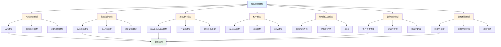
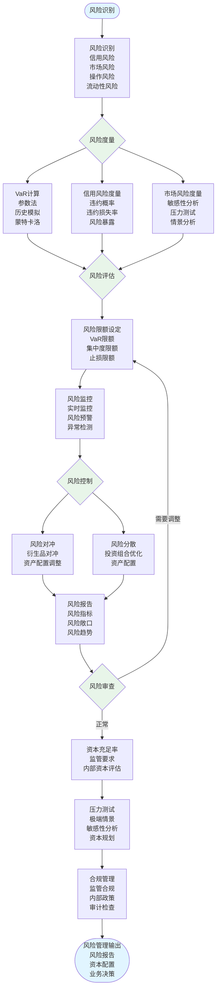

# 8.6 银行金融模型 / Banking & Finance Models

> 交叉引用 / Cross-References
>
> - 章节大纲: [content/CHAPTER_09_OUTLINE.md 9.6](../../../content/CHAPTER_09_OUTLINE.md#96-银行金融模型--banking-and-finance-models)
> - 全局索引: [docs/GLOBAL_INDEX.md](../../GLOBAL_INDEX.md)
> - 实现映射: [docs/09-实现示例/INDUSTRY_IMPLEMENTATION_MAPPING.md](../../09-实现示例/INDUSTRY_IMPLEMENTATION_MAPPING.md)
> - 评测协议标准: [docs/EVALUATION_PROTOCOLS_STANDARDS.md](../../EVALUATION_PROTOCOLS_STANDARDS.md)

## 目录 / Table of Contents

- [8.6 银行金融模型 / Banking \& Finance Models](#86-银行金融模型--banking--finance-models)
  - [目录 / Table of Contents](#目录--table-of-contents)
  - [银行金融模型框架图 / Framework Diagram of Banking \& Finance Models](#银行金融模型框架图--framework-diagram-of-banking--finance-models)
  - [金融风险管理流程图 / Flowchart of Financial Risk Management](#金融风险管理流程图--flowchart-of-financial-risk-management)
  - [8.6.1 风险管理模型 / Risk Management Models](#861-风险管理模型--risk-management-models)
    - [VaR模型 / Value at Risk Models](#var模型--value-at-risk-models)
    - [信用风险模型 / Credit Risk Models](#信用风险模型--credit-risk-models)
    - [市场风险模型 / Market Risk Models](#市场风险模型--market-risk-models)
  - [8.6.2 投资组合理论 / Portfolio Theory](#862-投资组合理论--portfolio-theory)
    - [马科维茨模型 / Markowitz Model](#马科维茨模型--markowitz-model)
    - [资本资产定价模型 / Capital Asset Pricing Model](#资本资产定价模型--capital-asset-pricing-model)
    - [套利定价理论 / Arbitrage Pricing Theory](#套利定价理论--arbitrage-pricing-theory)
  - [8.6.3 期权定价模型 / Option Pricing Models](#863-期权定价模型--option-pricing-models)
    - [Black-Scholes模型 / Black-Scholes Model](#black-scholes模型--black-scholes-model)
    - [二叉树模型 / Binomial Tree Model](#二叉树模型--binomial-tree-model)
    - [蒙特卡洛模拟 / Monte Carlo Simulation](#蒙特卡洛模拟--monte-carlo-simulation)
  - [8.6.4 利率模型 / Interest Rate Models](#864-利率模型--interest-rate-models)
    - [Vasicek模型 / Vasicek Model](#vasicek模型--vasicek-model)
    - [Cox-Ingersoll-Ross模型 / Cox-Ingersoll-Ross Model](#cox-ingersoll-ross模型--cox-ingersoll-ross-model)
    - [Heath-Jarrow-Morton模型 / Heath-Jarrow-Morton Model](#heath-jarrow-morton模型--heath-jarrow-morton-model)
  - [8.6.5 信用衍生品模型 / Credit Derivative Models](#865-信用衍生品模型--credit-derivative-models)
    - [信用违约互换 / Credit Default Swaps](#信用违约互换--credit-default-swaps)
    - [结构化产品 / Structured Products](#结构化产品--structured-products)
    - [抵押债务凭证 / Collateralized Debt Obligations](#抵押债务凭证--collateralized-debt-obligations)
  - [8.6.6 银行运营模型 / Banking Operations Models](#866-银行运营模型--banking-operations-models)
    - [资产负债管理 / Asset-Liability Management](#资产负债管理--asset-liability-management)
    - [流动性管理 / Liquidity Management](#流动性管理--liquidity-management)
    - [资本充足率 / Capital Adequacy](#资本充足率--capital-adequacy)
  - [8.6.7 金融科技模型 / FinTech Models](#867-金融科技模型--fintech-models)
    - [区块链模型 / Blockchain Models](#区块链模型--blockchain-models)
    - [机器学习金融应用 / Machine Learning in Finance](#机器学习金融应用--machine-learning-in-finance)
    - [高频交易模型 / High-Frequency Trading Models](#高频交易模型--high-frequency-trading-models)
  - [参考文献 / References](#参考文献--references)
  - [评测协议与指标 / Evaluation Protocols \& Metrics](#评测协议与指标--evaluation-protocols--metrics)
    - [范围与目标 / Scope \& Goals](#范围与目标--scope--goals)
    - [数据与划分 / Data \& Splits](#数据与划分--data--splits)
    - [通用指标 / Common Metrics](#通用指标--common-metrics)
    - [任务级协议 / Task-level Protocols](#任务级协议--task-level-protocols)
    - [复现实操 / Reproducibility](#复现实操--reproducibility)
  - [8.6.8 算法实现 / Algorithm Implementation](#868-算法实现--algorithm-implementation)
    - [风险管理算法 / Risk Management Algorithms](#风险管理算法--risk-management-algorithms)
  - [相关模型 / Related Models](#相关模型--related-models)
    - [行业应用模型 / Industry Application Models](#行业应用模型--industry-application-models)
    - [工程科学模型 / Engineering Science Models](#工程科学模型--engineering-science-models)
    - [计算机科学模型 / Computer Science Models](#计算机科学模型--computer-science-models)
    - [数学科学模型 / Mathematical Science Models](#数学科学模型--mathematical-science-models)
    - [社会科学模型 / Social Science Models](#社会科学模型--social-science-models)
    - [物理科学模型 / Physical Science Models](#物理科学模型--physical-science-models)
    - [基础理论 / Basic Theory](#基础理论--basic-theory)

---

## 银行金融模型框架图 / Framework Diagram of Banking & Finance Models



## 金融风险管理流程图 / Flowchart of Financial Risk Management



## 8.6.1 风险管理模型 / Risk Management Models

### VaR模型 / Value at Risk Models

**定义**: 在给定置信水平下，投资组合在特定时间内的最大可能损失。

**参数VaR**:
$$\text{VaR}_\alpha = \mu - z_\alpha \sigma$$

其中：

- $\mu$: 期望收益
- $\sigma$: 标准差
- $z_\alpha$: 标准正态分布的分位数

**历史VaR**:
$$\text{VaR}_\alpha = \text{Percentile}(R, \alpha)$$

**蒙特卡洛VaR**:

```python
def monte_carlo_var(returns, confidence_level, time_horizon):
    n_simulations = 10000
    simulated_returns = np.random.normal(
        returns.mean(),
        returns.std(),
        (n_simulations, time_horizon)
    )
    portfolio_values = np.prod(1 + simulated_returns, axis=1)
    var = np.percentile(portfolio_values, (1 - confidence_level) * 100)
    return var
```

### 信用风险模型 / Credit Risk Models

**Merton模型**:
$$V_E = V_A N(d_1) - D e^{-rT} N(d_2)$$

其中：

- $V_E$: 股权价值
- $V_A$: 资产价值
- $D$: 债务面值
- $d_1 = \frac{\ln(V_A/D) + (r + \sigma_A^2/2)T}{\sigma_A \sqrt{T}}$
- $d_2 = d_1 - \sigma_A \sqrt{T}$

**KMV模型**: 基于Merton模型的扩展。

### 市场风险模型 / Market Risk Models

**GARCH模型**:
$$\sigma_t^2 = \omega + \alpha \epsilon_{t-1}^2 + \beta \sigma_{t-1}^2$$

**EWMA模型**:
$$\sigma_t^2 = \lambda \sigma_{t-1}^2 + (1-\lambda) r_{t-1}^2$$

---

## 8.6.2 投资组合理论 / Portfolio Theory

### 马科维茨模型 / Markowitz Model

**投资组合收益**:
$$R_p = \sum_{i=1}^n w_i R_i$$

**投资组合风险**:
$$\sigma_p^2 = \sum_{i=1}^n \sum_{j=1}^n w_i w_j \sigma_{ij}$$

**有效前沿**: 在给定风险水平下最大化收益的投资组合集合。

**优化问题**:
$$\min \frac{1}{2} w^T \Sigma w$$
$$s.t. \quad w^T \mu = R_p$$
$$w^T \mathbf{1} = 1$$

### 资本资产定价模型 / Capital Asset Pricing Model

**CAPM公式**:
$$E(R_i) = R_f + \beta_i (E(R_m) - R_f)$$

其中：

- $R_f$: 无风险利率
- $\beta_i$: 资产i的贝塔系数
- $E(R_m)$: 市场组合期望收益

**贝塔系数**:
$$\beta_i = \frac{\text{Cov}(R_i, R_m)}{\text{Var}(R_m)}$$

### 套利定价理论 / Arbitrage Pricing Theory

**APT模型**:
$$E(R_i) = R_f + \sum_{j=1}^k \beta_{ij} \lambda_j$$

其中 $\lambda_j$ 是因子风险溢价。

---

## 8.6.3 期权定价模型 / Option Pricing Models

### Black-Scholes模型 / Black-Scholes Model

**看涨期权定价**:
$$C = S_0 N(d_1) - K e^{-rT} N(d_2)$$

**看跌期权定价**:
$$P = K e^{-rT} N(-d_2) - S_0 N(-d_1)$$

其中：

- $d_1 = \frac{\ln(S_0/K) + (r + \sigma^2/2)T}{\sigma \sqrt{T}}$
- $d_2 = d_1 - \sigma \sqrt{T}$

**Greeks**:

- **Delta**: $\Delta = \frac{\partial C}{\partial S} = N(d_1)$
- **Gamma**: $\Gamma = \frac{\partial^2 C}{\partial S^2} = \frac{N'(d_1)}{S \sigma \sqrt{T}}$
- **Theta**: $\Theta = \frac{\partial C}{\partial t} = -\frac{S N'(d_1) \sigma}{2\sqrt{T}} - r K e^{-rT} N(d_2)$
- **Vega**: $\mathcal{V} = \frac{\partial C}{\partial \sigma} = S \sqrt{T} N'(d_1)$

### 二叉树模型 / Binomial Tree Model

**单期二叉树**:
$$C = \frac{p C_u + (1-p) C_d}{1+r}$$

其中：

- $p = \frac{1+r-d}{u-d}$
- $u = e^{\sigma \sqrt{\Delta t}}$
- $d = e^{-\sigma \sqrt{\Delta t}}$

### 蒙特卡洛模拟 / Monte Carlo Simulation

```python
def monte_carlo_option_pricing(S0, K, T, r, sigma, n_simulations):
    dt = T / 252  # 假设252个交易日
    n_steps = int(T / dt)

    # 生成随机路径
    Z = np.random.normal(0, 1, (n_simulations, n_steps))
    S = np.zeros((n_simulations, n_steps + 1))
    S[:, 0] = S0

    for i in range(n_steps):
        S[:, i+1] = S[:, i] * np.exp((r - 0.5*sigma**2)*dt + sigma*np.sqrt(dt)*Z[:, i])

    # 计算期权价值
    payoff = np.maximum(S[:, -1] - K, 0)
    option_value = np.exp(-r*T) * np.mean(payoff)

    return option_value
```

---

## 8.6.4 利率模型 / Interest Rate Models

### Vasicek模型 / Vasicek Model

**随机微分方程**:
$$dr_t = \kappa(\theta - r_t)dt + \sigma dW_t$$

**解析解**:
$$r_t = r_0 e^{-\kappa t} + \theta(1-e^{-\kappa t}) + \sigma \int_0^t e^{-\kappa(t-s)} dW_s$$

**债券定价**:
$$P(t,T) = A(t,T) e^{-B(t,T)r_t}$$

其中：

- $B(t,T) = \frac{1-e^{-\kappa(T-t)}}{\kappa}$
- $A(t,T) = \exp\left[\left(\theta - \frac{\sigma^2}{2\kappa^2}\right)(B(t,T)-(T-t)) - \frac{\sigma^2}{4\kappa}B(t,T)^2\right]$

### Cox-Ingersoll-Ross模型 / Cox-Ingersoll-Ross Model

**随机微分方程**:
$$dr_t = \kappa(\theta - r_t)dt + \sigma \sqrt{r_t} dW_t$$

**特征**: 利率始终为正。

### Heath-Jarrow-Morton模型 / Heath-Jarrow-Morton Model

**远期利率动态**:
$$df(t,T) = \alpha(t,T)dt + \sigma(t,T)dW_t$$

其中 $\alpha(t,T)$ 由无套利条件确定。

---

## 8.6.5 信用衍生品模型 / Credit Derivative Models

### 信用违约互换 / Credit Default Swaps

**CDS定价**:
$$\text{CDS Spread} = \frac{(1-R) \sum_{i=1}^n P(0,t_i) Q(t_i)}{\sum_{i=1}^n P(0,t_i) Q(t_{i-1})}$$

其中：

- $R$: 回收率
- $P(0,t)$: 无风险债券价格
- $Q(t)$: 生存概率

### 结构化产品 / Structured Products

**CDO定价**:
$$\text{Tranche Loss} = \max(0, \min(L - K_1, K_2 - K_1))$$

其中：

- $L$: 投资组合损失
- $K_1, K_2$: 分层边界

### 抵押债务凭证 / Collateralized Debt Obligations

**分层定价**: 基于违约相关性模型。

---

## 8.6.6 银行运营模型 / Banking Operations Models

### 资产负债管理 / Asset-Liability Management

**久期匹配**:
$$\text{Duration Gap} = D_A - \frac{L}{A} D_L$$

**利率敏感性**:
$$\Delta \text{NII} = \text{Gap} \times \Delta r$$

### 流动性管理 / Liquidity Management

**流动性覆盖率 (LCR)**:
$$\text{LCR} = \frac{\text{高质量流动性资产}}{\text{净现金流出}} \geq 100\%$$

**净稳定资金比率 (NSFR)**:
$$\text{NSFR} = \frac{\text{可用稳定资金}}{\text{所需稳定资金}} \geq 100\%$$

### 资本充足率 / Capital Adequacy

**巴塞尔协议III**:
$$\text{资本充足率} = \frac{\text{监管资本}}{\text{风险加权资产}} \geq 8\%$$

**杠杆率**:
$$\text{杠杆率} = \frac{\text{一级资本}}{\text{总资产}} \geq 3\%$$

---

## 8.6.7 金融科技模型 / FinTech Models

### 区块链模型 / Blockchain Models

**工作量证明**:
$$H(\text{block}) \leq \text{target}$$

**权益证明**: 基于持有量选择验证者。

### 机器学习金融应用 / Machine Learning in Finance

**信用评分模型**:

```python
from sklearn.ensemble import RandomForestClassifier

def credit_scoring_model(features, labels):
    model = RandomForestClassifier(n_estimators=100)
    model.fit(features, labels)
    return model

# 特征包括：收入、债务、信用历史等
```

**算法交易**:

```python
def algorithmic_trading_strategy(prices, signals):
    position = 0
    returns = []

    for i in range(1, len(prices)):
        if signals[i] > 0 and position <= 0:
            position = 1  # 买入
        elif signals[i] < 0 and position >= 0:
            position = -1  # 卖出

        returns.append(position * (prices[i] - prices[i-1]))

    return returns
```

### 高频交易模型 / High-Frequency Trading Models

**做市商模型**:
$$\text{Spread} = \alpha + \beta \text{Volatility} + \gamma \text{Volume}$$

**统计套利**:
$$z_t = \frac{P_t^A - \beta P_t^B}{\sigma_{spread}}$$

---

## 参考文献 / References

1. Hull, J. C. (2018). Options, Futures, and Other Derivatives. Pearson.
2. Jorion, P. (2007). Value at Risk: The New Benchmark for Managing Financial Risk. McGraw-Hill.
3. Markowitz, H. M. (1952). Portfolio Selection. Journal of Finance.
4. Vasicek, O. (1977). An Equilibrium Characterization of the Term Structure. Journal of Financial Economics.
5. Black, F., & Scholes, M. (1973). The Pricing of Options and Corporate Liabilities. Journal of Political Economy.

---

## 评测协议与指标 / Evaluation Protocols & Metrics

> 注：更多统一规范见[评测协议标准](../../EVALUATION_PROTOCOLS_STANDARDS.md)

### 范围与目标 / Scope & Goals

- 覆盖风险管理、投资组合、衍生品定价与利率模型的核心评测场景。
- 可复现实证：同一数据、同一协议下，模型实现结果可对比。

### 数据与划分 / Data & Splits

- 市场数据：日频收盘价、收益率、无风险利率、波动率指数等。
- 划分：训练(60%) / 验证(20%) / 测试(20%)，按时间顺序滚动划窗。

### 通用指标 / Common Metrics

- 收益与风险：年化收益、年化波动率、最大回撤(MDD)、夏普、索提诺。
- 风险预测：VaR覆盖率、违约比、Kupiec/Christoffersen检验p值。
- 定价误差：MAE、RMSE、MAPE（期权隐含波/价格）。
- 稳健性：参数±10%敏感性、样本外稳定度。

### 任务级协议 / Task-level Protocols

1) 信用风险评分：AUC、KS、Brier、校准误差(EMD/HL)，按放款时间滚动评估，报告群组公平性差异(ΔAUC)。
2) 投资组合优化：目标收益最小方差、风险预算偏移、换手率、实际夏普；月度再平衡并计入交易成本与权重/行业约束。
3) 期权定价与对冲：定价RMSE、Delta/Gamma对冲PnL方差、Vega残差；逐日重估与对冲，Monte Carlo极端情景评估。
4) 利率曲线拟合：曲线RMSE、外推稳定性、套保误差、期限结构一致性；多曲线Bootstrap联动校验。

### 复现实操 / Reproducibility

- 提供数据schema、预处理与评测脚本；固定随机种子与版本。
- 输出：指标汇总表、区间置信度、收益-风险散点、回撤曲线、误差分布图。

## 8.6.8 算法实现 / Algorithm Implementation

### 风险管理算法 / Risk Management Algorithms

```python
from typing import Dict, List, Any, Optional, Tuple
import numpy as np
import scipy.stats as stats
from dataclasses import dataclass

class VaRCalculator:
    """VaR计算器"""

    def __init__(self, confidence_level: float = 0.95):
        self.confidence_level = confidence_level

    def parametric_var(self, returns: np.ndarray, portfolio_value: float = 1.0) -> float:
        """参数VaR"""
        mean_return = np.mean(returns)
        std_return = np.std(returns)
        z_score = stats.norm.ppf(1 - self.confidence_level)

        var = portfolio_value * (mean_return - z_score * std_return)
        return abs(var)

    def historical_var(self, returns: np.ndarray, portfolio_value: float = 1.0) -> float:
        """历史VaR"""
        percentile = (1 - self.confidence_level) * 100
        var = np.percentile(returns, percentile)
        return abs(portfolio_value * var)

    def monte_carlo_var(self, returns: np.ndarray, portfolio_value: float = 1.0,
                       n_simulations: int = 10000, time_horizon: int = 1) -> float:
        """蒙特卡洛VaR"""
        mean_return = np.mean(returns)
        std_return = np.std(returns)

        # 生成模拟收益
        simulated_returns = np.random.normal(
            mean_return, std_return, (n_simulations, time_horizon)
        )

        # 计算投资组合价值变化
        portfolio_values = portfolio_value * np.prod(1 + simulated_returns, axis=1)
        portfolio_changes = portfolio_values - portfolio_value

        # 计算VaR
        percentile = (1 - self.confidence_level) * 100
        var = np.percentile(portfolio_changes, percentile)
        return abs(var)

class CreditRiskModel:
    """信用风险模型"""

    def __init__(self, risk_free_rate: float = 0.05):
        self.risk_free_rate = risk_free_rate

    def merton_model(self, asset_value: float, debt_value: float,
                    asset_volatility: float, time_to_maturity: float) -> Dict[str, float]:
        """Merton模型"""
        # 计算d1和d2
        d1 = (np.log(asset_value / debt_value) +
              (self.risk_free_rate + asset_volatility**2 / 2) * time_to_maturity) / \
             (asset_volatility * np.sqrt(time_to_maturity))

        d2 = d1 - asset_volatility * np.sqrt(time_to_maturity)

        # 计算股权价值
        equity_value = asset_value * stats.norm.cdf(d1) - \
                      debt_value * np.exp(-self.risk_free_rate * time_to_maturity) * \
                      stats.norm.cdf(d2)

        # 计算违约概率
        default_probability = stats.norm.cdf(-d2)

        return {
            'equity_value': equity_value,
            'default_probability': default_probability,
            'd1': d1,
            'd2': d2
        }

    def kmv_model(self, asset_value: float, debt_value: float,
                 asset_volatility: float, time_to_maturity: float) -> Dict[str, float]:
        """KMV模型"""
        # 简化的KMV模型实现
        merton_result = self.merton_model(asset_value, debt_value,
                                        asset_volatility, time_to_maturity)

        # 计算距离违约
        distance_to_default = (asset_value - debt_value) / (asset_value * asset_volatility)

        return {
            **merton_result,
            'distance_to_default': distance_to_default
        }

class GARCHModel:
    """GARCH模型"""

    def __init__(self, omega: float = 0.0001, alpha: float = 0.1, beta: float = 0.8):
        self.omega = omega
        self.alpha = alpha
        self.beta = beta
        self.variances = []

    def fit(self, returns: np.ndarray) -> 'GARCHModel':
        """拟合GARCH模型"""
        n = len(returns)
        self.variances = np.zeros(n)

        # 初始化方差
        self.variances[0] = np.var(returns)

        # 递归计算方差
        for t in range(1, n):
            self.variances[t] = self.omega + \
                               self.alpha * returns[t-1]**2 + \
                               self.beta * self.variances[t-1]

        return self

    def forecast(self, steps: int = 1) -> np.ndarray:
        """预测方差"""
        if not self.variances:
            raise ValueError("Model must be fitted before forecasting")

        forecasts = []
        last_variance = self.variances[-1]

        for _ in range(steps):
            forecast_variance = self.omega + \
                              self.alpha * 0 + \
                              self.beta * last_variance
            forecasts.append(forecast_variance)
            last_variance = forecast_variance

        return np.array(forecasts)

### 投资组合算法 / Portfolio Algorithms

class MarkowitzPortfolio:
    """马科维茨投资组合优化"""

    def __init__(self, risk_free_rate: float = 0.02):
        self.risk_free_rate = risk_free_rate

    def calculate_optimal_weights(self, returns: np.ndarray,
                                target_return: Optional[float] = None) -> np.ndarray:
        """计算最优权重"""
        n_assets = returns.shape[1]

        # 计算期望收益和协方差矩阵
        expected_returns = np.mean(returns, axis=0)
        covariance_matrix = np.cov(returns.T)

        if target_return is None:
            # 最大化夏普比率
            inv_cov = np.linalg.inv(covariance_matrix)
            excess_returns = expected_returns - self.risk_free_rate
            weights = inv_cov @ excess_returns
            weights = weights / np.sum(weights)
        else:
            # 最小化风险，满足目标收益
            # 简化实现，使用拉格朗日乘数法
            inv_cov = np.linalg.inv(covariance_matrix)
            ones = np.ones(n_assets)

            A = np.array([[2 * covariance_matrix, ones, expected_returns],
                         [ones, 0, 0],
                         [expected_returns, 0, 0]])
            b = np.array([np.zeros(n_assets), 1, target_return])

            try:
                solution = np.linalg.solve(A, b)
                weights = solution[:n_assets]
            except np.linalg.LinAlgError:
                # 如果矩阵奇异，使用简化方法
                weights = np.ones(n_assets) / n_assets

        return weights

    def calculate_portfolio_metrics(self, weights: np.ndarray,
                                  returns: np.ndarray) -> Dict[str, float]:
        """计算投资组合指标"""
        expected_returns = np.mean(returns, axis=0)
        covariance_matrix = np.cov(returns.T)

        portfolio_return = np.sum(weights * expected_returns)
        portfolio_variance = weights.T @ covariance_matrix @ weights
        portfolio_volatility = np.sqrt(portfolio_variance)
        sharpe_ratio = (portfolio_return - self.risk_free_rate) / portfolio_volatility

        return {
            'return': portfolio_return,
            'volatility': portfolio_volatility,
            'sharpe_ratio': sharpe_ratio,
            'variance': portfolio_variance
        }

class CAPMModel:
    """资本资产定价模型"""

    def __init__(self, risk_free_rate: float = 0.02):
        self.risk_free_rate = risk_free_rate

    def calculate_beta(self, asset_returns: np.ndarray,
                      market_returns: np.ndarray) -> float:
        """计算贝塔系数"""
        covariance = np.cov(asset_returns, market_returns)[0, 1]
        market_variance = np.var(market_returns)
        beta = covariance / market_variance
        return beta

    def calculate_expected_return(self, beta: float,
                                market_return: float) -> float:
        """计算期望收益"""
        expected_return = self.risk_free_rate + beta * (market_return - self.risk_free_rate)
        return expected_return

    def calculate_alpha(self, actual_return: float, expected_return: float) -> float:
        """计算阿尔法"""
        alpha = actual_return - expected_return
        return alpha

### 期权定价算法 / Option Pricing Algorithms

class BlackScholesModel:
    """Black-Scholes期权定价模型"""

    def __init__(self, risk_free_rate: float = 0.05):
        self.risk_free_rate = risk_free_rate

    def calculate_option_price(self, S: float, K: float, T: float,
                             sigma: float, option_type: str = 'call') -> float:
        """计算期权价格"""
        d1 = (np.log(S / K) + (self.risk_free_rate + sigma**2 / 2) * T) / \
             (sigma * np.sqrt(T))
        d2 = d1 - sigma * np.sqrt(T)

        if option_type.lower() == 'call':
            price = S * stats.norm.cdf(d1) - \
                   K * np.exp(-self.risk_free_rate * T) * stats.norm.cdf(d2)
        else:  # put
            price = K * np.exp(-self.risk_free_rate * T) * stats.norm.cdf(-d2) - \
                   S * stats.norm.cdf(-d1)

        return price

    def calculate_implied_volatility(self, S: float, K: float, T: float,
                                   option_price: float, option_type: str = 'call') -> float:
        """计算隐含波动率"""
        def objective(sigma):
            return self.calculate_option_price(S, K, T, sigma, option_type) - option_price

        # 使用二分法求解
        sigma_min, sigma_max = 0.001, 5.0
        tolerance = 1e-6
        max_iterations = 100

        for _ in range(max_iterations):
            sigma_mid = (sigma_min + sigma_max) / 2
            f_mid = objective(sigma_mid)

            if abs(f_mid) < tolerance:
                return sigma_mid

            if f_mid > 0:
                sigma_max = sigma_mid
            else:
                sigma_min = sigma_mid

        return sigma_mid

class BinomialTreeModel:
    """二叉树期权定价模型"""

    def __init__(self, risk_free_rate: float = 0.05):
        self.risk_free_rate = risk_free_rate

    def calculate_option_price(self, S: float, K: float, T: float,
                             sigma: float, n_steps: int, option_type: str = 'call') -> float:
        """计算期权价格"""
        dt = T / n_steps
        u = np.exp(sigma * np.sqrt(dt))
        d = 1 / u
        p = (np.exp(self.risk_free_rate * dt) - d) / (u - d)

        # 构建价格树
        stock_prices = np.zeros((n_steps + 1, n_steps + 1))
        option_prices = np.zeros((n_steps + 1, n_steps + 1))

        # 计算股票价格
        for i in range(n_steps + 1):
            for j in range(i + 1):
                stock_prices[i, j] = S * (u ** (i - j)) * (d ** j)

        # 计算期权价格（从后往前）
        for j in range(n_steps + 1):
            if option_type.lower() == 'call':
                option_prices[n_steps, j] = max(0, stock_prices[n_steps, j] - K)
            else:  # put
                option_prices[n_steps, j] = max(0, K - stock_prices[n_steps, j])

        for i in range(n_steps - 1, -1, -1):
            for j in range(i + 1):
                option_prices[i, j] = np.exp(-self.risk_free_rate * dt) * \
                                    (p * option_prices[i + 1, j] +
                                     (1 - p) * option_prices[i + 1, j + 1])

        return option_prices[0, 0]

def banking_finance_verification():
    """银行金融模型验证"""
    print("=== 银行金融模型验证 ===")

    # 风险管理验证
    print("\n1. 风险管理验证:")

    # 生成模拟收益数据
    np.random.seed(42)
    returns = np.random.normal(0.001, 0.02, 1000)

    # VaR计算
    var_calc = VaRCalculator(confidence_level=0.95)
    parametric_var = var_calc.parametric_var(returns, portfolio_value=1000000)
    historical_var = var_calc.historical_var(returns, portfolio_value=1000000)
    monte_carlo_var = var_calc.monte_carlo_var(returns, portfolio_value=1000000)

    print(f"参数VaR: ${parametric_var:.2f}")
    print(f"历史VaR: ${historical_var:.2f}")
    print(f"蒙特卡洛VaR: ${monte_carlo_var:.2f}")

    # 信用风险模型
    credit_model = CreditRiskModel()
    merton_result = credit_model.merton_model(
        asset_value=1000000, debt_value=800000,
        asset_volatility=0.3, time_to_maturity=1.0
    )
    print(f"Merton模型违约概率: {merton_result['default_probability']:.4f}")

    # GARCH模型
    garch = GARCHModel()
    garch.fit(returns)
    forecast_variance = garch.forecast(steps=5)
    print(f"GARCH预测方差: {forecast_variance}")

    # 投资组合验证
    print("\n2. 投资组合验证:")

    # 生成多资产收益数据
    n_assets = 5
    n_periods = 1000
    asset_returns = np.random.multivariate_normal(
        mean=[0.001] * n_assets,
        cov=np.eye(n_assets) * 0.02**2,
        size=n_periods
    )

    # 马科维茨投资组合
    portfolio = MarkowitzPortfolio()
    weights = portfolio.calculate_optimal_weights(asset_returns)
    metrics = portfolio.calculate_portfolio_metrics(weights, asset_returns)

    print(f"最优权重: {weights}")
    print(f"投资组合收益: {metrics['return']:.4f}")
    print(f"投资组合波动率: {metrics['volatility']:.4f}")
    print(f"夏普比率: {metrics['sharpe_ratio']:.4f}")

    # CAPM模型
    market_returns = np.random.normal(0.001, 0.015, n_periods)
    capm = CAPMModel()
    beta = capm.calculate_beta(asset_returns[:, 0], market_returns)
    expected_return = capm.calculate_expected_return(beta, np.mean(market_returns))
    print(f"资产1的贝塔: {beta:.4f}")
    print(f"期望收益: {expected_return:.4f}")

    # 期权定价验证
    print("\n3. 期权定价验证:")

    # Black-Scholes模型
    bs_model = BlackScholesModel()
    call_price = bs_model.calculate_option_price(
        S=100, K=100, T=1.0, sigma=0.2, option_type='call'
    )
    put_price = bs_model.calculate_option_price(
        S=100, K=100, T=1.0, sigma=0.2, option_type='put'
    )
    print(f"看涨期权价格: ${call_price:.4f}")
    print(f"看跌期权价格: ${put_price:.4f}")

    # 隐含波动率
    implied_vol = bs_model.calculate_implied_volatility(
        S=100, K=100, T=1.0, option_price=call_price, option_type='call'
    )
    print(f"隐含波动率: {implied_vol:.4f}")

    # 二叉树模型
    binomial_model = BinomialTreeModel()
    binomial_call_price = binomial_model.calculate_option_price(
        S=100, K=100, T=1.0, sigma=0.2, n_steps=100, option_type='call'
    )
    print(f"二叉树看涨期权价格: ${binomial_call_price:.4f}")

    print("\n验证完成!")

if __name__ == "__main__":
    banking_finance_verification()
```

---

## 相关模型 / Related Models

### 行业应用模型 / Industry Application Models

- **[物流供应链模型](../01-物流供应链模型/README.md)** - 金融供应链管理、贸易融资和物流金融都是金融与供应链的结合
- **[交通运输模型](../02-交通运输模型/README.md)** - 交通基础设施融资、交通项目投资和交通金融产品
- **[电力能源模型](../03-电力能源模型/README.md)** - 能源金融、电力市场交易和能源投资组合管理
- **[信息技术模型](../04-信息技术模型/README.md)** - 金融信息系统、交易系统和风险管理平台都需要信息技术的支持
- **[人工智能行业模型](../05-人工智能行业模型/README.md)** - 金融风控、信用评估、欺诈检测、智能投顾和量化交易都广泛应用人工智能技术
- **[经济供需模型](../07-经济供需模型/README.md)** - 金融市场供需关系、价格形成机制和市场均衡分析
- **[制造业模型](../08-制造业模型/README.md)** - 制造业融资、供应链金融和工业投资
- **[医疗健康模型](../09-医疗健康模型/README.md)** - 医疗金融、健康保险和医疗投资
- **[教育学习模型](../10-教育学习模型/README.md)** - 教育金融、教育投资和助学贷款

### 工程科学模型 / Engineering Science Models

- **[优化模型](../../07-工程科学模型/01-优化模型/README.md)** - 投资组合优化、资产配置优化和风险管理优化都是优化理论在金融中的应用
- **[控制论模型](../../07-工程科学模型/02-控制论模型/README.md)** - 风险控制系统、自动交易系统和金融监管系统都应用控制论

### 计算机科学模型 / Computer Science Models

- **[算法模型](../../04-计算机科学模型/02-算法模型/README.md)** - 金融算法、交易算法和风险管理算法都需要高效的算法支持
- **[数据结构模型](../../04-计算机科学模型/03-数据结构模型/README.md)** - 金融数据管理、时间序列数据和金融数据结构
- **[人工智能模型](../../04-计算机科学模型/05-人工智能模型/README.md)** - 机器学习、深度学习和强化学习在金融风控、量化交易和智能投顾中广泛应用

### 数学科学模型 / Mathematical Science Models

- **[代数模型](../../03-数学科学模型/01-代数模型/README.md)** - 线性代数、矩阵运算在投资组合理论、风险度量和金融工程中应用广泛
- **[几何模型](../../03-数学科学模型/02-几何模型/README.md)** - 金融几何、期权定价和风险几何
- **[拓扑模型](../../03-数学科学模型/03-拓扑模型/README.md)** - 金融网络拓扑、系统性风险和金融传染分析

### 社会科学模型 / Social Science Models

- **[经济学模型](../../06-社会科学模型/02-经济学模型/README.md)** - 金融经济学、行为金融学和市场微观结构理论都是经济学在金融领域的应用
- **[社会网络模型](../../06-社会科学模型/01-社会网络模型/README.md)** - 金融网络、系统性风险和金融传染分析可以用社会网络模型

### 物理科学模型 / Physical Science Models

- **[热力学模型](../../02-物理科学模型/04-热力学模型/README.md)** - 金融物理学、市场熵和金融热力学类比
- **[统计力学模型](../../02-物理科学模型/04-热力学模型/README.md)** - 统计物理方法在金融建模中的应用

### 基础理论 / Basic Theory

- **[模型分类学](../../01-基础理论/01-模型分类学/README.md)** - 银行金融模型的分类和体系化需要模型分类学理论指导
- **[形式化方法论](../../01-基础理论/02-形式化方法论/README.md)** - 金融模型的形式化描述、验证和风险管理需要形式化方法论
- **[科学模型论](../../01-基础理论/03-科学模型论/README.md)** - 银行金融模型的构建、验证和评价需要科学模型论指导

---

*最后更新: 2025-08-26*
*版本: 1.1.0*
