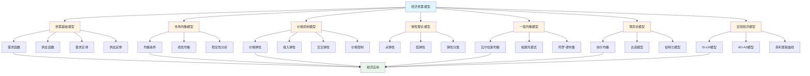
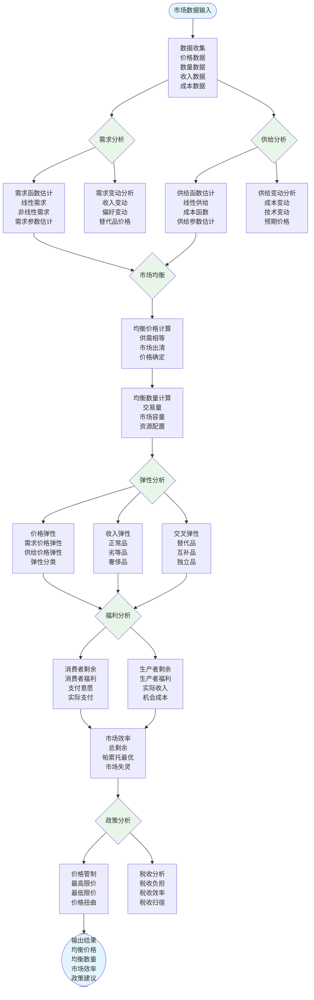

# 8.7 经济供需模型 / Economic Supply-Demand Models

> 交叉引用 / Cross-References
>
> - 章节大纲: [content/CHAPTER_09_OUTLINE.md 9.7](../../../content/CHAPTER_09_OUTLINE.md#97-经济供需模型--economic-supply-and-demand-models)
> - 全局索引: [docs/GLOBAL_INDEX.md](../../GLOBAL_INDEX.md)
> - 实现映射: [docs/09-实现示例/INDUSTRY_IMPLEMENTATION_MAPPING.md](../../09-实现示例/INDUSTRY_IMPLEMENTATION_MAPPING.md)
> - 评测协议标准: [docs/EVALUATION_PROTOCOLS_STANDARDS.md](../../EVALUATION_PROTOCOLS_STANDARDS.md)
> 注：更多统一规范见[评测协议标准](../../EVALUATION_PROTOCOLS_STANDARDS.md)

## 目录 / Table of Contents

- [8.7 经济供需模型 / Economic Supply-Demand Models](#87-经济供需模型--economic-supply-demand-models)
  - [目录 / Table of Contents](#目录--table-of-contents)
  - [经济供需模型框架图 / Framework Diagram of Economic Supply-Demand Models](#经济供需模型框架图--framework-diagram-of-economic-supply-demand-models)
  - [市场均衡分析流程图 / Flowchart of Market Equilibrium Analysis](#市场均衡分析流程图--flowchart-of-market-equilibrium-analysis)
  - [8.7.1 供需基础模型 / Basic Supply-Demand Models](#871-供需基础模型--basic-supply-demand-models)
    - [需求函数 / Demand Function](#需求函数--demand-function)
    - [供给函数 / Supply Function](#供给函数--supply-function)
    - [需求定律 / Law of Demand](#需求定律--law-of-demand)
    - [供给定律 / Law of Supply](#供给定律--law-of-supply)
  - [8.7.2 市场均衡模型 / Market Equilibrium Models](#872-市场均衡模型--market-equilibrium-models)
    - [均衡条件 / Equilibrium Conditions](#均衡条件--equilibrium-conditions)
    - [线性供需均衡 / Linear Supply-Demand Equilibrium](#线性供需均衡--linear-supply-demand-equilibrium)
    - [稳定性分析 / Stability Analysis](#稳定性分析--stability-analysis)
  - [8.7.3 价格机制模型 / Price Mechanism Models](#873-价格机制模型--price-mechanism-models)
    - [价格弹性 / Price Elasticity](#价格弹性--price-elasticity)
    - [收入弹性 / Income Elasticity](#收入弹性--income-elasticity)
    - [交叉价格弹性 / Cross-Price Elasticity](#交叉价格弹性--cross-price-elasticity)
    - [价格管制 / Price Controls](#价格管制--price-controls)
  - [8.7.4 弹性理论模型 / Elasticity Theory Models](#874-弹性理论模型--elasticity-theory-models)
    - [点弹性 / Point Elasticity](#点弹性--point-elasticity)
    - [弧弹性 / Arc Elasticity](#弧弹性--arc-elasticity)
    - [弹性分类 / Elasticity Classification](#弹性分类--elasticity-classification)
    - [弹性与总收入 / Elasticity and Total Revenue](#弹性与总收入--elasticity-and-total-revenue)
  - [8.7.5 一般均衡模型 / General Equilibrium Models](#875-一般均衡模型--general-equilibrium-models)
    - [瓦尔拉斯均衡 / Walrasian Equilibrium](#瓦尔拉斯均衡--walrasian-equilibrium)
    - [帕累托最优 / Pareto Optimality](#帕累托最优--pareto-optimality)
    - [阿罗-德布鲁模型 / Arrow-Debreu Model](#阿罗-德布鲁模型--arrow-debreu-model)
  - [8.7.6 博弈论模型 / Game Theory Models](#876-博弈论模型--game-theory-models)
    - [纳什均衡 / Nash Equilibrium](#纳什均衡--nash-equilibrium)
    - [古诺模型 / Cournot Model](#古诺模型--cournot-model)
    - [伯特兰模型 / Bertrand Model](#伯特兰模型--bertrand-model)
  - [8.7.7 宏观经济模型 / Macroeconomic Models](#877-宏观经济模型--macroeconomic-models)
    - [IS-LM模型 / IS-LM Model](#is-lm模型--is-lm-model)
    - [AD-AS模型 / AD-AS Model](#ad-as模型--ad-as-model)
    - [菲利普斯曲线 / Phillips Curve](#菲利普斯曲线--phillips-curve)
  - [8.7.8 实现与应用 / Implementation and Applications](#878-实现与应用--implementation-and-applications)
    - [Rust实现示例 / Rust Implementation Example](#rust实现示例--rust-implementation-example)
    - [Haskell实现示例 / Haskell Implementation Example](#haskell实现示例--haskell-implementation-example)
    - [应用领域 / Application Domains](#应用领域--application-domains)
      - [微观经济学 / Microeconomics](#微观经济学--microeconomics)
      - [宏观经济学 / Macroeconomics](#宏观经济学--macroeconomics)
      - [国际贸易 / International Trade](#国际贸易--international-trade)
  - [参考文献 / References](#参考文献--references)
  - [评测协议与指标 / Evaluation Protocols \& Metrics](#评测协议与指标--evaluation-protocols--metrics)
    - [范围与目标 / Scope \& Goals](#范围与目标--scope--goals)
    - [数据与划分 / Data \& Splits](#数据与划分--data--splits)
    - [通用指标 / Common Metrics](#通用指标--common-metrics)
    - [任务级协议 / Task-level Protocols](#任务级协议--task-level-protocols)
    - [复现实操 / Reproducibility](#复现实操--reproducibility)
  - [8.7.9 算法实现 / Algorithm Implementation](#879-算法实现--algorithm-implementation)
    - [供需基础算法 / Basic Supply-Demand Algorithms](#供需基础算法--basic-supply-demand-algorithms)
  - [相关模型 / Related Models](#相关模型--related-models)
    - [行业应用模型 / Industry Application Models](#行业应用模型--industry-application-models)
    - [工程科学模型 / Engineering Science Models](#工程科学模型--engineering-science-models)
    - [计算机科学模型 / Computer Science Models](#计算机科学模型--computer-science-models)
    - [数学科学模型 / Mathematical Science Models](#数学科学模型--mathematical-science-models)
    - [社会科学模型 / Social Science Models](#社会科学模型--social-science-models)
    - [基础理论 / Basic Theory](#基础理论--basic-theory)

---

## 经济供需模型框架图 / Framework Diagram of Economic Supply-Demand Models



## 市场均衡分析流程图 / Flowchart of Market Equilibrium Analysis



## 8.7.1 供需基础模型 / Basic Supply-Demand Models

### 需求函数 / Demand Function

**需求函数**: $Q_d = D(P, Y, P_s, P_c, T, N)$

其中：

- $Q_d$: 需求量
- $P$: 商品价格
- $Y$: 消费者收入
- $P_s$: 替代品价格
- $P_c$: 互补品价格
- $T$: 消费者偏好
- $N$: 消费者数量

**线性需求函数**: $Q_d = a - bP$

其中 $a > 0, b > 0$ 是参数。

### 供给函数 / Supply Function

**供给函数**: $Q_s = S(P, C, T, N, E)$

其中：

- $Q_s$: 供给量
- $P$: 商品价格
- $C$: 生产成本
- $T$: 技术水平
- $N$: 生产者数量
- $E$: 预期价格

**线性供给函数**: $Q_s = c + dP$

其中 $c, d > 0$ 是参数。

### 需求定律 / Law of Demand

**需求定律**: 在其他条件不变的情况下，价格上升，需求量下降。

$$\frac{\partial Q_d}{\partial P} < 0$$

### 供给定律 / Law of Supply

**供给定律**: 在其他条件不变的情况下，价格上升，供给量增加。

$$\frac{\partial Q_s}{\partial P} > 0$$

---

## 8.7.2 市场均衡模型 / Market Equilibrium Models

### 均衡条件 / Equilibrium Conditions

**市场均衡**: $Q_d = Q_s$

**均衡价格**: $P^*$ 满足 $D(P^*) = S(P^*)$

**均衡数量**: $Q^* = D(P^*) = S(P^*)$

### 线性供需均衡 / Linear Supply-Demand Equilibrium

**需求函数**: $Q_d = a - bP$

**供给函数**: $Q_s = c + dP$

**均衡条件**: $a - bP^* = c + dP^*$

**均衡价格**: $P^* = \frac{a - c}{b + d}$

**均衡数量**: $Q^* = \frac{ad + bc}{b + d}$

### 稳定性分析 / Stability Analysis

**瓦尔拉斯稳定性**: 当 $Q_d > Q_s$ 时，价格上升；当 $Q_d < Q_s$ 时，价格下降。

**马歇尔稳定性**: 当价格高于均衡价格时，供给过剩，价格下降；当价格低于均衡价格时，需求过剩，价格上升。

---

## 8.7.3 价格机制模型 / Price Mechanism Models

### 价格弹性 / Price Elasticity

**需求价格弹性**: $\epsilon_d = \frac{\partial Q_d}{\partial P} \cdot \frac{P}{Q_d}$

**供给价格弹性**: $\epsilon_s = \frac{\partial Q_s}{\partial P} \cdot \frac{P}{Q_s}$

### 收入弹性 / Income Elasticity

**需求收入弹性**: $\eta_d = \frac{\partial Q_d}{\partial Y} \cdot \frac{Y}{Q_d}$

### 交叉价格弹性 / Cross-Price Elasticity

**需求交叉价格弹性**: $\epsilon_{xy} = \frac{\partial Q_x}{\partial P_y} \cdot \frac{P_y}{Q_x}$

### 价格管制 / Price Controls

**价格上限**: $P_{max} < P^*$ 导致短缺

**价格下限**: $P_{min} > P^*$ 导致过剩

**短缺量**: $Q_d(P_{max}) - Q_s(P_{max})$

**过剩量**: $Q_s(P_{min}) - Q_d(P_{min})$

---

## 8.7.4 弹性理论模型 / Elasticity Theory Models

### 点弹性 / Point Elasticity

**需求点弹性**: $\epsilon_d = \frac{dQ_d}{dP} \cdot \frac{P}{Q_d}$

**供给点弹性**: $\epsilon_s = \frac{dQ_s}{dP} \cdot \frac{P}{Q_s}$

### 弧弹性 / Arc Elasticity

**需求弧弹性**: $\epsilon_d = \frac{Q_2 - Q_1}{P_2 - P_1} \cdot \frac{P_1 + P_2}{Q_1 + Q_2}$

### 弹性分类 / Elasticity Classification

**完全弹性**: $|\epsilon| = \infty$

**富有弹性**: $|\epsilon| > 1$

**单位弹性**: $|\epsilon| = 1$

**缺乏弹性**: $0 < |\epsilon| < 1$

**完全无弹性**: $|\epsilon| = 0$

### 弹性与总收入 / Elasticity and Total Revenue

**总收入**: $TR = P \cdot Q$

**总收入变化**: $\frac{dTR}{dP} = Q(1 + \epsilon_d)$

- 当 $|\epsilon_d| > 1$ 时，价格上升，总收入下降
- 当 $|\epsilon_d| < 1$ 时，价格上升，总收入上升
- 当 $|\epsilon_d| = 1$ 时，总收入不变

---

## 8.7.5 一般均衡模型 / General Equilibrium Models

### 瓦尔拉斯均衡 / Walrasian Equilibrium

**经济**: $E = (X_i, \preceq_i, \omega_i)_{i=1}^n$

**可行分配**: $\sum_{i=1}^n x_i \leq \sum_{i=1}^n \omega_i$

**瓦尔拉斯均衡**: $(x^*, p^*)$ 满足：

1. 每个消费者在预算约束下最大化效用
2. 市场出清: $\sum_{i=1}^n x_i^* = \sum_{i=1}^n \omega_i$

### 帕累托最优 / Pareto Optimality

**帕累托最优**: 不存在其他可行分配使得至少一个人的效用提高，且没有人效用降低。

**福利经济学第一定理**: 瓦尔拉斯均衡是帕累托最优的。

**福利经济学第二定理**: 在适当条件下，任何帕累托最优分配都可以通过瓦尔拉斯均衡实现。

### 阿罗-德布鲁模型 / Arrow-Debreu Model

**状态空间**: $\Omega = \{\omega_1, \ldots, \omega_S\}$

**或有商品**: $x_{is}$ 表示消费者 $i$ 在状态 $s$ 的商品消费

**预算约束**: $\sum_{s=1}^S p_s \cdot x_{is} \leq \sum_{s=1}^S p_s \cdot \omega_{is}$

---

## 8.7.6 博弈论模型 / Game Theory Models

### 纳什均衡 / Nash Equilibrium

**策略组合**: $\sigma = (\sigma_1, \ldots, \sigma_n)$

**纳什均衡**: 对于每个玩家 $i$，$\sigma_i$ 是对其他玩家策略的最优反应。

**数学表示**: $u_i(\sigma_i^*, \sigma_{-i}^*) \geq u_i(\sigma_i, \sigma_{-i}^*)$ 对所有 $\sigma_i$ 成立。

### 古诺模型 / Cournot Model

**双寡头竞争**: 两个企业选择产量 $q_1, q_2$

**市场需求**: $P = a - b(q_1 + q_2)$

**企业利润**: $\pi_i = (a - b(q_1 + q_2))q_i - c_i q_i$

**反应函数**: $q_i = \frac{a - c_i - bq_j}{2b}$

**纳什均衡**: $q_1^* = q_2^* = \frac{a - c}{3b}$

### 伯特兰模型 / Bertrand Model

**价格竞争**: 两个企业选择价格 $p_1, p_2$

**需求分配**: $D_i = \begin{cases} D(p_i) & \text{if } p_i < p_j \\ \frac{1}{2}D(p_i) & \text{if } p_i = p_j \\ 0 & \text{if } p_i > p_j \end{cases}$

**伯特兰悖论**: 在完全同质产品竞争中，均衡价格等于边际成本。

---

## 8.7.7 宏观经济模型 / Macroeconomic Models

### IS-LM模型 / IS-LM Model

**IS曲线**: $Y = C(Y - T) + I(r) + G$

**LM曲线**: $\frac{M}{P} = L(Y, r)$

**均衡**: IS曲线与LM曲线的交点

### AD-AS模型 / AD-AS Model

**总需求曲线**: $Y = C(Y - T) + I(r) + G + NX$

**总供给曲线**: $Y = F(K, L)$

**短期均衡**: AD曲线与SRAS曲线的交点

**长期均衡**: AD曲线与LRAS曲线的交点

### 菲利普斯曲线 / Phillips Curve

**短期菲利普斯曲线**: $\pi = \pi^e + \alpha(u^* - u) + \epsilon$

**长期菲利普斯曲线**: 垂直，自然失业率水平

---

## 8.7.8 实现与应用 / Implementation and Applications

### Rust实现示例 / Rust Implementation Example

```rust
use std::collections::HashMap;

#[derive(Debug, Clone)]
pub struct Market {
    pub demand_function: Box<dyn Fn(f64) -> f64>,
    pub supply_function: Box<dyn Fn(f64) -> f64>,
    pub equilibrium_price: Option<f64>,
    pub equilibrium_quantity: Option<f64>,
}

impl Market {
    pub fn new<D, S>(demand: D, supply: S) -> Self
    where
        D: Fn(f64) -> f64 + 'static,
        S: Fn(f64) -> f64 + 'static,
    {
        Self {
            demand_function: Box::new(demand),
            supply_function: Box::new(supply),
            equilibrium_price: None,
            equilibrium_quantity: None,
        }
    }

    pub fn find_equilibrium(&mut self, tolerance: f64, max_iterations: usize) -> Option<(f64, f64)> {
        let mut price = 1.0;

        for _ in 0..max_iterations {
            let demand = (self.demand_function)(price);
            let supply = (self.supply_function)(price);

            if (demand - supply).abs() < tolerance {
                self.equilibrium_price = Some(price);
                self.equilibrium_quantity = Some(demand);
                return Some((price, demand));
            }

            // 简单的价格调整机制
            if demand > supply {
                price *= 1.01; // 价格上涨
            } else {
                price *= 0.99; // 价格下跌
            }
        }

        None
    }

    pub fn calculate_elasticity(&self, price: f64, delta: f64) -> (f64, f64) {
        let demand_at_price = (self.demand_function)(price);
        let demand_at_price_plus_delta = (self.demand_function)(price + delta);
        let supply_at_price = (self.supply_function)(price);
        let supply_at_price_plus_delta = (self.supply_function)(price + delta);

        let demand_elasticity = (demand_at_price_plus_delta - demand_at_price) / delta * price / demand_at_price;
        let supply_elasticity = (supply_at_price_plus_delta - supply_at_price) / delta * price / supply_at_price;

        (demand_elasticity, supply_elasticity)
    }

    pub fn calculate_consumer_surplus(&self, price: f64) -> f64 {
        let mut surplus = 0.0;
        let mut current_price = 0.0;
        let step = 0.01;

        while current_price < price {
            let demand = (self.demand_function)(current_price);
            surplus += demand * step;
            current_price += step;
        }

        surplus - price * (self.demand_function)(price)
    }

    pub fn calculate_producer_surplus(&self, price: f64) -> f64 {
        let mut surplus = 0.0;
        let mut current_price = 0.0;
        let step = 0.01;

        while current_price < price {
            let supply = (self.supply_function)(current_price);
            surplus += supply * step;
            current_price += step;
        }

        price * (self.supply_function)(price) - surplus
    }
}

#[derive(Debug)]
pub struct CournotModel {
    pub firms: Vec<f64>, // 边际成本
    pub market_demand: Box<dyn Fn(f64) -> f64>,
    pub equilibrium_quantities: Vec<f64>,
}

impl CournotModel {
    pub fn new(firms: Vec<f64>, market_demand: Box<dyn Fn(f64) -> f64>) -> Self {
        Self {
            firms,
            market_demand,
            equilibrium_quantities: Vec::new(),
        }
    }

    pub fn find_equilibrium(&mut self, tolerance: f64, max_iterations: usize) -> Vec<f64> {
        let n = self.firms.len();
        let mut quantities = vec![1.0; n];

        for _ in 0..max_iterations {
            let mut new_quantities = quantities.clone();
            let mut converged = true;

            for i in 0..n {
                let total_quantity: f64 = quantities.iter().sum();
                let market_price = (self.market_demand)(total_quantity);

                // 计算企业i的最优产量
                let marginal_revenue = market_price - quantities[i] * self.derivative_at(total_quantity);
                let optimal_quantity = (marginal_revenue - self.firms[i]) / self.derivative_at(total_quantity);

                new_quantities[i] = optimal_quantity.max(0.0);

                if (new_quantities[i] - quantities[i]).abs() > tolerance {
                    converged = false;
                }
            }

            quantities = new_quantities;

            if converged {
                break;
            }
        }

        self.equilibrium_quantities = quantities.clone();
        quantities
    }

    fn derivative_at(&self, quantity: f64) -> f64 {
        let delta = 0.01;
        let price1 = (self.market_demand)(quantity);
        let price2 = (self.market_demand)(quantity + delta);
        (price2 - price1) / delta
    }
}

// 使用示例
fn main() {
    // 线性供需模型
    let demand = |p: f64| (100.0 - p).max(0.0);
    let supply = |p: f64| (p - 20.0).max(0.0);

    let mut market = Market::new(demand, supply);

    if let Some((price, quantity)) = market.find_equilibrium(0.01, 1000) {
        println!("Equilibrium price: {:.2}", price);
        println!("Equilibrium quantity: {:.2}", quantity);

        let (demand_elasticity, supply_elasticity) = market.calculate_elasticity(price, 0.01);
        println!("Demand elasticity: {:.2}", demand_elasticity);
        println!("Supply elasticity: {:.2}", supply_elasticity);

        let consumer_surplus = market.calculate_consumer_surplus(price);
        let producer_surplus = market.calculate_producer_surplus(price);
        println!("Consumer surplus: {:.2}", consumer_surplus);
        println!("Producer surplus: {:.2}", producer_surplus);
    }

    // 古诺模型示例
    let market_demand = |q: f64| (100.0 - q).max(0.0);
    let mut cournot = CournotModel::new(vec![10.0, 15.0], Box::new(market_demand));

    let equilibrium_quantities = cournot.find_equilibrium(0.01, 1000);
    println!("Cournot equilibrium quantities: {:?}", equilibrium_quantities);
}
```

### Haskell实现示例 / Haskell Implementation Example

```haskell
module EconomicModels where

import Data.List (sum, length)
import Data.Vector (Vector)
import qualified Data.Vector as V

-- 市场数据类型
data Market = Market {
    demandFunction :: Double -> Double,
    supplyFunction :: Double -> Double,
    equilibriumPrice :: Maybe Double,
    equilibriumQuantity :: Maybe Double
} deriving Show

-- 创建市场
newMarket :: (Double -> Double) -> (Double -> Double) -> Market
newMarket demand supply = Market {
    demandFunction = demand,
    supplyFunction = supply,
    equilibriumPrice = Nothing,
    equilibriumQuantity = Nothing
}

-- 寻找均衡
findEquilibrium :: Market -> Double -> Int -> Maybe (Double, Double)
findEquilibrium market tolerance maxIterations = go 1.0 0
  where
    go price iterations
        | iterations >= maxIterations = Nothing
        | abs (demand - supply) < tolerance = Just (price, demand)
        | demand > supply = go (price * 1.01) (iterations + 1)
        | otherwise = go (price * 0.99) (iterations + 1)
      where
        demand = demandFunction market price
        supply = supplyFunction market price

-- 计算弹性
calculateElasticity :: Market -> Double -> Double -> (Double, Double)
calculateElasticity market price delta = (demandElasticity, supplyElasticity)
  where
    demandAtPrice = demandFunction market price
    demandAtPricePlusDelta = demandFunction market (price + delta)
    supplyAtPrice = supplyFunction market price
    supplyAtPricePlusDelta = supplyFunction market (price + delta)

    demandElasticity = (demandAtPricePlusDelta - demandAtPrice) / delta * price / demandAtPrice
    supplyElasticity = (supplyAtPricePlusDelta - supplyAtPrice) / delta * price / supplyAtPrice

-- 计算消费者剩余
calculateConsumerSurplus :: Market -> Double -> Double
calculateConsumerSurplus market price = surplus - price * demandAtPrice
  where
    demandAtPrice = demandFunction market price
    surplus = sum [demandFunction market p * 0.01 | p <- [0, 0.01..price]]

-- 古诺模型
data CournotModel = CournotModel {
    firms :: Vector Double,  -- 边际成本
    marketDemand :: Double -> Double,
    equilibriumQuantities :: Vector Double
} deriving Show

-- 创建古诺模型
newCournotModel :: [Double] -> (Double -> Double) -> CournotModel
newCournotModel costs demand = CournotModel {
    firms = V.fromList costs,
    marketDemand = demand,
    equilibriumQuantities = V.empty
}

-- 寻找古诺均衡
findCournotEquilibrium :: CournotModel -> Double -> Int -> Vector Double
findCournotEquilibrium model tolerance maxIterations = go (V.replicate (V.length (firms model)) 1.0) 0
  where
    go quantities iterations
        | iterations >= maxIterations = quantities
        | converged = quantities
        | otherwise = go newQuantities (iterations + 1)
      where
        totalQuantity = V.sum quantities
        marketPrice = marketDemand model totalQuantity

        newQuantities = V.imap (\i q ->
            let marginalRevenue = marketPrice - q * derivativeAt totalQuantity
                optimalQuantity = (marginalRevenue - firms model V.! i) / derivativeAt totalQuantity
            in max 0.0 optimalQuantity) quantities

        converged = V.all (\i -> abs (newQuantities V.! i - quantities V.! i) < tolerance)
                          (V.enumFromN 0 (V.length quantities))

    derivativeAt quantity = (marketDemand model (quantity + 0.01) - marketDemand model quantity) / 0.01

-- 示例使用
example :: IO ()
example = do
    -- 线性供需模型
    let demand p = max 0.0 (100.0 - p)
        supply p = max 0.0 (p - 20.0)
        market = newMarket demand supply

    case findEquilibrium market 0.01 1000 of
        Just (price, quantity) -> do
            putStrLn $ "Equilibrium price: " ++ show price
            putStrLn $ "Equilibrium quantity: " ++ show quantity

            let (demandElasticity, supplyElasticity) = calculateElasticity market price 0.01
            putStrLn $ "Demand elasticity: " ++ show demandElasticity
            putStrLn $ "Supply elasticity: " ++ show supplyElasticity

            let consumerSurplus = calculateConsumerSurplus market price
            putStrLn $ "Consumer surplus: " ++ show consumerSurplus

        Nothing -> putStrLn "No equilibrium found"

    -- 古诺模型示例
    let marketDemand q = max 0.0 (100.0 - q)
        cournot = newCournotModel [10.0, 15.0] marketDemand
        equilibrium = findCournotEquilibrium cournot 0.01 1000

    putStrLn $ "Cournot equilibrium quantities: " ++ show (V.toList equilibrium)
```

### 应用领域 / Application Domains

#### 微观经济学 / Microeconomics

- **消费者理论**: 效用最大化、需求函数
- **生产者理论**: 成本最小化、供给函数
- **市场结构**: 完全竞争、垄断、寡头垄断

#### 宏观经济学 / Macroeconomics

- **国民收入**: GDP、消费、投资、政府支出
- **货币理论**: 货币供给、需求、利率
- **经济周期**: 扩张、收缩、失业、通货膨胀

#### 国际贸易 / International Trade

- **比较优势**: 李嘉图模型
- **要素禀赋**: 赫克歇尔-俄林模型
- **贸易政策**: 关税、配额、补贴

---

## 参考文献 / References

1. Varian, H. R. (2014). Intermediate Microeconomics: A Modern Approach. W.W. Norton.
2. Mankiw, N. G. (2014). Principles of Economics. Cengage Learning.
3. Mas-Colell, A., Whinston, M. D., & Green, J. R. (1995). Microeconomic Theory. Oxford University Press.
4. Blanchard, O. (2017). Macroeconomics. Pearson.

---

## 评测协议与指标 / Evaluation Protocols & Metrics

### 范围与目标 / Scope & Goals

- 覆盖供需平衡、市场均衡、价格发现、经济预测的核心评测场景。
- 可复现实证：同一数据、同一协议下，模型实现结果可对比。

### 数据与划分 / Data & Splits

- 经济数据：价格序列、交易量、GDP、通胀率、就业数据、政策指标。
- 划分：训练(60%) / 验证(20%) / 测试(20%)，按时间顺序滚动划窗。

### 通用指标 / Common Metrics

- 预测精度：MAPE、RMSE、MAE、方向准确率、趋势捕捉能力。
- 均衡指标：市场出清度、价格收敛性、供需匹配度、效率损失。
- 稳定性指标：系统鲁棒性、冲击响应、恢复时间、波动性控制。
- 政策效果：政策传导效率、目标达成度、副作用评估、长期影响。

### 任务级协议 / Task-level Protocols

1) 供需建模：弹性系数估计、均衡点预测、市场出清时间、价格发现效率。
2) 市场均衡：纳什均衡收敛、帕累托效率、社会福利最大化、分配公平性。
3) 价格预测：短期/长期预测精度、波动率预测、极端事件捕捉、季节性调整。
4) 政策仿真：政策冲击响应、传导机制分析、多目标权衡、风险评估。

### 复现实操 / Reproducibility

- 提供数据schema、预处理与评测脚本；固定随机种子与版本。
- 输出：指标汇总表、供需曲线图、均衡点可视化、政策效果对比。

---

## 8.7.9 算法实现 / Algorithm Implementation

### 供需基础算法 / Basic Supply-Demand Algorithms

```python
from typing import Dict, List, Any, Optional, Tuple, Callable
import numpy as np
from dataclasses import dataclass
from scipy.optimize import fsolve

class DemandFunction:
    """需求函数"""

    def __init__(self, a: float, b: float):
        self.a = a  # 截距
        self.b = b  # 斜率

    def __call__(self, price: float) -> float:
        """计算需求量"""
        return max(0, self.a - self.b * price)

    def inverse(self, quantity: float) -> float:
        """反需求函数"""
        return max(0, (self.a - quantity) / self.b)

class SupplyFunction:
    """供给函数"""

    def __init__(self, c: float, d: float):
        self.c = c  # 截距
        self.d = d  # 斜率

    def __call__(self, price: float) -> float:
        """计算供给量"""
        return max(0, self.c + self.d * price)

    def inverse(self, quantity: float) -> float:
        """反供给函数"""
        return max(0, (quantity - self.c) / self.d)

class MarketEquilibrium:
    """市场均衡"""

    def __init__(self, demand: DemandFunction, supply: SupplyFunction):
        self.demand = demand
        self.supply = supply

    def find_equilibrium(self) -> Optional[Tuple[float, float]]:
        """寻找均衡价格和数量"""
        def excess_demand(price):
            return self.demand(price) - self.supply(price)

        try:
            # 使用数值方法求解
            equilibrium_price = fsolve(excess_demand, 50.0)[0]
            equilibrium_quantity = self.demand(equilibrium_price)

            if equilibrium_price > 0 and equilibrium_quantity > 0:
                return equilibrium_price, equilibrium_quantity
            else:
                return None
        except:
            return None

    def calculate_consumer_surplus(self, price: float) -> float:
        """计算消费者剩余"""
        if price <= 0:
            return 0.0

        # 计算需求曲线下的面积
        max_price = self.demand.inverse(0)
        if max_price <= price:
            return 0.0

        # 简化的梯形面积计算
        quantity = self.demand(price)
        surplus = 0.5 * (max_price - price) * quantity
        return surplus

    def calculate_producer_surplus(self, price: float) -> float:
        """计算生产者剩余"""
        if price <= 0:
            return 0.0

        # 计算供给曲线下的面积
        min_price = self.supply.inverse(0)
        if price <= min_price:
            return 0.0

        quantity = self.supply(price)
        surplus = 0.5 * (price - min_price) * quantity
        return surplus

### 弹性计算算法 / Elasticity Calculation Algorithms

class ElasticityCalculator:
    """弹性计算器"""

    def __init__(self):
        pass

    def price_elasticity_of_demand(self, demand_func: Callable,
                                 price: float, delta: float = 0.01) -> float:
        """需求价格弹性"""
        quantity = demand_func(price)
        if quantity <= 0:
            return 0.0

        new_price = price + delta
        new_quantity = demand_func(new_price)

        price_change = (new_price - price) / price
        quantity_change = (new_quantity - quantity) / quantity

        if price_change == 0:
            return 0.0

        elasticity = quantity_change / price_change
        return elasticity

    def income_elasticity_of_demand(self, demand_func: Callable,
                                  income: float, price: float,
                                  delta: float = 0.01) -> float:
        """需求收入弹性"""
        quantity = demand_func(price, income)
        if quantity <= 0:
            return 0.0

        new_income = income + delta
        new_quantity = demand_func(price, new_income)

        income_change = (new_income - income) / income
        quantity_change = (new_quantity - quantity) / quantity

        if income_change == 0:
            return 0.0

        elasticity = quantity_change / income_change
        return elasticity

    def cross_price_elasticity(self, demand_func: Callable,
                             price: float, other_price: float,
                             delta: float = 0.01) -> float:
        """交叉价格弹性"""
        quantity = demand_func(price, other_price)
        if quantity <= 0:
            return 0.0

        new_other_price = other_price + delta
        new_quantity = demand_func(price, new_other_price)

        price_change = (new_other_price - other_price) / other_price
        quantity_change = (new_quantity - quantity) / quantity

        if price_change == 0:
            return 0.0

        elasticity = quantity_change / price_change
        return elasticity

### 博弈论算法 / Game Theory Algorithms

class NashEquilibrium:
    """纳什均衡"""

    def __init__(self):
        pass

    def find_nash_equilibrium(self, payoff_matrix_A: np.ndarray,
                            payoff_matrix_B: np.ndarray) -> List[Tuple[int, int]]:
        """寻找纳什均衡"""
        n_strategies_A = payoff_matrix_A.shape[0]
        n_strategies_B = payoff_matrix_A.shape[1]
        nash_equilibria = []

        for i in range(n_strategies_A):
            for j in range(n_strategies_B):
                # 检查是否为纳什均衡
                is_nash = True

                # 检查玩家A是否有更好的策略
                for k in range(n_strategies_A):
                    if payoff_matrix_A[k, j] > payoff_matrix_A[i, j]:
                        is_nash = False
                        break

                if not is_nash:
                    continue

                # 检查玩家B是否有更好的策略
                for l in range(n_strategies_B):
                    if payoff_matrix_B[i, l] > payoff_matrix_B[i, j]:
                        is_nash = False
                        break

                if is_nash:
                    nash_equilibria.append((i, j))

        return nash_equilibria

class CournotModel:
    """古诺模型"""

    def __init__(self, n_firms: int, market_demand: Callable,
                 marginal_costs: List[float]):
        self.n_firms = n_firms
        self.market_demand = market_demand
        self.marginal_costs = marginal_costs

    def find_equilibrium(self, tolerance: float = 1e-6,
                        max_iterations: int = 1000) -> List[float]:
        """寻找古诺均衡"""
        # 初始化产量
        quantities = [1.0] * self.n_firms

        for iteration in range(max_iterations):
            new_quantities = quantities.copy()

            for i in range(self.n_firms):
                # 计算其他企业的总产量
                other_quantity = sum(quantities[j] for j in range(self.n_firms) if j != i)

                # 计算市场价格
                total_quantity = other_quantity + quantities[i]
                market_price = self.market_demand(total_quantity)

                # 计算边际收益
                marginal_revenue = market_price - quantities[i] * self._demand_derivative(total_quantity)

                # 最优产量条件：边际收益 = 边际成本
                if self._demand_derivative(total_quantity) != 0:
                    optimal_quantity = (marginal_revenue - self.marginal_costs[i]) / \
                                     (-self._demand_derivative(total_quantity))
                    new_quantities[i] = max(0, optimal_quantity)

            # 检查收敛
            if all(abs(new_quantities[i] - quantities[i]) < tolerance
                   for i in range(self.n_firms)):
                break

            quantities = new_quantities

        return quantities

    def _demand_derivative(self, quantity: float, delta: float = 0.01) -> float:
        """需求函数的导数"""
        return (self.market_demand(quantity + delta) - self.market_demand(quantity)) / delta

class BertrandModel:
    """伯特兰模型"""

    def __init__(self, n_firms: int, marginal_costs: List[float]):
        self.n_firms = n_firms
        self.marginal_costs = marginal_costs

    def find_equilibrium(self) -> List[float]:
        """寻找伯特兰均衡"""
        # 伯特兰均衡：价格等于最低边际成本
        min_cost = min(self.marginal_costs)

        # 所有企业都定价在最低边际成本
        equilibrium_prices = [min_cost] * self.n_firms

        return equilibrium_prices

### 宏观经济模型算法 / Macroeconomic Model Algorithms

class ISLMModel:
    """IS-LM模型"""

    def __init__(self, consumption_func: Callable, investment_func: Callable,
                 money_demand_func: Callable, money_supply: float):
        self.consumption_func = consumption_func
        self.investment_func = investment_func
        self.money_demand_func = money_demand_func
        self.money_supply = money_supply

    def find_equilibrium(self, government_spending: float, taxes: float) -> Tuple[float, float]:
        """寻找IS-LM均衡"""
        def is_curve(y, r):
            """IS曲线"""
            c = self.consumption_func(y - taxes)
            i = self.investment_func(r)
            return y - c - i - government_spending

        def lm_curve(y, r):
            """LM曲线"""
            return self.money_demand_func(y, r) - self.money_supply

        def system(vars):
            y, r = vars
            return [is_curve(y, r), lm_curve(y, r)]

        # 初始猜测
        initial_guess = [1000.0, 0.05]

        try:
            equilibrium = fsolve(system, initial_guess)
            return equilibrium[0], equilibrium[1]  # Y, r
        except:
            return None, None

class PhillipsCurve:
    """菲利普斯曲线"""

    def __init__(self, natural_unemployment: float = 0.05,
                 inflation_expectations: float = 0.02):
        self.natural_unemployment = natural_unemployment
        self.inflation_expectations = inflation_expectations

    def calculate_inflation(self, unemployment: float,
                          supply_shock: float = 0.0) -> float:
        """计算通货膨胀率"""
        # 简化的菲利普斯曲线
        inflation = self.inflation_expectations - \
                   0.5 * (unemployment - self.natural_unemployment) + \
                   supply_shock
        return inflation

    def calculate_sacrifice_ratio(self, initial_unemployment: float,
                                target_unemployment: float,
                                disinflation_periods: int) -> float:
        """计算牺牲率"""
        unemployment_gap = target_unemployment - initial_unemployment
        sacrifice_ratio = unemployment_gap / disinflation_periods
        return sacrifice_ratio

def economic_supply_demand_verification():
    """经济供需模型验证"""
    print("=== 经济供需模型验证 ===")

    # 供需基础验证
    print("\n1. 供需基础验证:")

    # 创建供需函数
    demand = DemandFunction(a=100, b=2)  # Qd = 100 - 2P
    supply = SupplyFunction(c=-20, d=3)  # Qs = -20 + 3P

    market = MarketEquilibrium(demand, supply)
    equilibrium = market.find_equilibrium()

    if equilibrium:
        price, quantity = equilibrium
        print(f"均衡价格: ${price:.2f}")
        print(f"均衡数量: {quantity:.2f}")

        consumer_surplus = market.calculate_consumer_surplus(price)
        producer_surplus = market.calculate_producer_surplus(price)
        print(f"消费者剩余: ${consumer_surplus:.2f}")
        print(f"生产者剩余: ${producer_surplus:.2f}")

    # 弹性计算验证
    print("\n2. 弹性计算验证:")

    elasticity_calc = ElasticityCalculator()

    # 需求价格弹性
    def demand_func(price):
        return max(0, 100 - 2 * price)

    price_elasticity = elasticity_calc.price_elasticity_of_demand(demand_func, 30)
    print(f"需求价格弹性: {price_elasticity:.4f}")

    # 博弈论验证
    print("\n3. 博弈论验证:")

    # 纳什均衡
    payoff_A = np.array([[3, 1], [0, 2]])  # 囚徒困境
    payoff_B = np.array([[3, 0], [1, 2]])

    nash = NashEquilibrium()
    equilibria = nash.find_nash_equilibrium(payoff_A, payoff_B)
    print(f"纳什均衡: {equilibria}")

    # 古诺模型
    def market_demand(total_quantity):
        return max(0, 100 - total_quantity)

    cournot = CournotModel(n_firms=2, market_demand=market_demand,
                          marginal_costs=[10, 15])
    equilibrium_quantities = cournot.find_equilibrium()
    print(f"古诺均衡产量: {equilibrium_quantities}")

    # 伯特兰模型
    bertrand = BertrandModel(n_firms=2, marginal_costs=[10, 15])
    equilibrium_prices = bertrand.find_equilibrium()
    print(f"伯特兰均衡价格: {equilibrium_prices}")

    # 宏观经济模型验证
    print("\n4. 宏观经济模型验证:")

    # IS-LM模型
    def consumption(disposable_income):
        return 100 + 0.8 * disposable_income

    def investment(interest_rate):
        return 200 - 1000 * interest_rate

    def money_demand(income, interest_rate):
        return 0.5 * income - 1000 * interest_rate

    islm = ISLMModel(consumption, investment, money_demand, money_supply=500)
    equilibrium_y, equilibrium_r = islm.find_equilibrium(government_spending=100, taxes=50)

    if equilibrium_y is not None:
        print(f"均衡收入: ${equilibrium_y:.2f}")
        print(f"均衡利率: {equilibrium_r:.4f}")

    # 菲利普斯曲线
    phillips = PhillipsCurve()
    inflation = phillips.calculate_inflation(unemployment=0.06)
    print(f"通货膨胀率: {inflation:.4f}")

    sacrifice_ratio = phillips.calculate_sacrifice_ratio(
        initial_unemployment=0.08, target_unemployment=0.05, disinflation_periods=5
    )
    print(f"牺牲率: {sacrifice_ratio:.4f}")

    print("\n验证完成!")

if __name__ == "__main__":
    economic_supply_demand_verification()
```

---

## 相关模型 / Related Models

### 行业应用模型 / Industry Application Models

- **[物流供应链模型](../01-物流供应链模型/README.md)** - 供应链中的供需平衡、库存管理和需求预测都是经济供需理论的应用
- **[交通运输模型](../02-交通运输模型/README.md)** - 交通需求预测、交通供给规划和交通市场均衡分析
- **[电力能源模型](../03-电力能源模型/README.md)** - 电力供需平衡、电价形成机制和能源市场均衡分析
- **[信息技术模型](../04-信息技术模型/README.md)** - 信息技术产品供需、数字市场均衡和平台经济分析
- **[人工智能行业模型](../05-人工智能行业模型/README.md)** - AI服务供需、数据市场均衡和算法定价
- **[银行金融模型](../06-银行金融模型/README.md)** - 金融市场供需关系、价格形成机制和市场均衡分析
- **[制造业模型](../08-制造业模型/README.md)** - 制造业供需平衡、生产计划和市场预测
- **[医疗健康模型](../09-医疗健康模型/README.md)** - 医疗资源供需、医疗服务定价和健康市场均衡
- **[教育学习模型](../10-教育学习模型/README.md)** - 教育资源供需、教育市场均衡和教育定价机制

### 工程科学模型 / Engineering Science Models

- **[优化模型](../../07-工程科学模型/01-优化模型/README.md)** - 市场均衡求解、资源配置优化和福利最大化都是优化问题
- **[控制论模型](../../07-工程科学模型/02-控制论模型/README.md)** - 经济系统控制、价格调节机制和宏观经济调控

### 计算机科学模型 / Computer Science Models

- **[算法模型](../../04-计算机科学模型/02-算法模型/README.md)** - 市场均衡计算、优化算法和数值方法在经济分析中应用
- **[人工智能模型](../../04-计算机科学模型/05-人工智能模型/README.md)** - 机器学习方法在需求预测、价格预测和市场分析中的应用

### 数学科学模型 / Mathematical Science Models

- **[代数模型](../../03-数学科学模型/01-代数模型/README.md)** - 线性代数、矩阵运算在一般均衡模型、投入产出分析和经济计量中应用广泛
- **[几何模型](../../03-数学科学模型/02-几何模型/README.md)** - 经济几何、无差异曲线、生产可能性边界和预算约束线
- **[拓扑模型](../../03-数学科学模型/03-拓扑模型/README.md)** - 经济拓扑、一般均衡存在性证明和不动点定理

### 社会科学模型 / Social Science Models

- **[经济学模型](../../06-社会科学模型/02-经济学模型/README.md)** - 经济供需模型是经济学理论的核心，包括微观经济学和宏观经济学
- **[社会网络模型](../../06-社会科学模型/01-社会网络模型/README.md)** - 经济网络、贸易网络和金融网络分析
- **[博弈论模型](../../06-社会科学模型/02-经济学模型/README.md)** - 市场博弈、价格竞争和策略互动分析

### 基础理论 / Basic Theory

- **[模型分类学](../../01-基础理论/01-模型分类学/README.md)** - 经济供需模型的分类和体系化需要模型分类学理论指导
- **[形式化方法论](../../01-基础理论/02-形式化方法论/README.md)** - 经济模型的形式化描述、数学证明和理论验证需要形式化方法论
- **[科学模型论](../../01-基础理论/03-科学模型论/README.md)** - 经济供需模型的构建、验证和评价需要科学模型论指导

---

*最后更新: 2025-08-26*
*版本: 1.1.0*
