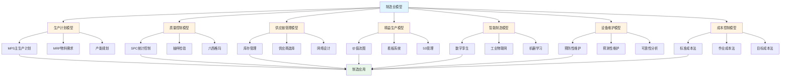

# 8.8 制造业模型 / Manufacturing Models

> 交叉引用 / Cross-References
>
> - 章节大纲: [content/CHAPTER_09_OUTLINE.md 9.8](../../../content/CHAPTER_09_OUTLINE.md#98-制造业模型--manufacturing-models)
> - 全局索引: [docs/GLOBAL_INDEX.md](../../GLOBAL_INDEX.md)
> - 实现映射: [docs/09-实现示例/INDUSTRY_IMPLEMENTATION_MAPPING.md](../../09-实现示例/INDUSTRY_IMPLEMENTATION_MAPPING.md)
> - 评测协议标准: [docs/EVALUATION_PROTOCOLS_STANDARDS.md](../../EVALUATION_PROTOCOLS_STANDARDS.md)

## 目录 / Table of Contents

- [8.8 制造业模型 / Manufacturing Models](#88-制造业模型--manufacturing-models)
  - [目录 / Table of Contents](#目录--table-of-contents)
  - [制造业模型框架图 / Framework Diagram of Manufacturing Models](#制造业模型框架图--framework-diagram-of-manufacturing-models)
  - [智能制造生产流程 / Flowchart of Smart Manufacturing Production](#智能制造生产流程--flowchart-of-smart-manufacturing-production)
  - [8.8.1 生产计划模型 / Production Planning Models](#881-生产计划模型--production-planning-models)
    - [主生产计划 (MPS) / Master Production Schedule](#主生产计划-mps--master-production-schedule)
    - [物料需求计划 (MRP) / Material Requirements Planning](#物料需求计划-mrp--material-requirements-planning)
    - [产能规划 / Capacity Planning](#产能规划--capacity-planning)
  - [8.8.2 质量控制模型 / Quality Control Models](#882-质量控制模型--quality-control-models)
    - [统计过程控制 (SPC) / Statistical Process Control](#统计过程控制-spc--statistical-process-control)
    - [抽样检验 / Sampling Inspection](#抽样检验--sampling-inspection)
    - [六西格玛 / Six Sigma](#六西格玛--six-sigma)
  - [8.8.3 供应链管理模型 / Supply Chain Management Models](#883-供应链管理模型--supply-chain-management-models)
    - [库存管理 / Inventory Management](#库存管理--inventory-management)
    - [供应商选择 / Supplier Selection](#供应商选择--supplier-selection)
    - [网络设计 / Network Design](#网络设计--network-design)
  - [8.8.4 精益生产模型 / Lean Manufacturing Models](#884-精益生产模型--lean-manufacturing-models)
    - [价值流图 / Value Stream Mapping](#价值流图--value-stream-mapping)
    - [看板系统 / Kanban System](#看板系统--kanban-system)
    - [5S管理 / 5S Management](#5s管理--5s-management)
  - [8.8.5 智能制造模型 / Smart Manufacturing Models](#885-智能制造模型--smart-manufacturing-models)
    - [数字孪生 / Digital Twin](#数字孪生--digital-twin)
    - [工业物联网 (IIoT) / Industrial Internet of Things](#工业物联网-iiot--industrial-internet-of-things)
    - [机器学习应用 / Machine Learning Applications](#机器学习应用--machine-learning-applications)
  - [8.8.6 设备维护模型 / Equipment Maintenance Models](#886-设备维护模型--equipment-maintenance-models)
    - [预防性维护 / Preventive Maintenance](#预防性维护--preventive-maintenance)
    - [预测性维护 / Predictive Maintenance](#预测性维护--predictive-maintenance)
    - [可靠性分析 / Reliability Analysis](#可靠性分析--reliability-analysis)
  - [8.8.7 成本控制模型 / Cost Control Models](#887-成本控制模型--cost-control-models)
    - [标准成本法 / Standard Costing](#标准成本法--standard-costing)
    - [作业成本法 (ABC) / Activity-Based Costing](#作业成本法-abc--activity-based-costing)
    - [目标成本法 / Target Costing](#目标成本法--target-costing)
  - [8.8.8 实现与应用 / Implementation and Applications](#888-实现与应用--implementation-and-applications)
    - [Rust实现示例 / Rust Implementation Example](#rust实现示例--rust-implementation-example)
    - [Haskell实现示例 / Haskell Implementation Example](#haskell实现示例--haskell-implementation-example)
    - [应用领域 / Application Domains](#应用领域--application-domains)
      - [生产管理 / Production Management](#生产管理--production-management)
      - [质量管理 / Quality Management](#质量管理--quality-management)
      - [供应链管理 / Supply Chain Management](#供应链管理--supply-chain-management)
  - [参考文献 / References](#参考文献--references)
  - [评测协议与指标 / Evaluation Protocols \& Metrics](#评测协议与指标--evaluation-protocols--metrics)
    - [范围与目标 / Scope \& Goals](#范围与目标--scope--goals)
    - [数据与划分 / Data \& Splits](#数据与划分--data--splits)
    - [通用指标 / Common Metrics](#通用指标--common-metrics)
    - [任务级协议 / Task-level Protocols](#任务级协议--task-level-protocols)
    - [复现实操 / Reproducibility](#复现实操--reproducibility)
  - [8.8.9 算法实现 / Algorithm Implementation](#889-算法实现--algorithm-implementation)
    - [生产计划算法 / Production Planning Algorithms](#生产计划算法--production-planning-algorithms)
      - [Julia实现示例 / Julia Implementation Example](#julia实现示例--julia-implementation-example)
  - [相关模型 / Related Models](#相关模型--related-models)
    - [行业应用模型 / Industry Application Models](#行业应用模型--industry-application-models)
    - [工程科学模型 / Engineering Science Models](#工程科学模型--engineering-science-models)
    - [计算机科学模型 / Computer Science Models](#计算机科学模型--computer-science-models)
    - [数学科学模型 / Mathematical Science Models](#数学科学模型--mathematical-science-models)
    - [物理科学模型 / Physical Science Models](#物理科学模型--physical-science-models)
    - [社会科学模型 / Social Science Models](#社会科学模型--social-science-models)
    - [基础理论 / Basic Theory](#基础理论--basic-theory)

---

## 制造业模型框架图 / Framework Diagram of Manufacturing Models



## 智能制造生产流程 / Flowchart of Smart Manufacturing Production

```mermaid
flowchart TD
    Start([订单接收]) --> OrderAnalysis[订单分析<br/>需求预测<br/>订单优先级<br/>交期评估]

    OrderAnalysis --> ProductionPlanning{生产计划}
    ProductionPlanning --> MPS[主生产计划MPS<br/>产品分解<br/>时间安排<br/>资源分配]
    ProductionPlanning --> MRP[物料需求计划MRP<br/>BOM展开<br/>物料计算<br/>采购计划]

    MPS --> CapacityCheck{产能检查}
    MRP --> CapacityCheck

    CapacityCheck -->|充足| ProductionExecution[生产执行<br/>工艺路线<br/>工序安排<br/>设备调度]
    CapacityCheck -->|不足| CapacityExpansion[产能扩展<br/>设备增加<br/>外协加工<br/>时间调整]

    CapacityExpansion --> ProductionExecution

    ProductionExecution --> QualityControl{质量控制}
    QualityControl --> SPC[统计过程控制<br/>实时监控<br/>异常检测<br/>过程能力]
    QualityControl --> Inspection[质量检验<br/>抽样检验<br/>全检<br/>不合格品处理]

    SPC --> LeanProduction{精益生产}
    Inspection --> LeanProduction

    LeanProduction --> ValueStream[价值流分析<br/>浪费识别<br/>流程优化<br/>效率提升]
    LeanProduction --> Kanban[看板管理<br/>拉动生产<br/>库存控制<br/>JIT生产]

    ValueStream --> SmartManufacturing{智能制造}
    Kanban --> SmartManufacturing

    SmartManufacturing --> DigitalTwin[数字孪生<br/>虚拟仿真<br/>预测分析<br/>优化决策]
    SmartManufacturing --> IIoT[工业物联网<br/>数据采集<br/>设备互联<br/>实时监控]
    SmartManufacturing --> ML[机器学习<br/>预测性维护<br/>质量预测<br/>优化调度]

    DigitalTwin --> Maintenance{设备维护}
    IIoT --> Maintenance
    ML --> Maintenance

    Maintenance --> Preventive[预防性维护<br/>定期保养<br/>计划维护<br/>备件管理]
    Maintenance --> Predictive[预测性维护<br/>故障预测<br/>健康评估<br/>维护优化]

    Preventive --> CostControl{成本控制}
    Predictive --> CostControl

    CostControl --> CostAnalysis[成本分析<br/>标准成本<br/>实际成本<br/>差异分析]
    CostControl --> CostOptimization[成本优化<br/>作业成本<br/>目标成本<br/>持续改进]

    CostAnalysis --> Delivery[产品交付<br/>包装<br/>物流<br/>客户服务]

    CostOptimization --> Delivery

    Delivery --> Feedback[反馈收集<br/>客户反馈<br/>质量反馈<br/>改进建议]
    Feedback --> OrderAnalysis

    style Start fill:#e1f5ff
    style Delivery fill:#e1f5ff
    style ProductionPlanning fill:#e8f5e9
    style QualityControl fill:#e8f5e9
    style LeanProduction fill:#e8f5e9
    style SmartManufacturing fill:#e8f5e9
    style Maintenance fill:#e8f5e9
    style CostControl fill:#e8f5e9
```



## 8.8.1 生产计划模型 / Production Planning Models

### 主生产计划 (MPS) / Master Production Schedule

**目标函数**: $\min \sum_{t=1}^T \sum_{i=1}^n [c_i x_{it} + h_i I_{it} + s_i y_{it}]$

**约束条件**:

- 需求满足: $I_{i,t-1} + x_{it} - I_{it} = d_{it}$
- 产能限制: $\sum_{i=1}^n a_{ij} x_{it} \leq C_{jt}$
- 生产启动: $x_{it} \leq M y_{it}$

其中：

- $x_{it}$: 产品 $i$ 在时期 $t$ 的生产量
- $I_{it}$: 产品 $i$ 在时期 $t$ 的库存量
- $y_{it}$: 产品 $i$ 在时期 $t$ 是否生产 (0/1)
- $c_i$: 单位生产成本
- $h_i$: 单位库存持有成本
- $s_i$: 生产启动成本

### 物料需求计划 (MRP) / Material Requirements Planning

**总需求**: $GR_{it} = d_{it} + \sum_{j=1}^n r_{ij} x_{jt}$

**净需求**: $NR_{it} = \max(0, GR_{it} - I_{i,t-1})$

**计划订单**: $PO_{it} = \lceil \frac{NR_{it}}{LS_i} \rceil \cdot LS_i$

其中：

- $r_{ij}$: 产品 $i$ 对物料 $j$ 的需求系数
- $LS_i$: 产品 $i$ 的批量大小

### 产能规划 / Capacity Planning

**产能需求**: $CR_{jt} = \sum_{i=1}^n a_{ij} x_{it}$

**产能利用率**: $CU_{jt} = \frac{CR_{jt}}{C_{jt}}$

**产能平衡**: $\sum_{j=1}^m w_j CU_{jt} \leq 1$

---

## 8.8.2 质量控制模型 / Quality Control Models

### 统计过程控制 (SPC) / Statistical Process Control

**控制图**: $UCL = \mu + 3\sigma$, $LCL = \mu - 3\sigma$

**X-bar图**: $\bar{x} = \frac{1}{n} \sum_{i=1}^n x_i$

**R图**: $R = \max(x_i) - \min(x_i)$

**过程能力指数**: $C_p = \frac{USL - LSL}{6\sigma}$

**过程能力指数**: $C_{pk} = \min\left(\frac{USL - \mu}{3\sigma}, \frac{\mu - LSL}{3\sigma}\right)$

### 抽样检验 / Sampling Inspection

**接收概率**: $P_a = \sum_{d=0}^c \binom{n}{d} p^d (1-p)^{n-d}$

**OC曲线**: 接收概率与不合格品率的关系

**平均检出质量**: $AOQ = p \cdot P_a$

**平均检验数**: $ASN = n \cdot P_a + N \cdot (1-P_a)$

### 六西格玛 / Six Sigma

**缺陷率**: $DPMO = \frac{\text{缺陷数} \times 1,000,000}{\text{机会数}}$

**西格玛水平**: $\sigma = \text{norminv}(1 - \frac{DPMO}{1,000,000})$

**过程改进**: $Y = f(X_1, X_2, \ldots, X_n)$

---

## 8.8.3 供应链管理模型 / Supply Chain Management Models

### 库存管理 / Inventory Management

**经济订货量 (EOQ)**: $Q^* = \sqrt{\frac{2DS}{H}}$

**安全库存**: $SS = z \cdot \sigma_L \cdot \sqrt{L}$

**再订货点**: $ROP = \mu_L + SS$

**总成本**: $TC = \frac{D}{Q} S + \frac{Q}{2} H + DC$

其中：

- $D$: 年需求量
- $S$: 订货成本
- $H$: 单位库存持有成本
- $L$: 提前期
- $z$: 服务水平对应的标准正态分位数

### 供应商选择 / Supplier Selection

**多目标优化**:
$$\min \sum_{i=1}^n w_i f_i(x)$$

**目标函数**:

- 成本最小化: $f_1(x) = \sum_{j=1}^m c_j x_j$
- 质量最大化: $f_2(x) = \sum_{j=1}^m q_j x_j$
- 交付时间最小化: $f_3(x) = \sum_{j=1}^m t_j x_j$

**约束条件**: $\sum_{j=1}^m x_j = 1$, $x_j \geq 0$

### 网络设计 / Network Design

**设施选址**: $\min \sum_{i=1}^n \sum_{j=1}^m c_{ij} x_{ij} + \sum_{j=1}^m f_j y_j$

**约束条件**:

- 需求满足: $\sum_{j=1}^m x_{ij} = d_i$
- 容量限制: $\sum_{i=1}^n x_{ij} \leq C_j y_j$
- 设施选择: $y_j \in \{0,1\}$

---

## 8.8.4 精益生产模型 / Lean Manufacturing Models

### 价值流图 / Value Stream Mapping

**增值时间**: $VA = \sum_{i=1}^n t_{va,i}$

**非增值时间**: $NVA = \sum_{i=1}^n t_{nva,i}$

**总周期时间**: $TCT = VA + NVA$

**价值流效率**: $\eta = \frac{VA}{TCT}$

### 看板系统 / Kanban System

**看板数量**: $K = \frac{D \cdot L \cdot (1 + \alpha)}{C}$

**看板循环**: $T_k = \frac{K}{D}$

**库存水平**: $I = K \cdot C$

其中：

- $D$: 日需求量
- $L$: 提前期
- $\alpha$: 安全系数
- $C$: 容器容量

### 5S管理 / 5S Management

**整理 (Sort)**: 区分必要和不必要的物品

**整顿 (Set)**: 物品定位、标识

**清扫 (Shine)**: 清洁工作环境

**清洁 (Standardize)**: 标准化清洁程序

**素养 (Sustain)**: 维持良好习惯

---

## 8.8.5 智能制造模型 / Smart Manufacturing Models

### 数字孪生 / Digital Twin

**物理模型**: $M_p = f_p(x, t)$

**数字模型**: $M_d = f_d(x, t, \theta)$

**模型校准**: $\min \sum_{i=1}^n (M_p^i - M_d^i)^2$

**预测模型**: $\hat{y} = f(x, \theta) + \epsilon$

### 工业物联网 (IIoT) / Industrial Internet of Things

**传感器数据**: $s(t) = f(x(t)) + \eta(t)$

**数据融合**: $\hat{x} = \arg\min_x \sum_{i=1}^n w_i (s_i - f_i(x))^2$

**异常检测**: $a(t) = \begin{cases} 1 & \text{if } |s(t) - \hat{s}(t)| > \tau \\ 0 & \text{otherwise} \end{cases}$

### 机器学习应用 / Machine Learning Applications

**预测性维护**: $P(failure|t) = \frac{1}{1 + e^{-(\beta_0 + \beta_1 x_1 + \cdots + \beta_n x_n)}}$

**质量预测**: $y = f(x_1, x_2, \ldots, x_n) + \epsilon$

**生产优化**: $\max f(x)$ s.t. $g_i(x) \leq 0$

---

## 8.8.6 设备维护模型 / Equipment Maintenance Models

### 预防性维护 / Preventive Maintenance

**维护间隔**: $T^* = \sqrt{\frac{2C_p}{C_f \lambda}}$

**总成本**: $TC = \frac{C_p}{T} + \frac{C_f \lambda T}{2}$

**可用性**: $A = \frac{MTBF}{MTBF + MTTR}$

其中：

- $C_p$: 预防性维护成本
- $C_f$: 故障维修成本
- $\lambda$: 故障率
- $MTBF$: 平均故障间隔时间
- $MTTR$: 平均修复时间

### 预测性维护 / Predictive Maintenance

**剩余寿命**: $RUL = \frac{1}{\lambda(t)} \int_t^\infty R(\tau) d\tau$

**健康指标**: $HI = \sum_{i=1}^n w_i \cdot f_i(x_i)$

**维护决策**: $a(t) = \begin{cases} \text{维护} & \text{if } HI(t) < \tau \\ \text{继续运行} & \text{otherwise} \end{cases}$

### 可靠性分析 / Reliability Analysis

**故障率函数**: $\lambda(t) = \frac{f(t)}{R(t)}$

**累积故障率**: $\Lambda(t) = \int_0^t \lambda(\tau) d\tau$

**可靠度函数**: $R(t) = e^{-\Lambda(t)}$

---

## 8.8.7 成本控制模型 / Cost Control Models

### 标准成本法 / Standard Costing

**标准成本**: $SC = \sum_{i=1}^n q_i \cdot p_i$

**实际成本**: $AC = \sum_{i=1}^n q_i' \cdot p_i'$

**成本差异**: $\Delta C = AC - SC$

**价格差异**: $\Delta P = \sum_{i=1}^n q_i' \cdot (p_i' - p_i)$

**数量差异**: $\Delta Q = \sum_{i=1}^n p_i \cdot (q_i' - q_i)$

### 作业成本法 (ABC) / Activity-Based Costing

**作业成本**: $AC_j = \sum_{i=1}^n r_{ij} \cdot c_i$

**产品成本**: $PC_k = \sum_{j=1}^m a_{jk} \cdot AC_j$

**成本动因**: $CD_i = \frac{\text{作业成本}}{\text{成本动因量}}$

### 目标成本法 / Target Costing

**目标成本**: $TC = \text{市场价格} - \text{目标利润}$

**成本差距**: $\Delta C = \text{当前成本} - TC$

**成本降低**: $\Delta C = \sum_{i=1}^n \Delta c_i$

---

## 8.8.8 实现与应用 / Implementation and Applications

### Rust实现示例 / Rust Implementation Example

```rust
use std::collections::HashMap;

#[derive(Debug, Clone)]
pub struct ProductionPlan {
    pub products: Vec<Product>,
    pub periods: usize,
    pub capacity: Vec<f64>,
    pub demand: Vec<Vec<f64>>,
}

#[derive(Debug, Clone)]
pub struct Product {
    pub id: String,
    pub production_cost: f64,
    pub holding_cost: f64,
    pub setup_cost: f64,
    pub capacity_requirement: f64,
}

impl ProductionPlan {
    pub fn new(periods: usize) -> Self {
        Self {
            products: Vec::new(),
            periods,
            capacity: vec![1000.0; periods],
            demand: Vec::new(),
        }
    }

    pub fn add_product(&mut self, product: Product) {
        self.products.push(product);
        self.demand.push(vec![0.0; self.periods]);
    }

    pub fn set_demand(&mut self, product_id: &str, period: usize, demand: f64) {
        if let Some(product) = self.products.iter().position(|p| p.id == product_id) {
            if period < self.periods {
                self.demand[product][period] = demand;
            }
        }
    }

    pub fn optimize_production(&self) -> Vec<Vec<f64>> {
        let mut production = vec![vec![0.0; self.periods]; self.products.len()];
        let mut inventory = vec![vec![0.0; self.periods + 1]; self.products.len()];

        for p in 0..self.products.len() {
            for t in 0..self.periods {
                // 简化的生产计划算法
                let needed = self.demand[p][t] - inventory[p][t];
                if needed > 0.0 {
                    let max_production = self.capacity[t] / self.products[p].capacity_requirement;
                    production[p][t] = needed.min(max_production);
                    inventory[p][t + 1] = inventory[p][t] + production[p][t] - self.demand[p][t];
                }
            }
        }

        production
    }

    pub fn calculate_total_cost(&self, production: &Vec<Vec<f64>>) -> f64 {
        let mut total_cost = 0.0;

        for p in 0..self.products.len() {
            for t in 0..self.periods {
                if production[p][t] > 0.0 {
                    total_cost += production[p][t] * self.products[p].production_cost;
                    total_cost += self.products[p].setup_cost;
                }
            }
        }

        total_cost
    }
}

#[derive(Debug)]
pub struct QualityControl {
    pub process_mean: f64,
    pub process_std: f64,
    pub usl: f64,
    pub lsl: f64,
}

impl QualityControl {
    pub fn new(mean: f64, std: f64, usl: f64, lsl: f64) -> Self {
        Self {
            process_mean: mean,
            process_std: std,
            usl,
            lsl,
        }
    }

    pub fn calculate_cp(&self) -> f64 {
        (self.usl - self.lsl) / (6.0 * self.process_std)
    }

    pub fn calculate_cpk(&self) -> f64 {
        let cpu = (self.usl - self.process_mean) / (3.0 * self.process_std);
        let cpl = (self.process_mean - self.lsl) / (3.0 * self.process_std);
        cpu.min(cpl)
    }

    pub fn calculate_defect_rate(&self) -> f64 {
        // 简化的缺陷率计算
        let z1 = (self.usl - self.process_mean) / self.process_std;
        let z2 = (self.lsl - self.process_mean) / self.process_std;

        // 使用标准正态分布计算缺陷率
        let p1 = 1.0 - normal_cdf(z1);
        let p2 = normal_cdf(z2);

        p1 + p2
    }
}

#[derive(Debug)]
pub struct InventorySystem {
    pub demand_rate: f64,
    pub setup_cost: f64,
    pub holding_cost: f64,
    pub lead_time: f64,
    pub safety_factor: f64,
}

impl InventorySystem {
    pub fn new(demand: f64, setup: f64, holding: f64, lead_time: f64) -> Self {
        Self {
            demand_rate: demand,
            setup_cost: setup,
            holding_cost: holding,
            lead_time,
            safety_factor: 1.96, // 95% 服务水平
        }
    }

    pub fn calculate_eoq(&self) -> f64 {
        (2.0 * self.demand_rate * self.setup_cost / self.holding_cost).sqrt()
    }

    pub fn calculate_safety_stock(&self, demand_std: f64) -> f64 {
        self.safety_factor * demand_std * self.lead_time.sqrt()
    }

    pub fn calculate_reorder_point(&self, demand_std: f64) -> f64 {
        self.demand_rate * self.lead_time + self.calculate_safety_stock(demand_std)
    }

    pub fn calculate_total_cost(&self, order_quantity: f64) -> f64 {
        let annual_orders = self.demand_rate / order_quantity;
        let average_inventory = order_quantity / 2.0;

        annual_orders * self.setup_cost + average_inventory * self.holding_cost
    }
}

// 简化的正态分布累积分布函数
fn normal_cdf(z: f64) -> f64 {
    0.5 * (1.0 + erf(z / 2.0_f64.sqrt()))
}

fn erf(x: f64) -> f64 {
    // 简化的误差函数近似
    let a1 = 0.254829592;
    let a2 = -0.284496736;
    let a3 = 1.421413741;
    let a4 = -1.453152027;
    let a5 = 1.061405429;
    let p = 0.3275911;

    let sign = if x < 0.0 { -1.0 } else { 1.0 };
    let x = x.abs();

    let t = 1.0 / (1.0 + p * x);
    let y = 1.0 - (((((a5 * t + a4) * t) + a3) * t + a2) * t + a1) * t * (-x * x).exp();

    sign * y
}

// 使用示例
fn main() {
    // 生产计划示例
    let mut plan = ProductionPlan::new(4);

    plan.add_product(Product {
        id: "A".to_string(),
        production_cost: 10.0,
        holding_cost: 2.0,
        setup_cost: 100.0,
        capacity_requirement: 1.0,
    });

    plan.set_demand("A", 0, 100.0);
    plan.set_demand("A", 1, 150.0);
    plan.set_demand("A", 2, 200.0);
    plan.set_demand("A", 3, 120.0);

    let production = plan.optimize_production();
    let total_cost = plan.calculate_total_cost(&production);

    println!("Production plan: {:?}", production);
    println!("Total cost: {:.2}", total_cost);

    // 质量控制示例
    let qc = QualityControl::new(100.0, 2.0, 106.0, 94.0);
    println!("Cp: {:.3}", qc.calculate_cp());
    println!("Cpk: {:.3}", qc.calculate_cpk());
    println!("Defect rate: {:.3}%", qc.calculate_defect_rate() * 100.0);

    // 库存管理示例
    let inventory = InventorySystem::new(1000.0, 50.0, 5.0, 2.0);
    let eoq = inventory.calculate_eoq();
    let total_cost = inventory.calculate_total_cost(eoq);

    println!("EOQ: {:.0}", eoq);
    println!("Total inventory cost: {:.2}", total_cost);
}
```

### Haskell实现示例 / Haskell Implementation Example

```haskell
module ManufacturingModels where

import Data.Map (Map)
import qualified Data.Map as Map
import Data.List (sum, length)

-- 生产计划数据类型
data ProductionPlan = ProductionPlan {
    products :: [Product],
    periods :: Int,
    capacity :: [Double],
    demand :: [[Double]]
} deriving Show

data Product = Product {
    productId :: String,
    productionCost :: Double,
    holdingCost :: Double,
    setupCost :: Double,
    capacityRequirement :: Double
} deriving Show

-- 创建生产计划
newProductionPlan :: Int -> ProductionPlan
newProductionPlan periods = ProductionPlan {
    products = [],
    periods = periods,
    capacity = replicate periods 1000.0,
    demand = []
}

-- 添加产品
addProduct :: Product -> ProductionPlan -> ProductionPlan
addProduct product plan = plan {
    products = product : products plan,
    demand = replicate (periods plan) 0.0 : demand plan
}

-- 设置需求
setDemand :: String -> Int -> Double -> ProductionPlan -> ProductionPlan
setDemand productId period demandValue plan = plan { demand = updatedDemand }
  where
    productIndex = findProductIndex productId (products plan)
    updatedDemand = case productIndex of
        Just idx -> updateList (demand plan) idx period demandValue
        Nothing -> demand plan

-- 查找产品索引
findProductIndex :: String -> [Product] -> Maybe Int
findProductIndex id products = go 0 products
  where
    go _ [] = Nothing
    go n (p:ps) = if productId p == id then Just n else go (n+1) ps

-- 更新列表中的特定元素
updateList :: [[Double]] -> Int -> Int -> Double -> [[Double]]
updateList lists row col value = take row lists ++ [updateRow (lists !! row) col value] ++ drop (row+1) lists
  where
    updateRow row col value = take col row ++ [value] ++ drop (col+1) row

-- 优化生产计划
optimizeProduction :: ProductionPlan -> [[Double]]
optimizeProduction plan = go initialProduction initialInventory
  where
    initialProduction = replicate (length (products plan)) (replicate (periods plan) 0.0)
    initialInventory = replicate (length (products plan)) (replicate ((periods plan) + 1) 0.0)

    go prod inv = foldl (\acc p -> foldl (\acc2 t -> updateProduction acc2 p t inv) acc [0..(periods plan)-1]) prod [0..(length (products plan))-1]

    updateProduction prod p t inv =
        let needed = (demand plan) !! p !! t - (inv !! p !! t)
            maxProduction = (capacity plan) !! t / capacityRequirement ((products plan) !! p)
        in if needed > 0
           then updateMatrix prod p t (min needed maxProduction)
           else prod

-- 更新矩阵
updateMatrix :: [[Double]] -> Int -> Int -> Double -> [[Double]]
updateMatrix matrix row col value = take row matrix ++ [updateRow (matrix !! row) col value] ++ drop (row+1) matrix
  where
    updateRow row col value = take col row ++ [value] ++ drop (col+1) row

-- 计算总成本
calculateTotalCost :: ProductionPlan -> [[Double]] -> Double
calculateTotalCost plan production = sum [cost p t | p <- [0..length (products plan)-1], t <- [0..periods plan-1]]
  where
    cost p t = if (production !! p !! t) > 0
               then (production !! p !! t) * productionCost ((products plan) !! p) + setupCost ((products plan) !! p)
               else 0

-- 质量控制
data QualityControl = QualityControl {
    processMean :: Double,
    processStd :: Double,
    usl :: Double,
    lsl :: Double
} deriving Show

newQualityControl :: Double -> Double -> Double -> Double -> QualityControl
newQualityControl mean std usl lsl = QualityControl mean std usl lsl

calculateCp :: QualityControl -> Double
calculateCp qc = (usl qc - lsl qc) / (6.0 * processStd qc)

calculateCpk :: QualityControl -> Double
calculateCpk qc = min cpu cpl
  where
    cpu = (usl qc - processMean qc) / (3.0 * processStd qc)
    cpl = (processMean qc - lsl qc) / (3.0 * processStd qc)

calculateDefectRate :: QualityControl -> Double
calculateDefectRate qc = p1 + p2
  where
    z1 = (usl qc - processMean qc) / processStd qc
    z2 = (lsl qc - processMean qc) / processStd qc
    p1 = 1.0 - normalCdf z1
    p2 = normalCdf z2

-- 简化的正态分布累积分布函数
normalCdf :: Double -> Double
normalCdf x = 0.5 * (1.0 + erf (x / sqrt 2.0))

erf :: Double -> Double
erf x = sign * y
  where
    sign = if x < 0 then -1.0 else 1.0
    x_abs = abs x
    t = 1.0 / (1.0 + 0.3275911 * x_abs)
    y = 1.0 - (((((1.061405429 * t + (-1.453152027)) * t + 1.421413741) * t + (-0.284496736)) * t + 0.254829592) * t) * exp (-x_abs * x_abs)

-- 库存系统
data InventorySystem = InventorySystem {
    demandRate :: Double,
    setupCost :: Double,
    holdingCost :: Double,
    leadTime :: Double,
    safetyFactor :: Double
} deriving Show

newInventorySystem :: Double -> Double -> Double -> Double -> InventorySystem
newInventorySystem demand setup holding leadTime = InventorySystem {
    demandRate = demand,
    setupCost = setup,
    holdingCost = holding,
    leadTime = leadTime,
    safetyFactor = 1.96  -- 95% 服务水平
}

calculateEOQ :: InventorySystem -> Double
calculateEOQ inv = sqrt (2.0 * demandRate inv * setupCost inv / holdingCost inv)

calculateSafetyStock :: InventorySystem -> Double -> Double
calculateSafetyStock inv demandStd = safetyFactor inv * demandStd * sqrt (leadTime inv)

calculateReorderPoint :: InventorySystem -> Double -> Double
calculateReorderPoint inv demandStd = demandRate inv * leadTime inv + calculateSafetyStock inv demandStd

calculateTotalCost :: InventorySystem -> Double -> Double
calculateTotalCost inv orderQuantity = annualOrders * setupCost inv + averageInventory * holdingCost inv
  where
    annualOrders = demandRate inv / orderQuantity
    averageInventory = orderQuantity / 2.0

-- 示例使用
example :: IO ()
example = do
    -- 生产计划示例
    let plan = setDemand "A" 0 100.0 $
               setDemand "A" 1 150.0 $
               setDemand "A" 2 200.0 $
               setDemand "A" 3 120.0 $
               addProduct (Product "A" 10.0 2.0 100.0 1.0) (newProductionPlan 4)

        production = optimizeProduction plan
        totalCost = calculateTotalCost plan production

    putStrLn $ "Production plan: " ++ show production
    putStrLn $ "Total cost: " ++ show totalCost

    -- 质量控制示例
    let qc = newQualityControl 100.0 2.0 106.0 94.0

    putStrLn $ "Cp: " ++ show (calculateCp qc)
    putStrLn $ "Cpk: " ++ show (calculateCpk qc)
    putStrLn $ "Defect rate: " ++ show (calculateDefectRate qc * 100.0) ++ "%"

    -- 库存管理示例
    let inventory = newInventorySystem 1000.0 50.0 5.0 2.0
        eoq = calculateEOQ inventory
        totalCost = calculateTotalCost inventory eoq

    putStrLn $ "EOQ: " ++ show eoq
    putStrLn $ "Total inventory cost: " ++ show totalCost
```

### 应用领域 / Application Domains

#### 生产管理 / Production Management

- **生产计划**: 主生产计划、物料需求计划
- **产能规划**: 产能平衡、瓶颈分析
- **调度优化**: 作业调度、资源分配

#### 质量管理 / Quality Management

- **统计过程控制**: 控制图、过程能力分析
- **六西格玛**: 过程改进、缺陷减少
- **质量成本**: 预防成本、鉴定成本、故障成本

#### 供应链管理 / Supply Chain Management

- **库存管理**: EOQ模型、安全库存
- **供应商管理**: 供应商选择、绩效评估
- **物流优化**: 运输优化、仓储管理

---

## 参考文献 / References

1. Nahmias, S. (2009). Production and Operations Analysis. McGraw-Hill.
2. Montgomery, D. C. (2012). Introduction to Statistical Quality Control. Wiley.
3. Chopra, S., & Meindl, P. (2015). Supply Chain Management. Pearson.
4. Womack, J. P., & Jones, D. T. (2003). Lean Thinking. Free Press.

---

## 评测协议与指标 / Evaluation Protocols & Metrics

> 注：更多统一规范见[评测协议标准](../../EVALUATION_PROTOCOLS_STANDARDS.md)

### 范围与目标 / Scope & Goals

- 覆盖生产调度、质量控制、设备维护、供应链管理的核心评测场景。
- 可复现实证：同一数据、同一协议下，模型实现结果可对比。

### 数据与划分 / Data & Splits

- 生产数据：设备状态、质量指标、生产计划、物料消耗、故障记录。
- 划分：训练(60%) / 验证(20%) / 测试(20%)，按时间顺序滚动划窗。

### 通用指标 / Common Metrics

- 效率指标：设备综合效率(OEE)、产能利用率、生产周期时间、换线时间。
- 质量指标：合格率、缺陷率、返工率、客户满意度、质量成本。
- 成本指标：单位成本、库存周转率、物料损耗率、能源消耗、维护成本。
- 可靠性指标：设备可用率、故障间隔时间、平均修复时间、预测准确率。

### 任务级协议 / Task-level Protocols

1) 生产调度：完工时间、延迟率、资源利用率、调度稳定性、重调度频率。
2) 质量控制：过程能力指数(CPK)、控制图有效性、异常检测率、质量预测精度。
3) 设备维护：故障预测准确率、维护成本、设备寿命、预防性维护效果。
4) 供应链管理：准时交付率、库存水平、供应商绩效、需求预测精度。

### 复现实操 / Reproducibility

- 提供数据schema、预处理与评测脚本；固定随机种子与版本。
- 输出：指标汇总表、OEE趋势图、质量控制图、设备状态可视化、成本分析。

---

## 8.8.9 算法实现 / Algorithm Implementation

### 生产计划算法 / Production Planning Algorithms

```python
from typing import Dict, List, Any, Optional, Tuple
import numpy as np
from dataclasses import dataclass
from scipy.optimize import linear_sum_assignment

@dataclass
class Product:
    """产品定义"""
    id: str
    unit_cost: float
    holding_cost: float
    setup_cost: float
    capacity_requirement: float

@dataclass
class ProductionPlan:
    """生产计划"""
    products: List[Product]
    periods: int
    demands: Dict[Tuple[str, int], float]
    capacities: Dict[int, float]

    def __init__(self, periods: int):
        self.products = []
        self.periods = periods
        self.demands = {}
        self.capacities = {}

    def add_product(self, product: Product):
        """添加产品"""
        self.products.append(product)

    def set_demand(self, product_id: str, period: int, demand: float):
        """设置需求"""
        self.demands[(product_id, period)] = demand

    def set_capacity(self, period: int, capacity: float):
        """设置产能"""
        self.capacities[period] = capacity

class MasterProductionScheduler:
    """主生产计划调度器"""

    def __init__(self):
        pass

    def optimize_production(self, plan: ProductionPlan) -> Dict[Tuple[str, int], float]:
        """优化生产计划"""
        # 简化的线性规划求解
        production = {}

        for product in plan.products:
            for period in range(plan.periods):
                demand = plan.demands.get((product.id, period), 0)
                capacity = plan.capacities.get(period, float('inf'))

                # 简化的启发式算法
                if demand > 0:
                    production_quantity = min(demand, capacity / product.capacity_requirement)
                    production[(product.id, period)] = production_quantity
                else:
                    production[(product.id, period)] = 0

        return production

    def calculate_total_cost(self, plan: ProductionPlan,
                           production: Dict[Tuple[str, int], float]) -> float:
        """计算总成本"""
        total_cost = 0.0

        for product in plan.products:
            for period in range(plan.periods):
                prod_quantity = production.get((product.id, period), 0)

                # 生产成本
                total_cost += prod_quantity * product.unit_cost

                # 库存成本（简化计算）
                if period > 0:
                    inventory = sum(production.get((product.id, t), 0)
                                  for t in range(period)) - \
                              sum(plan.demands.get((product.id, t), 0)
                                  for t in range(period))
                    total_cost += max(0, inventory) * product.holding_cost

                # 启动成本
                if prod_quantity > 0:
                    total_cost += product.setup_cost

        return total_cost

class MRPSystem:
    """物料需求计划系统"""

    def __init__(self):
        self.bom = {}  # 物料清单
        self.lead_times = {}  # 提前期
        self.lot_sizes = {}  # 批量大小

    def add_bom_item(self, parent: str, component: str, quantity: float):
        """添加物料清单项"""
        if parent not in self.bom:
            self.bom[parent] = {}
        self.bom[parent][component] = quantity

    def set_lead_time(self, item: str, lead_time: int):
        """设置提前期"""
        self.lead_times[item] = lead_time

    def set_lot_size(self, item: str, lot_size: float):
        """设置批量大小"""
        self.lot_sizes[item] = lot_size

    def calculate_mrp(self, master_schedule: Dict[Tuple[str, int], float],
                     initial_inventory: Dict[str, float]) -> Dict[Tuple[str, int], float]:
        """计算物料需求计划"""
        mrp_plan = {}

        # 计算总需求
        gross_requirements = {}
        for (item, period), quantity in master_schedule.items():
            if item not in gross_requirements:
                gross_requirements[item] = {}
            gross_requirements[item][period] = quantity

            # 计算相关组件的需求
            if item in self.bom:
                for component, comp_quantity in self.bom[item].items():
                    if component not in gross_requirements:
                        gross_requirements[component] = {}
                    if period not in gross_requirements[component]:
                        gross_requirements[component][period] = 0
                    gross_requirements[component][period] += quantity * comp_quantity

        # 计算净需求和计划订单
        for item in gross_requirements:
            inventory = initial_inventory.get(item, 0)

            for period in sorted(gross_requirements[item].keys()):
                gross_req = gross_requirements[item][period]
                net_req = max(0, gross_req - inventory)

                if net_req > 0:
                    lot_size = self.lot_sizes.get(item, net_req)
                    planned_order = ((net_req - 1) // lot_size + 1) * lot_size

                    # 考虑提前期
                    order_period = period - self.lead_times.get(item, 0)
                    if order_period >= 0:
                        mrp_plan[(item, order_period)] = planned_order

                    inventory += planned_order

                inventory -= gross_req

        return mrp_plan

### 质量控制算法 / Quality Control Algorithms

class StatisticalProcessControl:
    """统计过程控制"""

    def __init__(self, target_mean: float, target_std: float,
                 usl: float, lsl: float):
        self.target_mean = target_mean
        self.target_std = target_std
        self.usl = usl
        self.lsl = lsl

    def calculate_control_limits(self, sample_size: int = 1) -> Tuple[float, float, float]:
        """计算控制限"""
        if sample_size == 1:
            ucl = self.target_mean + 3 * self.target_std
            lcl = self.target_mean - 3 * self.target_std
        else:
            # X-bar图的控制限
            ucl = self.target_mean + 3 * self.target_std / np.sqrt(sample_size)
            lcl = self.target_mean - 3 * self.target_std / np.sqrt(sample_size)

        return ucl, self.target_mean, lcl

    def check_out_of_control(self, measurements: List[float]) -> List[bool]:
        """检查是否超出控制限"""
        ucl, cl, lcl = self.calculate_control_limits()
        out_of_control = []

        for measurement in measurements:
            out_of_control.append(measurement > ucl or measurement < lcl)

        return out_of_control

    def calculate_cp(self) -> float:
        """计算过程能力指数Cp"""
        return (self.usl - self.lsl) / (6 * self.target_std)

    def calculate_cpk(self) -> float:
        """计算过程能力指数Cpk"""
        cpu = (self.usl - self.target_mean) / (3 * self.target_std)
        cpl = (self.target_mean - self.lsl) / (3 * self.target_std)
        return min(cpu, cpl)

    def calculate_defect_rate(self) -> float:
        """计算缺陷率"""
        # 假设正态分布
        from scipy.stats import norm

        defect_rate_above = 1 - norm.cdf(self.usl, self.target_mean, self.target_std)
        defect_rate_below = norm.cdf(self.lsl, self.target_mean, self.target_std)

        return defect_rate_above + defect_rate_below

class SixSigma:
    """六西格玛"""

    def __init__(self):
        pass

    def calculate_sigma_level(self, defect_rate: float) -> float:
        """计算西格玛水平"""
        if defect_rate <= 0:
            return float('inf')

        # 使用正态分布的反函数
        from scipy.stats import norm

        # 每百万机会的缺陷数
        dpmo = defect_rate * 1_000_000

        # 转换为西格玛水平
        sigma_level = norm.ppf(1 - dpmo / 1_000_000)
        return sigma_level

    def calculate_defects_per_million(self, sigma_level: float) -> float:
        """计算每百万机会的缺陷数"""
        from scipy.stats import norm

        defect_rate = 1 - norm.cdf(sigma_level)
        dpmo = defect_rate * 1_000_000
        return dpmo

### 库存管理算法 / Inventory Management Algorithms

class InventoryManager:
    """库存管理器"""

    def __init__(self, demand_rate: float, setup_cost: float,
                 holding_cost: float, lead_time: float):
        self.demand_rate = demand_rate
        self.setup_cost = setup_cost
        self.holding_cost = holding_cost
        self.lead_time = lead_time

    def calculate_eoq(self) -> float:
        """计算经济订货量"""
        eoq = np.sqrt(2 * self.demand_rate * self.setup_cost / self.holding_cost)
        return eoq

    def calculate_safety_stock(self, demand_std: float,
                             service_level: float = 0.95) -> float:
        """计算安全库存"""
        from scipy.stats import norm

        z_score = norm.ppf(service_level)
        safety_stock = z_score * demand_std * np.sqrt(self.lead_time)
        return safety_stock

    def calculate_reorder_point(self, demand_std: float,
                              service_level: float = 0.95) -> float:
        """计算再订货点"""
        safety_stock = self.calculate_safety_stock(demand_std, service_level)
        reorder_point = self.demand_rate * self.lead_time + safety_stock
        return reorder_point

    def calculate_total_cost(self, order_quantity: float) -> float:
        """计算总成本"""
        annual_orders = self.demand_rate / order_quantity
        average_inventory = order_quantity / 2

        total_cost = annual_orders * self.setup_cost + average_inventory * self.holding_cost
        return total_cost

### 设备维护算法 / Equipment Maintenance Algorithms

class PreventiveMaintenance:
    """预防性维护"""

    def __init__(self, failure_rate: float, maintenance_interval: float):
        self.failure_rate = failure_rate
        self.maintenance_interval = maintenance_interval

    def calculate_reliability(self, time: float) -> float:
        """计算可靠性"""
        # 指数分布
        reliability = np.exp(-self.failure_rate * time)
        return reliability

    def calculate_optimal_maintenance_interval(self, maintenance_cost: float,
                                             failure_cost: float) -> float:
        """计算最优维护间隔"""
        # 简化的优化模型
        total_cost_per_unit_time = lambda t: (maintenance_cost / t +
                                             failure_cost * self.failure_rate *
                                             (1 - self.calculate_reliability(t)))

        # 使用数值优化
        from scipy.optimize import minimize_scalar

        result = minimize_scalar(total_cost_per_unit_time, bounds=(0.1, 100))
        return result.x

class PredictiveMaintenance:
    """预测性维护"""

    def __init__(self):
        self.health_scores = []
        self.threshold = 0.7

    def update_health_score(self, sensor_data: Dict[str, float]) -> float:
        """更新健康评分"""
        # 简化的健康评分计算
        # 实际应用中会使用更复杂的机器学习模型

        # 假设有温度、振动、压力等传感器数据
        temperature_score = 1.0 - min(1.0, sensor_data.get('temperature', 0) / 100)
        vibration_score = 1.0 - min(1.0, sensor_data.get('vibration', 0) / 10)
        pressure_score = 1.0 - min(1.0, abs(sensor_data.get('pressure', 50) - 50) / 50)

        health_score = (temperature_score + vibration_score + pressure_score) / 3
        self.health_scores.append(health_score)

        return health_score

    def predict_failure(self, window_size: int = 10) -> bool:
        """预测故障"""
        if len(self.health_scores) < window_size:
            return False

        recent_scores = self.health_scores[-window_size:]
        trend = np.polyfit(range(len(recent_scores)), recent_scores, 1)[0]

        # 如果健康评分下降趋势明显且低于阈值，预测故障
        current_score = recent_scores[-1]
        return current_score < self.threshold and trend < -0.01

def manufacturing_verification():
    """制造业模型验证"""
    print("=== 制造业模型验证 ===")

    # 生产计划验证
    print("\n1. 生产计划验证:")

    # 创建生产计划
    plan = ProductionPlan(periods=4)

    # 添加产品
    product_a = Product("A", unit_cost=10.0, holding_cost=2.0,
                       setup_cost=100.0, capacity_requirement=1.0)
    plan.add_product(product_a)

    # 设置需求和产能
    plan.set_demand("A", 0, 100.0)
    plan.set_demand("A", 1, 150.0)
    plan.set_demand("A", 2, 200.0)
    plan.set_demand("A", 3, 120.0)

    for period in range(4):
        plan.set_capacity(period, 200.0)

    # 优化生产计划
    scheduler = MasterProductionScheduler()
    production = scheduler.optimize_production(plan)
    total_cost = scheduler.calculate_total_cost(plan, production)

    print(f"生产计划: {production}")
    print(f"总成本: ${total_cost:.2f}")

    # MRP验证
    print("\n2. MRP验证:")

    mrp = MRPSystem()
    mrp.add_bom_item("A", "B", 2.0)  # 产品A需要2个组件B
    mrp.add_bom_item("A", "C", 1.0)  # 产品A需要1个组件C
    mrp.set_lead_time("B", 1)
    mrp.set_lead_time("C", 2)
    mrp.set_lot_size("B", 50)
    mrp.set_lot_size("C", 100)

    initial_inventory = {"B": 50, "C": 100}
    mrp_plan = mrp.calculate_mrp(production, initial_inventory)

    print(f"MRP计划: {mrp_plan}")

    # 质量控制验证
    print("\n3. 质量控制验证:")

    spc = StatisticalProcessControl(target_mean=100.0, target_std=2.0,
                                  usl=106.0, lsl=94.0)

    measurements = [98, 102, 99, 101, 103, 97, 100, 104]
    out_of_control = spc.check_out_of_control(measurements)

    cp = spc.calculate_cp()
    cpk = spc.calculate_cpk()
    defect_rate = spc.calculate_defect_rate()

    print(f"控制图检查: {out_of_control}")
    print(f"过程能力指数Cp: {cp:.4f}")
    print(f"过程能力指数Cpk: {cpk:.4f}")
    print(f"缺陷率: {defect_rate:.4f}")

    # 六西格玛验证
    six_sigma = SixSigma()
    sigma_level = six_sigma.calculate_sigma_level(defect_rate)
    dpmo = six_sigma.calculate_defects_per_million(sigma_level)

    print(f"西格玛水平: {sigma_level:.2f}")
    print(f"每百万机会缺陷数: {dpmo:.2f}")

    # 库存管理验证
    print("\n4. 库存管理验证:")

    inventory = InventoryManager(demand_rate=1000.0, setup_cost=50.0,
                               holding_cost=5.0, lead_time=2.0)

    eoq = inventory.calculate_eoq()
    safety_stock = inventory.calculate_safety_stock(demand_std=50.0)
    reorder_point = inventory.calculate_reorder_point(demand_std=50.0)
    total_cost = inventory.calculate_total_cost(eoq)

    print(f"经济订货量: {eoq:.2f}")
    print(f"安全库存: {safety_stock:.2f}")
    print(f"再订货点: {reorder_point:.2f}")
    print(f"总库存成本: ${total_cost:.2f}")

    # 设备维护验证
    print("\n5. 设备维护验证:")

    pm = PreventiveMaintenance(failure_rate=0.01, maintenance_interval=100.0)
    reliability = pm.calculate_reliability(time=50.0)
    optimal_interval = pm.calculate_optimal_maintenance_interval(
        maintenance_cost=1000.0, failure_cost=5000.0
    )

    print(f"可靠性: {reliability:.4f}")
    print(f"最优维护间隔: {optimal_interval:.2f}")

    # 预测性维护验证
    pdm = PredictiveMaintenance()

    sensor_data = {
        'temperature': 75.0,
        'vibration': 3.0,
        'pressure': 52.0
    }

    health_score = pdm.update_health_score(sensor_data)
    failure_prediction = pdm.predict_failure()

    print(f"健康评分: {health_score:.4f}")
    print(f"故障预测: {failure_prediction}")

    print("\n验证完成!")

if __name__ == "__main__":
    manufacturing_verification()
```

#### Julia实现示例 / Julia Implementation Example

```julia
using Statistics
using Distributions
using Optim
using LinearAlgebra

"""
产品结构体
"""
struct Product
    id::String
    unit_cost::Float64
    holding_cost::Float64
    setup_cost::Float64
    capacity_requirement::Float64
end

"""
生产计划结构体
"""
mutable struct ProductionPlan
    products::Vector{Product}
    periods::Int
    demands::Dict{Tuple{String, Int}, Float64}
    capacities::Dict{Int, Float64}

    function ProductionPlan(periods::Int)
        new(Product[], periods, Dict{Tuple{String, Int}, Float64}(), Dict{Int, Float64}())
    end
end

"""
添加产品
"""
function add_product(plan::ProductionPlan, product::Product)
    push!(plan.products, product)
end

"""
设置需求
"""
function set_demand(plan::ProductionPlan, product_id::String, period::Int, demand::Float64)
    plan.demands[(product_id, period)] = demand
end

"""
设置产能
"""
function set_capacity(plan::ProductionPlan, period::Int, capacity::Float64)
    plan.capacities[period] = capacity
end

"""
主生产计划调度器结构体
"""
mutable struct MasterProductionScheduler
    function MasterProductionScheduler()
        new()
    end
end

"""
优化生产计划
"""
function optimize_production(scheduler::MasterProductionScheduler,
                            plan::ProductionPlan)::Dict{Tuple{String, Int}, Float64}
    production = Dict{Tuple{String, Int}, Float64}()

    for product in plan.products
        for period in 0:(plan.periods - 1)
            demand = get(plan.demands, (product.id, period), 0.0)
            capacity = get(plan.capacities, period, Inf)

            if demand > 0
                production_quantity = min(demand, capacity / product.capacity_requirement)
                production[(product.id, period)] = production_quantity
            else
                production[(product.id, period)] = 0.0
            end
        end
    end

    return production
end

"""
计算总成本
"""
function calculate_total_cost(scheduler::MasterProductionScheduler,
                             plan::ProductionPlan,
                             production::Dict{Tuple{String, Int}, Float64})::Float64
    total_cost = 0.0

    for product in plan.products
        for period in 0:(plan.periods - 1)
            prod_quantity = get(production, (product.id, period), 0.0)

            # 生产成本
            total_cost += prod_quantity * product.unit_cost

            # 库存成本
            if period > 0
                inventory = sum(get(production, (product.id, t), 0.0) for t in 0:(period - 1)) -
                           sum(get(plan.demands, (product.id, t), 0.0) for t in 0:(period - 1))
                total_cost += max(0.0, inventory) * product.holding_cost
            end

            # 启动成本
            if prod_quantity > 0
                total_cost += product.setup_cost
            end
        end
    end

    return total_cost
end

"""
物料需求计划系统结构体
"""
mutable struct MRPSystem
    bom::Dict{String, Dict{String, Float64}}
    lead_times::Dict{String, Int}
    lot_sizes::Dict{String, Float64}

    function MRPSystem()
        new(Dict{String, Dict{String, Float64}}(), Dict{String, Int}(), Dict{String, Float64}())
    end
end

"""
添加物料清单项
"""
function add_bom_item(mrp::MRPSystem, parent::String, component::String, quantity::Float64)
    if !haskey(mrp.bom, parent)
        mrp.bom[parent] = Dict{String, Float64}()
    end
    mrp.bom[parent][component] = quantity
end

"""
设置提前期
"""
function set_lead_time(mrp::MRPSystem, item::String, lead_time::Int)
    mrp.lead_times[item] = lead_time
end

"""
设置批量大小
"""
function set_lot_size(mrp::MRPSystem, item::String, lot_size::Float64)
    mrp.lot_sizes[item] = lot_size
end

"""
计算物料需求计划
"""
function calculate_mrp(mrp::MRPSystem,
                      master_schedule::Dict{Tuple{String, Int}, Float64},
                      initial_inventory::Dict{String, Float64})::Dict{Tuple{String, Int}, Float64}
    mrp_plan = Dict{Tuple{String, Int}, Float64}()

    # 计算总需求
    gross_requirements = Dict{String, Dict{Int, Float64}}()
    for ((item, period), quantity) in master_schedule
        if !haskey(gross_requirements, item)
            gross_requirements[item] = Dict{Int, Float64}()
        end
        if !haskey(gross_requirements[item], period)
            gross_requirements[item][period] = 0.0
        end
        gross_requirements[item][period] += quantity

        # 计算相关组件的需求
        if haskey(mrp.bom, item)
            for (component, comp_quantity) in mrp.bom[item]
                if !haskey(gross_requirements, component)
                    gross_requirements[component] = Dict{Int, Float64}()
                end
                if !haskey(gross_requirements[component], period)
                    gross_requirements[component][period] = 0.0
                end
                gross_requirements[component][period] += quantity * comp_quantity
            end
        end
    end

    # 计算净需求和计划订单
    for item in keys(gross_requirements)
        inventory = get(initial_inventory, item, 0.0)

        for period in sort(collect(keys(gross_requirements[item])))
            gross_req = gross_requirements[item][period]
            net_req = max(0.0, gross_req - inventory)

            if net_req > 0
                lot_size = get(mrp.lot_sizes, item, net_req)
                planned_order = ceil(net_req / lot_size) * lot_size

                # 考虑提前期
                order_period = period - get(mrp.lead_times, item, 0)
                if order_period >= 0
                    mrp_plan[(item, order_period)] = planned_order
                end

                inventory += planned_order
            end

            inventory -= gross_req
        end
    end

    return mrp_plan
end

"""
统计过程控制结构体
"""
mutable struct StatisticalProcessControl
    target_mean::Float64
    target_std::Float64
    usl::Float64
    lsl::Float64

    function StatisticalProcessControl(target_mean::Float64, target_std::Float64,
                                      usl::Float64, lsl::Float64)
        new(target_mean, target_std, usl, lsl)
    end
end

"""
计算控制限
"""
function calculate_control_limits(spc::StatisticalProcessControl,
                                 sample_size::Int = 1)::Tuple{Float64, Float64, Float64}
    if sample_size == 1
        ucl = spc.target_mean + 3 * spc.target_std
        lcl = spc.target_mean - 3 * spc.target_std
    else
        ucl = spc.target_mean + 3 * spc.target_std / sqrt(sample_size)
        lcl = spc.target_mean - 3 * spc.target_std / sqrt(sample_size)
    end

    return (ucl, spc.target_mean, lcl)
end

"""
检查是否超出控制限
"""
function check_out_of_control(spc::StatisticalProcessControl,
                             measurements::Vector{Float64})::Vector{Bool}
    ucl, cl, lcl = calculate_control_limits(spc)
    return [m > ucl || m < lcl for m in measurements]
end

"""
计算过程能力指数Cp
"""
function calculate_cp(spc::StatisticalProcessControl)::Float64
    return (spc.usl - spc.lsl) / (6 * spc.target_std)
end

"""
计算过程能力指数Cpk
"""
function calculate_cpk(spc::StatisticalProcessControl)::Float64
    cpu = (spc.usl - spc.target_mean) / (3 * spc.target_std)
    cpl = (spc.target_mean - spc.lsl) / (3 * spc.target_std)
    return min(cpu, cpl)
end

"""
计算缺陷率
"""
function calculate_defect_rate(spc::StatisticalProcessControl)::Float64
    defect_rate_above = 1.0 - cdf(Normal(spc.target_mean, spc.target_std), spc.usl)
    defect_rate_below = cdf(Normal(spc.target_mean, spc.target_std), spc.lsl)
    return defect_rate_above + defect_rate_below
end

"""
六西格玛结构体
"""
mutable struct SixSigma
    function SixSigma()
        new()
    end
end

"""
计算西格玛水平
"""
function calculate_sigma_level(six_sigma::SixSigma, defect_rate::Float64)::Float64
    if defect_rate <= 0
        return Inf
    end

    dpmo = defect_rate * 1_000_000
    sigma_level = quantile(Normal(), 1.0 - dpmo / 1_000_000)
    return sigma_level
end

"""
计算每百万机会的缺陷数
"""
function calculate_defects_per_million(six_sigma::SixSigma, sigma_level::Float64)::Float64
    defect_rate = 1.0 - cdf(Normal(), sigma_level)
    dpmo = defect_rate * 1_000_000
    return dpmo
end

"""
库存管理器结构体
"""
mutable struct InventoryManager
    demand_rate::Float64
    setup_cost::Float64
    holding_cost::Float64
    lead_time::Float64

    function InventoryManager(demand_rate::Float64, setup_cost::Float64,
                              holding_cost::Float64, lead_time::Float64)
        new(demand_rate, setup_cost, holding_cost, lead_time)
    end
end

"""
计算经济订货量
"""
function calculate_eoq(inventory::InventoryManager)::Float64
    eoq = sqrt(2 * inventory.demand_rate * inventory.setup_cost / inventory.holding_cost)
    return eoq
end

"""
计算安全库存
"""
function calculate_safety_stock(inventory::InventoryManager, demand_std::Float64,
                               service_level::Float64 = 0.95)::Float64
    z_score = quantile(Normal(), service_level)
    safety_stock = z_score * demand_std * sqrt(inventory.lead_time)
    return safety_stock
end

"""
计算再订货点
"""
function calculate_reorder_point(inventory::InventoryManager, demand_std::Float64,
                               service_level::Float64 = 0.95)::Float64
    safety_stock = calculate_safety_stock(inventory, demand_std, service_level)
    reorder_point = inventory.demand_rate * inventory.lead_time + safety_stock
    return reorder_point
end

"""
计算总成本
"""
function calculate_total_cost(inventory::InventoryManager, order_quantity::Float64)::Float64
    annual_orders = inventory.demand_rate / order_quantity
    average_inventory = order_quantity / 2

    total_cost = annual_orders * inventory.setup_cost + average_inventory * inventory.holding_cost
    return total_cost
end

"""
预防性维护结构体
"""
mutable struct PreventiveMaintenance
    failure_rate::Float64
    maintenance_interval::Float64

    function PreventiveMaintenance(failure_rate::Float64, maintenance_interval::Float64)
        new(failure_rate, maintenance_interval)
    end
end

"""
计算可靠性
"""
function calculate_reliability(pm::PreventiveMaintenance, time::Float64)::Float64
    reliability = exp(-pm.failure_rate * time)
    return reliability
end

"""
计算最优维护间隔
"""
function calculate_optimal_maintenance_interval(pm::PreventiveMaintenance,
                                               maintenance_cost::Float64,
                                               failure_cost::Float64)::Float64
    function total_cost_per_unit_time(t::Float64)
        return maintenance_cost / t + failure_cost * pm.failure_rate *
               (1.0 - calculate_reliability(pm, t))
    end

    result = optimize(total_cost_per_unit_time, 0.1, 100.0)
    return Optim.minimizer(result)
end

"""
预测性维护结构体
"""
mutable struct PredictiveMaintenance
    health_scores::Vector{Float64}
    threshold::Float64

    function PredictiveMaintenance()
        new(Float64[], 0.7)
    end
end

"""
更新健康评分
"""
function update_health_score(pdm::PredictiveMaintenance,
                           sensor_data::Dict{String, Float64})::Float64
    temperature_score = 1.0 - min(1.0, get(sensor_data, "temperature", 0.0) / 100.0)
    vibration_score = 1.0 - min(1.0, get(sensor_data, "vibration", 0.0) / 10.0)
    pressure_score = 1.0 - min(1.0, abs(get(sensor_data, "pressure", 50.0) - 50.0) / 50.0)

    health_score = (temperature_score + vibration_score + pressure_score) / 3.0
    push!(pdm.health_scores, health_score)

    return health_score
end

"""
预测故障
"""
function predict_failure(pdm::PredictiveMaintenance, window_size::Int = 10)::Bool
    if length(pdm.health_scores) < window_size
        return false
    end

    recent_scores = pdm.health_scores[(end - window_size + 1):end]
    trend = (recent_scores[end] - recent_scores[1]) / length(recent_scores)

    current_score = recent_scores[end]
    return current_score < pdm.threshold && trend < -0.01
end

# 示例：制造业模型使用
function manufacturing_example()
    println("=== 制造业模型验证 ===")

    # 生产计划验证
    println("\n1. 生产计划验证:")

    plan = ProductionPlan(4)

    product_a = Product("A", 10.0, 2.0, 100.0, 1.0)
    add_product(plan, product_a)

    set_demand(plan, "A", 0, 100.0)
    set_demand(plan, "A", 1, 150.0)
    set_demand(plan, "A", 2, 200.0)
    set_demand(plan, "A", 3, 120.0)

    for period in 0:3
        set_capacity(plan, period, 200.0)
    end

    scheduler = MasterProductionScheduler()
    production = optimize_production(scheduler, plan)
    total_cost = calculate_total_cost(scheduler, plan, production)

    println("生产计划: $production")
    println("总成本: \$$(round(total_cost, digits=2))")

    # MRP验证
    println("\n2. MRP验证:")

    mrp = MRPSystem()
    add_bom_item(mrp, "A", "B", 2.0)
    add_bom_item(mrp, "A", "C", 1.0)
    set_lead_time(mrp, "B", 1)
    set_lead_time(mrp, "C", 2)
    set_lot_size(mrp, "B", 50.0)
    set_lot_size(mrp, "C", 100.0)

    initial_inventory = Dict("B" => 50.0, "C" => 100.0)
    mrp_plan = calculate_mrp(mrp, production, initial_inventory)

    println("MRP计划: $mrp_plan")

    # 质量控制验证
    println("\n3. 质量控制验证:")

    spc = StatisticalProcessControl(100.0, 2.0, 106.0, 94.0)

    measurements = [98.0, 102.0, 99.0, 101.0, 103.0, 97.0, 100.0, 104.0]
    out_of_control = check_out_of_control(spc, measurements)

    cp = calculate_cp(spc)
    cpk = calculate_cpk(spc)
    defect_rate = calculate_defect_rate(spc)

    println("控制图检查: $out_of_control")
    println("过程能力指数Cp: $(round(cp, digits=4))")
    println("过程能力指数Cpk: $(round(cpk, digits=4))")
    println("缺陷率: $(round(defect_rate, digits=4))")

    six_sigma = SixSigma()
    sigma_level = calculate_sigma_level(six_sigma, defect_rate)
    dpmo = calculate_defects_per_million(six_sigma, sigma_level)

    println("西格玛水平: $(round(sigma_level, digits=2))")
    println("每百万机会缺陷数: $(round(dpmo, digits=2))")

    # 库存管理验证
    println("\n4. 库存管理验证:")

    inventory = InventoryManager(1000.0, 50.0, 5.0, 2.0)

    eoq = calculate_eoq(inventory)
    safety_stock = calculate_safety_stock(inventory, 50.0)
    reorder_point = calculate_reorder_point(inventory, 50.0)
    total_cost = calculate_total_cost(inventory, eoq)

    println("经济订货量: $(round(eoq, digits=2))")
    println("安全库存: $(round(safety_stock, digits=2))")
    println("再订货点: $(round(reorder_point, digits=2))")
    println("总库存成本: \$$(round(total_cost, digits=2))")

    # 设备维护验证
    println("\n5. 设备维护验证:")

    pm = PreventiveMaintenance(0.01, 100.0)
    reliability = calculate_reliability(pm, 50.0)
    optimal_interval = calculate_optimal_maintenance_interval(pm, 1000.0, 5000.0)

    println("可靠性: $(round(reliability, digits=4))")
    println("最优维护间隔: $(round(optimal_interval, digits=2))")

    pdm = PredictiveMaintenance()

    sensor_data = Dict(
        "temperature" => 75.0,
        "vibration" => 3.0,
        "pressure" => 52.0
    )

    health_score = update_health_score(pdm, sensor_data)
    failure_prediction = predict_failure(pdm)

    println("健康评分: $(round(health_score, digits=4))")
    println("故障预测: $failure_prediction")

    println("\n验证完成!")

    return Dict(
        "total_cost" => total_cost,
        "cp" => cp,
        "cpk" => cpk,
        "eoq" => eoq
    )
end
```

---

## 相关模型 / Related Models

### 行业应用模型 / Industry Application Models

- **[物流供应链模型](../01-物流供应链模型/README.md)** - 制造业的供应链管理、库存管理和物流优化都是物流供应链理论的应用
- **[交通运输模型](../02-交通运输模型/README.md)** - 制造业的物流运输、配送网络和运输优化
- **[电力能源模型](../03-电力能源模型/README.md)** - 制造业的能源管理、电力系统优化和能源成本控制
- **[信息技术模型](../04-信息技术模型/README.md)** - 制造业信息化、MES系统、ERP系统和工业软件都需要信息技术的支持
- **[人工智能行业模型](../05-人工智能行业模型/README.md)** - 智能制造、质量检测、预测性维护和工业机器人控制都应用人工智能技术
- **[银行金融模型](../06-银行金融模型/README.md)** - 制造业融资、供应链金融和工业投资
- **[经济供需模型](../07-经济供需模型/README.md)** - 制造业供需平衡、生产计划和市场预测
- **[医疗健康模型](../09-医疗健康模型/README.md)** - 医疗器械制造、医疗设备生产和健康产品制造
- **[教育学习模型](../10-教育学习模型/README.md)** - 教育设备制造、教学工具生产和学习产品制造

### 工程科学模型 / Engineering Science Models

- **[优化模型](../../07-工程科学模型/01-优化模型/README.md)** - 生产计划优化、资源调度优化、库存优化和成本优化都是优化问题
- **[控制论模型](../../07-工程科学模型/02-控制论模型/README.md)** - 生产控制系统、质量控制系统和设备控制系统都应用控制论
- **[信号处理模型](../../07-工程科学模型/03-信号处理模型/README.md)** - 传感器信号处理、质量检测信号分析和设备监控信号处理
- **[材料科学模型](../../07-工程科学模型/04-材料科学模型/README.md)** - 材料选择、材料性能分析和材料加工工艺
- **[机械工程模型](../../07-工程科学模型/05-机械工程模型/README.md)** - 机械设计、动力学分析、振动分析和疲劳分析
- **[电子工程模型](../../07-工程科学模型/06-电子工程模型/README.md)** - 工业电子、自动化控制和电气系统

### 计算机科学模型 / Computer Science Models

- **[算法模型](../../04-计算机科学模型/02-算法模型/README.md)** - 生产调度算法、优化算法和数据分析算法在制造业中广泛应用
- **[数据结构模型](../../04-计算机科学模型/03-数据结构模型/README.md)** - 生产数据管理、BOM数据结构和工艺数据结构
- **[人工智能模型](../../04-计算机科学模型/05-人工智能模型/README.md)** - 机器学习、深度学习和强化学习在智能制造、质量预测和故障诊断中应用

### 数学科学模型 / Mathematical Science Models

- **[代数模型](../../03-数学科学模型/01-代数模型/README.md)** - 线性代数、矩阵运算在生产计划、资源分配和优化问题中应用广泛
- **[几何模型](../../03-数学科学模型/02-几何模型/README.md)** - 几何建模、CAD设计和空间布局
- **[拓扑模型](../../03-数学科学模型/03-拓扑模型/README.md)** - 网络拓扑、供应链网络和生产网络分析

### 物理科学模型 / Physical Science Models

- **[经典力学模型](../../02-物理科学模型/01-经典力学模型/README.md)** - 机械设计、动力学分析和振动分析需要经典力学理论
- **[热力学模型](../../02-物理科学模型/04-热力学模型/README.md)** - 热处理工艺、热效率分析和能源管理
- **[材料科学模型](../../02-物理科学模型/04-热力学模型/README.md)** - 材料性能、相变和材料加工

### 社会科学模型 / Social Science Models

- **[经济学模型](../../06-社会科学模型/02-经济学模型/README.md)** - 制造业经济学、成本分析和市场分析
- **[社会网络模型](../../06-社会科学模型/01-社会网络模型/README.md)** - 供应链网络、生产网络和协作网络分析

### 基础理论 / Basic Theory

- **[模型分类学](../../01-基础理论/01-模型分类学/README.md)** - 制造业模型的分类和体系化需要模型分类学理论指导
- **[形式化方法论](../../01-基础理论/02-形式化方法论/README.md)** - 制造业模型的形式化描述、验证和优化需要形式化方法论
- **[科学模型论](../../01-基础理论/03-科学模型论/README.md)** - 制造业模型的构建、验证和评价需要科学模型论指导

---

*最后更新: 2025-01-XX*
*版本: 1.2.0*
*状态: 核心功能已完成 / Status: Core Features Completed*
