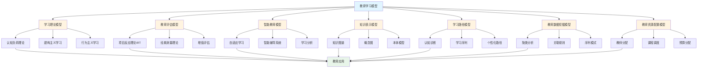
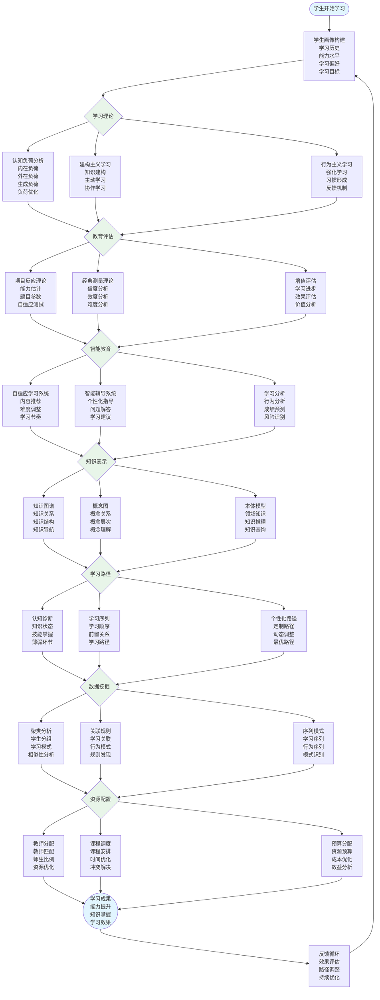

# 8.10 教育学习模型 / Education & Learning Models

> 交叉引用 / Cross-References
>
> - 章节大纲: [content/CHAPTER_09_OUTLINE.md 9.10](../../../content/CHAPTER_09_OUTLINE.md#910-教育学习模型--education-and-learning-models)
> - 全局索引: [docs/GLOBAL_INDEX.md](../../GLOBAL_INDEX.md)
> - 实现映射: [docs/09-实现示例/INDUSTRY_IMPLEMENTATION_MAPPING.md](../../09-实现示例/INDUSTRY_IMPLEMENTATION_MAPPING.md)
> - 评测协议标准: [docs/EVALUATION_PROTOCOLS_STANDARDS.md](../../EVALUATION_PROTOCOLS_STANDARDS.md)

## 目录 / Table of Contents

- [8.10 教育学习模型 / Education \& Learning Models](#810-教育学习模型--education--learning-models)
  - [目录 / Table of Contents](#目录--table-of-contents)
  - [教育学习模型框架图 / Framework Diagram of Education \& Learning Models](#教育学习模型框架图--framework-diagram-of-education--learning-models)
  - [个性化学习流程 / Flowchart of Personalized Learning](#个性化学习流程--flowchart-of-personalized-learning)
  - [8.10.1 学习理论模型 / Learning Theory Models](#8101-学习理论模型--learning-theory-models)
    - [认知负荷理论 / Cognitive Load Theory](#认知负荷理论--cognitive-load-theory)
    - [建构主义学习模型 / Constructivist Learning Model](#建构主义学习模型--constructivist-learning-model)
    - [行为主义学习模型 / Behaviorist Learning Model](#行为主义学习模型--behaviorist-learning-model)
  - [8.10.2 教育评估模型 / Educational Assessment Models](#8102-教育评估模型--educational-assessment-models)
    - [项目反应理论 (IRT) / Item Response Theory](#项目反应理论-irt--item-response-theory)
    - [经典测量理论 / Classical Test Theory](#经典测量理论--classical-test-theory)
    - [增值评估模型 / Value-Added Assessment Model](#增值评估模型--value-added-assessment-model)
  - [8.10.3 智能教育模型 / Intelligent Education Models](#8103-智能教育模型--intelligent-education-models)
    - [自适应学习系统 / Adaptive Learning System](#自适应学习系统--adaptive-learning-system)
    - [智能辅导系统 / Intelligent Tutoring System](#智能辅导系统--intelligent-tutoring-system)
    - [学习分析模型 / Learning Analytics Model](#学习分析模型--learning-analytics-model)
  - [8.10.4 知识表示模型 / Knowledge Representation Models](#8104-知识表示模型--knowledge-representation-models)
    - [知识图谱 / Knowledge Graph](#知识图谱--knowledge-graph)
    - [概念图 / Concept Map](#概念图--concept-map)
    - [本体模型 / Ontology Model](#本体模型--ontology-model)
  - [8.10.5 学习路径模型 / Learning Path Models](#8105-学习路径模型--learning-path-models)
    - [认知诊断模型 / Cognitive Diagnosis Model](#认知诊断模型--cognitive-diagnosis-model)
    - [学习序列模型 / Learning Sequence Model](#学习序列模型--learning-sequence-model)
    - [个性化学习路径 / Personalized Learning Path](#个性化学习路径--personalized-learning-path)
  - [8.10.6 教育数据挖掘模型 / Educational Data Mining Models](#8106-教育数据挖掘模型--educational-data-mining-models)
    - [聚类分析 / Clustering Analysis](#聚类分析--clustering-analysis)
    - [关联规则挖掘 / Association Rule Mining](#关联规则挖掘--association-rule-mining)
    - [序列模式挖掘 / Sequential Pattern Mining](#序列模式挖掘--sequential-pattern-mining)
  - [8.10.7 教育资源配置模型 / Educational Resource Allocation Models](#8107-教育资源配置模型--educational-resource-allocation-models)
    - [教师分配模型 / Teacher Allocation Model](#教师分配模型--teacher-allocation-model)
    - [课程调度模型 / Course Scheduling Model](#课程调度模型--course-scheduling-model)
    - [预算分配模型 / Budget Allocation Model](#预算分配模型--budget-allocation-model)
  - [8.10.8 实现与应用 / Implementation and Applications](#8108-实现与应用--implementation-and-applications)
    - [Rust实现示例 / Rust Implementation Example](#rust实现示例--rust-implementation-example)
    - [Haskell实现示例 / Haskell Implementation Example](#haskell实现示例--haskell-implementation-example)
    - [应用领域 / Application Domains](#应用领域--application-domains)
      - [个性化学习 / Personalized Learning](#个性化学习--personalized-learning)
      - [教育评估 / Educational Assessment](#教育评估--educational-assessment)
      - [教育管理 / Educational Management](#教育管理--educational-management)
  - [参考文献 / References](#参考文献--references)
  - [评测协议与指标 / Evaluation Protocols \& Metrics](#评测协议与指标--evaluation-protocols--metrics)
    - [范围与目标 / Scope \& Goals](#范围与目标--scope--goals)
    - [数据与划分 / Data \& Splits](#数据与划分--data--splits)
    - [通用指标 / Common Metrics](#通用指标--common-metrics)
    - [任务级协议 / Task-level Protocols](#任务级协议--task-level-protocols)
    - [复现实操 / Reproducibility](#复现实操--reproducibility)
  - [8.10.9 算法实现 / Algorithm Implementation](#8109-算法实现--algorithm-implementation)
    - [学习理论算法 / Learning Theory Algorithms](#学习理论算法--learning-theory-algorithms)
      - [Julia实现示例 / Julia Implementation Example](#julia实现示例--julia-implementation-example)
  - [相关模型 / Related Models](#相关模型--related-models)
    - [行业应用模型 / Industry Application Models](#行业应用模型--industry-application-models)
    - [工程科学模型 / Engineering Science Models](#工程科学模型--engineering-science-models)
    - [计算机科学模型 / Computer Science Models](#计算机科学模型--computer-science-models)
    - [数学科学模型 / Mathematical Science Models](#数学科学模型--mathematical-science-models)
    - [社会科学模型 / Social Science Models](#社会科学模型--social-science-models)
    - [基础理论 / Basic Theory](#基础理论--basic-theory)

---

## 教育学习模型框架图 / Framework Diagram of Education & Learning Models



## 个性化学习流程 / Flowchart of Personalized Learning



## 8.10.1 学习理论模型 / Learning Theory Models

### 认知负荷理论 / Cognitive Load Theory

**内在认知负荷**: $CL_{intrinsic} = f(complexity, element_interactivity)$

**外在认知负荷**: $CL_{extraneous} = f(instructional_design)$

**生成认知负荷**: $CL_{germane} = f(learning_effort)$

**总认知负荷**: $CL_{total} = CL_{intrinsic} + CL_{extraneous} + CL_{germane}$

### 建构主义学习模型 / Constructivist Learning Model

**知识建构**: $K_{new} = K_{existing} + \Delta K + \text{interaction}(K_{existing}, \Delta K)$

**学习效果**: $E = f(prior_knowledge, motivation, learning_environment)$

**知识转移**: $T = \alpha \cdot K_{source} \cdot (1 - \beta \cdot distance)$

### 行为主义学习模型 / Behaviorist Learning Model

**强化学习**: $P(response) = \frac{1}{1 + e^{-(\alpha \cdot reward + \beta \cdot punishment)}}$

**习惯形成**: $H(t) = H_0 + (H_{max} - H_0)(1 - e^{-kt})$

**消退**: $E(t) = E_0 \cdot e^{-\lambda t}$

---

## 8.10.2 教育评估模型 / Educational Assessment Models

### 项目反应理论 (IRT) / Item Response Theory

**三参数模型**: $P(\theta) = c + (1-c)\frac{e^{a(\theta-b)}}{1+e^{a(\theta-b)}}$

**双参数模型**: $P(\theta) = \frac{e^{a(\theta-b)}}{1+e^{a(\theta-b)}}$

**单参数模型**: $P(\theta) = \frac{e^{(\theta-b)}}{1+e^{(\theta-b)}}$

其中：

- $\theta$: 学生能力
- $a$: 区分度参数
- $b$: 难度参数
- $c$: 猜测参数

### 经典测量理论 / Classical Test Theory

**真分数模型**: $X = T + E$

**信度**: $\rho_{XX'} = \frac{\sigma_T^2}{\sigma_X^2}$

**效度**: $\rho_{XY} = \frac{\sigma_{XY}}{\sigma_X \sigma_Y}$

**标准误**: $SE = \sigma_X \sqrt{1-\rho_{XX'}}$

### 增值评估模型 / Value-Added Assessment Model

**增值分数**: $VA_i = Y_i - \hat{Y}_i$

**预测模型**: $\hat{Y}_i = \beta_0 + \beta_1 X_{i1} + \cdots + \beta_p X_{ip}$

**教师效应**: $\tau_j = \frac{1}{n_j} \sum_{i \in j} VA_i$

---

## 8.10.3 智能教育模型 / Intelligent Education Models

### 自适应学习系统 / Adaptive Learning System

**知识状态**: $KS = \{k_1, k_2, \ldots, k_n\}$

**学习路径**: $LP = \arg\min_{path} \sum_{i=1}^n c_i \cdot d_i$

**推荐算法**: $R = \arg\max_{item} \text{similarity}(user, item) \cdot \text{relevance}(item)$

### 智能辅导系统 / Intelligent Tutoring System

**学生模型**: $SM = \{knowledge, skills, misconceptions, preferences\}$

**教学策略**: $TS = f(SM, learning_objectives, constraints)$

**反馈生成**: $F = g(student_response, correct_answer, student_model)$

### 学习分析模型 / Learning Analytics Model

**学习行为**: $B = \{time_spent, clicks, navigation_patterns\}$

**学习成果**: $O = f(B, prior_knowledge, motivation)$

**预测模型**: $P(success) = \frac{1}{1 + e^{-(\beta_0 + \sum_{i=1}^n \beta_i x_i)}}$

---

## 8.10.4 知识表示模型 / Knowledge Representation Models

### 知识图谱 / Knowledge Graph

**实体**: $E = \{e_1, e_2, \ldots, e_n\}$

**关系**: $R = \{r_1, r_2, \ldots, r_m\}$

**三元组**: $(h, r, t) \in E \times R \times E$

**知识推理**: $P(t|h, r) = \sigma(\mathbf{h}^T \mathbf{W}_r \mathbf{t})$

### 概念图 / Concept Map

**概念**: $C = \{c_1, c_2, \ldots, c_n\}$

**连接**: $L = \{(c_i, c_j, label) | c_i, c_j \in C\}$

**相似度**: $sim(c_i, c_j) = \frac{\sum_{k=1}^n w_k \cdot f_k(c_i, c_j)}{\sum_{k=1}^n w_k}$

### 本体模型 / Ontology Model

**类**: $Class = \{C_1, C_2, \ldots, C_n\}$

**属性**: $Property = \{P_1, P_2, \ldots, P_m\}$

**实例**: $Instance = \{I_1, I_2, \ldots, I_k\}$

**推理规则**: $C_1(x) \wedge P(x,y) \wedge C_2(y) \rightarrow R(x,y)$

---

## 8.10.5 学习路径模型 / Learning Path Models

### 认知诊断模型 / Cognitive Diagnosis Model

**技能掌握**: $S = \{s_1, s_2, \ldots, s_k\}$

**Q矩阵**: $Q = [q_{ij}]$ where $q_{ij} = 1$ if item $i$ requires skill $j$

**响应概率**: $P(X_i = 1|\alpha) = \prod_{j=1}^k \pi_{ij}^{\alpha_j} (1-\pi_{ij})^{1-\alpha_j}$

**技能估计**: $\hat{\alpha} = \arg\max_{\alpha} P(X|\alpha)$

### 学习序列模型 / Learning Sequence Model

**状态转移**: $P(s_{t+1}|s_t, a_t) = T(s_t, a_t, s_{t+1})$

**奖励函数**: $R(s_t, a_t) = \text{learning_gain} - \text{effort_cost}$

**最优策略**: $\pi^*(s) = \arg\max_a Q^*(s, a)$

### 个性化学习路径 / Personalized Learning Path

**学习目标**: $G = \{g_1, g_2, \ldots, g_n\}$

**学习约束**: $C = \{c_1, c_2, \ldots, c_m\}$

**路径优化**: $\min \sum_{i=1}^n c_i \cdot t_i$ s.t. $\sum_{i \in path} t_i \leq T_{max}$

---

## 8.10.6 教育数据挖掘模型 / Educational Data Mining Models

### 聚类分析 / Clustering Analysis

**K-means**: $\min \sum_{i=1}^k \sum_{x \in C_i} \|x - \mu_i\|^2$

**层次聚类**: $d(C_i, C_j) = \min_{x \in C_i, y \in C_j} d(x, y)$

**密度聚类**: $DBSCAN(p) = \text{core} \text{ if } |N_\epsilon(p)| \geq MinPts$

### 关联规则挖掘 / Association Rule Mining

**支持度**: $support(A \rightarrow B) = \frac{|A \cup B|}{|D|}$

**置信度**: $confidence(A \rightarrow B) = \frac{|A \cup B|}{|A|}$

**提升度**: $lift(A \rightarrow B) = \frac{confidence(A \rightarrow B)}{support(B)}$

### 序列模式挖掘 / Sequential Pattern Mining

**序列**: $S = \langle s_1, s_2, \ldots, s_n \rangle$

**子序列**: $S' \sqsubseteq S$ if $S'$ is a subsequence of $S$

**频繁序列**: $freq(S') \geq min_support$

---

## 8.10.7 教育资源配置模型 / Educational Resource Allocation Models

### 教师分配模型 / Teacher Allocation Model

**目标函数**: $\min \sum_{i=1}^n \sum_{j=1}^m c_{ij} x_{ij}$

**约束条件**:

- 需求满足: $\sum_{j=1}^m x_{ij} = d_i$
- 能力限制: $\sum_{i=1}^n x_{ij} \leq C_j$
- 专业匹配: $x_{ij} = 0$ if teacher $j$ cannot teach subject $i$

### 课程调度模型 / Course Scheduling Model

**时间槽**: $T = \{t_1, t_2, \ldots, t_k\}$

**教室**: $R = \{r_1, r_2, \ldots, r_l\}$

**课程**: $C = \{c_1, c_2, \ldots, c_m\}$

**调度约束**: $\sum_{c \in C} x_{ctr} \leq 1$ for all $t \in T, r \in R$

### 预算分配模型 / Budget Allocation Model

**目标函数**: $\max \sum_{i=1}^n w_i \cdot f_i(b_i)$

**约束条件**:

- 预算限制: $\sum_{i=1}^n b_i \leq B_{total}$
- 最小需求: $b_i \geq b_{i,min}$
- 优先级: $b_i \geq \alpha_i \cdot b_j$ if $i$ has higher priority than $j$

---

## 8.10.8 实现与应用 / Implementation and Applications

### Rust实现示例 / Rust Implementation Example

```rust
use std::collections::HashMap;

#[derive(Debug, Clone)]
pub struct Student {
    pub id: String,
    pub knowledge_state: HashMap<String, f64>,
    pub learning_preferences: Vec<String>,
    pub performance_history: Vec<f64>,
}

#[derive(Debug)]
pub struct ItemResponseTheory {
    pub items: Vec<Item>,
}

#[derive(Debug, Clone)]
pub struct Item {
    pub id: String,
    pub difficulty: f64,
    pub discrimination: f64,
    pub guessing: f64,
}

impl ItemResponseTheory {
    pub fn new() -> Self {
        Self { items: Vec::new() }
    }

    pub fn add_item(&mut self, item: Item) {
        self.items.push(item);
    }

    pub fn three_parameter_model(&self, theta: f64, item: &Item) -> f64 {
        let exponent = item.discrimination * (theta - item.difficulty);
        item.guessing + (1.0 - item.guessing) * (exponent.exp() / (1.0 + exponent.exp()))
    }

    pub fn estimate_ability(&self, responses: &Vec<bool>) -> f64 {
        let mut theta = 0.0;
        let mut prev_theta = -1.0;
        let tolerance = 0.001;

        while (theta - prev_theta).abs() > tolerance {
            prev_theta = theta;

            let mut numerator = 0.0;
            let mut denominator = 0.0;

            for (i, &response) in responses.iter().enumerate() {
                let p = self.three_parameter_model(theta, &self.items[i]);
                let q = 1.0 - p;

                let derivative = self.items[i].discrimination * p * q;
                let residual = (response as f64) - p;

                numerator += derivative * residual;
                denominator += derivative * derivative;
            }

            if denominator > 0.0 {
                theta += numerator / denominator;
            }
        }

        theta
    }

    pub fn calculate_reliability(&self, responses: &Vec<Vec<bool>>) -> f64 {
        let n_students = responses.len();
        let n_items = self.items.len();

        let mut total_scores: Vec<f64> = vec![0.0; n_students];
        let mut item_variances: Vec<f64> = vec![0.0; n_items];

        // 计算总分和项目方差
        for (i, student_responses) in responses.iter().enumerate() {
            for (j, &response) in student_responses.iter().enumerate() {
                total_scores[i] += response as f64;
                item_variances[j] += response as f64;
            }
        }

        // 计算项目方差
        for j in 0..n_items {
            let mean = item_variances[j] / n_students as f64;
            item_variances[j] = responses.iter()
                .map(|r| (r[j] as f64 - mean).powi(2))
                .sum::<f64>() / (n_students - 1) as f64;
        }

        let total_variance = total_scores.iter()
            .map(|&score| (score - total_scores.iter().sum::<f64>() / n_students as f64).powi(2))
            .sum::<f64>() / (n_students - 1) as f64;

        let sum_item_variance: f64 = item_variances.iter().sum();

        (total_variance - sum_item_variance) / total_variance
    }
}

#[derive(Debug)]
pub struct AdaptiveLearningSystem {
    pub knowledge_graph: HashMap<String, Vec<String>>,
    pub student_models: HashMap<String, Student>,
}

impl AdaptiveLearningSystem {
    pub fn new() -> Self {
        Self {
            knowledge_graph: HashMap::new(),
            student_models: HashMap::new(),
        }
    }

    pub fn add_knowledge_relationship(&mut self, from: String, to: String) {
        self.knowledge_graph.entry(from).or_insert_with(Vec::new).push(to);
    }

    pub fn update_student_knowledge(&mut self, student_id: &str, concept: &str, mastery: f64) {
        if let Some(student) = self.student_models.get_mut(student_id) {
            student.knowledge_state.insert(concept.to_string(), mastery);
        }
    }

    pub fn recommend_next_concept(&self, student_id: &str) -> Option<String> {
        if let Some(student) = self.student_models.get(student_id) {
            let mut best_concept = None;
            let mut best_score = -1.0;

            for (concept, _) in &self.knowledge_graph {
                if !student.knowledge_state.contains_key(concept) {
                    let score = self.calculate_readiness_score(student, concept);
                    if score > best_score {
                        best_score = score;
                        best_concept = Some(concept.clone());
                    }
                }
            }

            best_concept
        } else {
            None
        }
    }

    fn calculate_readiness_score(&self, student: &Student, concept: &str) -> f64 {
        let mut score = 0.0;
        let mut count = 0;

        if let Some(prerequisites) = self.knowledge_graph.get(concept) {
            for prereq in prerequisites {
                if let Some(&mastery) = student.knowledge_state.get(prereq) {
                    score += mastery;
                    count += 1;
                }
            }
        }

        if count > 0 {
            score / count as f64
        } else {
            0.0
        }
    }
}

#[derive(Debug)]
pub struct LearningAnalytics {
    pub learning_events: Vec<LearningEvent>,
}

#[derive(Debug, Clone)]
pub struct LearningEvent {
    pub student_id: String,
    pub timestamp: f64,
    pub event_type: String,
    pub duration: f64,
    pub outcome: f64,
}

impl LearningAnalytics {
    pub fn new() -> Self {
        Self { learning_events: Vec::new() }
    }

    pub fn add_event(&mut self, event: LearningEvent) {
        self.learning_events.push(event);
    }

    pub fn predict_success(&self, student_id: &str) -> f64 {
        let student_events: Vec<&LearningEvent> = self.learning_events
            .iter()
            .filter(|e| e.student_id == student_id)
            .collect();

        if student_events.is_empty() {
            return 0.5; // 默认中等概率
        }

        let total_time: f64 = student_events.iter().map(|e| e.duration).sum();
        let avg_outcome: f64 = student_events.iter().map(|e| e.outcome).sum::<f64>() / student_events.len() as f64;
        let engagement_score = student_events.len() as f64 / 100.0; // 标准化参与度

        // 简化的成功预测模型
        let success_prob = 0.3 * avg_outcome + 0.4 * engagement_score + 0.3 * (total_time / 1000.0).min(1.0);
        success_prob.max(0.0).min(1.0)
    }

    pub fn identify_at_risk_students(&self, threshold: f64) -> Vec<String> {
        let mut student_scores: HashMap<String, f64> = HashMap::new();

        for event in &self.learning_events {
            let score = student_scores.entry(event.student_id.clone()).or_insert(0.0);
            *score += event.outcome;
        }

        student_scores.into_iter()
            .filter(|(_, score)| *score < threshold)
            .map(|(student_id, _)| student_id)
            .collect()
    }
}

// 使用示例
fn main() {
    // IRT模型示例
    let mut irt = ItemResponseTheory::new();
    irt.add_item(Item {
        id: "Q1".to_string(),
        difficulty: 0.0,
        discrimination: 1.0,
        guessing: 0.25,
    });
    irt.add_item(Item {
        id: "Q2".to_string(),
        difficulty: 1.0,
        discrimination: 1.5,
        guessing: 0.0,
    });

    let responses = vec![true, false];
    let ability = irt.estimate_ability(&responses);
    println!("Estimated ability: {:.3}", ability);

    // 自适应学习系统示例
    let mut als = AdaptiveLearningSystem::new();
    als.add_knowledge_relationship("addition".to_string(), "multiplication".to_string());
    als.add_knowledge_relationship("multiplication".to_string(), "division".to_string());

    let student = Student {
        id: "S001".to_string(),
        knowledge_state: HashMap::from([
            ("addition".to_string(), 0.9),
            ("multiplication".to_string(), 0.7),
        ]),
        learning_preferences: vec!["visual".to_string()],
        performance_history: vec![0.8, 0.9, 0.7],
    };

    als.student_models.insert("S001".to_string(), student);

    if let Some(next_concept) = als.recommend_next_concept("S001") {
        println!("Recommended next concept: {}", next_concept);
    }

    // 学习分析示例
    let mut analytics = LearningAnalytics::new();
    analytics.add_event(LearningEvent {
        student_id: "S001".to_string(),
        timestamp: 1000.0,
        event_type: "quiz".to_string(),
        duration: 30.0,
        outcome: 0.8,
    });

    let success_prob = analytics.predict_success("S001");
    println!("Success probability: {:.3}", success_prob);

    let at_risk = analytics.identify_at_risk_students(0.5);
    println!("At-risk students: {:?}", at_risk);
}
```

### Haskell实现示例 / Haskell Implementation Example

```haskell
module EducationLearningModels where

import Data.Map (Map)
import qualified Data.Map as Map
import Data.List (sum, length, maximumBy)
import Data.Ord (comparing)

-- 学生数据类型
data Student = Student {
    studentId :: String,
    knowledgeState :: Map String Double,
    learningPreferences :: [String],
    performanceHistory :: [Double]
} deriving Show

-- 项目反应理论
data ItemResponseTheory = ItemResponseTheory {
    items :: [Item]
} deriving Show

data Item = Item {
    itemId :: String,
    difficulty :: Double,
    discrimination :: Double,
    guessing :: Double
} deriving Show

newItemResponseTheory :: ItemResponseTheory
newItemResponseTheory = ItemResponseTheory []

addItem :: Item -> ItemResponseTheory -> ItemResponseTheory
addItem item irt = irt { items = item : items irt }

threeParameterModel :: Double -> Item -> Double
threeParameterModel theta item = guessing item + (1.0 - guessing item) * probability
  where
    exponent = discrimination item * (theta - difficulty item)
    probability = exp exponent / (1.0 + exp exponent)

estimateAbility :: ItemResponseTheory -> [Bool] -> Double
estimateAbility irt responses = go 0.0
  where
    go theta
        | abs (theta - prevTheta) < 0.001 = theta
        | otherwise = go newTheta
      where
        prevTheta = theta
        (numerator, denominator) = foldl updateGradient (0.0, 0.0) (zip (items irt) responses)
        newTheta = if denominator > 0 then theta + numerator / denominator else theta

    updateGradient (num, den) (item, response) = (newNum, newDen)
      where
        p = threeParameterModel theta item
        q = 1.0 - p
        derivative = discrimination item * p * q
        residual = (if response then 1.0 else 0.0) - p
        newNum = num + derivative * residual
        newDen = den + derivative * derivative

-- 自适应学习系统
data AdaptiveLearningSystem = AdaptiveLearningSystem {
    knowledgeGraph :: Map String [String],
    studentModels :: Map String Student
} deriving Show

newAdaptiveLearningSystem :: AdaptiveLearningSystem
newAdaptiveLearningSystem = AdaptiveLearningSystem Map.empty Map.empty

addKnowledgeRelationship :: String -> String -> AdaptiveLearningSystem -> AdaptiveLearningSystem
addKnowledgeRelationship from to als = als {
    knowledgeGraph = Map.insertWith (++) from [to] (knowledgeGraph als)
}

updateStudentKnowledge :: String -> String -> Double -> AdaptiveLearningSystem -> AdaptiveLearningSystem
updateStudentKnowledge studentId concept mastery als = als {
    studentModels = Map.adjust updateStudent studentId (studentModels als)
}
  where
    updateStudent student = student {
        knowledgeState = Map.insert concept mastery (knowledgeState student)
    }

recommendNextConcept :: AdaptiveLearningSystem -> String -> Maybe String
recommendNextConcept als studentId = case Map.lookup studentId (studentModels als) of
    Just student -> findBestConcept als student
    Nothing -> Nothing
  where
    findBestConcept als student =
        let availableConcepts = filter (\c -> not (Map.member c (knowledgeState student)))
                                     (Map.keys (knowledgeGraph als))
            scoredConcepts = map (\c -> (c, calculateReadinessScore als student c)) availableConcepts
        in case scoredConcepts of
            [] -> Nothing
            _ -> Just (fst (maximumBy (comparing snd) scoredConcepts))

calculateReadinessScore :: AdaptiveLearningSystem -> Student -> String -> Double
calculateReadinessScore als student concept = case Map.lookup concept (knowledgeGraph als) of
    Just prerequisites ->
        let scores = mapMaybe (\prereq -> Map.lookup prereq (knowledgeState student)) prerequisites
        in if null scores then 0.0 else sum scores / fromIntegral (length scores)
    Nothing -> 0.0

-- 学习分析
data LearningAnalytics = LearningAnalytics {
    learningEvents :: [LearningEvent]
} deriving Show

data LearningEvent = LearningEvent {
    eventStudentId :: String,
    eventTimestamp :: Double,
    eventType :: String,
    eventDuration :: Double,
    eventOutcome :: Double
} deriving Show

newLearningAnalytics :: LearningAnalytics
newLearningAnalytics = LearningAnalytics []

addEvent :: LearningEvent -> LearningAnalytics -> LearningAnalytics
addEvent event analytics = analytics {
    learningEvents = event : learningEvents analytics
}

predictSuccess :: LearningAnalytics -> String -> Double
predictSuccess analytics studentId =
    let studentEvents = filter (\e -> eventStudentId e == studentId) (learningEvents analytics)
    in if null studentEvents
       then 0.5  -- 默认中等概率
       else calculateSuccessProbability studentEvents
  where
    calculateSuccessProbability events =
        let totalTime = sum (map eventDuration events)
            avgOutcome = sum (map eventOutcome events) / fromIntegral (length events)
            engagementScore = fromIntegral (length events) / 100.0
            successProb = 0.3 * avgOutcome + 0.4 * engagementScore + 0.3 * min 1.0 (totalTime / 1000.0)
        in max 0.0 (min 1.0 successProb)

identifyAtRiskStudents :: LearningAnalytics -> Double -> [String]
identifyAtRiskStudents analytics threshold =
    let studentScores = foldl updateScores Map.empty (learningEvents analytics)
    in Map.keys (Map.filter (< threshold) studentScores)
  where
    updateScores scores event =
        Map.insertWith (+) (eventStudentId event) (eventOutcome event) scores

-- 示例使用
example :: IO ()
example = do
    -- IRT模型示例
    let irt = addItem (Item "Q1" 0.0 1.0 0.25) $
              addItem (Item "Q2" 1.0 1.5 0.0) newItemResponseTheory
        responses = [True, False]
        ability = estimateAbility irt responses

    putStrLn $ "Estimated ability: " ++ show ability

    -- 自适应学习系统示例
    let als = addKnowledgeRelationship "addition" "multiplication" $
              addKnowledgeRelationship "multiplication" "division" newAdaptiveLearningSystem

        student = Student "S001"
                         (Map.fromList [("addition", 0.9), ("multiplication", 0.7)])
                         ["visual"]
                         [0.8, 0.9, 0.7]

        alsWithStudent = AdaptiveLearningSystem (knowledgeGraph als)
                                               (Map.insert "S001" student (studentModels als))

    putStrLn $ "Recommended next concept: " ++ show (recommendNextConcept alsWithStudent "S001")

    -- 学习分析示例
    let analytics = addEvent (LearningEvent "S001" 1000.0 "quiz" 30.0 0.8) newLearningAnalytics
        successProb = predictSuccess analytics "S001"
        atRisk = identifyAtRiskStudents analytics 0.5

    putStrLn $ "Success probability: " ++ show successProb
    putStrLn $ "At-risk students: " ++ show atRisk
```

### 应用领域 / Application Domains

#### 个性化学习 / Personalized Learning

- **自适应学习**: 根据学生能力调整内容
- **学习路径**: 个性化学习序列
- **智能推荐**: 基于学习行为推荐资源

#### 教育评估 / Educational Assessment

- **形成性评估**: 实时学习反馈
- **总结性评估**: 学习成果评价
- **诊断性评估**: 学习困难识别

#### 教育管理 / Educational Management

- **资源优化**: 教师、教室、课程分配
- **质量监控**: 教学质量评估
- **决策支持**: 教育政策制定

---

## 参考文献 / References

1. Baker, R. S. (2010). Data Mining for Education. International Encyclopedia of Education.
2. Embretson, S. E., & Reise, S. P. (2000). Item Response Theory. Psychology Press.
3. Brusilovsky, P. (2001). Adaptive Hypermedia. User Modeling and User-Adapted Interaction.
4. Baker, R. S., & Siemens, G. (2014). Educational Data Mining and Learning Analytics. Cambridge Handbook of the Learning Sciences.

---

## 评测协议与指标 / Evaluation Protocols & Metrics

> 注：更多统一规范见[评测协议标准](../../EVALUATION_PROTOCOLS_STANDARDS.md)

### 范围与目标 / Scope & Goals

- 覆盖学习效果评估、个性化教学、知识图谱、智能辅导的核心评测场景。
- 可复现实证：同一数据、同一协议下，模型实现结果可对比。

### 数据与划分 / Data & Splits

- 教育数据：学习行为、成绩记录、知识掌握度、学习路径、交互数据。
- 划分：训练(60%) / 验证(20%) / 测试(20%)，按时间顺序滚动划窗。

### 通用指标 / Common Metrics

- 学习效果：知识掌握度、技能提升、学习效率、长期记忆保持率。
- 个性化指标：适应性匹配度、学习路径优化、难度调节准确性、兴趣匹配度。
- 交互指标：参与度、完成率、反馈响应、学习动机、满意度。
- 系统指标：推荐准确率、内容质量、平台可用性、响应时间。

### 任务级协议 / Task-level Protocols

1) 学习效果评估：前后测对比、知识迁移能力、技能应用、长期保持效果。
2) 个性化教学：学习风格匹配、难度自适应、内容推荐精度、学习路径优化。
3) 知识图谱：概念关系准确性、知识覆盖度、推理能力、更新维护效率。
4) 智能辅导：问题解答质量、学习建议有效性、情感支持、学习动机激发。

### 复现实操 / Reproducibility

- 提供数据schema、预处理与评测脚本；固定随机种子与版本。
- 输出：指标汇总表、学习曲线、知识掌握度热图、个性化推荐效果、学习路径可视化。

---

## 8.10.9 算法实现 / Algorithm Implementation

### 学习理论算法 / Learning Theory Algorithms

```python
from typing import Dict, List, Any, Optional, Tuple
import numpy as np
from dataclasses import dataclass
from scipy.optimize import minimize

@dataclass
class Student:
    """学生信息"""
    id: str
    knowledge_level: Dict[str, float]
    learning_style: List[str]
    performance_history: List[float]

@dataclass
class LearningEvent:
    """学习事件"""
    student_id: str
    duration: float
    activity_type: str
    outcome: float
    timestamp: float

class CognitiveLoadTheory:
    """认知负荷理论"""

    def __init__(self):
        pass

    def calculate_intrinsic_load(self, complexity: float, element_interactivity: float) -> float:
        """计算内在认知负荷"""
        return complexity * element_interactivity

    def calculate_extraneous_load(self, instructional_design_score: float) -> float:
        """计算外在认知负荷"""
        # 教学设计越好，外在负荷越低
        return max(0, 1.0 - instructional_design_score)

    def calculate_germane_load(self, learning_effort: float, motivation: float) -> float:
        """计算生成认知负荷"""
        return learning_effort * motivation

    def calculate_total_load(self, intrinsic: float, extraneous: float, germane: float) -> float:
        """计算总认知负荷"""
        return intrinsic + extraneous + germane

    def is_overload(self, total_load: float, threshold: float = 1.0) -> bool:
        """判断是否认知超负荷"""
        return total_load > threshold

class ConstructivistLearningModel:
    """建构主义学习模型"""

    def __init__(self):
        pass

    def update_knowledge(self, existing_knowledge: float, new_information: float,
                        interaction_strength: float = 0.5) -> float:
        """更新知识"""
        # 知识建构公式
        knowledge_gain = new_information * interaction_strength
        updated_knowledge = existing_knowledge + knowledge_gain + \
                           interaction_strength * existing_knowledge * new_information
        return min(1.0, updated_knowledge)  # 限制在[0,1]范围内

    def calculate_learning_effectiveness(self, prior_knowledge: float, motivation: float,
                                       learning_environment: float) -> float:
        """计算学习效果"""
        # 学习效果 = f(先验知识, 动机, 学习环境)
        effectiveness = (0.4 * prior_knowledge + 0.3 * motivation + 0.3 * learning_environment)
        return min(1.0, effectiveness)

    def calculate_knowledge_transfer(self, source_knowledge: float, distance: float,
                                   alpha: float = 0.8, beta: float = 0.2) -> float:
        """计算知识转移"""
        # 知识转移 = α * K_source * (1 - β * distance)
        transfer = alpha * source_knowledge * (1 - beta * distance)
        return max(0, transfer)

class BehavioristLearningModel:
    """行为主义学习模型"""

    def __init__(self):
        pass

    def calculate_response_probability(self, reward: float, punishment: float,
                                     alpha: float = 1.0, beta: float = 1.0) -> float:
        """计算反应概率"""
        # P(response) = 1 / (1 + e^(-(α*reward + β*punishment)))
        z = alpha * reward + beta * punishment
        probability = 1 / (1 + np.exp(-z))
        return probability

    def calculate_habit_formation(self, initial_habit: float, max_habit: float,
                                time: float, rate_constant: float) -> float:
        """计算习惯形成"""
        # H(t) = H_0 + (H_max - H_0)(1 - e^(-kt))
        habit = initial_habit + (max_habit - initial_habit) * (1 - np.exp(-rate_constant * time))
        return habit

    def calculate_extinction(self, initial_response: float, time: float,
                           extinction_rate: float) -> float:
        """计算消退"""
        # E(t) = E_0 * e^(-λt)
        extinction = initial_response * np.exp(-extinction_rate * time)
        return extinction

### 教育评估算法 / Educational Assessment Algorithms

class ItemResponseTheory:
    """项目反应理论"""

    def __init__(self):
        self.items = []

    def add_item(self, item_id: str, difficulty: float, discrimination: float = 1.0,
                guessing: float = 0.0):
        """添加题目"""
        self.items.append({
            'id': item_id,
            'difficulty': difficulty,
            'discrimination': discrimination,
            'guessing': guessing
        })

    def three_parameter_model(self, ability: float, item: Dict[str, float]) -> float:
        """三参数模型"""
        a = item['discrimination']
        b = item['difficulty']
        c = item['guessing']

        probability = c + (1 - c) * np.exp(a * (ability - b)) / (1 + np.exp(a * (ability - b)))
        return probability

    def two_parameter_model(self, ability: float, item: Dict[str, float]) -> float:
        """双参数模型"""
        a = item['discrimination']
        b = item['difficulty']

        probability = np.exp(a * (ability - b)) / (1 + np.exp(a * (ability - b)))
        return probability

    def one_parameter_model(self, ability: float, item: Dict[str, float]) -> float:
        """单参数模型"""
        b = item['difficulty']

        probability = np.exp(ability - b) / (1 + np.exp(ability - b))
        return probability

    def estimate_ability(self, responses: List[bool], method: str = "three_parameter") -> float:
        """估计学生能力"""
        if len(responses) != len(self.items):
            raise ValueError("响应数量与题目数量不匹配")

        def likelihood(ability):
            log_likelihood = 0
            for i, response in enumerate(responses):
                if method == "three_parameter":
                    p = self.three_parameter_model(ability, self.items[i])
                elif method == "two_parameter":
                    p = self.two_parameter_model(ability, self.items[i])
                else:
                    p = self.one_parameter_model(ability, self.items[i])

                if response:
                    log_likelihood += np.log(p)
                else:
                    log_likelihood += np.log(1 - p)

            return -log_likelihood  # 最小化负对数似然

        # 使用数值优化估计能力
        result = minimize(likelihood, x0=0.0, method='BFGS')
        return result.x[0]

class ClassicalTestTheory:
    """经典测量理论"""

    def __init__(self):
        pass

    def calculate_reliability(self, scores: List[float]) -> float:
        """计算信度（使用分半法）"""
        n = len(scores)
        if n % 2 != 0:
            scores = scores[:-1]  # 去掉最后一个分数

        half1 = scores[:n//2]
        half2 = scores[n//2:]

        correlation = np.corrcoef(half1, half2)[0, 1]
        if np.isnan(correlation):
            return 0.0

        # Spearman-Brown校正
        reliability = 2 * correlation / (1 + correlation)
        return reliability

    def calculate_validity(self, test_scores: List[float], criterion_scores: List[float]) -> float:
        """计算效度"""
        if len(test_scores) != len(criterion_scores):
            raise ValueError("测试分数与效标分数长度不匹配")

        correlation = np.corrcoef(test_scores, criterion_scores)[0, 1]
        return correlation if not np.isnan(correlation) else 0.0

    def calculate_difficulty(self, correct_responses: int, total_responses: int) -> float:
        """计算题目难度"""
        return correct_responses / total_responses if total_responses > 0 else 0.0

    def calculate_discrimination(self, high_group_correct: int, low_group_correct: int,
                               group_size: int) -> float:
        """计算题目区分度"""
        if group_size == 0:
            return 0.0

        high_proportion = high_group_correct / group_size
        low_proportion = low_group_correct / group_size
        return high_proportion - low_proportion

### 智能教育算法 / Intelligent Education Algorithms

class AdaptiveLearningSystem:
    """自适应学习系统"""

    def __init__(self):
        self.knowledge_graph = {}
        self.student_models = {}

    def add_knowledge_relationship(self, concept1: str, concept2: str,
                                 relationship_strength: float = 1.0):
        """添加知识关系"""
        if concept1 not in self.knowledge_graph:
            self.knowledge_graph[concept1] = {}
        self.knowledge_graph[concept1][concept2] = relationship_strength

    def add_student(self, student: Student):
        """添加学生"""
        self.student_models[student.id] = student

    def recommend_next_concept(self, student_id: str) -> Optional[str]:
        """推荐下一个学习概念"""
        if student_id not in self.student_models:
            return None

        student = self.student_models[student_id]
        best_concept = None
        best_score = -1

        for concept in self.knowledge_graph:
            if concept not in student.knowledge_level:
                # 计算推荐分数
                score = self.calculate_recommendation_score(student, concept)
                if score > best_score:
                    best_score = score
                    best_concept = concept

        return best_concept

    def calculate_recommendation_score(self, student: Student, concept: str) -> float:
        """计算推荐分数"""
        score = 0.0

        # 基于先验知识的分数
        for prereq_concept, strength in self.knowledge_graph.get(concept, {}).items():
            if prereq_concept in student.knowledge_level:
                score += student.knowledge_level[prereq_concept] * strength

        # 基于学习风格的分数
        if "visual" in student.learning_style and "visual" in concept.lower():
            score += 0.2
        if "auditory" in student.learning_style and "audio" in concept.lower():
            score += 0.2

        return score

    def update_student_knowledge(self, student_id: str, concept: str,
                               performance: float):
        """更新学生知识水平"""
        if student_id in self.student_models:
            student = self.student_models[student_id]
            student.knowledge_level[concept] = performance
            student.performance_history.append(performance)

class LearningAnalytics:
    """学习分析模型"""

    def __init__(self):
        self.learning_events = []

    def add_event(self, event: LearningEvent):
        """添加学习事件"""
        self.learning_events.append(event)

    def predict_success(self, student_id: str) -> float:
        """预测学生成功概率"""
        student_events = [e for e in self.learning_events if e.student_id == student_id]

        if not student_events:
            return 0.5  # 默认中等概率

        # 计算成功概率
        total_time = sum(e.duration for e in student_events)
        avg_outcome = np.mean([e.outcome for e in student_events])
        engagement_score = len(student_events) / 100.0  # 参与度

        success_prob = (0.3 * avg_outcome + 0.4 * engagement_score +
                       0.3 * min(1.0, total_time / 1000.0))

        return max(0.0, min(1.0, success_prob))

    def identify_at_risk_students(self, threshold: float = 0.5) -> List[str]:
        """识别风险学生"""
        student_scores = {}

        for event in self.learning_events:
            if event.student_id not in student_scores:
                student_scores[event.student_id] = []
            student_scores[event.student_id].append(event.outcome)

        at_risk_students = []
        for student_id, scores in student_scores.items():
            avg_score = np.mean(scores)
            if avg_score < threshold:
                at_risk_students.append(student_id)

        return at_risk_students

    def calculate_learning_patterns(self, student_id: str) -> Dict[str, Any]:
        """计算学习模式"""
        student_events = [e for e in self.learning_events if e.student_id == student_id]

        if not student_events:
            return {}

        patterns = {
            'total_time': sum(e.duration for e in student_events),
            'avg_outcome': np.mean([e.outcome for e in student_events]),
            'activity_distribution': {},
            'time_distribution': {}
        }

        # 活动类型分布
        for event in student_events:
            activity_type = event.activity_type
            if activity_type not in patterns['activity_distribution']:
                patterns['activity_distribution'][activity_type] = 0
            patterns['activity_distribution'][activity_type] += 1

        return patterns

def education_learning_verification():
    """教育学习模型验证"""
    print("=== 教育学习模型验证 ===")

    # 学习理论验证
    print("\n1. 学习理论验证:")

    # 认知负荷理论
    clt = CognitiveLoadTheory()
    intrinsic_load = clt.calculate_intrinsic_load(complexity=0.7, element_interactivity=0.8)
    extraneous_load = clt.calculate_extraneous_load(instructional_design_score=0.6)
    germane_load = clt.calculate_germane_load(learning_effort=0.5, motivation=0.8)
    total_load = clt.calculate_total_load(intrinsic_load, extraneous_load, germane_load)

    print(f"内在认知负荷: {intrinsic_load:.3f}")
    print(f"外在认知负荷: {extraneous_load:.3f}")
    print(f"生成认知负荷: {germane_load:.3f}")
    print(f"总认知负荷: {total_load:.3f}")
    print(f"是否超负荷: {clt.is_overload(total_load)}")

    # 建构主义学习模型
    clm = ConstructivistLearningModel()
    updated_knowledge = clm.update_knowledge(existing_knowledge=0.6, new_information=0.3)
    learning_effectiveness = clm.calculate_learning_effectiveness(
        prior_knowledge=0.7, motivation=0.8, learning_environment=0.9
    )
    knowledge_transfer = clm.calculate_knowledge_transfer(
        source_knowledge=0.8, distance=0.3
    )

    print(f"更新后知识: {updated_knowledge:.3f}")
    print(f"学习效果: {learning_effectiveness:.3f}")
    print(f"知识转移: {knowledge_transfer:.3f}")

    # 行为主义学习模型
    blm = BehavioristLearningModel()
    response_prob = blm.calculate_response_probability(reward=0.8, punishment=0.1)
    habit = blm.calculate_habit_formation(initial_habit=0.2, max_habit=0.9, time=10.0, rate_constant=0.1)
    extinction = blm.calculate_extinction(initial_response=0.8, time=5.0, extinction_rate=0.2)

    print(f"反应概率: {response_prob:.3f}")
    print(f"习惯强度: {habit:.3f}")
    print(f"消退程度: {extinction:.3f}")

    # 教育评估验证
    print("\n2. 教育评估验证:")

    # 项目反应理论
    irt = ItemResponseTheory()
    irt.add_item("Q1", difficulty=0.0, discrimination=1.0, guessing=0.25)
    irt.add_item("Q2", difficulty=1.0, discrimination=1.5, guessing=0.0)
    irt.add_item("Q3", difficulty=-0.5, discrimination=0.8, guessing=0.1)

    responses = [True, False, True]
    estimated_ability = irt.estimate_ability(responses, method="three_parameter")

    print(f"估计能力: {estimated_ability:.3f}")

    # 经典测量理论
    ctt = ClassicalTestTheory()
    test_scores = [85, 78, 92, 88, 76, 95, 82, 89, 91, 87]
    criterion_scores = [88, 80, 90, 85, 78, 92, 85, 88, 89, 86]

    reliability = ctt.calculate_reliability(test_scores)
    validity = ctt.calculate_validity(test_scores, criterion_scores)
    difficulty = ctt.calculate_difficulty(correct_responses=7, total_responses=10)
    discrimination = ctt.calculate_discrimination(high_group_correct=4, low_group_correct=1, group_size=5)

    print(f"信度: {reliability:.3f}")
    print(f"效度: {validity:.3f}")
    print(f"难度: {difficulty:.3f}")
    print(f"区分度: {discrimination:.3f}")

    # 智能教育验证
    print("\n3. 智能教育验证:")

    # 自适应学习系统
    als = AdaptiveLearningSystem()
    als.add_knowledge_relationship("addition", "multiplication", 0.8)
    als.add_knowledge_relationship("multiplication", "division", 0.9)
    als.add_knowledge_relationship("addition", "subtraction", 0.7)

    student = Student(
        id="S001",
        knowledge_level={"addition": 0.9, "subtraction": 0.8},
        learning_style=["visual", "kinesthetic"],
        performance_history=[0.8, 0.9, 0.7]
    )

    als.add_student(student)
    recommended_concept = als.recommend_next_concept("S001")

    print(f"推荐学习概念: {recommended_concept}")

    # 学习分析
    analytics = LearningAnalytics()

    # 添加学习事件
    events = [
        LearningEvent("S001", 1000.0, "quiz", 0.8, 1.0),
        LearningEvent("S001", 1500.0, "video", 0.9, 2.0),
        LearningEvent("S001", 800.0, "exercise", 0.7, 3.0),
        LearningEvent("S002", 1200.0, "quiz", 0.6, 1.5),
        LearningEvent("S002", 900.0, "video", 0.5, 2.5)
    ]

    for event in events:
        analytics.add_event(event)

    success_prob = analytics.predict_success("S001")
    at_risk_students = analytics.identify_at_risk_students(threshold=0.7)
    learning_patterns = analytics.calculate_learning_patterns("S001")

    print(f"学生S001成功概率: {success_prob:.3f}")
    print(f"风险学生: {at_risk_students}")
    print(f"学习模式: {learning_patterns}")

    print("\n验证完成!")

if __name__ == "__main__":
    education_learning_verification()
```

#### Julia实现示例 / Julia Implementation Example

```julia
using Statistics
using Distributions
using Optim
using LinearAlgebra

"""
学生信息结构体
"""
struct Student
    id::String
    knowledge_level::Dict{String, Float64}
    learning_style::Vector{String}
    performance_history::Vector{Float64}
end

"""
学习事件结构体
"""
struct LearningEvent
    student_id::String
    duration::Float64
    activity_type::String
    outcome::Float64
    timestamp::Float64
end

"""
认知负荷理论结构体
"""
mutable struct CognitiveLoadTheory
    function CognitiveLoadTheory()
        new()
    end
end

"""
计算内在认知负荷
"""
function calculate_intrinsic_load(clt::CognitiveLoadTheory, complexity::Float64,
                                 element_interactivity::Float64)::Float64
    return complexity * element_interactivity
end

"""
计算外在认知负荷
"""
function calculate_extraneous_load(clt::CognitiveLoadTheory,
                                  instructional_design_score::Float64)::Float64
    return max(0.0, 1.0 - instructional_design_score)
end

"""
计算生成认知负荷
"""
function calculate_germane_load(clt::CognitiveLoadTheory, learning_effort::Float64,
                              motivation::Float64)::Float64
    return learning_effort * motivation
end

"""
计算总认知负荷
"""
function calculate_total_load(clt::CognitiveLoadTheory, intrinsic::Float64,
                            extraneous::Float64, germane::Float64)::Float64
    return intrinsic + extraneous + germane
end

"""
判断是否认知超负荷
"""
function is_overload(clt::CognitiveLoadTheory, total_load::Float64,
                    threshold::Float64 = 1.0)::Bool
    return total_load > threshold
end

"""
建构主义学习模型结构体
"""
mutable struct ConstructivistLearningModel
    function ConstructivistLearningModel()
        new()
    end
end

"""
更新知识
"""
function update_knowledge(clm::ConstructivistLearningModel, existing_knowledge::Float64,
                        new_information::Float64, interaction_strength::Float64 = 0.5)::Float64
    knowledge_gain = new_information * interaction_strength
    updated_knowledge = existing_knowledge + knowledge_gain +
                       interaction_strength * existing_knowledge * new_information
    return min(1.0, updated_knowledge)
end

"""
计算学习效果
"""
function calculate_learning_effectiveness(clm::ConstructivistLearningModel,
                                        prior_knowledge::Float64, motivation::Float64,
                                        learning_environment::Float64)::Float64
    effectiveness = 0.4 * prior_knowledge + 0.3 * motivation + 0.3 * learning_environment
    return min(1.0, effectiveness)
end

"""
计算知识转移
"""
function calculate_knowledge_transfer(clm::ConstructivistLearningModel,
                                    source_knowledge::Float64, distance::Float64,
                                    alpha::Float64 = 0.8, beta::Float64 = 0.2)::Float64
    transfer = alpha * source_knowledge * (1.0 - beta * distance)
    return max(0.0, transfer)
end

"""
行为主义学习模型结构体
"""
mutable struct BehavioristLearningModel
    function BehavioristLearningModel()
        new()
    end
end

"""
计算反应概率
"""
function calculate_response_probability(blm::BehavioristLearningModel, reward::Float64,
                                       punishment::Float64, alpha::Float64 = 1.0,
                                       beta::Float64 = 1.0)::Float64
    z = alpha * reward + beta * punishment
    probability = 1.0 / (1.0 + exp(-z))
    return probability
end

"""
计算习惯形成
"""
function calculate_habit_formation(blm::BehavioristLearningModel, initial_habit::Float64,
                                 max_habit::Float64, time::Float64,
                                 rate_constant::Float64)::Float64
    habit = initial_habit + (max_habit - initial_habit) * (1.0 - exp(-rate_constant * time))
    return habit
end

"""
计算消退
"""
function calculate_extinction(blm::BehavioristLearningModel, initial_response::Float64,
                            time::Float64, extinction_rate::Float64)::Float64
    extinction = initial_response * exp(-extinction_rate * time)
    return extinction
end

"""
项目反应理论结构体
"""
mutable struct ItemResponseTheory
    items::Vector{Dict{String, Any}}

    function ItemResponseTheory()
        new(Dict{String, Any}[])
    end
end

"""
添加题目
"""
function add_item(irt::ItemResponseTheory, item_id::String, difficulty::Float64,
                 discrimination::Float64 = 1.0, guessing::Float64 = 0.0)
    push!(irt.items, Dict(
        "id" => item_id,
        "difficulty" => difficulty,
        "discrimination" => discrimination,
        "guessing" => guessing
    ))
end

"""
三参数模型
"""
function three_parameter_model(irt::ItemResponseTheory, ability::Float64,
                             item::Dict{String, Any})::Float64
    a = item["discrimination"]
    b = item["difficulty"]
    c = item["guessing"]

    probability = c + (1.0 - c) * exp(a * (ability - b)) / (1.0 + exp(a * (ability - b)))
    return probability
end

"""
双参数模型
"""
function two_parameter_model(irt::ItemResponseTheory, ability::Float64,
                            item::Dict{String, Any})::Float64
    a = item["discrimination"]
    b = item["difficulty"]

    probability = exp(a * (ability - b)) / (1.0 + exp(a * (ability - b)))
    return probability
end

"""
单参数模型
"""
function one_parameter_model(irt::ItemResponseTheory, ability::Float64,
                           item::Dict{String, Any})::Float64
    b = item["difficulty"]

    probability = exp(ability - b) / (1.0 + exp(ability - b))
    return probability
end

"""
估计学生能力
"""
function estimate_ability(irt::ItemResponseTheory, responses::Vector{Bool},
                        method::String = "three_parameter")::Float64
    if length(responses) != length(irt.items)
        error("响应数量与题目数量不匹配")
    end

    function likelihood(ability::Float64)
        log_likelihood = 0.0
        for i in 1:length(responses)
            if method == "three_parameter"
                p = three_parameter_model(irt, ability, irt.items[i])
            elseif method == "two_parameter"
                p = two_parameter_model(irt, ability, irt.items[i])
            else
                p = one_parameter_model(irt, ability, irt.items[i])
            end

            if responses[i]
                log_likelihood += log(p)
            else
                log_likelihood += log(1.0 - p)
            end
        end
        return -log_likelihood
    end

    result = optimize(likelihood, 0.0, Optim.Options(iterations=1000))
    return Optim.minimizer(result)
end

"""
经典测量理论结构体
"""
mutable struct ClassicalTestTheory
    function ClassicalTestTheory()
        new()
    end
end

"""
计算信度
"""
function calculate_reliability(ctt::ClassicalTestTheory, scores::Vector{Float64})::Float64
    n = length(scores)
    if n % 2 != 0
        scores = scores[1:(end-1)]
        n = length(scores)
    end

    half1 = scores[1:(n÷2)]
    half2 = scores[(n÷2+1):end]

    correlation = cor(half1, half2)
    if isnan(correlation)
        return 0.0
    end

    reliability = 2 * correlation / (1 + correlation)
    return reliability
end

"""
计算效度
"""
function calculate_validity(ctt::ClassicalTestTheory, test_scores::Vector{Float64},
                          criterion_scores::Vector{Float64})::Float64
    if length(test_scores) != length(criterion_scores)
        error("测试分数与效标分数长度不匹配")
    end

    correlation = cor(test_scores, criterion_scores)
    return isnan(correlation) ? 0.0 : correlation
end

"""
计算题目难度
"""
function calculate_difficulty(ctt::ClassicalTestTheory, correct_responses::Int,
                             total_responses::Int)::Float64
    return total_responses > 0 ? correct_responses / total_responses : 0.0
end

"""
计算题目区分度
"""
function calculate_discrimination(ctt::ClassicalTestTheory, high_group_correct::Int,
                                 low_group_correct::Int, group_size::Int)::Float64
    if group_size == 0
        return 0.0
    end

    high_proportion = high_group_correct / group_size
    low_proportion = low_group_correct / group_size
    return high_proportion - low_proportion
end

"""
自适应学习系统结构体
"""
mutable struct AdaptiveLearningSystem
    knowledge_graph::Dict{String, Dict{String, Float64}}
    student_models::Dict{String, Student}

    function AdaptiveLearningSystem()
        new(Dict{String, Dict{String, Float64}}(), Dict{String, Student}())
    end
end

"""
添加知识关系
"""
function add_knowledge_relationship(als::AdaptiveLearningSystem, concept1::String,
                                  concept2::String, relationship_strength::Float64 = 1.0)
    if !haskey(als.knowledge_graph, concept1)
        als.knowledge_graph[concept1] = Dict{String, Float64}()
    end
    als.knowledge_graph[concept1][concept2] = relationship_strength
end

"""
添加学生
"""
function add_student(als::AdaptiveLearningSystem, student::Student)
    als.student_models[student.id] = student
end

"""
计算推荐分数
"""
function calculate_recommendation_score(als::AdaptiveLearningSystem, student::Student,
                                      concept::String)::Float64
    score = 0.0

    for (prereq_concept, strength) in get(als.knowledge_graph, concept, Dict{String, Float64}())
        if haskey(student.knowledge_level, prereq_concept)
            score += student.knowledge_level[prereq_concept] * strength
        end
    end

    if "visual" in student.learning_style && occursin("visual", lowercase(concept))
        score += 0.2
    end
    if "auditory" in student.learning_style && occursin("audio", lowercase(concept))
        score += 0.2
    end

    return score
end

"""
推荐下一个学习概念
"""
function recommend_next_concept(als::AdaptiveLearningSystem,
                               student_id::String)::Union{String, Nothing}
    if !haskey(als.student_models, student_id)
        return nothing
    end

    student = als.student_models[student_id]
    best_concept = nothing
    best_score = -1.0

    for concept in keys(als.knowledge_graph)
        if !haskey(student.knowledge_level, concept)
            score = calculate_recommendation_score(als, student, concept)
            if score > best_score
                best_score = score
                best_concept = concept
            end
        end
    end

    return best_concept
end

"""
更新学生知识水平
"""
function update_student_knowledge(als::AdaptiveLearningSystem, student_id::String,
                                concept::String, performance::Float64)
    if haskey(als.student_models, student_id)
        student = als.student_models[student_id]
        student.knowledge_level[concept] = performance
        push!(student.performance_history, performance)
    end
end

"""
学习分析模型结构体
"""
mutable struct LearningAnalytics
    learning_events::Vector{LearningEvent}

    function LearningAnalytics()
        new(LearningEvent[])
    end
end

"""
添加学习事件
"""
function add_event(la::LearningAnalytics, event::LearningEvent)
    push!(la.learning_events, event)
end

"""
预测学生成功概率
"""
function predict_success(la::LearningAnalytics, student_id::String)::Float64
    student_events = [e for e in la.learning_events if e.student_id == student_id]

    if isempty(student_events)
        return 0.5
    end

    total_time = sum(e.duration for e in student_events)
    avg_outcome = mean([e.outcome for e in student_events])
    engagement_score = length(student_events) / 100.0

    success_prob = 0.3 * avg_outcome + 0.4 * engagement_score +
                   0.3 * min(1.0, total_time / 1000.0)

    return max(0.0, min(1.0, success_prob))
end

"""
识别风险学生
"""
function identify_at_risk_students(la::LearningAnalytics,
                                  threshold::Float64 = 0.5)::Vector{String}
    student_scores = Dict{String, Vector{Float64}}()

    for event in la.learning_events
        if !haskey(student_scores, event.student_id)
            student_scores[event.student_id] = Float64[]
        end
        push!(student_scores[event.student_id], event.outcome)
    end

    at_risk_students = String[]
    for (student_id, scores) in student_scores
        avg_score = mean(scores)
        if avg_score < threshold
            push!(at_risk_students, student_id)
        end
    end

    return at_risk_students
end

"""
计算学习模式
"""
function calculate_learning_patterns(la::LearningAnalytics,
                                   student_id::String)::Dict{String, Any}
    student_events = [e for e in la.learning_events if e.student_id == student_id]

    if isempty(student_events)
        return Dict{String, Any}()
    end

    patterns = Dict(
        "total_time" => sum(e.duration for e in student_events),
        "avg_outcome" => mean([e.outcome for e in student_events]),
        "activity_distribution" => Dict{String, Int}(),
        "time_distribution" => Dict{String, Float64}()
    )

    for event in student_events
        activity_type = event.activity_type
        if !haskey(patterns["activity_distribution"], activity_type)
            patterns["activity_distribution"][activity_type] = 0
        end
        patterns["activity_distribution"][activity_type] += 1
    end

    return patterns
end

# 示例：教育学习模型使用
function education_learning_example()
    println("=== 教育学习模型验证 ===")

    # 学习理论验证
    println("\n1. 学习理论验证:")

    clt = CognitiveLoadTheory()
    intrinsic_load = calculate_intrinsic_load(clt, 0.7, 0.8)
    extraneous_load = calculate_extraneous_load(clt, 0.6)
    germane_load = calculate_germane_load(clt, 0.5, 0.8)
    total_load = calculate_total_load(clt, intrinsic_load, extraneous_load, germane_load)

    println("内在认知负荷: $(round(intrinsic_load, digits=3))")
    println("外在认知负荷: $(round(extraneous_load, digits=3))")
    println("生成认知负荷: $(round(germane_load, digits=3))")
    println("总认知负荷: $(round(total_load, digits=3))")
    println("是否超负荷: $(is_overload(clt, total_load))")

    clm = ConstructivistLearningModel()
    updated_knowledge = update_knowledge(clm, 0.6, 0.3)
    learning_effectiveness = calculate_learning_effectiveness(clm, 0.7, 0.8, 0.9)
    knowledge_transfer = calculate_knowledge_transfer(clm, 0.8, 0.3)

    println("更新后知识: $(round(updated_knowledge, digits=3))")
    println("学习效果: $(round(learning_effectiveness, digits=3))")
    println("知识转移: $(round(knowledge_transfer, digits=3))")

    blm = BehavioristLearningModel()
    response_prob = calculate_response_probability(blm, 0.8, 0.1)
    habit = calculate_habit_formation(blm, 0.2, 0.9, 10.0, 0.1)
    extinction = calculate_extinction(blm, 0.8, 5.0, 0.2)

    println("反应概率: $(round(response_prob, digits=3))")
    println("习惯强度: $(round(habit, digits=3))")
    println("消退程度: $(round(extinction, digits=3))")

    # 教育评估验证
    println("\n2. 教育评估验证:")

    irt = ItemResponseTheory()
    add_item(irt, "Q1", 0.0, 1.0, 0.25)
    add_item(irt, "Q2", 1.0, 1.5, 0.0)
    add_item(irt, "Q3", -0.5, 0.8, 0.1)

    responses = [true, false, true]
    estimated_ability = estimate_ability(irt, responses, "three_parameter")

    println("估计能力: $(round(estimated_ability, digits=3))")

    ctt = ClassicalTestTheory()
    test_scores = [85.0, 78.0, 92.0, 88.0, 76.0, 95.0, 82.0, 89.0, 91.0, 87.0]
    criterion_scores = [88.0, 80.0, 90.0, 85.0, 78.0, 92.0, 85.0, 88.0, 89.0, 86.0]

    reliability = calculate_reliability(ctt, test_scores)
    validity = calculate_validity(ctt, test_scores, criterion_scores)
    difficulty = calculate_difficulty(ctt, 7, 10)
    discrimination = calculate_discrimination(ctt, 4, 1, 5)

    println("信度: $(round(reliability, digits=3))")
    println("效度: $(round(validity, digits=3))")
    println("难度: $(round(difficulty, digits=3))")
    println("区分度: $(round(discrimination, digits=3))")

    # 智能教育验证
    println("\n3. 智能教育验证:")

    als = AdaptiveLearningSystem()
    add_knowledge_relationship(als, "addition", "multiplication", 0.8)
    add_knowledge_relationship(als, "multiplication", "division", 0.9)
    add_knowledge_relationship(als, "addition", "subtraction", 0.7)

    student = Student(
        "S001",
        Dict("addition" => 0.9, "subtraction" => 0.8),
        ["visual", "kinesthetic"],
        [0.8, 0.9, 0.7]
    )

    add_student(als, student)
    recommended_concept = recommend_next_concept(als, "S001")

    println("推荐学习概念: $recommended_concept")

    analytics = LearningAnalytics()

    events = [
        LearningEvent("S001", 1000.0, "quiz", 0.8, 1.0),
        LearningEvent("S001", 1500.0, "video", 0.9, 2.0),
        LearningEvent("S001", 800.0, "exercise", 0.7, 3.0),
        LearningEvent("S002", 1200.0, "quiz", 0.6, 1.5),
        LearningEvent("S002", 900.0, "video", 0.5, 2.5)
    ]

    for event in events
        add_event(analytics, event)
    end

    success_prob = predict_success(analytics, "S001")
    at_risk_students = identify_at_risk_students(analytics, 0.7)
    learning_patterns = calculate_learning_patterns(analytics, "S001")

    println("学生S001成功概率: $(round(success_prob, digits=3))")
    println("风险学生: $at_risk_students")
    println("学习模式: $learning_patterns")

    println("\n验证完成!")

    return Dict(
        "total_load" => total_load,
        "estimated_ability" => estimated_ability,
        "reliability" => reliability,
        "success_prob" => success_prob
    )
end
```

---

## 相关模型 / Related Models

### 行业应用模型 / Industry Application Models

- **[物流供应链模型](../01-物流供应链模型/README.md)** - 教育资源供应链、教材配送和教育物资管理
- **[交通运输模型](../02-交通运输模型/README.md)** - 学生交通、校车调度和教育出行规划
- **[电力能源模型](../03-电力能源模型/README.md)** - 教育设施电力供应、校园能源管理和教育设备电力系统
- **[信息技术模型](../04-信息技术模型/README.md)** - 教育信息系统、学习管理系统、在线教育平台和教育数据管理都需要信息技术的支持
- **[人工智能行业模型](../05-人工智能行业模型/README.md)** - 智能教学、个性化学习、学习分析和智能评测都应用人工智能技术
- **[银行金融模型](../06-银行金融模型/README.md)** - 教育金融、助学贷款和教育投资
- **[经济供需模型](../07-经济供需模型/README.md)** - 教育资源供需、教育市场均衡和教育定价机制
- **[制造业模型](../08-制造业模型/README.md)** - 教育设备制造、教学工具生产和学习产品制造
- **[医疗健康模型](../09-医疗健康模型/README.md)** - 医学教育、医疗培训和健康知识传播

### 工程科学模型 / Engineering Science Models

- **[优化模型](../../07-工程科学模型/01-优化模型/README.md)** - 教育资源优化、课程调度优化、教师分配优化和学习路径优化都是优化问题
- **[控制论模型](../../07-工程科学模型/02-控制论模型/README.md)** - 学习过程控制、自适应控制系统和反馈控制系统

### 计算机科学模型 / Computer Science Models

- **[算法模型](../../04-计算机科学模型/02-算法模型/README.md)** - 教育算法、推荐算法、数据挖掘算法和优化算法在教育学习中广泛应用
- **[数据结构模型](../../04-计算机科学模型/03-数据结构模型/README.md)** - 教育数据管理、知识数据结构和学习数据结构
- **[人工智能模型](../../04-计算机科学模型/05-人工智能模型/README.md)** - 机器学习、深度学习和强化学习在智能教育、学习分析和个性化推荐中应用

### 数学科学模型 / Mathematical Science Models

- **[代数模型](../../03-数学科学模型/01-代数模型/README.md)** - 线性代数、矩阵运算在教育评估、数据分析和统计建模中应用广泛
- **[几何模型](../../03-数学科学模型/02-几何模型/README.md)** - 知识几何、概念空间和知识可视化
- **[拓扑模型](../../03-数学科学模型/03-拓扑模型/README.md)** - 知识网络拓扑、学习网络和知识图谱拓扑分析

### 社会科学模型 / Social Science Models

- **[认知科学模型](../../06-社会科学模型/04-认知科学模型/README.md)** - 认知负荷理论、认知架构和学习认知过程都是认知科学在教育中的应用
- **[心理学模型](../../06-社会科学模型/03-心理学模型/README.md)** - 教育心理学、学习心理学和认知心理学为教育学习模型提供理论基础
- **[社会网络模型](../../06-社会科学模型/01-社会网络模型/README.md)** - 学习网络、协作网络和知识传播网络分析
- **[经济学模型](../../06-社会科学模型/02-经济学模型/README.md)** - 教育经济学、教育资源配置和教育成本效益分析

### 基础理论 / Basic Theory

- **[模型分类学](../../01-基础理论/01-模型分类学/README.md)** - 教育学习模型的分类和体系化需要模型分类学理论指导
- **[形式化方法论](../../01-基础理论/02-形式化方法论/README.md)** - 教育模型的形式化描述、验证和评价需要形式化方法论
- **[科学模型论](../../01-基础理论/03-科学模型论/README.md)** - 教育学习模型的构建、验证和评价需要科学模型论指导

---

*最后更新: 2025-01-XX*
*版本: 1.2.0*
*状态: 核心功能已完成 / Status: Core Features Completed*
