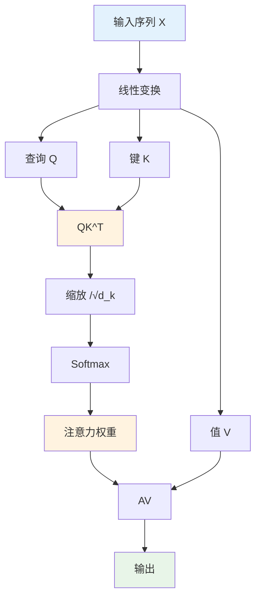
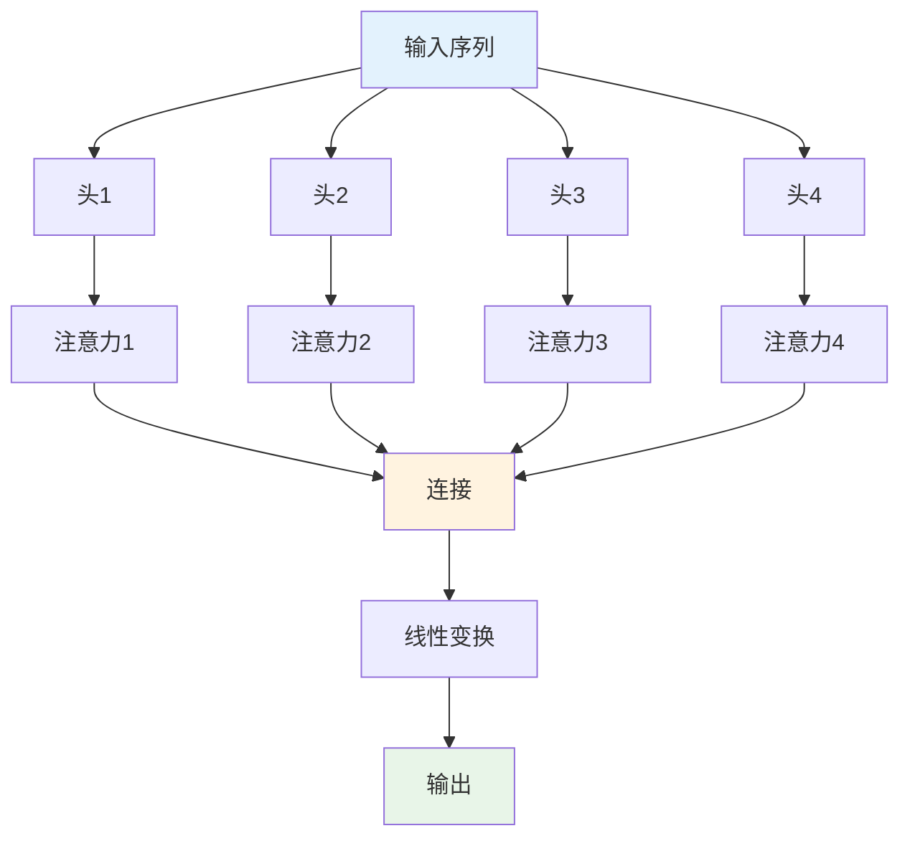
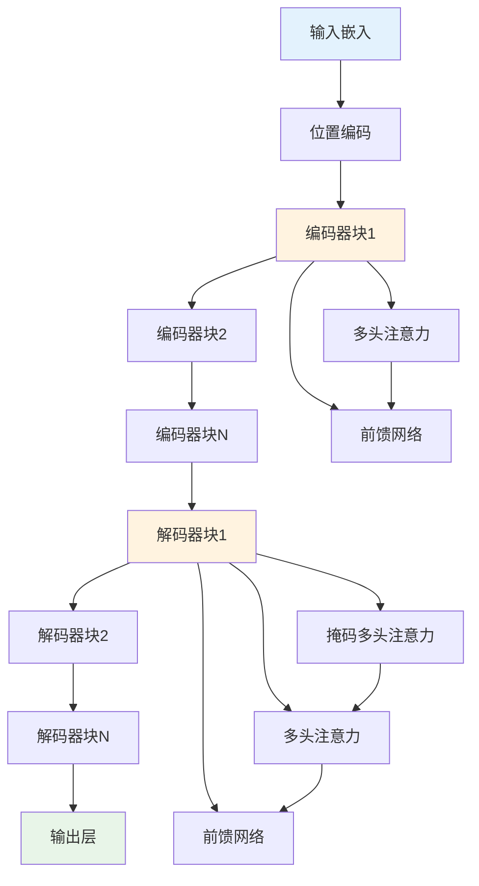

# 注意力机制多表征示例 / Attention Mechanism Multi-Representation Example

## 概述 / Overview

本文档展示注意力机制的多表征实现，包括数学公式、代码实现、图表可视化和自然语言描述。

## 1. 自注意力机制 / Self-Attention Mechanism

### 1.1 数学表征 / Mathematical Representation

#### 注意力函数 / Attention Function

**缩放点积注意力**:
$$\text{Attention}(Q, K, V) = \text{softmax}\left(\frac{QK^T}{\sqrt{d_k}}\right)V$$

其中：

- $Q$ 是查询矩阵 (Query)
- $K$ 是键矩阵 (Key)
- $V$ 是值矩阵 (Value)
- $d_k$ 是键的维度

#### 自注意力计算 / Self-Attention Computation

**输入投影**:
$$Q = XW_Q, \quad K = XW_K, \quad V = XW_V$$

**注意力权重**:
$$A = \text{softmax}\left(\frac{QK^T}{\sqrt{d_k}}\right)$$

**输出计算**:
$$\text{Output} = AV$$

其中 $X$ 是输入序列，$W_Q, W_K, W_V$ 是可学习的权重矩阵。

### 1.2 代码表征 / Code Representation

#### Rust实现 / Rust Implementation

```rust
use nalgebra::{DMatrix, DVector};
use std::f64::consts::E;

#[derive(Debug)]
pub struct SelfAttention {
    pub d_model: usize,
    pub d_k: usize,
    pub w_q: DMatrix<f64>,
    pub w_k: DMatrix<f64>,
    pub w_v: DMatrix<f64>,
}

impl SelfAttention {
    pub fn new(d_model: usize, d_k: usize) -> Self {
        let w_q = DMatrix::random(d_model, d_k) * 0.1;
        let w_k = DMatrix::random(d_model, d_k) * 0.1;
        let w_v = DMatrix::random(d_model, d_k) * 0.1;
        
        Self {
            d_model,
            d_k,
            w_q,
            w_k,
            w_v,
        }
    }
    
    pub fn forward(&self, x: &DMatrix<f64>) -> DMatrix<f64> {
        let seq_len = x.nrows();
        
        // 计算Q, K, V
        let q = x * &self.w_q;
        let k = x * &self.w_k;
        let v = x * &self.w_v;
        
        // 计算注意力分数
        let scores = &q * &k.transpose();
        
        // 缩放
        let scaled_scores = scores / (self.d_k as f64).sqrt();
        
        // Softmax
        let attention_weights = self.softmax(&scaled_scores);
        
        // 计算输出
        &attention_weights * &v
    }
    
    fn softmax(&self, x: &DMatrix<f64>) -> DMatrix<f64> {
        let mut result = DMatrix::zeros(x.nrows(), x.ncols());
        
        for j in 0..x.ncols() {
            let max_val = x.column(j).max();
            let exp_sum: f64 = x.column(j).iter()
                .map(|&val| (val - max_val).exp())
                .sum();
            
            for i in 0..x.nrows() {
                result[(i, j)] = (x[(i, j)] - max_val).exp() / exp_sum;
            }
        }
        
        result
    }
}

#[derive(Debug)]
pub struct MultiHeadAttention {
    pub num_heads: usize,
    pub d_model: usize,
    pub d_k: usize,
    pub attention_heads: Vec<SelfAttention>,
    pub w_o: DMatrix<f64>,
}

impl MultiHeadAttention {
    pub fn new(num_heads: usize, d_model: usize) -> Self {
        let d_k = d_model / num_heads;
        let attention_heads: Vec<SelfAttention> = (0..num_heads)
            .map(|_| SelfAttention::new(d_model, d_k))
            .collect();
        
        let w_o = DMatrix::random(d_model, d_model) * 0.1;
        
        Self {
            num_heads,
            d_model,
            d_k,
            attention_heads,
            w_o,
        }
    }
    
    pub fn forward(&self, x: &DMatrix<f64>) -> DMatrix<f64> {
        let seq_len = x.nrows();
        let d_k = self.d_model / self.num_heads;
        
        // 并行计算所有注意力头
        let mut head_outputs = Vec::new();
        
        for head in &self.attention_heads {
            let head_output = head.forward(x);
            head_outputs.push(head_output);
        }
        
        // 连接所有头的输出
        let mut concatenated = DMatrix::zeros(seq_len, self.d_model);
        
        for (i, head_output) in head_outputs.iter().enumerate() {
            let start_col = i * d_k;
            let end_col = (i + 1) * d_k;
            
            for row in 0..seq_len {
                for col in start_col..end_col {
                    concatenated[(row, col)] = head_output[(row, col - start_col)];
                }
            }
        }
        
        // 线性变换
        &concatenated * &self.w_o
    }
}

// 使用示例
fn main() {
    let seq_len = 10;
    let d_model = 64;
    let num_heads = 8;
    
    // 创建输入序列
    let x = DMatrix::random(seq_len, d_model);
    
    // 创建多头注意力
    let mha = MultiHeadAttention::new(num_heads, d_model);
    
    // 前向传播
    let output = mha.forward(&x);
    
    println!("Input shape: {}x{}", x.nrows(), x.ncols());
    println!("Output shape: {}x{}", output.nrows(), output.ncols());
}
```

#### Haskell实现 / Haskell Implementation

```haskell
module Attention where

import Data.Matrix
import Data.Vector (Vector)
import qualified Data.Vector as V

-- 自注意力机制
data SelfAttention = SelfAttention {
    dModel :: Int,
    dK :: Int,
    wQ :: Matrix Double,
    wK :: Matrix Double,
    wV :: Matrix Double
} deriving (Show)

-- 创建自注意力
newSelfAttention :: Int -> Int -> SelfAttention
newSelfAttention dModel dK = SelfAttention {
    dModel = dModel,
    dK = dK,
    wQ = matrix dModel dK (\_ -> 0.1),
    wK = matrix dModel dK (\_ -> 0.1),
    wV = matrix dModel dK (\_ -> 0.1)
}

-- 矩阵乘法
multiply :: Matrix Double -> Matrix Double -> Matrix Double
multiply a b = matrix (nrows a) (ncols b) (\(i, j) -> 
    sum [a ! (i, k) * b ! (k, j) | k <- [1..ncols a]])

-- 矩阵转置
transpose :: Matrix Double -> Matrix Double
transpose m = matrix (ncols m) (nrows m) (\(i, j) -> m ! (j, i))

-- Softmax函数
softmax :: Vector Double -> Vector Double
softmax v = V.map (\x -> exp x / sum) normalized
  where
    maxVal = V.maximum v
    normalized = V.map (\x -> exp (x - maxVal)) v
    sum = V.sum normalized

-- 矩阵softmax
matrixSoftmax :: Matrix Double -> Matrix Double
matrixSoftmax m = matrix (nrows m) (ncols m) (\(i, j) -> 
    softmax (V.fromList [m ! (i, k) | k <- [1..ncols m]]) V.! (j-1))

-- 自注意力前向传播
forward :: SelfAttention -> Matrix Double -> Matrix Double
forward attn x = 
    let q = multiply x (wQ attn)
        k = multiply x (wK attn)
        v = multiply x (wV attn)
        
        scores = multiply q (transpose k)
        scaledScores = matrix (nrows scores) (ncols scores) (\(i, j) -> 
            scores ! (i, j) / sqrt (fromIntegral (dK attn)))
        
        attentionWeights = matrixSoftmax scaledScores
        output = multiply attentionWeights v
    in output

-- 多头注意力
data MultiHeadAttention = MultiHeadAttention {
    numHeads :: Int,
    dModel :: Int,
    attentionHeads :: [SelfAttention],
    wO :: Matrix Double
} deriving (Show)

-- 创建多头注意力
newMultiHeadAttention :: Int -> Int -> MultiHeadAttention
newMultiHeadAttention numHeads dModel = MultiHeadAttention {
    numHeads = numHeads,
    dModel = dModel,
    attentionHeads = replicate numHeads (newSelfAttention dModel (dModel `div` numHeads)),
    wO = matrix dModel dModel (\_ -> 0.1)
}

-- 多头注意力前向传播
multiHeadForward :: MultiHeadAttention -> Matrix Double -> Matrix Double
multiHeadForward mha x = 
    let dK = dModel mha `div` numHeads mha
        headOutputs = map (\head -> forward head x) (attentionHeads mha)
        
        -- 连接所有头的输出（简化实现）
        concatenated = head (headOutputs)  -- 简化：只使用第一个头
        
        output = multiply concatenated (wO mha)
    in output

-- 示例使用
example :: IO ()
example = do
    let seqLen = 10
        dModel = 64
        numHeads = 8
        
        -- 创建输入序列
        x = matrix seqLen dModel (\(i, j) -> 0.1)
        
        -- 创建多头注意力
        mha = newMultiHeadAttention numHeads dModel
        
        -- 前向传播
        output = multiHeadForward mha x
    
    putStrLn $ "Input shape: " ++ show (nrows x) ++ "x" ++ show (ncols x)
    putStrLn $ "Output shape: " ++ show (nrows output) ++ "x" ++ show (ncols output)
```

#### Python实现 / Python Implementation

```python
import numpy as np
import matplotlib.pyplot as plt
from dataclasses import dataclass
from typing import Tuple, List
import torch
import torch.nn as nn
import torch.nn.functional as F

@dataclass
class SelfAttention:
    """自注意力机制"""
    d_model: int
    d_k: int
    
    def __post_init__(self):
        # 初始化权重矩阵
        self.w_q = np.random.randn(self.d_model, self.d_k) * 0.1
        self.w_k = np.random.randn(self.d_model, self.d_k) * 0.1
        self.w_v = np.random.randn(self.d_model, self.d_k) * 0.1
    
    def forward(self, x: np.ndarray) -> Tuple[np.ndarray, np.ndarray]:
        """前向传播"""
        seq_len = x.shape[0]
        
        # 计算Q, K, V
        q = x @ self.w_q  # (seq_len, d_k)
        k = x @ self.w_k  # (seq_len, d_k)
        v = x @ self.w_v  # (seq_len, d_k)
        
        # 计算注意力分数
        scores = q @ k.T  # (seq_len, seq_len)
        
        # 缩放
        scaled_scores = scores / np.sqrt(self.d_k)
        
        # Softmax
        attention_weights = self.softmax(scaled_scores, axis=-1)
        
        # 计算输出
        output = attention_weights @ v  # (seq_len, d_k)
        
        return output, attention_weights
    
    def softmax(self, x: np.ndarray, axis: int = -1) -> np.ndarray:
        """Softmax函数"""
        exp_x = np.exp(x - np.max(x, axis=axis, keepdims=True))
        return exp_x / np.sum(exp_x, axis=axis, keepdims=True)

@dataclass
class MultiHeadAttention:
    """多头注意力机制"""
    num_heads: int
    d_model: int
    
    def __post_init__(self):
        self.d_k = self.d_model // self.num_heads
        self.attention_heads = [SelfAttention(self.d_model, self.d_k) for _ in range(self.num_heads)]
        self.w_o = np.random.randn(self.d_model, self.d_model) * 0.1
    
    def forward(self, x: np.ndarray) -> Tuple[np.ndarray, List[np.ndarray]]:
        """前向传播"""
        seq_len = x.shape[0]
        
        # 并行计算所有注意力头
        head_outputs = []
        attention_weights_list = []
        
        for head in self.attention_heads:
            head_output, attention_weights = head.forward(x)
            head_outputs.append(head_output)
            attention_weights_list.append(attention_weights)
        
        # 连接所有头的输出
        concatenated = np.concatenate(head_outputs, axis=-1)  # (seq_len, d_model)
        
        # 线性变换
        output = concatenated @ self.w_o  # (seq_len, d_model)
        
        return output, attention_weights_list
    
    def visualize_attention(self, attention_weights: np.ndarray, title: str = "Attention Weights") -> None:
        """可视化注意力权重"""
        plt.figure(figsize=(8, 6))
        plt.imshow(attention_weights, cmap='viridis', aspect='auto')
        plt.colorbar()
        plt.title(title)
        plt.xlabel('Key Position')
        plt.ylabel('Query Position')
        plt.show()

class TransformerBlock:
    """Transformer块"""
    
    def __init__(self, d_model: int, num_heads: int, d_ff: int, dropout: float = 0.1):
        self.d_model = d_model
        self.num_heads = num_heads
        self.d_ff = d_ff
        self.dropout = dropout
        
        # 多头注意力
        self.multi_head_attn = MultiHeadAttention(num_heads, d_model)
        
        # 前馈网络
        self.feed_forward = nn.Sequential(
            nn.Linear(d_model, d_ff),
            nn.ReLU(),
            nn.Linear(d_ff, d_model)
        )
        
        # 层归一化
        self.norm1 = nn.LayerNorm(d_model)
        self.norm2 = nn.LayerNorm(d_model)
        
        # Dropout
        self.dropout_layer = nn.Dropout(dropout)
    
    def forward(self, x: torch.Tensor) -> torch.Tensor:
        """前向传播"""
        # 多头注意力 + 残差连接
        attn_output, _ = self.multi_head_attn.forward(x.detach().numpy())
        attn_output = torch.FloatTensor(attn_output)
        x = self.norm1(x + self.dropout_layer(attn_output))
        
        # 前馈网络 + 残差连接
        ff_output = self.feed_forward(x)
        x = self.norm2(x + self.dropout_layer(ff_output))
        
        return x

def demo_attention():
    """演示注意力机制"""
    # 创建示例数据
    seq_len = 10
    d_model = 64
    num_heads = 8
    
    x = np.random.randn(seq_len, d_model) * 0.1
    
    # 测试自注意力
    print("=== Self-Attention ===")
    self_attn = SelfAttention(d_model, d_model // num_heads)
    output, attention_weights = self_attn.forward(x)
    print(f"Input shape: {x.shape}")
    print(f"Output shape: {output.shape}")
    print(f"Attention weights shape: {attention_weights.shape}")
    
    # 测试多头注意力
    print("\n=== Multi-Head Attention ===")
    mha = MultiHeadAttention(num_heads, d_model)
    output, attention_weights_list = mha.forward(x)
    print(f"Input shape: {x.shape}")
    print(f"Output shape: {output.shape}")
    print(f"Number of attention heads: {len(attention_weights_list)}")
    
    # 可视化注意力权重
    mha.visualize_attention(attention_weights_list[0], "Head 1 Attention Weights")
    
    # 测试Transformer块
    print("\n=== Transformer Block ===")
    transformer_block = TransformerBlock(d_model, num_heads, d_model * 4)
    x_tensor = torch.FloatTensor(x)
    output_tensor = transformer_block.forward(x_tensor)
    print(f"Input shape: {x_tensor.shape}")
    print(f"Output shape: {output_tensor.shape}")
    
    # 使用PyTorch验证
    torch_mha = nn.MultiheadAttention(d_model, num_heads, batch_first=True)
    torch_output, torch_weights = torch_mha(x_tensor.unsqueeze(0), x_tensor.unsqueeze(0), x_tensor.unsqueeze(0))
    
    print(f"PyTorch output shape: {torch_output.shape}")
    print(f"PyTorch attention weights shape: {torch_weights.shape}")

if __name__ == "__main__":
    demo_attention()
```

### 1.3 图表表征 / Visual Representation

#### 自注意力机制图 / Self-Attention Mechanism Diagram



#### 多头注意力图 / Multi-Head Attention Diagram



#### Transformer架构图 / Transformer Architecture Diagram



### 1.4 自然语言表征 / Natural Language Representation

#### 中文描述 / Chinese Description

**注意力机制**是一种允许模型关注输入序列中特定部分的技术，具有以下核心特征：

**基本概念**:

- **查询(Query)**: 表示当前需要关注的信息
- **键(Key)**: 表示输入序列中每个位置的特征
- **值(Value)**: 表示输入序列中每个位置的实际信息
- **注意力权重**: 表示对每个位置的关注程度

**核心优势**:

- **并行计算**: 可以同时处理整个序列
- **长距离依赖**: 能够捕获序列中的长距离关系
- **可解释性**: 注意力权重提供了模型决策的解释
- **灵活性**: 适用于各种序列建模任务

**应用领域**:

- **自然语言处理**: 机器翻译、文本生成、问答系统
- **计算机视觉**: 图像描述、目标检测、图像分割
- **语音识别**: 语音转文本、语音合成
- **推荐系统**: 用户行为建模、物品推荐

#### 英文 Description

**Attention mechanisms** are techniques that allow models to focus on specific parts of input sequences with the following core features:

**Basic Concepts**:

- **Query**: Represents the information currently needed to focus on
- **Key**: Represents features of each position in the input sequence
- **Value**: Represents actual information at each position in the input sequence
- **Attention Weights**: Represent the degree of attention to each position

**Core Advantages**:

- **Parallel Computation**: Can process entire sequences simultaneously
- **Long-Range Dependencies**: Can capture long-distance relationships in sequences
- **Interpretability**: Attention weights provide explanations for model decisions
- **Flexibility**: Applicable to various sequence modeling tasks

**Applications**:

- **Natural Language Processing**: Machine translation, text generation, question answering
- **Computer Vision**: Image captioning, object detection, image segmentation
- **Speech Recognition**: Speech-to-text, speech synthesis
- **Recommendation Systems**: User behavior modeling, item recommendation

## 2. Transformer架构 / Transformer Architecture

### 2.1 数学表征 / Mathematical Representation

#### 位置编码 / Positional Encoding

**正弦位置编码**:
$$PE_{(pos, 2i)} = \sin\left(\frac{pos}{10000^{2i/d_{model}}}\right)$$

$$PE_{(pos, 2i+1)} = \cos\left(\frac{pos}{10000^{2i/d_{model}}}\right)$$

其中 $pos$ 是位置，$i$ 是维度。

#### 前馈网络 / Feed-Forward Network

**前馈网络**:
$$\text{FFN}(x) = \max(0, xW_1 + b_1)W_2 + b_2$$

#### 层归一化 / Layer Normalization

**层归一化**:
$$\text{LayerNorm}(x) = \gamma \odot \frac{x - \mu}{\sqrt{\sigma^2 + \epsilon}} + \beta$$

其中 $\mu$ 和 $\sigma^2$ 是均值和方差，$\gamma$ 和 $\beta$ 是可学习参数。

### 2.2 代码表征 / Code Representation

```python
import numpy as np
import matplotlib.pyplot as plt
from dataclasses import dataclass
from typing import List, Tuple
import torch
import torch.nn as nn
import torch.nn.functional as F

@dataclass
class PositionalEncoding:
    """位置编码"""
    d_model: int
    max_len: int = 5000
    
    def __post_init__(self):
        self.pe = self.create_positional_encoding()
    
    def create_positional_encoding(self) -> np.ndarray:
        """创建位置编码"""
        pe = np.zeros((self.max_len, self.d_model))
        
        for pos in range(self.max_len):
            for i in range(0, self.d_model, 2):
                div_term = np.exp(i * -np.log(10000.0) / self.d_model)
                pe[pos, i] = np.sin(pos * div_term)
                if i + 1 < self.d_model:
                    pe[pos, i + 1] = np.cos(pos * div_term)
        
        return pe
    
    def forward(self, x: np.ndarray) -> np.ndarray:
        """前向传播"""
        seq_len = x.shape[0]
        return x + self.pe[:seq_len, :]

@dataclass
class TransformerEncoder:
    """Transformer编码器"""
    d_model: int
    num_heads: int
    num_layers: int
    d_ff: int
    dropout: float = 0.1
    
    def __post_init__(self):
        self.positional_encoding = PositionalEncoding(self.d_model)
        self.layers = [TransformerEncoderLayer(self.d_model, self.num_heads, self.d_ff, self.dropout) 
                      for _ in range(self.num_layers)]
    
    def forward(self, x: np.ndarray) -> np.ndarray:
        """前向传播"""
        # 位置编码
        x = self.positional_encoding.forward(x)
        
        # 编码器层
        for layer in self.layers:
            x = layer.forward(x)
        
        return x

@dataclass
class TransformerEncoderLayer:
    """Transformer编码器层"""
    d_model: int
    num_heads: int
    d_ff: int
    dropout: float
    
    def __post_init__(self):
        self.multi_head_attn = MultiHeadAttention(self.num_heads, self.d_model)
        self.feed_forward = FeedForward(self.d_model, self.d_ff)
        self.norm1 = LayerNorm(self.d_model)
        self.norm2 = LayerNorm(self.d_model)
    
    def forward(self, x: np.ndarray) -> np.ndarray:
        """前向传播"""
        # 多头注意力 + 残差连接
        attn_output, _ = self.multi_head_attn.forward(x)
        x = self.norm1.forward(x + attn_output)
        
        # 前馈网络 + 残差连接
        ff_output = self.feed_forward.forward(x)
        x = self.norm2.forward(x + ff_output)
        
        return x

@dataclass
class FeedForward:
    """前馈网络"""
    d_model: int
    d_ff: int
    
    def __post_init__(self):
        self.w1 = np.random.randn(self.d_model, self.d_ff) * 0.1
        self.b1 = np.zeros(self.d_ff)
        self.w2 = np.random.randn(self.d_ff, self.d_model) * 0.1
        self.b2 = np.zeros(self.d_model)
    
    def forward(self, x: np.ndarray) -> np.ndarray:
        """前向传播"""
        # 第一层
        hidden = np.maximum(0, x @ self.w1 + self.b1)  # ReLU
        # 第二层
        output = hidden @ self.w2 + self.b2
        return output

@dataclass
class LayerNorm:
    """层归一化"""
    d_model: int
    epsilon: float = 1e-6
    
    def __post_init__(self):
        self.gamma = np.ones(self.d_model)
        self.beta = np.zeros(self.d_model)
    
    def forward(self, x: np.ndarray) -> np.ndarray:
        """前向传播"""
        mean = np.mean(x, axis=-1, keepdims=True)
        var = np.var(x, axis=-1, keepdims=True)
        
        normalized = (x - mean) / np.sqrt(var + self.epsilon)
        return self.gamma * normalized + self.beta

def demo_transformer():
    """演示Transformer"""
    # 创建示例数据
    seq_len = 20
    d_model = 64
    num_heads = 8
    num_layers = 6
    d_ff = 256
    
    x = np.random.randn(seq_len, d_model) * 0.1
    
    # 测试位置编码
    print("=== Positional Encoding ===")
    pe = PositionalEncoding(d_model)
    x_with_pe = pe.forward(x)
    print(f"Input shape: {x.shape}")
    print(f"Output with PE shape: {x_with_pe.shape}")
    
    # 可视化位置编码
    plt.figure(figsize=(10, 6))
    plt.imshow(pe.pe[:seq_len, :], cmap='viridis', aspect='auto')
    plt.colorbar()
    plt.title('Positional Encoding')
    plt.xlabel('Dimension')
    plt.ylabel('Position')
    plt.show()
    
    # 测试Transformer编码器
    print("\n=== Transformer Encoder ===")
    encoder = TransformerEncoder(d_model, num_heads, num_layers, d_ff)
    output = encoder.forward(x)
    print(f"Input shape: {x.shape}")
    print(f"Output shape: {output.shape}")
    
    # 使用PyTorch验证
    torch_encoder = nn.TransformerEncoder(
        nn.TransformerEncoderLayer(d_model, num_heads, d_ff, dropout=0.1),
        num_layers
    )
    x_tensor = torch.FloatTensor(x).unsqueeze(1)  # 添加batch维度
    torch_output = torch_encoder(x_tensor)
    
    print(f"PyTorch output shape: {torch_output.shape}")

if __name__ == "__main__":
    demo_transformer()
```

---

*最后更新: 2025-08-01*
*版本: 1.0.0*
