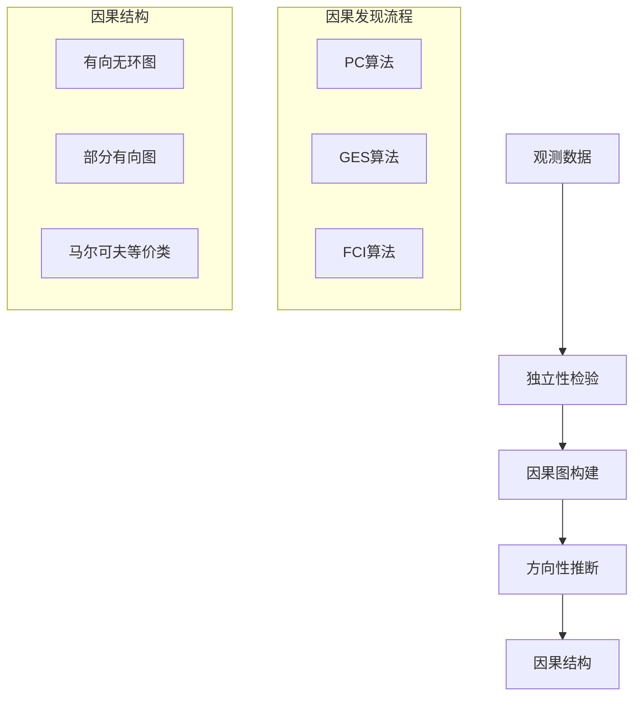
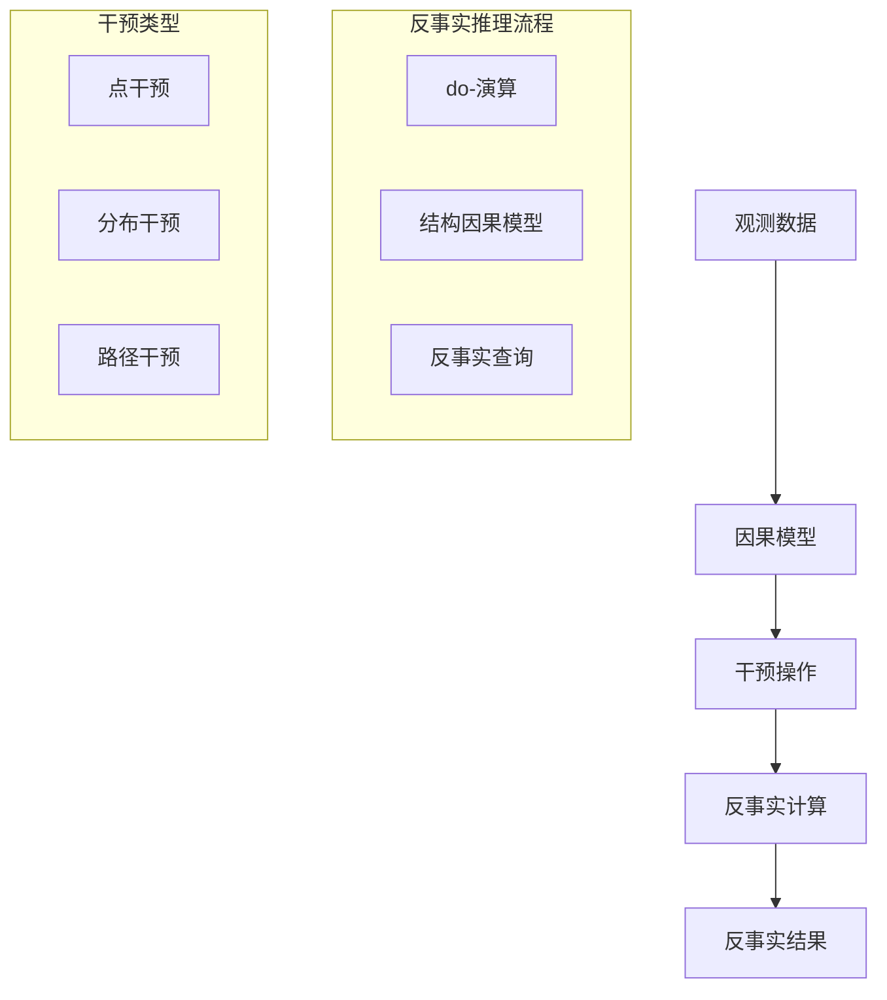

# 因果推理扩展多表征示例 / Causal Inference Extension Multi-Representation Examples

## 概述 / Overview

本文档提供了因果推理扩展的完整多表征示例，包括因果发现、反事实推理和因果效应估计。每种方法都包含数学表示、可视化图表和完整的代码实现。

## 1. 因果发现 / Causal Discovery

### 1.1 因果发现理论 / Causal Discovery Theory

#### 数学表示 / Mathematical Representation

因果发现的目标是从观测数据中推断变量间的因果关系。

因果马尔可夫条件：

Causal Markov Condition:

$$P(X_1, X_2, ..., X_n) = \prod_{i=1}^{n} P(X_i | \text{Pa}(X_i))$$

其中：

- $\text{Pa}(X_i)$ 是$X_i$的父节点集合
- $P(X_i | \text{Pa}(X_i))$ 是条件概率分布

where:

- $\text{Pa}(X_i)$ is the set of parent nodes of $X_i$
- $P(X_i | \text{Pa}(X_i))$ is the conditional probability distribution

因果忠实性：

Causal Faithfulness:

$$X \perp Y | Z \Rightarrow X \text{ and } Y \text{ are d-separated given } Z$$

其中：

- $\perp$ 表示条件独立
- d-separation 是图论中的分离概念

where:

- $\perp$ denotes conditional independence
- d-separation is a graph-theoretic separation concept

#### 可视化表示 / Visual Representation



#### Python实现 / Python Implementation

```python
import numpy as np
import pandas as pd
import matplotlib.pyplot as plt
import seaborn as sns
from scipy import stats
from sklearn.preprocessing import StandardScaler
from sklearn.decomposition import PCA
import networkx as nx
from typing import List, Dict, Tuple, Optional, Set
import itertools
import warnings
warnings.filterwarnings('ignore')

class CausalDiscovery:
    """因果发现算法"""
    
    def __init__(self, alpha: float = 0.05):
        self.alpha = alpha
        self.graph = None
        self.skeleton = None
        self.sepset = {}
    
    def independence_test(self, data: np.ndarray, i: int, j: int, 
                         conditioning_set: Set[int] = None) -> Tuple[bool, float]:
        """独立性检验"""
        if conditioning_set is None:
            conditioning_set = set()
        
        if len(conditioning_set) == 0:
            # 无条件独立性检验
            x = data[:, i]
            y = data[:, j]
            correlation, p_value = stats.pearsonr(x, y)
            return p_value > self.alpha, p_value
        else:
            # 条件独立性检验
            x = data[:, i]
            y = data[:, j]
            z = data[:, list(conditioning_set)]
            
            # 使用偏相关进行条件独立性检验
            n = data.shape[0]
            k = len(conditioning_set)
            
            # 计算偏相关系数
            r_xy = np.corrcoef(x, y)[0, 1]
            r_xz = np.corrcoef(x, z.T)[0, :]
            r_yz = np.corrcoef(y, z.T)[0, :]
            
            # 计算偏相关系数矩阵
            R_zz = np.corrcoef(z.T)
            
            try:
                R_zz_inv = np.linalg.inv(R_zz)
                r_xy_z = r_xy - np.dot(np.dot(r_xz, R_zz_inv), r_yz)
                
                # 计算t统计量
                t_stat = r_xy_z * np.sqrt((n - k - 2) / (1 - r_xy_z**2))
                p_value = 2 * (1 - stats.t.cdf(abs(t_stat), n - k - 2))
                
                return p_value > self.alpha, p_value
            except np.linalg.LinAlgError:
                return True, 1.0  # 奇异矩阵，假设独立
    
    def pc_algorithm(self, data: np.ndarray, variable_names: List[str] = None) -> nx.DiGraph:
        """PC算法实现"""
        n_vars = data.shape[1]
        if variable_names is None:
            variable_names = [f'X{i}' for i in range(n_vars)]
        
        # 初始化完全图
        graph = nx.complete_graph(n_vars)
        self.skeleton = graph.copy()
        
        # 阶段1：骨架发现
        l = 0
        while True:
            edges_to_remove = []
            
            for (i, j) in graph.edges():
                # 寻找大小为l的邻接集
                neighbors_i = set(graph.neighbors(i)) - {j}
                neighbors_j = set(graph.neighbors(j)) - {i}
                
                if len(neighbors_i) >= l:
                    for conditioning_set in itertools.combinations(neighbors_i, l):
                        is_independent, _ = self.independence_test(data, i, j, set(conditioning_set))
                        if is_independent:
                            edges_to_remove.append((i, j))
                            self.sepset[(i, j)] = set(conditioning_set)
                            self.sepset[(j, i)] = set(conditioning_set)
                            break
                
                if (i, j) not in edges_to_remove and len(neighbors_j) >= l:
                    for conditioning_set in itertools.combinations(neighbors_j, l):
                        is_independent, _ = self.independence_test(data, i, j, set(conditioning_set))
                        if is_independent:
                            edges_to_remove.append((i, j))
                            self.sepset[(i, j)] = set(conditioning_set)
                            self.sepset[(j, i)] = set(conditioning_set)
                            break
            
            # 移除边
            for edge in edges_to_remove:
                if edge in graph.edges():
                    graph.remove_edge(*edge)
            
            # 检查是否还有足够大的邻接集
            max_neighbors = max(len(list(graph.neighbors(i))) for i in graph.nodes())
            if max_neighbors <= l:
                break
            
            l += 1
        
        self.skeleton = graph.copy()
        
        # 阶段2：方向性推断
        self._orient_edges(graph, data)
        
        self.graph = graph
        return graph
    
    def _orient_edges(self, graph: nx.Graph, data: np.ndarray) -> None:
        """边方向推断"""
        # 寻找无向三元组
        for (i, j, k) in itertools.combinations(graph.nodes(), 3):
            if graph.has_edge(i, j) and graph.has_edge(j, k) and not graph.has_edge(i, k):
                # 检查是否为v-structure
                if j not in self.sepset.get((i, k), set()):
                    # 这是一个v-structure: i -> j <- k
                    if graph.has_edge(i, j):
                        graph.remove_edge(i, j)
                        graph.add_edge(i, j)
                    if graph.has_edge(k, j):
                        graph.remove_edge(k, j)
                        graph.add_edge(k, j)
        
        # 应用Meek规则
        self._apply_meek_rules(graph)
    
    def _apply_meek_rules(self, graph: nx.DiGraph) -> None:
        """应用Meek规则"""
        changed = True
        while changed:
            changed = False
            
            # Meek规则1: 如果i -> j - k且i和k不相邻，则j -> k
            for (i, j, k) in itertools.permutations(graph.nodes(), 3):
                if (graph.has_edge(i, j) and not graph.has_edge(j, i) and
                    graph.has_edge(j, k) and not graph.has_edge(k, j) and
                    not graph.has_edge(i, k) and not graph.has_edge(k, i)):
                    graph.remove_edge(j, k)
                    graph.add_edge(j, k)
                    changed = True
            
            # Meek规则2: 如果i -> j -> k且i - k，则i -> k
            for (i, j, k) in itertools.permutations(graph.nodes(), 3):
                if (graph.has_edge(i, j) and not graph.has_edge(j, i) and
                    graph.has_edge(j, k) and not graph.has_edge(k, j) and
                    graph.has_edge(i, k) and not graph.has_edge(k, i)):
                    graph.remove_edge(i, k)
                    graph.add_edge(i, k)
                    changed = True
    
    def visualize_graph(self, variable_names: List[str] = None) -> None:
        """可视化因果图"""
        if self.graph is None:
            print("请先运行PC算法")
            return
        
        if variable_names is None:
            variable_names = [f'X{i}' for i in range(len(self.graph.nodes()))]
        
        plt.figure(figsize=(10, 8))
        pos = nx.spring_layout(self.graph)
        
        # 绘制节点
        nx.draw_networkx_nodes(self.graph, pos, node_color='lightblue', 
                             node_size=1000, alpha=0.8)
        
        # 绘制边
        nx.draw_networkx_edges(self.graph, pos, edge_color='black', 
                             arrows=True, arrowsize=20, alpha=0.6)
        
        # 绘制标签
        labels = {i: variable_names[i] for i in self.graph.nodes()}
        nx.draw_networkx_labels(self.graph, pos, labels, font_size=12, font_weight='bold')
        
        plt.title('Causal Graph Discovered by PC Algorithm', fontsize=16, fontweight='bold')
        plt.axis('off')
        plt.tight_layout()
        plt.show()

def generate_causal_data(n_samples: int = 1000, noise_level: float = 0.1) -> Tuple[np.ndarray, List[str]]:
    """生成因果数据"""
    np.random.seed(42)
    
    # 定义因果结构: X1 -> X2 -> X3, X1 -> X3
    n_vars = 3
    data = np.zeros((n_samples, n_vars))
    
    # X1: 根节点
    data[:, 0] = np.random.normal(0, 1, n_samples)
    
    # X2: 受X1影响
    data[:, 1] = 0.5 * data[:, 0] + np.random.normal(0, noise_level, n_samples)
    
    # X3: 受X1和X2影响
    data[:, 2] = 0.3 * data[:, 0] + 0.4 * data[:, 1] + np.random.normal(0, noise_level, n_samples)
    
    variable_names = ['X1', 'X2', 'X3']
    return data, variable_names

def evaluate_causal_discovery(true_graph: nx.DiGraph, discovered_graph: nx.DiGraph) -> Dict[str, float]:
    """评估因果发现结果"""
    # 计算结构汉明距离
    true_edges = set(true_graph.edges())
    discovered_edges = set(discovered_graph.edges())
    
    # 骨架准确性
    true_skeleton = set((min(i, j), max(i, j)) for i, j in true_edges)
    discovered_skeleton = set((min(i, j), max(i, j)) for i, j in discovered_edges)
    
    skeleton_precision = len(true_skeleton & discovered_skeleton) / len(discovered_skeleton) if len(discovered_skeleton) > 0 else 0
    skeleton_recall = len(true_skeleton & discovered_skeleton) / len(true_skeleton) if len(true_skeleton) > 0 else 0
    
    # 方向准确性
    direction_precision = len(true_edges & discovered_edges) / len(discovered_edges) if len(discovered_edges) > 0 else 0
    direction_recall = len(true_edges & discovered_edges) / len(true_edges) if len(true_edges) > 0 else 0
    
    return {
        'skeleton_precision': skeleton_precision,
        'skeleton_recall': skeleton_recall,
        'direction_precision': direction_precision,
        'direction_recall': direction_recall
    }

# 测试因果发现
if __name__ == "__main__":
    # 生成数据
    data, variable_names = generate_causal_data(n_samples=1000, noise_level=0.1)
    
    # 运行PC算法
    cd = CausalDiscovery(alpha=0.05)
    discovered_graph = cd.pc_algorithm(data, variable_names)
    
    # 可视化结果
    cd.visualize_graph(variable_names)
    
    # 创建真实因果图
    true_graph = nx.DiGraph()
    true_graph.add_edges_from([(0, 1), (1, 2), (0, 2)])
    
    # 评估结果
    metrics = evaluate_causal_discovery(true_graph, discovered_graph)
    print("因果发现评估结果:")
    for metric, value in metrics.items():
        print(f"{metric}: {value:.4f}")
```

## 2. 反事实推理 / Counterfactual Reasoning

### 2.1 反事实推理理论 / Counterfactual Reasoning Theory

#### 2.1.1 数学表示 / Mathematical Representation

反事实推理的目标是回答"如果...会怎样"的问题。

反事实定义：

Counterfactual Definition:

$$Y_{X=x}(u) = Y_{M_x}(u)$$

其中：

- $Y_{X=x}(u)$ 是在干预$X=x$下$Y$的值
- $M_x$ 是干预后的模型
- $u$ 是外生变量

where:

- $Y_{X=x}(u)$ is the value of Y under intervention X=x
- $M_x$ is the post-intervention model
- $u$ are the exogenous variables

反事实概率：

Counterfactual Probability:

$$P(Y_{X=x} = y | E = e)$$

其中：

- $E = e$ 是观测到的证据
- $Y_{X=x} = y$ 是反事实结果

where:

- $E = e$ is the observed evidence
- $Y_{X=x} = y$ is the counterfactual outcome

#### 2.1.2 可视化表示 / Visual Representation



#### 2.1.3 Python实现 / Python Implementation

```python
import numpy as np
import pandas as pd
import matplotlib.pyplot as plt
import seaborn as sns
from scipy import stats
from sklearn.linear_model import LinearRegression
from sklearn.ensemble import RandomForestRegressor
from typing import List, Dict, Tuple, Optional, Callable
import warnings
warnings.filterwarnings('ignore')

class StructuralCausalModel:
    """结构因果模型"""
    
    def __init__(self, functions: Dict[str, Callable], noise_distributions: Dict[str, Callable]):
        self.functions = functions
        self.noise_distributions = noise_distributions
        self.variables = list(functions.keys())
    
    def generate_data(self, n_samples: int, random_state: int = 42) -> pd.DataFrame:
        """生成数据"""
        np.random.seed(random_state)
        data = {}
        
        # 按拓扑顺序生成变量
        for var in self.variables:
            if var in self.noise_distributions:
                # 生成噪声
                noise = self.noise_distributions[var](n_samples)
                
                # 计算函数值
                if var in self.functions:
                    # 获取父变量
                    parent_vars = self._get_parent_variables(var)
                    parent_values = [data[parent] for parent in parent_vars] if parent_vars else []
                    
                    # 计算函数值
                    if parent_values:
                        data[var] = self.functions[var](*parent_values, noise)
                    else:
                        data[var] = self.functions[var](noise)
                else:
                    data[var] = noise
        
        return pd.DataFrame(data)
    
    def _get_parent_variables(self, var: str) -> List[str]:
        """获取父变量（简化实现）"""
        # 这里简化处理，实际应该从函数定义中推断
        if var == 'X':
            return []
        elif var == 'Y':
            return ['X']
        elif var == 'Z':
            return ['X', 'Y']
        else:
            return []
    
    def do_intervention(self, data: pd.DataFrame, intervention_var: str, 
                       intervention_value: float) -> pd.DataFrame:
        """执行do干预"""
        intervened_data = data.copy()
        intervened_data[intervention_var] = intervention_value
        
        # 重新计算受影响的变量
        affected_vars = self._get_affected_variables(intervention_var)
        
        for var in affected_vars:
            if var in self.functions:
                parent_vars = self._get_parent_variables(var)
                parent_values = [intervened_data[parent] for parent in parent_vars]
                
                # 生成新的噪声
                noise = self.noise_distributions[var](len(intervened_data))
                
                if parent_values:
                    intervened_data[var] = self.functions[var](*parent_values, noise)
                else:
                    intervened_data[var] = self.functions[var](noise)
        
        return intervened_data
    
    def _get_affected_variables(self, intervention_var: str) -> List[str]:
        """获取受干预影响的变量"""
        # 简化实现：返回所有在干预变量之后的变量
        var_order = ['X', 'Y', 'Z']
        try:
            intervention_idx = var_order.index(intervention_var)
            return var_order[intervention_idx + 1:]
        except ValueError:
            return []

class CounterfactualReasoning:
    """反事实推理"""
    
    def __init__(self, scm: StructuralCausalModel):
        self.scm = scm
        self.observed_data = None
    
    def fit(self, data: pd.DataFrame) -> None:
        """拟合模型"""
        self.observed_data = data
    
    def compute_counterfactual(self, evidence: Dict[str, float], 
                             intervention_var: str, intervention_value: float) -> Dict[str, float]:
        """计算反事实"""
        if self.observed_data is None:
            raise ValueError("请先调用fit方法")
        
        # 步骤1：找到满足证据的样本
        evidence_mask = np.ones(len(self.observed_data), dtype=bool)
        for var, value in evidence.items():
            if var in self.observed_data.columns:
                # 使用近似匹配
                tolerance = 0.1
                evidence_mask &= (abs(self.observed_data[var] - value) < tolerance)
        
        if not np.any(evidence_mask):
            # 如果没有完全匹配的样本，使用最近邻
            evidence_vector = np.array([evidence.get(var, 0) for var in self.scm.variables])
            distances = []
            for _, row in self.observed_data.iterrows():
                row_vector = row[self.scm.variables].values
                distance = np.linalg.norm(row_vector - evidence_vector)
                distances.append(distance)
            
            # 选择最近的样本
            nearest_idx = np.argmin(distances)
            evidence_mask[nearest_idx] = True
        
        # 步骤2：对满足证据的样本执行干预
        evidence_data = self.observed_data[evidence_mask].copy()
        if len(evidence_data) == 0:
            return {var: 0.0 for var in self.scm.variables}
        
        intervened_data = self.scm.do_intervention(evidence_data, intervention_var, intervention_value)
        
        # 步骤3：计算反事实结果
        counterfactual_result = {}
        for var in self.scm.variables:
            if var in intervened_data.columns:
                counterfactual_result[var] = intervened_data[var].mean()
            else:
                counterfactual_result[var] = 0.0
        
        return counterfactual_result
    
    def compute_ate(self, treatment_var: str, outcome_var: str, 
                   treatment_value: float, control_value: float) -> float:
        """计算平均处理效应"""
        if self.observed_data is None:
            raise ValueError("请先调用fit方法")
        
        # 干预组
        treated_data = self.scm.do_intervention(self.observed_data, treatment_var, treatment_value)
        treated_outcome = treated_data[outcome_var].mean()
        
        # 对照组
        control_data = self.scm.do_intervention(self.observed_data, treatment_var, control_value)
        control_outcome = control_data[outcome_var].mean()
        
        return treated_outcome - control_outcome

def create_example_scm() -> StructuralCausalModel:
    """创建示例结构因果模型"""
    # 定义函数
    def f_x(noise):
        return noise
    
    def f_y(x, noise):
        return 0.5 * x + noise
    
    def f_z(x, y, noise):
        return 0.3 * x + 0.4 * y + noise
    
    functions = {
        'X': f_x,
        'Y': f_y,
        'Z': f_z
    }
    
    # 定义噪声分布
    def noise_x(n_samples):
        return np.random.normal(0, 1, n_samples)
    
    def noise_y(n_samples):
        return np.random.normal(0, 0.1, n_samples)
    
    def noise_z(n_samples):
        return np.random.normal(0, 0.1, n_samples)
    
    noise_distributions = {
        'X': noise_x,
        'Y': noise_y,
        'Z': noise_z
    }
    
    return StructuralCausalModel(functions, noise_distributions)

def visualize_counterfactual_comparison(observed_data: pd.DataFrame, 
                                      counterfactual_data: pd.DataFrame,
                                      variable: str) -> None:
    """可视化反事实比较"""
    plt.figure(figsize=(12, 5))
    
    # 观测分布
    plt.subplot(1, 2, 1)
    plt.hist(observed_data[variable], bins=30, alpha=0.7, color='blue', label='Observed')
    plt.title(f'Observed Distribution of {variable}')
    plt.xlabel(variable)
    plt.ylabel('Frequency')
    plt.legend()
    plt.grid(True, alpha=0.3)
    
    # 反事实分布
    plt.subplot(1, 2, 2)
    plt.hist(counterfactual_data[variable], bins=30, alpha=0.7, color='red', label='Counterfactual')
    plt.title(f'Counterfactual Distribution of {variable}')
    plt.xlabel(variable)
    plt.ylabel('Frequency')
    plt.legend()
    plt.grid(True, alpha=0.3)
    
    plt.tight_layout()
    plt.show()

# 测试反事实推理
if __name__ == "__main__":
    # 创建结构因果模型
    scm = create_example_scm()
    
    # 生成数据
    data = scm.generate_data(n_samples=1000)
    
    # 创建反事实推理器
    cf_reasoning = CounterfactualReasoning(scm)
    cf_reasoning.fit(data)
    
    # 计算反事实
    evidence = {'X': 1.0, 'Y': 0.8}
    counterfactual = cf_reasoning.compute_counterfactual(evidence, 'X', 2.0)
    
    print("反事实推理结果:")
    print(f"证据: {evidence}")
    print(f"干预: do(X=2.0)")
    print(f"反事实结果: {counterfactual}")
    
    # 计算平均处理效应
    ate = cf_reasoning.compute_ate('X', 'Y', treatment_value=1.0, control_value=0.0)
    print(f"\n平均处理效应 (ATE): {ate:.4f}")
    
    # 可视化比较
    intervened_data = scm.do_intervention(data, 'X', 2.0)
    visualize_counterfactual_comparison(data, intervened_data, 'Y')
```
