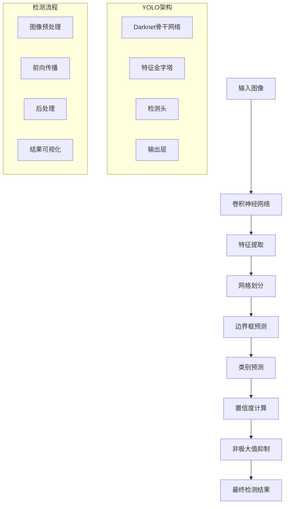

# 计算机视觉扩展多表征示例 / Computer Vision Extension Multi-Representation Examples

## 概述 / Overview

本文档提供了计算机视觉扩展的完整多表征示例，包括目标检测、图像分割和图像生成。每种方法都包含数学表示、可视化图表和完整的代码实现。

## 1. 目标检测 / Object Detection

### 1.1 YOLO目标检测算法 / YOLO Object Detection Algorithm

#### 数学表示 / Mathematical Representation

YOLO (You Only Look Once) 算法将目标检测问题转化为回归问题：

YOLO transforms object detection into a regression problem:

$$P(\text{object}) \times \text{IoU}_{\text{pred}}^{\text{truth}} = \text{Confidence}$$

其中：

- $P(\text{object})$ 是目标存在的概率
- $\text{IoU}_{\text{pred}}^{\text{truth}}$ 是预测框与真实框的交并比
- $\text{Confidence}$ 是置信度分数

where:

- $P(\text{object})$ is the probability of object existence
- $\text{IoU}_{\text{pred}}^{\text{truth}}$ is the intersection over union between predicted and ground truth boxes
- $\text{Confidence}$ is the confidence score

边界框预测：

Bounding Box Prediction:

$$b_x = \sigma(t_x) + c_x$$
$$b_y = \sigma(t_y) + c_y$$
$$b_w = p_w e^{t_w}$$
$$b_h = p_h e^{t_h}$$

其中：

- $(b_x, b_y, b_w, b_h)$ 是预测的边界框坐标
- $(t_x, t_y, t_w, t_h)$ 是网络输出的偏移量
- $(c_x, c_y)$ 是网格单元左上角坐标
- $(p_w, p_h)$ 是先验框的宽高

where:

- $(b_x, b_y, b_w, b_h)$ are predicted bounding box coordinates
- $(t_x, t_y, t_w, t_h)$ are network output offsets
- $(c_x, c_y)$ are grid cell top-left coordinates
- $(p_w, p_h)$ are prior box width and height

#### 可视化表示 / Visual Representation



#### Python实现 / Python Implementation

```python
import torch
import torch.nn as nn
import torch.nn.functional as F
import torch.optim as optim
import numpy as np
import matplotlib.pyplot as plt
import matplotlib.patches as patches
from PIL import Image, ImageDraw
import cv2
from typing import List, Tuple, Dict, Optional
import warnings
warnings.filterwarnings('ignore')

class YOLOLayer(nn.Module):
    """YOLO检测层"""
    
    def __init__(self, anchors: List[Tuple[int, int]], num_classes: int, 
                 input_dim: int, grid_size: int):
        super(YOLOLayer, self).__init__()
        self.anchors = anchors
        self.num_anchors = len(anchors)
        self.num_classes = num_classes
        self.grid_size = grid_size
        self.input_dim = input_dim
        
        # 预测层
        self.conv = nn.Conv2d(input_dim, 
                             self.num_anchors * (5 + num_classes), 
                             kernel_size=1, stride=1, padding=0)
        
    def forward(self, x: torch.Tensor) -> torch.Tensor:
        """前向传播"""
        batch_size = x.size(0)
        grid_size = x.size(2)
        
        # 卷积预测
        prediction = self.conv(x)
        prediction = prediction.view(batch_size, self.num_anchors, 
                                   5 + self.num_classes, grid_size, grid_size)
        prediction = prediction.permute(0, 1, 3, 4, 2).contiguous()
        
        return prediction

class YOLONetwork(nn.Module):
    """YOLO网络"""
    
    def __init__(self, num_classes: int = 20, anchors: List[Tuple[int, int]] = None):
        super(YOLONetwork, self).__init__()
        self.num_classes = num_classes
        
        if anchors is None:
            anchors = [(10, 13), (16, 30), (33, 23), (30, 61), (62, 45)]
        self.anchors = anchors
        
        # 骨干网络 (简化的Darknet)
        self.backbone = nn.Sequential(
            nn.Conv2d(3, 32, kernel_size=3, stride=1, padding=1),
            nn.BatchNorm2d(32),
            nn.LeakyReLU(0.1),
            nn.MaxPool2d(kernel_size=2, stride=2),
            
            nn.Conv2d(32, 64, kernel_size=3, stride=1, padding=1),
            nn.BatchNorm2d(64),
            nn.LeakyReLU(0.1),
            nn.MaxPool2d(kernel_size=2, stride=2),
            
            nn.Conv2d(64, 128, kernel_size=3, stride=1, padding=1),
            nn.BatchNorm2d(128),
            nn.LeakyReLU(0.1),
            nn.MaxPool2d(kernel_size=2, stride=2),
            
            nn.Conv2d(128, 256, kernel_size=3, stride=1, padding=1),
            nn.BatchNorm2d(256),
            nn.LeakyReLU(0.1),
            nn.MaxPool2d(kernel_size=2, stride=2),
            
            nn.Conv2d(256, 512, kernel_size=3, stride=1, padding=1),
            nn.BatchNorm2d(512),
            nn.LeakyReLU(0.1),
            nn.MaxPool2d(kernel_size=2, stride=2),
        )
        
        # YOLO检测层
        self.yolo_layer = YOLOLayer(anchors, num_classes, 512, 13)
        
    def forward(self, x: torch.Tensor) -> torch.Tensor:
        """前向传播"""
        features = self.backbone(x)
        predictions = self.yolo_layer(features)
        return predictions

class YOLODetector:
    """YOLO检测器"""
    
    def __init__(self, model: YOLONetwork, conf_threshold: float = 0.5, 
                 nms_threshold: float = 0.4):
        self.model = model
        self.conf_threshold = conf_threshold
        self.nms_threshold = nms_threshold
        
    def detect(self, image: np.ndarray) -> List[Dict]:
        """检测目标"""
        # 预处理
        input_tensor = self.preprocess_image(image)
        
        # 推理
        with torch.no_grad():
            predictions = self.model(input_tensor)
        
        # 后处理
        detections = self.postprocess(predictions, image.shape)
        
        return detections
    
    def preprocess_image(self, image: np.ndarray) -> torch.Tensor:
        """图像预处理"""
        # 调整大小
        resized = cv2.resize(image, (416, 416))
        
        # 归一化
        normalized = resized.astype(np.float32) / 255.0
        
        # 转换为张量
        tensor = torch.from_numpy(normalized).permute(2, 0, 1).unsqueeze(0)
        
        return tensor
    
    def postprocess(self, predictions: torch.Tensor, 
                   original_shape: Tuple[int, int, int]) -> List[Dict]:
        """后处理检测结果"""
        batch_size, num_anchors, grid_size, _, num_outputs = predictions.shape
        
        # 重塑预测
        predictions = predictions.view(batch_size, num_anchors * grid_size * grid_size, 
                                     num_outputs)
        
        # 分离不同输出
        bbox_xy = torch.sigmoid(predictions[..., :2])
        bbox_wh = torch.exp(predictions[..., 2:4])
        objectness = torch.sigmoid(predictions[..., 4])
        class_scores = torch.sigmoid(predictions[..., 5:])
        
        # 过滤低置信度
        conf_mask = objectness > self.conf_threshold
        filtered_predictions = predictions[conf_mask]
        
        if len(filtered_predictions) == 0:
            return []
        
        # 转换为绝对坐标
        grid_x, grid_y = torch.meshgrid(torch.arange(grid_size), 
                                       torch.arange(grid_size))
        grid_x = grid_x.unsqueeze(0).repeat(batch_size, num_anchors, 1, 1)
        grid_y = grid_y.unsqueeze(0).repeat(batch_size, num_anchors, 1, 1)
        
        bbox_x = (bbox_xy[..., 0] + grid_x.view_as(bbox_xy[..., 0])) / grid_size
        bbox_y = (bbox_xy[..., 1] + grid_y.view_as(bbox_xy[..., 1])) / grid_size
        
        # 转换为像素坐标
        img_h, img_w = original_shape[:2]
        bbox_x = bbox_x * img_w
        bbox_y = bbox_y * img_h
        bbox_w = bbox_wh[..., 0] * img_w
        bbox_h = bbox_wh[..., 1] * img_h
        
        # 构建检测结果
        detections = []
        for i in range(len(filtered_predictions)):
            x, y, w, h = bbox_x[i], bbox_y[i], bbox_w[i], bbox_h[i]
            conf = objectness[i]
            class_id = torch.argmax(class_scores[i]).item()
            
            detections.append({
                'bbox': [x.item(), y.item(), w.item(), h.item()],
                'confidence': conf.item(),
                'class_id': class_id
            })
        
        # 非极大值抑制
        detections = self.non_max_suppression(detections)
        
        return detections
    
    def non_max_suppression(self, detections: List[Dict]) -> List[Dict]:
        """非极大值抑制"""
        if not detections:
            return []
        
        # 按置信度排序
        detections = sorted(detections, key=lambda x: x['confidence'], reverse=True)
        
        filtered_detections = []
        
        while detections:
            # 选择最高置信度的检测
            current = detections.pop(0)
            filtered_detections.append(current)
            
            # 计算IoU并移除重叠检测
            remaining = []
            for detection in detections:
                iou = self.calculate_iou(current['bbox'], detection['bbox'])
                if iou < self.nms_threshold:
                    remaining.append(detection)
            
            detections = remaining
        
        return filtered_detections
    
    def calculate_iou(self, bbox1: List[float], bbox2: List[float]) -> float:
        """计算IoU"""
        x1, y1, w1, h1 = bbox1
        x2, y2, w2, h2 = bbox2
        
        # 计算交集
        x_left = max(x1, x2)
        y_top = max(y1, y2)
        x_right = min(x1 + w1, x2 + w2)
        y_bottom = min(y1 + h1, y2 + h2)
        
        if x_right < x_left or y_bottom < y_top:
            return 0.0
        
        intersection = (x_right - x_left) * (y_bottom - y_top)
        
        # 计算并集
        area1 = w1 * h1
        area2 = w2 * h2
        union = area1 + area2 - intersection
        
        return intersection / union if union > 0 else 0.0

def generate_sample_image(size: Tuple[int, int] = (416, 416)) -> np.ndarray:
    """生成示例图像"""
    image = np.zeros((size[0], size[1], 3), dtype=np.uint8)
    
    # 添加一些简单的几何形状作为目标
    # 矩形
    cv2.rectangle(image, (50, 50), (150, 150), (255, 0, 0), -1)
    
    # 圆形
    cv2.circle(image, (300, 100), 50, (0, 255, 0), -1)
    
    # 三角形
    pts = np.array([[200, 300], [250, 200], [300, 300]], np.int32)
    cv2.fillPoly(image, [pts], (0, 0, 255))
    
    return image

def visualize_detections(image: np.ndarray, detections: List[Dict]) -> None:
    """可视化检测结果"""
    fig, (ax1, ax2) = plt.subplots(1, 2, figsize=(15, 6))
    
    # 原始图像
    ax1.imshow(cv2.cvtColor(image, cv2.COLOR_BGR2RGB))
    ax1.set_title('Original Image')
    ax1.axis('off')
    
    # 检测结果
    ax2.imshow(cv2.cvtColor(image, cv2.COLOR_BGR2RGB))
    
    colors = ['red', 'green', 'blue', 'yellow', 'purple']
    for i, detection in enumerate(detections):
        x, y, w, h = detection['bbox']
        conf = detection['confidence']
        class_id = detection['class_id']
        
        # 绘制边界框
        rect = patches.Rectangle((x, y), w, h, linewidth=2, 
                               edgecolor=colors[class_id % len(colors)], 
                               facecolor='none')
        ax2.add_patch(rect)
        
        # 添加标签
        ax2.text(x, y - 10, f'Class {class_id}: {conf:.2f}', 
                color=colors[class_id % len(colors)], fontsize=10, 
                bbox=dict(boxstyle="round,pad=0.3", facecolor='white', alpha=0.7))
    
    ax2.set_title('Object Detection Results')
    ax2.axis('off')
    
    plt.tight_layout()
    plt.show()

# 测试目标检测
if __name__ == "__main__":
    # 创建模型
    model = YOLONetwork(num_classes=3)  # 3个类别：矩形、圆形、三角形
    
    # 创建检测器
    detector = YOLODetector(model, conf_threshold=0.3, nms_threshold=0.4)
    
    # 生成示例图像
    image = generate_sample_image()
    
    # 执行检测
    detections = detector.detect(image)
    
    print(f"检测到 {len(detections)} 个目标:")
    for i, detection in enumerate(detections):
        print(f"目标 {i+1}: 类别 {detection['class_id']}, "
              f"置信度 {detection['confidence']:.3f}, "
              f"边界框 {detection['bbox']}")
    
    # 可视化结果
    visualize_detections(image, detections)
```
