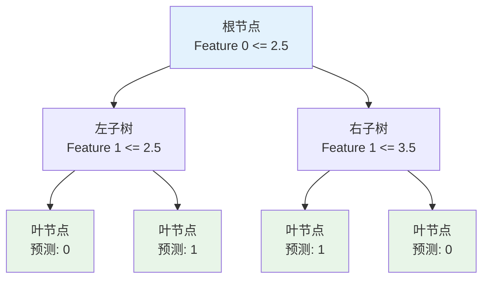
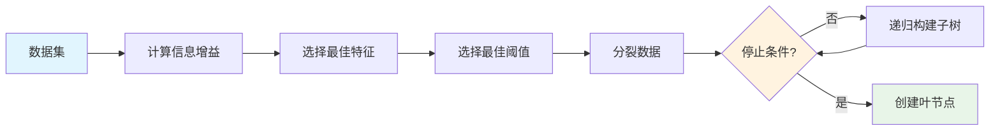
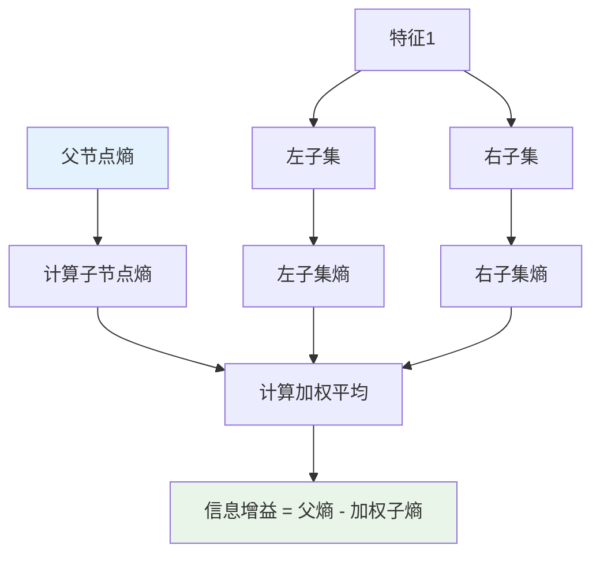

# 决策树多表征示例 / Decision Tree Multi-Representation Example

## 概述 / Overview

本文档展示决策树模型的多表征实现，包括数学公式、代码实现、图表可视化和自然语言描述。

## 1. 决策树模型 / Decision Tree Model

### 1.1 数学表征 / Mathematical Representation

#### 信息熵 / Information Entropy

**信息熵定义**:
$$H(S) = -\sum_{i=1}^{c} p_i \log_2(p_i)$$

其中 $p_i$ 是类别 $i$ 在集合 $S$ 中的比例。

#### 信息增益 / Information Gain

**信息增益**:
$$IG(S, A) = H(S) - \sum_{v \in Values(A)} \frac{|S_v|}{|S|} H(S_v)$$

其中：

- $S$ 是当前数据集
- $A$ 是特征
- $S_v$ 是特征 $A$ 取值为 $v$ 的子集

#### 基尼指数 / Gini Index

**基尼指数**:
$$Gini(S) = 1 - \sum_{i=1}^{c} p_i^2$$

**基尼增益**:
$$GiniGain(S, A) = Gini(S) - \sum_{v \in Values(A)} \frac{|S_v|}{|S|} Gini(S_v)$$

#### 决策树预测 / Decision Tree Prediction

**叶节点预测**:
$$f(x) = \arg\max_{c} \sum_{i \in Leaf(x)} I(y_i = c)$$

其中 $Leaf(x)$ 是包含样本 $x$ 的叶节点。

### 1.2 代码表征 / Code Representation

#### Rust实现 / Rust Implementation

```rust
use std::collections::HashMap;

#[derive(Debug, Clone)]
pub struct TreeNode {
    pub feature_index: Option<usize>,
    pub threshold: Option<f64>,
    pub left: Option<Box<TreeNode>>,
    pub right: Option<Box<TreeNode>>,
    pub prediction: Option<f64>,
    pub is_leaf: bool,
}

impl TreeNode {
    pub fn new_leaf(prediction: f64) -> Self {
        Self {
            feature_index: None,
            threshold: None,
            left: None,
            right: None,
            prediction: Some(prediction),
            is_leaf: true,
        }
    }
    
    pub fn new_split(feature_index: usize, threshold: f64) -> Self {
        Self {
            feature_index: Some(feature_index),
            threshold: Some(threshold),
            left: None,
            right: None,
            prediction: None,
            is_leaf: false,
        }
    }
}

#[derive(Debug)]
pub struct DecisionTree {
    pub root: Option<TreeNode>,
    pub max_depth: Option<usize>,
    pub min_samples_split: usize,
}

impl DecisionTree {
    pub fn new(max_depth: Option<usize>, min_samples_split: usize) -> Self {
        Self {
            root: None,
            max_depth,
            min_samples_split,
        }
    }
    
    pub fn fit(&mut self, x: &[Vec<f64>], y: &[f64]) {
        self.root = Some(self.build_tree(x, y, 0));
    }
    
    fn build_tree(&self, x: &[Vec<f64>], y: &[f64], depth: usize) -> TreeNode {
        let n_samples = x.len();
        let n_classes = self.count_unique_classes(y);
        
        // 停止条件
        if n_samples < self.min_samples_split || 
           n_classes == 1 || 
           self.max_depth.map_or(false, |max_d| depth >= max_d) {
            return TreeNode::new_leaf(self.majority_class(y));
        }
        
        // 寻找最佳分裂
        let (best_feature, best_threshold, best_gain) = self.find_best_split(x, y);
        
        if best_gain <= 0.0 {
            return TreeNode::new_leaf(self.majority_class(y));
        }
        
        // 分裂数据
        let (left_indices, right_indices) = self.split_data(x, best_feature, best_threshold);
        
        if left_indices.is_empty() || right_indices.is_empty() {
            return TreeNode::new_leaf(self.majority_class(y));
        }
        
        // 构建子节点
        let mut node = TreeNode::new_split(best_feature, best_threshold);
        
        let left_x: Vec<Vec<f64>> = left_indices.iter().map(|&i| x[i].clone()).collect();
        let left_y: Vec<f64> = left_indices.iter().map(|&i| y[i]).collect();
        let right_x: Vec<Vec<f64>> = right_indices.iter().map(|&i| x[i].clone()).collect();
        let right_y: Vec<f64> = right_indices.iter().map(|&i| y[i]).collect();
        
        node.left = Some(Box::new(self.build_tree(&left_x, &left_y, depth + 1)));
        node.right = Some(Box::new(self.build_tree(&right_x, &right_y, depth + 1)));
        
        node
    }
    
    fn find_best_split(&self, x: &[Vec<f64>], y: &[f64]) -> (usize, f64, f64) {
        let n_features = x[0].len();
        let mut best_feature = 0;
        let mut best_threshold = 0.0;
        let mut best_gain = 0.0;
        
        for feature in 0..n_features {
            let unique_values: Vec<f64> = x.iter()
                .map(|sample| sample[feature])
                .collect::<std::collections::HashSet<_>>()
                .into_iter()
                .collect();
            
            for &threshold in &unique_values {
                let gain = self.information_gain(x, y, feature, threshold);
                if gain > best_gain {
                    best_gain = gain;
                    best_feature = feature;
                    best_threshold = threshold;
                }
            }
        }
        
        (best_feature, best_threshold, best_gain)
    }
    
    fn information_gain(&self, x: &[Vec<f64>], y: &[f64], feature: usize, threshold: f64) -> f64 {
        let parent_entropy = self.entropy(y);
        let (left_indices, right_indices) = self.split_data(x, feature, threshold);
        
        if left_indices.is_empty() || right_indices.is_empty() {
            return 0.0;
        }
        
        let left_y: Vec<f64> = left_indices.iter().map(|&i| y[i]).collect();
        let right_y: Vec<f64> = right_indices.iter().map(|&i| y[i]).collect();
        
        let left_entropy = self.entropy(&left_y);
        let right_entropy = self.entropy(&right_y);
        
        let n_samples = x.len() as f64;
        let left_weight = left_indices.len() as f64 / n_samples;
        let right_weight = right_indices.len() as f64 / n_samples;
        
        parent_entropy - (left_weight * left_entropy + right_weight * right_entropy)
    }
    
    fn entropy(&self, y: &[f64]) -> f64 {
        let mut class_counts: HashMap<f64, usize> = HashMap::new();
        for &class in y {
            *class_counts.entry(class).or_insert(0) += 1;
        }
        
        let n_samples = y.len() as f64;
        class_counts.values()
            .map(|&count| {
                let p = count as f64 / n_samples;
                -p * p.log2()
            })
            .sum()
    }
    
    fn split_data(&self, x: &[Vec<f64>], feature: usize, threshold: f64) -> (Vec<usize>, Vec<usize>) {
        let mut left_indices = Vec::new();
        let mut right_indices = Vec::new();
        
        for (i, sample) in x.iter().enumerate() {
            if sample[feature] <= threshold {
                left_indices.push(i);
            } else {
                right_indices.push(i);
            }
        }
        
        (left_indices, right_indices)
    }
    
    fn majority_class(&self, y: &[f64]) -> f64 {
        let mut class_counts: HashMap<f64, usize> = HashMap::new();
        for &class in y {
            *class_counts.entry(class).or_insert(0) += 1;
        }
        
        class_counts.into_iter()
            .max_by_key(|&(_, count)| count)
            .map(|(class, _)| class)
            .unwrap_or(0.0)
    }
    
    fn count_unique_classes(&self, y: &[f64]) -> usize {
        y.iter().collect::<std::collections::HashSet<_>>().len()
    }
    
    pub fn predict(&self, x: &[Vec<f64>]) -> Vec<f64> {
        x.iter().map(|sample| self.predict_single(sample)).collect()
    }
    
    fn predict_single(&self, x: &[f64]) -> f64 {
        if let Some(ref root) = self.root {
            self.traverse_tree(root, x)
        } else {
            0.0
        }
    }
    
    fn traverse_tree(&self, node: &TreeNode, x: &[f64]) -> f64 {
        if node.is_leaf {
            return node.prediction.unwrap_or(0.0);
        }
        
        let feature_index = node.feature_index.unwrap();
        let threshold = node.threshold.unwrap();
        
        if x[feature_index] <= threshold {
            if let Some(ref left) = node.left {
                self.traverse_tree(left, x)
            } else {
                0.0
            }
        } else {
            if let Some(ref right) = node.right {
                self.traverse_tree(right, x)
            } else {
                0.0
            }
        }
    }
}

// 使用示例
fn main() {
    // 创建训练数据
    let x = vec![
        vec![1.0, 2.0],
        vec![2.0, 3.0],
        vec![3.0, 1.0],
        vec![4.0, 2.0],
        vec![1.0, 4.0],
        vec![2.0, 5.0],
    ];
    
    let y = vec![0.0, 0.0, 1.0, 1.0, 0.0, 1.0];
    
    // 创建决策树
    let mut tree = DecisionTree::new(Some(3), 2);
    
    // 训练
    tree.fit(&x, &y);
    
    // 预测
    let test_x = vec![vec![2.5, 2.5], vec![1.5, 3.5]];
    let predictions = tree.predict(&test_x);
    
    println!("Predictions: {:?}", predictions);
}
```

#### Haskell实现 / Haskell Implementation

```haskell
module DecisionTree where

import Data.List (group, sort, maximumBy)
import Data.Ord (comparing)
import qualified Data.Map as Map

-- 决策树节点
data TreeNode = Leaf Double | Split Int Double TreeNode TreeNode deriving (Show)

-- 决策树
data DecisionTree = DecisionTree {
    root :: Maybe TreeNode,
    maxDepth :: Maybe Int,
    minSamplesSplit :: Int
} deriving (Show)

-- 创建决策树
newDecisionTree :: Maybe Int -> Int -> DecisionTree
newDecisionTree maxD minSamples = DecisionTree {
    root = Nothing,
    maxDepth = maxD,
    minSamplesSplit = minSamples
}

-- 训练决策树
fit :: DecisionTree -> [[Double]] -> [Double] -> DecisionTree
fit tree x y = tree { root = Just (buildTree x y 0) }
  where
    buildTree :: [[Double]] -> [Double] -> Int -> TreeNode
    buildTree x y depth
        | length x < minSamplesSplit tree = Leaf (majorityClass y)
        | length (uniqueClasses y) == 1 = Leaf (head y)
        | maybe False (depth >=) (maxDepth tree) = Leaf (majorityClass y)
        | otherwise = case findBestSplit x y of
            Nothing -> Leaf (majorityClass y)
            Just (feature, threshold, gain)
                | gain <= 0 -> Leaf (majorityClass y)
                | otherwise -> let
                    (leftIndices, rightIndices) = splitData x feature threshold
                    leftX = map (x !!) leftIndices
                    leftY = map (y !!) leftIndices
                    rightX = map (x !!) rightIndices
                    rightY = map (y !!) rightIndices
                  in if null leftIndices || null rightIndices
                     then Leaf (majorityClass y)
                     else Split feature threshold 
                          (buildTree leftX leftY (depth + 1))
                          (buildTree rightX rightY (depth + 1))

-- 寻找最佳分裂
findBestSplit :: [[Double]] -> [Double] -> Maybe (Int, Double, Double)
findBestSplit x y = if null candidates then Nothing else Just best
  where
    nFeatures = length (head x)
    candidates = [(feature, threshold, gain) | 
                 feature <- [0..nFeatures-1],
                 threshold <- uniqueValues x feature,
                 let gain = informationGain x y feature threshold,
                 gain > 0]
    best = maximumBy (comparing (\(_, _, gain) -> gain)) candidates

-- 信息增益
informationGain :: [[Double]] -> [Double] -> Int -> Double -> Double
informationGain x y feature threshold = parentEntropy - weightedChildEntropy
  where
    parentEntropy = entropy y
    (leftIndices, rightIndices) = splitData x feature threshold
    leftY = map (y !!) leftIndices
    rightY = map (y !!) rightIndices
    nSamples = fromIntegral (length x)
    leftWeight = fromIntegral (length leftIndices) / nSamples
    rightWeight = fromIntegral (length rightIndices) / nSamples
    weightedChildEntropy = leftWeight * entropy leftY + rightWeight * entropy rightY

-- 信息熵
entropy :: [Double] -> Double
entropy y = sum [negate p * logBase 2 p | p <- classProbabilities y, p > 0]
  where
    classProbabilities y = [fromIntegral count / fromIntegral (length y) | 
                           count <- map length (group (sort y))]

-- 分裂数据
splitData :: [[Double]] -> Int -> Double -> ([Int], [Int])
splitData x feature threshold = foldr split ([], []) (zip [0..] x)
  where
    split (i, sample) (left, right) = 
        if sample !! feature <= threshold
        then (i:left, right)
        else (left, i:right)

-- 多数类
majorityClass :: [Double] -> Double
majorityClass y = fst (maximumBy (comparing snd) classCounts)
  where
    classCounts = [(class, length occurrences) | 
                   (class, occurrences) <- Map.toList (Map.fromListWith (++) [(c, [c]) | c <- y])]

-- 唯一类别数
uniqueClasses :: [Double] -> [Double]
uniqueClasses = map head . group . sort

-- 唯一值
uniqueValues :: [[Double]] -> Int -> [Double]
uniqueValues x feature = map head . group . sort $ map (!! feature) x

-- 预测
predict :: DecisionTree -> [[Double]] -> [Double]
predict tree x = map (predictSingle tree) x

predictSingle :: DecisionTree -> [Double] -> Double
predictSingle tree sample = case root tree of
    Nothing -> 0.0
    Just node -> traverseTree node sample

traverseTree :: TreeNode -> [Double] -> Double
traverseTree (Leaf prediction) _ = prediction
traverseTree (Split feature threshold left right) sample =
    if sample !! feature <= threshold
    then traverseTree left sample
    else traverseTree right sample

-- 示例使用
example :: IO ()
example = do
    let x = [
            [1.0, 2.0],
            [2.0, 3.0],
            [3.0, 1.0],
            [4.0, 2.0],
            [1.0, 4.0],
            [2.0, 5.0]
        ]
        y = [0.0, 0.0, 1.0, 1.0, 0.0, 1.0]
    
    let tree = newDecisionTree (Just 3) 2
    let trainedTree = fit tree x y
    
    let testX = [[2.5, 2.5], [1.5, 3.5]]
    let predictions = predict trainedTree testX
    
    putStrLn $ "Predictions: " ++ show predictions
```

#### Python实现 / Python Implementation

```python
import numpy as np
import matplotlib.pyplot as plt
from dataclasses import dataclass
from typing import List, Tuple, Optional
from collections import Counter

@dataclass
class TreeNode:
    """决策树节点"""
    feature_index: Optional[int] = None
    threshold: Optional[float] = None
    left: Optional['TreeNode'] = None
    right: Optional['TreeNode'] = None
    prediction: Optional[float] = None
    is_leaf: bool = False

class DecisionTree:
    """决策树类"""
    
    def __init__(self, max_depth: Optional[int] = None, min_samples_split: int = 2):
        self.root = None
        self.max_depth = max_depth
        self.min_samples_split = min_samples_split
    
    def fit(self, x: np.ndarray, y: np.ndarray) -> None:
        """训练决策树"""
        self.root = self._build_tree(x, y, 0)
    
    def _build_tree(self, x: np.ndarray, y: np.ndarray, depth: int) -> TreeNode:
        """构建决策树"""
        n_samples, n_features = x.shape
        n_classes = len(np.unique(y))
        
        # 停止条件
        if (n_samples < self.min_samples_split or 
            n_classes == 1 or 
            (self.max_depth is not None and depth >= self.max_depth)):
            return TreeNode(prediction=self._majority_class(y), is_leaf=True)
        
        # 寻找最佳分裂
        best_feature, best_threshold, best_gain = self._find_best_split(x, y)
        
        if best_gain <= 0:
            return TreeNode(prediction=self._majority_class(y), is_leaf=True)
        
        # 分裂数据
        left_indices = x[:, best_feature] <= best_threshold
        right_indices = ~left_indices
        
        if not np.any(left_indices) or not np.any(right_indices):
            return TreeNode(prediction=self._majority_class(y), is_leaf=True)
        
        # 构建子节点
        node = TreeNode(feature_index=best_feature, threshold=best_threshold)
        node.left = self._build_tree(x[left_indices], y[left_indices], depth + 1)
        node.right = self._build_tree(x[right_indices], y[right_indices], depth + 1)
        
        return node
    
    def _find_best_split(self, x: np.ndarray, y: np.ndarray) -> Tuple[int, float, float]:
        """寻找最佳分裂点"""
        n_samples, n_features = x.shape
        best_feature = 0
        best_threshold = 0.0
        best_gain = 0.0
        
        for feature in range(n_features):
            unique_values = np.unique(x[:, feature])
            for threshold in unique_values:
                gain = self._information_gain(x, y, feature, threshold)
                if gain > best_gain:
                    best_gain = gain
                    best_feature = feature
                    best_threshold = threshold
        
        return best_feature, best_threshold, best_gain
    
    def _information_gain(self, x: np.ndarray, y: np.ndarray, feature: int, threshold: float) -> float:
        """计算信息增益"""
        parent_entropy = self._entropy(y)
        
        left_indices = x[:, feature] <= threshold
        right_indices = ~left_indices
        
        if not np.any(left_indices) or not np.any(right_indices):
            return 0.0
        
        left_entropy = self._entropy(y[left_indices])
        right_entropy = self._entropy(y[right_indices])
        
        n_samples = len(y)
        left_weight = np.sum(left_indices) / n_samples
        right_weight = np.sum(right_indices) / n_samples
        
        return parent_entropy - (left_weight * left_entropy + right_weight * right_entropy)
    
    def _entropy(self, y: np.ndarray) -> float:
        """计算信息熵"""
        _, counts = np.unique(y, return_counts=True)
        probabilities = counts / len(y)
        return -np.sum(probabilities * np.log2(probabilities + 1e-10))
    
    def _majority_class(self, y: np.ndarray) -> float:
        """获取多数类"""
        return Counter(y).most_common(1)[0][0]
    
    def predict(self, x: np.ndarray) -> np.ndarray:
        """预测"""
        return np.array([self._predict_single(sample) for sample in x])
    
    def _predict_single(self, x: np.ndarray) -> float:
        """预测单个样本"""
        return self._traverse_tree(self.root, x)
    
    def _traverse_tree(self, node: TreeNode, x: np.ndarray) -> float:
        """遍历决策树"""
        if node.is_leaf:
            return node.prediction
        
        if x[node.feature_index] <= node.threshold:
            return self._traverse_tree(node.left, x)
        else:
            return self._traverse_tree(node.right, x)
    
    def print_tree(self, node: Optional[TreeNode] = None, depth: int = 0) -> None:
        """打印决策树结构"""
        if node is None:
            node = self.root
        
        if node is None:
            return
        
        indent = "  " * depth
        
        if node.is_leaf:
            print(f"{indent}Leaf: {node.prediction}")
        else:
            print(f"{indent}Feature {node.feature_index} <= {node.threshold}")
            print(f"{indent}├─ Left:")
            self.print_tree(node.left, depth + 1)
            print(f"{indent}└─ Right:")
            self.print_tree(node.right, depth + 1)

# 使用示例
def demo_decision_tree():
    """演示决策树"""
    # 创建训练数据
    x = np.array([
        [1, 2],
        [2, 3],
        [3, 1],
        [4, 2],
        [1, 4],
        [2, 5],
    ])
    
    y = np.array([0, 0, 1, 1, 0, 1])
    
    # 创建决策树
    tree = DecisionTree(max_depth=3, min_samples_split=2)
    
    # 训练
    tree.fit(x, y)
    
    # 打印树结构
    print("Decision Tree Structure:")
    tree.print_tree()
    
    # 预测
    test_x = np.array([[2.5, 2.5], [1.5, 3.5]])
    predictions = tree.predict(test_x)
    
    print(f"\nPredictions: {predictions}")
    
    # 可视化决策边界
    plot_decision_boundary(tree, x, y)

def plot_decision_boundary(tree: DecisionTree, x: np.ndarray, y: np.ndarray) -> None:
    """绘制决策边界"""
    x_min, x_max = x[:, 0].min() - 1, x[:, 0].max() + 1
    y_min, y_max = x[:, 1].min() - 1, x[:, 1].max() + 1
    
    xx, yy = np.meshgrid(np.arange(x_min, x_max, 0.1),
                         np.arange(y_min, y_max, 0.1))
    
    z = tree.predict(np.c_[xx.ravel(), yy.ravel()])
    z = z.reshape(xx.shape)
    
    plt.figure(figsize=(10, 8))
    plt.contourf(xx, yy, z, alpha=0.4)
    plt.scatter(x[:, 0], x[:, 1], c=y, alpha=0.8)
    plt.xlabel('Feature 1')
    plt.ylabel('Feature 2')
    plt.title('Decision Tree Decision Boundary')
    plt.colorbar()
    plt.show()

if __name__ == "__main__":
    demo_decision_tree()
```

### 1.3 图表表征 / Visual Representation

#### 决策树结构图 / Decision Tree Structure Diagram



#### 分裂过程图 / Splitting Process Diagram



#### 信息增益计算图 / Information Gain Calculation Diagram



### 1.4 自然语言表征 / Natural Language Representation

#### 中文描述 / Chinese Description

**决策树**是一种基于树形结构的分类和回归模型，具有以下核心特征：

**基本概念**:

- **节点**: 决策点或叶节点
- **分裂**: 根据特征值将数据分成子集
- **信息增益**: 衡量分裂质量的指标
- **剪枝**: 防止过拟合的技术

**工作原理**:

1. 特征选择：计算每个特征的信息增益
2. 最佳分裂：选择信息增益最大的特征和阈值
3. 递归构建：对子集重复上述过程
4. 停止条件：达到最大深度或最小样本数

**分裂标准**:

- **信息熵**: 衡量数据的不确定性
- **基尼指数**: 衡量数据的不纯度
- **信息增益**: 分裂前后的熵减少量

**优势**:

- 易于理解和解释
- 处理数值和分类特征
- 自动特征选择
- 可视化友好

**应用领域**:

- 医疗诊断
- 金融风险评估
- 客户分类
- 推荐系统

#### 英文描述 / English Description

**Decision trees** are tree-structured models for classification and regression with the following core features:

**Basic Concepts**:

- **Nodes**: Decision points or leaf nodes
- **Splitting**: Dividing data into subsets based on feature values
- **Information Gain**: Metric to measure split quality
- **Pruning**: Technique to prevent overfitting

**Working Principle**:

1. Feature selection: Calculate information gain for each feature
2. Best split: Choose feature and threshold with maximum information gain
3. Recursive construction: Repeat the process for subsets
4. Stopping criteria: Reach maximum depth or minimum samples

**Splitting Criteria**:

- **Information Entropy**: Measures data uncertainty
- **Gini Index**: Measures data impurity
- **Information Gain**: Entropy reduction after splitting

**Advantages**:

- Easy to understand and interpret
- Handle numerical and categorical features
- Automatic feature selection
- Visualization friendly

**Applications**:

- Medical diagnosis
- Financial risk assessment
- Customer classification
- Recommendation systems

---

*最后更新: 2025-08-01*
*版本: 1.0.0*
