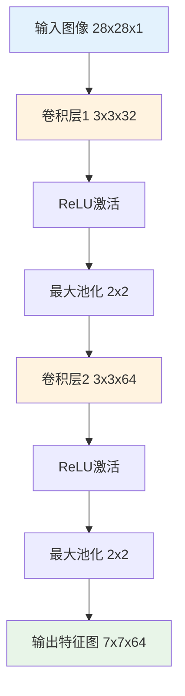
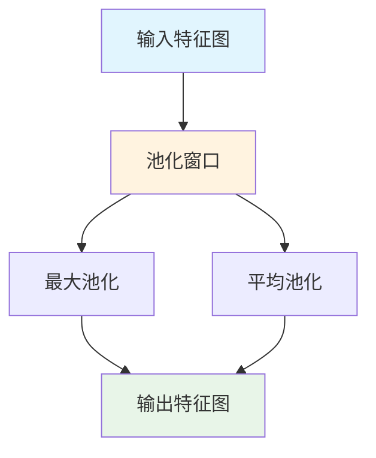

# 深度学习模型多表征示例 / Deep Learning Models Multi-Representation Example

## 概述 / Overview

本文档展示深度学习模型的多表征实现，包括数学公式、代码实现、图表可视化和自然语言描述。

## 1. 卷积神经网络 / Convolutional Neural Network (CNN)

### 1.1 数学表征 / Mathematical Representation

#### 卷积操作 / Convolution Operation

**2D卷积**:
$$(f * k)(i, j) = \sum_{m=-\infty}^{\infty} \sum_{n=-\infty}^{\infty} f(m, n) \cdot k(i-m, j-n)$$

其中：
- $f$ 是输入特征图
- $k$ 是卷积核
- $(i, j)$ 是输出位置

#### 池化操作 / Pooling Operation

**最大池化**:
$$\text{MaxPool}(x)_{i,j} = \max_{(p,q) \in R_{i,j}} x_{p,q}$$

**平均池化**:
$$\text{AvgPool}(x)_{i,j} = \frac{1}{|R_{i,j}|} \sum_{(p,q) \in R_{i,j}} x_{p,q}$$

其中 $R_{i,j}$ 是池化窗口。

#### 激活函数 / Activation Functions

**ReLU函数**:
$$\text{ReLU}(x) = \max(0, x)$$

**Sigmoid函数**:
$$\sigma(x) = \frac{1}{1 + e^{-x}}$$

**Tanh函数**:
$$\tanh(x) = \frac{e^x - e^{-x}}{e^x + e^{-x}}$$

### 1.2 代码表征 / Code Representation

#### Rust实现 / Rust Implementation

```rust
use ndarray::{Array2, Array3, Array4, Axis};

#[derive(Debug)]
pub struct Conv2D {
    pub filters: Array4<f64>,
    pub bias: Array1<f64>,
    pub stride: usize,
    pub padding: usize,
}

impl Conv2D {
    pub fn new(in_channels: usize, out_channels: usize, kernel_size: usize, 
               stride: usize, padding: usize) -> Self {
        let filters = Array4::random((out_channels, in_channels, kernel_size, kernel_size));
        let bias = Array1::zeros(out_channels);
        
        Self {
            filters,
            bias,
            stride,
            padding,
        }
    }
    
    pub fn forward(&self, input: &Array4<f64>) -> Array4<f64> {
        let (batch_size, in_channels, in_height, in_width) = input.dim();
        let (out_channels, _, kernel_height, kernel_width) = self.filters.dim();
        
        let out_height = (in_height + 2 * self.padding - kernel_height) / self.stride + 1;
        let out_width = (in_width + 2 * self.padding - kernel_width) / self.stride + 1;
        
        let mut output = Array4::zeros((batch_size, out_channels, out_height, out_width));
        
        for b in 0..batch_size {
            for oc in 0..out_channels {
                for oh in 0..out_height {
                    for ow in 0..out_width {
                        let mut sum = self.bias[oc];
                        
                        for ic in 0..in_channels {
                            for kh in 0..kernel_height {
                                for kw in 0..kernel_width {
                                    let ih = oh * self.stride + kh;
                                    let iw = ow * self.stride + kw;
                                    
                                    if ih < in_height && iw < in_width {
                                        sum += input[[b, ic, ih, iw]] * 
                                               self.filters[[oc, ic, kh, kw]];
                                    }
                                }
                            }
                        }
                        
                        output[[b, oc, oh, ow]] = sum;
                    }
                }
            }
        }
        
        output
    }
}

#[derive(Debug)]
pub struct MaxPool2D {
    pub kernel_size: usize,
    pub stride: usize,
}

impl MaxPool2D {
    pub fn new(kernel_size: usize, stride: usize) -> Self {
        Self {
            kernel_size,
            stride,
        }
    }
    
    pub fn forward(&self, input: &Array4<f64>) -> Array4<f64> {
        let (batch_size, channels, in_height, in_width) = input.dim();
        
        let out_height = (in_height - self.kernel_size) / self.stride + 1;
        let out_width = (in_width - self.kernel_size) / self.stride + 1;
        
        let mut output = Array4::zeros((batch_size, channels, out_height, out_width));
        
        for b in 0..batch_size {
            for c in 0..channels {
                for oh in 0..out_height {
                    for ow in 0..out_width {
                        let mut max_val = f64::NEG_INFINITY;
                        
                        for kh in 0..self.kernel_size {
                            for kw in 0..self.kernel_size {
                                let ih = oh * self.stride + kh;
                                let iw = ow * self.stride + kw;
                                
                                if ih < in_height && iw < in_width {
                                    max_val = max_val.max(input[[b, c, ih, iw]]);
                                }
                            }
                        }
                        
                        output[[b, c, oh, ow]] = max_val;
                    }
                }
            }
        }
        
        output
    }
}

#[derive(Debug)]
pub struct ReLU;

impl ReLU {
    pub fn forward(&self, input: &Array4<f64>) -> Array4<f64> {
        input.mapv(|x| x.max(0.0))
    }
}

#[derive(Debug)]
pub struct CNN {
    pub conv1: Conv2D,
    pub relu1: ReLU,
    pub pool1: MaxPool2D,
    pub conv2: Conv2D,
    pub relu2: ReLU,
    pub pool2: MaxPool2D,
}

impl CNN {
    pub fn new() -> Self {
        Self {
            conv1: Conv2D::new(1, 32, 3, 1, 1),
            relu1: ReLU,
            pool1: MaxPool2D::new(2, 2),
            conv2: Conv2D::new(32, 64, 3, 1, 1),
            relu2: ReLU,
            pool2: MaxPool2D::new(2, 2),
        }
    }
    
    pub fn forward(&self, input: &Array4<f64>) -> Array4<f64> {
        let x = self.conv1.forward(input);
        let x = self.relu1.forward(&x);
        let x = self.pool1.forward(&x);
        let x = self.conv2.forward(&x);
        let x = self.relu2.forward(&x);
        let x = self.pool2.forward(&x);
        x
    }
}

// 使用示例
fn main() {
    // 创建示例输入数据 (batch_size=1, channels=1, height=28, width=28)
    let input = Array4::random((1, 1, 28, 28));
    
    let cnn = CNN::new();
    let output = cnn.forward(&input);
    
    println!("Input shape: {:?}", input.dim());
    println!("Output shape: {:?}", output.dim());
}
```

#### Haskell实现 / Haskell Implementation

```haskell
module CNN where

import Data.Array
import Data.List (maximum)

-- 卷积层
data Conv2D = Conv2D {
    filters :: Array (Int, Int, Int, Int) Double,
    bias :: [Double],
    stride :: Int,
    padding :: Int
} deriving (Show)

-- 创建卷积层
newConv2D :: Int -> Int -> Int -> Int -> Int -> Conv2D
newConv2D inChannels outChannels kernelSize strideVal paddingVal = 
    Conv2D {
        filters = array ((0,0,0,0), (outChannels-1, inChannels-1, kernelSize-1, kernelSize-1)) 
                 [((i,j,k,l), 0.1) | i <- [0..outChannels-1], j <- [0..inChannels-1], 
                                   k <- [0..kernelSize-1], l <- [0..kernelSize-1]],
        bias = replicate outChannels 0.0,
        stride = strideVal,
        padding = paddingVal
    }

-- 卷积操作
conv2d :: Conv2D -> Array (Int, Int, Int, Int) Double -> Array (Int, Int, Int, Int) Double
conv2d conv input = 
    let (_, _, inHeight, inWidth) = bounds input
        (outChannels, _, kernelHeight, kernelWidth) = bounds (filters conv)
        outHeight = (inHeight + 2 * padding conv - kernelHeight) `div` stride conv + 1
        outWidth = (inWidth + 2 * padding conv - kernelWidth) `div` stride conv + 1
    in array ((0,0,0,0), (0, outChannels-1, outHeight-1, outWidth-1))
       [((b,oc,oh,ow), convValue conv input b oc oh ow) | 
        b <- [0..0], oc <- [0..outChannels-1], 
        oh <- [0..outHeight-1], ow <- [0..outWidth-1]]

-- 计算卷积值
convValue :: Conv2D -> Array (Int, Int, Int, Int) Double -> Int -> Int -> Int -> Int -> Double
convValue conv input b oc oh ow = 
    let (_, inChannels, _, _) = bounds input
        (_, _, kernelHeight, kernelWidth) = bounds (filters conv)
        sum = foldl (+) (bias conv !! oc) 
              [input ! (b, ic, ih, iw) * filters conv ! (oc, ic, kh, kw) |
               ic <- [0..inChannels], kh <- [0..kernelHeight], kw <- [0..kernelWidth],
               let ih = oh * stride conv + kh,
               let iw = ow * stride conv + kw,
               ih < snd (bounds input) !! 2,
               iw < snd (bounds input) !! 3]
    in sum

-- 最大池化层
data MaxPool2D = MaxPool2D {
    kernelSize :: Int,
    stride :: Int
} deriving (Show)

-- 创建最大池化层
newMaxPool2D :: Int -> Int -> MaxPool2D
newMaxPool2D kernelSizeVal strideVal = MaxPool2D kernelSizeVal strideVal

-- 最大池化操作
maxPool2d :: MaxPool2D -> Array (Int, Int, Int, Int) Double -> Array (Int, Int, Int, Int) Double
maxPool2d pool input = 
    let (_, channels, inHeight, inWidth) = bounds input
        outHeight = (inHeight - kernelSize pool) `div` stride pool + 1
        outWidth = (inWidth - kernelSize pool) `div` stride pool + 1
    in array ((0,0,0,0), (0, channels-1, outHeight-1, outWidth-1))
       [((b,c,oh,ow), maxPoolValue pool input b c oh ow) |
        b <- [0..0], c <- [0..channels-1], 
        oh <- [0..outHeight-1], ow <- [0..outWidth-1]]

-- 计算最大池化值
maxPoolValue :: MaxPool2D -> Array (Int, Int, Int, Int) Double -> Int -> Int -> Int -> Int -> Double
maxPoolValue pool input b c oh ow = 
    let (_, _, inHeight, inWidth) = bounds input
        values = [input ! (b, c, ih, iw) |
                 kh <- [0..kernelSize pool-1], kw <- [0..kernelSize pool-1],
                 let ih = oh * stride pool + kh,
                 let iw = ow * stride pool + kw,
                 ih < inHeight, iw < inWidth]
    in maximum values

-- ReLU激活函数
relu :: Array (Int, Int, Int, Int) Double -> Array (Int, Int, Int, Int) Double
relu input = array (bounds input) [(i, max 0.0 (input ! i)) | i <- range (bounds input)]

-- CNN模型
data CNN = CNN {
    conv1 :: Conv2D,
    pool1 :: MaxPool2D,
    conv2 :: Conv2D,
    pool2 :: MaxPool2D
} deriving (Show)

-- 创建CNN
newCNN :: CNN
newCNN = CNN {
    conv1 = newConv2D 1 32 3 1 1,
    pool1 = newMaxPool2D 2 2,
    conv2 = newConv2D 32 64 3 1 1,
    pool2 = newMaxPool2D 2 2
}

-- 前向传播
forward :: CNN -> Array (Int, Int, Int, Int) Double -> Array (Int, Int, Int, Int) Double
forward cnn input = 
    let x1 = conv2d (conv1 cnn) input
        x2 = relu x1
        x3 = maxPool2d (pool1 cnn) x2
        x4 = conv2d (conv2 cnn) x3
        x5 = relu x4
        x6 = maxPool2d (pool2 cnn) x5
    in x6

-- 示例使用
example :: IO ()
example = do
    let input = array ((0,0,0,0), (0,0,27,27)) [((0,0,i,j), 0.1) | i <- [0..27], j <- [0..27]]
        cnn = newCNN
        output = forward cnn input
    
    putStrLn $ "Input shape: " ++ show (bounds input)
    putStrLn $ "Output shape: " ++ show (bounds output)
```

#### Python实现 / Python Implementation

```python
import numpy as np
import matplotlib.pyplot as plt
from dataclasses import dataclass
from typing import Tuple, Optional
import torch
import torch.nn as nn
import torch.nn.functional as F

@dataclass
class Conv2D:
    """2D卷积层"""
    in_channels: int
    out_channels: int
    kernel_size: int
    stride: int = 1
    padding: int = 0
    
    def __post_init__(self):
        # 初始化权重和偏置
        self.weights = np.random.randn(
            self.out_channels, self.in_channels, 
            self.kernel_size, self.kernel_size
        ) * 0.1
        self.bias = np.zeros(self.out_channels)
    
    def forward(self, x: np.ndarray) -> np.ndarray:
        """前向传播"""
        batch_size, in_channels, in_height, in_width = x.shape
        
        # 计算输出尺寸
        out_height = (in_height + 2 * self.padding - self.kernel_size) // self.stride + 1
        out_width = (in_width + 2 * self.padding - self.kernel_size) // self.stride + 1
        
        # 添加padding
        if self.padding > 0:
            x_padded = np.pad(x, ((0, 0), (0, 0), (self.padding, self.padding), 
                                 (self.padding, self.padding)), mode='constant')
        else:
            x_padded = x
        
        output = np.zeros((batch_size, self.out_channels, out_height, out_width))
        
        # 执行卷积
        for b in range(batch_size):
            for oc in range(self.out_channels):
                for oh in range(out_height):
                    for ow in range(out_width):
                        # 提取卷积窗口
                        h_start = oh * self.stride
                        h_end = h_start + self.kernel_size
                        w_start = ow * self.stride
                        w_end = w_start + self.kernel_size
                        
                        window = x_padded[b, :, h_start:h_end, w_start:w_end]
                        
                        # 计算卷积
                        conv_sum = np.sum(window * self.weights[oc]) + self.bias[oc]
                        output[b, oc, oh, ow] = conv_sum
        
        return output

@dataclass
class MaxPool2D:
    """最大池化层"""
    kernel_size: int
    stride: int = None
    
    def __post_init__(self):
        if self.stride is None:
            self.stride = self.kernel_size
    
    def forward(self, x: np.ndarray) -> np.ndarray:
        """前向传播"""
        batch_size, channels, in_height, in_width = x.shape
        
        out_height = (in_height - self.kernel_size) // self.stride + 1
        out_width = (in_width - self.kernel_size) // self.stride + 1
        
        output = np.zeros((batch_size, channels, out_height, out_width))
        
        for b in range(batch_size):
            for c in range(channels):
                for oh in range(out_height):
                    for ow in range(out_width):
                        h_start = oh * self.stride
                        h_end = h_start + self.kernel_size
                        w_start = ow * self.stride
                        w_end = w_start + self.kernel_size
                        
                        window = x[b, c, h_start:h_end, w_start:w_end]
                        output[b, c, oh, ow] = np.max(window)
        
        return output

def relu(x: np.ndarray) -> np.ndarray:
    """ReLU激活函数"""
    return np.maximum(0, x)

class CNN:
    """卷积神经网络"""
    
    def __init__(self):
        self.conv1 = Conv2D(in_channels=1, out_channels=32, kernel_size=3, padding=1)
        self.pool1 = MaxPool2D(kernel_size=2, stride=2)
        self.conv2 = Conv2D(in_channels=32, out_channels=64, kernel_size=3, padding=1)
        self.pool2 = MaxPool2D(kernel_size=2, stride=2)
    
    def forward(self, x: np.ndarray) -> np.ndarray:
        """前向传播"""
        x = self.conv1.forward(x)
        x = relu(x)
        x = self.pool1.forward(x)
        x = self.conv2.forward(x)
        x = relu(x)
        x = self.pool2.forward(x)
        return x
    
    def visualize_features(self, x: np.ndarray, layer_name: str = "conv1") -> None:
        """可视化特征图"""
        if layer_name == "conv1":
            features = self.conv1.forward(x)
        elif layer_name == "conv2":
            x = self.conv1.forward(x)
            x = relu(x)
            x = self.pool1.forward(x)
            features = self.conv2.forward(x)
        else:
            raise ValueError("Unknown layer name")
        
        # 显示前16个特征图
        n_features = min(16, features.shape[1])
        fig, axes = plt.subplots(4, 4, figsize=(12, 12))
        
        for i in range(n_features):
            row = i // 4
            col = i % 4
            axes[row, col].imshow(features[0, i], cmap='viridis')
            axes[row, col].set_title(f'Feature {i+1}')
            axes[row, col].axis('off')
        
        plt.suptitle(f'{layer_name} Feature Maps')
        plt.tight_layout()
        plt.show()

def demo_cnn():
    """演示CNN"""
    # 创建示例数据 (模拟MNIST图像)
    input_data = np.random.randn(1, 1, 28, 28) * 0.1 + 0.5
    
    # 创建CNN
    cnn = CNN()
    
    # 前向传播
    output = cnn.forward(input_data)
    
    print(f"Input shape: {input_data.shape}")
    print(f"Output shape: {output.shape}")
    
    # 可视化特征图
    cnn.visualize_features(input_data, "conv1")
    cnn.visualize_features(input_data, "conv2")
    
    # 使用PyTorch验证
    class TorchCNN(nn.Module):
        def __init__(self):
            super().__init__()
            self.conv1 = nn.Conv2d(1, 32, 3, padding=1)
            self.conv2 = nn.Conv2d(32, 64, 3, padding=1)
            self.pool = nn.MaxPool2d(2, 2)
        
        def forward(self, x):
            x = F.relu(self.conv1(x))
            x = self.pool(x)
            x = F.relu(self.conv2(x))
            x = self.pool(x)
            return x
    
    torch_cnn = TorchCNN()
    torch_input = torch.FloatTensor(input_data)
    torch_output = torch_cnn(torch_input)
    
    print(f"PyTorch output shape: {torch_output.shape}")
    print(f"Output difference: {np.abs(output - torch_output.detach().numpy()).max():.6f}")

if __name__ == "__main__":
    demo_cnn()
```

### 1.3 图表表征 / Visual Representation

#### CNN架构图 / CNN Architecture Diagram



#### 卷积操作图 / Convolution Operation Diagram


#### 池化操作图 / Pooling Operation Diagram



### 1.4 自然语言表征 / Natural Language Representation

#### 中文描述 / Chinese Description

**卷积神经网络（CNN）**是一种专门用于处理网格结构数据的深度学习模型，具有以下核心特征：

**基本概念**:
- **卷积层**: 使用卷积核提取局部特征
- **池化层**: 降低特征图尺寸，提取主要特征
- **激活函数**: 引入非线性变换
- **全连接层**: 将特征映射到分类结果

**核心优势**:
- **局部感知**: 能够捕获局部空间特征
- **参数共享**: 减少模型参数数量
- **平移不变性**: 对输入平移具有鲁棒性
- **层次化特征**: 逐层提取从低级到高级的特征

**应用领域**:
- **计算机视觉**: 图像分类、目标检测、图像分割
- **自然语言处理**: 文本分类、情感分析
- **语音识别**: 语音特征提取
- **医学影像**: 疾病诊断、病灶检测

#### 英文 Description

**Convolutional Neural Networks (CNN)** are deep learning models specifically designed for processing grid-structured data with the following core features:

**Basic Concepts**:
- **Convolutional Layers**: Extract local features using convolution kernels
- **Pooling Layers**: Reduce feature map size and extract main features
- **Activation Functions**: Introduce non-linear transformations
- **Fully Connected Layers**: Map features to classification results

**Core Advantages**:
- **Local Perception**: Can capture local spatial features
- **Parameter Sharing**: Reduces model parameter count
- **Translation Invariance**: Robust to input translations
- **Hierarchical Features**: Extract features from low-level to high-level

**Applications**:
- **Computer Vision**: Image classification, object detection, image segmentation
- **Natural Language Processing**: Text classification, sentiment analysis
- **Speech Recognition**: Speech feature extraction
- **Medical Imaging**: Disease diagnosis, lesion detection

## 2. 循环神经网络 / Recurrent Neural Network (RNN)

### 2.1 数学表征 / Mathematical Representation

#### 简单RNN / Simple RNN

**隐藏状态更新**:
$$h_t = \tanh(W_{hh} h_{t-1} + W_{xh} x_t + b_h)$$

**输出计算**:
$$y_t = W_{hy} h_t + b_y$$

其中：
- $h_t$ 是时间步 $t$ 的隐藏状态
- $x_t$ 是时间步 $t$ 的输入
- $W_{hh}, W_{xh}, W_{hy}$ 是权重矩阵
- $b_h, b_y$ 是偏置向量

#### LSTM / Long Short-Term Memory

**遗忘门**:
$$f_t = \sigma(W_f \cdot [h_{t-1}, x_t] + b_f)$$

**输入门**:
$$i_t = \sigma(W_i \cdot [h_{t-1}, x_t] + b_i)$$

**候选值**:
$$\tilde{C}_t = \tanh(W_C \cdot [h_{t-1}, x_t] + b_C)$$

**单元状态**:
$$C_t = f_t * C_{t-1} + i_t * \tilde{C}_t$$

**输出门**:
$$o_t = \sigma(W_o \cdot [h_{t-1}, x_t] + b_o)$$

**隐藏状态**:
$$h_t = o_t * \tanh(C_t)$$

### 2.2 代码表征 / Code Representation

```python
import numpy as np
import matplotlib.pyplot as plt
from dataclasses import dataclass
from typing import List, Tuple

@dataclass
class SimpleRNN:
    """简单循环神经网络"""
    input_size: int
    hidden_size: int
    output_size: int
    
    def __post_init__(self):
        # 初始化权重
        self.W_xh = np.random.randn(self.input_size, self.hidden_size) * 0.01
        self.W_hh = np.random.randn(self.hidden_size, self.hidden_size) * 0.01
        self.W_hy = np.random.randn(self.hidden_size, self.output_size) * 0.01
        
        # 初始化偏置
        self.b_h = np.zeros(self.hidden_size)
        self.b_y = np.zeros(self.output_size)
    
    def forward(self, x: np.ndarray) -> Tuple[np.ndarray, List[np.ndarray]]:
        """前向传播"""
        batch_size, seq_len, _ = x.shape
        h = np.zeros((batch_size, self.hidden_size))
        outputs = []
        hidden_states = [h.copy()]
        
        for t in range(seq_len):
            # 更新隐藏状态
            h = np.tanh(np.dot(x[:, t, :], self.W_xh) + 
                       np.dot(h, self.W_hh) + self.b_h)
            hidden_states.append(h.copy())
            
            # 计算输出
            y = np.dot(h, self.W_hy) + self.b_y
            outputs.append(y)
        
        return np.array(outputs).transpose(1, 0, 2), hidden_states
    
    def predict(self, x: np.ndarray) -> np.ndarray:
        """预测"""
        outputs, _ = self.forward(x)
        return outputs

@dataclass
class LSTM:
    """LSTM网络"""
    input_size: int
    hidden_size: int
    output_size: int
    
    def __post_init__(self):
        # 初始化权重
        self.W_f = np.random.randn(self.hidden_size + self.input_size, self.hidden_size) * 0.01
        self.W_i = np.random.randn(self.hidden_size + self.input_size, self.hidden_size) * 0.01
        self.W_C = np.random.randn(self.hidden_size + self.input_size, self.hidden_size) * 0.01
        self.W_o = np.random.randn(self.hidden_size + self.input_size, self.hidden_size) * 0.01
        self.W_y = np.random.randn(self.hidden_size, self.output_size) * 0.01
        
        # 初始化偏置
        self.b_f = np.zeros(self.hidden_size)
        self.b_i = np.zeros(self.hidden_size)
        self.b_C = np.zeros(self.hidden_size)
        self.b_o = np.zeros(self.hidden_size)
        self.b_y = np.zeros(self.output_size)
    
    def forward(self, x: np.ndarray) -> Tuple[np.ndarray, List[np.ndarray]]:
        """前向传播"""
        batch_size, seq_len, _ = x.shape
        h = np.zeros((batch_size, self.hidden_size))
        C = np.zeros((batch_size, self.hidden_size))
        outputs = []
        hidden_states = [h.copy()]
        
        for t in range(seq_len):
            # 连接输入和隐藏状态
            concat = np.concatenate([h, x[:, t, :]], axis=1)
            
            # 计算门控
            f_t = self.sigmoid(np.dot(concat, self.W_f) + self.b_f)  # 遗忘门
            i_t = self.sigmoid(np.dot(concat, self.W_i) + self.b_i)  # 输入门
            C_tilde = np.tanh(np.dot(concat, self.W_C) + self.b_C)   # 候选值
            o_t = self.sigmoid(np.dot(concat, self.W_o) + self.b_o)  # 输出门
            
            # 更新单元状态和隐藏状态
            C = f_t * C + i_t * C_tilde
            h = o_t * np.tanh(C)
            
            hidden_states.append(h.copy())
            
            # 计算输出
            y = np.dot(h, self.W_y) + self.b_y
            outputs.append(y)
        
        return np.array(outputs).transpose(1, 0, 2), hidden_states
    
    def sigmoid(self, x: np.ndarray) -> np.ndarray:
        """Sigmoid函数"""
        return 1 / (1 + np.exp(-np.clip(x, -500, 500)))
    
    def predict(self, x: np.ndarray) -> np.ndarray:
        """预测"""
        outputs, _ = self.forward(x)
        return outputs

def demo_rnn():
    """演示RNN"""
    # 创建示例数据
    seq_len = 10
    batch_size = 2
    input_size = 3
    hidden_size = 4
    output_size = 2
    
    x = np.random.randn(batch_size, seq_len, input_size)
    
    # 测试简单RNN
    print("=== Simple RNN ===")
    rnn = SimpleRNN(input_size, hidden_size, output_size)
    outputs, hidden_states = rnn.forward(x)
    print(f"Input shape: {x.shape}")
    print(f"Output shape: {outputs.shape}")
    print(f"Hidden states: {len(hidden_states)}")
    
    # 测试LSTM
    print("\n=== LSTM ===")
    lstm = LSTM(input_size, hidden_size, output_size)
    outputs, hidden_states = lstm.forward(x)
    print(f"Input shape: {x.shape}")
    print(f"Output shape: {outputs.shape}")
    print(f"Hidden states: {len(hidden_states)}")
    
    # 可视化隐藏状态变化
    plt.figure(figsize=(12, 5))
    
    plt.subplot(1, 2, 1)
    hidden_array = np.array(hidden_states)
    plt.plot(hidden_array[:, 0, :].T)
    plt.title('RNN Hidden States')
    plt.xlabel('Time Step')
    plt.ylabel('Hidden State Value')
    plt.legend([f'Unit {i+1}' for i in range(hidden_size)])
    
    plt.subplot(1, 2, 2)
    lstm_outputs, lstm_hidden = lstm.forward(x)
    lstm_hidden_array = np.array(lstm_hidden)
    plt.plot(lstm_hidden_array[:, 0, :].T)
    plt.title('LSTM Hidden States')
    plt.xlabel('Time Step')
    plt.ylabel('Hidden State Value')
    plt.legend([f'Unit {i+1}' for i in range(hidden_size)])
    
    plt.tight_layout()
    plt.show()

if __name__ == "__main__":
    demo_rnn()
```

---

*最后更新: 2025-08-01*
*版本: 1.0.0*
