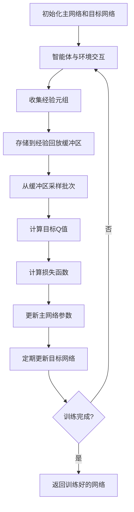
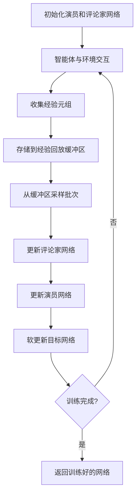
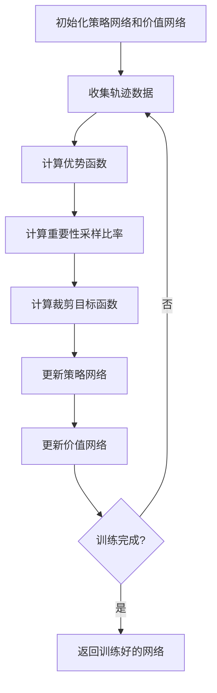

# 深度强化学习多表示示例 / Deep Reinforcement Learning Multi-Representation Examples

## 概述 / Overview

深度强化学习结合了深度学习和强化学习的优势，能够处理高维状态空间和复杂的决策问题。本文档提供了深度强化学习的多表示示例，包括数学表示、可视化流程图和代码实现。

Deep Reinforcement Learning combines the advantages of deep learning and reinforcement learning, enabling the handling of high-dimensional state spaces and complex decision-making problems. This document provides multi-representation examples for deep reinforcement learning, including mathematical representations, visual flowcharts, and code implementations.

## 1. 深度Q网络 (DQN) / Deep Q-Network (DQN)

### 1.1 数学表示 / Mathematical Representation

#### DQN目标函数 / DQN Objective Function

$$L(\theta) = \mathbb{E}_{(s,a,r,s') \sim D} \left[ \left( r + \gamma \max_{a'} Q(s', a'; \theta^-) - Q(s, a; \theta) \right)^2 \right]$$

其中：

- $\theta$ 是主网络参数
- $\theta^-$ 是目标网络参数
- $D$ 是经验回放缓冲区
- $\gamma$ 是折扣因子

#### Q值更新规则 / Q-Value Update Rule

$$Q(s, a; \theta) \leftarrow Q(s, a; \theta) + \alpha \left[ r + \gamma \max_{a'} Q(s', a'; \theta^-) - Q(s, a; \theta) \right]$$

#### 经验回放 / Experience Replay

经验回放缓冲区存储转移元组 $(s, a, r, s')$，用于打破状态间的相关性。

### 1.2 流程图 / Flowchart



### 1.3 代码实现 / Code Implementation

```python
import torch
import torch.nn as nn
import torch.optim as optim
import numpy as np
from collections import deque
import random
from typing import List, Tuple, Optional

class DQNNetwork(nn.Module):
    """深度Q网络 / Deep Q-Network"""
    
    def __init__(self, state_dim: int, action_dim: int, hidden_dim: int = 128):
        super(DQNNetwork, self).__init__()
        self.fc1 = nn.Linear(state_dim, hidden_dim)
        self.fc2 = nn.Linear(hidden_dim, hidden_dim)
        self.fc3 = nn.Linear(hidden_dim, action_dim)
        self.relu = nn.ReLU()
    
    def forward(self, x: torch.Tensor) -> torch.Tensor:
        """前向传播 / Forward pass"""
        x = self.relu(self.fc1(x))
        x = self.relu(self.fc2(x))
        return self.fc3(x)

class ExperienceReplayBuffer:
    """经验回放缓冲区 / Experience Replay Buffer"""
    
    def __init__(self, capacity: int = 10000):
        self.buffer = deque(maxlen=capacity)
    
    def push(self, state: np.ndarray, action: int, reward: float, 
             next_state: np.ndarray, done: bool):
        """添加经验 / Add experience"""
        self.buffer.append((state, action, reward, next_state, done))
    
    def sample(self, batch_size: int) -> List[Tuple]:
        """采样经验 / Sample experiences"""
        return random.sample(self.buffer, batch_size)
    
    def __len__(self) -> int:
        return len(self.buffer)

class DQNAgent:
    """DQN智能体 / DQN Agent"""
    
    def __init__(self, state_dim: int, action_dim: int, lr: float = 0.001,
                 gamma: float = 0.99, epsilon: float = 1.0, epsilon_min: float = 0.01,
                 epsilon_decay: float = 0.995, target_update: int = 100):
        self.state_dim = state_dim
        self.action_dim = action_dim
        self.gamma = gamma
        self.epsilon = epsilon
        self.epsilon_min = epsilon_min
        self.epsilon_decay = epsilon_decay
        self.target_update = target_update
        
        # 网络
        self.q_network = DQNNetwork(state_dim, action_dim)
        self.target_network = DQNNetwork(state_dim, action_dim)
        self.target_network.load_state_dict(self.q_network.state_dict())
        
        # 优化器
        self.optimizer = optim.Adam(self.q_network.parameters(), lr=lr)
        self.criterion = nn.MSELoss()
        
        # 经验回放
        self.memory = ExperienceReplayBuffer()
        self.update_count = 0
    
    def select_action(self, state: np.ndarray) -> int:
        """选择动作 / Select action"""
        if random.random() < self.epsilon:
            return random.randrange(self.action_dim)
        
        with torch.no_grad():
            state_tensor = torch.FloatTensor(state).unsqueeze(0)
            q_values = self.q_network(state_tensor)
            return q_values.argmax().item()
    
    def train(self, batch_size: int = 32) -> float:
        """训练网络 / Train network"""
        if len(self.memory) < batch_size:
            return 0.0
        
        # 采样经验
        batch = self.memory.sample(batch_size)
        states, actions, rewards, next_states, dones = zip(*batch)
        
        # 转换为张量
        states = torch.FloatTensor(states)
        actions = torch.LongTensor(actions)
        rewards = torch.FloatTensor(rewards)
        next_states = torch.FloatTensor(next_states)
        dones = torch.BoolTensor(dones)
        
        # 计算当前Q值
        current_q_values = self.q_network(states).gather(1, actions.unsqueeze(1))
        
        # 计算目标Q值
        with torch.no_grad():
            next_q_values = self.target_network(next_states).max(1)[0]
            target_q_values = rewards + (self.gamma * next_q_values * ~dones)
        
        # 计算损失
        loss = self.criterion(current_q_values.squeeze(), target_q_values)
        
        # 反向传播
        self.optimizer.zero_grad()
        loss.backward()
        self.optimizer.step()
        
        # 更新目标网络
        self.update_count += 1
        if self.update_count % self.target_update == 0:
            self.target_network.load_state_dict(self.q_network.state_dict())
        
        # 衰减探索率
        if self.epsilon > self.epsilon_min:
            self.epsilon *= self.epsilon_decay
        
        return loss.item()
    
    def save(self, path: str):
        """保存模型 / Save model"""
        torch.save(self.q_network.state_dict(), path)
    
    def load(self, path: str):
        """加载模型 / Load model"""
        self.q_network.load_state_dict(torch.load(path))
        self.target_network.load_state_dict(self.q_network.state_dict())

# 示例使用 / Example Usage
def create_simple_environment():
    """创建简单环境 / Create simple environment"""
    class SimpleEnv:
        def __init__(self, state_dim=4, action_dim=2):
            self.state_dim = state_dim
            self.action_dim = action_dim
            self.state = np.random.randn(state_dim)
        
        def reset(self):
            """重置环境 / Reset environment"""
            self.state = np.random.randn(self.state_dim)
            return self.state
        
        def step(self, action):
            """执行动作 / Execute action"""
            # 简化的环境动态
            reward = np.sum(self.state) * (1 if action == 0 else -1)
            self.state = self.state + np.random.randn(self.state_dim) * 0.1
            done = np.random.random() < 0.1
            return self.state, reward, done
    
    return SimpleEnv()

# 训练DQN智能体
env = create_simple_environment()
agent = DQNAgent(state_dim=4, action_dim=2)

episodes = 1000
for episode in range(episodes):
    state = env.reset()
    total_reward = 0
    
    while True:
        action = agent.select_action(state)
        next_state, reward, done = env.step(action)
        
        agent.memory.push(state, action, reward, next_state, done)
        agent.train()
        
        state = next_state
        total_reward += reward
        
        if done:
            break
    
    if episode % 100 == 0:
        print(f"Episode {episode}, Total Reward: {total_reward:.2f}, Epsilon: {agent.epsilon:.3f}")
```

## 2. 深度确定性策略梯度 (DDPG) / Deep Deterministic Policy Gradient (DDPG)

### 2.1 数学表示 / Mathematical Representation

#### 演员网络目标函数 / Actor Network Objective

$$\nabla_{\theta^\mu} J \approx \mathbb{E}_{s_t \sim \rho^\beta} \left[ \nabla_{\theta^\mu} Q(s, a; \theta^Q) \big|_{s=s_t, a=\mu(s_t)} \right]$$

其中：

- $\mu(s)$ 是确定性策略
- $Q(s, a)$ 是动作价值函数
- $\theta^\mu$ 是演员网络参数

#### 评论家网络目标函数 / Critic Network Objective

$$L(\theta^Q) = \mathbb{E}_{(s_t, a_t, r_t, s_{t+1}) \sim D} \left[ \left( r_t + \gamma Q(s_{t+1}, \mu'(s_{t+1}); \theta^{Q'}) - Q(s_t, a_t; \theta^Q) \right)^2 \right]$$

#### 软更新规则 / Soft Update Rule

$$\theta' \leftarrow \tau \theta + (1 - \tau) \theta'$$

其中 $\tau$ 是软更新参数。

### 2.2 流程图 / Flowchart



### 2.3 代码实现 / Code Implementation

```python
import torch
import torch.nn as nn
import torch.optim as optim
import torch.nn.functional as F
import numpy as np
from collections import deque
import random
from typing import Tuple

class ActorNetwork(nn.Module):
    """演员网络 / Actor Network"""
    
    def __init__(self, state_dim: int, action_dim: int, hidden_dim: int = 128):
        super(ActorNetwork, self).__init__()
        self.fc1 = nn.Linear(state_dim, hidden_dim)
        self.fc2 = nn.Linear(hidden_dim, hidden_dim)
        self.fc3 = nn.Linear(hidden_dim, action_dim)
        self.tanh = nn.Tanh()
    
    def forward(self, x: torch.Tensor) -> torch.Tensor:
        """前向传播 / Forward pass"""
        x = F.relu(self.fc1(x))
        x = F.relu(self.fc2(x))
        return self.tanh(self.fc3(x))

class CriticNetwork(nn.Module):
    """评论家网络 / Critic Network"""
    
    def __init__(self, state_dim: int, action_dim: int, hidden_dim: int = 128):
        super(CriticNetwork, self).__init__()
        self.fc1 = nn.Linear(state_dim + action_dim, hidden_dim)
        self.fc2 = nn.Linear(hidden_dim, hidden_dim)
        self.fc3 = nn.Linear(hidden_dim, 1)
    
    def forward(self, state: torch.Tensor, action: torch.Tensor) -> torch.Tensor:
        """前向传播 / Forward pass"""
        x = torch.cat([state, action], dim=1)
        x = F.relu(self.fc1(x))
        x = F.relu(self.fc2(x))
        return self.fc3(x)

class DDPGAgent:
    """DDPG智能体 / DDPG Agent"""
    
    def __init__(self, state_dim: int, action_dim: int, lr_actor: float = 0.001,
                 lr_critic: float = 0.001, gamma: float = 0.99, tau: float = 0.001):
        self.state_dim = state_dim
        self.action_dim = action_dim
        self.gamma = gamma
        self.tau = tau
        
        # 演员网络
        self.actor = ActorNetwork(state_dim, action_dim)
        self.actor_target = ActorNetwork(state_dim, action_dim)
        self.actor_target.load_state_dict(self.actor.state_dict())
        self.actor_optimizer = optim.Adam(self.actor.parameters(), lr=lr_actor)
        
        # 评论家网络
        self.critic = CriticNetwork(state_dim, action_dim)
        self.critic_target = CriticNetwork(state_dim, action_dim)
        self.critic_target.load_state_dict(self.critic.state_dict())
        self.critic_optimizer = optim.Adam(self.critic.parameters(), lr=lr_critic)
        
        # 经验回放
        self.memory = deque(maxlen=10000)
    
    def select_action(self, state: np.ndarray, noise_scale: float = 0.1) -> np.ndarray:
        """选择动作 / Select action"""
        with torch.no_grad():
            state_tensor = torch.FloatTensor(state).unsqueeze(0)
            action = self.actor(state_tensor).squeeze().numpy()
            action += np.random.normal(0, noise_scale, size=action.shape)
            return np.clip(action, -1, 1)
    
    def train(self, batch_size: int = 32) -> Tuple[float, float]:
        """训练网络 / Train networks"""
        if len(self.memory) < batch_size:
            return 0.0, 0.0
        
        # 采样经验
        batch = random.sample(self.memory, batch_size)
        states, actions, rewards, next_states, dones = zip(*batch)
        
        # 转换为张量
        states = torch.FloatTensor(states)
        actions = torch.FloatTensor(actions)
        rewards = torch.FloatTensor(rewards).unsqueeze(1)
        next_states = torch.FloatTensor(next_states)
        dones = torch.BoolTensor(dones).unsqueeze(1)
        
        # 更新评论家网络
        next_actions = self.actor_target(next_states)
        target_q_values = self.critic_target(next_states, next_actions)
        target_q_values = rewards + (self.gamma * target_q_values * ~dones)
        current_q_values = self.critic(states, actions)
        critic_loss = F.mse_loss(current_q_values, target_q_values.detach())
        
        self.critic_optimizer.zero_grad()
        critic_loss.backward()
        self.critic_optimizer.step()
        
        # 更新演员网络
        actor_actions = self.actor(states)
        actor_loss = -self.critic(states, actor_actions).mean()
        
        self.actor_optimizer.zero_grad()
        actor_loss.backward()
        self.actor_optimizer.step()
        
        # 软更新目标网络
        self.soft_update(self.actor_target, self.actor)
        self.soft_update(self.critic_target, self.critic)
        
        return actor_loss.item(), critic_loss.item()
    
    def soft_update(self, target: nn.Module, source: nn.Module):
        """软更新目标网络 / Soft update target networks"""
        for target_param, source_param in zip(target.parameters(), source.parameters()):
            target_param.data.copy_(self.tau * source_param.data + 
                                   (1 - self.tau) * target_param.data)
    
    def remember(self, state: np.ndarray, action: np.ndarray, 
                reward: float, next_state: np.ndarray, done: bool):
        """存储经验 / Store experience"""
        self.memory.append((state, action, reward, next_state, done))

# 示例使用 / Example Usage
def create_continuous_environment():
    """创建连续动作环境 / Create continuous action environment"""
    class ContinuousEnv:
        def __init__(self, state_dim=4, action_dim=2):
            self.state_dim = state_dim
            self.action_dim = action_dim
            self.state = np.random.randn(state_dim)
        
        def reset(self):
            """重置环境 / Reset environment"""
            self.state = np.random.randn(self.state_dim)
            return self.state
        
        def step(self, action):
            """执行动作 / Execute action"""
            # 简化的连续动作环境
            reward = np.sum(self.state * action)
            self.state = self.state + action * 0.1 + np.random.randn(self.state_dim) * 0.01
            done = np.random.random() < 0.05
            return self.state, reward, done
    
    return ContinuousEnv()

# 训练DDPG智能体
env = create_continuous_environment()
agent = DDPGAgent(state_dim=4, action_dim=2)

episodes = 1000
for episode in range(episodes):
    state = env.reset()
    total_reward = 0
    
    while True:
        action = agent.select_action(state)
        next_state, reward, done = env.step(action)
        
        agent.remember(state, action, reward, next_state, done)
        actor_loss, critic_loss = agent.train()
        
        state = next_state
        total_reward += reward
        
        if done:
            break
    
    if episode % 100 == 0:
        print(f"Episode {episode}, Total Reward: {total_reward:.2f}")
```

## 3. 近端策略优化 (PPO) / Proximal Policy Optimization (PPO)

### 3.1 数学表示 / Mathematical Representation

#### PPO目标函数 / PPO Objective Function

$$L^{CLIP}(\theta) = \mathbb{E}_t \left[ \min \left( r_t(\theta) A_t, \text{clip}(r_t(\theta), 1-\epsilon, 1+\epsilon) A_t \right) \right]$$

其中：

- $r_t(\theta) = \frac{\pi_\theta(a_t|s_t)}{\pi_{\theta_{old}}(a_t|s_t)}$ 是重要性采样比率
- $A_t$ 是优势函数
- $\epsilon$ 是裁剪参数

#### 广义优势估计 / Generalized Advantage Estimation

$$A_t = \delta_t + (\gamma \lambda) \delta_{t+1} + \cdots + (\gamma \lambda)^{T-t+1} \delta_{T-1}$$

其中 $\delta_t = r_t + \gamma V(s_{t+1}) - V(s_t)$。

### 3.2 流程图 / Flowchart



### 3.3 代码实现 / Code Implementation

```python
import torch
import torch.nn as nn
import torch.optim as optim
import torch.nn.functional as F
import numpy as np
from typing import List, Tuple

class PPONetwork(nn.Module):
    """PPO网络 / PPO Network"""
    
    def __init__(self, state_dim: int, action_dim: int, hidden_dim: int = 128):
        super(PPONetwork, self).__init__()
        # 策略网络
        self.policy_fc1 = nn.Linear(state_dim, hidden_dim)
        self.policy_fc2 = nn.Linear(hidden_dim, hidden_dim)
        self.policy_fc3 = nn.Linear(hidden_dim, action_dim)
        
        # 价值网络
        self.value_fc1 = nn.Linear(state_dim, hidden_dim)
        self.value_fc2 = nn.Linear(hidden_dim, hidden_dim)
        self.value_fc3 = nn.Linear(hidden_dim, 1)
        
        # 动作分布参数
        self.log_std = nn.Parameter(torch.zeros(action_dim))
    
    def forward(self, x: torch.Tensor) -> Tuple[torch.Tensor, torch.Tensor]:
        """前向传播 / Forward pass"""
        # 策略头
        policy_x = F.relu(self.policy_fc1(x))
        policy_x = F.relu(self.policy_fc2(policy_x))
        policy_mean = self.policy_fc3(policy_x)
        
        # 价值头
        value_x = F.relu(self.value_fc1(x))
        value_x = F.relu(self.value_fc2(value_x))
        value = self.value_fc3(value_x)
        
        return policy_mean, value
    
    def get_action(self, state: torch.Tensor) -> Tuple[torch.Tensor, torch.Tensor, torch.Tensor]:
        """获取动作 / Get action"""
        mean, value = self.forward(state)
        std = self.log_std.exp()
        
        # 重参数化采样
        normal = torch.distributions.Normal(mean, std)
        action = normal.rsample()
        log_prob = normal.log_prob(action).sum(dim=-1)
        
        return action, log_prob, value

class PPOMemory:
    """PPO内存 / PPO Memory"""
    
    def __init__(self):
        self.states = []
        self.actions = []
        self.rewards = []
        self.values = []
        self.log_probs = []
        self.dones = []
    
    def clear(self):
        """清空内存 / Clear memory"""
        self.states.clear()
        self.actions.clear()
        self.rewards.clear()
        self.values.clear()
        self.log_probs.clear()
        self.dones.clear()
    
    def __len__(self):
        return len(self.states)

class PPOAgent:
    """PPO智能体 / PPO Agent"""
    
    def __init__(self, state_dim: int, action_dim: int, lr: float = 0.0003,
                 gamma: float = 0.99, gae_lambda: float = 0.95, clip_epsilon: float = 0.2,
                 value_coef: float = 0.5, entropy_coef: float = 0.01):
        self.state_dim = state_dim
        self.action_dim = action_dim
        self.gamma = gamma
        self.gae_lambda = gae_lambda
        self.clip_epsilon = clip_epsilon
        self.value_coef = value_coef
        self.entropy_coef = entropy_coef
        
        # 网络
        self.network = PPONetwork(state_dim, action_dim)
        self.optimizer = optim.Adam(self.network.parameters(), lr=lr)
        
        # 内存
        self.memory = PPOMemory()
    
    def select_action(self, state: np.ndarray) -> Tuple[np.ndarray, float, float]:
        """选择动作 / Select action"""
        with torch.no_grad():
            state_tensor = torch.FloatTensor(state).unsqueeze(0)
            action, log_prob, value = self.network.get_action(state_tensor)
            
            # 存储到内存
            self.memory.states.append(state)
            self.memory.actions.append(action.squeeze().numpy())
            self.memory.log_probs.append(log_prob.item())
            self.memory.values.append(value.item())
            
            return action.squeeze().numpy(), log_prob.item(), value.item()
    
    def compute_gae(self, rewards: List[float], values: List[float], 
                   dones: List[bool]) -> List[float]:
        """计算广义优势估计 / Compute Generalized Advantage Estimation"""
        advantages = []
        gae = 0
        
        for i in reversed(range(len(rewards))):
            if i == len(rewards) - 1:
                next_value = 0
            else:
                next_value = values[i + 1]
            
            delta = rewards[i] + self.gamma * next_value * (1 - dones[i]) - values[i]
            gae = delta + self.gamma * self.gae_lambda * (1 - dones[i]) * gae
            advantages.insert(0, gae)
        
        return advantages
    
    def update(self, batch_size: int = 64, epochs: int = 10):
        """更新网络 / Update network"""
        if len(self.memory) < batch_size:
            return
        
        # 计算优势函数
        advantages = self.compute_gae(self.memory.rewards, self.memory.values, self.memory.dones)
        advantages = torch.FloatTensor(advantages)
        advantages = (advantages - advantages.mean()) / (advantages.std() + 1e-8)
        
        # 计算回报
        returns = advantages + torch.FloatTensor(self.memory.values)
        
        # 转换为张量
        states = torch.FloatTensor(self.memory.states)
        actions = torch.FloatTensor(self.memory.actions)
        old_log_probs = torch.FloatTensor(self.memory.log_probs)
        
        # 多轮更新
        for _ in range(epochs):
            # 随机采样批次
            indices = torch.randperm(len(states))
            
            for start_idx in range(0, len(states), batch_size):
                end_idx = start_idx + batch_size
                batch_indices = indices[start_idx:end_idx]
                
                batch_states = states[batch_indices]
                batch_actions = actions[batch_indices]
                batch_advantages = advantages[batch_indices]
                batch_returns = returns[batch_indices]
                batch_old_log_probs = old_log_probs[batch_indices]
                
                # 前向传播
                mean, values = self.network(batch_states)
                std = self.network.log_std.exp()
                normal = torch.distributions.Normal(mean, std)
                log_probs = normal.log_prob(batch_actions).sum(dim=-1)
                entropy = normal.entropy().sum(dim=-1).mean()
                
                # 计算比率
                ratio = torch.exp(log_probs - batch_old_log_probs)
                
                # 计算裁剪目标
                surr1 = ratio * batch_advantages
                surr2 = torch.clamp(ratio, 1 - self.clip_epsilon, 1 + self.clip_epsilon) * batch_advantages
                policy_loss = -torch.min(surr1, surr2).mean()
                
                # 价值损失
                value_loss = F.mse_loss(values.squeeze(), batch_returns)
                
                # 总损失
                loss = policy_loss + self.value_coef * value_loss - self.entropy_coef * entropy
                
                # 反向传播
                self.optimizer.zero_grad()
                loss.backward()
                self.optimizer.step()
        
        # 清空内存
        self.memory.clear()

# 示例使用 / Example Usage
def create_ppo_environment():
    """创建PPO环境 / Create PPO environment"""
    class PPOEnv:
        def __init__(self, state_dim=4, action_dim=2):
            self.state_dim = state_dim
            self.action_dim = action_dim
            self.state = np.random.randn(state_dim)
        
        def reset(self):
            """重置环境 / Reset environment"""
            self.state = np.random.randn(self.state_dim)
            return self.state
        
        def step(self, action):
            """执行动作 / Execute action"""
            # 简化的环境动态
            reward = np.sum(self.state * action) - 0.1 * np.sum(action**2)
            self.state = self.state + action * 0.1 + np.random.randn(self.state_dim) * 0.01
            done = np.random.random() < 0.05
            return self.state, reward, done
    
    return PPOEnv()

# 训练PPO智能体
env = create_ppo_environment()
agent = PPOAgent(state_dim=4, action_dim=2)

episodes = 1000
for episode in range(episodes):
    state = env.reset()
    total_reward = 0
    
    # 收集轨迹
    while True:
        action, log_prob, value = agent.select_action(state)
        next_state, reward, done = env.step(action)
        
        agent.memory.rewards.append(reward)
        agent.memory.dones.append(done)
        
        state = next_state
        total_reward += reward
        
        if done:
            break
    
    # 更新网络
    agent.update()
    
    if episode % 100 == 0:
        print(f"Episode {episode}, Total Reward: {total_reward:.2f}")
```

## 总结 / Summary

本文档提供了深度强化学习的三个核心算法的多表示示例：

1. **深度Q网络 (DQN)**：实现了经验回放和目标网络机制，适用于离散动作空间
2. **深度确定性策略梯度 (DDPG)**：实现了演员-评论家架构，适用于连续动作空间
3. **近端策略优化 (PPO)**：实现了策略裁剪机制，提供了稳定的策略梯度方法

每个算法都包含了详细的数学表示、可视化流程图和完整的Python代码实现，为深度强化学习的研究和应用提供了全面的参考。

This document provides multi-representation examples for three core deep reinforcement learning algorithms:

1. **Deep Q-Network (DQN)**: Implements experience replay and target network mechanisms, suitable for discrete action spaces
2. **Deep Deterministic Policy Gradient (DDPG)**: Implements actor-critic architecture, suitable for continuous action spaces
3. **Proximal Policy Optimization (PPO)**: Implements policy clipping mechanism, providing stable policy gradient methods

Each algorithm includes detailed mathematical representations, visual flowcharts, and complete Python code implementations, providing comprehensive references for deep reinforcement learning research and applications.
