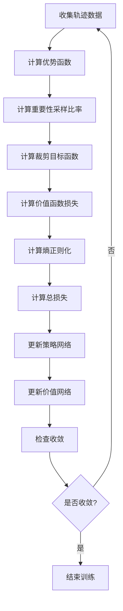

# 深度强化学习扩展多表征示例 / Deep Reinforcement Learning Extension Multi-Representation Examples

## 概述 / Overview

深度强化学习结合了深度神经网络和强化学习，能够处理高维状态空间和连续动作空间。本扩展包含三种主要的深度强化学习算法：

1. **深度确定性策略梯度 (DDPG)** - 适用于连续动作空间
2. **近端策略优化 (PPO)** - 稳定且高效的策略梯度方法
3. **软演员评论家 (SAC)** - 基于最大熵的强化学习算法

## 1. 深度确定性策略梯度 / Deep Deterministic Policy Gradient (DDPG)

### 数学表示 / Mathematical Representation

DDPG是一种演员-评论家算法，适用于连续动作空间：

**策略网络 (Actor Network):**
$$\mu_\theta(s) = \arg\max_a Q(s, a)$$

**价值网络 (Critic Network):**
$$Q^\mu(s, a) = \mathbb{E}_{r_t, s_{t+1} \sim E}[r_t + \gamma Q^\mu(s_{t+1}, \mu_\theta(s_{t+1}))]$$

**目标网络更新:**
$$\theta' \leftarrow \tau \theta + (1 - \tau) \theta'$$
$$w' \leftarrow \tau w + (1 - \tau) w'$$

**策略梯度:**
$$\nabla_\theta J \approx \mathbb{E}_{s_t \sim \rho^\beta}[\nabla_\theta Q(s, a)|_{s=s_t, a=\mu_\theta(s_t)}]$$

其中：

- $\mu_\theta(s)$ 是确定性策略
- $Q^\mu(s, a)$ 是状态-动作价值函数
- $\tau$ 是软更新参数
- $\rho^\beta$ 是行为策略的分布

### 流程图 / Flowchart

```mermaid
graph TD
    A[环境状态 s_t] --> B[策略网络 μ_θ]
    B --> C[动作 a_t = μ_θ(s_t) + 噪声]
    C --> D[执行动作]
    D --> E[获得奖励 r_t 和下一状态 s_{t+1}]
    E --> F[存储经验 (s_t, a_t, r_t, s_{t+1})]
    F --> G[从经验池采样批次]
    G --> H[计算目标Q值]
    H --> I[更新评论家网络]
    I --> J[计算策略梯度]
    J --> K[更新策略网络]
    K --> L[软更新目标网络]
    L --> M[下一时间步]
    M --> A
```

### Python实现 / Python Implementation

```python
import torch
import torch.nn as nn
import torch.nn.functional as F
import torch.optim as optim
import numpy as np
from collections import deque
import random
from typing import Tuple, List

class Actor(nn.Module):
    """策略网络 (Actor Network)"""
    def __init__(self, state_dim: int, action_dim: int, max_action: float = 1.0):
        super(Actor, self).__init__()
        self.max_action = max_action
        
        self.fc1 = nn.Linear(state_dim, 400)
        self.fc2 = nn.Linear(400, 300)
        self.fc3 = nn.Linear(300, action_dim)
        
    def forward(self, state):
        x = F.relu(self.fc1(state))
        x = F.relu(self.fc2(x))
        x = self.max_action * torch.tanh(self.fc3(x))
        return x

class Critic(nn.Module):
    """价值网络 (Critic Network)"""
    def __init__(self, state_dim: int, action_dim: int):
        super(Critic, self).__init__()
        
        self.fc1 = nn.Linear(state_dim + action_dim, 400)
        self.fc2 = nn.Linear(400, 300)
        self.fc3 = nn.Linear(300, 1)
        
    def forward(self, state, action):
        x = torch.cat([state, action], dim=1)
        x = F.relu(self.fc1(x))
        x = F.relu(self.fc2(x))
        x = self.fc3(x)
        return x

class ReplayBuffer:
    """经验回放缓冲区"""
    def __init__(self, max_size: int = 1000000):
        self.buffer = deque(maxlen=max_size)
    
    def push(self, state, action, reward, next_state, done):
        self.buffer.append((state, action, reward, next_state, done))
    
    def sample(self, batch_size: int) -> Tuple:
        batch = random.sample(self.buffer, batch_size)
        state, action, reward, next_state, done = map(np.stack, zip(*batch))
        return state, action, reward, next_state, done
    
    def __len__(self):
        return len(self.buffer)

class DDPG:
    """深度确定性策略梯度算法"""
    def __init__(self, state_dim: int, action_dim: int, max_action: float = 1.0):
        self.actor = Actor(state_dim, action_dim, max_action)
        self.actor_target = Actor(state_dim, action_dim, max_action)
        self.critic = Critic(state_dim, action_dim)
        self.critic_target = Critic(state_dim, action_dim)
        
        # 初始化目标网络
        self.actor_target.load_state_dict(self.actor.state_dict())
        self.critic_target.load_state_dict(self.critic.state_dict())
        
        # 优化器
        self.actor_optimizer = optim.Adam(self.actor.parameters(), lr=1e-4)
        self.critic_optimizer = optim.Adam(self.critic.parameters(), lr=1e-3)
        
        # 超参数
        self.tau = 0.001  # 软更新参数
        self.gamma = 0.99  # 折扣因子
        
    def select_action(self, state, noise_scale: float = 0.1):
        """选择动作"""
        state = torch.FloatTensor(state.reshape(1, -1))
        action = self.actor(state).cpu().data.numpy().flatten()
        action += noise_scale * np.random.randn(len(action))
        return np.clip(action, -1, 1)
    
    def train(self, replay_buffer: ReplayBuffer, batch_size: int = 64):
        """训练网络"""
        if len(replay_buffer) < batch_size:
            return
        
        # 采样经验
        state, action, reward, next_state, done = replay_buffer.sample(batch_size)
        
        # 转换为张量
        state = torch.FloatTensor(state)
        action = torch.FloatTensor(action)
        reward = torch.FloatTensor(reward).reshape(-1, 1)
        next_state = torch.FloatTensor(next_state)
        done = torch.FloatTensor(done).reshape(-1, 1)
        
        # 更新评论家网络
        next_action = self.actor_target(next_state)
        target_Q = self.critic_target(next_state, next_action)
        target_Q = reward + (1 - done) * self.gamma * target_Q
        current_Q = self.critic(state, action)
        critic_loss = F.mse_loss(current_Q, target_Q.detach())
        
        self.critic_optimizer.zero_grad()
        critic_loss.backward()
        self.critic_optimizer.step()
        
        # 更新策略网络
        actor_loss = -self.critic(state, self.actor(state)).mean()
        
        self.actor_optimizer.zero_grad()
        actor_loss.backward()
        self.actor_optimizer.step()
        
        # 软更新目标网络
        self._soft_update(self.actor_target, self.actor)
        self._soft_update(self.critic_target, self.critic)
    
    def _soft_update(self, target, source):
        """软更新目标网络"""
        for target_param, param in zip(target.parameters(), source.parameters()):
            target_param.data.copy_(self.tau * param.data + (1 - self.tau) * target_param.data)

# 使用示例
def create_synthetic_environment():
    """创建合成环境用于演示"""
    class SimpleEnv:
        def __init__(self, state_dim=4, action_dim=2):
            self.state_dim = state_dim
            self.action_dim = action_dim
            self.state = np.random.randn(state_dim)
            
        def reset(self):
            self.state = np.random.randn(self.state_dim)
            return self.state
        
        def step(self, action):
            # 简单的奖励函数
            reward = -np.sum(action**2) + np.random.normal(0, 0.1)
            self.state = self.state + 0.1 * action + np.random.normal(0, 0.01, self.state_dim)
            done = np.random.random() < 0.01  # 1%概率结束
            return self.state, reward, done, {}
    
    return SimpleEnv()

def train_ddpg_example():
    """DDPG训练示例"""
    env = create_synthetic_environment()
    agent = DDPG(env.state_dim, env.action_dim)
    replay_buffer = ReplayBuffer()
    
    max_episodes = 1000
    max_steps = 200
    
    for episode in range(max_episodes):
        state = env.reset()
        episode_reward = 0
        
        for step in range(max_steps):
            action = agent.select_action(state, noise_scale=0.1)
            next_state, reward, done, _ = env.step(action)
            
            replay_buffer.push(state, action, reward, next_state, done)
            
            if len(replay_buffer) > 1000:
                agent.train(replay_buffer)
            
            state = next_state
            episode_reward += reward
            
            if done:
                break
        
        if episode % 100 == 0:
            print(f"Episode {episode}, Average Reward: {episode_reward:.2f}")

if __name__ == "__main__":
    train_ddpg_example()
```

## 2. 近端策略优化 / Proximal Policy Optimization (PPO)

### 2.1 数学表示 / Mathematical Representation

PPO通过限制策略更新幅度来确保训练稳定性：

**目标函数:**
$$L^{CLIP}(\theta) = \hat{\mathbb{E}}_t[\min(r_t(\theta)\hat{A}_t, \text{clip}(r_t(\theta), 1-\epsilon, 1+\epsilon)\hat{A}_t)]$$

**重要性采样比率:**
$$r_t(\theta) = \frac{\pi_\theta(a_t|s_t)}{\pi_{\theta_{old}}(a_t|s_t)}$$

**优势函数估计:**
$$\hat{A}_t = \delta_t + (\gamma\lambda)\delta_{t+1} + ... + (\gamma\lambda)^{T-t+1}\delta_{T-1}$$
$$\delta_t = r_t + \gamma V(s_{t+1}) - V(s_t)$$

**价值函数损失:**
$$L^{VF}(\theta) = \hat{\mathbb{E}}_t[(V_\theta(s_t) - V_{target})^2]$$

**熵正则化:**
$$L^{ENT}(\theta) = \hat{\mathbb{E}}_t[S[\pi_\theta](s_t)]$$

**总损失:**
$$L^{TOTAL}(\theta) = L^{CLIP}(\theta) - c_1 L^{VF}(\theta) + c_2 L^{ENT}(\theta)$$

其中：

- $\epsilon$ 是裁剪参数 (通常为0.2)
- $\lambda$ 是GAE参数
- $c_1, c_2$ 是权重系数

### 2.2 流程图 / Flowchart



### 2.3 Python实现 / Python Implementation

```python
import torch
import torch.nn as nn
import torch.nn.functional as F
import torch.optim as optim
import numpy as np
from typing import Tuple, List
import random

class ActorCritic(nn.Module):
    """演员-评论家网络"""
    def __init__(self, state_dim: int, action_dim: int, hidden_dim: int = 64):
        super(ActorCritic, self).__init__()
        
        # 共享特征提取层
        self.fc1 = nn.Linear(state_dim, hidden_dim)
        self.fc2 = nn.Linear(hidden_dim, hidden_dim)
        
        # 策略头 (Actor)
        self.policy_head = nn.Linear(hidden_dim, action_dim)
        
        # 价值头 (Critic)
        self.value_head = nn.Linear(hidden_dim, 1)
        
    def forward(self, state):
        x = F.relu(self.fc1(state))
        x = F.relu(self.fc2(x))
        
        # 策略输出 (logits)
        policy_logits = self.policy_head(x)
        
        # 价值输出
        value = self.value_head(x)
        
        return policy_logits, value
    
    def get_action(self, state):
        """获取动作和相关信息"""
        policy_logits, value = self.forward(state)
        action_probs = F.softmax(policy_logits, dim=-1)
        action_dist = torch.distributions.Categorical(action_probs)
        action = action_dist.sample()
        
        return action.item(), action_dist.log_prob(action), value

class PPOBuffer:
    """PPO经验缓冲区"""
    def __init__(self):
        self.states = []
        self.actions = []
        self.rewards = []
        self.values = []
        self.log_probs = []
        self.dones = []
        
    def push(self, state, action, reward, value, log_prob, done):
        self.states.append(state)
        self.actions.append(action)
        self.rewards.append(reward)
        self.values.append(value)
        self.log_probs.append(log_prob)
        self.dones.append(done)
    
    def get(self):
        return (np.array(self.states), np.array(self.actions), 
                np.array(self.rewards), np.array(self.values),
                np.array(self.log_probs), np.array(self.dones))
    
    def clear(self):
        self.states.clear()
        self.actions.clear()
        self.rewards.clear()
        self.values.clear()
        self.log_probs.clear()
        self.dones.clear()

def compute_gae(rewards, values, dones, gamma=0.99, lambda_=0.95):
    """计算广义优势估计 (GAE)"""
    advantages = np.zeros_like(rewards)
    last_advantage = 0
    last_value = 0
    
    for t in reversed(range(len(rewards))):
        if t == len(rewards) - 1:
            next_value = last_value
        else:
            next_value = values[t + 1]
        
        delta = rewards[t] + gamma * next_value * (1 - dones[t]) - values[t]
        advantages[t] = delta + gamma * lambda_ * last_advantage * (1 - dones[t])
        last_advantage = advantages[t]
    
    returns = advantages + values
    return advantages, returns

class PPO:
    """近端策略优化算法"""
    def __init__(self, state_dim: int, action_dim: int, lr: float = 3e-4):
        self.actor_critic = ActorCritic(state_dim, action_dim)
        self.optimizer = optim.Adam(self.actor_critic.parameters(), lr=lr)
        
        # 超参数
        self.clip_epsilon = 0.2
        self.value_coef = 0.5
        self.entropy_coef = 0.01
        self.max_grad_norm = 0.5
        
    def update(self, states, actions, old_log_probs, advantages, returns, 
               num_epochs: int = 10, batch_size: int = 64):
        """更新策略和价值网络"""
        # 转换为张量
        states = torch.FloatTensor(states)
        actions = torch.LongTensor(actions)
        old_log_probs = torch.FloatTensor(old_log_probs)
        advantages = torch.FloatTensor(advantages)
        returns = torch.FloatTensor(returns)
        
        # 标准化优势函数
        advantages = (advantages - advantages.mean()) / (advantages.std() + 1e-8)
        
        for epoch in range(num_epochs):
            # 随机打乱数据
            indices = torch.randperm(len(states))
            
            for start_idx in range(0, len(states), batch_size):
                end_idx = start_idx + batch_size
                batch_indices = indices[start_idx:end_idx]
                
                batch_states = states[batch_indices]
                batch_actions = actions[batch_indices]
                batch_old_log_probs = old_log_probs[batch_indices]
                batch_advantages = advantages[batch_indices]
                batch_returns = returns[batch_indices]
                
                # 前向传播
                policy_logits, values = self.actor_critic(batch_states)
                action_probs = F.softmax(policy_logits, dim=-1)
                dist = torch.distributions.Categorical(action_probs)
                new_log_probs = dist.log_prob(batch_actions)
                
                # 计算重要性采样比率
                ratio = torch.exp(new_log_probs - batch_old_log_probs)
                
                # 计算裁剪目标函数
                surr1 = ratio * batch_advantages
                surr2 = torch.clamp(ratio, 1 - self.clip_epsilon, 1 + self.clip_epsilon) * batch_advantages
                policy_loss = -torch.min(surr1, surr2).mean()
                
                # 价值函数损失
                value_loss = F.mse_loss(values.squeeze(), batch_returns)
                
                # 熵正则化
                entropy_loss = -dist.entropy().mean()
                
                # 总损失
                total_loss = (policy_loss + 
                            self.value_coef * value_loss + 
                            self.entropy_coef * entropy_loss)
                
                # 反向传播
                self.optimizer.zero_grad()
                total_loss.backward()
                torch.nn.utils.clip_grad_norm_(self.actor_critic.parameters(), self.max_grad_norm)
                self.optimizer.step()

def create_synthetic_environment():
    """创建合成环境"""
    class SimpleEnv:
        def __init__(self, state_dim=4, action_dim=4):
            self.state_dim = state_dim
            self.action_dim = action_dim
            self.state = np.random.randn(state_dim)
            
        def reset(self):
            self.state = np.random.randn(self.state_dim)
            return self.state
        
        def step(self, action):
            # 简单的奖励函数
            reward = np.sum(self.state) + np.random.normal(0, 0.1)
            self.state = self.state + 0.1 * np.random.randn(self.state_dim)
            done = np.random.random() < 0.05
            return self.state, reward, done, {}
    
    return SimpleEnv()

def train_ppo_example():
    """PPO训练示例"""
    env = create_synthetic_environment()
    agent = PPO(env.state_dim, env.action_dim)
    buffer = PPOBuffer()
    
    max_episodes = 1000
    max_steps = 200
    update_interval = 2048  # 每2048步更新一次
    
    total_steps = 0
    
    for episode in range(max_episodes):
        state = env.reset()
        episode_reward = 0
        
        for step in range(max_steps):
            # 获取动作
            action, log_prob, value = agent.actor_critic.get_action(
                torch.FloatTensor(state.reshape(1, -1))
            )
            
            # 执行动作
            next_state, reward, done, _ = env.step(action)
            
            # 存储经验
            buffer.push(state, action, reward, value.item(), log_prob.item(), done)
            
            state = next_state
            episode_reward += reward
            total_steps += 1
            
            # 更新策略
            if total_steps % update_interval == 0:
                states, actions, rewards, values, log_probs, dones = buffer.get()
                advantages, returns = compute_gae(rewards, values, dones)
                agent.update(states, actions, log_probs, advantages, returns)
                buffer.clear()
            
            if done:
                break
        
        if episode % 100 == 0:
            print(f"Episode {episode}, Average Reward: {episode_reward:.2f}")

if __name__ == "__main__":
    train_ppo_example()
```

## 3. 软演员评论家 / Soft Actor-Critic (SAC)

### 3.1 数学表示 / Mathematical Representation

SAC基于最大熵强化学习，在探索和利用之间取得平衡：

**软策略迭代目标:**
$$J(\pi) = \sum_{t=0}^T \mathbb{E}_{(s_t, a_t) \sim \rho_\pi}[r(s_t, a_t) + \alpha \mathcal{H}(\pi(\cdot|s_t))]$$

**软Q函数:**
$$Q^\pi(s, a) = r(s, a) + \gamma \mathbb{E}_{s' \sim p}[V^\pi(s')]$$

**软价值函数:**
$$V^\pi(s) = \mathbb{E}_{a \sim \pi}[Q^\pi(s, a) - \alpha \log \pi(a|s)]$$

**策略目标:**
$$\pi_{new} = \arg\min_{\pi'} D_{KL}(\pi'(\cdot|s_t) \| \frac{\exp(Q^{\pi_{old}}(s_t, \cdot))}{Z^{\pi_{old}}(s_t)})$$

**温度参数自动调节:**
$$\alpha^* = \arg\min_{\alpha} \mathbb{E}_{a_t \sim \pi_t}[-\alpha \log \pi_t(a_t|s_t) - \alpha \mathcal{H}_0]$$

其中：

- $\alpha$ 是温度参数，控制探索程度
- $\mathcal{H}(\pi(\cdot|s))$ 是策略熵
- $\mathcal{H}_0$ 是目标熵

### 3.2 流程图 / Flowchart

```mermaid
graph TD
    A[环境状态 s_t] --> B[策略网络 π]
    B --> C[采样动作 a_t ~ π(·|s_t)]
    C --> D[执行动作]
    D --> E[获得奖励 r_t 和下一状态 s_{t+1}]
    E --> F[存储经验 (s_t, a_t, r_t, s_{t+1})]
    F --> G[从经验池采样批次]
    G --> H[更新Q网络]
    H --> I[更新策略网络]
    I --> J[更新温度参数]
    J --> K[软更新目标网络]
    K --> L[下一时间步]
    L --> A
```

### 3.3 Python实现 / Python Implementation

```python
import torch
import torch.nn as nn
import torch.nn.functional as F
import torch.optim as optim
import numpy as np
from collections import deque
import random
from typing import Tuple
import math

class SACActor(nn.Module):
    """SAC策略网络"""
    def __init__(self, state_dim: int, action_dim: int, hidden_dim: int = 256):
        super(SACActor, self).__init__()
        self.action_dim = action_dim
        
        self.fc1 = nn.Linear(state_dim, hidden_dim)
        self.fc2 = nn.Linear(hidden_dim, hidden_dim)
        self.fc_mean = nn.Linear(hidden_dim, action_dim)
        self.fc_logstd = nn.Linear(hidden_dim, action_dim)
        
    def forward(self, state):
        x = F.relu(self.fc1(state))
        x = F.relu(self.fc2(x))
        
        mean = self.fc_mean(x)
        log_std = self.fc_logstd(x)
        log_std = torch.clamp(log_std, -20, 2)
        
        return mean, log_std
    
    def sample(self, state):
        """采样动作"""
        mean, log_std = self.forward(state)
        std = log_std.exp()
        normal = torch.distributions.Normal(mean, std)
        
        # 重参数化技巧
        x_t = normal.rsample()
        action = torch.tanh(x_t)
        
        # 计算log概率
        log_prob = normal.log_prob(x_t)
        log_prob -= torch.log(1 - action.pow(2) + 1e-6)
        log_prob = log_prob.sum(1, keepdim=True)
        
        return action, log_prob

class SACCritic(nn.Module):
    """SAC评论家网络"""
    def __init__(self, state_dim: int, action_dim: int, hidden_dim: int = 256):
        super(SACCritic, self).__init__()
        
        self.fc1 = nn.Linear(state_dim + action_dim, hidden_dim)
        self.fc2 = nn.Linear(hidden_dim, hidden_dim)
        self.fc3 = nn.Linear(hidden_dim, 1)
        
    def forward(self, state, action):
        x = torch.cat([state, action], dim=1)
        x = F.relu(self.fc1(x))
        x = F.relu(self.fc2(x))
        x = self.fc3(x)
        return x

class ReplayBuffer:
    """经验回放缓冲区"""
    def __init__(self, max_size: int = 1000000):
        self.buffer = deque(maxlen=max_size)
    
    def push(self, state, action, reward, next_state, done):
        self.buffer.append((state, action, reward, next_state, done))
    
    def sample(self, batch_size: int) -> Tuple:
        batch = random.sample(self.buffer, batch_size)
        state, action, reward, next_state, done = map(np.stack, zip(*batch))
        return state, action, reward, next_state, done
    
    def __len__(self):
        return len(self.buffer)

class SAC:
    """软演员评论家算法"""
    def __init__(self, state_dim: int, action_dim: int, lr: float = 3e-4):
        self.actor = SACActor(state_dim, action_dim)
        self.critic1 = SACCritic(state_dim, action_dim)
        self.critic2 = SACCritic(state_dim, action_dim)
        self.critic1_target = SACCritic(state_dim, action_dim)
        self.critic2_target = SACCritic(state_dim, action_dim)
        
        # 初始化目标网络
        self.critic1_target.load_state_dict(self.critic1.state_dict())
        self.critic2_target.load_state_dict(self.critic2.state_dict())
        
        # 优化器
        self.actor_optimizer = optim.Adam(self.actor.parameters(), lr=lr)
        self.critic1_optimizer = optim.Adam(self.critic1.parameters(), lr=lr)
        self.critic2_optimizer = optim.Adam(self.critic2.parameters(), lr=lr)
        
        # 温度参数
        self.log_alpha = torch.zeros(1, requires_grad=True)
        self.alpha_optimizer = optim.Adam([self.log_alpha], lr=lr)
        
        # 超参数
        self.gamma = 0.99
        self.tau = 0.005
        self.target_entropy = -action_dim
        self.batch_size = 256
        
    def select_action(self, state, evaluate=False):
        """选择动作"""
        state = torch.FloatTensor(state.reshape(1, -1))
        if evaluate:
            _, _ = self.actor.sample(state)
            action = self.actor(state)[0]
        else:
            action, _ = self.actor.sample(state)
        return action.detach().cpu().numpy()[0]
    
    def update_parameters(self, replay_buffer: ReplayBuffer):
        """更新网络参数"""
        if len(replay_buffer) < self.batch_size:
            return
        
        # 采样经验
        state_batch, action_batch, reward_batch, next_state_batch, done_batch = \
            replay_buffer.sample(self.batch_size)
        
        # 转换为张量
        state_batch = torch.FloatTensor(state_batch)
        action_batch = torch.FloatTensor(action_batch)
        reward_batch = torch.FloatTensor(reward_batch).unsqueeze(1)
        next_state_batch = torch.FloatTensor(next_state_batch)
        done_batch = torch.FloatTensor(done_batch).unsqueeze(1)
        
        with torch.no_grad():
            # 下一状态的动作和log概率
            next_state_action, next_state_log_pi = self.actor.sample(next_state_batch)
            
            # 目标Q值
            q1_next_target = self.critic1_target(next_state_batch, next_state_action)
            q2_next_target = self.critic2_target(next_state_batch, next_state_action)
            min_q_next_target = torch.min(q1_next_target, q2_next_target) - \
                               self.log_alpha.exp() * next_state_log_pi
            next_q_value = reward_batch + (1 - done_batch) * self.gamma * min_q_next_target
        
        # 更新评论家网络
        q1 = self.critic1(state_batch, action_batch)
        q2 = self.critic2(state_batch, action_batch)
        q1_loss = F.mse_loss(q1, next_q_value)
        q2_loss = F.mse_loss(q2, next_q_value)
        
        self.critic1_optimizer.zero_grad()
        q1_loss.backward()
        self.critic1_optimizer.step()
        
        self.critic2_optimizer.zero_grad()
        q2_loss.backward()
        self.critic2_optimizer.step()
        
        # 更新策略网络
        new_actions, log_pi = self.actor.sample(state_batch)
        q1_new = self.critic1(state_batch, new_actions)
        q2_new = self.critic2(state_batch, new_actions)
        min_q_new = torch.min(q1_new, q2_new)
        
        actor_loss = (self.log_alpha.exp() * log_pi - min_q_new).mean()
        
        self.actor_optimizer.zero_grad()
        actor_loss.backward()
        self.actor_optimizer.step()
        
        # 更新温度参数
        alpha_loss = -(self.log_alpha.exp() * (log_pi + self.target_entropy).detach()).mean()
        
        self.alpha_optimizer.zero_grad()
        alpha_loss.backward()
        self.alpha_optimizer.step()
        
        # 软更新目标网络
        self._soft_update(self.critic1_target, self.critic1)
        self._soft_update(self.critic2_target, self.critic2)
    
    def _soft_update(self, target, source):
        """软更新目标网络"""
        for target_param, param in zip(target.parameters(), source.parameters()):
            target_param.data.copy_(self.tau * param.data + (1 - self.tau) * target_param.data)

def create_synthetic_environment():
    """创建合成环境"""
    class SimpleEnv:
        def __init__(self, state_dim=4, action_dim=2):
            self.state_dim = state_dim
            self.action_dim = action_dim
            self.state = np.random.randn(state_dim)
            
        def reset(self):
            self.state = np.random.randn(self.state_dim)
            return self.state
        
        def step(self, action):
            # 简单的奖励函数
            reward = -np.sum(action**2) + np.random.normal(0, 0.1)
            self.state = self.state + 0.1 * action + np.random.normal(0, 0.01, self.state_dim)
            done = np.random.random() < 0.01
            return self.state, reward, done, {}
    
    return SimpleEnv()

def train_sac_example():
    """SAC训练示例"""
    env = create_synthetic_environment()
    agent = SAC(env.state_dim, env.action_dim)
    replay_buffer = ReplayBuffer()
    
    max_episodes = 1000
    max_steps = 200
    
    for episode in range(max_episodes):
        state = env.reset()
        episode_reward = 0
        
        for step in range(max_steps):
            action = agent.select_action(state)
            next_state, reward, done, _ = env.step(action)
            
            replay_buffer.push(state, action, reward, next_state, done)
            
            if len(replay_buffer) > 1000:
                agent.update_parameters(replay_buffer)
            
            state = next_state
            episode_reward += reward
            
            if done:
                break
        
        if episode % 100 == 0:
            print(f"Episode {episode}, Average Reward: {episode_reward:.2f}")

if __name__ == "__main__":
    train_sac_example()
```

## 总结 / Summary

### 主要特点 / Key Features

1. **DDPG (深度确定性策略梯度)**
   - 适用于连续动作空间
   - 使用确定性策略和软更新
   - 结合演员-评论家架构

2. **PPO (近端策略优化)**
   - 稳定且高效的策略梯度方法
   - 通过裁剪限制策略更新幅度
   - 支持离散和连续动作空间

3. **SAC (软演员评论家)**
   - 基于最大熵强化学习
   - 自动调节温度参数
   - 在探索和利用之间取得平衡

### 应用场景 / Application Scenarios

- **机器人控制**: 连续动作空间的精确控制
- **游戏AI**: 复杂策略学习和优化
- **自动驾驶**: 安全且高效的决策制定
- **金融交易**: 风险管理和投资策略优化

### 技术优势 / Technical Advantages

- **样本效率**: 相比传统强化学习算法，样本利用效率更高
- **稳定性**: 通过各种技术手段确保训练稳定性
- **可扩展性**: 能够处理高维状态和动作空间
- **理论保证**: 基于坚实的理论基础，具有良好的收敛性质

深度强化学习扩展为复杂决策问题提供了强大的解决方案，能够处理高维状态空间和连续动作空间的挑战！
