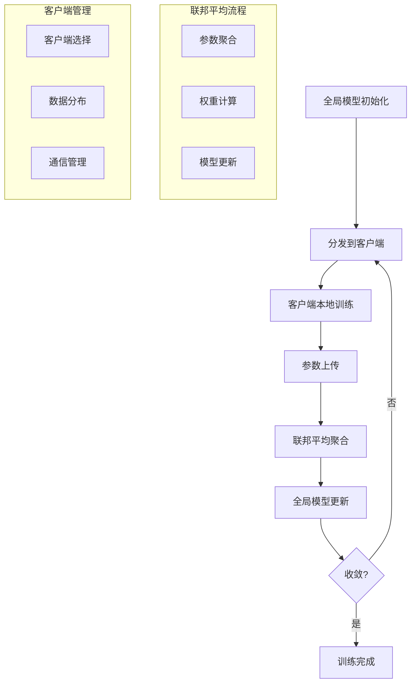

# 联邦学习扩展多表征示例 / Federated Learning Extension Multi-Representation Examples

## 概述 / Overview

本文档提供了联邦学习扩展的完整多表征示例，包括联邦平均算法、差分隐私和分布式训练。每种方法都包含数学表示、可视化图表和完整的代码实现。

## 1. 联邦平均算法 / Federated Averaging Algorithm

### 1.1 联邦平均算法理论 / Federated Averaging Algorithm Theory

#### 数学表示 / Mathematical Representation

联邦平均算法的核心公式：

Federated Averaging Core Formula:

$$\theta_{global}^{t+1} = \frac{1}{N} \sum_{i=1}^{N} \theta_i^t$$

其中：

- $\theta_{global}^{t+1}$ 是全局模型参数
- $\theta_i^t$ 是第i个客户端的本地参数
- $N$ 是参与训练的客户端数量

where:

- $\theta_{global}^{t+1}$ is the global model parameters
- $\theta_i^t$ is the local parameters of client i
- $N$ is the number of participating clients

加权联邦平均：

Weighted Federated Averaging:

$$\theta_{global}^{t+1} = \sum_{i=1}^{N} \frac{n_i}{n_{total}} \theta_i^t$$

其中：

- $n_i$ 是客户端i的数据量
- $n_{total} = \sum_{i=1}^{N} n_i$ 是总数据量

where:

- $n_i$ is the data size of client i
- $n_{total} = \sum_{i=1}^{N} n_i$ is the total data size

#### 可视化表示 / Visual Representation



#### Python实现 / Python Implementation

```python
import torch
import torch.nn as nn
import torch.optim as optim
import torch.nn.functional as F
import numpy as np
import matplotlib.pyplot as plt
from typing import List, Dict, Tuple, Optional
import copy
import random

class Client:
    """联邦学习客户端"""
    
    def __init__(self, client_id: int, model: nn.Module, data: torch.Tensor, 
                 labels: torch.Tensor, lr: float = 0.01):
        self.client_id = client_id
        self.model = copy.deepcopy(model)
        self.optimizer = optim.SGD(self.model.parameters(), lr=lr)
        self.data = data
        self.labels = labels
        self.data_size = len(data)
    
    def train_epoch(self) -> float:
        """训练一个epoch"""
        self.model.train()
        total_loss = 0.0
        
        # 随机打乱数据
        indices = torch.randperm(len(self.data))
        
        for i in range(0, len(self.data), 32):  # 批次大小32
            batch_indices = indices[i:i+32]
            batch_data = self.data[batch_indices]
            batch_labels = self.labels[batch_indices]
            
            # 前向传播
            outputs = self.model(batch_data)
            loss = F.cross_entropy(outputs, batch_labels)
            
            # 反向传播
            self.optimizer.zero_grad()
            loss.backward()
            self.optimizer.step()
            
            total_loss += loss.item()
        
        return total_loss / (len(self.data) // 32)
    
    def get_parameters(self) -> List[torch.Tensor]:
        """获取模型参数"""
        return [param.data.clone() for param in self.model.parameters()]
    
    def set_parameters(self, parameters: List[torch.Tensor]) -> None:
        """设置模型参数"""
        for param, new_param in zip(self.model.parameters(), parameters):
            param.data = new_param.data.clone()

class FederatedAveraging:
    """联邦平均算法"""
    
    def __init__(self, global_model: nn.Module, num_clients: int = 10, 
                 client_fraction: float = 0.5, lr: float = 0.01):
        self.global_model = global_model
        self.num_clients = num_clients
        self.client_fraction = client_fraction
        self.lr = lr
        self.clients = []
        self._create_clients()
    
    def _create_clients(self) -> None:
        """创建客户端"""
        # 生成不同分布的数据
        for i in range(self.num_clients):
            # 为每个客户端生成不同的数据分布
            num_samples = random.randint(100, 500)
            feature_dim = 10
            
            # 不同的数据分布
            if i < self.num_clients // 3:
                # 第一组：正态分布
                data = torch.randn(num_samples, feature_dim)
            elif i < 2 * self.num_clients // 3:
                # 第二组：均匀分布
                data = torch.rand(num_samples, feature_dim) * 2 - 1
            else:
                # 第三组：混合分布
                data = torch.randn(num_samples, feature_dim) * 0.5 + torch.rand(num_samples, feature_dim)
            
            # 生成标签（简单的分类任务）
            labels = torch.randint(0, 2, (num_samples,))
            
            client = Client(i, self.global_model, data, labels, self.lr)
            self.clients.append(client)
    
    def select_clients(self) -> List[Client]:
        """选择参与训练的客户端"""
        num_selected = max(1, int(self.num_clients * self.client_fraction))
        return random.sample(self.clients, num_selected)
    
    def aggregate_parameters(self, client_parameters: List[List[torch.Tensor]], 
                           client_sizes: List[int]) -> List[torch.Tensor]:
        """聚合客户端参数"""
        total_size = sum(client_sizes)
        aggregated_params = []
        
        # 对每个参数层进行加权平均
        for param_idx in range(len(client_parameters[0])):
            weighted_sum = torch.zeros_like(client_parameters[0][param_idx])
            
            for client_params, client_size in zip(client_parameters, client_sizes):
                weight = client_size / total_size
                weighted_sum += weight * client_params[param_idx]
            
            aggregated_params.append(weighted_sum)
        
        return aggregated_params
    
    def train_round(self) -> Dict[str, float]:
        """训练一轮联邦学习"""
        # 选择客户端
        selected_clients = self.select_clients()
        
        # 分发全局模型
        global_params = [param.data.clone() for param in self.global_model.parameters()]
        for client in selected_clients:
            client.set_parameters(global_params)
        
        # 客户端本地训练
        client_losses = []
        client_parameters = []
        client_sizes = []
        
        for client in selected_clients:
            loss = client.train_epoch()
            client_losses.append(loss)
            client_parameters.append(client.get_parameters())
            client_sizes.append(client.data_size)
        
        # 聚合参数
        aggregated_params = self.aggregate_parameters(client_parameters, client_sizes)
        
        # 更新全局模型
        for param, new_param in zip(self.global_model.parameters(), aggregated_params):
            param.data = new_param.data.clone()
        
        return {
            'avg_loss': np.mean(client_losses),
            'std_loss': np.std(client_losses),
            'num_clients': len(selected_clients)
        }
    
    def train(self, num_rounds: int = 100) -> List[Dict[str, float]]:
        """训练多轮联邦学习"""
        training_history = []
        
        for round_idx in range(num_rounds):
            round_info = self.train_round()
            training_history.append(round_info)
            
            if round_idx % 10 == 0:
                print(f"Round {round_idx}: Avg Loss = {round_info['avg_loss']:.4f}, "
                      f"Std Loss = {round_info['std_loss']:.4f}, "
                      f"Clients = {round_info['num_clients']}")
        
        return training_history

def visualize_federated_training(training_history: List[Dict[str, float]]) -> None:
    """可视化联邦学习训练过程"""
    plt.figure(figsize=(15, 5))
    
    # 训练损失
    plt.subplot(1, 3, 1)
    rounds = range(len(training_history))
    avg_losses = [info['avg_loss'] for info in training_history]
    std_losses = [info['std_loss'] for info in training_history]
    
    plt.plot(rounds, avg_losses, 'b-', label='Average Loss')
    plt.fill_between(rounds, 
                    [avg - std for avg, std in zip(avg_losses, std_losses)],
                    [avg + std for avg, std in zip(avg_losses, std_losses)],
                    alpha=0.3, label='±1 Std')
    plt.title('Federated Learning Training Loss')
    plt.xlabel('Round')
    plt.ylabel('Loss')
    plt.legend()
    plt.grid(True, alpha=0.3)
    
    # 客户端数量
    plt.subplot(1, 3, 2)
    client_counts = [info['num_clients'] for info in training_history]
    plt.plot(rounds, client_counts, 'g-', label='Number of Clients')
    plt.title('Number of Participating Clients')
    plt.xlabel('Round')
    plt.ylabel('Client Count')
    plt.legend()
    plt.grid(True, alpha=0.3)
    
    # 损失分布
    plt.subplot(1, 3, 3)
    plt.hist(avg_losses, bins=20, alpha=0.7, color='blue', label='Average Loss')
    plt.title('Loss Distribution')
    plt.xlabel('Loss')
    plt.ylabel('Frequency')
    plt.legend()
    plt.grid(True, alpha=0.3)
    
    plt.tight_layout()
    plt.show()

# 测试联邦平均算法
if __name__ == "__main__":
    # 创建简单模型
    class SimpleModel(nn.Module):
        def __init__(self, input_dim: int = 10, hidden_dim: int = 20, num_classes: int = 2):
            super(SimpleModel, self).__init__()
            self.fc1 = nn.Linear(input_dim, hidden_dim)
            self.fc2 = nn.Linear(hidden_dim, num_classes)
        
        def forward(self, x: torch.Tensor) -> torch.Tensor:
            x = F.relu(self.fc1(x))
            x = self.fc2(x)
            return x
    
    # 创建联邦学习系统
    global_model = SimpleModel()
    fed_avg = FederatedAveraging(global_model, num_clients=10, client_fraction=0.6)
    
    # 训练
    training_history = fed_avg.train(num_rounds=50)
    
    # 可视化结果
    visualize_federated_training(training_history)
```
