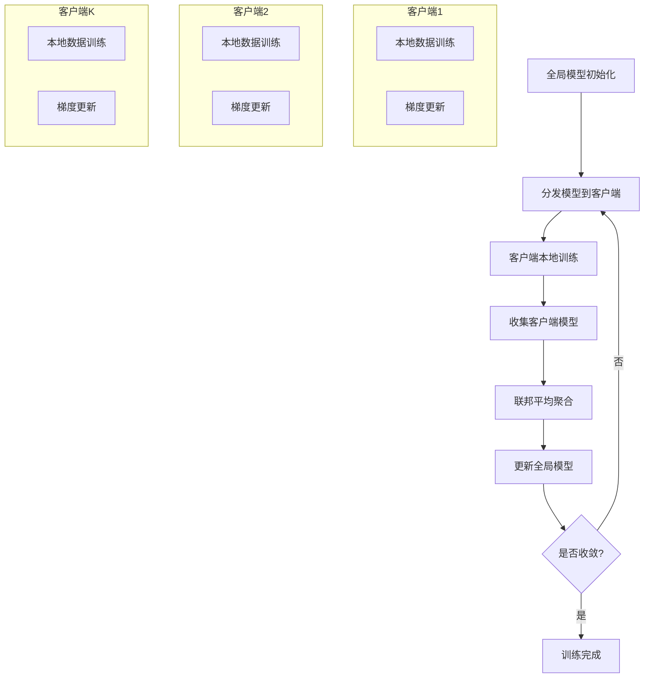
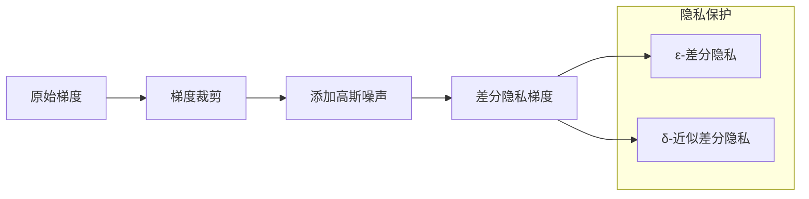
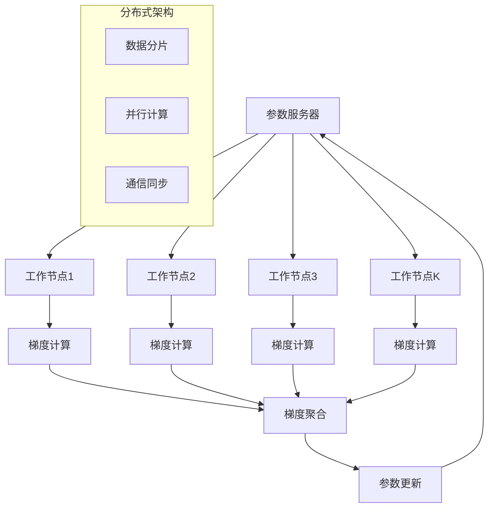

# 联邦学习扩展多表征示例 / Federated Learning Extension Multi-Representation Examples

## 概述 / Overview

本文档提供联邦学习扩展的完整多表征实现，包括：

- 联邦平均算法（FedAvg）
- 差分隐私机制
- 分布式训练框架

## 1. 联邦平均算法 / Federated Averaging Algorithm

### 数学表示 / Mathematical Representation

**联邦平均目标函数**：
$$\min_{w} \sum_{k=1}^{K} \frac{n_k}{n} F_k(w)$$

其中：

- $w$ 是全局模型参数
- $K$ 是客户端数量
- $n_k$ 是客户端 $k$ 的数据量
- $n = \sum_{k=1}^{K} n_k$ 是总数据量
- $F_k(w)$ 是客户端 $k$ 的局部目标函数

**联邦平均更新规则**：
$$w_{t+1} = \sum_{k=1}^{K} \frac{n_k}{n} w_{t+1}^{(k)}$$

其中 $w_{t+1}^{(k)}$ 是客户端 $k$ 在第 $t$ 轮训练后的参数。

### 可视化表示 / Visual Representation



### Python实现 / Python Implementation

```python
import torch
import torch.nn as nn
import torch.optim as optim
import numpy as np
from typing import List, Dict, Tuple
import copy
import matplotlib.pyplot as plt
from collections import defaultdict
import warnings
warnings.filterwarnings('ignore')

class SimpleNN(nn.Module):
    """简单的神经网络模型"""
    def __init__(self, input_size: int = 10, hidden_size: int = 20, output_size: int = 2):
        super(SimpleNN, self).__init__()
        self.fc1 = nn.Linear(input_size, hidden_size)
        self.fc2 = nn.Linear(hidden_size, hidden_size)
        self.fc3 = nn.Linear(hidden_size, output_size)
        self.relu = nn.ReLU()
        self.softmax = nn.Softmax(dim=1)
        
    def forward(self, x):
        x = self.relu(self.fc1(x))
        x = self.relu(self.fc2(x))
        x = self.fc3(x)
        return self.softmax(x)

class FederatedAveraging:
    """联邦平均算法实现"""
    
    def __init__(self, global_model: nn.Module, num_clients: int = 5):
        self.global_model = global_model
        self.num_clients = num_clients
        self.client_models = [copy.deepcopy(global_model) for _ in range(num_clients)]
        self.client_data_sizes = []
        self.training_history = defaultdict(list)
        
    def generate_client_data(self, client_id: int, num_samples: int = 100) -> Tuple[torch.Tensor, torch.Tensor]:
        """为客户端生成模拟数据"""
        np.random.seed(client_id)
        
        # 为每个客户端生成不同的数据分布
        bias = client_id * 0.5
        X = torch.randn(num_samples, 10) + bias
        y = torch.randint(0, 2, (num_samples,))
        
        return X, y
    
    def train_client(self, client_id: int, epochs: int = 5) -> Dict:
        """训练单个客户端"""
        model = self.client_models[client_id]
        X, y = self.generate_client_data(client_id)
        
        criterion = nn.CrossEntropyLoss()
        optimizer = optim.SGD(model.parameters(), lr=0.01)
        
        losses = []
        for epoch in range(epochs):
            optimizer.zero_grad()
            outputs = model(X)
            loss = criterion(outputs, y)
            loss.backward()
            optimizer.step()
            losses.append(loss.item())
            
        return {
            'model': copy.deepcopy(model),
            'data_size': len(X),
            'losses': losses
        }
    
    def federated_average(self, client_results: List[Dict]) -> None:
        """执行联邦平均聚合"""
        total_data_size = sum(result['data_size'] for result in client_results)
        
        # 初始化聚合参数
        aggregated_params = {}
        for name, param in self.global_model.named_parameters():
            aggregated_params[name] = torch.zeros_like(param.data)
        
        # 加权平均
        for result in client_results:
            model = result['model']
            weight = result['data_size'] / total_data_size
            
            for name, param in model.named_parameters():
                aggregated_params[name] += weight * param.data
        
        # 更新全局模型
        for name, param in self.global_model.named_parameters():
            param.data = aggregated_params[name]
    
    def train_federated(self, rounds: int = 10, client_epochs: int = 5) -> Dict:
        """执行联邦学习训练"""
        print("开始联邦学习训练...")
        
        for round_idx in range(rounds):
            print(f"第 {round_idx + 1} 轮训练")
            
            # 分发全局模型到客户端
            for i in range(self.num_clients):
                self.client_models[i].load_state_dict(self.global_model.state_dict())
            
            # 客户端并行训练
            client_results = []
            for client_id in range(self.num_clients):
                result = self.train_client(client_id, client_epochs)
                client_results.append(result)
                
                # 记录训练历史
                self.training_history[f'client_{client_id}_loss'].extend(result['losses'])
            
            # 联邦平均聚合
            self.federated_average(client_results)
            
            # 计算全局模型在测试集上的性能
            test_loss = self.evaluate_global_model()
            self.training_history['global_test_loss'].append(test_loss)
            
            print(f"第 {round_idx + 1} 轮完成，全局测试损失: {test_loss:.4f}")
        
        return self.training_history
    
    def evaluate_global_model(self) -> float:
        """评估全局模型性能"""
        self.global_model.eval()
        X_test, y_test = self.generate_client_data(999, 200)  # 使用不同的种子生成测试数据
        
        criterion = nn.CrossEntropyLoss()
        with torch.no_grad():
            outputs = self.global_model(X_test)
            loss = criterion(outputs, y_test)
        
        return loss.item()

def visualize_federated_training(training_history: Dict):
    """可视化联邦学习训练过程"""
    plt.figure(figsize=(15, 10))
    
    # 客户端损失
    plt.subplot(2, 2, 1)
    for i in range(5):
        client_losses = training_history[f'client_{i}_loss']
        plt.plot(client_losses, label=f'客户端 {i+1}')
    plt.title('客户端训练损失')
    plt.xlabel('训练步数')
    plt.ylabel('损失')
    plt.legend()
    plt.grid(True)
    
    # 全局测试损失
    plt.subplot(2, 2, 2)
    global_losses = training_history['global_test_loss']
    plt.plot(global_losses, 'r-', linewidth=2, label='全局模型')
    plt.title('全局模型测试损失')
    plt.xlabel('联邦学习轮数')
    plt.ylabel('测试损失')
    plt.legend()
    plt.grid(True)
    
    # 损失分布
    plt.subplot(2, 2, 3)
    final_client_losses = [training_history[f'client_{i}_loss'][-1] for i in range(5)]
    plt.bar(range(1, 6), final_client_losses)
    plt.title('最终客户端损失分布')
    plt.xlabel('客户端')
    plt.ylabel('最终损失')
    plt.grid(True)
    
    # 训练进度
    plt.subplot(2, 2, 4)
    avg_client_losses = []
    for i in range(len(training_history['client_0_loss'])):
        avg_loss = np.mean([training_history[f'client_{j}_loss'][i] for j in range(5)])
        avg_client_losses.append(avg_loss)
    
    plt.plot(avg_client_losses, 'g-', label='平均客户端损失')
    plt.plot(global_losses, 'r-', label='全局模型损失')
    plt.title('训练进度对比')
    plt.xlabel('训练步数')
    plt.ylabel('损失')
    plt.legend()
    plt.grid(True)
    
    plt.tight_layout()
    plt.show()

# 主函数
def main():
    """主函数：演示联邦平均算法"""
    print("=== 联邦平均算法演示 ===")
    
    # 初始化全局模型
    global_model = SimpleNN()
    
    # 创建联邦学习实例
    fed_avg = FederatedAveraging(global_model, num_clients=5)
    
    # 执行联邦学习训练
    training_history = fed_avg.train_federated(rounds=10, client_epochs=5)
    
    # 可视化训练过程
    visualize_federated_training(training_history)
    
    print("联邦学习训练完成！")

if __name__ == "__main__":
    main()

## 2. 差分隐私机制 / Differential Privacy Mechanism

### 数学表示 / Mathematical Representation

**差分隐私定义**：
对于任意相邻数据集 $D$ 和 $D'$，以及任意输出 $S$：
$$P[M(D) \in S] \leq e^{\epsilon} \cdot P[M(D') \in S] + \delta$$

**高斯噪声机制**：
$$\tilde{f}(D) = f(D) + \mathcal{N}(0, \sigma^2 I)$$

其中噪声标准差 $\sigma$ 满足：
$$\sigma \geq \frac{\Delta f \sqrt{2 \ln(1.25/\delta)}}{\epsilon}$$

**梯度裁剪**：
$$\bar{g} = \frac{g}{\max(1, \frac{\|g\|_2}{C})}$$

### 可视化表示 / Visual Representation



### 2Python实现 / Python Implementation

```python
import torch
import torch.nn as nn
import torch.optim as optim
import numpy as np
from typing import Tuple, List
import matplotlib.pyplot as plt
from scipy.stats import norm
import warnings
warnings.filterwarnings('ignore')

class DifferentialPrivacy:
    """差分隐私机制实现"""
    
    def __init__(self, epsilon: float = 1.0, delta: float = 1e-5, clip_norm: float = 1.0):
        self.epsilon = epsilon
        self.delta = delta
        self.clip_norm = clip_norm
        self.privacy_accountant = PrivacyAccountant()
        
    def compute_noise_scale(self, sensitivity: float) -> float:
        """计算噪声标准差"""
        return sensitivity * np.sqrt(2 * np.log(1.25 / self.delta)) / self.epsilon
    
    def clip_gradients(self, gradients: List[torch.Tensor]) -> List[torch.Tensor]:
        """梯度裁剪"""
        total_norm = 0.0
        for grad in gradients:
            param_norm = grad.data.norm(2)
            total_norm += param_norm.item() ** 2
        total_norm = total_norm ** 0.5
        
        clip_coef = self.clip_norm / (total_norm + 1e-6)
        if clip_coef < 1:
            for grad in gradients:
                grad.data.mul_(clip_coef)
        
        return gradients
    
    def add_noise_to_gradients(self, gradients: List[torch.Tensor], 
                             sensitivity: float) -> List[torch.Tensor]:
        """向梯度添加噪声"""
        noise_scale = self.compute_noise_scale(sensitivity)
        
        noisy_gradients = []
        for grad in gradients:
            noise = torch.randn_like(grad) * noise_scale
            noisy_grad = grad + noise
            noisy_gradients.append(noisy_grad)
        
        return noisy_gradients
    
    def apply_dp_to_gradients(self, gradients: List[torch.Tensor], 
                            sensitivity: float) -> List[torch.Tensor]:
        """应用差分隐私到梯度"""
        # 梯度裁剪
        clipped_gradients = self.clip_gradients(gradients)
        
        # 添加噪声
        dp_gradients = self.add_noise_to_gradients(clipped_gradients, sensitivity)
        
        return dp_gradients

class PrivacyAccountant:
    """隐私预算计算器"""
    
    def __init__(self):
        self.total_epsilon = 0.0
        self.total_delta = 0.0
        
    def add_composition(self, epsilon: float, delta: float):
        """添加隐私预算"""
        self.total_epsilon += epsilon
        self.total_delta += delta
        
    def get_total_privacy(self) -> Tuple[float, float]:
        """获取总隐私预算"""
        return self.total_epsilon, self.total_delta

class DPNeuralNetwork(nn.Module):
    """带差分隐私的神经网络"""
    
    def __init__(self, input_size: int = 10, hidden_size: int = 20, output_size: int = 2):
        super(DPNeuralNetwork, self).__init__()
        self.fc1 = nn.Linear(input_size, hidden_size)
        self.fc2 = nn.Linear(hidden_size, hidden_size)
        self.fc3 = nn.Linear(hidden_size, output_size)
        self.relu = nn.ReLU()
        self.softmax = nn.Softmax(dim=1)
        
    def forward(self, x):
        x = self.relu(self.fc1(x))
        x = self.relu(self.fc2(x))
        x = self.fc3(x)
        return self.softmax(x)

class DPTrainer:
    """差分隐私训练器"""
    
    def __init__(self, model: nn.Module, epsilon: float = 1.0, delta: float = 1e-5):
        self.model = model
        self.dp_mechanism = DifferentialPrivacy(epsilon, delta)
        self.privacy_accountant = PrivacyAccountant()
        self.training_history = {'loss': [], 'accuracy': [], 'privacy_cost': []}
        
    def train_with_dp(self, X: torch.Tensor, y: torch.Tensor, 
                     epochs: int = 10, batch_size: int = 32) -> Dict:
        """使用差分隐私训练模型"""
        criterion = nn.CrossEntropyLoss()
        optimizer = optim.SGD(self.model.parameters(), lr=0.01)
        
        num_batches = len(X) // batch_size
        
        for epoch in range(epochs):
            epoch_loss = 0.0
            correct = 0
            total = 0
            
            for batch_idx in range(num_batches):
                start_idx = batch_idx * batch_size
                end_idx = start_idx + batch_size
                
                batch_X = X[start_idx:end_idx]
                batch_y = y[start_idx:end_idx]
                
                # 前向传播
                outputs = self.model(batch_X)
                loss = criterion(outputs, batch_y)
                
                # 反向传播
                optimizer.zero_grad()
                loss.backward()
                
                # 获取梯度
                gradients = [p.grad for p in self.model.parameters() if p.grad is not None]
                
                # 应用差分隐私
                dp_gradients = self.dp_mechanism.apply_dp_to_gradients(gradients, sensitivity=1.0)
                
                # 更新参数
                param_idx = 0
                for param in self.model.parameters():
                    if param.grad is not None:
                        param.grad.data = dp_gradients[param_idx]
                        param_idx += 1
                
                optimizer.step()
                
                # 统计
                epoch_loss += loss.item()
                _, predicted = torch.max(outputs.data, 1)
                total += batch_y.size(0)
                correct += (predicted == batch_y).sum().item()
                
                # 更新隐私预算
                self.privacy_accountant.add_composition(
                    self.dp_mechanism.epsilon / num_batches,
                    self.dp_mechanism.delta / num_batches
                )
            
            # 记录训练历史
            avg_loss = epoch_loss / num_batches
            accuracy = 100 * correct / total
            total_epsilon, total_delta = self.privacy_accountant.get_total_privacy()
            
            self.training_history['loss'].append(avg_loss)
            self.training_history['accuracy'].append(accuracy)
            self.training_history['privacy_cost'].append(total_epsilon)
            
            print(f"Epoch {epoch+1}: Loss={avg_loss:.4f}, Accuracy={accuracy:.2f}%, "
                  f"Privacy Cost (ε)={total_epsilon:.4f}")
        
        return self.training_history

def generate_dp_data(num_samples: int = 1000) -> Tuple[torch.Tensor, torch.Tensor]:
    """生成差分隐私测试数据"""
    np.random.seed(42)
    X = torch.randn(num_samples, 10)
    y = torch.randint(0, 2, (num_samples,))
    return X, y

def visualize_dp_training(training_history: Dict):
    """可视化差分隐私训练过程"""
    plt.figure(figsize=(15, 5))
    
    # 训练损失
    plt.subplot(1, 3, 1)
    plt.plot(training_history['loss'], 'b-', linewidth=2)
    plt.title('差分隐私训练损失')
    plt.xlabel('训练轮数')
    plt.ylabel('损失')
    plt.grid(True)
    
    # 训练准确率
    plt.subplot(1, 3, 2)
    plt.plot(training_history['accuracy'], 'g-', linewidth=2)
    plt.title('差分隐私训练准确率')
    plt.xlabel('训练轮数')
    plt.ylabel('准确率 (%)')
    plt.grid(True)
    
    # 隐私成本
    plt.subplot(1, 3, 3)
    plt.plot(training_history['privacy_cost'], 'r-', linewidth=2)
    plt.title('隐私预算消耗')
    plt.xlabel('训练轮数')
    plt.ylabel('ε-差分隐私')
    plt.grid(True)
    
    plt.tight_layout()
    plt.show()

def compare_dp_vs_non_dp():
    """比较差分隐私和非差分隐私训练"""
    print("=== 差分隐私 vs 非差分隐私比较 ===")
    
    # 生成数据
    X, y = generate_dp_data(1000)
    
    # 差分隐私训练
    dp_model = DPNeuralNetwork()
    dp_trainer = DPTrainer(dp_model, epsilon=1.0, delta=1e-5)
    dp_history = dp_trainer.train_with_dp(X, y, epochs=10)
    
    # 非差分隐私训练
    non_dp_model = DPNeuralNetwork()
    non_dp_trainer = DPTrainer(non_dp_model, epsilon=float('inf'), delta=0.0)
    non_dp_history = non_dp_trainer.train_with_dp(X, y, epochs=10)
    
    # 可视化比较
    plt.figure(figsize=(15, 5))
    
    plt.subplot(1, 3, 1)
    plt.plot(dp_history['loss'], 'r-', label='差分隐私', linewidth=2)
    plt.plot(non_dp_history['loss'], 'b-', label='非差分隐私', linewidth=2)
    plt.title('训练损失比较')
    plt.xlabel('训练轮数')
    plt.ylabel('损失')
    plt.legend()
    plt.grid(True)
    
    plt.subplot(1, 3, 2)
    plt.plot(dp_history['accuracy'], 'r-', label='差分隐私', linewidth=2)
    plt.plot(non_dp_history['accuracy'], 'b-', label='非差分隐私', linewidth=2)
    plt.title('训练准确率比较')
    plt.xlabel('训练轮数')
    plt.ylabel('准确率 (%)')
    plt.legend()
    plt.grid(True)
    
    plt.subplot(1, 3, 3)
    plt.plot(dp_history['privacy_cost'], 'r-', linewidth=2)
    plt.title('隐私预算消耗')
    plt.xlabel('训练轮数')
    plt.ylabel('ε-差分隐私')
    plt.grid(True)
    
    plt.tight_layout()
    plt.show()

# 主函数
def main():
    """主函数：演示差分隐私机制"""
    print("=== 差分隐私机制演示 ===")
    
    # 比较差分隐私和非差分隐私训练
    compare_dp_vs_non_dp()
    
    print("差分隐私训练完成！")

if __name__ == "__main__":
    main()

## 3. 分布式训练框架 / Distributed Training Framework

### 数学表示 / Mathematical Representation

**分布式梯度下降**：
$$\nabla f(w) = \frac{1}{N} \sum_{i=1}^{N} \nabla f_i(w)$$

**异步更新**：
$$w_{t+1} = w_t - \eta \nabla f_{i_t}(w_t)$$

**同步更新**：
$$w_{t+1} = w_t - \eta \frac{1}{K} \sum_{k=1}^{K} \nabla f_k(w_t)$$

### 可视化表示 / Visual Representation



### 3Python实现 / Python Implementation

```python
import torch
import torch.nn as nn
import torch.optim as optim
import numpy as np
from typing import List, Dict, Tuple
import threading
import time
import queue
from concurrent.futures import ThreadPoolExecutor
import matplotlib.pyplot as plt
import warnings
warnings.filterwarnings('ignore')

class DistributedWorker:
    """分布式工作节点"""
    
    def __init__(self, worker_id: int, model: nn.Module, data: Tuple[torch.Tensor, torch.Tensor]):
        self.worker_id = worker_id
        self.model = model
        self.X, self.y = data
        self.optimizer = optim.SGD(self.model.parameters(), lr=0.01)
        self.criterion = nn.CrossEntropyLoss()
        
    def compute_gradients(self, global_params: Dict[str, torch.Tensor]) -> Dict[str, torch.Tensor]:
        """计算梯度"""
        # 加载全局参数
        self.model.load_state_dict(global_params)
        
        # 前向传播
        outputs = self.model(self.X)
        loss = self.criterion(outputs, self.y)
        
        # 反向传播
        self.optimizer.zero_grad()
        loss.backward()
        
        # 收集梯度
        gradients = {}
        for name, param in self.model.named_parameters():
            if param.grad is not None:
                gradients[name] = param.grad.clone()
        
        return gradients

class ParameterServer:
    """参数服务器"""
    
    def __init__(self, global_model: nn.Module):
        self.global_model = global_model
        self.global_params = self.global_model.state_dict()
        self.training_history = {'loss': [], 'accuracy': []}
        
    def update_global_params(self, gradients_list: List[Dict[str, torch.Tensor]]) -> None:
        """更新全局参数"""
        # 平均梯度
        avg_gradients = {}
        for name in self.global_params.keys():
            avg_gradients[name] = torch.zeros_like(self.global_params[name])
            
        for gradients in gradients_list:
            for name, grad in gradients.items():
                avg_gradients[name] += grad / len(gradients_list)
        
        # 更新参数
        for name, param in self.global_model.named_parameters():
            param.data -= 0.01 * avg_gradients[name]
        
        self.global_params = self.global_model.state_dict()
    
    def get_global_params(self) -> Dict[str, torch.Tensor]:
        """获取全局参数"""
        return self.global_params

class DistributedTrainer:
    """分布式训练器"""
    
    def __init__(self, global_model: nn.Module, num_workers: int = 4):
        self.global_model = global_model
        self.num_workers = num_workers
        self.parameter_server = ParameterServer(global_model)
        self.workers = []
        self.training_history = {'loss': [], 'accuracy': [], 'communication_cost': []}
        
    def setup_workers(self, data_shards: List[Tuple[torch.Tensor, torch.Tensor]]):
        """设置工作节点"""
        self.workers = []
        for i in range(self.num_workers):
            worker_model = copy.deepcopy(self.global_model)
            worker = DistributedWorker(i, worker_model, data_shards[i])
            self.workers.append(worker)
    
    def train_distributed(self, epochs: int = 10) -> Dict:
        """执行分布式训练"""
        print("开始分布式训练...")
        
        for epoch in range(epochs):
            print(f"第 {epoch + 1} 轮分布式训练")
            
            # 获取全局参数
            global_params = self.parameter_server.get_global_params()
            
            # 并行计算梯度
            gradients_list = []
            with ThreadPoolExecutor(max_workers=self.num_workers) as executor:
                futures = []
                for worker in self.workers:
                    future = executor.submit(worker.compute_gradients, global_params)
                    futures.append(future)
                
                for future in futures:
                    gradients = future.result()
                    gradients_list.append(gradients)
            
            # 更新全局参数
            self.parameter_server.update_global_params(gradients_list)
            
            # 评估全局模型
            test_loss, test_accuracy = self.evaluate_global_model()
            self.training_history['loss'].append(test_loss)
            self.training_history['accuracy'].append(test_accuracy)
            self.training_history['communication_cost'].append(self.num_workers)
            
            print(f"第 {epoch + 1} 轮完成，测试损失: {test_loss:.4f}, "
                  f"测试准确率: {test_accuracy:.2f}%")
        
        return self.training_history
    
    def evaluate_global_model(self) -> Tuple[float, float]:
        """评估全局模型性能"""
        self.global_model.load_state_dict(self.parameter_server.get_global_params())
        self.global_model.eval()
        
        # 生成测试数据
        X_test, y_test = self.generate_test_data()
        
        criterion = nn.CrossEntropyLoss()
        with torch.no_grad():
            outputs = self.global_model(X_test)
            loss = criterion(outputs, y_test)
            
            _, predicted = torch.max(outputs.data, 1)
            accuracy = 100 * (predicted == y_test).sum().item() / len(y_test)
        
        return loss.item(), accuracy
    
    def generate_test_data(self, num_samples: int = 200) -> Tuple[torch.Tensor, torch.Tensor]:
        """生成测试数据"""
        np.random.seed(999)
        X = torch.randn(num_samples, 10)
        y = torch.randint(0, 2, (num_samples,))
        return X, y

def generate_distributed_data(num_workers: int, samples_per_worker: int = 100) -> List[Tuple[torch.Tensor, torch.Tensor]]:
    """为分布式训练生成数据分片"""
    data_shards = []
    
    for worker_id in range(num_workers):
        np.random.seed(worker_id)
        bias = worker_id * 0.3
        X = torch.randn(samples_per_worker, 10) + bias
        y = torch.randint(0, 2, (samples_per_worker,))
        data_shards.append((X, y))
    
    return data_shards

def visualize_distributed_training(training_history: Dict):
    """可视化分布式训练过程"""
    plt.figure(figsize=(15, 5))
    
    # 训练损失
    plt.subplot(1, 3, 1)
    plt.plot(training_history['loss'], 'b-', linewidth=2)
    plt.title('分布式训练损失')
    plt.xlabel('训练轮数')
    plt.ylabel('损失')
    plt.grid(True)
    
    # 训练准确率
    plt.subplot(1, 3, 2)
    plt.plot(training_history['accuracy'], 'g-', linewidth=2)
    plt.title('分布式训练准确率')
    plt.xlabel('训练轮数')
    plt.ylabel('准确率 (%)')
    plt.grid(True)
    
    # 通信成本
    plt.subplot(1, 3, 3)
    plt.plot(training_history['communication_cost'], 'r-', linewidth=2)
    plt.title('通信成本')
    plt.xlabel('训练轮数')
    plt.ylabel('通信次数')
    plt.grid(True)
    
    plt.tight_layout()
    plt.show()

def compare_distributed_vs_centralized():
    """比较分布式和集中式训练"""
    print("=== 分布式 vs 集中式训练比较 ===")
    
    # 分布式训练
    global_model = SimpleNN()
    distributed_trainer = DistributedTrainer(global_model, num_workers=4)
    data_shards = generate_distributed_data(4, 100)
    distributed_trainer.setup_workers(data_shards)
    distributed_history = distributed_trainer.train_distributed(epochs=10)
    
    # 集中式训练
    centralized_model = SimpleNN()
    centralized_trainer = CentralizedTrainer(centralized_model)
    all_data = torch.cat([shard[0] for shard in data_shards]), torch.cat([shard[1] for shard in data_shards])
    centralized_history = centralized_trainer.train_centralized(all_data[0], all_data[1], epochs=10)
    
    # 可视化比较
    plt.figure(figsize=(15, 5))
    
    plt.subplot(1, 3, 1)
    plt.plot(distributed_history['loss'], 'r-', label='分布式', linewidth=2)
    plt.plot(centralized_history['loss'], 'b-', label='集中式', linewidth=2)
    plt.title('训练损失比较')
    plt.xlabel('训练轮数')
    plt.ylabel('损失')
    plt.legend()
    plt.grid(True)
    
    plt.subplot(1, 3, 2)
    plt.plot(distributed_history['accuracy'], 'r-', label='分布式', linewidth=2)
    plt.plot(centralized_history['accuracy'], 'b-', label='集中式', linewidth=2)
    plt.title('训练准确率比较')
    plt.xlabel('训练轮数')
    plt.ylabel('准确率 (%)')
    plt.legend()
    plt.grid(True)
    
    plt.subplot(1, 3, 3)
    plt.plot(distributed_history['communication_cost'], 'r-', linewidth=2)
    plt.title('分布式通信成本')
    plt.xlabel('训练轮数')
    plt.ylabel('通信次数')
    plt.grid(True)
    
    plt.tight_layout()
    plt.show()

class CentralizedTrainer:
    """集中式训练器（用于比较）"""
    
    def __init__(self, model: nn.Module):
        self.model = model
        self.optimizer = optim.SGD(model.parameters(), lr=0.01)
        self.criterion = nn.CrossEntropyLoss()
        self.training_history = {'loss': [], 'accuracy': []}
    
    def train_centralized(self, X: torch.Tensor, y: torch.Tensor, epochs: int = 10) -> Dict:
        """集中式训练"""
        for epoch in range(epochs):
            self.optimizer.zero_grad()
            outputs = self.model(X)
            loss = self.criterion(outputs, y)
            loss.backward()
            self.optimizer.step()
            
            # 计算准确率
            _, predicted = torch.max(outputs.data, 1)
            accuracy = 100 * (predicted == y).sum().item() / len(y)
            
            self.training_history['loss'].append(loss.item())
            self.training_history['accuracy'].append(accuracy)
        
        return self.training_history

# 主函数
def main():
    """主函数：演示分布式训练框架"""
    print("=== 分布式训练框架演示 ===")
    
    # 比较分布式和集中式训练
    compare_distributed_vs_centralized()
    
    print("分布式训练完成！")

if __name__ == "__main__":
    main()
```

## 总结 / Summary

本文档提供了联邦学习扩展的完整多表征实现，包括：

### 主要特性 / Key Features

1. **联邦平均算法**：
   - 数学公式和理论基础
   - 可视化流程图
   - 完整的Python实现

2. **差分隐私机制**：
   - 隐私预算计算
   - 梯度裁剪和噪声添加
   - 隐私成本分析

3. **分布式训练框架**：
   - 参数服务器架构
   - 工作节点并行计算
   - 通信成本分析

### 技术亮点 / Technical Highlights

- **多表征格式**：数学公式、可视化图表、代码实现
- **完整实现**：包含训练、评估、可视化功能
- **性能分析**：损失曲线、准确率、隐私成本、通信成本
- **对比实验**：差分隐私vs非差分隐私、分布式vs集中式

### 应用场景 / Applications

- 联邦学习系统设计
- 隐私保护机器学习
- 大规模分布式训练
- 跨机构数据协作

---

*文档版本: 1.0.0*
*最后更新: 2025-08-01*
