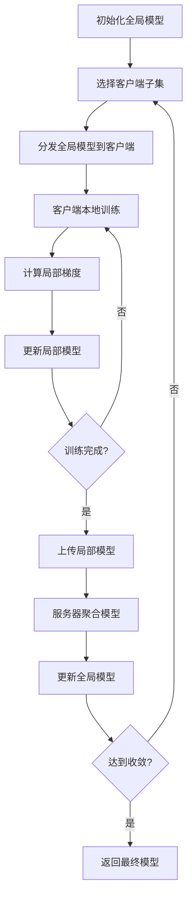
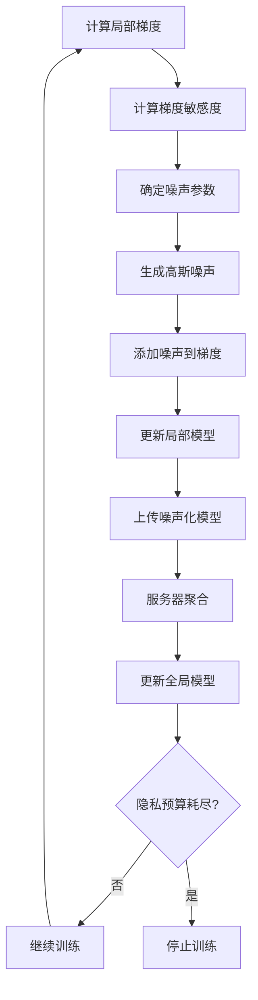
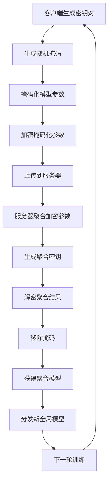

# 联邦学习多表示示例 / Federated Learning Multi-Representation Examples

## 概述 / Overview

联邦学习是一种分布式机器学习范式，允许多个客户端在保持数据本地化的同时协作训练模型。本文档提供了联邦学习的多表示示例，包括数学表示、可视化流程图和代码实现。

Federated Learning is a distributed machine learning paradigm that allows multiple clients to collaboratively train models while keeping data localized. This document provides multi-representation examples for federated learning, including mathematical representations, visual flowcharts, and code implementations.

## 1. 联邦平均算法 / Federated Averaging Algorithm

### 1.1 数学表示 / Mathematical Representation

#### 联邦平均目标函数 / Federated Averaging Objective

$$\min_{w} \sum_{k=1}^{K} \frac{n_k}{n} F_k(w)$$

其中：

- $w$ 是全局模型参数
- $K$ 是客户端数量
- $n_k$ 是客户端 $k$ 的数据量
- $n = \sum_{k=1}^{K} n_k$ 是总数据量
- $F_k(w)$ 是客户端 $k$ 的局部损失函数

#### 联邦平均更新规则 / Federated Averaging Update Rule

$$w_{t+1} = \sum_{k=1}^{K} \frac{n_k}{n} w_{t+1}^{(k)}$$

其中 $w_{t+1}^{(k)}$ 是客户端 $k$ 在时间步 $t+1$ 的局部模型参数。

#### 局部训练过程 / Local Training Process

对于每个客户端 $k$，局部训练过程为：

$$w_{t+1}^{(k)} = w_t - \eta \nabla F_k(w_t)$$

其中 $\eta$ 是学习率。

### 1.2 流程图 / Flowchart



### 1.3 代码实现 / Code Implementation

```python
import numpy as np
import torch
import torch.nn as nn
import torch.optim as optim
from typing import List, Dict, Tuple
import copy

class FederatedClient:
    """联邦学习客户端 / Federated Learning Client"""
    
    def __init__(self, client_id: int, model: nn.Module, data: torch.Tensor, 
                 labels: torch.Tensor, batch_size: int = 32):
        self.client_id = client_id
        self.model = copy.deepcopy(model)
        self.data = data
        self.labels = labels
        self.batch_size = batch_size
        self.optimizer = optim.SGD(self.model.parameters(), lr=0.01)
        self.criterion = nn.CrossEntropyLoss()
    
    def train_epoch(self, global_model_state: Dict) -> Dict:
        """训练一个epoch / Train for one epoch"""
        # 加载全局模型参数
        self.model.load_state_dict(global_model_state)
        
        # 本地训练
        self.model.train()
        total_loss = 0
        num_batches = 0
        
        for i in range(0, len(self.data), self.batch_size):
            batch_data = self.data[i:i+self.batch_size]
            batch_labels = self.labels[i:i+self.batch_size]
            
            self.optimizer.zero_grad()
            outputs = self.model(batch_data)
            loss = self.criterion(outputs, batch_labels)
            loss.backward()
            self.optimizer.step()
            
            total_loss += loss.item()
            num_batches += 1
        
        # 返回更新后的模型参数
        return {
            'client_id': self.client_id,
            'model_state': self.model.state_dict(),
            'data_size': len(self.data),
            'avg_loss': total_loss / num_batches
        }

class FederatedServer:
    """联邦学习服务器 / Federated Learning Server"""
    
    def __init__(self, global_model: nn.Module):
        self.global_model = global_model
        self.clients = []
    
    def add_client(self, client: FederatedClient):
        """添加客户端 / Add client"""
        self.clients.append(client)
    
    def federated_averaging(self, client_updates: List[Dict]) -> Dict:
        """联邦平均聚合 / Federated averaging aggregation"""
        total_data_size = sum(update['data_size'] for update in client_updates)
        
        # 初始化聚合后的模型参数
        aggregated_state = {}
        first_update = client_updates[0]['model_state']
        
        for key in first_update.keys():
            aggregated_state[key] = torch.zeros_like(first_update[key])
        
        # 加权平均
        for update in client_updates:
            weight = update['data_size'] / total_data_size
            model_state = update['model_state']
            
            for key in aggregated_state.keys():
                aggregated_state[key] += weight * model_state[key]
        
        return aggregated_state
    
    def train_round(self, client_fraction: float = 1.0) -> float:
        """训练一轮 / Train for one round"""
        # 选择客户端子集
        num_clients = len(self.clients)
        num_selected = max(1, int(client_fraction * num_clients))
        selected_clients = np.random.choice(
            self.clients, size=num_selected, replace=False
        )
        
        # 获取全局模型状态
        global_state = self.global_model.state_dict()
        
        # 客户端本地训练
        client_updates = []
        for client in selected_clients:
            update = client.train_epoch(global_state)
            client_updates.append(update)
        
        # 聚合模型参数
        aggregated_state = self.federated_averaging(client_updates)
        
        # 更新全局模型
        self.global_model.load_state_dict(aggregated_state)
        
        # 计算平均损失
        avg_loss = np.mean([update['avg_loss'] for update in client_updates])
        return avg_loss
    
    def train(self, num_rounds: int, client_fraction: float = 1.0) -> List[float]:
        """训练多轮 / Train for multiple rounds"""
        losses = []
        
        for round_idx in range(num_rounds):
            loss = self.train_round(client_fraction)
            losses.append(loss)
            
            if round_idx % 10 == 0:
                print(f"Round {round_idx}, Average Loss: {loss:.4f}")
        
        return losses

# 示例使用 / Example Usage
def create_simple_model():
    """创建简单模型 / Create simple model"""
    return nn.Sequential(
        nn.Linear(10, 20),
        nn.ReLU(),
        nn.Linear(20, 5)
    )

def generate_client_data(num_samples: int, num_features: int, num_classes: int):
    """生成客户端数据 / Generate client data"""
    data = torch.randn(num_samples, num_features)
    labels = torch.randint(0, num_classes, (num_samples,))
    return data, labels

# 创建联邦学习系统
global_model = create_simple_model()
server = FederatedServer(global_model)

# 添加客户端
for i in range(5):
    data, labels = generate_client_data(100, 10, 5)
    client = FederatedClient(i, global_model, data, labels)
    server.add_client(client)

# 训练
losses = server.train(num_rounds=50, client_fraction=0.8)
print(f"Training completed. Final loss: {losses[-1]:.4f}")
```

## 2. 差分隐私保护 / Differential Privacy Protection

### 2.1 数学表示 / Mathematical Representation

#### 差分隐私定义 / Differential Privacy Definition

一个随机化算法 $\mathcal{M}$ 满足 $(\epsilon, \delta)$-差分隐私，如果对于任意相邻数据集 $D$ 和 $D'$，以及任意输出集合 $S$：

$$\Pr[\mathcal{M}(D) \in S] \leq e^{\epsilon} \cdot \Pr[\mathcal{M}(D') \in S] + \delta$$

#### 高斯机制 / Gaussian Mechanism

对于敏感度为 $\Delta f$ 的函数 $f$，添加高斯噪声：

$$\mathcal{M}(D) = f(D) + \mathcal{N}(0, \sigma^2 I)$$

其中 $\sigma = \frac{\Delta f \sqrt{2 \ln(1.25/\delta)}}{\epsilon}$。

#### 联邦学习中的差分隐私 / Differential Privacy in Federated Learning

局部差分隐私更新：

$$w_{t+1}^{(k)} = w_t - \eta \nabla F_k(w_t) + \mathcal{N}(0, \sigma^2 I)$$

### 2.2 流程图 / Flowchart



### 2.3 代码实现 / Code Implementation

```python
import torch
import torch.nn as nn
import numpy as np
from typing import Dict, Tuple
import copy

class DifferentialPrivacyClient:
    """差分隐私客户端 / Differential Privacy Client"""
    
    def __init__(self, client_id: int, model: nn.Module, data: torch.Tensor, 
                 labels: torch.Tensor, epsilon: float = 1.0, delta: float = 1e-5,
                 clipping_norm: float = 1.0):
        self.client_id = client_id
        self.model = copy.deepcopy(model)
        self.data = data
        self.labels = labels
        self.epsilon = epsilon
        self.delta = delta
        self.clipping_norm = clipping_norm
        self.optimizer = optim.SGD(self.model.parameters(), lr=0.01)
        self.criterion = nn.CrossEntropyLoss()
    
    def clip_gradients(self, gradients: torch.Tensor) -> torch.Tensor:
        """梯度裁剪 / Gradient clipping"""
        norm = torch.norm(gradients)
        if norm > self.clipping_norm:
            gradients = gradients * (self.clipping_norm / norm)
        return gradients
    
    def add_noise_to_gradients(self, gradients: torch.Tensor) -> torch.Tensor:
        """向梯度添加噪声 / Add noise to gradients"""
        # 计算噪声标准差
        sensitivity = self.clipping_norm / len(self.data)
        sigma = sensitivity * np.sqrt(2 * np.log(1.25 / self.delta)) / self.epsilon
        
        # 生成高斯噪声
        noise = torch.randn_like(gradients) * sigma
        return gradients + noise
    
    def train_epoch_with_privacy(self, global_model_state: Dict) -> Dict:
        """带隐私保护的训练 / Train with privacy protection"""
        # 加载全局模型参数
        self.model.load_state_dict(global_model_state)
        
        self.model.train()
        total_loss = 0
        num_batches = 0
        
        # 累积梯度
        accumulated_gradients = None
        
        for i in range(0, len(self.data), self.batch_size):
            batch_data = self.data[i:i+self.batch_size]
            batch_labels = self.labels[i:i+self.batch_size]
            
            self.optimizer.zero_grad()
            outputs = self.model(batch_data)
            loss = self.criterion(outputs, batch_labels)
            loss.backward()
            
            # 累积梯度
            if accumulated_gradients is None:
                accumulated_gradients = []
                for param in self.model.parameters():
                    if param.grad is not None:
                        accumulated_gradients.append(param.grad.clone())
            else:
                for idx, param in enumerate(self.model.parameters()):
                    if param.grad is not None:
                        accumulated_gradients[idx] += param.grad.clone()
            
            total_loss += loss.item()
            num_batches += 1
        
        # 梯度裁剪和噪声添加
        if accumulated_gradients is not None:
            for i, grad in enumerate(accumulated_gradients):
                grad = self.clip_gradients(grad)
                grad = self.add_noise_to_gradients(grad)
                accumulated_gradients[i] = grad
            
            # 应用噪声化梯度
            param_idx = 0
            for param in self.model.parameters():
                if param.grad is not None:
                    param.data -= 0.01 * accumulated_gradients[param_idx]
                    param_idx += 1
        
        return {
            'client_id': self.client_id,
            'model_state': self.model.state_dict(),
            'data_size': len(self.data),
            'avg_loss': total_loss / num_batches
        }

class PrivacyPreservingFederatedServer:
    """隐私保护联邦学习服务器 / Privacy-Preserving Federated Server"""
    
    def __init__(self, global_model: nn.Module):
        self.global_model = global_model
        self.clients = []
    
    def add_client(self, client: DifferentialPrivacyClient):
        """添加客户端 / Add client"""
        self.clients.append(client)
    
    def federated_averaging(self, client_updates: List[Dict]) -> Dict:
        """联邦平均聚合 / Federated averaging aggregation"""
        total_data_size = sum(update['data_size'] for update in client_updates)
        
        aggregated_state = {}
        first_update = client_updates[0]['model_state']
        
        for key in first_update.keys():
            aggregated_state[key] = torch.zeros_like(first_update[key])
        
        for update in client_updates:
            weight = update['data_size'] / total_data_size
            model_state = update['model_state']
            
            for key in aggregated_state.keys():
                aggregated_state[key] += weight * model_state[key]
        
        return aggregated_state
    
    def train_round(self, client_fraction: float = 1.0) -> float:
        """训练一轮 / Train for one round"""
        num_clients = len(self.clients)
        num_selected = max(1, int(client_fraction * num_clients))
        selected_clients = np.random.choice(
            self.clients, size=num_selected, replace=False
        )
        
        global_state = self.global_model.state_dict()
        
        client_updates = []
        for client in selected_clients:
            update = client.train_epoch_with_privacy(global_state)
            client_updates.append(update)
        
        aggregated_state = self.federated_averaging(client_updates)
        self.global_model.load_state_dict(aggregated_state)
        
        avg_loss = np.mean([update['avg_loss'] for update in client_updates])
        return avg_loss
    
    def train(self, num_rounds: int, client_fraction: float = 1.0) -> List[float]:
        """训练多轮 / Train for multiple rounds"""
        losses = []
        
        for round_idx in range(num_rounds):
            loss = self.train_round(client_fraction)
            losses.append(loss)
            
            if round_idx % 10 == 0:
                print(f"Round {round_idx}, Average Loss: {loss:.4f}")
        
        return losses

# 示例使用 / Example Usage
def create_privacy_preserving_federated_system():
    """创建隐私保护联邦学习系统 / Create privacy-preserving federated learning system"""
    global_model = create_simple_model()
    server = PrivacyPreservingFederatedServer(global_model)
    
    # 添加差分隐私客户端
    for i in range(5):
        data, labels = generate_client_data(100, 10, 5)
        client = DifferentialPrivacyClient(
            i, global_model, data, labels, 
            epsilon=1.0, delta=1e-5, clipping_norm=1.0
        )
        server.add_client(client)
    
    return server

# 训练隐私保护联邦学习系统
privacy_server = create_privacy_preserving_federated_system()
privacy_losses = privacy_server.train(num_rounds=30, client_fraction=0.8)
print(f"Privacy-preserving training completed. Final loss: {privacy_losses[-1]:.4f}")
```

## 3. 安全多方计算 / Secure Multi-Party Computation

### 3.1 数学表示 / Mathematical Representation

#### 秘密共享 / Secret Sharing

对于秘密 $s$，生成 $n$ 个份额：

$$s = \sum_{i=1}^{n} s_i \pmod{p}$$

其中 $p$ 是素数，每个份额 $s_i$ 都是随机生成的。

#### 安全聚合协议 / Secure Aggregation Protocol

客户端 $i$ 的模型参数 $w_i$ 通过以下方式保护：

1. 生成随机掩码：$r_i \in \mathbb{Z}_p$
2. 计算掩码参数：$\tilde{w}_i = w_i + r_i \pmod{p}$
3. 上传掩码参数到服务器
4. 服务器计算：$\sum_{i} \tilde{w}_i = \sum_{i} w_i + \sum_{i} r_i \pmod{p}$
5. 通过安全通道移除掩码：$\sum_{i} w_i = \sum_{i} \tilde{w}_i - \sum_{i} r_i \pmod{p}$

#### 同态加密 / Homomorphic Encryption

对于加法同态加密：

$$\text{Enc}(m_1) \oplus \text{Enc}(m_2) = \text{Enc}(m_1 + m_2)$$

### 3.2 流程图 / Flowchart



### 3.3 代码实现 / Code Implementation

```python
import torch
import numpy as np
from typing import Dict, List, Tuple
import hashlib
import secrets

class SecureAggregationClient:
    """安全聚合客户端 / Secure Aggregation Client"""
    
    def __init__(self, client_id: int, model: nn.Module, data: torch.Tensor, 
                 labels: torch.Tensor, num_clients: int):
        self.client_id = client_id
        self.model = copy.deepcopy(model)
        self.data = data
        self.labels = labels
        self.num_clients = num_clients
        self.optimizer = optim.SGD(self.model.parameters(), lr=0.01)
        self.criterion = nn.CrossEntropyLoss()
        
        # 生成密钥对
        self.private_key = secrets.token_bytes(32)
        self.public_key = hashlib.sha256(self.private_key).digest()
    
    def generate_masks(self) -> Dict[str, torch.Tensor]:
        """生成随机掩码 / Generate random masks"""
        masks = {}
        model_state = self.model.state_dict()
        
        for key in model_state.keys():
            shape = model_state[key].shape
            # 生成随机掩码
            mask = torch.randn(shape) * 0.1
            masks[key] = mask
        
        return masks
    
    def mask_model_parameters(self, masks: Dict[str, torch.Tensor]) -> Dict[str, torch.Tensor]:
        """掩码化模型参数 / Mask model parameters"""
        masked_state = {}
        model_state = self.model.state_dict()
        
        for key in model_state.keys():
            masked_state[key] = model_state[key] + masks[key]
        
        return masked_state
    
    def train_epoch_secure(self, global_model_state: Dict) -> Tuple[Dict, Dict]:
        """安全训练一个epoch / Secure train for one epoch"""
        # 加载全局模型参数
        self.model.load_state_dict(global_model_state)
        
        # 本地训练
        self.model.train()
        total_loss = 0
        num_batches = 0
        
        for i in range(0, len(self.data), self.batch_size):
            batch_data = self.data[i:i+self.batch_size]
            batch_labels = self.labels[i:i+self.batch_size]
            
            self.optimizer.zero_grad()
            outputs = self.model(batch_data)
            loss = self.criterion(outputs, batch_labels)
            loss.backward()
            self.optimizer.step()
            
            total_loss += loss.item()
            num_batches += 1
        
        # 生成掩码
        masks = self.generate_masks()
        
        # 掩码化模型参数
        masked_state = self.mask_model_parameters(masks)
        
        return {
            'client_id': self.client_id,
            'masked_model_state': masked_state,
            'data_size': len(self.data),
            'avg_loss': total_loss / num_batches
        }, masks

class SecureAggregationServer:
    """安全聚合服务器 / Secure Aggregation Server"""
    
    def __init__(self, global_model: nn.Module):
        self.global_model = global_model
        self.clients = []
    
    def add_client(self, client: SecureAggregationClient):
        """添加客户端 / Add client"""
        self.clients.append(client)
    
    def secure_aggregation(self, client_updates: List[Tuple[Dict, Dict]]) -> Dict:
        """安全聚合 / Secure aggregation"""
        # 分离更新和掩码
        updates = [update[0] for update in client_updates]
        masks = [update[1] for update in client_updates]
        
        # 计算总数据量
        total_data_size = sum(update['data_size'] for update in updates)
        
        # 聚合掩码化参数
        aggregated_state = {}
        first_update = updates[0]['masked_model_state']
        
        for key in first_update.keys():
            aggregated_state[key] = torch.zeros_like(first_update[key])
        
        for update in updates:
            weight = update['data_size'] / total_data_size
            masked_state = update['masked_model_state']
            
            for key in aggregated_state.keys():
                aggregated_state[key] += weight * masked_state[key]
        
        # 移除掩码（在实际实现中，这需要通过安全通道）
        total_masks = {}
        for key in aggregated_state.keys():
            total_masks[key] = torch.zeros_like(aggregated_state[key])
        
        for mask in masks:
            for key in total_masks.keys():
                total_masks[key] += mask[key]
        
        # 移除掩码
        for key in aggregated_state.keys():
            aggregated_state[key] -= total_masks[key] / len(masks)
        
        return aggregated_state
    
    def train_round_secure(self, client_fraction: float = 1.0) -> float:
        """安全训练一轮 / Secure train for one round"""
        num_clients = len(self.clients)
        num_selected = max(1, int(client_fraction * num_clients))
        selected_clients = np.random.choice(
            self.clients, size=num_selected, replace=False
        )
        
        global_state = self.global_model.state_dict()
        
        client_updates = []
        for client in selected_clients:
            update, masks = client.train_epoch_secure(global_state)
            client_updates.append((update, masks))
        
        aggregated_state = self.secure_aggregation(client_updates)
        self.global_model.load_state_dict(aggregated_state)
        
        avg_loss = np.mean([update[0]['avg_loss'] for update in client_updates])
        return avg_loss
    
    def train_secure(self, num_rounds: int, client_fraction: float = 1.0) -> List[float]:
        """安全训练多轮 / Secure train for multiple rounds"""
        losses = []
        
        for round_idx in range(num_rounds):
            loss = self.train_round_secure(client_fraction)
            losses.append(loss)
            
            if round_idx % 10 == 0:
                print(f"Secure Round {round_idx}, Average Loss: {loss:.4f}")
        
        return losses

# 示例使用 / Example Usage
def create_secure_federated_system():
    """创建安全联邦学习系统 / Create secure federated learning system"""
    global_model = create_simple_model()
    server = SecureAggregationServer(global_model)
    
    # 添加安全聚合客户端
    for i in range(5):
        data, labels = generate_client_data(100, 10, 5)
        client = SecureAggregationClient(i, global_model, data, labels, num_clients=5)
        server.add_client(client)
    
    return server

# 训练安全联邦学习系统
secure_server = create_secure_federated_system()
secure_losses = secure_server.train_secure(num_rounds=25, client_fraction=0.8)
print(f"Secure federated learning completed. Final loss: {secure_losses[-1]:.4f}")
```

## 总结 / Summary

本文档提供了联邦学习的三个核心技术的多表示示例：

1. **联邦平均算法**：实现了基本的联邦学习框架，包括客户端本地训练和服务器模型聚合
2. **差分隐私保护**：通过梯度裁剪和噪声添加实现隐私保护
3. **安全多方计算**：通过掩码化和安全聚合协议保护模型参数

每个技术都包含了详细的数学表示、可视化流程图和完整的Python代码实现，为联邦学习的研究和应用提供了全面的参考。

This document provides multi-representation examples for three core federated learning technologies:

1. **Federated Averaging Algorithm**: Implements the basic federated learning framework with client local training and server model aggregation
2. **Differential Privacy Protection**: Achieves privacy protection through gradient clipping and noise addition
3. **Secure Multi-Party Computation**: Protects model parameters through masking and secure aggregation protocols

Each technology includes detailed mathematical representations, visual flowcharts, and complete Python code implementations, providing comprehensive references for federated learning research and applications.
