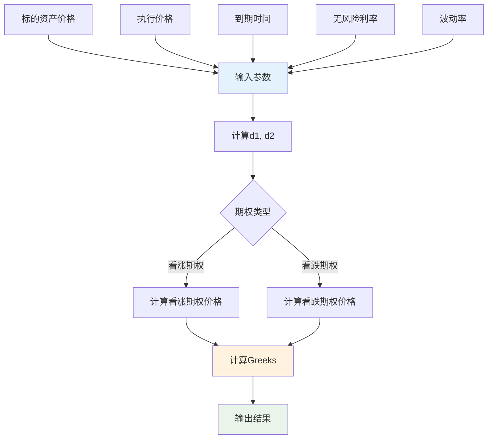
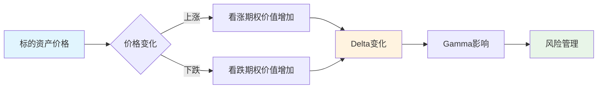
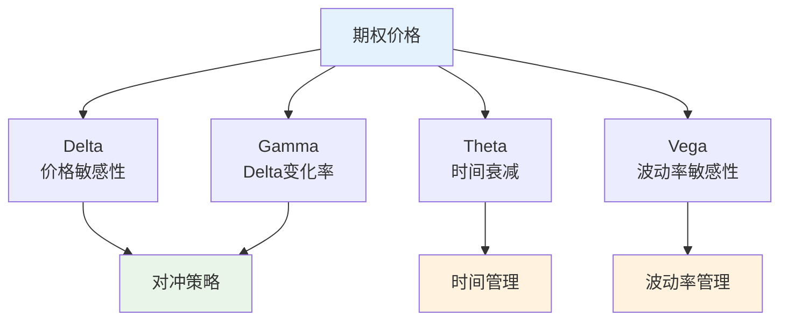

# 金融模型多表征示例 / Financial Models Multi-Representation Example

## 概述 / Overview

本文档展示金融模型的多表征实现，包括数学公式、代码实现、图表可视化和自然语言描述。

## 1. Black-Scholes期权定价模型 / Black-Scholes Option Pricing Model

### 1.1 数学表征 / Mathematical Representation

#### Black-Scholes偏微分方程 / Black-Scholes PDE

**偏微分方程**:
$$\frac{\partial V}{\partial t} + \frac{1}{2}\sigma^2 S^2 \frac{\partial^2 V}{\partial S^2} + rS \frac{\partial V}{\partial S} - rV = 0$$

其中：

- $V(S,t)$ 是期权价格
- $S$ 是标的资产价格
- $t$ 是时间
- $\sigma$ 是波动率
- $r$ 是无风险利率

#### 看涨期权定价公式 / Call Option Pricing Formula

**Black-Scholes公式**:
$$C(S,t) = SN(d_1) - Ke^{-r(T-t)}N(d_2)$$

其中：
$$d_1 = \frac{\ln(S/K) + (r + \frac{1}{2}\sigma^2)(T-t)}{\sigma\sqrt{T-t}}$$
$$d_2 = d_1 - \sigma\sqrt{T-t}$$

#### 看跌期权定价公式 / Put Option Pricing Formula

**看跌期权价格**:
$$P(S,t) = Ke^{-r(T-t)}N(-d_2) - SN(-d_1)$$

#### 希腊字母 / Greeks

**Delta**:
$$\Delta_C = \frac{\partial C}{\partial S} = N(d_1)$$
$$\Delta_P = \frac{\partial P}{\partial S} = N(d_1) - 1$$

**Gamma**:
$$\Gamma = \frac{\partial^2 V}{\partial S^2} = \frac{N'(d_1)}{S\sigma\sqrt{T-t}}$$

**Theta**:
$$\Theta = \frac{\partial V}{\partial t} = -\frac{S\sigma N'(d_1)}{2\sqrt{T-t}} - rKe^{-r(T-t)}N(d_2)$$

**Vega**:
$$\mathcal{V} = \frac{\partial V}{\partial \sigma} = S\sqrt{T-t}N'(d_1)$$

### 1.2 代码表征 / Code Representation

#### Rust实现 / Rust Implementation

```rust
use std::f64::consts::{PI, E};

#[derive(Debug, Clone)]
pub struct BlackScholes {
    pub spot_price: f64,
    pub strike_price: f64,
    pub time_to_maturity: f64,
    pub risk_free_rate: f64,
    pub volatility: f64,
}

impl BlackScholes {
    pub fn new(spot_price: f64, strike_price: f64, time_to_maturity: f64, 
               risk_free_rate: f64, volatility: f64) -> Self {
        Self {
            spot_price,
            strike_price,
            time_to_maturity,
            risk_free_rate,
            volatility,
        }
    }
    
    pub fn call_price(&self) -> f64 {
        let (d1, d2) = self.calculate_d1_d2();
        self.spot_price * self.normal_cdf(d1) - 
        self.strike_price * (-self.risk_free_rate * self.time_to_maturity).exp() * self.normal_cdf(d2)
    }
    
    pub fn put_price(&self) -> f64 {
        let (d1, d2) = self.calculate_d1_d2();
        self.strike_price * (-self.risk_free_rate * self.time_to_maturity).exp() * self.normal_cdf(-d2) -
        self.spot_price * self.normal_cdf(-d1)
    }
    
    fn calculate_d1_d2(&self) -> (f64, f64) {
        let d1 = (self.spot_price / self.strike_price).ln() + 
                 (self.risk_free_rate + 0.5 * self.volatility.powi(2)) * self.time_to_maturity;
        let d1 = d1 / (self.volatility * self.time_to_maturity.sqrt());
        let d2 = d1 - self.volatility * self.time_to_maturity.sqrt();
        (d1, d2)
    }
    
    pub fn delta_call(&self) -> f64 {
        let (d1, _) = self.calculate_d1_d2();
        self.normal_cdf(d1)
    }
    
    pub fn delta_put(&self) -> f64 {
        let (d1, _) = self.calculate_d1_d2();
        self.normal_cdf(d1) - 1.0
    }
    
    pub fn gamma(&self) -> f64 {
        let (d1, _) = self.calculate_d1_d2();
        self.normal_pdf(d1) / (self.spot_price * self.volatility * self.time_to_maturity.sqrt())
    }
    
    pub fn theta_call(&self) -> f64 {
        let (d1, d2) = self.calculate_d1_d2();
        let term1 = -self.spot_price * self.volatility * self.normal_pdf(d1) / 
                   (2.0 * self.time_to_maturity.sqrt());
        let term2 = -self.risk_free_rate * self.strike_price * 
                   (-self.risk_free_rate * self.time_to_maturity).exp() * self.normal_cdf(d2);
        term1 + term2
    }
    
    pub fn vega(&self) -> f64 {
        let (d1, _) = self.calculate_d1_d2();
        self.spot_price * self.time_to_maturity.sqrt() * self.normal_pdf(d1)
    }
    
    fn normal_cdf(&self, x: f64) -> f64 {
        0.5 * (1.0 + self.erf(x / 2.0_f64.sqrt()))
    }
    
    fn normal_pdf(&self, x: f64) -> f64 {
        (-0.5 * x.powi(2)).exp() / (2.0 * PI).sqrt()
    }
    
    fn erf(&self, x: f64) -> f64 {
        // 简化的误差函数近似
        let a1 = 0.254829592;
        let a2 = -0.284496736;
        let a3 = 1.421413741;
        let a4 = -1.453152027;
        let a5 = 1.061405429;
        let p = 0.3275911;
        
        let sign = if x < 0.0 { -1.0 } else { 1.0 };
        let x = x.abs();
        
        let t = 1.0 / (1.0 + p * x);
        let y = 1.0 - (((((a5 * t + a4) * t) + a3) * t + a2) * t + a1) * t * (-x.powi(2)).exp();
        
        sign * y
    }
}

// 使用示例
fn main() {
    let bs = BlackScholes::new(100.0, 100.0, 1.0, 0.05, 0.2);
    
    println!("Call Price: {:.4}", bs.call_price());
    println!("Put Price: {:.4}", bs.put_price());
    println!("Call Delta: {:.4}", bs.delta_call());
    println!("Put Delta: {:.4}", bs.delta_put());
    println!("Gamma: {:.4}", bs.gamma());
    println!("Call Theta: {:.4}", bs.theta_call());
    println!("Vega: {:.4}", bs.vega());
}
```

#### Haskell实现 / Haskell Implementation

```haskell
module BlackScholes where

import Data.Function (on)

-- Black-Scholes参数
data BlackScholes = BlackScholes {
    spotPrice :: Double,
    strikePrice :: Double,
    timeToMaturity :: Double,
    riskFreeRate :: Double,
    volatility :: Double
} deriving (Show)

-- 创建Black-Scholes实例
newBlackScholes :: Double -> Double -> Double -> Double -> Double -> BlackScholes
newBlackScholes spot strike time rate vol = BlackScholes {
    spotPrice = spot,
    strikePrice = strike,
    timeToMaturity = time,
    riskFreeRate = rate,
    volatility = vol
}

-- 计算d1和d2
calculateD1D2 :: BlackScholes -> (Double, Double)
calculateD1D2 bs = (d1, d2)
  where
    d1 = (log (spotPrice bs / strikePrice bs) + 
          (riskFreeRate bs + 0.5 * volatility bs ^ 2) * timeToMaturity bs) /
         (volatility bs * sqrt (timeToMaturity bs))
    d2 = d1 - volatility bs * sqrt (timeToMaturity bs)

-- 标准正态分布CDF
normalCDF :: Double -> Double
normalCDF x = 0.5 * (1 + erf (x / sqrt 2))

-- 标准正态分布PDF
normalPDF :: Double -> Double
normalPDF x = exp (-0.5 * x ^ 2) / sqrt (2 * pi)

-- 误差函数近似
erf :: Double -> Double
erf x = sign * y
  where
    sign = if x < 0 then -1 else 1
    x' = abs x
    t = 1 / (1 + 0.3275911 * x')
    y = 1 - (((((1.061405429 * t + (-1.453152027)) * t + 1.421413741) * t + 
               (-0.284496736)) * t + 0.254829592) * t) * exp (-x' ^ 2)

-- 看涨期权价格
callPrice :: BlackScholes -> Double
callPrice bs = spotPrice bs * normalCDF d1 - 
               strikePrice bs * exp (-riskFreeRate bs * timeToMaturity bs) * normalCDF d2
  where
    (d1, d2) = calculateD1D2 bs

-- 看跌期权价格
putPrice :: BlackScholes -> Double
putPrice bs = strikePrice bs * exp (-riskFreeRate bs * timeToMaturity bs) * normalCDF (-d2) -
              spotPrice bs * normalCDF (-d1)
  where
    (d1, d2) = calculateD1D2 bs

-- Delta (看涨期权)
deltaCall :: BlackScholes -> Double
deltaCall bs = normalCDF d1
  where
    (d1, _) = calculateD1D2 bs

-- Delta (看跌期权)
deltaPut :: BlackScholes -> Double
deltaPut bs = normalCDF d1 - 1
  where
    (d1, _) = calculateD1D2 bs

-- Gamma
gamma :: BlackScholes -> Double
gamma bs = normalPDF d1 / (spotPrice bs * volatility bs * sqrt (timeToMaturity bs))
  where
    (d1, _) = calculateD1D2 bs

-- Theta (看涨期权)
thetaCall :: BlackScholes -> Double
thetaCall bs = term1 + term2
  where
    (d1, d2) = calculateD1D2 bs
    term1 = -spotPrice bs * volatility bs * normalPDF d1 / (2 * sqrt (timeToMaturity bs))
    term2 = -riskFreeRate bs * strikePrice bs * exp (-riskFreeRate bs * timeToMaturity bs) * normalCDF d2

-- Vega
vega :: BlackScholes -> Double
vega bs = spotPrice bs * sqrt (timeToMaturity bs) * normalPDF d1
  where
    (d1, _) = calculateD1D2 bs

-- 示例使用
example :: IO ()
example = do
    let bs = newBlackScholes 100 100 1 0.05 0.2
    
    putStrLn $ "Call Price: " ++ show (callPrice bs)
    putStrLn $ "Put Price: " ++ show (putPrice bs)
    putStrLn $ "Call Delta: " ++ show (deltaCall bs)
    putStrLn $ "Put Delta: " ++ show (deltaPut bs)
    putStrLn $ "Gamma: " ++ show (gamma bs)
    putStrLn $ "Call Theta: " ++ show (thetaCall bs)
    putStrLn $ "Vega: " ++ show (vega bs)
```

#### Python实现 / Python Implementation

```python
import numpy as np
import matplotlib.pyplot as plt
from dataclasses import dataclass
from typing import Tuple
from scipy.stats import norm

@dataclass
class BlackScholes:
    """Black-Scholes期权定价模型"""
    spot_price: float
    strike_price: float
    time_to_maturity: float
    risk_free_rate: float
    volatility: float
    
    def calculate_d1_d2(self) -> Tuple[float, float]:
        """计算d1和d2"""
        d1 = (np.log(self.spot_price / self.strike_price) + 
              (self.risk_free_rate + 0.5 * self.volatility ** 2) * self.time_to_maturity) / \
             (self.volatility * np.sqrt(self.time_to_maturity))
        d2 = d1 - self.volatility * np.sqrt(self.time_to_maturity)
        return d1, d2
    
    def call_price(self) -> float:
        """计算看涨期权价格"""
        d1, d2 = self.calculate_d1_d2()
        return (self.spot_price * norm.cdf(d1) - 
                self.strike_price * np.exp(-self.risk_free_rate * self.time_to_maturity) * norm.cdf(d2))
    
    def put_price(self) -> float:
        """计算看跌期权价格"""
        d1, d2 = self.calculate_d1_d2()
        return (self.strike_price * np.exp(-self.risk_free_rate * self.time_to_maturity) * norm.cdf(-d2) -
                self.spot_price * norm.cdf(-d1))
    
    def delta_call(self) -> float:
        """计算看涨期权Delta"""
        d1, _ = self.calculate_d1_d2()
        return norm.cdf(d1)
    
    def delta_put(self) -> float:
        """计算看跌期权Delta"""
        d1, _ = self.calculate_d1_d2()
        return norm.cdf(d1) - 1
    
    def gamma(self) -> float:
        """计算Gamma"""
        d1, _ = self.calculate_d1_d2()
        return norm.pdf(d1) / (self.spot_price * self.volatility * np.sqrt(self.time_to_maturity))
    
    def theta_call(self) -> float:
        """计算看涨期权Theta"""
        d1, d2 = self.calculate_d1_d2()
        term1 = -self.spot_price * self.volatility * norm.pdf(d1) / (2 * np.sqrt(self.time_to_maturity))
        term2 = -self.risk_free_rate * self.strike_price * np.exp(-self.risk_free_rate * self.time_to_maturity) * norm.cdf(d2)
        return term1 + term2
    
    def vega(self) -> float:
        """计算Vega"""
        d1, _ = self.calculate_d1_d2()
        return self.spot_price * np.sqrt(self.time_to_maturity) * norm.pdf(d1)

def demo_black_scholes():
    """演示Black-Scholes模型"""
    # 创建Black-Scholes实例
    bs = BlackScholes(spot_price=100, strike_price=100, time_to_maturity=1, 
                     risk_free_rate=0.05, volatility=0.2)
    
    print(f"Call Price: {bs.call_price():.4f}")
    print(f"Put Price: {bs.put_price():.4f}")
    print(f"Call Delta: {bs.delta_call():.4f}")
    print(f"Put Delta: {bs.delta_put():.4f}")
    print(f"Gamma: {bs.gamma():.4f}")
    print(f"Call Theta: {bs.theta_call():.4f}")
    print(f"Vega: {bs.vega():.4f}")
    
    # 绘制期权价格随标的资产价格的变化
    spot_prices = np.linspace(80, 120, 100)
    call_prices = []
    put_prices = []
    
    for spot in spot_prices:
        bs_temp = BlackScholes(spot, 100, 1, 0.05, 0.2)
        call_prices.append(bs_temp.call_price())
        put_prices.append(bs_temp.put_price())
    
    plt.figure(figsize=(12, 8))
    
    plt.subplot(2, 2, 1)
    plt.plot(spot_prices, call_prices, 'b-', label='Call Option')
    plt.plot(spot_prices, put_prices, 'r-', label='Put Option')
    plt.xlabel('Spot Price')
    plt.ylabel('Option Price')
    plt.title('Option Prices vs Spot Price')
    plt.legend()
    plt.grid(True)
    
    # 绘制Greeks
    deltas_call = []
    deltas_put = []
    gammas = []
    
    for spot in spot_prices:
        bs_temp = BlackScholes(spot, 100, 1, 0.05, 0.2)
        deltas_call.append(bs_temp.delta_call())
        deltas_put.append(bs_temp.delta_put())
        gammas.append(bs_temp.gamma())
    
    plt.subplot(2, 2, 2)
    plt.plot(spot_prices, deltas_call, 'b-', label='Call Delta')
    plt.plot(spot_prices, deltas_put, 'r-', label='Put Delta')
    plt.xlabel('Spot Price')
    plt.ylabel('Delta')
    plt.title('Delta vs Spot Price')
    plt.legend()
    plt.grid(True)
    
    plt.subplot(2, 2, 3)
    plt.plot(spot_prices, gammas, 'g-', label='Gamma')
    plt.xlabel('Spot Price')
    plt.ylabel('Gamma')
    plt.title('Gamma vs Spot Price')
    plt.legend()
    plt.grid(True)
    
    plt.tight_layout()
    plt.show()

if __name__ == "__main__":
    demo_black_scholes()
```

### 1.3 图表表征 / Visual Representation

#### Black-Scholes模型流程图 / Black-Scholes Model Flow Diagram



#### 期权价格变化图 / Option Price Change Diagram



#### Greeks关系图 / Greeks Relationship Diagram



### 1.4 自然语言表征 / Natural Language Representation

#### 中文描述 / Chinese Description

**Black-Scholes期权定价模型**是现代金融理论的重要基石，具有以下核心特征：

**基本假设**:

- 标的资产价格遵循几何布朗运动
- 无风险利率恒定
- 市场无摩擦，无交易成本
- 标的资产不支付股息

**核心公式**:

- 看涨期权价格由标的资产价格、执行价格、到期时间、无风险利率和波动率决定
- 通过偏微分方程描述期权价格的变化规律
- 提供精确的期权定价方法

**风险管理**:

- **Delta**: 衡量期权价格对标的资产价格变化的敏感性
- **Gamma**: 衡量Delta的变化率，用于动态对冲
- **Theta**: 衡量时间衰减对期权价值的影响
- **Vega**: 衡量波动率变化对期权价值的影响

**应用领域**:

- 期权定价和交易
- 风险管理
- 投资组合管理
- 金融衍生品设计

#### 英文描述 / English Description

**The Black-Scholes option pricing model** is a cornerstone of modern financial theory with the following core features:

**Basic Assumptions**:

- Underlying asset price follows geometric Brownian motion
- Risk-free rate is constant
- Market is frictionless with no transaction costs
- Underlying asset pays no dividends

**Core Formula**:

- Call option price is determined by spot price, strike price, time to maturity, risk-free rate, and volatility
- Option price changes are described by partial differential equations
- Provides precise option pricing methodology

**Risk Management**:

- **Delta**: Measures sensitivity of option price to underlying asset price changes
- **Gamma**: Measures rate of change of Delta, used for dynamic hedging
- **Theta**: Measures time decay impact on option value
- **Vega**: Measures volatility change impact on option value

**Applications**:

- Option pricing and trading
- Risk management
- Portfolio management
- Financial derivative design

## 2. 投资组合优化模型 / Portfolio Optimization Model

### 2.1 数学表征 / Mathematical Representation

#### 投资组合收益 / Portfolio Return

**期望收益**:
$$E[R_p] = \sum_{i=1}^{n} w_i E[R_i]$$

**投资组合方差**:
$$\sigma_p^2 = \sum_{i=1}^{n} \sum_{j=1}^{n} w_i w_j \sigma_{ij}$$

其中：

- $w_i$ 是资产 $i$ 的权重
- $E[R_i]$ 是资产 $i$ 的期望收益
- $\sigma_{ij}$ 是资产 $i$ 和 $j$ 的协方差

#### 夏普比率 / Sharpe Ratio

**夏普比率**:
$$SR = \frac{E[R_p] - R_f}{\sigma_p}$$

其中 $R_f$ 是无风险利率。

#### 有效前沿 / Efficient Frontier

**优化问题**:
$$\min_w \frac{1}{2}w^T \Sigma w$$
$$s.t. \quad w^T \mu = \mu_p$$
$$w^T \mathbf{1} = 1$$
$$w \geq 0$$

### 2.2 代码表征 / Code Representation

```rust
use nalgebra::{DMatrix, DVector};

#[derive(Debug)]
pub struct Portfolio {
    pub weights: Vec<f64>,
    pub returns: Vec<f64>,
    pub covariance: DMatrix<f64>,
}

impl Portfolio {
    pub fn new(weights: Vec<f64>, returns: Vec<f64>, covariance: DMatrix<f64>) -> Self {
        Self {
            weights,
            returns,
            covariance,
        }
    }
    
    pub fn expected_return(&self) -> f64 {
        self.weights.iter()
            .zip(&self.returns)
            .map(|(w, r)| w * r)
            .sum()
    }
    
    pub fn variance(&self) -> f64 {
        let w = DVector::from_vec(self.weights.clone());
        (w.transpose() * &self.covariance * &w)[0]
    }
    
    pub fn volatility(&self) -> f64 {
        self.variance().sqrt()
    }
    
    pub fn sharpe_ratio(&self, risk_free_rate: f64) -> f64 {
        (self.expected_return() - risk_free_rate) / self.volatility()
    }
}

#[derive(Debug)]
pub struct PortfolioOptimizer {
    pub returns: Vec<f64>,
    pub covariance: DMatrix<f64>,
    pub risk_free_rate: f64,
}

impl PortfolioOptimizer {
    pub fn new(returns: Vec<f64>, covariance: DMatrix<f64>, risk_free_rate: f64) -> Self {
        Self {
            returns,
            covariance,
            risk_free_rate,
        }
    }
    
    pub fn optimize(&self) -> Vec<f64> {
        // 简化的优化算法（实际应用中应使用专业的优化库）
        let n_assets = self.returns.len();
        let mut weights = vec![1.0 / n_assets as f64; n_assets];
        
        // 简单的梯度下降优化
        let learning_rate = 0.01;
        let iterations = 1000;
        
        for _ in 0..iterations {
            let gradients = self.compute_gradients(&weights);
            
            for i in 0..n_assets {
                weights[i] -= learning_rate * gradients[i];
            }
            
            // 归一化权重
            let sum: f64 = weights.iter().sum();
            for weight in &mut weights {
                *weight /= sum;
            }
        }
        
        weights
    }
    
    fn compute_gradients(&self, weights: &[f64]) -> Vec<f64> {
        let n_assets = weights.len();
        let mut gradients = vec![0.0; n_assets];
        
        // 计算方差对权重的梯度
        for i in 0..n_assets {
            for j in 0..n_assets {
                gradients[i] += weights[j] * self.covariance[(i, j)];
            }
        }
        
        gradients
    }
}

// 使用示例
fn main() {
    // 创建示例数据
    let returns = vec![0.08, 0.12, 0.15];
    let covariance = DMatrix::from_row_slice(3, 3, &[
        0.04, 0.01, 0.02,
        0.01, 0.09, 0.03,
        0.02, 0.03, 0.16,
    ]);
    
    let optimizer = PortfolioOptimizer::new(returns.clone(), covariance.clone(), 0.03);
    let optimal_weights = optimizer.optimize();
    
    let portfolio = Portfolio::new(optimal_weights, returns, covariance);
    
    println!("Optimal Weights: {:?}", portfolio.weights);
    println!("Expected Return: {:.4}", portfolio.expected_return());
    println!("Volatility: {:.4}", portfolio.volatility());
    println!("Sharpe Ratio: {:.4}", portfolio.sharpe_ratio(0.03));
}
```

---

*最后更新: 2025-08-01*
*版本: 1.0.0*
