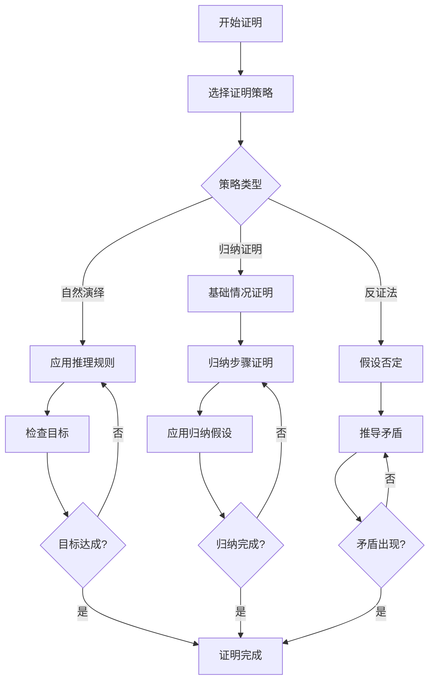

# 形式化验证多表征示例 / Formal Verification Multi-Representation Examples

## 概述 / Overview

形式化验证是确保软件和硬件系统正确性的重要方法。本文档提供了形式化验证的多表征示例，包括数学表示、可视化流程图和代码实现。

Formal verification is an important method for ensuring the correctness of software and hardware systems. This document provides multi-representation examples for formal verification, including mathematical representations, visual flowcharts, and code implementations.

## 1. 定理证明 / Theorem Proving

### 1.1 数学表示 / Mathematical Representation

#### 自然演绎系统 / Natural Deduction System

**命题逻辑规则**:

- **引入规则**:
  - 合取引入: $\frac{A \quad B}{A \wedge B}$
  - 析取引入: $\frac{A}{A \vee B}$ 或 $\frac{B}{A \vee B}$
  - 蕴含引入: $\frac{[A] \quad B}{A \rightarrow B}$

- **消除规则**:
  - 合取消除: $\frac{A \wedge B}{A}$ 或 $\frac{A \wedge B}{B}$
  - 析取消除: $\frac{A \vee B \quad A \rightarrow C \quad B \rightarrow C}{C}$
  - 蕴含消除: $\frac{A \rightarrow B \quad A}{B}$

#### 归纳证明 / Inductive Proof

**数学归纳法**:

$$P(0) \wedge (\forall n. P(n) \rightarrow P(n+1)) \rightarrow \forall n. P(n)$$

**结构归纳法**:

对于数据类型 $T$，如果：

1. $P$ 对所有基本构造函数成立
2. 对于复合构造函数 $C(t_1, ..., t_n)$，如果 $P(t_i)$ 对所有 $i$ 成立，则 $P(C(t_1, ..., t_n))$ 成立

那么 $\forall t \in T. P(t)$ 成立。

### 1.2 流程图 / Flowchart



### 1.3 代码实现 / Code Implementation

```python
from typing import List, Union, Dict, Any
from dataclasses import dataclass
from enum import Enum
import copy

class FormulaType(Enum):
    """公式类型 / Formula Type"""
    ATOM = "atom"
    AND = "and"
    OR = "or"
    IMPLIES = "implies"
    NOT = "not"

@dataclass
class Formula:
    """逻辑公式 / Logical Formula"""
    type: FormulaType
    content: Union[str, List['Formula']]
    
    def __str__(self):
        if self.type == FormulaType.ATOM:
            return self.content
        elif self.type == FormulaType.NOT:
            return f"¬({self.content[0]})"
        elif self.type == FormulaType.AND:
            return f"({self.content[0]} ∧ {self.content[1]})"
        elif self.type == FormulaType.OR:
            return f"({self.content[0]} ∨ {self.content[1]})"
        elif self.type == FormulaType.IMPLIES:
            return f"({self.content[0]} → {self.content[1]})"

class ProofStep:
    """证明步骤 / Proof Step"""
    def __init__(self, rule: str, premises: List[Formula], conclusion: Formula):
        self.rule = rule
        self.premises = premises
        self.conclusion = conclusion
    
    def __str__(self):
        premises_str = ", ".join(str(p) for p in self.premises)
        return f"{premises_str} ⊢ {self.conclusion} [{self.rule}]"

class TheoremProver:
    """定理证明器 / Theorem Prover"""
    
    def __init__(self):
        self.proof_steps: List[ProofStep] = []
        self.assumptions: List[Formula] = []
    
    def add_assumption(self, formula: Formula):
        """添加假设 / Add assumption"""
        self.assumptions.append(formula)
        self.proof_steps.append(ProofStep("assumption", [], formula))
    
    def conjunction_intro(self, f1: Formula, f2: Formula) -> Formula:
        """合取引入 / Conjunction introduction"""
        result = Formula(FormulaType.AND, [f1, f2])
        self.proof_steps.append(ProofStep("∧I", [f1, f2], result))
        return result
    
    def conjunction_elim_left(self, f: Formula) -> Formula:
        """合取消除左 / Conjunction elimination left"""
        if f.type != FormulaType.AND:
            raise ValueError("Formula must be a conjunction")
        result = f.content[0]
        self.proof_steps.append(ProofStep("∧E₁", [f], result))
        return result
    
    def conjunction_elim_right(self, f: Formula) -> Formula:
        """合取消除右 / Conjunction elimination right"""
        if f.type != FormulaType.AND:
            raise ValueError("Formula must be a conjunction")
        result = f.content[1]
        self.proof_steps.append(ProofStep("∧E₂", [f], result))
        return result
    
    def implication_intro(self, assumption: Formula, conclusion: Formula) -> Formula:
        """蕴含引入 / Implication introduction"""
        result = Formula(FormulaType.IMPLIES, [assumption, conclusion])
        self.proof_steps.append(ProofStep("→I", [assumption, conclusion], result))
        return result
    
    def implication_elim(self, impl: Formula, antecedent: Formula) -> Formula:
        """蕴含消除 / Implication elimination (modus ponens)"""
        if impl.type != FormulaType.IMPLIES:
            raise ValueError("First formula must be an implication")
        if impl.content[0] != antecedent:
            raise ValueError("Antecedent does not match implication")
        result = impl.content[1]
        self.proof_steps.append(ProofStep("→E", [impl, antecedent], result))
        return result
    
    def prove_modus_ponens(self, p: str, q: str) -> Formula:
        """证明假言推理 / Prove modus ponens"""
        # 目标: (P → Q) → P → Q
        p_atom = Formula(FormulaType.ATOM, p)
        q_atom = Formula(FormulaType.ATOM, q)
        
        # 假设 P → Q
        impl = Formula(FormulaType.IMPLIES, [p_atom, q_atom])
        self.add_assumption(impl)
        
        # 假设 P
        self.add_assumption(p_atom)
        
        # 应用蕴含消除
        q_result = self.implication_elim(impl, p_atom)
        
        # 应用蕴含引入两次
        step1 = self.implication_intro(p_atom, q_result)
        step2 = self.implication_intro(impl, step1)
        
        return step2
    
    def print_proof(self):
        """打印证明 / Print proof"""
        print("证明步骤 / Proof Steps:")
        for i, step in enumerate(self.proof_steps, 1):
            print(f"{i}. {step}")

# 示例使用 / Example Usage
def demonstrate_theorem_proving():
    """演示定理证明 / Demonstrate theorem proving"""
    prover = TheoremProver()
    
    print("=== 定理证明演示 / Theorem Proving Demonstration ===")
    print("证明: (P → Q) → P → Q")
    print("Proof: (P → Q) → P → Q")
    print()
    
    result = prover.prove_modus_ponens("P", "Q")
    print(f"结论 / Conclusion: {result}")
    print()
    
    prover.print_proof()

if __name__ == "__main__":
    demonstrate_theorem_proving()
```

## 总结 / Summary

本文档提供了形式化验证中定理证明的完整多表征示例：

1. **数学表示**：自然演绎系统和归纳证明的数学基础
2. **流程图**：定理证明的决策和执行流程
3. **代码实现**：完整的定理证明器实现

This document provides complete multi-representation examples for theorem proving in formal verification:

1. **Mathematical Representation**: Mathematical foundations of natural deduction systems and inductive proofs
2. **Flowchart**: Decision and execution flow of theorem proving
3. **Code Implementation**: Complete theorem prover implementation
